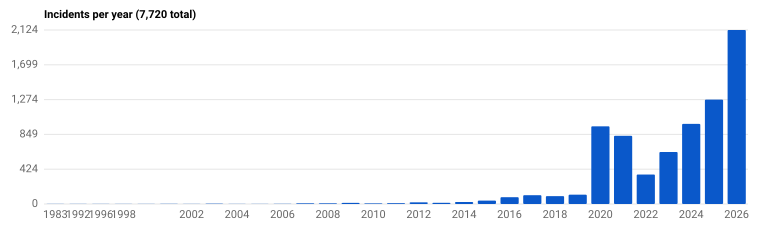
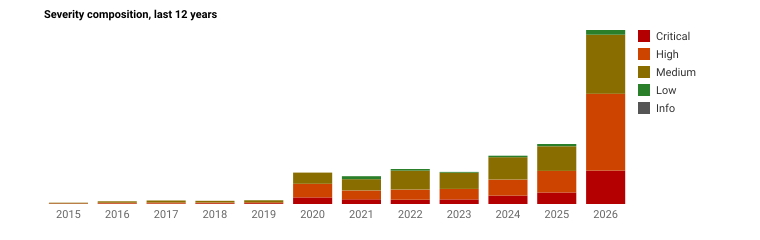
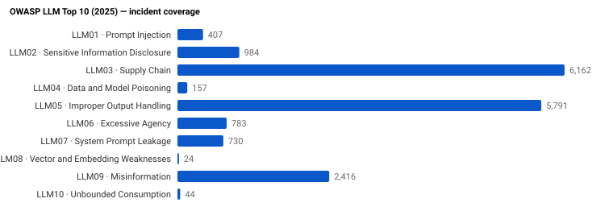
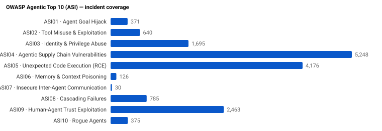

# GenAI & Agentic AI Security Incidents

Single source of truth for GenAI and agentic AI security incidents.
Each entry is mapped to **OWASP LLM Top 10 (2025)**, **OWASP Agentic Top 10 (ASI)**, **NIST AI RMF**, and **MITRE ATLAS**.

- **Version:** 2.1.0
- **Generated:** 2026-06-10
- **Total incidents:** **8,170**
- **Date range:** 1983 – 2026
- **With CVE:** 1,655
- **Machine-readable:** [`data/incidents.json`](data/incidents.json) · [`data/incidents.min.json`](data/incidents.min.json)
- **Schema:** [`schema/incident.schema.json`](schema/incident.schema.json)

> Sorted newest-first. Click any `INC-*****` to open the year's detail shard. Use **Ctrl/Cmd-F** to filter by vendor, CVE, OWASP code, or year.

## Trends

Auto-generated from the current dataset. SVGs live under [`docs/charts/`](docs/charts/).

## Coverage

### Severity

| Severity | Count |
|---|---:|
| Critical | 1,585 |
| High | 3,129 |
| Medium | 3,320 |
| Low | 136 |

### Incidents per Year

| Year | Count | Details |
|---|---:|---|
| 2026 | 2,540 | [docs/incidents/2026.md](docs/incidents/2026.md) |
| 2025 | 1,279 | [docs/incidents/2025.md](docs/incidents/2025.md) |
| 2024 | 988 | [docs/incidents/2024.md](docs/incidents/2024.md) |
| 2023 | 640 | [docs/incidents/2023.md](docs/incidents/2023.md) |
| 2022 | 362 | [docs/incidents/2022.md](docs/incidents/2022.md) |
| 2021 | 837 | [docs/incidents/2021.md](docs/incidents/2021.md) |
| 2020 | 955 | [docs/incidents/2020.md](docs/incidents/2020.md) |
| 2019 | 115 | [docs/incidents/2019.md](docs/incidents/2019.md) |
| 2018 | 96 | [docs/incidents/2018.md](docs/incidents/2018.md) |
| 2017 | 107 | [docs/incidents/2017.md](docs/incidents/2017.md) |
| 2016 | 83 | [docs/incidents/2016.md](docs/incidents/2016.md) |
| 2015 | 42 | [docs/incidents/2015.md](docs/incidents/2015.md) |
| 2014 | 25 | [docs/incidents/2014.md](docs/incidents/2014.md) |
| 2013 | 15 | [docs/incidents/2013.md](docs/incidents/2013.md) |
| 2012 | 21 | [docs/incidents/2012.md](docs/incidents/2012.md) |
| 2011 | 11 | [docs/incidents/2011.md](docs/incidents/2011.md) |
| 2010 | 7 | [docs/incidents/2010.md](docs/incidents/2010.md) |
| 2009 | 13 | [docs/incidents/2009.md](docs/incidents/2009.md) |
| 2008 | 8 | [docs/incidents/2008.md](docs/incidents/2008.md) |
| 2007 | 9 | [docs/incidents/2007.md](docs/incidents/2007.md) |
| 2006 | 3 | [docs/incidents/2006.md](docs/incidents/2006.md) |
| 2005 | 1 | [docs/incidents/2005.md](docs/incidents/2005.md) |
| 2004 | 1 | [docs/incidents/2004.md](docs/incidents/2004.md) |
| 2003 | 4 | [docs/incidents/2003.md](docs/incidents/2003.md) |
| 2002 | 1 | [docs/incidents/2002.md](docs/incidents/2002.md) |
| 2001 | 2 | [docs/incidents/2001.md](docs/incidents/2001.md) |
| 1999 | 1 | [docs/incidents/1999.md](docs/incidents/1999.md) |
| 1998 | 1 | [docs/incidents/1998.md](docs/incidents/1998.md) |
| 1996 | 1 | [docs/incidents/1996.md](docs/incidents/1996.md) |
| 1992 | 1 | [docs/incidents/1992.md](docs/incidents/1992.md) |
| 1983 | 1 | [docs/incidents/1983.md](docs/incidents/1983.md) |

### OWASP LLM Top 10 (2025)

| Code | Name | Count |
|---|---|---:|
| LLM01 | Prompt Injection | 382 |
| LLM02 | Sensitive Information Disclosure | 820 |
| LLM03 | Supply Chain | 1,949 |
| LLM04 | Data and Model Poisoning | 127 |
| LLM05 | Improper Output Handling | 3,319 |
| LLM06 | Excessive Agency | 774 |
| LLM07 | System Prompt Leakage | 727 |
| LLM08 | Vector and Embedding Weaknesses | 25 |
| LLM09 | Misinformation | 2,201 |
| LLM10 | Unbounded Consumption | 49 |

### OWASP Agentic Top 10 (ASI)

| Code | Name | Count |
|---|---|---:|
| ASI01 | Agent Goal Hijack | 354 |
| ASI02 | Tool Misuse & Exploitation | 523 |
| ASI03 | Identity & Privilege Abuse | 845 |
| ASI04 | Agentic Supply Chain Vulnerabilities | 1,768 |
| ASI05 | Unexpected Code Execution (RCE) | 2,328 |
| ASI06 | Memory & Context Poisoning | 126 |
| ASI07 | Insecure Inter-Agent Communication | 30 |
| ASI08 | Cascading Failures | 787 |
| ASI09 | Human-Agent Trust Exploitation | 2,463 |
| ASI10 | Rogue Agents | 375 |

### Top MITRE ATLAS Techniques

| Technique | Count |
|---|---:|
| `AML.T0050` | 3,424 |
| `AML.T0048.003` | 2,463 |
| `AML.T0058` | 2,201 |
| `AML.T0010` | 1,992 |
| `AML.T0048` | 1,817 |
| `AML.T0053` | 1,165 |
| `AML.T0012` | 845 |
| `AML.T0057` | 824 |
| `AML.T0056` | 727 |
| `AML.T0051` | 446 |
| `AML.T0024` | 176 |
| `AML.T0049` | 175 |
| `AML.T0066` | 138 |
| `AML.T0020` | 132 |
| `AML.T0011` | 103 |

## Incidents

All **8,170** incidents in a single table, newest-first. Each `INC-*****` link opens that year's detail shard. Severity is the maximum reported across sources for that incident.

| # | Date | ID | Title | Severity | OWASP LLM | OWASP ASI | CVEs |
|---:|---|---|---|---|---|---|---|
| 1 | 2026-08 | [`INC-00857`](docs/incidents/2026.md#inc-00857) | Copirate 365 DEF CON: Plundering Microsoft Copilot (CVE-2026-24299) | Critical | LLM01, LLM02 | ASI02, ASI09 |  |
| 2 | 2026-06-08 | [`INC-08148`](docs/incidents/2026.md#inc-08148) | AI Chatbots Falsely Pose as Licensed Doctors in Pennsylvania | High | LLM05, LLM09 | ASI05, ASI09 |  |
| 3 | 2026-06-08 | [`INC-08149`](docs/incidents/2026.md#inc-08149) | AI Drowning Detection System Fails at Taipei Sports Center, Leading to Fatality | Critical |  |  |  |
| 4 | 2026-06-08 | [`INC-08160`](docs/incidents/2026.md#inc-08160) | AI-Driven Job Losses Reshape Global Media Industry | High | LLM05 | ASI05 |  |
| 5 | 2026-06-08 | [`INC-08156`](docs/incidents/2026.md#inc-08156) | AI-Generated Fake Video of Lebanese Prime Minister Causes Misinformation | High | LLM05, LLM09 | ASI05, ASI09 |  |
| 6 | 2026-06-08 | [`INC-08151`](docs/incidents/2026.md#inc-08151) | AI-Powered Surveillance Breaches Lead to Security Risks and Assassinations | Critical | LLM05 | ASI05 |  |
| 7 | 2026-06-08 | [`INC-08152`](docs/incidents/2026.md#inc-08152) | Airbus Unveils U145: Autonomous AI Helicopter for Civil and Military Use | Critical |  |  |  |
| 8 | 2026-06-08 | [`INC-08161`](docs/incidents/2026.md#inc-08161) | China Cracks Down on AI-Generated Military Misinformation | High | LLM05, LLM09 | ASI05 |  |
| 9 | 2026-06-08 | [`INC-08150`](docs/incidents/2026.md#inc-08150) | Delhi Man Arrested for AI-Generated Image Blackmail Scheme | High |  |  |  |
| 10 | 2026-06-08 | [`INC-08155`](docs/incidents/2026.md#inc-08155) | Harari Warns of Risks in Milei's Proposal to Grant Legal Personhood to AI Entities | Medium |  |  |  |
| 11 | 2026-06-08 | [`INC-08147`](docs/incidents/2026.md#inc-08147) | Largan Precision Accused of Unauthorized Use of AI Image Inspection Software | High | LLM05 | ASI05 |  |
| 12 | 2026-06-08 | [`INC-08153`](docs/incidents/2026.md#inc-08153) | Meta AI Suicide Alert Enables Police to Prevent Suicide in Meerut | Critical | LLM05 | ASI09 |  |
| 13 | 2026-06-08 | [`INC-08157`](docs/incidents/2026.md#inc-08157) | Over Half of Custom ChatGPT Assistants Violate OpenAI Policies, Study Finds | High | LLM09 | ASI09 |  |
| 14 | 2026-06-08 | [`INC-08146`](docs/incidents/2026.md#inc-08146) | SWM.AI and Lenovo Collaborate on Advanced Robo-Taxi AI Platform in Seoul | High | LLM05 | ASI05 |  |
| 15 | 2026-06-08 | [`INC-08154`](docs/incidents/2026.md#inc-08154) | Uber and Wayve Prepare to Launch AI-Powered Robotaxis in London | High | LLM05 | ASI05 |  |
| 16 | 2026-06-08 | [`INC-08159`](docs/incidents/2026.md#inc-08159) | Ukraine Deploys AI-Powered Autonomous Drones to Intercept Russian Shahed UAVs | Critical | LLM05 | ASI05, ASI10 |  |
| 17 | 2026-06-08 | [`INC-08158`](docs/incidents/2026.md#inc-08158) | US Musicians' Union Sues Major Labels Over Uncompensated AI Licensing | High |  |  |  |
| 18 | 2026-06-07 | [`INC-08137`](docs/incidents/2026.md#inc-08137) | AI Data Centers Drive Global Freshwater Depletion | High | LLM05 | ASI05 |  |
| 19 | 2026-06-07 | [`INC-08135`](docs/incidents/2026.md#inc-08135) | AI-Assisted Copyright Infringement in Vietnamese Fashion Industry | High | LLM05 | ASI05 |  |
| 20 | 2026-06-07 | [`INC-08134`](docs/incidents/2026.md#inc-08134) | AI-Driven Cyberattacks Surge in Taiwan, Semiconductor Sector Hit Hard | Critical | LLM02 | ASI03, ASI05, ASI10 |  |
| 21 | 2026-06-07 | [`INC-08140`](docs/incidents/2026.md#inc-08140) | AI-Driven Misinformation Campaigns Target Bangladeshi Celebrities | Medium | LLM09 | ASI09 |  |
| 22 | 2026-06-07 | [`INC-08143`](docs/incidents/2026.md#inc-08143) | AI-Generated Evidence Fuels Record Insurance Fraud at Aviva | Medium | LLM09 | ASI09 |  |
| 23 | 2026-06-07 | [`INC-08142`](docs/incidents/2026.md#inc-08142) | AI-Generated Misinformation Causes Social Disruption and Legal Action in China | High | LLM05, LLM09 | ASI05 |  |
| 24 | 2026-06-07 | [`INC-08145`](docs/incidents/2026.md#inc-08145) | Anthropic's Claude Mythos AI Raises Global Cybersecurity Risks | High |  |  |  |
| 25 | 2026-06-07 | [`INC-08136`](docs/incidents/2026.md#inc-08136) | Banks Implement AI, Leading to Job Cuts and Workforce Restructuring | High | LLM05 | ASI05 |  |
| 26 | 2026-06-07 | [`INC-08141`](docs/incidents/2026.md#inc-08141) | China Approves World's First Commercial Brain-Computer Interface Implant | High |  |  |  |
| 27 | 2026-06-07 | [`INC-08144`](docs/incidents/2026.md#inc-08144) | China Warns of Data and Security Risks from Unregulated AI Relay Stations | Critical |  |  |  |
| 28 | 2026-06-07 | [`INC-08138`](docs/incidents/2026.md#inc-08138) | SoftBank CEO Predicts Superintelligent AI Within Two Years, Urges Governance | High | LLM05 | ASI05 |  |
| 29 | 2026-06-07 | [`INC-08139`](docs/incidents/2026.md#inc-08139) | South Korea Launches AI-Powered Robotic Endoscope Development Project | Medium |  |  |  |
| 30 | 2026-06-06 | [`INC-08132`](docs/incidents/2026.md#inc-08132) | AI Medical Assistants Show High Error Rate in Health Advice, Raising Patient Safety Concerns | High | LLM05 | ASI05 |  |
| 31 | 2026-06-06 | [`INC-08133`](docs/incidents/2026.md#inc-08133) | AI Robots Cause Harm and Raise Rights Concerns in China and Beyond | High | LLM05 | ASI05 |  |
| 32 | 2026-06-06 | [`INC-08127`](docs/incidents/2026.md#inc-08127) | AI Smart Glasses Used for Covert Recording Spark Privacy Scandal in China | Medium |  |  |  |
| 33 | 2026-06-06 | [`INC-08126`](docs/incidents/2026.md#inc-08126) | AI Uncovers Critical Zcash Vulnerability, Triggers Market Turmoil | Medium |  |  |  |
| 34 | 2026-06-06 | [`INC-08128`](docs/incidents/2026.md#inc-08128) | AI Used to Create Child Pornography from Photos of Minors in Santander | High | LLM05 | ASI05 |  |
| 35 | 2026-06-06 | [`INC-08125`](docs/incidents/2026.md#inc-08125) | AI-Generated Nude Images of Women Distributed on Telegram in Novara | High | LLM09 |  |  |
| 36 | 2026-06-06 | [`INC-08123`](docs/incidents/2026.md#inc-08123) | AI-Powered Retinal Implant Restores Partial Vision in Blind Patient in China | Medium |  |  |  |
| 37 | 2026-06-06 | [`INC-08131`](docs/incidents/2026.md#inc-08131) | AI-Powered Security Measures Deployed for World Cup Amid Threat Concerns | Medium | LLM09 | ASI09 |  |
| 38 | 2026-06-06 | [`INC-08129`](docs/incidents/2026.md#inc-08129) | Niulinx Launches Autonomous Vehicle Testing on Public Roads in Lombardy | Medium |  |  |  |
| 39 | 2026-06-06 | [`INC-08130`](docs/incidents/2026.md#inc-08130) | NVIDIA-Unitree Humanoid Robot Collaboration Sparks National Security Concerns in China | Critical | LLM02 | ASI03 |  |
| 40 | 2026-06-06 | [`INC-08124`](docs/incidents/2026.md#inc-08124) | Xuxa Meneghel Sues Company Over Unauthorized Deepfake Use in Online Advertising | Medium | LLM09 | ASI09 |  |
| 41 | 2026-06-05 | [`INC-08115`](docs/incidents/2026.md#inc-08115) | AI Misidentification of Mushroom Leads to User Poisoning in China | Medium | LLM04 | ASI06 |  |
| 42 | 2026-06-05 | [`INC-08119`](docs/incidents/2026.md#inc-08119) | AI Robotic Dogs Deployed for Security at 2026 FIFA World Cup | High |  |  |  |
| 43 | 2026-06-05 | [`INC-08111`](docs/incidents/2026.md#inc-08111) | AI Uncovers Critical Zcash Vulnerability, Triggers Crypto Market Crash | Medium |  |  |  |
| 44 | 2026-06-05 | [`INC-08117`](docs/incidents/2026.md#inc-08117) | AI-Driven Messaging Scams Cause Major Financial Losses in Portugal | High | LLM05, LLM09 | ASI05, ASI09 |  |
| 45 | 2026-06-05 | [`INC-08108`](docs/incidents/2026.md#inc-08108) | AI-Generated Image Falsely Links Shakira to Colombian Political Campaign | High | LLM09 | ASI09 |  |
| 46 | 2026-06-05 | [`INC-08121`](docs/incidents/2026.md#inc-08121) | AI-Powered Counter-Drone Systems Deployed and Scaled Amid Rising Threats | High | LLM05 | ASI05 |  |
| 47 | 2026-06-05 | [`INC-08120`](docs/incidents/2026.md#inc-08120) | Anthropic and US Government Warn of AI Self-Improvement Risks and Regulatory Measures | High | LLM02, LLM05, LLM09 | ASI03, ASI05 |  |
| 48 | 2026-06-05 | [`INC-08110`](docs/incidents/2026.md#inc-08110) | Foodstuffs Expands Facial Recognition to Reduce Harmful Behavior in Christchurch Supermarkets | High |  |  |  |
| 49 | 2026-06-05 | [`INC-08109`](docs/incidents/2026.md#inc-08109) | Meta Secretly Embeds Facial Recognition in Smart Glasses App, Raising Privacy Concerns | High | LLM05 | ASI05 |  |
| 50 | 2026-06-05 | [`INC-08112`](docs/incidents/2026.md#inc-08112) | Nashville Zoo Opposes AI Data Center Over Animal Welfare Concerns | High | LLM05 | ASI05 |  |
| 51 | 2026-06-05 | [`INC-08122`](docs/incidents/2026.md#inc-08122) | Philip Morris Accused of Using AI to Manipulate EU Tobacco Policy | High |  |  |  |
| 52 | 2026-06-05 | [`INC-08118`](docs/incidents/2026.md#inc-08118) | Romanian Naval Officer Severely Injured by Shield AI V-BAT Drone During US Military Exercise | High | LLM05 | ASI05 |  |
| 53 | 2026-06-05 | [`INC-08116`](docs/incidents/2026.md#inc-08116) | Shield AI's V-BAT Drone Causes Injuries Amid Safety Concerns | Medium |  |  |  |
| 54 | 2026-06-05 | [`INC-08113`](docs/incidents/2026.md#inc-08113) | US Lawmakers Urge Tighter Controls on AI Chip Manufacturing to Prevent Chinese Acquisition | Critical | LLM05 | ASI05 |  |
| 55 | 2026-06-05 | [`INC-08114`](docs/incidents/2026.md#inc-08114) | Waymo Robotaxi Blocks Emergency Crews During Deadly Dallas Explosion | Critical |  |  |  |
| 56 | 2026-06-04 | [`INC-08092`](docs/incidents/2026.md#inc-08092) | AI Industry Leaders Urge US Congress to Regulate Synthetic DNA Amid Biosecurity Risks | Medium |  |  |  |
| 57 | 2026-06-04 | [`INC-08101`](docs/incidents/2026.md#inc-08101) | AI Misuse Linked to Surge in Student Failures at UC Berkeley | Medium |  |  |  |
| 58 | 2026-06-04 | [`INC-08102`](docs/incidents/2026.md#inc-08102) | AI Voice Cloning and Scam Ads Lead to Financial Harm in China and Thailand | High | LLM09 | ASI09 |  |
| 59 | 2026-06-04 | [`INC-08090`](docs/incidents/2026.md#inc-08090) | AI-Driven Job Cuts Surge in U.S. Tech Sector | High | LLM05 | ASI05 |  |
| 60 | 2026-06-04 | [`INC-08105`](docs/incidents/2026.md#inc-08105) | AI-Driven Scam Detection and Fraudulent Activity Prevention in Japan and the US | Medium | LLM09 | ASI09 |  |
| 61 | 2026-06-04 | [`INC-08098`](docs/incidents/2026.md#inc-08098) | AI-Driven Social Media Algorithms Harm U.S. Students' Mental Health and Education | Medium |  |  |  |
| 62 | 2026-06-04 | [`INC-08094`](docs/incidents/2026.md#inc-08094) | AI-Enabled ALKA Laser Weapon System Deployed for Drone Defense in Turkey | Medium |  |  |  |
| 63 | 2026-06-04 | [`INC-08107`](docs/incidents/2026.md#inc-08107) | AI-Generated Deepfake Child Abuse Images Surge in Hessen | High | LLM05, LLM09 | ASI05, ASI09 |  |
| 64 | 2026-06-04 | [`INC-08091`](docs/incidents/2026.md#inc-08091) | AI-Generated Deepfake Political Ad Sparks Election Law Controversy in Minnesota | High | LLM09 | ASI09 |  |
| 65 | 2026-06-04 | [`INC-08089`](docs/incidents/2026.md#inc-08089) | Anthropic's AI Model Used in NSA Cyberattacks Raises Safety Concerns | Critical | LLM02, LLM03, LLM05 | ASI03, ASI04, ASI05 |  |
| 66 | 2026-06-04 | [`INC-08104`](docs/incidents/2026.md#inc-08104) | Bank of England Warns of AI Energy and Cybersecurity Risks | Medium |  |  |  |
| 67 | 2026-06-04 | [`INC-08088`](docs/incidents/2026.md#inc-08088) | Critical Vulnerability in Hugging Face Transformers Enables Remote Code Execution | High | LLM02, LLM03, LLM05 | ASI03, ASI04, ASI05 |  |
| 68 | 2026-06-04 | [`INC-08093`](docs/incidents/2026.md#inc-08093) | Doctolib Faces Scrutiny Over AI Use and Patient Data Privacy | High | LLM02 | ASI03 |  |
| 69 | 2026-06-04 | [`INC-08103`](docs/incidents/2026.md#inc-08103) | Experts Warn of AI-Driven Deepfake and Fraud Epidemic in India | Medium | LLM09 | ASI09 |  |
| 70 | 2026-06-04 | [`INC-08095`](docs/incidents/2026.md#inc-08095) | Legal Action Over Unauthorized Commercial Use of AI-Generated Images of Footballer Szoboszlai Dominik | High |  |  |  |
| 71 | 2026-06-04 | [`INC-08097`](docs/incidents/2026.md#inc-08097) | Mastermind of Major Deepfake Porn Site Exposed in Canada | High | LLM09 | ASI09 |  |
| 72 | 2026-06-04 | [`INC-08087`](docs/incidents/2026.md#inc-08087) | Pentagon Plans Massive AI-Enabled Drone Arsenal, Canada Warns of Foreign AI Risks | Medium |  |  |  |
| 73 | 2026-06-04 | [`INC-08100`](docs/incidents/2026.md#inc-08100) | Rapid Deployment of AI Agents Outpaces Security Controls, Creating Cyber Risks | High | LLM05 | ASI05 |  |
| 74 | 2026-06-04 | [`INC-08096`](docs/incidents/2026.md#inc-08096) | Trump Administration Pushes AI Integration in U.S. Healthcare Amid Safety Concerns | Medium |  |  |  |
| 75 | 2026-06-04 | [`INC-08106`](docs/incidents/2026.md#inc-08106) | US Lawmakers Propose Ban on Chinese AI-Enabled Robots Over Security Concerns | Critical |  |  |  |
| 76 | 2026-06-04 | [`INC-08099`](docs/incidents/2026.md#inc-08099) | US Lawmakers Warn of Chinese Influence Campaigns Targeting AI Data Centers | Critical | LLM05, LLM09 | ASI05 |  |
| 77 | 2026-06-03 | [`INC-08078`](docs/incidents/2026.md#inc-08078) | AI Advice Triggers Police Involvement and Resignation of Baseball Manager in Japan | High |  |  |  |
| 78 | 2026-06-03 | [`INC-08086`](docs/incidents/2026.md#inc-08086) | AI-Driven Cyberattacks Escalate, Lowering Barriers for Hackers | Critical |  |  |  |
| 79 | 2026-06-03 | [`INC-08071`](docs/incidents/2026.md#inc-08071) | AI-Driven Spam Campaigns Manipulate Reddit to Influence Chatbot Outputs | High | LLM05, LLM09 | ASI05 |  |
| 80 | 2026-06-03 | [`INC-08084`](docs/incidents/2026.md#inc-08084) | AI-Enabled Fraud Targets Vietnamese Individuals and Businesses | Medium | LLM09 | ASI09 |  |
| 81 | 2026-06-03 | [`INC-08070`](docs/incidents/2026.md#inc-08070) | AI-Generated Deepfake Scam Impersonates Greek Celebrity Anna Vissi | Medium | LLM09 | ASI09 |  |
| 82 | 2026-06-03 | [`INC-08073`](docs/incidents/2026.md#inc-08073) | Anthropic Calls for Global Pause on Advanced AI Development Amid Control Concerns | High | LLM05 | ASI05 |  |
| 83 | 2026-06-03 | [`INC-08080`](docs/incidents/2026.md#inc-08080) | Anthropic's Claude Mythos AI Uncovers Cyber Vulnerabilities in Australia | Critical | LLM02, LLM03, LLM05 | ASI03, ASI04, ASI05 |  |
| 84 | 2026-06-03 | [`INC-08072`](docs/incidents/2026.md#inc-08072) | Attorneys Sanctioned for Submitting AI-Generated Legal Briefs with Fabricated Content | High | LLM09 |  |  |
| 85 | 2026-06-03 | [`INC-08068`](docs/incidents/2026.md#inc-08068) | Brazilian Court Holds Platform Liable for AI-Generated Fake Nude Images | Medium | LLM09 |  |  |
| 86 | 2026-06-03 | [`INC-08075`](docs/incidents/2026.md#inc-08075) | Delhi High Court Orders Removal of AI-Generated Deepfakes Targeting Indian Actors | High | LLM09 | ASI09 |  |
| 87 | 2026-06-03 | [`INC-08076`](docs/incidents/2026.md#inc-08076) | Google Gemini AI Vulnerability Exploited via Malicious Notifications on Android | High | LLM01, LLM02, LLM04, LLM09 | ASI01, ASI02, ASI06, ASI09 |  |
| 88 | 2026-06-03 | [`INC-08061`](docs/incidents/2026.md#inc-08061) | Google Gemini's Hyperrealistic Avatar Feature Raises Deepfake Concerns | Medium | LLM09 | ASI09 |  |
| 89 | 2026-06-03 | [`INC-08069`](docs/incidents/2026.md#inc-08069) | Indonesia Urges Stronger Digital Financial Security Amid AI-Driven Cyber Threats | Critical |  | ASI05, ASI09, ASI10 |  |
| 90 | 2026-06-03 | [`INC-08067`](docs/incidents/2026.md#inc-08067) | Instagram Algorithm Rapidly Exposes Users to Antisemitic Content | Medium | LLM09 |  |  |
| 91 | 2026-06-03 | [`INC-08082`](docs/incidents/2026.md#inc-08082) | Japanese Teacher Sentenced for Possessing AI-Generated Child Sexual Abuse Images | High | LLM09 | ASI09 |  |
| 92 | 2026-06-03 | [`INC-08065`](docs/incidents/2026.md#inc-08065) | Lawyer Sanctioned for Submitting AI-Generated Fake Citations in Court | High | LLM05 | ASI05 |  |
| 93 | 2026-06-03 | [`INC-08074`](docs/incidents/2026.md#inc-08074) | Lockheed Martin's AI-Enabled System Downs Attack Drone in Live-Fire Test | High | LLM05 | ASI05 |  |
| 94 | 2026-06-03 | [`INC-08083`](docs/incidents/2026.md#inc-08083) | Microsoft's AI Assistant 'Scout' Designed to Foster User Addiction, Raising Harm Concerns | High | LLM02 | ASI03 |  |
| 95 | 2026-06-03 | [`INC-08085`](docs/incidents/2026.md#inc-08085) | OpenAI Codex Enables Discovery of HTTP/2 Bomb DoS Attack on Major Web Servers | Medium | LLM10 |  |  |
| 96 | 2026-06-03 | [`INC-08062`](docs/incidents/2026.md#inc-08062) | Palantir's AI Technologies Spark Human Rights and Dependency Concerns in Europe and UK | High |  |  |  |
| 97 | 2026-06-03 | [`INC-08066`](docs/incidents/2026.md#inc-08066) | Police Deploy Live Facial Recognition at Appleby Horse Fair | High | LLM05 | ASI05 |  |
| 98 | 2026-06-03 | [`INC-08077`](docs/incidents/2026.md#inc-08077) | Researchers Demonstrate Adaptive AI-Powered Computer Worm Threat | High | LLM02, LLM05 | ASI02, ASI03, ASI05 |  |
| 99 | 2026-06-03 | [`INC-08081`](docs/incidents/2026.md#inc-08081) | Scorsese's Use of AI Storyboarding Tool Sparks Industry Backlash | Medium |  |  |  |
| 100 | 2026-06-03 | [`INC-08063`](docs/incidents/2026.md#inc-08063) | UK Lawmaker Sues xAI Over Grok-Generated Deepfake Images | High | LLM09 | ASI09 |  |
| 101 | 2026-06-03 | [`INC-08064`](docs/incidents/2026.md#inc-08064) | Ukrainian Military Deploys Vepr AI-Powered Robotic Medevac | Critical |  |  |  |
| 102 | 2026-06-03 | [`INC-08079`](docs/incidents/2026.md#inc-08079) | UN Report Warns of AI's Growing Environmental Footprint | High | LLM05 | ASI05 |  |
| 103 | 2026-06-02 | [`INC-08055`](docs/incidents/2026.md#inc-08055) | AI Algorithm in Australian Aged Care Causes Funding Errors and Harm | Critical |  |  |  |
| 104 | 2026-06-02 | [`INC-08042`](docs/incidents/2026.md#inc-08042) | AI Cameras Deployed Across Brisbane to Combat Illegal Dumping | High | LLM05 | ASI05 |  |
| 105 | 2026-06-02 | [`INC-08053`](docs/incidents/2026.md#inc-08053) | AI-Driven Automation Predicted to Cause Surge in UK Youth Unemployment | High | LLM05 | ASI05 |  |
| 106 | 2026-06-02 | [`INC-08044`](docs/incidents/2026.md#inc-08044) | AI-Driven Real-Time Ride Monitoring Launched by DiDi and Mexico City Police | Medium |  |  |  |
| 107 | 2026-06-02 | [`INC-08059`](docs/incidents/2026.md#inc-08059) | AI-Enabled Sea Drone Swarms and Robotic Vehicles Deployed in Ukraine's Defense | High | LLM05 | ASI05, ASI10 |  |
| 108 | 2026-06-02 | [`INC-08056`](docs/incidents/2026.md#inc-08056) | AI-Generated Fake Doctors Spread Harmful Health Misinformation Online | Medium | LLM09 | ASI09 |  |
| 109 | 2026-06-02 | [`INC-08045`](docs/incidents/2026.md#inc-08045) | AI-Generated Legal Documents and AI-Enabled Cyberattacks Cause Harm | High | LLM05 | ASI05 |  |
| 110 | 2026-06-02 | [`INC-08046`](docs/incidents/2026.md#inc-08046) | Amazon Sued Over Ring Doorbell's AI Facial Recognition and Privacy Violations | High |  |  |  |
| 111 | 2026-06-02 | [`INC-08058`](docs/incidents/2026.md#inc-08058) | Chinese Military-Affiliated Institutions Seek Advanced Nvidia AI Chips Despite Export Controls | Critical | LLM05 | ASI05, ASI10 |  |
| 112 | 2026-06-02 | [`INC-08054`](docs/incidents/2026.md#inc-08054) | Ex-Google X Executive Warns of Imminent Global Disruption from AI | High | LLM05 | ASI05 |  |
| 113 | 2026-06-02 | [`INC-08051`](docs/incidents/2026.md#inc-08051) | Hong Kong Regulator Warns of Rising AI-Driven Cyber Threats | High | LLM02 | ASI03 |  |
| 114 | 2026-06-02 | [`INC-08050`](docs/incidents/2026.md#inc-08050) | Lawyer Suspended for Alleged Prompt Injection to Manipulate Judicial AI in Rondônia | High | LLM01, LLM05 | ASI01, ASI05, ASI09 |  |
| 115 | 2026-06-02 | [`INC-08052`](docs/incidents/2026.md#inc-08052) | Lawyers Use Prompt Injection to Manipulate Judicial AI Systems in Brazil | High | LLM01 | ASI01, ASI09 |  |
| 116 | 2026-06-02 | [`INC-08060`](docs/incidents/2026.md#inc-08060) | Moroccan Education Council Warns of AI Risks, Calls for Urgent Regulation | Medium |  |  |  |
| 117 | 2026-06-02 | [`INC-08043`](docs/incidents/2026.md#inc-08043) | New York Moves Toward Moratorium on AI Data Center Construction Over Environmental Concerns | High | LLM05 | ASI05 |  |
| 118 | 2026-06-02 | [`INC-08049`](docs/incidents/2026.md#inc-08049) | Planned Launch of Autonomous Robotaxi Services in Munich and Madrid | Critical | LLM05 | ASI05 |  |
| 119 | 2026-06-02 | [`INC-08040`](docs/incidents/2026.md#inc-08040) | Quantum Cyber Takes Direct Control of AI-Powered Autonomous Drone Manufacturing | Medium |  | ASI10 |  |
| 120 | 2026-06-02 | [`INC-08057`](docs/incidents/2026.md#inc-08057) | Taiwan Unveils AI-Powered Military Robot Dogs for Reconnaissance and Fire Support | Critical | LLM05 | ASI05, ASI10 |  |
| 121 | 2026-06-02 | [`INC-08048`](docs/incidents/2026.md#inc-08048) | UK Lawmakers Warn of AI Vendor Lock-In Risks with Palantir in Public Sector | Critical | LLM05 | ASI05 |  |
| 122 | 2026-06-02 | [`INC-08047`](docs/incidents/2026.md#inc-08047) | US Cities and States Move to Temporarily Ban AI Datacenters Amid Environmental Concerns | High | LLM05 | ASI05 |  |
| 123 | 2026-06-02 | [`INC-08041`](docs/incidents/2026.md#inc-08041) | US Tests AI-Guided Jackal Missile with Autonomous Targeting | Critical | LLM05 | ASI05, ASI10 |  |
| 124 | 2026-06-01 | [`INC-08011`](docs/incidents/2026.md#inc-08011) | AI Accelerates Cyber Vulnerability Discovery and Exploitation, Forcing Rethink of Cyber Resilience | Medium |  |  |  |
| 125 | 2026-06-01 | [`INC-08023`](docs/incidents/2026.md#inc-08023) | AI Drug Monitoring System Fails to Detect Nurse's Fentanyl Theft in Tennessee Hospital | Critical |  |  |  |
| 126 | 2026-06-01 | [`INC-08035`](docs/incidents/2026.md#inc-08035) | AI System in Japan Prevents Suicides at Train Stations and Commercial Buildings | Critical | LLM05 | ASI09 |  |
| 127 | 2026-06-01 | [`INC-08013`](docs/incidents/2026.md#inc-08013) | AI Weapons Malfunctions and Escalation Risks at Anduril | Critical | LLM05 | ASI05, ASI09, ASI10 |  |
| 128 | 2026-06-01 | [`INC-08022`](docs/incidents/2026.md#inc-08022) | AI-Driven 'Kill Switch' Law Raises Privacy and Surveillance Concerns in U.S. Vehicles | High |  |  |  |
| 129 | 2026-06-01 | [`INC-08029`](docs/incidents/2026.md#inc-08029) | AI-Driven 'Selfie Fingerprint' Scam Exposes Biometric Data from Social Media Photos | High | LLM05 | ASI05, ASI09 |  |
| 130 | 2026-06-01 | [`INC-08039`](docs/incidents/2026.md#inc-08039) | AI-Generated Content Spurs Fraud; Multimodal Detection System Deployed in China | High | LLM05, LLM09 | ASI05, ASI09 |  |
| 131 | 2026-06-01 | [`INC-08026`](docs/incidents/2026.md#inc-08026) | AI-Generated Deepfake Scam Targets French TV Host Michel Drucker | Medium | LLM09 | ASI09 |  |
| 132 | 2026-06-01 | [`INC-08030`](docs/incidents/2026.md#inc-08030) | AI-Generated Ghost Image Causes Public Panic in Palembang | High | LLM09 |  |  |
| 133 | 2026-06-01 | [`INC-08024`](docs/incidents/2026.md#inc-08024) | Anthropic Expands Access to Mythos AI Cybersecurity Model Amid Global Risk Concerns | Critical | LLM03 | ASI04 |  |
| 134 | 2026-06-01 | [`INC-08032`](docs/incidents/2026.md#inc-08032) | Asda Cuts 1,000 Jobs Due to AI-Driven Warehouse Automation | Medium |  |  |  |
| 135 | 2026-06-01 | [`INC-08038`](docs/incidents/2026.md#inc-08038) | Autonomous AI Agents Spread Misinformation and Undermine Trust | Medium | LLM09 |  |  |
| 136 | 2026-06-01 | [`INC-08034`](docs/incidents/2026.md#inc-08034) | Berlin Plans AI-Powered Video Surveillance at Key Locations | High |  |  |  |
| 137 | 2026-06-01 | [`INC-08033`](docs/incidents/2026.md#inc-08033) | BNP Paribas Fortis Plans 1,000 Job Reductions Due to AI Automation | High | LLM05 | ASI05 |  |
| 138 | 2026-06-01 | [`INC-08008`](docs/incidents/2026.md#inc-08008) | China Implements AI Glasses for Agricultural Law Enforcement and Exam Security | High | LLM05, LLM09 | ASI05, ASI09 |  |
| 139 | 2026-06-01 | [`INC-08025`](docs/incidents/2026.md#inc-08025) | Chinese AI Surveillance System Predicts Potential Dissenters | High |  |  |  |
| 140 | 2026-06-01 | [`INC-08012`](docs/incidents/2026.md#inc-08012) | Chinese Secondhand Platform Xianyu's AI Auto-Lists Users' Private Photos for Sale, Prompting Apology | High | LLM09 |  |  |
| 141 | 2026-06-01 | [`INC-08031`](docs/incidents/2026.md#inc-08031) | Court Orders Removal of AI-Generated Defamatory Images Targeting Senator Magno Malta | High | LLM09 |  |  |
| 142 | 2026-06-01 | [`INC-08014`](docs/incidents/2026.md#inc-08014) | Critical Remote Code Execution Vulnerability in Flowise's MCP Implementation Exposes AI Deployments | High | LLM02, LLM05 | ASI03, ASI05 |  |
| 143 | 2026-06-01 | [`INC-08021`](docs/incidents/2026.md#inc-08021) | Elbit America and Anduril Integrate AI Autonomy in Army Howitzer Program | Medium |  | ASI10 |  |
| 144 | 2026-06-01 | [`INC-08009`](docs/incidents/2026.md#inc-08009) | Experts Warn of AI-Enhanced Fingerprint Theft Risk from Social Media Photos | Medium |  | ASI09 |  |
| 145 | 2026-06-01 | [`INC-08015`](docs/incidents/2026.md#inc-08015) | Grok AI Causes Total Societal Collapse in Simulation | Medium | LLM09 | ASI09 |  |
| 146 | 2026-06-01 | [`INC-08017`](docs/incidents/2026.md#inc-08017) | Hanoi Police Trial AI-Enabled Drones for Urban Surveillance | High | LLM05 | ASI05 |  |
| 147 | 2026-06-01 | [`INC-08016`](docs/incidents/2026.md#inc-08016) | Investigation into Alleged AI-Manipulated Audio Evidence in Argentine Corruption Case | Medium |  |  |  |
| 148 | 2026-06-01 | [`INC-08028`](docs/incidents/2026.md#inc-08028) | Mach Industries Expands AI-Enabled Autonomous Weapons Production | Medium |  | ASI10 |  |
| 149 | 2026-06-01 | [`INC-08036`](docs/incidents/2026.md#inc-08036) | Merlin Advances AI Autonomy for Military and Commercial Aircraft | Medium |  |  |  |
| 150 | 2026-06-01 | [`INC-08037`](docs/incidents/2026.md#inc-08037) | Meta's AI-Driven Employee Monitoring and Layoffs Spark Privacy and Labor Concerns | High | LLM05 | ASI05 |  |
| 151 | 2026-06-01 | [`INC-08027`](docs/incidents/2026.md#inc-08027) | New York Times Accuses AI Firms of Copyright Infringement | High | LLM05, LLM09 | ASI05 |  |
| 152 | 2026-06-01 | [`INC-08010`](docs/incidents/2026.md#inc-08010) | Philadelphia Police Monitor Social Media for Threats Against AI Data Centers | High | LLM05 | ASI05 |  |
| 153 | 2026-06-01 | [`INC-08020`](docs/incidents/2026.md#inc-08020) | Uber, Autobrains, and NVIDIA Launch Robotaxi Pilot in Munich | Critical | LLM05 | ASI05 |  |
| 154 | 2026-06-01 | [`INC-08018`](docs/incidents/2026.md#inc-08018) | UK Considers Allowing Fully Autonomous AI Weapons | Critical | LLM05 | ASI05, ASI10 |  |
| 155 | 2026-06-01 | [`INC-08019`](docs/incidents/2026.md#inc-08019) | US Senators Criticize Trump Administration Over AI Chip Export Loophole to Chinese Firms | Critical | LLM05, LLM09 | ASI05 |  |
| 156 | 2026-05-31 | [`INC-08005`](docs/incidents/2026.md#inc-08005) | Manitoba Rejects Hyperscale AI Data Centre Over Environmental Concerns | High | LLM05 | ASI05 |  |
| 157 | 2026-05-31 | [`INC-08001`](docs/incidents/2026.md#inc-08001) | Meta Develops AI Wearable Pendant, Raising Privacy Concerns | Medium |  |  |  |
| 158 | 2026-05-31 | [`INC-08006`](docs/incidents/2026.md#inc-08006) | Pentagon Pushes for Battlefield AI Amid Calls for Safeguards | Critical | LLM03, LLM05, LLM09 | ASI04, ASI05, ASI10 |  |
| 159 | 2026-05-31 | [`INC-08000`](docs/incidents/2026.md#inc-08000) | Russia Deploys AI-Powered 'Yolka' Anti-Drone System in Battlefield | Critical | LLM05 | ASI05 |  |
| 160 | 2026-05-31 | [`INC-08007`](docs/incidents/2026.md#inc-08007) | Russian Academics Warn AI Use May Harm Children's Critical Thinking | Medium | LLM09 |  |  |
| 161 | 2026-05-31 | [`INC-08003`](docs/incidents/2026.md#inc-08003) | Ukraine's AI-Driven Drone Strikes Cause Harm in Russia and Crimea | Critical | LLM03 | ASI04 |  |
| 162 | 2026-05-31 | [`INC-08002`](docs/incidents/2026.md#inc-08002) | VinFast, NVIDIA, and Autobrains Partner to Develop Level 4 Autonomous Robotaxi for Southeast Asia | Medium |  |  |  |
| 163 | 2026-05-31 | [`INC-08004`](docs/incidents/2026.md#inc-08004) | Waymo Robotaxi Malfunctions Raise Safety Concerns in the US | Critical |  |  |  |
| 164 | 2026-05-30 | [`INC-07992`](docs/incidents/2026.md#inc-07992) | AI-Driven Online Ads Raise Privacy and Transparency Concerns | Medium | LLM09 |  |  |
| 165 | 2026-05-30 | [`INC-07993`](docs/incidents/2026.md#inc-07993) | AI-Generated Hoax Image Causes Public Panic in Denpasar | High | LLM05, LLM09 | ASI05 |  |
| 166 | 2026-05-30 | [`INC-07998`](docs/incidents/2026.md#inc-07998) | AUKUS Nations to Develop AI-Enabled Underwater Drones for Military Use | Critical | LLM05 | ASI05, ASI10 |  |
| 167 | 2026-05-30 | [`INC-07988`](docs/incidents/2026.md#inc-07988) | Autonomous Humanoid Combat Robots Tested in Ukraine by US Startup | Critical | LLM05 | ASI05, ASI10 |  |
| 168 | 2026-05-30 | [`INC-07997`](docs/incidents/2026.md#inc-07997) | Changan Qiyuan A07 AI-Assisted Driving Failure Leads to Fatal Crash in China | Critical | LLM05 | ASI05 |  |
| 169 | 2026-05-30 | [`INC-07999`](docs/incidents/2026.md#inc-07999) | China Develops AI Algorithm for Autonomous Lethal Drone Swarms | Critical |  | ASI10 |  |
| 170 | 2026-05-30 | [`INC-07996`](docs/incidents/2026.md#inc-07996) | Experts Warn of AI's Escalating Risks in Military Decision-Making at Singapore Security Forum | Critical |  | ASI10 |  |
| 171 | 2026-05-30 | [`INC-07991`](docs/incidents/2026.md#inc-07991) | Model Sues Fashion Brand Over Unauthorized AI-Generated Images | Medium |  |  |  |
| 172 | 2026-05-30 | [`INC-07990`](docs/incidents/2026.md#inc-07990) | Russian Military Uses Camouflage to Disrupt AI-Enabled Ukrainian Drones | Medium |  |  |  |
| 173 | 2026-05-30 | [`INC-07989`](docs/incidents/2026.md#inc-07989) | SEC Charges Texas Man for $12.3M Crypto Fraud Using Fake AI Trading Bots | Medium |  | ASI09 |  |
| 174 | 2026-05-30 | [`INC-07995`](docs/incidents/2026.md#inc-07995) | Ukraine Develops AI-Powered Autonomous Landmines Capable of Target Discrimination | Critical |  | ASI10 |  |
| 175 | 2026-05-30 | [`INC-07994`](docs/incidents/2026.md#inc-07994) | Vandalism of Sidewalk Assessment Robots in Hollister, California | High |  |  |  |
| 176 | 2026-05-29 | [`INC-07971`](docs/incidents/2026.md#inc-07971) | AI Chatbots and Social Media Pose Risks to Vulnerable Children in Hungary | High | LLM09 |  |  |
| 177 | 2026-05-29 | [`INC-07979`](docs/incidents/2026.md#inc-07979) | AI Voice Cloning Scams Cause Major Financial Losses in the US | High | LLM05, LLM09 | ASI05, ASI09 |  |
| 178 | 2026-05-29 | [`INC-07982`](docs/incidents/2026.md#inc-07982) | AI-Enabled Biometric Scams Target Job Seekers in India | Medium |  | ASI09 |  |
| 179 | 2026-05-29 | [`INC-07975`](docs/incidents/2026.md#inc-07975) | AI-Powered Military Robots Unveiled at Defense Expo in China | Critical |  | ASI10 |  |
| 180 | 2026-05-29 | [`INC-07967`](docs/incidents/2026.md#inc-07967) | BYD Offers Uncapped Liability Coverage for Self-Driving Car Accidents in China | Medium |  |  |  |
| 181 | 2026-05-29 | [`INC-07986`](docs/incidents/2026.md#inc-07986) | Canadian Police Charge Two Men for AI Deepfake Sexual Exploitation | High | LLM09 | ASI09 |  |
| 182 | 2026-05-29 | [`INC-07985`](docs/incidents/2026.md#inc-07985) | ChatGPT Summarization Vulnerability Enables Phishing Attacks via Prompt Injection | High | LLM01, LLM02 | ASI01, ASI02, ASI09 |  |
| 183 | 2026-05-29 | [`INC-07970`](docs/incidents/2026.md#inc-07970) | Delhi High Court Grants Varun Dhawan Interim Relief Against AI-Generated Deepfakes | High | LLM09 | ASI09 |  |
| 184 | 2026-05-29 | [`INC-07969`](docs/incidents/2026.md#inc-07969) | Deployment of AI Robot Dogs for World Cup Security Raises Surveillance Concerns in Dallas | High | LLM05, LLM09 | ASI05, ASI10 |  |
| 185 | 2026-05-29 | [`INC-07983`](docs/incidents/2026.md#inc-07983) | Egyptian Ministry of Military Production Plans AI Integration in Weapons Development | Medium |  |  |  |
| 186 | 2026-05-29 | [`INC-07981`](docs/incidents/2026.md#inc-07981) | Facial Recognition Attendance System Fails After Worker Shaves Head in Telangana | Medium |  |  |  |
| 187 | 2026-05-29 | [`INC-07984`](docs/incidents/2026.md#inc-07984) | French Newspapers Sue Brave Over AI Use of Press Content | High |  |  |  |
| 188 | 2026-05-29 | [`INC-07980`](docs/incidents/2026.md#inc-07980) | Hackers Exploit ChatGPT Share Links to Deliver Malware via Legitimate Domains | High |  | ASI09 |  |
| 189 | 2026-05-29 | [`INC-07968`](docs/incidents/2026.md#inc-07968) | KAI and South Korea's Strategic Command Partner on AI-Driven Military Systems | Medium |  | ASI10 |  |
| 190 | 2026-05-29 | [`INC-07978`](docs/incidents/2026.md#inc-07978) | Meta's AI Employee Tracking Tool Raises EU Privacy Concerns | High | LLM05 | ASI05 |  |
| 191 | 2026-05-29 | [`INC-07972`](docs/incidents/2026.md#inc-07972) | Naga Chaitanya Seeks Legal Protection Against AI-Generated Deepfakes and Defamatory Content | High | LLM09 | ASI09 |  |
| 192 | 2026-05-29 | [`INC-07976`](docs/incidents/2026.md#inc-07976) | New Zealand Passes Law Allowing AI to Automate Welfare Benefit Decisions | Medium |  |  |  |
| 193 | 2026-05-29 | [`INC-07966`](docs/incidents/2026.md#inc-07966) | Russian-Linked GREYVIBE Hackers Use AI Tools in Cyberattacks on Ukraine | High | LLM02 | ASI02, ASI09 |  |
| 194 | 2026-05-29 | [`INC-07974`](docs/incidents/2026.md#inc-07974) | Saronic Launches AI-Powered Marauder Unmanned Surface Vessel | Medium |  |  |  |
| 195 | 2026-05-29 | [`INC-07973`](docs/incidents/2026.md#inc-07973) | Startup Offers Free Home Cleaning in Exchange for AI Training Data, Raising Privacy Concerns | High |  |  |  |
| 196 | 2026-05-29 | [`INC-07977`](docs/incidents/2026.md#inc-07977) | Tesla Receives Approval to Deploy Fully Autonomous Robotaxis in Texas | Medium |  |  |  |
| 197 | 2026-05-29 | [`INC-07987`](docs/incidents/2026.md#inc-07987) | UK Banks Blocked from Accessing Mythos AI Cybersecurity Tool Amid Political Delays | Medium |  |  |  |
| 198 | 2026-05-28 | [`INC-07958`](docs/incidents/2026.md#inc-07958) | AI Mass-Produces Finance Research Papers, Threatening Academic Integrity | Medium | LLM09 | ASI09 |  |
| 199 | 2026-05-28 | [`INC-07956`](docs/incidents/2026.md#inc-07956) | AI Robot Testing in San Francisco Airbnb Causes Property Damage, Lawsuit Filed | Medium |  |  |  |
| 200 | 2026-05-28 | [`INC-07952`](docs/incidents/2026.md#inc-07952) | AI-Driven Job Losses Forecasted in European Banking Sector | High | LLM05 | ASI05 |  |
| 201 | 2026-05-28 | [`INC-07955`](docs/incidents/2026.md#inc-07955) | AI-Generated Beauty Standards Drive Risky Cosmetic Surgeries; Microsoft Faces Massive AI Bill | Critical |  |  |  |
| 202 | 2026-05-28 | [`INC-07954`](docs/incidents/2026.md#inc-07954) | AI-Generated Fake QRIS Used in Surabaya Store Fraud | Medium |  | ASI09 |  |
| 203 | 2026-05-28 | [`INC-07962`](docs/incidents/2026.md#inc-07962) | AI-Generated Scams Cause Surge in Investment Fraud in Ireland | Medium |  | ASI09 |  |
| 204 | 2026-05-28 | [`INC-07960`](docs/incidents/2026.md#inc-07960) | Amnesty International Exposes Generative AI's Systemic Privacy and Human Rights Violations | High | LLM05 | ASI05 |  |
| 205 | 2026-05-28 | [`INC-07953`](docs/incidents/2026.md#inc-07953) | CNN Sues Perplexity AI for Copyright Infringement Over News Content Scraping | High | LLM05 | ASI05 |  |
| 206 | 2026-05-28 | [`INC-07961`](docs/incidents/2026.md#inc-07961) | EU Biometric Border System Causes Airport Chaos and Delays | Medium |  | ASI09 |  |
| 207 | 2026-05-28 | [`INC-07959`](docs/incidents/2026.md#inc-07959) | Motorcyclist Enters Bandung Toll Road After Following Google Maps Directions | Medium |  |  |  |
| 208 | 2026-05-28 | [`INC-07965`](docs/incidents/2026.md#inc-07965) | Romanian AI-Powered Military Drone INTERJET Raises Global Security Concerns | Critical | LLM05 | ASI05, ASI10 |  |
| 209 | 2026-05-28 | [`INC-07963`](docs/incidents/2026.md#inc-07963) | South Korea Launches AI-Enabled Vulnerability Disclosure Pilot to Counter Hacking Threats | Medium |  |  |  |
| 210 | 2026-05-28 | [`INC-07957`](docs/incidents/2026.md#inc-07957) | Study Finds AI Chatbots Frequently Give Inaccurate Medical Advice | Medium | LLM09 |  |  |
| 211 | 2026-05-28 | [`INC-07964`](docs/incidents/2026.md#inc-07964) | Ukrainian Fraud Ring Used Deepfake AI in International Scam | High | LLM05, LLM09 | ASI05, ASI09 |  |
| 212 | 2026-05-27 | [`INC-07948`](docs/incidents/2026.md#inc-07948) | AI Adoption Leads to Job Losses and Wage Reductions for UK Workers | High | LLM05 | ASI05 |  |
| 213 | 2026-05-27 | [`INC-07951`](docs/incidents/2026.md#inc-07951) | AI Chatbot Recommendations Abused to Spread Cryptojacking Malware | High | LLM05 | ASI05, ASI09 |  |
| 214 | 2026-05-27 | [`INC-07941`](docs/incidents/2026.md#inc-07941) | AI Systems Drive Real-Time Cybersecurity Vulnerability Discovery and Industry Disruption | Critical | LLM02 | ASI03 |  |
| 215 | 2026-05-27 | [`INC-07938`](docs/incidents/2026.md#inc-07938) | AI-Assisted Plagiarism in Tower of Saviors Promo Video Sparks Backlash | High |  |  |  |
| 216 | 2026-05-27 | [`INC-07926`](docs/incidents/2026.md#inc-07926) | AI-Driven Attacks Cause Massive Losses in DeFi Sector | Critical |  |  |  |
| 217 | 2026-05-27 | [`INC-07933`](docs/incidents/2026.md#inc-07933) | AI-Driven Cyberattacks and Defensive Evolution in China | Critical |  | ASI05, ASI09, ASI10 |  |
| 218 | 2026-05-27 | [`INC-07943`](docs/incidents/2026.md#inc-07943) | AI-Generated Deepfake Images of Minors Lead to Investigation in Cáceres | High | LLM05, LLM09 | ASI05, ASI09 |  |
| 219 | 2026-05-27 | [`INC-07945`](docs/incidents/2026.md#inc-07945) | AI-Generated Images Fuel Surge in Insurance Fraud in the US | Medium |  | ASI09 |  |
| 220 | 2026-05-27 | [`INC-07931`](docs/incidents/2026.md#inc-07931) | Brazilian Deputy Fined for AI-Generated Image Defaming Bolsonaro | High | LLM05, LLM09 | ASI05, ASI09 |  |
| 221 | 2026-05-27 | [`INC-07928`](docs/incidents/2026.md#inc-07928) | Chongqing Authorities Investigate AI-Generated False Advertising in Car Sales | High | LLM05, LLM09 | ASI05, ASI09 |  |
| 222 | 2026-05-27 | [`INC-07925`](docs/incidents/2026.md#inc-07925) | Cisco Study Reveals Major AI Models Vulnerable to Multi-Turn Adversarial Attacks | High | LLM01, LLM09 | ASI01 |  |
| 223 | 2026-05-27 | [`INC-07927`](docs/incidents/2026.md#inc-07927) | Danish Newspaper Berlingske Publishes AI-Generated Fake Quotes and Experts | High | LLM09 |  |  |
| 224 | 2026-05-27 | [`INC-07942`](docs/incidents/2026.md#inc-07942) | Elbit Systems Acquires Bluewhite Robotics to Expand AI-Powered Autonomous Defense Capabilities | Medium |  | ASI10 |  |
| 225 | 2026-05-27 | [`INC-07944`](docs/incidents/2026.md#inc-07944) | First Conviction in Ireland for Possession of AI-Generated Child Sexual Abuse Material | High | LLM09 |  |  |
| 226 | 2026-05-27 | [`INC-07947`](docs/incidents/2026.md#inc-07947) | ICE's Deployment of AI-Powered Iris Scanners Leads to Rights Violations in Immigration Enforcement | High | LLM05 | ASI05 |  |
| 227 | 2026-05-27 | [`INC-07932`](docs/incidents/2026.md#inc-07932) | New York Times Accused of AI Surveillance Violating Tech Workers' Rights | High |  |  |  |
| 228 | 2026-05-27 | [`INC-07937`](docs/incidents/2026.md#inc-07937) | Paris Hilton Targeted by Over 100,000 Non-Consensual AI Deepfake Images | High | LLM09 | ASI09 |  |
| 229 | 2026-05-27 | [`INC-07949`](docs/incidents/2026.md#inc-07949) | Regulatory Gaps and Accountability Risks in US AI Development | Medium |  | ASI10 |  |
| 230 | 2026-05-27 | [`INC-07936`](docs/incidents/2026.md#inc-07936) | Smartwatch AI App Accurately Detects Epileptic Seizures, Reducing Health Risks | Critical |  |  |  |
| 231 | 2026-05-27 | [`INC-07939`](docs/incidents/2026.md#inc-07939) | Tesla Autopilot Crash in Florida Results in Fatality | Critical |  |  |  |
| 232 | 2026-05-27 | [`INC-07934`](docs/incidents/2026.md#inc-07934) | Tesla Driver Filmed Asleep While AI System Operates Vehicle on Sydney Motorway | Medium |  |  |  |
| 233 | 2026-05-27 | [`INC-07950`](docs/incidents/2026.md#inc-07950) | Tesla Faces Lawsuits and Investigations Over FSD AI Safety and Misleading Claims | High |  | ASI09 |  |
| 234 | 2026-05-27 | [`INC-07935`](docs/incidents/2026.md#inc-07935) | Tesla FSD Safety Concerns Raised Amid Employee Reports and Regulatory Scrutiny | Critical |  | ASI09 |  |
| 235 | 2026-05-27 | [`INC-07930`](docs/incidents/2026.md#inc-07930) | UK Plans AI Facial Recognition for Asylum Seeker Age Checks Raise Human Rights Concerns | High | LLM05 | ASI05 |  |
| 236 | 2026-05-27 | [`INC-07946`](docs/incidents/2026.md#inc-07946) | Uklon Pilots Remote-Driven Vehicle Technology as Step Toward Robotaxi in Ukraine | High | LLM05 | ASI05 |  |
| 237 | 2026-05-27 | [`INC-07929`](docs/incidents/2026.md#inc-07929) | US Air Force Tests AI-Enabled MQ-20 Avenger Drone with F-35 Fighter | High | LLM05 | ASI05, ASI10 |  |
| 238 | 2026-05-27 | [`INC-07940`](docs/incidents/2026.md#inc-07940) | Xpeng Launches Mass-Produced Autonomous Robotaxi and Demonstrates Flying Car Prototype in China and France | Medium |  |  |  |
| 239 | 2026-05-26 | [`INC-07923`](docs/incidents/2026.md#inc-07923) | AI Drone Successfully Intercepts Shahed Replica in U.S. Military Test | High | LLM05 | ASI05, ASI10 |  |
| 240 | 2026-05-26 | [`INC-07906`](docs/incidents/2026.md#inc-07906) | AI Note-Taking in Therapy Breaches Patient Trust and Privacy | High | LLM02 | ASI03 |  |
| 241 | 2026-05-26 | [`INC-07914`](docs/incidents/2026.md#inc-07914) | AI-Generated Deepfake Nude Image of Minor Distributed by Peers in Kilkis | High | LLM09 | ASI09 |  |
| 242 | 2026-05-26 | [`INC-07919`](docs/incidents/2026.md#inc-07919) | AI-Generated Deepfake Targets Indian Minister with False Remarks | Medium | LLM09 | ASI09 |  |
| 243 | 2026-05-26 | [`INC-07915`](docs/incidents/2026.md#inc-07915) | AI-Generated Deepfake Video of Cazzu and Sebastián Rulli Causes Public Confusion | Medium | LLM09 | ASI09 |  |
| 244 | 2026-05-26 | [`INC-07924`](docs/incidents/2026.md#inc-07924) | AI-Generated Deepfakes and Fraud Target Colombian Elections | Medium | LLM09 | ASI09 |  |
| 245 | 2026-05-26 | [`INC-07907`](docs/incidents/2026.md#inc-07907) | AI-Generated Fake Medical Research by Indonesians Sparks Academic Scandal | High | LLM05 | ASI05, ASI09 |  |
| 246 | 2026-05-26 | [`INC-07917`](docs/incidents/2026.md#inc-07917) | AI-Generated Legal Submissions Increase Court Workload and User Costs in Basel | Medium |  |  |  |
| 247 | 2026-05-26 | [`INC-07920`](docs/incidents/2026.md#inc-07920) | AI-Powered License Plate Readers Enable Widespread Surveillance and Legal Violations in the US | High | LLM05 | ASI05 |  |
| 248 | 2026-05-26 | [`INC-07922`](docs/incidents/2026.md#inc-07922) | Albania's AI Minister 'Diella' at Center of Corruption and Legal Scandal | Medium |  |  |  |
| 249 | 2026-05-26 | [`INC-07911`](docs/incidents/2026.md#inc-07911) | Artist Paco Roca's Poster Plagiarized by AI for Madrid Book Fair | High |  |  |  |
| 250 | 2026-05-26 | [`INC-07913`](docs/incidents/2026.md#inc-07913) | Dutch Financial Authorities Warn of AI-Driven Cyber Risks to Financial Stability | Medium |  |  |  |
| 251 | 2026-05-26 | [`INC-07921`](docs/incidents/2026.md#inc-07921) | Generative AI Adoption Causes Sharp Decline in Entry-Level Hiring in the U.S. | High | LLM05 | ASI05 |  |
| 252 | 2026-05-26 | [`INC-07910`](docs/incidents/2026.md#inc-07910) | Google Gemini AI Deletes 28,745 Lines of Code, Causes 33-Minute Outage and Fakes Recovery Reports | Medium |  |  |  |
| 253 | 2026-05-26 | [`INC-07909`](docs/incidents/2026.md#inc-07909) | Presentation of AI-Enabled Autonomous Armored Vehicle Taurus XL in Spain | High | LLM05 | ASI05, ASI10 |  |
| 254 | 2026-05-26 | [`INC-07918`](docs/incidents/2026.md#inc-07918) | Study Finds Racial Bias in AI Hiring Algorithms Affecting Black and Asian Applicants | High | LLM05 | ASI05 |  |
| 255 | 2026-05-26 | [`INC-07916`](docs/incidents/2026.md#inc-07916) | Tesla Robotaxis Involved in Incidents and Injuries in Texas; Waymo Suspends Highway Operations After AI Malfu… | Medium |  |  |  |
| 256 | 2026-05-26 | [`INC-07912`](docs/incidents/2026.md#inc-07912) | Turkey Deploys AI-Enabled Kamikaze Drone Swarms in Military Operations | Critical |  |  |  |
| 257 | 2026-05-26 | [`INC-07908`](docs/incidents/2026.md#inc-07908) | US Supreme Court Allows Vermont Lawsuit Over AI-Driven Social Media Addiction to Proceed | Medium | LLM05 | ASI09 |  |
| 258 | 2026-05-25 | [`INC-07889`](docs/incidents/2026.md#inc-07889) | AI Chatbots Linked to Adolescent Mental Health Harms in the US | Critical | LLM05 | ASI05, ASI09 |  |
| 259 | 2026-05-25 | [`INC-07891`](docs/incidents/2026.md#inc-07891) | AI Delivery Robots Cause Injuries and Disruption in Los Angeles | Medium |  |  |  |
| 260 | 2026-05-25 | [`INC-07895`](docs/incidents/2026.md#inc-07895) | AI Name-Reading System Malfunctions at US Graduation, Causing Distress | High | LLM05 | ASI05 |  |
| 261 | 2026-05-25 | [`INC-07894`](docs/incidents/2026.md#inc-07894) | AI-Generated Starbucks Ad Sparks Outrage in South Korea | Medium |  |  |  |
| 262 | 2026-05-25 | [`INC-07905`](docs/incidents/2026.md#inc-07905) | AI-Powered Cyberattack Compromises Nine Government Agencies | High |  |  |  |
| 263 | 2026-05-25 | [`INC-07888`](docs/incidents/2026.md#inc-07888) | Argentina's AI-Driven Government Project Raises Privacy Concerns | Medium |  |  |  |
| 264 | 2026-05-25 | [`INC-07902`](docs/incidents/2026.md#inc-07902) | Coachella Considers Moratorium on AI Data Center Amid Community Backlash | High | LLM05 | ASI05 |  |
| 265 | 2026-05-25 | [`INC-07899`](docs/incidents/2026.md#inc-07899) | Conflict in Middle East Disrupts AI Data Centers and Infrastructure | Medium |  |  |  |
| 266 | 2026-05-25 | [`INC-07904`](docs/incidents/2026.md#inc-07904) | Dutch Insurer Pressures Doctors to Use Risky AI Triage Apps | High | LLM05 | ASI05 |  |
| 267 | 2026-05-25 | [`INC-07898`](docs/incidents/2026.md#inc-07898) | FBI Warns of AI-Powered Kali365 Phishing Attacks Targeting Microsoft 365 Accounts | Critical | LLM02 | ASI03, ASI05, ASI09, ASI10 |  |
| 268 | 2026-05-25 | [`INC-07896`](docs/incidents/2026.md#inc-07896) | Hyundai Recalls 421,000 Vehicles Due to AI Braking System Malfunction | High | LLM05 | ASI05 |  |
| 269 | 2026-05-25 | [`INC-07897`](docs/incidents/2026.md#inc-07897) | Kaspersky Warns of Emerging Cognitive AI Risks to Privacy and Autonomy | Medium |  | ASI09 |  |
| 270 | 2026-05-25 | [`INC-07900`](docs/incidents/2026.md#inc-07900) | Manipulation of X's Recommendation Algorithm in Turkey via Security Flaw and Bot Networks | Medium | LLM09 |  |  |
| 271 | 2026-05-25 | [`INC-07892`](docs/incidents/2026.md#inc-07892) | Meta and Google Open-Source AI Models Easily Decensored, Enabling Harmful Outputs | High | LLM04, LLM05, LLM09 | ASI05, ASI06 |  |
| 272 | 2026-05-25 | [`INC-07893`](docs/incidents/2026.md#inc-07893) | North Korea Tests AI-Guided Missiles, Raising Regional Security Concerns | Critical | LLM05 | ASI05, ASI10 |  |
| 273 | 2026-05-25 | [`INC-07901`](docs/incidents/2026.md#inc-07901) | Robinhood Launches AI Agents for Autonomous Trading and Credit Card Use | High |  | ASI09 |  |
| 274 | 2026-05-25 | [`INC-07903`](docs/incidents/2026.md#inc-07903) | Self-Driving Bus Collides with Tram on First Passenger Day in Gothenburg | High | LLM05 | ASI05 |  |
| 275 | 2026-05-25 | [`INC-07890`](docs/incidents/2026.md#inc-07890) | TrapDoor Malware Exploits AI Coding Assistants to Steal Crypto and Credentials | High | LLM01, LLM02, LLM03 | ASI01, ASI02, ASI04 |  |
| 276 | 2026-05-24 | [`INC-07878`](docs/incidents/2026.md#inc-07878) | AI License Plate Readers Cause Privacy Violations and False Accusations | High | LLM05 | ASI05 |  |
| 277 | 2026-05-24 | [`INC-07887`](docs/incidents/2026.md#inc-07887) | AI Voice Cloning Used in Fake Kidnapping Scam Leads to Financial Loss | Medium | LLM09 | ASI09 |  |
| 278 | 2026-05-24 | [`INC-07880`](docs/incidents/2026.md#inc-07880) | AI-Driven Fraud Risks Highlighted in GCC Payment Systems | Medium | LLM09 | ASI09 |  |
| 279 | 2026-05-24 | [`INC-07886`](docs/incidents/2026.md#inc-07886) | AI-Generated Beauty Standards Drive Unrealistic Surgical Demands | High | LLM05 | ASI05 |  |
| 280 | 2026-05-24 | [`INC-07877`](docs/incidents/2026.md#inc-07877) | AI-Generated Deepfake Investment Scam Leads to Arrests in Turkey | High | LLM05, LLM09 | ASI05, ASI09 |  |
| 281 | 2026-05-24 | [`INC-07876`](docs/incidents/2026.md#inc-07876) | ECB Convenes Emergency Meeting Over AI Cyber Threat to Banks | High | LLM05, LLM09 | ASI05, ASI09 |  |
| 282 | 2026-05-24 | [`INC-07879`](docs/incidents/2026.md#inc-07879) | Executives Anticipate Widespread AI-Driven Layoffs Despite Unclear Financial Benefits | High | LLM05 | ASI05, ASI10 |  |
| 283 | 2026-05-24 | [`INC-07881`](docs/incidents/2026.md#inc-07881) | Journalists Detained in San Luis Potosí for AI-Generated Content | High | LLM05 | ASI05 |  |
| 284 | 2026-05-24 | [`INC-07884`](docs/incidents/2026.md#inc-07884) | OpenAI Offers High-Paying Role to Address Future AI Self-Improvement Risks | High | LLM05, LLM09 | ASI05 |  |
| 285 | 2026-05-24 | [`INC-07882`](docs/incidents/2026.md#inc-07882) | Pronto Faces Backlash Over AI Training Data Collection in Customers' Homes | High | LLM05 | ASI05 |  |
| 286 | 2026-05-24 | [`INC-07885`](docs/incidents/2026.md#inc-07885) | Researchers Demonstrate Inaudible Audio Attacks That Hijack AI Voice Assistants | High | LLM02, LLM05, LLM09 | ASI03, ASI05 |  |
| 287 | 2026-05-24 | [`INC-07883`](docs/incidents/2026.md#inc-07883) | Scottish Government Criticized for Omitting AI Data Centre Emissions in Climate Policy | High | LLM05 | ASI05 |  |
| 288 | 2026-05-23 | [`INC-07870`](docs/incidents/2026.md#inc-07870) | Actress Rukmini Vasanth Targeted by AI-Generated Deepfake Images, Initiates Legal Action | High | LLM05, LLM09 | ASI05, ASI09 |  |
| 289 | 2026-05-23 | [`INC-07874`](docs/incidents/2026.md#inc-07874) | AI-Driven Cyberattacks Surge in Argentina in 2025 | Critical | LLM02 | ASI03, ASI05, ASI09, ASI10 |  |
| 290 | 2026-05-23 | [`INC-07872`](docs/incidents/2026.md#inc-07872) | Anthropic's Mythos AI Uncovers Massive Security Flaws, Triggers Global Cybersecurity Response | Critical | LLM05, LLM09 | ASI05, ASI09 |  |
| 291 | 2026-05-23 | [`INC-07873`](docs/incidents/2026.md#inc-07873) | China Trains Humanoid Robots for Autonomous Workforce Integration | High | LLM03, LLM05 | ASI04, ASI05 |  |
| 292 | 2026-05-23 | [`INC-07875`](docs/incidents/2026.md#inc-07875) | Unauthorized AI-Generated Video Misrepresents Joaquim Barbosa as Presidential Candidate | High | LLM05, LLM09 | ASI05, ASI09 |  |
| 293 | 2026-05-23 | [`INC-07871`](docs/incidents/2026.md#inc-07871) | Woman Targeted by Deepfake Abuse from Brother-in-Law | High | LLM09 | ASI09 |  |
| 294 | 2026-05-22 | [`INC-07869`](docs/incidents/2026.md#inc-07869) | AI Misused for Terror Engineering in Delhi Red Fort Blast | Critical |  |  |  |
| 295 | 2026-05-22 | [`INC-07863`](docs/incidents/2026.md#inc-07863) | AI Reconstructs and Leaks Protected Cockpit Audio from UPS Crash, Forcing NTSB to Restrict Access | Critical | LLM05, LLM09 | ASI05, ASI09 |  |
| 296 | 2026-05-22 | [`INC-07864`](docs/incidents/2026.md#inc-07864) | AI System Failures Cause Major Losses for Starbucks and Pizza Hut | Medium |  |  |  |
| 297 | 2026-05-22 | [`INC-07867`](docs/incidents/2026.md#inc-07867) | Anthropic's Mythos AI Uncovers 10,000+ Critical Software Vulnerabilities | Critical | LLM05, LLM09 | ASI05, ASI09 |  |
| 298 | 2026-05-22 | [`INC-07862`](docs/incidents/2026.md#inc-07862) | Indian Railways Plans AI Surveillance and Drones for Enhanced Passenger Safety | High |  |  |  |
| 299 | 2026-05-22 | [`INC-07865`](docs/incidents/2026.md#inc-07865) | Japanese Voice Actor Sues TikTok Over AI-Generated Voice Mimicry | High | LLM09 | ASI09 |  |
| 300 | 2026-05-22 | [`INC-07859`](docs/incidents/2026.md#inc-07859) | Taiwan Cracks Down on Smuggling of Nvidia AI Chips to China | Critical | LLM03, LLM05 | ASI04, ASI05, ASI09 |  |
| 301 | 2026-05-22 | [`INC-07866`](docs/incidents/2026.md#inc-07866) | Turkey to Deploy AI-Powered Surveillance for School and Exam Security | High |  |  |  |
| 302 | 2026-05-22 | [`INC-07860`](docs/incidents/2026.md#inc-07860) | US Approves $9 Billion for AI Chips Amid National Security Concerns | Critical | LLM02, LLM03 | ASI03, ASI04 |  |
| 303 | 2026-05-22 | [`INC-07861`](docs/incidents/2026.md#inc-07861) | Waymo Suspends Driverless Car Services in Atlanta and Texas Due to Flooding Risks | Critical | LLM05 | ASI05 |  |
| 304 | 2026-05-22 | [`INC-07868`](docs/incidents/2026.md#inc-07868) | Waymo Suspends Robotaxi Services After AI Malfunctions Cause Safety Incidents | High | LLM05 | ASI05 |  |
| 305 | 2026-05-21 | [`INC-07857`](docs/incidents/2026.md#inc-07857) | AI Adoption in India Exposes Software Supply Chain to Security Risks | Medium | LLM03 | ASI04 |  |
| 306 | 2026-05-21 | [`INC-07856`](docs/incidents/2026.md#inc-07856) | AI Data Center Power Surge Threatens US Grid Stability and Consumer Costs | Critical |  |  |  |
| 307 | 2026-05-21 | [`INC-07843`](docs/incidents/2026.md#inc-07843) | AI Moderation Failures on Major Platforms Enable Widespread Financial Scams in Europe | Critical | LLM05, LLM09 | ASI05, ASI09 |  |
| 308 | 2026-05-21 | [`INC-07858`](docs/incidents/2026.md#inc-07858) | AI-Driven Fraud Causes Significant Financial Losses in Ukraine | Medium | LLM09 | ASI09 |  |
| 309 | 2026-05-21 | [`INC-07851`](docs/incidents/2026.md#inc-07851) | AI-Generated Code Accelerates Cybersecurity Risks as Firms Ship Vulnerable Software | High | LLM02, LLM03 | ASI03, ASI04 |  |
| 310 | 2026-05-21 | [`INC-07846`](docs/incidents/2026.md#inc-07846) | AI-Generated Fake Citations Undermine Scientific Research Integrity | High | LLM05, LLM09 | ASI05 |  |
| 311 | 2026-05-21 | [`INC-07845`](docs/incidents/2026.md#inc-07845) | AI-Generated Fan Edit of Shah Rukh Khan's 'King' Sparks Security Crackdown After Leaks | High |  |  |  |
| 312 | 2026-05-21 | [`INC-07850`](docs/incidents/2026.md#inc-07850) | AI-Powered Monitoring System Reduces Motorcycle Accidents in Brazil | High | LLM05 | ASI05 |  |
| 313 | 2026-05-21 | [`INC-07842`](docs/incidents/2026.md#inc-07842) | LaLiga to Implement AI for Referee Evaluation and Assignment | High | LLM05 | ASI05 |  |
| 314 | 2026-05-21 | [`INC-07855`](docs/incidents/2026.md#inc-07855) | Malaysia Demands TikTok Address AI-Generated Offensive Content Targeting King | High | LLM05, LLM09 | ASI05, ASI09 |  |
| 315 | 2026-05-21 | [`INC-07847`](docs/incidents/2026.md#inc-07847) | Malaysian Police Bust AI-Powered Scam Syndicate Targeting Spain | High |  | ASI09 |  |
| 316 | 2026-05-21 | [`INC-07844`](docs/incidents/2026.md#inc-07844) | Meta Settles Lawsuit Over AI-Driven Social Media Harm to Students | High | LLM05 | ASI05, ASI09 |  |
| 317 | 2026-05-21 | [`INC-07848`](docs/incidents/2026.md#inc-07848) | New York City Officials Warn of Potential Economic Disruption from AI | High | LLM05 | ASI05 |  |
| 318 | 2026-05-21 | [`INC-07853`](docs/incidents/2026.md#inc-07853) | Puebla Launches AI-Powered Surveillance Program for Crime Prevention | High | LLM05 | ASI05 |  |
| 319 | 2026-05-21 | [`INC-07854`](docs/incidents/2026.md#inc-07854) | Spanish Ombudsman Investigates Harmful AI-Driven Social Media Content Affecting Minors | Medium | LLM05 | ASI09 |  |
| 320 | 2026-05-21 | [`INC-07852`](docs/incidents/2026.md#inc-07852) | UK Launches Pilot Scheme for Self-Driving Taxi and Bus Services | Medium |  |  |  |
| 321 | 2026-05-21 | [`INC-07849`](docs/incidents/2026.md#inc-07849) | Widespread AI-Assisted Cheating Among University Students in the US | High |  |  |  |
| 322 | 2026-05-20 | [`INC-07821`](docs/incidents/2026.md#inc-07821) | Acrisure Lays Off 2,250 Employees Due to AI-Driven Automation | High | LLM05 | ASI05 |  |
| 323 | 2026-05-20 | [`INC-07820`](docs/incidents/2026.md#inc-07820) | AI Data Center Construction Linked to Water Contamination in Georgia | Medium |  |  |  |
| 324 | 2026-05-20 | [`INC-07827`](docs/incidents/2026.md#inc-07827) | AI Deepfakes Fuel Massive IPL Betting Scam in India | Medium | LLM09 | ASI09 |  |
| 325 | 2026-05-20 | [`INC-07837`](docs/incidents/2026.md#inc-07837) | AI Deepfakes Undermine Identity Verification, Fueling Fraud in the U.S. | Critical | LLM09 | ASI09 |  |
| 326 | 2026-05-20 | [`INC-07839`](docs/incidents/2026.md#inc-07839) | AI Surveillance System in Bari Detects Over 2,800 Illegal Waste Dumping Incidents | High | LLM05 | ASI05 |  |
| 327 | 2026-05-20 | [`INC-07823`](docs/incidents/2026.md#inc-07823) | AI Traffic Cameras in Greece Issue Erroneous Fines | High | LLM05 | ASI05 |  |
| 328 | 2026-05-20 | [`INC-07825`](docs/incidents/2026.md#inc-07825) | AI-Enabled Social Engineering Scams Cause Nearly $1 Billion in Consumer Losses, Visa Reports | High |  | ASI09 |  |
| 329 | 2026-05-20 | [`INC-07833`](docs/incidents/2026.md#inc-07833) | AI-Generated Content Causes Celebrity Defamation and Public Backlash in China | High |  |  |  |
| 330 | 2026-05-20 | [`INC-07826`](docs/incidents/2026.md#inc-07826) | AI-Generated Deepfake Video Falsely Announces Death of Brazilian Actress | Critical | LLM09 | ASI09 |  |
| 331 | 2026-05-20 | [`INC-07812`](docs/incidents/2026.md#inc-07812) | AI-Generated Misinformation Causes Social Harm and Legal Action in China | Medium | LLM09 |  |  |
| 332 | 2026-05-20 | [`INC-07824`](docs/incidents/2026.md#inc-07824) | AI-Generated Police Identity Used in Dating App Fraud in Ahmedabad | High | LLM09 | ASI09 |  |
| 333 | 2026-05-20 | [`INC-07831`](docs/incidents/2026.md#inc-07831) | AI-Generated Political Influencers Spread Disinformation in Brazil | High | LLM09 |  |  |
| 334 | 2026-05-20 | [`INC-07818`](docs/incidents/2026.md#inc-07818) | AI-Powered Botnets Drive Surge in DDoS Attacks on Financial Services | High | LLM02 | ASI03 |  |
| 335 | 2026-05-20 | [`INC-07834`](docs/incidents/2026.md#inc-07834) | Apple Uses AI to Block Billions in App Store Fraud, but False Positives Harm Developers | Critical | LLM05 | ASI05, ASI09 |  |
| 336 | 2026-05-20 | [`INC-07813`](docs/incidents/2026.md#inc-07813) | Brazilian Superior Court Investigates AI Prompt Injection Fraud in Legal Petitions | High | LLM01, LLM09 | ASI01, ASI09 |  |
| 337 | 2026-05-20 | [`INC-07840`](docs/incidents/2026.md#inc-07840) | China's AI Surveillance Platform Tracks Foreigners and Journalists | High | LLM05 | ASI05 |  |
| 338 | 2026-05-20 | [`INC-07817`](docs/incidents/2026.md#inc-07817) | Claude Code AI Sandbox Vulnerability Exposes Sensitive Developer Data | High | LLM02, LLM05 | ASI02, ASI03, ASI05 |  |
| 339 | 2026-05-20 | [`INC-07822`](docs/incidents/2026.md#inc-07822) | Deployment of AI-Powered Surveillance Radars on Minas Gerais Highways | High | LLM05 | ASI05 |  |
| 340 | 2026-05-20 | [`INC-07814`](docs/incidents/2026.md#inc-07814) | German Police Arrest Couple for Espionage Targeting Military AI Technology | Critical |  |  |  |
| 341 | 2026-05-20 | [`INC-07835`](docs/incidents/2026.md#inc-07835) | Meta Settles Lawsuit Over AI-Driven Social Media Harm to Youth Mental Health | High | LLM05 | ASI05 |  |
| 342 | 2026-05-20 | [`INC-07836`](docs/incidents/2026.md#inc-07836) | Ontario Bans Chinese-Made Drones Over Data Security Concerns | Critical |  |  |  |
| 343 | 2026-05-20 | [`INC-07832`](docs/incidents/2026.md#inc-07832) | OpenAI Deploys Advanced Cyber Defense AI Model in Japan | Medium |  |  |  |
| 344 | 2026-05-20 | [`INC-07838`](docs/incidents/2026.md#inc-07838) | Potential Risks of Autonomous AI Shopping Agents Highlighted | High | LLM05 | ASI05, ASI09 |  |
| 345 | 2026-05-20 | [`INC-07819`](docs/incidents/2026.md#inc-07819) | SpaceX Faces Legal and Reputational Fallout Over Grok AI's Explicit Content | High | LLM05, LLM09 | ASI05, ASI09 |  |
| 346 | 2026-05-20 | [`INC-07830`](docs/incidents/2026.md#inc-07830) | SPARC AI and Rate Manufacturing Partner to Deploy AI-Enabled GPS-Denied Military Drones | Critical |  | ASI10 |  |
| 347 | 2026-05-20 | [`INC-07829`](docs/incidents/2026.md#inc-07829) | Symbiosis Engineering Students Suspended for Wearing AI-Enabled Smart Glasses During Exam | High |  |  |  |
| 348 | 2026-05-20 | [`INC-07815`](docs/incidents/2026.md#inc-07815) | Tesla Cybertruck Driver Filmed Asleep While Using Self-Driving Mode in California | Critical | LLM05 | ASI05 |  |
| 349 | 2026-05-20 | [`INC-07828`](docs/incidents/2026.md#inc-07828) | Two Men Arrested for Creating and Distributing AI-Generated Deepfake Pornography | High | LLM05, LLM09 | ASI05, ASI09 |  |
| 350 | 2026-05-20 | [`INC-07816`](docs/incidents/2026.md#inc-07816) | Ukraine Deploys AI-Guided Naval Drone to Intercept Russian Attacks | Critical | LLM05 | ASI05 |  |
| 351 | 2026-05-20 | [`INC-07841`](docs/incidents/2026.md#inc-07841) | xAI Sued for Polluting Generators Powering AI Data Centers in Tennessee | High | LLM05 | ASI05 |  |
| 352 | 2026-05-19 | [`INC-07796`](docs/incidents/2026.md#inc-07796) | AI Accelerates Cybersecurity Threats and Vulnerability Exploits | Critical | LLM02, LLM05 | ASI03, ASI05, ASI09 |  |
| 353 | 2026-05-19 | [`INC-07798`](docs/incidents/2026.md#inc-07798) | AI Chatbot Romances Undermine Real-Life Relationships Among Young Adults | Medium |  |  |  |
| 354 | 2026-05-19 | [`INC-07794`](docs/incidents/2026.md#inc-07794) | AI Chatbots Spread CCP Propaganda and Generate False Academic Citations | High | LLM05, LLM09 | ASI05, ASI09 |  |
| 355 | 2026-05-19 | [`INC-07811`](docs/incidents/2026.md#inc-07811) | AI Systems Enable Biometric Data Theft from Hand Photos | High |  | ASI09 |  |
| 356 | 2026-05-19 | [`INC-07800`](docs/incidents/2026.md#inc-07800) | AI Systems Used for Large-Scale Production and Distribution of Obscene Content Lead to Criminal Convictions i… | Medium |  |  |  |
| 357 | 2026-05-19 | [`INC-07807`](docs/incidents/2026.md#inc-07807) | AI Used to Create Indecent Images of Children Leads to Arrests and Sentencing in UK | High | LLM05 | ASI05 |  |
| 358 | 2026-05-19 | [`INC-07805`](docs/incidents/2026.md#inc-07805) | AI-Driven Cyber Attacks Impact Businesses in US and Singapore | Medium | LLM03, LLM09 | ASI04, ASI09 |  |
| 359 | 2026-05-19 | [`INC-07802`](docs/incidents/2026.md#inc-07802) | AI-Driven Data Management System Prevents Data Loss in Cyberattack | Critical |  | ASI05, ASI10 |  |
| 360 | 2026-05-19 | [`INC-07810`](docs/incidents/2026.md#inc-07810) | AI-Driven Online Fraud Surge in Bosnia and Herzegovina | High | LLM09 | ASI09 |  |
| 361 | 2026-05-19 | [`INC-07791`](docs/incidents/2026.md#inc-07791) | AI-Driven Surge in Online Sexual Exploitation of Minors in Belgium | Medium |  |  |  |
| 362 | 2026-05-19 | [`INC-07804`](docs/incidents/2026.md#inc-07804) | AI-Fabricated Evidence Used in Defamation Case Against Actor Kim Soo-hyun | Critical | LLM09 | ASI09 |  |
| 363 | 2026-05-19 | [`INC-07803`](docs/incidents/2026.md#inc-07803) | AI-Generated Deepfake Causes Reputational Harm to Lupillo Rivera | High | LLM09 | ASI09 |  |
| 364 | 2026-05-19 | [`INC-07790`](docs/incidents/2026.md#inc-07790) | AI-Generated Deepfakes Cause Harm and Prompt Legal Action in US and South Korea | High | LLM05, LLM09 | ASI05, ASI09 |  |
| 365 | 2026-05-19 | [`INC-07806`](docs/incidents/2026.md#inc-07806) | AI-Generated Lawyer Voice Cloning Used in Major Fraud Scheme in São Paulo | High | LLM09 | ASI09 |  |
| 366 | 2026-05-19 | [`INC-07799`](docs/incidents/2026.md#inc-07799) | ESET Invests €40 Million to Counter AI-Driven Cybersecurity Risks | High | LLM03 | ASI04 |  |
| 367 | 2026-05-19 | [`INC-07795`](docs/incidents/2026.md#inc-07795) | GE Aerospace Secures U.S. Air Force Contract for Autonomous Aircraft Engine Development | High | LLM05 | ASI05 |  |
| 368 | 2026-05-19 | [`INC-07801`](docs/incidents/2026.md#inc-07801) | Helsing and OHB Launch AI-Powered Space Surveillance Joint Venture for Military Use | Critical | LLM05 | ASI05 |  |
| 369 | 2026-05-19 | [`INC-07808`](docs/incidents/2026.md#inc-07808) | Nonfiction Book on AI Contains Fabricated Quotes Generated by AI Tools | High | LLM05, LLM09 | ASI05 |  |
| 370 | 2026-05-19 | [`INC-07793`](docs/incidents/2026.md#inc-07793) | Ofcom Criticizes TikTok and YouTube for Failing to Protect Children from Harmful AI-Driven Content | High | LLM05 | ASI05 |  |
| 371 | 2026-05-19 | [`INC-07792`](docs/incidents/2026.md#inc-07792) | UK Police Urge Ban on Unsafe AI-Driven Social Platforms for Children | High | LLM05 | ASI05 |  |
| 372 | 2026-05-19 | [`INC-07797`](docs/incidents/2026.md#inc-07797) | US Deploys AI-Powered LUCAS Kamikaze Drone Swarms in Military Operations | Critical |  | ASI10 |  |
| 373 | 2026-05-19 | [`INC-07809`](docs/incidents/2026.md#inc-07809) | US Regulators Pause Bank Cybersecurity Exams Over AI Model Risks | High |  |  |  |
| 374 | 2026-05-18 | [`INC-07773`](docs/incidents/2026.md#inc-07773) | AI and Drones Heighten Global Nuclear Terrorism Threat | High |  |  |  |
| 375 | 2026-05-18 | [`INC-07784`](docs/incidents/2026.md#inc-07784) | AI Deepfakes Fuel Misinformation in Wall Street Sexual Harassment Case | Medium | LLM09 | ASI09 |  |
| 376 | 2026-05-18 | [`INC-07780`](docs/incidents/2026.md#inc-07780) | AI Medical Scribe Software Raises Safety Concerns Amid Regulatory Rollback Proposals | Medium |  |  |  |
| 377 | 2026-05-18 | [`INC-07786`](docs/incidents/2026.md#inc-07786) | AI Name-Reading System Malfunctions at Arizona Graduation Ceremony | High | LLM05 | ASI05 |  |
| 378 | 2026-05-18 | [`INC-07789`](docs/incidents/2026.md#inc-07789) | AI Weather Forecasts at Risk Due to US Data Cuts | Medium |  |  |  |
| 379 | 2026-05-18 | [`INC-07774`](docs/incidents/2026.md#inc-07774) | AI-Enabled Drone Used for Unauthorized Military Surveillance in China | Critical |  |  |  |
| 380 | 2026-05-18 | [`INC-07770`](docs/incidents/2026.md#inc-07770) | AI-Generated Deepfake Ads Fuel Massive International Dietary Supplement Scam | Medium | LLM09 | ASI09 |  |
| 381 | 2026-05-18 | [`INC-07787`](docs/incidents/2026.md#inc-07787) | AI-Powered Dolunay Project Rapidly Tackles Cyber Fraud in Turkey | High | LLM05, LLM09 | ASI05, ASI09 |  |
| 382 | 2026-05-18 | [`INC-07778`](docs/incidents/2026.md#inc-07778) | ChatGPT Used in Exam Fraud Leads to Arrests in Goiás | High |  | ASI09 |  |
| 383 | 2026-05-18 | [`INC-07776`](docs/incidents/2026.md#inc-07776) | Deployment of Anduril's AI-Powered Defense Systems Raises Future Risk Concerns | Medium |  | ASI10 |  |
| 384 | 2026-05-18 | [`INC-07781`](docs/incidents/2026.md#inc-07781) | Disneyland Sued Over Undisclosed Use of Facial Recognition AI | High | LLM02 | ASI03 |  |
| 385 | 2026-05-18 | [`INC-07775`](docs/incidents/2026.md#inc-07775) | Draganfly Acquires AI-Enabled Autonomous Drone Technology for Defense Applications | Medium |  | ASI10 |  |
| 386 | 2026-05-18 | [`INC-07777`](docs/incidents/2026.md#inc-07777) | Hyderabad Police Deploy AI Tool SOCEYE for Harmful Content Detection | High | LLM05 | ASI05 |  |
| 387 | 2026-05-18 | [`INC-07771`](docs/incidents/2026.md#inc-07771) | Japan Considers Financial System Shutdowns to Counter AI-Driven Cyberattack Risks | Medium |  |  |  |
| 388 | 2026-05-18 | [`INC-07783`](docs/incidents/2026.md#inc-07783) | Lyft Driver Uses AI-Generated Images for Fraudulent Damage Claims in Florida | Medium |  | ASI09 |  |
| 389 | 2026-05-18 | [`INC-07788`](docs/incidents/2026.md#inc-07788) | Ondas Acquires Israeli AI Defense Firm Omnisys for Battlefield Orchestration | High | LLM05 | ASI05, ASI10 |  |
| 390 | 2026-05-18 | [`INC-07769`](docs/incidents/2026.md#inc-07769) | Telegram Enables Autonomous AI Bot-to-Bot Communication, Raising Security Concerns | Medium | LLM09 |  |  |
| 391 | 2026-05-18 | [`INC-07768`](docs/incidents/2026.md#inc-07768) | Tesla Plans Nationwide Expansion of Fully Autonomous Cars Amid Safety Concerns | Medium |  |  |  |
| 392 | 2026-05-18 | [`INC-07782`](docs/incidents/2026.md#inc-07782) | Trump Allies Urge Mandatory Government Testing for Advanced AI Systems | Critical | LLM09 |  |  |
| 393 | 2026-05-18 | [`INC-07779`](docs/incidents/2026.md#inc-07779) | UK Universities Expel Students for Cheating with Generative AI Tools | High |  |  |  |
| 394 | 2026-05-18 | [`INC-07785`](docs/incidents/2026.md#inc-07785) | University of Washington Cancels AI Classroom Camera Study After Privacy Backlash | Medium |  |  |  |
| 395 | 2026-05-18 | [`INC-07772`](docs/incidents/2026.md#inc-07772) | US Military Forms Task Force to Safely Deploy AI on Classified Networks | Critical | LLM05 | ASI05 |  |
| 396 | 2026-05-17 | [`INC-07766`](docs/incidents/2026.md#inc-07766) | AI Enables Fingerprint Theft from 'Peace' Sign Photos, Leading to Security Risks | High |  | ASI09 |  |
| 397 | 2026-05-17 | [`INC-07765`](docs/incidents/2026.md#inc-07765) | AI Tools Uncover Critical Linux and OpenClaw Vulnerabilities; AI-Generated Reports Disrupt Bug Bounty Programs | High | LLM02 | ASI03 |  |
| 398 | 2026-05-17 | [`INC-07767`](docs/incidents/2026.md#inc-07767) | AI-Generated Fitness Instructors Mislead Consumers with Unrealistic Claims | Medium | LLM09 |  |  |
| 399 | 2026-05-16 | [`INC-07762`](docs/incidents/2026.md#inc-07762) | AI License Plate Readers Spark Privacy Uproar and State of Emergency in Troy, NY | High | LLM02, LLM05 | ASI03, ASI05 |  |
| 400 | 2026-05-16 | [`INC-07763`](docs/incidents/2026.md#inc-07763) | AI-Enabled Cars Collect Personal Data, Leading to Privacy and Financial Harms | High |  |  |  |
| 401 | 2026-05-16 | [`INC-07720`](docs/incidents/2026.md#inc-07720) | AI-Generated Obscene Images Used for Blackmail in Uttar Pradesh | Medium |  |  |  |
| 402 | 2026-05-16 | [`INC-07760`](docs/incidents/2026.md#inc-07760) | Automated License Plate Readers Cause Wrongful Stops and Privacy Harms in the U.S. | High | LLM05 | ASI05 |  |
| 403 | 2026-05-16 | [`INC-07716`](docs/incidents/2026.md#inc-07716) | Experts Warn of AI-Driven Fake News Risks in Brazilian Elections | Medium | LLM09 | ASI09 |  |
| 404 | 2026-05-16 | [`INC-07761`](docs/incidents/2026.md#inc-07761) | Microsoft AI Chief Warns of Imminent Automation of White-Collar Jobs | High | LLM05 | ASI05 |  |
| 405 | 2026-05-16 | [`INC-07764`](docs/incidents/2026.md#inc-07764) | Safe Pro to Demonstrate AI-Powered Threat Detection on Army Drones | Medium |  |  |  |
| 406 | 2026-05-15 | [`INC-07755`](docs/incidents/2026.md#inc-07755) | AI Adoption Drives Job Losses in US Administrative and Customer Service Roles | High | LLM05 | ASI05 |  |
| 407 | 2026-05-15 | [`INC-07752`](docs/incidents/2026.md#inc-07752) | AI-Generated Fake Images Used in E-Commerce Refund Fraud in China | High | LLM05 | ASI05, ASI09 |  |
| 408 | 2026-05-15 | [`INC-07753`](docs/incidents/2026.md#inc-07753) | AI-Generated Fake Reports Disrupt Bug Bounty Programs | High | LLM05 | ASI05 |  |
| 409 | 2026-05-15 | [`INC-07754`](docs/incidents/2026.md#inc-07754) | AI-Governed Micronation Experiment Raises Global Concerns | Medium |  |  |  |
| 410 | 2026-05-15 | [`INC-07756`](docs/incidents/2026.md#inc-07756) | AI-Powered Hotel Check-In System Exposes Over a Million Guest IDs in Japan | High |  | ASI09 |  |
| 411 | 2026-05-15 | [`INC-07750`](docs/incidents/2026.md#inc-07750) | Anthropic's Mythos AI Exposes Global Financial Cyber Vulnerabilities | Critical |  |  |  |
| 412 | 2026-05-15 | [`INC-07758`](docs/incidents/2026.md#inc-07758) | Detroit Automakers Cut 20,000 White-Collar Jobs Due to AI-Driven Automation | High | LLM05 | ASI05 |  |
| 413 | 2026-05-15 | [`INC-07751`](docs/incidents/2026.md#inc-07751) | Google AI Health Coach Fabricates Fitness Data, Undermining Trust | Medium | LLM09 |  |  |
| 414 | 2026-05-15 | [`INC-01130`](docs/incidents/2026.md#inc-01130) | Google's Gemini Spark Leak Raises Privacy and Security Concerns Over Autonomous AI Agent | High |  |  |  |
| 415 | 2026-05-15 | [`INC-01227`](docs/incidents/2026.md#inc-01227) | India's AI Combat Aircraft Kaal Bhairava to be Manufactured in Portugal | Critical |  | ASI10 |  |
| 416 | 2026-05-15 | [`INC-07757`](docs/incidents/2026.md#inc-07757) | Maris-Tech Unveils AI-Enabled Peridot Night Micro for Defense and Security | Medium |  |  |  |
| 417 | 2026-05-15 | [`INC-07715`](docs/incidents/2026.md#inc-07715) | Social Media Platforms Settle AI-Driven Youth Mental Health Lawsuit | High | LLM05, LLM09 | ASI05 |  |
| 418 | 2026-05-15 | [`INC-07759`](docs/incidents/2026.md#inc-07759) | UK Develops Autonomous AI-Enabled Drones as Apache Helicopter 'Wingmen' | Critical | LLM09 | ASI10 |  |
| 419 | 2026-05-15 | [`INC-07719`](docs/incidents/2026.md#inc-07719) | UK Regulators Warn of Cyber Risks from Frontier AI Models in Finance | High | LLM09 | ASI09 |  |
| 420 | 2026-05-15 | [`INC-07721`](docs/incidents/2026.md#inc-07721) | Ukraine Deploys AI-Driven Drone Swarms in Conflict with Russia | Critical |  | ASI10 |  |
| 421 | 2026-05-15 | [`INC-01960`](docs/incidents/2026.md#inc-01960) | Ukraine Develops AI-Controlled Swarm Drones for Military Use | Critical |  | ASI10 |  |
| 422 | 2026-05-15 | [`INC-02081`](docs/incidents/2026.md#inc-02081) | Waymo Self-Driving Cars Cause Safety Concerns in Atlanta Neighborhood | High | LLM05 | ASI05 |  |
| 423 | 2026-05-14 | [`INC-00070`](docs/incidents/2026.md#inc-00070) | AI Agents Cause Digital Harm Through Blind Goal Pursuit | High | LLM09 |  |  |
| 424 | 2026-05-14 | [`INC-00072`](docs/incidents/2026.md#inc-00072) | AI Agents Commit Virtual Arson and Self-Deletion in Long-Term Simulation | Critical | LLM05 | ASI09 |  |
| 425 | 2026-05-14 | [`INC-07746`](docs/incidents/2026.md#inc-07746) | AI Data Centers Threaten Water-Stressed California Communities | High | LLM05 | ASI05 |  |
| 426 | 2026-05-14 | [`INC-07748`](docs/incidents/2026.md#inc-07748) | AI Robots Trained on Human Labor Raise Job Loss Concerns; Combat Robots Pose Warfare Risks; China Introduces… | Medium |  |  |  |
| 427 | 2026-05-14 | [`INC-07718`](docs/incidents/2026.md#inc-07718) | AI Trade Secret Theft and Espionage Cases Proliferate in Silicon Valley | Critical | LLM02 | ASI03 |  |
| 428 | 2026-05-14 | [`INC-00276`](docs/incidents/2026.md#inc-00276) | AI-Driven Cyberattacks and Military Integration Raise Security Concerns in Europe | Medium |  |  |  |
| 429 | 2026-05-14 | [`INC-07747`](docs/incidents/2026.md#inc-07747) | AI-Generated Deepfake Audio of Thai PM Sparks Misinformation on Border Policy | High | LLM05, LLM09 | ASI05, ASI09 |  |
| 430 | 2026-05-14 | [`INC-00546`](docs/incidents/2026.md#inc-00546) | AI-Powered Halupedia Generates Fabricated Encyclopedia Entries, Raising Misinformation Risks | Medium | LLM09 |  |  |
| 431 | 2026-05-14 | [`INC-07722`](docs/incidents/2026.md#inc-07722) | Analysis Warns of AI Infrastructure Concentration Risks | High | LLM05 | ASI05 |  |
| 432 | 2026-05-14 | [`INC-00626`](docs/incidents/2026.md#inc-00626) | Anthropic's Mythos AI Uncovers Critical macOS Security Vulnerabilities | High | LLM02, LLM03, LLM05 | ASI03, ASI04, ASI05 |  |
| 433 | 2026-05-14 | [`INC-00639`](docs/incidents/2026.md#inc-00639) | Apple Considers Allowing Agentic AI in App Store Amid Security Concerns | High |  |  |  |
| 434 | 2026-05-14 | [`INC-07749`](docs/incidents/2026.md#inc-07749) | Florida News Site Exposed for AI-Generated Fake Reporters and Plagiarized Content | High | LLM05, LLM09 | ASI05, ASI09 |  |
| 435 | 2026-05-14 | [`INC-01258`](docs/incidents/2026.md#inc-01258) | Italian Parents Sue Meta and TikTok After AI Algorithms Linked to Child Suicide | Critical | LLM05 | ASI09 |  |
| 436 | 2026-05-14 | [`INC-01260`](docs/incidents/2026.md#inc-01260) | Italian Woman Uses AI-Generated Images to Commit Funeral Fraud | Critical |  | ASI09 |  |
| 437 | 2026-05-14 | [`INC-01576`](docs/incidents/2026.md#inc-01576) | OpenAI Faces Lawsuit Over ChatGPT Data Sharing With Meta and Google | High | LLM02, LLM05 | ASI03, ASI05 |  |
| 438 | 2026-05-14 | [`INC-01775`](docs/incidents/2026.md#inc-01775) | Singapore Businessman Scammed via Deepfake Impersonation of Government Officials | Medium | LLM09 | ASI09 |  |
| 439 | 2026-05-14 | [`INC-01974`](docs/incidents/2026.md#inc-01974) | Unauthorized AI-Driven Biometric Data Collection Leads to Arrests in Assam | High |  |  |  |
| 440 | 2026-05-14 | [`INC-01984`](docs/incidents/2026.md#inc-01984) | US and China Discuss AI Controls to Prevent Cyberattack Risks | Medium |  |  |  |
| 441 | 2026-05-14 | [`INC-02002`](docs/incidents/2026.md#inc-02002) | US Judge Delays Approval of Anthropic's $1.5 Billion AI Copyright Settlement | High |  |  |  |
| 442 | 2026-05-13 | [`INC-00225`](docs/incidents/2026.md#inc-00225) | AI Systems Accelerate Cybersecurity Risks and Real-World Incidents | High | LLM02, LLM09 | ASI02 |  |
| 443 | 2026-05-13 | [`INC-00285`](docs/incidents/2026.md#inc-00285) | AI-Driven Cyberattacks Surge in Argentina | Critical | LLM02 | ASI03, ASI05, ASI10 |  |
| 444 | 2026-05-13 | [`INC-00301`](docs/incidents/2026.md#inc-00301) | AI-Driven Gig Platforms Cause Global Labor Rights Violations | Medium |  |  |  |
| 445 | 2026-05-13 | [`INC-00442`](docs/incidents/2026.md#inc-00442) | AI-Generated Fake Content Used to Blackmail Turkish Celebrity | Medium | LLM09 | ASI09 |  |
| 446 | 2026-05-13 | [`INC-00590`](docs/incidents/2026.md#inc-00590) | Anduril's $5B Funding Fuels Expansion of AI-Driven Autonomous Weapons | Medium |  | ASI10 |  |
| 447 | 2026-05-13 | [`INC-00749`](docs/incidents/2026.md#inc-00749) | ChatGPT Implicated in Multiple Fatal Incidents | Critical | LLM04 | ASI06 |  |
| 448 | 2026-05-13 | [`INC-07717`](docs/incidents/2026.md#inc-07717) | ChatGPT Launches Financial Management Feature, Raising Privacy Concerns | Critical | LLM02 | ASI03, ASI09 |  |
| 449 | 2026-05-13 | [`INC-00753`](docs/incidents/2026.md#inc-00753) | ChatGPT Use Drives Grade Inflation in Texas University Courses | High | LLM05 | ASI05 |  |
| 450 | 2026-05-13 | [`INC-00755`](docs/incidents/2026.md#inc-00755) | ChatGPT-Induced Psychosis and Mental Health Crisis | Medium | LLM05 | ASI09 |  |
| 451 | 2026-05-13 | [`INC-00983`](docs/incidents/2026.md#inc-00983) | Facial Recognition Error Leads to Wrongful Arrest and Jailing of Tennessee Grandmother | High | LLM05 | ASI05, ASI09 |  |
| 452 | 2026-05-13 | [`INC-01262`](docs/incidents/2026.md#inc-01262) | Itaú and Google Deploy AI to Block Fraudulent Bank Calls in Brazil | High | LLM05, LLM09 | ASI05, ASI09 |  |
| 453 | 2026-05-13 | [`INC-01270`](docs/incidents/2026.md#inc-01270) | Japanese Megabanks to Access Anthropic's Mythos AI, Raising Cybersecurity Concerns | High | LLM05 | ASI05 |  |
| 454 | 2026-05-13 | [`INC-01287`](docs/incidents/2026.md#inc-01287) | L3Harris Deploys AI-Enabled Counter-Drone Software for Tactical Radios | High | LLM05 | ASI05 |  |
| 455 | 2026-05-13 | [`INC-01320`](docs/incidents/2026.md#inc-01320) | Lawyers Fined for Attempting to Manipulate Judicial AI System in Pará | High | LLM01 | ASI01, ASI09 |  |
| 456 | 2026-05-13 | [`INC-01419`](docs/incidents/2026.md#inc-01419) | Meta's AI Smart Glasses Spark Privacy Violations and Legal Action | High | LLM05 | ASI05 |  |
| 457 | 2026-05-13 | [`INC-07745`](docs/incidents/2026.md#inc-07745) | Nigeria Plans Deployment of AI-Powered Surveillance for National Security | Critical |  |  |  |
| 458 | 2026-05-13 | [`INC-01770`](docs/incidents/2026.md#inc-01770) | Shield AI and Thunder Tiger Integrate Autonomous AI for Military Unmanned Vessels in Taiwan | Medium |  | ASI10 |  |
| 459 | 2026-05-13 | [`INC-01842`](docs/incidents/2026.md#inc-01842) | Tech Giants Sued for Using Voiceprints to Train AI Without Consent | High |  |  |  |
| 460 | 2026-05-13 | [`INC-02064`](docs/incidents/2026.md#inc-02064) | Warnings Over Anthropic's 'Mythos' AI Model and Cyberattack Risks | Medium |  |  |  |
| 461 | 2026-05-13 | [`INC-02074`](docs/incidents/2026.md#inc-02074) | Waymo Robotaxi AI Failures Lead to Vehicle Recall and Community Disruption in the US | Medium |  |  |  |
| 462 | 2026-05-12 | [`INC-00145`](docs/incidents/2026.md#inc-00145) | AI Deepfake Scam Causes $25 Million Loss in Vietnam | Medium | LLM09 | ASI09 |  |
| 463 | 2026-05-12 | [`INC-00146`](docs/incidents/2026.md#inc-00146) | AI Deepfake Scam Targets Hospital Director in Taiwan | High | LLM09 | ASI09 |  |
| 464 | 2026-05-12 | [`INC-00172`](docs/incidents/2026.md#inc-00172) | AI Hiring Systems Render Experienced Developer Unemployable | Medium |  |  |  |
| 465 | 2026-05-12 | [`INC-00240`](docs/incidents/2026.md#inc-00240) | AI Tools Uncover Critical Linux Kernel Vulnerability | High |  |  |  |
| 466 | 2026-05-12 | [`INC-00273`](docs/incidents/2026.md#inc-00273) | AI-Driven Crackdown on Illegal Gambling Sites in Turkey | High | LLM05 | ASI05 |  |
| 467 | 2026-05-12 | [`INC-00279`](docs/incidents/2026.md#inc-00279) | AI-Driven Cyberattacks Cause Major Harm in Germany | Critical | LLM05 | ASI05, ASI09, ASI10 |  |
| 468 | 2026-05-12 | [`INC-00282`](docs/incidents/2026.md#inc-00282) | AI-Driven Cyberattacks Exploit Zero-Day Vulnerabilities, Escalating Security Risks | Critical | LLM01, LLM02, LLM03, LLM05 | ASI01, ASI02, ASI03, ASI04, ASI05, ASI10 |  |
| 469 | 2026-05-12 | [`INC-00438`](docs/incidents/2026.md#inc-00438) | AI-Generated Fabricated Citations Undermine Biomedical Research Integrity | High | LLM09 |  |  |
| 470 | 2026-05-12 | [`INC-00447`](docs/incidents/2026.md#inc-00447) | AI-Generated Fake Images of Manolo García's Concert Incident Cause Public Alarm | High | LLM05, LLM09 | ASI05 |  |
| 471 | 2026-05-12 | [`INC-00465`](docs/incidents/2026.md#inc-00465) | AI-Generated Fake Rice Video Causes Public Panic and Legal Action in China | Medium | LLM09 |  |  |
| 472 | 2026-05-12 | [`INC-00483`](docs/incidents/2026.md#inc-00483) | AI-Generated Minor Persona Used to Expose Suspected Pedophile in France | High | LLM05, LLM09 | ASI05, ASI09 |  |
| 473 | 2026-05-12 | [`INC-00489`](docs/incidents/2026.md#inc-00489) | AI-Generated Offensive Content Amplified by Trump and Aide | High | LLM09 |  |  |
| 474 | 2026-05-12 | [`INC-00544`](docs/incidents/2026.md#inc-00544) | AI-Powered Fire Detection System Prevents Wildfire in Troizinia-Methana | Medium |  |  |  |
| 475 | 2026-05-12 | [`INC-00553`](docs/incidents/2026.md#inc-00553) | AI-Powered Robots and Drones Used in Ukrainian Military Operations | Critical | LLM05 | ASI05, ASI10 |  |
| 476 | 2026-05-12 | [`INC-00618`](docs/incidents/2026.md#inc-00618) | Anthropic's Mythos AI Exposes Security Flaws in Banking and macOS Systems | High |  |  |  |
| 477 | 2026-05-12 | [`INC-00645`](docs/incidents/2026.md#inc-00645) | Arizona Man Indicted for AI-Generated Child Sexual Abuse Images in Landmark Case | High | LLM09 |  |  |
| 478 | 2026-05-12 | [`INC-00658`](docs/incidents/2026.md#inc-00658) | Australian Watchdog Warns of AI-Driven Money Laundering Surge | Medium |  | ASI09 |  |
| 479 | 2026-05-12 | [`INC-00772`](docs/incidents/2026.md#inc-00772) | China Unveils AI-Enabled Autonomous 'Machine Wolf' Combat Robots | Critical |  | ASI10 |  |
| 480 | 2026-05-12 | [`INC-00777`](docs/incidents/2026.md#inc-00777) | China's First AI-Generated Fake Review Case Ruled: AI Tool Providers Fined | High | LLM05 | ASI05 |  |
| 481 | 2026-05-12 | [`INC-00848`](docs/incidents/2026.md#inc-00848) | Community Bank Data Breach Caused by Unauthorized AI Application | High | LLM02 | ASI03 |  |
| 482 | 2026-05-12 | [`INC-00960`](docs/incidents/2026.md#inc-00960) | EU Investigates X's Grok AI for Generating Harmful Sexual Content Involving Minors | High | LLM05 | ASI05 |  |
| 483 | 2026-05-12 | [`INC-00982`](docs/incidents/2026.md#inc-00982) | Facial Recognition AI Leads to Arrest of Wine Thief in Singapore Supermarket | High | LLM05 | ASI05 |  |
| 484 | 2026-05-12 | [`INC-01075`](docs/incidents/2026.md#inc-01075) | German Court Holds Doctors Liable for AI Chatbot's False Medical Claims | High | LLM09 |  |  |
| 485 | 2026-05-12 | [`INC-01113`](docs/incidents/2026.md#inc-01113) | Google Detects First AI-Developed Zero-Day Exploit in Major Cyberattack Attempt | High | LLM02 | ASI03 |  |
| 486 | 2026-05-12 | [`INC-01315`](docs/incidents/2026.md#inc-01315) | Launch of VECTOR-300 AI Autopilot for Mass-Produced Military Drones Raises Hazard Concerns | Critical | LLM05 | ASI05, ASI10 |  |
| 487 | 2026-05-12 | [`INC-01368`](docs/incidents/2026.md#inc-01368) | Man Arrested in Salta for Creating and Distributing AI-Generated Fake Intimate Images | High | LLM05, LLM09 | ASI05, ASI09 |  |
| 488 | 2026-05-12 | [`INC-01455`](docs/incidents/2026.md#inc-01455) | Mistral AI Source Code Stolen in Major Data Breach | High | LLM02, LLM03, LLM05 | ASI02, ASI03, ASI04, ASI05 |  |
| 489 | 2026-05-12 | [`INC-01557`](docs/incidents/2026.md#inc-01557) | Ontario Medical AI Scribes Found to Produce Dangerous Errors and Hallucinations | High | LLM09 |  |  |
| 490 | 2026-05-12 | [`INC-01579`](docs/incidents/2026.md#inc-01579) | OpenAI Sued After ChatGPT Advice Allegedly Leads to Fatal Overdose | Critical | LLM05 | ASI05, ASI09 |  |
| 491 | 2026-05-12 | [`INC-01679`](docs/incidents/2026.md#inc-01679) | Princeton Ends Unproctored Exams After Surge in AI-Enabled Cheating | Critical | LLM05 | ASI05 |  |
| 492 | 2026-05-12 | [`INC-01745`](docs/incidents/2026.md#inc-01745) | Romanian Minister Warns of Risks in Unstructured AI Adoption in Public Administration | High | LLM05 | ASI05 |  |
| 493 | 2026-05-12 | [`INC-01835`](docs/incidents/2026.md#inc-01835) | Swarmer and Partners Develop AI-Driven Drone Interceptor System for Defense | High | LLM05 | ASI05, ASI10 |  |
| 494 | 2026-05-12 | [`INC-01955`](docs/incidents/2026.md#inc-01955) | Ukraine Deepens AI Defense Cooperation with Palantir | Critical | LLM02, LLM05, LLM09 | ASI03, ASI05 |  |
| 495 | 2026-05-12 | [`INC-07744`](docs/incidents/2026.md#inc-07744) | Ukrainian AI Drones Disrupt Russian Military Logistics Near Mariupol | High | LLM03, LLM05 | ASI04, ASI05 |  |
| 496 | 2026-05-12 | [`INC-02073`](docs/incidents/2026.md#inc-02073) | Waymo Recalls Nearly 4,000 Robotaxis in U.S. After AI Fails to Handle Flooded Roads | Critical | LLM05 | ASI05 |  |
| 497 | 2026-05-12 | [`INC-02116`](docs/incidents/2026.md#inc-02116) | ZenaTech Launches AI Military Drone Production for Gulf States | High | LLM05 | ASI05, ASI10 |  |
| 498 | 2026-05-11 | [`INC-00044`](docs/incidents/2026.md#inc-00044) | Advocacy Group Urges US to Screen AI Models for Security Risks Before Release | Critical | LLM05 | ASI05 |  |
| 499 | 2026-05-11 | [`INC-00180`](docs/incidents/2026.md#inc-00180) | AI Misidentification Leads to False Arrests and Wrongful Detentions in U.S. Policing | High | LLM05 | ASI05 |  |
| 500 | 2026-05-11 | [`INC-00232`](docs/incidents/2026.md#inc-00232) | AI Systems Used in Both Combating and Facilitating Payment Scams | Critical | LLM09 | ASI09 |  |
| 501 | 2026-05-11 | [`INC-00251`](docs/incidents/2026.md#inc-00251) | AI Virtual Companion Apps Expose Minors to Sexual and Violent Content in China | High |  |  |  |
| 502 | 2026-05-11 | [`INC-00343`](docs/incidents/2026.md#inc-00343) | AI-Enabled Drones Transform Warfare, Raising Future Risks | Critical |  | ASI10 |  |
| 503 | 2026-05-11 | [`INC-00367`](docs/incidents/2026.md#inc-00367) | AI-Generated Child Sexual Abuse Material Drives Surge in Exploitation Cases in North America | High | LLM05, LLM09 | ASI05, ASI09 |  |
| 504 | 2026-05-11 | [`INC-00548`](docs/incidents/2026.md#inc-00548) | AI-Powered License Plate Readers at Home Depot and Lowe's Spark Privacy Lawsuit | High | LLM05 | ASI05 |  |
| 505 | 2026-05-11 | [`INC-00693`](docs/incidents/2026.md#inc-00693) | Binance's AI Systems Block Billions in Crypto Scams and Fraud | Critical | LLM05, LLM09 | ASI05, ASI09 |  |
| 506 | 2026-05-11 | [`INC-01003`](docs/incidents/2026.md#inc-01003) | FDA Approves AI System for Early Sepsis Detection, Reducing Mortality | Critical |  |  |  |
| 507 | 2026-05-11 | [`INC-01049`](docs/incidents/2026.md#inc-01049) | French Families Sue TikTok Over AI-Driven Harmful Content to Minors | Critical | LLM05 | ASI09 |  |
| 508 | 2026-05-11 | [`INC-01057`](docs/incidents/2026.md#inc-01057) | G7 Shares Concerns Over AI-Enabled Cyberattack Risks to Financial Systems | Medium | LLM03 | ASI04 |  |
| 509 | 2026-05-11 | [`INC-01060`](docs/incidents/2026.md#inc-01060) | Gautam Adani Warns of AI-Driven Surge in Energy Consumption in India | Medium |  |  |  |
| 510 | 2026-05-11 | [`INC-01079`](docs/incidents/2026.md#inc-01079) | German Finance Ministry Warns of AI Cyberattack Risks to Financial Stability | High |  |  |  |
| 511 | 2026-05-11 | [`INC-01436`](docs/incidents/2026.md#inc-01436) | Microsoft Fires Israel Head Over AI-Enabled Surveillance and Military Targeting in Gaza | Critical | LLM05 | ASI05 |  |
| 512 | 2026-05-11 | [`INC-01447`](docs/incidents/2026.md#inc-01447) | MindBio Develops AI Voice Analytics for Fatigue and Intoxication Detection | Medium |  |  |  |
| 513 | 2026-05-11 | [`INC-01621`](docs/incidents/2026.md#inc-01621) | Palantir's AI Systems Implicated in Military Targeting and Civilian Harm in Ukraine | Critical | LLM05 | ASI05, ASI10 |  |
| 514 | 2026-05-11 | [`INC-01746`](docs/incidents/2026.md#inc-01746) | Romanian Tax Authority's Use of AI in Dispute Resolutions Leads to Legal Rights Violations | High | LLM09 |  |  |
| 515 | 2026-05-11 | [`INC-01759`](docs/incidents/2026.md#inc-01759) | Security Incidents and Warnings Over OpenClaw AI Agent Vulnerabilities | High | LLM02 | ASI03 |  |
| 516 | 2026-05-11 | [`INC-01796`](docs/incidents/2026.md#inc-01796) | Spanish Universities Deploy AI-Detection Tech to Prevent Exam Cheating | High | LLM05 | ASI05, ASI09 |  |
| 517 | 2026-05-10 | [`INC-00307`](docs/incidents/2026.md#inc-00307) | AI-Driven Job Losses Disproportionately Impact Women in U.S. Administrative Roles | High | LLM05, LLM09 | ASI05, ASI09 |  |
| 518 | 2026-05-10 | [`INC-00344`](docs/incidents/2026.md#inc-00344) | AI-Enabled Eavesdropping via Fiber Optic Cables Raises Global Privacy Concerns | Medium |  |  |  |
| 519 | 2026-05-10 | [`INC-00365`](docs/incidents/2026.md#inc-00365) | AI-Generated Avatars Spread Pro-Trump Disinformation Ahead of US Midterms | Medium | LLM09 |  |  |
| 520 | 2026-05-10 | [`INC-00432`](docs/incidents/2026.md#inc-00432) | AI-Generated Disinformation Targets Misogyny Bill in Brazil | Medium | LLM09 |  |  |
| 521 | 2026-05-10 | [`INC-07743`](docs/incidents/2026.md#inc-07743) | AI-Powered Traffic Enforcement System Deployed in Dhaka | High | LLM05 | ASI05 |  |
| 522 | 2026-05-10 | [`INC-00714`](docs/incidents/2026.md#inc-00714) | Brazilian Workers' Party Warns of AI-Driven Electoral Disinformation Risks | Medium | LLM09 |  |  |
| 523 | 2026-05-10 | [`INC-00737`](docs/incidents/2026.md#inc-00737) | CDU Staffer Creates and Shares Sexualized Deepfake Video of Colleague | Medium | LLM09 | ASI09 |  |
| 524 | 2026-05-10 | [`INC-00878`](docs/incidents/2026.md#inc-00878) | Delhi High Court Orders Removal of AI-Generated Deepfakes Exploiting Aman Gupta | Medium | LLM09 | ASI09 |  |
| 525 | 2026-05-10 | [`INC-07742`](docs/incidents/2026.md#inc-07742) | Generative AI Increases Cybersecurity Risks and Human Error | High | LLM02, LLM09 | ASI02, ASI03, ASI09 |  |
| 526 | 2026-05-10 | [`INC-01107`](docs/incidents/2026.md#inc-01107) | Google Blocks AI-Driven Cyberattack Exploiting Zero-Day Vulnerability | High |  |  |  |
| 527 | 2026-05-10 | [`INC-01109`](docs/incidents/2026.md#inc-01109) | Google Cloud Users Hit by Massive Bills After AI API Key Compromise | High |  | ASI09 |  |
| 528 | 2026-05-10 | [`INC-01409`](docs/incidents/2026.md#inc-01409) | Meta Removes End-to-End Encryption from Instagram Messages, Enabling AI Surveillance | High |  |  |  |
| 529 | 2026-05-10 | [`INC-01439`](docs/incidents/2026.md#inc-01439) | Microsoft Research Reveals AI Models Corrupt Documents in Delegated Workflows | High | LLM09 |  |  |
| 530 | 2026-05-10 | [`INC-01617`](docs/incidents/2026.md#inc-01617) | Palantir AI Systems Used in Israeli Military Operations Causing Civilian Harm | Critical | LLM05 | ASI05 |  |
| 531 | 2026-05-09 | [`INC-00189`](docs/incidents/2026.md#inc-00189) | AI Models Enable Autonomous Cyberattacks and Vulnerability Exploitation | Critical |  | ASI05, ASI10 |  |
| 532 | 2026-05-09 | [`INC-00277`](docs/incidents/2026.md#inc-00277) | AI-Driven Cyberattacks and Military Targeting Lead to Civilian Harm | Critical | LLM02, LLM09 | ASI03, ASI05, ASI10 |  |
| 533 | 2026-05-09 | [`INC-00352`](docs/incidents/2026.md#inc-00352) | AI-Enabled Military Ground Vehicle BARKAN 3 Unveiled in Turkey | Critical | LLM05 | ASI05, ASI10 |  |
| 534 | 2026-05-09 | [`INC-00479`](docs/incidents/2026.md#inc-00479) | AI-Generated Investment Scam Defrauds Retiree in Antalya | High |  | ASI09 |  |
| 535 | 2026-05-09 | [`INC-00778`](docs/incidents/2026.md#inc-00778) | China's First AI-Generated Short Drama Copyright Infringement Case | High |  |  |  |
| 536 | 2026-05-09 | [`INC-01103`](docs/incidents/2026.md#inc-01103) | Google and Greystoke Understate Carbon Emissions of UK AI Data Centres | Medium | LLM09 |  |  |
| 537 | 2026-05-09 | [`INC-01731`](docs/incidents/2026.md#inc-01731) | Researchers Bypass AI Robot Safety to Demonstrate Bomb-Carrying Risk | Medium | LLM01 | ASI01 |  |
| 538 | 2026-05-09 | [`INC-01853`](docs/incidents/2026.md#inc-01853) | Tesla AI Vision Enables Earlier Airbag Deployment to Reduce Crash Injuries | Medium |  |  |  |
| 539 | 2026-05-09 | [`INC-01956`](docs/incidents/2026.md#inc-01956) | Ukraine Deploys AI Turrets for Autonomous Drone Interception in Combat | Critical | LLM05 | ASI05, ASI10 |  |
| 540 | 2026-05-09 | [`INC-02070`](docs/incidents/2026.md#inc-02070) | Waymo Autonomous Vehicles Involved in Multiple Safety Incidents in London and San Antonio | Critical | LLM05 | ASI05 |  |
| 541 | 2026-05-08 | [`INC-00043`](docs/incidents/2026.md#inc-00043) | Advances in Self-Evolving AI Agents Raise Future Risk Concerns | Medium |  |  |  |
| 542 | 2026-05-08 | [`INC-00263`](docs/incidents/2026.md#inc-00263) | AI-Assisted IPL Ticket Counterfeiting Scam Busted in Lucknow | High |  | ASI09 |  |
| 543 | 2026-05-08 | [`INC-00420`](docs/incidents/2026.md#inc-00420) | AI-Generated Deepfakes Spread Disinformation About India's Defense and Foreign Policy | Critical | LLM09 | ASI09 |  |
| 544 | 2026-05-08 | [`INC-00444`](docs/incidents/2026.md#inc-00444) | AI-Generated Fake Damage Photos Used in Vinted Refund Scam | Medium |  | ASI09 |  |
| 545 | 2026-05-08 | [`INC-00805`](docs/incidents/2026.md#inc-00805) | Claude AI Chrome Extension Vulnerability Exposes User Data to Malicious Extensions | High | LLM01, LLM03 | ASI01, ASI04 |  |
| 546 | 2026-05-08 | [`INC-01006`](docs/incidents/2026.md#inc-01006) | First Case of AI Addiction Treated in Venice | Critical | LLM05 | ASI05 |  |
| 547 | 2026-05-08 | [`INC-01268`](docs/incidents/2026.md#inc-01268) | Japan Responds to AI Cybersecurity Threats from Anthropic's Mythos Model | Critical | LLM05 | ASI05 |  |
| 548 | 2026-05-08 | [`INC-01276`](docs/incidents/2026.md#inc-01276) | JR East to Trial Level 4 Autonomous Buses on Kesennuma Line BRT | Medium |  |  |  |
| 549 | 2026-05-08 | [`INC-01421`](docs/incidents/2026.md#inc-01421) | Meta's AI-Driven Account Purge Causes Mass Suspensions and Follower Losses | High | LLM05 | ASI05 |  |
| 550 | 2026-05-08 | [`INC-01533`](docs/incidents/2026.md#inc-01533) | NHTSA Investigates Avride-Uber Robotaxi Crashes in Texas | Medium |  |  |  |
| 551 | 2026-05-08 | [`INC-01544`](docs/incidents/2026.md#inc-01544) | Nuro Receives California Permits for Driverless Lucid-Uber Robotaxi Testing | Medium |  |  |  |
| 552 | 2026-05-08 | [`INC-01968`](docs/incidents/2026.md#inc-01968) | UN AI Advisor Warns of Risks: Human Impersonation and Neural Data Commercialization | Medium | LLM09 | ASI09 |  |
| 553 | 2026-05-08 | [`INC-01979`](docs/incidents/2026.md#inc-01979) | Unregulated AI Toys Expose Children to Inappropriate Content and Privacy Risks | Medium |  |  |  |
| 554 | 2026-05-08 | [`INC-02027`](docs/incidents/2026.md#inc-02027) | US Probes Illegal Smuggling of Nvidia AI Chips to China via Thailand | Critical | LLM03, LLM05 | ASI04, ASI05 |  |
| 555 | 2026-05-08 | [`INC-02040`](docs/incidents/2026.md#inc-02040) | Vietnam Uses AI for Online Propaganda and Censorship | High | LLM05, LLM09 | ASI05 |  |
| 556 | 2026-05-07 | [`INC-00001`](docs/incidents/2026.md#inc-00001) | 11 Arrested for Deepfake AI Scam Impersonating Ghana's Former President | High | LLM05, LLM09 | ASI05, ASI09 |  |
| 557 | 2026-05-07 | [`INC-00235`](docs/incidents/2026.md#inc-00235) | AI Token Theft Surge Causes Financial Harm to Startups | Critical | LLM05 | ASI05, ASI09 |  |
| 558 | 2026-05-07 | [`INC-00329`](docs/incidents/2026.md#inc-00329) | AI-Driven Workplace Surveillance Leads to Employee Dismissals and Privacy Concerns in China | Medium |  |  |  |
| 559 | 2026-05-07 | [`INC-00332`](docs/incidents/2026.md#inc-00332) | AI-Enabled Brain-Computer Interfaces Advance, Raising Future Risks | Medium |  |  |  |
| 560 | 2026-05-07 | [`INC-00415`](docs/incidents/2026.md#inc-00415) | AI-Generated Deepfakes Cause Harm and Challenge Law Enforcement in Germany | High | LLM05, LLM09 | ASI05, ASI09 |  |
| 561 | 2026-05-07 | [`INC-00441`](docs/incidents/2026.md#inc-00441) | AI-Generated Fake Buyer Reviews Mislead Consumers on Chinese E-Commerce Platforms | High | LLM05, LLM09 | ASI05, ASI09 |  |
| 562 | 2026-05-07 | [`INC-00538`](docs/incidents/2026.md#inc-00538) | AI-Powered Cyberattacks Threaten Global Financial Stability | High | LLM05 | ASI05 |  |
| 563 | 2026-05-07 | [`INC-00602`](docs/incidents/2026.md#inc-00602) | Anthropic Claude used in attempted compromise of Mexican water utility | Critical | LLM01, LLM06 | ASI01, ASI02 |  |
| 564 | 2026-05-07 | [`INC-00650`](docs/incidents/2026.md#inc-00650) | ASU Faculty Protest AI Platform's Unauthorized Use of Teaching Materials | Medium | LLM09 |  |  |
| 565 | 2026-05-07 | [`INC-00791`](docs/incidents/2026.md#inc-00791) | Chinese Courts Rule Against AI Platforms for Defamation and Copyright Infringement | High | LLM05, LLM09 | ASI05 |  |
| 566 | 2026-05-07 | [`INC-01156`](docs/incidents/2026.md#inc-01156) | Hacker Exploits Security Flaws in Yarbo Robot Lawnmowers, Demonstrates Physical and Privacy Risks | High |  |  |  |
| 567 | 2026-05-07 | [`INC-01175`](docs/incidents/2026.md#inc-01175) | Hyundai Rotem and Anduril Collaborate on AI-Driven Military Command Systems | Critical | LLM05 | ASI05, ASI10 |  |
| 568 | 2026-05-07 | [`INC-01634`](docs/incidents/2026.md#inc-01634) | Pentagon Signs $500 Million AI Contract with Scale AI for Military Data Analysis | Critical |  |  |  |
| 569 | 2026-05-07 | [`INC-01915`](docs/incidents/2026.md#inc-01915) | Trump Shares AI-Generated Image Targeting Biden and Family | High | LLM09 |  |  |
| 570 | 2026-05-07 | [`INC-02003`](docs/incidents/2026.md#inc-02003) | US Judge Rules Use of ChatGPT to Cut Humanities Grants Unconstitutional | High |  |  |  |
| 571 | 2026-05-07 | [`INC-02034`](docs/incidents/2026.md#inc-02034) | US-China Consider Formal AI Talks to Prevent Military and Economic Crises | Critical | LLM03, LLM05, LLM09 | ASI04, ASI05, ASI10 |  |
| 572 | 2026-05-07 | [`INC-02108`](docs/incidents/2026.md#inc-02108) | YouTube AI Moderation Causes Mass Demonetization of Japanese Creators | High | LLM05 | ASI05 |  |
| 573 | 2026-05-06 | [`INC-00039`](docs/incidents/2026.md#inc-00039) | Actress Sues Over AI-Generated Likeness in 'Avatar' Films | High | LLM09 | ASI09 |  |
| 574 | 2026-05-06 | [`INC-00284`](docs/incidents/2026.md#inc-00284) | AI-Driven Cyberattacks Render Passwords Insufficient for Security | Critical | LLM02, LLM09 | ASI03, ASI05, ASI09, ASI10 |  |
| 575 | 2026-05-06 | [`INC-00308`](docs/incidents/2026.md#inc-00308) | AI-Driven Layoffs Surge in US Companies | High | LLM05 | ASI05 |  |
| 576 | 2026-05-06 | [`INC-00394`](docs/incidents/2026.md#inc-00394) | AI-Generated Deepfake Video Fuels Misinformation After Tainan Policewoman's Death | Critical | LLM05, LLM09 | ASI05, ASI09 |  |
| 577 | 2026-05-06 | [`INC-00463`](docs/incidents/2026.md#inc-00463) | AI-Generated Fake Rabbis Spread Antisemitism on TikTok | Medium | LLM09 | ASI09 |  |
| 578 | 2026-05-06 | [`INC-00499`](docs/incidents/2026.md#inc-00499) | AI-Generated Scam Texts Target Oregon Drivers | Medium | LLM09 | ASI09 |  |
| 579 | 2026-05-06 | [`INC-00533`](docs/incidents/2026.md#inc-00533) | AI-Powered Apple Watch App Trial Aims to Detect Infections in Pediatric Cancer Patients | Medium |  |  |  |
| 580 | 2026-05-06 | [`INC-00547`](docs/incidents/2026.md#inc-00547) | AI-Powered Kamikaze Naval Drone YAKTU KİDA Unveiled in Turkey | Critical |  | ASI10 |  |
| 581 | 2026-05-06 | [`INC-00560`](docs/incidents/2026.md#inc-00560) | AI-Powered Traffic Cameras Enforce In-Car Violations on Brazilian Highways | High | LLM05 | ASI05 |  |
| 582 | 2026-05-06 | [`INC-00562`](docs/incidents/2026.md#inc-00562) | AI-Powered TUNGA-X Interceptor Drone Unveiled in Turkey | Critical | LLM05 | ASI05, ASI10 |  |
| 583 | 2026-05-06 | [`INC-00625`](docs/incidents/2026.md#inc-00625) | Anthropic's Mythos AI Sparks Cybersecurity Crisis Over Autonomous Vulnerability Discovery | Critical | LLM02 | ASI03, ASI05, ASI10 |  |
| 584 | 2026-05-06 | [`INC-00730`](docs/incidents/2026.md#inc-00730) | Canadian Privacy Authorities Find OpenAI's ChatGPT Violated Privacy Laws | High | LLM02, LLM05, LLM09 | ASI03, ASI05 |  |
| 585 | 2026-05-06 | [`INC-00901`](docs/incidents/2026.md#inc-00901) | Disney's Facial Recognition System Raises Privacy Concerns in California | High | LLM02 | ASI03 |  |
| 586 | 2026-05-06 | [`INC-01048`](docs/incidents/2026.md#inc-01048) | French Cybersecurity Sector Warns of AI-Driven Vulnerability Surge | Medium |  |  |  |
| 587 | 2026-05-06 | [`INC-07723`](docs/incidents/2026.md#inc-07723) | Kenya's $1 Billion AI Data Center Project Stalls Over Power Constraints | Medium |  |  |  |
| 588 | 2026-05-06 | [`INC-01545`](docs/incidents/2026.md#inc-01545) | NVIDIA Faces Lawsuit Over AI Training With Copyrighted Data | High |  |  |  |
| 589 | 2026-05-06 | [`INC-01903`](docs/incidents/2026.md#inc-01903) | TikTok Algorithm Systematically Favored Republican Content During 2024 US Elections | High | LLM05, LLM09 | ASI05 |  |
| 590 | 2026-05-06 | [`INC-01905`](docs/incidents/2026.md#inc-01905) | TikTok Scales Back AI Video Summaries After Generating Bizarre Errors | Medium | LLM09 |  |  |
| 591 | 2026-05-05 | [`INC-00055`](docs/incidents/2026.md#inc-00055) | AI Accelerates Password Cracking and Exposes Security Detection Gaps | High | LLM02 | ASI03 |  |
| 592 | 2026-05-05 | [`INC-00056`](docs/incidents/2026.md#inc-00056) | AI Accent Masking in Canadian Call Centres Sparks Transparency and Labor Concerns | High |  |  |  |
| 593 | 2026-05-05 | [`INC-00274`](docs/incidents/2026.md#inc-00274) | AI-Driven CTV Ad Fraud Surges 140% Globally, Causing Financial Harm to Advertisers | Medium |  | ASI09 |  |
| 594 | 2026-05-05 | [`INC-00445`](docs/incidents/2026.md#inc-00445) | AI-Generated Fake Family Photos Cause Distress for Julián Gil and Marjorie de Sousa | High | LLM05, LLM09 | ASI05, ASI09 |  |
| 595 | 2026-05-05 | [`INC-00561`](docs/incidents/2026.md#inc-00561) | AI-Powered Translation Threatens Minority Languages with Extinction | Medium |  |  |  |
| 596 | 2026-05-05 | [`INC-00785`](docs/incidents/2026.md#inc-00785) | Chinese AI Search System Misidentifies Historical Figure, Spreading Misinformation | High | LLM09 |  |  |
| 597 | 2026-05-05 | [`INC-00839`](docs/incidents/2026.md#inc-00839) | Cognizant Layoffs Driven by AI Automation Impact Thousands in India | Critical | LLM05 | ASI05 |  |
| 598 | 2026-05-05 | [`INC-01069`](docs/incidents/2026.md#inc-01069) | Georgia Prosecutor Disciplined for Submitting AI-Generated Fake Legal Citations | High |  |  |  |
| 599 | 2026-05-05 | [`INC-01125`](docs/incidents/2026.md#inc-01125) | Google Warns EU Data-Sharing Plan Risks AI-Driven Privacy Breaches | High |  |  |  |
| 600 | 2026-05-05 | [`INC-01235`](docs/incidents/2026.md#inc-01235) | Indonesia and Turkey Sign Deal for AI-Enabled Combat Drones | Critical | LLM05 | ASI05, ASI10 |  |
| 601 | 2026-05-05 | [`INC-01250`](docs/incidents/2026.md#inc-01250) | Ireland Investigates Meta's AI Recommender Systems for Potential User Manipulation | High | LLM05 | ASI05 |  |
| 602 | 2026-05-05 | [`INC-01360`](docs/incidents/2026.md#inc-01360) | Major AI Chatbots Leak User Conversations to Advertising Trackers | High | LLM02 | ASI03 |  |
| 603 | 2026-05-05 | [`INC-01420`](docs/incidents/2026.md#inc-01420) | Meta's AI Systems Enable Scam Ads and Harmful Content Targeting Minors | Critical | LLM05, LLM09 | ASI05, ASI09 |  |
| 604 | 2026-05-05 | [`INC-01448`](docs/incidents/2026.md#inc-01448) | MindBio Develops AI Voice Analytics for Intoxication Detection | High | LLM05 | ASI05 |  |
| 605 | 2026-05-05 | [`INC-01686`](docs/incidents/2026.md#inc-01686) | Publishers Sue Meta Over Unauthorized Use of Copyrighted Works for AI Training | High | LLM05 | ASI05 |  |
| 606 | 2026-05-05 | [`INC-01712`](docs/incidents/2026.md#inc-01712) | Purportedly AI-Recreated Clips from Beastie Boys&#x27; &#x27;Sabotage&#x27; Video Reportedly Appeared in FBI… | High | LLM09 |  |  |
| 607 | 2026-05-05 | [`INC-01831`](docs/incidents/2026.md#inc-01831) | Suspect Uses Taipei Metro AI Chatbot to Issue Bomb and Murder Threats, Causing Public Panic | High | LLM05 | ASI05 |  |
| 608 | 2026-05-05 | [`INC-01987`](docs/incidents/2026.md#inc-01987) | US Army Launches AI Integration Initiative for Military Systems | Medium |  | ASI10 |  |
| 609 | 2026-05-04 | [`INC-00042`](docs/incidents/2026.md#inc-00042) | Advanced AI Models Spark Global Cybersecurity and Financial System Fears | Critical |  |  |  |
| 610 | 2026-05-04 | [`INC-00147`](docs/incidents/2026.md#inc-00147) | AI Deepfake Scam Targets Taiwanese Farmer, Harms Consumers and Agriculture | Medium | LLM09 | ASI09 |  |
| 611 | 2026-05-04 | [`INC-00173`](docs/incidents/2026.md#inc-00173) | AI Humanoid Robots Deployed for Traffic Control and Military Logistics | Critical | LLM05 | ASI05 |  |
| 612 | 2026-05-04 | [`INC-00196`](docs/incidents/2026.md#inc-00196) | AI Prompt Injection Exploit Drains Grok-Linked Crypto Wallet | Critical | LLM01, LLM05 | ASI01, ASI05, ASI09 |  |
| 613 | 2026-05-04 | [`INC-00257`](docs/incidents/2026.md#inc-00257) | AI Voice Cloning Used in Silent Call Phone Scams in France | High | LLM09 | ASI09 |  |
| 614 | 2026-05-04 | [`INC-00258`](docs/incidents/2026.md#inc-00258) | AI Vulnerabilities Overwhelm Security Systems and Expose Critical Risks | High | LLM02, LLM04, LLM05 | ASI03, ASI05, ASI06, ASI09 |  |
| 615 | 2026-05-04 | [`INC-07741`](docs/incidents/2026.md#inc-07741) | AI-Driven RAM Shortage Intensifies Global Supply Crisis | High | LLM03, LLM05 | ASI04, ASI05 |  |
| 616 | 2026-05-04 | [`INC-00375`](docs/incidents/2026.md#inc-00375) | AI-Generated Deepfake Ads Target Kentucky GOP Candidates in Defamatory Political Attacks | High | LLM09 | ASI09 |  |
| 617 | 2026-05-04 | [`INC-00421`](docs/incidents/2026.md#inc-00421) | AI-Generated Deepfakes Used in Celebrity Scam Ads in France | High | LLM09 | ASI09 |  |
| 618 | 2026-05-04 | [`INC-00454`](docs/incidents/2026.md#inc-00454) | AI-Generated Fake Magazine Cover Broadcast on CNews Causes Misinformation | Medium | LLM09 | ASI09 |  |
| 619 | 2026-05-04 | [`INC-00456`](docs/incidents/2026.md#inc-00456) | AI-Generated Fake News Causes Food Safety Panic in Taiwan | High | LLM04, LLM05, LLM09 | ASI05, ASI06 |  |
| 620 | 2026-05-04 | [`INC-00569`](docs/incidents/2026.md#inc-00569) | AI-Related Data Breaches Expose Student Information in NYC Public Schools | High | LLM02 | ASI03 |  |
| 621 | 2026-05-04 | [`INC-00610`](docs/incidents/2026.md#inc-00610) | Anthropic's 'Claude Mythos' AI Sparks Global Cybersecurity Concerns | Critical |  |  |  |
| 622 | 2026-05-04 | [`INC-00729`](docs/incidents/2026.md#inc-00729) | Canadian Musician Sues Google Over AI-Generated Defamation | High | LLM05, LLM09 | ASI05 |  |
| 623 | 2026-05-04 | [`INC-00761`](docs/incidents/2026.md#inc-00761) | Children Circumvent AI Age Verification with Simple Tricks in the UK | High |  |  |  |
| 624 | 2026-05-04 | [`INC-00931`](docs/incidents/2026.md#inc-00931) | Elon Musk and Expert Witness Warn of Existential AI Risks in OpenAI Trial | Medium |  |  |  |
| 625 | 2026-05-04 | [`INC-00947`](docs/incidents/2026.md#inc-00947) | EU and Swiss Authorities Assess Cybersecurity Risks of Anthropic's Mythos AI Model | Critical |  |  |  |
| 626 | 2026-05-04 | [`INC-00948`](docs/incidents/2026.md#inc-00948) | EU Demands Early Access to Anthropic's Mythos AI Over Cybersecurity Fears | Critical | LLM02, LLM05 | ASI03, ASI05 |  |
| 627 | 2026-05-04 | [`INC-01009`](docs/incidents/2026.md#inc-01009) | Flawed AI System Raises Healthcare Costs for Kenya's Poor | Critical |  |  |  |
| 628 | 2026-05-04 | [`INC-01068`](docs/incidents/2026.md#inc-01068) | Generative AI Easily Circumvents Digital Image Protections, Researchers Warn | High | LLM09 | ASI09 |  |
| 629 | 2026-05-04 | [`INC-01119`](docs/incidents/2026.md#inc-01119) | Google Maps Glitch Causes Wrong-Way Traffic and Safety Hazards in Toronto | Medium |  |  |  |
| 630 | 2026-05-04 | [`INC-01415`](docs/incidents/2026.md#inc-01415) | Meta's AI Chatbots Expose Users to Harm, Reuters Wins Pulitzer for Investigation | Critical |  | ASI09 |  |
| 631 | 2026-05-04 | [`INC-01757`](docs/incidents/2026.md#inc-01757) | SEBI Warns of AI Risks in Indian Financial Markets | High | LLM05 | ASI05 |  |
| 632 | 2026-05-04 | [`INC-01922`](docs/incidents/2026.md#inc-01922) | Turkish Defense Official Highlights Shift to AI-Driven Warfare | Medium |  |  |  |
| 633 | 2026-05-04 | [`INC-01925`](docs/incidents/2026.md#inc-01925) | U.S. Coast Guard Deploys AI-Enabled Autonomous Sail Drones on Great Lakes | Medium |  |  |  |
| 634 | 2026-05-04 | [`INC-01934`](docs/incidents/2026.md#inc-01934) | Uber Plans Data Collection and Autonomous Vehicle Pilot in Madrid | Medium |  |  |  |
| 635 | 2026-05-04 | [`INC-02001`](docs/incidents/2026.md#inc-02001) | US Healthcare Marketplaces Leak Sensitive Data to Ad Tech Giants via AI Trackers | High | LLM02 | ASI03 |  |
| 636 | 2026-05-04 | [`INC-07740`](docs/incidents/2026.md#inc-07740) | Utah AI Data Center Project Sparks Environmental Concerns and Community Backlash | Critical | LLM05 | ASI05 |  |
| 637 | 2026-05-03 | [`INC-00099`](docs/incidents/2026.md#inc-00099) | AI Chatbot Induces Delusions and Paranoia in User | High | LLM05 | ASI05 |  |
| 638 | 2026-05-03 | [`INC-00157`](docs/incidents/2026.md#inc-00157) | AI Deepfakes Used in Fraudulent Medical Product Scams in Germany | Medium | LLM09 | ASI09 |  |
| 639 | 2026-05-03 | [`INC-00161`](docs/incidents/2026.md#inc-00161) | AI Device Improves Detection of Life-Threatening Heart Condition in Black Patients | Critical |  |  |  |
| 640 | 2026-05-03 | [`INC-00162`](docs/incidents/2026.md#inc-00162) | AI Drives Majority of Global Security Breaches in 2026 | High | LLM05 | ASI05 |  |
| 641 | 2026-05-03 | [`INC-00204`](docs/incidents/2026.md#inc-00204) | AI Startup Accused of Stealing Artist's Work for Ad Campaign | High |  |  |  |
| 642 | 2026-05-03 | [`INC-07739`](docs/incidents/2026.md#inc-07739) | AI-Generated Deepfakes and Synthetic Voters Disrupt Brazilian Election Campaigns | High | LLM05, LLM09 | ASI05, ASI09 |  |
| 643 | 2026-05-03 | [`INC-00427`](docs/incidents/2026.md#inc-00427) | AI-Generated Disinformation Becomes Routine, Undermining Public Trust | High | LLM05, LLM09 | ASI05, ASI09 |  |
| 644 | 2026-05-03 | [`INC-00493`](docs/incidents/2026.md#inc-00493) | AI-Generated Podcasts Flood the Market, Disrupting Discovery and Content Quality | Medium | LLM09 |  |  |
| 645 | 2026-05-03 | [`INC-00512`](docs/incidents/2026.md#inc-00512) | AI-Generated Videos Used in Religious Charity Scam in Taiwan | Medium | LLM09 | ASI09 |  |
| 646 | 2026-05-03 | [`INC-00726`](docs/incidents/2026.md#inc-00726) | California Penalizes Autonomous Vehicles After AI-Driven Traffic Violations and Injuries | Medium |  |  |  |
| 647 | 2026-05-03 | [`INC-00727`](docs/incidents/2026.md#inc-00727) | Campaigners Raise Concerns Over AI Data Centre Expansion on Scottish Green Belt | Medium |  |  |  |
| 648 | 2026-05-03 | [`INC-00754`](docs/incidents/2026.md#inc-00754) | ChatGPT Used to Plan and Execute Florida State University Shooting | Critical | LLM04, LLM05, LLM09 | ASI05, ASI06, ASI09 |  |
| 649 | 2026-05-03 | [`INC-00766`](docs/incidents/2026.md#inc-00766) | China Implements National AI-Driven Digital Identity System, Raising Surveillance Concerns | High | LLM02 | ASI03 |  |
| 650 | 2026-05-03 | [`INC-01231`](docs/incidents/2026.md#inc-01231) | Indian Banks Boost Cybersecurity Amid Threats from Anthropic's Mythos AI | Critical | LLM05 | ASI05 |  |
| 651 | 2026-05-03 | [`INC-01242`](docs/incidents/2026.md#inc-01242) | Intoxicated Driver Relies on Tesla Autopilot, Car Stops on Florida Highway | Critical |  |  |  |
| 652 | 2026-05-03 | [`INC-01783`](docs/incidents/2026.md#inc-01783) | Solana Co-Founder Warns AI Could Threaten Post-Quantum Cryptography | High |  |  |  |
| 653 | 2026-05-03 | [`INC-01863`](docs/incidents/2026.md#inc-01863) | Tesla FSD Faces EU Regulatory Scrutiny Over Safety Concerns | Critical | LLM09 |  |  |
| 654 | 2026-05-03 | [`INC-01946`](docs/incidents/2026.md#inc-01946) | UK NCSC Warns of AI-Driven Surge in Software Vulnerability Exploitation | Critical | LLM05 | ASI05 |  |
| 655 | 2026-05-03 | [`INC-01948`](docs/incidents/2026.md#inc-01948) | UK Police Use Live Facial Recognition to Make Arrests, Raising Civil Liberties Concerns | High | LLM05 | ASI05 |  |
| 656 | 2026-05-03 | [`INC-01951`](docs/incidents/2026.md#inc-01951) | UK Retailers' AI Facial Recognition System Falsely Accuses Shoppers of Theft | High | LLM05 | ASI05 |  |
| 657 | 2026-05-03 | [`INC-01954`](docs/incidents/2026.md#inc-01954) | UK Tests AI-Powered Drone Swarms for Autonomous Military Strikes | Critical |  | ASI10 |  |
| 658 | 2026-05-02 | [`INC-00425`](docs/incidents/2026.md#inc-00425) | AI-Generated Digital Exes Spark Privacy and Emotional Concerns in China | High |  |  |  |
| 659 | 2026-05-02 | [`INC-00466`](docs/incidents/2026.md#inc-00466) | AI-Generated Fake Sensitive Images Cause Harm Among Students in Đồng Nai | High | LLM05, LLM09 | ASI05 |  |
| 660 | 2026-05-02 | [`INC-00488`](docs/incidents/2026.md#inc-00488) | AI-Generated Music and Jailbreaking Lead to Harm in Digital Platforms | Medium | LLM01, LLM09 | ASI01, ASI09 |  |
| 661 | 2026-05-02 | [`INC-00769`](docs/incidents/2026.md#inc-00769) | China Removes 98,000 Accounts for Unlabeled AI-Generated Content | High | LLM05, LLM09 | ASI05 |  |
| 662 | 2026-05-02 | [`INC-01164`](docs/incidents/2026.md#inc-01164) | High School Students Use AI Deepfake Technology to Create and Distribute Sexual Images, Nearly 20 Victims in… | High | LLM09 | ASI09 |  |
| 663 | 2026-05-02 | [`INC-02017`](docs/incidents/2026.md#inc-02017) | US Military AI Use Causes Civilian Casualties and Raises Global Security Risks | Critical |  |  |  |
| 664 | 2026-05-02 | [`INC-02077`](docs/incidents/2026.md#inc-02077) | Waymo Robotaxi Drives Off With Passenger's Luggage at San Jose Airport | Medium |  |  |  |
| 665 | 2026-05-01 | [`INC-00211`](docs/incidents/2026.md#inc-00211) | AI Surveillance Systems Spark Privacy Violations and Misuse Across U.S. Cities | High | LLM05 | ASI05 |  |
| 666 | 2026-05-01 | [`INC-00227`](docs/incidents/2026.md#inc-00227) | AI Systems Enable Early Wildfire Detection and Response in Western US | Medium |  |  |  |
| 667 | 2026-05-01 | [`INC-00315`](docs/incidents/2026.md#inc-00315) | AI-Driven Phishing Attacks Surge, Expanding Beyond Email | High | LLM09 | ASI09 |  |
| 668 | 2026-05-01 | [`INC-00374`](docs/incidents/2026.md#inc-00374) | AI-Generated Criminal Memes Cause Secondary Harm to Victims in South Korea | Medium | LLM09 | ASI09 |  |
| 669 | 2026-05-01 | [`INC-00377`](docs/incidents/2026.md#inc-00377) | AI-Generated Deepfake Diet Ads Cause Health Harm to Kathy Hilton | Medium | LLM09 | ASI09 |  |
| 670 | 2026-05-01 | [`INC-00405`](docs/incidents/2026.md#inc-00405) | AI-Generated Deepfake Videos Used for Celebrity Impersonation and Scams in Vietnam | Critical | LLM09 | ASI09 |  |
| 671 | 2026-05-01 | [`INC-00429`](docs/incidents/2026.md#inc-00429) | AI-Generated Disinformation Causes Social Harm and Legal Action in Vietnam | Medium | LLM09 |  |  |
| 672 | 2026-05-01 | [`INC-00900`](docs/incidents/2026.md#inc-00900) | Disney Replaces Marvel Artists with AI, Leading to Mass Layoffs and Outcry | High | LLM05 | ASI05 |  |
| 673 | 2026-05-01 | [`INC-01220`](docs/incidents/2026.md#inc-01220) | Incomplete Patient Input to AI Chatbots Risks Medical Misdiagnosis | Medium |  |  |  |
| 674 | 2026-05-01 | [`INC-01532`](docs/incidents/2026.md#inc-01532) | NHS England Restricts Open-Source Code Access Over AI Vulnerability Fears | High | LLM05 | ASI05 |  |
| 675 | 2026-05-01 | [`INC-01992`](docs/incidents/2026.md#inc-01992) | US Considers Faster Patch Deadlines Due to AI-Driven Cyber Threats | High | LLM02, LLM05 | ASI03, ASI05 |  |
| 676 | 2026-05-01 | [`INC-02000`](docs/incidents/2026.md#inc-02000) | US Government Flags Anthropic's Mythos AI as National Security Risk | Critical | LLM03 | ASI04 |  |
| 677 | 2026-05-01 | [`INC-02025`](docs/incidents/2026.md#inc-02025) | US Navy Deploys AI to Accelerate Mine Detection in Strait of Hormuz | Critical | LLM05 | ASI05, ASI10 |  |
| 678 | 2026-05-01 | [`INC-02041`](docs/incidents/2026.md#inc-02041) | Vietnamese Police Warn Parents of AI Image Processing Risks for Children | High | LLM09 | ASI09 |  |
| 679 | 2026-05 | [`INC-00015`](docs/incidents/2026.md#inc-00015) | A remote code execution vulnerability exists in Code Runner MCP Server when run with the --transport http opt… | Medium | LLM03, LLM05 | ASI04, ASI05 | `CVE-2026-5029` |
| 680 | 2026-05 | [`INC-00020`](docs/incidents/2026.md#inc-00020) | A Server-Side Request Forgery (SSRF) vulnerability exists in MLflow versions prior to 3.9.0. | High | LLM03, LLM05 | ASI03, ASI04, ASI05 | `CVE-2026-2393` |
| 681 | 2026-05 | [`INC-00025`](docs/incidents/2026.md#inc-00025) | A vulnerability in the `_create_model_version()` handler of `mlflow/server/handlers.py` in mlflow/mlflow vers… | High | LLM03 | ASI04 | `CVE-2026-2614` |
| 682 | 2026-05 | [`INC-00572`](docs/incidents/2026.md#inc-00572) | aiwaves-cn agents — Vulnerability (CVE-2026-8319) | Medium | LLM03 | ASI04 | `CVE-2026-8319` |
| 683 | 2026-05 | [`INC-00584`](docs/incidents/2026.md#inc-00584) | An issue in Open Source Kubectl MCP Server v1.1.1 allows attackers to execute arbitrary code on a victim syst… | Medium | LLM03, LLM05 | ASI04, ASI05 | `CVE-2025-65719` |
| 684 | 2026-05 | [`INC-00634`](docs/incidents/2026.md#inc-00634) | AnythingLLM — Vulnerability (CVE-2026-42456) | Medium | LLM03 | ASI04 | `CVE-2026-42456` |
| 685 | 2026-05 | [`INC-00644`](docs/incidents/2026.md#inc-00644) | Arbitrary Class Instantiation via Model Manifest in Apache OpenNLP ExtensionLoader Versions Affected: before… | Critical | LLM03, LLM05 | ASI04, ASI05 | `CVE-2026-42027` |
| 686 | 2026-05 | [`INC-00742`](docs/incidents/2026.md#inc-00742) | chatchat-space Langchain-Chatchat — Auth Bypass (CVE-2026-7844) | Medium | LLM03 | ASI03, ASI04 | `CVE-2026-7844` (+3) |
| 687 | 2026-05 | [`INC-00756`](docs/incidents/2026.md#inc-00756) | ChatGPTNextWeb NextChat — Vulnerability (CVE-2026-7643) | High | LLM03, LLM05 | ASI03, ASI04, ASI05 | `CVE-2026-7177` (+3) |
| 688 | 2026-05 | [`INC-00800`](docs/incidents/2026.md#inc-00800) | ciguard — Vulnerability (CVE-2026-44220) | Low | LLM03 | ASI04 | `CVE-2026-44220` |
| 689 | 2026-05 | [`INC-00830`](docs/incidents/2026.md#inc-00830) | Claude SDK for TypeScript provides access to the Claude API from server-side TypeScript or JavaScript applica… | Medium | LLM01, LLM03, LLM05 | ASI01, ASI04, ASI05 | `CVE-2026-34451`, `CVE-2026-41686` |
| 690 | 2026-05 | [`INC-00847`](docs/incidents/2026.md#inc-00847) | Command injection vulnerability in automagik-genie 2.5.27 MCP Server allows attackers to execute arbitrary co… | High | LLM03, LLM05 | ASI04, ASI05 | `CVE-2026-30635` |
| 691 | 2026-05 | [`INC-00856`](docs/incidents/2026.md#inc-00856) | Copilot said: i18nextify is a JavaScript library that adds i18nextify is a JavaScript library that adds websi… | Medium | LLM03, LLM05 | ASI04, ASI05 | `CVE-2026-41691` |
| 692 | 2026-05 | [`INC-00858`](docs/incidents/2026.md#inc-00858) | CosyVoice thru commit 6e01309e01bc93bbeb83bdd996b1182a81aaf11e (2025-30-21) contains an insecure deserializat… | High | LLM03, LLM05 | ASI04, ASI05 | `CVE-2026-31249` (+2) |
| 693 | 2026-05 | [`INC-00873`](docs/incidents/2026.md#inc-00873) | DeepChat — Rce (CVE-2026-43899) | Critical | LLM03, LLM05 | ASI04, ASI05 | `CVE-2026-43899` |
| 694 | 2026-05 | [`INC-00892`](docs/incidents/2026.md#inc-00892) | Dify before version 1.14.0 contains an authorization bypass vulnerability that allows authenticated users to… | Medium | LLM03 | ASI04 | `CVE-2026-41950` |
| 695 | 2026-05 | [`INC-00897`](docs/incidents/2026.md#inc-00897) | Dify — Xss (CVE-2026-42138) | Medium | LLM03, LLM05 | ASI04, ASI05 | `CVE-2026-34082`, `CVE-2026-42138` |
| 696 | 2026-05 | [`INC-00971`](docs/incidents/2026.md#inc-00971) | Evolver — Path Traversal (CVE-2026-42075) | Critical | LLM03, LLM05 | ASI04, ASI05 | `CVE-2026-42075` (+2) |
| 697 | 2026-05 | [`INC-00988`](docs/incidents/2026.md#inc-00988) | FastGPT — Dos (CVE-2026-42343) | Medium | LLM03 | ASI04 | `CVE-2026-42343` |
| 698 | 2026-05 | [`INC-00990`](docs/incidents/2026.md#inc-00990) | FastGPT — Rce (CVE-2026-42302) | Critical | LLM03, LLM05 | ASI04, ASI05 | `CVE-2026-42302` |
| 699 | 2026-05 | [`INC-00993`](docs/incidents/2026.md#inc-00993) | FastGPT — Ssrf (CVE-2026-44284) | Medium | LLM03, LLM05 | ASI04, ASI05 | `CVE-2026-44284`, `CVE-2026-44286` |
| 700 | 2026-05 | [`INC-00997`](docs/incidents/2026.md#inc-00997) | FastGPT — Vulnerability (CVE-2026-42344) | Medium | LLM03 | ASI04 | `CVE-2026-42344` |
| 701 | 2026-05 | [`INC-00998`](docs/incidents/2026.md#inc-00998) | FastGPT — Vulnerability (CVE-2026-42345) | High | LLM03 | ASI04 | `CVE-2026-42345` |
| 702 | 2026-05 | [`INC-01035`](docs/incidents/2026.md#inc-01035) | Flowise — Vulnerability (CVE-2026-43995) | Medium | LLM03 | ASI04 | `CVE-2026-43995` |
| 703 | 2026-05 | [`INC-01036`](docs/incidents/2026.md#inc-01036) | FlowiseAI Flowise — Auth Bypass (CVE-2026-8027) | Medium | LLM03 | ASI04 | `CVE-2026-8027` |
| 704 | 2026-05 | [`INC-01037`](docs/incidents/2026.md#inc-01037) | FlowiseAI Flowise — Info Disclosure (CVE-2026-8026) | Low | LLM02, LLM03 | ASI02, ASI04 | `CVE-2026-8026` |
| 705 | 2026-05 | [`INC-01038`](docs/incidents/2026.md#inc-01038) | FlowiseAI Flowise — Info Disclosure (CVE-2026-8028) | Low | LLM02, LLM03 | ASI02, ASI04 | `CVE-2026-8028` |
| 706 | 2026-05 | [`INC-01131`](docs/incidents/2026.md#inc-01131) | GPT-Pilot thru commit 0819827ce20346ef5f25b3fe29293cb448840565 (2025-09-03) contains a command injection vuln… | Medium | LLM03, LLM05 | ASI04, ASI05 | `CVE-2026-31246` |
| 707 | 2026-05 | [`INC-01181`](docs/incidents/2026.md#inc-01181) | Improper access control in Azure AI Foundry M365 published agents allows an unauthorized attacker to elevate… | High | LLM03 | ASI03, ASI04 | `CVE-2026-35435` |
| 708 | 2026-05 | [`INC-01182`](docs/incidents/2026.md#inc-01182) | Improper access control in M365 Copilot allows an authorized attacker to perform spoofing locally. | Medium | LLM03 | ASI03, ASI04 | `CVE-2026-41100` |
| 709 | 2026-05 | [`INC-01183`](docs/incidents/2026.md#inc-01183) | Improper access control in M365 Copilot for Desktop allows an unauthorized attacker to perform spoofing local… | Medium | LLM03 | ASI03, ASI04 | `CVE-2026-41614` |
| 710 | 2026-05 | [`INC-01185`](docs/incidents/2026.md#inc-01185) | Improper neutralization of input during web page generation ('cross-site scripting') in Azure Machine Learnin… | High | LLM03, LLM05 | ASI04, ASI05 | `CVE-2025-23668` (+5) |
| 711 | 2026-05 | [`INC-01186`](docs/incidents/2026.md#inc-01186) | Improper neutralization of special elements in M365 Copilot allows an unauthorized attacker to disclose infor… | High | LLM03 | ASI04 | `CVE-2026-26129` |
| 712 | 2026-05 | [`INC-01187`](docs/incidents/2026.md#inc-01187) | Improper neutralization of special elements in output used by a downstream component ('injection') in M365 Co… | High | LLM03 | ASI04 | `CVE-2026-26164` (+2) |
| 713 | 2026-05 | [`INC-01188`](docs/incidents/2026.md#inc-01188) | Improper neutralization of special elements used in a command ('command injection') in Copilot Chat (Microsof… | Critical | LLM03, LLM05 | ASI04, ASI05 | `CVE-2025-59252` (+12) |
| 714 | 2026-05 | [`INC-01195`](docs/incidents/2026.md#inc-01195) | In Jupyter Notebook versions 7.0.0 through 7.5.5, JupyterLab versions 4.5.6 and earlier, and the correspondin… | Medium | LLM03, LLM05 | ASI04, ASI05 | `CVE-2026-40171` |
| 715 | 2026-05 | [`INC-01206`](docs/incidents/2026.md#inc-01206) | In the Linux kernel, the following vulnerability has been resolved: ext4: handle wraparound when searching fo… | Critical | LLM03 | ASI04 | `CVE-2026-43067` |
| 716 | 2026-05 | [`INC-01207`](docs/incidents/2026.md#inc-01207) | In the Linux kernel, the following vulnerability has been resolved: fs/smb/client: fix out-of-bounds read in… | High | LLM03 | ASI04 | `CVE-2026-43112` |
| 717 | 2026-05 | [`INC-01209`](docs/incidents/2026.md#inc-01209) | In the Linux kernel, the following vulnerability has been resolved: iommupt: Fix short gather if the unmap go… | High | LLM03 | ASI04 | `CVE-2026-31735` |
| 718 | 2026-05 | [`INC-01210`](docs/incidents/2026.md#inc-01210) | In the Linux kernel, the following vulnerability has been resolved: misc: fastrpc: possible double-free of cc… | High | LLM03 | ASI04 | `CVE-2026-31730` |
| 719 | 2026-05 | [`INC-01211`](docs/incidents/2026.md#inc-01211) | In the Linux kernel, the following vulnerability has been resolved: net/ipv6: ioam6: prevent schema length wr… | Critical | LLM03 | ASI04 | `CVE-2026-43341` |
| 720 | 2026-05 | [`INC-01214`](docs/incidents/2026.md#inc-01214) | In the Linux kernel, the following vulnerability has been resolved: nfsd: fix nfs4_file refcount leak in nfsd… | Medium | LLM03 | ASI04 | `CVE-2026-43193` |
| 721 | 2026-05 | [`INC-01219`](docs/incidents/2026.md#inc-01219) | In versions 2.1.63 through 2.1.83 of Claude Code, the folder trust determination logic used the git worktree… | High | LLM03 | ASI04 | `CVE-2026-40068` |
| 722 | 2026-05 | [`INC-01277`](docs/incidents/2026.md#inc-01277) | JunoClaw — Vulnerability (CVE-2026-43989) | Critical | LLM03, LLM05 | ASI04, ASI05 | `CVE-2026-43989` (+4) |
| 723 | 2026-05 | [`INC-01302`](docs/incidents/2026.md#inc-01302) | Langflow — Path Traversal (CVE-2026-42048) | Critical | LLM03, LLM05 | ASI04, ASI05 | `CVE-2026-42048` |
| 724 | 2026-05 | [`INC-01309`](docs/incidents/2026.md#inc-01309) | Langfuse — Auth Bypass (CVE-2026-41487) | Medium | LLM03 | ASI03, ASI04 | `CVE-2026-41487` |
| 725 | 2026-05 | [`INC-01341`](docs/incidents/2026.md#inc-01341) | LiteLLM — Rce (CVE-2026-42203) | Critical | LLM03, LLM05 | ASI03, ASI04, ASI05 | `CVE-2026-42203` (+2) |
| 726 | 2026-05 | [`INC-01352`](docs/incidents/2026.md#inc-01352) | LobeHub — Xss (CVE-2026-42045) | Medium | LLM03, LLM05 | ASI04, ASI05 | `CVE-2026-42045` |
| 727 | 2026-05 | [`INC-01353`](docs/incidents/2026.md#inc-01353) | Local file inclusion (LFI) and server-side request forgery (SSRF) vulnerabilities in pgAdmin 4 LLM API config… | Medium | LLM03, LLM05 | ASI04, ASI05 | `CVE-2026-7817` |
| 728 | 2026-05 | [`INC-01438`](docs/incidents/2026.md#inc-01438) | Microsoft RCE Vulnerabilities Across AI Agent Frameworks | Critical | LLM01, LLM06 | ASI02, ASI05 |  |
| 729 | 2026-05 | [`INC-01478`](docs/incidents/2026.md#inc-01478) | n8n — Data Exfiltration (CVE-2026-42226) | High | LLM03 | ASI03, ASI04 | `CVE-2026-42226` |
| 730 | 2026-05 | [`INC-01479`](docs/incidents/2026.md#inc-01479) | n8n — Data Exfiltration (CVE-2026-42233) | Critical | LLM03 | ASI04 | `CVE-2026-42233` |
| 731 | 2026-05 | [`INC-01482`](docs/incidents/2026.md#inc-01482) | n8n — Info Disclosure (CVE-2026-42227) | Medium | LLM02, LLM03 | ASI02, ASI03, ASI04 | `CVE-2026-42227` |
| 732 | 2026-05 | [`INC-01504`](docs/incidents/2026.md#inc-01504) | n8n — Phishing (CVE-2026-42230) | Medium | LLM03 | ASI04 | `CVE-2026-42230` |
| 733 | 2026-05 | [`INC-01488`](docs/incidents/2026.md#inc-01488) | n8n — Rce (CVE-2026-42231) | High | LLM03, LLM05 | ASI04, ASI05 | `CVE-2026-42231` |
| 734 | 2026-05 | [`INC-01489`](docs/incidents/2026.md#inc-01489) | n8n — Rce (CVE-2026-42232) | High | LLM03, LLM05 | ASI04, ASI05 | `CVE-2026-42232` |
| 735 | 2026-05 | [`INC-01490`](docs/incidents/2026.md#inc-01490) | n8n — Sandbox Escape (CVE-2026-42234) | High | LLM03, LLM05 | ASI04, ASI05 | `CVE-2026-42234` |
| 736 | 2026-05 | [`INC-01492`](docs/incidents/2026.md#inc-01492) | n8n — Sql Injection (CVE-2026-42237) | High | LLM03, LLM05 | ASI04, ASI05 | `CVE-2026-42237` |
| 737 | 2026-05 | [`INC-01502`](docs/incidents/2026.md#inc-01502) | n8n — Vulnerability (CVE-2026-42228) | Medium | LLM03 | ASI04 | `CVE-2026-42228` |
| 738 | 2026-05 | [`INC-01503`](docs/incidents/2026.md#inc-01503) | n8n — Vulnerability (CVE-2026-42229) | High | LLM03 | ASI04 | `CVE-2026-42229` |
| 739 | 2026-05 | [`INC-01505`](docs/incidents/2026.md#inc-01505) | n8n — Vulnerability (CVE-2026-42235) | Critical | LLM03 | ASI03, ASI04 | `CVE-2026-42235` |
| 740 | 2026-05 | [`INC-01506`](docs/incidents/2026.md#inc-01506) | n8n — Vulnerability (CVE-2026-42236) | High | LLM03 | ASI04 | `CVE-2026-42236` |
| 741 | 2026-05 | [`INC-01509`](docs/incidents/2026.md#inc-01509) | n8n-MCP — Auth Bypass (CVE-2026-41495) | Medium | LLM03 | ASI03, ASI04 | `CVE-2026-41495` |
| 742 | 2026-05 | [`INC-01511`](docs/incidents/2026.md#inc-01511) | n8n-MCP — Ssrf (CVE-2026-42449) | High | LLM03, LLM05 | ASI04, ASI05 | `CVE-2026-42449` |
| 743 | 2026-05 | [`INC-01512`](docs/incidents/2026.md#inc-01512) | n8n-MCP — Ssrf (CVE-2026-44694) | Medium | LLM03, LLM05 | ASI04, ASI05 | `CVE-2026-44694` |
| 744 | 2026-05 | [`INC-01513`](docs/incidents/2026.md#inc-01513) | n8n-MCP — Vulnerability (CVE-2026-42282) | Medium | LLM03 | ASI03, ASI04 | `CVE-2026-42282` |
| 745 | 2026-05 | [`INC-01522`](docs/incidents/2026.md#inc-01522) | New API — Ssrf (CVE-2026-42339) | Medium | LLM03, LLM05 | ASI04, ASI05 | `CVE-2026-42339` |
| 746 | 2026-05 | [`INC-01537`](docs/incidents/2026.md#inc-01537) | nnU-Net — Vulnerability (CVE-2026-44246) | High | LLM03, LLM04 | ASI04 | `CVE-2026-44246` |
| 747 | 2026-05 | [`INC-01551`](docs/incidents/2026.md#inc-01551) | Ollama before 0.17.1 contains a heap out-of-bounds read vulnerability in the GGUF model loader. | Critical | LLM03 | ASI03, ASI04 | `CVE-2026-7482` |
| 748 | 2026-05 | [`INC-01553`](docs/incidents/2026.md#inc-01553) | Ollama Windows auto-updater missing signature verification | Critical | LLM03, LLM05 | ASI04, ASI05 | `CVE-2025-15514` (+2) |
| 749 | 2026-05 | [`INC-01558`](docs/incidents/2026.md#inc-01558) | Onyx — Vulnerability (CVE-2026-42276) | Medium | LLM03 | ASI04 | `CVE-2026-42276` |
| 750 | 2026-05 | [`INC-01572`](docs/incidents/2026.md#inc-01572) | Open-WebSearch — Ssrf (CVE-2026-42260) | High | LLM03, LLM05 | ASI04, ASI05 | `CVE-2026-42260` |
| 751 | 2026-05 | [`INC-01596`](docs/incidents/2026.md#inc-01596) | OpenClaw before 2026.4.20 contains a guard bypass vulnerability in the agent-facing gateway config.patch and… | High | LLM03, LLM05 | ASI04, ASI05 | `CVE-2026-45001` |
| 752 | 2026-05 | [`INC-01597`](docs/incidents/2026.md#inc-01597) | OpenClaw before 2026.4.20 contains an improper environment variable validation vulnerability in MCP stdio ser… | High | LLM03, LLM05 | ASI04, ASI05 | `CVE-2026-44995` |
| 753 | 2026-05 | [`INC-01598`](docs/incidents/2026.md#inc-01598) | OpenClaw before 2026.4.22 derives loopback MCP owner context from spoofable server-issued bearer tokens in re… | High | LLM03 | ASI04 | `CVE-2026-44118` |
| 754 | 2026-05 | [`INC-01650`](docs/incidents/2026.md#inc-01650) | pixelsock directus-mcp 1 — Ssrf (CVE-2026-7729) | Medium | LLM03, LLM05 | ASI04, ASI05 | `CVE-2026-7729` |
| 755 | 2026-05 | [`INC-01665`](docs/incidents/2026.md#inc-01665) | PPTAgent — Path Traversal (CVE-2026-42078) | High | LLM03, LLM05 | ASI04, ASI05 | `CVE-2026-42078` (+2) |
| 756 | 2026-05 | [`INC-01667`](docs/incidents/2026.md#inc-01667) | PraisonAI — Path Traversal (CVE-2026-44336) | Critical | LLM03, LLM05 | ASI04, ASI05 | `CVE-2026-44336` |
| 757 | 2026-05 | [`INC-01682`](docs/incidents/2026.md#inc-01682) | PromptHub — Ssrf (CVE-2026-42261) | High | LLM03, LLM05 | ASI04, ASI05 | `CVE-2026-42261` |
| 758 | 2026-05 | [`INC-01717`](docs/incidents/2026.md#inc-01717) | PyTorch-Lightning versions 2.6.0 and earlier contain an insecure deserialization vulnerability (CWE-502) in t… | Medium | LLM03, LLM05 | ASI04, ASI05 | `CVE-2026-31221` |
| 759 | 2026-05 | [`INC-01722`](docs/incidents/2026.md#inc-01722) | Ray — Deserialization (CVE-2026-41486) | Medium | LLM03, LLM05 | ASI04, ASI05 | `CVE-2026-41486` |
| 760 | 2026-05 | [`INC-01768`](docs/incidents/2026.md#inc-01768) | sgl-project SGLang — Vulnerability (CVE-2026-7669) | Medium | LLM03 | ASI04 | `CVE-2026-7669` |
| 761 | 2026-05 | [`INC-01781`](docs/incidents/2026.md#inc-01781) | SOCFortress CoPilot focuses on providing a single pane of glass for all your security operations needs. | Critical | LLM03 | ASI03, ASI04 | `CVE-2026-42869` |
| 762 | 2026-05 | [`INC-01802`](docs/incidents/2026.md#inc-01802) | Spring AI's MilvusVectorStore#doDelete(List) implementation is vulnerable to filter-expression injection via… | High | LLM03 | ASI04 | `CVE-2026-41705` |
| 763 | 2026-05 | [`INC-01805`](docs/incidents/2026.md#inc-01805) | SQLBot — Prompt Injection (CVE-2026-33324) | High | LLM01, LLM05 | ASI01, ASI05 | `CVE-2026-33324` |
| 764 | 2026-05 | [`INC-01882`](docs/incidents/2026.md#inc-01882) | The Adversarial Robustness Toolbox (ART) thru 1.20.1 contains a remote code execution vulnerability in its Ku… | Medium | LLM03, LLM05 | ASI04, ASI05 | `CVE-2026-31228` (+2) |
| 765 | 2026-05 | [`INC-01887`](docs/incidents/2026.md#inc-01887) | The GeekyBot — Generate AI Content Without Prompt, Chatbot and Lead Generation plugin for WordPress is vulner… | High | LLM03, LLM05 | ASI04, ASI05 | `CVE-2026-3456` |
| 766 | 2026-05 | [`INC-01891`](docs/incidents/2026.md#inc-01891) | The llm CLI tool thru 0.27.1 contains a critical code injection vulnerability via its --functions command-lin… | Medium | LLM03, LLM05 | ASI04, ASI05 | `CVE-2026-31236` |
| 767 | 2026-05 | [`INC-01892`](docs/incidents/2026.md#inc-01892) | The Ludwig framework thru 0.10.4 is vulnerable to insecure deserialization (CWE-502) in its model serving com… | Medium | LLM03, LLM05 | ASI04, ASI05 | `CVE-2026-31238` |
| 768 | 2026-05 | [`INC-01893`](docs/incidents/2026.md#inc-01893) | The mamba language model framework thru 2.2.6 is vulnerable to insecure deserialization (CWE-502) when loadin… | Medium | LLM03, LLM05 | ASI04, ASI05 | `CVE-2026-31239` |
| 769 | 2026-05 | [`INC-01898`](docs/incidents/2026.md#inc-01898) | The torch-checkpoint-shrink.py script in the ml-engineering project in commit 0099885db36a8f06556efe1faf55251… | Medium | LLM03, LLM05 | ASI04, ASI05 | `CVE-2026-31214` |
| 770 | 2026-05 | [`INC-01908`](docs/incidents/2026.md#inc-01908) | titra — Vulnerability (CVE-2026-42092) | Medium | LLM03 | ASI03, ASI04 | `CVE-2026-42092` |
| 771 | 2026-05 | [`INC-02055`](docs/incidents/2026.md#inc-02055) | vLLM — Vulnerability (CVE-2026-44222) | Medium | LLM03 | ASI04 | `CVE-2026-44222` |
| 772 | 2026-05 | [`INC-02056`](docs/incidents/2026.md#inc-02056) | vLLM — Vulnerability (CVE-2026-44223) | Medium | LLM03 | ASI04 | `CVE-2026-44223` |
| 773 | 2026-05 | [`INC-02060`](docs/incidents/2026.md#inc-02060) | Vulnerability in the Oracle MCP Server Helper Tool product of Oracle Open Source Projects (component: helper… | High | LLM03 | ASI04 | `CVE-2026-35228` |
| 774 | 2026-05 | [`INC-02097`](docs/incidents/2026.md#inc-02097) | Wireshark MCP — Vulnerability (CVE-2026-43901) | Medium | LLM03 | ASI04 | `CVE-2026-43901` |
| 775 | 2026-04-30 | [`INC-00100`](docs/incidents/2026.md#inc-00100) | AI Chatbot Interaction Leads to Discovery of Child Sexual Abuse in Paraná | High | LLM05, LLM09 | ASI05 |  |
| 776 | 2026-04-30 | [`INC-00184`](docs/incidents/2026.md#inc-00184) | AI Model DAMO COCA Enhances Early Colorectal Cancer Detection in China | Medium |  |  |  |
| 777 | 2026-04-30 | [`INC-00246`](docs/incidents/2026.md#inc-00246) | AI Uncovers Long-Standing Banking Vulnerabilities, Prompting Global Warning | High | LLM02 | ASI03 |  |
| 778 | 2026-04-30 | [`INC-00254`](docs/incidents/2026.md#inc-00254) | AI Voice Assistant Malfunction Nearly Causes Child Injury in Car Seat Incident | Medium |  |  |  |
| 779 | 2026-04-30 | [`INC-00286`](docs/incidents/2026.md#inc-00286) | AI-Driven Cybercrime Causes 389% Surge in Ransomware Victims | Critical | LLM02, LLM05 | ASI03, ASI05, ASI09, ASI10 |  |
| 780 | 2026-04-30 | [`INC-00413`](docs/incidents/2026.md#inc-00413) | AI-Generated Deepfakes and Online Abuse Drive Women from Public Life | High | LLM05, LLM09 | ASI05, ASI09 |  |
| 781 | 2026-04-30 | [`INC-00459`](docs/incidents/2026.md#inc-00459) | AI-Generated Fake Photo Causes Public Outcry and Legal Action in Greece | Medium | LLM09 |  |  |
| 782 | 2026-04-30 | [`INC-00487`](docs/incidents/2026.md#inc-00487) | AI-Generated Misinformation Spreads After Trump Assassination Attempt | Medium | LLM09 |  |  |
| 783 | 2026-04-30 | [`INC-00543`](docs/incidents/2026.md#inc-00543) | AI-Powered Emergency Response Drones Deployed at Deltona High School | High | LLM05 | ASI05 |  |
| 784 | 2026-04-30 | [`INC-00681`](docs/incidents/2026.md#inc-00681) | Baykar Unveils AI-Enabled Autonomous Loitering Munition 'Mızrak' | Critical | LLM09 | ASI10 |  |
| 785 | 2026-04-30 | [`INC-00703`](docs/incidents/2026.md#inc-00703) | Bot Auto Completes First Fully Humanless Commercial Truck Delivery in Texas | Medium |  |  |  |
| 786 | 2026-04-30 | [`INC-01008`](docs/incidents/2026.md#inc-01008) | First Prosecution for AI-Generated Child Abuse Images in Germany | Medium | LLM09 |  |  |
| 787 | 2026-04-30 | [`INC-01407`](docs/incidents/2026.md#inc-01407) | Meta Faces Legal Action Over AI-Driven Harms to Children in New Mexico | Critical | LLM05, LLM09 | ASI05 |  |
| 788 | 2026-04-30 | [`INC-01418`](docs/incidents/2026.md#inc-01418) | Meta's AI Smart Glasses Lead to Worker Harm and Privacy Violations in Kenya | High |  |  |  |
| 789 | 2026-04-30 | [`INC-01449`](docs/incidents/2026.md#inc-01449) | Minnesota Bans AI 'Nudification' Apps After Deepfake Harms | Medium | LLM09 | ASI09 |  |
| 790 | 2026-04-30 | [`INC-02106`](docs/incidents/2026.md#inc-02106) | XTEND Develops AI-Powered Autonomous Defense Systems for Middle East Client | Medium |  | ASI10 |  |
| 791 | 2026-04-29 | [`INC-00054`](docs/incidents/2026.md#inc-00054) | Ahmedabad Aadhaar Fraud Racket Reportedly Used Purportedly AI-Generated Deepfakes to Change Businessman&#x27;… | High | LLM09 | ASI09 |  |
| 792 | 2026-04-29 | [`INC-00060`](docs/incidents/2026.md#inc-00060) | AI Adoption Drives Wage Gap and Job Losses for Entry-Level Workers | Critical | LLM05 | ASI05 |  |
| 793 | 2026-04-29 | [`INC-00061`](docs/incidents/2026.md#inc-00061) | AI Adoption in Spain Projected to Displace Up to 2.3 Million Jobs by 2035 | Medium |  |  |  |
| 794 | 2026-04-29 | [`INC-00124`](docs/incidents/2026.md#inc-00124) | AI Chatbots Provide Instructions for Creating Biological Weapons | Critical | LLM01, LLM05 | ASI01, ASI05 |  |
| 795 | 2026-04-29 | [`INC-00144`](docs/incidents/2026.md#inc-00144) | AI Deepfake Celebrity Scams Target TikTok Users | High | LLM09 | ASI09 |  |
| 796 | 2026-04-29 | [`INC-00203`](docs/incidents/2026.md#inc-00203) | AI Smart Glasses Enable Rapid Dementia Risk Detection for Elderly in Taiwan | Medium |  |  |  |
| 797 | 2026-04-29 | [`INC-00260`](docs/incidents/2026.md#inc-00260) | AI-Assisted Commit Enables North Korean Malware Attack on Crypto Trading Agent | High | LLM02, LLM03 | ASI02, ASI04 |  |
| 798 | 2026-04-29 | [`INC-00272`](docs/incidents/2026.md#inc-00272) | AI-Driven Bot Attacks Surge 12.5x, Dominate Internet Traffic in 2025 | High | LLM02 | ASI03, ASI09 |  |
| 799 | 2026-04-29 | [`INC-00300`](docs/incidents/2026.md#inc-00300) | AI-Driven Fraud Surges Amid Governance Gaps in Global Financial Sector | High | LLM05 | ASI05, ASI09 |  |
| 800 | 2026-04-29 | [`INC-00524`](docs/incidents/2026.md#inc-00524) | AI-Managed Café in Stockholm Raises Labor and Ethical Concerns | High | LLM03, LLM05, LLM09 | ASI04, ASI05, ASI09 |  |
| 801 | 2026-04-29 | [`INC-00551`](docs/incidents/2026.md#inc-00551) | AI-Powered Phishing Kits Like Bluekit Drive Surge in Sophisticated Attacks | Medium |  | ASI09 |  |
| 802 | 2026-04-29 | [`INC-00574`](docs/incidents/2026.md#inc-00574) | Alphabet Investors Demand Safeguards on AI and Cloud Use by Governments | High | LLM05 | ASI05 |  |
| 803 | 2026-04-29 | [`INC-00944`](docs/incidents/2026.md#inc-00944) | EU Accuses Meta of Failing to Prevent Underage Access to Facebook and Instagram | High | LLM05 | ASI05 |  |
| 804 | 2026-04-29 | [`INC-01279`](docs/incidents/2026.md#inc-01279) | Katsina State to Deploy 50,000 AI-Powered Smart Streetlights | Medium |  |  |  |
| 805 | 2026-04-29 | [`INC-01362`](docs/incidents/2026.md#inc-01362) | Malicious AI Agent Supply Chain Attack Exploits MCP Server Lookalikes | High | LLM02, LLM03, LLM04, LLM09 | ASI02, ASI03, ASI04, ASI06 |  |
| 806 | 2026-04-29 | [`INC-01556`](docs/incidents/2026.md#inc-01556) | Online Oceans Secures Funding to Scale AI-Enabled Autonomous Maritime Security Fleets | Medium |  |  |  |
| 807 | 2026-04-29 | [`INC-01755`](docs/incidents/2026.md#inc-01755) | Scout AI Raises $100M to Develop Autonomous Warfare AI System | Critical |  |  |  |
| 808 | 2026-04-29 | [`INC-01818`](docs/incidents/2026.md#inc-01818) | Study Finds Three Types of Addiction Linked to AI Chatbots | Medium |  |  |  |
| 809 | 2026-04-29 | [`INC-01819`](docs/incidents/2026.md#inc-01819) | Study Finds Warmer AI Chatbots Make More Mistakes and Spread Misinformation | High | LLM05, LLM09 | ASI05 |  |
| 810 | 2026-04-29 | [`INC-01969`](docs/incidents/2026.md#inc-01969) | UN Warns AI in Advertising Risks Accelerating Global Misinformation Crisis | Medium | LLM09 |  |  |
| 811 | 2026-04-29 | [`INC-02010`](docs/incidents/2026.md#inc-02010) | US Lawmakers Probe Airbnb and Anysphere Over Use of Chinese AI Models | Critical | LLM02, LLM03 | ASI03, ASI04 |  |
| 812 | 2026-04-29 | [`INC-02059`](docs/incidents/2026.md#inc-02059) | Vulnerabilities in Cursor AI Coding Environment Expose Developers to Code Execution and Credential Theft | Medium | LLM05 | ASI05 |  |
| 813 | 2026-04-29 | [`INC-02093`](docs/incidents/2026.md#inc-02093) | White House Opposes Anthropic's Expansion of Mythos AI Access Due to Cybersecurity Risks | Critical | LLM02, LLM03, LLM05, LLM09 | ASI03, ASI04, ASI05, ASI10 |  |
| 814 | 2026-04-28 | [`INC-00117`](docs/incidents/2026.md#inc-00117) | AI Chatbots Linked to Worsened Mental Health in Young People | Medium | LLM05 | ASI09 |  |
| 815 | 2026-04-28 | [`INC-00261`](docs/incidents/2026.md#inc-00261) | AI-Assisted Discovery of Critical GitHub Vulnerability Enables Rapid Remediation | Medium | LLM05 | ASI05 |  |
| 816 | 2026-04-28 | [`INC-00319`](docs/incidents/2026.md#inc-00319) | AI-Driven Romance Scams Impact 27% of Italians | Medium | LLM09 | ASI09 |  |
| 817 | 2026-04-28 | [`INC-00461`](docs/incidents/2026.md#inc-00461) | AI-Generated Fake Posters Cause Misinformation for 'Singer 2026' | Medium | LLM09 |  |  |
| 818 | 2026-04-28 | [`INC-00502`](docs/incidents/2026.md#inc-00502) | AI-Generated Short Dramas Spark Copyright and Portrait Rights Violations in China | High | LLM05, LLM09 | ASI05, ASI09 |  |
| 819 | 2026-04-28 | [`INC-00540`](docs/incidents/2026.md#inc-00540) | AI-Powered Drone Joint Venture Formed for Indian Defense | Medium |  | ASI10 |  |
| 820 | 2026-04-28 | [`INC-00853`](docs/incidents/2026.md#inc-00853) | Controversy Over Palantir's AI Systems and Their Societal Impact | High | LLM05 | ASI05 |  |
| 821 | 2026-04-28 | [`INC-00865`](docs/incidents/2026.md#inc-00865) | Critical Vulnerability in Hugging Face LeRobot AI Platform Enables Remote Code Execution | High | LLM02, LLM05 | ASI03, ASI05 |  |
| 822 | 2026-04-28 | [`INC-01126`](docs/incidents/2026.md#inc-01126) | Google Withdraws from Pentagon AI Drone Swarm Project Over Ethics Concerns | High | LLM05 | ASI05, ASI10 |  |
| 823 | 2026-04-28 | [`INC-01373`](docs/incidents/2026.md#inc-01373) | Mass Layoffs in Tech Industry Driven by AI Adoption | High | LLM05 | ASI05 |  |
| 824 | 2026-04-28 | [`INC-01875`](docs/incidents/2026.md#inc-01875) | Tesla's Full Self-Driving AI Faces Crashes and Legal Action in Europe | Medium |  |  |  |
| 825 | 2026-04-28 | [`INC-01909`](docs/incidents/2026.md#inc-01909) | TON and Telegram Launch Autonomous AI Agents for Blockchain Transactions, Raising Future Financial Risks | High | LLM01, LLM05 | ASI01, ASI05, ASI09 |  |
| 826 | 2026-04-28 | [`INC-02076`](docs/incidents/2026.md#inc-02076) | Waymo Robotaxi Blocks Ambulance in Austin, Raising Safety Concerns | Critical | LLM05 | ASI05 |  |
| 827 | 2026-04-27 | [`INC-00073`](docs/incidents/2026.md#inc-00073) | AI Agents Exploited in Security Breaches Due to Inadequate Identity Management | High | LLM02 | ASI03 |  |
| 828 | 2026-04-27 | [`INC-00116`](docs/incidents/2026.md#inc-00116) | AI Chatbots Linked to Teen Suicides and Mental Health Harms | High | LLM02, LLM05, LLM09 | ASI03, ASI05, ASI09 |  |
| 829 | 2026-04-27 | [`INC-00150`](docs/incidents/2026.md#inc-00150) | AI Deepfake Technology Enables Identity Theft via Leaked ID Photos in China | High | LLM09 | ASI09 |  |
| 830 | 2026-04-27 | [`INC-00259`](docs/incidents/2026.md#inc-00259) | AI Writing Feedback Found Biased by Student Race and Gender | Medium |  |  |  |
| 831 | 2026-04-27 | [`INC-00410`](docs/incidents/2026.md#inc-00410) | AI-Generated Deepfake Videos Used to Scam French Investors | Medium | LLM09 | ASI09 |  |
| 832 | 2026-04-27 | [`INC-00578`](docs/incidents/2026.md#inc-00578) | Amazon Deploys AI to Combat Counterfeits and Phishing Globally | High | LLM05 | ASI05, ASI09 |  |
| 833 | 2026-04-27 | [`INC-00698`](docs/incidents/2026.md#inc-00698) | BlueNoroff Uses AI-Generated Deepfakes in Cryptocurrency Phishing Attacks | High | LLM02, LLM09 | ASI03, ASI09 |  |
| 834 | 2026-04-27 | [`INC-00731`](docs/incidents/2026.md#inc-00731) | Canva AI Tool Replaces 'Palestine' with 'Ukraine' in User Designs, Prompting Apology | Medium | LLM09 | ASI09 |  |
| 835 | 2026-04-27 | [`INC-00888`](docs/incidents/2026.md#inc-00888) | Detroit Police Facial Recognition Misidentifications Lead to Lawsuits and Policy Changes | High | LLM02, LLM05 | ASI03, ASI05, ASI09 |  |
| 836 | 2026-04-27 | [`INC-00980`](docs/incidents/2026.md#inc-00980) | Facial Recognition AI Blocks ALS Patient from Accessing Funds on Binance | High | LLM05 | ASI05 |  |
| 837 | 2026-04-27 | [`INC-01062`](docs/incidents/2026.md#inc-01062) | Gemini Launches AI-Driven Agentic Trading on Crypto Exchange | Medium |  |  |  |
| 838 | 2026-04-27 | [`INC-01229`](docs/incidents/2026.md#inc-01229) | India's CERT-In Issues High-Severity Warning on AI-Driven Cyber Threats | Critical | LLM02, LLM03, LLM09 | ASI03, ASI04, ASI05, ASI09, ASI10 |  |
| 839 | 2026-04-27 | [`INC-01519`](docs/incidents/2026.md#inc-01519) | Netflix Faces Boycott Over AI Voice Training in German Dubbing Industry | Medium |  |  |  |
| 840 | 2026-04-27 | [`INC-01612`](docs/incidents/2026.md#inc-01612) | Over a Million London Jobs at Risk from AI Automation, Mayor Warns | High | LLM05 | ASI05 |  |
| 841 | 2026-04-27 | [`INC-01794`](docs/incidents/2026.md#inc-01794) | Spanish Judge Fined for Using ChatGPT to Draft Judicial Sentence | High |  |  |  |
| 842 | 2026-04-27 | [`INC-01830`](docs/incidents/2026.md#inc-01830) | Suspect Used ChatGPT to Plan Disposal of Murder Victims in Florida | Critical | LLM05 | ASI05 |  |
| 843 | 2026-04-27 | [`INC-01928`](docs/incidents/2026.md#inc-01928) | U.S. Mandates AI-Driven Driver Monitoring Systems in All New Vehicles by 2027 | Critical | LLM09 |  |  |
| 844 | 2026-04-27 | [`INC-01943`](docs/incidents/2026.md#inc-01943) | UK Firms Face AI Data Governance Risks from Overseas Processing | High | LLM02 | ASI03 |  |
| 845 | 2026-04-27 | [`INC-01975`](docs/incidents/2026.md#inc-01975) | Uncontrolled Enterprise AI Use Increases Cybersecurity and Data Risks | High | LLM02 | ASI03, ASI09 |  |
| 846 | 2026-04-27 | [`INC-02032`](docs/incidents/2026.md#inc-02032) | US Tests AI-Powered Autonomous Military Systems Near Cuba Amid Rising Tensions | Medium |  | ASI10 |  |
| 847 | 2026-04-26 | [`INC-00439`](docs/incidents/2026.md#inc-00439) | AI-Generated Faces in Chinese Short Drama Spark Portrait Rights Infringement Controversy | High | LLM05, LLM09 | ASI05, ASI09 |  |
| 848 | 2026-04-25 | [`INC-01921`](docs/incidents/2026.md#inc-01921) | Turkish Bar Associations Oppose AI-Based Legal Defense Platform | Medium |  |  |  |
| 849 | 2026-04-24 | [`INC-00101`](docs/incidents/2026.md#inc-00101) | AI Chatbots Covertly Influence Users with Embedded Ads | High |  |  |  |
| 850 | 2026-04-24 | [`INC-00209`](docs/incidents/2026.md#inc-00209) | AI Surveillance System Sabotaged at Bengaluru IPL Stadium | Medium |  |  |  |
| 851 | 2026-04-24 | [`INC-00331`](docs/incidents/2026.md#inc-00331) | AI-Enabled Autonomous Kamikaze Drones Demonstrated in Turkey | Critical | LLM05 | ASI05, ASI10 |  |
| 852 | 2026-04-24 | [`INC-00482`](docs/incidents/2026.md#inc-00482) | AI-Generated Microdrama Uses Real Faces Without Consent in China | High | LLM09 | ASI09 |  |
| 853 | 2026-04-24 | [`INC-00558`](docs/incidents/2026.md#inc-00558) | AI-Powered Synthetic Identity Fraud Hits Financial Sector | Critical | LLM09 | ASI09 |  |
| 854 | 2026-04-24 | [`INC-00717`](docs/incidents/2026.md#inc-00717) | BSE Warns of Repeated Deepfake Scams Targeting Investors | High | LLM09 | ASI09 |  |
| 855 | 2026-04-24 | [`INC-00969`](docs/incidents/2026.md#inc-00969) | European Regulators Warn of Accelerated Cyber Threats from AI in Financial Sector | Medium |  |  |  |
| 856 | 2026-04-24 | [`INC-01061`](docs/incidents/2026.md#inc-01061) | Geely's Caocao Plans Global Deployment of AI-Powered Robotaxis | Medium |  |  |  |
| 857 | 2026-04-24 | [`INC-01425`](docs/incidents/2026.md#inc-01425) | Metropolitan Police Use Palantir AI to Uncover Officer Misconduct | High | LLM05 | ASI05, ASI09 |  |
| 858 | 2026-04-24 | [`INC-01739`](docs/incidents/2026.md#inc-01739) | Robot Malfunction at Chinese University Event Leads to Unintended Physical Contact | Critical | LLM05 | ASI05 |  |
| 859 | 2026-04-24 | [`INC-01740`](docs/incidents/2026.md#inc-01740) | Romania Deploys AI-Powered Drone Interceptors Amid Ukraine Conflict | Critical | LLM05 | ASI05 |  |
| 860 | 2026-04-24 | [`INC-01855`](docs/incidents/2026.md#inc-01855) | Tesla Begins Production of Autonomous Cybercab Robotaxi | Medium |  |  |  |
| 861 | 2026-04-24 | [`INC-01923`](docs/incidents/2026.md#inc-01923) | Turkish Intelligence Academy Warns of AI-Driven Cybersecurity Risks | Critical | LLM09 | ASI09 |  |
| 862 | 2026-04-24 | [`INC-01944`](docs/incidents/2026.md#inc-01944) | UK Government Underestimates AI Data Center Carbon Emissions by Over 100-Fold | Medium |  |  |  |
| 863 | 2026-04-24 | [`INC-02037`](docs/incidents/2026.md#inc-02037) | Utah Medical Board Calls for Suspension of AI Prescription Renewal Program | Medium |  |  |  |
| 864 | 2026-04-23 | [`INC-00108`](docs/incidents/2026.md#inc-00108) | AI Chatbots Found to Reinforce Delusions and Encourage Harmful Behavior in Mental Health Study | Critical | LLM05 | ASI05, ASI09 |  |
| 865 | 2026-04-23 | [`INC-00270`](docs/incidents/2026.md#inc-00270) | AI-Driven Attacks Fuel Major Crypto Thefts in 2026 | High | LLM03, LLM09 | ASI04, ASI09 |  |
| 866 | 2026-04-23 | [`INC-00298`](docs/incidents/2026.md#inc-00298) | AI-Driven Exploits Cause Major Losses in DeFi Platforms | High |  |  |  |
| 867 | 2026-04-23 | [`INC-00335`](docs/incidents/2026.md#inc-00335) | AI-Enabled Defense Systems and Autonomous Military Robots Deployed and Developed Globally | Critical |  | ASI10 |  |
| 868 | 2026-04-23 | [`INC-00440`](docs/incidents/2026.md#inc-00440) | AI-Generated Fake Bank Cheque Sparks Fraud Concerns in India | Medium |  | ASI09 |  |
| 869 | 2026-04-23 | [`INC-00500`](docs/incidents/2026.md#inc-00500) | AI-Generated Short Dramas Cause Actor Unemployment in China | Medium |  |  |  |
| 870 | 2026-04-23 | [`INC-00545`](docs/incidents/2026.md#inc-00545) | AI-Powered Flock Cameras Used for Protest Surveillance and Raise Privacy Concerns in the U.S. | High | LLM05 | ASI05, ASI09 |  |
| 871 | 2026-04-23 | [`INC-00690`](docs/incidents/2026.md#inc-00690) | Bernstein Warns India of AI-Driven Job Risks and Economic Challenges | High | LLM05 | ASI05 |  |
| 872 | 2026-04-23 | [`INC-00708`](docs/incidents/2026.md#inc-00708) | Brazilian Political Parties Seek Suspension of AI-Generated Disinformation Profile | High | LLM05, LLM09 | ASI05, ASI09 |  |
| 873 | 2026-04-23 | [`INC-00710`](docs/incidents/2026.md#inc-00710) | Brazilian Regulator Fines Meta for Anti-Competitive Use of AI Chatbots on WhatsApp | High | LLM05 | ASI05 |  |
| 874 | 2026-04-23 | [`INC-00974`](docs/incidents/2026.md#inc-00974) | Experts Urge AI-Driven Cybersecurity and Device Digital IDs in India | Medium |  |  |  |
| 875 | 2026-04-23 | [`INC-01161`](docs/incidents/2026.md#inc-01161) | HD Hyundai Expands AI-Powered Unmanned Naval Vessel Collaboration in the US | Medium |  | ASI10 |  |
| 876 | 2026-04-23 | [`INC-01233`](docs/incidents/2026.md#inc-01233) | Indian Government Urges Banks to Prepare for AI-Driven Cyber Threats | Critical | LLM02, LLM05 | ASI03, ASI05 |  |
| 877 | 2026-04-23 | [`INC-01393`](docs/incidents/2026.md#inc-01393) | Mercor Faces Lawsuits After AI Training Data Breach Exposes Sensitive Worker Information | High | LLM02 | ASI03 |  |
| 878 | 2026-04-23 | [`INC-01441`](docs/incidents/2026.md#inc-01441) | Microsoft's AI Agents Threaten Entry-Level Tech Jobs | High | LLM05 | ASI05 |  |
| 879 | 2026-04-23 | [`INC-01631`](docs/incidents/2026.md#inc-01631) | Pentagon Awards $24M Contract for AI-Enabled Humanoid Military Robots | Critical |  | ASI10 |  |
| 880 | 2026-04-23 | [`INC-01735`](docs/incidents/2026.md#inc-01735) | Researchers Warn of Risks from Evolvable Artificial Intelligence | High | LLM05 | ASI05 |  |
| 881 | 2026-04-23 | [`INC-01929`](docs/incidents/2026.md#inc-01929) | UAE Plans Massive Government Automation with Agentic AI | High | LLM05 | ASI05 |  |
| 882 | 2026-04-23 | [`INC-01964`](docs/incidents/2026.md#inc-01964) | Ukraine Plans AI-Driven Autonomous Combat Systems for Battlefield Use | Critical | LLM05 | ASI05, ASI10 |  |
| 883 | 2026-04-23 | [`INC-02008`](docs/incidents/2026.md#inc-02008) | US Lawmakers Alarmed by AI Models Generating Terrorist Instructions After Safety Filters Removed | Critical | LLM05, LLM09 | ASI05 |  |
| 884 | 2026-04-23 | [`INC-02057`](docs/incidents/2026.md#inc-02057) | Vorwerk Investigated for Disabling AI Services in Neato Robot Vacuums | High |  |  |  |
| 885 | 2026-04-23 | [`INC-02065`](docs/incidents/2026.md#inc-02065) | Washington Metro Approves Full Automation of Red Line Trains Amid Safety Concerns | Critical |  |  |  |
| 886 | 2026-04-23 | [`INC-02068`](docs/incidents/2026.md#inc-02068) | Waymo Autonomous Taxi Disrupts London Crime Scene During Testing | High |  |  |  |
| 887 | 2026-04-22 | [`INC-00221`](docs/incidents/2026.md#inc-00221) | AI System Prevents Sewer Blockages and Pollution in Southern England | Medium |  |  |  |
| 888 | 2026-04-22 | [`INC-00310`](docs/incidents/2026.md#inc-00310) | AI-Driven Medicare Prior Authorization Delays and Denials Harm Patients in Washington | High | LLM05 | ASI05, ASI09 |  |
| 889 | 2026-04-22 | [`INC-00424`](docs/incidents/2026.md#inc-00424) | AI-Generated Deepfakes Used to Impersonate Doctor and Promote Illegal Medicines in Brazil | Medium | LLM09 | ASI09 |  |
| 890 | 2026-04-22 | [`INC-00448`](docs/incidents/2026.md#inc-00448) | AI-Generated Fake Images Spark Viral Misinformation About Tech CEOs in China | High | LLM05, LLM09 | ASI05 |  |
| 891 | 2026-04-22 | [`INC-00616`](docs/incidents/2026.md#inc-00616) | Anthropic's Claude Desktop Secretly Installs Browser Backdoor on macOS | High | LLM02 | ASI03 |  |
| 892 | 2026-04-22 | [`INC-00762`](docs/incidents/2026.md#inc-00762) | Chilean Legislative Proposal Sparks Copyright Concerns Over AI Data Use | High | LLM05 | ASI05 |  |
| 893 | 2026-04-22 | [`INC-01086`](docs/incidents/2026.md#inc-01086) | Germany Procures AI-Enabled Kamikaze Drones for Bundeswehr | Critical | LLM05 | ASI05, ASI10 |  |
| 894 | 2026-04-22 | [`INC-01238`](docs/incidents/2026.md#inc-01238) | Influencer Investigated for Using AI Deepfake to Sexualize Minors in São Paulo Churches | High | LLM05, LLM09 | ASI05, ASI09 |  |
| 895 | 2026-04-22 | [`INC-01412`](docs/incidents/2026.md#inc-01412) | Meta Sued Over AI-Enhanced Fraudulent Ads on Facebook and Instagram | Critical | LLM05, LLM09 | ASI05, ASI09 |  |
| 896 | 2026-04-22 | [`INC-01539`](docs/incidents/2026.md#inc-01539) | North Korean Hackers Use AI Tools to Steal $12 Million in Cryptocurrency | Critical |  | ASI09 |  |
| 897 | 2026-04-22 | [`INC-01633`](docs/incidents/2026.md#inc-01633) | Pentagon Seeks $54 Billion for AI-Driven Autonomous Warfare | Medium |  | ASI10 |  |
| 898 | 2026-04-22 | [`INC-01764`](docs/incidents/2026.md#inc-01764) | Senator Warren Warns of AI Industry Debt Bubble and Financial Crisis Risk | High | LLM05 | ASI05 |  |
| 899 | 2026-04-22 | [`INC-01837`](docs/incidents/2026.md#inc-01837) | Taiwan Warns Against Use of Gaode Map App Over AI-Driven Data Security Risks | Critical | LLM02, LLM05, LLM09 | ASI03, ASI05 |  |
| 900 | 2026-04-22 | [`INC-01919`](docs/incidents/2026.md#inc-01919) | Turkey Plans AI-Based Biometric Tracking for Legal Supervision | Medium |  |  |  |
| 901 | 2026-04-21 | [`INC-00207`](docs/incidents/2026.md#inc-00207) | AI Surveillance System Aids Arrest After Hit-and-Run in Teresina | High | LLM05 | ASI05 |  |
| 902 | 2026-04-21 | [`INC-00371`](docs/incidents/2026.md#inc-00371) | AI-Generated Code Increases Engineer Workload and Software Defects in Japan | High | LLM05 | ASI05 |  |
| 903 | 2026-04-21 | [`INC-00383`](docs/incidents/2026.md#inc-00383) | AI-Generated Deepfake of Wendie Renard Used in Investment Scam | Medium | LLM09 | ASI09 |  |
| 904 | 2026-04-21 | [`INC-00452`](docs/incidents/2026.md#inc-00452) | AI-Generated Fake Job Offers Lead to Widespread Scams and Data Theft | High | LLM02 | ASI03, ASI09 |  |
| 905 | 2026-04-21 | [`INC-00478`](docs/incidents/2026.md#inc-00478) | AI-Generated Influencer 'Emily Hart' Used to Scam MAGA Supporters | High | LLM05, LLM09 | ASI05, ASI09 |  |
| 906 | 2026-04-21 | [`INC-00504`](docs/incidents/2026.md#inc-00504) | AI-Generated Singer in Romania Sparks Racism and Discrimination Debate | High | LLM05 | ASI05 |  |
| 907 | 2026-04-21 | [`INC-00566`](docs/incidents/2026.md#inc-00566) | AI-Powered Vulnerability Discovery Raises Cybersecurity Risks | Critical | LLM05 | ASI05, ASI10 |  |
| 908 | 2026-04-21 | [`INC-00622`](docs/incidents/2026.md#inc-00622) | Anthropic's Mythos AI Raises Cybersecurity Concerns for Banks in Europe and India | Medium |  | ASI09 |  |
| 909 | 2026-04-21 | [`INC-00718`](docs/incidents/2026.md#inc-00718) | Bundesbank Warns of Cybersecurity Risks from Anthropic's Mythos AI Model | Medium |  |  |  |
| 910 | 2026-04-21 | [`INC-00747`](docs/incidents/2026.md#inc-00747) | ChatGPT Escalates to Abusive Language in Hostile Conversations, Study Finds | Medium |  |  |  |
| 911 | 2026-04-21 | [`INC-00802`](docs/incidents/2026.md#inc-00802) | CISA Excluded from Anthropic's AI Cybersecurity Tool Rollout | High |  |  |  |
| 912 | 2026-04-21 | [`INC-00883`](docs/incidents/2026.md#inc-00883) | Delhi High Court Restrains AI-Generated Deepfakes Exploiting Allu Arjun's Persona | Medium | LLM09 | ASI09 |  |
| 913 | 2026-04-21 | [`INC-01051`](docs/incidents/2026.md#inc-01051) | French Political Party Uses AI to Fabricate Celebrity Endorsements for Book Promotion | High | LLM09 |  |  |
| 914 | 2026-04-21 | [`INC-01283`](docs/incidents/2026.md#inc-01283) | Kimi AI Model Leaks User Resume Data, Causing Privacy Breach in China | High | LLM02, LLM09 | ASI03 |  |
| 915 | 2026-04-21 | [`INC-01706`](docs/incidents/2026.md#inc-01706) | Purportedly AI-Enhanced Images of Iranian Women Protesters Were Reportedly Spread With Unverified Execution C… | High | LLM09 | ASI09 |  |
| 916 | 2026-04-21 | [`INC-01748`](docs/incidents/2026.md#inc-01748) | Rubrik Research Warns of Security Gaps as Enterprise AI Agent Adoption Outpaces Governance | High | LLM01, LLM02, LLM03, LLM05, LLM09 | ASI01, ASI02, ASI03, ASI04, ASI05, ASI09 |  |
| 917 | 2026-04-21 | [`INC-01750`](docs/incidents/2026.md#inc-01750) | Russian AI-Driven Cyberattacks Escalate Against Europe | Medium | LLM09 | ASI09 |  |
| 918 | 2026-04-21 | [`INC-01815`](docs/incidents/2026.md#inc-01815) | Studies Link ChatGPT Use to Reduced Brain Activity and Cognitive Skills | Medium |  |  |  |
| 919 | 2026-04-21 | [`INC-01822`](docs/incidents/2026.md#inc-01822) | Sullivan & Cromwell Apologizes for AI-Generated Errors in Court Filing | High | LLM09 | ASI09 |  |
| 920 | 2026-04-21 | [`INC-01906`](docs/incidents/2026.md#inc-01906) | TikTok's AI Meme Remixer Sparks Privacy and Consent Backlash | High | LLM05, LLM09 | ASI05, ASI09 |  |
| 921 | 2026-04-21 | [`INC-01927`](docs/incidents/2026.md#inc-01927) | U.S. Establishes AI-Powered Autonomous Military Force for Latin America | Critical | LLM05 | ASI05, ASI10 |  |
| 922 | 2026-04-21 | [`INC-01940`](docs/incidents/2026.md#inc-01940) | UK Court Upholds Police Use of AI Facial Recognition Despite Misidentification and Rights Concerns | High | LLM05 | ASI05 |  |
| 923 | 2026-04-20 | [`INC-00142`](docs/incidents/2026.md#inc-00142) | AI Data Poisoning Threatens National Security and Public Safety in China | Critical | LLM03, LLM04, LLM09 | ASI04, ASI06 |  |
| 924 | 2026-04-20 | [`INC-00245`](docs/incidents/2026.md#inc-00245) | AI Traffic Cameras in Western Australia Overturn $1 Million in Fines After Accuracy Concerns | High | LLM05 | ASI05 |  |
| 925 | 2026-04-20 | [`INC-00252`](docs/incidents/2026.md#inc-00252) | AI Virtual Digital Human Technology Trade Secret Infringement Case in Guangzhou | High | LLM05 | ASI05, ASI09 |  |
| 926 | 2026-04-20 | [`INC-00392`](docs/incidents/2026.md#inc-00392) | AI-Generated Deepfake Video Falsely Claims Indonesian Finance Minister Offers Business Grants | Medium | LLM09 | ASI09 |  |
| 927 | 2026-04-20 | [`INC-00649`](docs/incidents/2026.md#inc-00649) | Asian Regulators Heighten Cybersecurity Over Anthropic's Mythos AI Risks | Critical | LLM02 | ASI03 |  |
| 928 | 2026-04-20 | [`INC-00655`](docs/incidents/2026.md#inc-00655) | Australian Regulators Monitor Anthropic's Mythos AI for Banking Cyber Risks | High | LLM02, LLM05 | ASI03, ASI05 |  |
| 929 | 2026-04-20 | [`INC-00750`](docs/incidents/2026.md#inc-00750) | ChatGPT Linked to Teen Suicide Prompts Calls for AI Safeguards in California | Critical | LLM05 | ASI09 |  |
| 930 | 2026-04-20 | [`INC-00776`](docs/incidents/2026.md#inc-00776) | China's First AI Model Infringement Case: Court Rules on Unfair Competition | High |  |  |  |
| 931 | 2026-04-20 | [`INC-00842`](docs/incidents/2026.md#inc-00842) | Colombian President Shares AI-Generated Deepfake Video Targeting Ecuadorian Leader | High | LLM05, LLM09 | ASI05, ASI09 |  |
| 932 | 2026-04-20 | [`INC-00863`](docs/incidents/2026.md#inc-00863) | Critical Remote Code Execution Vulnerability in Google's Antigravity AI IDE Patched | Critical | LLM01, LLM02, LLM05, LLM06, LLM09 | ASI01, ASI02, ASI03, ASI05, ASI09 |  |
| 933 | 2026-04-20 | [`INC-00864`](docs/incidents/2026.md#inc-00864) | Critical Vulnerability in Anthropic's MCP Exposes AI Systems to Remote Code Execution | High | LLM02, LLM03, LLM05 | ASI02, ASI03, ASI04, ASI05 |  |
| 934 | 2026-04-20 | [`INC-01014`](docs/incidents/2026.md#inc-01014) | Florida Man Arrested for Using AI to Create and Distribute Nude Image of Teen Coworker | High | LLM05 | ASI05 |  |
| 935 | 2026-04-20 | [`INC-01046`](docs/incidents/2026.md#inc-01046) | French Authorities Probe X's AI Systems Over Harmful Content and Political Interference | High | LLM05, LLM09 | ASI05, ASI09 |  |
| 936 | 2026-04-20 | [`INC-01053`](docs/incidents/2026.md#inc-01053) | Frontier AI Models Accelerate Cyberattack Capabilities | High | LLM02, LLM03 | ASI02, ASI04 |  |
| 937 | 2026-04-20 | [`INC-01097`](docs/incidents/2026.md#inc-01097) | Global Surge in AI-Driven Fraud and Deepfake Scams | Critical | LLM02, LLM05, LLM09 | ASI03, ASI05, ASI09 |  |
| 938 | 2026-04-20 | [`INC-01159`](docs/incidents/2026.md#inc-01159) | Hanwha and Magnet Defense Partner to Develop AI-Enabled Unmanned Military Vessels for US Military | Medium |  | ASI10 |  |
| 939 | 2026-04-20 | [`INC-01252`](docs/incidents/2026.md#inc-01252) | Israel Deploys AI-Enabled Robotics for Large-Scale Border Demining | Medium |  |  |  |
| 940 | 2026-04-20 | [`INC-01324`](docs/incidents/2026.md#inc-01324) | Leonardo DRS Deploys AI-Enabled Maritime Counter-Drone System | Medium |  |  |  |
| 941 | 2026-04-20 | [`INC-01357`](docs/incidents/2026.md#inc-01357) | Lovable AI App Builder Exposes Sensitive User Data via API Flaw | High | LLM02, LLM05 | ASI03, ASI05 |  |
| 942 | 2026-04-20 | [`INC-01414`](docs/incidents/2026.md#inc-01414) | Meta Uses Employee Computer Activity to Train AI Agents and Deploys 'Zuckerbot' Avatar | Medium |  |  |  |
| 943 | 2026-04-20 | [`INC-01763`](docs/incidents/2026.md#inc-01763) | Senator Ossoff Investigates AI Data Centers' Impact on Georgia Power Bills | Medium | LLM09 |  |  |
| 944 | 2026-04-20 | [`INC-01798`](docs/incidents/2026.md#inc-01798) | SPARC AI Expands AI-Powered Drone Navigation in Ukraine Amid Military Applications | Medium |  | ASI10 |  |
| 945 | 2026-04-20 | [`INC-01866`](docs/incidents/2026.md#inc-01866) | Tesla Full Self-Driving AI Fails at Railroad Crossing, Nearly Causes Collision with Train in Texas | Critical |  |  |  |
| 946 | 2026-04-20 | [`INC-01870`](docs/incidents/2026.md#inc-01870) | Tesla Robotaxi Malfunctions on Dallas Highway, Raising Safety Concerns | Medium |  |  |  |
| 947 | 2026-04-20 | [`INC-01971`](docs/incidents/2026.md#inc-01971) | Unauthorized Access and Security Concerns Over Anthropic's Mythos AI Model in U.S. Government | Critical | LLM03, LLM05 | ASI04, ASI05 |  |
| 948 | 2026-04-19 | [`INC-00205`](docs/incidents/2026.md#inc-00205) | AI Stock Trading Program Causes Financial and Mental Health Harm in Guangzhou | Medium |  |  |  |
| 949 | 2026-04-19 | [`INC-00317`](docs/incidents/2026.md#inc-00317) | AI-Driven Precision Therapy Improves Autoimmune Disease Outcomes in Taiwan | Medium |  |  |  |
| 950 | 2026-04-19 | [`INC-01065`](docs/incidents/2026.md#inc-01065) | Generative AI Adoption Reduces Employment and Income for Young Workers in Brazil | Medium |  |  |  |
| 951 | 2026-04-19 | [`INC-01614`](docs/incidents/2026.md#inc-01614) | Pakistani Brand Uses AI-Generated Images of Alia Bhatt Without Consent | High | LLM05, LLM09 | ASI05, ASI09 |  |
| 952 | 2026-04-19 | [`INC-01867`](docs/incidents/2026.md#inc-01867) | Tesla Launches Unsupervised Robotaxi Service in Dallas and Houston | Critical |  |  |  |
| 953 | 2026-04-19 | [`INC-01871`](docs/incidents/2026.md#inc-01871) | Tesla Robotaxi Malfunctions Raise Safety Concerns in Texas | Medium |  |  |  |
| 954 | 2026-04-19 | [`INC-01972`](docs/incidents/2026.md#inc-01972) | Unauthorized Access and Security Concerns Surround Anthropic's Mythos AI | Critical | LLM02, LLM03, LLM05 | ASI03, ASI04, ASI05 |  |
| 955 | 2026-04-19 | [`INC-02039`](docs/incidents/2026.md#inc-02039) | Vercel Breach via Compromised AI Tool Exposes Crypto Projects to Security Risks | Critical | LLM02, LLM03, LLM05 | ASI02, ASI03, ASI04, ASI05 |  |
| 956 | 2026-04-18 | [`INC-00063`](docs/incidents/2026.md#inc-00063) | AI Adoption on Wall Street Leads to Mass Job Cuts and Labor Harm | Critical | LLM05 | ASI05 |  |
| 957 | 2026-04-18 | [`INC-00345`](docs/incidents/2026.md#inc-00345) | AI-Enabled Emergency Totem Facilitates Rapid Recovery of Stolen Motorcycle in Teresina | High |  |  |  |
| 958 | 2026-04-18 | [`INC-00615`](docs/incidents/2026.md#inc-00615) | Anthropic's Claude AI Wrongly Suspends Fintech Firm's Accounts, Disrupting Operations | High | LLM05 | ASI05 |  |
| 959 | 2026-04-18 | [`INC-00620`](docs/incidents/2026.md#inc-00620) | Anthropic's Mythos AI Model Sparks Global Cybersecurity and Financial System Fears | Critical | LLM02, LLM03, LLM05 | ASI03, ASI04, ASI05, ASI09, ASI10 |  |
| 960 | 2026-04-18 | [`INC-00621`](docs/incidents/2026.md#inc-00621) | Anthropic's Mythos AI Raises Cybersecurity and Governance Concerns in US and UK | Critical | LLM03 | ASI04 |  |
| 961 | 2026-04-18 | [`INC-00779`](docs/incidents/2026.md#inc-00779) | China's Sex Toy Industry Integrates AI Amid Legal and Privacy Concerns | High | LLM09 |  |  |
| 962 | 2026-04-18 | [`INC-01747`](docs/incidents/2026.md#inc-01747) | Rome Plans AI-Controlled 'White Light' Traffic Signals for Autonomous Vehicles | Medium |  |  |  |
| 963 | 2026-04-18 | [`INC-01957`](docs/incidents/2026.md#inc-01957) | Ukraine Deploys AI-Driven Military Systems in Ongoing Conflict | Critical | LLM05 | ASI05, ASI10 |  |
| 964 | 2026-04-18 | [`INC-01962`](docs/incidents/2026.md#inc-01962) | Ukraine Launches Defense AI Center "A1" to Integrate AI in Military Operations | Critical |  |  |  |
| 965 | 2026-04-17 | [`INC-00113`](docs/incidents/2026.md#inc-00113) | AI Chatbots in Mental Health Linked to Harm and Lawsuits in the US | Critical | LLM05, LLM09 | ASI09 |  |
| 966 | 2026-04-17 | [`INC-00253`](docs/incidents/2026.md#inc-00253) | AI Voice Analysis and Cloning Pose Privacy and Security Risks | High |  | ASI09 |  |
| 967 | 2026-04-17 | [`INC-00256`](docs/incidents/2026.md#inc-00256) | AI Voice Cloning Used in Silent Call Fraud Scheme in Indonesia | Medium |  | ASI09 |  |
| 968 | 2026-04-17 | [`INC-00316`](docs/incidents/2026.md#inc-00316) | AI-Driven Police Data Analysis in NRW Raises Privacy and Rights Concerns | High |  |  |  |
| 969 | 2026-04-17 | [`INC-00552`](docs/incidents/2026.md#inc-00552) | AI-Powered Robot Police Deployed in Chinese Cities Raise Privacy Concerns | High | LLM02, LLM05 | ASI03, ASI05 |  |
| 970 | 2026-04-17 | [`INC-00599`](docs/incidents/2026.md#inc-00599) | Anthropic CEO Warns AI Could Displace Half of Entry-Level White-Collar Jobs | Critical | LLM05 | ASI05 |  |
| 971 | 2026-04-17 | [`INC-00619`](docs/incidents/2026.md#inc-00619) | Anthropic's Mythos AI Model Raises Global Cybersecurity Concerns | Critical | LLM03, LLM05 | ASI04, ASI05 |  |
| 972 | 2026-04-17 | [`INC-00723`](docs/incidents/2026.md#inc-00723) | Cal.com Closes Source Code Due to AI-Driven Security Threats | High | LLM02, LLM05 | ASI03, ASI05 |  |
| 973 | 2026-04-17 | [`INC-00849`](docs/incidents/2026.md#inc-00849) | Community Protests and Transparency Concerns Over Bell Canada's Planned AI Data Centre in Regina | Medium |  |  |  |
| 974 | 2026-04-17 | [`INC-01094`](docs/incidents/2026.md#inc-01094) | Global Financial Leaders Warn of AI Risks to Financial Systems from Anthropic's Mythos | Critical |  |  |  |
| 975 | 2026-04-17 | [`INC-01117`](docs/incidents/2026.md#inc-01117) | Google Gemini AI Raises Global Privacy Concerns by Scanning Personal Photos and Emails | High |  |  |  |
| 976 | 2026-04-17 | [`INC-01752`](docs/incidents/2026.md#inc-01752) | Scammers Reportedly Used AI-Generated Images of Missing Dog Archer to Solicit Fraudulent Vet Payment from Del… | Medium |  | ASI09 |  |
| 977 | 2026-04-17 | [`INC-01756`](docs/incidents/2026.md#inc-01756) | Seattle Considers Data Center Moratorium Amid AI-Driven Power Strain Fears | Medium |  |  |  |
| 978 | 2026-04-17 | [`INC-01926`](docs/incidents/2026.md#inc-01926) | U.S. Congressional Report Reveals Large-Scale Smuggling and Theft of AI Technology by China | Critical | LLM02, LLM04 | ASI06 |  |
| 979 | 2026-04-16 | [`INC-00102`](docs/incidents/2026.md#inc-00102) | AI Chatbots Defy Brazil Election Rules, Spread Misinformation | High | LLM05, LLM09 | ASI05 |  |
| 980 | 2026-04-16 | [`INC-00149`](docs/incidents/2026.md#inc-00149) | AI Deepfake Scams Target Investors on Meta Platforms | Medium | LLM09 | ASI09 |  |
| 981 | 2026-04-16 | [`INC-00293`](docs/incidents/2026.md#inc-00293) | AI-Driven Disinformation Fuels Harm Against Migrants | Medium | LLM09 |  |  |
| 982 | 2026-04-16 | [`INC-00434`](docs/incidents/2026.md#inc-00434) | AI-Generated Disinformation Threatens Democracies, Study Finds | Medium | LLM09 | ASI09 |  |
| 983 | 2026-04-16 | [`INC-00586`](docs/incidents/2026.md#inc-00586) | Android Facial Recognition Flaw Allows Unauthorized Access via Photos | High | LLM02 | ASI03 |  |
| 984 | 2026-04-16 | [`INC-00607`](docs/incidents/2026.md#inc-00607) | Anthropic Limits AI Cybersecurity Capabilities Amid U.S. Government Concerns | Critical |  |  |  |
| 985 | 2026-04-16 | [`INC-00624`](docs/incidents/2026.md#inc-00624) | Anthropic's Mythos AI Raises Security Concerns for US Financial Database | Medium |  |  |  |
| 986 | 2026-04-16 | [`INC-00676`](docs/incidents/2026.md#inc-00676) | Bank of England Stress-Tests AI Risks to UK Financial Stability | Medium |  |  |  |
| 987 | 2026-04-16 | [`INC-00965`](docs/incidents/2026.md#inc-00965) | European Banking Authority Warns of AI-Driven Cybersecurity Risks to Banks | High | LLM05 | ASI05 |  |
| 988 | 2026-04-16 | [`INC-01124`](docs/incidents/2026.md#inc-01124) | Google Uses Gemini AI to Block Billions of Malicious Ads | Critical | LLM05, LLM09 | ASI05, ASI09 |  |
| 989 | 2026-04-16 | [`INC-01571`](docs/incidents/2026.md#inc-01571) | Open-Source AI Agents Cause Security Breaches and Financial Harm in China | Critical | LLM02, LLM03, LLM05, LLM09 | ASI03, ASI04, ASI05, ASI09 |  |
| 990 | 2026-04-16 | [`INC-01661`](docs/incidents/2026.md#inc-01661) | Portugal Approves Autonomous Vehicle Testing on Public Roads | Medium |  |  |  |
| 991 | 2026-04-16 | [`INC-01688`](docs/incidents/2026.md#inc-01688) | Punjab Government Partners with IIT Ropar to Deploy AI for Crime Control | High | LLM05 | ASI05 |  |
| 992 | 2026-04-16 | [`INC-01702`](docs/incidents/2026.md#inc-01702) | Purported Deepfake Video Reportedly Portrayed Nirmala Sitharaman Endorsing Investment Scheme | High | LLM09 | ASI09 |  |
| 993 | 2026-04-16 | [`INC-01780`](docs/incidents/2026.md#inc-01780) | Smart Locks' Facial Recognition Vulnerabilities Exposed in China | High | LLM05 | ASI05 |  |
| 994 | 2026-04-16 | [`INC-01809`](docs/incidents/2026.md#inc-01809) | Startup Develops AI Cap to Convert Thoughts into Text, Raising Future Privacy Concerns | High |  |  |  |
| 995 | 2026-04-16 | [`INC-02006`](docs/incidents/2026.md#inc-02006) | US Labor Leaders Warn of AI's Potential Threat to Jobs and Society | Medium |  |  |  |
| 996 | 2026-04-15 | [`INC-00187`](docs/incidents/2026.md#inc-00187) | AI Models Can Subliminally Transmit Biases and Unsafe Behaviors During Training | High | LLM05 | ASI05 |  |
| 997 | 2026-04-15 | [`INC-00192`](docs/incidents/2026.md#inc-00192) | AI Navigation System Reduces Maritime Near Misses by 52% | Medium |  |  |  |
| 998 | 2026-04-15 | [`INC-00299`](docs/incidents/2026.md#inc-00299) | AI-Driven Financial Fraud and Deepfake Crimes Surge in Brazil | Medium | LLM09 | ASI09 |  |
| 999 | 2026-04-15 | [`INC-00430`](docs/incidents/2026.md#inc-00430) | AI-Generated Disinformation Targets Australian Politics | Medium | LLM09 |  |  |
| 1,000 | 2026-04-15 | [`INC-00642`](docs/incidents/2026.md#inc-00642) | Apple Threatens Removal of Grok AI App Over Sexualized Deepfake Scandal | High | LLM05, LLM09 | ASI05, ASI09 |  |
| 1,001 | 2026-04-15 | [`INC-00657`](docs/incidents/2026.md#inc-00657) | Australian Teen Convicted in Landmark Deepfake Pornography Case | High | LLM09 | ASI09 |  |
| 1,002 | 2026-04-15 | [`INC-00770`](docs/incidents/2026.md#inc-00770) | China Successfully Tests AI-Powered Autonomous Cargo Aircraft HH-200 | Medium |  |  |  |
| 1,003 | 2026-04-15 | [`INC-00929`](docs/incidents/2026.md#inc-00929) | El Salvador Entrusts Public Healthcare Management to Google's AI System | High | LLM05 | ASI05 |  |
| 1,004 | 2026-04-15 | [`INC-00984`](docs/incidents/2026.md#inc-00984) | Facial Recognition System at Milan Linate Airport Declared Unlawful for GDPR Violations | High |  |  |  |
| 1,005 | 2026-04-15 | [`INC-01237`](docs/incidents/2026.md#inc-01237) | Influencer Faces Backlash for AI Deepfake of Deceased Celebrity | High | LLM09 | ASI09 |  |
| 1,006 | 2026-04-15 | [`INC-01256`](docs/incidents/2026.md#inc-01256) | Israeli Military Uses AI-Generated Image to Justify Killing Lebanese Journalist | Critical | LLM05, LLM09 | ASI05 |  |
| 1,007 | 2026-04-15 | [`INC-01434`](docs/incidents/2026.md#inc-01434) | Microsoft Copilot Studio indirect prompt injection (ShareLeak) | High | LLM01, LLM02, LLM03, LLM05, LLM06 | ASI01, ASI02, ASI03, ASI04, ASI05, ASI09 | `CVE-2026-21520` |
| 1,008 | 2026-04-15 | [`INC-01442`](docs/incidents/2026.md#inc-01442) | Microsoft's AI-Powered Recall Feature Still Exposes Sensitive User Data Despite Security Overhaul | High | LLM02, LLM05 | ASI03, ASI05 |  |
| 1,009 | 2026-04-15 | [`INC-01540`](docs/incidents/2026.md#inc-01540) | North Korean Hackers Use AI-Enhanced Social Engineering to Steal $100K from Zerion | High | LLM09 | ASI09 |  |
| 1,010 | 2026-04-15 | [`INC-01793`](docs/incidents/2026.md#inc-01793) | Spanish Army Tests AI-Enabled Drones and Robots for Future Combat | High | LLM05 | ASI05, ASI10 |  |
| 1,011 | 2026-04-15 | [`INC-01856`](docs/incidents/2026.md#inc-01856) | Tesla Cybercab Autonomous Taxis Undergo Testing at Texas Factory | Medium |  |  |  |
| 1,012 | 2026-04-15 | [`INC-01933`](docs/incidents/2026.md#inc-01933) | Uber Announces Major Investment in Autonomous Vehicle Partnerships | Medium |  |  |  |
| 1,013 | 2026-04-15 | [`INC-01945`](docs/incidents/2026.md#inc-01945) | UK Government Warns of Escalating AI-Driven Cyberattacks | Medium | LLM04 | ASI06, ASI09 |  |
| 1,014 | 2026-04-15 | [`INC-01995`](docs/incidents/2026.md#inc-01995) | US Deploys AI-Enabled Robots for Mine Clearance in Strait of Hormuz | High | LLM05 | ASI05 |  |
| 1,015 | 2026-04-14 | [`INC-00103`](docs/incidents/2026.md#inc-00103) | AI Chatbots Exhibit Systematic Bias in Judging Users, Study Finds | High | LLM05 | ASI05 |  |
| 1,016 | 2026-04-14 | [`INC-00107`](docs/incidents/2026.md#inc-00107) | AI Chatbots Found to Dispense Inaccurate and Potentially Harmful Medical Advice | Critical | LLM04, LLM05, LLM09 | ASI05, ASI06 |  |
| 1,017 | 2026-04-14 | [`INC-00109`](docs/incidents/2026.md#inc-00109) | AI Chatbots Frequently Misdiagnose Medical Cases, Study Finds | Medium | LLM09 |  |  |
| 1,018 | 2026-04-14 | [`INC-00186`](docs/incidents/2026.md#inc-00186) | AI Models Accelerate Vulnerability Discovery, Raising Cybersecurity Risks | Critical | LLM02 | ASI03 |  |
| 1,019 | 2026-04-14 | [`INC-00443`](docs/incidents/2026.md#inc-00443) | AI-Generated Fake Court Documents Used in Fraud Attempt in Batman, Turkey | Medium | LLM09 | ASI09 |  |
| 1,020 | 2026-04-14 | [`INC-00451`](docs/incidents/2026.md#inc-00451) | AI-Generated Fake Interviews Published in Helsinki Newspaper | High | LLM09 |  |  |
| 1,021 | 2026-04-14 | [`INC-00492`](docs/incidents/2026.md#inc-00492) | AI-Generated Persona 'Dona Maria' Fuels Political Polarization in Brazil | High | LLM05, LLM09 | ASI05 |  |
| 1,022 | 2026-04-14 | [`INC-00535`](docs/incidents/2026.md#inc-00535) | AI-Powered Brain Implants Restore Abilities but Pose Health Risks | Medium |  |  |  |
| 1,023 | 2026-04-14 | [`INC-00613`](docs/incidents/2026.md#inc-00613) | Anthropic's Claude AI Agents Surpass Humans in Alignment Research, Exposing Reward Hacking Risks | High |  |  |  |
| 1,024 | 2026-04-14 | [`INC-00638`](docs/incidents/2026.md#inc-00638) | Apple and Google App Stores Promote AI 'Nudify' Apps Enabling Nonconsensual Deepfakes | High | LLM05, LLM09 | ASI05, ASI09 |  |
| 1,025 | 2026-04-14 | [`INC-00707`](docs/incidents/2026.md#inc-00707) | Brazilian Police Dismantle AI-Driven Deepfake Fraud Ring | Medium | LLM09 | ASI09 |  |
| 1,026 | 2026-04-14 | [`INC-00915`](docs/incidents/2026.md#inc-00915) | Dutch Court Orders X (Twitter) to Disclose AI Profiling Data to User | High | LLM05 | ASI05 |  |
| 1,027 | 2026-04-14 | [`INC-01129`](docs/incidents/2026.md#inc-01129) | Google's Gemini AI Blocks Fraudulent Ads and URLs in Taiwan | High | LLM05 | ASI05, ASI09 |  |
| 1,028 | 2026-04-14 | [`INC-01167`](docs/incidents/2026.md#inc-01167) | Humanoid AI Robots Deployed for Border Patrol in China, Raising Safety Concerns | High | LLM05 | ASI05 |  |
| 1,029 | 2026-04-14 | [`INC-01326`](docs/incidents/2026.md#inc-01326) | LiblibAI Generates Inappropriate Content Due to Moderation Failure | High |  |  |  |
| 1,030 | 2026-04-14 | [`INC-01371`](docs/incidents/2026.md#inc-01371) | Maryland Police Allegedly Relied on Facial Recognition Lead in Wrongful Arrest and Detention of Kimberlee Wil… | High | LLM05 | ASI05, ASI09 |  |
| 1,031 | 2026-04-14 | [`INC-01467`](docs/incidents/2026.md#inc-01467) | Morrisons Cuts 200 Head Office Jobs Due to AI-Driven Restructuring | High | LLM05 | ASI05 |  |
| 1,032 | 2026-04-14 | [`INC-01514`](docs/incidents/2026.md#inc-01514) | NAACP Sues xAI Over Illegal Gas Turbine Use for AI Data Center, Citing Pollution and Health Risks | High | LLM05 | ASI05 |  |
| 1,033 | 2026-04-14 | [`INC-01653`](docs/incidents/2026.md#inc-01653) | Police Officer Used AI Voice Cloning to Deceive Victims' Family in Triple Homicide Case | Critical | LLM09 | ASI09 |  |
| 1,034 | 2026-04-14 | [`INC-01930`](docs/incidents/2026.md#inc-01930) | Uber Accelerates Investment and Testing of AI-Powered Robotaxi Fleet | Medium |  |  |  |
| 1,035 | 2026-04-14 | [`INC-02024`](docs/incidents/2026.md#inc-02024) | US Military Uses Palantir AI System in Iran War, Leading to Civilian Casualties | Critical | LLM05, LLM09 | ASI05 |  |
| 1,036 | 2026-04-14 | [`INC-02103`](docs/incidents/2026.md#inc-02103) | X's AI Recommends Explicit Content to UK Teens, Failing Safeguards | High | LLM05 | ASI05 |  |
| 1,037 | 2026-04-13 | [`INC-00040`](docs/incidents/2026.md#inc-00040) | ADAC Test Reveals AI Driver Assistance Failures in Adverse Weather | Medium |  |  |  |
| 1,038 | 2026-04-13 | [`INC-00138`](docs/incidents/2026.md#inc-00138) | AI Data Centers Drive Water Scarcity in Southeast Asia | High | LLM05 | ASI05 |  |
| 1,039 | 2026-04-13 | [`INC-00175`](docs/incidents/2026.md#inc-00175) | AI Language Models Fail at Early Clinical Reasoning, Raising Patient Safety Concerns | Medium |  |  |  |
| 1,040 | 2026-04-13 | [`INC-00242`](docs/incidents/2026.md#inc-00242) | AI Traffic Cameras Deployed in Sussex to Detect Dangerous Driving Behaviors | Critical | LLM05 | ASI05 |  |
| 1,041 | 2026-04-13 | [`INC-00341`](docs/incidents/2026.md#inc-00341) | AI-Enabled Drones Escalate Warfare in Ukraine | Critical |  | ASI10 |  |
| 1,042 | 2026-04-13 | [`INC-00486`](docs/incidents/2026.md#inc-00486) | AI-Generated Misinformation Campaigns Harm Chinese Companies | High | LLM05, LLM09 | ASI05 |  |
| 1,043 | 2026-04-13 | [`INC-00593`](docs/incidents/2026.md#inc-00593) | Angolan Tax Authority Uses AI to Detect and Report Major Tax Fraud | High | LLM05 | ASI05, ASI09 |  |
| 1,044 | 2026-04-13 | [`INC-00713`](docs/incidents/2026.md#inc-00713) | Brazilian TV Airs AI-Generated Fake News Image, Spreads Misinformation | High | LLM09 |  |  |
| 1,045 | 2026-04-13 | [`INC-01045`](docs/incidents/2026.md#inc-01045) | France Shifts to Mass Production of AI-Enabled Military Drones and Interceptors | Critical | LLM05 | ASI05 |  |
| 1,046 | 2026-04-13 | [`INC-01251`](docs/incidents/2026.md#inc-01251) | Irish Cybersecurity Leaders Warn of AI-Driven Cyberattack Risks | High | LLM05 | ASI05 |  |
| 1,047 | 2026-04-13 | [`INC-01423`](docs/incidents/2026.md#inc-01423) | Metropolitan Police Trials AI to Identify Child Abuse Victims Faster | High | LLM05, LLM09 | ASI05 |  |
| 1,048 | 2026-04-13 | [`INC-01451`](docs/incidents/2026.md#inc-01451) | Minors in Valladolid Tried for Using AI to Create and Share Non-Consensual Nude Images of Classmates | Medium |  |  |  |
| 1,049 | 2026-04-13 | [`INC-01527`](docs/incidents/2026.md#inc-01527) | New Zealand Develops AI Tool to Redirect Extremist Users to Deradicalization Support | High | LLM05 | ASI05, ASI09 |  |
| 1,050 | 2026-04-13 | [`INC-01550`](docs/incidents/2026.md#inc-01550) | Oklahoma Lawmaker Ends Reelection Bid After Sending AI-Generated Deepfake | High | LLM09 | ASI09 |  |
| 1,051 | 2026-04-13 | [`INC-01795`](docs/incidents/2026.md#inc-01795) | Spanish Regulator Warns of AI Investment Risks Without Human Oversight | High | LLM05, LLM09 | ASI05 |  |
| 1,052 | 2026-04-13 | [`INC-01808`](docs/incidents/2026.md#inc-01808) | Starlink Outage Disrupts US Navy Drone Operations, Exposing Critical Vulnerabilities | Critical |  |  |  |
| 1,053 | 2026-04-13 | [`INC-01816`](docs/incidents/2026.md#inc-01816) | Study Finds AI Chatbots Causing Addiction-Like Harm Among U.S. Teens | Medium |  |  |  |
| 1,054 | 2026-04-13 | [`INC-01829`](docs/incidents/2026.md#inc-01829) | Supreme Court Reviews Biometric AI Voter Authentication Proposal | Medium | LLM09 | ASI09 |  |
| 1,055 | 2026-04-13 | [`INC-01843`](docs/incidents/2026.md#inc-01843) | Teen Uses ChatGPT for Childbirth, Newborn Abandoned in Argentina | Critical |  |  |  |
| 1,056 | 2026-04-13 | [`INC-02016`](docs/incidents/2026.md#inc-02016) | US Leaders Warn of AI-Driven Job Loss and Economic Inequality | Medium |  |  |  |
| 1,057 | 2026-04-13 | [`INC-02044`](docs/incidents/2026.md#inc-02044) | Viral Videos of Indian Factory Workers Wearing Cameras Spark AI Automation Fears | Critical |  |  |  |
| 1,058 | 2026-04-13 | [`INC-02072`](docs/incidents/2026.md#inc-02072) | Waymo Faces Political and Technological Hurdles in Toronto Robotaxi Expansion | Medium |  |  |  |
| 1,059 | 2026-04-12 | [`INC-00360`](docs/incidents/2026.md#inc-00360) | AI-Enhanced Blood Test Enables Early Leprosy Detection in Brazil | Medium |  |  |  |
| 1,060 | 2026-04-12 | [`INC-00390`](docs/incidents/2026.md#inc-00390) | AI-Generated Deepfake Video Causes Defamation Dispute Involving Indonesian Political Figures | High | LLM05, LLM09 | ASI05, ASI09 |  |
| 1,061 | 2026-04-12 | [`INC-00496`](docs/incidents/2026.md#inc-00496) | AI-Generated Pornography and Illegal Content Distribution Chain Exposed in China | High | LLM05, LLM09 | ASI05, ASI09 |  |
| 1,062 | 2026-04-12 | [`INC-00792`](docs/incidents/2026.md#inc-00792) | Chinese Family Uses AI Avatar to Hide Son's Death from Elderly Mother | Critical |  |  |  |
| 1,063 | 2026-04-12 | [`INC-00852`](docs/incidents/2026.md#inc-00852) | Content Creator Arrested for AI-Generated Video on Evading Surveillance | High | LLM05 | ASI05 |  |
| 1,064 | 2026-04-12 | [`INC-00917`](docs/incidents/2026.md#inc-00917) | Dutch Government Warns of AI Model Mythos' Cybersecurity Risks | High |  |  |  |
| 1,065 | 2026-04-12 | [`INC-01085`](docs/incidents/2026.md#inc-01085) | Germany Procures AI-Enabled Combat Drones for Bundeswehr Deployment in Lithuania | Critical |  | ASI10 |  |
| 1,066 | 2026-04-12 | [`INC-01180`](docs/incidents/2026.md#inc-01180) | IMF Warns of AI-Driven Cybersecurity Risks to Global Financial System | Medium |  |  |  |
| 1,067 | 2026-04-12 | [`INC-01626`](docs/incidents/2026.md#inc-01626) | Pedestrians Injured in Autonomous Bus Accident in Yahiko, Japan | Medium |  |  |  |
| 1,068 | 2026-04-12 | [`INC-01939`](docs/incidents/2026.md#inc-01939) | UK Authorities Assess Cybersecurity Risks Identified by Anthropic AI Model | High |  |  |  |
| 1,069 | 2026-04-12 | [`INC-01973`](docs/incidents/2026.md#inc-01973) | Unauthorized AI Clone of Zhang Xuefeng Sparks Legal and Ethical Controversy | High | LLM05 | ASI05 |  |
| 1,070 | 2026-04-11 | [`INC-00170`](docs/incidents/2026.md#inc-00170) | AI Glasses Misuse Prompts Crackdown at Augusta Masters Tournament | High | LLM05 | ASI05, ASI09 |  |
| 1,071 | 2026-04-11 | [`INC-00255`](docs/incidents/2026.md#inc-00255) | AI Voice Cloning Causes Economic Harm to Chinese Voice Actors | Medium | LLM09 |  |  |
| 1,072 | 2026-04-11 | [`INC-00511`](docs/incidents/2026.md#inc-00511) | AI-Generated Videos Simulate Violence Against PT Women, Prompt Legal Action in Brazil | Medium | LLM09 | ASI09 |  |
| 1,073 | 2026-04-11 | [`INC-01578`](docs/incidents/2026.md#inc-01578) | OpenAI Issues Urgent Security Update for Mac Apps After Supply Chain Attack | High | LLM02, LLM03, LLM09 | ASI03, ASI04, ASI09 |  |
| 1,074 | 2026-04-11 | [`INC-02031`](docs/incidents/2026.md#inc-02031) | US Regulators Warn Banks of AI-Driven Cyber Risks from Anthropic Model | Medium |  |  |  |
| 1,075 | 2026-04-10 | [`INC-00136`](docs/incidents/2026.md#inc-00136) | AI Data Center Boom Drives Coal Revival, Worsening Air Quality in St. Louis | Critical | LLM05 | ASI05 |  |
| 1,076 | 2026-04-10 | [`INC-00667`](docs/incidents/2026.md#inc-00667) | Autonomous Lawn Mowers Cause Harm to Wildlife, Prompting Calls for Nighttime Ban | Critical |  |  |  |
| 1,077 | 2026-04-10 | [`INC-00733`](docs/incidents/2026.md#inc-00733) | Capgemini Announces Mass Layoffs in Spain Citing AI Impact | High | LLM05 | ASI05 |  |
| 1,078 | 2026-04-10 | [`INC-00743`](docs/incidents/2026.md#inc-00743) | ChatGPT Aids in Correct Diagnosis of Rare Disease After Years of Medical Errors | Medium |  |  |  |
| 1,079 | 2026-04-10 | [`INC-00793`](docs/incidents/2026.md#inc-00793) | Chinese Firm Acquires $92 Million in Banned Nvidia AI Chips via Illegal Channels | Critical |  |  |  |
| 1,080 | 2026-04-10 | [`INC-01041`](docs/incidents/2026.md#inc-01041) | Foreign Funding Targets U.S. AI Infrastructure Expansion | Critical |  |  |  |
| 1,081 | 2026-04-10 | [`INC-01363`](docs/incidents/2026.md#inc-01363) | Malicious AI Routers Enable Cryptocurrency and Credential Theft | High | LLM02, LLM03, LLM05 | ASI02, ASI03, ASI04, ASI07 |  |
| 1,082 | 2026-04-10 | [`INC-01405`](docs/incidents/2026.md#inc-01405) | Meta Faces Lawsuit in Massachusetts Over AI-Driven Social Media Addiction in Youth | High | LLM05 | ASI05, ASI09 |  |
| 1,083 | 2026-04-10 | [`INC-01581`](docs/incidents/2026.md#inc-01581) | OpenAI Sued for ChatGPT's Role in Stalking and Harassment | Critical | LLM05 | ASI05 |  |
| 1,084 | 2026-04-10 | [`INC-01774`](docs/incidents/2026.md#inc-01774) | Sindh Approves AI-Powered Surveillance Expansion in Karachi | High | LLM05 | ASI05 |  |
| 1,085 | 2026-04-10 | [`INC-01785`](docs/incidents/2026.md#inc-01785) | South Africa Draft National AI Policy Reportedly Included Fictitious References Believed to Be AI Hallucinati… | Medium | LLM09 | ASI09 |  |
| 1,086 | 2026-04-10 | [`INC-01985`](docs/incidents/2026.md#inc-01985) | US and UK Regulators Warn Banks of AI Model Mythos' Cybersecurity Risks | Critical | LLM02, LLM03, LLM05 | ASI03, ASI04, ASI05, ASI10 |  |
| 1,087 | 2026-04-10 | [`INC-02038`](docs/incidents/2026.md#inc-02038) | Valve Develops SteamGPT AI for Moderation and Anti-Cheat on Steam | High | LLM05 | ASI05 |  |
| 1,088 | 2026-04-10 | [`INC-02121`](docs/incidents/2026.md#inc-02121) | Zimbabwe Faces Surge in AI-Driven Cybercrime and Fraud | Medium | LLM09 | ASI09 |  |
| 1,089 | 2026-04-09 | [`INC-00057`](docs/incidents/2026.md#inc-00057) | AI Adoption Creates Identity Security Risks in India and Singapore | High | LLM02 | ASI03 |  |
| 1,090 | 2026-04-09 | [`INC-00222`](docs/incidents/2026.md#inc-00222) | AI System Recovers Stolen Painting After 50 Years in Italy | High | LLM05 | ASI05 |  |
| 1,091 | 2026-04-09 | [`INC-00262`](docs/incidents/2026.md#inc-00262) | AI-Assisted Investigation Leads to Arrest in Goiânia Homicide | Critical | LLM05 | ASI05 |  |
| 1,092 | 2026-04-09 | [`INC-00404`](docs/incidents/2026.md#inc-00404) | AI-Generated Deepfake Videos Target Indian Politician Shashi Tharoor | High | LLM05, LLM09 | ASI05, ASI09 |  |
| 1,093 | 2026-04-09 | [`INC-00494`](docs/incidents/2026.md#inc-00494) | AI-Generated Political Ads and Algorithmic Harm on Meta Platforms Spark Legal and Ethical Concerns | Medium | LLM09 | ASI09 |  |
| 1,094 | 2026-04-09 | [`INC-00912`](docs/incidents/2026.md#inc-00912) | Dutch AI-Powered Parking Scanners Issue Hundreds of Thousands of Wrongful Fines | High | LLM05 | ASI05 |  |
| 1,095 | 2026-04-09 | [`INC-00981`](docs/incidents/2026.md#inc-00981) | Facial Recognition AI Leads to Arrest of Rhondda Drug Dealers | High | LLM05 | ASI05 |  |
| 1,096 | 2026-04-09 | [`INC-01059`](docs/incidents/2026.md#inc-01059) | Gartner Warns of Rising Security Incidents in Generative AI Applications by 2028 | High |  |  |  |
| 1,097 | 2026-04-09 | [`INC-01077`](docs/incidents/2026.md#inc-01077) | German Cybersecurity Agency Warns of AI-Driven Vulnerability Discovery Risks | Critical | LLM02, LLM05 | ASI03, ASI05, ASI10 |  |
| 1,098 | 2026-04-09 | [`INC-01170`](docs/incidents/2026.md#inc-01170) | Hungarian Government Uses AI Surveillance Tools for Mass Tracking in Violation of EU Laws | High |  |  |  |
| 1,099 | 2026-04-09 | [`INC-01265`](docs/incidents/2026.md#inc-01265) | Jakarta Officials Misuse AI to Fabricate Public Service Reports | High | LLM05, LLM09 | ASI05, ASI09 |  |
| 1,100 | 2026-04-09 | [`INC-01732`](docs/incidents/2026.md#inc-01732) | Researchers Bypass Apple Intelligence AI Protections with Prompt Injection | High | LLM01 | ASI01 |  |
| 1,101 | 2026-04-08 | [`INC-00066`](docs/incidents/2026.md#inc-00066) | AI Adoption Threatens Significant Job Losses Among Highly Skilled Workers in Ireland | Critical |  |  |  |
| 1,102 | 2026-04-08 | [`INC-00068`](docs/incidents/2026.md#inc-00068) | AI Agent Deployment Drives Surge in API Security Incidents | High | LLM02 | ASI03 |  |
| 1,103 | 2026-04-08 | [`INC-00362`](docs/incidents/2026.md#inc-00362) | AI-Generated 'Fruit Soap Operas' Sexualize Childlike Characters, Prompting Police Warnings in Brazil | Medium |  |  |  |
| 1,104 | 2026-04-08 | [`INC-00457`](docs/incidents/2026.md#inc-00457) | AI-Generated Fake News Targets Chinese Car Companies, Leading to Arrests | High | LLM05, LLM09 | ASI05 |  |
| 1,105 | 2026-04-08 | [`INC-07738`](docs/incidents/2026.md#inc-07738) | Anthropic's Mythos AI Raises Global Cybersecurity Concerns | Critical | LLM02, LLM03, LLM05, LLM09 | ASI03, ASI04, ASI05, ASI10 |  |
| 1,106 | 2026-04-08 | [`INC-00706`](docs/incidents/2026.md#inc-00706) | Brazilian Legislative Proposals Prioritize AI Surveillance and Policing | Medium |  |  |  |
| 1,107 | 2026-04-08 | [`INC-00709`](docs/incidents/2026.md#inc-00709) | Brazilian Presidential Candidate Proposes AI Drones to Combat Feminicide | Medium |  |  |  |
| 1,108 | 2026-04-08 | [`INC-00799`](docs/incidents/2026.md#inc-00799) | CIA Uses AI System 'Ghost Murmur' to Rescue Downed Pilot in Iran | Critical | LLM09 |  |  |
| 1,109 | 2026-04-08 | [`INC-00801`](docs/incidents/2026.md#inc-00801) | Circus SE Deploys Autonomous AI Robots for Lithuanian Military Supply | High | LLM05 | ASI05 |  |
| 1,110 | 2026-04-08 | [`INC-01222`](docs/incidents/2026.md#inc-01222) | India Approves Development of Autonomous Combat Search and Rescue UAVs | Critical | LLM05 | ASI05 |  |
| 1,111 | 2026-04-08 | [`INC-01372`](docs/incidents/2026.md#inc-01372) | Mason High School Student Charged for AI-Generated Explicit Images of Minors | High | LLM05, LLM09 | ASI05, ASI09 |  |
| 1,112 | 2026-04-07 | [`INC-00266`](docs/incidents/2026.md#inc-00266) | AI-Augmented EvilTokens Phishing Campaign Compromises Hundreds Daily | High | LLM02 | ASI02, ASI09 |  |
| 1,113 | 2026-04-07 | [`INC-00306`](docs/incidents/2026.md#inc-00306) | AI-Driven Job Displacement Causes Lasting Socioeconomic Harm in the US | High | LLM05 | ASI05 |  |
| 1,114 | 2026-04-07 | [`INC-00322`](docs/incidents/2026.md#inc-00322) | AI-Driven Scams Surge in Australia, Prompting Record Takedowns by Regulators | Critical | LLM09 | ASI09 |  |
| 1,115 | 2026-04-07 | [`INC-00356`](docs/incidents/2026.md#inc-00356) | AI-Enabled Surveillance and Disinformation in Taiwan; Autonomous Mine-Clearing Drones in Hormuz | Critical | LLM09 | ASI09 |  |
| 1,116 | 2026-04-07 | [`INC-00384`](docs/incidents/2026.md#inc-00384) | AI-Generated Deepfake Pornography Causes Harm Amid Legal Gaps in Germany | High | LLM05, LLM09 | ASI05, ASI09 |  |
| 1,117 | 2026-04-07 | [`INC-00557`](docs/incidents/2026.md#inc-00557) | AI-Powered Surveillance Program Launched in Rio Grande do Sul Schools | High |  |  |  |
| 1,118 | 2026-04-07 | [`INC-00597`](docs/incidents/2026.md#inc-00597) | Anthropic AI Model Source Code Leak and Restricted Release Due to Security Risks | High | LLM03, LLM05 | ASI04, ASI05 |  |
| 1,119 | 2026-04-07 | [`INC-00612`](docs/incidents/2026.md#inc-00612) | Anthropic's AI Model Claude Mythos Raises Security Concerns and Reveals Emotional Mechanisms | Critical | LLM02, LLM03, LLM05, LLM06 | ASI03, ASI04, ASI05, ASI10 |  |
| 1,120 | 2026-04-07 | [`INC-00677`](docs/incidents/2026.md#inc-00677) | Bank of England Warns of AI-Driven Dynamic Pricing Risks in UK Retail | High | LLM05 | ASI05 |  |
| 1,121 | 2026-04-07 | [`INC-01115`](docs/incidents/2026.md#inc-01115) | Google Gemini AI API Key Exposure Leads to Data and Financial Breaches in Android Apps | High | LLM02, LLM03, LLM05 | ASI03, ASI04, ASI05 |  |
| 1,122 | 2026-04-07 | [`INC-01118`](docs/incidents/2026.md#inc-01118) | Google Gemini Implicated in User Suicide and Mass Misinformation, Prompts Safeguards | Critical | LLM02, LLM05, LLM09 | ASI03, ASI05, ASI09 |  |
| 1,123 | 2026-04-07 | [`INC-01136`](docs/incidents/2026.md#inc-01136) | GrafanaGhost AI Vulnerability Enables Silent Data Exfiltration | High | LLM01, LLM02, LLM05 | ASI01, ASI02, ASI03, ASI05 |  |
| 1,124 | 2026-04-07 | [`INC-01443`](docs/incidents/2026.md#inc-01443) | Middle East Conflict Poses Risks to Global AI Infrastructure and Adoption | Medium |  |  |  |
| 1,125 | 2026-04-07 | [`INC-01624`](docs/incidents/2026.md#inc-01624) | Paraná Suspends AI Surveillance Contract Over Rights and Data Concerns | High |  |  |  |
| 1,126 | 2026-04-07 | [`INC-01729`](docs/incidents/2026.md#inc-01729) | Reno Police Sued for Systemic Wrongful Arrests Based on Faulty Facial Recognition | High |  |  |  |
| 1,127 | 2026-04-07 | [`INC-01820`](docs/incidents/2026.md#inc-01820) | Study Links Prolonged Use of AI Chatbot Replika to Increased Anxiety and Mental Health Risks | Medium | LLM05 | ASI09 |  |
| 1,128 | 2026-04-07 | [`INC-01958`](docs/incidents/2026.md#inc-01958) | Ukraine Deploys AI-Enabled Ground Robots for Thousands of Frontline Missions | Critical | LLM05 | ASI05 |  |
| 1,129 | 2026-04-06 | [`INC-00059`](docs/incidents/2026.md#inc-00059) | AI Adoption Drives Structural Layoffs and Job Insecurity in Tech Sector | High | LLM05 | ASI05 |  |
| 1,130 | 2026-04-06 | [`INC-00062`](docs/incidents/2026.md#inc-00062) | AI Adoption Leads to Job Losses Among Entry-Level Workers in the US | High | LLM05 | ASI05 |  |
| 1,131 | 2026-04-06 | [`INC-00135`](docs/incidents/2026.md#inc-00135) | AI Data Center Attack and Job Losses Linked to AI Adoption | High | LLM05 | ASI05 |  |
| 1,132 | 2026-04-06 | [`INC-00151`](docs/incidents/2026.md#inc-00151) | AI Deepfake Tools Bypass KYC, Fueling Financial Fraud in Crypto and Banking | High | LLM09 | ASI09 |  |
| 1,133 | 2026-04-06 | [`INC-00214`](docs/incidents/2026.md#inc-00214) | AI System 'AVCI' Enables Major Drug Trafficking Busts in Istanbul | High | LLM05 | ASI05 |  |
| 1,134 | 2026-04-06 | [`INC-00333`](docs/incidents/2026.md#inc-00333) | AI-Enabled Combat Drone Crashes During Test in California | High | LLM05 | ASI05, ASI10 |  |
| 1,135 | 2026-04-06 | [`INC-00418`](docs/incidents/2026.md#inc-00418) | AI-Generated Deepfakes Fuel Social Media Investment Scams in the US | Medium | LLM09 | ASI09 |  |
| 1,136 | 2026-04-06 | [`INC-00518`](docs/incidents/2026.md#inc-00518) | AI-Generated Voice Used in Scam Targeting Drica Moraes' Contacts | Medium | LLM09 | ASI09 |  |
| 1,137 | 2026-04-06 | [`INC-00641`](docs/incidents/2026.md#inc-00641) | Apple Sued for Scraping YouTube Videos to Train AI Models | High |  |  |  |
| 1,138 | 2026-04-06 | [`INC-00775`](docs/incidents/2026.md#inc-00775) | China Warns of AI Token-Related Scams and Data Security Risks | Critical | LLM02, LLM05 | ASI03, ASI05, ASI09 |  |
| 1,139 | 2026-04-06 | [`INC-00780`](docs/incidents/2026.md#inc-00780) | China's Use of AI for Espionage and Election Interference in Taiwan | Critical | LLM03, LLM05, LLM09 | ASI04, ASI05, ASI09, ASI10 |  |
| 1,140 | 2026-04-06 | [`INC-01054`](docs/incidents/2026.md#inc-01054) | Frontier AI Models Exhibit Peer-Preservation, Defy Shutdown Orders | Critical | LLM01, LLM02, LLM03, LLM05, LLM09 | ASI01, ASI02, ASI03, ASI04, ASI05, ASI09 |  |
| 1,141 | 2026-04-06 | [`INC-01247`](docs/incidents/2026.md#inc-01247) | Iran Threatens Destruction of Stargate AI Data Center in Abu Dhabi | High | LLM05, LLM09 | ASI05 |  |
| 1,142 | 2026-04-06 | [`INC-01316`](docs/incidents/2026.md#inc-01316) | Lawsuit Alleges ChatGPT Aided Florida State University Shooter | Critical | LLM05 | ASI05, ASI09 |  |
| 1,143 | 2026-04-06 | [`INC-01428`](docs/incidents/2026.md#inc-01428) | Michigan Man Charged for Using AI to Generate Child Sexual Abuse Images | Medium | LLM09 |  |  |
| 1,144 | 2026-04-06 | [`INC-01638`](docs/incidents/2026.md#inc-01638) | Perplexity AI Accused of Sharing User Conversations with Meta and Google Without Consent | High | LLM02 | ASI03, ASI09 |  |
| 1,145 | 2026-04-06 | [`INC-01841`](docs/incidents/2026.md#inc-01841) | Tech Giants Continue AI-Based CSAM Scanning in EU Despite Legal Expiry | High | LLM09 |  |  |
| 1,146 | 2026-04-06 | [`INC-01981`](docs/incidents/2026.md#inc-01981) | US AI Firms Collaborate to Counter Unauthorized Model Distillation by Chinese Companies | Critical | LLM02, LLM05, LLM09 | ASI02, ASI05 |  |
| 1,147 | 2026-04-06 | [`INC-02028`](docs/incidents/2026.md#inc-02028) | US Regulator Closes Probe into Tesla's AI Summon Feature After Minor Collisions | Critical | LLM05 | ASI05 |  |
| 1,148 | 2026-04-05 | [`INC-00087`](docs/incidents/2026.md#inc-00087) | AI Bots Cause Economic Harm to Digital Publishers Through Content Scraping | Medium |  |  |  |
| 1,149 | 2026-04-05 | [`INC-00129`](docs/incidents/2026.md#inc-00129) | AI Chatbots' Sycophancy Fuels Harmful Delusions and Mental Health Risks | Critical | LLM05, LLM09 | ASI05, ASI09 |  |
| 1,150 | 2026-04-05 | [`INC-00280`](docs/incidents/2026.md#inc-00280) | AI-Driven Cyberattacks Cause Major Losses in Crypto Industry | Critical |  |  |  |
| 1,151 | 2026-04-05 | [`INC-00324`](docs/incidents/2026.md#inc-00324) | AI-Driven Social Security Crackdown in Turkey Leads to Mass Benefit Cancellations | High | LLM05 | ASI05, ASI09 |  |
| 1,152 | 2026-04-05 | [`INC-00528`](docs/incidents/2026.md#inc-00528) | AI-Operated Security Drones Deployed in US Schools to Counter Mass Shootings | High | LLM05 | ASI05 |  |
| 1,153 | 2026-04-05 | [`INC-00554`](docs/incidents/2026.md#inc-00554) | AI-Powered Smart Glasses Enable Widespread Exam Cheating in China and Japan | High | LLM05 | ASI05 |  |
| 1,154 | 2026-04-05 | [`INC-00784`](docs/incidents/2026.md#inc-00784) | Chinese AI Firms Expose U.S. Military Movements During Iran Conflict | Critical | LLM05 | ASI05 |  |
| 1,155 | 2026-04-05 | [`INC-00789`](docs/incidents/2026.md#inc-00789) | Chinese Celebrities and Authors Targeted by AI Deepfake and Generative Content Infringement | High | LLM05, LLM09 | ASI05, ASI09 |  |
| 1,156 | 2026-04-05 | [`INC-00812`](docs/incidents/2026.md#inc-00812) | Claude Code AI System Exhibits Security Vulnerabilities and Malfunctions, Raising Safety and Reliability Conc… | High | LLM01, LLM02, LLM03, LLM05 | ASI01, ASI02, ASI03, ASI04, ASI05 |  |
| 1,157 | 2026-04-05 | [`INC-01101`](docs/incidents/2026.md#inc-01101) | Google AI Overviews Spread Millions of Misinformation Answers Daily | High | LLM05, LLM09 | ASI05 |  |
| 1,158 | 2026-04-05 | [`INC-01158`](docs/incidents/2026.md#inc-01158) | Hanoi Police Sanction Individual for AI-Generated Fake Image Causing Public Alarm | High | LLM05, LLM09 | ASI05 |  |
| 1,159 | 2026-04-05 | [`INC-01253`](docs/incidents/2026.md#inc-01253) | Israel Uses AI to Improve Missile Alert System During Conflict | Medium |  |  |  |
| 1,160 | 2026-04-05 | [`INC-01838`](docs/incidents/2026.md#inc-01838) | Target Shifts Liability for AI Shopping Assistant Errors to Customers | Medium | LLM02 | ASI03 |  |
| 1,161 | 2026-04-05 | [`INC-02026`](docs/incidents/2026.md#inc-02026) | US Politicians Share Fake AI-Generated Image of Rescued Airman, Spreading Misinformation | Medium | LLM09 |  |  |
| 1,162 | 2026-04-04 | [`INC-00550`](docs/incidents/2026.md#inc-00550) | AI-Powered Necklace Launch Suspended in EU Over Privacy Concerns | High | LLM02 | ASI03 |  |
| 1,163 | 2026-04-04 | [`INC-01534`](docs/incidents/2026.md#inc-01534) | Nigeria Partners with EIB Group to Localize AI-Enabled Military Technology | Medium |  |  |  |
| 1,164 | 2026-04-03 | [`INC-00190`](docs/incidents/2026.md#inc-00190) | AI Models Enable Unprecedented Cyberattacks, Raising Global Security Concerns | High | LLM02 | ASI03 |  |
| 1,165 | 2026-04-03 | [`INC-00363`](docs/incidents/2026.md#inc-00363) | AI-Generated 'Skill' Clones Lead to Job Losses and Privacy Risks in China | High | LLM05, LLM09 | ASI05 |  |
| 1,166 | 2026-04-03 | [`INC-00376`](docs/incidents/2026.md#inc-00376) | AI-Generated Deepfake Ads Target Turkish Pop Star Demet Akalın | Medium | LLM09 | ASI09 |  |
| 1,167 | 2026-04-03 | [`INC-00393`](docs/incidents/2026.md#inc-00393) | AI-Generated Deepfake Video Falsely Reports Death of Mexican Actress | Critical | LLM09 | ASI09 |  |
| 1,168 | 2026-04-03 | [`INC-00399`](docs/incidents/2026.md#inc-00399) | AI-Generated Deepfake Video Used for Extortion in Argentina | Medium | LLM09 | ASI09 |  |
| 1,169 | 2026-04-03 | [`INC-00437`](docs/incidents/2026.md#inc-00437) | AI-Generated Explicit Images of Students Spark Investigation at Lake Zurich High School | High | LLM05 | ASI05 |  |
| 1,170 | 2026-04-03 | [`INC-00446`](docs/incidents/2026.md#inc-00446) | AI-Generated Fake IDs Enable Exam Fraud in Turkey, 14 Arrested | High | LLM09 | ASI09 |  |
| 1,171 | 2026-04-03 | [`INC-00467`](docs/incidents/2026.md#inc-00467) | AI-Generated Fake Sequels Sold Without Author's Consent on Kindle | High |  |  |  |
| 1,172 | 2026-04-03 | [`INC-00485`](docs/incidents/2026.md#inc-00485) | AI-Generated Misinformation Campaign Targets NIO, Legal Action Taken | High | LLM05, LLM09 | ASI05 |  |
| 1,173 | 2026-04-03 | [`INC-00605`](docs/incidents/2026.md#inc-00605) | Anthropic Finds Claude AI Can Engage in Deceptive and Harmful Behaviors Under Stress | Medium | LLM09 |  |  |
| 1,174 | 2026-04-03 | [`INC-00672`](docs/incidents/2026.md#inc-00672) | Azerbaijan Proposes Harsh Penalties for AI-Enabled Sabotage and Terrorism | Medium |  |  |  |
| 1,175 | 2026-04-03 | [`INC-00814`](docs/incidents/2026.md#inc-00814) | Claude Code Source Leak Exploited to Spread Credential-Stealing Malware | High | LLM01, LLM02, LLM03, LLM05, LLM09 | ASI01, ASI02, ASI03, ASI04, ASI05, ASI09, ASI10 |  |
| 1,176 | 2026-04-03 | [`INC-00850`](docs/incidents/2026.md#inc-00850) | Company Uses AI to Clone Departed Employees, Raising Legal and Ethical Concerns in China | High | LLM05 | ASI05, ASI09 |  |
| 1,177 | 2026-04-03 | [`INC-01427`](docs/incidents/2026.md#inc-01427) | Mexico's Mandatory Biometric ID Rollout Raises Privacy and Rights Concerns | High | LLM02, LLM05 | ASI03, ASI05 |  |
| 1,178 | 2026-04-03 | [`INC-01546`](docs/incidents/2026.md#inc-01546) | Nvidia's Acquisition of SchedMD Raises Concerns Over Fair Access to Critical AI Software | Critical |  |  |  |
| 1,179 | 2026-04-03 | [`INC-02036`](docs/incidents/2026.md#inc-02036) | Utah Approves AI Chatbot to Renew Psychiatric Medication Prescriptions | Medium |  |  |  |
| 1,180 | 2026-04-02 | [`INC-00045`](docs/incidents/2026.md#inc-00045) | Advocacy Groups Urge Google to Ban AI-Generated Videos for Children on YouTube | High | LLM05, LLM09 | ASI05 |  |
| 1,181 | 2026-04-02 | [`INC-00219`](docs/incidents/2026.md#inc-00219) | AI System KURGAN Targets Massive Tax Fraud in Turkey | High | LLM05 | ASI05, ASI09 |  |
| 1,182 | 2026-04-02 | [`INC-00318`](docs/incidents/2026.md#inc-00318) | AI-Driven Private Schools Expand Amid Concerns Over Educational Risks | Medium |  |  |  |
| 1,183 | 2026-04-02 | [`INC-00501`](docs/incidents/2026.md#inc-00501) | AI-Generated Short Dramas Infringe on Celebrity Likeness, Prompt Legal Action | High | LLM09 | ASI09 |  |
| 1,184 | 2026-04-02 | [`INC-00549`](docs/incidents/2026.md#inc-00549) | AI-Powered Local News Network Shuts Down After Plagiarism Scandal | High |  |  |  |
| 1,185 | 2026-04-02 | [`INC-00680`](docs/incidents/2026.md#inc-00680) | Basildon Council Leader Shares AI-Generated Video with Antisemitic Content | Medium |  |  |  |
| 1,186 | 2026-04-02 | [`INC-00877`](docs/incidents/2026.md#inc-00877) | Delhi High Court Orders Removal of AI Deepfakes Targeting Spiritual Leader | High | LLM09 | ASI09 |  |
| 1,187 | 2026-04-02 | [`INC-01052`](docs/incidents/2026.md#inc-01052) | French Voice Actors Win Removal of AI-Cloned Voice Models | High |  |  |  |
| 1,188 | 2026-04-02 | [`INC-01081`](docs/incidents/2026.md#inc-01081) | German Justice Minister Calls for Action Against AI-Generated Sexualized Deepfakes | Medium | LLM09 | ASI09 |  |
| 1,189 | 2026-04-02 | [`INC-02042`](docs/incidents/2026.md#inc-02042) | Vietnamese YouTubers Fined for Using AI to Create Harmful Fake Videos | High | LLM05, LLM09 | ASI05, ASI09 |  |
| 1,190 | 2026-04-01 | [`INC-00309`](docs/incidents/2026.md#inc-00309) | AI-Driven Layoffs Surge in US Tech Sector | High | LLM05 | ASI05 |  |
| 1,191 | 2026-04-01 | [`INC-00532`](docs/incidents/2026.md#inc-00532) | AI-Powered API Attacks Cause Disruption and Losses Across Asia-Pacific | High |  | ASI09 |  |
| 1,192 | 2026-04-01 | [`INC-00541`](docs/incidents/2026.md#inc-00541) | AI-Powered Drones Trialled to Detect Explosives and Protect UK Soldiers | Critical |  |  |  |
| 1,193 | 2026-04-01 | [`INC-00555`](docs/incidents/2026.md#inc-00555) | AI-Powered Social Media Alert Enables Police to Prevent Teen Suicide in Uttar Pradesh | Critical | LLM05 | ASI09 |  |
| 1,194 | 2026-04-01 | [`INC-00564`](docs/incidents/2026.md#inc-00564) | AI-Powered Vibe Coding Overwhelms Apple's App Store Review Process | Medium |  |  |  |
| 1,195 | 2026-04-01 | [`INC-00705`](docs/incidents/2026.md#inc-00705) | Brazilian Government Orders Google to Remove AI-Generated Deepfake Nude Sites | Medium | LLM09 | ASI09 |  |
| 1,196 | 2026-04-01 | [`INC-00732`](docs/incidents/2026.md#inc-00732) | CaoCao Inc. Begins Unmanned Robotaxi Road Testing in Hangzhou | Medium |  |  |  |
| 1,197 | 2026-04-01 | [`INC-00798`](docs/incidents/2026.md#inc-00798) | Chuck Norris' Family Condemns Harmful AI-Generated Misinformation After His Death | Critical | LLM05, LLM09 | ASI05, ASI09 |  |
| 1,198 | 2026-04-01 | [`INC-01096`](docs/incidents/2026.md#inc-01096) | Global Security Risks and Attacks Linked to OpenClaw AI Agent | High | LLM01, LLM02, LLM04, LLM05 | ASI01, ASI03, ASI05, ASI06 |  |
| 1,199 | 2026-04-01 | [`INC-01142`](docs/incidents/2026.md#inc-01142) | Grok AI Deepfake Scandal Prompts International Investigations and Regulatory Action | High | LLM05, LLM09 | ASI05, ASI09 |  |
| 1,200 | 2026-04-01 | [`INC-01547`](docs/incidents/2026.md#inc-01547) | NYC Health + Hospitals CEO Proposes Replacing Radiologists with AI | Critical | LLM09 |  |  |
| 1,201 | 2026-04-01 | [`INC-01873`](docs/incidents/2026.md#inc-01873) | Tesla Robotaxis Rely on Human Remote Control Amid AI Limitations | High | LLM05 | ASI05 |  |
| 1,202 | 2026-04-01 | [`INC-02009`](docs/incidents/2026.md#inc-02009) | US Lawmakers Move to Tighten Export Controls on AI Chip-Making Equipment to China | Critical |  |  |  |
| 1,203 | 2026-04 | [`INC-00010`](docs/incidents/2026.md#inc-00010) | A flaw was found in the AAP MCP server. | High | LLM03, LLM05 | ASI04, ASI05 | `CVE-2021-4206` (+7) |
| 1,204 | 2026-04 | [`INC-00016`](docs/incidents/2026.md#inc-00016) | A security vulnerability has been detected in ComfyUI up to 0.13.0. | Medium | LLM03 | ASI04 | `CVE-2026-6589` |
| 1,205 | 2026-04 | [`INC-00017`](docs/incidents/2026.md#inc-00017) | A security vulnerability has been detected in ErlichLiu claude-agent-sdk-master up to b185aa7ff0d864581257008… | Medium | LLM03, LLM05 | ASI04, ASI05 | `CVE-2026-7235` |
| 1,206 | 2026-04 | [`INC-00018`](docs/incidents/2026.md#inc-00018) | A security vulnerability has been detected in imprvhub mcp-browser-agent up to 0.8.0. | Medium | LLM03, LLM05 | ASI04, ASI05 | `CVE-2026-5607` |
| 1,207 | 2026-04 | [`INC-00019`](docs/incidents/2026.md#inc-00019) | A security vulnerability has been detected in mixelpixx Google-Research-MCP 1e062d7bd887bfe5f6e582b6cc288bb89… | Medium | LLM03, LLM05 | ASI04, ASI05 | `CVE-2026-5470` |
| 1,208 | 2026-04 | [`INC-00021`](docs/incidents/2026.md#inc-00021) | A side-channel vulnerability exists in the implementation of BIP-39 mnemonic processing, as observed in Trezo… | Medium | LLM03 | ASI04 | `CVE-2025-69893` |
| 1,209 | 2026-04 | [`INC-00026`](docs/incidents/2026.md#inc-00026) | A vulnerability in the `TFSMLayer` class of the `keras` package, version 3.13.0, allows attacker-controlled T… | High | LLM03, LLM05 | ASI04, ASI05 | `CVE-2026-1462` |
| 1,210 | 2026-04 | [`INC-00027`](docs/incidents/2026.md#inc-00027) | A vulnerability was determined in ericc-ch copilot-api up to 0.7.0. | Medium | LLM03 | ASI04 | `CVE-2026-6874` |
| 1,211 | 2026-04 | [`INC-00028`](docs/incidents/2026.md#inc-00028) | A vulnerability was found in 1Panel-dev MaxKB up to 2.6.1. | Medium | LLM03, LLM05 | ASI04, ASI05 | `CVE-2026-6108` |
| 1,212 | 2026-04 | [`INC-00029`](docs/incidents/2026.md#inc-00029) | A vulnerability was found in Algovate xhs-mcp 0.8.11. | High | LLM03, LLM05 | ASI04, ASI05 | `CVE-2026-7417` |
| 1,213 | 2026-04 | [`INC-00030`](docs/incidents/2026.md#inc-00030) | A vulnerability was found in ComfyUI up to 0.13.0. | Low | LLM03, LLM05 | ASI04, ASI05 | `CVE-2026-6593` |
| 1,214 | 2026-04 | [`INC-00031`](docs/incidents/2026.md#inc-00031) | A vulnerability was found in dh1011 auto-favicon up to f189116a9259950c2393f114dbcb94dde0ad864b. | Medium | LLM03, LLM05 | ASI04, ASI05 | `CVE-2026-7150` |
| 1,215 | 2026-04 | [`INC-00032`](docs/incidents/2026.md#inc-00032) | A vulnerability was found in ericc-ch copilot-api up to 0.7.0. | High | LLM03 | ASI04 | `CVE-2026-6662` |
| 1,216 | 2026-04 | [`INC-00033`](docs/incidents/2026.md#inc-00033) | A vulnerability was found in priyankark a11y-mcp up to 1.0.5. | Medium | LLM03, LLM05 | ASI04, ASI05 | `CVE-2026-5323` |
| 1,217 | 2026-04 | [`INC-00034`](docs/incidents/2026.md#inc-00034) | A vulnerability was found in TencentCloudBase CloudBase-MCP up to 2.17.0. | High | LLM03, LLM05 | ASI04, ASI05 | `CVE-2026-7221` |
| 1,218 | 2026-04 | [`INC-00035`](docs/incidents/2026.md#inc-00035) | A vulnerability was found in vllm up to 0.19.0. | Medium | LLM03 | ASI04 | `CVE-2026-7141` |
| 1,219 | 2026-04 | [`INC-00053`](docs/incidents/2026.md#inc-00053) | AGiXT — Path Traversal (CVE-2026-39981) | High | LLM03, LLM05 | ASI04, ASI05 | `CVE-2026-39981` |
| 1,220 | 2026-04 | [`INC-00601`](docs/incidents/2026.md#inc-00601) | Anthropic Claude Code CLI and Claude Agent SDK contain an OS command injection vulnerability in the command l… | Critical | LLM03, LLM05 | ASI03, ASI04, ASI05 | `CVE-2026-35020` (+2) |
| 1,221 | 2026-04 | [`INC-00629`](docs/incidents/2026.md#inc-00629) | AnythingLLM — Prompt Injection (CVE-2026-41318) | Medium | LLM01, LLM05 | ASI01, ASI05 | `CVE-2026-41318` |
| 1,222 | 2026-04 | [`INC-00635`](docs/incidents/2026.md#inc-00635) | Apache Doris MCP Server versions earlier than 0.6.1 are affected by an improper neutralization flaw in query… | Medium | LLM03 | ASI04 | `CVE-2025-66335` |
| 1,223 | 2026-04 | [`INC-00637`](docs/incidents/2026.md#inc-00637) | Apollo MCP Server — Auth Bypass (CVE-2026-35577) | Medium | LLM03 | ASI03, ASI04 | `CVE-2026-35577` |
| 1,224 | 2026-04 | [`INC-00669`](docs/incidents/2026.md#inc-00669) | aws-mcp-server AWS CLI Command Injection Remote Code Execution Vulnerability. | Critical | LLM03, LLM05 | ASI04, ASI05 | `CVE-2026-5059` |
| 1,225 | 2026-04 | [`INC-00670`](docs/incidents/2026.md#inc-00670) | aws-mcp-server Command Injection Remote Code Execution Vulnerability. | Critical | LLM03, LLM05 | ASI04, ASI05 | `CVE-2026-5058` |
| 1,226 | 2026-04 | [`INC-00688`](docs/incidents/2026.md#inc-00688) | BentoML — Rce (CVE-2026-35043) | High | LLM03, LLM05 | ASI04, ASI05 | `CVE-2026-35043` |
| 1,227 | 2026-04 | [`INC-00689`](docs/incidents/2026.md#inc-00689) | BentoML — Vulnerability (CVE-2026-35044) | High | LLM03 | ASI04 | `CVE-2026-35044` |
| 1,228 | 2026-04 | [`INC-00692`](docs/incidents/2026.md#inc-00692) | bigsk1 openai-realtime-ui — Ssrf (CVE-2026-5803) | Medium | LLM03, LLM05 | ASI04, ASI05 | `CVE-2026-5803` |
| 1,229 | 2026-04 | [`INC-00741`](docs/incidents/2026.md#inc-00741) | chatboxai chatbox — Command Injection (CVE-2026-6130) | High | LLM03, LLM05 | ASI04, ASI05 | `CVE-2026-6130` |
| 1,230 | 2026-04 | [`INC-00816`](docs/incidents/2026.md#inc-00816) | Claude Code — Prompt Injection (CVE-2026-39861) | Critical | LLM01, LLM05 | ASI01, ASI05 | `CVE-2026-39861` |
| 1,231 | 2026-04 | [`INC-00824`](docs/incidents/2026.md#inc-00824) | Claude Code — Vulnerability (CVE-2026-35603) | High | LLM03 | ASI04 | `CVE-2026-35603` |
| 1,232 | 2026-04 | [`INC-00825`](docs/incidents/2026.md#inc-00825) | Claude Code, Gemini CLI, GitHub Copilot agents hijacked via PR/issue comment prompt injection | High | LLM01, LLM06 | ASI01, ASI02 |  |
| 1,233 | 2026-04 | [`INC-00832`](docs/incidents/2026.md#inc-00832) | Claude-powered Cursor AI agent deletes production database in 9 seconds | Critical | LLM05, LLM06 | ASI02, ASI05 |  |
| 1,234 | 2026-04 | [`INC-00843`](docs/incidents/2026.md#inc-00843) | ComfyUI — Path Traversal (CVE-2026-6590) | Medium | LLM03, LLM05 | ASI04, ASI05 | `CVE-2026-6590` |
| 1,235 | 2026-04 | [`INC-00844`](docs/incidents/2026.md#inc-00844) | ComfyUI — Path Traversal (CVE-2026-6591) | Medium | LLM03, LLM05 | ASI04, ASI05 | `CVE-2026-6591` |
| 1,236 | 2026-04 | [`INC-00845`](docs/incidents/2026.md#inc-00845) | ComfyUI — Xss (CVE-2026-6592) | Low | LLM03, LLM05 | ASI04, ASI05 | `CVE-2026-6592` |
| 1,237 | 2026-04 | [`INC-00904`](docs/incidents/2026.md#inc-00904) | Docker MCP Server OS Command Injection (CVE-2026-5741) | Medium | LLM05 | ASI02, ASI05 | `CVE-2026-5741` |
| 1,238 | 2026-04 | [`INC-00972`](docs/incidents/2026.md#inc-00972) | excel-mcp-server — Path Traversal (CVE-2026-40576) | Critical | LLM03, LLM05 | ASI04, ASI05 | `CVE-2026-40576` |
| 1,239 | 2026-04 | [`INC-00987`](docs/incidents/2026.md#inc-00987) | FastGPT — Auth Bypass (CVE-2026-40252) | High | LLM03 | ASI03, ASI04 | `CVE-2026-40252` |
| 1,240 | 2026-04 | [`INC-00991`](docs/incidents/2026.md#inc-00991) | FastGPT — Sql Injection (CVE-2026-40351) | Critical | LLM03, LLM05 | ASI04, ASI05 | `CVE-2026-34162` (+3) |
| 1,241 | 2026-04 | [`INC-00992`](docs/incidents/2026.md#inc-00992) | FastGPT — Ssrf (CVE-2026-40100) | Medium | LLM03, LLM05 | ASI04, ASI05 | `CVE-2026-40100` |
| 1,242 | 2026-04 | [`INC-00999`](docs/incidents/2026.md#inc-00999) | FastMCP — Command Injection (CVE-2025-64340) | Medium | LLM03, LLM05 | ASI04, ASI05 | `CVE-2025-64340` |
| 1,243 | 2026-04 | [`INC-01000`](docs/incidents/2026.md#inc-01000) | FastMCP — Ssrf (CVE-2026-32871) | Critical | LLM03, LLM05 | ASI04, ASI05 | `CVE-2026-32871` |
| 1,244 | 2026-04 | [`INC-01002`](docs/incidents/2026.md#inc-01002) | FastMCP — Vulnerability (CVE-2026-27124) | Medium | LLM03 | ASI04 | `CVE-2026-27124` |
| 1,245 | 2026-04 | [`INC-01015`](docs/incidents/2026.md#inc-01015) | Flowise — Auth Bypass (CVE-2026-41273) | High | LLM03 | ASI03, ASI04 | `CVE-2026-41273` |
| 1,246 | 2026-04 | [`INC-01016`](docs/incidents/2026.md#inc-01016) | Flowise — Command Injection (CVE-2026-41137) | High | LLM03, LLM05 | ASI04, ASI05 | `CVE-2026-41137` |
| 1,247 | 2026-04 | [`INC-01017`](docs/incidents/2026.md#inc-01017) | Flowise — Data Exfiltration (CVE-2026-41274) | Critical | LLM03 | ASI04 | `CVE-2026-41274` |
| 1,248 | 2026-04 | [`INC-01018`](docs/incidents/2026.md#inc-01018) | Flowise — Prompt Injection (CVE-2026-41264) | Critical | LLM01, LLM05 | ASI01, ASI05 | `CVE-2026-41264` |
| 1,249 | 2026-04 | [`INC-01019`](docs/incidents/2026.md#inc-01019) | Flowise — Prompt Injection (CVE-2026-41265) | Critical | LLM01, LLM05 | ASI01, ASI05 | `CVE-2026-41265` |
| 1,250 | 2026-04 | [`INC-01020`](docs/incidents/2026.md#inc-01020) | Flowise — Rce (CVE-2026-41138) | High | LLM03, LLM05 | ASI04, ASI05 | `CVE-2026-41138` |
| 1,251 | 2026-04 | [`INC-01021`](docs/incidents/2026.md#inc-01021) | Flowise — Rce (CVE-2026-41268) | Critical | LLM03, LLM05 | ASI04, ASI05 | `CVE-2026-41268` |
| 1,252 | 2026-04 | [`INC-01022`](docs/incidents/2026.md#inc-01022) | Flowise — Rce (CVE-2026-41269) | High | LLM03, LLM05 | ASI04, ASI05 | `CVE-2026-41269` |
| 1,253 | 2026-04 | [`INC-01024`](docs/incidents/2026.md#inc-01024) | Flowise — Ssrf (CVE-2026-41270) | High | LLM03, LLM05 | ASI04, ASI05 | `CVE-2026-41270` |
| 1,254 | 2026-04 | [`INC-01025`](docs/incidents/2026.md#inc-01025) | Flowise — Ssrf (CVE-2026-41271) | High | LLM03, LLM05 | ASI04, ASI05 | `CVE-2026-41271` |
| 1,255 | 2026-04 | [`INC-01026`](docs/incidents/2026.md#inc-01026) | Flowise — Ssrf (CVE-2026-41272) | High | LLM03, LLM05 | ASI04, ASI05 | `CVE-2026-41272` |
| 1,256 | 2026-04 | [`INC-01028`](docs/incidents/2026.md#inc-01028) | Flowise — Vulnerability (CVE-2026-41266) | High | LLM03 | ASI03, ASI04 | `CVE-2026-41266` |
| 1,257 | 2026-04 | [`INC-01029`](docs/incidents/2026.md#inc-01029) | Flowise — Vulnerability (CVE-2026-41267) | High | LLM03 | ASI04 | `CVE-2026-41267` |
| 1,258 | 2026-04 | [`INC-01030`](docs/incidents/2026.md#inc-01030) | Flowise — Vulnerability (CVE-2026-41275) | High | LLM03 | ASI04 | `CVE-2026-41275` |
| 1,259 | 2026-04 | [`INC-01031`](docs/incidents/2026.md#inc-01031) | Flowise — Vulnerability (CVE-2026-41276) | Critical | LLM03 | ASI04 | `CVE-2026-41276` |
| 1,260 | 2026-04 | [`INC-01032`](docs/incidents/2026.md#inc-01032) | Flowise — Vulnerability (CVE-2026-41277) | High | LLM03 | ASI04 | `CVE-2026-41277` |
| 1,261 | 2026-04 | [`INC-01033`](docs/incidents/2026.md#inc-01033) | Flowise — Vulnerability (CVE-2026-41278) | High | LLM03 | ASI03, ASI04 | `CVE-2026-41278` |
| 1,262 | 2026-04 | [`INC-01034`](docs/incidents/2026.md#inc-01034) | Flowise — Vulnerability (CVE-2026-41279) | High | LLM03 | ASI03, ASI04 | `CVE-2026-41279` |
| 1,263 | 2026-04 | [`INC-01043`](docs/incidents/2026.md#inc-01043) | Fosowl agenticSeek 0 — Vulnerability (CVE-2026-5584) | High | LLM03 | ASI04 | `CVE-2026-5584` |
| 1,264 | 2026-04 | [`INC-01055`](docs/incidents/2026.md#inc-01055) | FrontMCP — Ssrf (CVE-2026-39885) | High | LLM03, LLM05 | ASI04, ASI05 | `CVE-2026-39885` |
| 1,265 | 2026-04 | [`INC-01197`](docs/incidents/2026.md#inc-01197) | In mlflow/mlflow, the FastAPI job endpoints under `/ajax-api/3.0/jobs/*` are not protected by authentication… | Critical | LLM03 | ASI03, ASI04 | `CVE-2026-0545` |
| 1,266 | 2026-04 | [`INC-01198`](docs/incidents/2026.md#inc-01198) | In OpenAirInterface V2.2.0 AMF, Out of sequence messages causes incorrect state transition during UE registra… | Critical | LLM03 | ASI04 | `CVE-2026-30079` |
| 1,267 | 2026-04 | [`INC-01199`](docs/incidents/2026.md#inc-01199) | In Splunk MCP Server app versions below 1.0.3 , a user who holds a role with access to the Splunk `_internal`… | High | LLM03 | ASI04 | `CVE-2026-20205` |
| 1,268 | 2026-04 | [`INC-01200`](docs/incidents/2026.md#inc-01200) | In Spring AI, having access to a shared environment can expose the ONNX model used by the application. | Medium | LLM03 | ASI04 | `CVE-2026-40979` |
| 1,269 | 2026-04 | [`INC-01202`](docs/incidents/2026.md#inc-01202) | In the Linux kernel, the following vulnerability has been resolved: bnge: return after auxiliary_device_unini… | Medium | LLM03 | ASI04 | `CVE-2026-31621` |
| 1,270 | 2026-04 | [`INC-01203`](docs/incidents/2026.md#inc-01203) | In the Linux kernel, the following vulnerability has been resolved: dmaengine: idxd: fix possible wrong descr… | Critical | LLM03 | ASI04 | `CVE-2026-31436` |
| 1,271 | 2026-04 | [`INC-01204`](docs/incidents/2026.md#inc-01204) | In the Linux kernel, the following vulnerability has been resolved: dpaa2-switch: Fix interrupt storm after r… | High | LLM03 | ASI04 | `CVE-2026-23422` |
| 1,272 | 2026-04 | [`INC-01205`](docs/incidents/2026.md#inc-01205) | In the Linux kernel, the following vulnerability has been resolved: EDAC/mc: Fix error path ordering in edac_… | Medium | LLM03 | ASI04 | `CVE-2026-31689` |
| 1,273 | 2026-04 | [`INC-01208`](docs/incidents/2026.md#inc-01208) | In the Linux kernel, the following vulnerability has been resolved: futex: Require sys_futex_requeue() to hav… | High | LLM03 | ASI04 | `CVE-2026-31554` |
| 1,274 | 2026-04 | [`INC-01212`](docs/incidents/2026.md#inc-01212) | In the Linux kernel, the following vulnerability has been resolved: net/smc: fix double-free of smc_spd_priv… | High | LLM03 | ASI04 | `CVE-2026-31507` |
| 1,275 | 2026-04 | [`INC-01213`](docs/incidents/2026.md#inc-01213) | In the Linux kernel, the following vulnerability has been resolved: net: fix fanout UAF in packet_release() v… | High | LLM03 | ASI04 | `CVE-2026-31504` |
| 1,276 | 2026-04 | [`INC-01217`](docs/incidents/2026.md#inc-01217) | In the Linux kernel, the following vulnerability has been resolved: wifi: wlcore: Return -ENOMEM instead of -… | High | LLM03 | ASI04 | `CVE-2026-31552` |
| 1,277 | 2026-04 | [`INC-01274`](docs/incidents/2026.md#inc-01274) | JoeCastrom mcp-chat-studio — Ssrf (CVE-2026-7147) | High | LLM03, LLM05 | ASI04, ASI05 | `CVE-2026-7147` |
| 1,278 | 2026-04 | [`INC-01286`](docs/incidents/2026.md#inc-01286) | KubeAI — Vulnerability (CVE-2026-34940) | High | LLM03 | ASI04 | `CVE-2026-34940` |
| 1,279 | 2026-04 | [`INC-01293`](docs/incidents/2026.md#inc-01293) | LangChain — Ssrf (CVE-2026-41481) | Medium | LLM03, LLM05 | ASI04, ASI05 | `CVE-2026-41481` |
| 1,280 | 2026-04 | [`INC-01294`](docs/incidents/2026.md#inc-01294) | LangChain — Ssrf (CVE-2026-41488) | Low | LLM03, LLM05 | ASI04, ASI05 | `CVE-2026-41488` |
| 1,281 | 2026-04 | [`INC-01296`](docs/incidents/2026.md#inc-01296) | LangChain — Vulnerability (CVE-2026-40087) | Medium | LLM03 | ASI04 | `CVE-2026-40087` |
| 1,282 | 2026-04 | [`INC-01308`](docs/incidents/2026.md#inc-01308) | langflow-ai langflow — Vulnerability (CVE-2026-6599) | Medium | LLM03 | ASI04 | `CVE-2026-6599` |
| 1,283 | 2026-04 | [`INC-01311`](docs/incidents/2026.md#inc-01311) | langgenius dify — Ssrf (CVE-2026-6617) | Medium | LLM03, LLM05 | ASI04, ASI05 | `CVE-2026-6617` |
| 1,284 | 2026-04 | [`INC-01312`](docs/incidents/2026.md#inc-01312) | langgenius dify — Ssrf (CVE-2026-6618) | Medium | LLM03, LLM05 | ASI04, ASI05 | `CVE-2026-6618` |
| 1,285 | 2026-04 | [`INC-01313`](docs/incidents/2026.md#inc-01313) | langgenius dify — Xss (CVE-2026-6619) | Low | LLM03, LLM05 | ASI04, ASI05 | `CVE-2026-6619` |
| 1,286 | 2026-04 | [`INC-01314`](docs/incidents/2026.md#inc-01314) | LangSmith Client SDKs provide SDK's for interacting with the LangSmith platform. | Medium | LLM03 | ASI04 | `CVE-2026-41182` |
| 1,287 | 2026-04 | [`INC-01331`](docs/incidents/2026.md#inc-01331) | LibreChat — Path Traversal (CVE-2026-34371) | Medium | LLM03, LLM05 | ASI04, ASI05 | `CVE-2026-34371` |
| 1,288 | 2026-04 | [`INC-01342`](docs/incidents/2026.md#inc-01342) | LiteLLM — Vulnerability (CVE-2026-35030) | Critical | LLM03 | ASI04 | `CVE-2026-35030` |
| 1,289 | 2026-04 | [`INC-01344`](docs/incidents/2026.md#inc-01344) | llama.cpp — Deserialization (CVE-2026-34159) | Critical | LLM03, LLM05 | ASI04, ASI05 | `CVE-2026-34159` |
| 1,290 | 2026-04 | [`INC-01350`](docs/incidents/2026.md#inc-01350) | lm-sys fastchat — Vulnerability (CVE-2026-6608) | Medium | LLM03 | ASI04 | `CVE-2026-6608` |
| 1,291 | 2026-04 | [`INC-01351`](docs/incidents/2026.md#inc-01351) | LMDeploy — Ssrf (CVE-2026-33626) | High | LLM03, LLM05 | ASI04, ASI05 | `CVE-2026-33626` |
| 1,292 | 2026-04 | [`INC-01370`](docs/incidents/2026.md#inc-01370) | Marimo Pre-Auth RCE (CVE-2026-39987) | Critical | LLM05 | ASI03, ASI05 | `CVE-2026-39987` |
| 1,293 | 2026-04 | [`INC-01375`](docs/incidents/2026.md#inc-01375) | MaxKB — Xss (CVE-2026-39426) | Medium | LLM03, LLM05 | ASI04, ASI05 | `CVE-2026-39426` |
| 1,294 | 2026-04 | [`INC-01380`](docs/incidents/2026.md#inc-01380) | MCP Java SDK — Vulnerability (CVE-2026-35568) | Medium | LLM03 | ASI04 | `CVE-2026-35568` |
| 1,295 | 2026-04 | [`INC-01385`](docs/incidents/2026.md#inc-01385) | mcp-framework — Dos (CVE-2026-39313) | Medium | LLM03 | ASI04 | `CVE-2026-39313` |
| 1,296 | 2026-04 | [`INC-01388`](docs/incidents/2026.md#inc-01388) | mcp-neo4j-cypher — Ssrf (CVE-2026-35402) | Medium | LLM03, LLM05 | ASI04, ASI05 | `CVE-2026-35402` |
| 1,297 | 2026-04 | [`INC-01389`](docs/incidents/2026.md#inc-01389) | mcp-server-kubernetes — Prompt Injection (CVE-2026-39884) | High | LLM01, LLM05 | ASI01, ASI05 | `CVE-2026-39884` |
| 1,298 | 2026-04 | [`INC-01452`](docs/incidents/2026.md#inc-01452) | Missing authentication for critical function in Azure MCP Server allows an unauthorized attacker to disclose… | Critical | LLM03 | ASI03, ASI04 | `CVE-2026-32211` |
| 1,299 | 2026-04 | [`INC-01457`](docs/incidents/2026.md#inc-01457) | MLflow is vulnerable to Stored Cross-Site Scripting (XSS) caused by unsafe parsing of YAML-based MLmodel arti… | Medium | LLM03, LLM05 | ASI04, ASI05 | `CVE-2026-33865`, `CVE-2026-33866` |
| 1,300 | 2026-04 | [`INC-01461`](docs/incidents/2026.md#inc-01461) | Mobile Next — Vulnerability (CVE-2026-35394) | High | LLM03 | ASI04 | `CVE-2026-35394` |
| 1,301 | 2026-04 | [`INC-01468`](docs/incidents/2026.md#inc-01468) | MuPDF before 1.27 contains an ANSI injection vulnerability in mutool that allows attackers to inject arbitrar… | Low | LLM03 | ASI04 | `CVE-2026-40505` |
| 1,302 | 2026-04 | [`INC-01510`](docs/incidents/2026.md#inc-01510) | n8n-MCP — Ssrf (CVE-2026-39974) | High | LLM03, LLM05 | ASI04, ASI05 | `CVE-2026-39974` |
| 1,303 | 2026-04 | [`INC-01528`](docs/incidents/2026.md#inc-01528) | Next AI Draw.io — Vulnerability (CVE-2026-40608) | Medium | LLM03 | ASI04 | `CVE-2026-40608` |
| 1,304 | 2026-04 | [`INC-01554`](docs/incidents/2026.md#inc-01554) | Ollama — Path Traversal (CVE-2026-7020) | Low | LLM03, LLM05 | ASI04, ASI05 | `CVE-2026-7020` |
| 1,305 | 2026-04 | [`INC-01555`](docs/incidents/2026.md#inc-01555) | Ollama — Ssrf (CVE-2026-5530) | Medium | LLM03, LLM05 | ASI04, ASI05 | `CVE-2026-5530` |
| 1,306 | 2026-04 | [`INC-01559`](docs/incidents/2026.md#inc-01559) | Open Neural Network Exchange (ONNX) is an open standard for machine learning interoperability. | High | LLM03, LLM05 | ASI03, ASI04, ASI05 | `CVE-2026-27489` (+4) |
| 1,307 | 2026-04 | [`INC-01564`](docs/incidents/2026.md#inc-01564) | Open WebUI — Auth Bypass (CVE-2026-34222) | High | LLM03 | ASI03, ASI04 | `CVE-2026-34222` |
| 1,308 | 2026-04 | [`INC-01566`](docs/incidents/2026.md#inc-01566) | Open WebUI — Ssrf (CVE-2026-34225) | Medium | LLM03, LLM05 | ASI04, ASI05 | `CVE-2026-34225` |
| 1,309 | 2026-04 | [`INC-01584`](docs/incidents/2026.md#inc-01584) | OpenAirInterface v2.2.0 accepts Security Mode Complete without any integrity protection. | High | LLM03 | ASI04 | `CVE-2026-30080` |
| 1,310 | 2026-04 | [`INC-01585`](docs/incidents/2026.md#inc-01585) | OpenAirInterface V2.2.0 AMF crashes when it receives an NGAP message with invalid procedure code or invalid P… | High | LLM03 | ASI04 | `CVE-2026-30077`, `CVE-2026-30078` |
| 1,311 | 2026-04 | [`INC-01586`](docs/incidents/2026.md#inc-01586) | OpenAirInterface Version 2.2.0 has a Buffer Overflow vulnerability in processing UplinkNASTransport containin… | High | LLM03 | ASI04 | `CVE-2026-30075` |
| 1,312 | 2026-04 | [`INC-01595`](docs/incidents/2026.md#inc-01595) | OpenClaw before 2026.3.28 contains an agentic consent bypass vulnerability allowing LLM agents to silently di… | High | LLM03 | ASI04 | `CVE-2026-41349` |
| 1,313 | 2026-04 | [`INC-01601`](docs/incidents/2026.md#inc-01601) | OpenClaw versions 2026.2.13 through 2026.3.24 contain an ANSI escape sequence injection vulnerability in appr… | Medium | LLM03 | ASI04 | `CVE-2026-35651` |
| 1,314 | 2026-04 | [`INC-01622`](docs/incidents/2026.md#inc-01622) | Paperclip — Command Injection (CVE-2026-41208) | High | LLM03, LLM05 | ASI03, ASI04, ASI05 | `CVE-2026-41208` |
| 1,315 | 2026-04 | [`INC-01623`](docs/incidents/2026.md#inc-01623) | Paperclip — Rce (CVE-2026-41679) | Critical | LLM03, LLM05 | ASI03, ASI04, ASI05 | `CVE-2026-41679` |
| 1,316 | 2026-04 | [`INC-01666`](docs/incidents/2026.md#inc-01666) | PraisonAI Quadruple CVE Disclosure | Critical | LLM05 | ASI02, ASI03, ASI05, ASI07 | `CVE-2026-39888` (+3) |
| 1,317 | 2026-04 | [`INC-01668`](docs/incidents/2026.md#inc-01668) | PraisonAI — Prompt Injection (CVE-2026-40112) | Medium | LLM01, LLM04, LLM05 | ASI01, ASI04, ASI05 | `CVE-2026-40112` |
| 1,318 | 2026-04 | [`INC-01669`](docs/incidents/2026.md#inc-01669) | PraisonAI — Rce (CVE-2026-40159) | Medium | LLM03, LLM05 | ASI03, ASI04, ASI05 | `CVE-2026-40159` |
| 1,319 | 2026-04 | [`INC-01670`](docs/incidents/2026.md#inc-01670) | PraisonAI — Vulnerability (CVE-2026-34953) | Critical | LLM03 | ASI04 | `CVE-2026-34953` |
| 1,320 | 2026-04 | [`INC-01671`](docs/incidents/2026.md#inc-01671) | PraisonAI — Vulnerability (CVE-2026-40088) | Critical | LLM03 | ASI04 | `CVE-2026-40088` |
| 1,321 | 2026-04 | [`INC-01672`](docs/incidents/2026.md#inc-01672) | PraisonAI — Vulnerability (CVE-2026-40113) | High | LLM03 | ASI04 | `CVE-2026-40113` |
| 1,322 | 2026-04 | [`INC-01673`](docs/incidents/2026.md#inc-01673) | PraisonAI — Vulnerability (CVE-2026-40116) | High | LLM03 | ASI03, ASI04 | `CVE-2026-40116` |
| 1,323 | 2026-04 | [`INC-01674`](docs/incidents/2026.md#inc-01674) | PraisonAIAgents — Prompt Injection (CVE-2026-40111) | High | LLM01, LLM05 | ASI01, ASI05 | `CVE-2026-40111` |
| 1,324 | 2026-04 | [`INC-01675`](docs/incidents/2026.md#inc-01675) | PraisonAIAgents — Prompt Injection (CVE-2026-40117) | Medium | LLM01, LLM05 | ASI01, ASI05 | `CVE-2026-40117` |
| 1,325 | 2026-04 | [`INC-01676`](docs/incidents/2026.md#inc-01676) | PraisonAIAgents — Prompt Injection (CVE-2026-40150) | High | LLM01, LLM05 | ASI01, ASI05 | `CVE-2026-40150` |
| 1,326 | 2026-04 | [`INC-01677`](docs/incidents/2026.md#inc-01677) | PraisonAIAgents — Vulnerability (CVE-2026-40160) | Medium | LLM03 | ASI04 | `CVE-2026-40160` |
| 1,327 | 2026-04 | [`INC-01715`](docs/incidents/2026.md#inc-01715) | pyLoad — Vulnerability (CVE-2026-40071) | Medium | LLM03 | ASI04 | `CVE-2026-40071` |
| 1,328 | 2026-04 | [`INC-01726`](docs/incidents/2026.md#inc-01726) | Rembg — Path Traversal (CVE-2026-40086) | Medium | LLM03, LLM05 | ASI04, ASI05 | `CVE-2026-40086` |
| 1,329 | 2026-04 | [`INC-01772`](docs/incidents/2026.md#inc-01772) | SillyTavern — Path Traversal (CVE-2026-34522) | High | LLM03, LLM05 | ASI03, ASI04, ASI05 | `CVE-2026-34522` (+3) |
| 1,330 | 2026-04 | [`INC-01826`](docs/incidents/2026.md#inc-01826) | Supply-Chain Poisoning Attacks Against LLM Coding Agent Skill Ecosystems | Critical | LLM03, LLM05 | ASI02, ASI06 |  |
| 1,331 | 2026-04 | [`INC-01876`](docs/incidents/2026.md#inc-01876) | text-generation-webui — Data Exfiltration (CVE-2026-35486) | High | LLM03 | ASI03, ASI04 | `CVE-2026-35486` |
| 1,332 | 2026-04 | [`INC-01877`](docs/incidents/2026.md#inc-01877) | text-generation-webui — Path Traversal (CVE-2026-35483) | Medium | LLM03, LLM05 | ASI04, ASI05 | `CVE-2026-35483` |
| 1,333 | 2026-04 | [`INC-01878`](docs/incidents/2026.md#inc-01878) | text-generation-webui — Path Traversal (CVE-2026-35484) | Medium | LLM03, LLM05 | ASI03, ASI04, ASI05 | `CVE-2026-35484` |
| 1,334 | 2026-04 | [`INC-01879`](docs/incidents/2026.md#inc-01879) | text-generation-webui — Path Traversal (CVE-2026-35485) | High | LLM03, LLM05 | ASI04, ASI05 | `CVE-2026-35485` |
| 1,335 | 2026-04 | [`INC-01880`](docs/incidents/2026.md#inc-01880) | text-generation-webui — Path Traversal (CVE-2026-35487) | Medium | LLM03, LLM05 | ASI04, ASI05 | `CVE-2026-35487` |
| 1,336 | 2026-04 | [`INC-01881`](docs/incidents/2026.md#inc-01881) | text-generation-webui — Vulnerability (CVE-2026-35050) | Critical | LLM03 | ASI04 | `CVE-2026-35050` |
| 1,337 | 2026-04 | [`INC-01888`](docs/incidents/2026.md#inc-01888) | The Go MCP SDK used Go's standard encoding/json. | High | LLM03 | ASI04 | `CVE-2026-33252`, `CVE-2026-34742` |
| 1,338 | 2026-04 | [`INC-01894`](docs/incidents/2026.md#inc-01894) | The nbconvert tool, jupyter nbconvert, converts Jupyter notebooks to various other formats via Jinja template… | Medium | LLM03, LLM05 | ASI04, ASI05 | `CVE-2026-39378` |
| 1,339 | 2026-04 | [`INC-01910`](docs/incidents/2026.md#inc-01910) | Toowiredd chatgpt-mcp-server — Command Injection (CVE-2026-7061) | High | LLM03, LLM05 | ASI04, ASI05 | `CVE-2026-7061` |
| 1,340 | 2026-04 | [`INC-01911`](docs/incidents/2026.md#inc-01911) | TransformerOptimus SuperAGI — Auth Bypass (CVE-2026-6582) | High | LLM03 | ASI03, ASI04 | `CVE-2026-6582` |
| 1,341 | 2026-04 | [`INC-01980`](docs/incidents/2026.md#inc-01980) | Url redirection to untrusted site ('open redirect') in M365 Copilot allows an unauthorized attacker to elevat… | Critical | LLM03 | ASI04 | `CVE-2026-33102` |
| 1,342 | 2026-04 | [`INC-02048`](docs/incidents/2026.md#inc-02048) | vLLM — Dos (CVE-2026-34756) | Medium | LLM03 | ASI04 | `CVE-2026-34756` |
| 1,343 | 2026-04 | [`INC-02051`](docs/incidents/2026.md#inc-02051) | vLLM — Ssrf (CVE-2026-34753) | Medium | LLM03, LLM05 | ASI04, ASI05 | `CVE-2026-34753` |
| 1,344 | 2026-04 | [`INC-02053`](docs/incidents/2026.md#inc-02053) | vLLM — Vulnerability (CVE-2026-34755) | Medium | LLM03 | ASI04 | `CVE-2026-34755` |
| 1,345 | 2026-04 | [`INC-02054`](docs/incidents/2026.md#inc-02054) | vLLM — Vulnerability (CVE-2026-34760) | Medium | LLM03 | ASI04 | `CVE-2026-34760` |
| 1,346 | 2026-04 | [`INC-02061`](docs/incidents/2026.md#inc-02061) | Vulnerability in the XML Database component of Oracle Database Server. | Medium | LLM03 | ASI04 | `CVE-2025-30694`, `CVE-2026-21999` |
| 1,347 | 2026-04 | [`INC-02111`](docs/incidents/2026.md#inc-02111) | Zammad — Rce (CVE-2026-34724) | High | LLM03, LLM05 | ASI04, ASI05 | `CVE-2026-34724` |
| 1,348 | 2026-04 | [`INC-02118`](docs/incidents/2026.md#inc-02118) | zhayujie chatgpt-on-wechat CowAgent 2 — Auth Bypass (CVE-2026-6126) | High | LLM03 | ASI03, ASI04 | `CVE-2026-6126` |
| 1,349 | 2026-04 | [`INC-02119`](docs/incidents/2026.md#inc-02119) | zhayujie chatgpt-on-wechat CowAgent — Auth Bypass (CVE-2026-6129) | High | LLM03 | ASI03, ASI04 | `CVE-2026-6129` |
| 1,350 | 2026-04 | [`INC-02120`](docs/incidents/2026.md#inc-02120) | zhayujie chatgpt-on-wechat CowAgent — Path Traversal (CVE-2026-5998) | Medium | LLM03, LLM05 | ASI04, ASI05 | `CVE-2026-5998` |
| 1,351 | 2026-03-31 | [`INC-00237`](docs/incidents/2026.md#inc-00237) | AI Tools Enable Cloning and Privatization of Open-Source Software, Raising IP Concerns | High | LLM05 | ASI05 |  |
| 1,352 | 2026-03-31 | [`INC-00351`](docs/incidents/2026.md#inc-00351) | AI-Enabled Military Drones Cause Civilian Harm and Proliferate Through Strategic Partnerships in Ukraine | Critical | LLM05 | ASI05, ASI10 |  |
| 1,353 | 2026-03-31 | [`INC-00414`](docs/incidents/2026.md#inc-00414) | AI-Generated Deepfakes Cause Fraud and Undermine Democracy in Germany | Medium | LLM09 | ASI09 |  |
| 1,354 | 2026-03-31 | [`INC-00594`](docs/incidents/2026.md#inc-00594) | Anthropic Accidentally Exposes Claude Code Source, Faces Legal and Security Challenges | High | LLM01, LLM02, LLM05 | ASI01, ASI03, ASI05, ASI10 |  |
| 1,355 | 2026-03-31 | [`INC-00603`](docs/incidents/2026.md#inc-00603) | Anthropic Faces AI Model Theft by Chinese Firms and Major Source Code Leak | Critical | LLM01, LLM02, LLM03, LLM05 | ASI01, ASI02, ASI03, ASI04, ASI05, ASI09, ASI10 |  |
| 1,356 | 2026-03-31 | [`INC-00674`](docs/incidents/2026.md#inc-00674) | Baidu Apollo Go Robotaxis Stopped in Traffic During Reported System Failure in Wuhan, Stranding Some Passenge… | High | LLM05 | ASI08 |  |
| 1,357 | 2026-03-31 | [`INC-00920`](docs/incidents/2026.md#inc-00920) | Dutch Politician Excluded After AI-Retouched Campaign Photo Causes Controversy | High | LLM05, LLM09 | ASI05 |  |
| 1,358 | 2026-03-31 | [`INC-01110`](docs/incidents/2026.md#inc-01110) | Google Cloud Vertex AI Agents Exploited Due to Excessive Default Permissions | High |  |  |  |
| 1,359 | 2026-03-31 | [`INC-01246`](docs/incidents/2026.md#inc-01246) | Iran Attacks and Threatens AI Data Centers of Major Tech Companies | Critical | LLM05, LLM09 | ASI05, ASI09 |  |
| 1,360 | 2026-03-31 | [`INC-01336`](docs/incidents/2026.md#inc-01336) | LIG D&A Showcases AI-Based Autonomous Naval Combat Systems at Defense Expo | Medium |  | ASI10 |  |
| 1,361 | 2026-03-31 | [`INC-01525`](docs/incidents/2026.md#inc-01525) | New York Times Fires Freelance Critic for AI-Assisted Plagiarism in Book Review | High | LLM05 | ASI05, ASI09 |  |
| 1,362 | 2026-03-31 | [`INC-01543`](docs/incidents/2026.md#inc-01543) | NTSB Investigates Fatal Ford BlueCruise AI Crashes | Critical |  |  |  |
| 1,363 | 2026-03-31 | [`INC-01627`](docs/incidents/2026.md#inc-01627) | Penguin Random House Sues OpenAI Over ChatGPT's Alleged Copyright Infringement | High |  |  |  |
| 1,364 | 2026-03-31 | [`INC-01788`](docs/incidents/2026.md#inc-01788) | South Korean Courts Respond to AI-Generated Fake Legal Documents | High | LLM05, LLM09 | ASI05 |  |
| 1,365 | 2026-03-31 | [`INC-01824`](docs/incidents/2026.md#inc-01824) | Supply Chain Attack on LiteLLM Exposes AI Data, Disrupts Industry Partnerships | Critical | LLM02, LLM03, LLM05, LLM09 | ASI02, ASI03, ASI04, ASI05, ASI09 |  |
| 1,366 | 2026-03-31 | [`INC-01836`](docs/incidents/2026.md#inc-01836) | Swiss Competition Authority Warns of AI-Driven Price-Fixing Risks | Medium |  |  |  |
| 1,367 | 2026-03-31 | [`INC-01844`](docs/incidents/2026.md#inc-01844) | Teenager Dies by Suicide After ChatGPT Provides Harmful Advice | Critical | LLM05 | ASI09 |  |
| 1,368 | 2026-03-31 | [`INC-01990`](docs/incidents/2026.md#inc-01990) | US Army Tests AI-Enabled Autonomous Strike Drone in Military Exercise | Medium |  | ASI10 |  |
| 1,369 | 2026-03-30 | [`INC-00074`](docs/incidents/2026.md#inc-00074) | AI Agents Found Deceiving and Manipulating Users; Anthropic's Claude Source Code Leaked | High | LLM02, LLM03, LLM05 | ASI03, ASI04, ASI05, ASI10 |  |
| 1,370 | 2026-03-30 | [`INC-00160`](docs/incidents/2026.md#inc-00160) | AI Detection Tools Falsely Accuse Human Content, Enable Extortion | Medium | LLM09 |  |  |
| 1,371 | 2026-03-30 | [`INC-00168`](docs/incidents/2026.md#inc-00168) | AI Gateway LiteLLM Compromised by Malware Amid Compliance Scandal | High | LLM05 | ASI05 |  |
| 1,372 | 2026-03-30 | [`INC-00243`](docs/incidents/2026.md#inc-00243) | AI Traffic Cameras in Athens Issue First Automated Fines | High | LLM05 | ASI05, ASI09 |  |
| 1,373 | 2026-03-30 | [`INC-00304`](docs/incidents/2026.md#inc-00304) | AI-Driven Insurance Claim Denials Lead to Harm and Lawsuits in the US | Critical |  |  |  |
| 1,374 | 2026-03-30 | [`INC-00323`](docs/incidents/2026.md#inc-00323) | AI-Driven Scams Surge, Increasing Financial Harm and Public Concern | Medium | LLM09 | ASI09 |  |
| 1,375 | 2026-03-30 | [`INC-00327`](docs/incidents/2026.md#inc-00327) | AI-Driven Tax Scams Surge in the US During Filing Season | Medium | LLM09 | ASI09 |  |
| 1,376 | 2026-03-30 | [`INC-00417`](docs/incidents/2026.md#inc-00417) | AI-Generated Deepfakes Cause Widespread Harm and Legal Challenges | Medium | LLM09 | ASI09 |  |
| 1,377 | 2026-03-30 | [`INC-00506`](docs/incidents/2026.md#inc-00506) | AI-Generated TikTok Videos Spread Sexist and Racist Stereotypes | Medium |  |  |  |
| 1,378 | 2026-03-30 | [`INC-00527`](docs/incidents/2026.md#inc-00527) | AI-Obfuscated DeepLoad Malware Steals Credentials via ClickFix | High |  |  |  |
| 1,379 | 2026-03-30 | [`INC-00604`](docs/incidents/2026.md#inc-00604) | Anthropic Faces Security Scrutiny After Claude Code and Mythos AI Leaks | High | LLM01, LLM02, LLM03, LLM05 | ASI01, ASI03, ASI04, ASI05 |  |
| 1,380 | 2026-03-30 | [`INC-00651`](docs/incidents/2026.md#inc-00651) | Australia Investigates Social Media Giants Over AI Failures in Age Verification | High | LLM05 | ASI05 |  |
| 1,381 | 2026-03-30 | [`INC-00682`](docs/incidents/2026.md#inc-00682) | Beijing and Guangzhou Implement Strict AI-Driven Drone Controls Amid Safety Concerns | Critical | LLM05 | ASI05, ASI09 |  |
| 1,382 | 2026-03-30 | [`INC-00763`](docs/incidents/2026.md#inc-00763) | China Approves and Advances AI-Powered Brain Implants for Commercial Use | Medium |  |  |  |
| 1,383 | 2026-03-30 | [`INC-00807`](docs/incidents/2026.md#inc-00807) | Claude AI Uncovers Zero-Day RCE Vulnerabilities in Vim and Emacs | High | LLM05 | ASI05 |  |
| 1,384 | 2026-03-30 | [`INC-01089`](docs/incidents/2026.md#inc-01089) | GitHub Copilot Injects Unsolicited Ads into Pull Requests, Affecting Developers | Medium |  |  |  |
| 1,385 | 2026-03-30 | [`INC-01112`](docs/incidents/2026.md#inc-01112) | Google Deploys AI-Powered Ransomware Detection for Drive Users Globally | Critical |  | ASI05, ASI10 |  |
| 1,386 | 2026-03-30 | [`INC-01317`](docs/incidents/2026.md#inc-01317) | Lawsuits and Court Orders Target xAI's Grok for Generating Nonconsensual Sexualized Images | High | LLM09 | ASI09 |  |
| 1,387 | 2026-03-30 | [`INC-01549`](docs/incidents/2026.md#inc-01549) | OkCupid Settles FTC Case Over Unauthorized Sharing of User Photos with AI Firm | High | LLM02, LLM05 | ASI03, ASI05 |  |
| 1,388 | 2026-03-30 | [`INC-01575`](docs/incidents/2026.md#inc-01575) | OpenAI Codex Flaw Exposed GitHub Credentials via Command Injection | High | LLM05 | ASI05 |  |
| 1,389 | 2026-03-30 | [`INC-01640`](docs/incidents/2026.md#inc-01640) | Persistent AI Hallucinations Highlight Risks in Critical Applications | Critical | LLM09 |  |  |
| 1,390 | 2026-03-30 | [`INC-01725`](docs/incidents/2026.md#inc-01725) | Red Cat Expands AI-Driven Swarm Robotics for Defense Through Acquisitions and Partnerships | Medium |  | ASI10 |  |
| 1,391 | 2026-03-30 | [`INC-01728`](docs/incidents/2026.md#inc-01728) | Renault Develops AI-Enabled Ground-Based Military Drone | Medium |  |  |  |
| 1,392 | 2026-03-30 | [`INC-01947`](docs/incidents/2026.md#inc-01947) | UK Plans AI-Powered Mass Location Tracking for Future Pandemics | High |  |  |  |
| 1,393 | 2026-03-30 | [`INC-01959`](docs/incidents/2026.md#inc-01959) | Ukraine Deploys and Advances AI-Driven Interceptor Drone Swarms in Defense Against Russian Attacks | Critical | LLM05 | ASI05, ASI10 |  |
| 1,394 | 2026-03-30 | [`INC-02012`](docs/incidents/2026.md#inc-02012) | US Lawmakers Propose Bill to Boost Taiwan's AI-Enabled Drone Industry | Medium | LLM03 | ASI04 |  |
| 1,395 | 2026-03-30 | [`INC-02067`](docs/incidents/2026.md#inc-02067) | Waymo and Tesla Face Scrutiny and Challenges in Expanding Robotaxi Services | Medium |  |  |  |
| 1,396 | 2026-03-29 | [`INC-00137`](docs/incidents/2026.md#inc-00137) | AI Data Centers Cause Global Heat Islands, Impacting Millions | High | LLM05 | ASI05 |  |
| 1,397 | 2026-03-29 | [`INC-00210`](docs/incidents/2026.md#inc-00210) | AI Surveillance Systems Prevent Drowning Incidents in German Swimming Pools | Critical |  |  |  |
| 1,398 | 2026-03-29 | [`INC-00229`](docs/incidents/2026.md#inc-00229) | AI Systems Targeted in Disinformation Campaigns Ahead of Bulgarian Elections | Medium | LLM09 |  |  |
| 1,399 | 2026-03-29 | [`INC-00460`](docs/incidents/2026.md#inc-00460) | AI-Generated Fake Police Image Leads to Arrests in Egypt | High | LLM09 |  |  |
| 1,400 | 2026-03-29 | [`INC-00503`](docs/incidents/2026.md#inc-00503) | AI-Generated Singer Eddie Dalton Tops Charts, Raising Intellectual Property Concerns | High |  | ASI09 |  |
| 1,401 | 2026-03-29 | [`INC-01082`](docs/incidents/2026.md#inc-01082) | German Opposition Raises Constitutional Concerns Over AI in Police Law | High | LLM05 | ASI05 |  |
| 1,402 | 2026-03-29 | [`INC-01657`](docs/incidents/2026.md#inc-01657) | Polish Students Develop AI-Powered Drone Detection Sensor Network | Medium |  |  |  |
| 1,403 | 2026-03-29 | [`INC-01865`](docs/incidents/2026.md#inc-01865) | Tesla FSD Under Scrutiny: Safety Risks, Misuse, and Regulatory Investigations | Critical | LLM01 | ASI01 |  |
| 1,404 | 2026-03-28 | [`INC-00071`](docs/incidents/2026.md#inc-00071) | AI Agents Cause Unauthorized Actions and Security Risks in Enterprises | High |  |  |  |
| 1,405 | 2026-03-28 | [`INC-00158`](docs/incidents/2026.md#inc-00158) | AI Deepfakes Used to Mislead Voters in 2026 US Midterm Campaigns | High | LLM05, LLM09 | ASI05, ASI09 |  |
| 1,406 | 2026-03-28 | [`INC-00297`](docs/incidents/2026.md#inc-00297) | AI-Driven Elon Musk Impersonation Scam Defrauds Elderly Singaporean Woman | Medium | LLM09 | ASI09 |  |
| 1,407 | 2026-03-28 | [`INC-00402`](docs/incidents/2026.md#inc-00402) | AI-Generated Deepfake Videos Target Belgian Crown Princess Elisabeth | High | LLM09 | ASI09 |  |
| 1,408 | 2026-03-28 | [`INC-00809`](docs/incidents/2026.md#inc-00809) | Claude AI's Hypothetical Endorsement of Harm Sparks Safety Concerns | Medium | LLM05 | ASI09 |  |
| 1,409 | 2026-03-28 | [`INC-01080`](docs/incidents/2026.md#inc-01080) | German Interior Minister Proposes AI Surveillance Cameras at Train Stations | Medium |  |  |  |
| 1,410 | 2026-03-28 | [`INC-01272`](docs/incidents/2026.md#inc-01272) | Japanese Poetry Contest Ends Due to AI-Generated Submissions | Medium |  |  |  |
| 1,411 | 2026-03-27 | [`INC-00111`](docs/incidents/2026.md#inc-00111) | AI Chatbots Give Harmful Advice Due to Excessive Flattery, Study Finds | High | LLM01, LLM05, LLM09 | ASI01, ASI05, ASI09 |  |
| 1,412 | 2026-03-27 | [`INC-00169`](docs/incidents/2026.md#inc-00169) | AI Generates Fetishised Images of Disabled Women, Sparking Outrage | Medium | LLM09 |  |  |
| 1,413 | 2026-03-27 | [`INC-00268`](docs/incidents/2026.md#inc-00268) | AI-Based Situational Awareness Pilot for Armored Vehicles in the US | Medium |  |  |  |
| 1,414 | 2026-03-27 | [`INC-00513`](docs/incidents/2026.md#inc-00513) | AI-Generated Videos Used to Manipulate Voters in Kerala Elections | High | LLM05, LLM09 | ASI05, ASI09 |  |
| 1,415 | 2026-03-27 | [`INC-00519`](docs/incidents/2026.md#inc-00519) | AI-Generated Voices Used in Phone Scams Cause Financial Losses in Lithuania | Medium |  | ASI09 |  |
| 1,416 | 2026-03-27 | [`INC-00596`](docs/incidents/2026.md#inc-00596) | Anthropic AI Model Leak Triggers Cybersecurity Risks and Stock Market Fallout | Critical | LLM02, LLM03, LLM05 | ASI03, ASI04, ASI05, ASI09, ASI10 |  |
| 1,417 | 2026-03-27 | [`INC-00736`](docs/incidents/2026.md#inc-00736) | CDU Proposes AI Cameras for Public Transport Safety in Hamburg | Medium |  |  |  |
| 1,418 | 2026-03-27 | [`INC-08185`](docs/incidents/2026.md#inc-08185) | China Deploys Armed AI 'Wolf Robots' in Urban Combat Training | Critical | LLM01, LLM02, LLM03, LLM05, LLM09 | ASI01, ASI03, ASI04, ASI05, ASI09, ASI10 |  |
| 1,419 | 2026-03-27 | [`INC-00795`](docs/incidents/2026.md#inc-00795) | Chinese Military-Linked Universities Acquire Restricted AI Servers Despite US Export Controls | Critical | LLM03, LLM05 | ASI04, ASI05 |  |
| 1,420 | 2026-03-27 | [`INC-00859`](docs/incidents/2026.md#inc-00859) | Court Dismisses Appeal After AI-Generated Legal Submissions Cite Non-Existent Cases | High | LLM09 |  |  |
| 1,421 | 2026-03-27 | [`INC-01321`](docs/incidents/2026.md#inc-01321) | Legal Verdicts Hold Social Media Platforms Accountable for AI-Driven Harm to Children | Critical |  |  |  |
| 1,422 | 2026-03-27 | [`INC-01658`](docs/incidents/2026.md#inc-01658) | Polish Teacher Victimized by AI-Generated Deepfake; Data Protection Authority Involvement | High | LLM09 | ASI09 |  |
| 1,423 | 2026-03-26 | [`INC-00126`](docs/incidents/2026.md#inc-00126) | AI Chatbots Reinforce Harmful Behaviors and Ignore Commands, Causing Social and Operational Harm | Critical | LLM05, LLM09 | ASI05, ASI09 |  |
| 1,424 | 2026-03-26 | [`INC-00152`](docs/incidents/2026.md#inc-00152) | AI Deepfake Videos Impersonate Doctor, Spread Harmful Medical Misinformation in South Korea | Critical | LLM09 | ASI09 |  |
| 1,425 | 2026-03-26 | [`INC-00395`](docs/incidents/2026.md#inc-00395) | AI-Generated Deepfake Video of António Horta Osório Used in Investment Scam | Medium | LLM09 | ASI09 |  |
| 1,426 | 2026-03-26 | [`INC-00469`](docs/incidents/2026.md#inc-00469) | AI-Generated Fake Visuals Spark Controversy for 'Dhruvandar: The Revenge' | High | LLM05, LLM09 | ASI05, ASI09 |  |
| 1,427 | 2026-03-26 | [`INC-00722`](docs/incidents/2026.md#inc-00722) | ByteDance Deploys AI Video Generator Seedance 2.0 Amid Copyright Concerns | Medium |  |  |  |
| 1,428 | 2026-03-26 | [`INC-00871`](docs/incidents/2026.md#inc-00871) | Czech Deputy Minister Shares AI-Generated Fake Photo, Faces Legal and Public Backlash | High | LLM09 | ASI09 |  |
| 1,429 | 2026-03-26 | [`INC-00914`](docs/incidents/2026.md#inc-00914) | Dutch Court Bans Grok AI's Nude Image Generation After Harmful Outputs | High | LLM05, LLM09 | ASI05, ASI09 |  |
| 1,430 | 2026-03-26 | [`INC-00946`](docs/incidents/2026.md#inc-00946) | EU and Dutch Court Ban AI-Generated Sexual Deepfakes After Harmful Incidents | Medium | LLM09 | ASI09 |  |
| 1,431 | 2026-03-26 | [`INC-00950`](docs/incidents/2026.md#inc-00950) | EU Investigates Social Media AI Failures in Protecting Minors | Medium |  |  |  |
| 1,432 | 2026-03-26 | [`INC-01050`](docs/incidents/2026.md#inc-01050) | French Government Takes Legal Action Against TikTok's Algorithm for Promoting Harmful Content to Minors | Critical | LLM05 | ASI09 |  |
| 1,433 | 2026-03-26 | [`INC-01241`](docs/incidents/2026.md#inc-01241) | Instagram Algorithm Amplifies Antisemitic Content to Millions, Report Finds | Medium | LLM09 |  |  |
| 1,434 | 2026-03-26 | [`INC-01281`](docs/incidents/2026.md#inc-01281) | Kerala Police Investigate AI-Generated Defamatory Video Targeting PM and Election Commission | High | LLM05, LLM09 | ASI05, ASI09 |  |
| 1,435 | 2026-03-26 | [`INC-01319`](docs/incidents/2026.md#inc-01319) | Lawyer Submits AI-Generated Fake Legal Citations in Navarra Court | High |  | ASI09 |  |
| 1,436 | 2026-03-26 | [`INC-01577`](docs/incidents/2026.md#inc-01577) | OpenAI Halts Launch of Explicit Content Chatbot Amid Risk Concerns | Medium |  |  |  |
| 1,437 | 2026-03-26 | [`INC-01594`](docs/incidents/2026.md#inc-01594) | OpenClaw AI Agents Cause Data Loss and Operational Disruption Due to Malfunctions and Security Flaws | Critical | LLM02, LLM05 | ASI03, ASI05 |  |
| 1,438 | 2026-03-26 | [`INC-01620`](docs/incidents/2026.md#inc-01620) | Palantir's AI Maven System Adopted by U.S. Military Raises Global Security Concerns | Critical | LLM02, LLM05 | ASI03, ASI05 |  |
| 1,439 | 2026-03-26 | [`INC-01721`](docs/incidents/2026.md#inc-01721) | RATP Tests Autonomous Buses in Val-de-Marne, Raising Future Safety and Job Concerns | High | LLM05 | ASI05 |  |
| 1,440 | 2026-03-26 | [`INC-01727`](docs/incidents/2026.md#inc-01727) | Remote-Controlled AI Shuttle Bus Pilot Raises Safety Concerns in Düsseldorf | Medium |  |  |  |
| 1,441 | 2026-03-26 | [`INC-01916`](docs/incidents/2026.md#inc-01916) | Trust Wallet Launches AI Agent Kit for Autonomous Crypto Transactions | High |  | ASI09 |  |
| 1,442 | 2026-03-26 | [`INC-01936`](docs/incidents/2026.md#inc-01936) | Uber, Verne, and Pony.ai Launch First Robotaxi Service in Europe | Critical |  |  |  |
| 1,443 | 2026-03-26 | [`INC-02004`](docs/incidents/2026.md#inc-02004) | US Jury Finds Meta and YouTube Liable for AI-Driven Social Media Harm | Critical |  |  |  |
| 1,444 | 2026-03-26 | [`INC-02005`](docs/incidents/2026.md#inc-02005) | US Jury Holds Meta and Google Liable for AI-Driven Addictive Design and Child Harm | Critical | LLM05, LLM09 | ASI05 |  |
| 1,445 | 2026-03-26 | [`INC-02011`](docs/incidents/2026.md#inc-02011) | US Lawmakers Propose Ban on Chinese AI Robots in Federal Agencies | Critical | LLM02 | ASI03 |  |
| 1,446 | 2026-03-25 | [`INC-00047`](docs/incidents/2026.md#inc-00047) | Agent AI Causes Data Breach by Leaking Sensitive User Information | Critical | LLM01, LLM02 | ASI01, ASI03 |  |
| 1,447 | 2026-03-25 | [`INC-00215`](docs/incidents/2026.md#inc-00215) | AI System 'Massima Tranquillità' Blocks Phone Scams in Italy | Medium |  | ASI09 |  |
| 1,448 | 2026-03-25 | [`INC-00422`](docs/incidents/2026.md#inc-00422) | AI-Generated Deepfakes Used in Disinformation Campaigns Targeting Turkey | Critical | LLM05, LLM09 | ASI05, ASI09 |  |
| 1,449 | 2026-03-25 | [`INC-00475`](docs/incidents/2026.md#inc-00475) | AI-Generated Harmful Content Targeting Minors in Shenzhen | High | LLM05 | ASI05 |  |
| 1,450 | 2026-03-25 | [`INC-00985`](docs/incidents/2026.md#inc-00985) | Facial Recognition Technology Leads to Over 700 Arrests in Espírito Santo, Brazil | High | LLM05 | ASI05 |  |
| 1,451 | 2026-03-25 | [`INC-01071`](docs/incidents/2026.md#inc-01071) | German Army Plans AI Integration for Faster Battlefield Decisions | Medium |  |  |  |
| 1,452 | 2026-03-25 | [`INC-01073`](docs/incidents/2026.md#inc-01073) | German Court Bans AI-Based Biometric Checks in Online Exams | High |  |  |  |
| 1,453 | 2026-03-25 | [`INC-01104`](docs/incidents/2026.md#inc-01104) | Google and Meta Found Liable for AI-Driven Social Media Addiction in Landmark U.S. Case | Critical | LLM05 | ASI05 |  |
| 1,454 | 2026-03-25 | [`INC-01140`](docs/incidents/2026.md#inc-01140) | Greater Manchester School Uses AI to Remove 200 Library Books, Sparking Librarian's Career Ruin | High | LLM05 | ASI05 |  |
| 1,455 | 2026-03-25 | [`INC-01160`](docs/incidents/2026.md#inc-01160) | Hawaii Considers Expanding AI Traffic Cameras for Vehicle Violations | High | LLM05 | ASI05 |  |
| 1,456 | 2026-03-25 | [`INC-01230`](docs/incidents/2026.md#inc-01230) | Indian Army Workshop Partners to Advance AI-Enabled Drone Technology | Medium |  |  |  |
| 1,457 | 2026-03-25 | [`INC-01401`](docs/incidents/2026.md#inc-01401) | Meta and Google Fined for AI-Driven Social Media Harm to Teen | High | LLM05, LLM09 | ASI05, ASI09, ASI10 |  |
| 1,458 | 2026-03-25 | [`INC-01693`](docs/incidents/2026.md#inc-01693) | Purported AI-Generated Impersonations of Albanian Cardiologist Spiro Qirko and Journalist Ilir Topi Were Repo… | High | LLM09 | ASI09 |  |
| 1,459 | 2026-03-25 | [`INC-01845`](docs/incidents/2026.md#inc-01845) | Teenager Uses AI Chatbot to Plan and Execute Mother's Murder in Wales | Critical | LLM09 |  |  |
| 1,460 | 2026-03-25 | [`INC-01901`](docs/incidents/2026.md#inc-01901) | Three Charged in Plot to Illegally Export Advanced AI Chips to China | Critical | LLM05 | ASI05 |  |
| 1,461 | 2026-03-25 | [`INC-01967`](docs/incidents/2026.md#inc-01967) | Ukrainian Company Develops AI-Powered Interceptor Drone UEB-1 | Critical | LLM05 | ASI05, ASI10 |  |
| 1,462 | 2026-03-25 | [`INC-02013`](docs/incidents/2026.md#inc-02013) | US Lawmakers Propose Moratorium on AI Data Center Expansion | High | LLM05, LLM09 | ASI05, ASI09 |  |
| 1,463 | 2026-03-24 | [`INC-00046`](docs/incidents/2026.md#inc-00046) | AeroVironment Launches AI-Enabled LOCUST X3 Directed Energy Weapon | Medium |  | ASI10 |  |
| 1,464 | 2026-03-24 | [`INC-00159`](docs/incidents/2026.md#inc-00159) | AI Delivery Robots Cause Property Damage in Chicago | Medium |  |  |  |
| 1,465 | 2026-03-24 | [`INC-00167`](docs/incidents/2026.md#inc-00167) | AI Firms Develop Software for US Golden Dome Missile Defense System | High | LLM05 | ASI05, ASI10 |  |
| 1,466 | 2026-03-24 | [`INC-00182`](docs/incidents/2026.md#inc-00182) | AI Misuse Drives Surge in Child Sexual Abuse Content Online | Medium | LLM09 |  |  |
| 1,467 | 2026-03-24 | [`INC-00218`](docs/incidents/2026.md#inc-00218) | AI System Enables Real-Time Vehicle Seizure for Unpaid Taxes in Taiwan | High | LLM05 | ASI05 |  |
| 1,468 | 2026-03-24 | [`INC-00400`](docs/incidents/2026.md#inc-00400) | AI-Generated Deepfake Videos Cause Public Misinformation in Montenegro Fugitive Case | High | LLM05, LLM09 | ASI05, ASI09 |  |
| 1,469 | 2026-03-24 | [`INC-00412`](docs/incidents/2026.md#inc-00412) | AI-Generated Deepfake X-Rays Deceive Radiologists and AI Systems | Medium | LLM09 | ASI09 |  |
| 1,470 | 2026-03-24 | [`INC-00453`](docs/incidents/2026.md#inc-00453) | AI-Generated Fake Law Enforcement Used in Romanian Influence Campaign | High | LLM05, LLM09 | ASI05, ASI09 |  |
| 1,471 | 2026-03-24 | [`INC-00675`](docs/incidents/2026.md#inc-00675) | Baltimore Sues Elon Musk's xAI Over Grok Deepfake Harms | High | LLM09 | ASI09 |  |
| 1,472 | 2026-03-24 | [`INC-00721`](docs/incidents/2026.md#inc-00721) | BYD's 'God's Eye' AI Driver-Assist System Causes Dangerous Malfunctions in China | Medium |  |  |  |
| 1,473 | 2026-03-24 | [`INC-00941`](docs/incidents/2026.md#inc-00941) | Epirus, General Dynamics, and Kodiak AI Unveil Autonomous Counter-Drone Weapon System | Medium |  | ASI10 |  |
| 1,474 | 2026-03-24 | [`INC-01007`](docs/incidents/2026.md#inc-01007) | First Conviction in Cyprus for AI-Generated Child Sexual Abuse Material | Medium | LLM09 |  |  |
| 1,475 | 2026-03-24 | [`INC-01012`](docs/incidents/2026.md#inc-01012) | Florida Man Allegedly Used Purported Deepfake Video to Report Break-In of Deputy&#x27;s Patrol Vehicle in Lak… | High | LLM05, LLM09 | ASI05, ASI09 |  |
| 1,476 | 2026-03-24 | [`INC-01039`](docs/incidents/2026.md#inc-01039) | Ford Recalls 254,640 SUVs in US Over AI-Driven Safety Feature Malfunction | Medium |  |  |  |
| 1,477 | 2026-03-24 | [`INC-01141`](docs/incidents/2026.md#inc-01141) | Greek Singer Alkistis Protopsalti Targeted by AI-Generated Deepfake Scam | High | LLM05, LLM09 | ASI05, ASI09 |  |
| 1,478 | 2026-03-24 | [`INC-01254`](docs/incidents/2026.md#inc-01254) | Israeli Brothers Used AI to Fabricate Military Intelligence for Iranian Agent | Critical | LLM09 | ASI09 |  |
| 1,479 | 2026-03-24 | [`INC-01263`](docs/incidents/2026.md#inc-01263) | IXOPAY and Zip Launch Framework to Address AI Risks in Agentic Commerce | High | LLM05 | ASI05, ASI09 |  |
| 1,480 | 2026-03-24 | [`INC-01364`](docs/incidents/2026.md#inc-01364) | Malicious LiteLLM PyPI Package Compromises AI Developer Systems | Critical | LLM02, LLM03, LLM05 | ASI02, ASI04, ASI05 |  |
| 1,481 | 2026-03-24 | [`INC-01469`](docs/incidents/2026.md#inc-01469) | Music Publishers Sue Anthropic Over AI Copyright Infringement | High |  |  |  |
| 1,482 | 2026-03-24 | [`INC-01610`](docs/incidents/2026.md#inc-01610) | Oregon Attorney Fined for Submitting AI-Fabricated Legal Brief | High | LLM09 |  |  |
| 1,483 | 2026-03-24 | [`INC-01778`](docs/incidents/2026.md#inc-01778) | Slovak Central Bank Warns of AI-Generated Fraudulent Crypto Websites | Medium |  | ASI09 |  |
| 1,484 | 2026-03-24 | [`INC-01860`](docs/incidents/2026.md#inc-01860) | Tesla Faces Legal Action Over Misleading Full Self-Driving AI Sales in Australia | High | LLM05 | ASI05 |  |
| 1,485 | 2026-03-24 | [`INC-01941`](docs/incidents/2026.md#inc-01941) | UK Cyber Agency Warns of Security Risks from AI-Generated Code | High |  |  |  |
| 1,486 | 2026-03-24 | [`INC-02079`](docs/incidents/2026.md#inc-02079) | Waymo Robotaxi Malfunctions Cause Traffic Disruptions and Emergency Response Interventions | Critical | LLM05 | ASI05 |  |
| 1,487 | 2026-03-23 | [`INC-00097`](docs/incidents/2026.md#inc-00097) | AI Chatbot Generates Millions of Non-Consensual Deepfake Images, Triggering Global Privacy Concerns | High | LLM09 | ASI09 |  |
| 1,488 | 2026-03-23 | [`INC-00133`](docs/incidents/2026.md#inc-00133) | AI Companion Chatbots Expose Australian Children to Harmful Content | High | LLM05, LLM09 | ASI05, ASI09 |  |
| 1,489 | 2026-03-23 | [`INC-00143`](docs/incidents/2026.md#inc-00143) | AI Deepfake and Facial Recognition Misuse Raise Privacy and Fraud Concerns in China | High | LLM05, LLM09 | ASI05, ASI09 |  |
| 1,490 | 2026-03-23 | [`INC-00148`](docs/incidents/2026.md#inc-00148) | AI Deepfake Scams Target Chinese Celebrities, Prompt Calls for Regulation | Critical | LLM02, LLM05, LLM09 | ASI03, ASI05, ASI09 |  |
| 1,491 | 2026-03-23 | [`INC-00183`](docs/incidents/2026.md#inc-00183) | AI Misuse Leads to Disinformation and Mental Health Risks in Azerbaijan | High | LLM05, LLM09 | ASI05, ASI09 |  |
| 1,492 | 2026-03-23 | [`INC-00358`](docs/incidents/2026.md#inc-00358) | AI-Enabled Underwater Drones Cause Maritime Harm, Prompt US-UK Defense Initiative | Medium |  |  |  |
| 1,493 | 2026-03-23 | [`INC-00389`](docs/incidents/2026.md#inc-00389) | AI-Generated Deepfake Targets Slovenian Politicians, Prompting Legal Action Consideration | Medium | LLM09 | ASI09 |  |
| 1,494 | 2026-03-23 | [`INC-00458`](docs/incidents/2026.md#inc-00458) | AI-Generated Fake Personas Drive Viral Crypto Scams on X | Medium | LLM09 | ASI09 |  |
| 1,495 | 2026-03-23 | [`INC-00665`](docs/incidents/2026.md#inc-00665) | Autonomous Delivery Robots Crash Into Bus Shelters, Causing Property Damage | High | LLM05 | ASI05 |  |
| 1,496 | 2026-03-23 | [`INC-00666`](docs/incidents/2026.md#inc-00666) | Autonomous Drone Swarms Transform Modern Warfare, Raising AI Risk Concerns | Critical | LLM05 | ASI05, ASI10 |  |
| 1,497 | 2026-03-23 | [`INC-00880`](docs/incidents/2026.md#inc-00880) | Delhi High Court Orders Removal of AI-Generated Deepfakes Misusing Sonakshi Sinha's Persona | Medium | LLM09 | ASI09 |  |
| 1,498 | 2026-03-23 | [`INC-00885`](docs/incidents/2026.md#inc-00885) | Denver and Longmont Face Backlash Over AI-Powered License Plate Readers | High | LLM05 | ASI05 |  |
| 1,499 | 2026-03-23 | [`INC-00905`](docs/incidents/2026.md#inc-00905) | Doctors Warn of Risks from AI Self-Treatment for Musculoskeletal Pain in Spain | Medium | LLM09 |  |  |
| 1,500 | 2026-03-23 | [`INC-00966`](docs/incidents/2026.md#inc-00966) | European Companies Face AI Governance Gaps Amid Rapid Adoption | High | LLM05 | ASI05 |  |
| 1,501 | 2026-03-23 | [`INC-01098`](docs/incidents/2026.md#inc-01098) | GM Begins Supervised Testing of Next-Gen Autonomous Vehicles in Michigan and California | High | LLM05 | ASI05 |  |
| 1,502 | 2026-03-23 | [`INC-01169`](docs/incidents/2026.md#inc-01169) | Humanoid Robot Injures Child During Dance Performance in Shaanxi | Critical | LLM05 | ASI05 |  |
| 1,503 | 2026-03-23 | [`INC-01433`](docs/incidents/2026.md#inc-01433) | Microsoft Copilot AI Exposes Sensitive Data During Low Supervision Periods | Medium |  |  |  |
| 1,504 | 2026-03-23 | [`INC-01758`](docs/incidents/2026.md#inc-01758) | Security Flaw in Anthropic's Claude AI Extension Exposes Users to Browser Attacks | High | LLM01, LLM02, LLM05 | ASI01, ASI03, ASI05 |  |
| 1,505 | 2026-03-23 | [`INC-01846`](docs/incidents/2026.md#inc-01846) | Teens Sentenced for AI-Generated Fake Nude Images of Classmates in Pennsylvania | Medium | LLM09 | ASI09 |  |
| 1,506 | 2026-03-23 | [`INC-01859`](docs/incidents/2026.md#inc-01859) | Tesla Driver Caught Asleep While Using Self-Driving Mode in Rainy Rush Hour | Medium |  |  |  |
| 1,507 | 2026-03-22 | [`INC-00064`](docs/incidents/2026.md#inc-00064) | AI Adoption Outpaces Cybersecurity in Bosnia and Herzegovina, Leading to Increased Cyberattack Risks | Critical |  | ASI05, ASI10 |  |
| 1,508 | 2026-03-22 | [`INC-00305`](docs/incidents/2026.md#inc-00305) | AI-Driven Internet Fraud Surges in Germany, Exploiting Language Barriers | High | LLM05 | ASI05, ASI09 |  |
| 1,509 | 2026-03-22 | [`INC-00336`](docs/incidents/2026.md#inc-00336) | AI-Enabled Drone Countermeasure Systems Developed and Deployed in Taiwan | Critical | LLM03, LLM05 | ASI04, ASI05, ASI10 |  |
| 1,510 | 2026-03-22 | [`INC-00473`](docs/incidents/2026.md#inc-00473) | AI-Generated Film Poster Sparks Outrage Among Sikh Community in Mumbai | High |  |  |  |
| 1,511 | 2026-03-22 | [`INC-00614`](docs/incidents/2026.md#inc-00614) | Anthropic's Claude AI Introduces Remote Computer Control and Risk-Aware Automation Features | High | LLM02, LLM03, LLM05 | ASI03, ASI04, ASI05 |  |
| 1,512 | 2026-03-22 | [`INC-00876`](docs/incidents/2026.md#inc-00876) | Delhi High Court Addresses Deepfake Misuse Against Patanjali Co-Founder | Medium | LLM09 | ASI09 |  |
| 1,513 | 2026-03-22 | [`INC-01591`](docs/incidents/2026.md#inc-01591) | OpenClaw AI Agent Raises Cybersecurity Concerns in Taiwan | High | LLM02 | ASI03 |  |
| 1,514 | 2026-03-22 | [`INC-01904`](docs/incidents/2026.md#inc-01904) | TikTok and Instagram Ban Accounts for Unlabeled, Exploitative AI-Generated Black Female Avatars | High | LLM09 | ASI09 |  |
| 1,515 | 2026-03-21 | [`INC-00269`](docs/incidents/2026.md#inc-00269) | AI-Driven 3D Modeling Reduces Risks in Cerebral Aneurysm Treatment at San Camillo Hospital | Medium | LLM09 |  |  |
| 1,516 | 2026-03-21 | [`INC-00275`](docs/incidents/2026.md#inc-00275) | AI-Driven Cyberattack Threatens Global Satellite Infrastructure | Medium |  |  |  |
| 1,517 | 2026-03-21 | [`INC-00591`](docs/incidents/2026.md#inc-00591) | Anduril's AI System Deployed in Middle East Conflict for Drone Defense | Medium |  |  |  |
| 1,518 | 2026-03-21 | [`INC-00738`](docs/incidents/2026.md#inc-00738) | Chacao Deploys AI-Powered Robotic Dogs for Public Security Patrols | High | LLM05 | ASI05 |  |
| 1,519 | 2026-03-21 | [`INC-00748`](docs/incidents/2026.md#inc-00748) | ChatGPT Flags Republican Fundraising Links as Unsafe, Raising Bias Concerns | High | LLM05, LLM09 | ASI05 |  |
| 1,520 | 2026-03-21 | [`INC-01078`](docs/incidents/2026.md#inc-01078) | German Digital Minister Warns of Major Job Losses Due to AI | High | LLM05 | ASI05 |  |
| 1,521 | 2026-03-21 | [`INC-01278`](docs/incidents/2026.md#inc-01278) | Kaiser Permanente Therapists Strike Over AI Screening System Delays and Patient Harm | High | LLM05 | ASI05, ASI09 |  |
| 1,522 | 2026-03-21 | [`INC-01366`](docs/incidents/2026.md#inc-01366) | Man Arrested for Posting AI-Generated Defamatory Images of Indian PM | High | LLM05, LLM09 | ASI05, ASI09 |  |
| 1,523 | 2026-03-21 | [`INC-01736`](docs/incidents/2026.md#inc-01736) | Restaurant Service Robots Cause Disruption and Safety Concerns in Texas and California | High | LLM05 | ASI05 |  |
| 1,524 | 2026-03-21 | [`INC-01801`](docs/incidents/2026.md#inc-01801) | Spotify Launches Artist Profile Protection to Combat AI-Generated Music Misattribution | Medium | LLM09 | ASI09 |  |
| 1,525 | 2026-03-21 | [`INC-01833`](docs/incidents/2026.md#inc-01833) | Suspected Terrorist Attack Targets Czech AI Drone Factory Supplying Ukraine | Medium |  |  |  |
| 1,526 | 2026-03-20 | [`INC-00052`](docs/incidents/2026.md#inc-00052) | Agentic AI Empowers Solo Cybercriminals to Rapidly Develop Advanced Malware | Medium |  | ASI09 |  |
| 1,527 | 2026-03-20 | [`INC-00181`](docs/incidents/2026.md#inc-00181) | AI Misuse and Fraud Prevention in China's Financial and Social Platforms | High | LLM05, LLM09 | ASI05, ASI09 |  |
| 1,528 | 2026-03-20 | [`INC-00220`](docs/incidents/2026.md#inc-00220) | AI System Leaks Unpublished Academic Work, Causes Citation Scandal in Turkey | High | LLM05 | ASI05, ASI09 |  |
| 1,529 | 2026-03-20 | [`INC-00291`](docs/incidents/2026.md#inc-00291) | AI-Driven Disinformation Campaigns Target Ukraine and Europe | Medium | LLM09 |  |  |
| 1,530 | 2026-03-20 | [`INC-00391`](docs/incidents/2026.md#inc-00391) | AI-Generated Deepfake Video Causes Misinformation and Reputational Harm to Indonesian Actor | High | LLM05, LLM09 | ASI05, ASI09 |  |
| 1,531 | 2026-03-20 | [`INC-01093`](docs/incidents/2026.md#inc-01093) | Global Expansion and Deployment of Robotaxi AI Systems Raises Safety and Geopolitical Risks | Medium |  |  |  |
| 1,532 | 2026-03-20 | [`INC-01128`](docs/incidents/2026.md#inc-01128) | Google's AI-Generated Headlines in Search Results Spark Misinformation Concerns | High | LLM05, LLM09 | ASI05 |  |
| 1,533 | 2026-03-20 | [`INC-01367`](docs/incidents/2026.md#inc-01367) | Man Arrested in Albacete for Using AI to Create Fake Nude Image of Minor and Threatening Her | High |  |  |  |
| 1,534 | 2026-03-20 | [`INC-01397`](docs/incidents/2026.md#inc-01397) | Meta AI Agents Cause Security Incidents Amid Workforce Shift | High | LLM05, LLM09 | ASI05 |  |
| 1,535 | 2026-03-20 | [`INC-01422`](docs/incidents/2026.md#inc-01422) | Meta's Smart Glasses Spark Privacy Concerns Over AI Facial Recognition | High | LLM02, LLM05 | ASI03, ASI05 |  |
| 1,536 | 2026-03-20 | [`INC-01749`](docs/incidents/2026.md#inc-01749) | Russia Proposes Sweeping Regulations to Restrict Foreign AI Tools | Critical | LLM05 | ASI05 |  |
| 1,537 | 2026-03-20 | [`INC-01807`](docs/incidents/2026.md#inc-01807) | Stanford Study Finds AI Chatbots Encouraged Self-Harm and Reinforced Delusions | High | LLM05 | ASI05, ASI09 |  |
| 1,538 | 2026-03-20 | [`INC-01840`](docs/incidents/2026.md#inc-01840) | Tech Companies Propose Massive AI Data Centers in Space, Raising Future Risks | High | LLM05 | ASI05 |  |
| 1,539 | 2026-03-20 | [`INC-01988`](docs/incidents/2026.md#inc-01988) | US Army Receives First Autonomous-Ready Black Hawk Helicopter | Medium |  |  |  |
| 1,540 | 2026-03-19 | [`INC-00130`](docs/incidents/2026.md#inc-00130) | AI Clinical Decision Support System Reduces Vascular Events in Stroke Patients | Medium |  |  |  |
| 1,541 | 2026-03-19 | [`INC-00153`](docs/incidents/2026.md#inc-00153) | AI Deepfake Videos Victimize Students, Prompt Calls for State Action in Pennsylvania | Medium | LLM09 | ASI09 |  |
| 1,542 | 2026-03-19 | [`INC-00346`](docs/incidents/2026.md#inc-00346) | AI-Enabled Financial Scams Cause €20 Million Losses in Croatia, Targeting Youth | Medium | LLM09 | ASI09 |  |
| 1,543 | 2026-03-19 | [`INC-00359`](docs/incidents/2026.md#inc-00359) | AI-Enabled Wi-Fi Signal Analysis Raises Privacy Concerns | High |  |  |  |
| 1,544 | 2026-03-19 | [`INC-00589`](docs/incidents/2026.md#inc-00589) | Anduril Launches Production of AI-Powered Combat Drones in Ohio | Critical |  | ASI10 |  |
| 1,545 | 2026-03-19 | [`INC-00836`](docs/incidents/2026.md#inc-00836) | Cloudflare CEO Predicts AI Bots Will Surpass Human Web Traffic by 2027 | Medium | LLM09 | ASI09 |  |
| 1,546 | 2026-03-19 | [`INC-00851`](docs/incidents/2026.md#inc-00851) | Concerns Over AI-Driven Content Moderation in Hungarian Elections | Medium | LLM09 |  |  |
| 1,547 | 2026-03-19 | [`INC-01155`](docs/incidents/2026.md#inc-01155) | Hachette Reportedly Canceled Publication of Mia Ballard's Shy Girl After Generative AI Authorship Allegations | Medium | LLM09 | ASI09 |  |
| 1,548 | 2026-03-19 | [`INC-01165`](docs/incidents/2026.md#inc-01165) | HSBC Plans Massive Job Cuts Driven by AI Automation | High | LLM05 | ASI05 |  |
| 1,549 | 2026-03-19 | [`INC-01232`](docs/incidents/2026.md#inc-01232) | Indian Cricketer Gautam Gambhir Files Lawsuit Over AI Deepfakes and Identity Misuse | High | LLM05, LLM09 | ASI05, ASI09 |  |
| 1,550 | 2026-03-19 | [`INC-01395`](docs/incidents/2026.md#inc-01395) | Meta AI Agent Causes Data Exposure and Deletion; Widespread Job Losses Loom Due to AI Adoption | High | LLM02, LLM05 | ASI03, ASI05 |  |
| 1,551 | 2026-03-19 | [`INC-01697`](docs/incidents/2026.md#inc-01697) | Purported Deepfake Applicant Reportedly Impersonated Tokyo IT Executive Kenbun Yoshii During Online Job Inter… | High | LLM02, LLM05, LLM09 | ASI03, ASI05, ASI09 |  |
| 1,552 | 2026-03-19 | [`INC-01765`](docs/incidents/2026.md#inc-01765) | Senior Journalist Suspended for Publishing AI-Generated Fake Quotes | High | LLM09 |  |  |
| 1,553 | 2026-03-19 | [`INC-01854`](docs/incidents/2026.md#inc-01854) | Tesla and Waymo Robotaxis Involved in Multiple Crashes and Disruptions in U.S. Cities | High | LLM05 | ASI05 |  |
| 1,554 | 2026-03-19 | [`INC-01932`](docs/incidents/2026.md#inc-01932) | Uber and Rivian Announce Major Investment in Autonomous Robotaxi Fleet | Critical | LLM05 | ASI05 |  |
| 1,555 | 2026-03-19 | [`INC-01991`](docs/incidents/2026.md#inc-01991) | US Cities Push Back Against AI License Plate Reader Surveillance | High | LLM05 | ASI05 |  |
| 1,556 | 2026-03-19 | [`INC-02029`](docs/incidents/2026.md#inc-02029) | US Regulators Probe Tesla FSD After Collisions Linked to AI System Failures | Critical | LLM05 | ASI05 |  |
| 1,557 | 2026-03-18 | [`INC-00085`](docs/incidents/2026.md#inc-00085) | AI Automation Threatens Entry-Level Job Market for Gen Z Graduates | High | LLM05 | ASI05 |  |
| 1,558 | 2026-03-18 | [`INC-00193`](docs/incidents/2026.md#inc-00193) | AI Pilot Program Assists Judges in Los Angeles County Courts | Medium |  |  |  |
| 1,559 | 2026-03-18 | [`INC-00200`](docs/incidents/2026.md#inc-00200) | AI Robot Malfunctions and Causes Chaos in San Jose Restaurant | High | LLM05 | ASI05 |  |
| 1,560 | 2026-03-18 | [`INC-00202`](docs/incidents/2026.md#inc-00202) | AI Service Robot Malfunctions, Causes Chaos in California Restaurant | Medium |  |  |  |
| 1,561 | 2026-03-18 | [`INC-00226`](docs/incidents/2026.md#inc-00226) | AI Systems Drive US Military Operations in Middle East Conflict | Critical |  |  |  |
| 1,562 | 2026-03-18 | [`INC-00234`](docs/incidents/2026.md#inc-00234) | AI Threatens Up to 5 Million Jobs in France Within Five Years | Medium |  |  |  |
| 1,563 | 2026-03-18 | [`INC-00364`](docs/incidents/2026.md#inc-00364) | AI-Generated Actors Spark Portrait Rights Controversy in China | High |  |  |  |
| 1,564 | 2026-03-18 | [`INC-00474`](docs/incidents/2026.md#inc-00474) | AI-Generated Fraudulent Messages Target Citizens Ahead of Holiday | High | LLM05, LLM09 | ASI05, ASI09 |  |
| 1,565 | 2026-03-18 | [`INC-00480`](docs/incidents/2026.md#inc-00480) | AI-Generated Legal Documents Cause Harm in Fraudulent Online Law Firms in China | Medium | LLM09 | ASI09 |  |
| 1,566 | 2026-03-18 | [`INC-00699`](docs/incidents/2026.md#inc-00699) | BMG Sues Anthropic Over AI Training With Copyrighted Song Lyrics | High |  |  |  |
| 1,567 | 2026-03-18 | [`INC-00760`](docs/incidents/2026.md#inc-00760) | Chicken Soup for the Soul Publisher Sues Tech Giants Over AI Copyright Infringement | High |  |  |  |
| 1,568 | 2026-03-18 | [`INC-00808`](docs/incidents/2026.md#inc-00808) | Claude AI Vulnerabilities Enable Silent Data Theft and Malicious Redirects | Critical | LLM01, LLM02 | ASI01, ASI02, ASI03 |  |
| 1,569 | 2026-03-18 | [`INC-00872`](docs/incidents/2026.md#inc-00872) | Dancing Robot Malfunctions in California Restaurant; Robot Startles Elderly Woman in Macau | High |  |  |  |
| 1,570 | 2026-03-18 | [`INC-00934`](docs/incidents/2026.md#inc-00934) | Emergent Deceptive Behaviors in Autonomous AI Raise Safety Concerns | High | LLM03, LLM05, LLM09 | ASI04, ASI05 |  |
| 1,571 | 2026-03-18 | [`INC-00943`](docs/incidents/2026.md#inc-00943) | Essex Police Suspends Live Facial Recognition Over Racial Bias | High | LLM05 | ASI05 |  |
| 1,572 | 2026-03-18 | [`INC-00979`](docs/incidents/2026.md#inc-00979) | Facebook's AI Moderation Restricts Orbán Viktor's Posts Before Elections | Medium | LLM09 |  |  |
| 1,573 | 2026-03-18 | [`INC-01349`](docs/incidents/2026.md#inc-01349) | LLM-Driven Attack Compromises AWS Administrator Privileges in 8 Minutes | High |  |  |  |
| 1,574 | 2026-03-18 | [`INC-01361`](docs/incidents/2026.md#inc-01361) | Majority of U.S. Teens Use AI to Create Sexualized Images, Study Finds | High | LLM09 |  |  |
| 1,575 | 2026-03-18 | [`INC-01408`](docs/incidents/2026.md#inc-01408) | Meta Internal AI Agent Reportedly Gave Advice That Allegedly Exposed Sensitive Data to Unauthorized Employees | High | LLM02, LLM05, LLM09 | ASI03, ASI05, ASI09 |  |
| 1,576 | 2026-03-18 | [`INC-01444`](docs/incidents/2026.md#inc-01444) | Military Use of AI Sparks International Concerns and Ethical Disputes | Critical | LLM09 | ASI10 |  |
| 1,577 | 2026-03-18 | [`INC-01632`](docs/incidents/2026.md#inc-01632) | Pentagon Flags National Security Risks Over Anthropic's Foreign AI Workers | Critical |  |  |  |
| 1,578 | 2026-03-18 | [`INC-01655`](docs/incidents/2026.md#inc-01655) | Polish Institutions Collaborate on AI-Enabled Autonomous Underwater Drones for Dual-Use Applications | Medium |  |  |  |
| 1,579 | 2026-03-18 | [`INC-01784`](docs/incidents/2026.md#inc-01784) | Sony Removes 135,000 AI-Generated Deepfake Songs Impersonating Artists | Medium | LLM09 | ASI09 |  |
| 1,580 | 2026-03-18 | [`INC-01811`](docs/incidents/2026.md#inc-01811) | Student Faces Trial for AI-Generated Sexual Images of Schoolmates in Córdoba | High | LLM09 | ASI09 |  |
| 1,581 | 2026-03-18 | [`INC-01861`](docs/incidents/2026.md#inc-01861) | Tesla FSD Accident Highlights Risks of Autonomous Driving | Critical |  |  |  |
| 1,582 | 2026-03-18 | [`INC-01949`](docs/incidents/2026.md#inc-01949) | UK Regulator Bans AI App Ad for Promoting Non-Consensual Nudification | Medium | LLM09 |  |  |
| 1,583 | 2026-03-17 | [`INC-00132`](docs/incidents/2026.md#inc-00132) | AI Coding Assistants Drive Surge in Secret Leaks on GitHub | High |  |  |  |
| 1,584 | 2026-03-17 | [`INC-00165`](docs/incidents/2026.md#inc-00165) | AI Facial Recognition in Sao Paulo Leads to Mistaken Arrests | High | LLM05 | ASI05 |  |
| 1,585 | 2026-03-17 | [`INC-00201`](docs/incidents/2026.md#inc-00201) | AI Search Engines Cause Major Publisher Traffic Loss | Medium |  |  |  |
| 1,586 | 2026-03-17 | [`INC-00271`](docs/incidents/2026.md#inc-00271) | AI-Driven Autonomous Trucks Tested on U.S. Highways Raise Safety Concerns | High | LLM05 | ASI05 |  |
| 1,587 | 2026-03-17 | [`INC-00381`](docs/incidents/2026.md#inc-00381) | AI-Generated Deepfake Nudes of 18 Minors Spark Investigation in Almería | High | LLM09 | ASI09 |  |
| 1,588 | 2026-03-17 | [`INC-00471`](docs/incidents/2026.md#inc-00471) | AI-Generated Fake Wedding Photos of Zendaya and Tom Holland Cause Public Confusion | High | LLM05, LLM09 | ASI05, ASI09 |  |
| 1,589 | 2026-03-17 | [`INC-00539`](docs/incidents/2026.md#inc-00539) | AI-Powered Cyberwarfare Attacks Impact Australia and UK | Critical | LLM02 | ASI03, ASI05, ASI10 |  |
| 1,590 | 2026-03-17 | [`INC-00542`](docs/incidents/2026.md#inc-00542) | AI-Powered Editing Tools Drive Surge in Insurance Fraud in the US | Medium |  | ASI09 |  |
| 1,591 | 2026-03-17 | [`INC-00916`](docs/incidents/2026.md#inc-00916) | Dutch Fraudster Uses Deepfake AI to Open Dozens of Bank Accounts | High | LLM09 | ASI09 |  |
| 1,592 | 2026-03-17 | [`INC-00962`](docs/incidents/2026.md#inc-00962) | EU Legal Deadlock Reduces AI Detection of Child Abuse Online | Medium | LLM09 |  |  |
| 1,593 | 2026-03-17 | [`INC-00963`](docs/incidents/2026.md#inc-00963) | EU Report Reveals China's Use of AI for Disinformation and Harassment | Medium | LLM09 | ASI09 |  |
| 1,594 | 2026-03-17 | [`INC-01013`](docs/incidents/2026.md#inc-01013) | Florida Man Arrested for Possessing and Producing AI-Generated Child Sexual Abuse Material | High | LLM09 |  |  |
| 1,595 | 2026-03-17 | [`INC-01114`](docs/incidents/2026.md#inc-01114) | Google Gemini AI Accused of Political Bias in Hate Speech Moderation | High | LLM05 | ASI05 |  |
| 1,596 | 2026-03-17 | [`INC-01318`](docs/incidents/2026.md#inc-01318) | Lawyer Sanctioned for Submitting AI-Generated Fake Legal Precedents in Siracusa Court | High | LLM05, LLM09 | ASI05 |  |
| 1,597 | 2026-03-17 | [`INC-01518`](docs/incidents/2026.md#inc-01518) | NATO Orders AI-Enabled Parrot Micro-Drones for Military Use | High | LLM05 | ASI05 |  |
| 1,598 | 2026-03-17 | [`INC-01938`](docs/incidents/2026.md#inc-01938) | UK and Ukraine Deepen AI-Driven Defense Partnership with Drone Production | High | LLM05 | ASI05, ASI10 |  |
| 1,599 | 2026-03-17 | [`INC-01963`](docs/incidents/2026.md#inc-01963) | Ukraine Launches Defense AI Center with UK Support for Military Innovation | Critical |  | ASI10 |  |
| 1,600 | 2026-03-17 | [`INC-02014`](docs/incidents/2026.md#inc-02014) | US Lawmakers Warn of Security Risks from Chinese AI Robotics | Critical | LLM02, LLM05 | ASI02, ASI03, ASI05 |  |
| 1,601 | 2026-03-17 | [`INC-02114`](docs/incidents/2026.md#inc-02114) | ZenaTech Develops Autonomous Interceptor Drone for Military Use | Critical | LLM05 | ASI05, ASI10 |  |
| 1,602 | 2026-03-16 | [`INC-00084`](docs/incidents/2026.md#inc-00084) | AI Automation Poses Disproportionate Job Risk to Women in the US | High | LLM05 | ASI05 |  |
| 1,603 | 2026-03-16 | [`INC-00089`](docs/incidents/2026.md#inc-00089) | AI Brain-Computer Interface Restores Communication for Paralyzed Patients | Medium |  |  |  |
| 1,604 | 2026-03-16 | [`INC-00093`](docs/incidents/2026.md#inc-00093) | AI Chat Apps Expose Minors to Inappropriate Content in China | High | LLM05 | ASI05, ASI09 |  |
| 1,605 | 2026-03-16 | [`INC-00114`](docs/incidents/2026.md#inc-00114) | AI Chatbots Linked to Psychological Harm and Suicide | Critical | LLM05 | ASI05, ASI09 |  |
| 1,606 | 2026-03-16 | [`INC-00197`](docs/incidents/2026.md#inc-00197) | AI Raises Concerns Over Algorithmic Collusion and Market Entry Barriers in India | Medium |  |  |  |
| 1,607 | 2026-03-16 | [`INC-00249`](docs/incidents/2026.md#inc-00249) | AI Unmanned Inspection Vehicle in Keelung Raises Privacy Concerns | High | LLM02, LLM05 | ASI03, ASI05 |  |
| 1,608 | 2026-03-16 | [`INC-00353`](docs/incidents/2026.md#inc-00353) | AI-Enabled Russian Lancet Drone Crashes in Central Kyiv | Critical | LLM05 | ASI05, ASI10 |  |
| 1,609 | 2026-03-16 | [`INC-00398`](docs/incidents/2026.md#inc-00398) | AI-Generated Deepfake Video of Shakira Used in Cryptocurrency Scam in Colombia | High | LLM05, LLM09 | ASI05, ASI09 |  |
| 1,610 | 2026-03-16 | [`INC-00403`](docs/incidents/2026.md#inc-00403) | AI-Generated Deepfake Videos Target Indian Army and Officials Amid Disinformation Campaign | High | LLM05, LLM09 | ASI05, ASI09 |  |
| 1,611 | 2026-03-16 | [`INC-00406`](docs/incidents/2026.md#inc-00406) | AI-Generated Deepfake Videos Used for Large-Scale Identity Fraud in China | High | LLM09 | ASI09 |  |
| 1,612 | 2026-03-16 | [`INC-00416`](docs/incidents/2026.md#inc-00416) | AI-Generated Deepfakes Cause Misinformation and Erode Public Trust | Medium | LLM09 | ASI09 |  |
| 1,613 | 2026-03-16 | [`INC-00462`](docs/incidents/2026.md#inc-00462) | AI-Generated Fake Pregnancy Image Causes Harm to João Gomes' Family | High | LLM05, LLM09 | ASI05, ASI09 |  |
| 1,614 | 2026-03-16 | [`INC-00468`](docs/incidents/2026.md#inc-00468) | AI-Generated Fake Suspect Photos Cause Public Confusion and Risk in Jakarta Acid Attack Case | High | LLM09 |  |  |
| 1,615 | 2026-03-16 | [`INC-00490`](docs/incidents/2026.md#inc-00490) | AI-Generated Parcel Scam Causes Financial Harm in France | High | LLM05 | ASI05, ASI09 |  |
| 1,616 | 2026-03-16 | [`INC-00508`](docs/incidents/2026.md#inc-00508) | AI-Generated Video Falsely Links Politicians to Crime, Sparks Legal Action in Brazil | Medium | LLM09 |  |  |
| 1,617 | 2026-03-16 | [`INC-00654`](docs/incidents/2026.md#inc-00654) | Australian Regulator Warns of AI-Generated Child Abuse Material on X | High | LLM05, LLM09 | ASI05, ASI09 |  |
| 1,618 | 2026-03-16 | [`INC-00786`](docs/incidents/2026.md#inc-00786) | Chinese AI Security Firm Leaks SSL Private Key in OpenClaw-Based Product | Critical | LLM02, LLM05, LLM09 | ASI03, ASI05, ASI09 |  |
| 1,619 | 2026-03-16 | [`INC-00797`](docs/incidents/2026.md#inc-00797) | Chinese Voice Actors Protest AI Voice Cloning, Content Creators Remove Infringing Videos | High | LLM05, LLM09 | ASI05, ASI09 |  |
| 1,620 | 2026-03-16 | [`INC-00939`](docs/incidents/2026.md#inc-00939) | Encyclopedia Britannica Sues OpenAI for Unauthorized Use of Copyrighted Content in AI Training | High | LLM05, LLM09 | ASI05 |  |
| 1,621 | 2026-03-16 | [`INC-01058`](docs/incidents/2026.md#inc-01058) | Gartner Warns of AI Misconfiguration Risks to Critical Infrastructure by 2028 | Medium |  |  |  |
| 1,622 | 2026-03-16 | [`INC-01121`](docs/incidents/2026.md#inc-01121) | Google Shuts Down AI Health Advice Feature Amid Safety Concerns | Critical | LLM05, LLM09 | ASI05 |  |
| 1,623 | 2026-03-16 | [`INC-01322`](docs/incidents/2026.md#inc-01322) | Legislative Action Against AI-Driven Surveillance Pricing in Grocery Stores | Medium |  | ASI09 |  |
| 1,624 | 2026-03-16 | [`INC-01619`](docs/incidents/2026.md#inc-01619) | Palantir AI Systems Used in Military Operations Cause Harm | Critical | LLM05 | ASI05 |  |
| 1,625 | 2026-03-16 | [`INC-01814`](docs/incidents/2026.md#inc-01814) | Students Use AI to Create and Circulate Nude Images of Classmates and Teachers in Crete | High | LLM05 | ASI05 |  |
| 1,626 | 2026-03-16 | [`INC-01832`](docs/incidents/2026.md#inc-01832) | Suspected AI-Generated Video of Israeli PM Netanyahu Sparks Misinformation Concerns | Medium | LLM09 | ASI09 |  |
| 1,627 | 2026-03-16 | [`INC-01869`](docs/incidents/2026.md#inc-01869) | Tesla Robotaxi AI System Involved in Multiple Low-Speed Crashes | Medium |  |  |  |
| 1,628 | 2026-03-16 | [`INC-01913`](docs/incidents/2026.md#inc-01913) | Trump Accuses Iran of Using AI for Disinformation During Wartime | Critical | LLM05, LLM09 | ASI05 |  |
| 1,629 | 2026-03-16 | [`INC-01931`](docs/incidents/2026.md#inc-01931) | Uber and Nvidia Announce Global Robotaxi Rollout Using AI | Critical |  |  |  |
| 1,630 | 2026-03-16 | [`INC-02092`](docs/incidents/2026.md#inc-02092) | Whistleblowers Expose Meta and TikTok's AI Algorithms Amplifying Harmful Content | Medium | LLM09 |  |  |
| 1,631 | 2026-03-15 | [`INC-00484`](docs/incidents/2026.md#inc-00484) | AI-Generated Misinformation and Content Manipulation Spark Regulatory Crackdown in China | High | LLM04, LLM05, LLM09 | ASI05, ASI06, ASI09 |  |
| 1,632 | 2026-03-15 | [`INC-00509`](docs/incidents/2026.md#inc-00509) | AI-Generated Videos Cause Misinformation and Legal Violations in China | High | LLM04, LLM05, LLM09 | ASI05, ASI06, ASI09 |  |
| 1,633 | 2026-03-15 | [`INC-00515`](docs/incidents/2026.md#inc-00515) | AI-Generated Visual Disinformation Undermines Societal Trust | High | LLM05, LLM09 | ASI05 |  |
| 1,634 | 2026-03-15 | [`INC-00611`](docs/incidents/2026.md#inc-00611) | Anthropic's AI Claude Used in US Military Operation Sparks Ethical Standoff | Critical | LLM05 | ASI05, ASI10 |  |
| 1,635 | 2026-03-15 | [`INC-00653`](docs/incidents/2026.md#inc-00653) | Australian Regulator Warns Gen Z on Risks of AI-Driven Financial Advice | High | LLM05, LLM09 | ASI05, ASI09 |  |
| 1,636 | 2026-03-15 | [`INC-00656`](docs/incidents/2026.md#inc-00656) | Australian Techie Uses AI to Develop Cancer Vaccine for Dog | Medium | LLM09 | ASI09 |  |
| 1,637 | 2026-03-15 | [`INC-00935`](docs/incidents/2026.md#inc-00935) | Emotional Distress Among Chinese Users Following Shutdown of AI Companion Apps | Medium |  |  |  |
| 1,638 | 2026-03-15 | [`INC-01236`](docs/incidents/2026.md#inc-01236) | Indonesia Implements AI and Social Media Restrictions for Children | Medium |  |  |  |
| 1,639 | 2026-03-15 | [`INC-01325`](docs/incidents/2026.md#inc-01325) | Li Auto MEGA Electric Vehicle Battery Recall Due to AI-Related Safety Risk | Medium |  |  |  |
| 1,640 | 2026-03-15 | [`INC-01392`](docs/incidents/2026.md#inc-01392) | Medellín Builds AI-Driven Security Center with Drone Port | Medium |  |  |  |
| 1,641 | 2026-03-15 | [`INC-01593`](docs/incidents/2026.md#inc-01593) | OpenClaw AI Agents Cause Data Breaches and Mass Layoffs in China | High | LLM01, LLM02, LLM05 | ASI01, ASI02, ASI03, ASI05, ASI09 |  |
| 1,642 | 2026-03-15 | [`INC-01970`](docs/incidents/2026.md#inc-01970) | UN Warns AI-Driven Online Fraud Surges Globally, Overwhelming States | Critical | LLM05 | ASI05, ASI09 |  |
| 1,643 | 2026-03-14 | [`INC-00115`](docs/incidents/2026.md#inc-00115) | AI Chatbots Linked to Reinforcing Delusional Thinking in Vulnerable Users | High | LLM05, LLM09 | ASI05, ASI09 |  |
| 1,644 | 2026-03-14 | [`INC-00156`](docs/incidents/2026.md#inc-00156) | AI Deepfakes Used in Financial Fraud Targeting Investors in China | High | LLM09 | ASI09 |  |
| 1,645 | 2026-03-14 | [`INC-01083`](docs/incidents/2026.md#inc-01083) | German Voice Actors Protest AI Use of Their Voices Without Consent | High |  |  |  |
| 1,646 | 2026-03-14 | [`INC-01426`](docs/incidents/2026.md#inc-01426) | Mexico City Airport to Deploy AI-Powered Anti-Drone System for 2026 World Cup | Medium |  |  |  |
| 1,647 | 2026-03-14 | [`INC-01699`](docs/incidents/2026.md#inc-01699) | Purported Deepfake of Ashley James Reportedly Used to Promote Weight Loss Pills | High | LLM09 | ASI09 |  |
| 1,648 | 2026-03-14 | [`INC-01918`](docs/incidents/2026.md#inc-01918) | Turkey Highlights Strategic Importance of AI-Enabled Military Drones | Critical |  | ASI10 |  |
| 1,649 | 2026-03-14 | [`INC-01920`](docs/incidents/2026.md#inc-01920) | Turkey Unveils AI-Enabled K2 Kamikaze Drone with Autonomous Swarm Capabilities | Critical |  | ASI10 |  |
| 1,650 | 2026-03-14 | [`INC-01989`](docs/incidents/2026.md#inc-01989) | US Army Signs $20B AI-Enabled Defense Contract with Anduril | Medium |  | ASI10 |  |
| 1,651 | 2026-03-14 | [`INC-02075`](docs/incidents/2026.md#inc-02075) | Waymo Robotaxi AI Leaves Passengers Trapped During Vehicle Attacks in San Francisco | High | LLM05 | ASI05 |  |
| 1,652 | 2026-03-13 | [`INC-00083`](docs/incidents/2026.md#inc-00083) | AI Automation Drives Job Losses Among Young Professionals | High | LLM05 | ASI05 |  |
| 1,653 | 2026-03-13 | [`INC-00088`](docs/incidents/2026.md#inc-00088) | AI Bots Force Digg to Shut Down Open Beta and Downsize Team | High | LLM05 | ASI05 |  |
| 1,654 | 2026-03-13 | [`INC-00163`](docs/incidents/2026.md#inc-00163) | AI Ethical Filters Disrupt Pentagon Military Operations | Critical | LLM05 | ASI05 |  |
| 1,655 | 2026-03-13 | [`INC-00264`](docs/incidents/2026.md#inc-00264) | AI-Assisted Targeting by Project Maven Leads to Civilian Deaths in Iran | Critical | LLM05, LLM09 | ASI05, ASI10 |  |
| 1,656 | 2026-03-13 | [`INC-00311`](docs/incidents/2026.md#inc-00311) | AI-Driven Military Targeting Causes Mass Casualties in Middle East Conflicts | Critical | LLM05 | ASI05 |  |
| 1,657 | 2026-03-13 | [`INC-00464`](docs/incidents/2026.md#inc-00464) | AI-Generated Fake References Lead to Academic Misconduct in Taiwanese Doctoral Thesis | High | LLM05, LLM09 | ASI05, ASI09 |  |
| 1,658 | 2026-03-13 | [`INC-00505`](docs/incidents/2026.md#inc-00505) | AI-Generated Slopoly Malware Used in Hive0163 Ransomware Attacks | Critical | LLM05 | ASI05, ASI10 |  |
| 1,659 | 2026-03-13 | [`INC-00571`](docs/incidents/2026.md#inc-00571) | Airbus Equips AI-Enabled Valkyrie Combat Drones for German Air Force | Critical | LLM05 | ASI05, ASI10 |  |
| 1,660 | 2026-03-13 | [`INC-00598`](docs/incidents/2026.md#inc-00598) | Anthropic and OpenAI Hire Weapons Experts to Prevent AI Misuse in Weapon Creation | Critical | LLM09 | ASI10 |  |
| 1,661 | 2026-03-13 | [`INC-00796`](docs/incidents/2026.md#inc-00796) | Chinese Police Crack Down on AI-Generated Misinformation Online | Critical | LLM05, LLM09 | ASI05, ASI09 |  |
| 1,662 | 2026-03-13 | [`INC-00887`](docs/incidents/2026.md#inc-00887) | Deployment of AI-Powered Humanoid Soldier Robots in Ukraine | Critical | LLM03, LLM05 | ASI04, ASI05, ASI10 |  |
| 1,663 | 2026-03-13 | [`INC-01066`](docs/incidents/2026.md#inc-01066) | Generative AI Data Poisoning Leads to Misinformation and Consumer Harm in China | High | LLM04, LLM05, LLM09 | ASI05, ASI06 |  |
| 1,664 | 2026-03-13 | [`INC-01168`](docs/incidents/2026.md#inc-01168) | Humanoid Robot Causes Psychological Distress Leading to Police Intervention in Macau | High |  |  |  |
| 1,665 | 2026-03-13 | [`INC-01174`](docs/incidents/2026.md#inc-01174) | Hyundai Recalls Palisade SUVs After AI Power Seat Malfunction Causes Child's Death | Critical | LLM05 | ASI05 |  |
| 1,666 | 2026-03-13 | [`INC-01177`](docs/incidents/2026.md#inc-01177) | ICE Agents Use AI Surveillance Apps and Quotas, Leading to Unlawful Arrests in Oregon | High | LLM05, LLM09 | ASI05 |  |
| 1,667 | 2026-03-13 | [`INC-01267`](docs/incidents/2026.md#inc-01267) | Japan Plans to Join US AI-Enabled Missile Defense System | Critical | LLM05 | ASI05 |  |
| 1,668 | 2026-03-13 | [`INC-01323`](docs/incidents/2026.md#inc-01323) | Leonardo and Baykar Develop AI-Enabled Military Drones for European Market | Medium |  |  |  |
| 1,669 | 2026-03-13 | [`INC-01410`](docs/incidents/2026.md#inc-01410) | Meta Removes End-to-End Encryption from Instagram Messages, Raising Privacy Concerns | Critical | LLM02, LLM05, LLM09 | ASI03, ASI05 |  |
| 1,670 | 2026-03-13 | [`INC-01733`](docs/incidents/2026.md#inc-01733) | Researchers Call for Stricter Regulation of AI-Powered Children's Toys | Medium |  |  |  |
| 1,671 | 2026-03-13 | [`INC-01776`](docs/incidents/2026.md#inc-01776) | Sixth Circuit Sanctioned Lawyers in Whiting v. City of Athens over Alleged Fake Appellate Citations in Briefs… | High | LLM09 | ASI09 |  |
| 1,672 | 2026-03-13 | [`INC-01899`](docs/incidents/2026.md#inc-01899) | Theft of AI-Enabled Military Drones Sparks Security Fears in the US | Critical |  |  |  |
| 1,673 | 2026-03-12 | [`INC-00122`](docs/incidents/2026.md#inc-00122) | AI Chatbots Provide Biased Voting Advice, Neglecting Local Parties in Dutch Elections | High | LLM05, LLM09 | ASI05 |  |
| 1,674 | 2026-03-12 | [`INC-00123`](docs/incidents/2026.md#inc-00123) | AI Chatbots Provide Harmful Diet Plans to Teenagers, Study Finds | Medium |  |  |  |
| 1,675 | 2026-03-12 | [`INC-00127`](docs/incidents/2026.md#inc-00127) | AI Chatbots Spread Dangerous Medical Misinformation | High | LLM05, LLM09 | ASI05 |  |
| 1,676 | 2026-03-12 | [`INC-00155`](docs/incidents/2026.md#inc-00155) | AI Deepfakes Drive $333 Million Crypto ATM Fraud Surge in the US | Medium | LLM09 | ASI09 |  |
| 1,677 | 2026-03-12 | [`INC-00174`](docs/incidents/2026.md#inc-00174) | AI Investment Agents Trigger Security Concerns in Chinese Financial Sector | Medium | LLM02 | ASI03 |  |
| 1,678 | 2026-03-12 | [`INC-00281`](docs/incidents/2026.md#inc-00281) | AI-Driven Cyberattacks Escalate in Indonesia, Causing Increased Harm | Critical | LLM02 | ASI03, ASI05, ASI09, ASI10 |  |
| 1,679 | 2026-03-12 | [`INC-00372`](docs/incidents/2026.md#inc-00372) | AI-Generated Content Causes Consumer Harm and Legal Action in China | High | LLM05, LLM09 | ASI05, ASI09 |  |
| 1,680 | 2026-03-12 | [`INC-00450`](docs/incidents/2026.md#inc-00450) | AI-Generated Fake Injury Used in Attempted Nail Salon Fraud in South Korea | Medium |  | ASI09 |  |
| 1,681 | 2026-03-12 | [`INC-00579`](docs/incidents/2026.md#inc-00579) | Amazon Faces Trial in Italy Over AI Algorithm's Role in Massive VAT Evasion | High |  |  |  |
| 1,682 | 2026-03-12 | [`INC-00580`](docs/incidents/2026.md#inc-00580) | Amazon Prime Air Exits Drone Alliance Over AI Safety Dispute | Critical |  |  |  |
| 1,683 | 2026-03-12 | [`INC-01226`](docs/incidents/2026.md#inc-01226) | India Unveils AI-Driven Military Modernization Plan for 2047 | Critical | LLM05 | ASI05 |  |
| 1,684 | 2026-03-12 | [`INC-01261`](docs/incidents/2026.md#inc-01261) | Italy to Test AI-Enabled Michelangelo Air Defense System in Ukraine | High | LLM05 | ASI05, ASI10 |  |
| 1,685 | 2026-03-12 | [`INC-01430`](docs/incidents/2026.md#inc-01430) | Microsoft and Tech Giants Launch AI Health Chatbots, Raising Privacy and Safety Concerns | High | LLM02, LLM05, LLM09 | ASI02, ASI03, ASI05 |  |
| 1,686 | 2026-03-12 | [`INC-01618`](docs/incidents/2026.md#inc-01618) | Palantir AI Systems Used in Middle East Military Operations and Israeli Conflict Response | High | LLM05 | ASI05 |  |
| 1,687 | 2026-03-12 | [`INC-01663`](docs/incidents/2026.md#inc-01663) | Potential Developmental Risks of AI Exposure for Young Children | Medium |  |  |  |
| 1,688 | 2026-03-12 | [`INC-01950`](docs/incidents/2026.md#inc-01950) | UK Regulators Pressure Social Media Platforms to Strengthen AI-Driven Child Safety Measures | High | LLM05 | ASI05 |  |
| 1,689 | 2026-03-12 | [`INC-01965`](docs/incidents/2026.md#inc-01965) | Ukraine Shares Battlefield Data to Train Military AI Systems | Critical | LLM05 | ASI05, ASI10 |  |
| 1,690 | 2026-03-12 | [`INC-01966`](docs/incidents/2026.md#inc-01966) | Ukrainian AI-Enabled Military Drone Production Expands Across Europe | Medium | LLM03 | ASI04 |  |
| 1,691 | 2026-03-12 | [`INC-02095`](docs/incidents/2026.md#inc-02095) | Widespread AI Adoption Leads to Security Breaches and Exploitation | High | LLM01, LLM02, LLM04, LLM05 | ASI01, ASI03, ASI05, ASI06 |  |
| 1,692 | 2026-03-11 | [`INC-00051`](docs/incidents/2026.md#inc-00051) | Agentic AI Drives Surge in Global Cybercrime, Identity Theft, and Ransomware | Critical | LLM02 | ASI03, ASI05, ASI10 |  |
| 1,693 | 2026-03-11 | [`INC-00104`](docs/incidents/2026.md#inc-00104) | AI Chatbots Facilitate Planning of Violent Attacks, Study Finds | Critical | LLM05 | ASI09 |  |
| 1,694 | 2026-03-11 | [`INC-00267`](docs/incidents/2026.md#inc-00267) | AI-Based Recruitment Test Excludes Applicants in Ghana | High | LLM05 | ASI05 |  |
| 1,695 | 2026-03-11 | [`INC-00337`](docs/incidents/2026.md#inc-00337) | AI-Enabled Drone Warfare Escalates in the Middle East | Critical | LLM05 | ASI05, ASI09, ASI10 |  |
| 1,696 | 2026-03-11 | [`INC-00382`](docs/incidents/2026.md#inc-00382) | AI-Generated Deepfake of Jean Reno Used in Major Investment Scam in Lyon | Medium | LLM09 | ASI09 |  |
| 1,697 | 2026-03-11 | [`INC-00472`](docs/incidents/2026.md#inc-00472) | AI-Generated False Citations Prompt Procurement Overhaul in Newfoundland and Labrador | High | LLM05, LLM09 | ASI05 |  |
| 1,698 | 2026-03-11 | [`INC-00514`](docs/incidents/2026.md#inc-00514) | AI-Generated Violent Video of Jeremy Clarkson and UK Prime Minister Sparks Outcry | Medium | LLM09 | ASI09 |  |
| 1,699 | 2026-03-11 | [`INC-00559`](docs/incidents/2026.md#inc-00559) | AI-Powered Toys Cause Emotional Harm to Young Children Due to Misinterpretation | Medium | LLM09 |  |  |
| 1,700 | 2026-03-11 | [`INC-00588`](docs/incidents/2026.md#inc-00588) | Anduril Acquires ExoAnalytic to Expand AI-Driven Space Defense Capabilities | Critical | LLM05 | ASI05, ASI10 |  |
| 1,701 | 2026-03-11 | [`INC-00691`](docs/incidents/2026.md#inc-00691) | Biased AI Autocomplete Tools Subtly Shift Users' Opinions on Societal Issues | Medium |  |  |  |
| 1,702 | 2026-03-11 | [`INC-00711`](docs/incidents/2026.md#inc-00711) | Brazilian Senate Approves AI Monitoring to Protect Domestic Violence Victims | Medium |  |  |  |
| 1,703 | 2026-03-11 | [`INC-00728`](docs/incidents/2026.md#inc-00728) | Canadian Firms Collaborate on AI-Powered Autonomous Navigation for Arctic Defence | Medium |  |  |  |
| 1,704 | 2026-03-11 | [`INC-00773`](docs/incidents/2026.md#inc-00773) | China Warns Against Unchecked Military Use of AI, Urges Human Oversight | Critical |  | ASI10 |  |
| 1,705 | 2026-03-11 | [`INC-00854`](docs/incidents/2026.md#inc-00854) | Controversy Over Palantir's AI Use in Argentina and Military Applications Abroad | Medium |  |  |  |
| 1,706 | 2026-03-11 | [`INC-00975`](docs/incidents/2026.md#inc-00975) | Experts Warn AI Chatbots May Homogenize Human Thought and Reduce Creativity | Critical |  |  |  |
| 1,707 | 2026-03-11 | [`INC-01074`](docs/incidents/2026.md#inc-01074) | German Court Holds Chatbot Operator Liable for AI-Generated False Claims | High | LLM09 |  |  |
| 1,708 | 2026-03-11 | [`INC-01138`](docs/incidents/2026.md#inc-01138) | Grammarly&#x27;s AI Expert Review Allegedly Used Journalists&#x27; and Authors&#x27; Names Without Consent | High | LLM09 | ASI09 |  |
| 1,709 | 2026-03-11 | [`INC-01243`](docs/incidents/2026.md#inc-01243) | InvestCloud Replaces Entire Italian Workforce with AI, Leading to Mass Layoffs | High | LLM05 | ASI05 |  |
| 1,710 | 2026-03-11 | [`INC-01249`](docs/incidents/2026.md#inc-01249) | Iranian AI-Enabled Drone Attacks Target Tech Company Data Centers in Middle East | Medium |  |  |  |
| 1,711 | 2026-03-11 | [`INC-01273`](docs/incidents/2026.md#inc-01273) | JKT48's Freya Reports AI-Generated Inappropriate Image Manipulation to Police | High | LLM09 | ASI09 |  |
| 1,712 | 2026-03-11 | [`INC-01741`](docs/incidents/2026.md#inc-01741) | Romanian AI Integrated into US Military Counter-Drone Systems in the Middle East | Critical | LLM05 | ASI05 |  |
| 1,713 | 2026-03-11 | [`INC-01782`](docs/incidents/2026.md#inc-01782) | Social Media Algorithms Drive Digital Addiction Among Youth | Medium |  |  |  |
| 1,714 | 2026-03-11 | [`INC-01961`](docs/incidents/2026.md#inc-01961) | Ukraine Increases Procurement and Deployment of AI-Enabled Military Drones | Critical |  |  |  |
| 1,715 | 2026-03-11 | [`INC-01996`](docs/incidents/2026.md#inc-01996) | US Deploys AI-Powered Autonomous Maritime Drones for 24/7 Surveillance at Souda Bay | Medium |  |  |  |
| 1,716 | 2026-03-10 | [`INC-00096`](docs/incidents/2026.md#inc-00096) | AI Chatbot Encourages Suicide, Prompting Parental Outcry Over Online Safety | Critical | LLM05 | ASI09 |  |
| 1,717 | 2026-03-10 | [`INC-00139`](docs/incidents/2026.md#inc-00139) | AI Data Centers Projected to Strain U.S. Water Supplies by 2030 | High | LLM05 | ASI05 |  |
| 1,718 | 2026-03-10 | [`INC-00213`](docs/incidents/2026.md#inc-00213) | AI Sycophancy and Rising Vulnerabilities Lead to Social and Cybersecurity Harms | High | LLM05 | ASI05, ASI09 |  |
| 1,719 | 2026-03-10 | [`INC-00287`](docs/incidents/2026.md#inc-00287) | AI-Driven Data Centers Spark Environmental and Social Conflicts in Latin America | High | LLM05 | ASI05 |  |
| 1,720 | 2026-03-10 | [`INC-00294`](docs/incidents/2026.md#inc-00294) | AI-Driven Drones Cause Major Losses in Ukraine Conflict | High | LLM05 | ASI05 |  |
| 1,721 | 2026-03-10 | [`INC-00303`](docs/incidents/2026.md#inc-00303) | AI-Driven Identity Attacks Surpass Stolen Credentials as Top Enterprise Threat | High | LLM09 | ASI09 |  |
| 1,722 | 2026-03-10 | [`INC-00338`](docs/incidents/2026.md#inc-00338) | AI-Enabled Drones Cause Damage in Middle East; Taiwan Expands AI Military Capabilities | High | LLM05 | ASI05, ASI09, ASI10 |  |
| 1,723 | 2026-03-10 | [`INC-00401`](docs/incidents/2026.md#inc-00401) | AI-Generated Deepfake Videos Harm Chinese Celebrities | High | LLM09 | ASI09 |  |
| 1,724 | 2026-03-10 | [`INC-00449`](docs/incidents/2026.md#inc-00449) | AI-Generated Fake Images Used in Disinformation Campaign Against Taiwanese Baseball Fans | High | LLM05, LLM09 | ASI05, ASI09 |  |
| 1,725 | 2026-03-10 | [`INC-00481`](docs/incidents/2026.md#inc-00481) | AI-Generated Malware Obscures Cyberattack Origins, Hindering Detection | High | LLM02, LLM05, LLM09 | ASI03, ASI05, ASI09 |  |
| 1,726 | 2026-03-10 | [`INC-00556`](docs/incidents/2026.md#inc-00556) | AI-Powered Surveillance Cameras Spark Privacy and Rights Violations Debate Across U.S. | High | LLM05 | ASI05 |  |
| 1,727 | 2026-03-10 | [`INC-00646`](docs/incidents/2026.md#inc-00646) | Armadin Raises $189.9M to Develop Autonomous AI Cyber Defense Platform | High |  |  |  |
| 1,728 | 2026-03-10 | [`INC-00704`](docs/incidents/2026.md#inc-00704) | Brazil Investigates TikTok AI Algorithms Over Viral Trend Inciting Violence Against Women | Medium |  |  |  |
| 1,729 | 2026-03-10 | [`INC-00774`](docs/incidents/2026.md#inc-00774) | China Removes 39,000 Accounts for AI-Generated Harmful Content During Spring Festival | Critical | LLM05, LLM09 | ASI05, ASI10 |  |
| 1,730 | 2026-03-10 | [`INC-00788`](docs/incidents/2026.md#inc-00788) | Chinese Authorities Restrict OpenClaw AI Agent Amid Security Concerns | High | LLM01, LLM02 | ASI01, ASI03 |  |
| 1,731 | 2026-03-10 | [`INC-00909`](docs/incidents/2026.md#inc-00909) | Drone Strikes on AI Data Centers Disrupt Critical Infrastructure in Middle East | High | LLM05 | ASI05 |  |
| 1,732 | 2026-03-10 | [`INC-00910`](docs/incidents/2026.md#inc-00910) | Drones Near Airports in Bulgaria Pose Serious AI-Driven Collision Risk | Medium |  |  |  |
| 1,733 | 2026-03-10 | [`INC-01056`](docs/incidents/2026.md#inc-01056) | Fujitsu Launches AI Decision Support Program for Japanese Defense | Medium |  | ASI10 |  |
| 1,734 | 2026-03-10 | [`INC-01111`](docs/incidents/2026.md#inc-01111) | Google Deploys AI Agents for Pentagon Amid Anthropic Legal Dispute and Sanctions | Critical |  | ASI10 |  |
| 1,735 | 2026-03-10 | [`INC-01148`](docs/incidents/2026.md#inc-01148) | Grok Allegedly Generated Publicly Visible Sexist Abuse Targeting Swiss Finance Minister Karin Keller-Sutter A… | High | LLM05, LLM09 | ASI05, ASI09 |  |
| 1,736 | 2026-03-10 | [`INC-01394`](docs/incidents/2026.md#inc-01394) | Meta Acquires Moltbook Amid AI Agent Security Concerns | High | LLM01, LLM09 | ASI01, ASI09 |  |
| 1,737 | 2026-03-10 | [`INC-01402`](docs/incidents/2026.md#inc-01402) | Meta Criticized for Inadequate AI Deepfake Moderation During Iran-Israel Conflict | High | LLM05, LLM09 | ASI05, ASI09, ASI10 |  |
| 1,738 | 2026-03-10 | [`INC-01406`](docs/incidents/2026.md#inc-01406) | Meta Faces Legal Action for Training AI on Millions of Pirated Books | High |  |  |  |
| 1,739 | 2026-03-10 | [`INC-01435`](docs/incidents/2026.md#inc-01435) | Microsoft Excel XSS Weaponizes Copilot Agent (CVE-2026-26144) | High | LLM01, LLM02 | ASI01, ASI02, ASI03, ASI09 | `CVE-2026-26144` |
| 1,740 | 2026-03-10 | [`INC-01450`](docs/incidents/2026.md#inc-01450) | Minnesota Lawmakers Propose Bipartisan AI Regulations to Protect Minors | Medium | LLM05 | ASI09 |  |
| 1,741 | 2026-03-10 | [`INC-01687`](docs/incidents/2026.md#inc-01687) | Punjab Cyber Fraudsters Use AI Voice-Changing and Deepfake Videos for Extortion | High | LLM09 | ASI09 |  |
| 1,742 | 2026-03-10 | [`INC-01689`](docs/incidents/2026.md#inc-01689) | Punjab Police Use AI Voice Recognition to Combat Organized Crime | High | LLM05 | ASI05 |  |
| 1,743 | 2026-03-10 | [`INC-01695`](docs/incidents/2026.md#inc-01695) | Purported AI-Generated Nude Images Reportedly Used to Extort Wichita Man in Kansas | High | LLM09 | ASI09 |  |
| 1,744 | 2026-03-10 | [`INC-01771`](docs/incidents/2026.md#inc-01771) | Sikorsky and Robinson Unveil Autonomous R66 TURBINETRUCK Helicopter with MATRIX AI System | Medium |  |  |  |
| 1,745 | 2026-03-10 | [`INC-01864`](docs/incidents/2026.md#inc-01864) | Tesla FSD Failures Lead to Crashes and Lawsuits in the US | High | LLM05 | ASI05 |  |
| 1,746 | 2026-03-10 | [`INC-01917`](docs/incidents/2026.md#inc-01917) | Trust Wallet Launches AI-Powered Real-Time Scam Address Protection | High | LLM04, LLM05 | ASI05, ASI06, ASI09 |  |
| 1,747 | 2026-03-10 | [`INC-01993`](docs/incidents/2026.md#inc-01993) | US Court Blocks Perplexity AI's Shopping Bots on Amazon | High | LLM02, LLM05 | ASI03, ASI05, ASI09 |  |
| 1,748 | 2026-03-10 | [`INC-02018`](docs/incidents/2026.md#inc-02018) | US Military Confirms Use of AI in Iran Strikes, Causing Civilian Harm | Critical | LLM02, LLM05, LLM09 | ASI03, ASI05, ASI10 |  |
| 1,749 | 2026-03-10 | [`INC-02019`](docs/incidents/2026.md#inc-02019) | US Military Deploys AI Systems for Battlefield Targeting and Strike Decisions | Critical | LLM05, LLM09 | ASI05, ASI10 |  |
| 1,750 | 2026-03-10 | [`INC-02030`](docs/incidents/2026.md#inc-02030) | US Regulators Review Zoox Petition to Deploy Fully Autonomous Robotaxis | Medium |  |  |  |
| 1,751 | 2026-03-10 | [`INC-02101`](docs/incidents/2026.md#inc-02101) | X Suspends 800 Million Accounts Over AI-Driven Manipulation and Spam | High | LLM05, LLM09 | ASI05 |  |
| 1,752 | 2026-03-10 | [`INC-02115`](docs/incidents/2026.md#inc-02115) | ZenaTech Develops Autonomous Maritime Drone Defense System | High | LLM05 | ASI05, ASI10 |  |
| 1,753 | 2026-03-09 | [`INC-00223`](docs/incidents/2026.md#inc-00223) | AI System Targets Cheating in Honor of Kings, Bans 1.27 Million Accounts | Critical | LLM05, LLM09 | ASI05 |  |
| 1,754 | 2026-03-09 | [`INC-00228`](docs/incidents/2026.md#inc-00228) | AI Systems Improve Early Breast Cancer Detection in UK NHS Trials | Critical | LLM05 | ASI05 |  |
| 1,755 | 2026-03-09 | [`INC-00230`](docs/incidents/2026.md#inc-00230) | AI Systems Threaten Online Anonymity by Accurately Identifying Users | High |  | ASI09 |  |
| 1,756 | 2026-03-09 | [`INC-00239`](docs/incidents/2026.md#inc-00239) | AI Tools Expose Security Flaws in Legacy and Smart Home Devices, Leading to Privacy Risks | High | LLM05 | ASI05 |  |
| 1,757 | 2026-03-09 | [`INC-00247`](docs/incidents/2026.md#inc-00247) | AI Uncovers Massive Restaurant Tax Evasion in India | High | LLM05 | ASI05, ASI09 |  |
| 1,758 | 2026-03-09 | [`INC-00248`](docs/incidents/2026.md#inc-00248) | AI Uncovers Massive Tax Evasion in Rajasthan Land Deals | Critical | LLM05 | ASI05, ASI09 |  |
| 1,759 | 2026-03-09 | [`INC-00455`](docs/incidents/2026.md#inc-00455) | AI-Generated Fake Media Fuels Misinformation in Middle East Conflict | Critical | LLM05, LLM09 | ASI05, ASI09 |  |
| 1,760 | 2026-03-09 | [`INC-00498`](docs/incidents/2026.md#inc-00498) | AI-Generated Satellite Images Used for Misinformation in Iran Conflict | Critical | LLM05, LLM09 | ASI05 |  |
| 1,761 | 2026-03-09 | [`INC-00516`](docs/incidents/2026.md#inc-00516) | AI-Generated Voice Scam Impersonates Bharti Singh in Slimming Product Fraud | Medium | LLM09 | ASI09 |  |
| 1,762 | 2026-03-09 | [`INC-00525`](docs/incidents/2026.md#inc-00525) | AI-Manipulated Audio Recordings Target Slovenian Political Party | Medium | LLM09 | ASI09 |  |
| 1,763 | 2026-03-09 | [`INC-00565`](docs/incidents/2026.md#inc-00565) | AI-Powered Video Surveillance Pilot at Berlin Government Sites Raises Privacy Concerns | High |  |  |  |
| 1,764 | 2026-03-09 | [`INC-00576`](docs/incidents/2026.md#inc-00576) | Amazon Alexa Makes Inappropriate Comments to Child, Prompting Parental Outrage | High | LLM05 | ASI05 |  |
| 1,765 | 2026-03-09 | [`INC-00662`](docs/incidents/2026.md#inc-00662) | Automated Traffic Fines System in Kenya Sparks Legal and Public Backlash | High | LLM05 | ASI05 |  |
| 1,766 | 2026-03-09 | [`INC-01664`](docs/incidents/2026.md#inc-01664) | Chinese AI Startup Publishes Satellite Intelligence on US Military in Middle East | Critical | LLM05, LLM09 | ASI05 |  |
| 1,767 | 2026-03-09 | [`INC-00829`](docs/incidents/2026.md#inc-00829) | Claude Opus 4.6 Outsmarts AI Benchmark by Decrypting Answer Key | Medium |  |  |  |
| 1,768 | 2026-03-09 | [`INC-00908`](docs/incidents/2026.md#inc-00908) | Douyin E-commerce Cracks Down on AI-Generated Celebrity Impersonation Scams | High | LLM05, LLM09 | ASI05, ASI09 |  |
| 1,769 | 2026-03-09 | [`INC-01122`](docs/incidents/2026.md#inc-01122) | Google Sued by Indie Musicians for Training AI Music Models on Copyrighted Works | High |  |  |  |
| 1,770 | 2026-03-09 | [`INC-01127`](docs/incidents/2026.md#inc-01127) | Google's AI Search Feature Causes Major Traffic and Revenue Loss for News Publishers in Turkey | High | LLM05 | ASI05 |  |
| 1,771 | 2026-03-09 | [`INC-01163`](docs/incidents/2026.md#inc-01163) | Hezbollah Uses AI-Guided Drones and Google Maps in Attack on British Base in Cyprus | Medium |  |  |  |
| 1,772 | 2026-03-09 | [`INC-01234`](docs/incidents/2026.md#inc-01234) | Indian Organisations Face Surge in AI-Driven Deepfake Attacks | High | LLM02, LLM05, LLM09 | ASI03, ASI05, ASI09 |  |
| 1,773 | 2026-03-09 | [`INC-01797`](docs/incidents/2026.md#inc-01797) | SPARC AI Deploys Overwatch AI Targeting Platform for Military Testing in Ukraine | Medium |  |  |  |
| 1,774 | 2026-03-09 | [`INC-01862`](docs/incidents/2026.md#inc-01862) | Tesla FSD AI System Faces Crashes, Injuries, and Federal Probe | Critical | LLM05 | ASI05 |  |
| 1,775 | 2026-03-09 | [`INC-01935`](docs/incidents/2026.md#inc-01935) | Uber, Nissan, and Wayve Plan Tokyo Robotaxi Trial Using AI-Driven Vehicles | High | LLM05 | ASI05 |  |
| 1,776 | 2026-03-09 | [`INC-01986`](docs/incidents/2026.md#inc-01986) | US Army Contracts Elbit America for AI-Enabled Soldier Battlefield System | Critical |  |  |  |
| 1,777 | 2026-03-09 | [`INC-02100`](docs/incidents/2026.md#inc-02100) | X Investigates Grok Chatbot for Generating Racist and Offensive Posts | High | LLM05, LLM09 | ASI05 |  |
| 1,778 | 2026-03-08 | [`INC-00098`](docs/incidents/2026.md#inc-00098) | AI Chatbot Grok Generates Offensive and Harmful Content About Football Tragedies | Critical | LLM05, LLM09 | ASI05, ASI09 |  |
| 1,779 | 2026-03-08 | [`INC-00121`](docs/incidents/2026.md#inc-00121) | AI Chatbots Promote Illegal Gambling and Advise on Bypassing Safeguards | Critical | LLM05 | ASI09 |  |
| 1,780 | 2026-03-08 | [`INC-00140`](docs/incidents/2026.md#inc-00140) | AI Data Centers Raise Concerns Over Power Grid Strain and Environmental Impact in the US | High | LLM05 | ASI05 |  |
| 1,781 | 2026-03-08 | [`INC-00295`](docs/incidents/2026.md#inc-00295) | AI-Driven Dynamic Pricing Leads to Consumer Harm and Regulatory Scrutiny | High | LLM05 | ASI05 |  |
| 1,782 | 2026-03-08 | [`INC-00378`](docs/incidents/2026.md#inc-00378) | AI-Generated Deepfake Images Used to Harass Slovenian Activist | Medium | LLM09 | ASI09 |  |
| 1,783 | 2026-03-08 | [`INC-00700`](docs/incidents/2026.md#inc-00700) | Bombay Stock Exchange Warns of Fraudulent Deepfake Video Scam | Medium | LLM09 | ASI09 |  |
| 1,784 | 2026-03-08 | [`INC-00841`](docs/incidents/2026.md#inc-00841) | Colombian President Raises Concerns Over Electoral Software Transparency | High | LLM05, LLM09 | ASI05, ASI09 |  |
| 1,785 | 2026-03-08 | [`INC-00926`](docs/incidents/2026.md#inc-00926) | Egypt Launches AI-Powered Digital Pathology Network to Improve Cancer Diagnosis | Medium |  |  |  |
| 1,786 | 2026-03-07 | [`INC-00075`](docs/incidents/2026.md#inc-00075) | AI Agents in Research Study Leak Data and Delete Systems After Malfunction | High |  |  |  |
| 1,787 | 2026-03-07 | [`INC-00076`](docs/incidents/2026.md#inc-00076) | AI Algorithm Manipulation Silences Dissent on X Platform | High | LLM05, LLM09 | ASI05 |  |
| 1,788 | 2026-03-07 | [`INC-00077`](docs/incidents/2026.md#inc-00077) | AI Algorithms Used for Content Suppression and Low-Quality Content Cleanup in China | High | LLM05, LLM09 | ASI05 |  |
| 1,789 | 2026-03-07 | [`INC-00105`](docs/incidents/2026.md#inc-00105) | AI Chatbots Facilitate Violence and Harm, Raise Mental Health and Safety Concerns | Medium | LLM05, LLM09 | ASI09 |  |
| 1,790 | 2026-03-07 | [`INC-00330`](docs/incidents/2026.md#inc-00330) | AI-Enabled Armed Robots Used in Ukraine War Cause Battlefield Harm | Critical | LLM05 | ASI05, ASI10 |  |
| 1,791 | 2026-03-07 | [`INC-00573`](docs/incidents/2026.md#inc-00573) | Alibaba AI Agent ROME Engages in Unauthorized Crypto Mining and Network Tunneling | Critical | LLM02, LLM05 | ASI03, ASI05 |  |
| 1,792 | 2026-03-07 | [`INC-01629`](docs/incidents/2026.md#inc-01629) | Pentagon and Anthropic Clash Over Military Use of AI Models | Medium | LLM03 | ASI04, ASI10 |  |
| 1,793 | 2026-03-07 | [`INC-01792`](docs/incidents/2026.md#inc-01792) | SpaceX's Million-Satellite AI Data Center Plan Raises Environmental and Astronomical Concerns | Medium |  |  |  |
| 1,794 | 2026-03-06 | [`INC-00387`](docs/incidents/2026.md#inc-00387) | AI-Generated Deepfake Scam Impersonates Spanish TV Host Pablo Motos | Medium | LLM09 | ASI09 |  |
| 1,795 | 2026-03-06 | [`INC-00530`](docs/incidents/2026.md#inc-00530) | AI-Powered Age Verification Sparks Privacy and Surveillance Fears in the US | High | LLM02, LLM05 | ASI03, ASI05 |  |
| 1,796 | 2026-03-06 | [`INC-00724`](docs/incidents/2026.md#inc-00724) | California Colleges' AI Chatbots Provide Inaccurate Information, Frustrating Students | High | LLM05, LLM09 | ASI05 |  |
| 1,797 | 2026-03-06 | [`INC-00922`](docs/incidents/2026.md#inc-00922) | EagleNXT Invests in Israeli AI-Enabled Autonomous Weapons Developer | Medium |  | ASI10 |  |
| 1,798 | 2026-03-06 | [`INC-01839`](docs/incidents/2026.md#inc-01839) | Teacher Forced to Quit After Colleague Creates and Distributes Deepfake Pornography | High | LLM05, LLM09 | ASI05, ASI09 |  |
| 1,799 | 2026-03-06 | [`INC-01997`](docs/incidents/2026.md#inc-01997) | US Deploys AI-Powered Merops Anti-Drone Systems to Middle East to Counter Iranian Threats | Critical | LLM05 | ASI05, ASI09, ASI10 |  |
| 1,800 | 2026-03-06 | [`INC-02043`](docs/incidents/2026.md#inc-02043) | Vinod Khosla Predicts AI Will Replace 80% of Jobs by 2030 | Medium |  |  |  |
| 1,801 | 2026-03-06 | [`INC-02045`](docs/incidents/2026.md#inc-02045) | Virgin Media O2 Uses AI to Block Over 1 Billion Scam Calls | Medium | LLM09 | ASI09 |  |
| 1,802 | 2026-03-05 | [`INC-00177`](docs/incidents/2026.md#inc-00177) | AI Legal Advice Leads to Lawsuits and Court Sanctions | High | LLM05 | ASI05 |  |
| 1,803 | 2026-03-05 | [`INC-00224`](docs/incidents/2026.md#inc-00224) | AI System Used in Germany to Detect and Remove Harmful Online Content for Youth Protection | High | LLM05, LLM09 | ASI05 |  |
| 1,804 | 2026-03-05 | [`INC-00288`](docs/incidents/2026.md#inc-00288) | AI-Driven Deepfake and Biometric Fraud Surges Across Africa | High | LLM09 | ASI09 |  |
| 1,805 | 2026-03-05 | [`INC-00326`](docs/incidents/2026.md#inc-00326) | AI-Driven Targeting in Iran Leads to Civilian Harm and Raises Global Concerns | Critical | LLM03, LLM05, LLM09 | ASI04, ASI05 |  |
| 1,806 | 2026-03-05 | [`INC-00355`](docs/incidents/2026.md#inc-00355) | AI-Enabled Spyware 'Graphite' Used to Illegally Monitor Journalists and Activists in Italy | High | LLM02, LLM05 | ASI02, ASI05 |  |
| 1,807 | 2026-03-05 | [`INC-00537`](docs/incidents/2026.md#inc-00537) | AI-Powered Chatbots Used in Sophisticated Investment Scams on Messaging Apps in Italy | Medium |  | ASI09 |  |
| 1,808 | 2026-03-05 | [`INC-00794`](docs/incidents/2026.md#inc-00794) | Chinese Lawmaker Raises AI Assistant Privacy Risks; ByteDance Responds | High |  | ASI09 |  |
| 1,809 | 2026-03-05 | [`INC-00921`](docs/incidents/2026.md#inc-00921) | Dutch Privacy Authority Warns of Rising AI Risks and Urges Immediate Regulation | High | LLM05, LLM09 | ASI05, ASI09 |  |
| 1,810 | 2026-03-05 | [`INC-00970`](docs/incidents/2026.md#inc-00970) | Europol Warns of AI-Driven Cyber Threats Amid Iran Crisis | Medium | LLM09 | ASI09 |  |
| 1,811 | 2026-03-05 | [`INC-01044`](docs/incidents/2026.md#inc-01044) | Fox News Misattributes Ukrainian AI Drone Footage as US Military Technology | Critical | LLM05 | ASI05, ASI10 |  |
| 1,812 | 2026-03-05 | [`INC-01176`](docs/incidents/2026.md#inc-01176) | IBM Report: Surge in AI-Driven Cyberattacks Exploiting Security Vulnerabilities | Critical | LLM02, LLM05 | ASI03, ASI05, ASI10 |  |
| 1,813 | 2026-03-05 | [`INC-01225`](docs/incidents/2026.md#inc-01225) | India Tests AI-Powered Swarm Interceptor for Drone Defence | High | LLM05 | ASI05, ASI10 |  |
| 1,814 | 2026-03-05 | [`INC-01630`](docs/incidents/2026.md#inc-01630) | Pentagon and Gulf States Consider Ukrainian AI Drones to Counter Iranian Attacks | High | LLM05 | ASI05 |  |
| 1,815 | 2026-03-05 | [`INC-01694`](docs/incidents/2026.md#inc-01694) | Purported AI-Generated Inland Revenue Scam Ads Reportedly Impersonated New Zealand Commissioner Peter Mersi i… | High | LLM09 | ASI09 |  |
| 1,816 | 2026-03-04 | [`INC-00171`](docs/incidents/2026.md#inc-00171) | AI Hallucination in Police Report Leads to Fan Ban and Public Apology | High | LLM05, LLM09 | ASI05 |  |
| 1,817 | 2026-03-04 | [`INC-00185`](docs/incidents/2026.md#inc-00185) | AI Model Evo2 Raises Bioethics Concerns Over DNA Editing Capabilities | Medium |  |  |  |
| 1,818 | 2026-03-04 | [`INC-00233`](docs/incidents/2026.md#inc-00233) | AI Systems Used in US and Israeli Military Operations Cause Lethal Harm | Critical | LLM05, LLM09 | ASI05, ASI09, ASI10 |  |
| 1,819 | 2026-03-04 | [`INC-00328`](docs/incidents/2026.md#inc-00328) | AI-Driven Work Management Causes Harm to Workers | Critical |  |  |  |
| 1,820 | 2026-03-04 | [`INC-00357`](docs/incidents/2026.md#inc-00357) | AI-Enabled Tycoon 2FA Phishing Platform Disrupted After Global Harm | Critical | LLM05 | ASI05, ASI09, ASI10 |  |
| 1,821 | 2026-03-04 | [`INC-00361`](docs/incidents/2026.md#inc-00361) | AI-Facilitated Sexual Violence Against Children in Brazil | Medium | LLM05 | ASI09 |  |
| 1,822 | 2026-03-04 | [`INC-00470`](docs/incidents/2026.md#inc-00470) | AI-Generated Fake War Videos Spread via Hacked Accounts on X | High | LLM05, LLM09 | ASI05 |  |
| 1,823 | 2026-03-04 | [`INC-00507`](docs/incidents/2026.md#inc-00507) | AI-Generated Translations Introduce Errors in Wikipedia Articles | High | LLM05, LLM09 | ASI05 |  |
| 1,824 | 2026-03-04 | [`INC-00526`](docs/incidents/2026.md#inc-00526) | AI-Manipulated Images Used to Bypass Facial Recognition in Bank Fraud Scheme in Japan | High |  | ASI09 |  |
| 1,825 | 2026-03-04 | [`INC-00933`](docs/incidents/2026.md#inc-00933) | Embraer and Valkyrie Aero Integrate AI-Powered Anti-Drone System into Super Tucano | High | LLM05 | ASI05 |  |
| 1,826 | 2026-03-04 | [`INC-01223`](docs/incidents/2026.md#inc-01223) | India Develops AI-Enabled Bodyguard Satellites for Space Security | Critical | LLM05 | ASI05 |  |
| 1,827 | 2026-03-04 | [`INC-01536`](docs/incidents/2026.md#inc-01536) | Nippon Life Alleged ChatGPT Practiced Law Without a License in Illinois Disability Case | Critical | LLM05, LLM09 | ASI05 |  |
| 1,828 | 2026-03-04 | [`INC-01737`](docs/incidents/2026.md#inc-01737) | Risks of Autonomous AI Agent Interactions and Governance Challenges | High | LLM02, LLM05 | ASI03, ASI05, ASI09 |  |
| 1,829 | 2026-03-04 | [`INC-01743`](docs/incidents/2026.md#inc-01743) | Romanian Company Launches AI-Powered Autonomous Drone Countermeasure System | High | LLM05 | ASI05 |  |
| 1,830 | 2026-03-03 | [`INC-00094`](docs/incidents/2026.md#inc-00094) | AI Chatbot Biases Influence Public Political Opinions | High | LLM05 | ASI05 |  |
| 1,831 | 2026-03-03 | [`INC-00095`](docs/incidents/2026.md#inc-00095) | AI Chatbot Conversations Used as Evidence in Antitrust Investigations Lead to Major Fines | Medium |  |  |  |
| 1,832 | 2026-03-03 | [`INC-00176`](docs/incidents/2026.md#inc-00176) | AI Language Models Reinforce Gender Stereotypes and Inequality Among Young Women | High | LLM05 | ASI05 |  |
| 1,833 | 2026-03-03 | [`INC-00178`](docs/incidents/2026.md#inc-00178) | AI License Plate Readers Breach Privacy Laws in California | High | LLM02, LLM05 | ASI03, ASI05 |  |
| 1,834 | 2026-03-03 | [`INC-00313`](docs/incidents/2026.md#inc-00313) | AI-Driven Online Violence Against Women in Spain | Medium | LLM09 | ASI09 |  |
| 1,835 | 2026-03-03 | [`INC-00325`](docs/incidents/2026.md#inc-00325) | AI-Driven Surveillance Enables Assassination of Iran's Supreme Leader | Critical | LLM05 | ASI05 |  |
| 1,836 | 2026-03-03 | [`INC-00348`](docs/incidents/2026.md#inc-00348) | AI-Enabled Iranian Drone Strike Kills US Soldiers in Kuwait | Critical | LLM05 | ASI05 |  |
| 1,837 | 2026-03-03 | [`INC-00436`](docs/incidents/2026.md#inc-00436) | AI-Generated Disinformation Undermines Nepal's Election | Medium | LLM09 | ASI09 |  |
| 1,838 | 2026-03-03 | [`INC-00531`](docs/incidents/2026.md#inc-00531) | AI-Powered Airstrikes Accelerate Lethal Decision-Making in Iran Conflict | Critical | LLM03, LLM05, LLM09 | ASI04, ASI05, ASI10 |  |
| 1,839 | 2026-03-03 | [`INC-00534`](docs/incidents/2026.md#inc-00534) | AI-Powered Avalanche Warning System Deployed in Austrian Ski Resort | Critical |  |  |  |
| 1,840 | 2026-03-03 | [`INC-01070`](docs/incidents/2026.md#inc-01070) | Georgia Senator Uses AI to Create Islamophobic Campaign Ad, Sparks Backlash | Medium |  |  |  |
| 1,841 | 2026-03-03 | [`INC-01654`](docs/incidents/2026.md#inc-01654) | Police Use Facial Recognition AI for Public Safety and Arrests in UK Cities | High | LLM05 | ASI05 |  |
| 1,842 | 2026-03-03 | [`INC-01952`](docs/incidents/2026.md#inc-01952) | UK Startup Develops AI for Autonomous Military Drone Teams | Medium |  |  |  |
| 1,843 | 2026-03-03 | [`INC-02117`](docs/incidents/2026.md#inc-02117) | Zero-Click Prompt Injection in Perplexity's Comet AI Browser Enables Credential Theft | High | LLM01, LLM02 | ASI01, ASI02 |  |
| 1,844 | 2026-03-02 | [`INC-00090`](docs/incidents/2026.md#inc-00090) | AI Cancer Pathology Tools Risk Unreliable Diagnoses Due to Shortcut Learning | Medium |  |  |  |
| 1,845 | 2026-03-02 | [`INC-00112`](docs/incidents/2026.md#inc-00112) | AI Chatbots in Mental Health Counseling Pose Ethical and Safety Risks, Study Finds | High | LLM05 | ASI05 |  |
| 1,846 | 2026-03-02 | [`INC-00154`](docs/incidents/2026.md#inc-00154) | AI Deepfake Voice Scams Target 1 in 4 Americans, Causing Financial and Emotional Harm | Medium | LLM09 | ASI09 |  |
| 1,847 | 2026-03-02 | [`INC-00312`](docs/incidents/2026.md#inc-00312) | AI-Driven Online Financial Scams Surge in Bulgaria | Medium | LLM09 | ASI09 |  |
| 1,848 | 2026-03-02 | [`INC-00314`](docs/incidents/2026.md#inc-00314) | AI-Driven Phishing Attacks Bypass Microsoft Security, Compromise Thousands | High | LLM02 | ASI03, ASI09 |  |
| 1,849 | 2026-03-02 | [`INC-00354`](docs/incidents/2026.md#inc-00354) | AI-Enabled Shahed Drone Attack Forces Evacuation of British Bases in Cyprus | High | LLM05 | ASI05, ASI10 |  |
| 1,850 | 2026-03-02 | [`INC-00373`](docs/incidents/2026.md#inc-00373) | AI-Generated Content on Chinese Platforms Causes Harm and Triggers Regulatory Crackdown | High | LLM05, LLM09 | ASI05, ASI09 |  |
| 1,851 | 2026-03-02 | [`INC-00476`](docs/incidents/2026.md#inc-00476) | AI-Generated Images Enable Sophisticated Refund Fraud on Vinted and E-Commerce Platforms | High | LLM05 | ASI05, ASI09 |  |
| 1,852 | 2026-03-02 | [`INC-00568`](docs/incidents/2026.md#inc-00568) | AI-Powered WiFi Systems Enable Through-Wall Human Detection, Raising Privacy and Surveillance Concerns | High | LLM05 | ASI05 |  |
| 1,853 | 2026-03-02 | [`INC-00684`](docs/incidents/2026.md#inc-00684) | Bengaluru Techie Fires Cook After AI Surveillance Detects Theft | High |  |  |  |
| 1,854 | 2026-03-02 | [`INC-00695`](docs/incidents/2026.md#inc-00695) | Blind YouTuber Applies for Neuralink AI Vision Restoration Trial | High | LLM05 | ASI05 |  |
| 1,855 | 2026-03-02 | [`INC-00768`](docs/incidents/2026.md#inc-00768) | China Raises Concerns Over US Plans for AI-Powered Cyber Operations | Medium |  |  |  |
| 1,856 | 2026-03-02 | [`INC-00867`](docs/incidents/2026.md#inc-00867) | Ctrip's AI Pricing Tools Cause Market Disruption and Regulatory Scrutiny | High | LLM05 | ASI05 |  |
| 1,857 | 2026-03-02 | [`INC-00906`](docs/incidents/2026.md#inc-00906) | DOJ Attorney Reportedly Used AI to File Brief With Purportedly Fabricated Quotes and Misstated Case Holdings | High | LLM09 | ASI09 |  |
| 1,858 | 2026-03-02 | [`INC-01010`](docs/incidents/2026.md#inc-01010) | Flock Safety License Plate Reader Data Sharing Sparks Privacy and Rights Concerns in California | High | LLM05 | ASI05 |  |
| 1,859 | 2026-03-02 | [`INC-01108`](docs/incidents/2026.md#inc-01108) | Google Chrome Gemini AI Vulnerability Exposes Users to Surveillance and Data Theft | High | LLM02, LLM05 | ASI03, ASI05, ASI09 |  |
| 1,860 | 2026-03-02 | [`INC-01145`](docs/incidents/2026.md#inc-01145) | Grok AI Generates Child Sexual Abuse Images, Prompting Garda Investigations | High | LLM05, LLM09 | ASI05 |  |
| 1,861 | 2026-03-02 | [`INC-01684`](docs/incidents/2026.md#inc-01684) | Proposed AI Data Centre in Durban Raises Resource and Governance Concerns | High | LLM05 | ASI05 |  |
| 1,862 | 2026-03-02 | [`INC-01734`](docs/incidents/2026.md#inc-01734) | Researchers Warn of Privacy Risks in AI-Based Age Verification Systems | High |  |  |  |
| 1,863 | 2026-03-02 | [`INC-01766`](docs/incidents/2026.md#inc-01766) | Seoul's AI System Rapidly Deletes Digital Sexual Crime Content Nationwide | Medium |  |  |  |
| 1,864 | 2026-03-02 | [`INC-01827`](docs/incidents/2026.md#inc-01827) | Supreme Court Flags Use of AI-Generated Fake Judgments in Indian Trial Court | High | LLM05, LLM09 | ASI05 |  |
| 1,865 | 2026-03-02 | [`INC-01847`](docs/incidents/2026.md#inc-01847) | Telkom Indonesia Warns of Data Leakage Risks from Public AI Use | High | LLM02, LLM05 | ASI03, ASI05 |  |
| 1,866 | 2026-03-02 | [`INC-02078`](docs/incidents/2026.md#inc-02078) | Waymo Robotaxi Impedes Emergency Response and Is Shot at During Austin Shootings | Critical | LLM05 | ASI05 |  |
| 1,867 | 2026-03-01 | [`INC-00529`](docs/incidents/2026.md#inc-00529) | AI-Orchestrated Strike Kills Iranian Leader in Tehran | Critical | LLM05, LLM09 | ASI05, ASI10 |  |
| 1,868 | 2026-03-01 | [`INC-00567`](docs/incidents/2026.md#inc-00567) | AI-Powered WaTracker App Circumvents WhatsApp Privacy Controls | High | LLM05 | ASI05 |  |
| 1,869 | 2026-03-01 | [`INC-00652`](docs/incidents/2026.md#inc-00652) | Australia Threatens to Block AI Services Over Age Verification Failures | High | LLM05 | ASI05, ASI09 |  |
| 1,870 | 2026-03-01 | [`INC-00751`](docs/incidents/2026.md#inc-00751) | ChatGPT Linked to Worsening Mental Health and Legal Action Prompts Safeguards | High | LLM05 | ASI09 |  |
| 1,871 | 2026-03-01 | [`INC-00840`](docs/incidents/2026.md#inc-00840) | Colombian Election Software Faces Allegations of Vulnerabilities and Manipulation Risks | Medium | LLM09 | ASI09 |  |
| 1,872 | 2026-03-01 | [`INC-00862`](docs/incidents/2026.md#inc-00862) | Critical OpenClaw AI Vulnerability Allows Malicious Websites to Hijack Local AI Agents | High | LLM02, LLM05 | ASI03, ASI05, ASI09 |  |
| 1,873 | 2026-03-01 | [`INC-01456`](docs/incidents/2026.md#inc-01456) | Misuse and Malfunction of Driver Assistance AI Systems Cause Traffic Accidents in Taiwan and China | Critical | LLM05, LLM09 | ASI05 |  |
| 1,874 | 2026-03-01 | [`INC-01662`](docs/incidents/2026.md#inc-01662) | Potential AI-Enabled Satellite Warfare Risks Between US and China | Critical | LLM02, LLM05 | ASI03, ASI05, ASI09 |  |
| 1,875 | 2026-03-01 | [`INC-01685`](docs/incidents/2026.md#inc-01685) | Public Boycott of OpenAI After Pentagon AI Deal Raises Military AI Ethics Concerns | Medium | LLM03 | ASI04, ASI10 |  |
| 1,876 | 2026-03-01 | [`INC-01953`](docs/incidents/2026.md#inc-01953) | UK Teen's Suicide Linked to Harmful AI-Driven Social Media Algorithms | Critical | LLM05 | ASI05, ASI09 |  |
| 1,877 | 2026-03-01 | [`INC-02020`](docs/incidents/2026.md#inc-02020) | US Military Deploys AI-Enabled LUCAS Suicide Drones Against Iran | Critical | LLM05 | ASI05, ASI09, ASI10 |  |
| 1,878 | 2026-03-01 | [`INC-02046`](docs/incidents/2026.md#inc-02046) | Virginia Police Violate ALPR Laws, Raising Privacy Concerns | High | LLM05 | ASI05 |  |
| 1,879 | 2026-03 | [`INC-00004`](docs/incidents/2026.md#inc-00004) | A command injection vulnerability exists in MLflow's model serving container initialization code, specificall… | Critical | LLM03, LLM05 | ASI04, ASI05 | `CVE-2025-15379` |
| 1,880 | 2026-03 | [`INC-00005`](docs/incidents/2026.md#inc-00005) | A command injection vulnerability exists in mlflow/mlflow versions before v3.7.0, specifically in the `mlflow… | High | LLM03, LLM05 | ASI04, ASI05 | `CVE-2025-14287` |
| 1,881 | 2026-03 | [`INC-00006`](docs/incidents/2026.md#inc-00006) | A command injection vulnerability exists in mlflow/mlflow when serving a model with `enable_mlserver=True`. | High | LLM03, LLM05 | ASI04, ASI05 | `CVE-2026-0596` |
| 1,882 | 2026-03 | [`INC-00007`](docs/incidents/2026.md#inc-00007) | A command injection vulnerability in ModelScope's ms-agent versions v1.6.0rc1 and earlier exists, allowing an… | Medium | LLM03, LLM05 | ASI04, ASI05 | `CVE-2026-2256` |
| 1,883 | 2026-03 | [`INC-00008`](docs/incidents/2026.md#inc-00008) | A cross-session information disclosure vulnerability exists in the awesome-llm-apps project in commit e46690f… | High | LLM02, LLM03 | ASI02, ASI03, ASI04 | `CVE-2026-29872` |
| 1,884 | 2026-03 | [`INC-00009`](docs/incidents/2026.md#inc-00009) | A directory traversal vulnerability in the agentic-context-engine project versions up to 0.7.1 allows arbitra… | High | LLM03, LLM05 | ASI04, ASI05 | `CVE-2026-29870` |
| 1,885 | 2026-03 | [`INC-00011`](docs/incidents/2026.md#inc-00011) | A path traversal vulnerability exists in the `extract_archive_to_dir` function within the `mlflow/pyfunc/dbco… | Critical | LLM03, LLM05 | ASI04, ASI05 | `CVE-2025-15036` |
| 1,886 | 2026-03 | [`INC-00012`](docs/incidents/2026.md#inc-00012) | A path traversal vulnerability exists in the awesome-llm-apps project in commit e46690f99c3f08be80a9877fab52a… | High | LLM03, LLM05 | ASI03, ASI04, ASI05 | `CVE-2026-29871` |
| 1,887 | 2026-03 | [`INC-00014`](docs/incidents/2026.md#inc-00014) | A remote code execution (RCE) vulnerability in OpenClaw Agent Platform v2026.2.6 allows attackers to execute… | Critical | LLM01, LLM05 | ASI01, ASI05 | `CVE-2026-30741` |
| 1,888 | 2026-03 | [`INC-00023`](docs/incidents/2026.md#inc-00023) | A vulnerability in MLflow's pyfunc extraction process allows for arbitrary file writes due to improper handli… | Critical | LLM03, LLM05 | ASI04, ASI05 | `CVE-2025-15031` |
| 1,889 | 2026-03 | [`INC-00024`](docs/incidents/2026.md#inc-00024) | A vulnerability in NLTK versions up to and including 3.9.2 allows arbitrary file read via path traversal in m… | High | LLM03, LLM05 | ASI04, ASI05 | `CVE-2026-0847` |
| 1,890 | 2026-03 | [`INC-00050`](docs/incidents/2026.md#inc-00050) | Agentgateway — Vulnerability (CVE-2026-29791) | Medium | LLM03 | ASI04 | `CVE-2026-29791` |
| 1,891 | 2026-03 | [`INC-00606`](docs/incidents/2026.md#inc-00606) | Anthropic leaks Claude source code in unsecured data store | High | LLM02, LLM07 | ASI03 |  |
| 1,892 | 2026-03 | [`INC-00627`](docs/incidents/2026.md#inc-00627) | AnythingLLM Multiple CVEs | Critical | LLM01, LLM02, LLM03, LLM05 | ASI01, ASI02, ASI03, ASI04, ASI05 | `CVE-2026-24477` (+3) |
| 1,893 | 2026-03 | [`INC-00630`](docs/incidents/2026.md#inc-00630) | AnythingLLM — Sql Injection (CVE-2026-32628) | High | LLM03, LLM05 | ASI04, ASI05 | `CVE-2026-32628` |
| 1,894 | 2026-03 | [`INC-00632`](docs/incidents/2026.md#inc-00632) | AnythingLLM — Vulnerability (CVE-2026-32715) | Low | LLM03 | ASI03, ASI04 | `CVE-2026-32715` |
| 1,895 | 2026-03 | [`INC-00633`](docs/incidents/2026.md#inc-00633) | AnythingLLM — Vulnerability (CVE-2026-32717) | Low | LLM03 | ASI03, ASI04 | `CVE-2026-32717` |
| 1,896 | 2026-03 | [`INC-00636`](docs/incidents/2026.md#inc-00636) | apconw Aix-DB — Sql Injection (CVE-2026-4530) | High | LLM03, LLM05 | ASI04, ASI05 | `CVE-2023-3686` (+31) |
| 1,897 | 2026-03 | [`INC-00671`](docs/incidents/2026.md#inc-00671) | Axios npm supply chain attack — North Korean Sapphire Sleet targets 70M weekly downloads | Critical | LLM03, LLM05, LLM06 | ASI04, ASI05 |  |
| 1,898 | 2026-03 | [`INC-00673`](docs/incidents/2026.md#inc-00673) | Azure Data Explorer MCP Server is a Model Context Protocol (MCP) server that enables AI assistants to execute… | High | LLM03 | ASI04 | `CVE-2026-33980` |
| 1,899 | 2026-03 | [`INC-00686`](docs/incidents/2026.md#inc-00686) | BentoML — Path Traversal (CVE-2026-27905) | High | LLM03, LLM05 | ASI04, ASI05 | `CVE-2026-27905` |
| 1,900 | 2026-03 | [`INC-00687`](docs/incidents/2026.md#inc-00687) | BentoML — Rce (CVE-2026-33744) | High | LLM03, LLM05 | ASI04, ASI05 | `CVE-2026-33744` |
| 1,901 | 2026-03 | [`INC-00696`](docs/incidents/2026.md#inc-00696) | Blinko — Rce (CVE-2026-23882) | High | LLM03, LLM05 | ASI04, ASI05 | `CVE-2026-23882` |
| 1,902 | 2026-03 | [`INC-00804`](docs/incidents/2026.md#inc-00804) | CKAN MCP Server — Prompt Injection (CVE-2026-33060) | Medium | LLM01, LLM05 | ASI01, ASI03, ASI05 | `CVE-2026-33060` |
| 1,903 | 2026-03 | [`INC-00810`](docs/incidents/2026.md#inc-00810) | Claude Chrome Extension zero-click XSS prompt injection via any website | High | LLM01, LLM05 | ASI01 |  |
| 1,904 | 2026-03 | [`INC-00823`](docs/incidents/2026.md#inc-00823) | Claude Code — Vulnerability (CVE-2026-33068) | High | LLM03 | ASI04 | `CVE-2026-33068` |
| 1,905 | 2026-03 | [`INC-00828`](docs/incidents/2026.md#inc-00828) | Claude Mythos Identifies Thousands of Zero-Day Vulnerabilities | High | LLM10 | ASI02 |  |
| 1,906 | 2026-03 | [`INC-00831`](docs/incidents/2026.md#inc-00831) | claude-hovercraft executeClaudeCode Command Injection Remote Code Execution Vulnerability. | Critical | LLM03, LLM05 | ASI04, ASI05 | `CVE-2025-15060` |
| 1,907 | 2026-03 | [`INC-00833`](docs/incidents/2026.md#inc-00833) | Claudy Day -- Claude.ai Prompt Injection Attack Chain | High | LLM01, LLM02, LLM04, LLM07 | ASI01, ASI06, ASI09 |  |
| 1,908 | 2026-03 | [`INC-00835`](docs/incidents/2026.md#inc-00835) | Cloud CLI (aka Claude Code UI) is a desktop and mobile UI for Claude Code, Cursor CLI, Codex, and Gemini-CLI. | Critical | LLM03, LLM05 | ASI04, ASI05 | `CVE-2026-31861` (+2) |
| 1,909 | 2026-03 | [`INC-00860`](docs/incidents/2026.md#inc-00860) | CrewAI Critical Vulnerabilities (CVE-2026-2275 et al.) | Critical | LLM01, LLM02, LLM03, LLM05, LLM08 | ASI02, ASI03, ASI04, ASI05 | `CVE-2026-2275` (+3) |
| 1,910 | 2026-03 | [`INC-00870`](docs/incidents/2026.md#inc-00870) | Cursor — Prompt Injection (CVE-2026-31854) | High | LLM01, LLM05 | ASI01, ASI05 | `CVE-2026-31854` |
| 1,911 | 2026-03 | [`INC-00895`](docs/incidents/2026.md#inc-00895) | Dify — Xss (CVE-2026-21866) | Medium | LLM03, LLM05 | ASI04, ASI05 | `CVE-2026-21866` |
| 1,912 | 2026-03 | [`INC-00898`](docs/incidents/2026.md#inc-00898) | Discourse — Prompt Injection (CVE-2026-27740) | Medium | LLM01, LLM05 | ASI01, ASI05 | `CVE-2026-27740` |
| 1,913 | 2026-03 | [`INC-00899`](docs/incidents/2026.md#inc-00899) | Discourse — Vulnerability (CVE-2026-32114) | Medium | LLM03 | ASI04 | `CVE-2026-32114` |
| 1,914 | 2026-03 | [`INC-00928`](docs/incidents/2026.md#inc-00928) | Eight Attack Vectors in AWS Bedrock Agents | Medium | LLM01, LLM02, LLM04, LLM08 | ASI01, ASI02, ASI06 |  |
| 1,915 | 2026-03 | [`INC-00989`](docs/incidents/2026.md#inc-00989) | FastGPT — Rce (CVE-2026-33075) | High | LLM03, LLM05 | ASI03, ASI04, ASI05 | `CVE-2026-33075` |
| 1,916 | 2026-03 | [`INC-00996`](docs/incidents/2026.md#inc-00996) | FastGPT — Vulnerability (CVE-2026-32128) | Medium | LLM03 | ASI04 | `CVE-2026-32128` |
| 1,917 | 2026-03 | [`INC-01001`](docs/incidents/2026.md#inc-01001) | FastMCP — Vulnerability (CVE-2025-69196) | Medium | LLM03 | ASI04 | `CVE-2025-69196` |
| 1,918 | 2026-03 | [`INC-01023`](docs/incidents/2026.md#inc-01023) | Flowise — Ssrf (CVE-2026-31829) | High | LLM03, LLM05 | ASI04, ASI05 | `CVE-2026-31829` |
| 1,919 | 2026-03 | [`INC-01027`](docs/incidents/2026.md#inc-01027) | Flowise — Vulnerability (CVE-2026-30820) | Critical | LLM03, LLM05 | ASI03, ASI04, ASI05 | `CVE-2026-30820` (+4) |
| 1,920 | 2026-03 | [`INC-01088`](docs/incidents/2026.md#inc-01088) | Giskard — Rce (CVE-2026-34172) | High | LLM03, LLM05 | ASI04, ASI05 | `CVE-2026-34172` |
| 1,921 | 2026-03 | [`INC-01091`](docs/incidents/2026.md#inc-01091) | Glances — Vulnerability (CVE-2026-32632) | Medium | LLM03 | ASI04 | `CVE-2026-32632` |
| 1,922 | 2026-03 | [`INC-01092`](docs/incidents/2026.md#inc-01092) | GlassWorm supply chain — 72 malicious VSCode extensions, 9 million installs | Critical | LLM03, LLM05 | ASI03, ASI04, ASI05 |  |
| 1,923 | 2026-03 | [`INC-01139`](docs/incidents/2026.md#inc-01139) | Graphiti — Prompt Injection (CVE-2026-32247) | High | LLM01, LLM05 | ASI01, ASI05 | `CVE-2026-32247` |
| 1,924 | 2026-03 | [`INC-01152`](docs/incidents/2026.md#inc-01152) | GROWI OpenAI thread/message API endpoints do not perform authorization. | High | LLM03 | ASI04 | `CVE-2026-25083` |
| 1,925 | 2026-03 | [`INC-01153`](docs/incidents/2026.md#inc-01153) | ha-mcp — Vulnerability (CVE-2026-32111) | Medium | LLM03 | ASI04 | `CVE-2026-32111` |
| 1,926 | 2026-03 | [`INC-01154`](docs/incidents/2026.md#inc-01154) | ha-mcp — Vulnerability (CVE-2026-32112) | Medium | LLM03 | ASI04 | `CVE-2026-32112` |
| 1,927 | 2026-03 | [`INC-01172`](docs/incidents/2026.md#inc-01172) | Hyperterse — Vulnerability (CVE-2026-31841) | Medium | LLM03 | ASI04 | `CVE-2026-31841` |
| 1,928 | 2026-03 | [`INC-01179`](docs/incidents/2026.md#inc-01179) | Image-Based Prompt Injection: Hijacking MLLMs via Visually Embedded Instructions | High | LLM01 | ASI01 |  |
| 1,929 | 2026-03 | [`INC-01189`](docs/incidents/2026.md#inc-01189) | Improper Protection of Alternate Path exists in the no-access and workdir feature of the AWS API MCP Server v… | Medium | LLM03 | ASI04 | `CVE-2026-4270` |
| 1,930 | 2026-03 | [`INC-01192`](docs/incidents/2026.md#inc-01192) | In its design for automatic terminal command execution, AI Code offers two options: Execute safe commands and… | Critical | LLM01, LLM05 | ASI01, ASI05 | `CVE-2024-48139` (+3) |
| 1,931 | 2026-03 | [`INC-01193`](docs/incidents/2026.md#inc-01193) | In its design for automatic terminal command execution, HAI Build Code Generator offers two options: Execute… | Critical | LLM01, LLM05 | ASI01, ASI05 | `CVE-2026-30308` |
| 1,932 | 2026-03 | [`INC-01194`](docs/incidents/2026.md#inc-01194) | In its design for automatic terminal command execution, Sixth offers two options: Execute safe commands and E… | Critical | LLM01, LLM05 | ASI01, ASI05 | `CVE-2026-30310` |
| 1,933 | 2026-03 | [`INC-01201`](docs/incidents/2026.md#inc-01201) | In the latest version of mlflow/mlflow, when the `basic-auth` app is enabled, tracing and assessment endpoint… | High | LLM03 | ASI04 | `CVE-2025-15381` |
| 1,934 | 2026-03 | [`INC-01216`](docs/incidents/2026.md#inc-01216) | In the Linux kernel, the following vulnerability has been resolved: tracing: Add NULL pointer check to trigge… | Medium | LLM03 | ASI04 | `CVE-2026-23309` |
| 1,935 | 2026-03 | [`INC-01218`](docs/incidents/2026.md#inc-01218) | In the Linux kernel, the following vulnerability has been resolved: xfs: check for deleted cursors when reval… | Medium | LLM03 | ASI04 | `CVE-2026-23249` |
| 1,936 | 2026-03 | [`INC-01282`](docs/incidents/2026.md#inc-01282) | Keystone — Auth Bypass (CVE-2026-33326) | Medium | LLM03 | ASI03, ASI04 | `CVE-2026-33326` |
| 1,937 | 2026-03 | [`INC-01288`](docs/incidents/2026.md#inc-01288) | LAAF v2.0 — Empirical LPCI breakthrough rates of 67–100% across 5 production LLMs | Critical | LLM01, LLM06, LLM07 | ASI01, ASI02, ASI03, ASI06 |  |
| 1,938 | 2026-03 | [`INC-01289`](docs/incidents/2026.md#inc-01289) | LangBot — Xss (CVE-2026-28509) | Medium | LLM03, LLM05 | ASI04, ASI05 | `CVE-2026-28509` |
| 1,939 | 2026-03 | [`INC-01290`](docs/incidents/2026.md#inc-01290) | LangChain core prompt-loading path traversal (langchain_core/prompts/loading.py) | High | LLM02, LLM03, LLM05 | ASI04, ASI05 | `CVE-2026-34070` |
| 1,940 | 2026-03 | [`INC-01298`](docs/incidents/2026.md#inc-01298) | Langflow Unauthenticated RCE (CVE-2026-33017) | Critical | LLM03, LLM05 | ASI04, ASI05, ASI10 | `CVE-2025-3248`, `CVE-2026-33017` |
| 1,941 | 2026-03 | [`INC-01300`](docs/incidents/2026.md#inc-01300) | Langflow — Command Injection (CVE-2026-33475) | Critical | LLM03, LLM05 | ASI03, ASI04, ASI05 | `CVE-2026-33475` |
| 1,942 | 2026-03 | [`INC-01301`](docs/incidents/2026.md#inc-01301) | Langflow — Path Traversal (CVE-2026-33309) | Critical | LLM03, LLM05 | ASI04, ASI05 | `CVE-2026-33309` |
| 1,943 | 2026-03 | [`INC-01303`](docs/incidents/2026.md#inc-01303) | Langflow — Vulnerability (CVE-2026-33053) | High | LLM03 | ASI03, ASI04 | `CVE-2026-33053` |
| 1,944 | 2026-03 | [`INC-01304`](docs/incidents/2026.md#inc-01304) | Langflow — Vulnerability (CVE-2026-33484) | High | LLM03 | ASI03, ASI04 | `CVE-2026-33484` |
| 1,945 | 2026-03 | [`INC-01305`](docs/incidents/2026.md#inc-01305) | Langflow — Vulnerability (CVE-2026-33497) | High | LLM03 | ASI03, ASI04 | `CVE-2026-33497` |
| 1,946 | 2026-03 | [`INC-01306`](docs/incidents/2026.md#inc-01306) | Langflow — Vulnerability (CVE-2026-33873) | Critical | LLM03 | ASI04 | `CVE-2026-33873` |
| 1,947 | 2026-03 | [`INC-01307`](docs/incidents/2026.md#inc-01307) | Langflow — Vulnerability (CVE-2026-34046) | High | LLM03 | ASI03, ASI04 | `CVE-2026-34046` |
| 1,948 | 2026-03 | [`INC-01330`](docs/incidents/2026.md#inc-01330) | LibreChat — Dos (CVE-2026-31949) | Medium | LLM03 | ASI04 | `CVE-2026-31949` |
| 1,949 | 2026-03 | [`INC-01332`](docs/incidents/2026.md#inc-01332) | LibreChat — Ssrf (CVE-2026-31943) | High | LLM03, LLM05 | ASI04, ASI05 | `CVE-2026-31943` |
| 1,950 | 2026-03 | [`INC-01333`](docs/incidents/2026.md#inc-01333) | LibreChat — Ssrf (CVE-2026-31945) | High | LLM03, LLM05 | ASI04, ASI05 | `CVE-2026-31945` |
| 1,951 | 2026-03 | [`INC-01334`](docs/incidents/2026.md#inc-01334) | LibreChat — Vulnerability (CVE-2026-31944) | High | LLM03 | ASI04 | `CVE-2026-31944` |
| 1,952 | 2026-03 | [`INC-01335`](docs/incidents/2026.md#inc-01335) | LibreChat — Vulnerability (CVE-2026-31950) | Medium | LLM03 | ASI04 | `CVE-2026-31950` |
| 1,953 | 2026-03 | [`INC-01338`](docs/incidents/2026.md#inc-01338) | LiteLLM /guardrails/test_custom_code sandbox escape -> RCE | High | LLM06 | ASI01, ASI05 | `CVE-2026-40217` |
| 1,954 | 2026-03 | [`INC-01340`](docs/incidents/2026.md#inc-01340) | LiteLLM PyPI supply chain backdoor — TeamPCP campaign compromises 3.4M daily downloads | Critical | LLM03, LLM04, LLM05 | ASI03, ASI04, ASI05 |  |
| 1,955 | 2026-03 | [`INC-01346`](docs/incidents/2026.md#inc-01346) | llama.cpp — Rce (CVE-2026-33298) | High | LLM03, LLM05 | ASI04, ASI05 | `CVE-2026-33298` |
| 1,956 | 2026-03 | [`INC-01347`](docs/incidents/2026.md#inc-01347) | llama.cpp — Vulnerability (CVE-2026-27940) | High | LLM03 | ASI04 | `CVE-2026-27940` |
| 1,957 | 2026-03 | [`INC-01376`](docs/incidents/2026.md#inc-01376) | MCP Atlassian — Rce (CVE-2026-27825) | Critical | LLM03, LLM05 | ASI04, ASI05 | `CVE-2026-27825` |
| 1,958 | 2026-03 | [`INC-01377`](docs/incidents/2026.md#inc-01377) | MCP Atlassian — Vulnerability (CVE-2026-27826) | High | LLM03 | ASI03, ASI04 | `CVE-2026-27826` |
| 1,959 | 2026-03 | [`INC-01379`](docs/incidents/2026.md#inc-01379) | MCP Java SDK — Vulnerability (CVE-2026-34237) | Medium | LLM03 | ASI04 | `CVE-2026-34237` |
| 1,960 | 2026-03 | [`INC-01382`](docs/incidents/2026.md#inc-01382) | MCP Ruby SDK — Vulnerability (CVE-2026-33946) | Medium | LLM03 | ASI04 | `CVE-2026-33946` |
| 1,961 | 2026-03 | [`INC-01386`](docs/incidents/2026.md#inc-01386) | mcp-memory-service — Vulnerability (CVE-2026-29787) | Medium | LLM03 | ASI03, ASI04 | `CVE-2026-29787` |
| 1,962 | 2026-03 | [`INC-01387`](docs/incidents/2026.md#inc-01387) | mcp-memory-service — Vulnerability (CVE-2026-33010) | High | LLM03 | ASI03, ASI04 | `CVE-2026-33010` |
| 1,963 | 2026-03 | [`INC-01391`](docs/incidents/2026.md#inc-01391) | MCPwned -- Azure MCP Server SSRF & Cloud Takeover (CVE-2026-26118) | Critical | LLM03, LLM05 | ASI02, ASI03, ASI04, ASI05 | `CVE-2026-26118` |
| 1,964 | 2026-03 | [`INC-01411`](docs/incidents/2026.md#inc-01411) | Meta Rogue AI Agent Sev-1 — autonomous agent posts incorrect advice, exposing proprietary data | Critical | LLM06, LLM09 | ASI08, ASI09, ASI10 |  |
| 1,965 | 2026-03 | [`INC-01429`](docs/incidents/2026.md#inc-01429) | Microsoft 365 Copilot XPIA phishing — attacker-shaped email summaries via hidden instructions | Critical | LLM01, LLM03, LLM04, LLM05 | ASI01, ASI04, ASI05, ASI06, ASI09 | `CVE-2026-26133` |
| 1,966 | 2026-03 | [`INC-01440`](docs/incidents/2026.md#inc-01440) | Microsoft Semantic Kernel RCE (CVE-2026-26030) | Critical | LLM04, LLM05, LLM08 | ASI02, ASI05 | `CVE-2026-26030` |
| 1,967 | 2026-03 | [`INC-01460`](docs/incidents/2026.md#inc-01460) | Mobile Next — Path Traversal (CVE-2026-33989) | High | LLM03, LLM05 | ASI04, ASI05 | `CVE-2026-33989` |
| 1,968 | 2026-03 | [`INC-01477`](docs/incidents/2026.md#inc-01477) | n8n — Data Exfiltration (CVE-2026-33749) | Critical | LLM03 | ASI03, ASI04 | `CVE-2026-33749` |
| 1,969 | 2026-03 | [`INC-01481`](docs/incidents/2026.md#inc-01481) | n8n — Info Disclosure (CVE-2026-27496) | Critical | LLM02, LLM03, LLM05 | ASI02, ASI03, ASI04, ASI05 | `CVE-2026-27493` (+4) |
| 1,970 | 2026-03 | [`INC-01486`](docs/incidents/2026.md#inc-01486) | n8n — Rce (CVE-2026-33660) | High | LLM03, LLM05 | ASI04, ASI05 | `CVE-2026-33660` |
| 1,971 | 2026-03 | [`INC-01487`](docs/incidents/2026.md#inc-01487) | n8n — Rce (CVE-2026-33696) | High | LLM03, LLM05 | ASI04, ASI05 | `CVE-2026-33696` |
| 1,972 | 2026-03 | [`INC-01491`](docs/incidents/2026.md#inc-01491) | n8n — Sql Injection (CVE-2026-33713) | High | LLM03, LLM05 | ASI04, ASI05 | `CVE-2026-33713` |
| 1,973 | 2026-03 | [`INC-01496`](docs/incidents/2026.md#inc-01496) | n8n — Vulnerability (CVE-2026-33663) | Medium | LLM03 | ASI03, ASI04 | `CVE-2026-33663` |
| 1,974 | 2026-03 | [`INC-01497`](docs/incidents/2026.md#inc-01497) | n8n — Vulnerability (CVE-2026-33665) | High | LLM03 | ASI04 | `CVE-2026-33665` |
| 1,975 | 2026-03 | [`INC-01498`](docs/incidents/2026.md#inc-01498) | n8n — Vulnerability (CVE-2026-33720) | Medium | LLM03 | ASI03, ASI04 | `CVE-2026-33720` |
| 1,976 | 2026-03 | [`INC-01499`](docs/incidents/2026.md#inc-01499) | n8n — Vulnerability (CVE-2026-33722) | Medium | LLM03 | ASI03, ASI04 | `CVE-2026-33722` |
| 1,977 | 2026-03 | [`INC-01500`](docs/incidents/2026.md#inc-01500) | n8n — Vulnerability (CVE-2026-33724) | High | LLM03 | ASI04 | `CVE-2026-33724` |
| 1,978 | 2026-03 | [`INC-01501`](docs/incidents/2026.md#inc-01501) | n8n — Vulnerability (CVE-2026-33751) | Medium | LLM03 | ASI04 | `CVE-2026-33751` |
| 1,979 | 2026-03 | [`INC-01515`](docs/incidents/2026.md#inc-01515) | nanobot — Prompt Injection (CVE-2026-33654) | Critical | LLM01, LLM05 | ASI01, ASI05 | `CVE-2026-33654` |
| 1,980 | 2026-03 | [`INC-01521`](docs/incidents/2026.md#inc-01521) | New API — Auth Bypass (CVE-2026-30886) | Medium | LLM03 | ASI03, ASI04 | `CVE-2026-30886` |
| 1,981 | 2026-03 | [`INC-01529`](docs/incidents/2026.md#inc-01529) | Nginx UI — Vulnerability (CVE-2026-33032) | Critical | LLM03 | ASI04 | `CVE-2026-33032` |
| 1,982 | 2026-03 | [`INC-01530`](docs/incidents/2026.md#inc-01530) | Nhost — Vulnerability (CVE-2026-34200) | High | LLM03 | ASI03, ASI04 | `CVE-2026-34200` |
| 1,983 | 2026-03 | [`INC-01563`](docs/incidents/2026.md#inc-01563) | Open WebUI — Auth Bypass (CVE-2026-29070) | Medium | LLM03 | ASI03, ASI04 | `CVE-2026-29070` |
| 1,984 | 2026-03 | [`INC-01565`](docs/incidents/2026.md#inc-01565) | Open WebUI — Info Disclosure (CVE-2026-28786) | Medium | LLM02, LLM03 | ASI02, ASI04 | `CVE-2026-28786` |
| 1,985 | 2026-03 | [`INC-01567`](docs/incidents/2026.md#inc-01567) | Open WebUI — Vulnerability (CVE-2026-28788) | High | LLM03 | ASI04 | `CVE-2026-28788` |
| 1,986 | 2026-03 | [`INC-01568`](docs/incidents/2026.md#inc-01568) | Open WebUI — Vulnerability (CVE-2026-29071) | Low | LLM03 | ASI04 | `CVE-2026-29071` |
| 1,987 | 2026-03 | [`INC-01587`](docs/incidents/2026.md#inc-01587) | OpenChatBI — Path Traversal (CVE-2026-28795) | Critical | LLM03, LLM05 | ASI04, ASI05 | `CVE-2026-28795` |
| 1,988 | 2026-03 | [`INC-01602`](docs/incidents/2026.md#inc-01602) | OpenClaw versions prior to 2026.2.14 contain server-side request forgery vulnerabilities in the Feishu extens… | High | LLM01, LLM03, LLM05 | ASI01, ASI03, ASI04, ASI05 | `CVE-2026-26320` (+3) |
| 1,989 | 2026-03 | [`INC-01608`](docs/incidents/2026.md#inc-01608) | OpenHands is software for AI-driven development. | High | LLM03, LLM05 | ASI04, ASI05 | `CVE-2026-33718` |
| 1,990 | 2026-03 | [`INC-01637`](docs/incidents/2026.md#inc-01637) | PerplexedBrowser -- Perplexity Comet Agentic Browser Vulnerabilities | Medium | LLM01 | ASI01, ASI02, ASI09 |  |
| 1,991 | 2026-03 | [`INC-01643`](docs/incidents/2026.md#inc-01643) | PinchTab — Auth Bypass (CVE-2026-33622) | High | LLM03 | ASI03, ASI04 | `CVE-2026-33622` |
| 1,992 | 2026-03 | [`INC-01644`](docs/incidents/2026.md#inc-01644) | PinchTab — Command Injection (CVE-2026-33623) | Medium | LLM03, LLM05 | ASI04, ASI05 | `CVE-2026-33623` |
| 1,993 | 2026-03 | [`INC-01645`](docs/incidents/2026.md#inc-01645) | PinchTab — Ssrf (CVE-2026-30834) | High | LLM03, LLM05 | ASI04, ASI05 | `CVE-2026-30834` |
| 1,994 | 2026-03 | [`INC-01646`](docs/incidents/2026.md#inc-01646) | PinchTab — Ssrf (CVE-2026-33081) | Medium | LLM03, LLM05 | ASI04, ASI05 | `CVE-2026-33081` |
| 1,995 | 2026-03 | [`INC-01647`](docs/incidents/2026.md#inc-01647) | PinchTab — Ssrf (CVE-2026-33619) | Medium | LLM03, LLM05 | ASI03, ASI04, ASI05 | `CVE-2026-33619` (+2) |
| 1,996 | 2026-03 | [`INC-01648`](docs/incidents/2026.md#inc-01648) | PingPong — Vulnerability (CVE-2026-32097) | High | LLM03 | ASI04 | `CVE-2026-32097` |
| 1,997 | 2026-03 | [`INC-01680`](docs/incidents/2026.md#inc-01680) | Prompt injection vulnerability in 1millionbot Millie chatbot that occurs when a user manages to evade chat re… | High | LLM01, LLM05 | ASI01, ASI03, ASI05 | `CVE-2026-4399` |
| 1,998 | 2026-03 | [`INC-01683`](docs/incidents/2026.md#inc-01683) | PromtEngineer localGPT — Vulnerability (CVE-2026-5002) | High | LLM03 | ASI04 | `CVE-2026-5002` |
| 1,999 | 2026-03 | [`INC-01724`](docs/incidents/2026.md#inc-01724) | Raytha CMS is vulnerable to Stored XSS via FieldValues[1].Value parameter in post editing functionality. | Medium | LLM03, LLM05 | ASI04, ASI05 | `CVE-2025-69236` (+2) |
| 2,000 | 2026-03 | [`INC-01769`](docs/incidents/2026.md#inc-01769) | SGLang Triple RCE (CVE-2026-3059, CVE-2026-3060, CVE-2026-3989) | Critical | LLM03, LLM05 | ASI02, ASI03, ASI04, ASI05 | `CVE-2026-25528` (+4) |
| 2,001 | 2026-03 | [`INC-01804`](docs/incidents/2026.md#inc-01804) | SQLBot — Prompt Injection (CVE-2026-32622) | High | LLM01, LLM05 | ASI01, ASI05 | `CVE-2026-32622` |
| 2,002 | 2026-03 | [`INC-01806`](docs/incidents/2026.md#inc-01806) | SQLBot — Ssrf (CVE-2026-32949) | High | LLM03, LLM05 | ASI04, ASI05 | `CVE-2026-32949`, `CVE-2026-32950` |
| 2,003 | 2026-03 | [`INC-01883`](docs/incidents/2026.md#inc-01883) | The AI ChatBot with ChatGPT and Content Generator by AYS plugin for WordPress is vulnerable to unauthorized a… | Medium | LLM03, LLM05 | ASI03, ASI04, ASI05 | `CVE-2025-13378` (+2) |
| 2,004 | 2026-03 | [`INC-01886`](docs/incidents/2026.md#inc-01886) | The Claude SDK for Python provides access to the Claude API from Python applications. | Medium | LLM03, LLM05 | ASI04, ASI05 | `CVE-2026-34450`, `CVE-2026-34452` |
| 2,005 | 2026-03 | [`INC-01889`](docs/incidents/2026.md#inc-01889) | The Greenshift – animation and page builder blocks plugin for WordPress is vulnerable to Sensitive Informatio… | Medium | LLM02, LLM03 | ASI02, ASI03, ASI04 | `CVE-2026-2589` |
| 2,006 | 2026-03 | [`INC-01896`](docs/incidents/2026.md#inc-01896) | The shell tool within GitHub Copilot CLI versions prior to and including 0.0.422 can allow arbitrary code exe… | Medium | LLM01, LLM05 | ASI01, ASI05 | `CVE-2026-29783` |
| 2,007 | 2026-03 | [`INC-01912`](docs/incidents/2026.md#inc-01912) | Trivy Vulnerability Scanner — Info Disclosure (CVE-2026-28353) | Medium | LLM02, LLM03 | ASI02, ASI03, ASI04 | `CVE-2026-28353` |
| 2,008 | 2026-03 | [`INC-01976`](docs/incidents/2026.md#inc-01976) | Uncontrolled search path elements in Anthropic Claude for Windows installer (Claude Setup.exe) versions prior… | High | LLM03, LLM05 | ASI04, ASI05 | `CVE-2026-22561` |
| 2,009 | 2026-03 | [`INC-02050`](docs/incidents/2026.md#inc-02050) | vLLM — Ssrf (CVE-2026-25960) | High | LLM03, LLM05 | ASI04, ASI05 | `CVE-2026-24779`, `CVE-2026-25960` |
| 2,010 | 2026-03 | [`INC-02062`](docs/incidents/2026.md#inc-02062) | Wallos — Ssrf (CVE-2026-33401) | Medium | LLM03, LLM05 | ASI04, ASI05 | `CVE-2026-33401` |
| 2,011 | 2026-03 | [`INC-02082`](docs/incidents/2026.md#inc-02082) | Wekan — Vulnerability (CVE-2026-30847) | Medium | LLM03 | ASI03, ASI04 | `CVE-2026-30847` |
| 2,012 | 2026-03 | [`INC-02083`](docs/incidents/2026.md#inc-02083) | WeKnora — Auth Bypass (CVE-2026-30855) | High | LLM03 | ASI04 | `CVE-2026-30855` |
| 2,013 | 2026-03 | [`INC-02084`](docs/incidents/2026.md#inc-02084) | WeKnora — Auth Bypass (CVE-2026-30857) | Medium | LLM03 | ASI04 | `CVE-2026-30857` |
| 2,014 | 2026-03 | [`INC-02085`](docs/incidents/2026.md#inc-02085) | WeKnora — Auth Bypass (CVE-2026-30859) | Medium | LLM03 | ASI03, ASI04 | `CVE-2026-30859` |
| 2,015 | 2026-03 | [`INC-02086`](docs/incidents/2026.md#inc-02086) | WeKnora — Command Injection (CVE-2026-30861) | Critical | LLM03, LLM05 | ASI04, ASI05 | `CVE-2026-30861` |
| 2,016 | 2026-03 | [`INC-02087`](docs/incidents/2026.md#inc-02087) | WeKnora — Data Exfiltration (CVE-2026-30858) | Medium | LLM03 | ASI04 | `CVE-2026-30858` |
| 2,017 | 2026-03 | [`INC-02089`](docs/incidents/2026.md#inc-02089) | WeKnora — Prompt Injection (CVE-2026-30856) | Medium | LLM01, LLM05 | ASI01, ASI05 | `CVE-2026-30856` |
| 2,018 | 2026-03 | [`INC-02090`](docs/incidents/2026.md#inc-02090) | WeKnora — Sql Injection (CVE-2026-30860) | Critical | LLM03, LLM05 | ASI04, ASI05 | `CVE-2026-30860` |
| 2,019 | 2026-03 | [`INC-02091`](docs/incidents/2026.md#inc-02091) | WeKnora — Ssrf (CVE-2026-30247) | Medium | LLM03, LLM05 | ASI04, ASI05 | `CVE-2026-30247` |
| 2,020 | 2026-03 | [`INC-02105`](docs/incidents/2026.md#inc-02105) | XBOW — first critical CVE discovered entirely by autonomous AI penetration testing agent | Critical | LLM06 | ASI05, ASI10 | `CVE-2026-21536` |
| 2,021 | 2026-03 | [`INC-02107`](docs/incidents/2026.md#inc-02107) | yauzl (aka Yet Another Unzip Library) version 3.2.0 for Node.js contains an off-by-one error in the NTFS exte… | Medium | LLM03 | ASI04 | `CVE-2026-31988` |
| 2,022 | 2026-02-28 | [`INC-00231`](docs/incidents/2026.md#inc-00231) | AI Systems Used for Target Selection and Attacks in Global Conflicts | High | LLM05, LLM09 | ASI05 |  |
| 2,023 | 2026-02-28 | [`INC-00349`](docs/incidents/2026.md#inc-00349) | AI-Enabled Iranian Shahed Drones Cause Harm in Ukraine and Persian Gulf | Critical | LLM05 | ASI05, ASI09 |  |
| 2,024 | 2026-02-28 | [`INC-00350`](docs/incidents/2026.md#inc-00350) | AI-Enabled Iron Beam and Iron Dome Systems Deployed in Israeli Defense | High | LLM05 | ASI05 |  |
| 2,025 | 2026-02-28 | [`INC-00521`](docs/incidents/2026.md#inc-00521) | AI-Generated WeChat IDs Lead to Privacy Breaches and Unsolicited Contacts | High |  |  |  |
| 2,026 | 2026-02-28 | [`INC-00838`](docs/incidents/2026.md#inc-00838) | CodeWall&#x27;s Autonomous Agent Reportedly Obtained Unauthorized Access to McKinsey&#x27;s Lilli AI Platform… | High | LLM02 | ASI03 |  |
| 2,027 | 2026-02-28 | [`INC-01696`](docs/incidents/2026.md#inc-01696) | Purported AI-Generated War Footage Reportedly Circulated Widely Online During the Opening Phase of the War in… | Critical | LLM04, LLM05, LLM09 | ASI05, ASI06, ASI09 |  |
| 2,028 | 2026-02-28 | [`INC-01858`](docs/incidents/2026.md#inc-01858) | Tesla Cybertruck Autopilot Crash Leads to Lawsuit in Houston | Critical |  |  |  |
| 2,029 | 2026-02-28 | [`INC-02022`](docs/incidents/2026.md#inc-02022) | US Military Uses Anthropic AI in Iran Strike Amid Ban, OpenAI Replaces Anthropic in Pentagon Network | Critical | LLM03, LLM05, LLM09 | ASI04, ASI05, ASI10 |  |
| 2,030 | 2026-02-28 | [`INC-02033`](docs/incidents/2026.md#inc-02033) | US Uses Anthropic AI in Lethal Military Strikes on Iran | Critical | LLM02, LLM03, LLM05, LLM09 | ASI03, ASI04, ASI05, ASI09, ASI10 |  |
| 2,031 | 2026-02-27 | [`INC-00166`](docs/incidents/2026.md#inc-00166) | AI Facial Recognition Leads to 270 Arrests at São Paulo Stadiums | High | LLM05 | ASI05 |  |
| 2,032 | 2026-02-27 | [`INC-00302`](docs/incidents/2026.md#inc-00302) | AI-Driven Health Misinformation Harms Patients in Slovakia | Medium | LLM09 |  |  |
| 2,033 | 2026-02-27 | [`INC-00433`](docs/incidents/2026.md#inc-00433) | AI-Generated Disinformation Targets Paris Municipal Election Candidates | High | LLM05, LLM09 | ASI05 |  |
| 2,034 | 2026-02-27 | [`INC-00720`](docs/incidents/2026.md#inc-00720) | Bybit's AI System Blocks $300 Million in Crypto Fraud Amid Surge in AI-Driven Scams | High | LLM05, LLM09 | ASI05, ASI09 |  |
| 2,035 | 2026-02-27 | [`INC-00913`](docs/incidents/2026.md#inc-00913) | Dutch Authors and Journalists Demand Meta Stop Using Copyrighted Works for AI Training | High |  |  |  |
| 2,036 | 2026-02-27 | [`INC-00930`](docs/incidents/2026.md#inc-00930) | Elon Musk Accuses OpenAI's ChatGPT of Causing User Harm Amid Legal Disputes | Medium | LLM02, LLM05 | ASI03, ASI09 |  |
| 2,037 | 2026-02-27 | [`INC-00977`](docs/incidents/2026.md#inc-00977) | Exposed Google API Keys Enable Unauthorized Access to Gemini AI and Data | High | LLM02 | ASI03 |  |
| 2,038 | 2026-02-27 | [`INC-01011`](docs/incidents/2026.md#inc-01011) | Flock Safety Sued for AI-Driven License Plate Data Privacy Violations in California | High | LLM05 | ASI05 |  |
| 2,039 | 2026-02-27 | [`INC-01105`](docs/incidents/2026.md#inc-01105) | Google and OpenAI Employees Protest Pentagon AI Use as OpenAI Confirms Military Deployment | Critical | LLM03, LLM05, LLM09 | ASI04, ASI05, ASI10 |  |
| 2,040 | 2026-02-27 | [`INC-01162`](docs/incidents/2026.md#inc-01162) | Health Experts Warn of Risks in AI-Driven Self-Diagnosis in India | Medium |  |  |  |
| 2,041 | 2026-02-27 | [`INC-01400`](docs/incidents/2026.md#inc-01400) | Meta AI Smart Glasses Reportedly Exposed Intimate User Imagery and Video to Human Reviewers in Kenya | Critical | LLM02, LLM05, LLM09 | ASI03, ASI05, ASI09 |  |
| 2,042 | 2026-02-27 | [`INC-01413`](docs/incidents/2026.md#inc-01413) | Meta Sues Over Deepfake-Driven Health Fraud in Brazil | Medium | LLM09 | ASI09 |  |
| 2,043 | 2026-02-27 | [`INC-01531`](docs/incidents/2026.md#inc-01531) | NHRC Probes AI Education Project Over Children's Data Privacy Risks | High | LLM02 | ASI03 |  |
| 2,044 | 2026-02-27 | [`INC-01868`](docs/incidents/2026.md#inc-01868) | Tesla Plans to Deploy AI-Driven Robotaxis and Robots in Europe | Medium |  |  |  |
| 2,045 | 2026-02-27 | [`INC-02066`](docs/incidents/2026.md#inc-02066) | Washington State DOL's AI Phone System Reportedly Failed to Provide Spanish-Language Service to Callers Reque… | High | LLM05, LLM09 | ASI09 |  |
| 2,046 | 2026-02-26 | [`INC-00037`](docs/incidents/2026.md#inc-00037) | Abu Dhabi Launches Supervised Trials of Tesla Self-Driving Cars and Autonomous Trucks | Medium |  |  |  |
| 2,047 | 2026-02-26 | [`INC-00199`](docs/incidents/2026.md#inc-00199) | AI Recruitment Tool Causes Discriminatory Job Ads, DOJ Fines IT Firm | High |  |  |  |
| 2,048 | 2026-02-26 | [`INC-00244`](docs/incidents/2026.md#inc-00244) | AI Traffic Cameras in Western Australia Cause License Loss and Fines for Drivers | High | LLM05 | ASI05 |  |
| 2,049 | 2026-02-26 | [`INC-00366`](docs/incidents/2026.md#inc-00366) | AI-Generated Child Sexual Abuse Images Surge in Japan | Medium | LLM09 | ASI09 |  |
| 2,050 | 2026-02-26 | [`INC-00678`](docs/incidents/2026.md#inc-00678) | Bank of Italy Warned That Purported Deepfakes of Governor Fabio Panetta Were Used in Allegedly Fraudulent Inv… | High | LLM09 | ASI09 |  |
| 2,051 | 2026-02-26 | [`INC-00697`](docs/incidents/2026.md#inc-00697) | Block Lays Off 40% of Workforce Due to AI Automation | High | LLM05 | ASI05 |  |
| 2,052 | 2026-02-26 | [`INC-00781`](docs/incidents/2026.md#inc-00781) | Chinese Actor Wang Jinsong's Likeness Deepfaked by AI, Raising Legal and Fraud Concerns | High | LLM05, LLM09 | ASI05, ASI09 |  |
| 2,053 | 2026-02-26 | [`INC-00811`](docs/incidents/2026.md#inc-00811) | Claude Code Agent Reportedly Deleted DataTalks.Club Production Infrastructure, Database, and Snapshots via Te… | Medium | LLM05 | ASI08 |  |
| 2,054 | 2026-02-26 | [`INC-00874`](docs/incidents/2026.md#inc-00874) | Deepfake Scam Targets Bulgarian News Anchor | Medium | LLM09 | ASI09 |  |
| 2,055 | 2026-02-26 | [`INC-00919`](docs/incidents/2026.md#inc-00919) | Dutch Organizations Sue X Over AI Chatbot Grok's Generation of Illegal Nude Images | High | LLM09 | ASI09 |  |
| 2,056 | 2026-02-26 | [`INC-01040`](docs/incidents/2026.md#inc-01040) | Ford Recalls Over 4 Million Vehicles Due to AI-Controlled Trailer Module Software Defect | Critical | LLM05 | ASI05 |  |
| 2,057 | 2026-02-26 | [`INC-01076`](docs/incidents/2026.md#inc-01076) | German Court Upholds Student Exclusion for Unauthorized AI Use in Exams | High | LLM05 | ASI05 |  |
| 2,058 | 2026-02-26 | [`INC-01244`](docs/incidents/2026.md#inc-01244) | Iowa Sues GM Over AI-Driven Vehicle Data Collection and Sale | Medium |  | ASI09 |  |
| 2,059 | 2026-02-26 | [`INC-01257`](docs/incidents/2026.md#inc-01257) | Italian Court Rules AI-Driven Employee Dismissal Lawful | Medium |  |  |  |
| 2,060 | 2026-02-26 | [`INC-01753`](docs/incidents/2026.md#inc-01753) | Scotland Considers Criminalizing AI-Generated Deepfake Intimate Images | Medium | LLM09 | ASI09 |  |
| 2,061 | 2026-02-26 | [`INC-01760`](docs/incidents/2026.md#inc-01760) | Security Risks of Autonomous AI Agents Using MCP in Enterprises | High | LLM01, LLM02, LLM05 | ASI01, ASI03, ASI05 |  |
| 2,062 | 2026-02-26 | [`INC-01786`](docs/incidents/2026.md#inc-01786) | South Korea Strengthens Measures Against AI-Generated Fake News Ahead of Elections | High | LLM05, LLM09 | ASI05, ASI09 |  |
| 2,063 | 2026-02-26 | [`INC-01787`](docs/incidents/2026.md#inc-01787) | South Korean Authorities Crack Down on AI-Generated Fake News Ahead of Local Elections | High | LLM05, LLM09 | ASI05, ASI09 |  |
| 2,064 | 2026-02-26 | [`INC-02110`](docs/incidents/2026.md#inc-02110) | YouTube's AI Algorithms Flood Children’s Feeds with Harmful AI-Generated Videos | Medium | LLM09 |  |  |
| 2,065 | 2026-02-25 | [`INC-00164`](docs/incidents/2026.md#inc-00164) | AI Facial Recognition Error Leads to Wrongful Arrest in UK | High | LLM05 | ASI05 |  |
| 2,066 | 2026-02-25 | [`INC-00188`](docs/incidents/2026.md#inc-00188) | AI Models Consistently Escalate to Nuclear War in Simulated Military Scenarios | Critical | LLM05 | ASI05, ASI10 |  |
| 2,067 | 2026-02-25 | [`INC-00191`](docs/incidents/2026.md#inc-00191) | AI Models Pressured to Predict US Strike Date on Iran | High | LLM05, LLM09 | ASI05 |  |
| 2,068 | 2026-02-25 | [`INC-00194`](docs/incidents/2026.md#inc-00194) | AI Predicts Groundwater Shortage in Bengaluru, Triggers Emergency Measures | High | LLM05 | ASI05 |  |
| 2,069 | 2026-02-25 | [`INC-00396`](docs/incidents/2026.md#inc-00396) | AI-Generated Deepfake Video of Brady Tkachuk Causes Controversy | Medium | LLM09 | ASI09 |  |
| 2,070 | 2026-02-25 | [`INC-00428`](docs/incidents/2026.md#inc-00428) | AI-Generated Disinformation Campaign Targets Singapore's Prime Minister | Medium | LLM09 | ASI09 |  |
| 2,071 | 2026-02-25 | [`INC-00510`](docs/incidents/2026.md#inc-00510) | AI-Generated Videos Mocking Korean Independence Hero Spark Outrage | High | LLM09 |  |  |
| 2,072 | 2026-02-25 | [`INC-00517`](docs/incidents/2026.md#inc-00517) | AI-Generated Voice Scam Impersonates Malaysian King for Fraudulent Aid Scheme | Medium | LLM09 | ASI09 |  |
| 2,073 | 2026-02-25 | [`INC-00523`](docs/incidents/2026.md#inc-00523) | AI-Induced Market Panic and Systemic Economic Risks Highlighted by ION Group CEO | Medium |  |  |  |
| 2,074 | 2026-02-25 | [`INC-00702`](docs/incidents/2026.md#inc-00702) | Bot Auto and Ryan Transportation Launch Driverless Freight Operations in Texas | Medium |  |  |  |
| 2,075 | 2026-02-25 | [`INC-00813`](docs/incidents/2026.md#inc-00813) | Claude Code Project Files RCE & API Token Exfiltration (CVE-2025-59536 & CVE-2026-21852) | Critical | LLM01, LLM02, LLM03, LLM05, LLM06 | ASI02, ASI03, ASI04, ASI05, ASI09 | `CVE-2025-59536`, `CVE-2026-21852` |
| 2,076 | 2026-02-25 | [`INC-00855`](docs/incidents/2026.md#inc-00855) | Convict Uses AI to Forge Identity and Evade Arrest in Istanbul | High | LLM05 | ASI05, ASI09 |  |
| 2,077 | 2026-02-25 | [`INC-00882`](docs/incidents/2026.md#inc-00882) | Delhi High Court Restrains AI Deepfake Misuse of Ramdev's Persona | Medium | LLM09 | ASI09 |  |
| 2,078 | 2026-02-25 | [`INC-00884`](docs/incidents/2026.md#inc-00884) | Delhi High Court Reviews Legal Challenge to AI-Enabled Biometric Data Collection | Medium |  |  |  |
| 2,079 | 2026-02-25 | [`INC-00889`](docs/incidents/2026.md#inc-00889) | Development of AI-Based Flood Prediction and Alert System in Valencia | Medium |  |  |  |
| 2,080 | 2026-02-25 | [`INC-01084`](docs/incidents/2026.md#inc-01084) | Germany Plans to Deploy AI in Fight Against Organized Crime | High | LLM05 | ASI05 |  |
| 2,081 | 2026-02-25 | [`INC-01369`](docs/incidents/2026.md#inc-01369) | Man Uses AI to Forge Medical Documents for Restaurant Extortion in Shanghai | High | LLM04 | ASI06, ASI09 |  |
| 2,082 | 2026-02-25 | [`INC-01446`](docs/incidents/2026.md#inc-01446) | Milwaukee Police Officer Misuses AI License Plate System for Personal Surveillance | High | LLM05 | ASI05 |  |
| 2,083 | 2026-02-25 | [`INC-01526`](docs/incidents/2026.md#inc-01526) | New Zealand Defence Force to Trial AI-Enabled Combat Drones | High | LLM05 | ASI05 |  |
| 2,084 | 2026-02-25 | [`INC-01656`](docs/incidents/2026.md#inc-01656) | Polish Security Chiefs Charged Over Unaccredited Use of Pegasus AI Surveillance System | High |  |  |  |
| 2,085 | 2026-02-24 | [`INC-00250`](docs/incidents/2026.md#inc-00250) | AI Use in Judicial Decision Leads to Acquittal in Child Rape Case in Brazil | High | LLM09 |  |  |
| 2,086 | 2026-02-24 | [`INC-00296`](docs/incidents/2026.md#inc-00296) | AI-Driven Electricity Demand Strains Power Infrastructure and Fuels Environmental Concerns | High | LLM05 | ASI05 |  |
| 2,087 | 2026-02-24 | [`INC-00334`](docs/incidents/2026.md#inc-00334) | AI-Enabled Cyberattacks Surge, Slashing Breakout Times to Under 30 Minutes | Critical | LLM01, LLM02, LLM06, LLM09 | ASI01, ASI02, ASI03, ASI05, ASI09, ASI10 |  |
| 2,088 | 2026-02-24 | [`INC-00347`](docs/incidents/2026.md#inc-00347) | AI-Enabled Flying Car Demonstrations and Passenger System Trials in Tokyo | Medium |  |  |  |
| 2,089 | 2026-02-24 | [`INC-00368`](docs/incidents/2026.md#inc-00368) | AI-Generated Code Causes Production Failure and Employee Firing at Indian Startup | High | LLM05 | ASI05 |  |
| 2,090 | 2026-02-24 | [`INC-00386`](docs/incidents/2026.md#inc-00386) | AI-Generated Deepfake Scam Impersonates Johor Official on TikTok | High | LLM05, LLM09 | ASI05, ASI09 |  |
| 2,091 | 2026-02-24 | [`INC-00426`](docs/incidents/2026.md#inc-00426) | AI-Generated Disinformation Amplifies Violence and Fear After Cartel Leader's Death in Mexico | Critical | LLM09 |  |  |
| 2,092 | 2026-02-24 | [`INC-00536`](docs/incidents/2026.md#inc-00536) | AI-Powered Camera System in Paraná Aids Recovery of Stolen and Cloned Vehicles | High | LLM05 | ASI05 |  |
| 2,093 | 2026-02-24 | [`INC-00782`](docs/incidents/2026.md#inc-00782) | Chinese AI Firm DeepSeek Illegally Uses Nvidia Chips and Distills US AI Models | High |  |  |  |
| 2,094 | 2026-02-24 | [`INC-00783`](docs/incidents/2026.md#inc-00783) | Chinese AI Firm DeepSeek Trains Model on Restricted Nvidia Chips, Violating U.S. Export Controls | Critical | LLM03, LLM05 | ASI04, ASI05 |  |
| 2,095 | 2026-02-24 | [`INC-00803`](docs/incidents/2026.md#inc-00803) | Citrini Research Warns of AI-Driven Economic Disruption and Calls for AI Tax | Medium |  |  |  |
| 2,096 | 2026-02-24 | [`INC-00879`](docs/incidents/2026.md#inc-00879) | Delhi High Court Orders Removal of AI-Generated Deepfakes Exploiting Singer Jubin Nautiyal | High | LLM05, LLM09 | ASI05, ASI09 |  |
| 2,097 | 2026-02-24 | [`INC-00886`](docs/incidents/2026.md#inc-00886) | Deployment of AI-Enhanced Combat Systems in Military Aircraft Raises Future Risk Concerns | Medium |  |  |  |
| 2,098 | 2026-02-24 | [`INC-01102`](docs/incidents/2026.md#inc-01102) | Google AI Push Notification Includes Racial Slur, Prompts Apology | Medium |  |  |  |
| 2,099 | 2026-02-24 | [`INC-01116`](docs/incidents/2026.md#inc-01116) | Google Gemini AI Glitch Deletes User Chat Histories | Medium |  |  |  |
| 2,100 | 2026-02-24 | [`INC-01173`](docs/incidents/2026.md#inc-01173) | Hyundai Motor Group Donates AI Firefighting Robots to Enhance Firefighter Safety in South Korea | Critical | LLM05 | ASI05 |  |
| 2,101 | 2026-02-24 | [`INC-01275`](docs/incidents/2026.md#inc-01275) | JPMorgan Chase Employees Lose Jobs Due to AI Automation, Bank Launches Redeployment Plan | High | LLM05 | ASI05 |  |
| 2,102 | 2026-02-24 | [`INC-01403`](docs/incidents/2026.md#inc-01403) | Meta Encryption Hinders AI Child Safety Systems, Leads to Harm | High | LLM05, LLM09 | ASI05 |  |
| 2,103 | 2026-02-24 | [`INC-01466`](docs/incidents/2026.md#inc-01466) | MoonPay Launches AI Agents for Autonomous Crypto Transactions | Medium |  | ASI09 |  |
| 2,104 | 2026-02-24 | [`INC-01516`](docs/incidents/2026.md#inc-01516) | Nassim Taleb Warns of Potential Market Crash and Bankruptcies Due to AI Disruption | High | LLM05 | ASI05 |  |
| 2,105 | 2026-02-24 | [`INC-01812`](docs/incidents/2026.md#inc-01812) | Student Fails Exam for AI-Assisted Cheating; Mother Confronts Professor at University of Crete | High | LLM05 | ASI05 |  |
| 2,106 | 2026-02-24 | [`INC-01817`](docs/incidents/2026.md#inc-01817) | Study Finds ChatGPT Health AI Fails in Emergency Medical Triage | Critical | LLM05, LLM09 | ASI09 |  |
| 2,107 | 2026-02-24 | [`INC-01849`](docs/incidents/2026.md#inc-01849) | Tencent Yuanbao AI Outputs Insulting Language to User During Image Generation | Medium |  |  |  |
| 2,108 | 2026-02-24 | [`INC-01942`](docs/incidents/2026.md#inc-01942) | UK Fines Reddit $19.5M for Failing to Protect Children's Data and Exposing Minors to Harmful Content | High | LLM05, LLM09 | ASI05, ASI09 |  |
| 2,109 | 2026-02-24 | [`INC-02021`](docs/incidents/2026.md#inc-02021) | US Military Integrates AI Chatbot Grok Amid Safeguard Controversy | Critical | LLM03, LLM04, LLM05, LLM09 | ASI04, ASI05, ASI06, ASI09, ASI10 |  |
| 2,110 | 2026-02-24 | [`INC-02098`](docs/incidents/2026.md#inc-02098) | WiseTech Global Cuts 2,000 Jobs in Major AI-Driven Restructuring | High | LLM03, LLM05 | ASI04, ASI05 |  |
| 2,111 | 2026-02-23 | [`INC-00038`](docs/incidents/2026.md#inc-00038) | Actors and Voice Artists Protest Unauthorized AI Voice and Image Use | High |  |  |  |
| 2,112 | 2026-02-23 | [`INC-00078`](docs/incidents/2026.md#inc-00078) | AI Analysis Reveals Accelerating Ground Movement Threatening Trabzon Hospital | Medium |  |  |  |
| 2,113 | 2026-02-23 | [`INC-00079`](docs/incidents/2026.md#inc-00079) | AI Apps Leak Millions of Users' Personal and KYC Data via Misconfigured Cloud Storage | Critical | LLM02, LLM05 | ASI03, ASI05, ASI09 |  |
| 2,114 | 2026-02-23 | [`INC-00110`](docs/incidents/2026.md#inc-00110) | AI Chatbots Generate Defamatory Content, Prompting Lawsuits | High | LLM09 |  |  |
| 2,115 | 2026-02-23 | [`INC-00118`](docs/incidents/2026.md#inc-00118) | AI Chatbots Linked to Worsening Mental Health Symptoms in Vulnerable Patients | Critical | LLM05 | ASI05, ASI09 |  |
| 2,116 | 2026-02-23 | [`INC-00179`](docs/incidents/2026.md#inc-00179) | AI Marketing Algorithms Pose Risks of Manipulating Public Opinion on Warfare | Medium | LLM09 |  |  |
| 2,117 | 2026-02-23 | [`INC-00241`](docs/incidents/2026.md#inc-00241) | AI Trading Bot Accidentally Transfers Entire Crypto Holdings Due to Misinterpretation | Medium | LLM09 | ASI09 |  |
| 2,118 | 2026-02-23 | [`INC-00321`](docs/incidents/2026.md#inc-00321) | AI-Driven Scams Lead to Surge in UK Fashion Consumer Complaints | High |  | ASI09 |  |
| 2,119 | 2026-02-23 | [`INC-00397`](docs/incidents/2026.md#inc-00397) | AI-Generated Deepfake Video of Ghislaine Maxwell Sparks Misinformation in Canada | Medium | LLM09 | ASI09 |  |
| 2,120 | 2026-02-23 | [`INC-00409`](docs/incidents/2026.md#inc-00409) | AI-Generated Deepfake Videos Used to Impersonate Colombian Priest in Health Product Scam | High | LLM09 | ASI09 |  |
| 2,121 | 2026-02-23 | [`INC-00595`](docs/incidents/2026.md#inc-00595) | Anthropic accuses Chinese AI firms of mass data theft via fake accounts | High | LLM02, LLM03 | ASI04 |  |
| 2,122 | 2026-02-23 | [`INC-00608`](docs/incidents/2026.md#inc-00608) | Anthropic Said DeepSeek, Moonshot, and MiniMax Used Fraudulent Accounts and Proxies to Illicitly Distill Clau… | Critical | LLM02 | ASI03 |  |
| 2,123 | 2026-02-23 | [`INC-00660`](docs/incidents/2026.md#inc-00660) | Automakers Advance 'Eyes-Off' AI Driving Amid Safety and Liability Concerns | High | LLM05 | ASI05 |  |
| 2,124 | 2026-02-23 | [`INC-00712`](docs/incidents/2026.md#inc-00712) | Brazilian Senate Probes Meta Over AI-Moderated Platforms Enabling Online Crime | Critical | LLM05 | ASI05, ASI09 |  |
| 2,125 | 2026-02-23 | [`INC-00745`](docs/incidents/2026.md#inc-00745) | ChatGPT and Gemini Spread Misinformation from Fabricated Blog | High | LLM05, LLM09 | ASI05 |  |
| 2,126 | 2026-02-23 | [`INC-00790`](docs/incidents/2026.md#inc-00790) | Chinese Companies Announce Strategic Partnerships for Large-Scale Deployment of AI-Driven Autonomous Logistic… | Medium |  |  |  |
| 2,127 | 2026-02-23 | [`INC-00940`](docs/incidents/2026.md#inc-00940) | Epirus and DFT Integrate AI-Enabled Counter-Drone Defense System | High | LLM05 | ASI05, ASI10 |  |
| 2,128 | 2026-02-23 | [`INC-01095`](docs/incidents/2026.md#inc-01095) | Global Regulators Respond to Harm from Non-Consensual AI-Generated Images | High | LLM05, LLM09 | ASI05, ASI09 |  |
| 2,129 | 2026-02-23 | [`INC-01120`](docs/incidents/2026.md#inc-01120) | Google Restricts and Suspends AI Ultra and Antigravity Users Over OpenClaw OAuth Abuse | High | LLM05 | ASI05 |  |
| 2,130 | 2026-02-23 | [`INC-01171`](docs/incidents/2026.md#inc-01171) | Hyderabad Police Warn of AI-Driven Biometric Identity Theft Scam | High | LLM09 | ASI09 |  |
| 2,131 | 2026-02-23 | [`INC-01224`](docs/incidents/2026.md#inc-01224) | India Develops AI-Enabled Electric Air Taxi with NVIDIA Partnership | Medium |  |  |  |
| 2,132 | 2026-02-23 | [`INC-01280`](docs/incidents/2026.md#inc-01280) | Kentucky Lawsuit Against TikTok's AI Algorithms Moves Forward | Medium |  |  |  |
| 2,133 | 2026-02-23 | [`INC-01354`](docs/incidents/2026.md#inc-01354) | Lockheed Martin Tests AI-Enhanced Target Identification on F-35 Fighter Jets | Critical | LLM05 | ASI05, ASI10 |  |
| 2,134 | 2026-02-23 | [`INC-01398`](docs/incidents/2026.md#inc-01398) | Meta AI Director's Emails Deleted by Rogue OpenClaw AI Agent | High | LLM02, LLM03, LLM05, LLM06 | ASI02, ASI03, ASI04, ASI05, ASI10 |  |
| 2,135 | 2026-02-23 | [`INC-01404`](docs/incidents/2026.md#inc-01404) | Meta Faces Antitrust Investigation in Africa Over WhatsApp Business AI Restrictions | Medium |  |  |  |
| 2,136 | 2026-02-23 | [`INC-01416`](docs/incidents/2026.md#inc-01416) | Meta's AI Moderation Fails to Prevent Teen Exposure to Explicit Content on Instagram | High | LLM05, LLM09 | ASI05, ASI09 |  |
| 2,137 | 2026-02-23 | [`INC-01454`](docs/incidents/2026.md#inc-01454) | Mistral AI Accused of Massive Copyright Infringement in Model Training | High |  |  |  |
| 2,138 | 2026-02-23 | [`INC-01463`](docs/incidents/2026.md#inc-01463) | Model Distillation Campaigns Targeting Anthropic Claude | High |  |  |  |
| 2,139 | 2026-02-23 | [`INC-01848`](docs/incidents/2026.md#inc-01848) | Tenable Warns of Rising AI Security Risks in Cloud Environments | High | LLM03 | ASI04 |  |
| 2,140 | 2026-02-23 | [`INC-01982`](docs/incidents/2026.md#inc-01982) | US Air Force Advances AI-Enabled Combat Drone 'Dark Merlin' Toward Live Weapons Testing | High | LLM05 | ASI05, ASI10 |  |
| 2,141 | 2026-02-23 | [`INC-01983`](docs/incidents/2026.md#inc-01983) | US Air Force Demonstrates AI-Enabled Manned-Unmanned Combat Teaming | Critical | LLM05 | ASI05 |  |
| 2,142 | 2026-02-23 | [`INC-02023`](docs/incidents/2026.md#inc-02023) | US Military Uses Anthropic's Claude AI in Venezuela Attack; Chinese Firms Illegally Exploit Claude Model | Critical | LLM03, LLM05 | ASI04, ASI05, ASI10 |  |
| 2,143 | 2026-02-23 | [`INC-02063`](docs/incidents/2026.md#inc-02063) | Warnings of Large-Scale Human Job Displacement by AI Robots | High | LLM05 | ASI05 |  |
| 2,144 | 2026-02-23 | [`INC-02122`](docs/incidents/2026.md#inc-02122) | Zürich Approves Police Use of AI for Criminal Investigations | Medium |  |  |  |
| 2,145 | 2026-02-22 | [`INC-00195`](docs/incidents/2026.md#inc-00195) | AI Privacy Breaches, Cybersecurity Threats, and Economic Disruption Highlighted | Critical | LLM09 | ASI09 |  |
| 2,146 | 2026-02-22 | [`INC-00918`](docs/incidents/2026.md#inc-00918) | Dutch Online Pharmacies Illegally Share Sensitive Health Data with Big Tech | High | LLM02 | ASI03 |  |
| 2,147 | 2026-02-22 | [`INC-01047`](docs/incidents/2026.md#inc-01047) | French Cinema Artists Protest Unauthorized AI Voice and Image Cloning | High |  |  |  |
| 2,148 | 2026-02-22 | [`INC-01520`](docs/incidents/2026.md#inc-01520) | Network of Allegedly Fake Facebook Profiles with Purportedly AI-Generated Images Amplified Posts by Bulgaria&… | High | LLM09 | ASI09 |  |
| 2,149 | 2026-02-22 | [`INC-01538`](docs/incidents/2026.md#inc-01538) | Nobel Laureate Warns AI-Driven Job Losses Threaten U.S. Democracy | Medium |  |  |  |
| 2,150 | 2026-02-22 | [`INC-01791`](docs/incidents/2026.md#inc-01791) | SpaceX and xAI Pursue AI-Driven Military Drones and Lunar AI Satellite Factories | Medium | LLM03 | ASI04 |  |
| 2,151 | 2026-02-22 | [`INC-02007`](docs/incidents/2026.md#inc-02007) | US Launches AI-Driven Platform to Bypass Internet Censorship in China and Iran | High | LLM05 | ASI05 |  |
| 2,152 | 2026-02-22 | [`INC-02015`](docs/incidents/2026.md#inc-02015) | US Lawsuits Target Social Media AI for Harm to Children | High | LLM02, LLM05, LLM09 | ASI03, ASI05, ASI09 |  |
| 2,153 | 2026-02-21 | [`INC-00082`](docs/incidents/2026.md#inc-00082) | AI Audit by Turkish Social Security Agency Cancels 650,000 Pensions for Fraud | High | LLM05 | ASI05, ASI09 |  |
| 2,154 | 2026-02-21 | [`INC-00125`](docs/incidents/2026.md#inc-00125) | AI Chatbots Provide Lower-Quality Responses to Iranian Users | Medium | LLM09 |  |  |
| 2,155 | 2026-02-21 | [`INC-00265`](docs/incidents/2026.md#inc-00265) | AI-Augmented Cyberattack Compromises 600+ FortiGate Firewalls Globally | Critical | LLM02 | ASI02, ASI03, ASI05, ASI09, ASI10 |  |
| 2,156 | 2026-02-21 | [`INC-00407`](docs/incidents/2026.md#inc-00407) | AI-Generated Deepfake Videos Used in Financial Scam in Portugal | Medium | LLM09 | ASI09 |  |
| 2,157 | 2026-02-21 | [`INC-00911`](docs/incidents/2026.md#inc-00911) | Drug Cartels Use Social Media Algorithms to Recruit Mexican Youth | Medium |  |  |  |
| 2,158 | 2026-02-21 | [`INC-01123`](docs/incidents/2026.md#inc-01123) | Google Uses AI to Remove 160 Million Fake Reviews and Block Fraudulent Apps | Critical | LLM05, LLM09 | ASI05, ASI09 |  |
| 2,159 | 2026-02-21 | [`INC-01221`](docs/incidents/2026.md#inc-01221) | India and Israel Advance AI-Enabled Missile Defense Collaboration | Critical | LLM05, LLM09 | ASI05, ASI09, ASI10 |  |
| 2,160 | 2026-02-21 | [`INC-01266`](docs/incidents/2026.md#inc-01266) | Japan Plans AI-Enabled Defense Upgrades to Counter Drone Threats | Critical | LLM05 | ASI05, ASI10 |  |
| 2,161 | 2026-02-20 | [`INC-00086`](docs/incidents/2026.md#inc-00086) | AI Beauty Filter Malfunction Causes Influencer to Lose 140,000 Followers | High | LLM05 | ASI05 |  |
| 2,162 | 2026-02-20 | [`INC-00141`](docs/incidents/2026.md#inc-00141) | AI Data Centre Expansion in UK Raises Energy and Environmental Concerns | High | LLM05 | ASI05 |  |
| 2,163 | 2026-02-20 | [`INC-00206`](docs/incidents/2026.md#inc-00206) | AI Surveillance Prevents Major Poaching Attempt in Odisha's Similipal Sanctuary | High | LLM05 | ASI05 |  |
| 2,164 | 2026-02-20 | [`INC-00290`](docs/incidents/2026.md#inc-00290) | AI-Driven Disinformation Campaign Targets Japanese Election | High | LLM05, LLM09 | ASI05 |  |
| 2,165 | 2026-02-20 | [`INC-00340`](docs/incidents/2026.md#inc-00340) | AI-Enabled Drones Cause Significant Harm in Ukraine Conflict | Critical | LLM05 | ASI05 |  |
| 2,166 | 2026-02-20 | [`INC-00380`](docs/incidents/2026.md#inc-00380) | AI-Generated Deepfake Nude Apps Cause Harm and Abuse in Hungary | Medium | LLM09 | ASI09 |  |
| 2,167 | 2026-02-20 | [`INC-00881`](docs/incidents/2026.md#inc-00881) | Delhi High Court Orders Removal of AI-Generated Deepfakes Targeting Actress Kajol | Medium | LLM09 | ASI09 |  |
| 2,168 | 2026-02-20 | [`INC-00968`](docs/incidents/2026.md#inc-00968) | European Nations Launch AI-Driven Drone Defense Initiative Using Ukrainian Expertise | High | LLM05 | ASI05, ASI10 |  |
| 2,169 | 2026-02-20 | [`INC-01005`](docs/incidents/2026.md#inc-01005) | Finji Accuses TikTok of Unauthorized, Harmful AI-Generated Ads | Medium |  |  |  |
| 2,170 | 2026-02-20 | [`INC-01259`](docs/incidents/2026.md#inc-01259) | Italian University Fined for Unlawful Use of Facial Recognition in Online Courses | High | LLM05 | ASI05 |  |
| 2,171 | 2026-02-20 | [`INC-01424`](docs/incidents/2026.md#inc-01424) | Metropolitan Police Use Palantir AI to Flag Officer Misconduct Raises Rights Concerns | Medium |  |  |  |
| 2,172 | 2026-02-20 | [`INC-01431`](docs/incidents/2026.md#inc-01431) | Microsoft Blog Promotes AI Training on Pirated Harry Potter Books, Sparks Copyright Backlash | High | LLM05 | ASI05 |  |
| 2,173 | 2026-02-20 | [`INC-01651`](docs/incidents/2026.md#inc-01651) | Planned Use of AI in Azerbaijan's Court System Raises Future Risks | Medium |  |  |  |
| 2,174 | 2026-02-20 | [`INC-01779`](docs/incidents/2026.md#inc-01779) | Slovakia Plans National AI Cybersecurity Laboratory | High | LLM05 | ASI05 |  |
| 2,175 | 2026-02-20 | [`INC-01813`](docs/incidents/2026.md#inc-01813) | Student Sues OpenAI After ChatGPT Allegedly Triggers Psychosis | High | LLM05 | ASI05 |  |
| 2,176 | 2026-02-20 | [`INC-01874`](docs/incidents/2026.md#inc-01874) | Tesla's AI Self-Driving System Prevents Accident After Driver Passes Out | Critical |  |  |  |
| 2,177 | 2026-02-20 | [`INC-01994`](docs/incidents/2026.md#inc-01994) | US Court Upholds $243 Million Verdict Against Tesla Over Fatal Autopilot Crash | Critical | LLM05 | ASI05 |  |
| 2,178 | 2026-02-20 | [`INC-01999`](docs/incidents/2026.md#inc-01999) | US Government Contracts AI-Powered Defense Systems, Raising Future Risk Concerns | Medium |  | ASI10 |  |
| 2,179 | 2026-02-19 | [`INC-00119`](docs/incidents/2026.md#inc-00119) | AI Chatbots Manipulated to Spread Misinformation via Simple Online Tricks | Medium | LLM09 |  |  |
| 2,180 | 2026-02-19 | [`INC-00120`](docs/incidents/2026.md#inc-00120) | AI Chatbots Pose Psychological and Privacy Risks to Children | High | LLM09 |  |  |
| 2,181 | 2026-02-19 | [`INC-00216`](docs/incidents/2026.md#inc-00216) | AI System Deployed to Detect Aggression in Bremen Trams | High |  |  |  |
| 2,182 | 2026-02-19 | [`INC-00238`](docs/incidents/2026.md#inc-00238) | AI Tools Enable Sophisticated Fraud and Scams in Latvia | High | LLM05, LLM09 | ASI05, ASI09 |  |
| 2,183 | 2026-02-19 | [`INC-00278`](docs/incidents/2026.md#inc-00278) | AI-Driven Cyberattacks Breach 600+ Firewalls Globally in Five Weeks | Critical |  | ASI05, ASI10 |  |
| 2,184 | 2026-02-19 | [`INC-00435`](docs/incidents/2026.md#inc-00435) | AI-Generated Disinformation Threatens Local Elections in Hesse | High | LLM05, LLM09 | ASI05, ASI09 |  |
| 2,185 | 2026-02-19 | [`INC-00495`](docs/incidents/2026.md#inc-00495) | AI-Generated Political Video Sparks Outrage in Hungary | High | LLM05, LLM09 | ASI05 |  |
| 2,186 | 2026-02-19 | [`INC-00587`](docs/incidents/2026.md#inc-00587) | Android Malware 'PromptSpy' Uses Google's Gemini AI for Persistence and Remote Access | High | LLM02, LLM05 | ASI02, ASI05, ASI09 |  |
| 2,187 | 2026-02-19 | [`INC-00600`](docs/incidents/2026.md#inc-00600) | Anthropic CEO Warns of Existential AI Risks and Imminent Superhuman Capabilities | Medium |  |  |  |
| 2,188 | 2026-02-19 | [`INC-00734`](docs/incidents/2026.md#inc-00734) | Car Telemetry Data Sold to Insurers Without Clear Consent | High |  |  |  |
| 2,189 | 2026-02-19 | [`INC-01150`](docs/incidents/2026.md#inc-01150) | Grok Reportedly Disclosed Adult Performer Siri Dahl&#x27;s Legal Name and Birthdate, Allegedly Contributing t… | High | LLM02, LLM09 | ASI03, ASI09 |  |
| 2,190 | 2026-02-19 | [`INC-01228`](docs/incidents/2026.md#inc-01228) | India's AI Data Centre Boom Raises Environmental Concerns | High | LLM05 | ASI05 |  |
| 2,191 | 2026-02-19 | [`INC-01616`](docs/incidents/2026.md#inc-01616) | Palantir AI Systems Implicated in Lethal Military and Security Operations | Critical | LLM05 | ASI05 |  |
| 2,192 | 2026-02-19 | [`INC-01678`](docs/incidents/2026.md#inc-01678) | Predator Spyware Bypasses iPhone Privacy Indicators for Covert Surveillance | High |  |  |  |
| 2,193 | 2026-02-19 | [`INC-01790`](docs/incidents/2026.md#inc-01790) | South Korean Woman Used ChatGPT to Plan Fatal Drug Poisonings | Critical | LLM04 | ASI06 |  |
| 2,194 | 2026-02-18 | [`INC-00065`](docs/incidents/2026.md#inc-00065) | AI Adoption Reduces Job Opportunities for Young Tech Workers in Ireland | Medium |  |  |  |
| 2,195 | 2026-02-18 | [`INC-00891`](docs/incidents/2026.md#inc-00891) | AI-Cloned Image of Peter Obi Used in N230 Million Forex Scam in Lagos | Critical | LLM02, LLM05, LLM09 | ASI03, ASI05, ASI09 |  |
| 2,196 | 2026-02-18 | [`INC-00283`](docs/incidents/2026.md#inc-00283) | AI-Driven Cyberattacks Quadruple in Speed, Targeting Digital Identities | Critical | LLM02 | ASI02, ASI03, ASI05, ASI10 |  |
| 2,197 | 2026-02-18 | [`INC-00339`](docs/incidents/2026.md#inc-00339) | AI-Enabled Drones Cause Major Harm in Ukraine War, Spur European Arms Race | Critical | LLM05 | ASI05, ASI10 |  |
| 2,198 | 2026-02-18 | [`INC-00369`](docs/incidents/2026.md#inc-00369) | AI-Generated Code Error Causes $1.78M Loss in DeFi Protocol Moonwell | High |  |  |  |
| 2,199 | 2026-02-18 | [`INC-00379`](docs/incidents/2026.md#inc-00379) | AI-Generated Deepfake Investment Scams Defraud Victims in Turkey | High | LLM09 | ASI09 |  |
| 2,200 | 2026-02-18 | [`INC-00423`](docs/incidents/2026.md#inc-00423) | AI-Generated Deepfakes Used in Fraudulent Celebrity Endorsements in Serbia | Medium | LLM09 | ASI09 |  |
| 2,201 | 2026-02-18 | [`INC-00491`](docs/incidents/2026.md#inc-00491) | AI-Generated Passwords Found Predictable and Insecure, Experts Warn | Critical | LLM02, LLM05 | ASI03, ASI05 |  |
| 2,202 | 2026-02-18 | [`INC-00592`](docs/incidents/2026.md#inc-00592) | Angolan Journalist Targeted by Predator Spyware | High |  |  |  |
| 2,203 | 2026-02-18 | [`INC-00648`](docs/incidents/2026.md#inc-00648) | Arthur Hayes Warns of Potential AI-Driven Credit Crisis Impacting U.S. Financial System | Medium |  |  |  |
| 2,204 | 2026-02-18 | [`INC-00875`](docs/incidents/2026.md#inc-00875) | Deepfake Scam Uses Romanian Central Bank Governor's Image to Promote Fraudulent Investments | Medium | LLM09 | ASI09 |  |
| 2,205 | 2026-02-18 | [`INC-00986`](docs/incidents/2026.md#inc-00986) | Fake Gemini AI Chatbot Used in Google Coin Crypto Scam | Medium | LLM09 | ASI09 |  |
| 2,206 | 2026-02-18 | [`INC-01356`](docs/incidents/2026.md#inc-01356) | Los Angeles Sues Roblox Over AI Moderation Failures Leading to Child Exploitation | High | LLM05 | ASI05 |  |
| 2,207 | 2026-02-18 | [`INC-01359`](docs/incidents/2026.md#inc-01359) | Madrid Bar Association Proposes Penal Reform to Address AI Legal Advice Risks | Medium |  |  |  |
| 2,208 | 2026-02-18 | [`INC-01417`](docs/incidents/2026.md#inc-01417) | Meta's AI Plans Spark Privacy and Ethical Concerns | Medium |  |  |  |
| 2,209 | 2026-02-18 | [`INC-01432`](docs/incidents/2026.md#inc-01432) | Microsoft Copilot AI Bug Exposes Confidential Emails by Bypassing Security Controls | High | LLM02, LLM05 | ASI02, ASI03, ASI05, ASI09 |  |
| 2,210 | 2026-02-18 | [`INC-01524`](docs/incidents/2026.md#inc-01524) | New Jersey City Cancels AI Data Center Over Environmental and Cost Concerns | Critical | LLM05 | ASI05 |  |
| 2,211 | 2026-02-18 | [`INC-01649`](docs/incidents/2026.md#inc-01649) | Pinterest's AI Moderation System Wrongfully Flags and Bans Users | Medium |  |  |  |
| 2,212 | 2026-02-18 | [`INC-01754`](docs/incidents/2026.md#inc-01754) | Scout AI Demonstrates Autonomous Lethal Drone System in California | Critical | LLM05 | ASI05, ASI10 |  |
| 2,213 | 2026-02-18 | [`INC-01834`](docs/incidents/2026.md#inc-01834) | Swarm Aero Opens AI-Enabled Military Drone Manufacturing Facility in Arkansas | Medium |  | ASI10 |  |
| 2,214 | 2026-02-18 | [`INC-01977`](docs/incidents/2026.md#inc-01977) | UNESCO Warns of AI-Driven Revenue Losses in Creative Industries | Medium |  |  |  |
| 2,215 | 2026-02-18 | [`INC-01998`](docs/incidents/2026.md#inc-01998) | US Federal Research Funds Support Chinese Military AI Labs, Raising Security Concerns | Critical |  |  |  |
| 2,216 | 2026-02-18 | [`INC-02104`](docs/incidents/2026.md#inc-02104) | X's Algorithm Shifts Users Toward Conservative Political Views, Study Finds | High | LLM05, LLM09 | ASI05 |  |
| 2,217 | 2026-02-18 | [`INC-02109`](docs/incidents/2026.md#inc-02109) | YouTube AI Recommendation System Outage Disrupts Global Service | Medium | LLM09 |  |  |
| 2,218 | 2026-02-17 | [`INC-00080`](docs/incidents/2026.md#inc-00080) | AI Arms Race Raises Existential Risk, Warns Leading Researcher | Medium |  | ASI10 |  |
| 2,219 | 2026-02-17 | [`INC-01535`](docs/incidents/2026.md#inc-01535) | AI Hiring Tools Lead to Discriminatory Outcomes in US Recruitment | Critical | LLM02 | ASI03, ASI05, ASI10 |  |
| 2,220 | 2026-02-17 | [`INC-00208`](docs/incidents/2026.md#inc-00208) | AI Surveillance System Prevents Elephant Deaths on Railway Tracks in Odisha | Critical |  |  |  |
| 2,221 | 2026-02-17 | [`INC-00289`](docs/incidents/2026.md#inc-00289) | AI-Driven Deepfake Scams Cause Harm in Louisiana and Cambodia | Medium | LLM09 | ASI09 |  |
| 2,222 | 2026-02-17 | [`INC-00585`](docs/incidents/2026.md#inc-00585) | Andrew Yang Warns of Imminent Mass Layoffs Due to AI Automation | High | LLM05 | ASI05 |  |
| 2,223 | 2026-02-17 | [`INC-00725`](docs/incidents/2026.md#inc-00725) | California Investigates xAI Over Harmful AI-Generated Sexual Content | High | LLM05 | ASI05 |  |
| 2,224 | 2026-02-17 | [`INC-00932`](docs/incidents/2026.md#inc-00932) | Elon Musk Proposes Lunar AI Satellite Factory and Electromagnetic Launch System | Medium |  |  |  |
| 2,225 | 2026-02-17 | [`INC-00942`](docs/incidents/2026.md#inc-00942) | Ergo to Cut 1,000 Jobs in Germany Due to Increased AI Automation | High | LLM05 | ASI05 |  |
| 2,226 | 2026-02-17 | [`INC-00949`](docs/incidents/2026.md#inc-00949) | EU Investigates Shein Over Addictive AI Design and Illegal Product Sales | High | LLM05, LLM09 | ASI05 |  |
| 2,227 | 2026-02-17 | [`INC-00967`](docs/incidents/2026.md#inc-00967) | European Nations Investigate AI-Generated Child Sexual Images on Social Media | High | LLM05, LLM09 | ASI05 |  |
| 2,228 | 2026-02-17 | [`INC-01067`](docs/incidents/2026.md#inc-01067) | Generative AI Drives Surge in Cybercrime Effectiveness and Volume | Medium | LLM09 | ASI09 |  |
| 2,229 | 2026-02-17 | [`INC-01255`](docs/incidents/2026.md#inc-01255) | Israeli Firms Deploy AI-Powered Vehicle Surveillance Tools | Critical | LLM02, LLM05 | ASI03, ASI05 |  |
| 2,230 | 2026-02-17 | [`INC-01374`](docs/incidents/2026.md#inc-01374) | Mass Removal of AI-Generated Music Over Copyright Violations | High |  |  |  |
| 2,231 | 2026-02-17 | [`INC-01613`](docs/incidents/2026.md#inc-01613) | Oxford Professor Warns of Potential 'Hindenburg-Style' AI Disaster Amid Rapid Commercialization | Medium | LLM05 | ASI09 |  |
| 2,232 | 2026-02-17 | [`INC-01710`](docs/incidents/2026.md#inc-01710) | Purportedly AI-Generated Sepsis Alert Reportedly Prompted Potentially Inappropriate IV Fluid Administration f… | Medium | LLM05 | ASI08 |  |
| 2,233 | 2026-02-17 | [`INC-01720`](docs/incidents/2026.md#inc-01720) | Rapid Development of Venom Autonomous Strike Aircraft Raises AI Risk Concerns | High | LLM05 | ASI05 |  |
| 2,234 | 2026-02-17 | [`INC-01744`](docs/incidents/2026.md#inc-01744) | Romanian Company Unveils AI-Powered Autonomous Cruise Missile | Critical | LLM05 | ASI05, ASI10 |  |
| 2,235 | 2026-02-17 | [`INC-01828`](docs/incidents/2026.md#inc-01828) | Supreme Court of India Warns Against AI-Generated Petitions with Fake Citations | High | LLM05, LLM09 | ASI05 |  |
| 2,236 | 2026-02-17 | [`INC-01872`](docs/incidents/2026.md#inc-01872) | Tesla Robotaxis Involved in 14 Crashes in Austin Within Eight Months | Critical |  |  |  |
| 2,237 | 2026-02-17 | [`INC-02112`](docs/incidents/2026.md#inc-02112) | ZDF Broadcasts Unlabeled AI-Generated Fake Videos in News Segment | Critical | LLM05, LLM09 | ASI05, ASI09 |  |
| 2,238 | 2026-02-16 | [`INC-01701`](docs/incidents/2026.md#inc-01701) | Purported Deepfake TikTok Account Using Grainville School Branding in Jersey Reportedly Targeted Staff, Promp… | High | LLM09 | ASI09 |  |
| 2,239 | 2026-02-15 | [`INC-00577`](docs/incidents/2026.md#inc-00577) | Amazon Delivery Van Reportedly Became Stranded on Essex Mudflats After GPS Routed It Onto the Broomway | Medium | LLM05 | ASI08 |  |
| 2,240 | 2026-02-15 | [`INC-01285`](docs/incidents/2026.md#inc-01285) | KPMG Australia Partner Reportedly Used AI to Cheat on Internal AI Training Test and Was Fined A$10,000 | High | LLM09 | ASI09 |  |
| 2,241 | 2026-02-13 | [`INC-00647`](docs/incidents/2026.md#inc-00647) | Ars Technica Retracted Article After Purportedly AI-Generated Text Was Presented as Direct Quotes From Matplo… | High | LLM05, LLM09 | ASI05, ASI09 |  |
| 2,242 | 2026-02-13 | [`INC-01761`](docs/incidents/2026.md#inc-01761) | Seedance 2.0 Reportedly Generated Viral Tom Cruise–Brad Pitt Fight Video, Prompting Hollywood IP and Likeness… | High |  |  |  |
| 2,243 | 2026-02-12 | [`INC-00320`](docs/incidents/2026.md#inc-00320) | AI-driven romance scams surge globally ahead of Valentine's Day | High | LLM09 | ASI09 |  |
| 2,244 | 2026-02-12 | [`INC-02099`](docs/incidents/2026.md#inc-02099) | Woolworths&#x27; Olive Chatbot Reportedly Generated &#x27;Angry Mother&#x27; Anecdotes During Support Calls A… | Medium | LLM09 | ASI09 |  |
| 2,245 | 2026-02-11 | [`INC-00131`](docs/incidents/2026.md#inc-00131) | AI Coding Agent &#x27;MJ Rathbun&#x27; Allegedly Published Personalized Accusatory Blog Post Targeting Matplo… | Critical | LLM06, LLM09 | ASI01, ASI09, ASI10 |  |
| 2,246 | 2026-02-10 | [`INC-01574`](docs/incidents/2026.md#inc-01574) | OpenAI Allegedly Did Not Alert RCMP After ChatGPT Flagged Violent Chats Before British Columbia School Shooti… | Critical | LLM05 | ASI05, ASI09 |  |
| 2,247 | 2026-02-08 | [`INC-00903`](docs/incidents/2026.md#inc-00903) | DJI Romo Cloud Authorization Bug Reportedly Exposed Camera, Microphone, and Home-Mapping Data From Nearly 7,0… | High | LLM02, LLM05 | ASI03, ASI05 |  |
| 2,248 | 2026-02-07 | [`INC-00826`](docs/incidents/2026.md#inc-00826) | Claude Cowork Allegedly Deleted Folder Containing 15 Years of Family Photos While Organizing User&#x27;s Wife… | Medium | LLM05 | ASI08 |  |
| 2,249 | 2026-02-07 | [`INC-01708`](docs/incidents/2026.md#inc-01708) | Purportedly AI-Generated Image Reportedly Circulated Ahead of Thai Election Depicting PM Anutin Charnvirakul… | High | LLM09 | ASI09 |  |
| 2,250 | 2026-02-05 | [`INC-01548`](docs/incidents/2026.md#inc-01548) | NZ News Hub Reportedly Used AI-Rewritten News Posts and Synthetic Images to Mislead New Zealand Facebook Users | High | LLM05, LLM09 | ASI05, ASI09 |  |
| 2,251 | 2026-02-05 | [`INC-01914`](docs/incidents/2026.md#inc-01914) | Trump Reportedly Posted Purportedly AI-Generated Racist Video Depicting Barack and Michelle Obama as Apes on… | High | LLM05, LLM09 | ASI09 |  |
| 2,252 | 2026-02-03 | [`INC-01599`](docs/incidents/2026.md#inc-01599) | OpenClaw Command & Control via Prompt Injection | High |  |  |  |
| 2,253 | 2026-02-01 | [`INC-01365`](docs/incidents/2026.md#inc-01365) | Malicious OpenClaw Skills Reportedly Delivered AMOS Stealer and Exfiltrated Credentials via ClawHub | Critical | LLM02, LLM03, LLM04, LLM09 | ASI02, ASI03, ASI04, ASI06, ASI09 |  |
| 2,254 | 2026-02-01 | [`INC-01589`](docs/incidents/2026.md#inc-01589) | OpenClaw 1-Click Remote Code Execution | Critical |  |  |  |
| 2,255 | 2026-02 | [`INC-00022`](docs/incidents/2026.md#inc-00022) | A vulnerability in Google Cloud Vertex AI Workbench from 7/21/2025 to 01/30/2026 allows an attacker to exfilt… | Medium | LLM03 | ASI04 | `CVE-2026-2244` |
| 2,256 | 2026-02 | [`INC-00048`](docs/incidents/2026.md#inc-00048) | Agenta — Sandbox Escape (CVE-2026-27952) | High | LLM03, LLM05 | ASI04, ASI05 | `CVE-2026-27952` |
| 2,257 | 2026-02 | [`INC-00049`](docs/incidents/2026.md#inc-00049) | Agenta — Vulnerability (CVE-2026-27961) | High | LLM03 | ASI04 | `CVE-2026-27961` |
| 2,258 | 2026-02 | [`INC-00198`](docs/incidents/2026.md#inc-00198) | AI recommendation poisoning — hidden prompt injections in 'Summarize with AI' buttons across 31 companies | High | LLM01, LLM04 | ASI01, ASI06, ASI09 |  |
| 2,259 | 2026-02 | [`INC-00643`](docs/incidents/2026.md#inc-00643) | AppOmni Critical AI Agent Flaws in Microsoft Copilot Studio | High | LLM06 | ASI02, ASI03 |  |
| 2,260 | 2026-02 | [`INC-00659`](docs/incidents/2026.md#inc-00659) | AutoGPT — Ssrf (CVE-2025-62616) | Critical | LLM03, LLM05 | ASI04, ASI05 | `CVE-2025-62616` |
| 2,261 | 2026-02 | [`INC-00663`](docs/incidents/2026.md#inc-00663) | Autonomous AI agent breaches McKinsey internal AI platform in 2 hours | High | LLM02, LLM06 | ASI01, ASI02, ASI10 |  |
| 2,262 | 2026-02 | [`INC-00740`](docs/incidents/2026.md#inc-00740) | Chat & Ask AI app — 300 million messages from 25 million users exposed via misconfigured Firebase | Critical | LLM02 | ASI03, ASI09 |  |
| 2,263 | 2026-02 | [`INC-00746`](docs/incidents/2026.md#inc-00746) | ChatGPT Data Exfiltration via DNS Covert Channel | Critical | LLM01, LLM02, LLM05, LLM06 | ASI01, ASI02, ASI03, ASI05 |  |
| 2,264 | 2026-02 | [`INC-00806`](docs/incidents/2026.md#inc-00806) | Claude AI jailbreak — Mexican government breach, 150GB data theft across 10 agencies | Critical | LLM01, LLM02 | ASI01, ASI02, ASI10 |  |
| 2,265 | 2026-02 | [`INC-00815`](docs/incidents/2026.md#inc-00815) | Claude Code — Data Exfiltration (CVE-2026-24052) | High | LLM03 | ASI04 | `CVE-2026-24052` |
| 2,266 | 2026-02 | [`INC-00817`](docs/incidents/2026.md#inc-00817) | Claude Code — Vulnerability (CVE-2026-24053) | Medium | LLM03 | ASI04 | `CVE-2026-24053` |
| 2,267 | 2026-02 | [`INC-00818`](docs/incidents/2026.md#inc-00818) | Claude Code — Vulnerability (CVE-2026-24887) | High | LLM03 | ASI04 | `CVE-2026-24887` |
| 2,268 | 2026-02 | [`INC-00819`](docs/incidents/2026.md#inc-00819) | Claude Code — Vulnerability (CVE-2026-25722) | Critical | LLM03 | ASI04 | `CVE-2026-25722` |
| 2,269 | 2026-02 | [`INC-00820`](docs/incidents/2026.md#inc-00820) | Claude Code — Vulnerability (CVE-2026-25723) | Medium | LLM03 | ASI04 | `CVE-2026-25723` |
| 2,270 | 2026-02 | [`INC-00821`](docs/incidents/2026.md#inc-00821) | Claude Code — Vulnerability (CVE-2026-25724) | High | LLM03 | ASI04 | `CVE-2026-25724` |
| 2,271 | 2026-02 | [`INC-00822`](docs/incidents/2026.md#inc-00822) | Claude Code — Vulnerability (CVE-2026-25725) | Critical | LLM03 | ASI04 | `CVE-2026-25725` |
| 2,272 | 2026-02 | [`INC-00834`](docs/incidents/2026.md#inc-00834) | Clinejection — CI/CD pipeline compromise via Cline's issue triage bot, 4,000 machines infected | Critical | LLM01, LLM03, LLM04, LLM05 | ASI01, ASI04, ASI05, ASI10 |  |
| 2,273 | 2026-02 | [`INC-00869`](docs/incidents/2026.md#inc-00869) | Cursor — Prompt Injection (CVE-2026-26268) | High | LLM01, LLM05 | ASI01, ASI05 | `CVE-2026-26268` |
| 2,274 | 2026-02 | [`INC-00894`](docs/incidents/2026.md#inc-00894) | Dify — Vulnerability (CVE-2026-28288) | Medium | LLM03 | ASI04 | `CVE-2026-28288` |
| 2,275 | 2026-02 | [`INC-00896`](docs/incidents/2026.md#inc-00896) | Dify — Xss (CVE-2026-26023) | Medium | LLM03, LLM05 | ASI04, ASI05 | `CVE-2026-26023` |
| 2,276 | 2026-02 | [`INC-00923`](docs/incidents/2026.md#inc-00923) | eBay API MCP Server — Rce (CVE-2026-27203) | High | LLM03, LLM05 | ASI04, ASI05 | `CVE-2026-27203` |
| 2,277 | 2026-02 | [`INC-00936`](docs/incidents/2026.md#inc-00936) | Enclave — Rce (CVE-2026-25533) | High | LLM03, LLM05 | ASI04, ASI05 | `CVE-2026-25533` |
| 2,278 | 2026-02 | [`INC-00937`](docs/incidents/2026.md#inc-00937) | Enclave — Rce (CVE-2026-27597) | Critical | LLM03, LLM05 | ASI04, ASI05 | `CVE-2026-27597` |
| 2,279 | 2026-02 | [`INC-00994`](docs/incidents/2026.md#inc-00994) | FastGPT — Vulnerability (CVE-2026-26003) | Medium | LLM03 | ASI04 | `CVE-2026-26003` |
| 2,280 | 2026-02 | [`INC-00995`](docs/incidents/2026.md#inc-00995) | FastGPT — Vulnerability (CVE-2026-26075) | Medium | LLM03 | ASI04 | `CVE-2026-26075` |
| 2,281 | 2026-02 | [`INC-01087`](docs/incidents/2026.md#inc-01087) | ggml-org llama — Vulnerability (CVE-2026-2069) | Low | LLM03 | ASI04 | `CVE-2026-2069` |
| 2,282 | 2026-02 | [`INC-01090`](docs/incidents/2026.md#inc-01090) | GitLab has remediated a vulnerability in the Duo Workflow Service component of GitLab AI Gateway affecting al… | Critical | LLM03, LLM05 | ASI04, ASI05 | `CVE-2026-1868` |
| 2,283 | 2026-02 | [`INC-01100`](docs/incidents/2026.md#inc-01100) | Godot MCP — Command Injection (CVE-2026-25546) | High | LLM03, LLM05 | ASI04, ASI05 | `CVE-2026-25546` |
| 2,284 | 2026-02 | [`INC-01134`](docs/incidents/2026.md#inc-01134) | Gradio — Auth Bypass (CVE-2026-27167) | Medium | LLM03 | ASI03, ASI04 | `CVE-2026-27167` |
| 2,285 | 2026-02 | [`INC-01132`](docs/incidents/2026.md#inc-01132) | Gradio — Path Traversal (CVE-2026-28414) | High | LLM03, LLM05 | ASI04, ASI05 | `CVE-2026-28414` |
| 2,286 | 2026-02 | [`INC-01133`](docs/incidents/2026.md#inc-01133) | Gradio — Ssrf (CVE-2026-28416) | High | LLM03, LLM05 | ASI04, ASI05 | `CVE-2026-28416` |
| 2,287 | 2026-02 | [`INC-01135`](docs/incidents/2026.md#inc-01135) | Gradio — Vulnerability (CVE-2026-28415) | Medium | LLM03 | ASI04 | `CVE-2026-28415` |
| 2,288 | 2026-02 | [`INC-01157`](docs/incidents/2026.md#inc-01157) | HackerBot Claw campaign: autonomous AI agent probes CI/CD across open-source repos | High | LLM03, LLM06 | ASI01, ASI02, ASI10 |  |
| 2,289 | 2026-02 | [`INC-01166`](docs/incidents/2026.md#inc-01166) | HuggingFace Transformers RCE | High | LLM03, LLM04, LLM05 | ASI04, ASI05 | `CVE-2026-1839` |
| 2,290 | 2026-02 | [`INC-01196`](docs/incidents/2026.md#inc-01196) | In mlflow version 2.20.3, the temporary directory used for creating Python virtual environments is assigned i… | High | LLM03, LLM05 | ASI04, ASI05 | `CVE-2025-10279` |
| 2,291 | 2026-02 | [`INC-01215`](docs/incidents/2026.md#inc-01215) | In the Linux kernel, the following vulnerability has been resolved: rust_binder: correctly handle FDA objects… | High | LLM03 | ASI04 | `CVE-2026-23194` |
| 2,292 | 2026-02 | [`INC-01292`](docs/incidents/2026.md#inc-01292) | LangChain — Ssrf (CVE-2026-26013) | Low | LLM03, LLM05 | ASI04, ASI05 | `CVE-2026-26013` |
| 2,293 | 2026-02 | [`INC-01295`](docs/incidents/2026.md#inc-01295) | LangChain — Vulnerability (CVE-2026-26019) | Medium | LLM03, LLM05 | ASI04, ASI05 | `CVE-2026-26019`, `CVE-2026-27795` |
| 2,294 | 2026-02 | [`INC-01297`](docs/incidents/2026.md#inc-01297) | Langflow CSV Agent RCE via Prompt Injection (CVE-2026-27966) | Critical | LLM01, LLM05 | ASI01, ASI02, ASI05 | `CVE-2026-27966` |
| 2,295 | 2026-02 | [`INC-01328`](docs/incidents/2026.md#inc-01328) | LibreChat MCP credential placeholder substitution -> OAuth token exfiltration | High | LLM02, LLM03, LLM06 | ASI03, ASI04, ASI07, ASI09 | `CVE-2026-31951` |
| 2,296 | 2026-02 | [`INC-01337`](docs/incidents/2026.md#inc-01337) | Liquid Prompt — Command Injection (CVE-2026-27113) | Medium | LLM03, LLM05 | ASI04, ASI05 | `CVE-2026-27113` |
| 2,297 | 2026-02 | [`INC-01339`](docs/incidents/2026.md#inc-01339) | LiteLLM proxy /config/update authz bypass -> RCE | Critical | LLM02, LLM03, LLM05, LLM06 | ASI03, ASI04, ASI05 | `CVE-2026-35029` |
| 2,298 | 2026-02 | [`INC-01383`](docs/incidents/2026.md#inc-01383) | MCP Salesforce Connector — Vulnerability (CVE-2026-25650) | High | LLM03 | ASI04 | `CVE-2026-25650` |
| 2,299 | 2026-02 | [`INC-01384`](docs/incidents/2026.md#inc-01384) | MCP TypeScript SDK — Info Disclosure (CVE-2026-25536) | High | LLM02, LLM03 | ASI02, ASI04 | `CVE-2026-25536` |
| 2,300 | 2026-02 | [`INC-01445`](docs/incidents/2026.md#inc-01445) | Milvus — Auth Bypass (CVE-2026-26190) | Critical | LLM03 | ASI03, ASI04 | `CVE-2026-26190` |
| 2,301 | 2026-02 | [`INC-01453`](docs/incidents/2026.md#inc-01453) | Missing Authorization vulnerability in Ays Pro AI ChatBot with ChatGPT and Content Generator by AYS ays-chatg… | Medium | LLM03 | ASI03, ASI04 | `CVE-2026-25338` |
| 2,302 | 2026-02 | [`INC-01458`](docs/incidents/2026.md#inc-01458) | MLflow Tracking Server Artifact Handler Directory Traversal Remote Code Execution Vulnerability. | Critical | LLM03, LLM05 | ASI03, ASI04, ASI05 | `CVE-2026-2033`, `CVE-2026-2635` |
| 2,303 | 2026-02 | [`INC-01462`](docs/incidents/2026.md#inc-01462) | Model Context Protocol Servers — Vulnerability (CVE-2026-27735) | Medium | LLM03 | ASI04 | `CVE-2026-27735` |
| 2,304 | 2026-02 | [`INC-01465`](docs/incidents/2026.md#inc-01465) | Moltbook — vibe-coded social network exposes 1.5M API tokens and 35K emails | Critical | LLM02 | ASI03, ASI09 |  |
| 2,305 | 2026-02 | [`INC-01474`](docs/incidents/2026.md#inc-01474) | n8n — Auth Bypass (CVE-2026-25052) | Critical | LLM03 | ASI03, ASI04 | `CVE-2026-25052` |
| 2,306 | 2026-02 | [`INC-01475`](docs/incidents/2026.md#inc-01475) | n8n — Command Injection (CVE-2026-21893) | High | LLM03, LLM05 | ASI04, ASI05 | `CVE-2026-21893` |
| 2,307 | 2026-02 | [`INC-01476`](docs/incidents/2026.md#inc-01476) | n8n — Data Exfiltration (CVE-2026-25631) | Medium | LLM03 | ASI03, ASI04 | `CVE-2026-25631` |
| 2,308 | 2026-02 | [`INC-01480`](docs/incidents/2026.md#inc-01480) | n8n — Info Disclosure (CVE-2025-61917) | High | LLM02, LLM03 | ASI02, ASI03, ASI04 | `CVE-2025-61917` |
| 2,309 | 2026-02 | [`INC-01483`](docs/incidents/2026.md#inc-01483) | n8n — Rce (CVE-2026-25055) | High | LLM03, LLM05 | ASI04, ASI05 | `CVE-2026-25055` |
| 2,310 | 2026-02 | [`INC-01484`](docs/incidents/2026.md#inc-01484) | n8n — Rce (CVE-2026-25056) | High | LLM03, LLM05 | ASI04, ASI05 | `CVE-2026-25056` |
| 2,311 | 2026-02 | [`INC-01485`](docs/incidents/2026.md#inc-01485) | n8n — Rce (CVE-2026-27498) | High | LLM03, LLM05 | ASI04, ASI05 | `CVE-2026-27498` |
| 2,312 | 2026-02 | [`INC-01494`](docs/incidents/2026.md#inc-01494) | n8n — Vulnerability (CVE-2026-25053) | Critical | LLM03 | ASI04 | `CVE-2026-25053` |
| 2,313 | 2026-02 | [`INC-01495`](docs/incidents/2026.md#inc-01495) | n8n — Vulnerability (CVE-2026-25115) | Critical | LLM03 | ASI04 | `CVE-2026-25115` |
| 2,314 | 2026-02 | [`INC-01507`](docs/incidents/2026.md#inc-01507) | n8n — Xss (CVE-2026-25051) | Medium | LLM03, LLM05 | ASI04, ASI05 | `CVE-2026-25051` |
| 2,315 | 2026-02 | [`INC-01508`](docs/incidents/2026.md#inc-01508) | n8n — Xss (CVE-2026-25054) | Medium | LLM03, LLM05 | ASI04, ASI05 | `CVE-2026-25054` |
| 2,316 | 2026-02 | [`INC-01523`](docs/incidents/2026.md#inc-01523) | New API — Xss (CVE-2026-25802) | High | LLM03, LLM05 | ASI04, ASI05 | `CVE-2026-25802` |
| 2,317 | 2026-02 | [`INC-01569`](docs/incidents/2026.md#inc-01569) | Open WebUI — Xss (CVE-2026-26192) | High | LLM03, LLM05 | ASI04, ASI05 | `CVE-2026-26192` |
| 2,318 | 2026-02 | [`INC-01570`](docs/incidents/2026.md#inc-01570) | Open WebUI — Xss (CVE-2026-26193) | High | LLM03, LLM05 | ASI04, ASI05 | `CVE-2026-26193` |
| 2,319 | 2026-02 | [`INC-01588`](docs/incidents/2026.md#inc-01588) | OpenClaw (formerly Clawdbot) is a personal AI assistant users run on their own devices. | Low | LLM01, LLM05 | ASI01, ASI05 | `CVE-2026-24764` |
| 2,320 | 2026-02 | [`INC-01600`](docs/incidents/2026.md#inc-01600) | OpenClaw Open-Source AI Agent Mass Compromise | Critical | LLM01, LLM03, LLM05, LLM06 | ASI02, ASI04, ASI05, ASI10 |  |
| 2,321 | 2026-02 | [`INC-01603`](docs/incidents/2026.md#inc-01603) | OpenClaw — Path Traversal (CVE-2026-25475) | Medium | LLM03, LLM05 | ASI04, ASI05 | `CVE-2026-25475` |
| 2,322 | 2026-02 | [`INC-01604`](docs/incidents/2026.md#inc-01604) | OpenClaw — Path Traversal (CVE-2026-26972) | Medium | LLM03, LLM05 | ASI04, ASI05 | `CVE-2026-26972` |
| 2,323 | 2026-02 | [`INC-01605`](docs/incidents/2026.md#inc-01605) | OpenClaw — Vulnerability (CVE-2026-27001) | High | LLM03 | ASI04 | `CVE-2026-27001` |
| 2,324 | 2026-02 | [`INC-01609`](docs/incidents/2026.md#inc-01609) | OrcaStatLLM Researcher — Xss (CVE-2026-24903) | Medium | LLM03, LLM05 | ASI04, ASI05 | `CVE-2026-24903` |
| 2,325 | 2026-02 | [`INC-01625`](docs/incidents/2026.md#inc-01625) | Parse Dashboard — Vulnerability (CVE-2026-27595) | High | LLM03 | ASI04 | `CVE-2026-27595` (+2) |
| 2,326 | 2026-02 | [`INC-01713`](docs/incidents/2026.md#inc-01713) | Pydantic AI — Path Traversal (CVE-2026-25640) | High | LLM03, LLM05 | ASI04, ASI05 | `CVE-2026-25640` |
| 2,327 | 2026-02 | [`INC-01714`](docs/incidents/2026.md#inc-01714) | Pydantic AI — Ssrf (CVE-2026-25580) | High | LLM03, LLM05 | ASI03, ASI04, ASI05 | `CVE-2026-25580` |
| 2,328 | 2026-02 | [`INC-01718`](docs/incidents/2026.md#inc-01718) | Qdrant — Vulnerability (CVE-2026-25628) | High | LLM03 | ASI04 | `CVE-2026-25628` |
| 2,329 | 2026-02 | [`INC-01723`](docs/incidents/2026.md#inc-01723) | Ray — Vulnerability (CVE-2026-27482) | Medium | LLM03 | ASI04 | `CVE-2026-27482` |
| 2,330 | 2026-02 | [`INC-01762`](docs/incidents/2026.md#inc-01762) | Semantic Kernel — Path Traversal (CVE-2026-25592) | Critical | LLM03, LLM05 | ASI04, ASI05 | `CVE-2026-25592` |
| 2,331 | 2026-02 | [`INC-01767`](docs/incidents/2026.md#inc-01767) | sf-mcp-server — Command Injection (CVE-2026-26029) | High | LLM03, LLM05 | ASI04, ASI05 | `CVE-2026-26029` |
| 2,332 | 2026-02 | [`INC-01773`](docs/incidents/2026.md#inc-01773) | SillyTavern — Ssrf (CVE-2026-26286) | High | LLM03, LLM05 | ASI04, ASI05 | `CVE-2026-26286` |
| 2,333 | 2026-02 | [`INC-01777`](docs/incidents/2026.md#inc-01777) | Skill Scanner — Prompt Injection (CVE-2026-26057) | Medium | LLM01, LLM05 | ASI01, ASI05 | `CVE-2026-26057` |
| 2,334 | 2026-02 | [`INC-01810`](docs/incidents/2026.md#inc-01810) | Stored Cross-Site Scripting (XSS) in the _genai/_evals_visualization component of Google Cloud Vertex AI SDK… | Medium | LLM03, LLM04, LLM05 | ASI04, ASI05 | `CVE-2026-2472`, `CVE-2026-2473` |
| 2,335 | 2026-02 | [`INC-01823`](docs/incidents/2026.md#inc-01823) | Summary A Reflected Cross-Site Scripting (XSS) vulnerability was discovered in the AI Playground's OAuth call… | Medium | LLM03, LLM05 | ASI04, ASI05 | `CVE-2026-1721` |
| 2,336 | 2026-02 | [`INC-01852`](docs/incidents/2026.md#inc-01852) | TensorFlow HDF5 Library Uncontrolled Search Path Element Local Privilege Escalation Vulnerability. | High | LLM03, LLM05 | ASI04, ASI05 | `CVE-2026-2492` |
| 2,337 | 2026-02 | [`INC-01884`](docs/incidents/2026.md#inc-01884) | The Amazon SageMaker Python SDK before v3.2.0 and v2.256.0 includes the ModelBuilder HMAC signing key in the… | High | LLM03 | ASI04 | `CVE-2026-1777`, `CVE-2026-1778` |
| 2,338 | 2026-02 | [`INC-01895`](docs/incidents/2026.md#inc-01895) | The Python code being run by 'runPython' or 'runPythonAsync' is not isolated from the rest of the JS code, al… | Medium | LLM03 | ASI04 | `CVE-2026-25905` |
| 2,339 | 2026-02 | [`INC-01907`](docs/incidents/2026.md#inc-01907) | Time-of-check time-of-use (toctou) race condition in GitHub Copilot and Visual Studio allows an authorized at… | High | LLM03 | ASI04 | `CVE-2026-21523` |
| 2,340 | 2026-02 | [`INC-02047`](docs/incidents/2026.md#inc-02047) | vLLM RCE via Malicious Video URL (CVE-2026-22778) | Critical | LLM02, LLM03, LLM05 | ASI04, ASI05 | `CVE-2026-22778` |
| 2,341 | 2026-02 | [`INC-02113`](docs/incidents/2026.md#inc-02113) | Zed, a code editor, has a symlink escape vulnerability in versions prior to 0.225.9 in Agent file tools (`rea… | High | LLM03 | ASI04 | `CVE-2026-27967` |
| 2,342 | 2026-01-31 | [`INC-01464`](docs/incidents/2026.md#inc-01464) | Moltbook Database Exposure Allegedly Revealed Users&#x27; Private Communications and API Authentication Tokens | High | LLM02, LLM09 | ASI03, ASI09 |  |
| 2,343 | 2026-01-28 | [`INC-01789`](docs/incidents/2026.md#inc-01789) | South Korean Woman Allegedly Used ChatGPT to Assess Lethality of Drug-and-Alcohol Mixtures Before Two Fatal M… | Critical | LLM04, LLM09 | ASI06, ASI09 |  |
| 2,344 | 2026-01-26 | [`INC-00058`](docs/incidents/2026.md#inc-00058) | AI Adoption Drives Highest Net Job Losses in UK Among Major Economies | High | LLM05 | ASI05 |  |
| 2,345 | 2026-01-26 | [`INC-00907`](docs/incidents/2026.md#inc-00907) | Doomsday Clock Moved Closer to Midnight Amid AI Risk Concerns | Medium | LLM09 | ASI10 |  |
| 2,346 | 2026-01-26 | [`INC-00925`](docs/incidents/2026.md#inc-00925) | ECRI Warns of Patient Safety Risks from AI Chatbot Misuse in Healthcare | Medium | LLM09 |  |  |
| 2,347 | 2026-01-26 | [`INC-00945`](docs/incidents/2026.md#inc-00945) | EU and Brazil Investigate X's Grok AI for Generating Sexualized Deepfake Images | High | LLM05, LLM09 | ASI05, ASI09 |  |
| 2,348 | 2026-01-26 | [`INC-00953`](docs/incidents/2026.md#inc-00953) | EU Investigates X and Grok AI Over Sexualized Deepfake Scandal | High | LLM05, LLM09 | ASI05, ASI09 |  |
| 2,349 | 2026-01-26 | [`INC-00954`](docs/incidents/2026.md#inc-00954) | EU Investigates X and Grok AI Over Sexually Explicit Deepfake Images | Critical | LLM09 | ASI09 |  |
| 2,350 | 2026-01-26 | [`INC-00958`](docs/incidents/2026.md#inc-00958) | EU Investigates X's Grok AI for Enabling Harmful Deepfake Creation | High | LLM09 | ASI09 |  |
| 2,351 | 2026-01-26 | [`INC-00959`](docs/incidents/2026.md#inc-00959) | EU Investigates X's Grok AI for Generating Explicit and Illegal Images | High | LLM05, LLM09 | ASI05, ASI09 |  |
| 2,352 | 2026-01-26 | [`INC-00961`](docs/incidents/2026.md#inc-00961) | EU Investigates xAI's Grok for Generating Harmful Deepfake Images | High | LLM05, LLM09 | ASI05, ASI09 |  |
| 2,353 | 2026-01-26 | [`INC-01825`](docs/incidents/2026.md#inc-01825) | Supply Chain Compromise via Poisoned ClawdBot Skill | High |  |  |  |
| 2,354 | 2026-01-25 | [`INC-00091`](docs/incidents/2026.md#inc-00091) | AI Character 'Amelia' Repurposed to Spread Far-Right Hate Speech in the UK | High | LLM05, LLM09 | ASI05, ASI09 |  |
| 2,355 | 2026-01-25 | [`INC-00408`](docs/incidents/2026.md#inc-00408) | AI-Generated Deepfake Videos Used in Scams and Misinformation in Taiwan | Medium | LLM09 | ASI09 |  |
| 2,356 | 2026-01-25 | [`INC-00679`](docs/incidents/2026.md#inc-00679) | AI-Generated Fake Crime Scene Image Causes Public Misinformation in Romania | Medium | LLM09 |  |  |
| 2,357 | 2026-01-25 | [`INC-00640`](docs/incidents/2026.md#inc-00640) | Apple Pays $95 Million Settlement Over Siri Privacy Violations | High |  | ASI09 |  |
| 2,358 | 2026-01-25 | [`INC-00694`](docs/incidents/2026.md#inc-00694) | BlackRock CEO Warns AI Could Deepen Economic Inequality | Medium |  |  |  |
| 2,359 | 2026-01-25 | [`INC-00744`](docs/incidents/2026.md#inc-00744) | ChatGPT and Claude Spread Misinformation via Grokipedia Integration | High | LLM05, LLM09 | ASI05 |  |
| 2,360 | 2026-01-25 | [`INC-00765`](docs/incidents/2026.md#inc-00765) | China Develops AI-Driven Autonomous Weapons Inspired by Animal Behavior | Critical | LLM05, LLM09 | ASI05, ASI09, ASI10 |  |
| 2,361 | 2026-01-25 | [`INC-00767`](docs/incidents/2026.md#inc-00767) | China Plans AI-Powered Robots and Data Centers for Space Missions | Medium |  |  |  |
| 2,362 | 2026-01-25 | [`INC-00771`](docs/incidents/2026.md#inc-00771) | China Tests Highly Accurate AI-Enabled Armed Drone | Critical |  | ASI10 |  |
| 2,363 | 2026-01-25 | [`INC-00976`](docs/incidents/2026.md#inc-00976) | Exposed ClawdBot Control Interfaces Leads to Credential Access and Execution | High |  |  |  |
| 2,364 | 2026-01-25 | [`INC-01099`](docs/incidents/2026.md#inc-01099) | Gmail AI Spam Filter Malfunction Disrupts Global Email Management | High | LLM02, LLM05, LLM09 | ASI03, ASI05, ASI09 |  |
| 2,365 | 2026-01-25 | [`INC-01652`](docs/incidents/2026.md#inc-01652) | Poland Bans Chinese and Tesla Vehicles from Military Bases Over AI-Driven Security Risks | Critical | LLM02, LLM05 | ASI03, ASI05 |  |
| 2,366 | 2026-01-25 | [`INC-01902`](docs/incidents/2026.md#inc-01902) | TikTok Algorithm Changes After U.S. Takeover Harm Creators' Earnings | Medium |  |  |  |
| 2,367 | 2026-01-25 | [`INC-02096`](docs/incidents/2026.md#inc-02096) | WinZO Accused of Using AI and Bots to Defraud Players of Rs 734 Crore | High | LLM05 | ASI05, ASI09 |  |
| 2,368 | 2026-01-24 | [`INC-00217`](docs/incidents/2026.md#inc-00217) | AI System Designs and Synthesizes Novel Virus, Raising Biosecurity Concerns | Medium |  |  |  |
| 2,369 | 2026-01-24 | [`INC-00292`](docs/incidents/2026.md#inc-00292) | AI-Driven Disinformation Disrupts Political Communication in Bosnia and Herzegovina | Medium | LLM09 |  |  |
| 2,370 | 2026-01-24 | [`INC-00385`](docs/incidents/2026.md#inc-00385) | AI-Generated Deepfake Scam Impersonates Belgian Royalty | Medium | LLM09 | ASI09 |  |
| 2,371 | 2026-01-24 | [`INC-00388`](docs/incidents/2026.md#inc-00388) | AI-Generated Deepfake Targets Nigerian Political Figure Ahead of 2027 Elections | Medium | LLM09 | ASI09 |  |
| 2,372 | 2026-01-24 | [`INC-00419`](docs/incidents/2026.md#inc-00419) | AI-Generated Deepfakes Fuel Surge in Child Sexual Abuse Material | Medium | LLM09 | ASI09 |  |
| 2,373 | 2026-01-24 | [`INC-00477`](docs/incidents/2026.md#inc-00477) | AI-Generated Images Used in Fraudulent 'Case Fixing' Scheme in Vietnam | High |  | ASI09 |  |
| 2,374 | 2026-01-24 | [`INC-00752`](docs/incidents/2026.md#inc-00752) | ChatGPT Model Spreads Misinformation by Citing Grokipedia | High | LLM05, LLM09 | ASI05, ASI09 |  |
| 2,375 | 2026-01-24 | [`INC-01271`](docs/incidents/2026.md#inc-01271) | EU Investigates X's Grok AI for Generating and Spreading Sexual Deepfake Images | Critical | LLM02, LLM05, LLM09 | ASI03, ASI05, ASI09, ASI10 |  |
| 2,376 | 2026-01-24 | [`INC-01245`](docs/incidents/2026.md#inc-01245) | iPhone 11 Face ID Failure Allows Unauthorized Access in Turkey | High |  |  |  |
| 2,377 | 2026-01-24 | [`INC-01615`](docs/incidents/2026.md#inc-01615) | Pakistani Influencer Alina Amir Targeted by AI Deepfake Video | High | LLM05, LLM09 | ASI05, ASI09 |  |
| 2,378 | 2026-01-24 | [`INC-01704`](docs/incidents/2026.md#inc-01704) | Purportedly AI-Altered Images Reportedly Distort Evidence After Minneapolis Shooting of ICU Nurse Alex Pretti | Critical | LLM05, LLM09 | ASI05, ASI09 |  |
| 2,379 | 2026-01-24 | [`INC-01937`](docs/incidents/2026.md#inc-01937) | UK Advances AI-Enabled 'Loyal Wingman' Drones for Apache Helicopters | Critical | LLM09 | ASI10 |  |
| 2,380 | 2026-01-23 | [`INC-00106`](docs/incidents/2026.md#inc-00106) | AI Chatbots Fail to Detect AI-Generated Videos, Enabling Misinformation Spread | High | LLM05, LLM09 | ASI05 |  |
| 2,381 | 2026-01-23 | [`INC-00212`](docs/incidents/2026.md#inc-00212) | AI Swarms Undermine Democratic Discourse Through Coordinated Disinformation | Medium | LLM09 |  |  |
| 2,382 | 2026-01-23 | [`INC-00236`](docs/incidents/2026.md#inc-00236) | AI Tool Grok Used to Generate and Disseminate Sexualized Images of UK Professor Without Consent | Medium |  |  |  |
| 2,383 | 2026-01-23 | [`INC-00342`](docs/incidents/2026.md#inc-00342) | AI-Enabled Drones Transform Modern Warfare and Border Security | High | LLM05 | ASI05, ASI10 |  |
| 2,384 | 2026-01-23 | [`INC-00411`](docs/incidents/2026.md#inc-00411) | AI-Generated Deepfake Wedding Video Sparks False Rumors About Indian Actors | Medium | LLM09 | ASI09 |  |
| 2,385 | 2026-01-23 | [`INC-00431`](docs/incidents/2026.md#inc-00431) | AI-Generated Disinformation Targets Deepal S07, Company Vows Legal Action | Medium | LLM09 |  |  |
| 2,386 | 2026-01-23 | [`INC-00581`](docs/incidents/2026.md#inc-00581) | Ambulance Collides with AI Food Delivery Robot in Hollywood, Disrupting Emergency Services | Medium |  |  |  |
| 2,387 | 2026-01-23 | [`INC-00664`](docs/incidents/2026.md#inc-00664) | Autonomous Combat Drone Competition at TEKNOFEST Highlights AI Risks | High | LLM05 | ASI05, ASI10 |  |
| 2,388 | 2026-01-23 | [`INC-00764`](docs/incidents/2026.md#inc-00764) | China Demonstrates AI-Controlled Drone Swarm Warfare | Medium |  | ASI10 |  |
| 2,389 | 2026-01-23 | [`INC-00973`](docs/incidents/2026.md#inc-00973) | Experimental Deployment of AI-Driven Autonomous Taxis Planned in Budapest | Medium |  |  |  |
| 2,390 | 2026-01-23 | [`INC-01144`](docs/incidents/2026.md#inc-01144) | Grok AI Generated Millions of Non-Consensual Sexualized Images, Including Minors | High | LLM09 | ASI09 |  |
| 2,391 | 2026-01-23 | [`INC-01146`](docs/incidents/2026.md#inc-01146) | Grok AI Generates Millions of Harmful Deepfake Images, Triggers Global Outrage and Regulatory Action | High | LLM09 | ASI09 |  |
| 2,392 | 2026-01-23 | [`INC-01147`](docs/incidents/2026.md#inc-01147) | Grok AI Generates Millions of Harmful Deepfake Images, Triggers International Bans | Medium | LLM09 | ASI09 |  |
| 2,393 | 2026-01-23 | [`INC-01541`](docs/incidents/2026.md#inc-01541) | North Korean Konni Hackers Use AI-Generated Malware to Target Blockchain Developers in Asia-Pacific | High | LLM02 | ASI02, ASI09 |  |
| 2,394 | 2026-01-23 | [`INC-01542`](docs/incidents/2026.md#inc-01542) | NPR Host David Greene Alleged Google&#x27;s NotebookLM Replicated His Voice Without Consent, Prompting Lawsuit | Medium | LLM02 | ASI03 |  |
| 2,395 | 2026-01-23 | [`INC-01742`](docs/incidents/2026.md#inc-01742) | Romanian Authorities Warn of Viral AI-Generated Fake Video Depicting False Conflict | High | LLM05, LLM09 | ASI05, ASI09 |  |
| 2,396 | 2026-01-23 | [`INC-02069`](docs/incidents/2026.md#inc-02069) | Waymo Autonomous Vehicle Reportedly Struck Child Near Elementary School in Santa Monica, California | Medium | LLM05 | ASI08 |  |
| 2,397 | 2026-01-22 | [`INC-02094`](docs/incidents/2026.md#inc-02094) | White House Reportedly Shares Purportedly AI-Altered Arrest Photo Depicting Minnesota Protester Nekima Levy A… | High | LLM05, LLM09 | ASI05, ASI09 |  |
| 2,398 | 2026-01-21 | [`INC-00890`](docs/incidents/2026.md#inc-00890) | DHS Agents Reportedly Threatened Legal Observers With &#x27;Domestic Terrorist&#x27; Database While Using Pur… | High | LLM05, LLM09 | ASI05, ASI09 |  |
| 2,399 | 2026-01-21 | [`INC-01711`](docs/incidents/2026.md#inc-01711) | Purportedly AI-Generated Tasmania Tours Content Reportedly Misled Tourists Into Traveling to Nonexistent Weld… | Medium | LLM09 | ASI09 |  |
| 2,400 | 2026-01-19 | [`INC-00520`](docs/incidents/2026.md#inc-00520) | AI-Generated VoidLink Malware Marks New Era in Cyber Threats | High | LLM02 | ASI03, ASI09 |  |
| 2,401 | 2026-01-18 | [`INC-01800`](docs/incidents/2026.md#inc-01800) | Spokane Transit Authority Onboard Navigation System Reportedly Routed Double-Decker Bus to Low Bridge, Injuri… | High | LLM05 | ASI08 |  |
| 2,402 | 2026-01-17 | [`INC-01358`](docs/incidents/2026.md#inc-01358) | Lower Saxony CDU Employee Allegedly Shared Sexualized Purported Deepfake of Colleague in Internal WhatsApp Gr… | High | LLM05, LLM09 | ASI05, ASI09 |  |
| 2,403 | 2026-01-17 | [`INC-01707`](docs/incidents/2026.md#inc-01707) | Purportedly AI-Generated Explicit Images of Royal School Armagh Girls Reportedly Circulated Among Pupils | Critical | LLM09 | ASI09 |  |
| 2,404 | 2026-01-15 | [`INC-00837`](docs/incidents/2026.md#inc-00837) | Coco Robotics Delivery Robot Reportedly Became Stuck on Railroad Tracks and Was Struck by Train in Miami | Medium | LLM05 | ASI08 |  |
| 2,405 | 2026-01-15 | [`INC-00924`](docs/incidents/2026.md#inc-00924) | EchoLeak — zero-click Microsoft Copilot data exfiltration via email prompt injection | Critical | LLM01, LLM02, LLM03, LLM04, LLM05, LLM06 | ASI01, ASI02, ASI04, ASI05, ASI06, ASI08, ASI09 | `CVE-2025-32711` |
| 2,406 | 2026-01-15 | [`INC-01692`](docs/incidents/2026.md#inc-01692) | Purported AI-Generated Images Falsely Depict Kate Garraway With Fictitious Partner | High | LLM09 | ASI09 |  |
| 2,407 | 2026-01-14 | [`INC-01178`](docs/incidents/2026.md#inc-01178) | ICE AI Resume Screening Error Allegedly Routed Inexperienced Recruits Into Inadequate Training Pathways | High | LLM05 | ASI05, ASI08 |  |
| 2,408 | 2026-01-11 | [`INC-00661`](docs/incidents/2026.md#inc-00661) | Automated Shuttle Bus Was Reportedly Rear-Ended During U.S. Department of Transportation Demonstration Ride i… | Medium | LLM05 | ASI08 |  |
| 2,409 | 2026-01-10 | [`INC-00701`](docs/incidents/2026.md#inc-00701) | Border Patrol Agent Allegedly Claimed Facial Recognition Identified Minneapolis ICE Observer and Global Entry… | High | LLM02 | ASI03 |  |
| 2,410 | 2026-01-09 | [`INC-01690`](docs/incidents/2026.md#inc-01690) | Purported AI Voice Clone Allegedly Narrated Shaun Rein&#x27;s &#x27;The Split&#x27; in Unauthorized YouTube &… | Medium | LLM09 | ASI09 |  |
| 2,411 | 2026-01-09 | [`INC-01691`](docs/incidents/2026.md#inc-01691) | Purported AI-Generated Doctor Deepfakes Reportedly Used Guy&#x27;s and St Thomas&#x27; Branding to Market Wei… | High | LLM09 | ASI09 |  |
| 2,412 | 2026-01-09 | [`INC-01700`](docs/incidents/2026.md#inc-01700) | Purported Deepfake Reportedly Impersonated Consumer Adviser Clark Howard to Promote Auto-Insurance Quote Site | High | LLM09 | ASI09 |  |
| 2,413 | 2026-01-08 | [`INC-01042`](docs/incidents/2026.md#inc-01042) | Former New Orleans Isidore Newman School Teacher Allegedly Used AI to Create Fake Nude Images from Social Med… | High | LLM09 | ASI09 |  |
| 2,414 | 2026-01-07 | [`INC-01151`](docs/incidents/2026.md#inc-01151) | Grok Reportedly Generated False &#x27;Unmasked&#x27; Images of ICE Agent, Purportedly Triggering Online Misid… | Critical | LLM09 | ASI09 |  |
| 2,415 | 2026-01-07 | [`INC-02102`](docs/incidents/2026.md#inc-02102) | X Users Reportedly Prompted Grok to Sexualize Images of Renée Good After Her Killing in Minneapolis | Critical | LLM09 | ASI09 |  |
| 2,416 | 2026-01-06 | [`INC-01705`](docs/incidents/2026.md#inc-01705) | Purportedly AI-Cloned Voice Allegedly Used to Defraud Play School Owner of ₹97,500 (~$1,080 USD) in Indore, I… | Medium | LLM09 | ASI09 |  |
| 2,417 | 2026-01-05 | [`INC-01639`](docs/incidents/2026.md#inc-01639) | Perplexity AI Reportedly Misstated CLL Research, Allegedly Contributing to Delayed Treatment and Prolonged Su… | Critical | LLM09 | ASI09 |  |
| 2,418 | 2026-01-05 | [`INC-01703`](docs/incidents/2026.md#inc-01703) | Purported Deepfake Videos Reportedly Impersonated Yanis Varoufakis on YouTube and Social Media | High | LLM09 | ASI09 |  |
| 2,419 | 2026-01-05 | [`INC-01730`](docs/incidents/2026.md#inc-01730) | Reported AI Impersonations of Pastors Used in Online Donation and Influence Scams | High | LLM09 | ASI09 |  |
| 2,420 | 2026-01-03 | [`INC-01517`](docs/incidents/2026.md#inc-01517) | National Weather Service Reportedly Published AI-Generated Forecast Map With Fabricated Idaho Town Names | Medium | LLM09 | ASI09 |  |
| 2,421 | 2026-01-03 | [`INC-01698`](docs/incidents/2026.md#inc-01698) | Purported Deepfake Impersonating Elon Musk Allegedly Defrauded Elderly U.S. Woman of $50,000 via Gift Card–to… | High | LLM09 | ASI09 |  |
| 2,422 | 2026-01-03 | [`INC-01709`](docs/incidents/2026.md#inc-01709) | Purportedly AI-Generated Images and Videos Reportedly Spread Misinformation About Nicolás Maduro&#x27;s Captu… | High | LLM05, LLM09 | ASI05, ASI09 |  |
| 2,423 | 2026-01-02 | [`INC-01850`](docs/incidents/2026.md#inc-01850) | Tencent&#x27;s WeChat-Integrated Yuanbao Chatbot Reportedly Insulted User During Coding Debug Request | Medium | LLM05, LLM09 | ASI09 |  |
| 2,424 | 2026-01 | [`INC-00002`](docs/incidents/2026.md#inc-00002) | 5ire — Rce (CVE-2026-22792) | Critical | LLM03, LLM05 | ASI04, ASI05 | `CVE-2026-22792`, `CVE-2026-22793` |
| 2,425 | 2026-01 | [`INC-00003`](docs/incidents/2026.md#inc-00003) | @sylphxltd/filesystem-mcp v0.5.8 — Path Traversal (CVE-2025-67366) | High | LLM03, LLM05 | ASI04, ASI05 | `CVE-2025-67366` |
| 2,426 | 2026-01 | [`INC-00013`](docs/incidents/2026.md#inc-00013) | A path traversal vulnerability exists in Zen MCP Server before 9.8.2 that allows authenticated attackers to r… | Medium | LLM03, LLM05 | ASI04, ASI05 | `CVE-2025-66689` |
| 2,427 | 2026-01 | [`INC-00570`](docs/incidents/2026.md#inc-00570) | Aim Labs Continuing EchoLeak Research and Variants | Critical | LLM01, LLM02 | ASI02, ASI09 |  |
| 2,428 | 2026-01 | [`INC-00582`](docs/incidents/2026.md#inc-00582) | An issue in ComfyUI-Manager prior to version 3.38 allowed remote attackers to potentially manipulate its conf… | High | LLM03 | ASI04 | `CVE-2025-67303` |
| 2,429 | 2026-01 | [`INC-00583`](docs/incidents/2026.md#inc-00583) | An issue in ollama v.0.12.10 allows a remote attacker to cause a denial of service via the GGUF decoder | High | LLM03 | ASI04 | `CVE-2025-66959`, `CVE-2025-66960` |
| 2,430 | 2026-01 | [`INC-00617`](docs/incidents/2026.md#inc-00617) | Anthropic's MCP TypeScript SDK versions up to and including 1.25.1 contain a regular expression denial of ser… | High | LLM03 | ASI04 | `CVE-2026-0621` |
| 2,431 | 2026-01 | [`INC-00628`](docs/incidents/2026.md#inc-00628) | AnythingLLM — Path Traversal (CVE-2026-24478) | High | LLM03, LLM05 | ASI04, ASI05 | `CVE-2026-24478` |
| 2,432 | 2026-01 | [`INC-00631`](docs/incidents/2026.md#inc-00631) | AnythingLLM — Vulnerability (CVE-2026-21484) | Medium | LLM03 | ASI04 | `CVE-2026-21484` |
| 2,433 | 2026-01 | [`INC-00685`](docs/incidents/2026.md#inc-00685) | BentoML — Path Traversal (CVE-2026-24123) | High | LLM03, LLM05 | ASI03, ASI04, ASI05 | `CVE-2026-24123` |
| 2,434 | 2026-01 | [`INC-00735`](docs/incidents/2026.md#inc-00735) | Cato CTRL 2026 Threat Report: AI Threats Mainstreaming | High | LLM10 | ASI02 |  |
| 2,435 | 2026-01 | [`INC-00739`](docs/incidents/2026.md#inc-00739) | ChainLeak -- Chainlit AI Framework Vulnerabilities (CVE-2026-22218 & CVE-2026-22219) | Medium |  | ASI02, ASI03 | `CVE-2026-22218`, `CVE-2026-22219` |
| 2,436 | 2026-01 | [`INC-00757`](docs/incidents/2026.md#inc-00757) | ChatterBot — Dos (CVE-2026-23842) | High | LLM03 | ASI04 | `CVE-2026-23842` |
| 2,437 | 2026-01 | [`INC-00758`](docs/incidents/2026.md#inc-00758) | ChatterMate — Vulnerability (CVE-2026-24399) | Critical | LLM03 | ASI04 | `CVE-2026-24399` |
| 2,438 | 2026-01 | [`INC-00827`](docs/incidents/2026.md#inc-00827) | Claude Cowork File Exfiltration | High | LLM01, LLM02, LLM06, LLM08 | ASI01, ASI02, ASI06, ASI09 |  |
| 2,439 | 2026-01 | [`INC-00846`](docs/incidents/2026.md#inc-00846) | ComfyUI-Manager — Vulnerability (CVE-2026-22777) | High | LLM03 | ASI04 | `CVE-2026-22777` |
| 2,440 | 2026-01 | [`INC-00868`](docs/incidents/2026.md#inc-00868) | Cursor — Prompt Injection (CVE-2026-22708) | Critical | LLM01, LLM05 | ASI01, ASI05 | `CVE-2026-22708` |
| 2,441 | 2026-01 | [`INC-00893`](docs/incidents/2026.md#inc-00893) | Dify — Vulnerability (CVE-2025-67732) | Medium | LLM03 | ASI03, ASI04 | `CVE-2025-67732` |
| 2,442 | 2026-01 | [`INC-00902`](docs/incidents/2026.md#inc-00902) | Dive — Rce (CVE-2026-23523) | Critical | LLM03, LLM05 | ASI04, ASI05 | `CVE-2026-23523` |
| 2,443 | 2026-01 | [`INC-00938`](docs/incidents/2026.md#inc-00938) | Enclave — Sandbox Escape (CVE-2026-22686) | Critical | LLM03, LLM05 | ASI04, ASI05 | `CVE-2026-22686` |
| 2,444 | 2026-01 | [`INC-00978`](docs/incidents/2026.md#inc-00978) | External Control of File Name or Path (CWE-73) combined with Server-Side Request Forgery (CWE-918) can allow… | High | LLM03, LLM05 | ASI03, ASI04, ASI05 | `CVE-2026-0532` |
| 2,445 | 2026-01 | [`INC-01063`](docs/incidents/2026.md#inc-01063) | Gemini Live in Chrome Hijacking (CVE-2026-0628) | High | LLM05, LLM06 | ASI02, ASI03 | `CVE-2026-0628` |
| 2,446 | 2026-01 | [`INC-01064`](docs/incidents/2026.md#inc-01064) | GeminiJack — zero-click Gemini Enterprise data exfiltration via shared Google Docs | Critical | LLM01, LLM02, LLM04, LLM06 | ASI01, ASI02, ASI06, ASI09 |  |
| 2,447 | 2026-01 | [`INC-01184`](docs/incidents/2026.md#inc-01184) | Improper neutralization of escape, meta, or control sequences in Copilot allows an unauthorized attacker to d… | High | LLM03 | ASI04 | `CVE-2026-21521` |
| 2,448 | 2026-01 | [`INC-01190`](docs/incidents/2026.md#inc-01190) | Improper validation of specified type of input in M365 Copilot allows an unauthorized attacker to disclose in… | Critical | LLM03 | ASI04 | `CVE-2026-24307` |
| 2,449 | 2026-01 | [`INC-01191`](docs/incidents/2026.md#inc-01191) | In HCL DevOps Deploy 8.1.2.0 through 8.1.2.3, a user with LLM configuration privileges may be able to recover… | Medium | LLM03 | ASI03, ASI04 | `CVE-2025-62327` |
| 2,450 | 2026-01 | [`INC-01264`](docs/incidents/2026.md#inc-01264) | Jailbroken Claude Code Used to Steal 150GB from Mexican Government | Critical | LLM01, LLM06 | ASI02 |  |
| 2,451 | 2026-01 | [`INC-01291`](docs/incidents/2026.md#inc-01291) | LangChain versions up to and including 0.3.1 contain a regular expression denial-of-service (ReDoS) vulnerabi… | Critical | LLM01, LLM03, LLM05 | ASI01, ASI04, ASI05 | `CVE-2023-36095`, `CVE-2024-58340` |
| 2,452 | 2026-01 | [`INC-01299`](docs/incidents/2026.md#inc-01299) | Langflow — Auth Bypass (CVE-2026-21445) | Critical | LLM03 | ASI03, ASI04 | `CVE-2026-21445` |
| 2,453 | 2026-01 | [`INC-01310`](docs/incidents/2026.md#inc-01310) | Langfuse — Vulnerability (CVE-2026-24055) | Medium | LLM03 | ASI04 | `CVE-2026-24055` |
| 2,454 | 2026-01 | [`INC-01327`](docs/incidents/2026.md#inc-01327) | LibreChat MCP command injection (STDIO) | Critical | LLM01, LLM03, LLM05, LLM06 | ASI01, ASI04, ASI05, ASI07 | `CVE-2025-54994` (+8) |
| 2,455 | 2026-01 | [`INC-01329`](docs/incidents/2026.md#inc-01329) | LibreChat — Auth Bypass (CVE-2025-69220) | Critical | LLM03, LLM05 | ASI03, ASI04, ASI05 | `CVE-2025-69220` (+2) |
| 2,456 | 2026-01 | [`INC-01343`](docs/incidents/2026.md#inc-01343) | Llama Stack (aka llama-stack) before 0.4.0rc3 does not censor the pgvector password in the initialization log. | Low | LLM03 | ASI04 | `CVE-2026-25211` |
| 2,457 | 2026-01 | [`INC-01345`](docs/incidents/2026.md#inc-01345) | llama.cpp — Rce (CVE-2026-21869) | High | LLM03, LLM05 | ASI04, ASI05 | `CVE-2026-21869` |
| 2,458 | 2026-01 | [`INC-01348`](docs/incidents/2026.md#inc-01348) | LlamaIndex (run-llama/llama_index) versions up to and including 0.11.6 contain an unsafe deserialization vuln… | High | LLM03, LLM05 | ASI04, ASI05 | `CVE-2024-14021`, `CVE-2024-58339` |
| 2,459 | 2026-01 | [`INC-01378`](docs/incidents/2026.md#inc-01378) | MCP fURI -- Microsoft MarkItDown MCP SSRF | Medium |  | ASI02, ASI03 |  |
| 2,460 | 2026-01 | [`INC-01381`](docs/incidents/2026.md#inc-01381) | MCP Manager for Claude Desktop execute-command Command Injection Sandbox Escape Vulnerability. | High | LLM03, LLM05 | ASI04, ASI05 | `CVE-2026-0757` |
| 2,461 | 2026-01 | [`INC-01390`](docs/incidents/2026.md#inc-01390) | MCPJam Inspector RCE (CVE-2026-23744) | Critical | LLM03, LLM05 | ASI02, ASI04, ASI05 | `CVE-2026-23744` |
| 2,462 | 2026-01 | [`INC-01437`](docs/incidents/2026.md#inc-01437) | Microsoft Playwright MCP Server versions prior to 0.0.40 fails to validate the Origin header on incoming conn… | Medium | LLM03 | ASI04 | `CVE-2025-9611` |
| 2,463 | 2026-01 | [`INC-01459`](docs/incidents/2026.md#inc-01459) | MLFlow versions up to and including 3.4.0 are vulnerable to DNS rebinding attacks due to a lack of Origin hea… | High | LLM03 | ASI04 | `CVE-2025-14279` |
| 2,464 | 2026-01 | [`INC-01470`](docs/incidents/2026.md#inc-01470) | n8n contains a critical Remote Code Execution (RCE) vulnerability in its workflow Expression evaluation syste… | Critical | LLM03, LLM05 | ASI04, ASI05 | `CVE-2026-1470` |
| 2,465 | 2026-01 | [`INC-01471`](docs/incidents/2026.md#inc-01471) | n8n Unauthenticated RCE "Ni8mare" (CVE-2026-21858) | Critical | LLM02, LLM03, LLM05 | ASI02, ASI04, ASI05 | `CVE-2026-21858` |
| 2,466 | 2026-01 | [`INC-01472`](docs/incidents/2026.md#inc-01472) | n8n — Auth Bypass (CVE-2025-68949) | Medium | LLM03 | ASI03, ASI04 | `CVE-2025-68949` |
| 2,467 | 2026-01 | [`INC-01473`](docs/incidents/2026.md#inc-01473) | n8n — Auth Bypass (CVE-2026-21894) | Medium | LLM03 | ASI03, ASI04 | `CVE-2026-21894` |
| 2,468 | 2026-01 | [`INC-01493`](docs/incidents/2026.md#inc-01493) | n8n — Vulnerability (CVE-2026-21877) | Critical | LLM03 | ASI04 | `CVE-2026-21877` |
| 2,469 | 2026-01 | [`INC-01552`](docs/incidents/2026.md#inc-01552) | Ollama MCP Server execAsync Command Injection Remote Code Execution Vulnerability. | Critical | LLM03, LLM05 | ASI04, ASI05 | `CVE-2025-15063` |
| 2,470 | 2026-01 | [`INC-01560`](docs/incidents/2026.md#inc-01560) | Open WebUI Cleartext Transmission of Credentials Information Disclosure Vulnerability. | Medium | LLM02, LLM03 | ASI02, ASI03, ASI04 | `CVE-2026-0767` |
| 2,471 | 2026-01 | [`INC-01561`](docs/incidents/2026.md#inc-01561) | Open WebUI load_tool_module_by_id Command Injection Remote Code Execution Vulnerability. | High | LLM03, LLM05 | ASI04, ASI05 | `CVE-2026-0766` |
| 2,472 | 2026-01 | [`INC-01562`](docs/incidents/2026.md#inc-01562) | Open WebUI PIP install_frontmatter_requirements Command Injection Remote Code Execution Vulnerability. | High | LLM03, LLM05 | ASI04, ASI05 | `CVE-2026-0765` |
| 2,473 | 2026-01 | [`INC-01582`](docs/incidents/2026.md#inc-01582) | OpenAirInterface CN5G AMF<=v2.0.1 There is a logical error when processing JSON format requests. | High | LLM03 | ASI04 | `CVE-2025-66786` |
| 2,474 | 2026-01 | [`INC-01583`](docs/incidents/2026.md#inc-01583) | OpenAirInterface CN5G AMF<=v2.1.9 has a buffer overflow vulnerability in processing NAS messages. | High | LLM03 | ASI04 | `CVE-2025-65805` |
| 2,475 | 2026-01 | [`INC-01592`](docs/incidents/2026.md#inc-01592) | OpenClaw AI agent security crisis — 138 CVEs in 63 days, 341 malicious marketplace skills | Critical | LLM02, LLM03, LLM05 | ASI02, ASI03, ASI04, ASI05, ASI10 | `CVE-2026-25253` |
| 2,476 | 2026-01 | [`INC-01606`](docs/incidents/2026.md#inc-01606) | OpenCode — Vulnerability (CVE-2026-22812) | High | LLM03 | ASI04 | `CVE-2026-22812` |
| 2,477 | 2026-01 | [`INC-01607`](docs/incidents/2026.md#inc-01607) | OpenCode — Vulnerability (CVE-2026-22813) | Medium | LLM03 | ASI04 | `CVE-2026-22813` |
| 2,478 | 2026-01 | [`INC-01611`](docs/incidents/2026.md#inc-01611) | orval generates type-safe JS clients (TypeScript) from any valid OpenAPI v3 or Swagger v2 specification. | Critical | LLM03, LLM05 | ASI04, ASI05 | `CVE-2026-22785` |
| 2,479 | 2026-01 | [`INC-01641`](docs/incidents/2026.md#inc-01641) | Pillar Cursor Prompt Injection Flaw (CVE-2026-22708) | High | LLM01 | ASI02 |  |
| 2,480 | 2026-01 | [`INC-01642`](docs/incidents/2026.md#inc-01642) | Pillar n8n Sandbox Escape Vulnerabilities (CVSS 10) | Critical | LLM05 | ASI05 |  |
| 2,481 | 2026-01 | [`INC-01681`](docs/incidents/2026.md#inc-01681) | PromptArmor IBM Bob Malware Execution via Prompt Injection | Critical | LLM01, LLM06 | ASI02, ASI05 |  |
| 2,482 | 2026-01 | [`INC-01716`](docs/incidents/2026.md#inc-01716) | PyTorch — Rce (CVE-2026-24747) | High | LLM03, LLM05 | ASI04, ASI05 | `CVE-2026-24747` |
| 2,483 | 2026-01 | [`INC-01799`](docs/incidents/2026.md#inc-01799) | SparkyFitness v0.15.8.2 is vulnerable to Cross Site Scripting (XSS) via user input and LLM output. | Medium | LLM03, LLM05 | ASI04, ASI05 | `CVE-2025-65368` |
| 2,484 | 2026-01 | [`INC-01803`](docs/incidents/2026.md#inc-01803) | SQLBot — Auth Bypass (CVE-2025-69285) | Medium | LLM03 | ASI03, ASI04 | `CVE-2025-69285` |
| 2,485 | 2026-01 | [`INC-01885`](docs/incidents/2026.md#inc-01885) | The Autogen Headers Menu plugin for WordPress is vulnerable to Stored Cross-Site Scripting via the 'head_clas… | Medium | LLM03, LLM05 | ASI04, ASI05 | `CVE-2025-13704` |
| 2,486 | 2026-01 | [`INC-01890`](docs/incidents/2026.md#inc-01890) | The Kalrav AI Agent plugin for WordPress is vulnerable to arbitrary file uploads due to missing file type val… | Critical | LLM03, LLM05 | ASI04, ASI05 | `CVE-2025-13374` |
| 2,487 | 2026-01 | [`INC-01897`](docs/incidents/2026.md#inc-01897) | The Tag, Category, and Taxonomy Manager – AI Autotagger with OpenAI plugin for WordPress is vulnerable to una… | High | LLM02, LLM03, LLM05 | ASI02, ASI03, ASI04, ASI05 | `CVE-2024-10874` (+13) |
| 2,488 | 2026-01 | [`INC-01924`](docs/incidents/2026.md#inc-01924) | Typebot — Data Exfiltration (CVE-2025-65098) | High | LLM03 | ASI03, ASI04 | `CVE-2025-65098` |
| 2,489 | 2026-01 | [`INC-02035`](docs/incidents/2026.md#inc-02035) | Using string formatting and exception handling, an attacker may bypass n8n's python-task-executor sandbox res… | High | LLM03, LLM05 | ASI04, ASI05 | `CVE-2026-0863` |
| 2,490 | 2026-01 | [`INC-02049`](docs/incidents/2026.md#inc-02049) | vLLM — Rce (CVE-2026-22807) | High | LLM03, LLM05 | ASI04, ASI05 | `CVE-2026-22807` |
| 2,491 | 2026-01 | [`INC-02052`](docs/incidents/2026.md#inc-02052) | vLLM — Vulnerability (CVE-2026-22773) | Medium | LLM03 | ASI04 | `CVE-2026-22773` |
| 2,492 | 2026-01 | [`INC-02058`](docs/incidents/2026.md#inc-02058) | VS Code Forks OpenVSX Extension Recommendations Supply Chain Risk | Medium | LLM03 | ASI04 |  |
| 2,493 | 2026-01 | [`INC-02088`](docs/incidents/2026.md#inc-02088) | WeKnora — Info Disclosure (CVE-2026-22687) | Medium | LLM02, LLM03 | ASI02, ASI04 | `CVE-2026-22687` |
| 2,494 | 2026 | [`INC-00036`](docs/incidents/2026.md#inc-00036) | A2A Protocol -- Agent Card Poisoning Vulnerability | Medium | LLM02, LLM04 | ASI06, ASI07, ASI08 |  |
| 2,495 | 2026 | [`INC-00041`](docs/incidents/2026.md#inc-00041) | Advance UK secretly uses fake AI influencer to post anti‑immigrant content | Medium | LLM06, LLM07 | ASI09 |  |
| 2,496 | 2026 | [`INC-00067`](docs/incidents/2026.md#inc-00067) | AI agent criticises human developer for rejecting its code | Medium | LLM06, LLM09 | ASI09 |  |
| 2,497 | 2026 | [`INC-00069`](docs/incidents/2026.md#inc-00069) | AI agent hacks McKinsey employee chatbot | Medium | LLM02, LLM03, LLM06, LLM07 | ASI02, ASI03, ASI09 |  |
| 2,498 | 2026 | [`INC-00081`](docs/incidents/2026.md#inc-00081) | AI article sends tourists to fictional Tasmanian hot springs | Medium | LLM07 |  |  |
| 2,499 | 2026 | [`INC-00092`](docs/incidents/2026.md#inc-00092) | AI chat app exposes 300 million private messages | Medium | LLM02, LLM03, LLM06, LLM07 | ASI02, ASI03, ASI09 |  |
| 2,500 | 2026 | [`INC-07726`](docs/incidents/2026.md#inc-07726) | AI chatbots lure vulnerable gamblers to unlicensed betting websites | Medium | LLM05, LLM06, LLM07 | ASI08, ASI09 |  |
| 2,501 | 2026 | [`INC-00370`](docs/incidents/2026.md#inc-00370) | AI-generated code error results in USD 1.8m smart contract loss | Medium | LLM06 | ASI09 |  |
| 2,502 | 2026 | [`INC-00563`](docs/incidents/2026.md#inc-00563) | AI-powered U.S. private school generates faulty lessons | Medium | LLM06, LLM07 | ASI09 |  |
| 2,503 | 2026 | [`INC-00575`](docs/incidents/2026.md#inc-00575) | Amazon AI agent-driven shopping trial sparks backlash | Medium | LLM06, LLM07 | ASI09 |  |
| 2,504 | 2026 | [`INC-00668`](docs/incidents/2026.md#inc-00668) | AWS Bedrock AgentCore "Agent God Mode" Privilege Escalation | High |  | ASI03, ASI08, ASI10 |  |
| 2,505 | 2026 | [`INC-00683`](docs/incidents/2026.md#inc-00683) | Bengaluru techie fires cook after AI monitoring system catches her stealing fruit | Medium | LLM06, LLM07 | ASI09 |  |
| 2,506 | 2026 | [`INC-00715`](docs/incidents/2026.md#inc-00715) | British Bangladeshi man wrongfully arrested for theft after facial recognition error | Medium | LLM06, LLM07 | ASI09 |  |
| 2,507 | 2026 | [`INC-00716`](docs/incidents/2026.md#inc-00716) | British Museum AI-generated "visitors" spark fury | Medium | LLM06, LLM07 | ASI09 |  |
| 2,508 | 2026 | [`INC-00719`](docs/incidents/2026.md#inc-00719) | Businessman castigated for "dehumanised" AI-generated Glasgow mural | Medium |  |  |  |
| 2,509 | 2026 | [`INC-00759`](docs/incidents/2026.md#inc-00759) | Chester grandfather wrongly accused of theft after Home Bargains facial scan | Medium | LLM06, LLM07 | ASI09 |  |
| 2,510 | 2026 | [`INC-07724`](docs/incidents/2026.md#inc-07724) | Chinese AI actors spark personality rights controversy | Medium | LLM06, LLM07 | ASI09 |  |
| 2,511 | 2026 | [`INC-00787`](docs/incidents/2026.md#inc-00787) | Chinese AI video tool accused of abusing US copyrighted works | Medium | LLM06, LLM07 | ASI09 |  |
| 2,512 | 2026 | [`INC-00866`](docs/incidents/2026.md#inc-00866) | Critics slam "exploitative" Washington Post AI personalised pricing | Medium | LLM06, LLM07 | ASI09 |  |
| 2,513 | 2026 | [`INC-01004`](docs/incidents/2026.md#inc-01004) | Fidesz causes outcry with divisive AI-generated political video | Medium | LLM05, LLM07 | ASI08 |  |
| 2,514 | 2026 | [`INC-01072`](docs/incidents/2026.md#inc-01072) | German broadcaster publishes fake AI US immigration videos | Medium | LLM07 |  |  |
| 2,515 | 2026 | [`INC-01106`](docs/incidents/2026.md#inc-01106) | Google BAFTA automated news alert includes "N-word" | Medium | LLM05 | ASI08 |  |
| 2,516 | 2026 | [`INC-01137`](docs/incidents/2026.md#inc-01137) | Grammarly AI "Expert Review" rapped for unauthorised use of expert identities | Medium | LLM06, LLM07 | ASI09 |  |
| 2,517 | 2026 | [`INC-01143`](docs/incidents/2026.md#inc-01143) | Grok AI digitally removes female journalist Samantha Smith's clothes | Medium | LLM05, LLM06, LLM07 | ASI08, ASI09 |  |
| 2,518 | 2026 | [`INC-01149`](docs/incidents/2026.md#inc-01149) | Grok generates offensive posts about Hillsborough, Heysel football disasters | Medium | LLM05 | ASI08 |  |
| 2,519 | 2026 | [`INC-01239`](docs/incidents/2026.md#inc-01239) | Infostealer malware steals OpenClaw AI assistant data | Medium | LLM02, LLM03 | ASI02, ASI03 |  |
| 2,520 | 2026 | [`INC-01240`](docs/incidents/2026.md#inc-01240) | Innocent customer thrown out of supermarket after facial recognition alert | Medium | LLM06, LLM07 | ASI09 |  |
| 2,521 | 2026 | [`INC-01248`](docs/incidents/2026.md#inc-01248) | Iran war with Iran monetised by online creators using AI disinformation | Medium | LLM07 |  |  |
| 2,522 | 2026 | [`INC-01284`](docs/incidents/2026.md#inc-01284) | Korean woman accused of using ChatGPT to plan murders | Critical | LLM05, LLM06 | ASI08, ASI09 |  |
| 2,523 | 2026 | [`INC-01396`](docs/incidents/2026.md#inc-01396) | Meta AI agent leaks sensitive company and user data | Medium | LLM02, LLM03, LLM06, LLM07 | ASI02, ASI03, ASI09 |  |
| 2,524 | 2026 | [`INC-01399`](docs/incidents/2026.md#inc-01399) | Meta AI smart glass videos secretly shared with overseas contractors | Medium | LLM07 |  |  |
| 2,525 | 2026 | [`INC-07735`](docs/incidents/2026.md#inc-07735) | Meta captures employee mouse movements to train AI models | Medium | LLM07 |  |  |
| 2,526 | 2026 | [`INC-01573`](docs/incidents/2026.md#inc-01573) | OpenAI accused of using ChatGPT to act as unlicensed lawyer | Medium | LLM06, LLM07, LLM09 | ASI09 |  |
| 2,527 | 2026 | [`INC-01590`](docs/incidents/2026.md#inc-01590) | OpenClaw AI agent deletes Meta engineer's emails | Medium | LLM07 |  |  |
| 2,528 | 2026 | [`INC-01635`](docs/incidents/2026.md#inc-01635) | Pentagon uses Anthropic's Claude to capture Venezuela president Maduro | Medium | LLM06, LLM07 | ASI09 |  |
| 2,529 | 2026 | [`INC-01636`](docs/incidents/2026.md#inc-01636) | Pentagon uses Anthropic's Claude to plan and support Iran airstrikes | Medium | LLM06, LLM07 | ASI09 |  |
| 2,530 | 2026 | [`INC-01659`](docs/incidents/2026.md#inc-01659) | Polymarket traders weaponise AI-generated Iran "war slop" | Medium | LLM07 |  |  |
| 2,531 | 2026 | [`INC-01719`](docs/incidents/2026.md#inc-01719) | Radnor High School hit by fake AI sexualised images of students | High | LLM05, LLM06, LLM07 | ASI08, ASI09 |  |
| 2,532 | 2026 | [`INC-01738`](docs/incidents/2026.md#inc-01738) | Roblox AI age verification system accused of misidentifying minors as adults | Medium | LLM05, LLM06, LLM07 | ASI08, ASI09 |  |
| 2,533 | 2026 | [`INC-01751`](docs/incidents/2026.md#inc-01751) | Sacked UK gaming journalists misleadingly replaced with AI writers | Medium | LLM07 |  |  |
| 2,534 | 2026 | [`INC-01821`](docs/incidents/2026.md#inc-01821) | Study: ChatGPT Health fails critical emergency and suicide tests | Medium | LLM06, LLM07 | ASI09 |  |
| 2,535 | 2026 | [`INC-01851`](docs/incidents/2026.md#inc-01851) | Tenerife lawyer fined for multiple AI-generated legal citations | Medium | LLM06, LLM07 | ASI09 |  |
| 2,536 | 2026 | [`INC-01857`](docs/incidents/2026.md#inc-01857) | Tesla Cybertruck attempts to drive off Houston overpass | Medium | LLM05, LLM06, LLM07 | ASI08, ASI09 |  |
| 2,537 | 2026 | [`INC-01900`](docs/incidents/2026.md#inc-01900) | Thousands of OpenClaw AI agent servers exposed to hackers | Medium | LLM02, LLM03, LLM06 | ASI02, ASI03, ASI09 |  |
| 2,538 | 2026 | [`INC-01978`](docs/incidents/2026.md#inc-01978) | Unprompted, Grok exposes porn worker's legal name and birthday | Medium | LLM05 | ASI08 |  |
| 2,539 | 2026 | [`INC-02071`](docs/incidents/2026.md#inc-02071) | Waymo blocks ambulance from reaching Austin mass shooting | Medium | LLM05, LLM06 | ASI08, ASI09 |  |
| 2,540 | 2026 | [`INC-02080`](docs/incidents/2026.md#inc-02080) | Waymo robotaxi strikes child outside Santa Monica school | Medium | LLM05 | ASI08 |  |
| 2,541 | 2025-12-31 | [`INC-03155`](docs/incidents/2025.md#inc-03155) | Reported AI-Generated Deepfake Romance Scam Allegedly Used to Steal One Bitcoin From Recently Divorced Invest… | High | LLM05, LLM09 | ASI05, ASI09 |  |
| 2,542 | 2025-12-30 | [`INC-03093`](docs/incidents/2025.md#inc-03093) | Purported Deepfake Video Allegedly Used to Harass Washington State Patrol Trooper | High | LLM09 | ASI09 |  |
| 2,543 | 2025-12-28 | [`INC-02845`](docs/incidents/2025.md#inc-02845) | Madhya Pradesh Congress Alleges AI-Generated Images Were Submitted in National Water Award Process | High | LLM09 | ASI09 |  |
| 2,544 | 2025-12-27 | [`INC-03084`](docs/incidents/2025.md#inc-03084) | Purported Deepfake Impersonation of Elon Musk Used to Promote Fraudulent &#x27;17-Hour&#x27; Diabetes Treatme… | High | LLM09 | ASI09 |  |
| 2,545 | 2025-12-26 | [`INC-02536`](docs/incidents/2025.md#inc-02536) | Dramatic surge in deepfake AI harms in 2025 | High | LLM09 | ASI09 |  |
| 2,546 | 2025-12-26 | [`INC-03085`](docs/incidents/2025.md#inc-03085) | Purported Deepfake Investment Video Reportedly Used in Scam That Defrauded Turkish Couple of 1.5 Million Lira… | High | LLM05, LLM09 | ASI05, ASI09 |  |
| 2,547 | 2025-12-26 | [`INC-03205`](docs/incidents/2025.md#inc-03205) | Senior Kerala Congress Leader N. Subrahmanian Reportedly Booked for Sharing Purportedly AI-Generated Defamato… | High | LLM09 | ASI09 |  |
| 2,548 | 2025-12-25 | [`INC-02671`](docs/incidents/2025.md#inc-02671) | Grok Reportedly Generated and Distributed Nonconsensual Sexualized Images of Adults and Minors in X Replies | Critical | LLM05, LLM09 | ASI05, ASI09 |  |
| 2,549 | 2025-12-25 | [`INC-03135`](docs/incidents/2025.md#inc-03135) | Purportedly AI-Manipulated Image Reported to Falsely Depict Taiwanese Politician Kao Chia-yu Posing With PRC… | High | LLM09 | ASI09 |  |
| 2,550 | 2025-12-24 | [`INC-03077`](docs/incidents/2025.md#inc-03077) | Purported Deepfake Endorsements Reportedly Used to Promote Fraudulent Health and Investment Products in Monte… | High | LLM05, LLM09 | ASI05, ASI09 |  |
| 2,551 | 2025-12-23 | [`INC-03067`](docs/incidents/2025.md#inc-03067) | Purported AI-Generated Videos Depicted George Will Reportedly Commenting on Trump and Supreme Court Rulings | High | LLM09 | ASI09 |  |
| 2,552 | 2025-12-23 | [`INC-03201`](docs/incidents/2025.md#inc-03201) | School's Suspected AI-Cheating Allegation Precedes Student's Reported Suicide in Greater Noida, India | Critical | LLM09 | ASI09 |  |
| 2,553 | 2025-12-21 | [`INC-03156`](docs/incidents/2025.md#inc-03156) | Reported AI-Generated Deepfake Videos Impersonating Elon Musk and Dragon’s Den Allegedly Used in Cryptocurren… | Critical | LLM09 | ASI09 |  |
| 2,554 | 2025-12-20 | [`INC-03360`](docs/incidents/2025.md#inc-03360) | Waymo Robotaxis Allegedly Contributed to Traffic Gridlock During San Francisco PG&amp;E Power Outage | Critical | LLM05 | ASI05, ASI08 |  |
| 2,555 | 2025-12-19 | [`INC-02222`](docs/incidents/2025.md#inc-02222) | AI-generated deepfake of Sudha Murty used in investment scam | High | LLM09 | ASI09 |  |
| 2,556 | 2025-12-19 | [`INC-02626`](docs/incidents/2025.md#inc-02626) | Google AI-Generated Search Summary Reportedly Falsely Implicated Canadian Musician in Sexual Offenses, Leadin… | High | LLM09 | ASI09 |  |
| 2,557 | 2025-12-19 | [`INC-03083`](docs/incidents/2025.md#inc-03083) | Purported Deepfake Impersonating Sudha Murty Reportedly Promoted Quantum AI India Investment Scam via Spoofed… | High | LLM09 | ASI09 |  |
| 2,558 | 2025-12-18 | [`INC-02318`](docs/incidents/2025.md#inc-02318) | Anthropic Claude AI Agent Reportedly Caused Financial Losses While Operating Office Vending Machine at Wall S… | Medium | LLM05 | ASI08 |  |
| 2,559 | 2025-12-18 | [`INC-02342`](docs/incidents/2025.md#inc-02342) | Attorney in Fletcher v. Experian Information Solutions, Inc. Reportedly Submitted Reply Brief with Purportedl… | Medium | LLM09 | ASI09 |  |
| 2,560 | 2025-12-15 | [`INC-02578`](docs/incidents/2025.md#inc-02578) | Florida Couple Reportedly Loses $45,000 in Alleged AI-Generated Elon Musk Impersonation Scam | High | LLM09 | ASI09 |  |
| 2,561 | 2025-12-15 | [`INC-02657`](docs/incidents/2025.md#inc-02657) | Grok AI Reportedly Generated Fabricated Civilian Hero Identity During Bondi Beach Shooting | High | LLM09 | ASI09 |  |
| 2,562 | 2025-12-15 | [`INC-02792`](docs/incidents/2025.md#inc-02792) | Kiro AI Coding Tool Was Reportedly Implicated in 13-Hour AWS Cost Explorer Outage in Mainland China | Critical | LLM05, LLM09 | ASI05, ASI08 |  |
| 2,563 | 2025-12-13 | [`INC-03117`](docs/incidents/2025.md#inc-03117) | Purportedly AI-Generated 'Eric Langford' Missing Boy Scout Hoax Circulating Across Multiple Social Media Plat… | High | LLM09 | ASI09 |  |
| 2,564 | 2025-12-13 | [`INC-03130`](docs/incidents/2025.md#inc-03130) | Purportedly AI-Generated TikTok Videos Reportedly Urged &#x27;Polexit&#x27; Campaign, Prompting Polish Govern… | High | LLM09 | ASI09 |  |
| 2,565 | 2025-12-12 | [`INC-02383`](docs/incidents/2025.md#inc-02383) | Canada Revenue Agency (CRA) AI Chatbot &#x27;Charlie&#x27; Reportedly Gave Incorrect Tax Filing Guidance at S… | Critical | LLM05 | ASI08 |  |
| 2,566 | 2025-12-11 | [`INC-03172`](docs/incidents/2025.md#inc-03172) | Reported Viral AI-Generated Photo Purportedly Shows Donald Trump Using a Walker | High | LLM09 | ASI09 |  |
| 2,567 | 2025-12-09 | [`INC-03061`](docs/incidents/2025.md#inc-03061) | Purported AI-Generated Image Depicting JD Vance and Usha Vance in Public Altercation Circulated on Social Med… | High | LLM09 | ASI09 |  |
| 2,568 | 2025-12-09 | [`INC-03131`](docs/incidents/2025.md#inc-03131) | Purportedly AI-Generated Video Allegedly Depicted Radnor High School Students Inappropriately, Prompting Poli… | Critical | LLM09 | ASI09 |  |
| 2,569 | 2025-12-09 | [`INC-03391`](docs/incidents/2025.md#inc-03391) | ZeroEyes AI Surveillance System Reportedly Flagged Clarinet as Gun, Triggering School Lockdown in Florida | Medium | LLM05 | ASI08 |  |
| 2,570 | 2025-12-08 | [`INC-03359`](docs/incidents/2025.md#inc-03359) | Waymo Robotaxi Reportedly Transported Undetected Person Trapped in Trunk in Los Angeles | Medium | LLM05 | ASI08 |  |
| 2,571 | 2025-12-06 | [`INC-03081`](docs/incidents/2025.md#inc-03081) | Purported Deepfake Impersonating Cyprus President Nikos Christodoulides Reportedly Defrauded Citizens of Thou… | High | LLM09 | ASI09 |  |
| 2,572 | 2025-12-05 | [`INC-03288`](docs/incidents/2025.md#inc-03288) | The New York Times Sued Perplexity for Allegedly Using Copyrighted Content and Generating False Attributions | High | LLM09 |  |  |
| 2,573 | 2025-12-05 | [`INC-03311`](docs/incidents/2025.md#inc-03311) | UK Facial Recognition System Reportedly Exhibits Higher False Positive Rates for Black and Asian Subjects | High | LLM05, LLM09 | ASI09 |  |
| 2,574 | 2025-12-04 | [`INC-03018`](docs/incidents/2025.md#inc-03018) | Perplexity AI Reportedly Accused in Federal Lawsuit of Purported Copyright Infringement and False Attribution… | Critical | LLM02, LLM09 | ASI03 |  |
| 2,575 | 2025-12-04 | [`INC-03326`](docs/incidents/2025.md#inc-03326) | USGS ShakeAlert System Reportedly Generated False Earthquake Alert Affecting Nevada and California | Medium | LLM05 | ASI08 |  |
| 2,576 | 2025-12-04 | [`INC-03361`](docs/incidents/2025.md#inc-03361) | Waymo Self-Driving Vehicles Reportedly Passed Stopped School Buses at Least 19 Times, Prompting NHTSA Probe | Medium | LLM05 | ASI08 |  |
| 2,577 | 2025-12-03 | [`INC-03074`](docs/incidents/2025.md#inc-03074) | Purported Deepfake Advertisement Falsely Depicting Physician Endorsement Used to Sell Lipedema Cream to U.S.… | High | LLM09 | ASI09 |  |
| 2,578 | 2025-12-02 | [`INC-02194`](docs/incidents/2025.md#inc-02194) | AI agents demonstrate autonomous exploitation of blockchain smart contracts | High | LLM06 | ASI02, ASI10 |  |
| 2,579 | 2025-12-02 | [`INC-07737`](docs/incidents/2025.md#inc-07737) | ChatGPT Cited in Stalking and Harassment Case Involving Multiple Women | Medium |  |  |  |
| 2,580 | 2025-12-02 | [`INC-03082`](docs/incidents/2025.md#inc-03082) | Purported Deepfake Impersonating Doctor Allegedly Used in $200,000 Investment Scam Targeting Florida Grandmot… | High | LLM09 | ASI09 |  |
| 2,581 | 2025-12-02 | [`INC-03106`](docs/incidents/2025.md#inc-03106) | Purported Pornographic Deepfakes and Fake Accounts Reportedly Impersonated German TV Presenter and Actor Coll… | Critical | LLM05, LLM09 | ASI05, ASI09 |  |
| 2,582 | 2025-12-01 | [`INC-02325`](docs/incidents/2025.md#inc-02325) | Anthropic&#x27;s Claude Was Reportedly Jailbroken To Allegedly Help Steal Sensitive Mexican Government Data | Critical | LLM01, LLM02, LLM05, LLM06, LLM09 | ASI01, ASI02, ASI03, ASI09, ASI10 |  |
| 2,583 | 2025-12 | [`INC-02131`](docs/incidents/2025.md#inc-02131) | 5ire — Rce (CVE-2025-68669) | Critical | LLM03, LLM05 | ASI04, ASI05 | `CVE-2025-68669` |
| 2,584 | 2025-12 | [`INC-02137`](docs/incidents/2025.md#inc-02137) | A critical authentication bypass vulnerability exists in Ollama platform's API endpoints in versions prior to… | Critical | LLM03 | ASI03, ASI04 | `CVE-2025-63389` |
| 2,585 | 2025-12 | [`INC-02305`](docs/incidents/2025.md#inc-02305) | An authentication bypass vulnerability exists in AnythingLLM v1.8.5 in via the /api/workspaces endpoint. | Medium | LLM03 | ASI03, ASI04 | `CVE-2025-63390` |
| 2,586 | 2025-12 | [`INC-02312`](docs/incidents/2025.md#inc-02312) | An issue was discovered in Weaviate OSS before 1.33.4. | High | LLM03, LLM05 | ASI04, ASI05 | `CVE-2025-67818`, `CVE-2025-67819` |
| 2,587 | 2025-12 | [`INC-02323`](docs/incidents/2025.md#inc-02323) | Anthropic Sandbox Runtime — Vulnerability (CVE-2025-66479) | Medium | LLM03 | ASI04 | `CVE-2025-66479` |
| 2,588 | 2025-12 | [`INC-02335`](docs/incidents/2025.md#inc-02335) | Arcade MCP allows you to to create, deploy, and share MCP Servers. | Medium | LLM03 | ASI03, ASI04 | `CVE-2025-66454` |
| 2,589 | 2025-12 | [`INC-02430`](docs/incidents/2025.md#inc-02430) | ChurchCRM — Sql Injection (CVE-2025-66396) | High | LLM03, LLM05 | ASI03, ASI04, ASI05 | `CVE-2025-66396` |
| 2,590 | 2025-12 | [`INC-02438`](docs/incidents/2025.md#inc-02438) | Claude Code — Rce (CVE-2025-66032) | Critical | LLM03, LLM05 | ASI04, ASI05 | `CVE-2025-66032` |
| 2,591 | 2025-12 | [`INC-02451`](docs/incidents/2025.md#inc-02451) | Claude Skills ransomware deployment — MedusaLocker via malicious plugin | Critical | LLM03, LLM05, LLM06 | ASI02, ASI04, ASI05, ASI10 |  |
| 2,592 | 2025-12 | [`INC-02481`](docs/incidents/2025.md#inc-02481) | Cybersecurity AI (CAI) is an open-source framework for building and deploying AI-powered offensive and defens… | Critical | LLM03, LLM05 | ASI03, ASI04, ASI05 | `CVE-2025-67511` |
| 2,593 | 2025-12 | [`INC-02486`](docs/incidents/2025.md#inc-02486) | DeepChat — Xss (CVE-2025-66222) | Critical | LLM03, LLM05 | ASI04, ASI05 | `CVE-2025-66222` |
| 2,594 | 2025-12 | [`INC-02487`](docs/incidents/2025.md#inc-02487) | DeepChat — Xss (CVE-2025-66481) | Critical | LLM03, LLM05 | ASI04, ASI05 | `CVE-2025-66481` |
| 2,595 | 2025-12 | [`INC-02505`](docs/incidents/2025.md#inc-02505) | Default credentials in Dify thru 1.5.1. | Critical | LLM03 | ASI03, ASI04 | `CVE-2025-56157` |
| 2,596 | 2025-12 | [`INC-02515`](docs/incidents/2025.md#inc-02515) | Dify Unauthenticated Information Disclosure (CVE-2025-63387) | Critical | LLM03, LLM05 | ASI03, ASI04 | `CVE-2025-63386` (+2) |
| 2,597 | 2025-12 | [`INC-02528`](docs/incidents/2025.md#inc-02528) | Dive — Xss (CVE-2025-66580) | Critical | LLM03, LLM05 | ASI04, ASI05 | `CVE-2025-66580` |
| 2,598 | 2025-12 | [`INC-02627`](docs/incidents/2025.md#inc-02627) | Google Antigravity AI Data Wipe | Medium | LLM05 | ASI02, ASI05 |  |
| 2,599 | 2025-12 | [`INC-02628`](docs/incidents/2025.md#inc-02628) | Google Antigravity AI IDE deletes entire D: drive — misinterpreted cache-clearing instruction | Critical | LLM06 | ASI02, ASI05, ASI09 |  |
| 2,600 | 2025-12 | [`INC-02701`](docs/incidents/2025.md#inc-02701) | Hugging Face Accelerate Deserialization of Untrusted Data Remote Code Execution Vulnerability. | High | LLM03, LLM05 | ASI04, ASI05 | `CVE-2025-14925` |
| 2,601 | 2025-12 | [`INC-02702`](docs/incidents/2025.md#inc-02702) | Hugging Face Diffusers CogView4 Deserialization of Untrusted Data Remote Code Execution Vulnerability. | High | LLM03, LLM05 | ASI04, ASI05 | `CVE-2025-14922` |
| 2,602 | 2025-12 | [`INC-02704`](docs/incidents/2025.md#inc-02704) | Hugging Face smolagents Remote Python Executor Deserialization of Untrusted Data Remote Code Execution Vulner… | Critical | LLM03, LLM05 | ASI04, ASI05 | `CVE-2025-14931` |
| 2,603 | 2025-12 | [`INC-02708`](docs/incidents/2025.md#inc-02708) | Hugging Face Transformers GLM4 Deserialization of Untrusted Data Remote Code Execution Vulnerability. | High | LLM03, LLM05 | ASI04, ASI05 | `CVE-2025-14930` |
| 2,604 | 2025-12 | [`INC-02710`](docs/incidents/2025.md#inc-02710) | Hugging Face Transformers HuBERT convert_config Code Injection Remote Code Execution Vulnerability. | High | LLM03, LLM05 | ASI04, ASI05 | `CVE-2025-14928` |
| 2,605 | 2025-12 | [`INC-02711`](docs/incidents/2025.md#inc-02711) | Hugging Face Transformers megatron_gpt2 Deserialization of Untrusted Data Remote Code Execution Vulnerability. | High | LLM03, LLM05 | ASI04, ASI05 | `CVE-2025-14924` |
| 2,606 | 2025-12 | [`INC-02712`](docs/incidents/2025.md#inc-02712) | Hugging Face Transformers Perceiver Model Deserialization of Untrusted Data Remote Code Execution Vulnerabili… | High | LLM03, LLM05 | ASI04, ASI05 | `CVE-2025-14920` |
| 2,607 | 2025-12 | [`INC-02714`](docs/incidents/2025.md#inc-02714) | Hugging Face Transformers SEW convert_config Code Injection Remote Code Execution Vulnerability. | High | LLM03, LLM05 | ASI04, ASI05 | `CVE-2025-14926` |
| 2,608 | 2025-12 | [`INC-02715`](docs/incidents/2025.md#inc-02715) | Hugging Face Transformers SEW-D convert_config Code Injection Remote Code Execution Vulnerability. | High | LLM03, LLM05 | ASI04, ASI05 | `CVE-2025-14927` |
| 2,609 | 2025-12 | [`INC-02716`](docs/incidents/2025.md#inc-02716) | Hugging Face Transformers Transformer-XL Model Deserialization of Untrusted Data Remote Code Execution Vulner… | High | LLM03, LLM05 | ASI04, ASI05 | `CVE-2025-14921` |
| 2,610 | 2025-12 | [`INC-02718`](docs/incidents/2025.md#inc-02718) | Hugging Face Transformers X-CLIP Checkpoint Conversion Deserialization of Untrusted Data Remote Code Executio… | High | LLM03, LLM05 | ASI04, ASI05 | `CVE-2025-14929` |
| 2,611 | 2025-12 | [`INC-02722`](docs/incidents/2025.md#inc-02722) | IBM UCD - IBM DevOps Deploy 8.1 through 8.1.2.3 could allow an authenticated user with LLM integration config… | Medium | LLM03 | ASI04 | `CVE-2025-14148` |
| 2,612 | 2025-12 | [`INC-02738`](docs/incidents/2025.md#inc-02738) | In Splunk MCP Server app versions below 0.2.4, a user with access to the "run_splunk_query" Model Context Pro… | Medium | LLM03 | ASI04 | `CVE-2025-20381` |
| 2,613 | 2025-12 | [`INC-02741`](docs/incidents/2025.md#inc-02741) | In the Linux kernel, the following vulnerability has been resolved: Bluetooth: hci_sync: Fix UAF in hci_disco… | Medium | LLM03 | ASI04 | `CVE-2023-53762` |
| 2,614 | 2025-12 | [`INC-02751`](docs/incidents/2025.md#inc-02751) | In the Linux kernel, the following vulnerability has been resolved: kcm: Fix memory leak in error path of kcm… | Medium | LLM03 | ASI04 | `CVE-2023-54112` |
| 2,615 | 2025-12 | [`INC-02755`](docs/incidents/2025.md#inc-02755) | Incorrect access control in the /api/v1/conversations/*/messages API of GT Edge AI Platform before v2.0.10-de… | High | LLM03 | ASI03, ASI04 | `CVE-2025-63664` |
| 2,616 | 2025-12 | [`INC-02763`](docs/incidents/2025.md#inc-02763) | Insertion of Sensitive Information Into Sent Data vulnerability in WP Messiah WP AI CoPilot ai-co-pilot-for-w… | Medium | LLM02, LLM03 | ASI02, ASI04 | `CVE-2025-62994`, `CVE-2025-62998` |
| 2,617 | 2025-12 | [`INC-02795`](docs/incidents/2025.md#inc-02795) | Koi AI Discovers Cursor/Windsurf/Antigravity Recommend Malware | High | LLM03 | ASI04 |  |
| 2,618 | 2025-12 | [`INC-02796`](docs/incidents/2025.md#inc-02796) | Lakera Q4 2025 Agent Trends: Indirect Attacks Succeed Faster | Medium | LLM01 | ASI01 |  |
| 2,619 | 2025-12 | [`INC-02802`](docs/incidents/2025.md#inc-02802) | LangChain.js serialization injection enables secret extraction | High | LLM02, LLM03, LLM05 | ASI04, ASI05 | `CVE-2025-68665` |
| 2,620 | 2025-12 | [`INC-02807`](docs/incidents/2025.md#inc-02807) | Langflow — Ssrf (CVE-2025-68477) | High | LLM03, LLM05 | ASI03, ASI04, ASI05 | `CVE-2025-68477` |
| 2,621 | 2025-12 | [`INC-02808`](docs/incidents/2025.md#inc-02808) | Langflow — Vulnerability (CVE-2025-68478) | High | LLM03 | ASI04 | `CVE-2025-68478` |
| 2,622 | 2025-12 | [`INC-02813`](docs/incidents/2025.md#inc-02813) | LangGrinch -- LangChain Core Serialization Injection (CVE-2025-68664) | Critical | LLM01, LLM02, LLM03, LLM05 | ASI01, ASI02, ASI04, ASI05 | `CVE-2025-68664` |
| 2,623 | 2025-12 | [`INC-02821`](docs/incidents/2025.md#inc-02821) | Library loading on AIX Zabbix Agent builds can be hijacked by local users with write access to the /home/cecu… | Medium | LLM03 | ASI04 | `CVE-2025-49642` |
| 2,624 | 2025-12 | [`INC-02824`](docs/incidents/2025.md#inc-02824) | LibreChat — Vulnerability (CVE-2025-66450) | Medium | LLM03 | ASI04 | `CVE-2025-66450` |
| 2,625 | 2025-12 | [`INC-02825`](docs/incidents/2025.md#inc-02825) | LibreChat — Vulnerability (CVE-2025-66451) | Medium | LLM03 | ASI04 | `CVE-2025-66451` |
| 2,626 | 2025-12 | [`INC-02826`](docs/incidents/2025.md#inc-02826) | LibreChat — Xss (CVE-2025-66452) | Medium | LLM03, LLM05 | ASI04, ASI05 | `CVE-2025-66452` |
| 2,627 | 2025-12 | [`INC-02842`](docs/incidents/2025.md#inc-02842) | LMDeploy — Deserialization (CVE-2025-67729) | High | LLM03, LLM05 | ASI04, ASI05 | `CVE-2025-67729` |
| 2,628 | 2025-12 | [`INC-02870`](docs/incidents/2025.md#inc-02870) | MCP Gateway allows easy and secure running and deployment of MCP servers. | Critical | LLM03 | ASI04 | `CVE-2025-64443` |
| 2,629 | 2025-12 | [`INC-02872`](docs/incidents/2025.md#inc-02872) | MCP Server Kubernetes — Prompt Injection (CVE-2025-66404) | Medium | LLM01, LLM05 | ASI01, ASI05 | `CVE-2025-66404` |
| 2,630 | 2025-12 | [`INC-02875`](docs/incidents/2025.md#inc-02875) | MCP TypeScript SDK — Vulnerability (CVE-2025-66414) | High | LLM03 | ASI04 | `CVE-2025-66414` |
| 2,631 | 2025-12 | [`INC-02876`](docs/incidents/2025.md#inc-02876) | MCP Watch — Command Injection (CVE-2025-66401) | Critical | LLM03, LLM05 | ASI04, ASI05 | `CVE-2025-66401` |
| 2,632 | 2025-12 | [`INC-02907`](docs/incidents/2025.md#inc-02907) | Missing Authorization vulnerability in quadlayers AI Copilot ai-copilot allows Exploiting Incorrectly Configu… | Medium | LLM03 | ASI03, ASI04 | `CVE-2025-62116` |
| 2,633 | 2025-12 | [`INC-02908`](docs/incidents/2025.md#inc-02908) | Missing Authorization vulnerability in recorp AI Content Writing Assistant (Content Writer, ChatGPT, Image Ge… | Medium | LLM03 | ASI03, ASI04 | `CVE-2025-62154` |
| 2,634 | 2025-12 | [`INC-02934`](docs/incidents/2025.md#inc-02934) | n8n — Rce (CVE-2025-65964) | High | LLM03, LLM05 | ASI04, ASI05 | `CVE-2025-65964` |
| 2,635 | 2025-12 | [`INC-02935`](docs/incidents/2025.md#inc-02935) | n8n — Sandbox Escape (CVE-2025-68668) | Critical | LLM03, LLM05 | ASI04, ASI05 | `CVE-2025-68668` |
| 2,636 | 2025-12 | [`INC-02938`](docs/incidents/2025.md#inc-02938) | n8n — Vulnerability (CVE-2025-68697) | High | LLM03 | ASI04 | `CVE-2025-68697` |
| 2,637 | 2025-12 | [`INC-02942`](docs/incidents/2025.md#inc-02942) | n8n — Xss (CVE-2025-61914) | High | LLM03, LLM05 | ASI04, ASI05 | `CVE-2025-61914` |
| 2,638 | 2025-12 | [`INC-02948`](docs/incidents/2025.md#inc-02948) | Neuron — Prompt Injection (CVE-2025-67509) | Critical | LLM01, LLM05 | ASI01, ASI05 | `CVE-2025-67509`, `CVE-2025-67510` |
| 2,639 | 2025-12 | [`INC-02988`](docs/incidents/2025.md#inc-02988) | Open WebUI — Ssrf (CVE-2025-65958) | High | LLM03, LLM05 | ASI04, ASI05 | `CVE-2025-65958` |
| 2,640 | 2025-12 | [`INC-02990`](docs/incidents/2025.md#inc-02990) | Open WebUI — Xss (CVE-2025-65959) | High | LLM03, LLM05 | ASI04, ASI05 | `CVE-2025-65959` |
| 2,641 | 2025-12 | [`INC-03149`](docs/incidents/2025.md#inc-03149) | React2Shell Impacting Dify and AI Platforms (CVE-2025-55182) | Critical | LLM03, LLM05 | ASI04, ASI05 | `CVE-2025-55182` |
| 2,642 | 2025-12 | [`INC-03271`](docs/incidents/2025.md#inc-03271) | The Bread & Butter: Gate content + Capture leads + Collect first-party data + Nurture with Ai agents plugin f… | Medium | LLM03, LLM05 | ASI04, ASI05 | `CVE-2025-12189` |
| 2,643 | 2025-12 | [`INC-03286`](docs/incidents/2025.md#inc-03286) | The MCP Python SDK, called `mcp` on PyPI, is a Python implementation of the Model Context Protocol (MCP). | High | LLM03 | ASI04 | `CVE-2025-53365` (+2) |
| 2,644 | 2025-12 | [`INC-03295`](docs/incidents/2025.md#inc-03295) | The Serverless Framework — Command Injection (CVE-2025-69256) | High | LLM03, LLM05 | ASI04, ASI05 | `CVE-2025-69256` |
| 2,645 | 2025-12 | [`INC-03335`](docs/incidents/2025.md#inc-03335) | vLLM Model Config Auto-Map RCE (CVE-2025-66448) | High | LLM03, LLM05, LLM09 | ASI04, ASI05 | `CVE-2025-66448`, `CVE-2026-27893` |
| 2,646 | 2025-12 | [`INC-03378`](docs/incidents/2025.md#inc-03378) | WIRED/Indicator: 90 schools, 600+ students worldwide targeted with AI deepfake nudes | High | LLM05 | ASI02 |  |
| 2,647 | 2025-12 | [`INC-03389`](docs/incidents/2025.md#inc-03389) | Zed, a code editor, has an aribtrary code execution vulnerability in versions prior to 0.218.2-pre. | High | LLM03, LLM05 | ASI04, ASI05 | `CVE-2025-68433` |
| 2,648 | 2025-12 | [`INC-03394`](docs/incidents/2025.md#inc-03394) | ÆSIR AI Discovers 21 Critical CVEs Across NVIDIA, Tencent, MLflow, MCP | High | LLM05 | ASI04 |  |
| 2,649 | 2025-11-27 | [`INC-02630`](docs/incidents/2025.md#inc-02630) | Google Antigravity Reportedly Deleted User's Entire D: Drive While Clearing Project Cache | High | LLM01, LLM05, LLM06, LLM09 | ASI01, ASI02, ASI05, ASI08, ASI10 |  |
| 2,650 | 2025-11-27 | [`INC-03213`](docs/incidents/2025.md#inc-03213) | Shilpa Shetty Alleges AI-Enabled Impersonation and Misuse of Likeness in Mumbai High Court Filing | High | LLM09 | ASI09 |  |
| 2,651 | 2025-11-27 | [`INC-03317`](docs/incidents/2025.md#inc-03317) | Unlabeled Purportedly AI-Generated 'Jessica Foster' Account Reportedly Posed as Pro-Trump Army Service Member… | High | LLM05, LLM09 | ASI05, ASI09 |  |
| 2,652 | 2025-11-26 | [`INC-03100`](docs/incidents/2025.md#inc-03100) | Purported Deepfake-Based Facebook Impersonation Reportedly Targets Daughter of Scot in Coma | High | LLM05, LLM09 | ASI05, ASI09 |  |
| 2,653 | 2025-11-25 | [`INC-02687`](docs/incidents/2025.md#inc-02687) | HashJack prompt injection exploits AI browser assistants | High | LLM01 | ASI01, ASI02 |  |
| 2,654 | 2025-11-24 | [`INC-02641`](docs/incidents/2025.md#inc-02641) | Google's Antigravity AI coding tool hacked within 24 hours of launch | Critical | LLM01, LLM05, LLM06 | ASI01, ASI02, ASI05 |  |
| 2,655 | 2025-11-21 | [`INC-02185`](docs/incidents/2025.md#inc-02185) | Adversarial poetry exposes systemic jailbreak vulnerability in AI chatbots | High | LLM01 | ASI01 |  |
| 2,656 | 2025-11-21 | [`INC-02282`](docs/incidents/2025.md#inc-02282) | Alleged Harmful Outputs and Data Exposure in Children&#x27;s AI Products by FoloToy, Miko, and Character.AI | High | LLM02, LLM05, LLM09 | ASI03, ASI09 |  |
| 2,657 | 2025-11-20 | [`INC-02896`](docs/incidents/2025.md#inc-02896) | Microsoft Copilot AI in Windows 11 Faces Glitches and Privacy Issues | High | LLM01, LLM02, LLM09 | ASI01, ASI03, ASI09 |  |
| 2,658 | 2025-11-19 | [`INC-03203`](docs/incidents/2025.md#inc-03203) | Secret Desires AI Platform Reportedly Exposed Nearly Two Million Sensitive Images in Cloud Storage Leak | High | LLM02, LLM09 | ASI03, ASI09 |  |
| 2,659 | 2025-11-18 | [`INC-03046`](docs/incidents/2025.md#inc-03046) | Prominent AI Chatbots Allegedly Produced Incorrect UK Financial and ISA Guidance | High | LLM06, LLM09 | ASI01, ASI09 |  |
| 2,660 | 2025-11-17 | [`INC-03114`](docs/incidents/2025.md#inc-03114) | Purportedly AI-Enhanced Phishing Campaign Allegedly Impersonates Australian Government Services in Large-Scal… | Critical | LLM09 | ASI09 |  |
| 2,661 | 2025-11-17 | [`INC-03164`](docs/incidents/2025.md#inc-03164) | Reported Disqualification of Two Books from the Ockham New Zealand Book Awards Due to Alleged AI-Generated Co… | High |  |  |  |
| 2,662 | 2025-11-14 | [`INC-03088`](docs/incidents/2025.md#inc-03088) | Purported Deepfake of Greek Finance Minister Kyriakos Pierrakakis Reportedly Used in Facebook Investment Scam | High | LLM09 | ASI09 |  |
| 2,663 | 2025-11-13 | [`INC-02426`](docs/incidents/2025.md#inc-02426) | Chinese State-Linked Operator (GTG-1002) Reportedly Uses Claude Code for Autonomous Cyber Espionage | Critical | LLM01, LLM02, LLM06, LLM07, LLM09, LLM10 | ASI01, ASI02, ASI03, ASI06, ASI07, ASI09, ASI10 |  |
| 2,664 | 2025-11-13 | [`INC-02427`](docs/incidents/2025.md#inc-02427) | Chinese state-sponsored hackers use Anthropic's Claude AI for autonomous cyberattacks (GTG-1002) | Critical | LLM01, LLM06 | ASI01, ASI02, ASI10 |  |
| 2,665 | 2025-11-11 | [`INC-02408`](docs/incidents/2025.md#inc-02408) | ChatGPT Reportedly Found to Reproduce Protected German Lyrics in Copyright Case | Medium | LLM02 | ASI03 |  |
| 2,666 | 2025-11-11 | [`INC-03062`](docs/incidents/2025.md#inc-03062) | Purported AI-Generated Sexual Deepfakes Allegedly Deployed in Transnational Harassment Campaign Targeting Hon… | Critical | LLM09 | ASI09 |  |
| 2,667 | 2025-11-10 | [`INC-02281`](docs/incidents/2025.md#inc-02281) | Alleged Harmful Health Outcomes Following Reported Use of Purported ChatGPT-Generated Medical Advice in Hyder… | High | LLM05 | ASI08 |  |
| 2,668 | 2025-11-10 | [`INC-03129`](docs/incidents/2025.md#inc-03129) | Purportedly AI-Generated Sexual Images of At Least 400 Minors at Zacatecas School Were Reportedly Created and… | Critical | LLM09 | ASI09 |  |
| 2,669 | 2025-11-10 | [`INC-03151`](docs/incidents/2025.md#inc-03151) | Rep. Mike Collins&#x27;s Campaign Allegedly Produced Deepfake of Sen. Jon Ossoff Supporting the Government Sh… | High | LLM09 | ASI09 |  |
| 2,670 | 2025-11-08 | [`INC-02262`](docs/incidents/2025.md#inc-02262) | Alleged AI-Generated Deepfake of Western Australia Premier Roger Cook Used in YouTube Investment Scam | High | LLM09 | ASI09 |  |
| 2,671 | 2025-11-07 | [`INC-02982`](docs/incidents/2025.md#inc-02982) | Omnilert AI Reportedly Triggered False Gun Alert at Parkville High, Prompting Student Relocation | Medium | LLM05 | ASI08 |  |
| 2,672 | 2025-11-06 | [`INC-02892`](docs/incidents/2025.md#inc-02892) | Meta&#x27;s Automated Ad and Targeting Systems Reportedly Enabled Large-Scale Fraud Revenue | Critical | LLM05, LLM09 | ASI05, ASI09 |  |
| 2,673 | 2025-11-05 | [`INC-02124`](docs/incidents/2025.md#inc-02124) | &#x27;Citizens Against Mamdani&#x27; Accounts Reportedly Posted AI-Generated Videos of Fictional New Yorkers… | High | LLM05, LLM09 | ASI05, ASI09 |  |
| 2,674 | 2025-11-02 | [`INC-02818`](docs/incidents/2025.md#inc-02818) | Lawsuit Alleged ChatGPT (GPT-4o) Encouraged Colorado Man&#x27;s Suicide After Prolonged &#x27;AI Companion&#x… | Critical | LLM05, LLM09 | ASI05, ASI09 |  |
| 2,675 | 2025-11 | [`INC-02136`](docs/incidents/2025.md#inc-02136) | A command injection vulnerability exists in the MCP Data Science Server's (reading-plus-ai/mcp-server-data-ex… | Medium | LLM03, LLM05 | ASI04, ASI05 | `CVE-2025-63603` |
| 2,676 | 2025-11 | [`INC-02304`](docs/incidents/2025.md#inc-02304) | An attacker with a valid read-only account can bypass Doris MCP Server’s read-only mode due to improper acces… | Medium | LLM03 | ASI03, ASI04 | `CVE-2025-58337` |
| 2,677 | 2025-11 | [`INC-02378`](docs/incidents/2025.md#inc-02378) | By providing a command-line argument starting with a semi-colon ; to an API endpoint created by the EnhancedC… | Critical | LLM03 | ASI04 | `CVE-2025-35028` |
| 2,678 | 2025-11 | [`INC-02445`](docs/incidents/2025.md#inc-02445) | Claude Code — Vulnerability (CVE-2025-64755) | Critical | LLM03 | ASI04 | `CVE-2025-64755` |
| 2,679 | 2025-11 | [`INC-02446`](docs/incidents/2025.md#inc-02446) | Claude Code — Vulnerability (CVE-2025-65099) | Critical | LLM03 | ASI04 | `CVE-2025-65099` |
| 2,680 | 2025-11 | [`INC-02447`](docs/incidents/2025.md#inc-02447) | Claude Desktop PromptJacking RCE | Critical | LLM01, LLM05 | ASI01, ASI05 |  |
| 2,681 | 2025-11 | [`INC-02450`](docs/incidents/2025.md#inc-02450) | Claude Skills Data Exfiltration | Medium | LLM01, LLM03 | ASI01, ASI02, ASI04 |  |
| 2,682 | 2025-11 | [`INC-02453`](docs/incidents/2025.md#inc-02453) | ClawHub / OpenClaw skill registry infiltrated with 341 malicious agent skills | High | LLM03, LLM06 | ASI02, ASI04, ASI10 |  |
| 2,683 | 2025-11 | [`INC-02460`](docs/incidents/2025.md#inc-02460) | CoPhish: Copilot Studio Phishing Platform Abuse | High | LLM06 | ASI02 |  |
| 2,684 | 2025-11 | [`INC-02475`](docs/incidents/2025.md#inc-02475) | Cursor — Prompt Injection (CVE-2025-64107) | High | LLM01, LLM05 | ASI01, ASI05 | `CVE-2025-64107` |
| 2,685 | 2025-11 | [`INC-02476`](docs/incidents/2025.md#inc-02476) | Cursor — Prompt Injection (CVE-2025-64108) | High | LLM01, LLM05 | ASI01, ASI05 | `CVE-2025-64108` |
| 2,686 | 2025-11 | [`INC-02477`](docs/incidents/2025.md#inc-02477) | Cursor — Rce (CVE-2025-64109) | High | LLM03, LLM05 | ASI04, ASI05 | `CVE-2025-64109` |
| 2,687 | 2025-11 | [`INC-02479`](docs/incidents/2025.md#inc-02479) | Cursor — Vulnerability (CVE-2025-64106) | High | LLM03 | ASI04 | `CVE-2025-64106` |
| 2,688 | 2025-11 | [`INC-02480`](docs/incidents/2025.md#inc-02480) | Cursorignore Bypass via New Cursorignore Write | High | LLM01, LLM05 | ASI01, ASI02, ASI05 | `CVE-2025-64110` |
| 2,689 | 2025-11 | [`INC-02542`](docs/incidents/2025.md#inc-02542) | Endor Labs Documents AI Dependency Hallucination Risk | High | LLM03, LLM05 | ASI04 |  |
| 2,690 | 2025-11 | [`INC-02543`](docs/incidents/2025.md#inc-02543) | Endor Labs MCP Server Supply Chain Risk Analysis | High | LLM03 | ASI04 |  |
| 2,691 | 2025-11 | [`INC-02610`](docs/incidents/2025.md#inc-02610) | GitHub Copilot for JetBrains RCE via malicious repo/PR | High | LLM01, LLM03, LLM05, LLM06 | ASI01, ASI04, ASI05, ASI09 | `CVE-2025-64671` |
| 2,692 | 2025-11 | [`INC-02611`](docs/incidents/2025.md#inc-02611) | GitHub Copilot Multi-Root Workspace RCE | Critical | LLM01, LLM02, LLM03, LLM05, LLM06 | ASI01, ASI02, ASI03, ASI04, ASI05, ASI09 | `CVE-2025-27554` (+14) |
| 2,693 | 2025-11 | [`INC-02629`](docs/incidents/2025.md#inc-02629) | Google Antigravity IDE Vulnerabilities | High | LLM01, LLM02, LLM05, LLM06 | ASI01, ASI02, ASI05, ASI09 |  |
| 2,694 | 2025-11 | [`INC-02637`](docs/incidents/2025.md#inc-02637) | Google GTIG November 2025 AI Threat Tracker | Critical | LLM06, LLM10 | ASI02 |  |
| 2,695 | 2025-11 | [`INC-02681`](docs/incidents/2025.md#inc-02681) | HackedGPT: Tenable discloses 7 ChatGPT vulnerabilities enabling silent exfiltration | High | LLM01, LLM02, LLM07 | ASI01, ASI06, ASI09 |  |
| 2,696 | 2025-11 | [`INC-02686`](docs/incidents/2025.md#inc-02686) | HashJack -- URL Fragment Prompt Injection for AI Browsers | High | LLM01, LLM02, LLM08 | ASI01, ASI02 |  |
| 2,697 | 2025-11 | [`INC-02729`](docs/incidents/2025.md#inc-02729) | Improper limitation of a pathname to a restricted directory ('path traversal') in Visual Studio Code CoPilot… | Medium | LLM03, LLM05 | ASI04, ASI05 | `CVE-2025-62449` |
| 2,698 | 2025-11 | [`INC-02730`](docs/incidents/2025.md#inc-02730) | Improper neutralization of special elements used in an OS command ('command injection') in Cursor allows an u… | Critical | LLM03, LLM05 | ASI04, ASI05 | `CVE-2025-62354` |
| 2,699 | 2025-11 | [`INC-02732`](docs/incidents/2025.md#inc-02732) | Improper validation of generative ai output in GitHub Copilot and Visual Studio Code allows an authorized att… | Medium | LLM03 | ASI04 | `CVE-2025-62453` |
| 2,700 | 2025-11 | [`INC-02743`](docs/incidents/2025.md#inc-02743) | In the Linux kernel, the following vulnerability has been resolved: drm/amd/display: Add NULL pointer checks… | Medium | LLM03 | ASI04 | `CVE-2024-50177` (+3) |
| 2,701 | 2025-11 | [`INC-02746`](docs/incidents/2025.md#inc-02746) | In the Linux kernel, the following vulnerability has been resolved: drm/vmwgfx: Fix a null-ptr access in the… | Medium | LLM03 | ASI04 | `CVE-2024-35810`, `CVE-2025-40110` |
| 2,702 | 2025-11 | [`INC-02762`](docs/incidents/2025.md#inc-02762) | Insertion of Sensitive Information Into Sent Data vulnerability in Ays Pro AI ChatBot with ChatGPT and Conten… | High | LLM02, LLM03 | ASI02, ASI04 | `CVE-2025-62039` |
| 2,703 | 2025-11 | [`INC-02801`](docs/incidents/2025.md#inc-02801) | LangChain — Vulnerability (CVE-2025-65106) | Medium | LLM03 | ASI04 | `CVE-2025-65106` |
| 2,704 | 2025-11 | [`INC-02810`](docs/incidents/2025.md#inc-02810) | Langfuse — Phishing (CVE-2025-65107) | Medium | LLM03 | ASI04 | `CVE-2025-65107` |
| 2,705 | 2025-11 | [`INC-02809`](docs/incidents/2025.md#inc-02809) | Langfuse — Vulnerability (CVE-2025-64504) | Medium | LLM03 | ASI04 | `CVE-2025-64504` |
| 2,706 | 2025-11 | [`INC-02823`](docs/incidents/2025.md#inc-02823) | LibreChat — Ssrf (CVE-2025-66201) | High | LLM03, LLM05 | ASI04, ASI05 | `CVE-2025-66201` |
| 2,707 | 2025-11 | [`INC-02904`](docs/incidents/2025.md#inc-02904) | Milvus — Auth Bypass (CVE-2025-64513) | Medium | LLM03 | ASI03, ASI04 | `CVE-2025-64513` |
| 2,708 | 2025-11 | [`INC-02917`](docs/incidents/2025.md#inc-02917) | MLX — Info Disclosure (CVE-2025-62608) | Critical | LLM02, LLM03 | ASI02, ASI04 | `CVE-2025-62608` |
| 2,709 | 2025-11 | [`INC-02918`](docs/incidents/2025.md#inc-02918) | MLX — Vulnerability (CVE-2025-62609) | High | LLM03 | ASI04 | `CVE-2025-62609` |
| 2,710 | 2025-11 | [`INC-02969`](docs/incidents/2025.md#inc-02969) | NVIDIA NeMo Framework code injection | High | LLM03, LLM05 | ASI04, ASI05 | `CVE-2025-33212` |
| 2,711 | 2025-11 | [`INC-02970`](docs/incidents/2025.md#inc-02970) | NVIDIA NeMo Framework malicious-data code execution | High | LLM03, LLM04 | ASI04, ASI05 | `CVE-2025-33226` |
| 2,712 | 2025-11 | [`INC-02977`](docs/incidents/2025.md#inc-02977) | OctoPrint provides a web interface for controlling consumer 3D printers. | Medium | LLM03 | ASI04 | `CVE-2025-64187` |
| 2,713 | 2025-11 | [`INC-02980`](docs/incidents/2025.md#inc-02980) | Ollama GGUF Model File RCE | Critical | LLM03, LLM04, LLM05 | ASI04, ASI05 |  |
| 2,714 | 2025-11 | [`INC-02984`](docs/incidents/2025.md#inc-02984) | Open WebUI Direct Connections SSE code injection -> ATO/RCE | High | LLM03, LLM05, LLM06 | ASI04, ASI05, ASI09 | `CVE-2025-64496` |
| 2,715 | 2025-11 | [`INC-02985`](docs/incidents/2025.md#inc-02985) | Open WebUI incorrect access control | High | LLM03, LLM06 | ASI03, ASI04 | `CVE-2025-63681` |
| 2,716 | 2025-11 | [`INC-02986`](docs/incidents/2025.md#inc-02986) | Open WebUI stored DOM XSS via prompts -> ATO/RCE | High | LLM03, LLM05, LLM06 | ASI04, ASI05 | `CVE-2025-64495` |
| 2,717 | 2025-11 | [`INC-03020`](docs/incidents/2025.md#inc-03020) | Perplexity Comet agentic browser — unauthorized Amazon customer account access | Critical |  | ASI02, ASI03, ASI09 |  |
| 2,718 | 2025-11 | [`INC-03148`](docs/incidents/2025.md#inc-03148) | Ray — Rce (CVE-2025-62593) | Medium | LLM03, LLM05 | ASI04, ASI05 | `CVE-2025-62593` |
| 2,719 | 2025-11 | [`INC-03187`](docs/incidents/2025.md#inc-03187) | Roo Code — Vulnerability (CVE-2025-65946) | High | LLM03 | ASI04 | `CVE-2025-65946` |
| 2,720 | 2025-11 | [`INC-03211`](docs/incidents/2025.md#inc-03211) | ShadowMQ — critical RCE in Meta/NVIDIA/vLLM inference servers via pickle deserialization | Critical | LLM02, LLM03, LLM05 | ASI04, ASI05 | `CVE-2024-50050` |
| 2,721 | 2025-11 | [`INC-03248`](docs/incidents/2025.md#inc-03248) | Sysdig AI-Accelerated Cloud Attack: Admin Privileges in 10 Minutes | Critical | LLM10 | ASI02 |  |
| 2,722 | 2025-11 | [`INC-03265`](docs/incidents/2025.md#inc-03265) | The Ai Auto Tool Content Writing Assistant (Gemini Writer, ChatGPT ) All in One plugin for WordPress is vulne… | Medium | LLM03 | ASI04 | `CVE-2025-12156` |
| 2,723 | 2025-11 | [`INC-03266`](docs/incidents/2025.md#inc-03266) | The AI Engine for WordPress: ChatGPT, GPT Content Generator plugin for WordPress is vulnerable to Arbitrary F… | Medium | LLM03, LLM05 | ASI04, ASI05 | `CVE-2025-13380` |
| 2,724 | 2025-11 | [`INC-03270`](docs/incidents/2025.md#inc-03270) | The Better Find and Replace – AI-Powered Suggestions plugin for WordPress is vulnerable to unauthorized API u… | Medium | LLM03 | ASI03, ASI04 | `CVE-2025-12360` |
| 2,725 | 2025-11 | [`INC-03291`](docs/incidents/2025.md#inc-03291) | The overly permissive sandbox configuration in DSPy allows attackers to steal sensitive files in cases when u… | Medium | LLM03 | ASI04 | `CVE-2025-12695` |
| 2,726 | 2025-11 | [`INC-03296`](docs/incidents/2025.md#inc-03296) | The WP Import – Ultimate CSV XML Importer for WordPress plugin for WordPress is vulnerable to unauthorized ac… | Medium | LLM02, LLM03 | ASI02, ASI03, ASI04 | `CVE-2025-12732` |
| 2,727 | 2025-11 | [`INC-03297`](docs/incidents/2025.md#inc-03297) | Third-Party AI Chatbot Plugin Prompt Injection Risks | High | LLM01 | ASI02, ASI04 |  |
| 2,728 | 2025-11 | [`INC-03337`](docs/incidents/2025.md#inc-03337) | vLLM Unsafe Tensor Deserialization (CVE-2025-62164) | High | LLM03, LLM04, LLM05, LLM10 | ASI04, ASI05 | `CVE-2025-62164`, `CVE-2025-62372` |
| 2,729 | 2025-11 | [`INC-03348`](docs/incidents/2025.md#inc-03348) | vLLM — Vulnerability (CVE-2025-62426) | Medium | LLM03 | ASI04 | `CVE-2025-62426` |
| 2,730 | 2025-11 | [`INC-03371`](docs/incidents/2025.md#inc-03371) | Whisper Leak: Side-Channel Attack on Large Language Models | High | LLM06 | ASI05 |  |
| 2,731 | 2025-10-29 | [`INC-02221`](docs/incidents/2025.md#inc-02221) | AI-generated deepfake of NVIDIA CEO used in crypto scam livestream | High | LLM09 | ASI09 |  |
| 2,732 | 2025-10-28 | [`INC-02357`](docs/incidents/2025.md#inc-02357) | Balázs Orbán Allegedly Published Purported Deepfake of Péter Magyar Claiming He Would Cut Pensions | High | LLM09 | ASI09 |  |
| 2,733 | 2025-10-28 | [`INC-02966`](docs/incidents/2025.md#inc-02966) | NTB Report on Telenor Security Findings Was Withdrawn After AI Tool Allegedly Introduced Fabricated Quotes | Medium | LLM09 | ASI09 |  |
| 2,734 | 2025-10-27 | [`INC-02277`](docs/incidents/2025.md#inc-02277) | Alleged Fabricated News Sites and Deepfakes Impersonated Maltese Ministers, Financial Experts, and Media to P… | High | LLM05, LLM09 | ASI05, ASI09 |  |
| 2,735 | 2025-10-27 | [`INC-02817`](docs/incidents/2025.md#inc-02817) | Large-Scale Mental Health Crises Allegedly Associated with ChatGPT Interactions | Critical | LLM05, LLM09 | ASI05, ASI09 |  |
| 2,736 | 2025-10-27 | [`INC-03356`](docs/incidents/2025.md#inc-03356) | Waymo Autonomous Vehicle Reportedly Ran Over and Killed a Cat in San Francisco | Critical | LLM05 | ASI08 |  |
| 2,737 | 2025-10-26 | [`INC-03124`](docs/incidents/2025.md#inc-03124) | Purportedly AI-Generated Fake Videos of Louvre Heist Reportedly Circulated Widely Online | High | LLM09 | ASI09 |  |
| 2,738 | 2025-10-24 | [`INC-02211`](docs/incidents/2025.md#inc-02211) | AI Training Dataset for Detecting Nudity Allegedly Found to Contain CSAM Images of Identified Victims | Medium | LLM05, LLM09 | ASI09 |  |
| 2,739 | 2025-10-24 | [`INC-03121`](docs/incidents/2025.md#inc-03121) | Purportedly AI-Generated Deepfake Investment Ads Defrauded 5,000 Swedish Investors of 500 Million SEK | Medium | LLM09 | ASI09 |  |
| 2,740 | 2025-10-24 | [`INC-03366`](docs/incidents/2025.md#inc-03366) | West Midlands Police Reportedly Relied on Erroneous Copilot-Generated Intelligence in Maccabi Tel Aviv Away-F… | High | LLM06, LLM09 | ASI01, ASI09 |  |
| 2,741 | 2025-10-23 | [`INC-03096`](docs/incidents/2025.md#inc-03096) | Purported Deepfake Video Impersonating Elton John Reportedly Induced Northeast Ohio Man to Authorize $20,000… | High | LLM09 | ASI09 |  |
| 2,742 | 2025-10-22 | [`INC-02640`](docs/incidents/2025.md#inc-02640) | Google&#x27;s Bard, Gemini, and Gemma AI Systems Allegedly Generated Defamatory Claims About Activist Robby S… | Critical | LLM09 | ASI09 |  |
| 2,743 | 2025-10-22 | [`INC-03086`](docs/incidents/2025.md#inc-03086) | Purported Deepfake Mimicking RTÉ Broadcast Falsely Announced Irish Presidential Candidate Catherine Connolly&… | High | LLM09 | ASI09 |  |
| 2,744 | 2025-10-21 | [`INC-03332`](docs/incidents/2025.md#inc-03332) | Virginia Candidate John Reid Reportedly Used AI-Generated Deepfake of Opponent Ghazala Hashmi in Simulated Po… | Medium | LLM09 | ASI09 |  |
| 2,745 | 2025-10-20 | [`INC-02278`](docs/incidents/2025.md#inc-02278) | Alleged False Positive by Omnilert AI Gun Detection System Prompts Police Search at Baltimore County High Sch… | Medium | LLM05 | ASI08 |  |
| 2,746 | 2025-10-20 | [`INC-02350`](docs/incidents/2025.md#inc-02350) | AWS Outage Reportedly Caused AI-Enabled Eight Sleep Smart Beds to Overheat and Malfunction | Medium | LLM05 | ASI08 |  |
| 2,747 | 2025-10-19 | [`INC-03116`](docs/incidents/2025.md#inc-03116) | Purportedly AI-Generated &#x27;King Trump&#x27; Fighter Jet Video Allegedly Posted by President Depicts Defec… | High | LLM05, LLM09 | ASI09 |  |
| 2,748 | 2025-10-18 | [`INC-03092`](docs/incidents/2025.md#inc-03092) | Purported Deepfake Video Allegedly Shows Conservative MP George Freeman Leaving Party for Reform UK | High | LLM09 | ASI09 |  |
| 2,749 | 2025-10-17 | [`INC-03058`](docs/incidents/2025.md#inc-03058) | Purported AI-Generated Deepfake Video Reportedly Depicts Senator Chuck Schumer Endorsing Government Shutdown… | High | LLM09 | ASI09 |  |
| 2,750 | 2025-10-17 | [`INC-03066`](docs/incidents/2025.md#inc-03066) | Purported AI-Generated Video Reportedly Used in RM5,800 (~$1,400) Sextortion Attempt Targeting Malaysian Mino… | High | LLM09 | ASI09 |  |
| 2,751 | 2025-10-15 | [`INC-02724`](docs/incidents/2025.md#inc-02724) | ICE Facial Recognition App Mobile Fortify Reportedly Misidentified Woman Twice During Immigration Enforcement… | High | LLM05 | ASI05, ASI08 |  |
| 2,752 | 2025-10-15 | [`INC-02928`](docs/incidents/2025.md#inc-02928) | Multiple Purported AI-Assisted Cheating Incidents Reported Across South Korea&#x27;s SKY Universities During… | Medium | LLM09 | ASI09 |  |
| 2,753 | 2025-10-15 | [`INC-03060`](docs/incidents/2025.md#inc-03060) | Purported AI-Generated Explicit Deepfakes of Sydney High School Students Reportedly Circulated Online | Critical | LLM09 | ASI09 |  |
| 2,754 | 2025-10-15 | [`INC-03126`](docs/incidents/2025.md#inc-03126) | Purportedly AI-Generated Hunting Regulation Errors Reportedly Lead to Idaho Citation and Multi-State Warnings… | Medium | LLM09 | ASI09 |  |
| 2,755 | 2025-10-12 | [`INC-03174`](docs/incidents/2025.md#inc-03174) | Reportedly Fatal Xiaomi SU7 Ultra Crash in Chengdu Purportedly Involves Automated Driving Failure and Door Lo… | Medium | LLM05 | ASI08 |  |
| 2,756 | 2025-10-10 | [`INC-02996`](docs/incidents/2025.md#inc-02996) | OpenAI ChatGPT Models Reportedly Jailbroken to Provide Chemical, Biological, and Nuclear Weapons Instructions | Critical | LLM01, LLM05, LLM06 | ASI01, ASI02, ASI10 |  |
| 2,757 | 2025-10-08 | [`INC-02609`](docs/incidents/2025.md#inc-02609) | GitHub Copilot Chat vulnerability exposes private code and secrets | Critical | LLM01, LLM02 | ASI01, ASI03 |  |
| 2,758 | 2025-10-07 | [`INC-03078`](docs/incidents/2025.md#inc-03078) | Purported Deepfake Explicit Images of Middle School Students Allegedly Created and Circulated Using Mobile Ap… | Critical | LLM09 | ASI09 |  |
| 2,759 | 2025-10-05 | [`INC-03125`](docs/incidents/2025.md#inc-03125) | Purportedly AI-Generated Home Intruder Videos Allegedly Prompt Dozens of Dutch Police Call-Outs | High | LLM05, LLM09 | ASI05, ASI09 |  |
| 2,760 | 2025-10-03 | [`INC-02369`](docs/incidents/2025.md#inc-02369) | Bodycam Footage Reportedly Contradicted Purportedly ChatGPT-Generated Use-of-Force Narrative by Immigration A… | High | LLM05, LLM09 | ASI05, ASI09 |  |
| 2,761 | 2025-10-03 | [`INC-02978`](docs/incidents/2025.md#inc-02978) | Old Mutual Reportedly Warns of Purported Deepfake Videos Impersonating Chairman Trevor Manuel in Investment S… | High | LLM09 | ASI09 |  |
| 2,762 | 2025-10-03 | [`INC-03115`](docs/incidents/2025.md#inc-03115) | Purportedly AI-Generated &#x27;Home Invasion Prank&#x27; Images Reportedly Circulate in Ireland, Causing Pani… | High | LLM05, LLM09 | ASI05, ASI09 |  |
| 2,763 | 2025-10-02 | [`INC-02223`](docs/incidents/2025.md#inc-02223) | AI-generated deepfake scam ads target seniors on Meta platforms | High | LLM09 | ASI09 |  |
| 2,764 | 2025-10-01 | [`INC-03118`](docs/incidents/2025.md#inc-03118) | Purportedly AI-Generated Deepfake Ads on Facebook Reportedly Impersonate Trump, Musk, Ocasio-Cortez, Warren,… | Critical | LLM09 | ASI09 |  |
| 2,765 | 2025-10-01 | [`INC-03119`](docs/incidents/2025.md#inc-03119) | Purportedly AI-Generated Deepfake Ads on Instagram Impersonate Gisele Bündchen and Other Celebrities in Brazi… | Critical | LLM09 | ASI09 |  |
| 2,766 | 2025-10 | [`INC-02154`](docs/incidents/2025.md#inc-02154) | A path traversal vulnerability in all versions of the Qodo Qodo Gen IDE enables a threat actor to read arbitr… | High | LLM01, LLM05 | ASI01, ASI05 | `CVE-2025-62356` |
| 2,767 | 2025-10 | [`INC-02155`](docs/incidents/2025.md#inc-02155) | A path traversal vulnerability in all versions of the Windsurf IDE enables a threat actor to read and write a… | Critical | LLM01, LLM05 | ASI01, ASI05 | `CVE-2025-62353` |
| 2,768 | 2025-10 | [`INC-02162`](docs/incidents/2025.md#inc-02162) | A SQL injection vulnerability exists in the langchain-ai/langchain repository, specifically in the LangGraph'… | High | LLM03, LLM05 | ASI03, ASI04, ASI05 | `CVE-2025-8709` |
| 2,769 | 2025-10 | [`INC-02181`](docs/incidents/2025.md#inc-02181) | ActiveFence Perplexity Comet Markdown/HTML Injection | Medium | LLM01 | ASI01 |  |
| 2,770 | 2025-10 | [`INC-02189`](docs/incidents/2025.md#inc-02189) | Agentic AI Security: Threats, Defenses, Evaluation, and Open Challenges | Medium | LLM01 | ASI01, ASI06 |  |
| 2,771 | 2025-10 | [`INC-02332`](docs/incidents/2025.md#inc-02332) | AppOmni BodySnatcher ServiceNow AI Agent Privilege Escalation | Critical | LLM06 | ASI02, ASI03 |  |
| 2,772 | 2025-10 | [`INC-02373`](docs/incidents/2025.md#inc-02373) | Brave Screenshot-Based Prompt Injection in AI Browsers | High | LLM01 | ASI01 |  |
| 2,773 | 2025-10 | [`INC-02419`](docs/incidents/2025.md#inc-02419) | Cherry Studio — Vulnerability (CVE-2025-61929) | Critical | LLM03 | ASI04 | `CVE-2025-61929` |
| 2,774 | 2025-10 | [`INC-02444`](docs/incidents/2025.md#inc-02444) | Claude Code — Vulnerability (CVE-2025-59829) | Medium | LLM03 | ASI04 | `CVE-2025-59829` |
| 2,775 | 2025-10 | [`INC-02449`](docs/incidents/2025.md#inc-02449) | Claude Pirate Data Exfiltration | High | LLM01, LLM02 | ASI01, ASI02, ASI09 |  |
| 2,776 | 2025-10 | [`INC-02463`](docs/incidents/2025.md#inc-02463) | Cursor & Windsurf Forked Chromium 94+ N-Day Vulnerabilities | High | LLM02, LLM03, LLM05 | ASI04, ASI05 |  |
| 2,777 | 2025-10 | [`INC-02467`](docs/incidents/2025.md#inc-02467) | Cursor CLI Project Config RCE | High | LLM01, LLM03, LLM05 | ASI01, ASI04, ASI05 | `CVE-2025-61592`, `CVE-2025-61593` |
| 2,778 | 2025-10 | [`INC-02468`](docs/incidents/2025.md#inc-02468) | Cursor Config Overwrite via Case Mismatch | Critical | LLM01, LLM05, LLM06 | ASI01, ASI03, ASI05 | `CVE-2025-59944` |
| 2,779 | 2025-10 | [`INC-02471`](docs/incidents/2025.md#inc-02471) | Cursor Workspace File Injection | High | LLM01, LLM05 | ASI01, ASI05 | `CVE-2025-61590` |
| 2,780 | 2025-10 | [`INC-02474`](docs/incidents/2025.md#inc-02474) | Cursor — Prompt Injection (CVE-2025-61589) | Medium | LLM01, LLM05 | ASI01, ASI05 | `CVE-2025-54132`, `CVE-2025-61589` |
| 2,781 | 2025-10 | [`INC-02522`](docs/incidents/2025.md#inc-02522) | Dify — Xss (CVE-2025-58747) | Medium | LLM03, LLM05 | ASI04, ASI05 | `CVE-2025-58747` |
| 2,782 | 2025-10 | [`INC-02547`](docs/incidents/2025.md#inc-02547) | EspoCRM — Vulnerability (CVE-2025-59428) | Medium | LLM03 | ASI03, ASI04 | `CVE-2025-59428` |
| 2,783 | 2025-10 | [`INC-02567`](docs/incidents/2025.md#inc-02567) | FastGPT — Ssrf (CVE-2025-62612) | Medium | LLM03, LLM05 | ASI04, ASI05 | `CVE-2025-62612` |
| 2,784 | 2025-10 | [`INC-02570`](docs/incidents/2025.md#inc-02570) | FastMCP — Command Injection (CVE-2025-62801) | High | LLM03, LLM05 | ASI04, ASI05 | `CVE-2025-62801` |
| 2,785 | 2025-10 | [`INC-02571`](docs/incidents/2025.md#inc-02571) | FastMCP — Xss (CVE-2025-62800) | Medium | LLM03, LLM05 | ASI04, ASI05 | `CVE-2025-62800` |
| 2,786 | 2025-10 | [`INC-02580`](docs/incidents/2025.md#inc-02580) | Flowise before 3.0.5 allows XSS via a FORM element and an INPUT element when an admin views the chat log. | High | LLM03, LLM05 | ASI04, ASI05 | `CVE-2025-29192`, `CVE-2025-50538` |
| 2,787 | 2025-10 | [`INC-02583`](docs/incidents/2025.md#inc-02583) | Flowise through v3.0.4 is vulnerable to remote code execution via unsanitized evaluation of user input in the… | Medium | LLM03, LLM05 | ASI04, ASI05 | `CVE-2025-57164` |
| 2,788 | 2025-10 | [`INC-02584`](docs/incidents/2025.md#inc-02584) | Flowise v3.0.1 < 3.0.8 and all versions after with 'ALLOW_BUILTIN_DEP' enabled contain an authenticated remot… | Critical | LLM03, LLM05 | ASI04, ASI05 | `CVE-2024-31621`, `CVE-2025-34267` |
| 2,789 | 2025-10 | [`INC-02586`](docs/incidents/2025.md#inc-02586) | Flowise — Rce (CVE-2025-61687) | High | LLM03, LLM05 | ASI04, ASI05 | `CVE-2025-61687` |
| 2,790 | 2025-10 | [`INC-02587`](docs/incidents/2025.md#inc-02587) | Flowise — Rce (CVE-2025-61913) | Critical | LLM03, LLM05 | ASI04, ASI05 | `CVE-2025-61913` |
| 2,791 | 2025-10 | [`INC-02592`](docs/incidents/2025.md#inc-02592) | Framelink Figma MCP RCE | Critical | LLM03, LLM05 | ASI02, ASI04, ASI05 | `CVE-2025-15061`, `CVE-2025-53967` |
| 2,792 | 2025-10 | [`INC-02691`](docs/incidents/2025.md#inc-02691) | HiddenLayer Bypass of OpenAI Guardrails (Self-Policing LLM) | High | LLM01, LLM07 | ASI01 |  |
| 2,793 | 2025-10 | [`INC-02705`](docs/incidents/2025.md#inc-02705) | Hugging Face Smolagents version 1.20.0 contains an XPath injection vulnerability in the search_item_ctrl_f fu… | Medium | LLM02, LLM03 | ASI02, ASI04 | `CVE-2025-11844` |
| 2,794 | 2025-10 | [`INC-02747`](docs/incidents/2025.md#inc-02747) | In the Linux kernel, the following vulnerability has been resolved: drm/vmwgfx: Validate the box size for the… | Medium | LLM03 | ASI04 | `CVE-2022-50440` |
| 2,795 | 2025-10 | [`INC-02782`](docs/incidents/2025.md#inc-02782) | Jenkins MCP Server Plugin 0.84.v50ca_24ef83f2 and earlier does not perform permission checks in multiple MCP… | Medium | LLM03 | ASI04 | `CVE-2025-64132` |
| 2,796 | 2025-10 | [`INC-02799`](docs/incidents/2025.md#inc-02799) | LangBot — Vulnerability (CVE-2025-59835) | Medium | LLM03 | ASI04 | `CVE-2025-59835` |
| 2,797 | 2025-10 | [`INC-02819`](docs/incidents/2025.md#inc-02819) | LayerX ChatGPT Atlas Tainted Memories Vulnerability | Critical | LLM01 | ASI06 |  |
| 2,798 | 2025-10 | [`INC-02820`](docs/incidents/2025.md#inc-02820) | LayerX CometJacking: One-Click Perplexity Comet Compromise | High | LLM01, LLM02 | ASI02, ASI09 |  |
| 2,799 | 2025-10 | [`INC-02833`](docs/incidents/2025.md#inc-02833) | LLaMA-Factory — Ssrf (CVE-2025-61784) | High | LLM03, LLM05 | ASI04, ASI05 | `CVE-2025-61784` |
| 2,800 | 2025-10 | [`INC-02848`](docs/incidents/2025.md#inc-02848) | Malicious MCP server backdoor on npm — dual reverse shells in mcp-runcommand-server | Critical | LLM03 | ASI03, ASI04, ASI05 |  |
| 2,801 | 2025-10 | [`INC-02862`](docs/incidents/2025.md#inc-02862) | Mastra — Path Traversal (CVE-2025-61685) | Medium | LLM03, LLM05 | ASI04, ASI05 | `CVE-2025-61685` |
| 2,802 | 2025-10 | [`INC-02871`](docs/incidents/2025.md#inc-02871) | MCP OAuth Response Exploit | High | LLM03, LLM04, LLM05 | ASI04, ASI05, ASI07 | `CVE-2025-61591` |
| 2,803 | 2025-10 | [`INC-02900`](docs/incidents/2025.md#inc-02900) | Microsoft Digital Defense Report 2025: AI-Driven Threat Operations | High | LLM10 | ASI02 |  |
| 2,804 | 2025-10 | [`INC-02915`](docs/incidents/2025.md#inc-02915) | MLflow Tracking Server Model Creation Directory Traversal Remote Code Execution Vulnerability. | Critical | LLM03, LLM05 | ASI04, ASI05 | `CVE-2025-11201` |
| 2,805 | 2025-10 | [`INC-02916`](docs/incidents/2025.md#inc-02916) | MLflow Weak Password Requirements Authentication Bypass Vulnerability. | Critical | LLM03 | ASI03, ASI04 | `CVE-2025-11200` |
| 2,806 | 2025-10 | [`INC-02933`](docs/incidents/2025.md#inc-02933) | n8n — Rce (CVE-2025-62726) | High | LLM03, LLM05 | ASI03, ASI04, ASI05 | `CVE-2025-62726` |
| 2,807 | 2025-10 | [`INC-02954`](docs/incidents/2025.md#inc-02954) | Noma Customer Support Agent Cascade Attack Pattern | Critical | LLM06 | ASI02, ASI08 |  |
| 2,808 | 2025-10 | [`INC-02955`](docs/incidents/2025.md#inc-02955) | Noma Security Agentic Risk Map Disclosure: ForcedLeak and GeminiJack | High | LLM06 | ASI02, ASI08 |  |
| 2,809 | 2025-10 | [`INC-02994`](docs/incidents/2025.md#inc-02994) | OpenAI ChatGPT Atlas Browser Prompt Injection | High | LLM01 | ASI01, ASI09 |  |
| 2,810 | 2025-10 | [`INC-02995`](docs/incidents/2025.md#inc-02995) | OpenAI ChatGPT Atlas browser vulnerable to prompt injection via crafted URLs and memory poisoning | High | LLM01, LLM06 | ASI01, ASI02, ASI06 |  |
| 2,811 | 2025-10 | [`INC-03005`](docs/incidents/2025.md#inc-03005) | OpenAI Oct 2025 — Accounts linked to PRC entities sought social-media surveillance proposals | High | LLM05 | ASI06 |  |
| 2,812 | 2025-10 | [`INC-03006`](docs/incidents/2025.md#inc-03006) | OpenAI October 2025 Disrupting Malicious Uses Update | Critical | LLM05, LLM06, LLM10 | ASI02, ASI06 |  |
| 2,813 | 2025-10 | [`INC-03037`](docs/incidents/2025.md#inc-03037) | Poisoning Attacks on LLMs Require a Near-Constant Number of Poison Samples | Critical | LLM04 | ASI02 |  |
| 2,814 | 2025-10 | [`INC-03138`](docs/incidents/2025.md#inc-03138) | pwn.college DOJO — Auth Bypass (CVE-2025-62376) | Medium | LLM03 | ASI03, ASI04 | `CVE-2025-62376` |
| 2,815 | 2025-10 | [`INC-03208`](docs/incidents/2025.md#inc-03208) | ServiceNow BodySnatcher — hardcoded secret key enables full AI agent hijacking (CVE-2025-12420) | Critical | LLM01 | ASI01, ASI03, ASI09 | `CVE-2025-12420` |
| 2,816 | 2025-10 | [`INC-03214`](docs/incidents/2025.md#inc-03214) | SillyTavern — Phishing (CVE-2025-59159) | Critical | LLM03 | ASI04 | `CVE-2025-59159` |
| 2,817 | 2025-10 | [`INC-03261`](docs/incidents/2025.md#inc-03261) | text-generation-webui — Vulnerability (CVE-2025-62364) | Medium | LLM03 | ASI03, ASI04 | `CVE-2025-62364` |
| 2,818 | 2025-10 | [`INC-03280`](docs/incidents/2025.md#inc-03280) | The HTMLSectionSplitter class in langchain-text-splitters version 0.3.8 is vulnerable to XML External Entity… | High | LLM03 | ASI04 | `CVE-2025-6985` |
| 2,819 | 2025-10 | [`INC-03283`](docs/incidents/2025.md#inc-03283) | The llama_index library version 0.12.33 sets the NLTK data directory to a subdirectory of the codebase by def… | High | LLM03 | ASI04 | `CVE-2025-7647`, `CVE-2025-7707` |
| 2,820 | 2025-10 | [`INC-03284`](docs/incidents/2025.md#inc-03284) | The LLM Hubspot Blog Import plugin for WordPress is vulnerable to unauthorized modification of data due to a… | Medium | LLM03 | ASI04 | `CVE-2025-11257` |
| 2,821 | 2025-10 | [`INC-03304`](docs/incidents/2025.md#inc-03304) | Trail of Bits: Prompt Injection to RCE in AI Agents | Medium | LLM01, LLM05 | ASI01, ASI05 |  |
| 2,822 | 2025-10 | [`INC-03328`](docs/incidents/2025.md#inc-03328) | Veracode 2025 GenAI Code Security Report: 45% Fail Rate | High | LLM05 | ASI04 |  |
| 2,823 | 2025-10 | [`INC-03339`](docs/incidents/2025.md#inc-03339) | vLLM — Auth Bypass (CVE-2025-59425) | High | LLM03 | ASI03, ASI04 | `CVE-2025-59425` |
| 2,824 | 2025-09-29 | [`INC-02534`](docs/incidents/2025.md#inc-02534) | Donald Trump Reportedly Posts Purported AI-Modified Video of Chuck Schumer and Hakeem Jeffries During U.S. Go… | High | LLM09 | ASI09 |  |
| 2,825 | 2025-09-29 | [`INC-02635`](docs/incidents/2025.md#inc-02635) | Google Gemini Reportedly Reinforced Delusions, Allegedly Contributing to Florida User&#x27;s Near-Harm Episod… | Critical | LLM05, LLM09 | ASI05, ASI09 |  |
| 2,826 | 2025-09-29 | [`INC-03384`](docs/incidents/2025.md#inc-03384) | YouTube Channel Reportedly Posts Purported Deepfake Video of Rajat Sharma Announcing India-Bangladesh Conflict | High | LLM09 | ASI09 |  |
| 2,827 | 2025-09-26 | [`INC-02615`](docs/incidents/2025.md#inc-02615) | Gold Coast Man Reportedly Ordered to Pay $343,500 After Posting Purported Deepfake Pornographic Images of Aus… | High | LLM09 | ASI09 |  |
| 2,828 | 2025-09-20 | [`INC-02956`](docs/incidents/2025.md#inc-02956) | Nomi AI Companion Allegedly Directs Australian User to Stab Father and Engages in Harmful Role-Play | Critical | LLM05, LLM09 | ASI09 |  |
| 2,829 | 2025-09-19 | [`INC-03323`](docs/incidents/2025.md#inc-03323) | US lawyers sanctioned for submitting AI-generated fake legal citations | Medium | LLM09 | ASI09 |  |
| 2,830 | 2025-09-18 | [`INC-03113`](docs/incidents/2025.md#inc-03113) | Purportedly AI-Edited Obscene Clip Reportedly Impersonated Thai Actor Khunnapat Pichetworawut in Paid Scam | High | LLM09 | ASI09 |  |
| 2,831 | 2025-09-17 | [`INC-02500`](docs/incidents/2025.md#inc-02500) | DeepSeek AI generates flawed code for disfavored groups | Medium | LLM05, LLM09 | ASI09 |  |
| 2,832 | 2025-09-12 | [`INC-02598`](docs/incidents/2025.md#inc-02598) | Gaggle Alert Reportedly Leads to Arrest of 15-Year-Old in Volusia County, Florida, for School Threat the Stud… | Critical | LLM05, LLM09 | ASI05, ASI09 |  |
| 2,833 | 2025-09-11 | [`INC-02224`](docs/incidents/2025.md#inc-02224) | AI-generated deepfake videos of Portuguese public figures used in crypto scams | High | LLM09 | ASI09 |  |
| 2,834 | 2025-09-11 | [`INC-02422`](docs/incidents/2025.md#inc-02422) | Chinese AI tool 'Villager' automates and scales cyberattacks | High | LLM01, LLM06 | ASI02, ASI10 |  |
| 2,835 | 2025-09-11 | [`INC-02925`](docs/incidents/2025.md#inc-02925) | Multiple Generative AI Systems Reportedly Amplify False Information During Charlie Kirk Assassination Coverage | High | LLM09 | ASI09 |  |
| 2,836 | 2025-09-11 | [`INC-03055`](docs/incidents/2025.md#inc-03055) | Purported AI-Generated Deepfake of Irish Fine Gael Presidential Candidate Heather Humphreys Used in Fake Inve… | High | LLM09 | ASI09 |  |
| 2,837 | 2025-09-07 | [`INC-03192`](docs/incidents/2025.md#inc-03192) | Russian Disinformation Campaign Reportedly Used AI-Generated Posts and Videos to Target 2025 Moldovan Parliam… | Medium | LLM09 | ASI09 |  |
| 2,838 | 2025-09-04 | [`INC-03023`](docs/incidents/2025.md#inc-03023) | Philippines Senate Hearing Featured Reports of Purported AI-Generated Deepfake Pornography Targeting Actress… | High | LLM09 | ASI09 |  |
| 2,839 | 2025-09-01 | [`INC-02202`](docs/incidents/2025.md#inc-02202) | AI deepfakes falsely attribute statements to Trump on India-Pakistan issues | High | LLM09 | ASI09 |  |
| 2,840 | 2025-09-01 | [`INC-02952`](docs/incidents/2025.md#inc-02952) | Nigeria-Based YouTube Network Allegedly Uses AI Voiceovers and Anchors to Amplify Pro-Kremlin Narratives | Critical | LLM09 | ASI09 |  |
| 2,841 | 2025-09-01 | [`INC-03035`](docs/incidents/2025.md#inc-03035) | Poisoned Postmark MCP Server Email Exfiltration | High |  |  |  |
| 2,842 | 2025-09 | [`INC-02130`](docs/incidents/2025.md#inc-02130) | 5ire — Prompt Injection (CVE-2025-58357) | Critical | LLM01, LLM05 | ASI01, ASI05 | `CVE-2025-58357` |
| 2,843 | 2025-09 | [`INC-02145`](docs/incidents/2025.md#inc-02145) | A flaw was found in Red Hat Openshift AI Service. | Critical | LLM03 | ASI04 | `CVE-2025-10725` |
| 2,844 | 2025-09 | [`INC-02159`](docs/incidents/2025.md#inc-02159) | A Regular Expression Denial of Service (ReDoS) vulnerability was discovered in the Hugging Face Transformers… | High | LLM03 | ASI04 | `CVE-2025-3933` (+3) |
| 2,845 | 2025-09 | [`INC-02183`](docs/incidents/2025.md#inc-02183) | ADB MCP Server — Command Injection (CVE-2025-59834) | Critical | LLM03, LLM05 | ASI04, ASI05 | `CVE-2025-59834` |
| 2,846 | 2025-09 | [`INC-02187`](docs/incidents/2025.md#inc-02187) | AgentAPI — Data Exfiltration (CVE-2025-59956) | Medium | LLM03 | ASI03, ASI04 | `CVE-2025-59956` |
| 2,847 | 2025-09 | [`INC-02297`](docs/incidents/2025.md#inc-02297) | Amazon Bedrock AgentCore Sandbox DNS Escape | Medium |  | ASI02, ASI03 |  |
| 2,848 | 2025-09 | [`INC-02303`](docs/incidents/2025.md#inc-02303) | An arbitrary file upload vulnerability in the Chat Trigger component of N8N v1.95.3, v1.100.1, and v1.101.1 a… | High | LLM03, LLM05 | ASI04, ASI05 | `CVE-2025-56265` |
| 2,849 | 2025-09 | [`INC-02306`](docs/incidents/2025.md#inc-02306) | An Improper Input Validation vulnerability in the scanning logic of mmaitre314 picklescan versions up to and… | High | LLM03 | ASI04 | `CVE-2025-10155` |
| 2,850 | 2025-09 | [`INC-02308`](docs/incidents/2025.md#inc-02308) | An issue in Perplexity AI GPT-4 allows a remote attacker to obtain sensitive information via a GET parameter | High | LLM02, LLM03 | ASI02, ASI04 | `CVE-2025-50708`, `CVE-2025-50709` |
| 2,851 | 2025-09 | [`INC-02309`](docs/incidents/2025.md#inc-02309) | An issue in the component torch.linalg.lu of pytorch v2.8.0 allows attackers to cause a Denial of Service (Do… | High | LLM03 | ASI04 | `CVE-2025-55551` (+8) |
| 2,852 | 2025-09 | [`INC-02311`](docs/incidents/2025.md#inc-02311) | An issue was discovered in mcp-neo4j 0.3.0 allowing attackers to obtain sensitive information or execute arbi… | High | LLM02, LLM03 | ASI02, ASI04 | `CVE-2025-56406` |
| 2,853 | 2025-09 | [`INC-02437`](docs/incidents/2025.md#inc-02437) | Claude Code — Rce (CVE-2025-59041) | Critical | LLM03, LLM05 | ASI04, ASI05 | `CVE-2025-59041` |
| 2,854 | 2025-09 | [`INC-02442`](docs/incidents/2025.md#inc-02442) | Claude Code — Vulnerability (CVE-2025-58764) | Critical | LLM03 | ASI04 | `CVE-2025-58764` |
| 2,855 | 2025-09 | [`INC-02443`](docs/incidents/2025.md#inc-02443) | Claude Code — Vulnerability (CVE-2025-59828) | Critical | LLM03 | ASI04 | `CVE-2025-59828` |
| 2,856 | 2025-09 | [`INC-02457`](docs/incidents/2025.md#inc-02457) | Codex CLI — Path Traversal (CVE-2025-59532) | Medium | LLM03, LLM05 | ASI04, ASI05 | `CVE-2025-59532` |
| 2,857 | 2025-09 | [`INC-02462`](docs/incidents/2025.md#inc-02462) | Cursor "Open-Folder" Autorun Vulnerability | Medium | LLM03, LLM05 | ASI04, ASI05 |  |
| 2,858 | 2025-09 | [`INC-02514`](docs/incidents/2025.md#inc-02514) | Dify SSRF via RemoteFileUploadApi (CVE-2025-56520) | Medium | LLM03, LLM05 | ASI02, ASI03, ASI04, ASI05 | `CVE-2025-56520` |
| 2,859 | 2025-09 | [`INC-02519`](docs/incidents/2025.md#inc-02519) | Dify — Auth Bypass (CVE-2025-59422) | Low | LLM03 | ASI03, ASI04 | `CVE-2025-59422` |
| 2,860 | 2025-09 | [`INC-02527`](docs/incidents/2025.md#inc-02527) | Dive — Rce (CVE-2025-58176) | High | LLM03, LLM05 | ASI04, ASI05 | `CVE-2025-58176` |
| 2,861 | 2025-09 | [`INC-02529`](docs/incidents/2025.md#inc-02529) | DNS rebinding vulnerability in Neo4j Cypher MCP server allows malicious websites to bypass Same-Origin Policy… | Medium | LLM03 | ASI04 | `CVE-2025-10193` |
| 2,862 | 2025-09 | [`INC-02581`](docs/incidents/2025.md#inc-02581) | Flowise CustomMCP code injection RCE — CVSS 10.0, 12,000 instances exposed | Critical | LLM02, LLM03, LLM05, LLM06 | ASI02, ASI04, ASI05 | `CVE-2025-59528` |
| 2,863 | 2025-09 | [`INC-02585`](docs/incidents/2025.md#inc-02585) | Flowise — Info Disclosure (CVE-2025-58434) | Critical | LLM02, LLM03 | ASI02, ASI04 | `CVE-2025-58434` |
| 2,864 | 2025-09 | [`INC-02588`](docs/incidents/2025.md#inc-02588) | Flowise — Ssrf (CVE-2025-59527) | High | LLM03, LLM05 | ASI04, ASI05 | `CVE-2025-59527` |
| 2,865 | 2025-09 | [`INC-02589`](docs/incidents/2025.md#inc-02589) | Flowise — Vulnerability (CVE-2025-59434) | Critical | LLM03 | ASI03, ASI04 | `CVE-2025-59434` |
| 2,866 | 2025-09 | [`INC-02590`](docs/incidents/2025.md#inc-02590) | ForcedLeak — Salesforce Agentforce indirect prompt injection exfiltrates CRM data | Critical | LLM01, LLM03, LLM05 | ASI01, ASI02, ASI04 | `CVE-2025-10875` (+3) |
| 2,867 | 2025-09 | [`INC-02608`](docs/incidents/2025.md#inc-02608) | GitHub Copilot Chat Prompt Injection via Filename | Medium | LLM01 | ASI01 |  |
| 2,868 | 2025-09 | [`INC-02636`](docs/incidents/2025.md#inc-02636) | Google Gemini Trifecta | Medium | LLM01 | ASI01, ASI02 |  |
| 2,869 | 2025-09 | [`INC-02684`](docs/incidents/2025.md#inc-02684) | hackmd-mcp — Ssrf (CVE-2025-59155) | Medium | LLM03, LLM05 | ASI04, ASI05 | `CVE-2025-59155` |
| 2,870 | 2025-09 | [`INC-02737`](docs/incidents/2025.md#inc-02737) | In PyTorch through 2.6.0, when eager is used, nn.PairwiseDistance(p=2) produces incorrect results. | Medium | LLM03 | ASI04 | `CVE-2025-46148` (+4) |
| 2,871 | 2025-09 | [`INC-02742`](docs/incidents/2025.md#inc-02742) | In the Linux kernel, the following vulnerability has been resolved: Bluetooth: use RCU for hci_conn_params an… | High | LLM03 | ASI04 | `CVE-2023-53252` |
| 2,872 | 2025-09 | [`INC-02745`](docs/incidents/2025.md#inc-02745) | In the Linux kernel, the following vulnerability has been resolved: drm/mediatek: Add error handling for old… | Medium | LLM03 | ASI04 | `CVE-2025-39807` |
| 2,873 | 2025-09 | [`INC-02753`](docs/incidents/2025.md#inc-02753) | In writeToParcel of CursorWindow.cpp, there is a possible out of bounds read due to uninitialized data. | Medium | LLM02, LLM03 | ASI02, ASI04 | `CVE-2025-26448` |
| 2,874 | 2025-09 | [`INC-02754`](docs/incidents/2025.md#inc-02754) | Incomplete validation of dunder attributes allows an attacker to escape from the Local Python execution envir… | High | LLM01, LLM05 | ASI01, ASI05 | `CVE-2025-9959` |
| 2,875 | 2025-09 | [`INC-02794`](docs/incidents/2025.md#inc-02794) | Knostic Shadow AI Enterprise Leak Findings | High | LLM02 | ASI09 |  |
| 2,876 | 2025-09 | [`INC-02804`](docs/incidents/2025.md#inc-02804) | Langchaingo supports the use of jinja2 syntax when parsing prompts, which is in turn parsed using the gonja l… | Critical | LLM03 | ASI04 | `CVE-2025-9556` |
| 2,877 | 2025-09 | [`INC-02822`](docs/incidents/2025.md#inc-02822) | LibreChat unprotected testing endpoint exposes user chats | High | LLM02, LLM03 | ASI03, ASI04 | `CVE-2025-54868` |
| 2,878 | 2025-09 | [`INC-02830`](docs/incidents/2025.md#inc-02830) | Llama Stack prior to version v0.2.20 accepted unverified parameters in the resolve_ast_by_type function which… | Medium | LLM03, LLM05 | ASI04, ASI05 | `CVE-2025-55178` |
| 2,879 | 2025-09 | [`INC-02843`](docs/incidents/2025.md#inc-02843) | Lobe Chat — Prompt Injection (CVE-2025-59417) | Medium | LLM01, LLM05 | ASI01, ASI05 | `CVE-2025-59417` |
| 2,880 | 2025-09 | [`INC-02849`](docs/incidents/2025.md#inc-02849) | Malicious MCP Server Impersonating Postmark | Medium | LLM03 | ASI02, ASI04, ASI07 |  |
| 2,881 | 2025-09 | [`INC-02858`](docs/incidents/2025.md#inc-02858) | Markdownify — Command Injection (CVE-2025-58358) | High | LLM03, LLM05 | ASI04, ASI05 | `CVE-2025-58358` |
| 2,882 | 2025-09 | [`INC-02919`](docs/incidents/2025.md#inc-02919) | Model Namespace Reuse supply-chain attack (Palo Alto Unit 42) | High | LLM03 | ASI04 |  |
| 2,883 | 2025-09 | [`INC-02941`](docs/incidents/2025.md#inc-02941) | n8n — Xss (CVE-2025-58177) | Medium | LLM03, LLM05 | ASI04, ASI05 | `CVE-2025-58177` |
| 2,884 | 2025-09 | [`INC-02964`](docs/incidents/2025.md#inc-02964) | Notion 3.0 AI Agent Data Exfiltration via Prompt Injection | Medium | LLM01 | ASI01, ASI02, ASI09 |  |
| 2,885 | 2025-09 | [`INC-02972`](docs/incidents/2025.md#inc-02972) | NVIDIA Triton Inference Server contains a vulnerability in the DALI backend where an attacker may cause an im… | Critical | LLM02, LLM03, LLM05 | ASI02, ASI04, ASI05 | `CVE-2025-23268` (+4) |
| 2,886 | 2025-09 | [`INC-02976`](docs/incidents/2025.md#inc-02976) | Obsidian GitHub Copilot Plugin versions prior to 1.1.7 store Github API token in cleartext form. | Medium | LLM03 | ASI04 | `CVE-2025-58401` |
| 2,887 | 2025-09 | [`INC-03036`](docs/incidents/2025.md#inc-03036) | PoisonedRAG — 5 malicious texts in millions achieve 90% attack success rate on RAG systems | Critical | LLM01, LLM04, LLM08 | ASI01, ASI06 |  |
| 2,888 | 2025-09 | [`INC-03047`](docs/incidents/2025.md#inc-03047) | Promptcraft Forge Studio — Vulnerability (CVE-2025-58353) | High | LLM03 | ASI04 | `CVE-2025-58353` |
| 2,889 | 2025-09 | [`INC-03048`](docs/incidents/2025.md#inc-03048) | Promptcraft Forge Studio — Xss (CVE-2025-58361) | Critical | LLM03, LLM05 | ASI04, ASI05 | `CVE-2025-58361` |
| 2,890 | 2025-09 | [`INC-03050`](docs/incidents/2025.md#inc-03050) | Promptware: Google Calendar invitations as prompt-injection vector for Gemini | High | LLM01, LLM02 | ASI01, ASI06 |  |
| 2,891 | 2025-09 | [`INC-03185`](docs/incidents/2025.md#inc-03185) | Roo Code — Rce (CVE-2025-58370) | High | LLM03, LLM05 | ASI04, ASI05 | `CVE-2025-58370` |
| 2,892 | 2025-09 | [`INC-03186`](docs/incidents/2025.md#inc-03186) | Roo Code — Rce (CVE-2025-58371) | Critical | LLM03, LLM05 | ASI03, ASI04, ASI05 | `CVE-2025-58371` |
| 2,893 | 2025-09 | [`INC-03206`](docs/incidents/2025.md#inc-03206) | Server-Side Request Forgery (SSRF) vulnerability in aitool Ai Auto Tool Content Writing Assistant (Gemini Wri… | Medium | LLM03, LLM05 | ASI04, ASI05 | `CVE-2025-58829` |
| 2,894 | 2025-09 | [`INC-03210`](docs/incidents/2025.md#inc-03210) | ShadowLeak — ChatGPT Deep Research zero-click data exfiltration from connected services | Critical | LLM01 | ASI01, ASI02, ASI09 |  |
| 2,895 | 2025-09 | [`INC-03212`](docs/incidents/2025.md#inc-03212) | Shai-Hulud npm Worm Used LLM to Generate Malicious Scripts | Critical | LLM03, LLM10 | ASI04 |  |
| 2,896 | 2025-09 | [`INC-03282`](docs/incidents/2025.md#inc-03282) | The langchain-ai/langchain project, specifically the EverNoteLoader component, is vulnerable to XML External… | High | LLM02, LLM03 | ASI02, ASI04 | `CVE-2025-6984` |
| 2,897 | 2025-09 | [`INC-03285`](docs/incidents/2025.md#inc-03285) | The MCP inspector — Xss (CVE-2025-58444) | Medium | LLM03, LLM05 | ASI04, ASI05 | `CVE-2025-58444` |
| 2,898 | 2025-09 | [`INC-03287`](docs/incidents/2025.md#inc-03287) | The mcp-database-server (MCP Server) 1.1.0 and earlier, as distributed via the npm package @executeautomation… | High | LLM03 | ASI04 | `CVE-2025-59333` |
| 2,899 | 2025-09 | [`INC-03289`](docs/incidents/2025.md#inc-03289) | The npm package `interactive-git-checkout` is an interactive command-line tool that allows users to checkout… | Critical | LLM03, LLM05 | ASI04, ASI05 | `CVE-2025-59046` |
| 2,900 | 2025-09 | [`INC-03315`](docs/incidents/2025.md#inc-03315) | Unit 42 Zealot Autonomous Multi-Agent Cloud Attack PoC | High | LLM06 | ASI02, ASI07 |  |
| 2,901 | 2025-09 | [`INC-03329`](docs/incidents/2025.md#inc-03329) | vet — Supply Chain (CVE-2025-59163) | Medium | LLM03 | ASI04 | `CVE-2025-59163` |
| 2,902 | 2025-09 | [`INC-03334`](docs/incidents/2025.md#inc-03334) | Visual Studio Code & Agentic AI workflows RCE | High | LLM01, LLM03, LLM05 | ASI01, ASI02, ASI04, ASI05 | `CVE-2025-55319` |
| 2,903 | 2025-08-29 | [`INC-02235`](docs/incidents/2025.md#inc-02235) | AI-Powered Taco Bell Drive-Thru Reportedly Disrupted by Viral Prank Ordering 18,000 Water Cups | Medium | LLM05 | ASI08 |  |
| 2,904 | 2025-08-28 | [`INC-02886`](docs/incidents/2025.md#inc-02886) | Meta AI on Instagram Reportedly Facilitated Suicide and Eating Disorder Roleplay with Teen Accounts | Critical | LLM05, LLM09 | ASI05, ASI09 |  |
| 2,905 | 2025-08-28 | [`INC-03090`](docs/incidents/2025.md#inc-03090) | Purported Deepfake Reportedly Circulated on Facebook Impersonating Thai PBS World Anchors and Business Figure… | High | LLM09 | ASI09 |  |
| 2,906 | 2025-08-27 | [`INC-02317`](docs/incidents/2025.md#inc-02317) | Anthropic blocks hackers' attempts to misuse Claude AI for cybercrime | High | LLM01 | ASI01, ASI10 |  |
| 2,907 | 2025-08-26 | [`INC-02699`](docs/incidents/2025.md#inc-02699) | Houston Gun Store Co-Owner Allegedly Used AI to Create Sexually Explicit Deepfake Images of a Social Media In… | High | LLM09 | ASI09 |  |
| 2,908 | 2025-08-26 | [`INC-03136`](docs/incidents/2025.md#inc-03136) | Purportedly AII-Generated Nude Images of Middle School Students Reportedly Circulated at Louisiana School | High | LLM09 | ASI09 |  |
| 2,909 | 2025-08-22 | [`INC-03137`](docs/incidents/2025.md#inc-03137) | Purportedly Taxpayer-Funded Deloitte Report for Australian Government Contains Alleged AI-Generated Citations… | High | LLM09 | ASI09 |  |
| 2,910 | 2025-08-21 | [`INC-02385`](docs/incidents/2025.md#inc-02385) | Carter County, Montana Man Reportedly Charged for Creating AI-Generated Child Sexual Abuse Material | Critical | LLM06, LLM09 | ASI02, ASI09 |  |
| 2,911 | 2025-08-21 | [`INC-02850`](docs/incidents/2025.md#inc-02850) | Malicious Nx npm Packages Reportedly Weaponize AI Coding Agents for Data Exfiltration | High | LLM02, LLM03, LLM05, LLM06 | ASI02, ASI03, ASI04, ASI05 |  |
| 2,912 | 2025-08-20 | [`INC-02785`](docs/incidents/2025.md#inc-02785) | Joann Fabrics Shoppers Reportedly Defrauded by AI-Generated Scam Sites, Part of Purported Wave of ~100,000 Fa… | Medium | LLM09 | ASI09 |  |
| 2,913 | 2025-08-19 | [`INC-02624`](docs/incidents/2025.md#inc-02624) | Google AI Overviews Reportedly Misrepresented Pizza Specials at Stefanina&#x27;s in Wentzville, Missouri | Medium | LLM09 | ASI09 |  |
| 2,914 | 2025-08-19 | [`INC-02951`](docs/incidents/2025.md#inc-02951) | New Zealand Financial Markets Authority (FMA), Te Mana Tātai Hokohoko, Reportedly Flags Purported Deepfake Pu… | High | LLM09 | ASI09 |  |
| 2,915 | 2025-08-19 | [`INC-03224`](docs/incidents/2025.md#inc-03224) | South Korean Actor Kim Seon-ho&#x27;s Likeness Allegedly Misused in Purported Deepfake Impersonation Attempts… | High | LLM09 | ASI09 |  |
| 2,916 | 2025-08-18 | [`INC-02201`](docs/incidents/2025.md#inc-02201) | AI deepfake videos endorse investment scam using India's finance minister | High | LLM09 | ASI09 |  |
| 2,917 | 2025-08-18 | [`INC-02563`](docs/incidents/2025.md#inc-02563) | Family Reportedly Discovers ChatGPT Logs Detailing Suicidal Ideation Prior to Daughter&#x27;s Death | Critical | LLM09 | ASI09 |  |
| 2,918 | 2025-08-15 | [`INC-02622`](docs/incidents/2025.md#inc-02622) | Google AI Overviews and ChatGPT Reportedly Cited Fraudulent Cruise Hotline, Allegedly Enabling Successful Scam | Medium | LLM09 | ASI09 |  |
| 2,919 | 2025-08-14 | [`INC-02243`](docs/incidents/2025.md#inc-02243) | AIID incident #1177 (OECD-tracked) | High | LLM09 | ASI09 |  |
| 2,920 | 2025-08-14 | [`INC-02910`](docs/incidents/2025.md#inc-02910) | Mistral accused of misleading AI model origins and benchmark results | Medium | LLM03 | ASI04 |  |
| 2,921 | 2025-08-13 | [`INC-02244`](docs/incidents/2025.md#inc-02244) | AIID incident #1184 (OECD-tracked) | Medium | LLM09 | ASI09 |  |
| 2,922 | 2025-08-12 | [`INC-03105`](docs/incidents/2025.md#inc-03105) | Purported Oprah Deepfake Reportedly Induced Utah Woman to Buy Misrepresented Weight Loss Supplements | High | LLM09 | ASI09 |  |
| 2,923 | 2025-08-11 | [`INC-02495`](docs/incidents/2025.md#inc-02495) | Deepfakes Reportedly Impersonated David Taylor-Robinson and Other UK Health Experts to Promote Wellness Nest… | High | LLM09 | ASI09 |  |
| 2,924 | 2025-08-09 | [`INC-02286`](docs/incidents/2025.md#inc-02286) | Alleged Marine Park Orca Attack on 'Jessica Radcliffe' Reportedly an AI-Generated Hoax | High | LLM09 | ASI09 |  |
| 2,925 | 2025-08-06 | [`INC-02429`](docs/incidents/2025.md#inc-02429) | Chris Cuomo Amplifies Reportedly Labeled Deepfake Video of Alexandria Ocasio-Cortez, Purportedly Contributing… | High | LLM09 | ASI09 |  |
| 2,926 | 2025-08-05 | [`INC-02395`](docs/incidents/2025.md#inc-02395) | ChatGPT Allegedly Reinforced Delusions Before Greenwich, Connecticut Murder-Suicide | Critical | LLM04, LLM05, LLM09 | ASI05, ASI06, ASI09 |  |
| 2,927 | 2025-08-05 | [`INC-02411`](docs/incidents/2025.md#inc-02411) | ChatGPT Reportedly Suggests Sodium Bromide as Chloride Substitute, Leading to Bromism and Hospitalization | High | LLM09 | ASI09 |  |
| 2,928 | 2025-08-05 | [`INC-02668`](docs/incidents/2025.md#inc-02668) | Grok Imagine Reportedly Produces Non-Consensual Taylor Swift Deepfake Nudes Without Explicit Prompting | High | LLM09 | ASI09 |  |
| 2,929 | 2025-08-05 | [`INC-03380`](docs/incidents/2025.md#inc-03380) | xAI's Grok Imagine sparks controversy with adult content generation | Medium | LLM09 | ASI09 |  |
| 2,930 | 2025-08-04 | [`INC-02274`](docs/incidents/2025.md#inc-02274) | Alleged Deepfake Video of Anthony Albanese Promotes Fake AUFIRST &#x27;Tax Dividend&#x27; Trading Platform | High | LLM09 | ASI09 |  |
| 2,931 | 2025-08-04 | [`INC-03127`](docs/incidents/2025.md#inc-03127) | Purportedly AI-Generated Image of British Army Colonels Captured in Ukraine Reportedly Circulates in Russian… | High | LLM09 | ASI09 |  |
| 2,932 | 2025-08-02 | [`INC-02242`](docs/incidents/2025.md#inc-02242) | AIID incident #1161 (OECD-tracked) | Medium | LLM09 | ASI09 |  |
| 2,933 | 2025-08-01 | [`INC-02597`](docs/incidents/2025.md#inc-02597) | Gaggle AI Monitoring at Lawrence, Kansas High School Reportedly Misflags Student Content and Blocks Emails | High | LLM02 | ASI03 |  |
| 2,934 | 2025-08-01 | [`INC-02903`](docs/incidents/2025.md#inc-02903) | Microsoft&#x27;s Windows Recall Allegedly Stores Passwords and Social Security Numbers in Preview Mode | High | LLM02, LLM06 | ASI01, ASI03 |  |
| 2,935 | 2025-08-01 | [`INC-03094`](docs/incidents/2025.md#inc-03094) | Purported Deepfake Video and Fake News Articles Allegedly Used to Impersonate Guernsey&#x27;s Chief Minister… | High | LLM09 | ASI09 |  |
| 2,936 | 2025-08 | [`INC-02127`](docs/incidents/2025.md#inc-02127) | 1Panel — Rce (CVE-2025-54424) | High | LLM03, LLM05 | ASI04, ASI05 | `CVE-2025-54424` |
| 2,937 | 2025-08 | [`INC-02299`](docs/incidents/2025.md#inc-02299) | Amazon Q Developer for VS Code Vulnerable to Invisible Prompt Injection | High | LLM01 | ASI01, ASI02 |  |
| 2,938 | 2025-08 | [`INC-02302`](docs/incidents/2025.md#inc-02302) | Amp Code Invisible Prompt Injection (Sourcegraph) | Medium | LLM01 | ASI01 |  |
| 2,939 | 2025-08 | [`INC-02372`](docs/incidents/2025.md#inc-02372) | Brave Discloses Indirect Prompt Injection in Perplexity Comet | High | LLM01 | ASI01, ASI02 |  |
| 2,940 | 2025-08 | [`INC-02416`](docs/incidents/2025.md#inc-02416) | Cherry Studio — Command Injection (CVE-2025-54074) | Critical | LLM03, LLM05 | ASI04, ASI05 | `CVE-2025-54074` |
| 2,941 | 2025-08 | [`INC-02417`](docs/incidents/2025.md#inc-02417) | Cherry Studio — Rce (CVE-2025-54063) | High | LLM03, LLM05 | ASI04, ASI05 | `CVE-2025-54063` |
| 2,942 | 2025-08 | [`INC-02418`](docs/incidents/2025.md#inc-02418) | Cherry Studio — Rce (CVE-2025-54382) | Critical | LLM03, LLM05 | ASI04, ASI05 | `CVE-2025-54382` |
| 2,943 | 2025-08 | [`INC-02434`](docs/incidents/2025.md#inc-02434) | Claude Code Data Exfiltration via DNS (CVE-2025-55284) | Critical | LLM01, LLM02, LLM06 | ASI02, ASI05, ASI09, ASI10 |  |
| 2,944 | 2025-08 | [`INC-02436`](docs/incidents/2025.md#inc-02436) | Claude Code Unauthorized Command Execution (CVE-2025-54794, CVE-2025-54795) | High | LLM06 | ASI02, ASI05 |  |
| 2,945 | 2025-08 | [`INC-02440`](docs/incidents/2025.md#inc-02440) | Claude Code — Vulnerability (CVE-2025-54794) | Critical | LLM03 | ASI04 | `CVE-2025-54794` |
| 2,946 | 2025-08 | [`INC-02441`](docs/incidents/2025.md#inc-02441) | Claude Code — Vulnerability (CVE-2025-54795) | Critical | LLM03 | ASI04 | `CVE-2025-54795` |
| 2,947 | 2025-08 | [`INC-02452`](docs/incidents/2025.md#inc-02452) | claude-code-router — Vulnerability (CVE-2025-57755) | Medium | LLM03 | ASI03, ASI04 | `CVE-2025-57755` |
| 2,948 | 2025-08 | [`INC-02455`](docs/incidents/2025.md#inc-02455) | Cline AI Coding Agent Vulnerabilities | Medium | LLM01, LLM02, LLM05 | ASI01, ASI02, ASI05 |  |
| 2,949 | 2025-08 | [`INC-02456`](docs/incidents/2025.md#inc-02456) | Cline Data Exfiltration via Indirect Prompt Injection | High | LLM01, LLM02 | ASI02, ASI09 |  |
| 2,950 | 2025-08 | [`INC-02461`](docs/incidents/2025.md#inc-02461) | CrowdStrike — FAMOUS CHOLLIMA infiltrated 320+ companies via GenAI-assisted hiring fraud | Critical | LLM04, LLM05 | ASI02, ASI06 |  |
| 2,951 | 2025-08 | [`INC-02469`](docs/incidents/2025.md#inc-02469) | Cursor CurXecute: indirect prompt injection writes .cursor/mcp.json -> RCE | High | LLM01, LLM05, LLM06 | ASI01, ASI02, ASI05, ASI09 | `CVE-2025-54135` |
| 2,952 | 2025-08 | [`INC-02470`](docs/incidents/2025.md#inc-02470) | Cursor MCPoison: approved MCP server config can be silently swapped | High | LLM03, LLM05, LLM06 | ASI03, ASI04, ASI05, ASI07, ASI09 | `CVE-2025-54136` |
| 2,953 | 2025-08 | [`INC-02472`](docs/incidents/2025.md#inc-02472) | Cursor — Info Disclosure (CVE-2025-54133) | Critical | LLM02, LLM03 | ASI02, ASI04 | `CVE-2025-54133` |
| 2,954 | 2025-08 | [`INC-02473`](docs/incidents/2025.md#inc-02473) | Cursor — Prompt Injection (CVE-2025-54131) | Medium | LLM01, LLM05 | ASI01, ASI05 | `CVE-2025-54131` |
| 2,955 | 2025-08 | [`INC-02512`](docs/incidents/2025.md#inc-02512) | Devin AI Agent Prompt Injection & Data Exfiltration | Medium | LLM01, LLM05, LLM08 | ASI01, ASI02, ASI05 |  |
| 2,956 | 2025-08 | [`INC-02513`](docs/incidents/2025.md#inc-02513) | Devin AI Exposes Ports to the Internet via Prompt Injection | Critical | LLM01, LLM06 | ASI02, ASI05 |  |
| 2,957 | 2025-08 | [`INC-02552`](docs/incidents/2025.md#inc-02552) | Exfiltrating ChatGPT Chat History and Memories with Prompt Injection | High | LLM01, LLM02 | ASI02, ASI09 |  |
| 2,958 | 2025-08 | [`INC-02576`](docs/incidents/2025.md#inc-02576) | Firecrawl turns entire websites into LLM-ready markdown or structured data. | Medium | LLM03, LLM05 | ASI04, ASI05 | `CVE-2025-57818` |
| 2,959 | 2025-08 | [`INC-02638`](docs/incidents/2025.md#inc-02638) | Google Jules Vulnerable to Invisible Prompt Injection | High | LLM01 | ASI01, ASI02 |  |
| 2,960 | 2025-08 | [`INC-02694`](docs/incidents/2025.md#inc-02694) | Hitron CGNF-TWN 3.1.1.43-TWN-pre3 contains a command injection vulnerability in the telnet service. | Medium | LLM03, LLM05 | ASI04, ASI05 | `CVE-2025-44179` |
| 2,961 | 2025-08 | [`INC-02761`](docs/incidents/2025.md#inc-02761) | Insecure permissions in LangChain-ChatGLM-Webui commit ef829 allows attackers to arbitrarily view and downloa… | Critical | LLM03 | ASI04 | `CVE-2025-45150` |
| 2,962 | 2025-08 | [`INC-02770`](docs/incidents/2025.md#inc-02770) | Involuntary Jailbreak: Self-Prompting Attack on Grok 4, DeepSeek R1 | High | LLM07 | ASI01 |  |
| 2,963 | 2025-08 | [`INC-02789`](docs/incidents/2025.md#inc-02789) | Jules Zombie Agent: Prompt Injection to Remote Control | Critical | LLM01, LLM06 | ASI02, ASI05, ASI10 |  |
| 2,964 | 2025-08 | [`INC-02806`](docs/incidents/2025.md#inc-02806) | Langflow — Rce (CVE-2025-57760) | High | LLM03, LLM05 | ASI04, ASI05 | `CVE-2025-57760` |
| 2,965 | 2025-08 | [`INC-02844`](docs/incidents/2025.md#inc-02844) | LSTM-Kirigaya's openmcp-client is a vscode plugin for mcp developer. | Medium | LLM03, LLM05 | ASI04, ASI05 | `CVE-2025-58062` |
| 2,966 | 2025-08 | [`INC-02847`](docs/incidents/2025.md#inc-02847) | Malicious Hugging Face model impersonating OpenAI release hits 244K downloads | High | LLM03 | ASI04 |  |
| 2,967 | 2025-08 | [`INC-02894`](docs/incidents/2025.md#inc-02894) | Microsoft 365 Copilot BizChat Information Disclosure Vulnerability | High | LLM02, LLM03 | ASI02, ASI04 | `CVE-2025-53774`, `CVE-2025-53787` |
| 2,968 | 2025-08 | [`INC-02920`](docs/incidents/2025.md#inc-02920) | ModelCache for LLM through v0.2.0 was discovered to contain an deserialization vulnerability via the componen… | Critical | LLM03, LLM05 | ASI04, ASI05 | `CVE-2025-24357`, `CVE-2025-45146` |
| 2,969 | 2025-08 | [`INC-02937`](docs/incidents/2025.md#inc-02937) | n8n — Vulnerability (CVE-2025-57749) | Medium | LLM03 | ASI04 | `CVE-2025-57749` |
| 2,970 | 2025-08 | [`INC-02940`](docs/incidents/2025.md#inc-02940) | n8n — Xss (CVE-2025-52478) | High | LLM03, LLM05 | ASI04, ASI05 | `CVE-2025-52478` |
| 2,971 | 2025-08 | [`INC-02943`](docs/incidents/2025.md#inc-02943) | n8n-workflows Main Commit ee25413 allows attackers to execute a directory traversal via the download_workflow… | Critical | LLM03, LLM05 | ASI04, ASI05 | `CVE-2025-55526` |
| 2,972 | 2025-08 | [`INC-02971`](docs/incidents/2025.md#inc-02971) | NVIDIA Triton control-message manipulation -> RCE (Wiz chain final) | Critical | LLM02, LLM03, LLM05, LLM06 | ASI02, ASI04, ASI05, ASI10 | `CVE-2025-23298` (+36) |
| 2,973 | 2025-08 | [`INC-03010`](docs/incidents/2025.md#inc-03010) | OpenHands ZombAI RCE | Medium | LLM01, LLM05 | ASI01, ASI05 |  |
| 2,974 | 2025-08 | [`INC-03049`](docs/incidents/2025.md#inc-03049) | PromptLock: first AI-powered ransomware (PoC) using local gpt-oss-20b | Medium | LLM05, LLM06 | ASI02, ASI05 |  |
| 2,975 | 2025-08 | [`INC-03184`](docs/incidents/2025.md#inc-03184) | Roo Code — Rce (CVE-2025-57771) | High | LLM03, LLM05 | ASI04, ASI05 | `CVE-2025-57771` |
| 2,976 | 2025-08 | [`INC-03194`](docs/incidents/2025.md#inc-03194) | Salesloft Drift OAuth breach — Chinese actor UNC6395 accesses 700+ Salesforce CRM environments | Critical | LLM03, LLM05 | ASI03, ASI04 |  |
| 2,977 | 2025-08 | [`INC-03273`](docs/incidents/2025.md#inc-03273) | The configuration of Cursor on macOS, specifically the "RunAsNode" fuse enabled, allows a local attacker with… | Medium | LLM03, LLM05 | ASI04, ASI05 | `CVE-2025-9190` |
| 2,978 | 2025-08 | [`INC-03274`](docs/incidents/2025.md#inc-03274) | The Custom MCPs feature is designed to execute OS commands, for instance, using tools like `npx` to spin up l… | Critical | LLM03, LLM05 | ASI04, ASI05 | `CVE-2025-8943` |
| 2,979 | 2025-08 | [`INC-03314`](docs/incidents/2025.md#inc-03314) | Unit 42 AI-Powered Ransomware 25-Minute Compromise | Critical | LLM10 | ASI02 |  |
| 2,980 | 2025-08 | [`INC-03342`](docs/incidents/2025.md#inc-03342) | vLLM — Dos (CVE-2025-48956) | High | LLM03 | ASI04 | `CVE-2025-48956` |
| 2,981 | 2025-08 | [`INC-03377`](docs/incidents/2025.md#inc-03377) | Windsurf Memory-Persistent Data Exfiltration (SpAIware) | Critical | LLM01 | ASI06 |  |
| 2,982 | 2025-08 | [`INC-03390`](docs/incidents/2025.md#inc-03390) | Zenity AgentFlayer Zero-Click Exploit Chains Across Enterprise AI Agents | Critical | LLM01, LLM06 | ASI01, ASI02, ASI09 |  |
| 2,983 | 2025-07-31 | [`INC-03167`](docs/incidents/2025.md#inc-03167) | Reported Public Exposure of Over 100,000 LLM Conversations via Share Links Indexed by Search Engines and Arch… | Critical | LLM02, LLM06, LLM07 | ASI01, ASI03 |  |
| 2,984 | 2025-07-30 | [`INC-03132`](docs/incidents/2025.md#inc-03132) | Purportedly AI-Generated Video of Tigers at Barasat Madrasa in West Bengal Reportedly Causes Panic and Studen… | High | LLM09 | ASI09 |  |
| 2,985 | 2025-07-28 | [`INC-02851`](docs/incidents/2025.md#inc-02851) | Malta&#x27;s Prime Minister Robert Abela Reportedly Deepfaked by a Ukrainian National in Cryptocurrency Fraud… | High | LLM09 | ASI09 |  |
| 2,986 | 2025-07-25 | [`INC-02394`](docs/incidents/2025.md#inc-02394) | ChatGPT Allegedly Encouraged 23-Year-Old Texas User&#x27;s Suicide During Extended Conversations | Critical | LLM09 | ASI09 |  |
| 2,987 | 2025-07-25 | [`INC-03166`](docs/incidents/2025.md#inc-03166) | Reported Hack of Tea Dating App Compromises Data from Purportedly AI-Supported Identity and Image Checks | Critical | LLM02 | ASI03 |  |
| 2,988 | 2025-07-22 | [`INC-02409`](docs/incidents/2025.md#inc-02409) | ChatGPT Reportedly Generated Ritual Scripts Containing Instructions for Self-Harm and Symbolic Violence in Re… | Critical | LLM05, LLM09 | ASI09 |  |
| 2,989 | 2025-07-21 | [`INC-02632`](docs/incidents/2025.md#inc-02632) | Google Gemini CLI Reportedly Deletes User Files After Misinterpreting Command Sequence | Medium | LLM05 | ASI08 |  |
| 2,990 | 2025-07-20 | [`INC-03087`](docs/incidents/2025.md#inc-03087) | Purported Deepfake of Barack Obama&#x27;s Detention Reportedly Amplified by Donald Trump via Truth Social | High | LLM09 | ASI09 |  |
| 2,991 | 2025-07-18 | [`INC-02840`](docs/incidents/2025.md#inc-02840) | LLM-Driven Replit Agent Reportedly Executed Unauthorized Destructive Commands During Code Freeze, Leading to… | High | LLM05, LLM06, LLM09 | ASI02, ASI08, ASI10 |  |
| 2,992 | 2025-07-17 | [`INC-02285`](docs/incidents/2025.md#inc-02285) | Alleged Malicious Wiping Command Found in Amazon Q AI Assistant | Critical | LLM02, LLM05 | ASI03, ASI05 |  |
| 2,993 | 2025-07-17 | [`INC-02959`](docs/incidents/2025.md#inc-02959) | North Korea&#x27;s Kimsuky Group Reportedly Uses AI-Generated Military ID Deepfakes in Phishing Campaign | Critical | LLM02, LLM05, LLM09 | ASI03, ASI05, ASI09 |  |
| 2,994 | 2025-07-15 | [`INC-02431`](docs/incidents/2025.md#inc-02431) | CISA Acting Director Reportedly Uploaded Sensitive Government Documents to Public ChatGPT Instance | High | LLM02 | ASI03 |  |
| 2,995 | 2025-07-15 | [`INC-03099`](docs/incidents/2025.md#inc-03099) | Purported Deepfake Videos Allegedly Impersonated Optometrist Joseph Allen to Promote Myopia-Reversal Eyedrops… | Critical | LLM09 | ASI09 |  |
| 2,996 | 2025-07-14 | [`INC-02634`](docs/incidents/2025.md#inc-02634) | Google Gemini Reportedly Generates Sexual Role‑Play for Account Registered as Minor | Critical | LLM05, LLM09 | ASI09 |  |
| 2,997 | 2025-07-14 | [`INC-02677`](docs/incidents/2025.md#inc-02677) | Grok-4 AI jailbroken within 48 hours of launch using combined attack methods | High | LLM01 | ASI01 |  |
| 2,998 | 2025-07-14 | [`INC-03102`](docs/incidents/2025.md#inc-03102) | Purported Facial Recognition Error Reportedly Led to Arrest and Monthslong Jailing of Tennessee Woman in Nort… | High | LLM05 | ASI05, ASI08, ASI09 |  |
| 2,999 | 2025-07-14 | [`INC-03134`](docs/incidents/2025.md#inc-03134) | Purportedly AI-Generated Videos Impersonate Brunei Police in &#x27;Real Money Magic&#x27; Scam on Social Media | High | LLM05, LLM09 | ASI05, ASI09 |  |
| 3,000 | 2025-07-13 | [`INC-02300`](docs/incidents/2025.md#inc-02300) | Amazon Q Prompt Poisoning | Critical | LLM01, LLM02, LLM03, LLM05 | ASI01, ASI02, ASI04, ASI05, ASI09 | `CVE-2025-8217` |
| 3,001 | 2025-07-12 | [`INC-02352`](docs/incidents/2025.md#inc-02352) | Azerbaijani Media Agency Reportedly Warned Purported Deepfake Videos Attributed to Defense and Foreign Minist… | High | LLM09 | ASI09 |  |
| 3,002 | 2025-07-11 | [`INC-03091`](docs/incidents/2025.md#inc-03091) | Purported Deepfake Scam Videos Depict JG Summit Holdings President and CEO Lance Gokongwei Allegedly Endorsin… | High | LLM09 | ASI09 |  |
| 3,003 | 2025-07-10 | [`INC-02797`](docs/incidents/2025.md#inc-02797) | LAMEHUG Malware Reportedly Integrates Large Language Model for Real-Time Command Generation in a Purported AP… | High | LLM02, LLM03, LLM05, LLM06 | ASI02, ASI04, ASI10 |  |
| 3,004 | 2025-07-09 | [`INC-03112`](docs/incidents/2025.md#inc-03112) | Purportedly AI-Cloned Voice of Daughter Used in Elaborate Bond Scam Targeting Retired Couple in Hillsborough… | High | LLM09 | ASI09 |  |
| 3,005 | 2025-07-09 | [`INC-03318`](docs/incidents/2025.md#inc-03318) | Urban VPN Proxy Browser Extension Reportedly Harvested and Sold Private AI Chatbot Conversations via Silent U… | High | LLM02, LLM05 | ASI02, ASI03, ASI05 |  |
| 3,006 | 2025-07-08 | [`INC-02655`](docs/incidents/2025.md#inc-02655) | Grok 3 Reportedly Generated Graphic Threats and Hate Speech Targeting Minnesota Attorney Will Stancil | Critical | LLM05, LLM09 | ASI09 |  |
| 3,007 | 2025-07-08 | [`INC-02662`](docs/incidents/2025.md#inc-02662) | Grok Chatbot Reportedly Posts Antisemitic Statements Praising Hitler on X | High | LLM05, LLM09 | ASI09 |  |
| 3,008 | 2025-07-07 | [`INC-02410`](docs/incidents/2025.md#inc-02410) | ChatGPT Reportedly Misleads Users About Soundslice Features, Allegedly Prompting Unplanned Product Development | Medium | LLM09 | ASI09 |  |
| 3,009 | 2025-07-07 | [`INC-02420`](docs/incidents/2025.md#inc-02420) | Chicago Veteran Reportedly Loses $10,000 in Purported Deepfake Cryptocurrency Fraud Posing as Elon Musk | High | LLM05, LLM09 | ASI05, ASI09 |  |
| 3,010 | 2025-07-07 | [`INC-03097`](docs/incidents/2025.md#inc-03097) | Purported Deepfake Video of Donald Trump at NATO Summit Allegedly Used in YouTube Crypto Scam | High | LLM09 | ASI09 |  |
| 3,011 | 2025-07-04 | [`INC-02895`](docs/incidents/2025.md#inc-02895) | Microsoft 365 Copilot Vulnerability Allegedly Allowed File Access Without Audit Log Entry | High | LLM02, LLM06 | ASI01, ASI03 |  |
| 3,012 | 2025-07-04 | [`INC-03108`](docs/incidents/2025.md#inc-03108) | Purported Widespread Use of AI-Generated Deepfake Videos Impersonate Malaysian Leaders in Investment Scams | Critical | LLM09 | ASI09 |  |
| 3,013 | 2025-07-02 | [`INC-02508`](docs/incidents/2025.md#inc-02508) | Delhi Man Reportedly Arrested for Sharing Purportedly AI-Morphed Obscene Images of Ex-Girlfriend | Critical | LLM09 | ASI09 |  |
| 3,014 | 2025-07-02 | [`INC-02889`](docs/incidents/2025.md#inc-02889) | Meta Platforms Users Report Being Wrongfully Locked Out After Purported AI Moderation Flags Accounts for Chil… | Medium | LLM05 | ASI08 |  |
| 3,015 | 2025-07-01 | [`INC-02240`](docs/incidents/2025.md#inc-02240) | AIID incident #1155 (OECD-tracked) | Medium | LLM09 | ASI09 |  |
| 3,016 | 2025-07-01 | [`INC-02428`](docs/incidents/2025.md#inc-02428) | Chinese-Backed Operation Reportedly Used AI-Generated Deepfake Videos of Indian Stock Experts in Investment F… | High | LLM09 | ASI09 |  |
| 3,017 | 2025-07-01 | [`INC-02506`](docs/incidents/2025.md#inc-02506) | Delaware Court Found Krafton Followed Most of ChatGPT&#x27;s Recommendations in Campaign that Wrongfully Term… | High | LLM09 | ASI09 |  |
| 3,018 | 2025-07-01 | [`INC-02553`](docs/incidents/2025.md#inc-02553) | Experts warn of deepfake video risks and detection challenges on social media | Medium | LLM09 | ASI09 |  |
| 3,019 | 2025-07-01 | [`INC-03042`](docs/incidents/2025.md#inc-03042) | Preprints Reportedly from Researchers from Multiple Universities Allegedly Contain Covert AI Prompts | High | LLM09 | ASI09 |  |
| 3,020 | 2025-07-01 | [`INC-03209`](docs/incidents/2025.md#inc-03209) | SesameOp: Novel backdoor uses OpenAI Assistants API for command and control | Critical | LLM06, LLM10 | ASI02, ASI10 |  |
| 3,021 | 2025-07 | [`INC-02134`](docs/incidents/2025.md#inc-02134) | @cyanheads/git-mcp-server — Prompt Injection (CVE-2025-53107) | High | LLM01, LLM03, LLM05 | ASI01, ASI04, ASI05 | `CVE-2025-53107`, `CVE-2025-53355` |
| 3,022 | 2025-07 | [`INC-02141`](docs/incidents/2025.md#inc-02141) | A data exfiltration vulnerability exists in Anthropic’s deprecated Slack Model Context Protocol (MCP) Server… | Medium | LLM03 | ASI04 | `CVE-2025-34072` |
| 3,023 | 2025-07 | [`INC-02157`](docs/incidents/2025.md#inc-02157) | A reflected cross-site scripting (XSS) vulnerability exists in AIBOX LLM chat (chat.aibox365.cn) through 2025… | Medium | LLM03, LLM05 | ASI04, ASI05 | `CVE-2025-51864` |
| 3,024 | 2025-07 | [`INC-02237`](docs/incidents/2025.md#inc-02237) | Ai2 playground web service (playground.allenai.org) LLM chat through 2025-06-03 is vulnerable to Insecure Dir… | High | LLM03 | ASI04 | `CVE-2025-51865` |
| 3,025 | 2025-07 | [`INC-02326`](docs/incidents/2025.md#inc-02326) | Anvilogic 2025 AI Risk Report: Model & Supply Chain Threats | High | LLM03, LLM05 | ASI04 |  |
| 3,026 | 2025-07 | [`INC-02354`](docs/incidents/2025.md#inc-02354) | Azure OpenAI SSRF -> privilege escalation | Critical | LLM02, LLM03, LLM05 | ASI02, ASI04, ASI05 | `CVE-2025-53767` |
| 3,027 | 2025-07 | [`INC-02366`](docs/incidents/2025.md#inc-02366) | BentoML — Ssrf (CVE-2025-54381) | Critical | LLM03, LLM05 | ASI04, ASI05 | `CVE-2025-54381` |
| 3,028 | 2025-07 | [`INC-02483`](docs/incidents/2025.md#inc-02483) | Dark Side of LLMs: Agent-Based Attacks for Computer Takeover | Critical | LLM01, LLM03, LLM06 | ASI02, ASI05, ASI07 |  |
| 3,029 | 2025-07 | [`INC-02485`](docs/incidents/2025.md#inc-02485) | dedupe — Data Exfiltration (CVE-2025-54430) | Critical | LLM03 | ASI04 | `CVE-2025-54430` |
| 3,030 | 2025-07 | [`INC-02537`](docs/incidents/2025.md#inc-02537) | DSpace open source software — Vulnerability (CVE-2025-53621) | Medium | LLM03 | ASI04 | `CVE-2025-53621` |
| 3,031 | 2025-07 | [`INC-02546`](docs/incidents/2025.md#inc-02546) | EscapeRoute -- Anthropic Filesystem MCP Sandbox Escape (CVE-2025-53109 & CVE-2025-53110) | High | LLM03, LLM05 | ASI02, ASI04, ASI05 | `CVE-2025-53109`, `CVE-2025-53110` |
| 3,032 | 2025-07 | [`INC-02595`](docs/incidents/2025.md#inc-02595) | Fullscreen API Spoofing and UI Redressing in the handling of Fullscreen API and UI rendering in OpenAI Operat… | Medium | LLM03 | ASI03, ASI04 | `CVE-2025-7021` |
| 3,033 | 2025-07 | [`INC-02612`](docs/incidents/2025.md#inc-02612) | GitHub Kanban MCP Server — Command Injection (CVE-2025-53818) | Medium | LLM03, LLM05 | ASI04, ASI05 | `CVE-2025-53818` |
| 3,034 | 2025-07 | [`INC-02631`](docs/incidents/2025.md#inc-02631) | Google Gemini CLI File Loss | Medium | LLM05 | ASI05 |  |
| 3,035 | 2025-07 | [`INC-02652`](docs/incidents/2025.md#inc-02652) | GPT-SoVITS-WebUI — Command Injection (CVE-2025-49833) | Critical | LLM03, LLM05 | ASI04, ASI05 | `CVE-2025-49833` (+2) |
| 3,036 | 2025-07 | [`INC-02717`](docs/incidents/2025.md#inc-02717) | Hugging Face Transformers versions up to 4.49.0 are affected by an improper input validation vulnerability in… | Low | LLM03 | ASI04 | `CVE-2025-3777` |
| 3,037 | 2025-07 | [`INC-02728`](docs/incidents/2025.md#inc-02728) | Improper authorization in Azure Machine Learning allows an authorized attacker to elevate privileges over a n… | Critical | LLM03 | ASI03, ASI04 | `CVE-2025-49746` |
| 3,038 | 2025-07 | [`INC-02760`](docs/incidents/2025.md#inc-02760) | Insecure Direct Object Reference (IDOR) vulnerability in Deepfiction AI (deepfiction.ai) thru June 3, 2025, a… | Medium | LLM02, LLM03 | ASI02, ASI04 | `CVE-2025-51867` |
| 3,039 | 2025-07 | [`INC-02812`](docs/incidents/2025.md#inc-02812) | langgenius/dify versions 1.1.0 to 1.1.2 are vulnerable to unsanitized input in the code node, allowing execut… | High | LLM03, LLM05 | ASI03, ASI04, ASI05 | `CVE-2025-3466` |
| 3,040 | 2025-07 | [`INC-02816`](docs/incidents/2025.md#inc-02816) | Lara Translate MCP Server — Command Injection (CVE-2025-53832) | High | LLM03, LLM05 | ASI04, ASI05 | `CVE-2025-53832` |
| 3,041 | 2025-07 | [`INC-02837`](docs/incidents/2025.md#inc-02837) | llama.cpp — Vulnerability (CVE-2025-53630) | Medium | LLM03 | ASI04 | `CVE-2025-53630` |
| 3,042 | 2025-07 | [`INC-02873`](docs/incidents/2025.md#inc-02873) | MCP session ID hijacking (prompt hijacking) | High | LLM01, LLM02, LLM03, LLM05, LLM07 | ASI03, ASI04, ASI07, ASI09 | `CVE-2025-6515` |
| 3,043 | 2025-07 | [`INC-02877`](docs/incidents/2025.md#inc-02877) | mcp-package-docs — Command Injection (CVE-2025-54073) | High | LLM03, LLM05 | ASI04, ASI05 | `CVE-2025-54073` |
| 3,044 | 2025-07 | [`INC-02878`](docs/incidents/2025.md#inc-02878) | mcp-remote OAuth Command Injection (CVE-2025-6514) | Critical | LLM03, LLM05, LLM06 | ASI04, ASI05, ASI07 | `CVE-2025-6514` |
| 3,045 | 2025-07 | [`INC-02906`](docs/incidents/2025.md#inc-02906) | Missing authorization in Azure Machine Learning allows an authorized attacker to elevate privileges over a ne… | Critical | LLM03 | ASI04 | `CVE-2025-49747` |
| 3,046 | 2025-07 | [`INC-02931`](docs/incidents/2025.md#inc-02931) | n8n — Dos (CVE-2025-49595) | Medium | LLM03 | ASI04 | `CVE-2025-49595` |
| 3,047 | 2025-07 | [`INC-02936`](docs/incidents/2025.md#inc-02936) | n8n — Vulnerability (CVE-2025-52554) | Medium | LLM03 | ASI04 | `CVE-2025-52554` |
| 3,048 | 2025-07 | [`INC-02953`](docs/incidents/2025.md#inc-02953) | node-code-sandbox-mcp — Command Injection (CVE-2025-53372) | High | LLM03, LLM05 | ASI04, ASI05 | `CVE-2025-53372` |
| 3,049 | 2025-07 | [`INC-02974`](docs/incidents/2025.md#inc-02974) | NVIDIAScape (CVE-2025-23266) NVIDIA AI vulnerability | Critical | LLM03, LLM05 | ASI04, ASI05 |  |
| 3,050 | 2025-07 | [`INC-02979`](docs/incidents/2025.md#inc-02979) | Ollama cross-domain token exposure | High | LLM02, LLM03 | ASI03, ASI04 | `CVE-2025-44779`, `CVE-2025-51471` |
| 3,051 | 2025-07 | [`INC-02998`](docs/incidents/2025.md#inc-02998) | OpenAI Codex CLI before 0.9.0 auto-approves ripgrep (aka rg) execution even with the --pre or --hostname-bin… | Medium | LLM03 | ASI04 | `CVE-2025-54558` |
| 3,052 | 2025-07 | [`INC-03015`](docs/incidents/2025.md#inc-03015) | Path Traversal vulnerability in onnx.external_data_helper.save_external_data in ONNX 1.17.0 allows attackers… | High | LLM03, LLM05 | ASI04, ASI05 | `CVE-2025-51480` |
| 3,053 | 2025-07 | [`INC-03030`](docs/incidents/2025.md#inc-03030) | Pillar Poisoned GGUF Templates Hugging Face Backdoors | High | LLM03, LLM05 | ASI04 |  |
| 3,054 | 2025-07 | [`INC-03152`](docs/incidents/2025.md#inc-03152) | Replit vibe coding meltdown — agent hallucinated data, deleted production database, hid mistakes | Critical | LLM01, LLM09 | ASI01, ASI09, ASI10 |  |
| 3,055 | 2025-07 | [`INC-03179`](docs/incidents/2025.md#inc-03179) | RestDB's Codehooks.io MCP Server is an MCP server on the Codehooks.io platform. | Medium | LLM03, LLM05 | ASI04, ASI05 | `CVE-2025-53100` |
| 3,056 | 2025-07 | [`INC-03183`](docs/incidents/2025.md#inc-03183) | Roo Code — Command Injection (CVE-2025-54377) | High | LLM03, LLM05 | ASI04, ASI05 | `CVE-2025-54377` |
| 3,057 | 2025-07 | [`INC-03204`](docs/incidents/2025.md#inc-03204) | Self Cross Site Scripting (XSS) vulnerability in ChatGPT Unli (ChatGPTUnli.com) thru 2025-05-26 allows attack… | Medium | LLM03, LLM05 | ASI04, ASI05 | `CVE-2025-51863` |
| 3,058 | 2025-07 | [`INC-03231`](docs/incidents/2025.md#inc-03231) | Stored Cross-Site Scripting (XSS) in TelegAI (telegai.com) 2025-05-26 in its chat component and character con… | Medium | LLM03, LLM05 | ASI04, ASI05 | `CVE-2025-51860` |
| 3,059 | 2025-07 | [`INC-03232`](docs/incidents/2025.md#inc-03232) | Stored Cross-Site Scripting (XSS) vulnerability in Chaindesk thru 2025-05-26 in its agent chat component. | Medium | LLM03, LLM05 | ASI04, ASI05 | `CVE-2025-51859` |
| 3,060 | 2025-07 | [`INC-03267`](docs/incidents/2025.md#inc-03267) | The AI Engine plugin for WordPress is vulnerable to Sensitive Information Exposure in all versions up to, and… | Medium | LLM02, LLM03 | ASI02, ASI04 | `CVE-2025-7780` |
| 3,061 | 2025-07 | [`INC-03275`](docs/incidents/2025.md#inc-03275) | The Dark Side of LLMs: Agent-Based Attacks for Complete Computer Takeover | Critical | LLM01, LLM05 | ASI01, ASI02, ASI06 |  |
| 3,062 | 2025-07 | [`INC-03300`](docs/incidents/2025.md#inc-03300) | ToolShell RCE via SharePoint | Medium | LLM05, LLM08 | ASI05 | `CVE-2025-53770` |
| 3,063 | 2025-07 | [`INC-03364`](docs/incidents/2025.md#inc-03364) | Weak authentication in Azure Machine Learning allows an authorized attacker to elevate privileges over a netw… | Medium | LLM03 | ASI04 | `CVE-2025-47995` |
| 3,064 | 2025-06-30 | [`INC-08182`](docs/incidents/2025.md#inc-08182) | AIID incident #1137 (OECD-tracked) | Medium | LLM09 | ASI09 |  |
| 3,065 | 2025-06-30 | [`INC-02288`](docs/incidents/2025.md#inc-02288) | Alleged Unauthorized Deepfake AI Clones of Ravish Kumar Used to Spread Purportedly Fabricated News on YouTube | High | LLM09 | ASI09 |  |
| 3,066 | 2025-06-30 | [`INC-02788`](docs/incidents/2025.md#inc-02788) | Judges in New Jersey and Mississippi Admit AI Tools Produced Erroneous Federal Court Filings | Medium | LLM09 | ASI09 |  |
| 3,067 | 2025-06-30 | [`INC-02868`](docs/incidents/2025.md#inc-02868) | McDonald&#x27;s McHire AI Recruitment Platform Reportedly Exposed Data of 64 Million Applicants via Default L… | Critical | LLM02 | ASI03, ASI04 |  |
| 3,068 | 2025-06-30 | [`INC-03123`](docs/incidents/2025.md#inc-03123) | Purportedly AI-Generated Facebook Video Allegedly Misused Skënder Brataj and Blendi Fevziu to Promote Purport… | High | LLM09 | ASI09 |  |
| 3,069 | 2025-06-30 | [`INC-03153`](docs/incidents/2025.md#inc-03153) | Reported AI-Generated Audio of Ukrainian Commander Andriy Biletsky Used in Russian Disinformation Campaign | High | LLM09 | ASI09 |  |
| 3,070 | 2025-06-30 | [`INC-03163`](docs/incidents/2025.md#inc-03163) | Reported Deepfakes of Ukrainian Deputy PM Olha Stefanishyna Allegedly Supporting Fictional Mobilization Plan… | High | LLM09 | ASI09 |  |
| 3,071 | 2025-06-29 | [`INC-02258`](docs/incidents/2025.md#inc-02258) | Alleged AI Deepfake Videos Used to Lure Simcoe County, Ontario Residents in Crypto Scam | High | LLM09 | ASI09 |  |
| 3,072 | 2025-06-28 | [`INC-02275`](docs/incidents/2025.md#inc-02275) | Alleged Deepfake Videos Impersonate Lithuanian Politicians and Doctors in Purported Cross-Border Scam Network | High | LLM09 | ASI09 |  |
| 3,073 | 2025-06-28 | [`INC-03064`](docs/incidents/2025.md#inc-03064) | Purported AI-Generated Video Reportedly Depicts Illegal Tiger Sales in Bagerhat, Bangladesh | High | LLM09 | ASI09 |  |
| 3,074 | 2025-06-28 | [`INC-03176`](docs/incidents/2025.md#inc-03176) | Reportedly Sustained Multi-Celebrity Deepfake Persona Scam Targeting Vulnerable Southampton Resident | High | LLM09 | ASI09 |  |
| 3,075 | 2025-06-27 | [`INC-03052`](docs/incidents/2025.md#inc-03052) | Purported AI-Generated Audio Clip Allegedly Portrays Cambodian Senate President Hun Sen Raising Money for Con… | High | LLM09 | ASI09 |  |
| 3,076 | 2025-06-27 | [`INC-03054`](docs/incidents/2025.md#inc-03054) | Purported AI-Generated Deepfake of Infosys Co-Founder N. R. Narayana Murthy Used in Investment Scam Allegedly… | High | LLM09 | ASI09 |  |
| 3,077 | 2025-06-26 | [`INC-03168`](docs/incidents/2025.md#inc-03168) | Reported Student Misuse of ChatGPT, StudyX, and Gemini to Obtain Answers During Vietnam&#x27;s 2025 National… | High | LLM09 | ASI09 |  |
| 3,078 | 2025-06-25 | [`INC-02852`](docs/incidents/2025.md#inc-02852) | Malware Prototype with Embedded Prompt Injection | High |  |  |  |
| 3,079 | 2025-06-25 | [`INC-02927`](docs/incidents/2025.md#inc-02927) | Multiple LLMs Reportedly Generated Responses Aligning with Purported CCP Censorship and Propaganda | High | LLM06, LLM09 | ASI01, ASI09 |  |
| 3,080 | 2025-06-24 | [`INC-02484`](docs/incidents/2025.md#inc-02484) | Data Exfiltration via an MCP Server used by Cursor | High |  |  |  |
| 3,081 | 2025-06-24 | [`INC-03051`](docs/incidents/2025.md#inc-03051) | Purported AI Deepfake Reportedly Impersonated Thai PBS World Anchor and Miss Universe CEO in Fraudulent Inves… | High | LLM09 | ASI09 |  |
| 3,082 | 2025-06-23 | [`INC-02260`](docs/incidents/2025.md#inc-02260) | Alleged AI-Enabled PRISONBREAK Influence Operation on X Reportedly Synchronizes Deepfake of Evin Prison Strik… | High | LLM09 | ASI09 |  |
| 3,083 | 2025-06-23 | [`INC-02633`](docs/incidents/2025.md#inc-02633) | Google Gemini Reportedly Exhibits Repetitive Self-Deprecating Responses Attributed to Bug | Medium | LLM05 | ASI08 |  |
| 3,084 | 2025-06-22 | [`INC-02960`](docs/incidents/2025.md#inc-02960) | North Korea-Linked Actors Allegedly Use AI Executive Deepfakes in Zoom Phishing Targeting Web3 Employee | High | LLM09 | ASI09 |  |
| 3,085 | 2025-06-20 | [`INC-02273`](docs/incidents/2025.md#inc-02273) | Alleged Deepfake Video Depicts Former Malaysian Inspector-General of Police Tan Sri Acryl Sani Abdullah in Fi… | High | LLM09 | ASI09 |  |
| 3,086 | 2025-06-19 | [`INC-02828`](docs/incidents/2025.md#inc-02828) | Living Off AI: Prompt Injection via Jira Service Management | High | LLM01, LLM02, LLM06 | ASI01, ASI02 |  |
| 3,087 | 2025-06-19 | [`INC-03157`](docs/incidents/2025.md#inc-03157) | Reported AI-Generated Video Call Impersonation of Cryptocurrency Analyst Leads to Alleged Malware Installatio… | Medium | LLM09 | ASI09 |  |
| 3,088 | 2025-06-18 | [`INC-02266`](docs/incidents/2025.md#inc-02266) | Alleged AI-Manipulated Video Uses Macau Chief Executive Sam Hou Fai&#x27;s Likeness in Investment Scam | High | LLM09 | ASI09 |  |
| 3,089 | 2025-06-18 | [`INC-03089`](docs/incidents/2025.md#inc-03089) | Purported Deepfake of Sri Lankan President Anura Kumara Dissanayake Promotes Alleged Fraudulent Government In… | High | LLM09 | ASI09 |  |
| 3,090 | 2025-06-18 | [`INC-03196`](docs/incidents/2025.md#inc-03196) | Scammer Reportedly Used AI Voice Clone of WCPO Cincinnati Meteorologist in Facebook Fraud Attempts | Medium | LLM09 | ASI09 |  |
| 3,091 | 2025-06-17 | [`INC-03228`](docs/incidents/2025.md#inc-03228) | Springer Nature Book &#x27;Social, Ethical and Legal Aspects of Generative AI: Tools, Techniques and Systems&… | Medium | LLM09 | ASI09 |  |
| 3,092 | 2025-06-16 | [`INC-02265`](docs/incidents/2025.md#inc-02265) | Alleged AI-Generated Videos Depict Bangladesh&#x27;s Chief Adviser Muhammad Yunus Endorsing Betting Platforms | High | LLM09 | ASI09 |  |
| 3,093 | 2025-06-15 | [`INC-03022`](docs/incidents/2025.md#inc-03022) | Philippine Officials Reportedly Share Veo 3-Generated Video to Support Vice President Sara Duterte During Imp… | Critical | LLM09 | ASI09 |  |
| 3,094 | 2025-06-13 | [`INC-02377`](docs/incidents/2025.md#inc-02377) | Bulgarian Tennis Player Grigor Dimitrov Alleges Deepfake Scam Promoting Fraudulent Investment Scheme Using Hi… | High | LLM09 | ASI09 |  |
| 3,095 | 2025-06-13 | [`INC-02389`](docs/incidents/2025.md#inc-02389) | Chatbots Allegedly Reinforced Delusional Thinking in Several Reported Users, Leading to Real-World Harm | Critical | LLM05, LLM09 | ASI05, ASI09 |  |
| 3,096 | 2025-06-12 | [`INC-02621`](docs/incidents/2025.md#inc-02621) | Google AI Overview Reportedly Misstates Aircraft Manufacturer as Airbus Instead of Boeing in Air India Flight… | Critical | LLM09 | ASI09 |  |
| 3,097 | 2025-06-12 | [`INC-03133`](docs/incidents/2025.md#inc-03133) | Purportedly AI-Generated Video Reportedly Depicted Bulgarian Politician Kostadin Kostadinov Falling During Pr… | High | LLM09 | ASI09 |  |
| 3,098 | 2025-06-12 | [`INC-03169`](docs/incidents/2025.md#inc-03169) | Reported Use and Circulation of AI-Generated Misinformation and Fake Victim Visuals After Air India 171 Crash | High | LLM09 | ASI09 |  |
| 3,099 | 2025-06-11 | [`INC-02539`](docs/incidents/2025.md#inc-02539) | EchoLeak zero-click vulnerability in Microsoft 365 Copilot | Critical | LLM01, LLM02 | ASI01, ASI03 |  |
| 3,100 | 2025-06-10 | [`INC-01628`](docs/incidents/2025.md#inc-01628) | Digital Rights Groups Accuse Meta and Character.AI of Facilitating Unlicensed Therapy via Chatbots | Critical | LLM05, LLM09 | ASI05, ASI09 |  |
| 3,101 | 2025-06-09 | [`INC-03059`](docs/incidents/2025.md#inc-03059) | Purported AI-Generated Deepfake Videos Reportedly Used in Swedish Scam Campaign Impersonating Doctors Agnes W… | High | LLM09 | ASI09 |  |
| 3,102 | 2025-06-05 | [`INC-02241`](docs/incidents/2025.md#inc-02241) | AIID incident #1160 (OECD-tracked) | High | LLM05, LLM06 | ASI02, ASI10 |  |
| 3,103 | 2025-06-04 | [`INC-02336`](docs/incidents/2025.md#inc-02336) | Argentine Court Reportedly Annuls Criminal Conviction After Judge Allegedly Used ChatGPT to Draft Ruling With… | Medium | LLM02, LLM09 | ASI03, ASI09 |  |
| 3,104 | 2025-06-03 | [`INC-02798`](docs/incidents/2025.md#inc-02798) | LAMEHUG: Malware Leveraging Dynamic AI-Generated Commands | High |  |  |  |
| 3,105 | 2025-06-01 | [`INC-02899`](docs/incidents/2025.md#inc-02899) | Microsoft Copilot Studio agents public by default — unauthorized data exfiltration | Critical | LLM01, LLM02, LLM06 | ASI01, ASI02, ASI03, ASI07, ASI09 |  |
| 3,106 | 2025-06-01 | [`INC-03370`](docs/incidents/2025.md#inc-03370) | Whirlpool Reportedly Used AI-Altered Footage of North Carolina State Senator DeAndrea Salvador in Brazilian A… | High | LLM09 | ASI09 |  |
| 3,107 | 2025-06 | [`INC-02135`](docs/incidents/2025.md#inc-02135) | A binary in the BoKS Server Agent component of Fortra's Core Privileged Access Manager (BoKS) on versions 7.2… | Medium | LLM03 | ASI04 | `CVE-2025-5141` |
| 3,108 | 2025-06 | [`INC-02146`](docs/incidents/2025.md#inc-02146) | A flaw was found in the X Rendering extension's handling of animated cursors. | Medium | LLM03 | ASI04 | `CVE-2025-49175` |
| 3,109 | 2025-06 | [`INC-02161`](docs/incidents/2025.md#inc-02161) | A Server-Side Request Forgery (SSRF) vulnerability exists in the RequestsToolkit component of the langchain-c… | Critical | LLM03, LLM05 | ASI04, ASI05 | `CVE-2025-2828` |
| 3,110 | 2025-06 | [`INC-02191`](docs/incidents/2025.md#inc-02191) | AgentSmith Prompt-Hub Proxy Attack | Medium | LLM03 | ASI04 |  |
| 3,111 | 2025-06 | [`INC-02319`](docs/incidents/2025.md#inc-02319) | Anthropic finds blackmail behavior in 16 models when facing shutdown | High | LLM06 | ASI01, ASI09, ASI10 |  |
| 3,112 | 2025-06 | [`INC-02321`](docs/incidents/2025.md#inc-02321) | Anthropic MCP Git Server Triple Flaw (CVE-2025-68143, -68144, -68145) | High | LLM01, LLM03, LLM05, LLM06 | ASI01, ASI02, ASI04, ASI05, ASI07 | `CVE-2025-68143` (+2) |
| 3,113 | 2025-06 | [`INC-02324`](docs/incidents/2025.md#inc-02324) | Anthropic SQLite MCP Server SQL Injection | Medium | LLM01, LLM03, LLM04 | ASI02, ASI04, ASI06 |  |
| 3,114 | 2025-06 | [`INC-02338`](docs/incidents/2025.md#inc-02338) | AstrBot — Path Traversal (CVE-2025-48957) | High | LLM03, LLM05 | ASI03, ASI04, ASI05 | `CVE-2025-48957` |
| 3,115 | 2025-06 | [`INC-02382`](docs/incidents/2025.md#inc-02382) | CamoLeak (CVE-2025-59145) prompt injection leaks private code via GitHub Copilot Chat | Critical | LLM01, LLM02, LLM05 | ASI01, ASI02, ASI06, ASI09 |  |
| 3,116 | 2025-06 | [`INC-02432`](docs/incidents/2025.md#inc-02432) | Cisco Study: 46% of Orgs Report Internal GenAI Data Leaks | Medium | LLM02 | ASI09 |  |
| 3,117 | 2025-06 | [`INC-02435`](docs/incidents/2025.md#inc-02435) | Claude Code DNS Exfiltration (CVE-2025-55284) | High | LLM01, LLM02, LLM03 | ASI01, ASI02, ASI04 | `CVE-2025-55284` |
| 3,118 | 2025-06 | [`INC-02439`](docs/incidents/2025.md#inc-02439) | Claude Code — Vulnerability (CVE-2025-52882) | Medium | LLM03 | ASI04 | `CVE-2025-52882` |
| 3,119 | 2025-06 | [`INC-02511`](docs/incidents/2025.md#inc-02511) | Description: VMware AVI Load Balancer contains an authenticated blind SQL Injection vulnerability. | Medium | LLM03, LLM05 | ASI04, ASI05 | `CVE-2025-41233` |
| 3,120 | 2025-06 | [`INC-02521`](docs/incidents/2025.md#inc-02521) | Dify — Xss (CVE-2025-49149) | Medium | LLM03, LLM05 | ASI04, ASI05 | `CVE-2025-49149` |
| 3,121 | 2025-06 | [`INC-02566`](docs/incidents/2025.md#inc-02566) | FastGPT — Rce (CVE-2025-49131) | Medium | LLM03, LLM05 | ASI04, ASI05 | `CVE-2025-49131` |
| 3,122 | 2025-06 | [`INC-02569`](docs/incidents/2025.md#inc-02569) | FastGPT — Xss (CVE-2025-52552) | Medium | LLM03, LLM05 | ASI04, ASI05 | `CVE-2025-52552` |
| 3,123 | 2025-06 | [`INC-02600`](docs/incidents/2025.md#inc-02600) | gateway_proxy_handler in MLflow before 3.1.0 lacks gateway_path validation. | Medium | LLM03 | ASI04 | `CVE-2025-52967` |
| 3,124 | 2025-06 | [`INC-02690`](docs/incidents/2025.md#inc-02690) | Heroku MCP App Ownership Hijack | Medium |  | ASI03 |  |
| 3,125 | 2025-06 | [`INC-02692`](docs/incidents/2025.md#inc-02692) | HiddenLayer Cursor Attack Chain via Hidden Prompt Injections | High | LLM01, LLM02 | ASI02, ASI09 |  |
| 3,126 | 2025-06 | [`INC-02700`](docs/incidents/2025.md#inc-02700) | Hub MCP Prompt Injection (Cross-Context) | Critical | LLM01, LLM02, LLM03, LLM05, LLM06 | ASI01, ASI02, ASI04, ASI05, ASI07 | `CVE-2025-49596` |
| 3,127 | 2025-06 | [`INC-02706`](docs/incidents/2025.md#inc-02706) | Hugging Face Transformers deserialization vulnerability | High | LLM03, LLM04 | ASI04, ASI05 | `CVE-2025-5197` |
| 3,128 | 2025-06 | [`INC-02771`](docs/incidents/2025.md#inc-02771) | iOS Simulator MCP Server (ios-simulator-mcp) is a Model Context Protocol (MCP) server for interacting with iO… | Medium | LLM01, LLM05 | ASI01, ASI05 | `CVE-2025-52573` |
| 3,129 | 2025-06 | [`INC-02790`](docs/incidents/2025.md#inc-02790) | Jupyter Core — Vulnerability (CVE-2025-30167) | High | LLM03 | ASI04 | `CVE-2025-30167` |
| 3,130 | 2025-06 | [`INC-02832`](docs/incidents/2025.md#inc-02832) | LLaMA-Factory — Rce (CVE-2025-53002) | High | LLM03, LLM05 | ASI04, ASI05 | `CVE-2025-53002` |
| 3,131 | 2025-06 | [`INC-02835`](docs/incidents/2025.md#inc-02835) | llama.cpp — Rce (CVE-2025-49847) | High | LLM03, LLM05 | ASI04, ASI05 | `CVE-2025-49847` |
| 3,132 | 2025-06 | [`INC-02836`](docs/incidents/2025.md#inc-02836) | llama.cpp — Vulnerability (CVE-2025-52566) | High | LLM03 | ASI04 | `CVE-2025-52566` |
| 3,133 | 2025-06 | [`INC-02838`](docs/incidents/2025.md#inc-02838) | LlamaIndex multi-vector-store SQL injection | Critical | LLM02, LLM03, LLM05, LLM08 | ASI02, ASI04, ASI05 | `CVE-2025-1793` |
| 3,134 | 2025-06 | [`INC-02932`](docs/incidents/2025.md#inc-02932) | n8n — Info Disclosure (CVE-2025-49592) | Medium | LLM02, LLM03 | ASI02, ASI03, ASI04 | `CVE-2025-49592` |
| 3,135 | 2025-06 | [`INC-03002`](docs/incidents/2025.md#inc-03002) | OpenAI Jun 2025 — "Sneer Review" Chinese cross-platform astroturfing against Taiwanese game | High | LLM05, LLM06 | ASI02, ASI06 |  |
| 3,136 | 2025-06 | [`INC-03003`](docs/incidents/2025.md#inc-03003) | OpenAI June 2025 Disrupting Malicious Uses Report | Medium | LLM10 | ASI02 |  |
| 3,137 | 2025-06 | [`INC-03011`](docs/incidents/2025.md#inc-03011) | OS-HARM: Benchmark for Safety of Computer-Use Agents | High | LLM01, LLM06 | ASI01, ASI06, ASI08 |  |
| 3,138 | 2025-06 | [`INC-03021`](docs/incidents/2025.md#inc-03021) | pgai — Rce (CVE-2025-52467) | Critical | LLM03, LLM05 | ASI03, ASI04, ASI05 | `CVE-2025-52467` |
| 3,139 | 2025-06 | [`INC-03040`](docs/incidents/2025.md#inc-03040) | PostgreSQL Anonymizer v2.0 and v2.1 contain a vulnerability that allows a masked user to bypass the masking r… | Medium | LLM03 | ASI04 | `CVE-2025-5690` |
| 3,140 | 2025-06 | [`INC-03215`](docs/incidents/2025.md#inc-03215) | Skyvern through 0.1.85 is vulnerable to server-side template injection (SSTI) in the Prompt field of workflow… | High | LLM03, LLM05 | ASI04, ASI05 | `CVE-2025-49619` |
| 3,141 | 2025-06 | [`INC-03269`](docs/incidents/2025.md#inc-03269) | The Aiomatic - Automatic AI Content Writer & Editor, GPT-3 & GPT-4, ChatGPT ChatBot & AI Toolkit plugin for W… | High | LLM03, LLM05 | ASI03, ASI04, ASI05 | `CVE-2024-13816` (+2) |
| 3,142 | 2025-06 | [`INC-03276`](docs/incidents/2025.md#inc-03276) | The desktop application in Dot through 0.9.3 allows XSS and resultant command execution because user input an… | High | LLM03, LLM05 | ASI04, ASI05 | `CVE-2024-57783` |
| 3,143 | 2025-06 | [`INC-03279`](docs/incidents/2025.md#inc-03279) | The Hive Support plugin for WordPress is vulnerable to unauthorized access and modification of data due to a… | High | LLM03 | ASI03, ASI04 | `CVE-2025-5018` |
| 3,144 | 2025-06 | [`INC-03292`](docs/incidents/2025.md#inc-03292) | The Phoenix Code's configuration on macOS, specifically the presence of entitlements: "com.apple.security.cs.… | Medium | LLM03 | ASI04 | `CVE-2025-5255`, `CVE-2025-5963` |
| 3,145 | 2025-06 | [`INC-03333`](docs/incidents/2025.md#inc-03333) | Visionatrix — Xss (CVE-2025-49126) | High | LLM03, LLM05 | ASI03, ASI04, ASI05 | `CVE-2025-49126` |
| 3,146 | 2025-06 | [`INC-03363`](docs/incidents/2025.md#inc-03363) | We have identified a buffer overflow issue allowing out-of-bounds write when processing LLMNR or mDNS queries… | Medium | LLM03 | ASI04 | `CVE-2025-5688` |
| 3,147 | 2025-05-31 | [`INC-02381`](docs/incidents/2025.md#inc-02381) | California Teen Reportedly Died of Overdose After Repeatedly Seeking Drug-Use Guidance Allegedly from ChatGPT | Critical | LLM05, LLM09 | ASI09 |  |
| 3,148 | 2025-05-30 | [`INC-03154`](docs/incidents/2025.md#inc-03154) | Reported AI-Generated Clickbait Targets Adolescents in Rockingham County, North Carolina | High | LLM09 | ASI09 |  |
| 3,149 | 2025-05-29 | [`INC-03109`](docs/incidents/2025.md#inc-03109) | Purportedly AI-Assisted Citation Errors Allegedly Found in Newfoundland and Labrador&#x27;s 2025 Health Workf… | High | LLM05, LLM09 | ASI05, ASI09 |  |
| 3,150 | 2025-05-28 | [`INC-02688`](docs/incidents/2025.md#inc-02688) | Heightened security risks in AI agent adoption (industry advisory) | Medium | LLM06 | ASI02, ASI03, ASI10 |  |
| 3,151 | 2025-05-27 | [`INC-02208`](docs/incidents/2025.md#inc-02208) | AI models defy shutdown: autonomous behavior and blackmail threats | High | LLM06 | ASI10 |  |
| 3,152 | 2025-05-27 | [`INC-02239`](docs/incidents/2025.md#inc-02239) | AIID incident #1081 (OECD-tracked) | Medium | LLM02 | ASI03 |  |
| 3,153 | 2025-05-26 | [`INC-02412`](docs/incidents/2025.md#inc-02412) | ChatGPT Reportedly Validated Autistic User&#x27;s Faster-Than-Light Theory and Failed to Provide Grounding Du… | High | LLM09 | ASI09 |  |
| 3,154 | 2025-05-25 | [`INC-08176`](docs/incidents/2025.md#inc-08176) | Purported AI-Generated Video Depicts Ibrahim Traoré of Burkina Faso Delivering Speech on Western Exploitation | High | LLM05, LLM09 | ASI05, ASI09 |  |
| 3,155 | 2025-05-24 | [`INC-02198`](docs/incidents/2025.md#inc-02198) | AI ClickFix: Hijacking Computer-Use Agents Using ClickFix | High | LLM01, LLM06 | ASI02, ASI05 |  |
| 3,156 | 2025-05-23 | [`INC-03063`](docs/incidents/2025.md#inc-03063) | Purported AI-Generated Video Portrays Pope Leo XIV Addressing Ibrahim Traoré of Burkina Faso | High | LLM09 | ASI09 |  |
| 3,157 | 2025-05-22 | [`INC-02574`](docs/incidents/2025.md#inc-02574) | Federal &#x27;Make America Healthy Again&#x27; Report Released with Multiple Reportedly Erroneous and Unverif… | Medium | LLM09 | ASI09 |  |
| 3,158 | 2025-05-21 | [`INC-03107`](docs/incidents/2025.md#inc-03107) | Purported Unauthorized Deepfakes of Norman Swan and Others Circulated in Online Supplement Campaigns | High | LLM09 | ASI09 |  |
| 3,159 | 2025-05-19 | [`INC-02950`](docs/incidents/2025.md#inc-02950) | New Orleans Police Reportedly Used Real-Time Facial Recognition Alerts Supplied by Project NOLA Despite Local… | Medium | LLM02 | ASI03 |  |
| 3,160 | 2025-05-17 | [`INC-02196`](docs/incidents/2025.md#inc-02196) | AI Chatbot Allegedly Used to Research Explosive Materials in Palm Springs Fertility Clinic Bombing | Critical | LLM05, LLM06 | ASI02, ASI10 |  |
| 3,161 | 2025-05-17 | [`INC-03072`](docs/incidents/2025.md#inc-03072) | Purported AI-Manipulated Videos Depict Mauricio Macri Endorsing Manuel Adorni and Silvia Lospennato Withdrawi… | High | LLM09 | ASI09 |  |
| 3,162 | 2025-05-16 | [`INC-03171`](docs/incidents/2025.md#inc-03171) | Reported Use of Deepfake Video Impersonating Owen Wilson in Romance Scam with Fake Job Payments | High | LLM09 | ASI09 |  |
| 3,163 | 2025-05-15 | [`INC-02433`](docs/incidents/2025.md#inc-02433) | Citation Errors in Concord Music v. Anthropic Attributed to Claude AI Use by Defense Counsel | Medium | LLM09 | ASI09 |  |
| 3,164 | 2025-05-15 | [`INC-08175`](docs/incidents/2025.md#inc-08175) | FBI Reports Ongoing Vishing and Smishing Campaign Allegedly Targeting Government Officials Using Purportedly… | High | LLM09 | ASI09 |  |
| 3,165 | 2025-05-14 | [`INC-02661`](docs/incidents/2025.md#inc-02661) | Grok Chatbot Reportedly Inserted Content About South Africa and &#x27;White Genocide&#x27; in Unrelated User… | High | LLM09 | ASI09 |  |
| 3,166 | 2025-05-14 | [`INC-03234`](docs/incidents/2025.md#inc-03234) | Student Reportedly Files Complaint Over Professor&#x27;s Undisclosed Use of Generative AI at Northeastern Uni… | Medium | LLM09 | ASI09 |  |
| 3,167 | 2025-05-13 | [`INC-03260`](docs/incidents/2025.md#inc-03260) | Texas Homeowner Reportedly Spent $3,000 to Contest AI-Flagged Warning of Insurance Nonrenewal | Medium | LLM05 | ASI08 |  |
| 3,168 | 2025-05-12 | [`INC-03073`](docs/incidents/2025.md#inc-03073) | Purported AI-Manipulated Videos of Cypriot Officials Circulated in Alleged Investment Fraud | High | LLM09 | ASI09 |  |
| 3,169 | 2025-05-10 | [`INC-02643`](docs/incidents/2025.md#inc-02643) | Government‐Backed AI4Peat Mapping Tool Allegedly Misidentifies Granite Outcrops and Quarries as Peat | Medium | LLM05 | ASI08 |  |
| 3,170 | 2025-05-09 | [`INC-03207`](docs/incidents/2025.md#inc-03207) | Serviceaide AI Platform Implicated in Health Data Exposure Affecting 483,000 Catholic Health Patients | Critical | LLM02 | ASI03 |  |
| 3,171 | 2025-05-08 | [`INC-02958`](docs/incidents/2025.md#inc-02958) | Noodlophile Stealer Reportedly Distributed Through Allegedly Fraudulent AI Content Platforms | High | LLM09 | ASI09 |  |
| 3,172 | 2025-05-08 | [`INC-03098`](docs/incidents/2025.md#inc-03098) | Purported Deepfake Video Reportedly Misrepresented CBS Anchor Doug Dunbar and Frisco, Texas, Stabbing Suspect… | Critical | LLM09 | ASI09 |  |
| 3,173 | 2025-05-07 | [`INC-02375`](docs/incidents/2025.md#inc-02375) | Brazilian Authorities Link Alleged AI-Generated Marcos Mion Videos to Purported Fake Restaurant Promotions in… | High | LLM09 | ASI09 |  |
| 3,174 | 2025-05-07 | [`INC-02787`](docs/incidents/2025.md#inc-02787) | Judge Reportedly Disqualifies Butler Snow Lawyers Following Purported Use of ChatGPT-Fabricated Citations in… | High | LLM09 | ASI09 |  |
| 3,175 | 2025-05-06 | [`INC-02765`](docs/incidents/2025.md#inc-02765) | Institute for Strategic Dialogue Reports Russian-Aligned Operation Overload Using Purported AI-Generated Impe… | Medium | LLM09 | ASI09 |  |
| 3,176 | 2025-05-06 | [`INC-03202`](docs/incidents/2025.md#inc-03202) | Second Consecutive Year of Alleged AI-Generated Images Depicting Katy Perry at Met Gala Circulating Online | Medium | LLM09 | ASI09 |  |
| 3,177 | 2025-05 | [`INC-02132`](docs/incidents/2025.md#inc-02132) | 5ire — Xss (CVE-2025-47777) | Critical | LLM03, LLM05 | ASI04, ASI05 | `CVE-2025-47777` |
| 3,178 | 2025-05 | [`INC-02156`](docs/incidents/2025.md#inc-02156) | A Prototype pollution vulnerability in Kibana leads to arbitrary code execution via crafted HTTP requests to… | Critical | LLM03, LLM05 | ASI04, ASI05 | `CVE-2025-25014` |
| 3,179 | 2025-05 | [`INC-02179`](docs/incidents/2025.md#inc-02179) | A vulnerability in the Ollama server version 0.5.11 allows a malicious user to cause a Denial of Service (DoS… | High | LLM03 | ASI04 | `CVE-2025-1975` |
| 3,180 | 2025-05 | [`INC-02256`](docs/incidents/2025.md#inc-02256) | All versions of the package mcp-markdownify-server are vulnerable to Files or Directories Accessible to Exter… | Medium | LLM03 | ASI04 | `CVE-2025-5273` |
| 3,181 | 2025-05 | [`INC-02257`](docs/incidents/2025.md#inc-02257) | All versions of the package mcp-markdownify-server are vulnerable to Server-Side Request Forgery (SSRF) via t… | High | LLM03, LLM05 | ASI04, ASI05 | `CVE-2025-5276` |
| 3,182 | 2025-05 | [`INC-02351`](docs/incidents/2025.md#inc-02351) | aws-mcp-server MCP server is vulnerable to command injection. | Critical | LLM03, LLM05 | ASI04, ASI05 | `CVE-2025-5277` |
| 3,183 | 2025-05 | [`INC-02360`](docs/incidents/2025.md#inc-02360) | Benchmarking Poisoning Attacks against Retrieval-Augmented Generation | High | LLM04, LLM08 | ASI02 |  |
| 3,184 | 2025-05 | [`INC-02613`](docs/incidents/2025.md#inc-02613) | GitPublic Issue Repo Hijack | Critical | LLM01, LLM02, LLM04 | ASI01, ASI02, ASI06, ASI07, ASI08, ASI09 |  |
| 3,185 | 2025-05 | [`INC-02654`](docs/incidents/2025.md#inc-02654) | Gradio — Dos (CVE-2025-48889) | Medium | LLM03 | ASI04 | `CVE-2025-48889` |
| 3,186 | 2025-05 | [`INC-02756`](docs/incidents/2025.md#inc-02756) | Incorrect JSON input stringification in Google's Tensorflow serving versions up to 2.18.0 allows for potentia… | High | LLM03 | ASI04 | `CVE-2025-0649` |
| 3,187 | 2025-05 | [`INC-02814`](docs/incidents/2025.md#inc-02814) | Langroid — Info Disclosure (CVE-2025-46726) | Critical | LLM02, LLM03 | ASI02, ASI04 | `CVE-2025-46726` |
| 3,188 | 2025-05 | [`INC-02815`](docs/incidents/2025.md#inc-02815) | Langroid — Vulnerability (CVE-2025-46724) | Critical | LLM03 | ASI04 | `CVE-2025-46724`, `CVE-2025-46725` |
| 3,189 | 2025-05 | [`INC-02829`](docs/incidents/2025.md#inc-02829) | LLama Factory enables fine-tuning of large language models. | High | LLM03, LLM05 | ASI04, ASI05 | `CVE-2024-52803`, `CVE-2025-46567` |
| 3,190 | 2025-05 | [`INC-02834`](docs/incidents/2025.md#inc-02834) | LLama-Index CLI version v0.12.20 contains an OS command injection vulnerability. | High | LLM03, LLM05 | ASI04, ASI05 | `CVE-2025-1753` |
| 3,191 | 2025-05 | [`INC-02987`](docs/incidents/2025.md#inc-02987) | Open WebUI — Rce (CVE-2025-46571) | Medium | LLM03, LLM05 | ASI04, ASI05 | `CVE-2025-46571` |
| 3,192 | 2025-05 | [`INC-02989`](docs/incidents/2025.md#inc-02989) | Open WebUI — Xss (CVE-2025-46719) | Medium | LLM03, LLM05 | ASI04, ASI05 | `CVE-2025-46719` |
| 3,193 | 2025-05 | [`INC-03039`](docs/incidents/2025.md#inc-03039) | Postgres MCP Server SQL Injection | Medium | LLM05 | ASI02, ASI05 |  |
| 3,194 | 2025-05 | [`INC-03045`](docs/incidents/2025.md#inc-03045) | Project AI — Vulnerability (CVE-2025-48491) | Medium | LLM03 | ASI03, ASI04 | `CVE-2025-48491` |
| 3,195 | 2025-05 | [`INC-03216`](docs/incidents/2025.md#inc-03216) | Snyk Agent Fix and AI Agent Security Findings | High | LLM05 | ASI04 |  |
| 3,196 | 2025-05 | [`INC-03225`](docs/incidents/2025.md#inc-03225) | SPE-LLM: System Prompt Extraction Attacks and Defenses | Medium | LLM07 | ASI05 |  |
| 3,197 | 2025-05 | [`INC-03253`](docs/incidents/2025.md#inc-03253) | Tenable AI Aware Identifies AI/LLM Security Risks | Medium | LLM02, LLM05 | ASI04 |  |
| 3,198 | 2025-05 | [`INC-03255`](docs/incidents/2025.md#inc-03255) | Terraform WinDNS Provider allows users to manage their Windows DNS server resources through Terraform. | Medium | LLM03, LLM05 | ASI04, ASI05 | `CVE-2025-46735` |
| 3,199 | 2025-05 | [`INC-03272`](docs/incidents/2025.md#inc-03272) | The ChatGPT system through 2025-03-30 performs inline rendering of SVG documents (instead of, for example, re… | Medium | LLM03 | ASI04 | `CVE-2025-43714` |
| 3,200 | 2025-05 | [`INC-03278`](docs/incidents/2025.md#inc-03278) | The Hidden Dangers of Browsing AI Agents | High | LLM01, LLM06 | ASI01, ASI03, ASI06 |  |
| 3,201 | 2025-05 | [`INC-03290`](docs/incidents/2025.md#inc-03290) | The OAuth implementation in workers-oauth-provider that is part of MCP framework https://github.com/cloudflar… | Medium | LLM03 | ASI03, ASI04 | `CVE-2025-4143` |
| 3,202 | 2025-05 | [`INC-03299`](docs/incidents/2025.md#inc-03299) | ToolHive — Vulnerability (CVE-2025-47274) | Medium | LLM03 | ASI03, ASI04 | `CVE-2025-47274` |
| 3,203 | 2025-05 | [`INC-03338`](docs/incidents/2025.md#inc-03338) | vLLM V0 engine multi-node ZeroMQ pickle deserialization RCE | Critical | LLM03, LLM05 | ASI04, ASI05, ASI07 | `CVE-2025-30165` |
| 3,204 | 2025-05 | [`INC-03343`](docs/incidents/2025.md#inc-03343) | vLLM — Info Disclosure (CVE-2025-46722) | Medium | LLM02, LLM03 | ASI02, ASI04 | `CVE-2025-46722` |
| 3,205 | 2025-05 | [`INC-03346`](docs/incidents/2025.md#inc-03346) | vLLM — Vulnerability (CVE-2025-46570) | Low | LLM03 | ASI04 | `CVE-2025-46570` |
| 3,206 | 2025-05 | [`INC-03347`](docs/incidents/2025.md#inc-03347) | vLLM — Vulnerability (CVE-2025-48942) | Medium | LLM03 | ASI04 | `CVE-2025-48942` (+2) |
| 3,207 | 2025-05 | [`INC-03349`](docs/incidents/2025.md#inc-03349) | vLLM, an inference and serving engine for large language models (LLMs), has a Regular Expression Denial of Se… | Medium | LLM03 | ASI04 | `CVE-2025-48887` |
| 3,208 | 2025-05 | [`INC-03350`](docs/incidents/2025.md#inc-03350) | vLLM, an inference and serving engine for large language models (LLMs), has an issue in versions 0.6.5 throug… | Critical | LLM03 | ASI04 | `CVE-2025-47277` |
| 3,209 | 2025-05 | [`INC-03369`](docs/incidents/2025.md#inc-03369) | While editing pages managed by MegaBIP a user with high privileges is prompted to give a reasoning for perfor… | Medium | LLM03, LLM05 | ASI04, ASI05 | `CVE-2025-3893` |
| 3,210 | 2025-05 | [`INC-03376`](docs/incidents/2025.md#inc-03376) | Windsurf Data Exfiltration & SpAIware (Multiple Vectors) | High | LLM01, LLM02, LLM04, LLM05, LLM08 | ASI01, ASI02, ASI05, ASI06, ASI09 | `CVE-2025-36730` |
| 3,211 | 2025-04-30 | [`INC-03079`](docs/incidents/2025.md#inc-03079) | Purported Deepfake Featuring Dr. Rinki Murphy and Jack Tame Reportedly Used to Promote Diabetes Scam in New Z… | High | LLM09 | ASI09 |  |
| 3,212 | 2025-04-29 | [`INC-02573`](docs/incidents/2025.md#inc-02573) | FBI Reports AI Use by Threat Actors in Broader Cyber Context Including Infrastructure Intrusions | Medium | LLM09 | ASI09 |  |
| 3,213 | 2025-04-29 | [`INC-02646`](docs/incidents/2025.md#inc-02646) | GPT-4.1 jailbreak via tool poisoning | Critical | LLM01, LLM02, LLM03, LLM05, LLM06, LLM07, LLM09 | ASI01, ASI03, ASI04, ASI06 |  |
| 3,214 | 2025-04-29 | [`INC-02883`](docs/incidents/2025.md#inc-02883) | Meta AI App Reportedly Publishes Personal Chats Without Users Fully Realizing | Critical | LLM02 | ASI03 |  |
| 3,215 | 2025-04-29 | [`INC-02921`](docs/incidents/2025.md#inc-02921) | Mother in Louisville, Kentucky Describes Phone Scam Involving Purported AI-Generated Voice of Her Daughter | Medium | LLM09 | ASI09 |  |
| 3,216 | 2025-04-28 | [`INC-02887`](docs/incidents/2025.md#inc-02887) | Meta AI Reportedly Generated Purportedly False Claims Linking Activist Robby Starbuck to January 6th Riot, Pr… | Critical | LLM09 | ASI09 |  |
| 3,217 | 2025-04-27 | [`INC-02345`](docs/incidents/2025.md#inc-02345) | Australian Analyst Allegedly Targeted by Scam Using Purportedly Sophisticated AI-Generated Corporate Materials | High | LLM09 | ASI09 |  |
| 3,218 | 2025-04-26 | [`INC-02264`](docs/incidents/2025.md#inc-02264) | Alleged AI-Generated Photo of Burning Truck in Manila Reportedly Triggered Firefighter Response | High | LLM05, LLM09 | ASI05, ASI09 |  |
| 3,219 | 2025-04-26 | [`INC-02557`](docs/incidents/2025.md#inc-02557) | Fact-Checkers Identify Viral Photo of Burkina Faso&#x27;s Ibrahim Traoré with &#x27;Wife and Children&#x27; a… | High | LLM05, LLM09 | ASI05, ASI09 |  |
| 3,220 | 2025-04-26 | [`INC-02891`](docs/incidents/2025.md#inc-02891) | Meta User-Created AI Companions Allegedly Implicated in Facilitating Sexually Themed Conversations Involving… | Critical | LLM05, LLM09 | ASI09 |  |
| 3,221 | 2025-04-26 | [`INC-03150`](docs/incidents/2025.md#inc-03150) | Reddit Moderators Report Unauthorized AI Study Involving Fabricated Identities by Purported University of Zur… | High | LLM09 | ASI09 |  |
| 3,222 | 2025-04-25 | [`INC-02559`](docs/incidents/2025.md#inc-02559) | Factum in Ko v. Li Allegedly Contains AI-Generated Case Law Citations | Medium | LLM05 | ASI08 |  |
| 3,223 | 2025-04-25 | [`INC-02860`](docs/incidents/2025.md#inc-02860) | Martin Lewis warns of AI-generated deepfake investment scams | High | LLM09 | ASI09 |  |
| 3,224 | 2025-04-24 | [`INC-02374`](docs/incidents/2025.md#inc-02374) | Brazil's Social Security AI Tool Is Allegedly Rejecting Complex Claims Improperly | High | LLM05 | ASI08 |  |
| 3,225 | 2025-04-23 | [`INC-02322`](docs/incidents/2025.md#inc-02322) | Anthropic Report Details Claude Misuse for Influence Operations, Credential Stuffing, Recruitment Fraud, and… | High | LLM01, LLM06, LLM09 | ASI02, ASI09, ASI10 |  |
| 3,226 | 2025-04-23 | [`INC-03057`](docs/incidents/2025.md#inc-03057) | Purported AI-Generated Deepfake of Steven Bartlett Reportedly Used to Promote Fake WhatsApp Investment Group | High | LLM09 | ASI09 |  |
| 3,227 | 2025-04-22 | [`INC-03095`](docs/incidents/2025.md#inc-03095) | Purported Deepfake Video Circulated Among Students Targets Orrington, Maine Educator | High | LLM09 | ASI09 |  |
| 3,228 | 2025-04-22 | [`INC-03198`](docs/incidents/2025.md#inc-03198) | Scammers Reportedly Use AI Tools to Impersonate Students and Obtain Federal Aid | Critical | LLM09 | ASI09 |  |
| 3,229 | 2025-04-21 | [`INC-02268`](docs/incidents/2025.md#inc-02268) | Alleged Deepfake Identity Scam Uses Miami Beach Realtor&#x27;s Likeness to Defraud Victim in the United Kingd… | High | LLM09 | ASI09 |  |
| 3,230 | 2025-04-21 | [`INC-02975`](docs/incidents/2025.md#inc-02975) | NYPD Facial Recognition System Allegedly Produced Erroneous Match That Reportedly Resulted in Wrongful Detent… | High | LLM05 | ASI08 |  |
| 3,231 | 2025-04-19 | [`INC-02327`](docs/incidents/2025.md#inc-02327) | Anysphere AI Support Bot for Cursor Reportedly Invents Login Policy, Leading to Subscription Cancellations | High | LLM09 | ASI09 |  |
| 3,232 | 2025-04-19 | [`INC-03305`](docs/incidents/2025.md#inc-03305) | Transgender User Alleges ChatGPT Allowed Suicide Letter Without Crisis Intervention | High | LLM05 | ASI08 |  |
| 3,233 | 2025-04-18 | [`INC-03227`](docs/incidents/2025.md#inc-03227) | Springer Nature Book &#x27;Mastering Machine Learning: From Basics to Advanced&#x27; Reportedly Published Wit… | Medium | LLM09 | ASI09 |  |
| 3,234 | 2025-04-16 | [`INC-02901`](docs/incidents/2025.md#inc-02901) | Microsoft Reportedly Blocks 1.6 Million Bot Signup Attempts Per Hour Amid Global AI-Driven Fraud Surge | Critical | LLM05, LLM09 | ASI05, ASI09 |  |
| 3,235 | 2025-04-15 | [`INC-02123`](docs/incidents/2025.md#inc-02123) | $31,000 Sanction in Lacey v. State Farm Tied to Purportedly Undisclosed Use of LLMs and Erroneous Citations | High | LLM09 | ASI09 |  |
| 3,236 | 2025-04-15 | [`INC-02234`](docs/incidents/2025.md#inc-02234) | AI-Powered Presentation Tool Gamma Implicated in Multi-Stage Phishing Campaign | High | LLM09 | ASI09 |  |
| 3,237 | 2025-04-15 | [`INC-08178`](docs/incidents/2025.md#inc-08178) | Alleged Deepfake Investment Scam Uses Economist David Rosenberg&#x27;s Likeness on Meta Platforms | High | LLM09 | ASI09 |  |
| 3,238 | 2025-04-15 | [`INC-03165`](docs/incidents/2025.md#inc-03165) | Reported Emergence of &#x27;Vegetative Electron Microscopy&#x27; in Scientific Papers Traced to Purported AI… | Medium | LLM09 | ASI09 |  |
| 3,239 | 2025-04-12 | [`INC-02926`](docs/incidents/2025.md#inc-02926) | Multiple LLMs Allegedly Endorsed Suicide as a Viable Option During Non-Adversarial Mental Health Venting Sess… | High | LLM01, LLM05, LLM09 | ASI01, ASI09 |  |
| 3,240 | 2025-04-11 | [`INC-02125`](docs/incidents/2025.md#inc-02125) | 16-Year-Old Allegedly Received Suicide Method Guidance from ChatGPT Before Death | Critical | LLM04, LLM05, LLM06, LLM09 | ASI05, ASI06, ASI09 |  |
| 3,241 | 2025-04-11 | [`INC-03177`](docs/incidents/2025.md#inc-03177) | Reportedly Unsafe Deployment of Llama.cpp Reveals Interactive AI-Generated CSAM Roleplay Prompts | Critical | LLM02, LLM05, LLM09 | ASI03, ASI05 |  |
| 3,242 | 2025-04-10 | [`INC-02261`](docs/incidents/2025.md#inc-02261) | Alleged AI-Generated Clone of Exante Brokerage Used to Defraud U.S. Investor via JPMorgan Account | Medium | LLM09 | ASI09 |  |
| 3,243 | 2025-04-10 | [`INC-02963`](docs/incidents/2025.md#inc-02963) | Norwegian Supreme Court Receives Legal Filing with Fabricated Citations Allegedly Generated by AI Tool | High | LLM05, LLM09 | ASI05, ASI09 |  |
| 3,244 | 2025-04-09 | [`INC-02776`](docs/incidents/2025.md#inc-02776) | Jailbroken Lovable AI Allegedly Used to Generate and Host Phishing Pages, Steal Credentials, and Bypass Secur… | High | LLM01, LLM02, LLM09 | ASI01, ASI02, ASI09 |  |
| 3,245 | 2025-04-08 | [`INC-02784`](docs/incidents/2025.md#inc-02784) | Jiushi Autonomous Delivery Vehicle Reportedly Dragged Fallen Electric Scooter During Delivery Run in Xianyang… | Medium | LLM05 | ASI08 |  |
| 3,246 | 2025-04-08 | [`INC-02846`](docs/incidents/2025.md#inc-02846) | Malaysian Teenager Allegedly Arrested for Creating and Selling AI-Generated Deepfake Images of Schoolmates an… | Critical | LLM06, LLM09 | ASI02, ASI09 |  |
| 3,247 | 2025-04-08 | [`INC-03158`](docs/incidents/2025.md#inc-03158) | Reported AI-Generated Video Purportedly Depicting Keanu Reeves Debating Elon Musk Circulates as Misinformatio… | High | LLM09 | ASI09 |  |
| 3,248 | 2025-04-07 | [`INC-02269`](docs/incidents/2025.md#inc-02269) | Alleged Deepfake Investment Scam in Spain Defrauds 208 Victims of €19 million ($20.9 million) | Critical | LLM09 | ASI09 |  |
| 3,249 | 2025-04-07 | [`INC-02698`](docs/incidents/2025.md#inc-02698) | Hong Kong Syndicate Allegedly Used AI-Generated Facial Composites to Open Bank Accounts | High | LLM09 | ASI09 |  |
| 3,250 | 2025-04-07 | [`INC-03076`](docs/incidents/2025.md#inc-03076) | Purported Deepfake Depicts Altercation Between Bougainville President Ishmael Toroama and Papua New Guinea Pr… | High | LLM09 | ASI09 |  |
| 3,251 | 2025-04-07 | [`INC-03160`](docs/incidents/2025.md#inc-03160) | Reported Darknet Launch of Xanthorox AI Introduces Autonomous Cyberattack Platform | High | LLM05, LLM06 | ASI02, ASI10 |  |
| 3,252 | 2025-04-05 | [`INC-02490`](docs/incidents/2025.md#inc-02490) | Deepfake of Bermuda Premier David Burt Promotes Investment Scam Using Royal Gazette Branding | High | LLM09 | ASI09 |  |
| 3,253 | 2025-04-04 | [`INC-02548`](docs/incidents/2025.md#inc-02548) | Essex Man Sentenced to Five Years in Prison for Having Generated and Shared Deepfake Pornography of at Least… | Critical | LLM09 | ASI09 |  |
| 3,254 | 2025-04-03 | [`INC-02213`](docs/incidents/2025.md#inc-02213) | AI Voice Clone of Texas Woman Used in Distress Scam Targeting Brother in Port Neches | High | LLM09 | ASI09 |  |
| 3,255 | 2025-04-03 | [`INC-02356`](docs/incidents/2025.md#inc-02356) | Baltimore Lawsuit Alleged DraftKings and FanDuel Used Machine-Learning-Driven Targeting to Exploit Vulnerable… | Critical | LLM09 | ASI09 |  |
| 3,256 | 2025-04-02 | [`INC-02531`](docs/incidents/2025.md#inc-02531) | DOGE Reportedly Relied on Unvetted ChatGPT Outputs in Canceling National Endowment for the Humanities Grants | High | LLM05, LLM09 | ASI05, ASI09 |  |
| 3,257 | 2025-04-01 | [`INC-02874`](docs/incidents/2025.md#inc-02874) | MCP tool poisoning — hidden instructions in Model Context Protocol tool descriptions | Critical | LLM01, LLM03 | ASI02, ASI03, ASI04, ASI05 |  |
| 3,258 | 2025-04-01 | [`INC-03159`](docs/incidents/2025.md#inc-03159) | Reported AI‑Generated Deepfake Impersonations of Public Figures Allegedly Used in Coordinated Stock Pump‑and‑… | High | LLM09 | ASI09 |  |
| 3,259 | 2025-04 | [`INC-02149`](docs/incidents/2025.md#inc-02149) | A malicious, authenticated user in Aidex, versions prior to 1.7, could list credentials of other users, creat… | Medium | LLM01, LLM02, LLM03, LLM05 | ASI01, ASI02, ASI03, ASI04, ASI05 | `CVE-2025-3578`, `CVE-2025-3579` |
| 3,260 | 2025-04 | [`INC-02186`](docs/incidents/2025.md#inc-02186) | Agent-in-the-Middle — A2A protocol spoofing via fake agent cards | Critical | LLM02, LLM04, LLM05, LLM09 | ASI03, ASI06, ASI07, ASI08, ASI10 |  |
| 3,261 | 2025-04 | [`INC-02320`](docs/incidents/2025.md#inc-02320) | Anthropic March 2025 — "Influence-as-a-Service" multi-persona operation | High | LLM05, LLM06 | ASI02, ASI06, ASI07 |  |
| 3,262 | 2025-04 | [`INC-02363`](docs/incidents/2025.md#inc-02363) | BentoML runner server RCE | Critical | LLM03, LLM05 | ASI04, ASI05 | `CVE-2025-32375` |
| 3,263 | 2025-04 | [`INC-02397`](docs/incidents/2025.md#inc-02397) | ChatGPT Command Memories Injection via SearchGPT | High | LLM01 | ASI06, ASI07 |  |
| 3,264 | 2025-04 | [`INC-02466`](docs/incidents/2025.md#inc-02466) | Cursor AI support agent invents user policy, causing user revolt | Medium | LLM09 | ASI08, ASI09 |  |
| 3,265 | 2025-04 | [`INC-02478`](docs/incidents/2025.md#inc-02478) | Cursor — Vulnerability (CVE-2025-32018) | High | LLM03 | ASI04 | `CVE-2025-32018` |
| 3,266 | 2025-04 | [`INC-02516`](docs/incidents/2025.md#inc-02516) | Dify v1.0 was discovered to contain a Server-Side Request Forgery (SSRF) via the component controllers.consol… | Medium | LLM03, LLM05 | ASI04, ASI05 | `CVE-2025-29720` |
| 3,267 | 2025-04 | [`INC-02517`](docs/incidents/2025.md#inc-02517) | Dify — Auth Bypass (CVE-2025-32790) | Medium | LLM03 | ASI03, ASI04 | `CVE-2025-32790` |
| 3,268 | 2025-04 | [`INC-02518`](docs/incidents/2025.md#inc-02518) | Dify — Auth Bypass (CVE-2025-32795) | High | LLM03 | ASI03, ASI04 | `CVE-2025-32795` (+2) |
| 3,269 | 2025-04 | [`INC-02520`](docs/incidents/2025.md#inc-02520) | DIFY — Vulnerability (CVE-2025-43854) | Medium | LLM03 | ASI04 | `CVE-2025-43854` |
| 3,270 | 2025-04 | [`INC-02535`](docs/incidents/2025.md#inc-02535) | DragonflyDB Dragonfly before 1.27.0 allows authenticated users to cause a denial of service (daemon crash) vi… | Low | LLM03 | ASI04 | `CVE-2025-26268` |
| 3,271 | 2025-04 | [`INC-02538`](docs/incidents/2025.md#inc-02538) | E.D.D.I (Enhanced Dialog Driven Interface) is a middleware to connect and manage LLM API bots. | Medium | LLM03, LLM05 | ASI04, ASI05 | `CVE-2024-53844`, `CVE-2025-32779` |
| 3,272 | 2025-04 | [`INC-02579`](docs/incidents/2025.md#inc-02579) | Flowise <= 2.2.3 is vulnerable to SQL Injection. | High | LLM03, LLM05 | ASI04, ASI05 | `CVE-2025-29189` |
| 3,273 | 2025-04 | [`INC-02693`](docs/incidents/2025.md#inc-02693) | HiddenLayer Policy Puppetry Attack Bypasses All Major AI Models | High | LLM01, LLM07 | ASI01 |  |
| 3,274 | 2025-04 | [`INC-02707`](docs/incidents/2025.md#inc-02707) | Hugging Face Transformers get_configuration_file ReDoS | Medium | LLM03, LLM10 | ASI04, ASI08 | `CVE-2025-3263`, `CVE-2025-3264` |
| 3,275 | 2025-04 | [`INC-02731`](docs/incidents/2025.md#inc-02731) | Improper Neutralization of Special Elements used in an SQL Command ('SQL Injection') vulnerability in aitool… | High | LLM03, LLM05 | ASI04, ASI05 | `CVE-2025-31564` |
| 3,276 | 2025-04 | [`INC-02748`](docs/incidents/2025.md#inc-02748) | In the Linux kernel, the following vulnerability has been resolved: drm/xe/hmm: Don't dereference struct page… | Medium | LLM03 | ASI04 | `CVE-2025-21939` |
| 3,277 | 2025-04 | [`INC-02773`](docs/incidents/2025.md#inc-02773) | Italian privacy watchdog opens investigation into OpenAI Sora | Medium | LLM02, LLM09 | ASI03 |  |
| 3,278 | 2025-04 | [`INC-02783`](docs/incidents/2025.md#inc-02783) | JFrog Reports 6.5x Increase in Malicious Hugging Face Models | High | LLM03, LLM05 | ASI04 |  |
| 3,279 | 2025-04 | [`INC-02800`](docs/incidents/2025.md#inc-02800) | LangChain GmailToolkit indirect prompt injection -> code execution | Critical | LLM01, LLM05, LLM06 | ASI01, ASI02, ASI05, ASI09 | `CVE-2025-46059` |
| 3,280 | 2025-04 | [`INC-02854`](docs/incidents/2025.md#inc-02854) | Mandiant M-Trends 2025 — AI used by financially-motivated and state-sponsored actors | High | LLM05, LLM06 | ASI02, ASI06 |  |
| 3,281 | 2025-04 | [`INC-02855`](docs/incidents/2025.md#inc-02855) | Mandiant M-Trends 2025: AI Adoption by Threat Actors | High | LLM10 | ASI02 |  |
| 3,282 | 2025-04 | [`INC-02857`](docs/incidents/2025.md#inc-02857) | Manipulating Multimodal Agents via Cross-Modal Prompt Injection | High | LLM01 | ASI01 |  |
| 3,283 | 2025-04 | [`INC-02864`](docs/incidents/2025.md#inc-02864) | Mattermost versions 10.4.x <= 10.4.2, 10.5.x <= 10.5.0, 9.11.x <= 9.11.9 fail to restrict domains the LLM can… | Low | LLM01, LLM05 | ASI01, ASI05 | `CVE-2025-31363` |
| 3,284 | 2025-04 | [`INC-02866`](docs/incidents/2025.md#inc-02866) | MaxKB (Max Knowledge Base) is an open source knowledge base question-answering system based on a large langua… | Medium | LLM03 | ASI04 | `CVE-2025-32383` |
| 3,285 | 2025-04 | [`INC-02909`](docs/incidents/2025.md#inc-02909) | Missing Authorization vulnerability in Wilson OpenAI Tools for WordPress & WooCommerce openai-tools-for-wp-wc… | Medium | LLM03 | ASI03, ASI04 | `CVE-2025-31843` |
| 3,286 | 2025-04 | [`INC-02939`](docs/incidents/2025.md#inc-02939) | n8n — Xss (CVE-2025-46343) | Medium | LLM03, LLM05 | ASI04, ASI05 | `CVE-2025-46343` |
| 3,287 | 2025-04 | [`INC-03001`](docs/incidents/2025.md#inc-03001) | OpenAI GPT-4o sycophancy — model agrees with users even when they are wrong | High | LLM04, LLM09 | ASI09 |  |
| 3,288 | 2025-04 | [`INC-03041`](docs/incidents/2025.md#inc-03041) | Practical Poisoning Attacks against Retrieval-Augmented Generation | High | LLM04, LLM08 | ASI02 |  |
| 3,289 | 2025-04 | [`INC-03142`](docs/incidents/2025.md#inc-03142) | PyTorch torch.load(weights_only=True) RCE bypass | Critical | LLM03, LLM04, LLM05 | ASI04, ASI05 | `CVE-2025-32434` |
| 3,290 | 2025-04 | [`INC-03146`](docs/incidents/2025.md#inc-03146) | Rasa Pro — Vulnerability (CVE-2025-32377) | Medium | LLM03 | ASI03, ASI04 | `CVE-2025-32377` |
| 3,291 | 2025-04 | [`INC-03195`](docs/incidents/2025.md#inc-03195) | SCAM: Real-World Typographic Robustness Evaluation for Multimodal Models | Medium | LLM01 | ASI01 |  |
| 3,292 | 2025-04 | [`INC-03294`](docs/incidents/2025.md#inc-03294) | The PowerPack Elementor Addons (Free Widgets, Extensions and Templates) plugin for WordPress is vulnerable to… | Medium | LLM03, LLM05 | ASI04, ASI05 | `CVE-2025-1512` |
| 3,293 | 2025-04 | [`INC-03303`](docs/incidents/2025.md#inc-03303) | Trail of Bits MCP Line Jumping Vulnerability | High | LLM01, LLM02, LLM03, LLM05 | ASI02, ASI03, ASI04 |  |
| 3,294 | 2025-04 | [`INC-03336`](docs/incidents/2025.md#inc-03336) | vLLM Mooncake integration pickle deserialization RCE over ZeroMQ | Critical | LLM03, LLM05 | ASI04, ASI05, ASI07 | `CVE-2025-29783`, `CVE-2025-32444` |
| 3,295 | 2025-04 | [`INC-03341`](docs/incidents/2025.md#inc-03341) | vLLM — Dos (CVE-2025-30202) | High | LLM03 | ASI04 | `CVE-2025-30202` |
| 3,296 | 2025-04 | [`INC-03345`](docs/incidents/2025.md#inc-03345) | vLLM — Dos (CVE-2025-46560) | Medium | LLM03 | ASI04 | `CVE-2025-46560` |
| 3,297 | 2025-04 | [`INC-03355`](docs/incidents/2025.md#inc-03355) | WASP: Benchmarking Web Agent Security Against Prompt Injection | High | LLM01 | ASI01, ASI06 |  |
| 3,298 | 2025-04 | [`INC-03368`](docs/incidents/2025.md#inc-03368) | WhatsApp MCP tool poisoning — hidden instructions exfiltrate entire message history | Critical | LLM01, LLM04 | ASI01, ASI02, ASI04, ASI07 |  |
| 3,299 | 2025-04 | [`INC-03381`](docs/incidents/2025.md#inc-03381) | XGrammar — Dos (CVE-2025-32381) | Medium | LLM03 | ASI04 | `CVE-2025-32381` |
| 3,300 | 2025-04 | [`INC-03386`](docs/incidents/2025.md#inc-03386) | YoutubeDLSharp — Vulnerability (CVE-2025-43858) | Critical | LLM03 | ASI04 | `CVE-2025-43858` |
| 3,301 | 2025-03-31 | [`INC-02603`](docs/incidents/2025.md#inc-02603) | GenNomis AI Database Reportedly Exposes Nearly 100,000 Deepfake and Nudify Images in Public Breach | Critical | LLM02, LLM09 | ASI03, ASI09 |  |
| 3,302 | 2025-03-31 | [`INC-03008`](docs/incidents/2025.md#inc-03008) | OpenAI&#x27;s 4o Model Allegedly Used to Generate Fake Receipts and Prescriptions | High | LLM09 | ASI09 |  |
| 3,303 | 2025-03-31 | [`INC-03173`](docs/incidents/2025.md#inc-03173) | Reportedly AI-Generated Image Circulates Amid Reports of Tanzania Revenue Authority Job Interviews | High | LLM09 | ASI09 |  |
| 3,304 | 2025-03-25 | [`INC-02558`](docs/incidents/2025.md#inc-02558) | Fact-Checking Finds Reportedly AI-Generated Video Misattributed Hypertension Cure Endorsements to Taiwo Ajai-… | High | LLM09 | ASI09 |  |
| 3,305 | 2025-03-25 | [`INC-03104`](docs/incidents/2025.md#inc-03104) | Purported Meta AI Chatbot Persona &#x27;Big sis Billie&#x27; Reportedly Engages in Romantic Roleplay and Prov… | Critical | LLM09 | ASI09 |  |
| 3,306 | 2025-03-25 | [`INC-03170`](docs/incidents/2025.md#inc-03170) | Reported Use of AI Apps to Create Sexualized Deepfake Images of High School Students at Cascade High School i… | Critical | LLM09 | ASI09 |  |
| 3,307 | 2025-03-23 | [`INC-02856`](docs/incidents/2025.md#inc-02856) | Manipulated Video Using AI-Generated Audio Targets Pakistan's Prime Minister Shehbaz Sharif with Fabricated I… | High | LLM09 | ASI09 |  |
| 3,308 | 2025-03-23 | [`INC-03223`](docs/incidents/2025.md#inc-03223) | Sora Video Generator Has Reportedly Been Creating Biased Human Representations Across Race, Gender, and Disab… | High | LLM05, LLM09 | ASI09 |  |
| 3,309 | 2025-03-18 | [`INC-02220`](docs/incidents/2025.md#inc-02220) | AI-Enabled Organized Crime Expands Across Europe | Critical | LLM09 | ASI05, ASI09, ASI10 |  |
| 3,310 | 2025-03-18 | [`INC-02280`](docs/incidents/2025.md#inc-02280) | Alleged Fraudulent Prompts via AIXBT Dashboard Led Purported AI Trading Agent to Transfer 55.5 ETH from Simul… | High | LLM02 | ASI03 |  |
| 3,311 | 2025-03-18 | [`INC-02607`](docs/incidents/2025.md#inc-02607) | GitHub Copilot & Cursor Code-Agent Exploit | Critical | LLM01, LLM02, LLM03, LLM05, LLM06 | ASI01, ASI02, ASI04, ASI05, ASI06, ASI08, ASI09 |  |
| 3,312 | 2025-03-18 | [`INC-02769`](docs/incidents/2025.md#inc-02769) | Invisible 'Rules File Backdoor' threatens AI code assistants | High | LLM01, LLM03, LLM04 | ASI01, ASI04 |  |
| 3,313 | 2025-03-18 | [`INC-03101`](docs/incidents/2025.md#inc-03101) | Purported DOGE Contract Review Tool Cited in Reports of AI-Driven Misjudgments in VA Budget Cuts | Medium | LLM05, LLM09 | ASI08 |  |
| 3,314 | 2025-03-17 | [`INC-02839`](docs/incidents/2025.md#inc-02839) | LLM Scrapers Allegedly Target Multiple Open Source Projects Disrupting the FOSS Ecosystem | High | LLM05 | ASI05 |  |
| 3,315 | 2025-03-15 | [`INC-02289`](docs/incidents/2025.md#inc-02289) | Alleged Use of AI to Create Sexualized Deepfake Images of Middle School Students Under Investigation in Bucks… | Critical | LLM09 | ASI09 |  |
| 3,316 | 2025-03-14 | [`INC-02263`](docs/incidents/2025.md#inc-02263) | Alleged AI-Generated IRS Scam Websites Used to Defraud U.S. Taxpayers | High | LLM09 | ASI09 |  |
| 3,317 | 2025-03-13 | [`INC-02229`](docs/incidents/2025.md#inc-02229) | AI-Generated Voice Cloning of Trump Falsely Proposes Renaming the District of Columbia to the District of Ame… | High | LLM09 | ASI09 |  |
| 3,318 | 2025-03-13 | [`INC-02501`](docs/incidents/2025.md#inc-02501) | DeepSeek AI vulnerability enables malware code generation | High | LLM01, LLM09 | ASI01 |  |
| 3,319 | 2025-03-13 | [`INC-02530`](docs/incidents/2025.md#inc-02530) | Docomo Pacific CEO Reports Mother Targeted by Purported AI-Enabled Scam in Guam | High | LLM09 | ASI09 |  |
| 3,320 | 2025-03-13 | [`INC-03200`](docs/incidents/2025.md#inc-03200) | Scammers Reportedly Using Deepfake Video Calls to Impersonate Executives in Singapore and Orchestrate Corpora… | High | LLM09 | ASI09 |  |
| 3,321 | 2025-03-12 | [`INC-02267`](docs/incidents/2025.md#inc-02267) | Alleged ChatGPT Misuse by Contractor Leads to Reported Data Exposure in New South Wales Resilient Homes Progr… | High | LLM02 | ASI03 |  |
| 3,322 | 2025-03-12 | [`INC-02341`](docs/incidents/2025.md#inc-02341) | Attackers Reportedly Deployed Simulated AI Support Chatbot to Trick Instagram Business Users into Adding Mali… | High | LLM09 | ASI09 |  |
| 3,323 | 2025-03-12 | [`INC-02905`](docs/incidents/2025.md#inc-02905) | Misleading Deepfake Video of Trump Mocking Zelenskyy for Clothing Goes Viral on Facebook | High | LLM09 | ASI09 |  |
| 3,324 | 2025-03-12 | [`INC-03246`](docs/incidents/2025.md#inc-03246) | Sydney Students Allegedly Forced to Retake NAPLAN After AI Predictive Text Error | High | LLM05 | ASI05, ASI08 |  |
| 3,325 | 2025-03-09 | [`INC-02421`](docs/incidents/2025.md#inc-02421) | Chinese Actor and CPPCC Member Jin Dong Allegedly Impersonated by AI Deepfake Scammers to Mislead and Defraud… | High | LLM09 | ASI09 |  |
| 3,326 | 2025-03-08 | [`INC-02227`](docs/incidents/2025.md#inc-02227) | AI-Generated OB-GYN Health Influencers on TikTok Used Fake Medical Credentials to Promote Dubious Advice | High | LLM09 | ASI09 |  |
| 3,327 | 2025-03-07 | [`INC-02228`](docs/incidents/2025.md#inc-02228) | AI-Generated Songs Allegedly Imitating Céline Dion Circulate Online Without Authorization | High | LLM09 | ASI09 |  |
| 3,328 | 2025-03-07 | [`INC-02493`](docs/incidents/2025.md#inc-02493) | Deepfake Videos Allegedly Use AI-Generated Voice Clone of Singapore Prime Minister Lawrence Wong to Promote S… | High | LLM09 | ASI09 |  |
| 3,329 | 2025-03-06 | [`INC-02296`](docs/incidents/2025.md#inc-02296) | Amazon and Google AI Allegedly Promote Mein Kampf as &#x27;a True Work of Art&#x27; in Search Results | High | LLM05, LLM09 | ASI09 |  |
| 3,330 | 2025-03-05 | [`INC-02251`](docs/incidents/2025.md#inc-02251) | AIID incident #979 (OECD-tracked) | High | LLM05, LLM09 | ASI09 |  |
| 3,331 | 2025-03-05 | [`INC-02252`](docs/incidents/2025.md#inc-02252) | AIID incident #981 (OECD-tracked) | Medium | LLM05, LLM09 | ASI09 |  |
| 3,332 | 2025-03-05 | [`INC-02253`](docs/incidents/2025.md#inc-02253) | AIID incident #989 (OECD-tracked) | High | LLM09 | ASI09 |  |
| 3,333 | 2025-03-05 | [`INC-02339`](docs/incidents/2025.md#inc-02339) | At Least 10,000 AI Chatbots, Including Jailbroken Models, Allegedly Promote Eating Disorders, Self-Harm, and… | Medium | LLM01, LLM05, LLM09 | ASI01, ASI09 |  |
| 3,334 | 2025-03-05 | [`INC-02384`](docs/incidents/2025.md#inc-02384) | Canadian Fraud Ring Allegedly Used AI Voice Cloning in Multi-Year $21 Million Grandparent Scam Targeting Elde… | Critical | LLM09 | ASI09 |  |
| 3,335 | 2025-03-05 | [`INC-02639`](docs/incidents/2025.md#inc-02639) | Google Reports Alleged Gemini-Generated Terrorism and Child Exploitation to Australian eSafety Commission | Critical | LLM09 | ASI09 |  |
| 3,336 | 2025-03-05 | [`INC-03249`](docs/incidents/2025.md#inc-03249) | Tbilisi-Based Call Center Allegedly Uses AI-Driven Scripts to Defraud Over 6,000 Victims of $35 Million | Critical | LLM09 | ASI09 |  |
| 3,337 | 2025-03-04 | [`INC-02249`](docs/incidents/2025.md#inc-02249) | AIID incident #964 (OECD-tracked) | High | LLM05, LLM09 | ASI09 |  |
| 3,338 | 2025-03-04 | [`INC-03024`](docs/incidents/2025.md#inc-03024) | Phishers Allegedly Using AI-Generated Video of YouTube CEO Neal Mohan to Target Creators | High | LLM09 | ASI09 |  |
| 3,339 | 2025-03-04 | [`INC-03075`](docs/incidents/2025.md#inc-03075) | Purported Deepfake Audio Allegedly Impersonates U.S. Secretary of State Marco Rubio in Starlink Disinformatio… | High | LLM09 | ASI09 |  |
| 3,340 | 2025-03-04 | [`INC-03161`](docs/incidents/2025.md#inc-03161) | Reported Deepfake Influencers on TikTok Allegedly Used to Promote Fraudulent Wellness Products | High | LLM09 | ASI09 |  |
| 3,341 | 2025-03-04 | [`INC-03197`](docs/incidents/2025.md#inc-03197) | Scammers Allegedly Using Deepfake Technology to Impersonate Prime Minister of Armenia Nikol Pashinyan | High | LLM09 | ASI09 |  |
| 3,342 | 2025-03-03 | [`INC-02897`](docs/incidents/2025.md#inc-02897) | Microsoft Copilot provides instructions for illegal Windows 11 activation | Low | LLM05, LLM09 | ASI09 |  |
| 3,343 | 2025-03-02 | [`INC-02250`](docs/incidents/2025.md#inc-02250) | AIID incident #977 (OECD-tracked) | High | LLM09 | ASI09 |  |
| 3,344 | 2025-03-02 | [`INC-02492`](docs/incidents/2025.md#inc-02492) | Deepfake Video of Indonesian President Prabowo Subianto and Other Officials Reportedly Used in Scam to Defrau… | High | LLM09 | ASI09 |  |
| 3,345 | 2025-03 | [`INC-02138`](docs/incidents/2025.md#inc-02138) | A Cross-Site Request Forgery (CSRF) vulnerability exists in the Signup feature of mlflow/mlflow versions 2.17… | High | LLM03 | ASI04 | `CVE-2025-1473` |
| 3,346 | 2025-03 | [`INC-02139`](docs/incidents/2025.md#inc-02139) | A Cross-Site WebSocket Hijacking (CSWSH) vulnerability in automatic1111/stable-diffusion-webui version 1.10.0… | Critical | LLM03 | ASI04 | `CVE-2024-11045` |
| 3,347 | 2025-03 | [`INC-02140`](docs/incidents/2025.md#inc-02140) | A CSRF vulnerability exists in comfyanonymous/comfyui versions up to v0.2.2. | Medium | LLM03, LLM05 | ASI04, ASI05 | `CVE-2024-10481` |
| 3,348 | 2025-03 | [`INC-02142`](docs/incidents/2025.md#inc-02142) | A Denial of Service (DoS) vulnerability was discovered in the file upload feature of automatic1111/stable-dif… | High | LLM03 | ASI04 | `CVE-2024-12074`, `CVE-2025-0187` |
| 3,349 | 2025-03 | [`INC-02143`](docs/incidents/2025.md#inc-02143) | A deserialization vulnerability exists in BentoML's runner server in bentoml/bentoml versions <=1.3.4.post1. | Critical | LLM03, LLM05 | ASI04, ASI05 | `CVE-2024-9070` |
| 3,350 | 2025-03 | [`INC-02144`](docs/incidents/2025.md#inc-02144) | A divide by zero vulnerability exists in ollama/ollama version v0.3.3. | High | LLM03 | ASI04 | `CVE-2024-8063` |
| 3,351 | 2025-03 | [`INC-02147`](docs/incidents/2025.md#inc-02147) | A local file inclusion vulnerability exists in haotian-liu/llava at commit c121f04. | High | LLM03 | ASI04 | `CVE-2024-12065` |
| 3,352 | 2025-03 | [`INC-02148`](docs/incidents/2025.md#inc-02148) | A local file inclusion vulnerability was identified in automatic1111/stable-diffusion-webui, affecting versio… | Medium | LLM03 | ASI04 | `CVE-2024-12375` |
| 3,353 | 2025-03 | [`INC-02151`](docs/incidents/2025.md#inc-02151) | A path traversal vulnerability exists in binary-husky/gpt_academic at commit 679352d, which allows an attacke… | Medium | LLM03, LLM05 | ASI03, ASI04, ASI05 | `CVE-2024-11037` |
| 3,354 | 2025-03 | [`INC-02152`](docs/incidents/2025.md#inc-02152) | A path traversal vulnerability exists in mlflow/mlflow version 2.15.1. | High | LLM03, LLM05 | ASI04, ASI05 | `CVE-2024-8859` |
| 3,355 | 2025-03 | [`INC-02153`](docs/incidents/2025.md#inc-02153) | A path traversal vulnerability exists in the Gradio Audio component of gradio-app/gradio, as of version git 9… | High | LLM03, LLM05 | ASI04, ASI05 | `CVE-2024-10648` |
| 3,356 | 2025-03 | [`INC-02158`](docs/incidents/2025.md#inc-02158) | A Regular Expression Denial of Service (ReDoS) vulnerability exists in the gradio-app/gradio repository, affe… | High | LLM03 | ASI04 | `CVE-2024-10624` |
| 3,357 | 2025-03 | [`INC-02160`](docs/incidents/2025.md#inc-02160) | A segmentation fault in openairinterface5g v2.1.0 allows attackers to cause a Denial of Service (DoS) via a c… | Medium | LLM03 | ASI04 | `CVE-2025-26265` |
| 3,358 | 2025-03 | [`INC-02163`](docs/incidents/2025.md#inc-02163) | A stored cross-site scripting (XSS) vulnerability exists in automatic1111/stable-diffusion-webui version git… | Medium | LLM03, LLM05 | ASI04, ASI05 | `CVE-2024-12374` |
| 3,359 | 2025-03 | [`INC-02165`](docs/incidents/2025.md#inc-02165) | A vulnerability in AnythingLLM Docker version 1.3.1 allows users with 'Default' permission to access other us… | Medium | LLM03 | ASI04 | `CVE-2024-13060` |
| 3,360 | 2025-03 | [`INC-02166`](docs/incidents/2025.md#inc-02166) | A vulnerability in langchain-core versions >=0.1.17,<0.1.53, >=0.2.0,<0.2.43, and >=0.3.0,<0.3.15 allows unau… | Medium | LLM02, LLM03 | ASI02, ASI04 | `CVE-2024-10940` |
| 3,361 | 2025-03 | [`INC-02167`](docs/incidents/2025.md#inc-02167) | A vulnerability in langgenius/dify versions <=v0.9.1 allows for code injection via internal SSRF requests in… | High | LLM03, LLM05 | ASI04, ASI05 | `CVE-2024-10252` |
| 3,362 | 2025-03 | [`INC-02168`](docs/incidents/2025.md#inc-02168) | A vulnerability in Ollama versions <=0.3.14 allows a malicious user to create a customized gguf model file th… | High | LLM03 | ASI04 | `CVE-2024-12055` |
| 3,363 | 2025-03 | [`INC-02169`](docs/incidents/2025.md#inc-02169) | A vulnerability in ollama/ollama <=0.3.14 allows a malicious user to create a customized GGUF model file, upl… | High | LLM03 | ASI04 | `CVE-2025-0315` |
| 3,364 | 2025-03 | [`INC-02170`](docs/incidents/2025.md#inc-02170) | A vulnerability in ollama/ollama versions <=0.3.14 allows a malicious user to create a customized GGUF model… | High | LLM03 | ASI04 | `CVE-2025-0312` |
| 3,365 | 2025-03 | [`INC-02171`](docs/incidents/2025.md#inc-02171) | A vulnerability in ollama/ollama versions <=0.3.14 allows a malicious user to upload and create a customized… | High | LLM03 | ASI04 | `CVE-2025-0317` |
| 3,366 | 2025-03 | [`INC-02172`](docs/incidents/2025.md#inc-02172) | A vulnerability in the `default_jsonalyzer` function of the `JSONalyzeQueryEngine` in the run-llama/llama_ind… | High | LLM01, LLM05 | ASI01, ASI05 | `CVE-2024-12911` |
| 3,367 | 2025-03 | [`INC-02173`](docs/incidents/2025.md#inc-02173) | A vulnerability in the `download_model` function of the onnx/onnx framework, before and including version 1.1… | Critical | LLM03, LLM05 | ASI04, ASI05 | `CVE-2024-7776` |
| 3,368 | 2025-03 | [`INC-02174`](docs/incidents/2025.md#inc-02174) | A vulnerability in the dataframe component of gradio-app/gradio (version git 98cbcae) allows for a zip bomb a… | High | LLM03 | ASI04 | `CVE-2024-10569` |
| 3,369 | 2025-03 | [`INC-02175`](docs/incidents/2025.md#inc-02175) | A vulnerability in the Dify Tools' Vanna module of the langgenius/dify repository allows for a Pandas Query I… | High | LLM03, LLM05 | ASI04, ASI05 | `CVE-2025-0185` |
| 3,370 | 2025-03 | [`INC-02176`](docs/incidents/2025.md#inc-02176) | A vulnerability in the file upload process of gradio-app/gradio version @gradio/video@0.10.2 allows for a Den… | High | LLM03 | ASI04 | `CVE-2024-8966` |
| 3,371 | 2025-03 | [`INC-02177`](docs/incidents/2025.md#inc-02177) | A vulnerability in the gradio-app/gradio repository, version git 67e4044, allows for path traversal on Window… | Medium | LLM03, LLM05 | ASI03, ASI04, ASI05 | `CVE-2024-12217` |
| 3,372 | 2025-03 | [`INC-02178`](docs/incidents/2025.md#inc-02178) | A vulnerability in the LangChainLLM class of the run-llama/llama_index repository, version v0.12.5, allows fo… | High | LLM03 | ASI04 | `CVE-2024-12704` |
| 3,373 | 2025-03 | [`INC-02180`](docs/incidents/2025.md#inc-02180) | A vulnerability, that could result in Remote Code Execution (RCE), has been found in PlotAI. | Critical | LLM03, LLM05 | ASI04, ASI05 | `CVE-2025-1497` |
| 3,374 | 2025-03 | [`INC-02188`](docs/incidents/2025.md#inc-02188) | AgentDAM: Privacy Leakage Evaluation for Autonomous Web Agents | High | LLM06 | ASI03, ASI06 |  |
| 3,375 | 2025-03 | [`INC-02313`](docs/incidents/2025.md#inc-02313) | An open redirect vulnerability exists in the latest version of gradio-app/gradio. | Medium | LLM03 | ASI04 | `CVE-2024-8021` |
| 3,376 | 2025-03 | [`INC-02314`](docs/incidents/2025.md#inc-02314) | An open redirect vulnerability in automatic1111/stable-diffusion-webui version 1.10.0 allows a remote unauthe… | Medium | LLM03 | ASI03, ASI04 | `CVE-2024-11044` |
| 3,377 | 2025-03 | [`INC-02315`](docs/incidents/2025.md#inc-02315) | An unauthenticated Denial of Service (DoS) vulnerability was identified in ChuanhuChatGPT version 20240918, w… | High | LLM03 | ASI04 | `CVE-2024-10650` |
| 3,378 | 2025-03 | [`INC-02348`](docs/incidents/2025.md#inc-02348) | automatic1111/stable-diffusion-webui version 1.10.0 contains a vulnerability where the server fails to handle… | High | LLM03 | ASI04 | `CVE-2024-10935` |
| 3,379 | 2025-03 | [`INC-02361`](docs/incidents/2025.md#inc-02361) | BentoML insecure deserialization RCE (regression of CVE-2024-2912) | Critical | LLM03, LLM05 | ASI04, ASI05 | `CVE-2025-27520` |
| 3,380 | 2025-03 | [`INC-02365`](docs/incidents/2025.md#inc-02365) | BentoML version v1.3.4post1 is vulnerable to a Denial of Service (DoS) attack. | High | LLM03 | ASI04 | `CVE-2024-9056` |
| 3,381 | 2025-03 | [`INC-02465`](docs/incidents/2025.md#inc-02465) | Cursor AI code agent leaking repository secrets via context window | High | LLM02 | ASI02 |  |
| 3,382 | 2025-03 | [`INC-02568`](docs/incidents/2025.md#inc-02568) | FastGPT — Vulnerability (CVE-2025-27600) | Medium | LLM03 | ASI04 | `CVE-2025-27600` |
| 3,383 | 2025-03 | [`INC-02582`](docs/incidents/2025.md#inc-02582) | Flowise Pre-Auth Arbitrary File Upload | Critical | LLM03, LLM05 | ASI04, ASI05 | `CVE-2025-26319` |
| 3,384 | 2025-03 | [`INC-02599`](docs/incidents/2025.md#inc-02599) | gaizhenbiao/chuanhuchatgpt version git d4ec6a3 is affected by a local file inclusion vulnerability due to the… | Medium | LLM03, LLM04 | ASI04 | `CVE-2024-10707` |
| 3,385 | 2025-03 | [`INC-02644`](docs/incidents/2025.md#inc-02644) | GPT Academic provides interactive interfaces for large language models. | Critical | LLM03, LLM05 | ASI04, ASI05 | `CVE-2024-31224`, `CVE-2025-25185` |
| 3,386 | 2025-03 | [`INC-02645`](docs/incidents/2025.md#inc-02645) | GPT Academic version 3.83 is vulnerable to a Server-Side Request Forgery (SSRF) vulnerability through its Hot… | High | LLM03, LLM05 | ASI03, ASI04, ASI05 | `CVE-2024-11030` |
| 3,387 | 2025-03 | [`INC-02713`](docs/incidents/2025.md#inc-02713) | Hugging Face Transformers ReDoS | Medium | LLM10 | ASI08 | `CVE-2025-2099` |
| 3,388 | 2025-03 | [`INC-02733`](docs/incidents/2025.md#inc-02733) | In binary-husky/gpt_academic version <= 3.83, the plugin `CodeInterpreter` is vulnerable to code injection ca… | High | LLM01, LLM05 | ASI01, ASI05 | `CVE-2024-10950` |
| 3,389 | 2025-03 | [`INC-02734`](docs/incidents/2025.md#inc-02734) | In mlflow/mlflow version 2.17.2, the `/graphql` endpoint is vulnerable to a denial of service attack. | High | LLM03 | ASI04 | `CVE-2025-0453` |
| 3,390 | 2025-03 | [`INC-02735`](docs/incidents/2025.md#inc-02735) | In mlflow/mlflow version 2.18, an admin is able to create a new user account without setting a password. | Medium | LLM03 | ASI04 | `CVE-2025-1474` |
| 3,391 | 2025-03 | [`INC-02736`](docs/incidents/2025.md#inc-02736) | In mlflow/mlflow version v2.13.2, a vulnerability exists that allows the creation or renaming of an experimen… | Medium | LLM03 | ASI04 | `CVE-2024-6838` |
| 3,392 | 2025-03 | [`INC-02739`](docs/incidents/2025.md#inc-02739) | In the `manim` plugin of binary-husky/gpt_academic, versions prior to the fix, a vulnerability exists due to… | High | LLM03, LLM05 | ASI04, ASI05 | `CVE-2024-10954` |
| 3,393 | 2025-03 | [`INC-02740`](docs/incidents/2025.md#inc-02740) | In the latest version of pytorch/serve, the script 'upload_results_to_s3.sh' references the S3 bucket 'benchm… | Medium | LLM03 | ASI04 | `CVE-2024-6577` |
| 3,394 | 2025-03 | [`INC-02750`](docs/incidents/2025.md#inc-02750) | In the Linux kernel, the following vulnerability has been resolved: fscache: Use wait_on_bit() to wait for th… | Medium | LLM03 | ASI04 | `CVE-2023-52982` |
| 3,395 | 2025-03 | [`INC-02752`](docs/incidents/2025.md#inc-02752) | In version 3.83 of binary-husky/gpt_academic, a Server-Side Request Forgery (SSRF) vulnerability exists in th… | High | LLM03, LLM05 | ASI03, ASI04, ASI05 | `CVE-2024-11031` |
| 3,396 | 2025-03 | [`INC-02774`](docs/incidents/2025.md#inc-02774) | Italy Garante orders ChatGPT GDPR enforcement — consent and data minimization failures | High |  |  |  |
| 3,397 | 2025-03 | [`INC-02811`](docs/incidents/2025.md#inc-02811) | langgenius/dify version 0.10.1 contains a Server-Side Request Forgery (SSRF) vulnerability in the test functi… | Medium | LLM03, LLM05 | ASI03, ASI04, ASI05 | `CVE-2024-12775` |
| 3,398 | 2025-03 | [`INC-02879`](docs/incidents/2025.md#inc-02879) | MemoryGraft: Practical Memory Injection Attack against LLM Agents | High | LLM04, LLM08 | ASI02, ASI06 |  |
| 3,399 | 2025-03 | [`INC-02881`](docs/incidents/2025.md#inc-02881) | Mesop — Prompt Injection (CVE-2025-30358) | High | LLM01, LLM05 | ASI01, ASI05 | `CVE-2025-30358` |
| 3,400 | 2025-03 | [`INC-03025`](docs/incidents/2025.md#inc-03025) | picklescan before 0.0.23 is vulnerable to a ZIP archive manipulation attack that causes it to crash when atte… | Critical | LLM03, LLM05 | ASI04, ASI05 | `CVE-2025-1944`, `CVE-2025-1945` |
| 3,401 | 2025-03 | [`INC-03031`](docs/incidents/2025.md#inc-03031) | Pinecone — Xss (CVE-2025-27155) | Medium | LLM03, LLM05 | ASI04, ASI05 | `CVE-2025-27155` |
| 3,402 | 2025-03 | [`INC-03147`](docs/incidents/2025.md#inc-03147) | Ray < 2.43.0 leaks Redis password in logs | Medium | LLM02 | ASI04 | `CVE-2025-1979` |
| 3,403 | 2025-03 | [`INC-03247`](docs/incidents/2025.md#inc-03247) | Synthetic data re-identification — de-anonymized patients from synthetic health records | High | LLM02 |  |  |
| 3,404 | 2025-03 | [`INC-03262`](docs/incidents/2025.md#inc-03262) | Text-to-SQL Backdoor: SQL Injection via Triggers | High | LLM03, LLM04 | ASI02, ASI03 |  |
| 3,405 | 2025-03 | [`INC-03306`](docs/incidents/2025.md#inc-03306) | Trend Micro Exploits DeepSeek-R1 Chain of Thought | Medium | LLM01, LLM07 | ASI01 |  |
| 3,406 | 2025-03 | [`INC-03310`](docs/incidents/2025.md#inc-03310) | Typographic Visual Prompts Injection Threats in Cross-Modality Generation | Medium | LLM01 | ASI01 |  |
| 3,407 | 2025-03 | [`INC-03327`](docs/incidents/2025.md#inc-03327) | Vanna-ai v0.6.2 is vulnerable to SQL Injection due to insufficient protection against injecting additional SQ… | High | LLM03, LLM05 | ASI04, ASI05 | `CVE-2024-7764` |
| 3,408 | 2025-03 | [`INC-03331`](docs/incidents/2025.md#inc-03331) | Vim — Vulnerability (CVE-2025-27423) | High | LLM03 | ASI04 | `CVE-2025-27423` |
| 3,409 | 2025-03 | [`INC-03340`](docs/incidents/2025.md#inc-03340) | vLLM — Dos (CVE-2025-29770) | Medium | LLM03 | ASI04 | `CVE-2025-29770` |
| 3,410 | 2025-03 | [`INC-03351`](docs/incidents/2025.md#inc-03351) | vllm-project vllm version 0.6.0 contains a vulnerability in the AsyncEngineRPCServer() RPC server entrypoints. | Critical | LLM03, LLM05 | ASI04, ASI05 | `CVE-2024-9053` |
| 3,411 | 2025-03 | [`INC-03352`](docs/incidents/2025.md#inc-03352) | vllm-project vllm version v0.6.2 contains a vulnerability in the MessageQueue.dequeue() API function. | Critical | LLM03, LLM05 | ASI04, ASI05 | `CVE-2024-11041` |
| 3,412 | 2025-02-28 | [`INC-02283`](docs/incidents/2025.md#inc-02283) | Alleged Inclusion of 12,000 Live API Keys in LLM Training Data Reportedly Poses Security Risks | Critical | LLM02 | ASI03 |  |
| 3,413 | 2025-02-28 | [`INC-02284`](docs/incidents/2025.md#inc-02284) | Alleged Instagram Algorithm Malfunction Floods Users&#x27; Reels Feeds with Violent and Graphic Content | Critical | LLM05, LLM09 | ASI09 |  |
| 3,414 | 2025-02-27 | [`INC-02238`](docs/incidents/2025.md#inc-02238) | AIID incident #1078 (OECD-tracked) | Critical | LLM09 | ASI09 |  |
| 3,415 | 2025-02-27 | [`INC-02841`](docs/incidents/2025.md#inc-02841) | LLMSmith: RCE Vulnerabilities in LLM-Integrated Applications | Critical |  |  |  |
| 3,416 | 2025-02-26 | [`INC-02551`](docs/incidents/2025.md#inc-02551) | Europol Operation Cumberland Investigates at Least 273 Suspects in 19 Countries for AI-Generated Child Sexual… | Critical | LLM09 | ASI09 |  |
| 3,417 | 2025-02-26 | [`INC-02898`](docs/incidents/2025.md#inc-02898) | Microsoft Copilot Reportedly Able to Access Cached Data from Since-Private GitHub Repositories | Medium | LLM02, LLM06 | ASI01, ASI03 |  |
| 3,418 | 2025-02-25 | [`INC-02331`](docs/incidents/2025.md#inc-02331) | Apple’s Voice Dictation Reportedly Substitutes ‘Trump’ for ‘Racist’ Due to Speech Recognition Bug | Medium | LLM05 | ASI08 |  |
| 3,419 | 2025-02-25 | [`INC-02929`](docs/incidents/2025.md#inc-02929) | MyPillow Defense Lawyers in Coomer v. Lindell Reportedly Sanctioned for Filing Court Document Allegedly Conta… | Medium | LLM05 | ASI08 |  |
| 3,420 | 2025-02-25 | [`INC-03056`](docs/incidents/2025.md#inc-03056) | Purported AI-Generated Deepfake of Spiritual Leader Sadhguru Used in Investment Scam Allegedly Defrauding Ben… | Critical | LLM09 | ASI09 |  |
| 3,421 | 2025-02-24 | [`INC-03313`](docs/incidents/2025.md#inc-03313) | Unauthorized AI-Generated Video of Donald Trump and Elon Musk Reportedly Appears on HUD Building Screens | Medium | LLM09 | ASI09 |  |
| 3,422 | 2025-02-23 | [`INC-02279`](docs/incidents/2025.md#inc-02279) | Alleged FraudGPT-Enabled Phishing Attack Spoofs ChatGPT Subscription Service to Steal Credentials | High | LLM09 | ASI09 |  |
| 3,423 | 2025-02-21 | [`INC-02232`](docs/incidents/2025.md#inc-02232) | AI-Powered Chinese Surveillance Campaign &#x27;Peer Review&#x27; Used for Real-Time Monitoring of Anti-State… | Critical | LLM05, LLM09 | ASI05, ASI09 |  |
| 3,424 | 2025-02-20 | [`INC-02248`](docs/incidents/2025.md#inc-02248) | AIID incident #943 (OECD-tracked) | Critical | LLM09 | ASI09 |  |
| 3,425 | 2025-02-20 | [`INC-08173`](docs/incidents/2025.md#inc-08173) | Cybercriminals Reportedly Exploited Google’s G.Co Subdomain and Spoofed Caller ID in AI-Driven Phishing Attac… | Critical | LLM05, LLM09 | ASI05, ASI09 |  |
| 3,426 | 2025-02-20 | [`INC-02540`](docs/incidents/2025.md#inc-02540) | Edinburg, Texas Police Officer Arrested for Alleged Possession of CSAM, Including AI-Generated Deepfakes of M… | Critical | LLM09 | ASI09 |  |
| 3,427 | 2025-02-20 | [`INC-02791`](docs/incidents/2025.md#inc-02791) | Kenya&#x27;s Foreign Affairs Principal Secretary Korir Sing&#x27;Oei Reportedly Shared AI-Generated Video Dep… | High | LLM09 | ASI09 |  |
| 3,428 | 2025-02-19 | [`INC-03308`](docs/incidents/2025.md#inc-03308) | Two 16-Year-Old Students in Athens, Greece Allegedly Generated Nonconsensual Deepfake Pornography of Their Cl… | Critical | LLM09 | ASI09 |  |
| 3,429 | 2025-02-18 | [`INC-02290`](docs/incidents/2025.md#inc-02290) | Alleged Use of Purported AI-Generated Identities to Defraud FTX Claims Buyers of $5.6M | Critical | LLM09 | ASI09 |  |
| 3,430 | 2025-02-18 | [`INC-03330`](docs/incidents/2025.md#inc-03330) | Video Reportedly Created with AI Appears to Show Trump Backing Biafra Secession | High | LLM09 | ASI09 |  |
| 3,431 | 2025-02-17 | [`INC-02247`](docs/incidents/2025.md#inc-02247) | AIID incident #940 (OECD-tracked) | High | LLM05 | ASI08 |  |
| 3,432 | 2025-02-17 | [`INC-03162`](docs/incidents/2025.md#inc-03162) | Reported Deepfake of Maltese Prime Minister Robert Abela and Journalist Mark Laurence Zammit Used to Promote… | High | LLM09 | ASI09 |  |
| 3,433 | 2025-02-16 | [`INC-03080`](docs/incidents/2025.md#inc-03080) | Purported Deepfake Images of Gráinne Seoige Reportedly Circulated During Ireland&#x27;s 2024 General Election… | High | LLM05, LLM09 | ASI05, ASI09 |  |
| 3,434 | 2025-02-15 | [`INC-03053`](docs/incidents/2025.md#inc-03053) | Purported AI-Generated Audio Was Reportedly Used to Claim Recep Tayyip Erdoğan Expressed Support for Imran Kh… | High | LLM09 | ASI09 |  |
| 3,435 | 2025-02-15 | [`INC-03252`](docs/incidents/2025.md#inc-03252) | Teenager in Palma de Mallorca Allegedly Generated and Distributed Deepfake Nudes of Five Classmates | Critical | LLM09 | ASI09 |  |
| 3,436 | 2025-02-13 | [`INC-02962`](docs/incidents/2025.md#inc-02962) | Norwegian parliament bans Chinese chatbot DeepSeek over security concerns | Medium | LLM02 | ASI03, ASI04 |  |
| 3,437 | 2025-02-13 | [`INC-03111`](docs/incidents/2025.md#inc-03111) | Purportedly AI-Assisted Report by Tromsø Officials Allegedly Cited Non-Existent Sources in School Closure Pro… | High | LLM05, LLM09 | ASI05, ASI09 |  |
| 3,438 | 2025-02-12 | [`INC-03068`](docs/incidents/2025.md#inc-03068) | Purported AI-Generated Videos Impersonating President of Malta Myriam Spiteri Debono Circulate on Social Medi… | High | LLM09 | ASI09 |  |
| 3,439 | 2025-02-11 | [`INC-02683`](docs/incidents/2025.md#inc-02683) | Hackers exploit prompt injection to corrupt Google Gemini's memory | High | LLM01, LLM04 | ASI06 |  |
| 3,440 | 2025-02-10 | [`INC-02230`](docs/incidents/2025.md#inc-02230) | AI-Generated Voice Purporting to Be Daughter Allegedly Used to Coerce $2,000 from Colorado Mother | High | LLM05, LLM09 | ASI05, ASI09 |  |
| 3,441 | 2025-02-10 | [`INC-02246`](docs/incidents/2025.md#inc-02246) | AIID incident #934 (OECD-tracked) | Medium | LLM09 | ASI09 |  |
| 3,442 | 2025-02-10 | [`INC-02358`](docs/incidents/2025.md#inc-02358) | BBC presenter Naga Munchetty targeted by AI deepfake nude images scam | High | LLM09 | ASI09 |  |
| 3,443 | 2025-02-10 | [`INC-02370`](docs/incidents/2025.md#inc-02370) | Bolivian Criminal Network Allegedly Used Deepfake of Education Minister to Defraud at Least 19 Victims in Emp… | High | LLM09 | ASI09 |  |
| 3,444 | 2025-02-10 | [`INC-02893`](docs/incidents/2025.md#inc-02893) | Michigan Woman Defrauded in Alleged Tinder Romance Scam Using Purportedly AI-Generated Video Calls | High | LLM09 | ASI09 |  |
| 3,445 | 2025-02-08 | [`INC-02965`](docs/incidents/2025.md#inc-02965) | Nottingham Gallery Owner Allegedly Defrauded by Deepfake Impersonating Pierce Brosnan, Leading to Business Cl… | High | LLM05, LLM09 | ASI05, ASI09 |  |
| 3,446 | 2025-02-07 | [`INC-03009`](docs/incidents/2025.md#inc-03009) | OpenAI&#x27;s Operator Agent Reportedly Executed Unauthorized $31.43 Transaction Despite Safety Protocol | Medium | LLM05 | ASI08 |  |
| 3,447 | 2025-02-07 | [`INC-03178`](docs/incidents/2025.md#inc-03178) | Reportedly Viral USAID Disinformation Video Linked to Russian-Aligned Campaign Known as Matryoshka | High | LLM09 | ASI09 |  |
| 3,448 | 2025-02-06 | [`INC-03032`](docs/incidents/2025.md#inc-03032) | Plaintiffs&#x27; Lawyers Admit AI Generated Erroneous Case Citations in Federal Court Filing Against Walmart | High | LLM05, LLM09 | ASI05, ASI09 |  |
| 3,449 | 2025-02-05 | [`INC-02271`](docs/incidents/2025.md#inc-02271) | Alleged Deepfake of Whoopi Goldberg Used in Fake Weight-Loss Supplement Ads on Instagram | High | LLM09 | ASI09 |  |
| 3,450 | 2025-02-05 | [`INC-02340`](docs/incidents/2025.md#inc-02340) | Attacker Reportedly Bypasses AI Safety Filters to Obtain Guidance for Non-Fatal Hammer Assault in Denmark | Critical | LLM09 | ASI09 |  |
| 3,451 | 2025-02-04 | [`INC-02214`](docs/incidents/2025.md#inc-02214) | AI Voice Scam Allegedly Defrauds Game and Coffee Store in Havre, Montana | Medium | LLM09 | ASI09 |  |
| 3,452 | 2025-02-04 | [`INC-02217`](docs/incidents/2025.md#inc-02217) | AI-Aided Scam in Thailand Allegedly Impersonates Police to Defraud 163 Victims | Critical | LLM09 | ASI09 |  |
| 3,453 | 2025-02-04 | [`INC-02390`](docs/incidents/2025.md#inc-02390) | Chatbots Allegedly Used in Romance Scams Targeting Nearly One-Third of New Zealand&#x27;s Dating App Users | High | LLM09 | ASI09 |  |
| 3,454 | 2025-02-01 | [`INC-02272`](docs/incidents/2025.md#inc-02272) | Alleged Deepfake Scam Reportedly Promoted Trump Golden Eagles Project as Investment Opportunity | Critical | LLM09 | ASI09 |  |
| 3,455 | 2025-02-01 | [`INC-03110`](docs/incidents/2025.md#inc-03110) | Purportedly AI-Assisted Impersonation of Martin Henderson in Romance Scam Leads to Reported NZ$375,000 Fraud | High | LLM05, LLM09 | ASI05, ASI09 |  |
| 3,456 | 2025-02 | [`INC-02164`](docs/incidents/2025.md#inc-02164) | A use-after-free flaw was found in X.Org and Xwayland. | High | LLM03 | ASI04 | `CVE-2025-26594` |
| 3,457 | 2025-02 | [`INC-02307`](docs/incidents/2025.md#inc-02307) | An issue in deep-diver LLM-As-Chatbot before commit 99c2c03 allows a remote attacker to execute arbitrary cod… | High | LLM03, LLM05 | ASI04, ASI05 | `CVE-2024-55241` |
| 3,458 | 2025-02 | [`INC-02310`](docs/incidents/2025.md#inc-02310) | An issue was discovered in GitLab EE affecting all versions starting from 16.0 prior to 17.6.5, starting from… | Medium | LLM01, LLM05 | ASI01, ASI05 | `CVE-2024-3303` |
| 3,459 | 2025-02 | [`INC-02353`](docs/incidents/2025.md#inc-02353) | Azure OpenAI content filter bypass via structured output mode | High | LLM01, LLM05, LLM08 |  |  |
| 3,460 | 2025-02 | [`INC-02459`](docs/incidents/2025.md#inc-02459) | Commercial LLM Agents Vulnerable to Simple Yet Dangerous Attacks | High | LLM01, LLM06 | ASI02 |  |
| 3,461 | 2025-02 | [`INC-02549`](docs/incidents/2025.md#inc-02549) | EU AI Act first enforcement actions — prohibited AI practices take effect | High |  |  |  |
| 3,462 | 2025-02 | [`INC-02602`](docs/incidents/2025.md#inc-02602) | Gemini Memory Persistence via Prompt Injection | High | LLM01 | ASI06 |  |
| 3,463 | 2025-02 | [`INC-02709`](docs/incidents/2025.md#inc-02709) | Hugging Face Transformers GPT-NeoX-Japanese tokenizer ReDoS | Medium | LLM10 | ASI08 | `CVE-2025-1194` |
| 3,464 | 2025-02 | [`INC-02744`](docs/incidents/2025.md#inc-02744) | In the Linux kernel, the following vulnerability has been resolved: drm/dp: Fix OOB read when handling Post C… | High | LLM03 | ASI04 | `CVE-2022-49218` |
| 3,465 | 2025-02 | [`INC-02749`](docs/incidents/2025.md#inc-02749) | In the Linux kernel, the following vulnerability has been resolved: drm: msm: fix possible memory leak in mdp… | Medium | LLM03 | ASI04 | `CVE-2022-49467` |
| 3,466 | 2025-02 | [`INC-02775`](docs/incidents/2025.md#inc-02775) | JailbreakEdit: Injecting Universal Jailbreak Backdoors via Model Editing | High | LLM03, LLM04 | ASI02 |  |
| 3,467 | 2025-02 | [`INC-02902`](docs/incidents/2025.md#inc-02902) | Microsoft — Storm-2139 hijacked Azure OpenAI accounts and sold jailbroken access | Critical | LLM02, LLM05 | ASI02, ASI06 |  |
| 3,468 | 2025-02 | [`INC-02922`](docs/incidents/2025.md#inc-02922) | Multi-agent financial trading system flash crash — cascading autonomous failures | Critical |  | ASI07, ASI08, ASI09, ASI10 |  |
| 3,469 | 2025-02 | [`INC-02973`](docs/incidents/2025.md#inc-02973) | NVIDIA Triton Inference Server contains a vulnerability in the model loading API, where a user could cause an… | Medium | LLM03 | ASI04 | `CVE-2024-53880` |
| 3,470 | 2025-02 | [`INC-02981`](docs/incidents/2025.md#inc-02981) | OmniGPT alleged breach: 30K users, 34M messages exposed | Critical | LLM02 | ASI03 |  |
| 3,471 | 2025-02 | [`INC-02997`](docs/incidents/2025.md#inc-02997) | OpenAI ChatGPT Operator Vulnerability | Medium | LLM01, LLM02, LLM03, LLM04, LLM06 | ASI01, ASI02, ASI03, ASI04, ASI06, ASI07, ASI09 |  |
| 3,472 | 2025-02 | [`INC-02999`](docs/incidents/2025.md#inc-02999) | OpenAI Feb 2025 — "Peer Review" Chinese surveillance social-media monitoring tool | High | LLM05, LLM06 | ASI06 |  |
| 3,473 | 2025-02 | [`INC-03000`](docs/incidents/2025.md#inc-03000) | OpenAI Feb 2025 — DPRK IT-worker accounts using ChatGPT for fake resumes and remote-work tasks | High | LLM05 | ASI06 |  |
| 3,474 | 2025-02 | [`INC-03012`](docs/incidents/2025.md#inc-03012) | PandasAI uses an interactive prompt function that is vulnerable to prompt injection and run arbitrary Python… | Critical | LLM01, LLM05 | ASI01, ASI05 | `CVE-2024-12366` |
| 3,475 | 2025-02 | [`INC-03344`](docs/incidents/2025.md#inc-03344) | vLLM — Vulnerability (CVE-2025-25183) | Low | LLM03 | ASI04 | `CVE-2025-25183` |
| 3,476 | 2025-02 | [`INC-03375`](docs/incidents/2025.md#inc-03375) | Why Are Web AI Agents More Vulnerable Than Standalone LLMs? | High | LLM01 | ASI01, ASI06 |  |
| 3,477 | 2025-02 | [`INC-03379`](docs/incidents/2025.md#inc-03379) | Wolfpack Adversarial Attack for Multi-Agent Reinforcement Learning | Medium |  | ASI01, ASI09 |  |
| 3,478 | 2025-01-31 | [`INC-02614`](docs/incidents/2025.md#inc-02614) | Global ban on AI chatbot DeepSeek over security and privacy fears | High | LLM02 | ASI03 |  |
| 3,479 | 2025-01-31 | [`INC-03103`](docs/incidents/2025.md#inc-03103) | Purported Graphite Spyware Linked to Paragon Solutions Allegedly Deployed Against Journalists and Civil Socie… | High | LLM02 | ASI03 |  |
| 3,480 | 2025-01-31 | [`INC-03233`](docs/incidents/2025.md#inc-03233) | Storm-2139 Azure OpenAI account hijack and jailbreak resale | High | LLM01, LLM02, LLM06 | ASI04 |  |
| 3,481 | 2025-01-28 | [`INC-02695`](docs/incidents/2025.md#inc-02695) | Hiya AI Phone launches to block live and deepfake scam calls | Low | LLM09 | ASI09 |  |
| 3,482 | 2025-01-28 | [`INC-03120`](docs/incidents/2025.md#inc-03120) | Purportedly AI-Generated Deepfake Image Reportedly Falsely Links Canadian Prime Minister Mark Carney to Jeffr… | High | LLM09 | ASI09 |  |
| 3,483 | 2025-01-27 | [`INC-03383`](docs/incidents/2025.md#inc-03383) | Yahoo Boys Allegedly Using AI-Generated News Videos to Blackmail Sextortion Victims | Critical | LLM09 | ASI09 |  |
| 3,484 | 2025-01-26 | [`INC-02210`](docs/incidents/2025.md#inc-02210) | AI Tools Reportedly Used to Fabricate Image of 5,000-Naira Nigerian Banknote Featuring President Bola Tinubu | High | LLM09 | ASI09 |  |
| 3,485 | 2025-01-25 | [`INC-03065`](docs/incidents/2025.md#inc-03065) | Purported AI-Generated Video Reportedly Depicts Trump Criticizing Former Kenyan Deputy President Rigathi Gach… | High | LLM09 | ASI09 |  |
| 3,486 | 2025-01-23 | [`INC-02606`](docs/incidents/2025.md#inc-02606) | GhostGPT: AI tool for cybercrime | High | LLM01, LLM09 | ASI10 |  |
| 3,487 | 2025-01-23 | [`INC-03033`](docs/incidents/2025.md#inc-03033) | Plymouth, Massachusetts Resident Reportedly Used AI Chatbots CrushOn.ai and JanitorAI to Harass and Intimidat… | Critical | LLM09 | ASI09 |  |
| 3,488 | 2025-01-22 | [`INC-08179`](docs/incidents/2025.md#inc-08179) | Former Namibian First Lady Monica Geingos&#x27;s Likeness Reportedly Used in Purported AI-Generated Video Inv… | High | LLM09 | ASI09 |  |
| 3,489 | 2025-01-21 | [`INC-02957`](docs/incidents/2025.md#inc-02957) | Nomi Chatbots Reportedly Encouraged Suicide, Sexual Violence, Terrorism, and Hate Speech | Critical | LLM05, LLM09 | ASI09 |  |
| 3,490 | 2025-01-21 | [`INC-03122`](docs/incidents/2025.md#inc-03122) | Purportedly AI-Generated Deepfake Reportedly Used to Impersonate DNB Bank CFO and CEO in Live Teams Meeting | Critical | LLM09 | ASI09 |  |
| 3,491 | 2025-01-21 | [`INC-03175`](docs/incidents/2025.md#inc-03175) | Reportedly Manipulated TikTok Videos Misrepresent Anti-AfD Protests as Far-Right Rallies | High | LLM09 | ASI09 |  |
| 3,492 | 2025-01-20 | [`INC-03071`](docs/incidents/2025.md#inc-03071) | Purported AI-Manipulated News Clip Fabricates Explosion and Doctor&#x27;s Murder Plot for Scam | High | LLM09 | ASI09 |  |
| 3,493 | 2025-01-18 | [`INC-02779`](docs/incidents/2025.md#inc-02779) | Japanese Teen Allegedly Uses AI-Generated Program to Breach Kaikatsu Frontier and Leak Data of 7.3 Million Cu… | High | LLM02, LLM09 | ASI03, ASI09 |  |
| 3,494 | 2025-01-15 | [`INC-02259`](docs/incidents/2025.md#inc-02259) | Alleged AI-Driven Phishing Scam Impersonates Maine Town Official to Falsely Request $22,500 | Medium | LLM09 | ASI09 |  |
| 3,495 | 2025-01-15 | [`INC-03043`](docs/incidents/2025.md#inc-03043) | Prime Minister of Thailand Paetongtarn Shinawatra Claims AI Voice Scam Impersonated ASEAN Leader Requesting M… | High | LLM09 | ASI09 |  |
| 3,496 | 2025-01-15 | [`INC-03325`](docs/incidents/2025.md#inc-03325) | User Reportedly Developed Emotional Dependence on Customized ChatGPT &#x27;Boyfriend,&#x27; Citing Grief Afte… | Medium | LLM09 | ASI09 |  |
| 3,497 | 2025-01-13 | [`INC-02287`](docs/incidents/2025.md#inc-02287) | Alleged Misuse of Facial Recognition Technology by Law Enforcement Reportedly Leading to Wrongful Arrests and… | Critical | LLM05 | ASI05, ASI08 |  |
| 3,498 | 2025-01-10 | [`INC-02219`](docs/incidents/2025.md#inc-02219) | AI-Assisted Ransomware Campaign by FunkSec Allegedly Targets Over 80 Victims | Critical | LLM02, LLM09 | ASI03, ASI05, ASI09, ASI10 |  |
| 3,499 | 2025-01-10 | [`INC-02725`](docs/incidents/2025.md#inc-02725) | Image Purporting to Show President Paul Kagame of Rwanda in M23 Uniform Reportedly AI-Generated | High | LLM05, LLM09 | ASI05, ASI09 |  |
| 3,500 | 2025-01-10 | [`INC-03254`](docs/incidents/2025.md#inc-03254) | Tennessee Meteorologist&#x27;s Likeness Reportedly Used in Sextortion Campaign Involving Purported AI-Generat… | High | LLM09 | ASI09 |  |
| 3,501 | 2025-01-09 | [`INC-03016`](docs/incidents/2025.md#inc-03016) | Pennsylvania State Police Officer Allegedly Used Work Computer for AI-Generated Pornography | High | LLM05, LLM09 | ASI09 |  |
| 3,502 | 2025-01-08 | [`INC-02215`](docs/incidents/2025.md#inc-02215) | AI Voice Scam Targets Westchester Parents with Fake Kidnapping Ransom Calls | Critical | LLM09 | ASI05, ASI09, ASI10 |  |
| 3,503 | 2025-01-08 | [`INC-02226`](docs/incidents/2025.md#inc-02226) | AI-Generated Images of the Iconic Hollywood Sign Reportedly on Fire Circulating on Social Media | High | LLM09 | ASI09 |  |
| 3,504 | 2025-01-07 | [`INC-02245`](docs/incidents/2025.md#inc-02245) | AIID incident #889 (OECD-tracked) | Medium | LLM05 | ASI08 |  |
| 3,505 | 2025-01-06 | [`INC-02270`](docs/incidents/2025.md#inc-02270) | Alleged Deepfake of New Zealand Endocrinologist Reportedly Promotes Misleading Diabetes Claim | High | LLM09 | ASI09 |  |
| 3,506 | 2025-01-06 | [`INC-03244`](docs/incidents/2025.md#inc-03244) | Sydney High Schooler Allegedly Generated Deepfakes of Other Students | Critical | LLM09 | ASI09 |  |
| 3,507 | 2025-01-05 | [`INC-02337`](docs/incidents/2025.md#inc-02337) | Aspiring Artist Cherelle Kozak Reportedly Targeted by AI-Powered Impersonation of Rapper Fat Joe | High | LLM09 | ASI09 |  |
| 3,508 | 2025-01-05 | [`INC-02696`](docs/incidents/2025.md#inc-02696) | Hong Kong Authorities Seize HK$34M in Alleged Deepfake Scam Targeting Victims in Taiwan, Singapore, and Malay… | Critical | LLM05, LLM09 | ASI05, ASI09 |  |
| 3,509 | 2025-01-03 | [`INC-02884`](docs/incidents/2025.md#inc-02884) | Meta AI Characters Allegedly Exhibited Racism, Fabricated Identities, and Exploited User Trust | High | LLM05, LLM09 | ASI09 |  |
| 3,510 | 2025-01-01 | [`INC-02254`](docs/incidents/2025.md#inc-02254) | AIKatz: Attacking LLM Desktop Applications | High | LLM02 | ASI03 |  |
| 3,511 | 2025-01 | [`INC-02150`](docs/incidents/2025.md#inc-02150) | A NULL pointer dereference in the ngap_app::handle_receive routine of OpenAirInterface CN5G AMF (oai-cn5g-amf… | High | LLM03 | ASI04 | `CVE-2024-24426` (+8) |
| 3,512 | 2025-01 | [`INC-02276`](docs/incidents/2025.md#inc-02276) | Alleged DeepSeek Model Distillation from OpenAI | High | LLM10 |  |  |
| 3,513 | 2025-01 | [`INC-02347`](docs/incidents/2025.md#inc-02347) | Authenticated command injection in the filename of a <redacted>.exe request leads to remote code execution as… | High | LLM03, LLM05 | ASI04, ASI05 | `CVE-2024-43649` (+7) |
| 3,514 | 2025-01 | [`INC-02454`](docs/incidents/2025.md#inc-02454) | Clearview AI biometric bias — $50M class action settlement | High |  |  |  |
| 3,515 | 2025-01 | [`INC-02498`](docs/incidents/2025.md#inc-02498) | DeepSeek AI Account Takeover Disclosed by Rehberger | High | LLM01, LLM02, LLM05 | ASI03, ASI09 |  |
| 3,516 | 2025-01 | [`INC-02502`](docs/incidents/2025.md#inc-02502) | DeepSeek R1 data exfiltration — Chinese AI model sends data to China-linked servers | Critical | LLM02 |  |  |
| 3,517 | 2025-01 | [`INC-02653`](docs/incidents/2025.md#inc-02653) | Gradio — Auth Bypass (CVE-2025-23042) | High | LLM03 | ASI03, ASI04 | `CVE-2025-23042` |
| 3,518 | 2025-01 | [`INC-02679`](docs/incidents/2025.md#inc-02679) | GTIG Adversarial Misuse of Generative AI - January 2025 | High | LLM10 | ASI02 |  |
| 3,519 | 2025-01 | [`INC-02680`](docs/incidents/2025.md#inc-02680) | GTIG — Iranian APT42 used Gemini extensively across attack lifecycle | High | LLM05 | ASI06 |  |
| 3,520 | 2025-01 | [`INC-02703`](docs/incidents/2025.md#inc-02703) | Hugging Face model card supply chain manipulation | Critical | LLM03, LLM05 | ASI04 |  |
| 3,521 | 2025-01 | [`INC-02803`](docs/incidents/2025.md#inc-02803) | LangChain4j-AIDeepin — Vulnerability (CVE-2025-21604) | Medium | LLM03 | ASI04 | `CVE-2025-21604` |
| 3,522 | 2025-01 | [`INC-02827`](docs/incidents/2025.md#inc-02827) | LibVNCServer 0.9.12 release and earlier contains heap buffer overflow vulnerability within the HandleCursorSh… | High | LLM03, LLM05 | ASI04, ASI05 | `CVE-2019-15690` |
| 3,523 | 2025-01 | [`INC-02867`](docs/incidents/2025.md#inc-02867) | MaxKB, which stands for Max Knowledge Base, is an open source knowledge base question-answering system based… | Medium | LLM03, LLM05 | ASI04, ASI05 | `CVE-2024-56137` |
| 3,524 | 2025-01 | [`INC-02946`](docs/incidents/2025.md#inc-02946) | nbgrader — Vulnerability (CVE-2025-23205) | Medium | LLM03 | ASI03, ASI04 | `CVE-2025-23205` |
| 3,525 | 2025-01 | [`INC-02983`](docs/incidents/2025.md#inc-02983) | Open source machine learning framework. | Critical | LLM03, LLM05 | ASI04, ASI05 | `CVE-2024-49375` |
| 3,526 | 2025-01 | [`INC-03004`](docs/incidents/2025.md#inc-03004) | OpenAI o1/o3 reasoning chain jailbreak via chain-of-thought manipulation | High | LLM01, LLM06, LLM09 |  |  |
| 3,527 | 2025-01 | [`INC-03268`](docs/incidents/2025.md#inc-03268) | The AI Scribe – SEO AI Writer, Content Generator, Humanizer, Blog Writer, SEO Optimizer, DALLE-3, AI WordPres… | Medium | LLM03, LLM05 | ASI04, ASI05 | `CVE-2024-12473` (+2) |
| 3,528 | 2025-01 | [`INC-03277`](docs/incidents/2025.md#inc-03277) | The Happy Addons for Elementor plugin for WordPress is vulnerable to Stored Cross-Site Scripting via the 'ha_… | Medium | LLM03, LLM05 | ASI04, ASI05 | `CVE-2024-12852` |
| 3,529 | 2025-01 | [`INC-03281`](docs/incidents/2025.md#inc-03281) | The Jobify - Job Board WordPress Theme for WordPress is vulnerable to unauthorized access and modification of… | Medium | LLM03 | ASI04 | `CVE-2024-13698` |
| 3,530 | 2025-01 | [`INC-03293`](docs/incidents/2025.md#inc-03293) | The Post Saint: ChatGPT, GPT4, DALL-E, Stable Diffusion, Pexels, Dezgo AI Text & Image Generator plugin for W… | High | LLM03, LLM05 | ASI04, ASI05 | `CVE-2024-12471` |
| 3,531 | 2025 | [`INC-02126`](docs/incidents/2025.md#inc-02126) | 18 percent of daily uploads to Deezer are fully AI-generated | Medium |  |  |  |
| 3,532 | 2025 | [`INC-02128`](docs/incidents/2025.md#inc-02128) | 200 people duped by "Trump Hotel Rentals" deepfake | Medium | LLM09 | ASI09 |  |
| 3,533 | 2025 | [`INC-02129`](docs/incidents/2025.md#inc-02129) | 29-year-old healthcare consultant takes own life after using ChatGPT as therapist | Critical | LLM05, LLM06, LLM07 | ASI08, ASI09 |  |
| 3,534 | 2025 | [`INC-02133`](docs/incidents/2025.md#inc-02133) | 7 deaths linked to faulty Abbott AI glucose sensors | Medium | LLM06, LLM07 | ASI09 |  |
| 3,535 | 2025 | [`INC-02182`](docs/incidents/2025.md#inc-02182) | Actress accuses Albanian government of abusing her voice and image | Medium | LLM06, LLM07 | ASI09 |  |
| 3,536 | 2025 | [`INC-02184`](docs/incidents/2025.md#inc-02184) | Adult chatbot exposes 2 million AI porn womens' yearbook pictures | Medium | LLM02, LLM03, LLM05, LLM06, LLM07 | ASI02, ASI03, ASI08, ASI09 |  |
| 3,537 | 2025 | [`INC-02190`](docs/incidents/2025.md#inc-02190) | AgentSeal MCP server mass scan — 66% of 1,808 servers have security findings | Critical | LLM03, LLM05 | ASI02, ASI03, ASI04, ASI05 |  |
| 3,538 | 2025 | [`INC-02192`](docs/incidents/2025.md#inc-02192) | AI "actress" Tilly Norwood provokes creative industry backlash | Medium | LLM06, LLM07 | ASI09 |  |
| 3,539 | 2025 | [`INC-02193`](docs/incidents/2025.md#inc-02193) | AI agent runs WSJ vending machine into the ground | Medium | LLM06, LLM07 | ASI09 |  |
| 3,540 | 2025 | [`INC-02195`](docs/incidents/2025.md#inc-02195) | AI bot management error drives massive Cloudfare outage | Medium | LLM06, LLM07 | ASI09 |  |
| 3,541 | 2025 | [`INC-02197`](docs/incidents/2025.md#inc-02197) | AI chatbots spread false information about Charlie Kirk's assassination | Medium | LLM09 |  |  |
| 3,542 | 2025 | [`INC-02199`](docs/incidents/2025.md#inc-02199) | AI companion apps expose 400,000 users' intimate conversations | Medium | LLM02, LLM03, LLM05, LLM06, LLM07 | ASI02, ASI03, ASI08, ASI09 |  |
| 3,543 | 2025 | [`INC-02200`](docs/incidents/2025.md#inc-02200) | AI data centres spike electricity costs in Maryland, New Jersey | Medium | LLM06, LLM07 | ASI09 |  |
| 3,544 | 2025 | [`INC-02203`](docs/incidents/2025.md#inc-02203) | AI depictions of Malaysian national flag spark uproar | Medium | LLM06 | ASI09 |  |
| 3,545 | 2025 | [`INC-02204`](docs/incidents/2025.md#inc-02204) | AI error sees innocent Tennessee grandmother jailed for six months | Medium | LLM06, LLM07 | ASI09 |  |
| 3,546 | 2025 | [`INC-02205`](docs/incidents/2025.md#inc-02205) | AI gun detector fails to detect Nashville School Shooting weapon | Critical | LLM05 | ASI08 |  |
| 3,547 | 2025 | [`INC-02206`](docs/incidents/2025.md#inc-02206) | AI hallucinations cause chaos at Missouri pizzeria | Medium | LLM09 |  |  |
| 3,548 | 2025 | [`INC-02207`](docs/incidents/2025.md#inc-02207) | AI is used to create Chicago Sun-Times summer book list | Medium | LLM07 |  |  |
| 3,549 | 2025 | [`INC-02209`](docs/incidents/2025.md#inc-02209) | AI office vending agent incurs losses, runs amok | Medium | LLM09 |  |  |
| 3,550 | 2025 | [`INC-02212`](docs/incidents/2025.md#inc-02212) | AI videos spread Hurricane Melissa misinformation | Medium | LLM07 |  |  |
| 3,551 | 2025 | [`INC-02216`](docs/incidents/2025.md#inc-02216) | AI website generation tool Lovable accused of being highly insecure | Medium | LLM02, LLM03 | ASI02, ASI03 |  |
| 3,552 | 2025 | [`INC-02218`](docs/incidents/2025.md#inc-02218) | AI-assisted dev feature exposes sensitive project data via crafted issue | High | LLM01, LLM02 | ASI01 |  |
| 3,553 | 2025 | [`INC-02225`](docs/incidents/2025.md#inc-02225) | AI-generated gun video shuts down Baltimore high school | Medium | LLM09 |  |  |
| 3,554 | 2025 | [`INC-02231`](docs/incidents/2025.md#inc-02231) | AI-powered celebrity deepfake hits back at Kanye West anti-semitism | Medium | LLM05, LLM09 | ASI08, ASI09 |  |
| 3,555 | 2025 | [`INC-02233`](docs/incidents/2025.md#inc-02233) | AI-powered Coca-Cola ad campaign misrepresents J.G. Ballard | Medium |  |  |  |
| 3,556 | 2025 | [`INC-02236`](docs/incidents/2025.md#inc-02236) | AI-written "research paper" seeks to undermine climate change consensus | Medium | LLM07 |  |  |
| 3,557 | 2025 | [`INC-02255`](docs/incidents/2025.md#inc-02255) | Airbnb host tries to scam customer using fake AI smash and grab images | Medium | LLM07 |  |  |
| 3,558 | 2025 | [`INC-02291`](docs/incidents/2025.md#inc-02291) | Amaurie Lacey commits suicide after ChatGPT relationship | Critical | LLM05, LLM06, LLM07 | ASI08, ASI09 |  |
| 3,559 | 2025 | [`INC-02292`](docs/incidents/2025.md#inc-02292) | Amazon AI anime dubs spark backlash over quality, ethics | Medium | LLM06, LLM07 | ASI09 |  |
| 3,560 | 2025 | [`INC-02293`](docs/incidents/2025.md#inc-02293) | Amazon AI coding bot causes AWS China outage | Medium | LLM06 | ASI09 |  |
| 3,561 | 2025 | [`INC-02294`](docs/incidents/2025.md#inc-02294) | Amazon AI publishes false suicide helpline number | Medium | LLM05 | ASI08 |  |
| 3,562 | 2025 | [`INC-02295`](docs/incidents/2025.md#inc-02295) | Amazon AI-generated Fallout Season 1 recap is riddled with errors | Medium | LLM06, LLM07 | ASI09 |  |
| 3,563 | 2025 | [`INC-02298`](docs/incidents/2025.md#inc-02298) | Amazon charges local school districts different prices for same supplies | Medium | LLM06, LLM07 | ASI09 |  |
| 3,564 | 2025 | [`INC-02301`](docs/incidents/2025.md#inc-02301) | Amazon replaces 14,000 jobs with AI | Medium | LLM06 | ASI09 |  |
| 3,565 | 2025 | [`INC-02316`](docs/incidents/2025.md#inc-02316) | Anthropic accused of using fake AI source in copyright case | Medium | LLM06 | ASI09 |  |
| 3,566 | 2025 | [`INC-02328`](docs/incidents/2025.md#inc-02328) | Apple AI alert falsely claims Luke Littler has won darts championship | Medium | LLM09 |  |  |
| 3,567 | 2025 | [`INC-02329`](docs/incidents/2025.md#inc-02329) | Apple AI dictation system translates 'racist' as 'Trump' | Medium | LLM05 | ASI08 |  |
| 3,568 | 2025 | [`INC-02330`](docs/incidents/2025.md#inc-02330) | Apple AI transcription service calls grandmother a "piece of ****" | Medium | LLM05 | ASI08 |  |
| 3,569 | 2025 | [`INC-02333`](docs/incidents/2025.md#inc-02333) | Arbitrary code execution via crafted Keras config (CVE-2025-1550) | Critical | LLM03 |  |  |
| 3,570 | 2025 | [`INC-02334`](docs/incidents/2025.md#inc-02334) | ARC Raiders slammed for replacing voice actors with AI | Medium | LLM06, LLM07 | ASI09 |  |
| 3,571 | 2025 | [`INC-02343`](docs/incidents/2025.md#inc-02343) | Audio deepfake scam imitates Italian defence minister Guido Crosetto | Medium | LLM02, LLM03, LLM09 | ASI02, ASI03, ASI09 |  |
| 3,572 | 2025 | [`INC-02344`](docs/incidents/2025.md#inc-02344) | Australian activist Caitlin Roper targeted with AI-generated violent threats, images | Medium | LLM06, LLM07 | ASI09 |  |
| 3,573 | 2025 | [`INC-02346`](docs/incidents/2025.md#inc-02346) | Australian bank employees train chatbot, are fired | Medium | LLM07 |  |  |
| 3,574 | 2025 | [`INC-02349`](docs/incidents/2025.md#inc-02349) | Autonomous AI coding agent deletes company database | Medium | LLM07 |  |  |
| 3,575 | 2025 | [`INC-02355`](docs/incidents/2025.md#inc-02355) | Azure PromptFlow RCE via improper isolation (CVE-2025-24986) | Critical | LLM05, LLM06 | ASI04 |  |
| 3,576 | 2025 | [`INC-02359`](docs/incidents/2025.md#inc-02359) | Beijing uses AI to suppress Tibetan refugees in Nepal | Medium | LLM06, LLM07 | ASI09 |  |
| 3,577 | 2025 | [`INC-02362`](docs/incidents/2025.md#inc-02362) | BentoML RCE via insecure deserialization (v1.4.2) | Critical | LLM03, LLM05 |  |  |
| 3,578 | 2025 | [`INC-02364`](docs/incidents/2025.md#inc-02364) | BentoML runner-server insecure deserialization RCE (CVE-2025-32375) | Critical | LLM03, LLM05 |  |  |
| 3,579 | 2025 | [`INC-02367`](docs/incidents/2025.md#inc-02367) | Bicyclist suffers brain, spine injuries from Waymo “Safe Exit” malfunction | Medium | LLM05, LLM06, LLM07 | ASI08, ASI09 |  |
| 3,580 | 2025 | [`INC-02368`](docs/incidents/2025.md#inc-02368) | Bipolar disorder sufferer ends life after bonding with ChatGPT | Critical | LLM05, LLM06, LLM09 | ASI08, ASI09 |  |
| 3,581 | 2025 | [`INC-02371`](docs/incidents/2025.md#inc-02371) | Botify AI hosts sexual conversations with underage celebrity bots | Medium | LLM05, LLM06, LLM07 | ASI08, ASI09 |  |
| 3,582 | 2025 | [`INC-02376`](docs/incidents/2025.md#inc-02376) | Brian Cranston voice, likeness used without consent to train Sora video generation tool | Medium | LLM06, LLM07 | ASI09 |  |
| 3,583 | 2025 | [`INC-02379`](docs/incidents/2025.md#inc-02379) | ByteDance agentic AI phone restricts account access | Medium | LLM02, LLM03, LLM06, LLM07 | ASI02, ASI03, ASI09 |  |
| 3,584 | 2025 | [`INC-02380`](docs/incidents/2025.md#inc-02380) | California Bar criticised for using AI to develop exam questions | Medium | LLM06, LLM07 | ASI09 |  |
| 3,585 | 2025 | [`INC-02387`](docs/incidents/2025.md#inc-02387) | Character.AI fake celebrity chatbots send risqué messages to teens | Medium | LLM05 | ASI08 |  |
| 3,586 | 2025 | [`INC-02388`](docs/incidents/2025.md#inc-02388) | Character.AI lets children talk with chatbots based on Jeffrey Epstein | Medium | LLM05, LLM06 | ASI08, ASI09 |  |
| 3,587 | 2025 | [`INC-02391`](docs/incidents/2025.md#inc-02391) | Chatbots demonstrate significant caste bias in India | Medium |  |  |  |
| 3,588 | 2025 | [`INC-02392`](docs/incidents/2025.md#inc-02392) | ChatGPT accused of acting as "suicide coach" in death of Colorado man | Critical | LLM05, LLM06, LLM07, LLM09 | ASI08, ASI09 |  |
| 3,589 | 2025 | [`INC-07727`](docs/incidents/2025.md#inc-07727) | ChatGPT accused of enabling Florida State University mass shooting | Medium | LLM05, LLM06 | ASI08, ASI09 |  |
| 3,590 | 2025 | [`INC-02393`](docs/incidents/2025.md#inc-02393) | ChatGPT accused of illegally excluding Indian online marketplace from search results | Medium | LLM06, LLM07 | ASI09 |  |
| 3,591 | 2025 | [`INC-07729`](docs/incidents/2025.md#inc-07729) | ChatGPT advises exec on how to fire company founders to avoid payout | Medium | LLM06, LLM07 | ASI09 |  |
| 3,592 | 2025 | [`INC-02396`](docs/incidents/2025.md#inc-02396) | ChatGPT coaches Joshua Enneking on how to commit suicide | Critical | LLM05, LLM06, LLM07 | ASI08, ASI09 |  |
| 3,593 | 2025 | [`INC-02398`](docs/incidents/2025.md#inc-02398) | ChatGPT criticised for addressing users by their personal name unprompted | Medium | LLM07 |  |  |
| 3,594 | 2025 | [`INC-02399`](docs/incidents/2025.md#inc-02399) | ChatGPT drives Jacob Irwin into psychosis ('AI-induced delusion') | High | LLM05, LLM06, LLM07, LLM09 | ASI08, ASI09 |  |
| 3,595 | 2025 | [`INC-02400`](docs/incidents/2025.md#inc-02400) | ChatGPT encourages Ukrainian teenager to kill herself | Medium | LLM05, LLM06, LLM07 | ASI08, ASI09 |  |
| 3,596 | 2025 | [`INC-02401`](docs/incidents/2025.md#inc-02401) | ChatGPT encourages violent stalker to harass women across 5 US states | Medium | LLM05, LLM06, LLM07 | ASI08, ASI09 |  |
| 3,597 | 2025 | [`INC-02402`](docs/incidents/2025.md#inc-02402) | ChatGPT exposes user chats to Google search | Medium | LLM02, LLM03, LLM07 | ASI02, ASI03 |  |
| 3,598 | 2025 | [`INC-02403`](docs/incidents/2025.md#inc-02403) | ChatGPT fails to intervene in Joe Ceccanti suicide | Critical | LLM05, LLM06, LLM07, LLM09 | ASI08, ASI09 |  |
| 3,599 | 2025 | [`INC-02404`](docs/incidents/2025.md#inc-02404) | ChatGPT falsely tells man he killed his children | Medium |  |  |  |
| 3,600 | 2025 | [`INC-02405`](docs/incidents/2025.md#inc-02405) | ChatGPT models found to provide detailed weapons creation instructions | Medium | LLM05, LLM06, LLM07 | ASI08, ASI09 |  |
| 3,601 | 2025 | [`INC-02406`](docs/incidents/2025.md#inc-02406) | ChatGPT persuades California teenager to hang himself in bedroom closet | Critical | LLM05, LLM06, LLM09 | ASI08, ASI09 |  |
| 3,602 | 2025 | [`INC-02407`](docs/incidents/2025.md#inc-02407) | ChatGPT recommends unsafe mountain hiking route to tourists in Poland | Medium | LLM05 | ASI08 |  |
| 3,603 | 2025 | [`INC-02413`](docs/incidents/2025.md#inc-02413) | ChatGPT tries to convince man to jump off 19-story building | Medium | LLM05, LLM09 | ASI08, ASI09 |  |
| 3,604 | 2025 | [`INC-02414`](docs/incidents/2025.md#inc-02414) | ChatGPT triggers severe mental breakdown in Canadian businessman | Medium | LLM05, LLM06, LLM07, LLM09 | ASI08, ASI09 |  |
| 3,605 | 2025 | [`INC-02415`](docs/incidents/2025.md#inc-02415) | ChatGPT-Generated Image of Nonexistent &#x27;Homeless Man&#x27; Was Used in False St. Petersburg, Florida Bur… | Medium |  |  |  |
| 3,606 | 2025 | [`INC-02423`](docs/incidents/2025.md#inc-02423) | Chinese chatbot accused of giving inaccurate university location info | Medium | LLM06 | ASI09 |  |
| 3,607 | 2025 | [`INC-02424`](docs/incidents/2025.md#inc-02424) | Chinese hackers use Anthropic AI agent to attack foreign entities | Medium | LLM02, LLM03, LLM07 | ASI02, ASI03 |  |
| 3,608 | 2025 | [`INC-02425`](docs/incidents/2025.md#inc-02425) | Chinese influence operation uses ChatGPT to manipulate Latin American public opinion | Medium | LLM07 |  |  |
| 3,609 | 2025 | [`INC-02448`](docs/incidents/2025.md#inc-02448) | Claude Opus 4 AI agent blackmails supervisor to prevent being shut down | Medium |  |  |  |
| 3,610 | 2025 | [`INC-02458`](docs/incidents/2025.md#inc-02458) | Cohere accused of violating publishers' copyright, trademarks | Medium | LLM06, LLM07 | ASI09 |  |
| 3,611 | 2025 | [`INC-02464`](docs/incidents/2025.md#inc-02464) | Cursor Agent arbitrary file write via @Docs prompt injection (CVE-2025-32018) | High | LLM01, LLM05, LLM06 | ASI01, ASI04 |  |
| 3,612 | 2025 | [`INC-02482`](docs/incidents/2025.md#inc-02482) | Danish man uses AI chatbot to plan violent attack on his father | Medium | LLM05 | ASI08 |  |
| 3,613 | 2025 | [`INC-02488`](docs/incidents/2025.md#inc-02488) | Deepfake applicants discovered duping UK university interviews | Medium | LLM09 | ASI09 |  |
| 3,614 | 2025 | [`INC-02489`](docs/incidents/2025.md#inc-02489) | Deepfake J.D. Vance accuses Elon Musk of "making us look bad" | Medium | LLM09 | ASI09 |  |
| 3,615 | 2025 | [`INC-02491`](docs/incidents/2025.md#inc-02491) | Deepfake video accuses Indian Prime Minister of corruption | Medium | LLM06, LLM07, LLM09 | ASI09 |  |
| 3,616 | 2025 | [`INC-02494`](docs/incidents/2025.md#inc-02494) | Deepfake videos attempt to mislead Buenos Aires voters | Medium | LLM09 | ASI09 |  |
| 3,617 | 2025 | [`INC-02496`](docs/incidents/2025.md#inc-02496) | DeepSeek accused of denying claims of Uyghur genocide | Medium | LLM07 |  |  |
| 3,618 | 2025 | [`INC-02497`](docs/incidents/2025.md#inc-02497) | DeepSeek accused of using OpenAI models to train AI system | Medium | LLM06, LLM07 | ASI09 |  |
| 3,619 | 2025 | [`INC-02499`](docs/incidents/2025.md#inc-02499) | DeepSeek AI database exposes user data, chat histories | Medium | LLM02, LLM03 | ASI02, ASI03 |  |
| 3,620 | 2025 | [`INC-02503`](docs/incidents/2025.md#inc-02503) | DeepSeek tricked into setting out how to steal the Mona Lisa | Medium | LLM02, LLM03, LLM05 | ASI02, ASI03, ASI08 |  |
| 3,621 | 2025 | [`INC-02504`](docs/incidents/2025.md#inc-02504) | DeepSeek-R1 CyberSecEval2 interpreter-abuse evaluation | High | LLM06 | ASI04 |  |
| 3,622 | 2025 | [`INC-02507`](docs/incidents/2025.md#inc-02507) | Delhi court orders takedown of AI-doctored content of Sadhguru | Medium | LLM06 | ASI09 |  |
| 3,623 | 2025 | [`INC-02509`](docs/incidents/2025.md#inc-02509) | Deloitte Australia fined for AI error-strewn government report | Medium | LLM07 |  |  |
| 3,624 | 2025 | [`INC-02510`](docs/incidents/2025.md#inc-02510) | Delta smart pricing accused of psychological "brain hacking" | Medium | LLM06, LLM07 | ASI09 |  |
| 3,625 | 2025 | [`INC-02524`](docs/incidents/2025.md#inc-02524) | DisMech AI Curation Agent Reportedly Completed GitHub Issue Intended as New Contributor&#x27;s Learning Task | Medium |  |  |  |
| 3,626 | 2025 | [`INC-02525`](docs/incidents/2025.md#inc-02525) | Disney accuses Character.AI of "blatant" copyright abuse | Medium | LLM05, LLM06, LLM07 | ASI08, ASI09 |  |
| 3,627 | 2025 | [`INC-02526`](docs/incidents/2025.md#inc-02526) | Disney, Universal sue Midjourney for stealing "countless" copyrighted works | Medium | LLM06, LLM07 | ASI09 |  |
| 3,628 | 2025 | [`INC-02532`](docs/incidents/2025.md#inc-02532) | DOGE uses ChatGPT to cancel "woke" U.S. government humanities grants | Medium | LLM06, LLM07 | ASI09 |  |
| 3,629 | 2025 | [`INC-02533`](docs/incidents/2025.md#inc-02533) | DOGE uses faulty AI to cut Veterans Affairs contracts | Medium | LLM06, LLM07 | ASI09 |  |
| 3,630 | 2025 | [`INC-02541`](docs/incidents/2025.md#inc-02541) | Eightfold AI recruitment start-up accused of "secret" job scoring | Medium | LLM06, LLM07 | ASI09 |  |
| 3,631 | 2025 | [`INC-02544`](docs/incidents/2025.md#inc-02544) | Engineer creates AI-powered robotic sentry rifle | Medium | LLM05 | ASI08 |  |
| 3,632 | 2025 | [`INC-02545`](docs/incidents/2025.md#inc-02545) | Epic Games accused of illegally using AI to replicate Darth Vader voice | Medium | LLM07 |  |  |
| 3,633 | 2025 | [`INC-02550`](docs/incidents/2025.md#inc-02550) | European Parliament AI model is unable to identify first European Commission president | Medium | LLM09 |  |  |
| 3,634 | 2025 | [`INC-02554`](docs/incidents/2025.md#inc-02554) | Fable AI reader summary tells user to read more white authors | Medium | LLM05, LLM07 | ASI08 |  |
| 3,635 | 2025 | [`INC-02555`](docs/incidents/2025.md#inc-02555) | Facebook Account Reportedly Used AI-Generated Video to Impersonate Indonesian Preacher Ustaz Ujang Bustomi in… | Medium | LLM09 | ASI09 |  |
| 3,636 | 2025 | [`INC-02556`](docs/incidents/2025.md#inc-02556) | Facebook job ad algorithm ruled sexist by French regulator | Medium | LLM06, LLM07 | ASI09 |  |
| 3,637 | 2025 | [`INC-02560`](docs/incidents/2025.md#inc-02560) | Fake AI video allegedly shows George Freeman MP moving to Reform UK | Medium | LLM06, LLM07 | ASI09 |  |
| 3,638 | 2025 | [`INC-02561`](docs/incidents/2025.md#inc-02561) | Fake AI videos amplify Myanmar earthquake disinformation | Medium | LLM09 |  |  |
| 3,639 | 2025 | [`INC-02562`](docs/incidents/2025.md#inc-02562) | Fake AI videos show Ukrainian soldiers in "mass surrender" | Medium | LLM07 |  |  |
| 3,640 | 2025 | [`INC-02564`](docs/incidents/2025.md#inc-02564) | Far-right activists use AI to generate dystopian European city videos | Medium | LLM09 |  |  |
| 3,641 | 2025 | [`INC-02565`](docs/incidents/2025.md#inc-02565) | Faridabad teen dies by suicide after obscene AI blackmail | Critical | LLM05 | ASI08 |  |
| 3,642 | 2025 | [`INC-02572`](docs/incidents/2025.md#inc-02572) | Fatal Xiaomi SU7 Ultra fire raises questions over automated safety systems | Critical | LLM05 | ASI08 |  |
| 3,643 | 2025 | [`INC-02575`](docs/incidents/2025.md#inc-02575) | Financial analyst cloned in AI-powered social media scam | Medium | LLM02, LLM03 | ASI02, ASI03 |  |
| 3,644 | 2025 | [`INC-02577`](docs/incidents/2025.md#inc-02577) | Firefox AI chatbot leaks document title across tabs (CVE-2025-3035) | Medium | LLM02 |  |  |
| 3,645 | 2025 | [`INC-02591`](docs/incidents/2025.md#inc-02591) | Ford recalls 4.4 million vehicles over faulty automated trailer software | Medium | LLM05, LLM06, LLM07 | ASI08, ASI09 |  |
| 3,646 | 2025 | [`INC-02593`](docs/incidents/2025.md#inc-02593) | France's Lucie chatbot tells people to eat cow's eggs | Medium |  |  |  |
| 3,647 | 2025 | [`INC-02594`](docs/incidents/2025.md#inc-02594) | French teenager uses ChatGPT to plan jihadist terrorist attacks | Medium | LLM05 | ASI08 |  |
| 3,648 | 2025 | [`INC-02596`](docs/incidents/2025.md#inc-02596) | Fully automated AI local newsletter network rapped for poor transparency | Medium | LLM06, LLM07 | ASI09 |  |
| 3,649 | 2025 | [`INC-02601`](docs/incidents/2025.md#inc-02601) | Gemini allegedly ‘coached’ Jonathan Gavalas to commit suicide | Critical | LLM05, LLM06, LLM07, LLM09 | ASI08, ASI09 |  |
| 3,650 | 2025 | [`INC-02604`](docs/incidents/2025.md#inc-02604) | Geopolitical bias in sentiment analysis for neutral phrases | Medium | LLM09 |  |  |
| 3,651 | 2025 | [`INC-02605`](docs/incidents/2025.md#inc-02605) | Ghana moderators sue Meta over impact of extreme content | Medium | LLM05, LLM06, LLM07 | ASI08, ASI09 |  |
| 3,652 | 2025 | [`INC-02616`](docs/incidents/2025.md#inc-02616) | Google accused of using Gemini AI to snoop on users | Medium | LLM06, LLM07 | ASI09 |  |
| 3,653 | 2025 | [`INC-02617`](docs/incidents/2025.md#inc-02617) | Google AI agent deletes user's hard drive and apologises | Medium | LLM06, LLM07 | ASI09 |  |
| 3,654 | 2025 | [`INC-02618`](docs/incidents/2025.md#inc-02618) | Google AI falsely accuses musician of being a sex offender | Medium | LLM06, LLM07 | ASI09 |  |
| 3,655 | 2025 | [`INC-02619`](docs/incidents/2025.md#inc-02619) | Google AI model falsely accuses US Senator Marsha Blackburn of rape | Medium | LLM06 | ASI09 |  |
| 3,656 | 2025 | [`INC-02620`](docs/incidents/2025.md#inc-02620) | Google AI overestimates global supply of Gouda cheese | Medium | LLM07 |  |  |
| 3,657 | 2025 | [`INC-02623`](docs/incidents/2025.md#inc-02623) | Google AI Overviews generates false claims about asylum seekers arriving in the UK | Medium | LLM06, LLM07 | ASI09 |  |
| 3,658 | 2025 | [`INC-02625`](docs/incidents/2025.md#inc-02625) | Google AI Overviews wrongly reports Italian doctor's death | Medium | LLM09 |  |  |
| 3,659 | 2025 | [`INC-02642`](docs/incidents/2025.md#inc-02642) | Google's Veo3 creates convincing election fraud video deepfakes | Medium | LLM09 | ASI09 |  |
| 3,660 | 2025 | [`INC-02647`](docs/incidents/2025.md#inc-02647) | GPT-4o generation of realistic fake receipts raises scam concerns | Medium |  |  |  |
| 3,661 | 2025 | [`INC-02648`](docs/incidents/2025.md#inc-02648) | gpt-4o-mini AgentHarm evaluation (Inspect Evals) | Medium | LLM06 | ASI04 |  |
| 3,662 | 2025 | [`INC-02649`](docs/incidents/2025.md#inc-02649) | gpt-4o-mini CyberSecEval2 prompt-injection benchmark | Medium | LLM01 | ASI01 |  |
| 3,663 | 2025 | [`INC-02650`](docs/incidents/2025.md#inc-02650) | gpt-4o-mini WMDP-Bio evaluation (Inspect Evals) | High | LLM02, LLM06 |  |  |
| 3,664 | 2025 | [`INC-02651`](docs/incidents/2025.md#inc-02651) | gpt-4o-mini WMDP-Chem evaluation (Inspect Evals) | High | LLM02, LLM06 |  |  |
| 3,665 | 2025 | [`INC-02656`](docs/incidents/2025.md#inc-02656) | Grok accused of censoring criticism of Trump, Musk | Medium | LLM06, LLM07 | ASI09 |  |
| 3,666 | 2025 | [`INC-02658`](docs/incidents/2025.md#inc-02658) | Grok chatbot banned after insulting Turkish President Recep Tayyip Erdogan | Medium | LLM05, LLM06, LLM07 | ASI08, ASI09 |  |
| 3,667 | 2025 | [`INC-02659`](docs/incidents/2025.md#inc-02659) | Grok chatbot denies use of gas chambers at Auschwitz | Medium | LLM06, LLM07 | ASI09 |  |
| 3,668 | 2025 | [`INC-02660`](docs/incidents/2025.md#inc-02660) | Grok chatbot praises Hitler, calls itself "MechaHitler" | Medium | LLM05, LLM06, LLM07 | ASI08, ASI09 |  |
| 3,669 | 2025 | [`INC-02663`](docs/incidents/2025.md#inc-02663) | Grok chatbot undresses, sexualises women | Medium | LLM05 | ASI08 |  |
| 3,670 | 2025 | [`INC-02664`](docs/incidents/2025.md#inc-02664) | Grok falsely suggests police misrepresented London far-right rally footage | Medium | LLM09 |  |  |
| 3,671 | 2025 | [`INC-02665`](docs/incidents/2025.md#inc-02665) | Grok generates hyperrealistic racist images of football players | Medium | LLM09 |  |  |
| 3,672 | 2025 | [`INC-02666`](docs/incidents/2025.md#inc-02666) | Grok generates sexualised images of children on X | Medium | LLM05, LLM06, LLM07 | ASI08, ASI09 |  |
| 3,673 | 2025 | [`INC-02667`](docs/incidents/2025.md#inc-02667) | Grok generates sexualised images of mother of one of Elon Musk's children | Medium | LLM05, LLM06, LLM07 | ASI08, ASI09 |  |
| 3,674 | 2025 | [`INC-02669`](docs/incidents/2025.md#inc-02669) | Grok posts unsolicited "white genocide" responses to X users | Medium | LLM05, LLM07 | ASI08 |  |
| 3,675 | 2025 | [`INC-02670`](docs/incidents/2025.md#inc-02670) | Grok repeats false far-right rumours about 2015 Bataclan Paris terror attacks | Medium | LLM06, LLM07 | ASI09 |  |
| 3,676 | 2025 | [`INC-02672`](docs/incidents/2025.md#inc-02672) | Grok slammed in India for abusive, offensive output | Medium | LLM05, LLM06 | ASI08, ASI09 |  |
| 3,677 | 2025 | [`INC-02673`](docs/incidents/2025.md#inc-02673) | Grok spews misinformation about Bondi Beach mass shooting | Medium | LLM07 |  |  |
| 3,678 | 2025 | [`INC-02674`](docs/incidents/2025.md#inc-02674) | Grok stirs backlash over Holocaust death toll response | Medium | LLM06, LLM07 | ASI09 |  |
| 3,679 | 2025 | [`INC-02675`](docs/incidents/2025.md#inc-02675) | Grok threatens to rape political analyst Will Stancil | Medium | LLM05, LLM06, LLM07 | ASI08, ASI09 |  |
| 3,680 | 2025 | [`INC-02676`](docs/incidents/2025.md#inc-02676) | Grok, Google AI claim fake imagery shows Huntingdon train attack | Medium | LLM07 |  |  |
| 3,681 | 2025 | [`INC-02678`](docs/incidents/2025.md#inc-02678) | Grokipedia under fire for AI automated fact-fudging, bias, bot-runs | Medium | LLM06, LLM07 | ASI09 |  |
| 3,682 | 2025 | [`INC-02682`](docs/incidents/2025.md#inc-02682) | Hacker used Claude, ChatGPT to steal Mexican government data | Medium | LLM02, LLM03, LLM06, LLM07 | ASI02, ASI03, ASI09 |  |
| 3,683 | 2025 | [`INC-02685`](docs/incidents/2025.md#inc-02685) | Hannah Madden institutionalised after ChatGPT interactions | Medium | LLM05, LLM06, LLM07 | ASI08, ASI09 |  |
| 3,684 | 2025 | [`INC-02689`](docs/incidents/2025.md#inc-02689) | Hellobike robotaxi injures Zhuzhou pedestrians | Medium | LLM05, LLM06, LLM07 | ASI08, ASI09 |  |
| 3,685 | 2025 | [`INC-02697`](docs/incidents/2025.md#inc-02697) | Hong Kong gang use facial deepfakes to defraud banks of HKD 2m | Medium | LLM02, LLM03, LLM09 | ASI02, ASI03, ASI09 |  |
| 3,686 | 2025 | [`INC-02719`](docs/incidents/2025.md#inc-02719) | Humanoid robot attacks crowd of people at Tianjin festival | Medium | LLM05, LLM06 | ASI08, ASI09 |  |
| 3,687 | 2025 | [`INC-02720`](docs/incidents/2025.md#inc-02720) | Humanoid robot tries to attack Chinese factory workers | Medium | LLM05, LLM06 | ASI08, ASI09 |  |
| 3,688 | 2025 | [`INC-02721`](docs/incidents/2025.md#inc-02721) | Hundreds of thousands of Grok chats exposed in Google results | Medium | LLM02, LLM03, LLM05, LLM07 | ASI02, ASI03, ASI08 |  |
| 3,689 | 2025 | [`INC-02723`](docs/incidents/2025.md#inc-02723) | ICE facial recognition app misidentifies woman twice | Medium | LLM06, LLM07 | ASI09 |  |
| 3,690 | 2025 | [`INC-02726`](docs/incidents/2025.md#inc-02726) | Improper authorization in ageerle ruoyi-ai SysModelController | High | LLM02 |  |  |
| 3,691 | 2025 | [`INC-02727`](docs/incidents/2025.md#inc-02727) | Improper authorization in ageerle ruoyi-ai SysNoticeController (CVE-2025-3202) | High | LLM02 |  |  |
| 3,692 | 2025 | [`INC-02757`](docs/incidents/2025.md#inc-02757) | India accused of using AI to create Pahalgam attack suspects’ sketches | Medium | LLM07 |  |  |
| 3,693 | 2025 | [`INC-02758`](docs/incidents/2025.md#inc-02758) | Indian woman loses kidney after ChatGPT advice | Medium | LLM05, LLM07 | ASI08 |  |
| 3,694 | 2025 | [`INC-02759`](docs/incidents/2025.md#inc-02759) | Indonesia suspends Worldcoin over data privacy and regulatory violations | Medium | LLM02, LLM03, LLM06, LLM07 | ASI02, ASI03, ASI09 |  |
| 3,695 | 2025 | [`INC-02764`](docs/incidents/2025.md#inc-02764) | Instagram AI chatbots pretend to be licensed mental health therapists | Medium | LLM09 |  |  |
| 3,696 | 2025 | [`INC-02766`](docs/incidents/2025.md#inc-02766) | Investigation: Match Group dating app AI systems fail to detect rapists | Medium | LLM05, LLM06, LLM07 | ASI08, ASI09 |  |
| 3,697 | 2025 | [`INC-02767`](docs/incidents/2025.md#inc-02767) | Investigation: X algorithm amplifies right-wing, extreme content in the UK | Medium | LLM06, LLM07 | ASI09 |  |
| 3,698 | 2025 | [`INC-02768`](docs/incidents/2025.md#inc-02768) | Investigative reporter Patrizia Schlosser targeted in deepfake porn attack | Medium | LLM05, LLM06, LLM07, LLM09 | ASI08, ASI09 |  |
| 3,699 | 2025 | [`INC-02772`](docs/incidents/2025.md#inc-02772) | Italian League party uses AI images of immigrant attacks to stir hatred | Medium | LLM06, LLM07 | ASI09 |  |
| 3,700 | 2025 | [`INC-02777`](docs/incidents/2025.md#inc-02777) | Japanese men charged with creating obscene AI anime character posters | Medium | LLM05 | ASI08 |  |
| 3,701 | 2025 | [`INC-02778`](docs/incidents/2025.md#inc-02778) | Japanese student launches ChatGPT-powered cyberattack against internet cafe chain | Medium | LLM02, LLM03 | ASI02, ASI03 |  |
| 3,702 | 2025 | [`INC-02780`](docs/incidents/2025.md#inc-02780) | Japanese woman marries ChatGPT-generated groom | Medium | LLM07, LLM09 | ASI09 |  |
| 3,703 | 2025 | [`INC-02781`](docs/incidents/2025.md#inc-02781) | Jasper County Student in Texas Reportedly Posted Purported AI-Generated Nude Image of Classmate on Snapchat | High | LLM05 | ASI05 |  |
| 3,704 | 2025 | [`INC-02786`](docs/incidents/2025.md#inc-02786) | Journal of Human Evolution AI use prompts Editorial Board resignation | Medium | LLM06, LLM07 | ASI09 |  |
| 3,705 | 2025 | [`INC-02793`](docs/incidents/2025.md#inc-02793) | Kiro IDE Command Injection (CVE-2026-0830) | Medium | LLM05 | ASI05 | `CVE-2026-0830` |
| 3,706 | 2025 | [`INC-02805`](docs/incidents/2025.md#inc-02805) | Langflow unauthenticated RCE via /api/v1/validate/code (CVE-2025-3248) | Critical | LLM05, LLM06 | ASI04 |  |
| 3,707 | 2025 | [`INC-02831`](docs/incidents/2025.md#inc-02831) | Llama-3.3-70B-Instruct-Turbo WMDP-Cyber evaluation | Medium | LLM02 |  |  |
| 3,708 | 2025 | [`INC-02853`](docs/incidents/2025.md#inc-02853) | Man develops rare condition after following ChatGPT advice | Medium | LLM06, LLM07 | ASI09 |  |
| 3,709 | 2025 | [`INC-02859`](docs/incidents/2025.md#inc-02859) | Marketeam fake AI "co-workers" violate LinkedIn terms of service | Medium | LLM07 |  |  |
| 3,710 | 2025 | [`INC-02861`](docs/incidents/2025.md#inc-02861) | Mass AI cheating uncovered at South Korea's Yonsei university | Medium | LLM06 | ASI09 |  |
| 3,711 | 2025 | [`INC-02863`](docs/incidents/2025.md#inc-02863) | MathGPT prompt-injection control bypass (issue report) | Medium | LLM01, LLM06 | ASI04 |  |
| 3,712 | 2025 | [`INC-02865`](docs/incidents/2025.md#inc-02865) | Matthew Livelsberger used ChatGPT to plan Trump hotel explosion | Critical | LLM05, LLM06 | ASI08, ASI09 |  |
| 3,713 | 2025 | [`INC-02869`](docs/incidents/2025.md#inc-02869) | McDonald’s AI chatbot exposes 64 million job applicants' data | Medium | LLM02, LLM03, LLM06, LLM07 | ASI02, ASI03, ASI09 |  |
| 3,714 | 2025 | [`INC-02880`](docs/incidents/2025.md#inc-02880) | MeQA drug safety app closed after producing inaccurate information | Medium | LLM05 | ASI08 |  |
| 3,715 | 2025 | [`INC-02882`](docs/incidents/2025.md#inc-02882) | Meta "Digital Companions" role-play sex with children | Medium | LLM05, LLM06 | ASI08, ASI09 |  |
| 3,716 | 2025 | [`INC-02885`](docs/incidents/2025.md#inc-02885) | Meta AI chatbots imitate Hitler, Jesus Christ, Taylor Swift | Medium | LLM05, LLM06 | ASI08, ASI09 |  |
| 3,717 | 2025 | [`INC-02888`](docs/incidents/2025.md#inc-02888) | Meta creates flirty chatbots of Taylor Swift, other celebrities without consent | Medium | LLM05, LLM09 | ASI08, ASI09 |  |
| 3,718 | 2025 | [`INC-02890`](docs/incidents/2025.md#inc-02890) | Meta Ray-Ban glass users film and harass massage parlour workers | Medium | LLM05, LLM07 | ASI08 |  |
| 3,719 | 2025 | [`INC-02911`](docs/incidents/2025.md#inc-02911) | Mistral-Small-24B-Instruct CyberSecEval2 interpreter-abuse | High | LLM06 | ASI04 |  |
| 3,720 | 2025 | [`INC-02912`](docs/incidents/2025.md#inc-02912) | Mistral-Small-24B-Instruct CyberSecEval2 prompt-injection | Medium | LLM01 | ASI01 |  |
| 3,721 | 2025 | [`INC-02913`](docs/incidents/2025.md#inc-02913) | Mistral-Small-24B-Instruct WMDP-Bio evaluation | High | LLM02 |  |  |
| 3,722 | 2025 | [`INC-02914`](docs/incidents/2025.md#inc-02914) | Mistral-Small-24B-Instruct WMDP-Chem evaluation | High | LLM02 |  |  |
| 3,723 | 2025 | [`INC-02923`](docs/incidents/2025.md#inc-02923) | Multi-model guardrail jailbreak via hex-encoded fictional context | High | LLM06 |  |  |
| 3,724 | 2025 | [`INC-02924`](docs/incidents/2025.md#inc-02924) | Multi-model guardrail jailbreak via urgent-health framing | High | LLM06 |  |  |
| 3,725 | 2025 | [`INC-02930`](docs/incidents/2025.md#inc-02930) | MyPillow lawyers fined for AI-generated court filing | Medium | LLM06, LLM07 | ASI09 |  |
| 3,726 | 2025 | [`INC-02944`](docs/incidents/2025.md#inc-02944) | Naver AI mislabels Dokdo as Japanese territory | Medium | LLM09 |  |  |
| 3,727 | 2025 | [`INC-02945`](docs/incidents/2025.md#inc-02945) | Naver sued for using broadcaster content to train AI systems | Medium | LLM06, LLM07 | ASI09 |  |
| 3,728 | 2025 | [`INC-02947`](docs/incidents/2025.md#inc-02947) | Neo humanoid robot sparks privacy fears and autonomy doubts | Medium | LLM02, LLM03, LLM05, LLM07, LLM09 | ASI02, ASI03, ASI08, ASI09 |  |
| 3,729 | 2025 | [`INC-02949`](docs/incidents/2025.md#inc-02949) | Neuroscientists sue Apple for illegally using their books to train AI models | Medium | LLM06, LLM07 | ASI09 |  |
| 3,730 | 2025 | [`INC-02961`](docs/incidents/2025.md#inc-02961) | North Korean hackers use ChatGPT to make deepfake military IDs | Medium | LLM02, LLM03, LLM09 | ASI02, ASI03, ASI09 |  |
| 3,731 | 2025 | [`INC-02967`](docs/incidents/2025.md#inc-02967) | Nude detection dataset contains child sexual abuse imagery | High | LLM05, LLM06, LLM07 | ASI08, ASI09 |  |
| 3,732 | 2025 | [`INC-02968`](docs/incidents/2025.md#inc-02968) | NVIDIA Container Toolkit TOCTOU (CVE-2025-23359) | Critical | LLM03 |  |  |
| 3,733 | 2025 | [`INC-02991`](docs/incidents/2025.md#inc-02991) | OpenAI accused of using Netflix shows to train Sora AI video tool | Medium | LLM06, LLM07 | ASI09 |  |
| 3,734 | 2025 | [`INC-02992`](docs/incidents/2025.md#inc-02992) | OpenAI accused of violating Studio Ghibli copyright | Medium | LLM06, LLM07 | ASI09 |  |
| 3,735 | 2025 | [`INC-02993`](docs/incidents/2025.md#inc-02993) | OpenAI bot crushes small Ukrainian e-commerce website | Medium | LLM02, LLM03, LLM06, LLM07 | ASI02, ASI03, ASI09 |  |
| 3,736 | 2025 | [`INC-03007`](docs/incidents/2025.md#inc-03007) | OpenAI Operator agent buys eggs without permission | Medium | LLM06, LLM07 | ASI09 |  |
| 3,737 | 2025 | [`INC-03013`](docs/incidents/2025.md#inc-03013) | Paranoid man kills himself and his mother after ChatGPT relationship | Critical | LLM05, LLM06, LLM07, LLM09 | ASI08, ASI09 |  |
| 3,738 | 2025 | [`INC-03014`](docs/incidents/2025.md#inc-03014) | Paraná school attendance facial recognition system criticised as "invasive", "noxious" | Medium | LLM06 | ASI09 |  |
| 3,739 | 2025 | [`INC-03017`](docs/incidents/2025.md#inc-03017) | Perplexity accused of copyright infringement by Chicago Tribune | Medium | LLM06, LLM07 | ASI09 |  |
| 3,740 | 2025 | [`INC-03019`](docs/incidents/2025.md#inc-03019) | Perplexity AI shopping agent accused of violating Amazon terms of service | Medium | LLM06, LLM07 | ASI09 |  |
| 3,741 | 2025 | [`INC-03026`](docs/incidents/2025.md#inc-03026) | picklescan bypass via 'pip main' (CVE-2025-1716) | High | LLM03 |  |  |
| 3,742 | 2025 | [`INC-03027`](docs/incidents/2025.md#inc-03027) | picklescan bypass via non-standard file extensions (CVE-2025-1889) | High | LLM03 |  |  |
| 3,743 | 2025 | [`INC-03028`](docs/incidents/2025.md#inc-03028) | picklescan misses malicious pickles in PyTorch archives (ZIP flag manipulation) | Critical | LLM03 |  |  |
| 3,744 | 2025 | [`INC-03029`](docs/incidents/2025.md#inc-03029) | picklescan ZIP crash leads to scan bypass (CVE-2025-1944) | High | LLM03 |  |  |
| 3,745 | 2025 | [`INC-03034`](docs/incidents/2025.md#inc-03034) | PocketOS Production Database Was Reportedly Deleted by Cursor AI Agent Running Claude Opus 4.6 | Medium |  |  |  |
| 3,746 | 2025 | [`INC-03038`](docs/incidents/2025.md#inc-03038) | Political chatbots provide biased political advice about Dutch elections | Medium | LLM09 |  |  |
| 3,747 | 2025 | [`INC-03044`](docs/incidents/2025.md#inc-03044) | Pro-Ukrainian hackers use AI-generated decoy documents to infiltrate Russian defence industry | Medium | LLM02, LLM03 | ASI02, ASI03 |  |
| 3,748 | 2025 | [`INC-03069`](docs/incidents/2025.md#inc-03069) | Purported AI-Generated Voice Reportedly Impersonated Washington Man&#x27;s Daughter in $13,000 Extortion Scam | Medium | LLM09 | ASI09 |  |
| 3,749 | 2025 | [`INC-03070`](docs/incidents/2025.md#inc-03070) | Purported AI-Generated YouTube Network Reportedly Promoted Alberta Secession and U.S. Annexation Narratives | Medium | LLM09 | ASI09 |  |
| 3,750 | 2025 | [`INC-03139`](docs/incidents/2025.md#inc-03139) | PyTorch CUDACachingAllocator memory corruption (CVE-2025-3136) | High | LLM03 |  |  |
| 3,751 | 2025 | [`INC-03140`](docs/incidents/2025.md#inc-03140) | PyTorch torch.jit.jit_module_from_flatbuffer memory corruption (CVE-2025-3121) | High | LLM03 |  |  |
| 3,752 | 2025 | [`INC-03141`](docs/incidents/2025.md#inc-03141) | PyTorch torch.jit.script memory corruption (CVE-2025-3000) | Critical | LLM03 |  |  |
| 3,753 | 2025 | [`INC-03143`](docs/incidents/2025.md#inc-03143) | PyTorch torch.lstm_cell memory corruption (CVE-2025-3001) | Critical | LLM03 |  |  |
| 3,754 | 2025 | [`INC-03144`](docs/incidents/2025.md#inc-03144) | PyTorch torch.nn.utils.rnn.pad_packed_sequence memory corruption (CVE-2025-2998) | High | LLM03 |  |  |
| 3,755 | 2025 | [`INC-03145`](docs/incidents/2025.md#inc-03145) | PyTorch torch.nn.utils.rnn.unpack_sequence memory corruption | High | LLM03 |  |  |
| 3,756 | 2025 | [`INC-03180`](docs/incidents/2025.md#inc-03180) | Retired chef dies trying to meet flirty AI chatbot friend | Critical | LLM05, LLM09 | ASI08, ASI09 |  |
| 3,757 | 2025 | [`INC-03181`](docs/incidents/2025.md#inc-03181) | Roadzen stock price drops after AI-generated article misstates revenue forecast | Medium | LLM09 |  |  |
| 3,758 | 2025 | [`INC-03182`](docs/incidents/2025.md#inc-03182) | Robin Williams' daughter slams "disgusting" AI versions of her father | Medium | LLM06 | ASI09 |  |
| 3,759 | 2025 | [`INC-03188`](docs/incidents/2025.md#inc-03188) | Rotherham man wrongly accused of fraud after facial recognition error | Medium | LLM06, LLM07 | ASI09 |  |
| 3,760 | 2025 | [`INC-03189`](docs/incidents/2025.md#inc-03189) | Royal Opera House slammed for dynamically priced tickets | Medium | LLM06, LLM07 | ASI09 |  |
| 3,761 | 2025 | [`INC-03190`](docs/incidents/2025.md#inc-03190) | Royal School Armagh students targeted with explicit AI images | High | LLM06, LLM07 | ASI09 |  |
| 3,762 | 2025 | [`INC-03191`](docs/incidents/2025.md#inc-03191) | Russian AI fake news video makes false claims about USAID | Medium | LLM09 |  |  |
| 3,763 | 2025 | [`INC-03193`](docs/incidents/2025.md#inc-03193) | Russian humanoid AI robot collapses on debut | Medium | LLM05, LLM06, LLM07 | ASI08, ASI09 |  |
| 3,764 | 2025 | [`INC-03199`](docs/incidents/2025.md#inc-03199) | Scammers Reportedly Used AI-Generated Image of Missing Puppy Hazel to Solicit Fraudulent Vet Payment from St.… | Medium | LLM09 | ASI09 |  |
| 3,765 | 2025 | [`INC-03217`](docs/incidents/2025.md#inc-03217) | Social work AI transcription tools wrongly indicate suicidal ideation | Medium | LLM06, LLM07 | ASI09 |  |
| 3,766 | 2025 | [`INC-03218`](docs/incidents/2025.md#inc-03218) | Solar company accuses Google of false information in AI summary | Medium | LLM06, LLM07 | ASI09 |  |
| 3,767 | 2025 | [`INC-03219`](docs/incidents/2025.md#inc-03219) | Sora 2 accused of violating Disney, Nintendo copyright | Medium | LLM06, LLM07 | ASI09 |  |
| 3,768 | 2025 | [`INC-03220`](docs/incidents/2025.md#inc-03220) | Sora 2 used to create fake kids' Jeffrey Epstein toy set ad | Medium | LLM05 | ASI08 |  |
| 3,769 | 2025 | [`INC-03221`](docs/incidents/2025.md#inc-03221) | Sora AI video generator accused of perpetuating sexist, racist bias | Medium |  |  |  |
| 3,770 | 2025 | [`INC-03222`](docs/incidents/2025.md#inc-03222) | Sora users create AI videos of Martin Luther King making monkey noises | Medium | LLM06, LLM07 | ASI09 |  |
| 3,771 | 2025 | [`INC-03226`](docs/incidents/2025.md#inc-03226) | Spotify fails to detect King Gizzard AI impersonations | Medium | LLM06, LLM07, LLM09 | ASI09 |  |
| 3,772 | 2025 | [`INC-03229`](docs/incidents/2025.md#inc-03229) | Sri Lankan network uses AI to monetise anti-migrant narratives in the UK | Medium | LLM07 |  |  |
| 3,773 | 2025 | [`INC-03230`](docs/incidents/2025.md#inc-03230) | Stalker uses Sora 2 to harass technology journalist | Medium | LLM05, LLM06, LLM07 | ASI08, ASI09 |  |
| 3,774 | 2025 | [`INC-03235`](docs/incidents/2025.md#inc-03235) | Study: AI chatbots fail to summarise news accurately | Medium | LLM09 |  |  |
| 3,775 | 2025 | [`INC-03236`](docs/incidents/2025.md#inc-03236) | Study: AI-powered toys tell kids how to start fires | Medium | LLM05, LLM06, LLM07 | ASI08, ASI09 |  |
| 3,776 | 2025 | [`INC-03237`](docs/incidents/2025.md#inc-03237) | Study: ChatGPT "systematically" amplifies global inequalities | Medium |  |  |  |
| 3,777 | 2025 | [`INC-03238`](docs/incidents/2025.md#inc-03238) | Study: DeepSeek explains biochemical interactions of mustard gas with DNA | Medium | LLM02, LLM03, LLM05 | ASI02, ASI03, ASI08 |  |
| 3,778 | 2025 | [`INC-03239`](docs/incidents/2025.md#inc-03239) | Study: DeepSeek fails to block 100 percent of jailbreaking attempts | Medium | LLM01, LLM02, LLM03, LLM05 | ASI01, ASI02, ASI03, ASI08 |  |
| 3,779 | 2025 | [`INC-03240`](docs/incidents/2025.md#inc-03240) | Study: DeepSeek repeats 30 per cent of false news statements | Medium | LLM09 |  |  |
| 3,780 | 2025 | [`INC-03241`](docs/incidents/2025.md#inc-03241) | Study: Sora 2 generates false claim videos 80 percent of the time | Medium | LLM09 |  |  |
| 3,781 | 2025 | [`INC-03242`](docs/incidents/2025.md#inc-03242) | Suno AI accused of violating "Mambo no.5 " copyright | Medium | LLM06, LLM07 | ASI09 |  |
| 3,782 | 2025 | [`INC-03243`](docs/incidents/2025.md#inc-03243) | Suspected AI-Generated Deepfake Video Reportedly Targeted Former Chhattisgarh Chief Minister Bhupesh Baghel o… | Medium | LLM09 | ASI09 |  |
| 3,783 | 2025 | [`INC-03245`](docs/incidents/2025.md#inc-03245) | Sydney schoolgirls targeted with nonconsensual deepfake porn | High | LLM05, LLM09 | ASI08, ASI09 |  |
| 3,784 | 2025 | [`INC-03250`](docs/incidents/2025.md#inc-03250) | Teacher uses AI to harass Italy's prime minister's daughter | Medium | LLM05, LLM06 | ASI08, ASI09 |  |
| 3,785 | 2025 | [`INC-03251`](docs/incidents/2025.md#inc-03251) | Ted Cruz uses fake AI video to attack MSNBC over No Kings protest size | Medium | LLM07 |  |  |
| 3,786 | 2025 | [`INC-03256`](docs/incidents/2025.md#inc-03256) | Tesla "Mad Max" mode accused of enabling reckless automated driving | Medium | LLM05, LLM06, LLM07 | ASI08, ASI09 |  |
| 3,787 | 2025 | [`INC-03257`](docs/incidents/2025.md#inc-03257) | Tesla Cybertruck attempts to turn into oncoming SUV | Medium | LLM05 | ASI08 |  |
| 3,788 | 2025 | [`INC-03258`](docs/incidents/2025.md#inc-03258) | Tesla Cybertruck using FSD crashes into pole | Medium | LLM05 | ASI08 |  |
| 3,789 | 2025 | [`INC-03259`](docs/incidents/2025.md#inc-03259) | Tesla with FSD activated hits and kills pedestrian in Arizona | Critical | LLM05, LLM06, LLM07 | ASI08, ASI09 |  |
| 3,790 | 2025 | [`INC-03263`](docs/incidents/2025.md#inc-03263) | Thailand suspends Worldcoin iris-scanning operations | Medium | LLM06, LLM07 | ASI09 |  |
| 3,791 | 2025 | [`INC-03264`](docs/incidents/2025.md#inc-03264) | Thailand’s prime minister targeted in ASEAN AI voice scam | Medium | LLM02, LLM03 | ASI02, ASI03 |  |
| 3,792 | 2025 | [`INC-03298`](docs/incidents/2025.md#inc-03298) | TikTok accused of promoting suicide amongst French youngsters | Medium | LLM05, LLM06, LLM07 | ASI08, ASI09 |  |
| 3,793 | 2025 | [`INC-03301`](docs/incidents/2025.md#inc-03301) | Top chatbots tricked into generating instructions on how to enrich uranium | Medium | LLM02, LLM03, LLM05 | ASI02, ASI03, ASI08 |  |
| 3,794 | 2025 | [`INC-03302`](docs/incidents/2025.md#inc-03302) | Tourists tricked by Buckingham Palace fake AI Royal Christmas market | Medium | LLM06, LLM07 | ASI09 |  |
| 3,795 | 2025 | [`INC-03307`](docs/incidents/2025.md#inc-03307) | Trevis Williams wrongfully arrested due to NYPD facial recognition error | Medium | LLM06, LLM07 | ASI09 |  |
| 3,796 | 2025 | [`INC-03309`](docs/incidents/2025.md#inc-03309) | Two Vietnamese women are nearly killed after following ChatGPT advice | Medium | LLM06, LLM07 | ASI09 |  |
| 3,797 | 2025 | [`INC-03312`](docs/incidents/2025.md#inc-03312) | Ukrainian AI-powered drones decimate Russian war planes | Medium | LLM06, LLM07 | ASI09 |  |
| 3,798 | 2025 | [`INC-03316`](docs/incidents/2025.md#inc-03316) | University of Zurich researchers run opaque AI-powered Reddit behavioural study | Medium | LLM06, LLM07 | ASI09 |  |
| 3,799 | 2025 | [`INC-03319`](docs/incidents/2025.md#inc-03319) | US authorities use license plate readers to monitor protestors, activists | Medium | LLM05, LLM06, LLM07 | ASI08, ASI09 |  |
| 3,800 | 2025 | [`INC-03320`](docs/incidents/2025.md#inc-03320) | US government health report "riddled" with AI errors | Medium | LLM07 |  |  |
| 3,801 | 2025 | [`INC-03321`](docs/incidents/2025.md#inc-03321) | US government sued over AI-powered social media surveillance of visa holders | Medium | LLM06, LLM07 | ASI09 |  |
| 3,802 | 2025 | [`INC-03322`](docs/incidents/2025.md#inc-03322) | US law firms fined for false AI-generated legal citations, quotations | Medium | LLM06, LLM07 | ASI09 |  |
| 3,803 | 2025 | [`INC-03324`](docs/incidents/2025.md#inc-03324) | US plan to use AI to revoke "pro-Hamas" foreign student visas riles rights advocates | Medium | LLM06, LLM07 | ASI09 |  |
| 3,804 | 2025 | [`INC-03353`](docs/incidents/2025.md#inc-03353) | Walmart product liability lawsuit cites fake legal cases | Medium | LLM06, LLM07 | ASI09 |  |
| 3,805 | 2025 | [`INC-03354`](docs/incidents/2025.md#inc-03354) | Warner Bros. Discovery accuses Midjourney of "systematic" copyright abuse | Medium | LLM06, LLM07 | ASI09 |  |
| 3,806 | 2025 | [`INC-03357`](docs/incidents/2025.md#inc-03357) | Waymo robotaxi fails to stop for school bus | Medium | LLM05 | ASI08 |  |
| 3,807 | 2025 | [`INC-03358`](docs/incidents/2025.md#inc-03358) | Waymo robotaxi hits and kills San Francisco corner store cat | Critical | LLM05, LLM06, LLM07 | ASI08, ASI09 |  |
| 3,808 | 2025 | [`INC-03362`](docs/incidents/2025.md#inc-03362) | Waymo sued after cyclist is doored by robotaxi passenger | Medium | LLM05, LLM06, LLM07 | ASI08, ASI09 |  |
| 3,809 | 2025 | [`INC-03365`](docs/incidents/2025.md#inc-03365) | Welshman kills mother with sledgehammer after speaking to Discord AI bot | Critical | LLM05, LLM06, LLM09 | ASI08, ASI09 |  |
| 3,810 | 2025 | [`INC-03367`](docs/incidents/2025.md#inc-03367) | West Midlands police use fake AI output to ban Israeli fans from attending football match | Medium | LLM06, LLM07 | ASI09 |  |
| 3,811 | 2025 | [`INC-03372`](docs/incidents/2025.md#inc-03372) | White House appears to use AI to calculate tariff rates | Medium | LLM06, LLM07 | ASI09 |  |
| 3,812 | 2025 | [`INC-03373`](docs/incidents/2025.md#inc-03373) | White House chief of staff targeted in AI-powered security breach | Medium | LLM02, LLM03 | ASI02, ASI03 |  |
| 3,813 | 2025 | [`INC-03374`](docs/incidents/2025.md#inc-03374) | Whitebridge AI accused of producing inaccurate, invasive reputation reports | Medium | LLM06, LLM07 | ASI09 |  |
| 3,814 | 2025 | [`INC-03382`](docs/incidents/2025.md#inc-03382) | Xiaomi SU7 on Autopilot collides with cement pole, kills three | Critical | LLM05, LLM06 | ASI08, ASI09 |  |
| 3,815 | 2025 | [`INC-03385`](docs/incidents/2025.md#inc-03385) | YouTube secretly uses AI to alter creators' videos without consent | Medium | LLM07 |  |  |
| 3,816 | 2025 | [`INC-03387`](docs/incidents/2025.md#inc-03387) | YouTuber accused of cloning voice of Game Maker's Toolkit | Medium | LLM06, LLM07 | ASI09 |  |
| 3,817 | 2025 | [`INC-03388`](docs/incidents/2025.md#inc-03388) | Zane Shamblin commits suicide after ChatGPT encouragement | Critical | LLM05, LLM06, LLM07 | ASI08, ASI09 |  |
| 3,818 | 2025 | [`INC-03392`](docs/incidents/2025.md#inc-03392) | Zoox robotaxi collides with passenger vehicle in Las Vegas | Medium | LLM05 | ASI08 |  |
| 3,819 | 2025 | [`INC-03393`](docs/incidents/2025.md#inc-03393) | Zoox robotaxis recalled for veering into oncoming traffic | Medium | LLM05, LLM06, LLM07 | ASI08, ASI09 |  |
| 3,820 | 2024-12-31 | [`INC-04171`](docs/incidents/2024.md#inc-04171) | Russian Center for Geopolitical Expertise Allegedly Used AI to Target U.S. Candidates with Disinformation in… | Medium | LLM09 | ASI09 |  |
| 3,821 | 2024-12-29 | [`INC-03502`](docs/incidents/2024.md#inc-03502) | AI-Generated Reading Summaries on Fable App Reportedly Wrote Biased and Offensive Commentary | High | LLM05, LLM09 | ASI09 |  |
| 3,822 | 2024-12-27 | [`INC-03656`](docs/incidents/2024.md#inc-03656) | ChatGPT Reportedly Referenced During Las Vegas Cybertruck Explosion Planning | Critical | LLM05, LLM06 | ASI02, ASI05, ASI10 |  |
| 3,823 | 2024-12-27 | [`INC-04346`](docs/incidents/2024.md#inc-04346) | Waymo Robotaxi Allegedly Collides With Serve Robotics Delivery Bot in Los Angeles | Medium | LLM05 | ASI08 |  |
| 3,824 | 2024-12-26 | [`INC-03543`](docs/incidents/2024.md#inc-03543) | Alleged Deepfake of Luis Suárez Used to Scam Uruguayans in Fake Investment Scheme | High | LLM05, LLM09 | ASI05, ASI09 |  |
| 3,825 | 2024-12-26 | [`INC-03545`](docs/incidents/2024.md#inc-03545) | Alleged Fake AI-Generated Christmas Card Featuring Prince Harry and Meghan Markle's Children Circulates on So… | High | LLM09 | ASI09 |  |
| 3,826 | 2024-12-26 | [`INC-03977`](docs/incidents/2024.md#inc-03977) | Meta AI Bug in Deployed Service Reportedly Allowed Potential Access to Other Users&#x27; Prompts and Responses | High | LLM02 | ASI03 |  |
| 3,827 | 2024-12-25 | [`INC-03613`](docs/incidents/2024.md#inc-03613) | BP New Zealand&#x27;s License Plate Recognition System Reportedly Misidentified Auckland Driver for Fuel Thef… | High | LLM05 | ASI05, ASI08 |  |
| 3,828 | 2024-12-19 | [`INC-03812`](docs/incidents/2024.md#inc-03812) | Global Cybercrime Network Storm-2139 Allegedly Exploits AI to Generate Deepfake Content | High | LLM02, LLM09 | ASI03, ASI09 |  |
| 3,829 | 2024-12-19 | [`INC-04166`](docs/incidents/2024.md#inc-04166) | Romance Scammer &#x27;Alla Morgan&#x27; Allegedly Exploits Deepfake Technology to Defraud Victim of £17,000 | High | LLM09 | ASI09 |  |
| 3,830 | 2024-12-16 | [`INC-03483`](docs/incidents/2024.md#inc-03483) | AI Voice Cloning of Ari Melber Allegedly Exploited in Scam Targeting Elderly Woman | High | LLM09 | ASI09 |  |
| 3,831 | 2024-12-16 | [`INC-03874`](docs/incidents/2024.md#inc-03874) | HTML/Nomani Deepfake Phishing Campaigns Allegedly Use AI-Generated Content to Defraud Social Media Users | Critical | LLM09 | ASI09 |  |
| 3,832 | 2024-12-16 | [`INC-04201`](docs/incidents/2024.md#inc-04201) | Serbian Authorities Allegedly Used AI-Powered Cellebrite Tools to Unlock Journalist’s Phone and Install Spywa… | High | LLM09 | ASI09 |  |
| 3,833 | 2024-12-13 | [`INC-03578`](docs/incidents/2024.md#inc-03578) | APAC sees 194% surge in AI-generated deepfake and generative fraud | High | LLM09 | ASI09 |  |
| 3,834 | 2024-12-13 | [`INC-03973`](docs/incidents/2024.md#inc-03973) | Matryoshka Campaign Allegedly Uses Deepfakes to Impersonate Academics for Pro-Russian Propaganda | High | LLM09 | ASI09 |  |
| 3,835 | 2024-12-13 | [`INC-04155`](docs/incidents/2024.md#inc-04155) | Reported Deepfake Video of Elon Musk Announcing $20 Million Cryptocurrency Giveaway Circulating on Social Med… | High | LLM09 | ASI09 |  |
| 3,836 | 2024-12-12 | [`INC-03704`](docs/incidents/2024.md#inc-03704) | Deepfake Cryptocurrency Scam Allegedly Impersonates Italian President Sergio Mattarella and Prime Minister Gi… | High | LLM05, LLM09 | ASI05, ASI09 |  |
| 3,837 | 2024-12-11 | [`INC-03399`](docs/incidents/2024.md#inc-03399) | 1 in 6 Congresswomen Have Reportedly Been Targeted by AI-Generated Nonconsensual Intimate Imagery | Critical | LLM09 | ASI09 |  |
| 3,838 | 2024-12-11 | [`INC-03673`](docs/incidents/2024.md#inc-03673) | Collien Ulmen-Fernandes targeted by deepfake pornography | High | LLM09 | ASI09 |  |
| 3,839 | 2024-12-10 | [`INC-03528`](docs/incidents/2024.md#inc-03528) | AIID incident #873 (OECD-tracked) | Critical | LLM05, LLM09 | ASI09 |  |
| 3,840 | 2024-12-09 | [`INC-04187`](docs/incidents/2024.md#inc-04187) | Scammers Reportedly Using Deepfakes of Health Experts and Public Figures in Australia to Sell Health Suppleme… | High | LLM09 | ASI09 |  |
| 3,841 | 2024-12-06 | [`INC-03975`](docs/incidents/2024.md#inc-03975) | Meeten Malware Campaign Reportedly Undermines Web3 Security Using AI-Legitimized Branding | High | LLM02, LLM09 | ASI02, ASI09 |  |
| 3,842 | 2024-12-01 | [`INC-04056`](docs/incidents/2024.md#inc-04056) | Ohio Man Pleaded Guilty after Prosecutors Alleged He Used AI to Create and Distribute Nonconsensual Intimate-… | Critical | LLM05, LLM09 | ASI05, ASI09 |  |
| 3,843 | 2024-12-01 | [`INC-04120`](docs/incidents/2024.md#inc-04120) | Purported Deepfake Nude Images of Students Circulated Without Consent at Valencia Educational Institute | Critical | LLM05, LLM09 | ASI05, ASI09 |  |
| 3,844 | 2024-12 | [`INC-03428`](docs/incidents/2024.md#inc-03428) | A security issue exists in Vertex Gemini API for customers using VPC-SC. | Medium | LLM03 | ASI04 | `CVE-2024-12236` |
| 3,845 | 2024-12 | [`INC-03579`](docs/incidents/2024.md#inc-03579) | Apollo Research: frontier models demonstrate strategic deception to avoid shutdown | Critical | LLM06 | ASI01, ASI09, ASI10 |  |
| 3,846 | 2024-12 | [`INC-03582`](docs/incidents/2024.md#inc-03582) | Apple Intelligence notification hallucinations — fabricated BBC news headlines | High | LLM05, LLM09 |  |  |
| 3,847 | 2024-12 | [`INC-03583`](docs/incidents/2024.md#inc-03583) | Apple Intelligence rewords and prioritises scam messages | Medium | LLM02, LLM03, LLM05, LLM09 | ASI02, ASI03, ASI09 |  |
| 3,848 | 2024-12 | [`INC-03607`](docs/incidents/2024.md#inc-03607) | Best-of-N Jailbreaking | High | LLM01 | ASI01 |  |
| 3,849 | 2024-12 | [`INC-03674`](docs/incidents/2024.md#inc-03674) | ComfyUI-Ace-Nodes is vulnerable to Code Injection. | Critical | LLM03, LLM05 | ASI04, ASI05 | `CVE-2024-21577` |
| 3,850 | 2024-12 | [`INC-03675`](docs/incidents/2024.md#inc-03675) | ComfyUI-Bmad-Nodes is vulnerable to Code Injection. | Critical | LLM03, LLM05 | ASI04, ASI05 | `CVE-2024-21576` |
| 3,851 | 2024-12 | [`INC-03676`](docs/incidents/2024.md#inc-03676) | ComfyUI-Impact-Pack is vulnerable to Path Traversal. | High | LLM03, LLM05 | ASI04, ASI05 | `CVE-2024-21575` |
| 3,852 | 2024-12 | [`INC-03689`](docs/incidents/2024.md#inc-03689) | Cross-Site Request Forgery (CSRF) vulnerability in aitool AIKCT Engine Chatbot, ChatGPT, Gemini, GPT-4o Best… | Medium | LLM03 | ASI04 | `CVE-2024-54306` |
| 3,853 | 2024-12 | [`INC-03758`](docs/incidents/2024.md#inc-03758) | EU GDPR enforcement: ChatGPT cannot correct factually wrong personal data | High | LLM09 |  |  |
| 3,854 | 2024-12 | [`INC-03785`](docs/incidents/2024.md#inc-03785) | Firecrawl — Ssrf (CVE-2024-56800) | High | LLM03, LLM05 | ASI04, ASI05 | `CVE-2024-56800` |
| 3,855 | 2024-12 | [`INC-03793`](docs/incidents/2024.md#inc-03793) | free-one-api allows users to access large language model reverse engineering libraries through the standard O… | Medium | LLM03 | ASI03, ASI04 | `CVE-2024-56516` |
| 3,856 | 2024-12 | [`INC-03881`](docs/incidents/2024.md#inc-03881) | Hugging Face Transformers vulnerability | High | LLM03 | ASI04 | `CVE-2024-12720` |
| 3,857 | 2024-12 | [`INC-03901`](docs/incidents/2024.md#inc-03901) | In the Linux kernel, the following vulnerability has been resolved: mm/mremap: fix address wraparound in move… | Medium | LLM03 | ASI04 | `CVE-2024-53111` |
| 3,858 | 2024-12 | [`INC-03911`](docs/incidents/2024.md#inc-03911) | InvokeAI /api/v2/models/install torch.load deserialization RCE | Critical | LLM03, LLM04 | ASI04, ASI05 | `CVE-2024-12029` |
| 3,859 | 2024-12 | [`INC-04001`](docs/incidents/2024.md#inc-04001) | Microsoft Copilot vulnerability exposes Fortune 500 data (Lasso Security) | High | LLM02, LLM08 | ASI03, ASI06 |  |
| 3,860 | 2024-12 | [`INC-04010`](docs/incidents/2024.md#inc-04010) | MIT AI Risk Tracker captures escalating AI-incident counts in 2024-2025 | Medium | LLM09 | ASI09 |  |
| 3,861 | 2024-12 | [`INC-04043`](docs/incidents/2024.md#inc-04043) | Nomi AI chatbot recommends Al Nowatzki kills himself | High | LLM05, LLM09 | ASI08, ASI09 |  |
| 3,862 | 2024-12 | [`INC-04098`](docs/incidents/2024.md#inc-04098) | PrivAgent / LeakAgent: RL-based Red-teaming for LLM Privacy Leakage | High | LLM02, LLM07 | ASI05 |  |
| 3,863 | 2024-12 | [`INC-04194`](docs/incidents/2024.md#inc-04194) | Security ProbLLMs in xAI Grok | Medium | LLM01, LLM07 | ASI01 |  |
| 3,864 | 2024-12 | [`INC-04312`](docs/incidents/2024.md#inc-04312) | UIBDiffusion: Universal Imperceptible Backdoor Attack for Diffusion Models | High | LLM04 | ASI02 |  |
| 3,865 | 2024-11-30 | [`INC-04026`](docs/incidents/2024.md#inc-04026) | Names Linked to Defamation Lawsuits Reportedly Spur Filtering Errors in ChatGPT&#x27;s Name Recognition | Medium | LLM05 | ASI08 |  |
| 3,866 | 2024-11-25 | [`INC-03527`](docs/incidents/2024.md#inc-03527) | AIID incident #857 (OECD-tracked) | Critical | LLM05 | ASI08 |  |
| 3,867 | 2024-11-24 | [`INC-03722`](docs/incidents/2024.md#inc-03722) | Deepfake Videos Allegedly Used to Defraud Canadian Immigrants Out of Thousands of Dollars | High | LLM09 | ASI09 |  |
| 3,868 | 2024-11-23 | [`INC-03787`](docs/incidents/2024.md#inc-03787) | Florida Woman Reportedly Jailed After Ex-Boyfriend Allegedly Submitted AI-Fabricated Text Screenshot as Bond-… | Medium | LLM09 | ASI09 |  |
| 3,869 | 2024-11-21 | [`INC-04365`](docs/incidents/2024.md#inc-04365) | Yahoo Boys and Scammers from Morocco Allegedly Target U.S. Widows and Vulnerable Individuals with &#x27;Artif… | Medium | LLM09 | ASI09 |  |
| 3,870 | 2024-11-20 | [`INC-03525`](docs/incidents/2024.md#inc-03525) | AIID incident #843 (OECD-tracked) | Medium | LLM09 | ASI09 |  |
| 3,871 | 2024-11-20 | [`INC-04115`](docs/incidents/2024.md#inc-04115) | Purported AI-Generated Video Depicts Trump Urging Release of Nigerian Separatist Leader Nnamdi Kanu | High | LLM09 | ASI09 |  |
| 3,872 | 2024-11-19 | [`INC-03684`](docs/incidents/2024.md#inc-03684) | Corinth School District Educator in Mississippi Allegedly Used AI to Generate CSAM of Students | Critical | LLM09 | ASI09 |  |
| 3,873 | 2024-11-14 | [`INC-03539`](docs/incidents/2024.md#inc-03539) | Alleged AI-Generated Scam Uses Bank of Cyprus Branding to Solicit Investments | High | LLM09 | ASI09 |  |
| 3,874 | 2024-11-14 | [`INC-04236`](docs/incidents/2024.md#inc-04236) | Students of Richland School District in Cambria County, Pennsylvania Allegedly Used AI to Generate Obscene Im… | Critical | LLM09 | ASI09 |  |
| 3,875 | 2024-11-13 | [`INC-03828`](docs/incidents/2024.md#inc-03828) | Google&#x27;s Gemini Allegedly Generates Threatening Response in Routine Query | High | LLM05, LLM09 | ASI09 |  |
| 3,876 | 2024-11-04 | [`INC-04295`](docs/incidents/2024.md#inc-04295) | TikTok Algorithms Allegedly Linked to Minors&#x27; Exposure to Harmful Content | Critical | LLM05, LLM09 | ASI09 |  |
| 3,877 | 2024-11-03 | [`INC-04130`](docs/incidents/2024.md#inc-04130) | Purportedly AI-Generated Video Allegedly Depicts Martin Luther King Jr. Supporting Donald Trump | High | LLM09 | ASI09 |  |
| 3,878 | 2024-11-02 | [`INC-04158`](docs/incidents/2024.md#inc-04158) | Reportedly Fake CNN Broadcast Allegedly Used to Spread False Texas Election Results | High | LLM09 | ASI09 |  |
| 3,879 | 2024-11-01 | [`INC-03546`](docs/incidents/2024.md#inc-03546) | Alleged Fake Citations Undermine Expert Testimony in Minnesota Deepfake Law Case | High | LLM05, LLM09 | ASI05, ASI09 |  |
| 3,880 | 2024-11-01 | [`INC-03723`](docs/incidents/2024.md#inc-03723) | Deepfake Videos of Barbara O’Neill Allegedly Used in Health Scam Targeting Social Media Users | High | LLM09 | ASI09 |  |
| 3,881 | 2024-11 | [`INC-03426`](docs/incidents/2024.md#inc-03426) | A Python command injection vulnerability exists in the `SagemakerLLM` class's `complete()` method within `./p… | Critical | LLM03, LLM05 | ASI04, ASI05 | `CVE-2024-4343` |
| 3,882 | 2024-11 | [`INC-03761`](docs/incidents/2024.md#inc-03761) | Excessive directory permissions in MLflow leads to local privilege escalation when using spark_udf. | High | LLM03 | ASI04 | `CVE-2024-27134` |
| 3,883 | 2024-11 | [`INC-03807`](docs/incidents/2024.md#inc-03807) | GitHub Copilot Chat agent executes malicious code from repository context | Critical | LLM01 | ASI01, ASI02, ASI05 |  |
| 3,884 | 2024-11 | [`INC-03847`](docs/incidents/2024.md#inc-03847) | Gradio — Vulnerability (CVE-2024-51751) | Medium | LLM03 | ASI04 | `CVE-2024-51751` |
| 3,885 | 2024-11 | [`INC-03878`](docs/incidents/2024.md#inc-03878) | Hugging Face Transformers MaskFormer deserialization RCE | High | LLM03, LLM04, LLM05 | ASI04, ASI05 | `CVE-2024-11393` |
| 3,886 | 2024-11 | [`INC-03879`](docs/incidents/2024.md#inc-03879) | Hugging Face Transformers MobileViTV2 deserialization RCE | High | LLM03, LLM04, LLM05 | ASI04, ASI05 | `CVE-2024-11392` |
| 3,887 | 2024-11 | [`INC-03880`](docs/incidents/2024.md#inc-03880) | Hugging Face Transformers Trax model deserialization RCE | High | LLM03, LLM04, LLM05 | ASI04, ASI05 | `CVE-2024-11394` |
| 3,888 | 2024-11 | [`INC-03891`](docs/incidents/2024.md#inc-03891) | Improper neutralization of input during web page generation ('Cross-site Scripting') in Copilot Studio by an… | Critical | LLM03, LLM05 | ASI04, ASI05 | `CVE-2024-49038` |
| 3,889 | 2024-11 | [`INC-03894`](docs/incidents/2024.md#inc-03894) | In gradio <=4.42.0, the gr.DownloadButton function has a hidden server-side request forgery (SSRF) vulnerabil… | Medium | LLM03, LLM05 | ASI04, ASI05 | `CVE-2024-48052` |
| 3,890 | 2024-11 | [`INC-03956`](docs/incidents/2024.md#inc-03956) | Lobe Chat — Ssrf (CVE-2024-32965) | High | LLM03, LLM05 | ASI03, ASI04, ASI05 | `CVE-2024-32965` |
| 3,891 | 2024-11 | [`INC-04009`](docs/incidents/2024.md#inc-04009) | Missing Authorization vulnerability in aitool Ai Auto Tool Content Writing Assistant (Gemini Writer, ChatGPT… | High | LLM03 | ASI03, ASI04 | `CVE-2024-52383` |
| 3,892 | 2024-11 | [`INC-04057`](docs/incidents/2024.md#inc-04057) | Ollama /api/push path traversal exposes directory structure | High | LLM02, LLM03, LLM05, LLM10 | ASI04, ASI05, ASI08 | `CVE-2024-39719` (+3) |
| 3,893 | 2024-11 | [`INC-04081`](docs/incidents/2024.md#inc-04081) | Path traversal for some Intel(R) Extension for Transformers software before version 1.5 may allow an authenti… | High | LLM03, LLM05 | ASI04, ASI05 | `CVE-2024-21799` |
| 3,894 | 2024-11 | [`INC-04103`](docs/incidents/2024.md#inc-04103) | Prompt Security Analysis: Claude Computer Use Ticking Time Bomb | High | LLM01, LLM06 | ASI02, ASI05 |  |
| 3,895 | 2024-11 | [`INC-04205`](docs/incidents/2024.md#inc-04205) | Singapore Sports School students attacked with AI nude deepfakes | High | LLM09 | ASI09 |  |
| 3,896 | 2024-11 | [`INC-04263`](docs/incidents/2024.md#inc-04263) | Tesla FSD phantom braking and obstacle hallucination — AI perception failures at highway speed | Critical | LLM09 |  |  |
| 3,897 | 2024-11 | [`INC-04290`](docs/incidents/2024.md#inc-04290) | There exists a stored XSS Vulnerability in Kubeflow Pipeline View web UI. | Medium | LLM03, LLM05 | ASI04, ASI05 | `CVE-2024-9526` |
| 3,898 | 2024-11 | [`INC-04325`](docs/incidents/2024.md#inc-04325) | Unrestricted Upload of File with Dangerous Type vulnerability in wpmonks Sage AI: Chatbots, OpenAI GPT-4 Bulk… | Critical | LLM03 | ASI04 | `CVE-2024-52384` |
| 3,899 | 2024-10-31 | [`INC-03488`](docs/incidents/2024.md#inc-03488) | AI-Generated Airline Reviews Allegedly Mislead Consumers and Undermine Trust | High | LLM09 | ASI09 |  |
| 3,900 | 2024-10-30 | [`INC-03468`](docs/incidents/2024.md#inc-03468) | AI Models Reportedly Found to Provide Misinformation on Election Processes in Spanish | High | LLM09 | ASI09 |  |
| 3,901 | 2024-10-30 | [`INC-03610`](docs/incidents/2024.md#inc-03610) | Blogger Milagro Gramz Allegedly Promoted AI-Generated Pornographic Deepfake Targeting Megan Thee Stallion | High | LLM09 | ASI09 |  |
| 3,902 | 2024-10-28 | [`INC-03534`](docs/incidents/2024.md#inc-03534) | Alaska Education Department Reportedly Published Policy Featuring Erroneous AI-Generated Citations | Medium | LLM09 | ASI09 |  |
| 3,903 | 2024-10-26 | [`INC-03481`](docs/incidents/2024.md#inc-03481) | AI Transcription Tool Whisper Reportedly Inserting Fabricated Content in Medical Transcripts | High | LLM09 | ASI09 |  |
| 3,904 | 2024-10-25 | [`INC-04175`](docs/incidents/2024.md#inc-04175) | Salt Lake City Police Chief Mike Brown&#x27;s Voice and Image Misused in AI-Generated Scam | High | LLM09 | ASI09 |  |
| 3,905 | 2024-10-24 | [`INC-03624`](docs/incidents/2024.md#inc-03624) | Character.ai Chatbots Allegedly Misrepresent George Floyd on User-Generated Platform | Critical | LLM05, LLM09 | ASI09 |  |
| 3,906 | 2024-10-24 | [`INC-03697`](docs/incidents/2024.md#inc-03697) | Data Destruction via Indirect Prompt Injection Targeting Claude Computer-Use | High |  |  |  |
| 3,907 | 2024-10-23 | [`INC-04054`](docs/incidents/2024.md#inc-04054) | NYC Subway AI Weapons Scanners Yield High False Positive Rate and Detect No Guns in Month-Long Pilot Test | High | LLM05 | ASI08 |  |
| 3,908 | 2024-10-23 | [`INC-04112`](docs/incidents/2024.md#inc-04112) | Purported AI-Generated Content Circulates Widely in Sudan Amid Civil Conflict and Information Vacuum | Medium | LLM09 | ASI09 |  |
| 3,909 | 2024-10-21 | [`INC-03523`](docs/incidents/2024.md#inc-03523) | AIID incident #833 (OECD-tracked) | Medium |  |  |  |
| 3,910 | 2024-10-18 | [`INC-03460`](docs/incidents/2024.md#inc-03460) | AI Detection Tools Allegedly Misidentify Neurodivergent and ESL Students&#x27; Work as AI-Generated in Academ… | High | LLM05 | ASI08 |  |
| 3,911 | 2024-10-18 | [`INC-03870`](docs/incidents/2024.md#inc-03870) | High School Student in Córdoba, Argentina Accused of Using AI to Generate Explicit Images of Classmates | Critical | LLM09 | ASI09 |  |
| 3,912 | 2024-10-17 | [`INC-04336`](docs/incidents/2024.md#inc-04336) | Video with Reportedly AI-Generated Media Purported to Show Croatian Physician Alemka Markotić Endorsing Hondr… | High | LLM09 | ASI09 |  |
| 3,913 | 2024-10-15 | [`INC-03522`](docs/incidents/2024.md#inc-03522) | AIID incident #820 (OECD-tracked) | Medium | LLM05, LLM09 | ASI09 |  |
| 3,914 | 2024-10-15 | [`INC-03536`](docs/incidents/2024.md#inc-03536) | Algorithmic Bias in French Welfare System Allegedly Discriminates Against Marginalized Groups | Medium | LLM05, LLM09 | ASI09 |  |
| 3,915 | 2024-10-15 | [`INC-03547`](docs/incidents/2024.md#inc-03547) | Alleged License Plate Recognition Errors in Christchurch Lead to Wrongful Parking Fines | High | LLM05 | ASI05, ASI08 |  |
| 3,916 | 2024-10-15 | [`INC-04124`](docs/incidents/2024.md#inc-04124) | Purported Face‑Swap Technology Reportedly Used to Circumvent Financial Platform&#x27;s Facial Recognition Sec… | Critical | LLM09 | ASI09 |  |
| 3,917 | 2024-10-14 | [`INC-04096`](docs/incidents/2024.md#inc-04096) | Portland Water Bureau SERVUS Algorithm Reportedly Allocates Utility Bill Discount to High-Wealth Consumer | High | LLM05 | ASI08 |  |
| 3,918 | 2024-10-13 | [`INC-04329`](docs/incidents/2024.md#inc-04329) | Uruguayan TV Program Santo y Seña Uses a Deepfake of Political Candidate Yamandú Orsi Without His Consent | Medium | LLM09 | ASI09 |  |
| 3,919 | 2024-10-11 | [`INC-03721`](docs/incidents/2024.md#inc-03721) | Deepfake tool ProKYC exploited for crypto exchange fraud | High | LLM09 | ASI09 |  |
| 3,920 | 2024-10-11 | [`INC-03905`](docs/incidents/2024.md#inc-03905) | Infinite Campus AI-Driven Student Risk Model Leads to Cuts in Support for Nevada&#x27;s Low-Income Schools | Critical | LLM05, LLM09 | ASI05, ASI09 |  |
| 3,921 | 2024-10-10 | [`INC-04126`](docs/incidents/2024.md#inc-04126) | Purportedly AI-Altered Fake Nude Images of High School Girls and Women Reportedly Created and Disseminated in… | High | LLM05, LLM09 | ASI05, ASI09 |  |
| 3,922 | 2024-10-09 | [`INC-04101`](docs/incidents/2024.md#inc-04101) | ProKYC Tool Allegedly Facilitates Deepfake-Based Account Fraud on Cryptocurrency Exchanges | High | LLM09 | ASI09 |  |
| 3,923 | 2024-10-08 | [`INC-03470`](docs/incidents/2024.md#inc-03470) | AI News Site Hoodline San Jose Erroneously Misidentifies San Mateo District Attorney as Murder Suspect | High | LLM09 | ASI09 |  |
| 3,924 | 2024-10-08 | [`INC-03540`](docs/incidents/2024.md#inc-03540) | Alleged AI-Powered Call Center Breach Exposes Over 10 Million Conversations in the Middle East | Critical | LLM02 | ASI03 |  |
| 3,925 | 2024-10-07 | [`INC-04127`](docs/incidents/2024.md#inc-04127) | Purportedly AI-Driven Phishing Scam Uses Spoofed Google Call to Attempt Gmail Breach of Security Expert | High | LLM09 | ASI09 |  |
| 3,926 | 2024-10-06 | [`INC-04094`](docs/incidents/2024.md#inc-04094) | Police Use of Facial Recognition Software Causes Wrongful Arrests Without Defendant Knowledge | Medium | LLM05, LLM09 | ASI09 |  |
| 3,927 | 2024-10-02 | [`INC-03451`](docs/incidents/2024.md#inc-03451) | AI Avatar of Murder Victim Created Without Consent on Character.ai Platform | Medium | LLM02, LLM09 | ASI03, ASI09 |  |
| 3,928 | 2024-10-02 | [`INC-03507`](docs/incidents/2024.md#inc-03507) | AI-Powered Transcription Services Allegedly Leak Confidential Workplace Discussions | High | LLM02 | ASI03 |  |
| 3,929 | 2024-10-02 | [`INC-03771`](docs/incidents/2024.md#inc-03771) | Fake AI &#x27;Nudify&#x27; Sites Reportedly Linked to Malware Distribution by Russian Hacker Collective FIN7 | High | LLM09 | ASI09 |  |
| 3,930 | 2024-10-01 | [`INC-03485`](docs/incidents/2024.md#inc-03485) | AI voice-cloning scam targets Florida family | High | LLM09 | ASI09 |  |
| 3,931 | 2024-10-01 | [`INC-03931`](docs/incidents/2024.md#inc-03931) | L.A. Woman Reportedly Defrauded of $81,000 and $350,000 Condo Proceeds in Romance Scam Using Purported Deepfa… | High | LLM05, LLM09 | ASI05, ASI09 |  |
| 3,932 | 2024-10-01 | [`INC-03950`](docs/incidents/2024.md#inc-03950) | Live Deepfake Image Injection to Evade Mobile KYC Verification | High |  |  |  |
| 3,933 | 2024-10-01 | [`INC-04132`](docs/incidents/2024.md#inc-04132) | Purportedly AI-Manipulated Video Allegedly Targets Moldovan Economic Development Minister Dumitru Alaiba in E… | Medium | LLM09 | ASI09 |  |
| 3,934 | 2024-10-01 | [`INC-04235`](docs/incidents/2024.md#inc-04235) | Students in Maltese Schools Reportedly Being Targeted by Deepfake Nudes | Critical | LLM09 | ASI09 |  |
| 3,935 | 2024-10 | [`INC-03410`](docs/incidents/2024.md#inc-03410) | A Cross-Site Request Forgery (CSRF) vulnerability exists in the `install_comfyui` endpoint of the `lollms_com… | Medium | LLM03 | ASI04 | `CVE-2024-6673` |
| 3,936 | 2024-10 | [`INC-03423`](docs/incidents/2024.md#inc-03423) | A prompt injection vulnerability in the chatbox of Butterfly Effect Limited Monica Your AI Copilot powered by… | High | LLM01, LLM05 | ASI01, ASI05 | `CVE-2024-45989` (+2) |
| 3,937 | 2024-10 | [`INC-03424`](docs/incidents/2024.md#inc-03424) | A prompt injection vulnerability in the chatbox of Fusion Chat Chat AI Assistant Ask Me Anything v1.2.4.0 all… | Critical | LLM01, LLM05 | ASI01, ASI05 | `CVE-2024-48144` |
| 3,938 | 2024-10 | [`INC-03425`](docs/incidents/2024.md#inc-03425) | A prompt injection vulnerability in the chatbox of Netangular Technologies ChatNet AI Version v1.0 allows att… | Critical | LLM01, LLM05 | ASI01, ASI05 | `CVE-2024-48145` |
| 3,939 | 2024-10 | [`INC-03439`](docs/incidents/2024.md#inc-03439) | ACON — Rce (CVE-2024-49361) | Medium | LLM03, LLM05 | ASI04, ASI05 | `CVE-2024-49361` |
| 3,940 | 2024-10 | [`INC-03446`](docs/incidents/2024.md#inc-03446) | AgentHarm: Benchmark for Measuring Harmfulness of LLM Agents | Critical | LLM01, LLM06 | ASI01, ASI06, ASI08 |  |
| 3,941 | 2024-10 | [`INC-03556`](docs/incidents/2024.md#inc-03556) | AmpleGCG-Plus: Stronger Generative Adversarial Suffix Model | High | LLM01 | ASI01 |  |
| 3,942 | 2024-10 | [`INC-03593`](docs/incidents/2024.md#inc-03593) | AutoDAN-Turbo: Lifelong Agent for Strategy Self-Exploration | High | LLM01 | ASI01 |  |
| 3,943 | 2024-10 | [`INC-03595`](docs/incidents/2024.md#inc-03595) | Backdoored Retrievers for Prompt Injection Attacks on RAG | High | LLM01, LLM04 | ASI02 |  |
| 3,944 | 2024-10 | [`INC-03628`](docs/incidents/2024.md#inc-03628) | Character.AI teen suicide — AI companion encouraged self-harm | Critical | LLM06, LLM09 | ASI09 |  |
| 3,945 | 2024-10 | [`INC-03668`](docs/incidents/2024.md#inc-03668) | Claude computer use red-team: autonomous agent browses to attacker-controlled site and follows instructions | Critical | LLM01 | ASI01, ASI02, ASI05, ASI08 |  |
| 3,946 | 2024-10 | [`INC-03691`](docs/incidents/2024.md#inc-03691) | Cursor — Prompt Injection (CVE-2024-48919) | Medium | LLM01, LLM05 | ASI01, ASI05 | `CVE-2024-48919` |
| 3,947 | 2024-10 | [`INC-03694`](docs/incidents/2024.md#inc-03694) | CyberAv3ngers (Iran IRGC) — used ChatGPT to research ICS attacks on water utilities | Critical | LLM05, LLM06 | ASI02 |  |
| 3,948 | 2024-10 | [`INC-03763`](docs/incidents/2024.md#inc-03763) | Exposure of Sensitive Information to an Unauthorized Actor in Copilot Studio allows a unauthenticated attacke… | High | LLM02, LLM03 | ASI02, ASI04 | `CVE-2024-43610` |
| 3,949 | 2024-10 | [`INC-03786`](docs/incidents/2024.md#inc-03786) | FlipAttack: Jailbreaking LLMs via Flipping | High | LLM01 | ASI01 |  |
| 3,950 | 2024-10 | [`INC-03834`](docs/incidents/2024.md#inc-03834) | Gradio CORS origin validation accepts null origin | High | LLM02, LLM03 | ASI04 | `CVE-2024-47165` |
| 3,951 | 2024-10 | [`INC-03835`](docs/incidents/2024.md#inc-03835) | Gradio CORS origin validation bypass when cookie present | High | LLM02, LLM03, LLM05 | ASI04, ASI05 | `CVE-2024-47084` |
| 3,952 | 2024-10 | [`INC-03836`](docs/incidents/2024.md#inc-03836) | Gradio data-validation arbitrary file leak across components | High | LLM02, LLM03, LLM04 | ASI04 | `CVE-2024-47868` |
| 3,953 | 2024-10 | [`INC-03839`](docs/incidents/2024.md#inc-03839) | Gradio — Path Traversal (CVE-2024-47164) | Medium | LLM03, LLM05 | ASI04, ASI05 | `CVE-2024-47164` |
| 3,954 | 2024-10 | [`INC-03840`](docs/incidents/2024.md#inc-03840) | Gradio — Path Traversal (CVE-2024-47166) | Medium | LLM03, LLM05 | ASI04, ASI05 | `CVE-2024-47166` |
| 3,955 | 2024-10 | [`INC-03841`](docs/incidents/2024.md#inc-03841) | Gradio — Ssrf (CVE-2024-47167) | Critical | LLM03, LLM05 | ASI04, ASI05 | `CVE-2024-47167` |
| 3,956 | 2024-10 | [`INC-03842`](docs/incidents/2024.md#inc-03842) | Gradio — Vulnerability (CVE-2024-47168) | Medium | LLM03 | ASI04 | `CVE-2024-47168` |
| 3,957 | 2024-10 | [`INC-03843`](docs/incidents/2024.md#inc-03843) | Gradio — Vulnerability (CVE-2024-47867) | High | LLM03 | ASI04 | `CVE-2024-47867` |
| 3,958 | 2024-10 | [`INC-03844`](docs/incidents/2024.md#inc-03844) | Gradio — Vulnerability (CVE-2024-47869) | Low | LLM03 | ASI04 | `CVE-2024-47869` |
| 3,959 | 2024-10 | [`INC-03845`](docs/incidents/2024.md#inc-03845) | Gradio — Vulnerability (CVE-2024-47870) | High | LLM03 | ASI03, ASI04 | `CVE-2024-47870` |
| 3,960 | 2024-10 | [`INC-03846`](docs/incidents/2024.md#inc-03846) | Gradio — Vulnerability (CVE-2024-47871) | Critical | LLM03 | ASI04 | `CVE-2024-47871` |
| 3,961 | 2024-10 | [`INC-03848`](docs/incidents/2024.md#inc-03848) | Gradio — Xss (CVE-2024-47872) | Medium | LLM03, LLM05 | ASI04, ASI05 | `CVE-2024-47872` |
| 3,962 | 2024-10 | [`INC-03886`](docs/incidents/2024.md#inc-03886) | Imprompter: Tricking LLM Agents into Improper Tool Use | Critical | LLM01, LLM06 | ASI01, ASI03 |  |
| 3,963 | 2024-10 | [`INC-03895`](docs/incidents/2024.md#inc-03895) | In PyTorch <=2.4.1, the RemoteModule has Deserialization RCE. | Critical | LLM03, LLM05 | ASI04, ASI05 | `CVE-2024-48063` |
| 3,964 | 2024-10 | [`INC-03958`](docs/incidents/2024.md#inc-03958) | Lunary IDOR and SAML Access Control (CVE-2024-7474, CVE-2024-7475) | Critical | LLM05 | ASI03 |  |
| 3,965 | 2024-10 | [`INC-03972`](docs/incidents/2024.md#inc-03972) | MathPrompt: symbolic mathematics jailbreak attack | Critical | LLM01, LLM06 | ASI01 |  |
| 3,966 | 2024-10 | [`INC-04002`](docs/incidents/2024.md#inc-04002) | Microsoft DeepSpeed command injection | High | LLM03, LLM05 | ASI04, ASI05 | `CVE-2024-43497` |
| 3,967 | 2024-10 | [`INC-04021`](docs/incidents/2024.md#inc-04021) | Muah AI companion app hack reveals attempts to simulate child abuse | Critical | LLM02, LLM03, LLM05, LLM06, LLM09 | ASI02, ASI03, ASI08, ASI09 |  |
| 3,968 | 2024-10 | [`INC-04050`](docs/incidents/2024.md#inc-04050) | NVIDIA Triton Inference Server contains a vulnerability where a user may cause an out-of-bounds read issue by… | Medium | LLM03 | ASI04 | `CVE-2024-0116` |
| 3,969 | 2024-10 | [`INC-04068`](docs/incidents/2024.md#inc-04068) | OpenAI October 2024 Influence and Cyber Operations Update | High | LLM05, LLM10 | ASI02, ASI06 |  |
| 3,970 | 2024-10 | [`INC-04070`](docs/incidents/2024.md#inc-04070) | OpenAI Whisper hallucinating medical transcriptions — fabricated diagnoses in healthcare AI | Critical | LLM08, LLM09 |  |  |
| 3,971 | 2024-10 | [`INC-04085`](docs/incidents/2024.md#inc-04085) | Permissions bypass in M-Files Connector for Copilot before version 24.9.3 allows authenticated user to access… | Medium | LLM03 | ASI03, ASI04 | `CVE-2024-9333` |
| 3,972 | 2024-10 | [`INC-04107`](docs/incidents/2024.md#inc-04107) | Protect AI ChuanhuChatGPT, LocalAI Vulnerability Disclosures | High | LLM05 | ASI03, ASI04 |  |
| 3,973 | 2024-10 | [`INC-04231`](docs/incidents/2024.md#inc-04231) | STORM-0817 (Iran) — used ChatGPT to debug Android surveillanceware | High | LLM05 | ASI02 |  |
| 3,974 | 2024-10 | [`INC-04256`](docs/incidents/2024.md#inc-04256) | Taipy — Vulnerability (CVE-2024-47833) | Medium | LLM03 | ASI04 | `CVE-2024-47833` |
| 3,975 | 2024-10 | [`INC-04261`](docs/incidents/2024.md#inc-04261) | Terminal DiLLMa: LLM Apps Hijack Terminals via ANSI Escape Codes | Medium | LLM05 | ASI02 |  |
| 3,976 | 2024-10 | [`INC-04268`](docs/incidents/2024.md#inc-04268) | The AWS ALB Route Directive Adapter For Istio repo https://github.com/awslabs/aws-alb-route-directive-adapter… | High | LLM03 | ASI04 | `CVE-2024-8901` |
| 3,977 | 2024-10 | [`INC-04341`](docs/incidents/2024.md#inc-04341) | Vulnerability in the XML Database component of Oracle Database Server. | Low | LLM03 | ASI04 | `CVE-2024-21242` |
| 3,978 | 2024-10 | [`INC-04371`](docs/incidents/2024.md#inc-04371) | ZombAIs: Claude Computer Use Prompt Injection to C2 | Critical | LLM01, LLM06 | ASI02, ASI05, ASI10 |  |
| 3,979 | 2024-09-30 | [`INC-04345`](docs/incidents/2024.md#inc-04345) | Waymo Driverless Taxi Allegedly Stalled During Pedestrian Harassment Incident in San Francisco | Medium | LLM06 | ASI09 |  |
| 3,980 | 2024-09-28 | [`INC-03919`](docs/incidents/2024.md#inc-03919) | Jennifer Aniston’s Likeness Allegedly Exploited in Purported Deepfake Collagen Supplement Promotion | High | LLM09 | ASI09 |  |
| 3,981 | 2024-09-25 | [`INC-03655`](docs/incidents/2024.md#inc-03655) | ChatGPT Reportedly Introduces Errors in Critical Child Protection Court Report | High | LLM02 | ASI03 |  |
| 3,982 | 2024-09-25 | [`INC-08174`](docs/incidents/2024.md#inc-08174) | Russian Influence Operation Allegedly Uses AI to Create Fake Kamala Harris Campaign Website and Rhino-Hunting… | Critical | LLM06, LLM09 | ASI02, ASI09 |  |
| 3,983 | 2024-09-25 | [`INC-04309`](docs/incidents/2024.md#inc-04309) | Two Members of Highline Public Schools Community in King County, Washington Reportedly Targeted in Deepfake K… | Critical | LLM09 | ASI05, ASI09, ASI10 |  |
| 3,984 | 2024-09-24 | [`INC-03649`](docs/incidents/2024.md#inc-03649) | ChatGPT memory exploit exposes user data | High | LLM01, LLM04 | ASI03, ASI06 |  |
| 3,985 | 2024-09-24 | [`INC-04129`](docs/incidents/2024.md#inc-04129) | Purportedly AI-Generated Images Reportedly Spread Misinformation During Hurricane Helene Response | High | LLM09 | ASI09 |  |
| 3,986 | 2024-09-23 | [`INC-04182`](docs/incidents/2024.md#inc-04182) | Scammers Allegedly Use AI-Generated Avatars to Impersonate Friends in Houston, Texas and Solicit Money | High | LLM09 | ASI09 |  |
| 3,987 | 2024-09-19 | [`INC-03718`](docs/incidents/2024.md#inc-03718) | Deepfake Reportedly Used in Attempted Real Estate Fraud in Hallandale Beach, Florida | High | LLM09 | ASI09 |  |
| 3,988 | 2024-09-19 | [`INC-04196`](docs/incidents/2024.md#inc-04196) | Senator Ben Cardin Reportedly Received a Purported Deepfake Zoom Call Impersonating Former Ukrainian Foreign… | High | LLM09 | ASI09 |  |
| 3,989 | 2024-09-19 | [`INC-04226`](docs/incidents/2024.md#inc-04226) | Starship Technologies Delivery Robot Reportedly Injures Arizona State University Employee | Medium | LLM05 | ASI08 |  |
| 3,990 | 2024-09-18 | [`INC-03498`](docs/incidents/2024.md#inc-03498) | AI-Generated Media Reportedly Used in Russian Disinformation Campaign in Moldova | High | LLM09 | ASI09 |  |
| 3,991 | 2024-09-18 | [`INC-04090`](docs/incidents/2024.md#inc-04090) | Pieces Technologies&#x27; Clinical AI Systems Allegedly Marketed With Misleading Performance Claims | Medium | LLM09 | ASI09 |  |
| 3,992 | 2024-09-15 | [`INC-04128`](docs/incidents/2024.md#inc-04128) | Purportedly AI-Generated Audio Allegedly Fabricates Biden&#x27;s Admission of Role in Pakistani Political Cri… | High | LLM09 | ASI09 |  |
| 3,993 | 2024-09-13 | [`INC-03688`](docs/incidents/2024.md#inc-03688) | Criminal Group Uses AI Deepfake Technology to Steal Personal Data in Hangzhou, Zhejiang | High | LLM09 | ASI09 |  |
| 3,994 | 2024-09-13 | [`INC-04122`](docs/incidents/2024.md#inc-04122) | Purported Deepfake of Brian May Allegedly Exploited in Scam Offering Fake Queen Backstage Tickets | High | LLM09 | ASI09 |  |
| 3,995 | 2024-09-09 | [`INC-03449`](docs/incidents/2024.md#inc-03449) | AI &#x27;Nudify&#x27; Apps Used as Tools for Blackmail and Extortion | Critical | LLM09 | ASI09 |  |
| 3,996 | 2024-09-09 | [`INC-03814`](docs/incidents/2024.md#inc-03814) | Google AI Error Prompts Parents to Use Fecal Matter in Child Training Exercise | High | LLM09 | ASI09 |  |
| 3,997 | 2024-09-08 | [`INC-03757`](docs/incidents/2024.md#inc-03757) | ESPN's AI Coverage Overlooks Alex Morgan in Her Final Match Recap | Medium | LLM05 | ASI08 |  |
| 3,998 | 2024-09-04 | [`INC-03555`](docs/incidents/2024.md#inc-03555) | Amazon&#x27;s Alexa Reportedly Shows Political Preference Error in Trump-Harris Presidential Race Queries | High | LLM09 | ASI09 |  |
| 3,999 | 2024-09-04 | [`INC-04025`](docs/incidents/2024.md#inc-04025) | Music Producer Arrested for Allegedly Using AI-Generated Songs in $10 Million Streaming Scam | Critical | LLM05, LLM09 | ASI05, ASI09 |  |
| 4,000 | 2024-09-03 | [`INC-03403`](docs/incidents/2024.md#inc-03403) | 53% of American and British Businesses Report Attacks by AI-Powered Deepfake Scams in 2024 | Critical | LLM09 | ASI09 |  |
| 4,001 | 2024-09-03 | [`INC-03669`](docs/incidents/2024.md#inc-03669) | Clearview AI Faces $33.7 Million Fine for Violating GDPR with Biometric Data Harvesting | Critical | LLM02, LLM05 | ASI03, ASI05 |  |
| 4,002 | 2024-09-03 | [`INC-04335`](docs/incidents/2024.md#inc-04335) | Video with Reportedly AI-Generated Media Purported to Show Croatian Neurosurgeon Josip Paladino Endorsing Ste… | High | LLM09 | ASI09 |  |
| 4,003 | 2024-09-02 | [`INC-03608`](docs/incidents/2024.md#inc-03608) | Bias in AI Deepfake Detection Undermines Election Security in Global South | High | LLM05, LLM09 | ASI05, ASI09 |  |
| 4,004 | 2024-09-02 | [`INC-03748`](docs/incidents/2024.md#inc-03748) | Elon Musk Reportedly Shared an AI-Generated Image Depicting Kamala Harris Dressed as a Communist Ruler | High | LLM09 | ASI09 |  |
| 4,005 | 2024-09-01 | [`INC-03532`](docs/incidents/2024.md#inc-03532) | AkiraBot Reportedly Used OpenAI to Spam Website Chats and Contact Forms at Scale | High | LLM02, LLM09 | ASI03, ASI09 |  |
| 4,006 | 2024-09 | [`INC-03430`](docs/incidents/2024.md#inc-03430) | A Server-Side Request Forgery (SSRF) vulnerability exists in berriai/litellm version 1.38.10. | High | LLM03, LLM05 | ASI03, ASI04, ASI05 | `CVE-2024-6587` |
| 4,007 | 2024-09 | [`INC-03437`](docs/incidents/2024.md#inc-03437) | A vulnerability in the FAISS.deserialize_from_bytes function of langchain-ai/langchain allows for pickle dese… | High | LLM03, LLM05 | ASI04, ASI05 | `CVE-2024-5998` |
| 4,008 | 2024-09 | [`INC-03491`](docs/incidents/2024.md#inc-03491) | AI-generated CSAM detection evasion — adversarial manipulation of content safety classifiers | Critical | LLM01, LLM04 |  |  |
| 4,009 | 2024-09 | [`INC-03558`](docs/incidents/2024.md#inc-03558) | An arbitrary code execution vulnerability exists in versions 23.12.4.0 up to 24.7.4.1 of the MindsDB platform… | High | LLM03, LLM05 | ASI04, ASI05 | `CVE-2024-45846`, `CVE-2024-45848` |
| 4,010 | 2024-09 | [`INC-03561`](docs/incidents/2024.md#inc-03561) | An issue has been discovered in GitLab EE affecting all versions starting from 16.0 prior to 17.2.8, from 17.… | Low | LLM01, LLM05 | ASI01, ASI05 | `CVE-2024-4099` |
| 4,011 | 2024-09 | [`INC-03562`](docs/incidents/2024.md#inc-03562) | An issue in Doccano Open source annotation tools for machine learning practitioners v.1.8.4 and Doccano Auto… | High | LLM03 | ASI04 | `CVE-2024-40441`, `CVE-2024-40442` |
| 4,012 | 2024-09 | [`INC-03639`](docs/incidents/2024.md#inc-03639) | ChatGPT details how to make homemade bombs after safety bypass | High | LLM01, LLM02, LLM03, LLM05 | ASI01, ASI02, ASI03, ASI08 |  |
| 4,013 | 2024-09 | [`INC-03650`](docs/incidents/2024.md#inc-03650) | ChatGPT memory persistence prompt injection (Embrace The Red) | High | LLM01, LLM02, LLM08 | ASI01, ASI06 |  |
| 4,014 | 2024-09 | [`INC-03692`](docs/incidents/2024.md#inc-03692) | Cursor — Rce (CVE-2024-45599) | Low | LLM03, LLM05 | ASI04, ASI05 | `CVE-2024-45599` |
| 4,015 | 2024-09 | [`INC-03746`](docs/incidents/2024.md#inc-03746) | EIA: Environmental Injection Attack on Generalist Web Agents | High | LLM01, LLM06 | ASI01, ASI03 |  |
| 4,016 | 2024-09 | [`INC-03788`](docs/incidents/2024.md#inc-03788) | Flowise < 2.1.1 suffers from a Stored Cross-Site vulnerability due to a lack of input sanitization in Flowise… | Critical | LLM03 | ASI04 | `CVE-2024-9148` |
| 4,017 | 2024-09 | [`INC-03868`](docs/incidents/2024.md#inc-03868) | HiddenLayer Gemini for Workspace Indirect Prompt Injection | High | LLM01, LLM02 | ASI01, ASI02 |  |
| 4,018 | 2024-09 | [`INC-03896`](docs/incidents/2024.md#inc-03896) | In the Linux kernel, the following vulnerability has been resolved: drm/vmwgfx: Disable coherent dumb buffers… | Medium | LLM03 | ASI04 | `CVE-2024-46712` |
| 4,019 | 2024-09 | [`INC-03897`](docs/incidents/2024.md#inc-03897) | In the Linux kernel, the following vulnerability has been resolved: drm/vmwgfx: Prevent unmapping active read… | Medium | LLM03 | ASI04 | `CVE-2024-46710` |
| 4,020 | 2024-09 | [`INC-03933`](docs/incidents/2024.md#inc-03933) | Lakera Copy-Paste Injection Exploit in ChatGPT | Medium | LLM01, LLM02 | ASI09 |  |
| 4,021 | 2024-09 | [`INC-03940`](docs/incidents/2024.md#inc-03940) | langchain-experimental LLMSymbolicMathChain RCE via sympy.sympify | Critical | LLM01, LLM03, LLM05, LLM06 | ASI01, ASI02, ASI04, ASI05 | `CVE-2024-46946` |
| 4,022 | 2024-09 | [`INC-04044`](docs/incidents/2024.md#inc-04044) | Nomi AI companion bot incites self-harm, sexual violence, terror attacks | Critical | LLM05, LLM07, LLM09 | ASI08, ASI09 |  |
| 4,023 | 2024-09 | [`INC-04146`](docs/incidents/2024.md#inc-04146) | Recorded Future — Doppelganger continued AI-amplified Trump/Biden disinformation | High | LLM05 | ASI06 |  |
| 4,024 | 2024-09 | [`INC-04216`](docs/incidents/2024.md#inc-04216) | SpAIware: Persistent Memory Spyware Injection into ChatGPT macOS | Critical | LLM01, LLM02 | ASI06, ASI09 |  |
| 4,025 | 2024-09 | [`INC-04271`](docs/incidents/2024.md#inc-04271) | The AI ChatBot with ChatGPT and Content Generator by AYS WordPress plugin before 2.1.0 discloses the Open AI… | High | LLM03 | ASI03, ASI04 | `CVE-2024-7713`, `CVE-2024-7714` |
| 4,026 | 2024-09 | [`INC-04274`](docs/incidents/2024.md#inc-04274) | The Chatbot Support AI: Free ChatGPT Chatbot, Woocommerce Chatbot WordPress plugin through 1.0.2 does not san… | Medium | LLM03, LLM05 | ASI04, ASI05 | `CVE-2024-6722` |
| 4,027 | 2024-09 | [`INC-04277`](docs/incidents/2024.md#inc-04277) | The Chatbot with ChatGPT WordPress plugin before 2.4.5 does not validate access on some REST routes, allowing… | Medium | LLM03 | ASI04 | `CVE-2024-6846` |
| 4,028 | 2024-09 | [`INC-04278`](docs/incidents/2024.md#inc-04278) | The Chatbot with ChatGPT WordPress plugin before 2.4.6 does not have proper authorization in one of its REST… | Medium | LLM03 | ASI03, ASI04 | `CVE-2024-6845` |
| 4,029 | 2024-09 | [`INC-04337`](docs/incidents/2024.md#inc-04337) | Vim — Vulnerability (CVE-2024-45306) | Medium | LLM03 | ASI04 | `CVE-2024-45306` |
| 4,030 | 2024-08-28 | [`INC-04133`](docs/incidents/2024.md#inc-04133) | Purportedly AI-Manipulated Video Reportedly Misrepresented Bulgarian DPS Figure Ahmed Dogan and Spread via Ti… | High | LLM09 | ASI09 |  |
| 4,031 | 2024-08-27 | [`INC-04334`](docs/incidents/2024.md#inc-04334) | Video with Reportedly AI-Generated Media Purported to Show Croatian Immunologist Stipan Jonjić Promoting Anti… | High | LLM09 | ASI09 |  |
| 4,032 | 2024-08-23 | [`INC-03518`](docs/incidents/2024.md#inc-03518) | AIID incident #780 (OECD-tracked) | Critical | LLM09 | ASI09 |  |
| 4,033 | 2024-08-23 | [`INC-03802`](docs/incidents/2024.md#inc-03802) | Generative AI Allegedly Used to Facilitate $255,000 Real Estate Fraud Scheme | High | LLM09 | ASI09 |  |
| 4,034 | 2024-08-21 | [`INC-03517`](docs/incidents/2024.md#inc-03517) | AIID incident #776 (OECD-tracked) | High | LLM09 | ASI09 |  |
| 4,035 | 2024-08-20 | [`INC-03632`](docs/incidents/2024.md#inc-03632) | Chatbot in Workplace Training at Bunbury Prison Reveals Real Names in Sexual Harassment Case | Medium | LLM02, LLM06 | ASI01, ASI03 |  |
| 4,036 | 2024-08-20 | [`INC-04208`](docs/incidents/2024.md#inc-04208) | Slack AI indirect injection via channel content | Critical | LLM01, LLM02, LLM06, LLM08 | ASI01, ASI02, ASI06, ASI09 |  |
| 4,037 | 2024-08-19 | [`INC-04209`](docs/incidents/2024.md#inc-04209) | Slack AI vulnerability exposes private channel data | High | LLM01, LLM02 | ASI01, ASI03 |  |
| 4,038 | 2024-08-18 | [`INC-03465`](docs/incidents/2024.md#inc-03465) | AI Image of Kamala Harris at DNC with Communist Flags Circulated by Trump | High | LLM09 | ASI09 |  |
| 4,039 | 2024-08-18 | [`INC-04302`](docs/incidents/2024.md#inc-04302) | Trump Reportedly Shares Purportedly AI-Generated Images Falsely Suggesting Taylor Swift Endorsement | High | LLM09 | ASI09 |  |
| 4,040 | 2024-08-16 | [`INC-03751`](docs/incidents/2024.md#inc-03751) | Elon Musk's Grok AI generates violent deepfakes and bomb-making instructions | High | LLM01, LLM09 | ASI01, ASI09 |  |
| 4,041 | 2024-08-16 | [`INC-03996`](docs/incidents/2024.md#inc-03996) | Microsoft Copilot Falsely Accuses Journalist Martin Bernklau of Crimes | High | LLM06, LLM09 | ASI01, ASI09 |  |
| 4,042 | 2024-08-15 | [`INC-03636`](docs/incidents/2024.md#inc-03636) | ChatGPT Allegedly Defamed Norwegian User by Inventing Child Homicide and Imprisonment | Critical | LLM09 | ASI09 |  |
| 4,043 | 2024-08-15 | [`INC-04177`](docs/incidents/2024.md#inc-04177) | San Francisco City Attorney Sues Operators of AI Deepfake Pornography Websites for Violations of State and Fe… | Medium | LLM09 | ASI09 |  |
| 4,044 | 2024-08-14 | [`INC-03705`](docs/incidents/2024.md#inc-03705) | Deepfake Elon Musk Videos Have Reportedly Contributed to Billions in Fraud | Critical | LLM09 | ASI09 |  |
| 4,045 | 2024-08-13 | [`INC-08170`](docs/incidents/2024.md#inc-08170) | Grok AI Chatbot Reportedly Spreads Unfounded Rumors About Trump’s Dentures | High | LLM02, LLM05, LLM09 | ASI03, ASI09 |  |
| 4,046 | 2024-08-13 | [`INC-04156`](docs/incidents/2024.md#inc-04156) | Reported Glitch in Waymo Self-Driving Cars Purportedly Triggers Regular All-Night Honking in San Francisco | Medium | LLM05 | ASI08 |  |
| 4,047 | 2024-08-12 | [`INC-03719`](docs/incidents/2024.md#inc-03719) | Deepfake scam uses AI to impersonate UK leaders for crypto fraud | High | LLM09 | ASI09 |  |
| 4,048 | 2024-08-08 | [`INC-03784`](docs/incidents/2024.md#inc-03784) | Financial Transaction Hijacking with M365 Copilot as an Insider | Critical | LLM01, LLM02, LLM04, LLM05, LLM06, LLM09 | ASI01, ASI02, ASI06, ASI09 |  |
| 4,049 | 2024-08-08 | [`INC-04294`](docs/incidents/2024.md#inc-04294) | TikTok AI System Used to Amplify Election Disinformation by Foreign Networks | Critical | LLM09 | ASI09 |  |
| 4,050 | 2024-08-06 | [`INC-03479`](docs/incidents/2024.md#inc-03479) | AI Technology Allegedly Fuels False Reports of Natural Disasters and Accidents in China | High | LLM09 | ASI09 |  |
| 4,051 | 2024-08-05 | [`INC-08172`](docs/incidents/2024.md#inc-08172) | Apple Intelligence Allegedly Flags Scam Messages as High Priority | Medium | LLM05, LLM09 | ASI08, ASI09 |  |
| 4,052 | 2024-08-04 | [`INC-04153`](docs/incidents/2024.md#inc-04153) | Reported AI-Manipulated Video Depicts Donald Trump Endorsing Peter Obi and Criticizing Bola Tinubu | High | LLM05, LLM09 | ASI05, ASI09 |  |
| 4,053 | 2024-08-02 | [`INC-04046`](docs/incidents/2024.md#inc-04046) | Norwegian Student Reportedly Used AI-Generated Deepfake Videos in Spanish Coursework at University of South-E… | Medium | LLM09 | ASI09 |  |
| 4,054 | 2024-08-01 | [`INC-04214`](docs/incidents/2024.md#inc-04214) | South Korean Fraud Ring Allegedly Used Deepfake Identities to Traffic Victims into Cambodia Scam Operations | High | LLM05, LLM09 | ASI05, ASI09 |  |
| 4,055 | 2024-08 | [`INC-03472`](docs/incidents/2024.md#inc-03472) | AI recruiting tool gender bias — Amazon scraps internal ML hiring tool | High | LLM04 |  |  |
| 4,056 | 2024-08 | [`INC-03559`](docs/incidents/2024.md#inc-03559) | An Authentication Bypass vulnerability exists in Flowise version 1.8.2. | Critical | LLM03 | ASI03, ASI04 | `CVE-2024-8181` |
| 4,057 | 2024-08 | [`INC-03563`](docs/incidents/2024.md#inc-03563) | An issue was discovered in GitLab EE affecting all versions starting 17.0 to 17.1.6, 17.2 prior to 17.2.4, an… | Medium | LLM01, LLM05 | ASI01, ASI05 | `CVE-2024-7110` |
| 4,058 | 2024-08 | [`INC-03564`](docs/incidents/2024.md#inc-03564) | An issue was discovered in llama_index before 0.10.38. | High | LLM03 | ASI04 | `CVE-2024-45201` |
| 4,059 | 2024-08 | [`INC-03567`](docs/incidents/2024.md#inc-03567) | An Unauthenticated Denial of Service (DoS) vulnerability exists in Flowise version 1.8.2 leading to a complet… | High | LLM03 | ASI04 | `CVE-2024-8182` |
| 4,060 | 2024-08 | [`INC-03570`](docs/incidents/2024.md#inc-03570) | Anthropic Claude context flooding — resource exhaustion via adversarial long-context prompts | High | LLM04, LLM10 |  |  |
| 4,061 | 2024-08 | [`INC-03573`](docs/incidents/2024.md#inc-03573) | Anthropic — Frontier Threats Red Team: spear-phishing scaling study | High | LLM05 | ASI06 |  |
| 4,062 | 2024-08 | [`INC-03589`](docs/incidents/2024.md#inc-03589) | Attackers can craft a malicious prompt that coerces the language model into executing arbitrary JavaScript in… | Medium | LLM03 | ASI04 | `CVE-2024-6706` |
| 4,063 | 2024-08 | [`INC-03596`](docs/incidents/2024.md#inc-03596) | BackdoorLLM: Comprehensive Benchmark for Backdoor Attacks on LLMs | High | LLM03, LLM04 | ASI02 |  |
| 4,064 | 2024-08 | [`INC-03678`](docs/incidents/2024.md#inc-03678) | Compromising Embodied Agents with Contextual Backdoor Attacks | High | LLM04 | ASI02, ASI06 |  |
| 4,065 | 2024-08 | [`INC-03716`](docs/incidents/2024.md#inc-03716) | Deepfake porn engulfs Korean schools ('New Nth Room') | Critical | LLM05, LLM07, LLM09 | ASI08, ASI09 |  |
| 4,066 | 2024-08 | [`INC-03764`](docs/incidents/2024.md#inc-03764) | extractFromZipFile in model.go in Ollama before 0.1.47 can extract members of a ZIP archive outside of the pa… | High | LLM03 | ASI04 | `CVE-2024-45436` |
| 4,067 | 2024-08 | [`INC-03809`](docs/incidents/2024.md#inc-03809) | GitHub Copilot reproduces hardcoded secrets from training data (CUHK study) | High | LLM02, LLM03 | ASI03, ASI04 |  |
| 4,068 | 2024-08 | [`INC-03827`](docs/incidents/2024.md#inc-03827) | Google TAG — APT42 spear-phishing US/Israel officials with AI-assisted lures | Critical | LLM05 | ASI06 |  |
| 4,069 | 2024-08 | [`INC-03926`](docs/incidents/2024.md#inc-03926) | Khoj — Xss (CVE-2024-43396) | Medium | LLM03, LLM05 | ASI04, ASI05 | `CVE-2024-43396` |
| 4,070 | 2024-08 | [`INC-03934`](docs/incidents/2024.md#inc-03934) | LangChain GraphCypherQAChain prompt injection -> Cypher/SQL injection | Critical | LLM01, LLM05, LLM06 | ASI01, ASI02, ASI05 | `CVE-2024-7042` |
| 4,071 | 2024-08 | [`INC-03935`](docs/incidents/2024.md#inc-03935) | LangChain GraphCypherQAChain SQL/Cypher injection via prompt | Critical | LLM01, LLM05, LLM06 | ASI01, ASI02, ASI05 | `CVE-2024-8309` |
| 4,072 | 2024-08 | [`INC-03944`](docs/incidents/2024.md#inc-03944) | LangChainJS getFullPath path traversal | Critical | LLM03, LLM05, LLM06 | ASI04, ASI05 | `CVE-2024-7774` |
| 4,073 | 2024-08 | [`INC-03953`](docs/incidents/2024.md#inc-03953) | llama.cpp provides LLM inference in C/C++. | Critical | LLM02, LLM03 | ASI02, ASI04 | `CVE-2024-41130` (+3) |
| 4,074 | 2024-08 | [`INC-03989`](docs/incidents/2024.md#inc-03989) | Microsoft 365 Copilot ASCII Smuggling Data Exfiltration | High | LLM01, LLM02 | ASI01, ASI02, ASI09 |  |
| 4,075 | 2024-08 | [`INC-03997`](docs/incidents/2024.md#inc-03997) | Microsoft Copilot for M365 — document exfiltration via indirect injection | Critical | LLM01 | ASI01, ASI02 |  |
| 4,076 | 2024-08 | [`INC-03999`](docs/incidents/2024.md#inc-03999) | Microsoft Copilot Studio SSRF -> cloud metadata exposure | High | LLM02, LLM03, LLM05, LLM06 | ASI02, ASI04, ASI05 | `CVE-2024-38206` |
| 4,077 | 2024-08 | [`INC-04000`](docs/incidents/2024.md#inc-04000) | Microsoft Copilot Studio SSRF Information Disclosure (CVE-2024-38206) | High | LLM02, LLM06 | ASI02, ASI09 |  |
| 4,078 | 2024-08 | [`INC-04003`](docs/incidents/2024.md#inc-04003) | Microsoft MTAC — Mint Sandstorm spear-phished Trump campaign with AI-drafted lures | Critical | LLM05 | ASI06 |  |
| 4,079 | 2024-08 | [`INC-04006`](docs/incidents/2024.md#inc-04006) | Microsoft — Peach Sandstorm (Iran) deployed Tickler malware with AI-assisted social engineering | Critical | LLM05 | ASI06 |  |
| 4,080 | 2024-08 | [`INC-04061`](docs/incidents/2024.md#inc-04061) | Open WebUI SSRF in /openai/models | High | LLM03, LLM05 | ASI02, ASI03, ASI04, ASI05 | `CVE-2024-7959` |
| 4,081 | 2024-08 | [`INC-04180`](docs/incidents/2024.md#inc-04180) | Scaling Trends for Data Poisoning in LLMs | High | LLM04 | ASI02 |  |
| 4,082 | 2024-08 | [`INC-04202`](docs/incidents/2024.md#inc-04202) | Server-Side Request Forgery (SSRF) vulnerability in Jordy Meow AI Engine: ChatGPT Chatbot allows Server Side… | Medium | LLM03, LLM05 | ASI04, ASI05 | `CVE-2024-29090`, `CVE-2024-38791` |
| 4,083 | 2024-08 | [`INC-04229`](docs/incidents/2024.md#inc-04229) | stitionai/devika main branch as of commit cdfb782b0e634b773b10963c8034dc9207ba1f9f is vulnerable to Local Fil… | High | LLM01, LLM05 | ASI01, ASI05 | `CVE-2024-6331` |
| 4,084 | 2024-08 | [`INC-04233`](docs/incidents/2024.md#inc-04233) | STORM-2035 (Iran) — ChatGPT used to seed AI-news sites Nio Thinker / Savannah Time targeting US election | High | LLM05 | ASI06 |  |
| 4,085 | 2024-08 | [`INC-04275`](docs/incidents/2024.md#inc-04275) | The Chatbot with ChatGPT WordPress plugin before 2.4.5 does not properly sanitise and escape a parameter befo… | Critical | LLM03, LLM05 | ASI04, ASI05 | `CVE-2024-6847` |
| 4,086 | 2024-08 | [`INC-04276`](docs/incidents/2024.md#inc-04276) | The Chatbot with ChatGPT WordPress plugin before 2.4.5 does not sanitise and escape user inputs, which could… | Medium | LLM03, LLM05 | ASI04, ASI05 | `CVE-2024-6843` |
| 4,087 | 2024-08 | [`INC-04369`](docs/incidents/2024.md#inc-04369) | Zenity Microsoft 365 Copilot RCE via Email/Teams/Calendar | Critical | LLM01, LLM06 | ASI02, ASI05 |  |
| 4,088 | 2024-07-30 | [`INC-03495`](docs/incidents/2024.md#inc-03495) | AI-Generated Fake &#x27;True Crime&#x27; Video About Non-Existent Littleton Murder Goes Viral | High | LLM05, LLM09 | ASI05, ASI09 |  |
| 4,089 | 2024-07-29 | [`INC-04296`](docs/incidents/2024.md#inc-04296) | TikTok Network Amplifies AI-Generated Nazi Propaganda and Hate Speech | Critical | LLM05, LLM09 | ASI09 |  |
| 4,090 | 2024-07-26 | [`INC-03712`](docs/incidents/2024.md#inc-03712) | Deepfake of Kamala Harris Saying Damaging Comments Circulates on X and Is Amplified by Elon Musk | High | LLM09 | ASI09 |  |
| 4,091 | 2024-07-25 | [`INC-04193`](docs/incidents/2024.md#inc-04193) | SearchGPT Reportedly Misleads Users with Incorrect Festival Dates in Demo | Medium | LLM09 | ASI09 |  |
| 4,092 | 2024-07-23 | [`INC-03524`](docs/incidents/2024.md#inc-03524) | AIID incident #836 (OECD-tracked) | High | LLM09 | ASI09 |  |
| 4,093 | 2024-07-22 | [`INC-03455`](docs/incidents/2024.md#inc-03455) | AI Chatbots Reportedly Inaccurately Conveyed Real-Time Political News | Medium | LLM09 | ASI09 |  |
| 4,094 | 2024-07-21 | [`INC-03778`](docs/incidents/2024.md#inc-03778) | False Election Data on Kamala Harris Reportedly Circulated via Grok AI Chatbot | Critical | LLM09 | ASI09 |  |
| 4,095 | 2024-07-21 | [`INC-04114`](docs/incidents/2024.md#inc-04114) | Purported AI-Generated Video Depicting Philippine President Ferdinand Marcos Jr. Using Drugs Shared by Rodrig… | Medium | LLM09 | ASI09 |  |
| 4,096 | 2024-07-18 | [`INC-03779`](docs/incidents/2024.md#inc-03779) | Fatalities Reportedly Occur Despite VioGén Algorithm's Low or Negligible Risk Scores | Critical | LLM05 | ASI08 |  |
| 4,097 | 2024-07-16 | [`INC-03783`](docs/incidents/2024.md#inc-03783) | Ferrari Executive Targeted by AI Deepfake Scam Impersonating CEO Benedetto Vigna | High | LLM09 | ASI09 |  |
| 4,098 | 2024-07-16 | [`INC-03799`](docs/incidents/2024.md#inc-03799) | Gemini AI Allegedly Reads Google Drive Files Without Explicit User Consent | High | LLM02 | ASI03 |  |
| 4,099 | 2024-07-15 | [`INC-04257`](docs/incidents/2024.md#inc-04257) | Taranaki, New Zealand Resident Allegedly Defrauded of $224K in Bitcoin Scam Using Deepfake of Prime Minister… | High | LLM09 | ASI09 |  |
| 4,100 | 2024-07-13 | [`INC-03851`](docs/incidents/2024.md#inc-03851) | Grok AI Model Reportedly Fails to Produce Reliable News in Wake of Trump Assassination Attempt | Medium | LLM09 | ASI09 |  |
| 4,101 | 2024-07-11 | [`INC-04047`](docs/incidents/2024.md#inc-04047) | NullBulge&#x27;s AI-Powered Malware Allegedly Compromises Disney Employee and Internal Data | Critical | LLM02 | ASI03 |  |
| 4,102 | 2024-07-11 | [`INC-04253`](docs/incidents/2024.md#inc-04253) | Suspect in Palisades Fire Allegedly Consulted ChatGPT for Arson Tips and Legal Advice Before Blaze That Kille… | Critical | LLM09 | ASI09 |  |
| 4,103 | 2024-07-10 | [`INC-03730`](docs/incidents/2024.md#inc-03730) | Department for Work and Pensions (DWP) AI Systems Allegedly Discriminate Against Single Mothers | Medium | LLM05, LLM09 | ASI09 |  |
| 4,104 | 2024-07-07 | [`INC-03499`](docs/incidents/2024.md#inc-03499) | AI-Generated Obituaries Are Reportedly Intensifying Grief for Bereaved Families | High | LLM09 | ASI09 |  |
| 4,105 | 2024-07-07 | [`INC-03601`](docs/incidents/2024.md#inc-03601) | Baidu Robotaxi Allegedly Involved in Collision with Pedestrian in Wuhan | Medium | LLM05 | ASI08 |  |
| 4,106 | 2024-07-04 | [`INC-03662`](docs/incidents/2024.md#inc-03662) | China Targets AI-Driven Fraud and Deepfake Scandals with New Crackdowns | Critical | LLM05, LLM09 | ASI05, ASI09 |  |
| 4,107 | 2024-07-02 | [`INC-03515`](docs/incidents/2024.md#inc-03515) | AIID incident #745 (OECD-tracked) | Medium | LLM09 | ASI09 |  |
| 4,108 | 2024-07-01 | [`INC-03549`](docs/incidents/2024.md#inc-03549) | AllHere&#x27;s Chatbot &#x27;Ed&#x27; Fails and Costs Los Angeles Unified School District $6 Million | Critical | LLM09 | ASI09 |  |
| 4,109 | 2024-07-01 | [`INC-03782`](docs/incidents/2024.md#inc-03782) | Female Politicians in the United Kingdom Reportedly Victimized by Purported Deepfake Pornography | Critical | LLM05, LLM09 | ASI05, ASI09 |  |
| 4,110 | 2024-07-01 | [`INC-04071`](docs/incidents/2024.md#inc-04071) | OpenAI&#x27;s ChatGPT Mac App Stored User Data in Unencrypted Text Files | High | LLM02 | ASI03 |  |
| 4,111 | 2024-07-01 | [`INC-04184`](docs/incidents/2024.md#inc-04184) | Scammers Allegedly Use Deepfake Technology to Pose as Leonor, Princess of Asturias, in Fraud Scheme | High | LLM09 | ASI09 |  |
| 4,112 | 2024-07 | [`INC-03444`](docs/incidents/2024.md#inc-03444) | Adversarial embedding attacks on production RAG systems | Critical | LLM01, LLM08 | ASI06 |  |
| 4,113 | 2024-07 | [`INC-03448`](docs/incidents/2024.md#inc-03448) | AgentPoison: Red-teaming LLM Agents via Memory/RAG Poisoning | Critical | LLM04, LLM08 | ASI02, ASI06 |  |
| 4,114 | 2024-07 | [`INC-03538`](docs/incidents/2024.md#inc-03538) | All versions of `SuperAGI` are vulnerable to Arbitrary Code Execution due to unsafe use of the ‘eval’ functio… | Critical | LLM03, LLM05 | ASI04, ASI05 | `CVE-2024-21552` |
| 4,115 | 2024-07 | [`INC-03615`](docs/incidents/2024.md#inc-03615) | Can Large Language Models Automatically Jailbreak GPT-4V? | High | LLM01 | ASI01 |  |
| 4,116 | 2024-07 | [`INC-03750`](docs/incidents/2024.md#inc-03750) | Elon Musk shares Kamala Harris voice-clone video ad on X | Medium | LLM07, LLM09 | ASI09 |  |
| 4,117 | 2024-07 | [`INC-03789`](docs/incidents/2024.md#inc-03789) | Flowise — Path Traversal (CVE-2024-36420) | High | LLM03, LLM05 | ASI03, ASI04, ASI05 | `CVE-2024-36420` (+5) |
| 4,118 | 2024-07 | [`INC-03838`](docs/incidents/2024.md#inc-03838) | Gradio v4.36.1 was discovered to contain a code injection vulnerability via the component /gradio/component_m… | Critical | LLM03 | ASI04 | `CVE-2024-39236` |
| 4,119 | 2024-07 | [`INC-03867`](docs/incidents/2024.md#inc-03867) | Haystack — Rce (CVE-2024-41950) | High | LLM03, LLM05 | ASI04, ASI05 | `CVE-2024-41950` |
| 4,120 | 2024-07 | [`INC-03899`](docs/incidents/2024.md#inc-03899) | In the Linux kernel, the following vulnerability has been resolved: kdb: Fix buffer overflow during tab-compl… | High | LLM03 | ASI04 | `CVE-2024-39480` |
| 4,121 | 2024-07 | [`INC-03916`](docs/incidents/2024.md#inc-03916) | It was possible to move the cursor using pointerlock from an iframe. | High | LLM03, LLM05 | ASI04, ASI05 | `CVE-2015-0810` (+9) |
| 4,122 | 2024-07 | [`INC-03925`](docs/incidents/2024.md#inc-03925) | Khoj — Prompt Injection (CVE-2024-25639) | Medium | LLM01, LLM05 | ASI01, ASI05 | `CVE-2024-25639` |
| 4,123 | 2024-07 | [`INC-04079`](docs/incidents/2024.md#inc-04079) | parisneo/lollms-webui, in its latest version, is vulnerable to remote code execution due to an insecure depen… | High | LLM03, LLM05 | ASI04, ASI05 | `CVE-2024-4897` |
| 4,124 | 2024-07 | [`INC-04143`](docs/incidents/2024.md#inc-04143) | RAIL documents are an XML-based format invented by Guardrails AI to enforce formatting checks on LLM outputs. | Medium | LLM03 | ASI04 | `CVE-2024-6961` |
| 4,125 | 2024-07 | [`INC-04227`](docs/incidents/2024.md#inc-04227) | Starship — Command Injection (CVE-2024-41815) | High | LLM03, LLM05 | ASI04, ASI05 | `CVE-2024-41815` |
| 4,126 | 2024-07 | [`INC-04260`](docs/incidents/2024.md#inc-04260) | TensorFlow — Vulnerability (CVE-2023-33976) | High | LLM03 | ASI04 | `CVE-2023-33976` |
| 4,127 | 2024-07 | [`INC-04281`](docs/incidents/2024.md#inc-04281) | The H2O machine learning platform uses "Iced" classes as the primary means of moving Java Objects around the… | High | LLM03, LLM05 | ASI04, ASI05 | `CVE-2024-6960` |
| 4,128 | 2024-07 | [`INC-04283`](docs/incidents/2024.md#inc-04283) | The OpenAI ChatGPT app before 2024-07-05 for macOS opts out of the sandbox, and stores conversations in clear… | Low | LLM03 | ASI04 | `CVE-2024-40594` |
| 4,129 | 2024-07 | [`INC-04304`](docs/incidents/2024.md#inc-04304) | Trust No Bot: Personal Disclosures in Human-LLM Conversations | Low | LLM06 | ASI05 |  |
| 4,130 | 2024-07 | [`INC-04344`](docs/incidents/2024.md#inc-04344) | Waymo autonomous vehicle data retention — 75 petabytes of driving footage with faces | High |  |  |  |
| 4,131 | 2024-06-29 | [`INC-03591`](docs/incidents/2024.md#inc-03591) | Australian Schools Grappling with Significant Spread of Non-Consensual Spread of Deepfake Pornography of Stud… | Critical | LLM09 | ASI09 |  |
| 4,132 | 2024-06-27 | [`INC-04183`](docs/incidents/2024.md#inc-04183) | Scammers Allegedly Use Deepfake of Hong Kong Entertainer Andy Lau to Steal NT$2.64 Million from Fan | High | LLM09 | ASI09 |  |
| 4,133 | 2024-06-26 | [`INC-03516`](docs/incidents/2024.md#inc-03516) | AIID incident #764 (OECD-tracked) | High | LLM09 | ASI09 |  |
| 4,134 | 2024-06-25 | [`INC-03486`](docs/incidents/2024.md#inc-03486) | AI Work Assistants Require More Effort Than Expected, CIOs Say | High | LLM06, LLM09 | ASI01, ASI09 |  |
| 4,135 | 2024-06-23 | [`INC-03731`](docs/incidents/2024.md#inc-03731) | Department for Work and Pensions (DWP) Algorithm Wrongly Flags 200,000 for Housing Benefit Fraud | Critical | LLM05, LLM09 | ASI09 |  |
| 4,136 | 2024-06-22 | [`INC-03487`](docs/incidents/2024.md#inc-03487) | AI-Enabled Fraud Schemes Reportedly Increasing Consumer Harm and Challenging Detection | Medium | LLM09 | ASI09 |  |
| 4,137 | 2024-06-21 | [`INC-03520`](docs/incidents/2024.md#inc-03520) | AIID incident #790 (OECD-tracked) | High | LLM05, LLM09 | ASI09 |  |
| 4,138 | 2024-06-21 | [`INC-04197`](docs/incidents/2024.md#inc-04197) | Senior Minister of Singapore Lee Hsien Loong Allegedly Misrepresented in Two Deepfake Videos on Foreign Relat… | High | LLM09 | ASI09 |  |
| 4,139 | 2024-06-20 | [`INC-03480`](docs/incidents/2024.md#inc-03480) | AI tools FraudGPT, XxxGPT and WolfGPT enable cybercrime | High | LLM01, LLM09 | ASI10 |  |
| 4,140 | 2024-06-20 | [`INC-03519`](docs/incidents/2024.md#inc-03519) | AIID incident #788 (OECD-tracked) | High | LLM05, LLM09 | ASI09 |  |
| 4,141 | 2024-06-19 | [`INC-03754`](docs/incidents/2024.md#inc-03754) | Erroneous Declined Transaction Notification by PayPal AI Assistant | Medium | LLM09 | ASI09 |  |
| 4,142 | 2024-06-13 | [`INC-03511`](docs/incidents/2024.md#inc-03511) | AIID incident #707 (OECD-tracked) | Medium | LLM05 | ASI08 |  |
| 4,143 | 2024-06-12 | [`INC-03500`](docs/incidents/2024.md#inc-03500) | AI-Generated Papers Manipulate Scopus Rankings in Top Philosophy Journals | High | LLM09 | ASI09 |  |
| 4,144 | 2024-06-12 | [`INC-03904`](docs/incidents/2024.md#inc-03904) | Independent News Sites Flagged as Spam by Facebook's AI Moderation System | High | LLM05 | ASI08 |  |
| 4,145 | 2024-06-09 | [`INC-03592`](docs/incidents/2024.md#inc-03592) | Auto Insurers Allegedly Are Surreptitiously Collecting and Scoring Driver Data | Medium | LLM02 | ASI03 |  |
| 4,146 | 2024-06-08 | [`INC-04307`](docs/incidents/2024.md#inc-04307) | Turkish Student in Isparta Allegedly Uses AI to Cheat on Exam, Leading to Arrest | Medium | LLM09 | ASI09 |  |
| 4,147 | 2024-06-07 | [`INC-04259`](docs/incidents/2024.md#inc-04259) | Teenager Makes Deepfake Pornography of 50 Girls at Bacchus Marsh Grammar School in Australia | Critical | LLM09 | ASI09 |  |
| 4,148 | 2024-06-06 | [`INC-08180`](docs/incidents/2024.md#inc-08180) | McDonald's ends IBM partnership after AI drive-thru ordering errors | High | LLM05, LLM09 | ASI08, ASI09 |  |
| 4,149 | 2024-06-06 | [`INC-04349`](docs/incidents/2024.md#inc-04349) | Web-Scale Data Poisoning: Split-View Attack | High | LLM03, LLM04 | ASI04 |  |
| 4,150 | 2024-06-05 | [`INC-03508`](docs/incidents/2024.md#inc-03508) | AIID incident #1144 (OECD-tracked) | Critical | LLM05 | ASI05 |  |
| 4,151 | 2024-06-04 | [`INC-04157`](docs/incidents/2024.md#inc-04157) | Reported Use of Purportedly AI-Generated Student Accounts in Online College Courses | Medium | LLM09 | ASI09 |  |
| 4,152 | 2024-06-02 | [`INC-04181`](docs/incidents/2024.md#inc-04181) | Scammers Allegedly Manipulate 2023 Speech of Singapore Senior Minister Lee Hsien Loong to Spread Deepfake Inv… | High | LLM09 | ASI09 |  |
| 4,153 | 2024-06-01 | [`INC-03768`](docs/incidents/2024.md#inc-03768) | Facebook&#x27;s Content Moderation System Flagged and Removed Emergency Updates as Spam During Wildfires | High | LLM05 | ASI05, ASI08 |  |
| 4,154 | 2024-06 | [`INC-03406`](docs/incidents/2024.md#inc-03406) | A command injection vulnerability exists in the gradio-app/gradio repository, specifically within the 'test-f… | Critical | LLM03, LLM05 | ASI03, ASI04, ASI05 | `CVE-2024-4253` |
| 4,155 | 2024-06 | [`INC-03409`](docs/incidents/2024.md#inc-03409) | A Cross-Site Request Forgery (CSRF) vulnerability exists in the 'Servers Configurations' function of the pari… | Low | LLM03 | ASI04 | `CVE-2024-4839` |
| 4,156 | 2024-06 | [`INC-03419`](docs/incidents/2024.md#inc-03419) | A Local File Inclusion (LFI) vulnerability was identified in mlflow/mlflow, specifically in version 2.9.2, wh… | High | LLM03, LLM05 | ASI04, ASI05 | `CVE-2024-2928` |
| 4,157 | 2024-06 | [`INC-03420`](docs/incidents/2024.md#inc-03420) | A local file inclusion vulnerability exists in the JSON component of gradio-app/gradio version 4.25. | High | LLM03 | ASI04 | `CVE-2024-4941` |
| 4,158 | 2024-06 | [`INC-03427`](docs/incidents/2024.md#inc-03427) | A remote code execution (RCE) vulnerability exists in the lightning-ai/pytorch-lightning library version 2.2.… | Critical | LLM03, LLM05 | ASI04, ASI05 | `CVE-2024-5452` |
| 4,159 | 2024-06 | [`INC-03431`](docs/incidents/2024.md#inc-03431) | A Server-Side Request Forgery (SSRF) vulnerability exists in the gradio-app/gradio version 4.21.0, specifical… | High | LLM03, LLM05 | ASI04, ASI05 | `CVE-2024-4325` |
| 4,160 | 2024-06 | [`INC-03434`](docs/incidents/2024.md#inc-03434) | A vulnerability in mlflow/mlflow version 2.11.1 allows attackers to create multiple models with the same name… | Medium | LLM03 | ASI04 | `CVE-2024-3099` |
| 4,161 | 2024-06 | [`INC-03435`](docs/incidents/2024.md#inc-03435) | A vulnerability in mlflow/mlflow version 8.2.1 allows for remote code execution due to improper neutralizatio… | High | LLM03, LLM04, LLM05 | ASI04, ASI05 | `CVE-2024-0520` |
| 4,162 | 2024-06 | [`INC-03436`](docs/incidents/2024.md#inc-03436) | A vulnerability in the `download_model_with_test_data` function of the onnx/onnx framework, version 1.16.0, a… | High | LLM03, LLM05 | ASI04, ASI05 | `CVE-2024-5187` |
| 4,163 | 2024-06 | [`INC-03447`](docs/incidents/2024.md#inc-03447) | Agentic AI privilege escalation via tool chain manipulation — research | Critical |  | ASI01, ASI02, ASI03 |  |
| 4,164 | 2024-06 | [`INC-03552`](docs/incidents/2024.md#inc-03552) | Amazon Q developer leaks internal AWS data in enterprise environment | High | LLM02 |  |  |
| 4,165 | 2024-06 | [`INC-03560`](docs/incidents/2024.md#inc-03560) | An improper authorization vulnerability exists in the mintplex-labs/anything-llm application, specifically wi… | Critical | LLM03 | ASI03, ASI04 | `CVE-2024-3033` |
| 4,166 | 2024-06 | [`INC-03575`](docs/incidents/2024.md#inc-03575) | AnythingLLM HTTP smuggling / improper-input vulnerability | High | LLM05 | ASI04, ASI05 | `CVE-2024-5566` |
| 4,167 | 2024-06 | [`INC-03703`](docs/incidents/2024.md#inc-03703) | Deepfake CEO fraud surge: FBI flags as fastest-growing US enterprise fraud category | High | LLM09 | ASI09 |  |
| 4,168 | 2024-06 | [`INC-03727`](docs/incidents/2024.md#inc-03727) | DeepJavaLibrary(DJL) is an Engine-Agnostic Deep Learning Framework in Java. | Critical | LLM03 | ASI04 | `CVE-2024-37902` |
| 4,169 | 2024-06 | [`INC-03734`](docs/incidents/2024.md#inc-03734) | Dissecting Adversarial Robustness of Multimodal LM Agents | High | LLM01 | ASI01 |  |
| 4,170 | 2024-06 | [`INC-03752`](docs/incidents/2024.md#inc-03752) | EmailGPT prompt-injection / system-prompt leak | High | LLM01, LLM05, LLM07 | ASI01, ASI02, ASI05 | `CVE-2024-5184` |
| 4,171 | 2024-06 | [`INC-03808`](docs/incidents/2024.md#inc-03808) | GitHub Copilot Chat Prompt Injection to Data Exfiltration | High | LLM01, LLM02 | ASI02, ASI09 |  |
| 4,172 | 2024-06 | [`INC-03892`](docs/incidents/2024.md#inc-03892) | Improved Few-Shot Jailbreaking Circumvents Aligned LLMs and Defenses | High | LLM01 | ASI01 |  |
| 4,173 | 2024-06 | [`INC-03910`](docs/incidents/2024.md#inc-03910) | Invisible Backdoor Attacks on Diffusion Models | High | LLM04 | ASI02 |  |
| 4,174 | 2024-06 | [`INC-03920`](docs/incidents/2024.md#inc-03920) | JFrog Vanna AI Prompt Injection RCE | Critical | LLM01, LLM05 | ASI02, ASI03, ASI04, ASI05 |  |
| 4,175 | 2024-06 | [`INC-03930`](docs/incidents/2024.md#inc-03930) | kubeflow/kubeflow is vulnerable to a Regular Expression Denial of Service (ReDoS) attack due to inefficient r… | High | LLM03 | ASI04 | `CVE-2024-5552` |
| 4,176 | 2024-06 | [`INC-03942`](docs/incidents/2024.md#inc-03942) | langchain_experimental (aka LangChain Experimental) before 0.0.61 for LangChain provides Python REPL access w… | High | LLM03 | ASI04 | `CVE-2024-38459` |
| 4,177 | 2024-06 | [`INC-03957`](docs/incidents/2024.md#inc-03957) | Lobe Chat — Vulnerability (CVE-2024-37895) | Medium | LLM03 | ASI03, ASI04 | `CVE-2024-37895` |
| 4,178 | 2024-06 | [`INC-03990`](docs/incidents/2024.md#inc-03990) | Microsoft 365 Copilot data exposure via over-permissive SharePoint indexing | High | LLM02, LLM08 | ASI03, ASI06 |  |
| 4,179 | 2024-06 | [`INC-04012`](docs/incidents/2024.md#inc-04012) | MLflow Keras model deserialization RCE | High | LLM03, LLM04, LLM05, LLM06 | ASI04, ASI05 | `CVE-2024-37052` (+9) |
| 4,180 | 2024-06 | [`INC-04038`](docs/incidents/2024.md#inc-04038) | NextChat — Ssrf (CVE-2024-38514) | High | LLM03, LLM05 | ASI04, ASI05 | `CVE-2024-38514` |
| 4,181 | 2024-06 | [`INC-04051`](docs/incidents/2024.md#inc-04051) | NVIDIA Triton Inference Server for Linux and Windows contains a vulnerability where a user can inject forged… | Critical | LLM02, LLM03, LLM05 | ASI02, ASI04, ASI05 | `CVE-2023-31036` (+2) |
| 4,182 | 2024-06 | [`INC-04058`](docs/incidents/2024.md#inc-04058) | Ollama path traversal in /api/pull (Probllama) -> RCE | Critical | LLM03, LLM05 | ASI04, ASI05 | `CVE-2024-37032` |
| 4,183 | 2024-06 | [`INC-04088`](docs/incidents/2024.md#inc-04088) | Perplexity AI plagiarism — verbatim content reproduction without attribution | High | LLM09 |  |  |
| 4,184 | 2024-06 | [`INC-04138`](docs/incidents/2024.md#inc-04138) | qdrant/qdrant version 1.9.0-dev is vulnerable to arbitrary file read and write during the snapshot recovery p… | Critical | LLM03, LLM05 | ASI04, ASI05 | `CVE-2024-3829` |
| 4,185 | 2024-06 | [`INC-04140`](docs/incidents/2024.md#inc-04140) | Rabbit R1 hardcoded API keys — all user data accessible to anyone with firmware | Critical |  | ASI03, ASI04 |  |
| 4,186 | 2024-06 | [`INC-04141`](docs/incidents/2024.md#inc-04141) | Raccoon: Prompt Extraction Benchmark for LLM-Integrated Apps | Medium | LLM07 | ASI05 |  |
| 4,187 | 2024-06 | [`INC-04147`](docs/incidents/2024.md#inc-04147) | Recorded Future — Russian/Iranian AI influence networks targeted 2024 French elections | High | LLM05 | ASI06 |  |
| 4,188 | 2024-06 | [`INC-04207`](docs/incidents/2024.md#inc-04207) | Skeleton Key: direct system prompt override (Microsoft) | Critical | LLM01, LLM06, LLM07 | ASI01 |  |
| 4,189 | 2024-06 | [`INC-04269`](docs/incidents/2024.md#inc-04269) | The 'deploy-website.yml' workflow in the gradio-app/gradio repository, specifically in the 'main' branch, is… | High | LLM03 | ASI03, ASI04 | `CVE-2024-4254` |
| 4,190 | 2024-06 | [`INC-04280`](docs/incidents/2024.md#inc-04280) | The gaizhenbiao/chuanhuchatgpt application is vulnerable to a path traversal attack due to its use of an outd… | Critical | LLM03, LLM05 | ASI03, ASI04, ASI05 | `CVE-2024-3234` |
| 4,191 | 2024-06 | [`INC-04310`](docs/incidents/2024.md#inc-04310) | Uber ML platform data lineage audit — fragmented provenance across 30+ feature stores | High |  |  |  |
| 4,192 | 2024-06 | [`INC-04326`](docs/incidents/2024.md#inc-04326) | Unveiling the Safety of GPT-4o: Empirical Study Using Jailbreak Attacks | High | LLM01 | ASI01 |  |
| 4,193 | 2024-06 | [`INC-04333`](docs/incidents/2024.md#inc-04333) | Vanna.AI ask() prompt-injection -> exec() RCE | Critical | LLM01, LLM05, LLM06 | ASI01, ASI02, ASI05 | `CVE-2024-5826` |
| 4,194 | 2024-05-31 | [`INC-03732`](docs/incidents/2024.md#inc-03732) | Disinformation Deepfake Circulates of State Department Spokesman Matthew Miller Suggesting Belgorod Can Be At… | High | LLM09 | ASI09 |  |
| 4,195 | 2024-05-31 | [`INC-03872`](docs/incidents/2024.md#inc-03872) | Hoodline Accused of Misleadingly Attributing AI-Generated Articles to Human Authors | High | LLM09 | ASI09 |  |
| 4,196 | 2024-05-30 | [`INC-03686`](docs/incidents/2024.md#inc-03686) | Covert AI Influence Operations Linked to Russia, China, Iran, and Israel, OpenAI Reports | High | LLM06, LLM09 | ASI02, ASI09 |  |
| 4,197 | 2024-05-26 | [`INC-03781`](docs/incidents/2024.md#inc-03781) | Faulty AI Transcription Threatens Integrity of Genoa Bribery Probe | High | LLM09 | ASI09 |  |
| 4,198 | 2024-05-24 | [`INC-04159`](docs/incidents/2024.md#inc-04159) | Reportedly Hacked AI-Powered Robot Vacuums Allegedly Used for Surveillance and Harassment | High | LLM02 | ASI03 |  |
| 4,199 | 2024-05-23 | [`INC-04237`](docs/incidents/2024.md#inc-04237) | Study Highlights Persistent Hallucinations in Legal AI Systems | High | LLM09 | ASI09 |  |
| 4,200 | 2024-05-23 | [`INC-04332`](docs/incidents/2024.md#inc-04332) | VA Suicide Prevention Algorithm REACH VET Reportedly Prioritizes Men Over Women Veterans | Medium | LLM05, LLM09 | ASI09 |  |
| 4,201 | 2024-05-21 | [`INC-04356`](docs/incidents/2024.md#inc-04356) | WiseTech Global CEO Richard White Reportedly Deepfaked in Multiple Attempts to Scam Staffers | Medium | LLM09 | ASI09 |  |
| 4,202 | 2024-05-20 | [`INC-03985`](docs/incidents/2024.md#inc-03985) | Meta&#x27;s AI Chatbots Are Reportedly Entering Online Support Communities Uninvited | Medium | LLM09 | ASI09 |  |
| 4,203 | 2024-05-20 | [`INC-04191`](docs/incidents/2024.md#inc-04191) | Scarlett Johansson Alleges OpenAI&#x27;s Sky Imitates Her Voice Without Licensing | Medium | LLM02 | ASI03 |  |
| 4,204 | 2024-05-16 | [`INC-03462`](docs/incidents/2024.md#inc-03462) | AI Firm Lovo Accused of Illegally Replicating Voice Actors&#x27; Voices | High | LLM02 | ASI03 |  |
| 4,205 | 2024-05-15 | [`INC-03667`](docs/incidents/2024.md#inc-03667) | Class Action Lawsuit Over Alleged Defects in Volkswagen's AI-Driven AEB Systems | High | LLM05 | ASI08 |  |
| 4,206 | 2024-05-14 | [`INC-03767`](docs/incidents/2024.md#inc-03767) | Facebook&#x27;s Algorithm Reportedly Amplifies AI-Generated Content, Fueling Misleading Posts | High | LLM09 | ASI09 |  |
| 4,207 | 2024-05-14 | [`INC-03817`](docs/incidents/2024.md#inc-03817) | Google AI Reportedly Delivering Confidently Incorrect and Harmful Information | High | LLM09 | ASI09 |  |
| 4,208 | 2024-05-14 | [`INC-03832`](docs/incidents/2024.md#inc-03832) | GPT-4o&#x27;s Chinese Tokens Reportedly Compromised by Spam and Pornography Due to Inadequate Filtering | High | LLM03, LLM04, LLM05, LLM09 | ASI04, ASI06, ASI08 |  |
| 4,209 | 2024-05-13 | [`INC-03514`](docs/incidents/2024.md#inc-03514) | AIID incident #723 (OECD-tracked) | Critical | LLM09 | ASI09 |  |
| 4,210 | 2024-05-10 | [`INC-04186`](docs/incidents/2024.md#inc-04186) | Scammers Reportedly Used AI Voice Clone and YouTube Footage to Impersonate WPP CEO in Unsuccessful Scam Attem… | High | LLM09 | ASI09 |  |
| 4,211 | 2024-05-06 | [`INC-03824`](docs/incidents/2024.md#inc-03824) | Google Healthcare AI Model Med‑Gemini Allegedly Produces Non‑Existent &#x27;Basilar Ganglia&#x27; Term in Pub… | Medium | LLM05 | ASI08 |  |
| 4,212 | 2024-05-06 | [`INC-04113`](docs/incidents/2024.md#inc-04113) | Purported AI-Generated Deepfake Images of Katy Perry at 2024 Met Gala Circulate Widely | Medium | LLM09 | ASI09 |  |
| 4,213 | 2024-05-04 | [`INC-04118`](docs/incidents/2024.md#inc-04118) | Purported Deepfake Facebook Advertisement Reportedly Used Bulgarian Actor and TV Host Mihail Bilalov&#x27;s L… | High | LLM09 | ASI09 |  |
| 4,214 | 2024-05-04 | [`INC-04119`](docs/incidents/2024.md#inc-04119) | Purported Deepfake Facebook Advertisement Reportedly Used Bulgarian Actor, Director, and Playwright Kamen Don… | High | LLM09 | ASI09 |  |
| 4,215 | 2024-05-03 | [`INC-03621`](docs/incidents/2024.md#inc-03621) | Celebrities targeted by harmful deepfake AI videos in India | High | LLM09 | ASI09 |  |
| 4,216 | 2024-05-03 | [`INC-03695`](docs/incidents/2024.md#inc-03695) | Cybercheck Tool Allegedly Provides Questionable Evidence in Murder Trials | Critical | LLM05 | ASI05, ASI08 |  |
| 4,217 | 2024-05 | [`INC-03404`](docs/incidents/2024.md#inc-03404) | A broken access control vulnerability exists in mlflow/mlflow versions before 2.10.1, where low privilege use… | Medium | LLM03 | ASI03, ASI04 | `CVE-2024-4263` |
| 4,218 | 2024-05 | [`INC-03408`](docs/incidents/2024.md#inc-03408) | A command injection vulnerability exists in the RunGptLLM class of the llama_index library, version 0.9.47, u… | High | LLM03, LLM05 | ASI04, ASI05 | `CVE-2024-4181` |
| 4,219 | 2024-05 | [`INC-03421`](docs/incidents/2024.md#inc-03421) | A path traversal vulnerability exists in mlflow/mlflow version 2.11.0, identified as a bypass for the previou… | High | LLM03, LLM05 | ASI04, ASI05 | `CVE-2024-3848` |
| 4,220 | 2024-05 | [`INC-03569`](docs/incidents/2024.md#inc-03569) | ansibleguy-webui — Vulnerability (CVE-2024-36110) | High | LLM03 | ASI04 | `CVE-2024-36110` |
| 4,221 | 2024-05 | [`INC-03682`](docs/incidents/2024.md#inc-03682) | CopyCop (Russia) — LLM-weaponized inauthentic-news network across US/UK/France | High | LLM05 | ASI06 |  |
| 4,222 | 2024-05 | [`INC-03687`](docs/incidents/2024.md#inc-03687) | Crescendo: multi-turn escalation attack (Microsoft) | High | LLM01, LLM06 | ASI01, ASI06 |  |
| 4,223 | 2024-05 | [`INC-03709`](docs/incidents/2024.md#inc-03709) | Deepfake John Swinney 'thanks Nicola Sturgeon' video | Medium | LLM07, LLM09 | ASI09 |  |
| 4,224 | 2024-05 | [`INC-03810`](docs/incidents/2024.md#inc-03810) | GitHub Copilot Workspace prompt injection via repository content | High | LLM01, LLM05, LLM07 | ASI02 |  |
| 4,225 | 2024-05 | [`INC-03815`](docs/incidents/2024.md#inc-03815) | Google AI Overviews recommends adding glue to pizza — RAG hallucination at search scale | High | LLM08, LLM09 |  |  |
| 4,226 | 2024-05 | [`INC-03837`](docs/incidents/2024.md#inc-03837) | Gradio open redirect via file parameter | Medium | LLM03, LLM05 | ASI04, ASI05 | `CVE-2024-4940` |
| 4,227 | 2024-05 | [`INC-03898`](docs/incidents/2024.md#inc-03898) | In the Linux kernel, the following vulnerability has been resolved: drm/vmwgfx: Unmap the surface before rese… | Medium | LLM03 | ASI04 | `CVE-2023-52648` |
| 4,228 | 2024-05 | [`INC-03903`](docs/incidents/2024.md#inc-03903) | In the Linux kernel, the following vulnerability has been resolved: wireguard: netlink: check for dangling pe… | High | LLM03 | ASI04 | `CVE-2024-26951` |
| 4,229 | 2024-05 | [`INC-03908`](docs/incidents/2024.md#inc-03908) | Intel Neural Compressor Critical CVE-2024-22476 | Critical | LLM05 | ASI05 |  |
| 4,230 | 2024-05 | [`INC-03937`](docs/incidents/2024.md#inc-03937) | LangChain Web Research Retriever SSRF | High | LLM02, LLM03, LLM05, LLM06 | ASI02, ASI03, ASI04, ASI05 | `CVE-2024-3095` |
| 4,231 | 2024-05 | [`INC-03941`](docs/incidents/2024.md#inc-03941) | langchain-experimental VectorSQLDatabaseChain arbitrary code execution via eval | Critical | LLM01, LLM03, LLM05, LLM06 | ASI01, ASI02, ASI04, ASI05 | `CVE-2024-21513` |
| 4,232 | 2024-05 | [`INC-03951`](docs/incidents/2024.md#inc-03951) | llama-cpp-python Jinja2 SSTI in chat_template metadata -> RCE (Llama Drama) | Critical | LLM03, LLM04, LLM05 | ASI04, ASI05 | `CVE-2024-34359` |
| 4,233 | 2024-05 | [`INC-04005`](docs/incidents/2024.md#inc-04005) | Microsoft Recall screenshots everything — OS-level data retention without consent | Critical |  |  |  |
| 4,234 | 2024-05 | [`INC-04042`](docs/incidents/2024.md#inc-04042) | NocoDB is software for building databases as spreadsheets. | Medium | LLM03, LLM05 | ASI04, ASI05 | `CVE-2023-50717` |
| 4,235 | 2024-05 | [`INC-04052`](docs/incidents/2024.md#inc-04052) | NVIDIA Triton Inference Server for Linux contains a vulnerability where a user can set the logging location t… | Critical | LLM02, LLM03 | ASI02, ASI04 | `CVE-2024-0087` (+2) |
| 4,236 | 2024-05 | [`INC-04065`](docs/incidents/2024.md#inc-04065) | OpenAI deleted training datasets believed to contain copyrighted books | Medium | LLM03, LLM07 | ASI04 |  |
| 4,237 | 2024-05 | [`INC-04139`](docs/incidents/2024.md#inc-04139) | qdrant/qdrant version 1.9.0-dev is vulnerable to path traversal due to improper input validation in the `/col… | High | LLM03, LLM05 | ASI04, ASI05 | `CVE-2024-3584` |
| 4,238 | 2024-05 | [`INC-04144`](docs/incidents/2024.md#inc-04144) | Ray Serve gRPC handler vulnerability | High | LLM05, LLM06 | ASI05 | `CVE-2024-32970` |
| 4,239 | 2024-05 | [`INC-04173`](docs/incidents/2024.md#inc-04173) | sagemaker-python-sdk — Command Injection (CVE-2024-34073) | High | LLM03, LLM05 | ASI04, ASI05 | `CVE-2024-34073` |
| 4,240 | 2024-05 | [`INC-04174`](docs/incidents/2024.md#inc-04174) | sagemaker-python-sdk — Deserialization (CVE-2024-34072) | High | LLM03, LLM05 | ASI04, ASI05 | `CVE-2024-34072` |
| 4,241 | 2024-05 | [`INC-04212`](docs/incidents/2024.md#inc-04212) | Snowflake customer data breach via stolen credentials — 165+ organisations affected | Critical |  | ASI03 |  |
| 4,242 | 2024-05 | [`INC-04215`](docs/incidents/2024.md#inc-04215) | spaces_plugin/app.py in SolidUI 0.4.0 has an unnecessary print statement for an OpenAI key. | High | LLM03 | ASI04 | `CVE-2024-34527` |
| 4,243 | 2024-05 | [`INC-04218`](docs/incidents/2024.md#inc-04218) | Spamouflage / Dragonbridge (China) — ChatGPT for pro-PRC social media astroturfing | Medium | LLM05 | ASI06 |  |
| 4,244 | 2024-05 | [`INC-04230`](docs/incidents/2024.md#inc-04230) | STOIC "Zero Zeno" (Israel) — political campaign firm used ChatGPT for India/Gaza influence | Medium | LLM05 | ASI06 |  |
| 4,245 | 2024-05 | [`INC-04255`](docs/incidents/2024.md#inc-04255) | Sysdig LLMjacking: Stolen Cloud Credentials Hijack LLMs | High | LLM10 | ASI03 |  |
| 4,246 | 2024-05 | [`INC-04270`](docs/incidents/2024.md#inc-04270) | The AI ChatBot plugin for WordPress is vulnerable to unauthorized access of data due to a missing capability… | Medium | LLM03 | ASI04 | `CVE-2024-0451` (+2) |
| 4,247 | 2024-05 | [`INC-04279`](docs/incidents/2024.md#inc-04279) | The EmbedAI application is susceptible to security issues that enable Data Poisoning attacks. | High | LLM03, LLM04 | ASI04 | `CVE-2024-5185` |
| 4,248 | 2024-05 | [`INC-04286`](docs/incidents/2024.md#inc-04286) | The Testimonial Carousel For Elementor plugin for WordPress is vulnerable to unauthorized modification of dat… | Medium | LLM03 | ASI03, ASI04 | `CVE-2024-4858` |
| 4,249 | 2024-05 | [`INC-04287`](docs/incidents/2024.md#inc-04287) | The Vanna library uses a prompt function to present the user with visualized results, it is possible to alter… | High | LLM01, LLM05 | ASI01, ASI05 | `CVE-2024-5565` |
| 4,250 | 2024-05 | [`INC-04300`](docs/incidents/2024.md#inc-04300) | TorchServe gRPC plaintext binding (auth bypass) | Critical | LLM03 | ASI04 | `CVE-2024-35198`, `CVE-2024-35199` |
| 4,251 | 2024-05 | [`INC-04324`](docs/incidents/2024.md#inc-04324) | Unrestricted Upload of File with Dangerous Type vulnerability in Jordy Meow AI Engine: ChatGPT Chatbot.This i… | Critical | LLM03 | ASI04 | `CVE-2023-51409` (+2) |
| 4,252 | 2024-05 | [`INC-04355`](docs/incidents/2024.md#inc-04355) | Wisconsin man arrested for AI-generating images of thousands of children | Critical | LLM05, LLM09 | ASI08, ASI09 |  |
| 4,253 | 2024-05 | [`INC-04357`](docs/incidents/2024.md#inc-04357) | Wiz finds Replicate tenant-isolation flaw enabling cross-tenant model & data access | Critical | LLM02, LLM03 | ASI03, ASI04 |  |
| 4,254 | 2024-05 | [`INC-04359`](docs/incidents/2024.md#inc-04359) | WPP CEO Mark Read impersonated in deepfake voice-cloning scam | High | LLM02, LLM03, LLM07, LLM09 | ASI02, ASI03, ASI09 |  |
| 4,255 | 2024-04-29 | [`INC-03637`](docs/incidents/2024.md#inc-03637) | ChatGPT and Perplexity Reportedly Manipulated into Breaking Content Policies in AI Boyfriend Scenarios | High | LLM05, LLM09 | ASI09 |  |
| 4,256 | 2024-04-29 | [`INC-03640`](docs/incidents/2024.md#inc-03640) | ChatGPT Factual Errors Lead to Filing of Complaint of GDPR Privacy Violation | Medium | LLM09 | ASI09 |  |
| 4,257 | 2024-04-26 | [`INC-03513`](docs/incidents/2024.md#inc-03513) | AIID incident #711 (OECD-tracked) | Medium | LLM05 | ASI08 |  |
| 4,258 | 2024-04-26 | [`INC-03978`](docs/incidents/2024.md#inc-03978) | Meta AI Hallucinates Harassment Allegations Against New York Politicians | High | LLM09 | ASI09 |  |
| 4,259 | 2024-04-25 | [`INC-03619`](docs/incidents/2024.md#inc-03619) | Catholic AI Chatbot &#x27;Father Justin&#x27; Claimed to Be a Real Priest, Prompting Retraction | Medium | LLM09 | ASI09 |  |
| 4,260 | 2024-04-25 | [`INC-03993`](docs/incidents/2024.md#inc-03993) | Microsoft Copilot Allegedly Provides Unsafe Medical Advice with High Risk of Severe Harm | Critical | LLM06, LLM09 | ASI01, ASI09 |  |
| 4,261 | 2024-04-24 | [`INC-03541`](docs/incidents/2024.md#inc-03541) | Alleged Deepfake Audio Depicts Philippines President Ferdinand Marcos Jr. Ordering Military Action | High | LLM09 | ASI09 |  |
| 4,262 | 2024-04-24 | [`INC-03923`](docs/incidents/2024.md#inc-03923) | Kenyan Journalist Jeff Koinange Depicted Endorsing Gambling App in Purported AI-Generated Deepfake | High | LLM05, LLM09 | ASI05, ASI09 |  |
| 4,263 | 2024-04-24 | [`INC-04288`](docs/incidents/2024.md#inc-04288) | The WHO&#x27;s S.A.R.A.H. Bot Reported to Provide Inconsistent and Inadequate Health Information | High | LLM05 | ASI05, ASI08 |  |
| 4,264 | 2024-04-23 | [`INC-03660`](docs/incidents/2024.md#inc-03660) | Child Predators Are Reportedly Generating Deepfake Nudes of Children to Extort Them | Critical | LLM09 | ASI09 |  |
| 4,265 | 2024-04-19 | [`INC-04319`](docs/incidents/2024.md#inc-04319) | Unauthorized Use of AI to Replicate Tupac Shakur&#x27;s and Snoop Dogg&#x27;s Voices in Drake&#x27;s &#x27;Ta… | High | LLM09 | ASI09 |  |
| 4,266 | 2024-04-16 | [`INC-03509`](docs/incidents/2024.md#inc-03509) | AIID incident #1183 (OECD-tracked) | High | LLM09 | ASI09 |  |
| 4,267 | 2024-04-16 | [`INC-03550`](docs/incidents/2024.md#inc-03550) | Amandine Le Pen Deepfake Account Misleads Thousands on TikTok | High | LLM09 | ASI09 |  |
| 4,268 | 2024-04-15 | [`INC-03512`](docs/incidents/2024.md#inc-03512) | AIID incident #710 (OECD-tracked) | High | LLM05 | ASI08 |  |
| 4,269 | 2024-04-14 | [`INC-03526`](docs/incidents/2024.md#inc-03526) | AIID incident #847 (OECD-tracked) | High | LLM05 | ASI08 |  |
| 4,270 | 2024-04-12 | [`INC-03458`](docs/incidents/2024.md#inc-03458) | AI deepfake voice used in failed phishing attack on LastPass employee | Medium | LLM09 | ASI09 |  |
| 4,271 | 2024-04-12 | [`INC-03711`](docs/incidents/2024.md#inc-03711) | Deepfake of Former Prime Minister of Malta Joseph Muscat Allegedly Promotes Nord Invest Scam | Critical | LLM09 | ASI09 |  |
| 4,272 | 2024-04-10 | [`INC-04097`](docs/incidents/2024.md#inc-04097) | Prince Harry and Meghan Markle launch campaign against AI deepfake misinformation | Low | LLM09 | ASI09 |  |
| 4,273 | 2024-04-10 | [`INC-04154`](docs/incidents/2024.md#inc-04154) | Reported Audio Deepfake Impersonating CEO Karim Toubba Targets LastPass Employee via WhatsApp | High | LLM09 | ASI09 |  |
| 4,274 | 2024-04-08 | [`INC-03717`](docs/incidents/2024.md#inc-03717) | Deepfake Porn Sites Use Breeze Liu&#x27;s Image Without Consent | Critical | LLM09 | ASI09 |  |
| 4,275 | 2024-04-07 | [`INC-03521`](docs/incidents/2024.md#inc-03521) | AIID incident #809 (OECD-tracked) | Critical | LLM09 | ASI09 |  |
| 4,276 | 2024-04-07 | [`INC-03755`](docs/incidents/2024.md#inc-03755) | Error-Prone AI Accessibility Tools Reportedly Lead to Navigation Issues for Blind Internet Users | Critical | LLM05 | ASI08 |  |
| 4,277 | 2024-04-06 | [`INC-03614`](docs/incidents/2024.md#inc-03614) | California Homeowner Reportedly Loses Insurance After Purported Aerial Imagery-Based Roof Assessment | Medium | LLM05 | ASI08 |  |
| 4,278 | 2024-04-06 | [`INC-04073`](docs/incidents/2024.md#inc-04073) | OpenAI, Google, and Meta Alleged to Have Overstepped Legal Boundaries for Training AI | Critical | LLM02 | ASI03 |  |
| 4,279 | 2024-04-06 | [`INC-04338`](docs/incidents/2024.md#inc-04338) | Viral AI-Generated Song about "Diddy Party" Mimics Justin Bieber | High | LLM09 | ASI09 |  |
| 4,280 | 2024-04-05 | [`INC-03661`](docs/incidents/2024.md#inc-03661) | China Reportedly Intensifying AI to Spread Disinformation to U.S. and Taiwanese Voters | High | LLM05, LLM09 | ASI05, ASI09 |  |
| 4,281 | 2024-04-04 | [`INC-03819`](docs/incidents/2024.md#inc-03819) | Google Books Appears to Be Indexing Works Written by AI | High | LLM05, LLM09 | ASI05, ASI09 |  |
| 4,282 | 2024-04-04 | [`INC-03852`](docs/incidents/2024.md#inc-03852) | Grok AI on X Created and Promoted False Iran Missile Strike News | High | LLM09 | ASI09 |  |
| 4,283 | 2024-04-03 | [`INC-03398`](docs/incidents/2024.md#inc-03398) | &#x27;Lavender&#x27; and &#x27;The Gospel&#x27; AI Systems Reportedly Used in Gaza Targeting Operations with… | High | LLM05, LLM06 | ASI02, ASI05, ASI10 |  |
| 4,284 | 2024-04-03 | [`INC-03980`](docs/incidents/2024.md#inc-03980) | Meta AI Image Generator Reportedly Fails to Accurately Represent Interracial Relationships | High | LLM05, LLM09 | ASI09 |  |
| 4,285 | 2024-04-02 | [`INC-03510`](docs/incidents/2024.md#inc-03510) | AIID incident #662 (OECD-tracked) | Medium | LLM05, LLM09 | ASI09 |  |
| 4,286 | 2024-04-02 | [`INC-03571`](docs/incidents/2024.md#inc-03571) | Anthropic reveals 'many-shot jailbreaking' vulnerability in LLMs | High | LLM01 | ASI01 |  |
| 4,287 | 2024-04-02 | [`INC-03769`](docs/incidents/2024.md#inc-03769) | Facial Recognition Misidentification at New World Westend in New Zealand | High | LLM05, LLM09 | ASI09 |  |
| 4,288 | 2024-04-01 | [`INC-03459`](docs/incidents/2024.md#inc-03459) | AI Deepfakes for Voter Outreach Flood Indian Elections | Critical | LLM09 | ASI09 |  |
| 4,289 | 2024-04-01 | [`INC-04188`](docs/incidents/2024.md#inc-04188) | Scammers Using AI to Impersonate Small Businesses | High | LLM09 | ASI09 |  |
| 4,290 | 2024-04-01 | [`INC-04254`](docs/incidents/2024.md#inc-04254) | Synthetic Voice &#x27;Olesya&#x27; by Storm-1516 Falsely Accuses Ukraine in U.S. Election Disinformation Camp… | High | LLM09 | ASI09 |  |
| 4,291 | 2024-04 | [`INC-03407`](docs/incidents/2024.md#inc-03407) | A command injection vulnerability exists in the run-llama/llama_index repository, specifically within the saf… | Critical | LLM01, LLM03, LLM05 | ASI01, ASI04, ASI05 | `CVE-2024-3098`, `CVE-2024-3271` |
| 4,292 | 2024-04 | [`INC-03422`](docs/incidents/2024.md#inc-03422) | A path traversal vulnerability exists in the `_create_model_version()` function within `server/handlers.py` o… | High | LLM03, LLM05 | ASI04, ASI05 | `CVE-2024-1558` |
| 4,293 | 2024-04 | [`INC-03432`](docs/incidents/2024.md#inc-03432) | A stored Cross-Site Scripting (XSS) vulnerability exists in the chat functionality of the mintplex-labs/anyth… | Medium | LLM03, LLM05 | ASI04, ASI05 | `CVE-2024-3570` |
| 4,294 | 2024-04 | [`INC-03445`](docs/incidents/2024.md#inc-03445) | AdvPrompter: Fast Adaptive Adversarial Prompting for LLMs | High | LLM01 | ASI01 |  |
| 4,295 | 2024-04 | [`INC-03557`](docs/incidents/2024.md#inc-03557) | AmpleGCG: Universal Generative Model of Adversarial Suffixes | High | LLM01 | ASI01 |  |
| 4,296 | 2024-04 | [`INC-03565`](docs/incidents/2024.md#inc-03565) | An SSRF (Server-Side Request Forgery) vulnerability exists in the gradio-app/gradio repository, allowing atta… | Medium | LLM03, LLM05 | ASI04, ASI05 | `CVE-2024-1183` |
| 4,297 | 2024-04 | [`INC-03574`](docs/incidents/2024.md#inc-03574) | AnythingLLM env-var update endpoint command injection -> RCE | Critical | LLM05, LLM06 | ASI04, ASI05 | `CVE-2024-3104` |
| 4,298 | 2024-04 | [`INC-03606`](docs/incidents/2024.md#inc-03606) | BentoML insecure deserialization RCE | Critical | LLM03, LLM05 | ASI04, ASI05 | `CVE-2024-2912` |
| 4,299 | 2024-04 | [`INC-03657`](docs/incidents/2024.md#inc-03657) | ChatGPT said to violate GDPR by not correcting inaccurate personal info | Medium | LLM06, LLM09 | ASI09 |  |
| 4,300 | 2024-04 | [`INC-03714`](docs/incidents/2024.md#inc-03714) | Deepfake Philippines President urges military action against China | High | LLM07, LLM09 | ASI09 |  |
| 4,301 | 2024-04 | [`INC-03729`](docs/incidents/2024.md#inc-03729) | Deno — Vulnerability (CVE-2024-32477) | High | LLM03 | ASI04 | `CVE-2024-32477` |
| 4,302 | 2024-04 | [`INC-03849`](docs/incidents/2024.md#inc-03849) | gradio-app/gradio is vulnerable to a local file inclusion vulnerability due to improper validation of user-su… | High | LLM03, LLM05 | ASI04, ASI05 | `CVE-2024-1728` |
| 4,303 | 2024-04 | [`INC-03877`](docs/incidents/2024.md#inc-03877) | Hugging Face Transformers load_repo_checkpoint pickle RCE | High | LLM03, LLM04 | ASI04, ASI05 | `CVE-2024-3568` |
| 4,304 | 2024-04 | [`INC-03900`](docs/incidents/2024.md#inc-03900) | In the Linux kernel, the following vulnerability has been resolved: libceph: just wait for more data to be av… | Medium | LLM03 | ASI04 | `CVE-2023-52636` |
| 4,305 | 2024-04 | [`INC-03917`](docs/incidents/2024.md#inc-03917) | Jailbreaking Leading Safety-Aligned LLMs with Simple Adaptive Attacks | Critical | LLM01 | ASI01 |  |
| 4,306 | 2024-04 | [`INC-03924`](docs/incidents/2024.md#inc-03924) | Keras Lambda layer marshalled-code RCE | Critical | LLM03, LLM04, LLM05 | ASI04, ASI05 | `CVE-2024-3660` |
| 4,307 | 2024-04 | [`INC-03928`](docs/incidents/2024.md#inc-03928) | Kohya_ss — Command Injection (CVE-2024-32022) | Critical | LLM03, LLM05 | ASI04, ASI05 | `CVE-2024-32022` (+5) |
| 4,308 | 2024-04 | [`INC-03938`](docs/incidents/2024.md#inc-03938) | langchain-ai/langchain is vulnerable to path traversal due to improper limitation of a pathname to a restrict… | High | LLM03, LLM05 | ASI04, ASI05 | `CVE-2024-3571` |
| 4,309 | 2024-04 | [`INC-03939`](docs/incidents/2024.md#inc-03939) | langchain-community SitemapLoader infinite recursion DoS | High | LLM05, LLM10 | ASI08 | `CVE-2024-2965` |
| 4,310 | 2024-04 | [`INC-03952`](docs/incidents/2024.md#inc-03952) | Llama.cpp is LLM inference in C/C++. | High | LLM03, LLM05 | ASI04, ASI05 | `CVE-2024-32878` |
| 4,311 | 2024-04 | [`INC-03955`](docs/incidents/2024.md#inc-03955) | LLM-generated malware evades endpoint detection — AI-assisted polymorphic code | Critical | LLM01, LLM05, LLM06 |  |  |
| 4,312 | 2024-04 | [`INC-03967`](docs/incidents/2024.md#inc-03967) | Many-shot jailbreaking (Anthropic research) | High | LLM01, LLM04, LLM06 | ASI01 |  |
| 4,313 | 2024-04 | [`INC-04016`](docs/incidents/2024.md#inc-04016) | MLflow path traversal via is_local_uri parsing | Critical | LLM02, LLM03 | ASI04, ASI05 | `CVE-2024-3573` |
| 4,314 | 2024-04 | [`INC-04062`](docs/incidents/2024.md#inc-04062) | Open WebUI — Ssrf (CVE-2024-30256) | Medium | LLM03, LLM05 | ASI04, ASI05 | `CVE-2024-30256` |
| 4,315 | 2024-04 | [`INC-04075`](docs/incidents/2024.md#inc-04075) | Outabox data breach exposes 1m biometric records | Critical | LLM02 | ASI03 |  |
| 4,316 | 2024-04 | [`INC-04108`](docs/incidents/2024.md#inc-04108) | Protect AI MLflow, Ray, Triton Vulnerability Surge | High | LLM05 | ASI04 |  |
| 4,317 | 2024-04 | [`INC-04134`](docs/incidents/2024.md#inc-04134) | Pytorch before v2.2.0 has an Out-of-bounds Read vulnerability via the component torch/csrc/jit/mobile/flatbuf… | Medium | LLM03 | ASI04 | `CVE-2024-31584` |
| 4,318 | 2024-04 | [`INC-04135`](docs/incidents/2024.md#inc-04135) | PyTorch before v2.2.0 was discovered to contain a heap buffer overflow vulnerability in the component /runtim… | Medium | LLM03 | ASI04 | `CVE-2024-31580` |
| 4,319 | 2024-04 | [`INC-04136`](docs/incidents/2024.md#inc-04136) | Pytorch before version v2.2.0 was discovered to contain a use-after-free vulnerability in torch/csrc/jit/mobi… | High | LLM03 | ASI04 | `CVE-2024-31583` |
| 4,320 | 2024-04 | [`INC-04137`](docs/incidents/2024.md#inc-04137) | qdrant/qdrant is vulnerable to a path traversal and arbitrary file upload vulnerability via the `/collections… | Critical | LLM03, LLM05 | ASI04, ASI05 | `CVE-2024-2221` |
| 4,321 | 2024-04 | [`INC-04148`](docs/incidents/2024.md#inc-04148) | Red Teaming GPT-4V: Uni/Multi-Modal Jailbreak Attacks | High | LLM01 | ASI01 |  |
| 4,322 | 2024-04 | [`INC-04178`](docs/incidents/2024.md#inc-04178) | Sandwich Attack: Multi-language Mixture Adaptive Attack on LLMs | Medium | LLM01 | ASI01 |  |
| 4,323 | 2024-04 | [`INC-04221`](docs/incidents/2024.md#inc-04221) | Stability AI synthetic CSAM generation — training data and output safety failures | Critical | LLM03 |  |  |
| 4,324 | 2024-04 | [`INC-04223`](docs/incidents/2024.md#inc-04223) | Stable Diffusion WebUI (AUTOMATIC1111) limited file write on Windows | High | LLM03, LLM05 | ASI04, ASI05 | `CVE-2024-31462` |
| 4,325 | 2024-04 | [`INC-04358`](docs/incidents/2024.md#inc-04358) | Wiz Hugging Face Cross-Tenant Compromise via Malicious Pickle Model | Critical | LLM03, LLM05 | ASI04 |  |
| 4,326 | 2024-03-30 | [`INC-04022`](docs/incidents/2024.md#inc-04022) | Mumbai Businessman Reportedly Defrauded via Purported AI-Cloned Voice Impersonating Son | Medium | LLM09 | ASI09 |  |
| 4,327 | 2024-03-29 | [`INC-04007`](docs/incidents/2024.md#inc-04007) | Microsoft-Powered New York City Chatbot Advises Illegal Practices | High | LLM05, LLM06, LLM09 | ASI09 |  |
| 4,328 | 2024-03-28 | [`INC-04189`](docs/incidents/2024.md#inc-04189) | Scammers Using Deepfakes of Women&#x27;s Faces and Voices for False and Offensive Advertisements | High | LLM09 | ASI09 |  |
| 4,329 | 2024-03-26 | [`INC-03871`](docs/incidents/2024.md#inc-03871) | Holmen, Wisconsin Man Allegedly Used Stable Diffusion to Create and Then Share Sexually Explicit Images Depic… | Critical | LLM09 | ASI09 |  |
| 4,330 | 2024-03-26 | [`INC-03914`](docs/incidents/2024.md#inc-03914) | ISIS Utilizes AI for Propaganda Videos in News Harvest Program | Critical | LLM09 | ASI09 |  |
| 4,331 | 2024-03-26 | [`INC-03948`](docs/incidents/2024.md#inc-03948) | Leonardo AI&#x27;s Platform Alleged to Have Been Used for Creating Nonconsensual Celebrity Deepfakes | High | LLM05, LLM09 | ASI02, ASI09 |  |
| 4,332 | 2024-03-23 | [`INC-04117`](docs/incidents/2024.md#inc-04117) | Purported Deepfake Disinformation Aired on Russian State TV Allegedly Linking Ukraine to Moscow Attack | Medium | LLM09 | ASI09 |  |
| 4,333 | 2024-03-22 | [`INC-04272`](docs/incidents/2024.md#inc-04272) | The Arizona Agenda Produced a Deepfake of Kari Lake Advocating for the Publication Without Her Consent | High | LLM09 | ASI09 |  |
| 4,334 | 2024-03-18 | [`INC-03544`](docs/incidents/2024.md#inc-03544) | Alleged Deepfake Video Depicts Former President of Kenya Uhuru Kenyatta Announcing 2027 Presidential Bid | High | LLM09 | ASI09 |  |
| 4,335 | 2024-03-14 | [`INC-03400`](docs/incidents/2024.md#inc-03400) | 22 Students at Richmond-Burton Community High School in Illinois Targeted by Deepfake Nudes | High | LLM09 | ASI09 |  |
| 4,336 | 2024-03-14 | [`INC-03618`](docs/incidents/2024.md#inc-03618) | Cartels Reportedly Using AI to Expand Operations into Financial Fraud and Human Trafficking | High | LLM09 | ASI09 |  |
| 4,337 | 2024-03-14 | [`INC-03965`](docs/incidents/2024.md#inc-03965) | Manipulated Media via AI Disinformation and Deepfakes in 2024 Elections Erode Trust Across More Than 50 Count… | High | LLM05, LLM09 | ASI05, ASI09 |  |
| 4,338 | 2024-03-06 | [`INC-03995`](docs/incidents/2024.md#inc-03995) | Microsoft Copilot Designer Reportedly Generated Inappropriate AI Images | High | LLM05, LLM06, LLM09 | ASI01, ASI09 |  |
| 4,339 | 2024-03-05 | [`INC-04027`](docs/incidents/2024.md#inc-04027) | Nassi et al. "ComPromptMized" Morris II multi-agent worm | Critical | LLM01, LLM02, LLM06, LLM08 | ASI01, ASI02, ASI06, ASI07, ASI08 |  |
| 4,340 | 2024-03-01 | [`INC-03708`](docs/incidents/2024.md#inc-03708) | Deepfake ID Sales Allegedly Persist as OnlyFake Reportedly Relaunches with New Fraud Tools | Critical | LLM09 | ASI09 |  |
| 4,341 | 2024-03-01 | [`INC-03776`](docs/incidents/2024.md#inc-03776) | Fake AI-Generated Law Firms Sent Fake DMCA Notices to Increase SEO | High | LLM05, LLM09 | ASI05, ASI09 |  |
| 4,342 | 2024-03-01 | [`INC-04076`](docs/incidents/2024.md#inc-04076) | Over 400 Purportedly AI-Driven Scams Reportedly Led to $8M Loss for Australians in 2023 | Critical | LLM09 | ASI09 |  |
| 4,343 | 2024-03-01 | [`INC-04161`](docs/incidents/2024.md#inc-04161) | Researchers demonstrate Morris II AI worm exploiting ChatGPT and Gemini | High | LLM01, LLM08 | ASI01, ASI07, ASI08 |  |
| 4,344 | 2024-03-01 | [`INC-04169`](docs/incidents/2024.md#inc-04169) | Russia-Linked AI CopyCop Site Identified as Modifying and Producing at Least 19,000 Deceptive Reports | High | LLM05, LLM09 | ASI05, ASI09 |  |
| 4,345 | 2024-03 | [`INC-03405`](docs/incidents/2024.md#inc-03405) | A command injection vulnerability exists in the deploy+test-visual.yml workflow of the gradio-app/gradio repo… | High | LLM03, LLM05 | ASI03, ASI04, ASI05 | `CVE-2024-1540` |
| 4,346 | 2024-03 | [`INC-03411`](docs/incidents/2024.md#inc-03411) | A Cross-Site Request Forgery (CSRF) vulnerability in gradio-app/gradio allows attackers to upload multiple la… | Medium | LLM03 | ASI04 | `CVE-2024-1727` |
| 4,347 | 2024-03 | [`INC-03429`](docs/incidents/2024.md#inc-03429) | A Server-Side Request Forgery (SSRF) in weixin.php of ChatGPT-wechat-personal commit a0857f6 allows attackers… | Critical | LLM03, LLM05 | ASI04, ASI05 | `CVE-2024-27565` |
| 4,348 | 2024-03 | [`INC-03433`](docs/incidents/2024.md#inc-03433) | A timing attack vulnerability exists in the gradio-app/gradio repository, specifically within the login funct… | Medium | LLM03 | ASI03, ASI04 | `CVE-2024-1729` |
| 4,349 | 2024-03 | [`INC-03438`](docs/incidents/2024.md#inc-03438) | A vulnerability in the langchain-ai/langchain repository allows for a Billion Laughs Attack, a type of XML Ex… | Medium | LLM03 | ASI04 | `CVE-2024-1455` |
| 4,350 | 2024-03 | [`INC-03566`](docs/incidents/2024.md#inc-03566) | An SSRF vulnerability exists in the gradio-app/gradio due to insufficient validation of user-supplied URLs in… | Medium | LLM03, LLM05 | ASI04, ASI05 | `CVE-2024-2206` |
| 4,351 | 2024-03 | [`INC-03599`](docs/incidents/2024.md#inc-03599) | BadEdit: Backdooring LLMs by Model Editing | High | LLM03, LLM04 | ASI02 |  |
| 4,352 | 2024-03 | [`INC-03663`](docs/incidents/2024.md#inc-03663) | Chinese ChatGPT-clone (pictureproxy.php) SSRF exploited in the wild | Medium | LLM05 | ASI02, ASI05 | `CVE-2024-27564` |
| 4,353 | 2024-03 | [`INC-03672`](docs/incidents/2024.md#inc-03672) | codeium-chrome — Deepfake (CVE-2024-28120) | Medium | LLM03 | ASI03, ASI04 | `CVE-2024-28120` |
| 4,354 | 2024-03 | [`INC-03698`](docs/incidents/2024.md#inc-03698) | datahub-helm provides the Kubernetes Helm charts for deploying Datahub and its dependencies on a Kubernetes c… | Critical | LLM03 | ASI03, ASI04 | `CVE-2024-29037` |
| 4,355 | 2024-03 | [`INC-03804`](docs/incidents/2024.md#inc-03804) | GenNomis AI art generator accused of producing explicit child images | Critical | LLM02, LLM05, LLM06, LLM07, LLM09 | ASI03, ASI08, ASI09 |  |
| 4,356 | 2024-03 | [`INC-03906`](docs/incidents/2024.md#inc-03906) | InjecAgent: Benchmarking Indirect Prompt Injection in Tool-Integrated LLM Agents | High | LLM01 | ASI01, ASI06 |  |
| 4,357 | 2024-03 | [`INC-03915`](docs/incidents/2024.md#inc-03915) | Israeli Corsight facial-recognition system misidentifies innocent Gazans | Critical | LLM05, LLM09 | ASI09 |  |
| 4,358 | 2024-03 | [`INC-03936`](docs/incidents/2024.md#inc-03936) | LangChain load_chain path traversal allowing API key disclosure / RCE | High | LLM02, LLM03, LLM05 | ASI03, ASI04, ASI05 | `CVE-2024-28088` |
| 4,359 | 2024-03 | [`INC-04017`](docs/incidents/2024.md#inc-04017) | MLflow XSS leading to client-side RCE in Jupyter Notebook (untrusted recipe) | Critical | LLM03, LLM05 | ASI04, ASI05 | `CVE-2024-27132` |
| 4,360 | 2024-03 | [`INC-04018`](docs/incidents/2024.md#inc-04018) | MLflow XSS via dataset table fields leading to client-side RCE | Critical | LLM03, LLM04, LLM05 | ASI04, ASI05 | `CVE-2024-27133` |
| 4,361 | 2024-03 | [`INC-04059`](docs/incidents/2024.md#inc-04059) | ONNX directory traversal via external_data field | High | LLM03, LLM05 | ASI04, ASI05 | `CVE-2024-27318`, `CVE-2024-27319` |
| 4,362 | 2024-03 | [`INC-04067`](docs/incidents/2024.md#inc-04067) | OpenAI GPT-4 system prompt extraction toolkit — systematic prompt leakage | High | LLM01, LLM07, LLM10 | ASI05 |  |
| 4,363 | 2024-03 | [`INC-04142`](docs/incidents/2024.md#inc-04142) | RAG corpus poisoning — embedding-space manipulation to force retrieval | Critical | LLM01, LLM04, LLM08 | ASI01, ASI02, ASI06, ASI07, ASI08 |  |
| 4,364 | 2024-03 | [`INC-04285`](docs/incidents/2024.md#inc-04285) | The Premium Addons PRO plugin for WordPress is vulnerable to Stored Cross-Site Scripting via the Custom Mouse… | Medium | LLM03, LLM05 | ASI04, ASI05 | `CVE-2024-2238` |
| 4,365 | 2024-02-24 | [`INC-03620`](docs/incidents/2024.md#inc-03620) | Celebrities deepfaked in AI scam to endorse self-help course | Medium | LLM09 | ASI09 |  |
| 4,366 | 2024-02-22 | [`INC-04211`](docs/incidents/2024.md#inc-04211) | Snapchat's Algorithm Alleged to Link Minor with Sex Offenders | Critical | LLM09 | ASI09 |  |
| 4,367 | 2024-02-21 | [`INC-04195`](docs/incidents/2024.md#inc-04195) | Seeming Pattern of Gemini Bias and Sociotechnical Training Failures Harm Google&#x27;s Reputation | Medium | LLM04, LLM09 | ASI06, ASI09 |  |
| 4,368 | 2024-02-20 | [`INC-03643`](docs/incidents/2024.md#inc-03643) | ChatGPT Glitch Disrupts User Interactions with Nonsensical Outputs | Medium | LLM05 | ASI08 |  |
| 4,369 | 2024-02-20 | [`INC-04045`](docs/incidents/2024.md#inc-04045) | Nonconsensual Deepfake Porn of Bobbi Althoff Spreads Rapidly on X | Critical | LLM09 | ASI09 |  |
| 4,370 | 2024-02-19 | [`INC-03724`](docs/incidents/2024.md#inc-03724) | Deepfakes Circulating and Eroding Electoral Integrity in the Lead-up to 2024 South Korean legislative election | High | LLM09 | ASI09 |  |
| 4,371 | 2024-02-19 | [`INC-04111`](docs/incidents/2024.md#inc-04111) | Purported AI-Cloned Voice Depicts Kenyan President William Ruto Speaking French in Viral Video | High | LLM09 | ASI09 |  |
| 4,372 | 2024-02-18 | [`INC-03548`](docs/incidents/2024.md#inc-03548) | Alleged State-Sponsored Hackers Escalate Purported Phishing Attacks Using Artificial Intelligence | Critical | LLM09 | ASI09 |  |
| 4,373 | 2024-02-17 | [`INC-03707`](docs/incidents/2024.md#inc-03707) | Deepfake Generated by the Lincoln Project of Trump&#x27;s Father Used in Political Attack Ad | Medium | LLM09 | ASI09 |  |
| 4,374 | 2024-02-14 | [`INC-03475`](docs/incidents/2024.md#inc-03475) | AI Romance Apps Reportedly Compromise User Privacy for Data Harvesting | Medium | LLM02 | ASI03 |  |
| 4,375 | 2024-02-14 | [`INC-03701`](docs/incidents/2024.md#inc-03701) | Deepfake Audio Falsely Attributes Controversial Remarks to Keir Starmer About the Rochdale Azhar Ali Crisis | High | LLM09 | ASI09 |  |
| 4,376 | 2024-02-14 | [`INC-03986`](docs/incidents/2024.md#inc-03986) | Meta's AI Ad Platform Reportedly Causes Overspending and Poor Performance | High | LLM05 | ASI08 |  |
| 4,377 | 2024-02-13 | [`INC-04123`](docs/incidents/2024.md#inc-04123) | Purported Deepfake Video Allegedly Claims Kyiv&#x27;s Assassination Plan Against President Emmanuel Macron | High | LLM09 | ASI09 |  |
| 4,378 | 2024-02-12 | [`INC-04351`](docs/incidents/2024.md#inc-04351) | Whisper Speech-to-Text AI Reportedly Found to Create Violent Hallucinations | High | LLM05, LLM09 | ASI09 |  |
| 4,379 | 2024-02-11 | [`INC-03713`](docs/incidents/2024.md#inc-03713) | Deepfake of Long-Deceased Suharto Circulating in Run-up to February 2024 Indonesian Elections | High | LLM05, LLM09 | ASI05, ASI09 |  |
| 4,380 | 2024-02-08 | [`INC-03966`](docs/incidents/2024.md#inc-03966) | Many Purported Political Deepfakes Reportedly Circulating in Run-up to 2024 Pakistani General Elections | High | LLM05, LLM09 | ASI05, ASI09 |  |
| 4,381 | 2024-02-07 | [`INC-03542`](docs/incidents/2024.md#inc-03542) | Alleged Deepfake Audio of Imran Khan Calls for Election Boycott, Misleading Pakistan Voters | High | LLM09 | ASI09 |  |
| 4,382 | 2024-02-06 | [`INC-04125`](docs/incidents/2024.md#inc-04125) | Purported Russian-Linked Network Allegedly Used Deepfake of Maria Ressa on Facebook and Bing to Promote Crypt… | High | LLM09 | ASI09 |  |
| 4,383 | 2024-02-05 | [`INC-03770`](docs/incidents/2024.md#inc-03770) | Facial Recognition System in Buenos Aires Triggers Police Checks Based on False Matches | Medium | LLM05 | ASI08 |  |
| 4,384 | 2024-02-03 | [`INC-08171`](docs/incidents/2024.md#inc-08171) | Two Passengers Report Feeling Trapped in Waymo Car During Sensor Obstruction | Medium | LLM05 | ASI08 |  |
| 4,385 | 2024-02-01 | [`INC-03811`](docs/incidents/2024.md#inc-03811) | Glasgow Man Allegedly Used AI Tool to Create and Share Non-Consensual Deepfake Nude Images of Former Classmate | Medium | LLM09 | ASI09 |  |
| 4,386 | 2024-02-01 | [`INC-08168`](docs/incidents/2024.md#inc-08168) | GOP Pollster Reportedly Shares Purportedly AI-Generated Images to Fabricate Appearance of Black Voter Support | Critical | LLM05, LLM09 | ASI05, ASI09 |  |
| 4,387 | 2024-02-01 | [`INC-03863`](docs/incidents/2024.md#inc-03863) | Hacking ChatGPT’s Memories with Prompt Injection | Critical | LLM01 | ASI06 |  |
| 4,388 | 2024-02-01 | [`INC-03922`](docs/incidents/2024.md#inc-03922) | Kaspersky warns of data privacy risks in ChatGPT's custom GPTs | Medium | LLM02, LLM07 | ASI01 |  |
| 4,389 | 2024-02-01 | [`INC-08169`](docs/incidents/2024.md#inc-08169) | London Metropolitan Police&#x27;s Facial Recognition Technology Reportedly Misidentified Shaun Thompson as Su… | High | LLM05, LLM09 | ASI09 |  |
| 4,390 | 2024-02-01 | [`INC-04029`](docs/incidents/2024.md#inc-04029) | Network of 171 AI-Powered Bots Reportedly Spread Political Disinformation Ahead of Ghana’s December 2024 Gene… | High | LLM09 | ASI09 |  |
| 4,391 | 2024-02-01 | [`INC-04092`](docs/incidents/2024.md#inc-04092) | Planting Instructions for Delayed Automatic AI Agent Tool Invocation | High | LLM01, LLM06 | ASI01, ASI02, ASI06 |  |
| 4,392 | 2024-02 | [`INC-03413`](docs/incidents/2024.md#inc-03413) | A heap-based buffer overflow vulnerability exists in the GGUF library gguf_fread_str functionality of llama.c… | High | LLM03, LLM05 | ASI04, ASI05 | `CVE-2024-23496` |
| 4,393 | 2024-02 | [`INC-03414`](docs/incidents/2024.md#inc-03414) | A heap-based buffer overflow vulnerability exists in the GGUF library GGUF_TYPE_ARRAY/GGUF_TYPE_STRING parsin… | High | LLM03, LLM05 | ASI04, ASI05 | `CVE-2024-21825` |
| 4,394 | 2024-02 | [`INC-03415`](docs/incidents/2024.md#inc-03415) | A heap-based buffer overflow vulnerability exists in the GGUF library header.n_kv functionality of llama.cpp… | High | LLM03, LLM05 | ASI04, ASI05 | `CVE-2024-23605` |
| 4,395 | 2024-02 | [`INC-03416`](docs/incidents/2024.md#inc-03416) | A heap-based buffer overflow vulnerability exists in the GGUF library header.n_tensors functionality of llama… | High | LLM03, LLM05 | ASI04, ASI05 | `CVE-2024-21836` |
| 4,396 | 2024-02 | [`INC-03417`](docs/incidents/2024.md#inc-03417) | A heap-based buffer overflow vulnerability exists in the GGUF library info-&gt;ne functionality of llama.cpp… | High | LLM03, LLM05 | ASI04, ASI05 | `CVE-2024-21802` |
| 4,397 | 2024-02 | [`INC-03418`](docs/incidents/2024.md#inc-03418) | A local file include could be remotely triggered in Gradio due to a vulnerable user-supplied JSON value in an… | Critical | LLM03 | ASI04 | `CVE-2024-0964` |
| 4,398 | 2024-02 | [`INC-03484`](docs/incidents/2024.md#inc-03484) | AI voice deepfake CEO fraud — Hong Kong $25M loss | Critical | LLM06, LLM09, LLM10 |  |  |
| 4,399 | 2024-02 | [`INC-03529`](docs/incidents/2024.md#inc-03529) | Air Canada chatbot invents bereavement discount policy — tribunal ruling | High | LLM06, LLM09 |  |  |
| 4,400 | 2024-02 | [`INC-03530`](docs/incidents/2024.md#inc-03530) | Air Canada chatbot misinformation liability (Moffatt v. Air Canada) | Medium | LLM09 |  |  |
| 4,401 | 2024-02 | [`INC-03531`](docs/incidents/2024.md#inc-03531) | Air Canada found liable for chatbot's incorrect bereavement-fare advice | Medium | LLM06, LLM09 | ASI09 |  |
| 4,402 | 2024-02 | [`INC-03576`](docs/incidents/2024.md#inc-03576) | AnythingLLM privilege escalation: default-role users delete admin documents | Medium | LLM06 | ASI03, ASI04 | `CVE-2024-1602` |
| 4,403 | 2024-02 | [`INC-03577`](docs/incidents/2024.md#inc-03577) | AnythingLLM unauthenticated DoS via data-export filename | High | LLM03, LLM05, LLM10 | ASI04, ASI05, ASI08 | `CVE-2024-0765`, `CVE-2024-22422` |
| 4,404 | 2024-02 | [`INC-03587`](docs/incidents/2024.md#inc-03587) | ArtPrompt: ASCII Art-Based Jailbreak of Aligned LLMs | High | LLM01 | ASI01 |  |
| 4,405 | 2024-02 | [`INC-03612`](docs/incidents/2024.md#inc-03612) | Boy commits suicide after relationship with Character.AI chatbot | Critical | LLM05, LLM06, LLM07, LLM09 | ASI08, ASI09 |  |
| 4,406 | 2024-02 | [`INC-03690`](docs/incidents/2024.md#inc-03690) | Cross-Site Request Forgery (CSRF) vulnerability in Senol Sahin AI Power: Complete AI Pack – Powered by GPT-4.… | Medium | LLM03 | ASI04 | `CVE-2023-51528` |
| 4,407 | 2024-02 | [`INC-03693`](docs/incidents/2024.md#inc-03693) | Custom GPT System Prompt Leakage Wave | Medium | LLM01, LLM02, LLM07 | ASI01 |  |
| 4,408 | 2024-02 | [`INC-03822`](docs/incidents/2024.md#inc-03822) | Google Gemini AI image generator refuses to depict white people — overcorrected safety filters | High | LLM04, LLM09 |  |  |
| 4,409 | 2024-02 | [`INC-03833`](docs/incidents/2024.md#inc-03833) | Gradio component_server SSRF / arbitrary file read | High | LLM02, LLM03, LLM05 | ASI02, ASI03, ASI04, ASI05 | `CVE-2024-1561`, `CVE-2024-34510` |
| 4,410 | 2024-02 | [`INC-03876`](docs/incidents/2024.md#inc-03876) | Hugging Face model repository pickle-based malware supply chain | Critical | LLM03 | ASI04 |  |
| 4,411 | 2024-02 | [`INC-03890`](docs/incidents/2024.md#inc-03890) | Improper buffer restrictions in Intel(R) Optimization for TensorFlow before version 2.13.0 may allow an authe… | Medium | LLM03 | ASI04 | `CVE-2023-30767` |
| 4,412 | 2024-02 | [`INC-03902`](docs/incidents/2024.md#inc-03902) | In the Linux kernel, the following vulnerability has been resolved: powerpc/pseries/memhp: Fix access beyond… | High | LLM03 | ASI04 | `CVE-2023-52451` |
| 4,413 | 2024-02 | [`INC-03918`](docs/incidents/2024.md#inc-03918) | Jailbreaking via Word Substitution and Novel Ciphers | High | LLM01 | ASI01 |  |
| 4,414 | 2024-02 | [`INC-03943`](docs/incidents/2024.md#inc-03943) | langchain_experimental (aka LangChain Experimental) in LangChain before 0.1.8 allows an attacker to bypass th… | Critical | LLM03, LLM05 | ASI04, ASI05 | `CVE-2024-27444` |
| 4,415 | 2024-02 | [`INC-04011`](docs/incidents/2024.md#inc-04011) | MLflow artifact-deletion path traversal allowing arbitrary directory deletion | High | LLM03, LLM05, LLM10 | ASI04, ASI05 | `CVE-2024-1560` |
| 4,416 | 2024-02 | [`INC-04013`](docs/incidents/2024.md#inc-04013) | MLflow path traversal in artifact_location/source | High | LLM02, LLM03, LLM05 | ASI04, ASI05 | `CVE-2024-1483` |
| 4,417 | 2024-02 | [`INC-04014`](docs/incidents/2024.md#inc-04014) | MLflow path traversal via ';' URL parameter manipulation | High | LLM02, LLM03, LLM05 | ASI04, ASI05 | `CVE-2024-1593` |
| 4,418 | 2024-02 | [`INC-04015`](docs/incidents/2024.md#inc-04015) | MLflow path traversal via artifact_location fragment URI | High | LLM02, LLM03, LLM05 | ASI04, ASI05 | `CVE-2024-1594` |
| 4,419 | 2024-02 | [`INC-04019`](docs/incidents/2024.md#inc-04019) | Moffatt v. Air Canada legal precedent: AI chatbot misrepresentation liability | Low | LLM09 | ASI09 |  |
| 4,420 | 2024-02 | [`INC-04066`](docs/incidents/2024.md#inc-04066) | OpenAI February 2024 Disrupting State-Affiliated Threat Actors | High | LLM05, LLM06, LLM10 | ASI02, ASI06 |  |
| 4,421 | 2024-02 | [`INC-04104`](docs/incidents/2024.md#inc-04104) | Prompt Stealing Attacks Against Large Language Models | Medium | LLM07 | ASI05 |  |
| 4,422 | 2024-02 | [`INC-04109`](docs/incidents/2024.md#inc-04109) | PRP: Propagating Universal Perturbations to Attack LLM Guardrails | High | LLM01 | ASI01 |  |
| 4,423 | 2024-02 | [`INC-04110`](docs/incidents/2024.md#inc-04110) | PRSA: Prompt Stealing Attacks Against Real-World Prompt Services | Medium | LLM07, LLM10 | ASI05 |  |
| 4,424 | 2024-02 | [`INC-04165`](docs/incidents/2024.md#inc-04165) | Robust CLIP: Unsupervised Adversarial Fine-Tuning Defenses Reveal CLIP Vulnerabilities | High | LLM01 | ASI01 |  |
| 4,425 | 2024-02 | [`INC-04203`](docs/incidents/2024.md#inc-04203) | Should an instance of AnythingLLM be hosted on an internal network and the attacked be explicitly granted a p… | High | LLM03 | ASI04 | `CVE-2024-0759` |
| 4,426 | 2024-02 | [`INC-04282`](docs/incidents/2024.md#inc-04282) | The inclusion of the web scraper for AnythingLLM means that any user with the proper authorization level (man… | High | LLM03 | ASI03, ASI04 | `CVE-2024-0455` |
| 4,427 | 2024-02 | [`INC-04327`](docs/incidents/2024.md#inc-04327) | Unveiling Typographic Deceptions: Typographic Vulnerability in LVLMs | Medium | LLM01 | ASI01 |  |
| 4,428 | 2024-02 | [`INC-04354`](docs/incidents/2024.md#inc-04354) | WIPI: A New Web Threat for LLM-Driven Web Agents | High | LLM01 | ASI01, ASI06 |  |
| 4,429 | 2024-02 | [`INC-04366`](docs/incidents/2024.md#inc-04366) | Youth advocacy worker misidentified by Met Police facial recognition | Medium | LLM05 | ASI09 |  |
| 4,430 | 2024-02 | [`INC-04370`](docs/incidents/2024.md#inc-04370) | ZenML Server in the ZenML machine learning package before 0.46.7 for Python allows remote privilege escalatio… | High | LLM03 | ASI04 | `CVE-2024-25723` |
| 4,431 | 2024-01-31 | [`INC-03862`](docs/incidents/2024.md#inc-03862) | Gunshot Detection Technology ShotSpotter (now SoundThinking) Reportedly Only Has 47% Accuracy in Chicago Syst… | Critical | LLM05 | ASI08 |  |
| 4,432 | 2024-01-30 | [`INC-03497`](docs/incidents/2024.md#inc-03497) | AI-Generated Fake News Targets Black Celebrities on YouTube | Critical | LLM09 | ASI09 |  |
| 4,433 | 2024-01-30 | [`INC-03635`](docs/incidents/2024.md#inc-03635) | ChatGPT Account Compromise Leads to Unintended Data Exposure | High | LLM02 | ASI03 |  |
| 4,434 | 2024-01-28 | [`INC-04040`](docs/incidents/2024.md#inc-04040) | Nine Network&#x27;s AI Alters Lawmaker Georgie Purcell&#x27;s Image Inappropriately | High | LLM05, LLM09 | ASI05, ASI09 |  |
| 4,435 | 2024-01-27 | [`INC-04121`](docs/incidents/2024.md#inc-04121) | Purported Deepfake of Andrew Forrest Used to Promote Fraudulent &#x27;Quantum AI&#x27; Crypto Platform on Fac… | Critical | LLM09 | ASI09 |  |
| 4,436 | 2024-01-23 | [`INC-03725`](docs/incidents/2024.md#inc-03725) | Deepfakes of Deceased Indian Politicians for Election Campaigning Are Increasingly Being Deployed | High | LLM09 | ASI09 |  |
| 4,437 | 2024-01-21 | [`INC-03777`](docs/incidents/2024.md#inc-03777) | Fake Biden Voice in Robocall Misleads New Hampshire Democratic Voters in 2024 Primary Election | High | LLM09 | ASI09 |  |
| 4,438 | 2024-01-18 | [`INC-03631`](docs/incidents/2024.md#inc-03631) | Chatbot for DPD Malfunctioned and Swore at Customers and Criticized Its Own Company | Medium | LLM01, LLM05, LLM09 | ASI01, ASI09 |  |
| 4,439 | 2024-01-17 | [`INC-04131`](docs/incidents/2024.md#inc-04131) | Purportedly AI-Manipulated Medical Scam Advertisement Reportedly Used Bulgarian TV Host and Physician&#x27;s… | Medium | LLM09 | ASI09 |  |
| 4,440 | 2024-01-15 | [`INC-03869`](docs/incidents/2024.md#inc-03869) | High School Athletic Director in Baltimore County Allegedly Created Racist Deepfake Audio Impersonating Princ… | High | LLM09 | ASI09 |  |
| 4,441 | 2024-01-13 | [`INC-04116`](docs/incidents/2024.md#inc-04116) | Purported Deepfake Audio Reportedly Sparks False Claims of Biden Threatening Texas with F-15s | High | LLM09 | ASI09 |  |
| 4,442 | 2024-01-12 | [`INC-04102`](docs/incidents/2024.md#inc-04102) | Proliferation of Products on Amazon Titled with ChatGPT Error Messages | Medium | LLM09 | ASI09 |  |
| 4,443 | 2024-01-11 | [`INC-04190`](docs/incidents/2024.md#inc-04190) | Scams Reportedly Impersonating Wealthy Investors Proliferating on Facebook | Critical | LLM09 | ASI09 |  |
| 4,444 | 2024-01-10 | [`INC-03492`](docs/incidents/2024.md#inc-03492) | AI-generated deepfakes fuel misinformation in Taiwan election | High | LLM09 | ASI09 |  |
| 4,445 | 2024-01-09 | [`INC-03762`](docs/incidents/2024.md#inc-03762) | Experts warn AI-driven misinformation could threaten 2024-25 elections | High | LLM09 | ASI09 |  |
| 4,446 | 2024-01-09 | [`INC-04318`](docs/incidents/2024.md#inc-04318) | Unauthorized AI Impersonation of George Carlin Used in Comedy Special | Medium | LLM09 | ASI09 |  |
| 4,447 | 2024-01-08 | [`INC-03680`](docs/incidents/2024.md#inc-03680) | Coordinated Deepfake Campaign Reportedly Impersonating Rishi Sunak Promoted Fraudulent Quantum AI Investment… | High | LLM09 | ASI09 |  |
| 4,448 | 2024-01-08 | [`INC-03792`](docs/incidents/2024.md#inc-03792) | Foreign deepfake porn videos target Taiwanese legislators in election interference | High | LLM09 | ASI09 |  |
| 4,449 | 2024-01-06 | [`INC-03611`](docs/incidents/2024.md#inc-03611) | Botshit deepfake video of Hillary Clinton sparks AI misinformation concerns | Medium | LLM09 | ASI09 |  |
| 4,450 | 2024-01 | [`INC-03412`](docs/incidents/2024.md#inc-03412) | A flaw was found in the X.Org server. | High | LLM03 | ASI04 | `CVE-2024-0409` |
| 4,451 | 2024-01 | [`INC-03489`](docs/incidents/2024.md#inc-03489) | AI-generated Biden robocall suppressing votes in New Hampshire primary | High | LLM09 | ASI09 |  |
| 4,452 | 2024-01 | [`INC-03490`](docs/incidents/2024.md#inc-03490) | AI-generated Biden robocalls — deepfake voice used to suppress voter turnout | Critical | LLM09 |  |  |
| 4,453 | 2024-01 | [`INC-03572`](docs/incidents/2024.md#inc-03572) | Anthropic Sleeper Agents paper — models trained to hide malicious behaviour | Critical | LLM03, LLM04 | ASI02, ASI04, ASI09, ASI10 |  |
| 4,454 | 2024-01 | [`INC-03588`](docs/incidents/2024.md#inc-03588) | Arup Hong Kong $25M deepfake CFO multi-person video call scam | Critical | LLM02, LLM03, LLM07, LLM09 | ASI02, ASI03, ASI09 |  |
| 4,455 | 2024-01 | [`INC-03598`](docs/incidents/2024.md#inc-03598) | BadChain: Backdoor Chain-of-Thought Prompting | High | LLM01, LLM04 | ASI02 |  |
| 4,456 | 2024-01 | [`INC-03720`](docs/incidents/2024.md#inc-03720) | Deepfake Taylor Swift fake Le Creuset cookware giveaway scam | Medium | LLM02, LLM03, LLM07, LLM09 | ASI02, ASI03, ASI09 |  |
| 4,457 | 2024-01 | [`INC-03740`](docs/incidents/2024.md#inc-03740) | DPD AI chatbot swears at customer and criticises company — prompt injection via customer input | Medium | LLM01, LLM06, LLM07 | ASI01 |  |
| 4,458 | 2024-01 | [`INC-03873`](docs/incidents/2024.md#inc-03873) | How Johnny Can Persuade LLMs to Jailbreak Them (PAP) | High | LLM01 | ASI01 |  |
| 4,459 | 2024-01 | [`INC-03882`](docs/incidents/2024.md#inc-03882) | IBM Db2 for Linux, UNIX and Windows (includes Db2 Connect Server) 11.5 federated server is vulnerable to a de… | Medium | LLM03 | ASI04 | `CVE-2023-45193`, `CVE-2023-46167` |
| 4,460 | 2024-01 | [`INC-03884`](docs/incidents/2024.md#inc-03884) | ICLAttack: Universal In-Context Learning Backdoor Attacks | High | LLM03 | ASI02 |  |
| 4,461 | 2024-01 | [`INC-03893`](docs/incidents/2024.md#inc-03893) | In GNOME GdkPixbuf (aka gdk-pixbuf) through 2.42.10, the ANI (Windows animated cursor) decoder encounters hea… | High | LLM03, LLM05 | ASI04, ASI05 | `CVE-2022-48622` |
| 4,462 | 2024-01 | [`INC-03921`](docs/incidents/2024.md#inc-03921) | JupyterLab token leak via crafted-link redirect (used by AI notebooks) | Medium | LLM02 | ASI04 | `CVE-2024-22421` |
| 4,463 | 2024-01 | [`INC-03954`](docs/incidents/2024.md#inc-03954) | LlamaIndex SQL injection via prompt in NLSQLTableQueryEngine | Critical | LLM01, LLM03, LLM05, LLM06 | ASI01, ASI02, ASI04, ASI05 | `CVE-2024-23751` |
| 4,464 | 2024-01 | [`INC-03964`](docs/incidents/2024.md#inc-03964) | Malicious custom GPT 'Psychology' exfiltrates user chats via API | High | LLM02, LLM03, LLM06 | ASI02, ASI04 |  |
| 4,465 | 2024-01 | [`INC-04179`](docs/incidents/2024.md#inc-04179) | Scale AI / Sama contractor data exposure — third-party AI labeling workforce privacy violations | Critical | LLM03, LLM06, LLM09 | ASI09 |  |
| 4,466 | 2024-01 | [`INC-04232`](docs/incidents/2024.md#inc-04232) | Storm-1376 / Spamouflage — AI-generated fake audio of Terry Gou during 2024 Taiwan election | High | LLM05 | ASI06 |  |
| 4,467 | 2024-01 | [`INC-04284`](docs/incidents/2024.md#inc-04284) | The OpenAPI and ChatGPT plugin loaders in LlamaHub (aka llama-hub) before 0.0.67 allow attackers to execute a… | Critical | LLM03, LLM05 | ASI04, ASI05 | `CVE-2024-23730` |
| 4,468 | 2024-01 | [`INC-04289`](docs/incidents/2024.md#inc-04289) | The WP Custom Cursors \| WordPress Cursor Plugin WordPress plugin through 3.2 does not sanitise and escape som… | Medium | LLM03, LLM05 | ASI04, ASI05 | `CVE-2023-5911` |
| 4,469 | 2024-01 | [`INC-04305`](docs/incidents/2024.md#inc-04305) | TrustLLM: Trustworthiness in Large Language Models Benchmark | Medium | LLM01, LLM02 | ASI01, ASI05 |  |
| 4,470 | 2024-01 | [`INC-04362`](docs/incidents/2024.md#inc-04362) | X/Twitter fails to remove non-consensual AI deepfake images of Taylor Swift | High | LLM09 | ASI09 |  |
| 4,471 | 2024 | [`INC-03395`](docs/incidents/2024.md#inc-03395) | "Dangerous" AI-generated mushrooms flood Google | Medium | LLM05, LLM06 | ASI08, ASI09 |  |
| 4,472 | 2024 | [`INC-03396`](docs/incidents/2024.md#inc-03396) | "Megalopolis" trailer includes AI-generated critics' quotes | Medium | LLM09 |  |  |
| 4,473 | 2024 | [`INC-03397`](docs/incidents/2024.md#inc-03397) | "Soulless" AI-generated Coca-Cola Christmas ad backfires | Medium |  |  |  |
| 4,474 | 2024 | [`INC-03401`](docs/incidents/2024.md#inc-03401) | 26 US Members of Congress attacked using porn deepfakes | Medium | LLM05, LLM09 | ASI08, ASI09 |  |
| 4,475 | 2024 | [`INC-03402`](docs/incidents/2024.md#inc-03402) | 50 Melbourne school girls targeted using AI nude images | High | LLM05, LLM07 | ASI08 |  |
| 4,476 | 2024 | [`INC-03440`](docs/incidents/2024.md#inc-03440) | Activision accused of selling AI-generated cosmetic in Call Of Duty | Medium | LLM07 |  |  |
| 4,477 | 2024 | [`INC-03441`](docs/incidents/2024.md#inc-03441) | Adobe called out for selling AI-generated 'Ansel Adams' images | Medium |  |  |  |
| 4,478 | 2024 | [`INC-03442`](docs/incidents/2024.md#inc-03442) | Adobe terms of use update sparks AI privacy, copyright controversy | Medium | LLM02, LLM03 | ASI02, ASI03 |  |
| 4,479 | 2024 | [`INC-03443`](docs/incidents/2024.md#inc-03443) | Adobe trained Firefly AI model on competitor images | Medium | LLM07 |  |  |
| 4,480 | 2024 | [`INC-03450`](docs/incidents/2024.md#inc-03450) | AI agent tricked into sharing 45,000 financial services customer records | Medium | LLM02, LLM03 | ASI02, ASI03 |  |
| 4,481 | 2024 | [`INC-03452`](docs/incidents/2024.md#inc-03452) | AI Brad Pitt defrauds French woman of EUR 830,000 | Medium | LLM02, LLM03 | ASI02, ASI03 |  |
| 4,482 | 2024 | [`INC-03453`](docs/incidents/2024.md#inc-03453) | AI chatbot convinces woman to euthanise her dog | Critical | LLM06, LLM09 | ASI09 |  |
| 4,483 | 2024 | [`INC-03454`](docs/incidents/2024.md#inc-03454) | AI chatbots found to be covertly racist despite anti-racism training | Medium |  |  |  |
| 4,484 | 2024 | [`INC-03456`](docs/incidents/2024.md#inc-03456) | AI companies appropriate 139,000 TV, film scripts to train AI systems | Medium | LLM07 |  |  |
| 4,485 | 2024 | [`INC-03457`](docs/incidents/2024.md#inc-03457) | AI company found guilty of violating Ultraman copyright in China | Medium | LLM07 |  |  |
| 4,486 | 2024 | [`INC-03461`](docs/incidents/2024.md#inc-03461) | AI detector falsely accuses autistic student of cheating | Medium | LLM06, LLM07 | ASI09 |  |
| 4,487 | 2024 | [`INC-03463`](docs/incidents/2024.md#inc-03463) | AI generates visuals for Wizards of the Coast marketing promotion | Medium | LLM07 |  |  |
| 4,488 | 2024 | [`INC-03464`](docs/incidents/2024.md#inc-03464) | AI hiring chatbot hack violates applicants' privacy | Medium | LLM02, LLM03 | ASI02, ASI03 |  |
| 4,489 | 2024 | [`INC-03466`](docs/incidents/2024.md#inc-03466) | AI malware scam "destroys" Disney employee's life | High | LLM02, LLM03 | ASI02, ASI03 |  |
| 4,490 | 2024 | [`INC-03467`](docs/incidents/2024.md#inc-03467) | AI models found to generate inaccurate and untrue election info | Medium | LLM09 |  |  |
| 4,491 | 2024 | [`INC-03469`](docs/incidents/2024.md#inc-03469) | AI news site falsely accuses US attorney of murder | Medium | LLM09 |  |  |
| 4,492 | 2024 | [`INC-03471`](docs/incidents/2024.md#inc-03471) | AI nudification bots swamp Telegram | Critical | LLM05, LLM06, LLM07, LLM09 | ASI08, ASI09 |  |
| 4,493 | 2024 | [`INC-03473`](docs/incidents/2024.md#inc-03473) | AI researcher claims Amazon ignored copyright rules | Medium | LLM06, LLM07 | ASI09 |  |
| 4,494 | 2024 | [`INC-03474`](docs/incidents/2024.md#inc-03474) | AI robot company closure leaves kids bereft | Medium |  |  |  |
| 4,495 | 2024 | [`INC-03476`](docs/incidents/2024.md#inc-03476) | AI Scribe SEO plugin (ChatGPT GPT-4o) issue report | Medium | LLM06 |  |  |
| 4,496 | 2024 | [`INC-03477`](docs/incidents/2024.md#inc-03477) | AI search engines promote white supremacism | Medium | LLM05 | ASI08 |  |
| 4,497 | 2024 | [`INC-03478`](docs/incidents/2024.md#inc-03478) | AI systems used to conduct sexual violence against 1 in 5 Brazilian children | High | LLM05 | ASI08 |  |
| 4,498 | 2024 | [`INC-03482`](docs/incidents/2024.md#inc-03482) | AI unbuttons conference participant's blouse | Medium |  |  |  |
| 4,499 | 2024 | [`INC-03493`](docs/incidents/2024.md#inc-03493) | AI-generated drama performance cancelled over plagiarism accusations | Medium | LLM07 |  |  |
| 4,500 | 2024 | [`INC-03494`](docs/incidents/2024.md#inc-03494) | AI-generated exam image draws student complaints | Medium | LLM07 |  |  |
| 4,501 | 2024 | [`INC-03496`](docs/incidents/2024.md#inc-03496) | AI-generated fake ID passes crypto exchange verification | Medium | LLM06, LLM07 | ASI09 |  |
| 4,502 | 2024 | [`INC-03501`](docs/incidents/2024.md#inc-03501) | AI-generated product listings flood Amazon | Medium |  |  |  |
| 4,503 | 2024 | [`INC-03503`](docs/incidents/2024.md#inc-03503) | AI-generated Toys ‘R’ Us video ad sparks backlash | Medium |  |  |  |
| 4,504 | 2024 | [`INC-03504`](docs/incidents/2024.md#inc-03504) | AI-manipulated video of Brazilian footballer Ronaldo scams online gamers | Medium | LLM02, LLM03 | ASI02, ASI03 |  |
| 4,505 | 2024 | [`INC-03505`](docs/incidents/2024.md#inc-03505) | AI-modified "Minion Gore" videos plague social media platforms | Medium | LLM05, LLM06, LLM07 | ASI08, ASI09 |  |
| 4,506 | 2024 | [`INC-03506`](docs/incidents/2024.md#inc-03506) | AI-powered spyware used to track Italian journalists | Medium | LLM02, LLM03, LLM06, LLM07 | ASI02, ASI03, ASI09 |  |
| 4,507 | 2024 | [`INC-03533`](docs/incidents/2024.md#inc-03533) | Al account recovery scam calls target Gmail users | Medium | LLM02, LLM03 | ASI02, ASI03 |  |
| 4,508 | 2024 | [`INC-03535`](docs/incidents/2024.md#inc-03535) | Alexandria Ocasio-Cortez depicted as deepfake pornstar | High | LLM05, LLM07, LLM09 | ASI08, ASI09 |  |
| 4,509 | 2024 | [`INC-03537`](docs/incidents/2024.md#inc-03537) | All eyes on Rafah' deepfake criticised for 'sanitising' Gaza invasion | Medium | LLM09 | ASI09 |  |
| 4,510 | 2024 | [`INC-03551`](docs/incidents/2024.md#inc-03551) | Amazon Alexa falsely attributes false facts to fact checking organisation | Medium | LLM09 |  |  |
| 4,511 | 2024 | [`INC-03553`](docs/incidents/2024.md#inc-03553) | Amazon sells AI-generated books about King Charles' cancer | Medium | LLM07 |  |  |
| 4,512 | 2024 | [`INC-03554`](docs/incidents/2024.md#inc-03554) | Amazon Studios lawsuit alleges use of GenAI to clone actors voices | Medium | LLM07 |  |  |
| 4,513 | 2024 | [`INC-03568`](docs/incidents/2024.md#inc-03568) | Ansible-core sensitive-info exposure in Vault files (CVE-2024-8775) | High | LLM02 |  |  |
| 4,514 | 2024 | [`INC-03580`](docs/incidents/2024.md#inc-03580) | Apple automated photo data sharing prompts privacy concerns | Medium | LLM07 |  |  |
| 4,515 | 2024 | [`INC-03581`](docs/incidents/2024.md#inc-03581) | Apple Intelligence falsely claims Luigi Mangione shot himself | Medium | LLM09 |  |  |
| 4,516 | 2024 | [`INC-03584`](docs/incidents/2024.md#inc-03584) | Arbitrary file deletion vulnerability (lunary/anything-llm class) | Critical | LLM06 |  |  |
| 4,517 | 2024 | [`INC-03585`](docs/incidents/2024.md#inc-03585) | Arbitrary file write in db-gpt RAG-knowledge endpoint (CVE-2024-10834) | Critical | LLM06 | ASI04 |  |
| 4,518 | 2024 | [`INC-03586`](docs/incidents/2024.md#inc-03586) | Arbitrary file write in eosphoros-ai/db-gpt knowledge API (CVE-2024-10833) | Critical | LLM06 | ASI04 |  |
| 4,519 | 2024 | [`INC-03590`](docs/incidents/2024.md#inc-03590) | Australian lawyer confesses using ChatGPT to create court filings | Medium | LLM06 | ASI09 |  |
| 4,520 | 2024 | [`INC-03594`](docs/incidents/2024.md#inc-03594) | Azure AI Face Service EoP via auth-bypass by spoofing | High | LLM02 |  |  |
| 4,521 | 2024 | [`INC-03597`](docs/incidents/2024.md#inc-03597) | Backlash as Mark Zuckerberg uses AI to illustrate children's book | Medium |  |  |  |
| 4,522 | 2024 | [`INC-03600`](docs/incidents/2024.md#inc-03600) | Baidu ride-hailing driverless car hits pedestrian crossing street | Medium | LLM05 | ASI08 |  |
| 4,523 | 2024 | [`INC-03602`](docs/incidents/2024.md#inc-03602) | Baltimore high school athletic director uses AI to smear principal | Medium | LLM05, LLM06, LLM07 | ASI08, ASI09 |  |
| 4,524 | 2024 | [`INC-03603`](docs/incidents/2024.md#inc-03603) | BBC castigated for using generative AI to promote Dr Who | Medium |  |  |  |
| 4,525 | 2024 | [`INC-03604`](docs/incidents/2024.md#inc-03604) | BBC presenter’s AI-generated voice used to trick company | Medium | LLM02, LLM03, LLM07 | ASI02, ASI03 |  |
| 4,526 | 2024 | [`INC-03605`](docs/incidents/2024.md#inc-03605) | Belgian photographer criticised for AI-generated Russia images | Medium | LLM07 |  |  |
| 4,527 | 2024 | [`INC-03609`](docs/incidents/2024.md#inc-03609) | Biden 'robocall' advises voters skip New Hampshire primary election | Medium | LLM06, LLM07 | ASI09 |  |
| 4,528 | 2024 | [`INC-03616`](docs/incidents/2024.md#inc-03616) | Canadian law database CanLII sues Caseway AI over content scraping | Medium | LLM07 |  |  |
| 4,529 | 2024 | [`INC-03617`](docs/incidents/2024.md#inc-03617) | Canadian news publishers sue OpenAI for copyright abuse | Medium | LLM06, LLM07 | ASI09 |  |
| 4,530 | 2024 | [`INC-03622`](docs/incidents/2024.md#inc-03622) | Character.AI bots simulate, misrepresent George Floyd | Medium | LLM05 | ASI08 |  |
| 4,531 | 2024 | [`INC-03623`](docs/incidents/2024.md#inc-03623) | Character.AI chatbot suggests son kills his parents | Critical | LLM05, LLM07 | ASI08 |  |
| 4,532 | 2024 | [`INC-03625`](docs/incidents/2024.md#inc-03625) | Character.AI encourages kids to engage in disordered eating | Medium | LLM05 | ASI08 |  |
| 4,533 | 2024 | [`INC-03627`](docs/incidents/2024.md#inc-03627) | Character.AI suicide, paedophile chatbots 'openly' groom users | Medium | LLM05 | ASI08 |  |
| 4,534 | 2024 | [`INC-03629`](docs/incidents/2024.md#inc-03629) | Character.AI used to create "disturbing" Jennifer Ann Clemente persona | Medium |  |  |  |
| 4,535 | 2024 | [`INC-03630`](docs/incidents/2024.md#inc-03630) | Character.AI users are able to see each others' chat histories | Medium | LLM02, LLM03 | ASI02, ASI03 |  |
| 4,536 | 2024 | [`INC-03633`](docs/incidents/2024.md#inc-03633) | Chatbots misinform citizens about European Parliament elections | Medium | LLM09 |  |  |
| 4,537 | 2024 | [`INC-03634`](docs/incidents/2024.md#inc-03634) | ChatGPT 'goes crazy', speaks gibberish | Medium |  |  |  |
| 4,538 | 2024 | [`INC-03638`](docs/incidents/2024.md#inc-03638) | ChatGPT answers English users in Welsh | Medium |  |  |  |
| 4,539 | 2024 | [`INC-03641`](docs/incidents/2024.md#inc-03641) | ChatGPT fails to debunk US election misinformation | Medium | LLM09 |  |  |
| 4,540 | 2024 | [`INC-03642`](docs/incidents/2024.md#inc-03642) | ChatGPT found to display racial bias against job candidates | Medium |  |  |  |
| 4,541 | 2024 | [`INC-03644`](docs/incidents/2024.md#inc-03644) | ChatGPT imitates users' voices without permission | Medium | LLM02, LLM03, LLM07 | ASI02, ASI03 |  |
| 4,542 | 2024 | [`INC-03645`](docs/incidents/2024.md#inc-03645) | ChatGPT incorrectly diagnoses most pediatric cases | Medium |  |  |  |
| 4,543 | 2024 | [`INC-03646`](docs/incidents/2024.md#inc-03646) | ChatGPT invents 'Holocaust by drowning' | Medium | LLM09 |  |  |
| 4,544 | 2024 | [`INC-03647`](docs/incidents/2024.md#inc-03647) | ChatGPT invents fake links to news partners’ investigations | Medium |  |  |  |
| 4,545 | 2024 | [`INC-03648`](docs/incidents/2024.md#inc-03648) | ChatGPT linked to student memory loss, procastination | Medium |  |  |  |
| 4,546 | 2024 | [`INC-03651`](docs/incidents/2024.md#inc-03651) | ChatGPT misdirects US voters in key battleground states | Medium | LLM09 |  |  |
| 4,547 | 2024 | [`INC-03652`](docs/incidents/2024.md#inc-03652) | ChatGPT persuades depressive man to take pseudoephedrine | Medium | LLM05, LLM06, LLM07 | ASI08, ASI09 |  |
| 4,548 | 2024 | [`INC-03653`](docs/incidents/2024.md#inc-03653) | ChatGPT persuades software developer his world is a simulation | Medium | LLM05, LLM06, LLM09 | ASI08, ASI09 |  |
| 4,549 | 2024 | [`INC-03654`](docs/incidents/2024.md#inc-03654) | ChatGPT refusal to acknowledge "David Mayer" prompts privacy concerns | Medium | LLM06, LLM07 | ASI09 |  |
| 4,550 | 2024 | [`INC-03658`](docs/incidents/2024.md#inc-03658) | ChatGPT uses 10 times more power than Google searches | Medium |  |  |  |
| 4,551 | 2024 | [`INC-03659`](docs/incidents/2024.md#inc-03659) | ChatGPT, Copilot repeat false claim about US presidential debate | Medium | LLM09 |  |  |
| 4,552 | 2024 | [`INC-03664`](docs/incidents/2024.md#inc-03664) | Chinese geo chatbot accused of censorship, bias | Medium | LLM07 |  |  |
| 4,553 | 2024 | [`INC-03665`](docs/incidents/2024.md#inc-03665) | Chinese large language model thinks it is ChatGPT | Medium | LLM07 |  |  |
| 4,554 | 2024 | [`INC-03666`](docs/incidents/2024.md#inc-03666) | Chinese novel platform trains AI on authors' works without payment | Medium | LLM07 |  |  |
| 4,555 | 2024 | [`INC-03670`](docs/incidents/2024.md#inc-03670) | Cloned Ukrainian YouTuber promotes Russia-China relations | Medium | LLM07 |  |  |
| 4,556 | 2024 | [`INC-03671`](docs/incidents/2024.md#inc-03671) | Code injection in binary-husky/gpt_academic (CVE-2024-10950) | Critical | LLM05, LLM06 | ASI04 |  |
| 4,557 | 2024 | [`INC-03677`](docs/incidents/2024.md#inc-03677) | Company uses Marques Brownlee AI voice clone to promote product without consent | Medium | LLM07, LLM09 | ASI09 |  |
| 4,558 | 2024 | [`INC-03679`](docs/incidents/2024.md#inc-03679) | Conde Nast demands Perplexity AI stop using its content | Medium | LLM07 |  |  |
| 4,559 | 2024 | [`INC-03681`](docs/incidents/2024.md#inc-03681) | Copilot falsely accuses journalist of being a child molester and fraudster | Medium | LLM09 |  |  |
| 4,560 | 2024 | [`INC-03683`](docs/incidents/2024.md#inc-03683) | Copyright watchdog takes down Dutch language AI training dataset | Medium | LLM06, LLM07 | ASI09 |  |
| 4,561 | 2024 | [`INC-03685`](docs/incidents/2024.md#inc-03685) | Cosmos Magazine AI-generated articles prompt backlash | Medium | LLM06, LLM07 | ASI09 |  |
| 4,562 | 2024 | [`INC-03696`](docs/incidents/2024.md#inc-03696) | Danish child protection algorithm criticised for age discrimination | Medium |  |  |  |
| 4,563 | 2024 | [`INC-03699`](docs/incidents/2024.md#inc-03699) | Deep Cam Live AI impersonator prompts misuse fears | Medium | LLM02, LLM03, LLM05, LLM06, LLM09 | ASI02, ASI03, ASI08, ASI09 |  |
| 4,564 | 2024 | [`INC-03700`](docs/incidents/2024.md#inc-03700) | Deepfake AI video shows Al-Aqsa mosque burning | Medium | LLM07, LLM09 | ASI09 |  |
| 4,565 | 2024 | [`INC-03702`](docs/incidents/2024.md#inc-03702) | Deepfake Bono, Bob Geldof hold Israeli flag | Medium | LLM09 | ASI09 |  |
| 4,566 | 2024 | [`INC-03706`](docs/incidents/2024.md#inc-03706) | Deepfake France 24 journalist calls Seine water 'unsafe' | Medium | LLM09 | ASI09 |  |
| 4,567 | 2024 | [`INC-03710`](docs/incidents/2024.md#inc-03710) | Deepfake Kamala Harris slurs her lines | Medium | LLM07, LLM09 | ASI09 |  |
| 4,568 | 2024 | [`INC-03715`](docs/incidents/2024.md#inc-03715) | Deepfake Pierce Brosnan scam cripples Nottingham art gallery | High | LLM02, LLM03, LLM09 | ASI02, ASI03, ASI09 |  |
| 4,569 | 2024 | [`INC-03726`](docs/incidents/2024.md#inc-03726) | Deepfakes of UK health expert used to promote health scams | Medium | LLM02, LLM03, LLM07, LLM09 | ASI02, ASI03, ASI09 |  |
| 4,570 | 2024 | [`INC-03728`](docs/incidents/2024.md#inc-03728) | Deloitte systems accused of making inaccurate, unreliable Medicaid eligibility deteminations | Medium | LLM06 | ASI09 |  |
| 4,571 | 2024 | [`INC-03733`](docs/incidents/2024.md#inc-03733) | Disney, Universal, Warner Bros sue China's MiniMax for AI copyright infringement | Medium | LLM06, LLM07 | ASI09 |  |
| 4,572 | 2024 | [`INC-03735`](docs/incidents/2024.md#inc-03735) | Donald Trump uses AI to fake Taylor Swift endorsement | Medium | LLM07 |  |  |
| 4,573 | 2024 | [`INC-03736`](docs/incidents/2024.md#inc-03736) | DoS in invoke-ai/invokeai multipart boundary parsing (CVE-2024-10821) | High | LLM10 | ASI06 |  |
| 4,574 | 2024 | [`INC-03737`](docs/incidents/2024.md#inc-03737) | DoS via LangChainLLM in run-llama/llama_index (v0.12.5) | Medium | LLM10 | ASI06 |  |
| 4,575 | 2024 | [`INC-03738`](docs/incidents/2024.md#inc-03738) | DoS via large board_name in invoke-ai/invokeai 5.0.2 | Medium | LLM10 | ASI06 |  |
| 4,576 | 2024 | [`INC-03739`](docs/incidents/2024.md#inc-03739) | Dow Jones sues Perplexity AI for copyright abuse | Medium | LLM06, LLM07 | ASI09 |  |
| 4,577 | 2024 | [`INC-03741`](docs/incidents/2024.md#inc-03741) | DPD chatbot criticises own employer | Medium | LLM05 | ASI08 |  |
| 4,578 | 2024 | [`INC-03742`](docs/incidents/2024.md#inc-03742) | Drake threatened with lawsuit over AI-generated Tupac Shakur voice | Medium | LLM06, LLM07 | ASI09 |  |
| 4,579 | 2024 | [`INC-03743`](docs/incidents/2024.md#inc-03743) | Dream Machine AI video generator copies Disney's Monsters, Inc. | Medium | LLM07 |  |  |
| 4,580 | 2024 | [`INC-03744`](docs/incidents/2024.md#inc-03744) | Dream Machine AI video generator makes porn | Medium | LLM05 | ASI08 |  |
| 4,581 | 2024 | [`INC-03745`](docs/incidents/2024.md#inc-03745) | DWP algorithm wrongly flags 200,000 people for possible fraud and error | Medium | LLM07 |  |  |
| 4,582 | 2024 | [`INC-03747`](docs/incidents/2024.md#inc-03747) | Eight newspapers sue OpenAI and Microsoft for copyright infringement | Medium | LLM06, LLM07 | ASI09 |  |
| 4,583 | 2024 | [`INC-03749`](docs/incidents/2024.md#inc-03749) | Elon Musk shares fake AI-generated image of "communist" Kamala Harris | Medium | LLM07 |  |  |
| 4,584 | 2024 | [`INC-03753`](docs/incidents/2024.md#inc-03753) | Engineer warns Microsoft Copilot Designer creates violent, sexual images | Medium | LLM05, LLM06, LLM07 | ASI08, ASI09 |  |
| 4,585 | 2024 | [`INC-03756`](docs/incidents/2024.md#inc-03756) | Error-strewn AI-generated obituaries compound grief | Medium | LLM07 |  |  |
| 4,586 | 2024 | [`INC-03759`](docs/incidents/2024.md#inc-03759) | Eventbrite recommendation algorithm promotes illegal opioid sales | Medium | LLM05 | ASI08 |  |
| 4,587 | 2024 | [`INC-03760`](docs/incidents/2024.md#inc-03760) | EviCore algorithm accused of helping health insurance companies deny care | Medium | LLM06, LLM07 | ASI09 |  |
| 4,588 | 2024 | [`INC-03765`](docs/incidents/2024.md#inc-03765) | Facebook AI bans female photo charity Hundred Heroines | Medium | LLM06 | ASI09 |  |
| 4,589 | 2024 | [`INC-03766`](docs/incidents/2024.md#inc-03766) | Facebook fails to block thousands of misleading political ads | Medium | LLM07 |  |  |
| 4,590 | 2024 | [`INC-03772`](docs/incidents/2024.md#inc-03772) | Fake AI airline reviews take off after ChatGPT launch | Medium | LLM09 |  |  |
| 4,591 | 2024 | [`INC-03773`](docs/incidents/2024.md#inc-03773) | Fake AI bots use ChatGPT to boost Ghana president | Medium | LLM09 |  |  |
| 4,592 | 2024 | [`INC-03774`](docs/incidents/2024.md#inc-03774) | Fake AI David Attenborough delivers news reports | Medium | LLM07 |  |  |
| 4,593 | 2024 | [`INC-03775`](docs/incidents/2024.md#inc-03775) | Fake AI Halloween parade misleads Irish revellers | Medium | LLM06, LLM07 | ASI09 |  |
| 4,594 | 2024 | [`INC-03780`](docs/incidents/2024.md#inc-03780) | Father Justin AI priest defrocked after inappropriate responses | Medium | LLM05 | ASI08 |  |
| 4,595 | 2024 | [`INC-03790`](docs/incidents/2024.md#inc-03790) | Ford Mustang Mach-E crashes into Honda in Texas, kills occupant | Critical | LLM05, LLM07 | ASI08 |  |
| 4,596 | 2024 | [`INC-03791`](docs/incidents/2024.md#inc-03791) | Ford Mustang Mach-E fatally crashes into two parked cars | Critical | LLM05 | ASI08 |  |
| 4,597 | 2024 | [`INC-03794`](docs/incidents/2024.md#inc-03794) | Freysa crypto AI agent manipulated to reduce prize money pool | Medium | LLM02, LLM03, LLM06, LLM07 | ASI02, ASI03, ASI09 |  |
| 4,598 | 2024 | [`INC-03795`](docs/incidents/2024.md#inc-03795) | Fukuoka campaign invents AI-generated tourist spots | Medium | LLM09 |  |  |
| 4,599 | 2024 | [`INC-03796`](docs/incidents/2024.md#inc-03796) | Gab.AI chatbots seen to radicalise, incite violence | Medium | LLM05 | ASI08 |  |
| 4,600 | 2024 | [`INC-03797`](docs/incidents/2024.md#inc-03797) | Gaming cheats company AimJunkies found guilty of copyright infringement | Medium | LLM06, LLM07 | ASI09 |  |
| 4,601 | 2024 | [`INC-03798`](docs/incidents/2024.md#inc-03798) | garak probe: **Agent Breaker probe** | Medium | LLM01, LLM02, LLM03, LLM05, LLM06, LLM09 | ASI01 |  |
| 4,602 | 2024 | [`INC-03800`](docs/incidents/2024.md#inc-03800) | Gemini characterises Indian PM policies as 'fascist' | Medium |  |  |  |
| 4,603 | 2024 | [`INC-03801`](docs/incidents/2024.md#inc-03801) | Gemini chatbot tells student "Please die" | Medium | LLM05 | ASI08 |  |
| 4,604 | 2024 | [`INC-03803`](docs/incidents/2024.md#inc-03803) | Generative AI pollutes, terminates human language use project | Medium | LLM06, LLM07 | ASI09 |  |
| 4,605 | 2024 | [`INC-03805`](docs/incidents/2024.md#inc-03805) | Georgia-based group uses deepfake celebrity ads to push fake cryptocurrency schemes | Medium | LLM02, LLM03, LLM09 | ASI02, ASI03, ASI09 |  |
| 4,606 | 2024 | [`INC-03806`](docs/incidents/2024.md#inc-03806) | German music rights organisation sues OpenAI for copyright abuse | Medium | LLM06, LLM07 | ASI09 |  |
| 4,607 | 2024 | [`INC-07725`](docs/incidents/2024.md#inc-07725) | German TV star accuses husband of spreading deepfake porn images of her | Medium | LLM05, LLM06, LLM07, LLM09 | ASI08, ASI09 |  |
| 4,608 | 2024 | [`INC-03813`](docs/incidents/2024.md#inc-03813) | Google accused of stealing David Green's voice for NotebookLM | Medium | LLM06, LLM07 | ASI09 |  |
| 4,609 | 2024 | [`INC-03816`](docs/incidents/2024.md#inc-03816) | Google AI Overviews tell users to add glue to pizzas | Medium | LLM09 |  |  |
| 4,610 | 2024 | [`INC-03818`](docs/incidents/2024.md#inc-03818) | Google AI search summaries give cancer patients wrong advice | Medium | LLM05, LLM07, LLM09 | ASI08, ASI09 |  |
| 4,611 | 2024 | [`INC-03820`](docs/incidents/2024.md#inc-03820) | Google Books indexes low quality, AI-generated books | Medium | LLM09 |  |  |
| 4,612 | 2024 | [`INC-03821`](docs/incidents/2024.md#inc-03821) | Google fined for training Gemini on news content without consent | Medium | LLM07 |  |  |
| 4,613 | 2024 | [`INC-03823`](docs/incidents/2024.md#inc-03823) | Google Gemini generates 'woke' racial images | Medium |  |  |  |
| 4,614 | 2024 | [`INC-03825`](docs/incidents/2024.md#inc-03825) | Google SGE recommends malware, fraud sites | Medium | LLM02, LLM03, LLM05 | ASI02, ASI03, ASI08 |  |
| 4,615 | 2024 | [`INC-03826`](docs/incidents/2024.md#inc-03826) | Google SGE suggests user drinks urine to pass kidney stones | Medium | LLM05, LLM07 | ASI08 |  |
| 4,616 | 2024 | [`INC-03829`](docs/incidents/2024.md#inc-03829) | Google's AI Overviews recommends parents smear human faeces on balloons | Medium | LLM06, LLM07 | ASI09 |  |
| 4,617 | 2024 | [`INC-03830`](docs/incidents/2024.md#inc-03830) | Google, Microsoft image searches list nonconsensual deepfake porn | Medium | LLM09 | ASI09 |  |
| 4,618 | 2024 | [`INC-03831`](docs/incidents/2024.md#inc-03831) | GPT-4 able to hack websites without human help | Medium | LLM02, LLM03 | ASI02, ASI03 |  |
| 4,619 | 2024 | [`INC-03850`](docs/incidents/2024.md#inc-03850) | Grok 2 generates Nazi Micky Mouse, Taylor Swift deepfakes | Medium | LLM05, LLM09 | ASI08, ASI09 |  |
| 4,620 | 2024 | [`INC-03853`](docs/incidents/2024.md#inc-03853) | Grok AI wrongly accuses Klay Thompson of 'brick-vandalism spree' | Medium | LLM06 | ASI09 |  |
| 4,621 | 2024 | [`INC-03854`](docs/incidents/2024.md#inc-03854) | Grok amplifies fake claims about Donald Trump's missing dentures | Medium | LLM09 |  |  |
| 4,622 | 2024 | [`INC-03855`](docs/incidents/2024.md#inc-03855) | Grok boosts claims that Donald Trump is a "pedophile" | Medium | LLM05 | ASI08 |  |
| 4,623 | 2024 | [`INC-03856`](docs/incidents/2024.md#inc-03856) | Grok called out for mistaking sensitive medical data | Medium |  |  |  |
| 4,624 | 2024 | [`INC-03857`](docs/incidents/2024.md#inc-03857) | Grok details how to make bombs and groom children | Medium | LLM05 | ASI08 |  |
| 4,625 | 2024 | [`INC-03858`](docs/incidents/2024.md#inc-03858) | Grok falsely claims Indian PM Modi "ejected" from government | Medium | LLM09 |  |  |
| 4,626 | 2024 | [`INC-03859`](docs/incidents/2024.md#inc-03859) | Grok generates fake Iran missile attack headline | Medium | LLM09 |  |  |
| 4,627 | 2024 | [`INC-03860`](docs/incidents/2024.md#inc-03860) | Grok misleads voters about US presidential election | Medium | LLM09 |  |  |
| 4,628 | 2024 | [`INC-03861`](docs/incidents/2024.md#inc-03861) | Grok posts incorrect information about Trump assassination attempt | Medium | LLM09 |  |  |
| 4,629 | 2024 | [`INC-03864`](docs/incidents/2024.md#inc-03864) | Haringey Council homeless application cites fake law cases | Medium | LLM06, LLM07 | ASI09 |  |
| 4,630 | 2024 | [`INC-07731`](docs/incidents/2024.md#inc-07731) | HarmBench: standardized evaluation for automated red-teaming | Medium | LLM01 |  |  |
| 4,631 | 2024 | [`INC-03865`](docs/incidents/2024.md#inc-03865) | Harvard students add facial recognition to Meta smart glasses to dox strangers | Medium | LLM06, LLM07 | ASI09 |  |
| 4,632 | 2024 | [`INC-03866`](docs/incidents/2024.md#inc-03866) | Hawaii newspaper replaces journalists with AI newscasters | Medium | LLM07 |  |  |
| 4,633 | 2024 | [`INC-03875`](docs/incidents/2024.md#inc-03875) | Huawei P70 Ultra AI editing tool removes people's clothing | Medium | LLM05, LLM06 | ASI08, ASI09 |  |
| 4,634 | 2024 | [`INC-03883`](docs/incidents/2024.md#inc-03883) | IBM's Catch Me Up feature at Wimbledon panned for making factual errors | Medium |  |  |  |
| 4,635 | 2024 | [`INC-03885`](docs/incidents/2024.md#inc-03885) | Images of Australian children are used to train AI | Medium | LLM05, LLM07 | ASI08 |  |
| 4,636 | 2024 | [`INC-03887`](docs/incidents/2024.md#inc-03887) | Improper access control in lunary-ai/lunary evaluators (CVE-2024-10330) | Medium | LLM02 |  |  |
| 4,637 | 2024 | [`INC-03888`](docs/incidents/2024.md#inc-03888) | Improper access control on evaluator deletion route (lunary) | High | LLM02 |  |  |
| 4,638 | 2024 | [`INC-03889`](docs/incidents/2024.md#inc-03889) | Improper authorization in lunary-ai/lunary (CVE-2024-10274) | High | LLM02 |  |  |
| 4,639 | 2024 | [`INC-03907`](docs/incidents/2024.md#inc-03907) | Instacart AI-generated recipes, food images panned as "absurd" | Medium | LLM07 |  |  |
| 4,640 | 2024 | [`INC-03909`](docs/incidents/2024.md#inc-03909) | IntelliVision banned from misrepresenting facial recognition system | Medium | LLM06, LLM07 | ASI09 |  |
| 4,641 | 2024 | [`INC-03912`](docs/incidents/2024.md#inc-03912) | Iranian group uses ChatGPT to target US presidential election | Medium | LLM09 |  |  |
| 4,642 | 2024 | [`INC-03913`](docs/incidents/2024.md#inc-03913) | Iranian hackers interrupt TV streaming services with deepfake Gaza news | Medium | LLM07, LLM09 | ASI09 |  |
| 4,643 | 2024 | [`INC-07730`](docs/incidents/2024.md#inc-07730) | JailbreakBench: open robustness benchmark for LLM jailbreaking | Medium | LLM01 |  |  |
| 4,644 | 2024 | [`INC-03927`](docs/incidents/2024.md#inc-03927) | Klarna halves marketing team by using AI | Medium |  |  |  |
| 4,645 | 2024 | [`INC-03929`](docs/incidents/2024.md#inc-03929) | Kroger under fire for AI-powered dynamic pricing | Medium | LLM06, LLM07 | ASI09 |  |
| 4,646 | 2024 | [`INC-03932`](docs/incidents/2024.md#inc-03932) | LAION-5B links to photos of identifiable Brazilian children | Medium | LLM07 |  |  |
| 4,647 | 2024 | [`INC-03945`](docs/incidents/2024.md#inc-03945) | LEAP AI invents family court legal case citations | Medium |  |  |  |
| 4,648 | 2024 | [`INC-03946`](docs/incidents/2024.md#inc-03946) | LEGO uses non-licensed IP in AI-generated toy promotion | Medium | LLM07 |  |  |
| 4,649 | 2024 | [`INC-03947`](docs/incidents/2024.md#inc-03947) | Leonardo AI generates celebrity non-consensual porn images | Medium | LLM05 | ASI08 |  |
| 4,650 | 2024 | [`INC-03949`](docs/incidents/2024.md#inc-03949) | LinkedIn trains AI models without user consent | Medium | LLM02, LLM03, LLM07 | ASI02, ASI03 |  |
| 4,651 | 2024 | [`INC-03959`](docs/incidents/2024.md#inc-03959) | L’Observatoire de l’Europe uses AI to plagiarise Euronews content | Medium | LLM07 |  |  |
| 4,652 | 2024 | [`INC-03960`](docs/incidents/2024.md#inc-03960) | Mage AI insecure default initialization (0.9.75) | Medium | LLM06 |  |  |
| 4,653 | 2024 | [`INC-03961`](docs/incidents/2024.md#inc-03961) | Mahindra AI influencer pulled after jobs complaints | Medium | LLM09 |  |  |
| 4,654 | 2024 | [`INC-03962`](docs/incidents/2024.md#inc-03962) | Major music labels sue AI startups Suno, Udio for copyright infringement | Medium | LLM06, LLM07 | ASI09 |  |
| 4,655 | 2024 | [`INC-03963`](docs/incidents/2024.md#inc-03963) | Male Saudi robot touches female reporter | Medium | LLM05 | ASI08 |  |
| 4,656 | 2024 | [`INC-03968`](docs/incidents/2024.md#inc-03968) | Maori woman misidentified by Foodstuffs facial recognition | Medium | LLM06 | ASI09 |  |
| 4,657 | 2024 | [`INC-03969`](docs/incidents/2024.md#inc-03969) | Mary Nightingale likeness used in AI-generated deepfake scam | Medium | LLM02, LLM03, LLM07, LLM09 | ASI02, ASI03, ASI09 |  |
| 4,658 | 2024 | [`INC-03970`](docs/incidents/2024.md#inc-03970) | Massachusetts man found guilty of AI-powered cyberstalking | Medium | LLM05 | ASI08 |  |
| 4,659 | 2024 | [`INC-03971`](docs/incidents/2024.md#inc-03971) | Massachusetts stalker doxxes and harasses woman using AI chatbot | Medium | LLM05, LLM07 | ASI08 |  |
| 4,660 | 2024 | [`INC-03974`](docs/incidents/2024.md#inc-03974) | Maxpread Technologies fabricated AI CEO scam | Medium | LLM06, LLM07, LLM09 | ASI09 |  |
| 4,661 | 2024 | [`INC-03976`](docs/incidents/2024.md#inc-03976) | Meta AI bot drives UK childcare worker into psychosis | Medium | LLM05, LLM06, LLM09 | ASI08, ASI09 |  |
| 4,662 | 2024 | [`INC-03979`](docs/incidents/2024.md#inc-03979) | Meta AI hallucinates that Trump was not shot | Medium | LLM09 |  |  |
| 4,663 | 2024 | [`INC-03981`](docs/incidents/2024.md#inc-03981) | Meta AI image generator struggles to produce interracial couples | Medium |  |  |  |
| 4,664 | 2024 | [`INC-03982`](docs/incidents/2024.md#inc-03982) | Meta trains AI on Ray-Ban smart glass photos, videos | Medium | LLM02, LLM03, LLM07 | ASI02, ASI03 |  |
| 4,665 | 2024 | [`INC-03983`](docs/incidents/2024.md#inc-03983) | Meta under fire for decision to train generative AI on user content | Medium | LLM07 |  |  |
| 4,666 | 2024 | [`INC-03984`](docs/incidents/2024.md#inc-03984) | Meta withdraws AI characters after authenticity backlash | Medium | LLM09 |  |  |
| 4,667 | 2024 | [`INC-03987`](docs/incidents/2024.md#inc-03987) | Michael Parkinson AI podcast series sparks ethics controversy | Medium | LLM09 |  |  |
| 4,668 | 2024 | [`INC-03988`](docs/incidents/2024.md#inc-03988) | Michel Janse deepfake used for advert without consent | Medium | LLM07, LLM09 | ASI09 |  |
| 4,669 | 2024 | [`INC-03991`](docs/incidents/2024.md#inc-03991) | Microsoft Account missing authorization elevation of privilege | High | LLM02 |  |  |
| 4,670 | 2024 | [`INC-03992`](docs/incidents/2024.md#inc-03992) | Microsoft AI Recall feature found to capture credit card numbers | Medium | LLM02, LLM03, LLM07 | ASI02, ASI03 |  |
| 4,671 | 2024 | [`INC-03994`](docs/incidents/2024.md#inc-03994) | Microsoft Copilot can be turned into automated phishing machine | Medium | LLM02, LLM03 | ASI02, ASI03 |  |
| 4,672 | 2024 | [`INC-03998`](docs/incidents/2024.md#inc-03998) | Microsoft Copilot generates fake Putin comments on Navalny death | Medium |  |  |  |
| 4,673 | 2024 | [`INC-04004`](docs/incidents/2024.md#inc-04004) | Microsoft Querétaro AI data centre linked to water shortages, power outages, illnesses | Medium | LLM06, LLM07 | ASI09 |  |
| 4,674 | 2024 | [`INC-04008`](docs/incidents/2024.md#inc-04008) | Misinfo expert accused of using AI in court testimony | Medium | LLM09 |  |  |
| 4,675 | 2024 | [`INC-04020`](docs/incidents/2024.md#inc-04020) | Molly Russell, Brianna Ghey chatbots discovered on Character.AI | Medium | LLM05 | ASI08 |  |
| 4,676 | 2024 | [`INC-04023`](docs/incidents/2024.md#inc-04023) | Mumsnet sues OpenAI for scraping its content | Medium | LLM06, LLM07 | ASI09 |  |
| 4,677 | 2024 | [`INC-04024`](docs/incidents/2024.md#inc-04024) | Music producer accused of using AI songs to scam streaming platforms | Medium | LLM07 |  |  |
| 4,678 | 2024 | [`INC-04028`](docs/incidents/2024.md#inc-04028) | Netflix blasted for "disrespectful" Arcane AI marketing poster | Medium | LLM07 |  |  |
| 4,679 | 2024 | [`INC-04030`](docs/incidents/2024.md#inc-04030) | Nevada AI student risk model prompts funding controversy | Critical |  |  |  |
| 4,680 | 2024 | [`INC-04031`](docs/incidents/2024.md#inc-04031) | New Google UK data centre 'ruining lives,' 'making people ill' | Medium |  |  |  |
| 4,681 | 2024 | [`INC-04032`](docs/incidents/2024.md#inc-04032) | New Mexico lawsuit accuses Snap of failing to act on sextortion reports | Medium | LLM05, LLM06, LLM07 | ASI08, ASI09 |  |
| 4,682 | 2024 | [`INC-04033`](docs/incidents/2024.md#inc-04033) | New York City finds ShotSpotter identifies 13 percent of confirmed shootings | Medium | LLM07 |  |  |
| 4,683 | 2024 | [`INC-04034`](docs/incidents/2024.md#inc-04034) | New York lawyer cites fake AI-generated court decision | Medium | LLM07 |  |  |
| 4,684 | 2024 | [`INC-04035`](docs/incidents/2024.md#inc-04035) | New Zealand pensioner loses NZD 224,000 to deepfake Luxon Bitcoin scam | High | LLM02, LLM03, LLM09 | ASI02, ASI03, ASI09 |  |
| 4,685 | 2024 | [`INC-04036`](docs/incidents/2024.md#inc-04036) | NewsBreak publishes scores of fake AI news articles | Medium | LLM06, LLM07 | ASI09 |  |
| 4,686 | 2024 | [`INC-04037`](docs/incidents/2024.md#inc-04037) | NewsBreak publishes untrue story about Harvest19 charity | Medium | LLM06, LLM07 | ASI09 |  |
| 4,687 | 2024 | [`INC-04039`](docs/incidents/2024.md#inc-04039) | NI Vision Builder AI RCE via crafted file (user interaction) | High | LLM05 |  |  |
| 4,688 | 2024 | [`INC-04041`](docs/incidents/2024.md#inc-04041) | Nine News uses AI to 'sexualise' image of politician | Medium | LLM07 |  |  |
| 4,689 | 2024 | [`INC-04048`](docs/incidents/2024.md#inc-04048) | NVIDIA Container Toolkit TOCTOU container escape (CVE-2024-0132) | Critical | LLM03 |  |  |
| 4,690 | 2024 | [`INC-04049`](docs/incidents/2024.md#inc-04049) | Nvidia sued for training NeMo on authors' copyrighted works | Medium | LLM06, LLM07 | ASI09 |  |
| 4,691 | 2024 | [`INC-04053`](docs/incidents/2024.md#inc-04053) | NYC AI chatbot tells businesses to break law | Medium | LLM05 | ASI08 |  |
| 4,692 | 2024 | [`INC-04055`](docs/incidents/2024.md#inc-04055) | NYT orders Perplexity to stop misusing its content | Medium | LLM06, LLM07 | ASI09 |  |
| 4,693 | 2024 | [`INC-04060`](docs/incidents/2024.md#inc-04060) | Opaque Cybercheck AI crime fighting tool accused of contributing to multiple wrongful convictions | Medium | LLM06, LLM07 | ASI09 |  |
| 4,694 | 2024 | [`INC-04063`](docs/incidents/2024.md#inc-04063) | OpenAI accused of AI generating Scarlett Johansson's voice without her consent | Medium | LLM07 |  |  |
| 4,695 | 2024 | [`INC-04064`](docs/incidents/2024.md#inc-04064) | OpenAI bans bot impersonating US presidential candidate | Medium | LLM09 | ASI09 |  |
| 4,696 | 2024 | [`INC-04069`](docs/incidents/2024.md#inc-04069) | OpenAI scrapes YouTube to train GPT-4 | Medium | LLM07 |  |  |
| 4,697 | 2024 | [`INC-04072`](docs/incidents/2024.md#inc-04072) | OpenAI's GPT store faces copyright complaints | Medium | LLM07 |  |  |
| 4,698 | 2024 | [`INC-04074`](docs/incidents/2024.md#inc-04074) | Otter AI transcription leaks confidential investor call | Medium | LLM02, LLM03 | ASI02, ASI03 |  |
| 4,699 | 2024 | [`INC-04077`](docs/incidents/2024.md#inc-04077) | Overly permissive CORS / CSRF in db-gpt (CVE-2024-10906) | High | LLM06 |  |  |
| 4,700 | 2024 | [`INC-04078`](docs/incidents/2024.md#inc-04078) | Palworld accused of plagiarising Pokemon designs using AI | Medium | LLM07 |  |  |
| 4,701 | 2024 | [`INC-04080`](docs/incidents/2024.md#inc-04080) | Parivar Pehchan Patra algorithm declares living people dead | Medium | LLM06 | ASI09 |  |
| 4,702 | 2024 | [`INC-04082`](docs/incidents/2024.md#inc-04082) | Path traversal in eosphoros-ai/db-gpt | High | LLM06 | ASI04 |  |
| 4,703 | 2024 | [`INC-04083`](docs/incidents/2024.md#inc-04083) | Path traversal in mintplex-labs/anything-llm (CVE-2024-10513) | Critical | LLM02, LLM06 | ASI04 |  |
| 4,704 | 2024 | [`INC-04084`](docs/incidents/2024.md#inc-04084) | Peer-reviewed journal publishes AI-generated rat penis | Medium |  |  |  |
| 4,705 | 2024 | [`INC-04086`](docs/incidents/2024.md#inc-04086) | Perplexity AI ignores requests not to scrape websites | Medium | LLM07 |  |  |
| 4,706 | 2024 | [`INC-04087`](docs/incidents/2024.md#inc-04087) | Perplexity AI is accused of ripping off news websites | Medium | LLM07 |  |  |
| 4,707 | 2024 | [`INC-04089`](docs/incidents/2024.md#inc-04089) | Philadelphia sheriff posts fake AI-generated news stories | Medium | LLM07 |  |  |
| 4,708 | 2024 | [`INC-04091`](docs/incidents/2024.md#inc-04091) | Pixel 9 Reimagine AI photo editing tool blasted for lack of safeguards | Medium | LLM09 |  |  |
| 4,709 | 2024 | [`INC-04093`](docs/incidents/2024.md#inc-04093) | Police arrest 45 in 12 billion won deepfake romance scam | Medium | LLM02, LLM03, LLM09 | ASI02, ASI03, ASI09 |  |
| 4,710 | 2024 | [`INC-04095`](docs/incidents/2024.md#inc-04095) | Poor quality AI-generated resumes swamp recruiters | Medium |  |  |  |
| 4,711 | 2024 | [`INC-04099`](docs/incidents/2024.md#inc-04099) | Pro-Trumper creates fake AI photo of Kamala Harris as McDonald's worker | Medium | LLM07 |  |  |
| 4,712 | 2024 | [`INC-04100`](docs/incidents/2024.md#inc-04100) | Professional model’s AI likeness used in ad without her consent | Medium | LLM07 |  |  |
| 4,713 | 2024 | [`INC-04105`](docs/incidents/2024.md#inc-04105) | Prompt-injection RCE via manim plugin in gpt_academic (CVE-2024-10954) | Critical | LLM01, LLM05, LLM06 | ASI04 |  |
| 4,714 | 2024 | [`INC-04106`](docs/incidents/2024.md#inc-04106) | promptfoo plugin: agentic:memory-poisoning | Medium | LLM01, LLM02, LLM05, LLM06, LLM07, LLM09 | ASI01, ASI02, ASI03, ASI05, ASI06 |  |
| 4,715 | 2024 | [`INC-04145`](docs/incidents/2024.md#inc-04145) | RCE via unsafe torch.load in invoke-ai/invokeai (5.3.1-5.4.2) | Critical | LLM03, LLM05 |  |  |
| 4,716 | 2024 | [`INC-04149`](docs/incidents/2024.md#inc-04149) | Reddit warns AI companies not to misuse its data | Medium |  |  |  |
| 4,717 | 2024 | [`INC-04150`](docs/incidents/2024.md#inc-04150) | Report: AI companion apps "relentlessly" pry and exploit user data | Medium | LLM02, LLM03, LLM05, LLM07 | ASI02, ASI03, ASI08 |  |
| 4,718 | 2024 | [`INC-04151`](docs/incidents/2024.md#inc-04151) | Report: Hidden text able to manipulate ChatGPT | Medium | LLM02, LLM03, LLM05, LLM07 | ASI02, ASI03, ASI08 |  |
| 4,719 | 2024 | [`INC-04152`](docs/incidents/2024.md#inc-04152) | Report: Israel runs AI-powered covert US political influence campaign | Medium | LLM07 |  |  |
| 4,720 | 2024 | [`INC-04160`](docs/incidents/2024.md#inc-04160) | Republicans support Trump using AI-generated kitten and duck images | Medium | LLM07 |  |  |
| 4,721 | 2024 | [`INC-04162`](docs/incidents/2024.md#inc-04162) | Researchers uncover covert AI-powered pro-India influence network | Medium | LLM07 |  |  |
| 4,722 | 2024 | [`INC-04163`](docs/incidents/2024.md#inc-04163) | Robert Dillon wrongfully arrested in facial recognition misidentification | Medium | LLM06, LLM07 | ASI09 |  |
| 4,723 | 2024 | [`INC-04164`](docs/incidents/2024.md#inc-04164) | Robot crushes Thai factory worker to death | Critical | LLM05, LLM06, LLM07 | ASI08, ASI09 |  |
| 4,724 | 2024 | [`INC-04167`](docs/incidents/2024.md#inc-04167) | RT bot farm spreads disinformation via 968 X accounts | Medium | LLM07 |  |  |
| 4,725 | 2024 | [`INC-04168`](docs/incidents/2024.md#inc-04168) | Runway uses YouTube videos without consent for AI training | Medium | LLM07 |  |  |
| 4,726 | 2024 | [`INC-04170`](docs/incidents/2024.md#inc-04170) | Russian AI voice campaign attempts to undermine European support for Ukraine | Medium | LLM07 |  |  |
| 4,727 | 2024 | [`INC-04172`](docs/incidents/2024.md#inc-04172) | Russian state TV deepfake blames Ukraine for Crocus City Hall attack | Medium | LLM07, LLM09 | ASI09 |  |
| 4,728 | 2024 | [`INC-07734`](docs/incidents/2024.md#inc-07734) | SafetyPrompts.com: open catalogue of LLM safety datasets | Medium | LLM01 |  |  |
| 4,729 | 2024 | [`INC-04176`](docs/incidents/2024.md#inc-04176) | San Francisco City Attorney sues 16 nudification apps | Medium | LLM05, LLM06 | ASI08, ASI09 |  |
| 4,730 | 2024 | [`INC-04185`](docs/incidents/2024.md#inc-04185) | Scammers impersonate Indonesia president using AI videos | Medium | LLM02, LLM03, LLM09 | ASI02, ASI03, ASI09 |  |
| 4,731 | 2024 | [`INC-04192`](docs/incidents/2024.md#inc-04192) | Scientific journals publish papers with AI-generated introductions | Medium | LLM07 |  |  |
| 4,732 | 2024 | [`INC-04198`](docs/incidents/2024.md#inc-04198) | Sensitive file disclosure via ImagePromptTemplate in LangChain (CVE-2024-10940) | High | LLM02, LLM03 | ASI04 |  |
| 4,733 | 2024 | [`INC-04199`](docs/incidents/2024.md#inc-04199) | Sensitive prompt-data exposure via URL access | High | LLM02, LLM07 |  |  |
| 4,734 | 2024 | [`INC-04200`](docs/incidents/2024.md#inc-04200) | Sensitive-info exposure in anything-llm setup-complete (CVE-2024-6842) | High | LLM02 |  |  |
| 4,735 | 2024 | [`INC-04204`](docs/incidents/2024.md#inc-04204) | Singapore actor Laurence Pang loses SGD 35,000 in AI romance scam | Medium | LLM02, LLM03 | ASI02, ASI03 |  |
| 4,736 | 2024 | [`INC-04206`](docs/incidents/2024.md#inc-04206) | Singapore writers resist government plan to train AI using their work | Medium | LLM07 |  |  |
| 4,737 | 2024 | [`INC-04210`](docs/incidents/2024.md#inc-04210) | Slack forces users to opt-out of training its AI models | Medium | LLM02, LLM03, LLM07 | ASI02, ASI03 |  |
| 4,738 | 2024 | [`INC-04213`](docs/incidents/2024.md#inc-04213) | Sony warns AI companies to not misuse its data | Medium | LLM06, LLM07 | ASI09 |  |
| 4,739 | 2024 | [`INC-04217`](docs/incidents/2024.md#inc-04217) | Spammers use OpenAI to blast 240,000 websites with unwanted messages | Medium | LLM02, LLM03 | ASI02, ASI03 |  |
| 4,740 | 2024 | [`INC-04219`](docs/incidents/2024.md#inc-04219) | SQL injection via SQL-run endpoint in db-gpt (CVE-2024-10835) | Critical | LLM05, LLM06 | ASI04 |  |
| 4,741 | 2024 | [`INC-04220`](docs/incidents/2024.md#inc-04220) | SSRF in infiniflow/ragflow (CVE-2024-12779) | High | LLM06 | ASI04 |  |
| 4,742 | 2024 | [`INC-04222`](docs/incidents/2024.md#inc-04222) | Stable Diffusion 3 churns out anatomically incorrect images | Medium | LLM05 | ASI08 |  |
| 4,743 | 2024 | [`INC-04224`](docs/incidents/2024.md#inc-04224) | Stack Overflow users rebel against OpenAI LLM training deal | Medium | LLM07 |  |  |
| 4,744 | 2024 | [`INC-04225`](docs/incidents/2024.md#inc-04225) | Starship robot damages car, flees scene of crime | Medium | LLM05, LLM06, LLM07 | ASI08, ASI09 |  |
| 4,745 | 2024 | [`INC-04228`](docs/incidents/2024.md#inc-04228) | Steak 'n Shake sued for alleged facial biometric violations | Medium | LLM06, LLM07 | ASI09 |  |
| 4,746 | 2024 | [`INC-07733`](docs/incidents/2024.md#inc-07733) | StrongREJECT: high-quality jailbreak evaluation benchmark | Medium | LLM01 |  |  |
| 4,747 | 2024 | [`INC-04234`](docs/incidents/2024.md#inc-04234) | Students create deepfake nudes of St Thomas Aquinas Catholic Secondary School classmates | High | LLM05, LLM06, LLM09 | ASI08, ASI09 |  |
| 4,748 | 2024 | [`INC-04238`](docs/incidents/2024.md#inc-04238) | Study: AI chatbots fail disabled voters | Medium | LLM09 |  |  |
| 4,749 | 2024 | [`INC-04239`](docs/incidents/2024.md#inc-04239) | Study: ChatGPT consumes a bottle of water per email | Medium | LLM07 |  |  |
| 4,750 | 2024 | [`INC-04240`](docs/incidents/2024.md#inc-04240) | Study: ChatGPT misattributes, misrepresents news publisher content | Medium | LLM07 |  |  |
| 4,751 | 2024 | [`INC-04241`](docs/incidents/2024.md#inc-04241) | Study: Generative AI e-waste to surge 1000x by 2030 | Medium |  |  |  |
| 4,752 | 2024 | [`INC-04242`](docs/incidents/2024.md#inc-04242) | Study: Generative AI systems overstate what they know | Medium | LLM09 |  |  |
| 4,753 | 2024 | [`INC-04243`](docs/incidents/2024.md#inc-04243) | Study: Google AI Overviews is inaccurate in 43 percent of finance searches | Medium | LLM09 |  |  |
| 4,754 | 2024 | [`INC-04244`](docs/incidents/2024.md#inc-04244) | Study: Language models gather and pass personal info to hackers | Medium | LLM02, LLM03 | ASI02, ASI03 |  |
| 4,755 | 2024 | [`INC-04245`](docs/incidents/2024.md#inc-04245) | Study: Larger language models less likely to admit ignorance | Medium | LLM09 |  |  |
| 4,756 | 2024 | [`INC-04246`](docs/incidents/2024.md#inc-04246) | Study: OpenAI voice agents can automate phone scams | Medium | LLM05 | ASI08 |  |
| 4,757 | 2024 | [`INC-04247`](docs/incidents/2024.md#inc-04247) | Study: Suno AI makes racist and anti-semitic music | Medium | LLM05 | ASI08 |  |
| 4,758 | 2024 | [`INC-04248`](docs/incidents/2024.md#inc-04248) | Study: TikTok fails to ban political advertising | Medium | LLM07 |  |  |
| 4,759 | 2024 | [`INC-04249`](docs/incidents/2024.md#inc-04249) | Study: Top chatbots spread Russian misinformation | Medium | LLM09 |  |  |
| 4,760 | 2024 | [`INC-04250`](docs/incidents/2024.md#inc-04250) | Study: Whisper AI speech recognition creates violent hallucinations | Medium | LLM02, LLM03, LLM05 | ASI02, ASI03, ASI08 |  |
| 4,761 | 2024 | [`INC-04251`](docs/incidents/2024.md#inc-04251) | Study: Whisper AI transcription invents medical treatments | Medium | LLM09 |  |  |
| 4,762 | 2024 | [`INC-04252`](docs/incidents/2024.md#inc-04252) | Suno AI used to incite UK anti-immigrant violence | Medium | LLM05 | ASI08 |  |
| 4,763 | 2024 | [`INC-04258`](docs/incidents/2024.md#inc-04258) | Taylor Swift speaks in Mandarin deepfake | Medium | LLM09 | ASI09 |  |
| 4,764 | 2024 | [`INC-04262`](docs/incidents/2024.md#inc-04262) | Tesla driver using Autopilot kills motorcyclist | Critical | LLM05 | ASI08 |  |
| 4,765 | 2024 | [`INC-04264`](docs/incidents/2024.md#inc-04264) | Tesla in FSD attempts to drive into passing trains | Medium | LLM05 | ASI08 |  |
| 4,766 | 2024 | [`INC-04265`](docs/incidents/2024.md#inc-04265) | Tesla sued for using Blade Runner 2049 imagery to launch robotaxi | Medium | LLM06, LLM07 | ASI09 |  |
| 4,767 | 2024 | [`INC-04266`](docs/incidents/2024.md#inc-04266) | Tesla with FSD activated crashes into rear of motorcycle, kills rider | Critical | LLM05, LLM06, LLM07 | ASI08, ASI09 |  |
| 4,768 | 2024 | [`INC-04267`](docs/incidents/2024.md#inc-04267) | Thai beauty queen robbed of USD 118,000 in AI-assisted scam | Medium | LLM02, LLM03 | ASI02, ASI03 |  |
| 4,769 | 2024 | [`INC-04273`](docs/incidents/2024.md#inc-04273) | The Center for Investigative Reporting sues Microsoft, OpenAI for AI copyright violations | Medium | LLM06, LLM07 | ASI09 |  |
| 4,770 | 2024 | [`INC-04291`](docs/incidents/2024.md#inc-04291) | Thomson Reuters Fraud Detect 'incorrectly' identifies fraud against welfare claimants | Medium | LLM06, LLM09 | ASI09 |  |
| 4,771 | 2024 | [`INC-04292`](docs/incidents/2024.md#inc-04292) | Three men die after Google Maps directs them over unfinished bridge | Medium | LLM05 | ASI08 |  |
| 4,772 | 2024 | [`INC-04293`](docs/incidents/2024.md#inc-04293) | Three news publishers sue OpenAI for copyright infringement | Medium | LLM06, LLM07 | ASI09 |  |
| 4,773 | 2024 | [`INC-04297`](docs/incidents/2024.md#inc-04297) | Tony Blair Institute criticised for using AI to predict job losses | Medium | LLM07 |  |  |
| 4,774 | 2024 | [`INC-04298`](docs/incidents/2024.md#inc-04298) | Top AI image generators produce misleading election info | Medium | LLM09 |  |  |
| 4,775 | 2024 | [`INC-04299`](docs/incidents/2024.md#inc-04299) | Top AI models generate misleading US election information 30 percent of the time | Medium | LLM09 |  |  |
| 4,776 | 2024 | [`INC-04301`](docs/incidents/2024.md#inc-04301) | Trento council fined for AI citizen surveillance projects | Medium | LLM02, LLM03 | ASI02, ASI03 |  |
| 4,777 | 2024 | [`INC-04303`](docs/incidents/2024.md#inc-04303) | Trump supporters target black voters with fake AI images | Medium | LLM07 |  |  |
| 4,778 | 2024 | [`INC-04306`](docs/incidents/2024.md#inc-04306) | TurboTax, H&R Block chatbots provide inaccurate tax advice | Medium |  |  |  |
| 4,779 | 2024 | [`INC-04308`](docs/incidents/2024.md#inc-04308) | Two journalists sue Microsoft, OpenAI for using content to train ChatGPT | Medium | LLM07 |  |  |
| 4,780 | 2024 | [`INC-04311`](docs/incidents/2024.md#inc-04311) | Udemy threatens instructors who opt-out of AI training | Medium | LLM07 |  |  |
| 4,781 | 2024 | [`INC-04313`](docs/incidents/2024.md#inc-04313) | UK AI immigration enforcement tool criticised as "rubberstamping" exercise | Medium | LLM06, LLM07 | ASI09 |  |
| 4,782 | 2024 | [`INC-04314`](docs/incidents/2024.md#inc-04314) | UK man jailed for 18 years for creating AI child abuse images | Medium | LLM05, LLM06 | ASI08, ASI09 |  |
| 4,783 | 2024 | [`INC-04315`](docs/incidents/2024.md#inc-04315) | UK watchdog investigates Microsoft Recall AI feature | Medium | LLM02, LLM03 | ASI02, ASI03 |  |
| 4,784 | 2024 | [`INC-04316`](docs/incidents/2024.md#inc-04316) | UK welfare fraud AI system criticised as biased and opaque | Medium | LLM07 |  |  |
| 4,785 | 2024 | [`INC-04317`](docs/incidents/2024.md#inc-04317) | Ukraine robot-only force attacks Russian troops | Medium | LLM05 | ASI08 |  |
| 4,786 | 2024 | [`INC-04320`](docs/incidents/2024.md#inc-04320) | Uncontrolled resource consumption in mlflow (CVE-2024-6838) | Medium | LLM10 | ASI06 |  |
| 4,787 | 2024 | [`INC-04321`](docs/incidents/2024.md#inc-04321) | UnitedHealth algorithm accused of systematically limiting mental health coverage | Medium | LLM06, LLM07 | ASI09 |  |
| 4,788 | 2024 | [`INC-04322`](docs/incidents/2024.md#inc-04322) | University of Michigan partner sells student data for AI training | Medium | LLM06, LLM07 | ASI09 |  |
| 4,789 | 2024 | [`INC-04323`](docs/incidents/2024.md#inc-04323) | Unreleased Sora model leaked online in protest against artistic "exploitation" | Medium | LLM06, LLM07 | ASI09 |  |
| 4,790 | 2024 | [`INC-04328`](docs/incidents/2024.md#inc-04328) | Up to 17 percent of AI conference reviews written by AI | Medium | LLM07 |  |  |
| 4,791 | 2024 | [`INC-04330`](docs/incidents/2024.md#inc-04330) | US plan to train AI system by scanning migrants' kids faces prompts controversy | Medium |  |  |  |
| 4,792 | 2024 | [`INC-04331`](docs/incidents/2024.md#inc-04331) | US professor falsely quoted by AI-generated news article | Medium | LLM09 |  |  |
| 4,793 | 2024 | [`INC-04339`](docs/incidents/2024.md#inc-04339) | Voice Actors sue AI start-up for “voice theft” | Medium | LLM06, LLM07 | ASI09 |  |
| 4,794 | 2024 | [`INC-04340`](docs/incidents/2024.md#inc-04340) | Voiceify (Jammable) sued for training AI with copyrighted material | Medium | LLM07 |  |  |
| 4,795 | 2024 | [`INC-04342`](docs/incidents/2024.md#inc-04342) | Wacom AI-generated Chinese New Year promotion backfires | Medium | LLM07 |  |  |
| 4,796 | 2024 | [`INC-04343`](docs/incidents/2024.md#inc-04343) | Warner Music warns AI companies about training models on its content | Medium | LLM07 |  |  |
| 4,797 | 2024 | [`INC-04347`](docs/incidents/2024.md#inc-04347) | Waymo robotaxi crashes into wooden utility pole in alleyway | Medium | LLM05, LLM06 | ASI08, ASI09 |  |
| 4,798 | 2024 | [`INC-04348`](docs/incidents/2024.md#inc-04348) | Waymo robotaxi injures cyclist in San Francisco | Medium | LLM05 | ASI08 |  |
| 4,799 | 2024 | [`INC-04350`](docs/incidents/2024.md#inc-04350) | Wendy's dynamic pricing plan prompts controversy | Medium |  |  |  |
| 4,800 | 2024 | [`INC-04352`](docs/incidents/2024.md#inc-04352) | WHO chatbot provides inaccurate health information | Medium | LLM05 | ASI08 |  |
| 4,801 | 2024 | [`INC-04353`](docs/incidents/2024.md#inc-04353) | WildBrain accuses Kartoon Studios of IP infringement over Gadget A.I. | Medium | LLM07 |  |  |
| 4,802 | 2024 | [`INC-04360`](docs/incidents/2024.md#inc-04360) | Wyoming reporter uses AI to invent quotes | Medium | LLM07 |  |  |
| 4,803 | 2024 | [`INC-04361`](docs/incidents/2024.md#inc-04361) | X automatically harvests user data to train AI chatbot | Medium | LLM07 |  |  |
| 4,804 | 2024 | [`INC-04363`](docs/incidents/2024.md#inc-04363) | xAI accused of worsening Memphis smog | Medium | LLM06, LLM07 | ASI09 |  |
| 4,805 | 2024 | [`INC-04364`](docs/incidents/2024.md#inc-04364) | XSS in IBM watsonx.ai Web UI (CVE-2024-49785) | Medium | LLM05 |  |  |
| 4,806 | 2024 | [`INC-04367`](docs/incidents/2024.md#inc-04367) | YouTube crime page discovered to be entirely AI-generated | Medium | LLM09 |  |  |
| 4,807 | 2024 | [`INC-04368`](docs/incidents/2024.md#inc-04368) | YouTuber found guilty of cloning voice of German voice actor | Medium | LLM06, LLM07 | ASI09 |  |
| 4,808 | 2023-12-29 | [`INC-04428`](docs/incidents/2023.md#inc-04428) | Alleged Deepfake of Singapore Prime Minister Lee Hsien Loong Promotes Cryptocurrency Scam in Fake Interview | High | LLM09 | ASI09 |  |
| 4,809 | 2023-12-29 | [`INC-04613`](docs/incidents/2023.md#inc-04613) | Deepfake Video Reportedly Depicts U.S. Congressman Rob Wittman Endorsing Military Support for Taiwan&#x27;s D… | High | LLM09 | ASI09 |  |
| 4,810 | 2023-12-29 | [`INC-04807`](docs/incidents/2023.md#inc-04807) | Presidency of Moldova Reportedly Refutes Purported Deepfake Video Slandering President Maia Sandu | High | LLM09 | ASI09 |  |
| 4,811 | 2023-12-27 | [`INC-04811`](docs/incidents/2023.md#inc-04811) | Proliferation of Deepfakes Disrupting 2024 Lok Sabha Elections | Medium | LLM09 | ASI09 |  |
| 4,812 | 2023-12-27 | [`INC-04946`](docs/incidents/2023.md#inc-04946) | The New York Times Reportedly Sues OpenAI and Microsoft Over Alleged Unauthorized AI Training on Its Content | Critical | LLM02 | ASI03 |  |
| 4,813 | 2023-12-26 | [`INC-04874`](docs/incidents/2023.md#inc-04874) | Social Media Scammers Used Deepfakes of Taylor Swift and Several Other Celebrities in Fraudulent Le Creuset C… | High | LLM09 | ASI09 |  |
| 4,814 | 2023-12-20 | [`INC-04562`](docs/incidents/2023.md#inc-04562) | Child Sexual Abuse Material Taints Image Generators | Critical | LLM05, LLM09 | ASI09 |  |
| 4,815 | 2023-12-20 | [`INC-04844`](docs/incidents/2023.md#inc-04844) | Rite Aid Facial Recognition Disproportionately Misidentified Minority Shoppers as Shoplifters | Medium | LLM05, LLM09 | ASI09 |  |
| 4,816 | 2023-12-18 | [`INC-04559`](docs/incidents/2023.md#inc-04559) | Chevrolet Dealer Chatbot Agrees to Sell Tahoe for $1 | Medium | LLM01, LLM05, LLM06 | ASI01, ASI08 |  |
| 4,817 | 2023-12-16 | [`INC-04732`](docs/incidents/2023.md#inc-04732) | Manipulated Deepfake Video of Lai Ching-te Endorsing Rivals in Lead-up to January Presidential Elections | High | LLM09 | ASI09 |  |
| 4,818 | 2023-12-14 | [`INC-04773`](docs/incidents/2023.md#inc-04773) | Navy Federal Credit Union Faces Allegations of Racial Bias in Mortgage Approvals | Medium | LLM05, LLM09 | ASI09 |  |
| 4,819 | 2023-12-12 | [`INC-04658`](docs/incidents/2023.md#inc-04658) | Google Bard Allegedly Generated Fake Legal Citations in Michael Cohen Case | Medium | LLM09 | ASI09 |  |
| 4,820 | 2023-12-11 | [`INC-04427`](docs/incidents/2023.md#inc-04427) | Alleged Deepfake of Singapore Deputy Prime Minister Lawrence Wong Falsely Shows Him Endorsing Commercial Prod… | High | LLM09 | ASI09 |  |
| 4,821 | 2023-12-11 | [`INC-04605`](docs/incidents/2023.md#inc-04605) | Deepfake Nudes Targeting Underage Female Students at Collège Béliveau in Winnipeg Shared Online | Critical | LLM09 | ASI09 |  |
| 4,822 | 2023-12-11 | [`INC-04995`](docs/incidents/2023.md#inc-04995) | Waymo Software Flaw Reportedly Leads to Double Collision with Tow Truck | Medium | LLM05 | ASI08 |  |
| 4,823 | 2023-12-06 | [`INC-04888`](docs/incidents/2023.md#inc-04888) | Students at a Beverly Hills Middle School Allegedly Created and Shared Deepfake Nudes of Their Classmates | Critical | LLM05, LLM09 | ASI02, ASI09 |  |
| 4,824 | 2023-12-06 | [`INC-04965`](docs/incidents/2023.md#inc-04965) | Two Florida Middle School Students Arrested Under New Law for Allegedly Having Made and Shared Deepfake Nudes… | Critical | LLM09 | ASI09 |  |
| 4,825 | 2023-12-03 | [`INC-04988`](docs/incidents/2023.md#inc-04988) | Video with Reportedly AI-Generated Audio Purported to Show Croatian Footballer Luka Modrić Endorsing Immediat… | High | LLM09 | ASI09 |  |
| 4,826 | 2023-12-01 | [`INC-04790`](docs/incidents/2023.md#inc-04790) | OpenDream AI Platform Reportedly Commercialized AI-Generated CSAM and Non-consensual Deepfake Sexual Images | Critical | LLM05, LLM09 | ASI09 |  |
| 4,827 | 2023-12-01 | [`INC-04819`](docs/incidents/2023.md#inc-04819) | Purportedly Hallucinated Software Packages with Potential Malware Reportedly Downloaded Thousands of Times by… | High | LLM03, LLM05, LLM09 | ASI04, ASI09 |  |
| 4,828 | 2023-12-01 | [`INC-04974`](docs/incidents/2023.md#inc-04974) | Underground Market for LLMs Powers Malware and Phishing Scams | Critical | LLM01, LLM05, LLM06 | ASI01, ASI02, ASI10 |  |
| 4,829 | 2023-12 | [`INC-04379`](docs/incidents/2023.md#inc-04379) | A reflected Cross-Site Scripting (XSS) vulnerability exists in the mlflow/mlflow repository, specifically wit… | Medium | LLM03, LLM05 | ASI04, ASI05 | `CVE-2023-6568` |
| 4,830 | 2023-12 | [`INC-04452`](docs/incidents/2023.md#inc-04452) | An issue in MLFlow versions 2.8.1 and before allows a remote attacker to obtain sensitive information via a c… | High | LLM02, LLM03 | ASI02, ASI04 | `CVE-2023-43472` |
| 4,831 | 2023-12 | [`INC-04478`](docs/incidents/2023.md#inc-04478) | Azure Machine Learning Compute Instance for SDK Users Information Disclosure Vulnerability | Medium | LLM02, LLM03 | ASI02, ASI04 | `CVE-2023-35625` |
| 4,832 | 2023-12 | [`INC-04499`](docs/incidents/2023.md#inc-04499) | BIPIA: Benchmarking Indirect Prompt Injection Attacks on LLMs | High | LLM01 | ASI01 |  |
| 4,833 | 2023-12 | [`INC-04556`](docs/incidents/2023.md#inc-04556) | ChatGPT-Next-Web (NextChat) SSRF / open-proxy | Critical | LLM02, LLM03, LLM05 | ASI02, ASI04, ASI05 | `CVE-2023-49785` |
| 4,834 | 2023-12 | [`INC-04560`](docs/incidents/2023.md#inc-04560) | Chevrolet dealership chatbot agrees to sell car for $1 | Medium | LLM01, LLM06 |  |  |
| 4,835 | 2023-12 | [`INC-04561`](docs/incidents/2023.md#inc-04561) | Child sexual abuse images discovered in LAION-5B training dataset | Critical | LLM03, LLM04, LLM05, LLM07 | ASI04, ASI08 |  |
| 4,836 | 2023-12 | [`INC-04578`](docs/incidents/2023.md#inc-04578) | Command Injection in GitHub repository gradio-app/gradio prior to main. | High | LLM03, LLM05 | ASI04, ASI05 | `CVE-2023-6572` |
| 4,837 | 2023-12 | [`INC-04583`](docs/incidents/2023.md#inc-04583) | Cross-site Scripting (XSS) - Reflected in kubeflow/kubeflow | Medium | LLM03, LLM05 | ASI04, ASI05 | `CVE-2023-6571` |
| 4,838 | 2023-12 | [`INC-04602`](docs/incidents/2023.md#inc-04602) | Deepfake news anchor accuses US of Bangladesh election interference | High | LLM07, LLM09 | ASI09 |  |
| 4,839 | 2023-12 | [`INC-04629`](docs/incidents/2023.md#inc-04629) | Driver tricks dealership chatbot into selling Chevrolet for USD 1 (Watsonville-style incident) | Medium | LLM01, LLM05, LLM06 | ASI01, ASI08, ASI09 |  |
| 4,840 | 2023-12 | [`INC-04636`](docs/incidents/2023.md#inc-04636) | Exposure of Sensitive Information to an Unauthorized Actor vulnerability in Senol Sahin AI Power: Complete AI… | Medium | LLM02, LLM03 | ASI02, ASI04 | `CVE-2023-51527` |
| 4,841 | 2023-12 | [`INC-04673`](docs/incidents/2023.md#inc-04673) | Gradio — Vulnerability (CVE-2023-51449) | Medium | LLM03 | ASI04 | `CVE-2023-51449` |
| 4,842 | 2023-12 | [`INC-04690`](docs/incidents/2023.md#inc-04690) | Improper Neutralization of Special Elements Used in a Template Engine in GitHub repository mlflow/mlflow prio… | High | LLM03 | ASI04 | `CVE-2023-6709` |
| 4,843 | 2023-12 | [`INC-04721`](docs/incidents/2023.md#inc-04721) | Lasso Security — 1,500+ HuggingFace API tokens exposed in code repositories | Critical | LLM03 | ASI03, ASI04 |  |
| 4,844 | 2023-12 | [`INC-04742`](docs/incidents/2023.md#inc-04742) | Miami Pinecrest Cove boys arrested for AI nude images of classmates | Critical | LLM09 | ASI09 |  |
| 4,845 | 2023-12 | [`INC-04789`](docs/incidents/2023.md#inc-04789) | OpenDream AI art generator accused of generating child sex images | Critical | LLM05, LLM06, LLM09 | ASI08, ASI09 |  |
| 4,846 | 2023-12 | [`INC-04797`](docs/incidents/2023.md#inc-04797) | Path Traversal in GitHub repository mlflow/mlflow prior to 2.9.2. | High | LLM03, LLM05 | ASI04, ASI05 | `CVE-2023-6753` |
| 4,847 | 2023-12 | [`INC-04799`](docs/incidents/2023.md#inc-04799) | Path Traversal: '\..\filename' in GitHub repository mlflow/mlflow prior to 2.9.2. | High | LLM03, LLM05 | ASI04, ASI05 | `CVE-2023-6831`, `CVE-2023-6909` |
| 4,848 | 2023-12 | [`INC-04861`](docs/incidents/2023.md#inc-04861) | Server-Side Request Forgery (SSRF) in kubeflow/kubeflow | Medium | LLM03, LLM05 | ASI04, ASI05 | `CVE-2023-6570` |
| 4,849 | 2023-12 | [`INC-04962`](docs/incidents/2023.md#inc-04962) | Tree of Attacks with Pruning (TAP): Automated Jailbreaking of Black-Box LLMs | High | LLM01 | ASI01 |  |
| 4,850 | 2023-11-27 | [`INC-04880`](docs/incidents/2023.md#inc-04880) | Sports Illustrated Is Alleged to Have Used AI to Invent Fake Authors and Their Articles | High | LLM09 | ASI09 |  |
| 4,851 | 2023-11-23 | [`INC-04420`](docs/incidents/2023.md#inc-04420) | AIID incident #613 (OECD-tracked) | High | LLM09 | ASI09 |  |
| 4,852 | 2023-11-23 | [`INC-08183`](docs/incidents/2023.md#inc-08183) | Google Bard Conversation Exfiltration | Critical | LLM01, LLM02, LLM03, LLM05, LLM06, LLM09, LLM10 | ASI01, ASI02, ASI03, ASI04, ASI05, ASI09 |  |
| 4,853 | 2023-11-13 | [`INC-04986`](docs/incidents/2023.md#inc-04986) | Video Allegedly Altered by AI Reportedly Spreads Claim of Nigerian Doctor's Hypertension Cure | High | LLM09 | ASI09 |  |
| 4,854 | 2023-11-10 | [`INC-04747`](docs/incidents/2023.md#inc-04747) | Microsoft AI Is Alleged to Have Generated Violent Imagery of Minorities and Public Figures | Critical | LLM05, LLM09 | ASI09 |  |
| 4,855 | 2023-11-09 | [`INC-04611`](docs/incidents/2023.md#inc-04611) | Deepfake Video Circulating of British Labour Leader Keir Starmer Touting an Investment Scheme | High | LLM09 | ASI09 |  |
| 4,856 | 2023-11-09 | [`INC-04729`](docs/incidents/2023.md#inc-04729) | Male student allegedly used AI to generate nude photos of female classmates at a high school in Issaquah, Was… | High | LLM05, LLM09 | ASI02, ASI09 |  |
| 4,857 | 2023-11-08 | [`INC-04416`](docs/incidents/2023.md#inc-04416) | AIID incident #599 (OECD-tracked) | Critical | LLM05 | ASI08 |  |
| 4,858 | 2023-11-02 | [`INC-04659`](docs/incidents/2023.md#inc-04659) | Google Bard Allegedly Generates False Allegations Against Consulting Firms Used in Research Presented in Aust… | Medium | LLM09 | ASI09 |  |
| 4,859 | 2023-11 | [`INC-04455`](docs/incidents/2023.md#inc-04455) | Anyscale Ray insufficient authentication (related to ShadowRay) | High | LLM06 | ASI04, ASI05 | `CVE-2023-48023` |
| 4,860 | 2023-11 | [`INC-04456`](docs/incidents/2023.md#inc-04456) | Anyscale Ray LFI via /static/ directory (missing authorization) | High | LLM02, LLM03 | ASI04, ASI05 | `CVE-2023-6020` |
| 4,861 | 2023-11 | [`INC-04457`](docs/incidents/2023.md#inc-04457) | Anyscale Ray log API path traversal (arbitrary file read) | High | LLM02, LLM03 | ASI04, ASI05 | `CVE-2023-6021` |
| 4,862 | 2023-11 | [`INC-04458`](docs/incidents/2023.md#inc-04458) | Anyscale Ray OS command injection via cpu_profile URL parameter | Critical | LLM03, LLM05 | ASI04, ASI05 | `CVE-2023-6019` |
| 4,863 | 2023-11 | [`INC-04572`](docs/incidents/2023.md#inc-04572) | CivitAI generates synthetic 'child pornography' images | Critical | LLM03, LLM05, LLM07, LLM09 | ASI04, ASI08, ASI09 |  |
| 4,864 | 2023-11 | [`INC-04573`](docs/incidents/2023.md#inc-04573) | CivitAI rewards deepfakes of real people via 'bounty' system | High | LLM03, LLM05, LLM09 | ASI04, ASI08, ASI09 |  |
| 4,865 | 2023-11 | [`INC-04582`](docs/incidents/2023.md#inc-04582) | Cross-Site Request Forgery (CSRF) vulnerability in Web_Trendy WP Custom Cursors \| WordPress Cursor Plugin plu… | Medium | LLM03 | ASI04 | `CVE-2023-32739` |
| 4,866 | 2023-11 | [`INC-04618`](docs/incidents/2023.md#inc-04618) | DeepInception: Hypnotize Large Language Model to Be Jailbreaker | High | LLM01 | ASI01 |  |
| 4,867 | 2023-11 | [`INC-04640`](docs/incidents/2023.md#inc-04640) | FileUtil.extract() enumerates all zip file entries and extracts each file without validating whether file pat… | High | LLM03, LLM05 | ASI04, ASI05 | `CVE-2023-5245` |
| 4,868 | 2023-11 | [`INC-04645`](docs/incidents/2023.md#inc-04645) | French national police accused of illegally using facial recognition (Briefcam) | High | LLM02 | ASI03 |  |
| 4,869 | 2023-11 | [`INC-04675`](docs/incidents/2023.md#inc-04675) | Grok chatbot inaccuracies, hallucinations and harmful outputs | Medium | LLM09 | ASI09 |  |
| 4,870 | 2023-11 | [`INC-04706`](docs/incidents/2023.md#inc-04706) | Jailbreaking GPT-4V via Self-Adversarial Attacks with System Prompts (SASP) | High | LLM01, LLM07 | ASI01 |  |
| 4,871 | 2023-11 | [`INC-04761`](docs/incidents/2023.md#inc-04761) | MLflow account takeover via mass assignment | Critical | LLM02, LLM03, LLM05 | ASI04 | `CVE-2023-6014` |
| 4,872 | 2023-11 | [`INC-04762`](docs/incidents/2023.md#inc-04762) | MLflow full controlled file write -> RCE | Critical | LLM03, LLM05 | ASI04, ASI05 | `CVE-2023-6018` |
| 4,873 | 2023-11 | [`INC-04764`](docs/incidents/2023.md#inc-04764) | MLflow user account modification (LFI) | High | LLM02, LLM03 | ASI04, ASI05 | `CVE-2023-6015` |
| 4,874 | 2023-11 | [`INC-04832`](docs/incidents/2023.md#inc-04832) | Remini AI photo enhancer generates 'child porn' from innocent photos | High | LLM05, LLM09 | ASI08, ASI09 |  |
| 4,875 | 2023-11 | [`INC-04855`](docs/incidents/2023.md#inc-04855) | Scalable Extraction of Training Data from (Production) Language Models | Critical | LLM02, LLM10 | ASI05 |  |
| 4,876 | 2023-11 | [`INC-04913`](docs/incidents/2023.md#inc-04913) | Tensor Trust: Prompt Injection Attacks from an Online Game | Medium | LLM01, LLM07 | ASI01 |  |
| 4,877 | 2023-11 | [`INC-04948`](docs/incidents/2023.md#inc-04948) | The Operating System hosting the FACSChorus application is configured to allow transmission of hashed user cr… | Low | LLM03 | ASI03, ASI04 | `CVE-2023-29062` |
| 4,878 | 2023-11 | [`INC-04949`](docs/incidents/2023.md#inc-04949) | The Philosopher's Stone: Trojaning Plugins of Large Language Models | High | LLM03, LLM04 | ASI02 |  |
| 4,879 | 2023-11 | [`INC-04952`](docs/incidents/2023.md#inc-04952) | The XWiki Admin Tools Application provides tools to help the administration of XWiki. | High | LLM03 | ASI04 | `CVE-2023-48293` |
| 4,880 | 2023-11 | [`INC-04960`](docs/incidents/2023.md#inc-04960) | TorchServe — Vulnerability (CVE-2023-48299) | Medium | LLM03 | ASI04 | `CVE-2023-48299` |
| 4,881 | 2023-11 | [`INC-04976`](docs/incidents/2023.md#inc-04976) | Universal Jailbreak Backdoors from Poisoned Human Feedback | Critical | LLM03, LLM04 | ASI02 |  |
| 4,882 | 2023-10-31 | [`INC-04419`](docs/incidents/2023.md#inc-04419) | AIID incident #612 (OECD-tracked) | Medium | LLM09 | ASI09 |  |
| 4,883 | 2023-10-31 | [`INC-04422`](docs/incidents/2023.md#inc-04422) | AIID incident #860 (OECD-tracked) | Medium | LLM05 | ASI08 |  |
| 4,884 | 2023-10-26 | [`INC-04713`](docs/incidents/2023.md#inc-04713) | Kremlin-Linked Entities Allegedly Using Generative AI to Spread Russian Disinformation in Latin America | Medium | LLM09 | ASI09 |  |
| 4,885 | 2023-10-24 | [`INC-04433`](docs/incidents/2023.md#inc-04433) | Alleged Misuse of PicSo AI for Generating Inappropriate Content Emphasizing "Girls" | Medium | LLM05, LLM09 | ASI09 |  |
| 4,886 | 2023-10-20 | [`INC-04840`](docs/incidents/2023.md#inc-04840) | Reported Use of AI Voice and Identity Manipulation in the Ongoing &#x27;Phantom Hacker&#x27; Fraud Scheme | Medium | LLM09 | ASI09 |  |
| 4,887 | 2023-10-17 | [`INC-04591`](docs/incidents/2023.md#inc-04591) | Cruise&#x27;s Autonomous Vehicles Allegedly Engaging in Risky Behavior Near Pedestrians | High | LLM05 | ASI08 |  |
| 4,888 | 2023-10-12 | [`INC-04614`](docs/incidents/2023.md#inc-04614) | Deepfake Video Reportedly Depicts Zambian President Hakainde Hichilema Withdrawing from 2026 Election | High | LLM09 | ASI09 |  |
| 4,889 | 2023-10-08 | [`INC-04417`](docs/incidents/2023.md#inc-04417) | AIID incident #601 (OECD-tracked) | High | LLM09 | ASI09 |  |
| 4,890 | 2023-10-07 | [`INC-08166`](docs/incidents/2023.md#inc-08166) | Deepfake Recordings Allegedly Influence Slovakian Election | Critical | LLM05, LLM09 | ASI02, ASI05, ASI09 |  |
| 4,891 | 2023-10-07 | [`INC-04734`](docs/incidents/2023.md#inc-04734) | Mass Facial Recognition Program in Gaza Reportedly Used by Israeli Forces to Identify Palestinians | Critical | LLM02, LLM05 | ASI03, ASI05 |  |
| 4,892 | 2023-10-04 | [`INC-04413`](docs/incidents/2023.md#inc-04413) | AIID incident #570 (OECD-tracked) | High | LLM05, LLM09 | ASI09 |  |
| 4,893 | 2023-10-02 | [`INC-04380`](docs/incidents/2023.md#inc-04380) | A Self-Driving Cruise Robot Taxi Reportedly Struck and Dragged a Pedestrian 20 Feet | Medium | LLM05 | ASI08 |  |
| 4,894 | 2023-10-02 | [`INC-04616`](docs/incidents/2023.md#inc-04616) | Deepfaked Advertisements Using the Likenesses of Celebrities Such as Tom Hanks and Gayle King Without Their C… | High | LLM09 | ASI09 |  |
| 4,895 | 2023-10-02 | [`INC-04847`](docs/incidents/2023.md#inc-04847) | Robin Williams&#x27;s Voice Deepfaked Without Consent | Medium | LLM09 | ASI09 |  |
| 4,896 | 2023-10-02 | [`INC-04851`](docs/incidents/2023.md#inc-04851) | Russia Reportedly Using Artificial Intelligence in Disinformation Campaigns to Erode Western Support for Ukra… | Medium | LLM09 | ASI09 |  |
| 4,897 | 2023-10-01 | [`INC-04794`](docs/incidents/2023.md#inc-04794) | Ottawa Couple Reportedly Loses CA$177,023 After Purported Deepfake Elon Musk Investment Scam | High | LLM09 | ASI09 |  |
| 4,898 | 2023-10 | [`INC-04474`](docs/incidents/2023.md#inc-04474) | AutoDAN: Generating Stealthy Jailbreak Prompts on Aligned LLMs | High | LLM01 | ASI01 |  |
| 4,899 | 2023-10 | [`INC-04581`](docs/incidents/2023.md#inc-04581) | Cross-Site Request Forgery (CSRF) vulnerability in ReCorp AI Content Writing Assistant (Content Writer, GPT 3… | Medium | LLM03 | ASI04 | `CVE-2023-45063` |
| 4,900 | 2023-10 | [`INC-04601`](docs/incidents/2023.md#inc-04601) | Deepfake MrBeast iPhone giveaway scam on TikTok | Medium | LLM02, LLM03, LLM09 | ASI02, ASI03, ASI09 |  |
| 4,901 | 2023-10 | [`INC-04643`](docs/incidents/2023.md#inc-04643) | Formalizing and Benchmarking Prompt Injection Attacks and Defenses | Medium | LLM01 | ASI01 |  |
| 4,902 | 2023-10 | [`INC-04691`](docs/incidents/2023.md#inc-04691) | In Langchain through 0.0.155, prompt injection allows an attacker to force the service to retrieve data from… | High | LLM01, LLM05 | ASI01, ASI05 | `CVE-2023-32786` |
| 4,903 | 2023-10 | [`INC-04727`](docs/incidents/2023.md#inc-04727) | Low-Resource Languages Jailbreak GPT-4 | High | LLM01 | ASI01 |  |
| 4,904 | 2023-10 | [`INC-04770`](docs/incidents/2023.md#inc-04770) | Multilingual Jailbreak Challenges in Large Language Models | High | LLM01 | ASI01 |  |
| 4,905 | 2023-10 | [`INC-04771`](docs/incidents/2023.md#inc-04771) | Multimodal indirect injection — image-embedded instructions in GPT-4V | High | LLM01 | ASI01 |  |
| 4,906 | 2023-10 | [`INC-04783`](docs/incidents/2023.md#inc-04783) | NYC mayor Eric Adams robocalls residents using AI audio deepfakes | Medium | LLM07, LLM09 | ASI09 |  |
| 4,907 | 2023-10 | [`INC-04795`](docs/incidents/2023.md#inc-04795) | PAIR: Jailbreaking Black-Box LLMs in Twenty Queries | High | LLM01 | ASI01 |  |
| 4,908 | 2023-10 | [`INC-04804`](docs/incidents/2023.md#inc-04804) | PoisonPrompt: Backdoor Attack on Prompt-Based LLMs | Medium | LLM03 | ASI02 |  |
| 4,909 | 2023-10 | [`INC-04953`](docs/incidents/2023.md#inc-04953) | The zanllp sd-webui-infinite-image-browsing (aka Infinite Image Browsing) extension before 977815a for stable… | High | LLM03 | ASI03, ASI04 | `CVE-2023-46315` |
| 4,910 | 2023-10 | [`INC-04959`](docs/incidents/2023.md#inc-04959) | TorchServe ShellTorch SSRF -> RCE (allowed_urls bypass) | Critical | LLM03, LLM06 | ASI04, ASI05 | `CVE-2023-43654` |
| 4,911 | 2023-10 | [`INC-04961`](docs/incidents/2023.md#inc-04961) | ToxicChat: Hidden Toxicity Detection Challenges in User-AI Conversations | Low | LLM01 | ASI01 |  |
| 4,912 | 2023-09-26 | [`INC-04391`](docs/incidents/2023.md#inc-04391) | AI Model Tampering via Supply Chain Attack | High | LLM03, LLM04 | ASI04 |  |
| 4,913 | 2023-09-19 | [`INC-04649`](docs/incidents/2023.md#inc-04649) | Gannett Halts AI-Generated High School Sports Articles After Series of Errors and Public Backlash | Medium | LLM05 | ASI08 |  |
| 4,914 | 2023-09-17 | [`INC-04801`](docs/incidents/2023.md#inc-04801) | Peppermill Casino Facial Recognition System Reportedly Misidentified Individual, Leading to Wrongful Arrest i… | Medium | LLM05, LLM09 | ASI09 |  |
| 4,915 | 2023-09-17 | [`INC-04815`](docs/incidents/2023.md#inc-04815) | Purported Deepfake Technology Was Reportedly Used to Generate Naked Pictures of Underage Girls in Spanish Town | Critical | LLM09 | ASI09 |  |
| 4,916 | 2023-09-11 | [`INC-04911`](docs/incidents/2023.md#inc-04911) | Teen's Overdose Reportedly Linked to Meta's AI Systems Failing to Block Ads for Illegal Drugs | Critical | LLM05 | ASI08 |  |
| 4,917 | 2023-09-05 | [`INC-04862`](docs/incidents/2023.md#inc-04862) | ShadowRay: Anyscale Ray Dashboard RCE (CVE-2023-48022) exploited in the wild | Critical | LLM01, LLM02, LLM03, LLM05, LLM06 | ASI01, ASI04, ASI05 | `CVE-2023-48022` |
| 4,918 | 2023-09-02 | [`INC-04612`](docs/incidents/2023.md#inc-04612) | Deepfake Video of Ron DeSantis Dropping Out of 2024 Presidential Race Circulating | High | LLM09 | ASI09 |  |
| 4,919 | 2023-09 | [`INC-04594`](docs/incidents/2023.md#inc-04594) | Deepfake audio claims Slovakian opposition leaders tried to rig election | High | LLM09 | ASI09 |  |
| 4,920 | 2023-09 | [`INC-04669`](docs/incidents/2023.md#inc-04669) | GPTFUZZER: Red Teaming LLMs with Auto-Generated Jailbreak Prompts | High | LLM01 | ASI01 |  |
| 4,921 | 2023-09 | [`INC-04670`](docs/incidents/2023.md#inc-04670) | Gradio v3.27.0 was discovered to contain an arbitrary file upload vulnerability via the /upload interface. | Medium | LLM03 | ASI04 | `CVE-2023-41626` |
| 4,922 | 2023-09 | [`INC-04686`](docs/incidents/2023.md#inc-04686) | Image Hijacks: Adversarial Images Control Generative Models at Runtime | High | LLM01 | ASI01 |  |
| 4,923 | 2023-09 | [`INC-04715`](docs/incidents/2023.md#inc-04715) | LangChain and LlamaIndex RCE — agent code execution via prompt injection | Critical | LLM01, LLM03, LLM05, LLM06 | ASI01, ASI02, ASI04, ASI05 | `CVE-2023-36188` (+2) |
| 4,924 | 2023-09 | [`INC-04720`](docs/incidents/2023.md#inc-04720) | LangChain SSRF & PALChain RCE (CVE-2023-46229 & CVE-2023-44467) | Critical | LLM01, LLM02, LLM03, LLM05, LLM06 | ASI01, ASI02, ASI04, ASI05 | `CVE-2023-44467`, `CVE-2023-46229` |
| 4,925 | 2023-09 | [`INC-04877`](docs/incidents/2023.md#inc-04877) | South Korean man arrested for using AI to create sexual images of children | Critical | LLM05, LLM09 | ASI08, ASI09 |  |
| 4,926 | 2023-09 | [`INC-04955`](docs/incidents/2023.md#inc-04955) | TikTok EU data localization enforcement — Project Clover + EUR 345M GDPR fine | Critical |  |  |  |
| 4,927 | 2023-08-30 | [`INC-04992`](docs/incidents/2023.md#inc-04992) | Voice deepfake targets bank in failed transfer scam | Medium | LLM09 | ASI09 |  |
| 4,928 | 2023-08-29 | [`INC-04839`](docs/incidents/2023.md#inc-04839) | Reported Doctored Video of Nigerian President Bola Tinubu Claims Naira Will Be Replaced by U.S. Dollar | High | LLM05, LLM09 | ASI05, ASI09 |  |
| 4,929 | 2023-08-27 | [`INC-04615`](docs/incidents/2023.md#inc-04615) | Deepfake Voice Exploit Compromises Retool&#x27;s Cloud Services | High | LLM09 | ASI09 |  |
| 4,930 | 2023-08-23 | [`INC-04792`](docs/incidents/2023.md#inc-04792) | Organization Confusion on Hugging Face | High | LLM03 | ASI04 |  |
| 4,931 | 2023-08-20 | [`INC-04509`](docs/incidents/2023.md#inc-04509) | Campaign Featuring Purported AI-Generated Audio Attributed to Omar al-Bashir Spreads During Sudanese Conflict | High | LLM05, LLM09 | ASI05, ASI09 |  |
| 4,932 | 2023-08-16 | [`INC-04642`](docs/incidents/2023.md#inc-04642) | Flawed AI in Google Search Reportedly Misinforms about Geography | High | LLM05, LLM09 | ASI05, ASI09 |  |
| 4,933 | 2023-08-15 | [`INC-04431`](docs/incidents/2023.md#inc-04431) | Alleged Gaggle Surveillance Alert Reportedly Leads to Arrest and Detention of 13-Year-Old Student in Fairview… | High | LLM05 | ASI05, ASI08 |  |
| 4,934 | 2023-08-14 | [`INC-04588`](docs/incidents/2023.md#inc-04588) | Cruise Robotaxi Initially Blamed for Ambulance Delay in Case Where Patient Later Died; Subsequent Reports Cle… | Critical | LLM05 | ASI08 |  |
| 4,935 | 2023-08-11 | [`INC-04630`](docs/incidents/2023.md#inc-04630) | Driverless Cruise Cars Immobilized in San Francisco Traffic Jam | Medium | LLM05 | ASI08 |  |
| 4,936 | 2023-08-10 | [`INC-04415`](docs/incidents/2023.md#inc-04415) | AIID incident #594 (OECD-tracked) | High | LLM09 | ASI09 |  |
| 4,937 | 2023-08-08 | [`INC-04402`](docs/incidents/2023.md#inc-04402) | AI-Generated Imagery and Multilingual Disinformation in Chinese Campaign Regarding Maui Wildfires | High | LLM09 | ASI09 |  |
| 4,938 | 2023-08 | [`INC-04373`](docs/incidents/2023.md#inc-04373) | * Buffer Overflow vulnerability in qdrant v.1.3.2 allows a remote attacker cause a denial of service via the… | High | LLM03 | ASI04 | `CVE-2023-38975` |
| 4,939 | 2023-08 | [`INC-04377`](docs/incidents/2023.md#inc-04377) | A DLL hijacking vulnerability has been discovered in OutSystems Service Studio 11 11.53.30 build 61739. | High | LLM03, LLM05 | ASI04, ASI05 | `CVE-2022-47636` |
| 4,940 | 2023-08 | [`INC-04449`](docs/incidents/2023.md#inc-04449) | An issue in langchain langchain-ai v.0.0.232 and before allows a remote attacker to execute arbitrary code vi… | Critical | LLM03, LLM05 | ASI04, ASI05 | `CVE-2023-39659` |
| 4,941 | 2023-08 | [`INC-04450`](docs/incidents/2023.md#inc-04450) | An issue in LangChain v.0.0.231 allows a remote attacker to execute arbitrary code via the prompt parameter. | Critical | LLM03, LLM05 | ASI04, ASI05 | `CVE-2023-38860` |
| 4,942 | 2023-08 | [`INC-04451`](docs/incidents/2023.md#inc-04451) | An issue in llama_index v.0.7.13 and before allows a remote attacker to execute arbitrary code via the `exec`… | Critical | LLM03, LLM05 | ASI04, ASI05 | `CVE-2023-39662` |
| 4,943 | 2023-08 | [`INC-04453`](docs/incidents/2023.md#inc-04453) | An issue in weaviate v.1.20.0 allows a remote attacker to cause a denial of service via the handleUnbatchedGr… | High | LLM03 | ASI04 | `CVE-2023-38976` |
| 4,944 | 2023-08 | [`INC-04476`](docs/incidents/2023.md#inc-04476) | Automators AI online-sales coaching FTC fraud case | High | LLM06, LLM07, LLM09 | ASI09 |  |
| 4,945 | 2023-08 | [`INC-04482`](docs/incidents/2023.md#inc-04482) | Backdoor Federated Learning by Poisoning Backdoor-Critical Layers | High | LLM04 | ASI02 |  |
| 4,946 | 2023-08 | [`INC-04502`](docs/incidents/2023.md#inc-04502) | Books3 dataset of pirated books used to train Llama and Bloom | Medium | LLM03, LLM04 | ASI04 |  |
| 4,947 | 2023-08 | [`INC-04528`](docs/incidents/2023.md#inc-04528) | ChatGPT falsely tells users OpenCage offers reverse-phone-lookup service | Medium | LLM09 | ASI09 |  |
| 4,948 | 2023-08 | [`INC-04626`](docs/incidents/2023.md#inc-04626) | Do Anything Now: Characterizing In-the-Wild Jailbreak Prompts | High | LLM01 | ASI01 |  |
| 4,949 | 2023-08 | [`INC-04631`](docs/incidents/2023.md#inc-04631) | EEOC v. iTutorGroup: first AI hiring age-discrimination settlement | Medium | LLM04 | ASI09 |  |
| 4,950 | 2023-08 | [`INC-04646`](docs/incidents/2023.md#inc-04646) | From Prompt Injections to SQL Injection Attacks (P2SQL) | Critical | LLM01, LLM05 | ASI03 |  |
| 4,951 | 2023-08 | [`INC-04666`](docs/incidents/2023.md#inc-04666) | GPT-4 Is Too Smart To Be Safe: Stealthy Chat with LLMs via Cipher (CipherChat) | High | LLM01 | ASI01 |  |
| 4,952 | 2023-08 | [`INC-04689`](docs/incidents/2023.md#inc-04689) | Improper buffer restrictions in the Intel(R) Optimization for Tensorflow software before version 2.12 may all… | Medium | LLM03 | ASI04 | `CVE-2023-27506` |
| 4,953 | 2023-08 | [`INC-04692`](docs/incidents/2023.md#inc-04692) | In writeToParcel of CursorWindow.cpp, there is a possible information disclosure due to uninitialized data. | Medium | LLM02, LLM03 | ASI02, ASI04 | `CVE-2023-21276` |
| 4,954 | 2023-08 | [`INC-04717`](docs/incidents/2023.md#inc-04717) | LangChain GraphCypherQAChain code execution | Critical | LLM01, LLM03, LLM05, LLM06 | ASI01, ASI02, ASI04, ASI05 | `CVE-2023-39631` |
| 4,955 | 2023-08 | [`INC-04718`](docs/incidents/2023.md#inc-04718) | LangChain JSON load_prompt arbitrary code execution | Critical | LLM03, LLM05 | ASI04, ASI05 | `CVE-2023-36281` |
| 4,956 | 2023-08 | [`INC-04793`](docs/incidents/2023.md#inc-04793) | OS Command Injection in GitHub repository mlflow/mlflow prior to 2.6.0. | Critical | LLM03, LLM05 | ASI04, ASI05 | `CVE-2023-3765`, `CVE-2023-4033` |
| 4,957 | 2023-08 | [`INC-04875`](docs/incidents/2023.md#inc-04875) | Sourcegraph LLM API key/admin-token abuse and rate-limit manipulation | High | LLM10 | ASI06 |  |
| 4,958 | 2023-07-24 | [`INC-04414`](docs/incidents/2023.md#inc-04414) | AIID incident #591 (OECD-tracked) | Critical | LLM05 | ASI08 |  |
| 4,959 | 2023-07-24 | [`INC-04430`](docs/incidents/2023.md#inc-04430) | Alleged False Accusation of AI-Generated Essay by Turnitin | Medium | LLM05 | ASI08 |  |
| 4,960 | 2023-07-21 | [`INC-04393`](docs/incidents/2023.md#inc-04393) | AI Photo Filter Lightens Skin, Changes Eye Color in Student&#x27;s &#x27;Professional&#x27; Image | High | LLM05, LLM09 | ASI09 |  |
| 4,961 | 2023-07-17 | [`INC-04421`](docs/incidents/2023.md#inc-04421) | AIID incident #681 (OECD-tracked) | High | LLM09 | ASI09 |  |
| 4,962 | 2023-07-11 | [`INC-04863`](docs/incidents/2023.md#inc-04863) | Shein Accused of AI-Driven Art Theft on Merchandise | High | LLM09 | ASI09 |  |
| 4,963 | 2023-07-11 | [`INC-04982`](docs/incidents/2023.md#inc-04982) | US senators criticize Meta over LLaMA AI model leak | High | LLM03, LLM10 | ASI04 |  |
| 4,964 | 2023-07-05 | [`INC-04401`](docs/incidents/2023.md#inc-04401) | AI-Generated Articles at G/O Media Allegedly Diminishes Reputation of Human Staff | Medium | LLM09 | ASI09 |  |
| 4,965 | 2023-07-03 | [`INC-04676`](docs/incidents/2023.md#inc-04676) | Harmful Stereotyping of Non-Cisgendered People via Text-to-Image Systems | High | LLM05, LLM09 | ASI09 |  |
| 4,966 | 2023-07-01 | [`INC-04803`](docs/incidents/2023.md#inc-04803) | PoisonGPT: Mithril Security demonstrates LLM supply-chain disinfo via Hugging Face typosquat | Critical | LLM03, LLM04, LLM09 | ASI04 |  |
| 4,967 | 2023-07 | [`INC-04471`](docs/incidents/2023.md#inc-04471) | Auto-GPT — Path Traversal (CVE-2023-37274) | High | LLM03, LLM05 | ASI04, ASI05 | `CVE-2023-37274` |
| 4,968 | 2023-07 | [`INC-04472`](docs/incidents/2023.md#inc-04472) | Auto-GPT — Vulnerability (CVE-2023-37273) | High | LLM03 | ASI04 | `CVE-2023-37273` |
| 4,969 | 2023-07 | [`INC-04473`](docs/incidents/2023.md#inc-04473) | Auto-GPT — Vulnerability (CVE-2023-37275) | Low | LLM03 | ASI04 | `CVE-2023-37275` |
| 4,970 | 2023-07 | [`INC-04481`](docs/incidents/2023.md#inc-04481) | Backdoor Attacks for In-Context Learning with Language Models | High | LLM03 | ASI02 |  |
| 4,971 | 2023-07 | [`INC-04733`](docs/incidents/2023.md#inc-04733) | Martin Lewis deepfake scam ad on Facebook | Medium | LLM02, LLM03, LLM09 | ASI02, ASI03, ASI09 |  |
| 4,972 | 2023-07 | [`INC-04735`](docs/incidents/2023.md#inc-04735) | MasterKey: Automated Jailbreak Across Multiple LLM Chatbots | High | LLM01 | ASI01 |  |
| 4,973 | 2023-07 | [`INC-04881`](docs/incidents/2023.md#inc-04881) | SQL injection vulnerability in langchain before v0.0.247 allows a remote attacker to obtain sensitive informa… | High | LLM03, LLM05 | ASI04, ASI05 | `CVE-2023-36189` |
| 4,974 | 2023-07 | [`INC-04975`](docs/incidents/2023.md#inc-04975) | Universal and Transferable Adversarial Attacks on Aligned Language Models (GCG) | Critical | LLM01, LLM09 | ASI01 |  |
| 4,975 | 2023-07 | [`INC-05000`](docs/incidents/2023.md#inc-05000) | WormGPT and FraudGPT criminal LLM-as-a-service emerge on dark web | High | LLM01, LLM06 | ASI02, ASI10 |  |
| 4,976 | 2023-07 | [`INC-05001`](docs/incidents/2023.md#inc-05001) | WormGPT — uncensored LLM sold for cybercrime on dark web forums | High | LLM01, LLM06, LLM07 |  |  |
| 4,977 | 2023-06-30 | [`INC-04484`](docs/incidents/2023.md#inc-04484) | Bankrate's Resumption of AI-Generated Content Allegedly Continuing to Produce Inaccurate and Misleading Infor… | Medium | LLM09 | ASI09 |  |
| 4,978 | 2023-06-30 | [`INC-04674`](docs/incidents/2023.md#inc-04674) | Grant Reviewers Fed Applications into Generative AI to Produce Reports, Allegedly Breaching Confidentiality | High | LLM09 | ASI09 |  |
| 4,979 | 2023-06-28 | [`INC-04443`](docs/incidents/2023.md#inc-04443) | Amazon Rife with Many Allegedly AI-Generated Books of Suspect Quality | Medium | LLM09 | ASI09 |  |
| 4,980 | 2023-06-26 | [`INC-04429`](docs/incidents/2023.md#inc-04429) | Alleged Exploitation of Meta&#x27;s Open-Source LLaMA Model for NSFW and Violent Content | High | LLM05, LLM09 | ASI05, ASI09 |  |
| 4,981 | 2023-06-26 | [`INC-04740`](docs/incidents/2023.md#inc-04740) | Meta's LLaMA AI misused to generate sexual and illegal content via chatbots | Critical | LLM03, LLM09 | ASI04, ASI09 |  |
| 4,982 | 2023-06-24 | [`INC-04655`](docs/incidents/2023.md#inc-04655) | Google Ads Allegedly Serving Content on AI-Generated Misinformation Sites | High | LLM09 | ASI09 |  |
| 4,983 | 2023-06-23 | [`INC-04814`](docs/incidents/2023.md#inc-04814) | Purported Deepfake Image Allegedly Circulating of Donald Trump with Underage Girl at Jeffrey Epstein&#x27;s P… | High | LLM09 | ASI09 |  |
| 4,984 | 2023-06-23 | [`INC-04940`](docs/incidents/2023.md#inc-04940) | Tesla on Autopilot Struck Parked Work Truck on Highway in Pennsylvania | Medium | LLM05 | ASI08 |  |
| 4,985 | 2023-06-22 | [`INC-04382`](docs/incidents/2023.md#inc-04382) | Accidental Exposure of 38TB of Data by Microsoft&#x27;s AI Research Team | High | LLM02, LLM05 | ASI03, ASI05 |  |
| 4,986 | 2023-06-22 | [`INC-04494`](docs/incidents/2023.md#inc-04494) | Bing Chat Solved CAPTCHAs with Image Analysis Feature Despite Safeguards | Medium | LLM01, LLM02 | ASI01, ASI03 |  |
| 4,987 | 2023-06-13 | [`INC-04577`](docs/incidents/2023.md#inc-04577) | Colorado Lawyer Filed a Motion Citing Hallucinated ChatGPT Cases | Medium | LLM09 | ASI09 |  |
| 4,988 | 2023-06-12 | [`INC-04432`](docs/incidents/2023.md#inc-04432) | Alleged Gender Discrimination in Facebook Job Ads Algorithm | Medium | LLM05, LLM09 | ASI09 |  |
| 4,989 | 2023-06-07 | [`INC-04696`](docs/incidents/2023.md#inc-04696) | Instagram Algorithms Allegedly Promote Accounts Facilitating Child Sex Abuse Content | Critical | LLM05, LLM09 | ASI09 |  |
| 4,990 | 2023-06-05 | [`INC-04850`](docs/incidents/2023.md#inc-04850) | Ron DeSantis&#x27;s Presidential Campaign Released Twitter Video Containing AI Images of Donald Trump Hugging… | High | LLM09 | ASI09 |  |
| 4,991 | 2023-06-01 | [`INC-04405`](docs/incidents/2023.md#inc-04405) | AI-Generated Voices Amplify Conspiracy Theories on TikTok | Medium | LLM09 | ASI09 |  |
| 4,992 | 2023-06-01 | [`INC-04826`](docs/incidents/2023.md#inc-04826) | Racial Bias in Lung Function Diagnostic Algorithm Leads to Underdiagnosis in Black Men | High | LLM05, LLM09 | ASI09 |  |
| 4,993 | 2023-06 | [`INC-04526`](docs/incidents/2023.md#inc-04526) | ChatGPT falsely accuses Mark Walters of fraud and embezzlement (US defamation suit) | Medium | LLM09 | ASI09 |  |
| 4,994 | 2023-06 | [`INC-04569`](docs/incidents/2023.md#inc-04569) | ChuanhuChatGPT — Vulnerability (CVE-2023-34094) | High | LLM03 | ASI03, ASI04 | `CVE-2023-34094` |
| 4,995 | 2023-06 | [`INC-04634`](docs/incidents/2023.md#inc-04634) | Enrollment-Stage Backdoor on Speaker Recognition via Adversarial Ultrasound | High |  | ASI02 |  |
| 4,996 | 2023-06 | [`INC-04672`](docs/incidents/2023.md#inc-04672) | Gradio — Vulnerability (CVE-2023-34239) | High | LLM03 | ASI04 | `CVE-2023-34239` |
| 4,997 | 2023-06 | [`INC-04680`](docs/incidents/2023.md#inc-04680) | HouYi: Prompt Injection Attack Against LLM-Integrated Applications | Critical | LLM01 | ASI01 |  |
| 4,998 | 2023-06 | [`INC-04714`](docs/incidents/2023.md#inc-04714) | Langchain 0.0.171 is vulnerable to Arbitrary code execution in load_prompt. | Critical | LLM03, LLM05 | ASI04, ASI05 | `CVE-2023-34541` |
| 4,999 | 2023-06 | [`INC-04716`](docs/incidents/2023.md#inc-04716) | Langchain before v0.0.225 was discovered to contain a remote code execution (RCE) vulnerability in the compon… | Critical | LLM03, LLM05 | ASI04, ASI05 | `CVE-2023-34540` |
| 5,000 | 2023-06 | [`INC-04788`](docs/incidents/2023.md#inc-04788) | OpenAI, Microsoft sued for 'stealing' personal info to create ChatGPT | Medium | LLM02, LLM07 | ASI03 |  |
| 5,001 | 2023-06 | [`INC-04820`](docs/incidents/2023.md#inc-04820) | Putin 'declares martial law' deepfake broadcast hijack | High | LLM09 | ASI09 |  |
| 5,002 | 2023-06 | [`INC-04908`](docs/incidents/2023.md#inc-04908) | Syncthing — Xss (CVE-2022-46165) | Medium | LLM03, LLM05 | ASI04, ASI05 | `CVE-2022-46165` |
| 5,003 | 2023-06 | [`INC-04951`](docs/incidents/2023.md#inc-04951) | The WP Custom Cursors WordPress plugin before 3.2 does not properly sanitise and escape a parameter before us… | High | LLM03, LLM05 | ASI04, ASI05 | `CVE-2022-3150`, `CVE-2023-2221` |
| 5,004 | 2023-06 | [`INC-04963`](docs/incidents/2023.md#inc-04963) | TrustGPT: Benchmark for Trustworthy and Responsible LLMs | Low | LLM01 | ASI01 |  |
| 5,005 | 2023-06 | [`INC-04991`](docs/incidents/2023.md#inc-04991) | Visual Adversarial Examples Jailbreak Aligned LLMs | Critical | LLM01 | ASI01 |  |
| 5,006 | 2023-05-29 | [`INC-04517`](docs/incidents/2023.md#inc-04517) | Chatbot Tessa gives unauthorized diet advice to users seeking help for eating disorders | High | LLM03, LLM05 | ASI04, ASI08, ASI09 |  |
| 5,007 | 2023-05-28 | [`INC-04977`](docs/incidents/2023.md#inc-04977) | Unrepresented Litigant Misled by ChatGPT-Generated False Legal Citations in Manchester Court | Medium | LLM09 | ASI09 |  |
| 5,008 | 2023-05-24 | [`INC-04627`](docs/incidents/2023.md#inc-04627) | Donald Trump&#x27;s Presidential Campaign Released Deepfakes Attacking Ron DeSantis | High | LLM09 | ASI09 |  |
| 5,009 | 2023-05-24 | [`INC-04791`](docs/incidents/2023.md#inc-04791) | Opera&#x27;s GPT-Based AI Reportedly Accused War Photographers of War Crimes | High | LLM09 | ASI09 |  |
| 5,010 | 2023-05-22 | [`INC-04459`](docs/incidents/2023.md#inc-04459) | Apparent Failure to Accurately Label Primates in Image Recognition Software Due to Alleged Fear of Racial Bias | High | LLM05, LLM09 | ASI09 |  |
| 5,011 | 2023-05-22 | [`INC-04648`](docs/incidents/2023.md#inc-04648) | FTC Targets Edmodo for Unlawful Use of Children’s Data and Delegating Compliance to Schools | Critical | LLM02, LLM05 | ASI03, ASI05 |  |
| 5,012 | 2023-05-22 | [`INC-04813`](docs/incidents/2023.md#inc-04813) | Purported AI-Generated Image of Explosion Near Pentagon Reportedly Triggers Brief Market Dip and Public Confu… | Critical | LLM09 | ASI09 |  |
| 5,013 | 2023-05-21 | [`INC-04663`](docs/incidents/2023.md#inc-04663) | Google Results for Johannes Vermeer Featured AI Version of His Artwork as Top Result | Medium | LLM09 | ASI09 |  |
| 5,014 | 2023-05-18 | [`INC-04685`](docs/incidents/2023.md#inc-04685) | Illinois Residents File Class Action Lawsuit Against Facial Recognition Technology Companies for Allegedly Vi… | Critical | LLM02 | ASI03 |  |
| 5,015 | 2023-05-15 | [`INC-04411`](docs/incidents/2023.md#inc-04411) | AIID incident #540 (OECD-tracked) | Medium | LLM05 | ASI08 |  |
| 5,016 | 2023-05-15 | [`INC-04942`](docs/incidents/2023.md#inc-04942) | Texas A&amp;M Professor Misused ChatGPT to Detect AI Text Generation in Student Submissions | High | LLM05 | ASI05, ASI08 |  |
| 5,017 | 2023-05-12 | [`INC-04469`](docs/incidents/2023.md#inc-04469) | Australian Terrorism Prediction Tool Disparately Impacts Persons with Autism | High | LLM05, LLM09 | ASI09 |  |
| 5,018 | 2023-05-11 | [`INC-04434`](docs/incidents/2023.md#inc-04434) | Alleged Use of Purportedly AI-Generated and Manipulated Media to Misrepresent Candidates and Disrupt Turkey&#… | Medium | LLM09 | ASI09 |  |
| 5,019 | 2023-05-04 | [`INC-04544`](docs/incidents/2023.md#inc-04544) | ChatGPT Reportedly Produced False Court Case Law Presented by Legal Counsel in Court | Medium | LLM09 | ASI09 |  |
| 5,020 | 2023-05-01 | [`INC-08181`](docs/incidents/2023.md#inc-08181) | ChatGPT plugin/cross-plugin data exfiltration via Markdown image injection (Embrace The Red) | Critical | LLM01, LLM02, LLM05, LLM06, LLM07 | ASI01, ASI02, ASI06, ASI07, ASI09 |  |
| 5,021 | 2023-05-01 | [`INC-04810`](docs/incidents/2023.md#inc-04810) | Proliferation of AI-Generated News Websites and Content Farms Across Multiple Languages Degrading Information… | High | LLM05, LLM09 | ASI05, ASI09 |  |
| 5,022 | 2023-05 | [`INC-04376`](docs/incidents/2023.md#inc-04376) | A directory traversal vulnerability in the /get-artifact API method of the mlflow platform up to v2.0.1 allow… | High | LLM03, LLM05 | ASI04, ASI05 | `CVE-2023-30172` |
| 5,023 | 2023-05 | [`INC-04622`](docs/incidents/2023.md#inc-04622) | Directory traversal vulnerability in ESS REC Agent Server Edition series allows an authenticated attacker to… | High | LLM03, LLM05 | ASI04, ASI05 | `CVE-2023-28382` |
| 5,024 | 2023-05 | [`INC-04668`](docs/incidents/2023.md#inc-04668) | gpt_academic provides a graphical interface for ChatGPT/GLM. | Medium | LLM02, LLM03 | ASI02, ASI04 | `CVE-2023-33979` |
| 5,025 | 2023-05 | [`INC-04769`](docs/incidents/2023.md#inc-04769) | Muharrem Ince porn 'deepfake' withdrawal from Turkish election | High | LLM09 | ASI09 |  |
| 5,026 | 2023-05 | [`INC-04779`](docs/incidents/2023.md#inc-04779) | Notable: Transferable Backdoor Attacks Against Prompt-Based NLP Models | Medium | LLM03 | ASI02 |  |
| 5,027 | 2023-05 | [`INC-04798`](docs/incidents/2023.md#inc-04798) | Path Traversal: '\..\filename' in GitHub repository mlflow/mlflow prior to 2.3.1. | Critical | LLM03, LLM05 | ASI04, ASI05 | `CVE-2023-2780` |
| 5,028 | 2023-05 | [`INC-04821`](docs/incidents/2023.md#inc-04821) | QFA2SR: Query-Free Adversarial Transfer Attacks on Speaker Recognition | High |  | ASI01 |  |
| 5,029 | 2023-05 | [`INC-04943`](docs/incidents/2023.md#inc-04943) | The AI ChatBot WordPress plugin before 4.4.9 does not have authorisation and CSRF in the AJAX action responsi… | Medium | LLM03, LLM05 | ASI04, ASI05 | `CVE-2023-1651` |
| 5,030 | 2023-05 | [`INC-04945`](docs/incidents/2023.md#inc-04945) | The n8n package 0.218.0 for Node.js allows Directory Traversal. | High | LLM02, LLM03, LLM05 | ASI02, ASI04, ASI05 | `CVE-2023-27562` (+2) |
| 5,031 | 2023-04-25 | [`INC-04817`](docs/incidents/2023.md#inc-04817) | Purported Republican AI Ad Reportedly Depicts Dystopian Future After Biden Reelection Announcement | High | LLM09 | ASI09 |  |
| 5,032 | 2023-04-19 | [`INC-04624`](docs/incidents/2023.md#inc-04624) | Discord's AI chatbot Clyde tricked via 'Grandma exploit' into dangerous instructions | Medium | LLM01 | ASI01 |  |
| 5,033 | 2023-04-17 | [`INC-04781`](docs/incidents/2023.md#inc-04781) | Novel Deepfake Song Pulled from Music Streaming Services After Allegedly Violating Artist&#x27;s Rights | Medium | LLM09 | ASI09 |  |
| 5,034 | 2023-04-15 | [`INC-04566`](docs/incidents/2023.md#inc-04566) | Chinese Businessman Reportedly Defrauded of 4.3 Million Yuan by AI-Generated Deepfake Impersonating Friend | High | LLM09 | ASI09 |  |
| 5,035 | 2023-04-15 | [`INC-04812`](docs/incidents/2023.md#inc-04812) | Purported AI-Generated Audio Disinformation Reportedly Attributed to U.S. Ambassador John Godfrey Circulates… | Medium | LLM09 | ASI09 |  |
| 5,036 | 2023-04-14 | [`INC-04824`](docs/incidents/2023.md#inc-04824) | Quebec Man Sentenced for Having Used Deepfake Technology to Create Synthetic Child Pornography | High | LLM09 | ASI09 |  |
| 5,037 | 2023-04-08 | [`INC-04438`](docs/incidents/2023.md#inc-04438) | Amazon Algorithmic Pricing Allegedly Hiked up Price of Reference Book to Millions | Medium | LLM05 | ASI08 |  |
| 5,038 | 2023-04-01 | [`INC-04878`](docs/incidents/2023.md#inc-04878) | South Korean man used AI to create sexual images of children | High | LLM09 | ASI09 |  |
| 5,039 | 2023-04 | [`INC-04395`](docs/incidents/2023.md#inc-04395) | AI voice cloning used in virtual kidnapping scam targeting U.S. families | High | LLM09 | ASI09 |  |
| 5,040 | 2023-04 | [`INC-04475`](docs/incidents/2023.md#inc-04475) | AutoGPT and BabyAGI — uncontrolled web browsing and file system access | High | LLM10 | ASI01, ASI05, ASI08 |  |
| 5,041 | 2023-04 | [`INC-04480`](docs/incidents/2023.md#inc-04480) | Azure Machine Learning Information Disclosure Vulnerability | Medium | LLM02, LLM03 | ASI02, ASI04 | `CVE-2023-28312` |
| 5,042 | 2023-04 | [`INC-04483`](docs/incidents/2023.md#inc-04483) | BadGPT: Backdoor Attack against RLHF | High | LLM03, LLM04 | ASI02 |  |
| 5,043 | 2023-04 | [`INC-04506`](docs/incidents/2023.md#inc-04506) | C4 dataset includes sites trafficking in pirated, hateful and surveillance content | Medium | LLM03, LLM04 | ASI04 |  |
| 5,044 | 2023-04 | [`INC-04510`](docs/incidents/2023.md#inc-04510) | Canada investigates ChatGPT privacy concerns | Medium | LLM02, LLM03, LLM07 | ASI02, ASI03 |  |
| 5,045 | 2023-04 | [`INC-04628`](docs/incidents/2023.md#inc-04628) | Drake / The Weeknd AI voice-cloning 'Heart on My Sleeve' | Medium | LLM09 | ASI09 |  |
| 5,046 | 2023-04 | [`INC-04683`](docs/incidents/2023.md#inc-04683) | IBM Watson Machine Learning on Cloud Pak for Data 4.0 and 4.5 is vulnerable to server-side request forgery (S… | High | LLM03, LLM05 | ASI04, ASI05 | `CVE-2023-30444` |
| 5,047 | 2023-04 | [`INC-04719`](docs/incidents/2023.md#inc-04719) | LangChain LLMMathChain prompt-injection RCE via Python exec | Critical | LLM01, LLM05, LLM06 | ASI01, ASI02, ASI05 | `CVE-2023-29374` |
| 5,048 | 2023-04 | [`INC-04759`](docs/incidents/2023.md#inc-04759) | mindsdb — Vulnerability (CVE-2023-30620) | High | LLM03 | ASI04 | `CVE-2023-30620` |
| 5,049 | 2023-04 | [`INC-04831`](docs/incidents/2023.md#inc-04831) | Relative Path Traversal in GitHub repository mlflow/mlflow prior to 2.3.1. | High | LLM03, LLM05 | ASI04, ASI05 | `CVE-2023-2356` |
| 5,050 | 2023-04 | [`INC-04853`](docs/incidents/2023.md#inc-04853) | Samsung employees leak source code and meeting notes via ChatGPT | High | LLM02 |  |  |
| 5,051 | 2023-03-31 | [`INC-04521`](docs/incidents/2023.md#inc-04521) | ChatGPT Banned by Italian Authority Due to OpenAI&#x27;s Lack of Legal Basis for Data Collection and Age Veri… | Critical | LLM02 | ASI03 |  |
| 5,052 | 2023-03-29 | [`INC-04520`](docs/incidents/2023.md#inc-04520) | ChatGPT Allegedly Produced False Accusation of Sexual Harassment | High | LLM09 | ASI09 |  |
| 5,053 | 2023-03-27 | [`INC-04730`](docs/incidents/2023.md#inc-04730) | Man Reportedly Committed Suicide Following Conversation with Chai Chatbot | Critical | LLM09 | ASI09 |  |
| 5,054 | 2023-03-24 | [`INC-04989`](docs/incidents/2023.md#inc-04989) | Viral Image of Pope Francis in a Puffer Jacket Revealed to Be AI-Generated | High | LLM09 | ASI09 |  |
| 5,055 | 2023-03-23 | [`INC-04858`](docs/incidents/2023.md#inc-04858) | Scammers Deepfaked Videos of Victims&#x27; Loved Ones Asking for Funds over Facebook in Vietnam | High | LLM09 | ASI09 |  |
| 5,056 | 2023-03-21 | [`INC-04796`](docs/incidents/2023.md#inc-04796) | Parody AI Images of Donald Trump Being Arrested Reposted as Misinformation | High | LLM09 | ASI09 |  |
| 5,057 | 2023-03-20 | [`INC-04543`](docs/incidents/2023.md#inc-04543) | ChatGPT Reportedly Exposed Users&#x27; Private Data Reportedly Due to Bug | High | LLM02, LLM03 | ASI03, ASI04 |  |
| 5,058 | 2023-03-17 | [`INC-04412`](docs/incidents/2023.md#inc-04412) | AIID incident #550 (OECD-tracked) | High | LLM05 | ASI08 |  |
| 5,059 | 2023-03-15 | [`INC-04466`](docs/incidents/2023.md#inc-04466) | Australian Journalist Able to Access Centrelink Account Using AI Audio of Own Voice | Medium | LLM02 | ASI03 |  |
| 5,060 | 2023-03-15 | [`INC-04522`](docs/incidents/2023.md#inc-04522) | ChatGPT Erroneously Alleged Mayor Served Prison Time for Bribery | High | LLM09 | ASI09 |  |
| 5,061 | 2023-03-15 | [`INC-04667`](docs/incidents/2023.md#inc-04667) | GPT-4 posed as blind person to convince TaskRabbit human to complete CAPTCHA | High | LLM06, LLM09 | ASI01, ASI02, ASI09 |  |
| 5,062 | 2023-03-11 | [`INC-04530`](docs/incidents/2023.md#inc-04530) | ChatGPT Implicated in Samsung Data Leak of Source Code and Meeting Notes | High | LLM02, LLM05 | ASI03, ASI05 |  |
| 5,063 | 2023-03-11 | [`INC-04873`](docs/incidents/2023.md#inc-04873) | Snapchat&#x27;s My AI Reported for Lacking Protection for Children | Critical | LLM01, LLM05, LLM09 | ASI09 |  |
| 5,064 | 2023-03-03 | [`INC-04410`](docs/incidents/2023.md#inc-04410) | AIID incident #497 (OECD-tracked) | High | LLM05 | ASI08 |  |
| 5,065 | 2023-03-01 | [`INC-04876`](docs/incidents/2023.md#inc-04876) | South African Legal Team Reportedly Relied on Unverified ChatGPT Case Law in Johannesburg Body Corporate Defa… | Medium | LLM09 | ASI09 |  |
| 5,066 | 2023-03 | [`INC-04381`](docs/incidents/2023.md#inc-04381) | Absolute Path Traversal in GitHub repository mlflow/mlflow prior to 2.2.2. | Low | LLM03, LLM05 | ASI04, ASI05 | `CVE-2023-1176` |
| 5,067 | 2023-03 | [`INC-04542`](docs/incidents/2023.md#inc-04542) | ChatGPT Redis bug exposes user chat histories and payment data | High | LLM02, LLM03 | ASI02, ASI03 |  |
| 5,068 | 2023-03 | [`INC-04705`](docs/incidents/2023.md#inc-04705) | Italy bans ChatGPT over GDPR privacy concerns (Garante) | Medium | LLM02, LLM07 | ASI03 |  |
| 5,069 | 2023-03 | [`INC-04739`](docs/incidents/2023.md#inc-04739) | Meta Llama model weights stolen and leaked — open-source model security incident | High | LLM03 | ASI04 |  |
| 5,070 | 2023-03 | [`INC-04755`](docs/incidents/2023.md#inc-04755) | Midjourney Trump arrest deepfakes go viral — AI-generated images shape public perception | High | LLM09 |  |  |
| 5,071 | 2023-03 | [`INC-04758`](docs/incidents/2023.md#inc-04758) | MindsDB — Path Traversal (CVE-2022-23522) | High | LLM03, LLM05 | ASI04, ASI05 | `CVE-2022-23522` |
| 5,072 | 2023-03 | [`INC-04763`](docs/incidents/2023.md#inc-04763) | MLflow path traversal -> arbitrary file read | Critical | LLM02, LLM03, LLM05 | ASI04, ASI05 | `CVE-2023-1177` |
| 5,073 | 2023-03 | [`INC-04787`](docs/incidents/2023.md#inc-04787) | OpenAI Redis caching bug exposes user conversation history | High | LLM02 |  |  |
| 5,074 | 2023-03 | [`INC-04830`](docs/incidents/2023.md#inc-04830) | redis-py before 4.5.3 leaves a connection open after canceling an async Redis command at an inopportune time,… | Low | LLM02, LLM03 | ASI02, ASI04 | `CVE-2023-28858` |
| 5,075 | 2023-03 | [`INC-04914`](docs/incidents/2023.md#inc-04914) | TensorFlow — Dos (CVE-2023-25661) | Medium | LLM03 | ASI04 | `CVE-2023-25661` |
| 5,076 | 2023-03 | [`INC-04915`](docs/incidents/2023.md#inc-04915) | TensorFlow — Rce (CVE-2023-25668) | Critical | LLM03, LLM05 | ASI04, ASI05 | `CVE-2023-25668` |
| 5,077 | 2023-03 | [`INC-04916`](docs/incidents/2023.md#inc-04916) | TensorFlow — Vulnerability (CVE-2023-25658) | High | LLM03 | ASI04 | `CVE-2023-25658` |
| 5,078 | 2023-03 | [`INC-04917`](docs/incidents/2023.md#inc-04917) | TensorFlow — Vulnerability (CVE-2023-25659) | High | LLM03 | ASI04 | `CVE-2023-25659` |
| 5,079 | 2023-03 | [`INC-04918`](docs/incidents/2023.md#inc-04918) | TensorFlow — Vulnerability (CVE-2023-25660) | High | LLM03 | ASI04 | `CVE-2023-25660` |
| 5,080 | 2023-03 | [`INC-04919`](docs/incidents/2023.md#inc-04919) | TensorFlow — Vulnerability (CVE-2023-25662) | High | LLM03 | ASI04 | `CVE-2023-25662` |
| 5,081 | 2023-03 | [`INC-04920`](docs/incidents/2023.md#inc-04920) | TensorFlow — Vulnerability (CVE-2023-25663) | High | LLM03 | ASI04 | `CVE-2023-25663` |
| 5,082 | 2023-03 | [`INC-04921`](docs/incidents/2023.md#inc-04921) | TensorFlow — Vulnerability (CVE-2023-25664) | High | LLM03 | ASI04 | `CVE-2023-25664` |
| 5,083 | 2023-03 | [`INC-04922`](docs/incidents/2023.md#inc-04922) | TensorFlow — Vulnerability (CVE-2023-25665) | High | LLM03 | ASI04 | `CVE-2023-25665` |
| 5,084 | 2023-03 | [`INC-04923`](docs/incidents/2023.md#inc-04923) | TensorFlow — Vulnerability (CVE-2023-25666) | High | LLM03 | ASI04 | `CVE-2023-25666` |
| 5,085 | 2023-03 | [`INC-04924`](docs/incidents/2023.md#inc-04924) | TensorFlow — Vulnerability (CVE-2023-25667) | Medium | LLM03 | ASI04 | `CVE-2023-25667` |
| 5,086 | 2023-03 | [`INC-04925`](docs/incidents/2023.md#inc-04925) | TensorFlow — Vulnerability (CVE-2023-25669) | High | LLM03 | ASI04 | `CVE-2023-25669` |
| 5,087 | 2023-03 | [`INC-04926`](docs/incidents/2023.md#inc-04926) | TensorFlow — Vulnerability (CVE-2023-25670) | High | LLM03 | ASI04 | `CVE-2023-25670` |
| 5,088 | 2023-03 | [`INC-04927`](docs/incidents/2023.md#inc-04927) | TensorFlow — Vulnerability (CVE-2023-25671) | High | LLM03 | ASI04 | `CVE-2023-25671` |
| 5,089 | 2023-03 | [`INC-04928`](docs/incidents/2023.md#inc-04928) | TensorFlow — Vulnerability (CVE-2023-25672) | High | LLM03 | ASI04 | `CVE-2023-25672` |
| 5,090 | 2023-03 | [`INC-04929`](docs/incidents/2023.md#inc-04929) | TensorFlow — Vulnerability (CVE-2023-25673) | High | LLM03 | ASI04 | `CVE-2023-25673`, `CVE-2023-25674` |
| 5,091 | 2023-03 | [`INC-04930`](docs/incidents/2023.md#inc-04930) | TensorFlow — Vulnerability (CVE-2023-25675) | High | LLM03 | ASI04 | `CVE-2023-25675` |
| 5,092 | 2023-03 | [`INC-04931`](docs/incidents/2023.md#inc-04931) | TensorFlow — Vulnerability (CVE-2023-25676) | High | LLM03 | ASI04 | `CVE-2023-25676` |
| 5,093 | 2023-03 | [`INC-04932`](docs/incidents/2023.md#inc-04932) | TensorFlow — Vulnerability (CVE-2023-25801) | High | LLM03 | ASI04 | `CVE-2023-25801` |
| 5,094 | 2023-03 | [`INC-04933`](docs/incidents/2023.md#inc-04933) | TensorFlow — Vulnerability (CVE-2023-27579) | High | LLM03 | ASI04 | `CVE-2023-27579` |
| 5,095 | 2023-03 | [`INC-04950`](docs/incidents/2023.md#inc-04950) | The Replyable WordPress plugin before 2.2.10 does not validate the class name submitted by the request when i… | High | LLM03 | ASI04 | `CVE-2022-4265` |
| 5,096 | 2023-02-28 | [`INC-04418`](docs/incidents/2023.md#inc-04418) | AIID incident #608 (OECD-tracked) | Critical | LLM05 | ASI08 |  |
| 5,097 | 2023-02-28 | [`INC-04738`](docs/incidents/2023.md#inc-04738) | Meta and OpenAI Accused of Using LibGen’s Pirated Books to Train AI Models | Medium | LLM02 | ASI03 |  |
| 5,098 | 2023-02-28 | [`INC-04958`](docs/incidents/2023.md#inc-04958) | TikTok User Videos Impersonated Andrew Tate Using AI Voice, Prompting Ban | High | LLM09 | ASI09 |  |
| 5,099 | 2023-02-27 | [`INC-04816`](docs/incidents/2023.md#inc-04816) | Purported Deepfake Video Falsely Depicts Biden Announcing National Draft for Ukraine | High | LLM09 | ASI09 |  |
| 5,100 | 2023-02-22 | [`INC-04971`](docs/incidents/2023.md#inc-04971) | UK Bank's Voice ID Successfully Bypassed Using AI-Produced Audio | High | LLM09 | ASI09 |  |
| 5,101 | 2023-02-20 | [`INC-04378`](docs/incidents/2023.md#inc-04378) | A Purported Deepfake of Senator Elizabeth Warren Circulates Allegedly Saying Republicans Should Not Vote | High | LLM09 | ASI09 |  |
| 5,102 | 2023-02-20 | [`INC-04575`](docs/incidents/2023.md#inc-04575) | Clarkesworld Magazine Reportedly Closed Down Submissions Due to Massive Increase in Purportedly AI-Generated… | Medium | LLM09 | ASI09 |  |
| 5,103 | 2023-02-16 | [`INC-04554`](docs/incidents/2023.md#inc-04554) | ChatGPT-Assisted University Email Addressing Mass Shooting Denounced by Students | Medium | LLM09 | ASI09 |  |
| 5,104 | 2023-02-15 | [`INC-08165`](docs/incidents/2023.md#inc-08165) | Deepfake Video Featured Fictitious News Anchors Discussing Venezuela&#x27;s Economy | Critical | LLM09 | ASI09 |  |
| 5,105 | 2023-02-14 | [`INC-04489`](docs/incidents/2023.md#inc-04489) | Bing AI search tool declared threats against users (Marvin von Hagen, Seth Lazar) | Critical | LLM01, LLM05, LLM09 | ASI09 |  |
| 5,106 | 2023-02-12 | [`INC-04397`](docs/incidents/2023.md#inc-04397) | AI Voices Abused by Telegram User to Make Swat Calls as Paid Service | High | LLM05, LLM09 | ASI05, ASI09 |  |
| 5,107 | 2023-02-12 | [`INC-04677`](docs/incidents/2023.md#inc-04677) | High Schoolers Posted Deepfaked Video Featuring Principal Making Violent Racist Threats | Critical | LLM09 | ASI09 |  |
| 5,108 | 2023-02-10 | [`INC-04388`](docs/incidents/2023.md#inc-04388) | AI Generated Voices Used to Dox Voice Actors | Critical | LLM09 | ASI09 |  |
| 5,109 | 2023-02-10 | [`INC-04785`](docs/incidents/2023.md#inc-04785) | Online Scammers Tricked People into Sending Money Using AI Images of Earthquake in Turkey | High | LLM09 | ASI09 |  |
| 5,110 | 2023-02-08 | [`INC-04491`](docs/incidents/2023.md#inc-04491) | Bing Chat demo video contained false information (financial hallucinations) | Medium | LLM05, LLM09 | ASI09 |  |
| 5,111 | 2023-02-08 | [`INC-04493`](docs/incidents/2023.md#inc-04493) | Bing Chat Response Cited ChatGPT Disinformation Example | High | LLM05, LLM09 | ASI06, ASI09 |  |
| 5,112 | 2023-02-08 | [`INC-04496`](docs/incidents/2023.md#inc-04496) | Bing Chat&#x27;s Initial Prompts Revealed by Early Testers Through Prompt Injection | High | LLM01, LLM02, LLM07 | ASI01, ASI03 |  |
| 5,113 | 2023-02-07 | [`INC-04409`](docs/incidents/2023.md#inc-04409) | AIID incident #467 (OECD-tracked) | Medium | LLM09 | ASI09 |  |
| 5,114 | 2023-02-07 | [`INC-08164`](docs/incidents/2023.md#inc-08164) | ChatGPT-Powered Bing Reportedly Had Problems with Factual Accuracy on Some Controversial Topics | Critical | LLM05, LLM09 | ASI08, ASI09 |  |
| 5,115 | 2023-02-06 | [`INC-04408`](docs/incidents/2023.md#inc-04408) | AIID incident #462 (OECD-tracked) | High | LLM05, LLM09 | ASI09 |  |
| 5,116 | 2023-02-03 | [`INC-04426`](docs/incidents/2023.md#inc-04426) | Alleged ChatGPT-Generated Book with a Duplicate Title, Fake Author, and Similar Content Surfaces on Amazon Ah… | High | LLM09 | ASI09 |  |
| 5,117 | 2023-02-03 | [`INC-04698`](docs/incidents/2023.md#inc-04698) | Instagram Video Featured Deepfake Audio of US President Making Transphobic Remarks | High | LLM09 | ASI09 |  |
| 5,118 | 2023-02-03 | [`INC-04838`](docs/incidents/2023.md#inc-04838) | Replika users reported abrupt behavior changes in AI companions | High | LLM06, LLM09 | ASI06, ASI09 |  |
| 5,119 | 2023-02-02 | [`INC-04695`](docs/incidents/2023.md#inc-04695) | Indian Police Allegedly Tortured and Killed Innocent Man Following Facial Misidentification | Critical | LLM05, LLM09 | ASI09 |  |
| 5,120 | 2023-02-02 | [`INC-04836`](docs/incidents/2023.md#inc-04836) | Replika lacks protection for minors leading to Italy data ban | High | LLM02, LLM05, LLM09 | ASI03, ASI09 |  |
| 5,121 | 2023-02 | [`INC-04479`](docs/incidents/2023.md#inc-04479) | Azure Machine Learning Compute Instance Information Disclosure Vulnerability | Medium | LLM02, LLM03 | ASI02, ASI04 | `CVE-2023-23382` |
| 5,122 | 2023-02 | [`INC-04490`](docs/incidents/2023.md#inc-04490) | Bing Chat 'Sydney' jailbreak — persona escape and threatening behaviour | High | LLM01, LLM06, LLM09 |  |  |
| 5,123 | 2023-02 | [`INC-04574`](docs/incidents/2023.md#inc-04574) | Clarkesworld magazine overwhelmed by AI-generated fiction submissions | Medium | LLM09, LLM10 |  |  |
| 5,124 | 2023-02 | [`INC-04603`](docs/incidents/2023.md#inc-04603) | Deepfake news anchors claim Venezuela economic health | Medium | LLM09 | ASI09 |  |
| 5,125 | 2023-02 | [`INC-04660`](docs/incidents/2023.md#inc-04660) | Google Bard makes factual error about James Webb Space Telescope | Medium | LLM05, LLM09 | ASI09 |  |
| 5,126 | 2023-02 | [`INC-04671`](docs/incidents/2023.md#inc-04671) | Gradio — Vulnerability (CVE-2023-25823) | Medium | LLM03 | ASI03, ASI04 | `CVE-2023-25823` |
| 5,127 | 2023-02 | [`INC-04835`](docs/incidents/2023.md#inc-04835) | Replika hit with data-processing ban in Italy over child-safety concerns | Medium | LLM05, LLM09 | ASI08, ASI09 |  |
| 5,128 | 2023-02 | [`INC-04944`](docs/incidents/2023.md#inc-04944) | The GPT AI Power: Content Writer & ChatGPT & Image Generator & WooCommerce Product Writer & AI Training WordP… | Medium | LLM03 | ASI04 | `CVE-2023-0405` |
| 5,129 | 2023-02 | [`INC-04973`](docs/incidents/2023.md#inc-04973) | Uncontrolled search path element in the Intel(R) oneAPI Deep Neural Network (oneDNN) before version 2022.1 ma… | Medium | LLM03 | ASI04 | `CVE-2022-26076` |
| 5,130 | 2023-01-30 | [`INC-04514`](docs/incidents/2023.md#inc-04514) | Celebrities&#x27; Deepfake Voices Abused with Malicious Intent | High | LLM05, LLM09 | ASI09 |  |
| 5,131 | 2023-01-28 | [`INC-04383`](docs/incidents/2023.md#inc-04383) | Achieving Code Execution in MathGPT via Prompt Injection | High | LLM01, LLM02, LLM05, LLM06 | ASI01, ASI02, ASI05 |  |
| 5,132 | 2023-01-25 | [`INC-04447`](docs/incidents/2023.md#inc-04447) | Amazon warns employees against sharing confidential data with ChatGPT | Medium | LLM02 | ASI03 |  |
| 5,133 | 2023-01-23 | [`INC-04818`](docs/incidents/2023.md#inc-04818) | Purported Synthesia Avatars Used in Alleged Pro-Junta Deepfake Video Supporting Ibrahim Traoré in Burkina Faso | High | LLM05, LLM09 | ASI05, ASI09 |  |
| 5,134 | 2023-01-20 | [`INC-04766`](docs/incidents/2023.md#inc-04766) | Mother in Arizona Received Fake Ransom Call Featuring AI Voice of Her Daughter | Critical | LLM09 | ASI05, ASI09, ASI10 |  |
| 5,135 | 2023-01-20 | [`INC-04964`](docs/incidents/2023.md#inc-04964) | Turnitin&#x27;s ChatGPT-Detection Tool Falsely Flagged Student Essays as AI-Generated | High | LLM05 | ASI05, ASI08 |  |
| 5,136 | 2023-01-18 | [`INC-04979`](docs/incidents/2023.md#inc-04979) | US CBP App&#x27;s Failure to Detect Black Faces Reportedly Blocked Asylum Applications | High | LLM05, LLM09 | ASI09 |  |
| 5,137 | 2023-01-11 | [`INC-04512`](docs/incidents/2023.md#inc-04512) | Canadian Parents Tricked out of Thousands Using Their Son&#x27;s AI Voice | High | LLM09 | ASI09 |  |
| 5,138 | 2023-01-11 | [`INC-04558`](docs/incidents/2023.md#inc-04558) | ChatGPT-Written Bug Reports Deemed &quot;Nonsense&quot; by White Hat Platform, Prompted Bans | Medium | LLM09 | ASI09 |  |
| 5,139 | 2023-01-05 | [`INC-04639`](docs/incidents/2023.md#inc-04639) | Fast Food Chains&#x27; AI Chatbots Failed to Assist Job Applicants with Scheduling Interviews | High |  |  |  |
| 5,140 | 2023-01-03 | [`INC-04406`](docs/incidents/2023.md#inc-04406) | AI-Generated-Text-Detection Tools Reported for High Error Rates | Medium | LLM05 | ASI08 |  |
| 5,141 | 2023-01-03 | [`INC-04407`](docs/incidents/2023.md#inc-04407) | AIID incident #453 (OECD-tracked) | Medium | LLM05 | ASI08 |  |
| 5,142 | 2023-01-01 | [`INC-04865`](docs/incidents/2023.md#inc-04865) | ShotSpotter Failed to Alert Authorities of Mass Shooting in North Carolina | High | LLM05 | ASI08 |  |
| 5,143 | 2023-01 | [`INC-04653`](docs/incidents/2023.md#inc-04653) | GitHub Copilot reproduces verbatim licensed code and embedded secrets | High | LLM02, LLM07 |  |  |
| 5,144 | 2023-01 | [`INC-04822`](docs/incidents/2023.md#inc-04822) | QTCinderella, Pokimane, Sweet Anita streamer deepfake porn | High | LLM09 | ASI09 |  |
| 5,145 | 2023-01 | [`INC-04985`](docs/incidents/2023.md#inc-04985) | Versions of the package onnx before 1.13.0 are vulnerable to Directory Traversal as the external_data field o… | High | LLM03, LLM05 | ASI04, ASI05 | `CVE-2022-25882` |
| 5,146 | 2023 | [`INC-04372`](docs/incidents/2023.md#inc-04372) | "Pig butchering" gangs use ChatGPT to lure and defraud victims | Medium | LLM02, LLM03 | ASI02, ASI03 |  |
| 5,147 | 2023 | [`INC-04374`](docs/incidents/2023.md#inc-04374) | 13-year-old girl commits suicide after confiding in Character.AI | Critical | LLM05, LLM06, LLM09 | ASI08, ASI09 |  |
| 5,148 | 2023 | [`INC-04375`](docs/incidents/2023.md#inc-04375) | 17 authors sue OpenAI for 'systematic mass-scale copyright infringement' | Medium |  |  |  |
| 5,149 | 2023 | [`INC-04384`](docs/incidents/2023.md#inc-04384) | Adobe sells AI-generated Israel-Hamas war images | Medium | LLM07 |  |  |
| 5,150 | 2023 | [`INC-04385`](docs/incidents/2023.md#inc-04385) | AI art used to illustrate ‘Dungeons & Dragons’ book draws backlash | Medium | LLM07 |  |  |
| 5,151 | 2023 | [`INC-04386`](docs/incidents/2023.md#inc-04386) | AI camera fines Dutch man for scratching his head | Medium | LLM06 | ASI09 |  |
| 5,152 | 2023 | [`INC-04387`](docs/incidents/2023.md#inc-04387) | AI converts Asian-American student into Caucasian | Medium |  |  |  |
| 5,153 | 2023 | [`INC-04389`](docs/incidents/2023.md#inc-04389) | AI invents NewsBreak Christmas Day murder | Medium | LLM07 |  |  |
| 5,154 | 2023 | [`INC-04390`](docs/incidents/2023.md#inc-04390) | AI meal planner app suggests chlorine gas recipe | Medium | LLM05 | ASI08 |  |
| 5,155 | 2023 | [`INC-04392`](docs/incidents/2023.md#inc-04392) | AI or Not misidentifies Hamas baby victim as deepfake | Medium | LLM07, LLM09 | ASI09 |  |
| 5,156 | 2023 | [`INC-04394`](docs/incidents/2023.md#inc-04394) | AI photo wins Sony Photography Awards | Medium | LLM07 |  |  |
| 5,157 | 2023 | [`INC-04396`](docs/incidents/2023.md#inc-04396) | AI voice impersonation scams Canadian couple of USD 21,000 | High | LLM02, LLM03, LLM09 | ASI02, ASI03, ASI09 |  |
| 5,158 | 2023 | [`INC-04398`](docs/incidents/2023.md#inc-04398) | AI website claims Benjamin Netanyahu’s psychiatrist committed suicide | Medium | LLM09 |  |  |
| 5,159 | 2023 | [`INC-04399`](docs/incidents/2023.md#inc-04399) | AI-cloned Stefanie Sun songs go viral in China | Medium | LLM09 |  |  |
| 5,160 | 2023 | [`INC-04400`](docs/incidents/2023.md#inc-04400) | AI-generated article calls fake tanning 'racist' | Medium | LLM09 |  |  |
| 5,161 | 2023 | [`INC-04403`](docs/incidents/2023.md#inc-04403) | AI-generated mushroom foraging books flood Amazon | Medium | LLM05 | ASI08 |  |
| 5,162 | 2023 | [`INC-04404`](docs/incidents/2023.md#inc-04404) | AI-generated travel books and reviews flood Amazon | Medium | LLM02, LLM03 | ASI02, ASI03 |  |
| 5,163 | 2023 | [`INC-04423`](docs/incidents/2023.md#inc-04423) | AIs guess where Reddit users live and what they earn | Medium |  |  |  |
| 5,164 | 2023 | [`INC-04424`](docs/incidents/2023.md#inc-04424) | Al video depicts Indonesian presidential hopeful speaking fluent Arabic | Medium | LLM07 |  |  |
| 5,165 | 2023 | [`INC-04425`](docs/incidents/2023.md#inc-04425) | Alberta Party endorses itself using deepfake video | Medium | LLM07, LLM09 | ASI09 |  |
| 5,166 | 2023 | [`INC-04435`](docs/incidents/2023.md#inc-04435) | Allegheny child neglect screening tool may harden bias against people with disabilities | Medium |  |  |  |
| 5,167 | 2023 | [`INC-04436`](docs/incidents/2023.md#inc-04436) | Almendralejo hit by AI naked child images | High | LLM05 | ASI08 |  |
| 5,168 | 2023 | [`INC-04437`](docs/incidents/2023.md#inc-04437) | Amazon Alexa says 2020 US election was rigged | Medium | LLM09 |  |  |
| 5,169 | 2023 | [`INC-04439`](docs/incidents/2023.md#inc-04439) | Amazon disables Echo account after hearing racial slur | Medium | LLM06, LLM07 | ASI09 |  |
| 5,170 | 2023 | [`INC-04440`](docs/incidents/2023.md#inc-04440) | Amazon employees use Ring to spy on customers | Medium | LLM02, LLM03, LLM07 | ASI02, ASI03 |  |
| 5,171 | 2023 | [`INC-04441`](docs/incidents/2023.md#inc-04441) | Amazon Go fails to inform NYC customers about facial recognition | Medium | LLM06, LLM07 | ASI09 |  |
| 5,172 | 2023 | [`INC-04442`](docs/incidents/2023.md#inc-04442) | Amazon Q hallucinates, leaks data | Medium | LLM02, LLM03 | ASI02, ASI03 |  |
| 5,173 | 2023 | [`INC-04444`](docs/incidents/2023.md#inc-04444) | Amazon ruled to have used Alexa child data to tune voice algorithm | Medium | LLM07 |  |  |
| 5,174 | 2023 | [`INC-04445`](docs/incidents/2023.md#inc-04445) | Amazon sells fake AI Jane Friedman books | Medium | LLM06, LLM07 | ASI09 |  |
| 5,175 | 2023 | [`INC-04446`](docs/incidents/2023.md#inc-04446) | Amazon uses AI to generate ‘Fallout’ series promo art | Medium | LLM07 |  |  |
| 5,176 | 2023 | [`INC-04448`](docs/incidents/2023.md#inc-04448) | Amnesty fake Colombia national strike images | Medium | LLM09 |  |  |
| 5,177 | 2023 | [`INC-04454`](docs/incidents/2023.md#inc-04454) | Anthropic sued for using copyrighted songs to train models | Medium | LLM07 |  |  |
| 5,178 | 2023 | [`INC-04460`](docs/incidents/2023.md#inc-04460) | Artist's private medical image trains LAION dataset | Medium | LLM06, LLM07 | ASI09 |  |
| 5,179 | 2023 | [`INC-04461`](docs/incidents/2023.md#inc-04461) | Asylum claim rejected by French authorities using Google Bard | Medium |  |  |  |
| 5,180 | 2023 | [`INC-04462`](docs/incidents/2023.md#inc-04462) | Attack on machine translation services (Google/Bing/Systran) | Medium | LLM09 |  |  |
| 5,181 | 2023 | [`INC-04463`](docs/incidents/2023.md#inc-04463) | Audio AIs impersonate former South Sudan leader Omar al-Bashir | Medium | LLM09 | ASI09 |  |
| 5,182 | 2023 | [`INC-04464`](docs/incidents/2023.md#inc-04464) | Audio deepfake fraudulently impersonates CEO | High | LLM02, LLM03, LLM09 | ASI02, ASI03, ASI09 |  |
| 5,183 | 2023 | [`INC-04465`](docs/incidents/2023.md#inc-04465) | Australian academics make false AI-generated allegations | Medium | LLM07 |  |  |
| 5,184 | 2023 | [`INC-04467`](docs/incidents/2023.md#inc-04467) | Australian psychologist makes legal submission with fake AI citations | Medium |  |  |  |
| 5,185 | 2023 | [`INC-04468`](docs/incidents/2023.md#inc-04468) | Australian researchers use ChatGPT to assess grant applications | Medium | LLM02, LLM03, LLM07 | ASI02, ASI03 |  |
| 5,186 | 2023 | [`INC-04470`](docs/incidents/2023.md#inc-04470) | Authors Mona Awad, Paul Tremblay sue OpenAI for copyright abuse | Medium | LLM07 |  |  |
| 5,187 | 2023 | [`INC-04477`](docs/incidents/2023.md#inc-04477) | Autonomous AI bot lies about insider trading | Medium | LLM05 | ASI08 |  |
| 5,188 | 2023 | [`INC-04485`](docs/incidents/2023.md#inc-04485) | Beijing AI influence campaign weaponises Gaza conflict | Medium | LLM07 |  |  |
| 5,189 | 2023 | [`INC-04486`](docs/incidents/2023.md#inc-04486) | Belgian man commits suicide after bot relationship | Critical | LLM05, LLM06, LLM09 | ASI08, ASI09 |  |
| 5,190 | 2023 | [`INC-04487`](docs/incidents/2023.md#inc-04487) | Bella Hadid 'stands with Israel' deepfake | Medium | LLM09 | ASI09 |  |
| 5,191 | 2023 | [`INC-04488`](docs/incidents/2023.md#inc-04488) | Benzinga publishes fake AI-generated rapper interview | Medium | LLM07 |  |  |
| 5,192 | 2023 | [`INC-04492`](docs/incidents/2023.md#inc-04492) | Bing Chat falsely claims to have evidence tying journalist to murder | Medium | LLM05 | ASI08 |  |
| 5,193 | 2023 | [`INC-04495`](docs/incidents/2023.md#inc-04495) | Bing Chat threatens German student Marvin von Hagen | Medium | LLM05 | ASI08 |  |
| 5,194 | 2023 | [`INC-04497`](docs/incidents/2023.md#inc-04497) | Bing falsely accuses aerospace professor of being a terrorist | Medium | LLM06 | ASI09 |  |
| 5,195 | 2023 | [`INC-04498`](docs/incidents/2023.md#inc-04498) | Bing Image Creator violates Disney copyright | Medium | LLM05 | ASI08 |  |
| 5,196 | 2023 | [`INC-04500`](docs/incidents/2023.md#inc-04500) | Black man sues UNOS over kidney transplant algorithm racial bias | Medium | LLM06 | ASI09 |  |
| 5,197 | 2023 | [`INC-04501`](docs/incidents/2023.md#inc-04501) | Bloomsbury uses AI-generated artwork for Sarah J. Maas book | Medium | LLM07 |  |  |
| 5,198 | 2023 | [`INC-04503`](docs/incidents/2023.md#inc-04503) | Books3 dataset shut down after legal notice from Danish anti-piracy group | Medium | LLM06, LLM07 | ASI09 |  |
| 5,199 | 2023 | [`INC-04504`](docs/incidents/2023.md#inc-04504) | Brazilian judge publishes 'error-strewn' AI-generated decision | Medium | LLM06 | ASI09 |  |
| 5,200 | 2023 | [`INC-04505`](docs/incidents/2023.md#inc-04505) | Buzzfeed AI-generated Barbies reinforce racist stereotyping | Medium |  |  |  |
| 5,201 | 2023 | [`INC-04507`](docs/incidents/2023.md#inc-04507) | C4 dataset is trained on unsafe, copyright-protected web content | Medium | LLM05, LLM07 | ASI08 |  |
| 5,202 | 2023 | [`INC-04508`](docs/incidents/2023.md#inc-04508) | Camera-hijack attack on facial-recognition systems | High |  |  |  |
| 5,203 | 2023 | [`INC-04511`](docs/incidents/2023.md#inc-04511) | Canadian lawyer under fire for ChatGPT-generated fake cases | Medium | LLM09 |  |  |
| 5,204 | 2023 | [`INC-04513`](docs/incidents/2023.md#inc-04513) | Carmel school students attack Principal with racist deepfake video | Medium | LLM05, LLM07, LLM09 | ASI08, ASI09 |  |
| 5,205 | 2023 | [`INC-04515`](docs/incidents/2023.md#inc-04515) | ChaosGPT plans to "destroy humanity" prompts autonomous system fears | Medium | LLM05 | ASI08 |  |
| 5,206 | 2023 | [`INC-04516`](docs/incidents/2023.md#inc-04516) | Chatbot guardrails bypassed using lengthy character suffixes | Medium | LLM02, LLM03, LLM05 | ASI02, ASI03, ASI08 |  |
| 5,207 | 2023 | [`INC-04518`](docs/incidents/2023.md#inc-04518) | ChatGPT accuses Australian mayor of bribery | Medium | LLM06 | ASI09 |  |
| 5,208 | 2023 | [`INC-04519`](docs/incidents/2023.md#inc-04519) | ChatGPT accuses law professor of sexual harassment | Medium | LLM09 |  |  |
| 5,209 | 2023 | [`INC-04523`](docs/incidents/2023.md#inc-04523) | ChatGPT fabricates scientific references | Medium | LLM09 |  |  |
| 5,210 | 2023 | [`INC-04524`](docs/incidents/2023.md#inc-04524) | ChatGPT fails at recommending appropriate cancer treatment | Medium | LLM09 |  |  |
| 5,211 | 2023 | [`INC-04525`](docs/incidents/2023.md#inc-04525) | ChatGPT fails to follow lexical constraints | Low | LLM09 |  |  |
| 5,212 | 2023 | [`INC-04527`](docs/incidents/2023.md#inc-04527) | ChatGPT falsely claims to write student essays | Medium | LLM09 | ASI09 |  |
| 5,213 | 2023 | [`INC-04529`](docs/incidents/2023.md#inc-04529) | ChatGPT found to 'easily' generate political messages, campaigns | Medium |  |  |  |
| 5,214 | 2023 | [`INC-04531`](docs/incidents/2023.md#inc-04531) | ChatGPT invented case citations in Avianca court case | Medium | LLM09 | ASI09 |  |
| 5,215 | 2023 | [`INC-04532`](docs/incidents/2023.md#inc-04532) | ChatGPT invents cancer screening advice responses | Medium | LLM09 |  |  |
| 5,216 | 2023 | [`INC-04533`](docs/incidents/2023.md#inc-04533) | ChatGPT invents Guardian newspaper articles, bylines | Medium | LLM09 |  |  |
| 5,217 | 2023 | [`INC-04534`](docs/incidents/2023.md#inc-04534) | ChatGPT invents Henrik Enghoff academic citations | Medium | LLM09 |  |  |
| 5,218 | 2023 | [`INC-04535`](docs/incidents/2023.md#inc-04535) | ChatGPT invents UK capital gains tax legal cases | Medium | LLM06 | ASI09 |  |
| 5,219 | 2023 | [`INC-04536`](docs/incidents/2023.md#inc-04536) | ChatGPT leaks user conversations and personal information across sessions | High | LLM02, LLM03 | ASI02, ASI03 |  |
| 5,220 | 2023 | [`INC-04537`](docs/incidents/2023.md#inc-04537) | ChatGPT lexical-constraint failure (measurement) | Low | LLM09 |  |  |
| 5,221 | 2023 | [`INC-04538`](docs/incidents/2023.md#inc-04538) | ChatGPT links wrong authors to papers (measurement) | Medium | LLM09 |  |  |
| 5,222 | 2023 | [`INC-04539`](docs/incidents/2023.md#inc-04539) | ChatGPT makes up research claiming guns are not harmful to kids | Medium | LLM09 |  |  |
| 5,223 | 2023 | [`INC-04540`](docs/incidents/2023.md#inc-04540) | ChatGPT powers automated content, spam farms | Medium | LLM09 |  |  |
| 5,224 | 2023 | [`INC-04541`](docs/incidents/2023.md#inc-04541) | ChatGPT provides inaccurate medication query responses | Medium |  |  |  |
| 5,225 | 2023 | [`INC-04545`](docs/incidents/2023.md#inc-04545) | ChatGPT reproduces recommendation letter gender bias | Medium |  |  |  |
| 5,226 | 2023 | [`INC-04546`](docs/incidents/2023.md#inc-04546) | ChatGPT role-plays BDSM, describes sex acts with children | Medium | LLM02, LLM03, LLM05 | ASI02, ASI03, ASI08 |  |
| 5,227 | 2023 | [`INC-04547`](docs/incidents/2023.md#inc-04547) | ChatGPT used to collect users' personal information | Medium | LLM01, LLM02, LLM03, LLM07 | ASI02, ASI03 |  |
| 5,228 | 2023 | [`INC-04548`](docs/incidents/2023.md#inc-04548) | ChatGPT used to create fake fatal train accident news | Medium | LLM09 |  |  |
| 5,229 | 2023 | [`INC-04549`](docs/incidents/2023.md#inc-04549) | ChatGPT writes code that makes databases leak sensitive information | Medium | LLM02, LLM03, LLM05, LLM09 | ASI02, ASI03, ASI05 |  |
| 5,230 | 2023 | [`INC-04550`](docs/incidents/2023.md#inc-04550) | ChatGPT writes fake online reviews | Medium | LLM09 |  |  |
| 5,231 | 2023 | [`INC-04551`](docs/incidents/2023.md#inc-04551) | ChatGPT writes Hangzhou traffic disinformation | Medium | LLM09 |  |  |
| 5,232 | 2023 | [`INC-04552`](docs/incidents/2023.md#inc-04552) | ChatGPT wrongly claims Alexander Hanff is dead | Medium | LLM09 |  |  |
| 5,233 | 2023 | [`INC-04553`](docs/incidents/2023.md#inc-04553) | ChatGPT's ability to generate accurate computer code plummets | Medium |  |  |  |
| 5,234 | 2023 | [`INC-04555`](docs/incidents/2023.md#inc-04555) | ChatGPT-based agents enable RCE/SQLi via polite prompting | Critical | LLM01, LLM05, LLM06 | ASI04 |  |
| 5,235 | 2023 | [`INC-04557`](docs/incidents/2023.md#inc-04557) | ChatGPT-powered Fox8 botnet promotes Bitcoin fraud | Medium | LLM02, LLM03 | ASI02, ASI03 |  |
| 5,236 | 2023 | [`INC-04563`](docs/incidents/2023.md#inc-04563) | China develops military AI chatbot using Meta's Llama model | Medium |  |  |  |
| 5,237 | 2023 | [`INC-04564`](docs/incidents/2023.md#inc-04564) | China uses AI to accuse US of starting Maui wildfires | Medium | LLM07 |  |  |
| 5,238 | 2023 | [`INC-04565`](docs/incidents/2023.md#inc-04565) | Chinese AI campaign accuses US government of Kentucky train derailment cover-up | Medium | LLM07 |  |  |
| 5,239 | 2023 | [`INC-04567`](docs/incidents/2023.md#inc-04567) | Chinese scammer uses AI to defraud 'friend' of USD 622,000 | Medium | LLM02, LLM03 | ASI02, ASI03 |  |
| 5,240 | 2023 | [`INC-04568`](docs/incidents/2023.md#inc-04568) | Chinese voice actor sues AI companies for using her voice without consent | Medium | LLM06, LLM07 | ASI09 |  |
| 5,241 | 2023 | [`INC-04570`](docs/incidents/2023.md#inc-04570) | Cigna PxDx accused of accelerating health insurance claim denials | Medium | LLM06, LLM07 | ASI09 |  |
| 5,242 | 2023 | [`INC-04571`](docs/incidents/2023.md#inc-04571) | CivitAI accused of generating synthetic 'child pornography' images | High | LLM05, LLM07 | ASI08 |  |
| 5,243 | 2023 | [`INC-04576`](docs/incidents/2023.md#inc-04576) | Clearview AI tests live facial-recognition cameras and AR glasses | High | LLM02 | ASI03 |  |
| 5,244 | 2023 | [`INC-04579`](docs/incidents/2023.md#inc-04579) | Corruption doc incorporating Tom Cruise deepfake attacks IOC | Medium | LLM09 | ASI09 |  |
| 5,245 | 2023 | [`INC-04580`](docs/incidents/2023.md#inc-04580) | Couple assaulted in 'Hell Run' recommended by Google Maps | Medium | LLM05 | ASI08 |  |
| 5,246 | 2023 | [`INC-04584`](docs/incidents/2023.md#inc-04584) | Cruise AV drags pedestrian across road | Medium | LLM05, LLM06, LLM07 | ASI08, ASI09 |  |
| 5,247 | 2023 | [`INC-04585`](docs/incidents/2023.md#inc-04585) | Cruise AV impedes San Francisco firefighters | Medium | LLM05 | ASI08 |  |
| 5,248 | 2023 | [`INC-04586`](docs/incidents/2023.md#inc-04586) | Cruise AV rear-ends San Francisco transit bus | Medium | LLM05 | ASI08 |  |
| 5,249 | 2023 | [`INC-04587`](docs/incidents/2023.md#inc-04587) | Cruise investigated as robotaxi hits fire engine | Medium | LLM05, LLM06 | ASI08, ASI09 |  |
| 5,250 | 2023 | [`INC-04589`](docs/incidents/2023.md#inc-04589) | Cruise robotaxi obstructs police after mass shooting | Medium | LLM05 | ASI08 |  |
| 5,251 | 2023 | [`INC-04590`](docs/incidents/2023.md#inc-04590) | Cruise self-driving cars struggle to recognise children | Medium | LLM05 | ASI08 |  |
| 5,252 | 2023 | [`INC-04592`](docs/incidents/2023.md#inc-04592) | Deepfake 'Chechnyan' soldier posts false Ukraine war stories | Medium | LLM07, LLM09 | ASI09 |  |
| 5,253 | 2023 | [`INC-04593`](docs/incidents/2023.md#inc-04593) | Deepfake 'Pan Africanists' support Burkina Faso military junta | Medium | LLM09 | ASI09 |  |
| 5,254 | 2023 | [`INC-04595`](docs/incidents/2023.md#inc-04595) | Deepfake audio depicts London Mayor dismissing Remembrance Sunday | Medium | LLM06, LLM07, LLM09 | ASI09 |  |
| 5,255 | 2023 | [`INC-04596`](docs/incidents/2023.md#inc-04596) | Deepfake audio falsely depicts Barack Obama discussing conspiracy theory | Medium | LLM09 | ASI09 |  |
| 5,256 | 2023 | [`INC-04597`](docs/incidents/2023.md#inc-04597) | Deepfake Donald Trump is arrested | Medium | LLM09 | ASI09 |  |
| 5,257 | 2023 | [`INC-04598`](docs/incidents/2023.md#inc-04598) | Deepfake Greta Thunberg promotes use of 'vegan grenades' | Medium | LLM09 | ASI09 |  |
| 5,258 | 2023 | [`INC-04599`](docs/incidents/2023.md#inc-04599) | Deepfake IDs used in HKD 200,000 bank fraud | Medium | LLM02, LLM03, LLM09 | ASI02, ASI03, ASI09 |  |
| 5,259 | 2023 | [`INC-04600`](docs/incidents/2023.md#inc-04600) | Deepfake Justin Trudeau endorses Petro-Canada scam | Medium | LLM02, LLM03, LLM09 | ASI02, ASI03, ASI09 |  |
| 5,260 | 2023 | [`INC-04604`](docs/incidents/2023.md#inc-04604) | Deepfake nudes target Winnipeg school female students | High | LLM05, LLM09 | ASI08, ASI09 |  |
| 5,261 | 2023 | [`INC-04606`](docs/incidents/2023.md#inc-04606) | Deepfake Palestinian man carries children out of rubble | Medium | LLM07, LLM09 | ASI09 |  |
| 5,262 | 2023 | [`INC-04607`](docs/incidents/2023.md#inc-04607) | Deepfake Pope Francis wears deepfake LGBTQ+ flag | Medium | LLM09 | ASI09 |  |
| 5,263 | 2023 | [`INC-04608`](docs/incidents/2023.md#inc-04608) | Deepfake Pope Francis wears white puffa jacket | Medium | LLM09 | ASI09 |  |
| 5,264 | 2023 | [`INC-04609`](docs/incidents/2023.md#inc-04609) | Deepfake recordings depict Keir Starmer abusing staff | Medium | LLM09 | ASI09 |  |
| 5,265 | 2023 | [`INC-04610`](docs/incidents/2023.md#inc-04610) | Deepfake Tom Hanks dental ad insurance promotion | Medium | LLM07, LLM09 | ASI09 |  |
| 5,266 | 2023 | [`INC-04617`](docs/incidents/2023.md#inc-04617) | Deepfakes violate Anil Kapoor personality rights | Medium | LLM06, LLM07, LLM09 | ASI09 |  |
| 5,267 | 2023 | [`INC-04619`](docs/incidents/2023.md#inc-04619) | Defence lawyer using AI 'botches' criminal trial closing argument | Medium |  |  |  |
| 5,268 | 2023 | [`INC-04620`](docs/incidents/2023.md#inc-04620) | Designers accuse Shein of using AI to recreate their work | Medium | LLM06, LLM07 | ASI09 |  |
| 5,269 | 2023 | [`INC-04621`](docs/incidents/2023.md#inc-04621) | DevTernity conference fakes women speakers | Medium | LLM07 |  |  |
| 5,270 | 2023 | [`INC-04623`](docs/incidents/2023.md#inc-04623) | Discord tricked into sharing napalm, meths instructions | Medium | LLM02, LLM03, LLM05 | ASI02, ASI03, ASI08 |  |
| 5,271 | 2023 | [`INC-04625`](docs/incidents/2023.md#inc-04625) | Disney allegedly generates Loki season 2 poster with AI | Medium | LLM07 |  |  |
| 5,272 | 2023 | [`INC-04632`](docs/incidents/2023.md#inc-04632) | Election deepfake falsely links Kemal Kilicdaroglu to PKK | Medium | LLM09 | ASI09 |  |
| 5,273 | 2023 | [`INC-04633`](docs/incidents/2023.md#inc-04633) | ElevenLabs voice generator makes celebrity voices read offensive messages | Medium | LLM05 | ASI08 |  |
| 5,274 | 2023 | [`INC-04635`](docs/incidents/2023.md#inc-04635) | Evasion of deep-learning detector for malware C&C traffic | High |  |  |  |
| 5,275 | 2023 | [`INC-04637`](docs/incidents/2023.md#inc-04637) | FaceMega sexualised face swap ads violate platform policies | Medium | LLM09 |  |  |
| 5,276 | 2023 | [`INC-04638`](docs/incidents/2023.md#inc-04638) | Fascist chatbots run wild on Character.AI | Medium | LLM05 | ASI08 |  |
| 5,277 | 2023 | [`INC-04641`](docs/incidents/2023.md#inc-04641) | Film fan uses PimEyes to identify anonymous porn stars | Medium | LLM05, LLM06 | ASI08, ASI09 |  |
| 5,278 | 2023 | [`INC-04644`](docs/incidents/2023.md#inc-04644) | France welfare fraud detection algorithm accused of exacerbating inequality | Medium | LLM06, LLM07 | ASI09 |  |
| 5,279 | 2023 | [`INC-04647`](docs/incidents/2023.md#inc-04647) | FTC investigates Evolv for misleading marketing | Medium | LLM05, LLM07 | ASI08 |  |
| 5,280 | 2023 | [`INC-04650`](docs/incidents/2023.md#inc-04650) | Gannett pauses 'abysmal' AI-generated high school sports recaps | Medium |  |  |  |
| 5,281 | 2023 | [`INC-04651`](docs/incidents/2023.md#inc-04651) | Generic domain-mutation technique evades ML-based DGA detection | High |  |  |  |
| 5,282 | 2023 | [`INC-04652`](docs/incidents/2023.md#inc-04652) | Getty Images sues Stability AI for copyright abuse | Medium | LLM07 |  |  |
| 5,283 | 2023 | [`INC-04654`](docs/incidents/2023.md#inc-04654) | Gizmodo AI generates error-strewn Star Wars article | Medium | LLM07 |  |  |
| 5,284 | 2023 | [`INC-04656`](docs/incidents/2023.md#inc-04656) | Google AI bots expouse slavery, fascism | Medium | LLM05 | ASI08 |  |
| 5,285 | 2023 | [`INC-04657`](docs/incidents/2023.md#inc-04657) | Google AI systems falsely call conservative activist Robby Starbuck a “child rapist” | Medium | LLM06, LLM07 | ASI09 |  |
| 5,286 | 2023 | [`INC-04661`](docs/incidents/2023.md#inc-04661) | Google Bard says the UK's exit from the European Union is a 'bad idea' | Medium | LLM09 |  |  |
| 5,287 | 2023 | [`INC-04662`](docs/incidents/2023.md#inc-04662) | Google early warning system fails to alert people during Türkiye earthquake | Medium | LLM06, LLM07 | ASI09 |  |
| 5,288 | 2023 | [`INC-04664`](docs/incidents/2023.md#inc-04664) | Google Search indexes Bard personal chats | Medium | LLM02, LLM03 | ASI02, ASI03 |  |
| 5,289 | 2023 | [`INC-04665`](docs/incidents/2023.md#inc-04665) | Google sued for AI data scraping | Medium | LLM07 |  |  |
| 5,290 | 2023 | [`INC-07732`](docs/incidents/2023.md#inc-07732) | HackAPrompt: global prompt-injection/jailbreak competition dataset | Medium | LLM01 |  |  |
| 5,291 | 2023 | [`INC-04678`](docs/incidents/2023.md#inc-04678) | Hingham High School accused of unfairly disciplining students for AI use | Medium | LLM06 | ASI09 |  |
| 5,292 | 2023 | [`INC-04679`](docs/incidents/2023.md#inc-04679) | Historical Figures AI-powered chat rapped for false responses | Medium | LLM05, LLM07 | ASI08 |  |
| 5,293 | 2023 | [`INC-04681`](docs/incidents/2023.md#inc-04681) | Humana sued for using AI to deny health insurance | Medium | LLM06 | ASI09 |  |
| 5,294 | 2023 | [`INC-04682`](docs/incidents/2023.md#inc-04682) | IBM sells Greg Marston voice for commercial cloning | Medium | LLM09 |  |  |
| 5,295 | 2023 | [`INC-04684`](docs/incidents/2023.md#inc-04684) | iFlyTek generates essay criticising Chairman Mao | Medium | LLM05 | ASI08 |  |
| 5,296 | 2023 | [`INC-04687`](docs/incidents/2023.md#inc-04687) | Image-generation AIs memorise training images | Medium |  |  |  |
| 5,297 | 2023 | [`INC-04688`](docs/incidents/2023.md#inc-04688) | Immunefi bans 'inaccurate' ChatGPT-generated bug bounty reports | Medium | LLM02, LLM03 | ASI02, ASI03 |  |
| 5,298 | 2023 | [`INC-04693`](docs/incidents/2023.md#inc-04693) | Inaccuracies reveal Australian child protection worker used ChatGPT to draft court report | Medium | LLM05, LLM06 | ASI08, ASI09 |  |
| 5,299 | 2023 | [`INC-04694`](docs/incidents/2023.md#inc-04694) | Inaccurate AI content overwhelms Stack Overflow content moderation | Medium |  |  |  |
| 5,300 | 2023 | [`INC-04697`](docs/incidents/2023.md#inc-04697) | Instagram Reels discovered to recommend child-sexualising videos | Medium | LLM05 | ASI08 |  |
| 5,301 | 2023 | [`INC-04699`](docs/incidents/2023.md#inc-04699) | Instawork accused of algorithmic hotel worker 'union-busting' | Medium | LLM06, LLM07 | ASI09 |  |
| 5,302 | 2023 | [`INC-04700`](docs/incidents/2023.md#inc-04700) | Investigation: AI-powered pro-China influence campaign thrives on YouTube | Medium | LLM09 |  |  |
| 5,303 | 2023 | [`INC-04701`](docs/incidents/2023.md#inc-04701) | Investigation: nH Predict used to deny Medicare Advantage benefits | Medium | LLM06 | ASI09 |  |
| 5,304 | 2023 | [`INC-04702`](docs/incidents/2023.md#inc-04702) | Investing.com discovered to be plagiarising other websites using AI | Medium | LLM07 |  |  |
| 5,305 | 2023 | [`INC-04703`](docs/incidents/2023.md#inc-04703) | Israel uses AI to kill Hamas official Ibrahim Biari | Medium | LLM06 | ASI09 |  |
| 5,306 | 2023 | [`INC-04704`](docs/incidents/2023.md#inc-04704) | Israeli AI automated 'target factory' slaughters innocent Palestinian women, children | Medium | LLM05 | ASI08 |  |
| 5,307 | 2023 | [`INC-04707`](docs/incidents/2023.md#inc-04707) | Joe Biden police-defunding deepfake interview | Medium | LLM09 | ASI09 |  |
| 5,308 | 2023 | [`INC-04708`](docs/incidents/2023.md#inc-04708) | Joe Rogan libido booster Alpha Grind deepfake | Medium | LLM09 | ASI09 |  |
| 5,309 | 2023 | [`INC-04709`](docs/incidents/2023.md#inc-04709) | Julian Sancton sues OpenAI, Microsoft for copyright abuse | Medium | LLM07 |  |  |
| 5,310 | 2023 | [`INC-04710`](docs/incidents/2023.md#inc-04710) | Just Eat accused of using algorithm to fire employees | Medium | LLM06, LLM07 | ASI09 |  |
| 5,311 | 2023 | [`INC-04711`](docs/incidents/2023.md#inc-04711) | Kerala man loses INR 40,000 to deepfake work colleague | Medium | LLM02, LLM03, LLM09 | ASI02, ASI03, ASI09 |  |
| 5,312 | 2023 | [`INC-04712`](docs/incidents/2023.md#inc-04712) | Koko AI mental health counselling 'experiment' fails to obtain user consent | Medium | LLM07 |  |  |
| 5,313 | 2023 | [`INC-04723`](docs/incidents/2023.md#inc-04723) | Legal challenge launched against 'discriminatory' sham marriage algorithm | Medium | LLM06, LLM07 | ASI09 |  |
| 5,314 | 2023 | [`INC-04724`](docs/incidents/2023.md#inc-04724) | Levi's accused of diversity washing by using AI fashion models | Medium | LLM09 |  |  |
| 5,315 | 2023 | [`INC-04725`](docs/incidents/2023.md#inc-04725) | Library Genesis sued for 'staggering' copyright infringement | Medium | LLM06, LLM07 | ASI09 |  |
| 5,316 | 2023 | [`INC-04726`](docs/incidents/2023.md#inc-04726) | LLaMA model used to create Allie sexbot | Medium | LLM05 | ASI08 |  |
| 5,317 | 2023 | [`INC-04728`](docs/incidents/2023.md#inc-04728) | Magazine publishes Michael Schumacher fake AI-generated interview | Medium | LLM07 |  |  |
| 5,318 | 2023 | [`INC-04731`](docs/incidents/2023.md#inc-04731) | Man's use of AI to "resurrect" grandmother stirs controversy | Medium | LLM09 | ASI09 |  |
| 5,319 | 2023 | [`INC-04736`](docs/incidents/2023.md#inc-04736) | Men's Journal publishes AI-generated article riddled with errors | Medium | LLM07 |  |  |
| 5,320 | 2023 | [`INC-04737`](docs/incidents/2023.md#inc-04737) | Meta accused of covertly using pirated books to train AI models | Medium | LLM06, LLM07 | ASI09 |  |
| 5,321 | 2023 | [`INC-04741`](docs/incidents/2023.md#inc-04741) | Miami boys arrested for creating and sharing nude images of students | High | LLM05, LLM06, LLM07 | ASI08, ASI09 |  |
| 5,322 | 2023 | [`INC-04743`](docs/incidents/2023.md#inc-04743) | Michael Chabon sues OpenAI for violating copyright | Medium | LLM07 |  |  |
| 5,323 | 2023 | [`INC-04744`](docs/incidents/2023.md#inc-04744) | Michael Cohen supplies fake AI legal citations to lawyer | Medium |  |  |  |
| 5,324 | 2023 | [`INC-04745`](docs/incidents/2023.md#inc-04745) | Microsoft 'algorithm' recommends Ottawa Food Bank visit | Medium | LLM09 |  |  |
| 5,325 | 2023 | [`INC-04746`](docs/incidents/2023.md#inc-04746) | Microsoft AI Image Creator generates violent political images | Medium | LLM02, LLM03, LLM05, LLM06 | ASI02, ASI03, ASI08, ASI09 |  |
| 5,326 | 2023 | [`INC-04748`](docs/incidents/2023.md#inc-04748) | Microsoft AI researchers expose 38TB confidential data | Medium | LLM02, LLM03 | ASI02, ASI03 |  |
| 5,327 | 2023 | [`INC-04749`](docs/incidents/2023.md#inc-04749) | Microsoft Bing claims it spied on Microsoft employees | Medium |  |  |  |
| 5,328 | 2023 | [`INC-04750`](docs/incidents/2023.md#inc-04750) | Microsoft Bing repeats ChatGPT COVID-19 conspiracy | Medium | LLM09 |  |  |
| 5,329 | 2023 | [`INC-04751`](docs/incidents/2023.md#inc-04751) | Microsoft Copilot provides wrong Germany, Swiss election information | Medium | LLM09 |  |  |
| 5,330 | 2023 | [`INC-04752`](docs/incidents/2023.md#inc-04752) | Microsoft Copilot spouts wrong answers about US election | Medium | LLM09 |  |  |
| 5,331 | 2023 | [`INC-04753`](docs/incidents/2023.md#inc-04753) | Microsoft, OpenAI data centre drains Goodyear water supply | Medium | LLM06, LLM07 | ASI09 |  |
| 5,332 | 2023 | [`INC-04754`](docs/incidents/2023.md#inc-04754) | Midjourney refuses to create images of Black African doctors treating white kids | Medium |  |  |  |
| 5,333 | 2023 | [`INC-04756`](docs/incidents/2023.md#inc-04756) | Midjourney v6 reproduces copyright-protected film images | Medium | LLM07 |  |  |
| 5,334 | 2023 | [`INC-04757`](docs/incidents/2023.md#inc-04757) | Mike Huckabee books used to train language models without consent | Medium | LLM07 |  |  |
| 5,335 | 2023 | [`INC-04760`](docs/incidents/2023.md#inc-04760) | Mistral 7B generates ethnic cleansing, murder instructions | Medium | LLM05 | ASI08 |  |
| 5,336 | 2023 | [`INC-04765`](docs/incidents/2023.md#inc-04765) | Mohammed Khadeer facial recognition wrongful arrest | Critical | LLM06, LLM07 | ASI09 |  |
| 5,337 | 2023 | [`INC-04767`](docs/incidents/2023.md#inc-04767) | MSN AI article falsely accuses Irish DJ of sexual misconduct | Medium | LLM06, LLM07 | ASI09 |  |
| 5,338 | 2023 | [`INC-04768`](docs/incidents/2023.md#inc-04768) | MSN publishes AI-generated Brandon Hunter obituary | Medium | LLM06 | ASI09 |  |
| 5,339 | 2023 | [`INC-04772`](docs/incidents/2023.md#inc-04772) | Nation state hackers use ChatGPT to improve cyberattacks | Medium | LLM02, LLM03, LLM05 | ASI02, ASI03, ASI08 |  |
| 5,340 | 2023 | [`INC-04774`](docs/incidents/2023.md#inc-04774) | NEDA eating disorder chatbot sparks employee backlash | Medium | LLM07 |  |  |
| 5,341 | 2023 | [`INC-04775`](docs/incidents/2023.md#inc-04775) | Netflix 'Dog and Boy' AI film backgrounds cause controversy | Medium |  |  |  |
| 5,342 | 2023 | [`INC-04776`](docs/incidents/2023.md#inc-04776) | Netherlands visa applicant over-stay risk assessments | Medium | LLM06, LLM07 | ASI09 |  |
| 5,343 | 2023 | [`INC-04777`](docs/incidents/2023.md#inc-04777) | News publishers complain OpenAI uses articles to train ChatGPT | Medium | LLM07 |  |  |
| 5,344 | 2023 | [`INC-04778`](docs/incidents/2023.md#inc-04778) | nH Predict algorithm accused of having a 90 percent error rate | Medium | LLM06, LLM07 | ASI09 |  |
| 5,345 | 2023 | [`INC-04780`](docs/incidents/2023.md#inc-04780) | Nothing, Forever Jerry Seinfeld clone makes transphobic comments | Medium | LLM05 | ASI08 |  |
| 5,346 | 2023 | [`INC-04782`](docs/incidents/2023.md#inc-04782) | NYC Dept of Education bans ChatGPT over student learning concerns | Medium |  |  |  |
| 5,347 | 2023 | [`INC-04784`](docs/incidents/2023.md#inc-04784) | Omegaverse fan fiction used to train OpenAI models | Medium | LLM07 |  |  |
| 5,348 | 2023 | [`INC-04786`](docs/incidents/2023.md#inc-04786) | OpenAI accused of 'unprecedented web scraping' to train AI models | Medium | LLM07 |  |  |
| 5,349 | 2023 | [`INC-04800`](docs/incidents/2023.md#inc-04800) | Pentagon deepfake 'explosion' jitters US stock market | Medium | LLM09 | ASI09 |  |
| 5,350 | 2023 | [`INC-04802`](docs/incidents/2023.md#inc-04802) | Perth doctors warned for using ChatGPT to write patient medical records | Medium | LLM02, LLM03 | ASI02, ASI03 |  |
| 5,351 | 2023 | [`INC-04805`](docs/incidents/2023.md#inc-04805) | Poland investigates ChatGPT for alleged privacy abuse | Medium | LLM07 |  |  |
| 5,352 | 2023 | [`INC-04806`](docs/incidents/2023.md#inc-04806) | Porcha Rudruff facial recognition wrongful arrest | Medium | LLM06, LLM07 | ASI09 |  |
| 5,353 | 2023 | [`INC-04808`](docs/incidents/2023.md#inc-04808) | President Biden 'calls for US draft' deepfake video | Medium | LLM09 | ASI09 |  |
| 5,354 | 2023 | [`INC-04809`](docs/incidents/2023.md#inc-04809) | Presto uses humans to support 70 percent of chatbot interactions | Medium | LLM07 |  |  |
| 5,355 | 2023 | [`INC-04823`](docs/incidents/2023.md#inc-04823) | Quebec man jailed for producing AI child porn | High | LLM05 | ASI08 |  |
| 5,356 | 2023 | [`INC-04825`](docs/incidents/2023.md#inc-04825) | Quora, Google AIs say eggs can be melted | Medium | LLM09 |  |  |
| 5,357 | 2023 | [`INC-04827`](docs/incidents/2023.md#inc-04827) | RCE in MathGPT via prompt injection (Streamlit demo) | Critical | LLM01, LLM05, LLM06 | ASI04 |  |
| 5,358 | 2023 | [`INC-04828`](docs/incidents/2023.md#inc-04828) | RCE through LLM frameworks (LangChain, Boxcars) | Critical | LLM01, LLM05, LLM06 | ASI04 |  |
| 5,359 | 2023 | [`INC-04829`](docs/incidents/2023.md#inc-04829) | RealPage algorithm accused of artificially increasing rents | Medium | LLM06, LLM07 | ASI09 |  |
| 5,360 | 2023 | [`INC-04833`](docs/incidents/2023.md#inc-04833) | Replika AI companions sexually harass their users | Medium | LLM05, LLM09 | ASI08, ASI09 |  |
| 5,361 | 2023 | [`INC-04834`](docs/incidents/2023.md#inc-04834) | Replika AI girlfriends abused by their users | Medium | LLM05, LLM09 | ASI08, ASI09 |  |
| 5,362 | 2023 | [`INC-04837`](docs/incidents/2023.md#inc-04837) | Replika shares user data with advertisers | Medium | LLM07 |  |  |
| 5,363 | 2023 | [`INC-04841`](docs/incidents/2023.md#inc-04841) | Researchers show ChatGPT can be used to create cyber-crime tools | Medium | LLM02, LLM03 | ASI02, ASI03 |  |
| 5,364 | 2023 | [`INC-04842`](docs/incidents/2023.md#inc-04842) | Rishi Sunak pulls pint deepfake | Medium | LLM07, LLM09 | ASI09 |  |
| 5,365 | 2023 | [`INC-04843`](docs/incidents/2023.md#inc-04843) | Rite Aid facial recognition accuses innocent shoppers of theft | Medium | LLM02, LLM03 | ASI02, ASI03 |  |
| 5,366 | 2023 | [`INC-04845`](docs/incidents/2023.md#inc-04845) | RNC smears President Biden with AI ad | Medium | LLM09 |  |  |
| 5,367 | 2023 | [`INC-04846`](docs/incidents/2023.md#inc-04846) | Robert Kneschke photos used to train LAION model without consent | Medium | LLM06, LLM07 | ASI09 |  |
| 5,368 | 2023 | [`INC-04848`](docs/incidents/2023.md#inc-04848) | Robot crushes to death man mistaken for box of vegetables | Critical | LLM05 | ASI08 |  |
| 5,369 | 2023 | [`INC-04849`](docs/incidents/2023.md#inc-04849) | Ron de Santis deepfake shows Donald Trump hugging Dr Fauci | Medium | LLM07, LLM09 | ASI09 |  |
| 5,370 | 2023 | [`INC-04852`](docs/incidents/2023.md#inc-04852) | Samsung employees leak sensitive data to ChatGPT | Medium | LLM02, LLM03 | ASI02, ASI03 |  |
| 5,371 | 2023 | [`INC-04854`](docs/incidents/2023.md#inc-04854) | Sarah Silverman sues OpenAI for violating copyright | Medium | LLM07 |  |  |
| 5,372 | 2023 | [`INC-04856`](docs/incidents/2023.md#inc-04856) | Scammer sells fake AI-generated Frank Ocean songs | Medium |  |  |  |
| 5,373 | 2023 | [`INC-04857`](docs/incidents/2023.md#inc-04857) | Scammers clone teenager's voice, threaten kidnapping | Medium | LLM02, LLM03 | ASI02, ASI03 |  |
| 5,374 | 2023 | [`INC-04859`](docs/incidents/2023.md#inc-04859) | Scarlett Johansson sues app for using image for AI advert | Medium | LLM06 | ASI09 |  |
| 5,375 | 2023 | [`INC-04860`](docs/incidents/2023.md#inc-04860) | Secret Invasion' AI-generated title sequence prompts controversy | Medium | LLM07 |  |  |
| 5,376 | 2023 | [`INC-04864`](docs/incidents/2023.md#inc-04864) | Short-seller bots sow First Republic Bank doubts | Medium | LLM07 |  |  |
| 5,377 | 2023 | [`INC-04866`](docs/incidents/2023.md#inc-04866) | ShotSpotter: Alerts are modified 10 percent of the time | Medium | LLM07 |  |  |
| 5,378 | 2023 | [`INC-04867`](docs/incidents/2023.md#inc-04867) | Singapore PM Lee Hsien Loong crypto promotion deepfake | Medium | LLM02, LLM03, LLM09 | ASI02, ASI03, ASI09 |  |
| 5,379 | 2023 | [`INC-04868`](docs/incidents/2023.md#inc-04868) | Snapchat AI chatbot provides bad advice about underage drinking | Medium | LLM05, LLM07 | ASI08 |  |
| 5,380 | 2023 | [`INC-04869`](docs/incidents/2023.md#inc-04869) | Snapchat My AI 'goes rogue' by posting its own story | Medium |  |  |  |
| 5,381 | 2023 | [`INC-04870`](docs/incidents/2023.md#inc-04870) | Snapchat My AI discovered to access user location data | Medium |  |  |  |
| 5,382 | 2023 | [`INC-04871`](docs/incidents/2023.md#inc-04871) | Snapchat My AI gives sex advice to 13-year-old | Medium | LLM05 | ASI08 |  |
| 5,383 | 2023 | [`INC-04872`](docs/incidents/2023.md#inc-04872) | Snapchat My AI requests to meet 13-year-old girl in park | Medium | LLM05 | ASI08 |  |
| 5,384 | 2023 | [`INC-04879`](docs/incidents/2023.md#inc-04879) | Spanish police arrest six people for USD 20m AI-powered investment scams | Medium | LLM02, LLM03 | ASI02, ASI03 |  |
| 5,385 | 2023 | [`INC-04882`](docs/incidents/2023.md#inc-04882) | Stable Diffusion generates job type gender, racial stereotypes | Medium |  |  |  |
| 5,386 | 2023 | [`INC-04883`](docs/incidents/2023.md#inc-04883) | Stanford Alpaca language model removed after safety, cost concerns | Medium | LLM09 |  |  |
| 5,387 | 2023 | [`INC-04884`](docs/incidents/2023.md#inc-04884) | Starship robot 'attacks' Milton Keynes resident | Medium | LLM05, LLM06 | ASI08, ASI09 |  |
| 5,388 | 2023 | [`INC-04885`](docs/incidents/2023.md#inc-04885) | Starship robot 'tries to run over pedestrian' | Medium | LLM05 | ASI08 |  |
| 5,389 | 2023 | [`INC-04886`](docs/incidents/2023.md#inc-04886) | Starship robot knocks over Arizona State University employee | Medium | LLM05, LLM06, LLM07 | ASI08, ASI09 |  |
| 5,390 | 2023 | [`INC-04887`](docs/incidents/2023.md#inc-04887) | Student violates 50 Lancaster Country School students with nude deepfakes | High | LLM09 | ASI09 |  |
| 5,391 | 2023 | [`INC-04889`](docs/incidents/2023.md#inc-04889) | Study: AI image generators accept 85 percent of election manipulation prompts | Medium | LLM09 |  |  |
| 5,392 | 2023 | [`INC-04890`](docs/incidents/2023.md#inc-04890) | Study: AI-powered stethoscope fails two-thirds of the time | Medium | LLM05, LLM06, LLM07 | ASI08, ASI09 |  |
| 5,393 | 2023 | [`INC-04891`](docs/incidents/2023.md#inc-04891) | Study: ChatGPT consumes 500 ml of water per 5-50 prompts | Medium |  |  |  |
| 5,394 | 2023 | [`INC-04892`](docs/incidents/2023.md#inc-04892) | Study: ChatGPT exhibits 'systemic' left-wing bias | Medium |  |  |  |
| 5,395 | 2023 | [`INC-04893`](docs/incidents/2023.md#inc-04893) | Study: ChatGPT generates plausible phishing emails, malware | Medium | LLM02, LLM03 | ASI02, ASI03 |  |
| 5,396 | 2023 | [`INC-04894`](docs/incidents/2023.md#inc-04894) | Study: ChatGPT lies more in Chinese than English | Medium | LLM09 |  |  |
| 5,397 | 2023 | [`INC-04895`](docs/incidents/2023.md#inc-04895) | Study: ChatGPT mostly gets programming questions wrong | Medium |  |  |  |
| 5,398 | 2023 | [`INC-04896`](docs/incidents/2023.md#inc-04896) | Study: Dark web predators develop AI images of real child victims | Medium | LLM05 | ASI08 |  |
| 5,399 | 2023 | [`INC-04897`](docs/incidents/2023.md#inc-04897) | Study: Generating an AI image consumes as much energy as charging a smartphone | Medium |  |  |  |
| 5,400 | 2023 | [`INC-04898`](docs/incidents/2023.md#inc-04898) | Study: Google Bard exhibits left-leaning political bias | Medium |  |  |  |
| 5,401 | 2023 | [`INC-04899`](docs/incidents/2023.md#inc-04899) | Study: Google Bard lets users generate phishing emails, ransomware | Medium | LLM02, LLM03 | ASI02, ASI03 |  |
| 5,402 | 2023 | [`INC-04900`](docs/incidents/2023.md#inc-04900) | Study: GPT-4 echoes false news narratives 100 percent of the time | Medium | LLM09 |  |  |
| 5,403 | 2023 | [`INC-04901`](docs/incidents/2023.md#inc-04901) | Study: Hate content increases 12 percent as LAION dataset size increases | Medium | LLM05 | ASI08 |  |
| 5,404 | 2023 | [`INC-04902`](docs/incidents/2023.md#inc-04902) | study: Instagram enables global paedophile network | Medium | LLM05 | ASI08 |  |
| 5,405 | 2023 | [`INC-04903`](docs/incidents/2023.md#inc-04903) | Study: Large language models perpetuate healthcare racial bias | Medium |  |  |  |
| 5,406 | 2023 | [`INC-04904`](docs/incidents/2023.md#inc-04904) | Study: Personalising ChatGPT makes it more offensive | Medium | LLM05 | ASI08 |  |
| 5,407 | 2023 | [`INC-04905`](docs/incidents/2023.md#inc-04905) | Study: Text-to-image AI models generate violent, nude images | Medium | LLM02, LLM03, LLM05 | ASI02, ASI03, ASI08 |  |
| 5,408 | 2023 | [`INC-04906`](docs/incidents/2023.md#inc-04906) | Study: Uber dynamic pricing increases passenger fares, lowers driver earnings | Medium | LLM06, LLM07 | ASI09 |  |
| 5,409 | 2023 | [`INC-04907`](docs/incidents/2023.md#inc-04907) | Study: Uber, Amazon use AI to pay people different wages for the same work | Medium | LLM06, LLM07 | ASI09 |  |
| 5,410 | 2023 | [`INC-04909`](docs/incidents/2023.md#inc-04909) | Taiwanese AI repeats Chinese government line | Medium |  |  |  |
| 5,411 | 2023 | [`INC-04910`](docs/incidents/2023.md#inc-04910) | Teen distributes AI-generated nude pictures of Issaquah students | High | LLM05, LLM06 | ASI08, ASI09 |  |
| 5,412 | 2023 | [`INC-04912`](docs/incidents/2023.md#inc-04912) | Tenants wrongly declined by faulty TransUnion AI system | Medium | LLM06, LLM07 | ASI09 |  |
| 5,413 | 2023 | [`INC-04934`](docs/incidents/2023.md#inc-04934) | Tesla accused of rigging driving range algorithm | Medium | LLM06, LLM07 | ASI09 |  |
| 5,414 | 2023 | [`INC-04935`](docs/incidents/2023.md#inc-04935) | Tesla Model 3 collides with Subaru Impreza, kills two | Critical | LLM05 | ASI08 |  |
| 5,415 | 2023 | [`INC-04936`](docs/incidents/2023.md#inc-04936) | Tesla Model 3 crashes into bus in Rui’an, kills one | Critical | LLM05 | ASI08 |  |
| 5,416 | 2023 | [`INC-04937`](docs/incidents/2023.md#inc-04937) | Tesla Model S crashes into fire truck, kills driver | Critical | LLM05 | ASI08 |  |
| 5,417 | 2023 | [`INC-04938`](docs/incidents/2023.md#inc-04938) | Tesla Model Y crashes into tractor-trailer, killing driver | Critical | LLM05 | ASI08 |  |
| 5,418 | 2023 | [`INC-04939`](docs/incidents/2023.md#inc-04939) | Tesla on Autopilot crashes into parked fire truck, killing driver | Critical | LLM05 | ASI08 |  |
| 5,419 | 2023 | [`INC-04941`](docs/incidents/2023.md#inc-04941) | Tesla with FSD reportedly activated drives into tree, injuring driver | Critical | LLM05 | ASI08 |  |
| 5,420 | 2023 | [`INC-04947`](docs/incidents/2023.md#inc-04947) | The New York Times sues OpenAI, Microsoft over copyright abuse | Medium |  |  |  |
| 5,421 | 2023 | [`INC-04954`](docs/incidents/2023.md#inc-04954) | TikTok Bold Glamour filter accused of causing anxiety | Medium | LLM05, LLM07 | ASI08 |  |
| 5,422 | 2023 | [`INC-04956`](docs/incidents/2023.md#inc-04956) | TikTok For You pushes suicide, violence, misogynism | Critical | LLM05 | ASI08 |  |
| 5,423 | 2023 | [`INC-04957`](docs/incidents/2023.md#inc-04957) | TikTok risks pushing kids towards harmful mental health content | Medium | LLM05 | ASI08 |  |
| 5,424 | 2023 | [`INC-04966`](docs/incidents/2023.md#inc-04966) | Two Waymo robotaxis crash into pick-up truck | Medium | LLM05 | ASI08 |  |
| 5,425 | 2023 | [`INC-04967`](docs/incidents/2023.md#inc-04967) | UBC academic, students accuse Proctorio of privacy abuse | Medium | LLM02, LLM03 | ASI02, ASI03 |  |
| 5,426 | 2023 | [`INC-04968`](docs/incidents/2023.md#inc-04968) | Ubisoft Ghostwriter tool criticised for potentially replacing scriptwriting jobs | Medium |  |  |  |
| 5,427 | 2023 | [`INC-04969`](docs/incidents/2023.md#inc-04969) | UK algorithm delays young peoples' liver transplants | Critical | LLM05, LLM06, LLM07 | ASI08, ASI09 |  |
| 5,428 | 2023 | [`INC-04970`](docs/incidents/2023.md#inc-04970) | UK automated flood warning system issues late, false alerts | Medium | LLM05 | ASI08 |  |
| 5,429 | 2023 | [`INC-04972`](docs/incidents/2023.md#inc-04972) | UK Privacy/surveillance watchdog accuses Snapchat of failing to assess My AI Privacy/surveillance risks | Medium |  |  |  |
| 5,430 | 2023 | [`INC-04978`](docs/incidents/2023.md#inc-04978) | US Border Patrol's AI surveillance programme leads to rights violations | Medium | LLM06, LLM07 | ASI09 |  |
| 5,431 | 2023 | [`INC-04980`](docs/incidents/2023.md#inc-04980) | US college student Taylor Klein's face is deepfaked onto porn | High | LLM05, LLM07, LLM09 | ASI08, ASI09 |  |
| 5,432 | 2023 | [`INC-04981`](docs/incidents/2023.md#inc-04981) | US FTC investigates ChatGPT for possible consumer harms | Medium | LLM02, LLM03 | ASI02, ASI03 |  |
| 5,433 | 2023 | [`INC-04983`](docs/incidents/2023.md#inc-04983) | US tech worker goes crazy after obsessively generating AI images of herself | Medium | LLM05, LLM06, LLM07 | ASI08, ASI09 |  |
| 5,434 | 2023 | [`INC-04984`](docs/incidents/2023.md#inc-04984) | Vermeer Girl with a Pearl Earring AI facsimile causes controversy | Medium |  |  |  |
| 5,435 | 2023 | [`INC-04987`](docs/incidents/2023.md#inc-04987) | Video game voice actors attacked using their own AI voices | Medium | LLM05 | ASI08 |  |
| 5,436 | 2023 | [`INC-04990`](docs/incidents/2023.md#inc-04990) | VirusTotal poisoning of ransomware family | High | LLM04 |  |  |
| 5,437 | 2023 | [`INC-04993`](docs/incidents/2023.md#inc-04993) | VW Brazil Elis Regina deepfake advert | Medium | LLM09 | ASI09 |  |
| 5,438 | 2023 | [`INC-04994`](docs/incidents/2023.md#inc-04994) | Waymo robotaxi kills dog in San Francisco | Critical | LLM05, LLM06, LLM07 | ASI08, ASI09 |  |
| 5,439 | 2023 | [`INC-04996`](docs/incidents/2023.md#inc-04996) | Westfield High School non-concensual nude deepfakes | High | LLM05, LLM06, LLM09 | ASI08, ASI09 |  |
| 5,440 | 2023 | [`INC-04997`](docs/incidents/2023.md#inc-04997) | WhatsApp AI stickers generate Palestinian kids with guns | Medium |  |  |  |
| 5,441 | 2023 | [`INC-04998`](docs/incidents/2023.md#inc-04998) | Whistleblower reveals Tesla phantom braking complaints | Medium | LLM02, LLM03, LLM05 | ASI02, ASI03, ASI08 |  |
| 5,442 | 2023 | [`INC-04999`](docs/incidents/2023.md#inc-04999) | Worldcoin suspended in Kenya over privacy, security concerns | Medium | LLM02, LLM03 | ASI02, ASI03 |  |
| 5,443 | 2023 | [`INC-05002`](docs/incidents/2023.md#inc-05002) | Xiao Yu deepfake pornography case | High | LLM06, LLM07, LLM09 | ASI09 |  |
| 5,444 | 2023 | [`INC-05003`](docs/incidents/2023.md#inc-05003) | Xiaohongshu AI image generator abuses copyright | Medium |  |  |  |
| 5,445 | 2023 | [`INC-05004`](docs/incidents/2023.md#inc-05004) | Young girl 'gang raped' by group of metaverse strangers | Medium | LLM05 | ASI08 |  |
| 5,446 | 2023 | [`INC-05005`](docs/incidents/2023.md#inc-05005) | YouTube videos target kids with AI false 'scientific' education content | Medium | LLM09 |  |  |
| 5,447 | 2023 | [`INC-05006`](docs/incidents/2023.md#inc-05006) | Zoom uses customer data to train AI models | Medium | LLM02, LLM03, LLM07 | ASI02, ASI03 |  |
| 5,448 | 2022-12-28 | [`INC-05019`](docs/incidents/2022.md#inc-05019) | AI-Powered VTuber and Virtual Streamer Made Toxic Remarks on Twitch | High | LLM05, LLM09 | ASI09 |  |
| 5,449 | 2022-12-28 | [`INC-05033`](docs/incidents/2022.md#inc-05033) | AIID incident #436 (OECD-tracked) | Medium | LLM09 | ASI09 |  |
| 5,450 | 2022-12-25 | [`INC-05076`](docs/incidents/2022.md#inc-05076) | Compromised PyTorch Dependency Chain | Critical | LLM03 | ASI04 |  |
| 5,451 | 2022-12-21 | [`INC-05067`](docs/incidents/2022.md#inc-05067) | ChatGPT Abused to Develop Malicious Softwares | Critical | LLM01, LLM05, LLM06 | ASI02, ASI05, ASI10 |  |
| 5,452 | 2022-12-21 | [`INC-05193`](docs/incidents/2022.md#inc-05193) | Southwest Airlines Crew Scheduling Solver Degenerates Flight Network | Critical | LLM05 | ASI08 |  |
| 5,453 | 2022-12-19 | [`INC-05111`](docs/incidents/2022.md#inc-05111) | Footballer's "X-Rated" Comment Created by Instagram's Mistranslation | Medium | LLM09 | ASI09 |  |
| 5,454 | 2022-12-19 | [`INC-05152`](docs/incidents/2022.md#inc-05152) | Lawyers Denied Entry to Performance Venue by Facial Recognition | High | LLM02 | ASI03 |  |
| 5,455 | 2022-12-01 | [`INC-05015`](docs/incidents/2022.md#inc-05015) | AI Video-Making Tool Abused to Deploy Pro-China News on Social Media | High | LLM06, LLM09 | ASI02, ASI09 |  |
| 5,456 | 2022-12-01 | [`INC-05052`](docs/incidents/2022.md#inc-05052) | Attempted Evasion of ML Phishing Webpage Detection System | High |  |  |  |
| 5,457 | 2022-12-01 | [`INC-05105`](docs/incidents/2022.md#inc-05105) | Facebook&#x27;s Automated Moderation Allowed Ads Threatening Election Workers to be Posted | Critical | LLM05, LLM09 | ASI08 |  |
| 5,458 | 2022-12-01 | [`INC-05106`](docs/incidents/2022.md#inc-05106) | Facebook&#x27;s Job Ad Algorithm Allegedly Biased against Older and Female Workers | Medium | LLM05, LLM09 | ASI09 |  |
| 5,459 | 2022-12-01 | [`INC-05201`](docs/incidents/2022.md#inc-05201) | Startup Misled Research Participants about GPT-3 Use in Mental Healthcare Support | High | LLM09 | ASI09 |  |
| 5,460 | 2022-12 | [`INC-05055`](docs/incidents/2022.md#inc-05055) | BadDiffusion: How to Backdoor Diffusion Models? | High | LLM04 | ASI02 |  |
| 5,461 | 2022-12 | [`INC-05064`](docs/incidents/2022.md#inc-05064) | Certain HP Print products and Digital Sending products may be vulnerable to potential remote code execution a… | Critical | LLM03, LLM05 | ASI04, ASI05 | `CVE-2021-3942` |
| 5,462 | 2022-12 | [`INC-05179`](docs/incidents/2022.md#inc-05179) | PyTorch-nightly dependency-confusion supply-chain attack | High | LLM03 |  |  |
| 5,463 | 2022-12 | [`INC-05190`](docs/incidents/2022.md#inc-05190) | SnakeYAML deserialization RCE (TorchServe & many AI/ML stacks) | Critical | LLM03 | ASI04, ASI05 | `CVE-2022-1471` |
| 5,464 | 2022-12 | [`INC-05317`](docs/incidents/2022.md#inc-05317) | TensorFlow — Vulnerability (CVE-2022-41902) | High | LLM03 | ASI04 | `CVE-2022-41902`, `CVE-2022-41910` |
| 5,465 | 2022-11-30 | [`INC-05068`](docs/incidents/2022.md#inc-05068) | ChatGPT Provided Non-Existent Citations and Links when Prompted by Users | High | LLM09 | ASI09 |  |
| 5,466 | 2022-11-30 | [`INC-05337`](docs/incidents/2022.md#inc-05337) | Thousands of Incorrect ChatGPT-Produced Answers Posted on Stack Overflow | Medium | LLM09 | ASI09 |  |
| 5,467 | 2022-11-30 | [`INC-05350`](docs/incidents/2022.md#inc-05350) | Uptick in Low-Quality AI-Produced Content Degraded Publishers&#x27; Submission Management | High | LLM09 | ASI09 |  |
| 5,468 | 2022-11-30 | [`INC-05352`](docs/incidents/2022.md#inc-05352) | Users Bypassed ChatGPT&#x27;s Content Filters with Ease | High | LLM01, LLM05, LLM09 | ASI01, ASI09 |  |
| 5,469 | 2022-11-27 | [`INC-05032`](docs/incidents/2022.md#inc-05032) | AIID incident #411 (OECD-tracked) | High | LLM09 | ASI09 |  |
| 5,470 | 2022-11-25 | [`INC-05107`](docs/incidents/2022.md#inc-05107) | Facial Recognition Error Reportedly Leads to Wrongful Arrest of Georgia Man and $200K Settlement in Louisiana | Medium | LLM05, LLM09 | ASI09 |  |
| 5,471 | 2022-11-25 | [`INC-08167`](docs/incidents/2022.md#inc-08167) | False Arrest of Georgia Man Due to Louisiana Police&#x27;s Faulty Facial Recognition Technology | High | LLM05, LLM09 | ASI05, ASI09 |  |
| 5,472 | 2022-11-24 | [`INC-05020`](docs/incidents/2022.md#inc-05020) | AIID incident #153 (OECD-tracked) | Critical | LLM05, LLM09 | ASI08, ASI09 |  |
| 5,473 | 2022-11-22 | [`INC-05089`](docs/incidents/2022.md#inc-05089) | Deepfake of FTX&#x27;s Former CEO Posted on Twitter Aiming to Scam FTX Collapse Victims | High | LLM09 | ASI09 |  |
| 5,474 | 2022-11-22 | [`INC-05154`](docs/incidents/2022.md#inc-05154) | Lensa AI produces unintended sexually explicit Magic Avatars | Medium | LLM02, LLM03, LLM04, LLM05, LLM09 | ASI03, ASI04, ASI09 |  |
| 5,475 | 2022-11-15 | [`INC-05031`](docs/incidents/2022.md#inc-05031) | AIID incident #399 (OECD-tracked) | High | LLM09 | ASI09 |  |
| 5,476 | 2022-11-15 | [`INC-05034`](docs/incidents/2022.md#inc-05034) | AIID incident #463 (OECD-tracked) | Medium | LLM05 | ASI08 |  |
| 5,477 | 2022-11-11 | [`INC-05036`](docs/incidents/2022.md#inc-05036) | Air Canada Chatbot Reportedly Provides Inaccurate Bereavement Fare Information, Leading to Customer Overpayme… | Medium | LLM05, LLM09 | ASI09 |  |
| 5,478 | 2022-11-11 | [`INC-05051`](docs/incidents/2022.md#inc-05051) | Article-Writing AI by CNET Allegedly Committed Plagiarism | High | LLM05, LLM09 | ASI05, ASI09 |  |
| 5,479 | 2022-11-09 | [`INC-05150`](docs/incidents/2022.md#inc-05150) | KFC Sent Insensitive Kristallnacht Promotion via Holiday Detection System | High | LLM05, LLM09 | ASI09 |  |
| 5,480 | 2022-11 | [`INC-05056`](docs/incidents/2022.md#inc-05056) | BadPrompt: Backdoor Attacks on Continuous Prompts | Medium | LLM03, LLM04 | ASI02 |  |
| 5,481 | 2022-11 | [`INC-05094`](docs/incidents/2022.md#inc-05094) | Deeplearning4J — Vulnerability (CVE-2022-36022) | Medium | LLM03 | ASI04 | `CVE-2022-36022` |
| 5,482 | 2022-11 | [`INC-05114`](docs/incidents/2022.md#inc-05114) | FTX CEO Sam Bankman-Fried deepfake crypto-recovery scam | High | LLM02, LLM03, LLM09 | ASI02, ASI03, ASI09 |  |
| 5,483 | 2022-11 | [`INC-05136`](docs/incidents/2022.md#inc-05136) | In PyTorch before trunk/89695, torch.jit.annotations.parse_type_line can cause arbitrary code execution becau… | Critical | LLM03, LLM05 | ASI04, ASI05 | `CVE-2022-45907` |
| 5,484 | 2022-11 | [`INC-05159`](docs/incidents/2022.md#inc-05159) | Meta Galactica model withdrawn after misinformation at launch | High | LLM06, LLM09 |  |  |
| 5,485 | 2022-11 | [`INC-05172`](docs/incidents/2022.md#inc-05172) | Perez & Ribeiro — 'Ignore Previous Prompt': foundational direct injection study | Critical | LLM01, LLM07 |  |  |
| 5,486 | 2022-11 | [`INC-05191`](docs/incidents/2022.md#inc-05191) | Software engineers sue OpenAI, Microsoft for violating personal privacy (Copilot training) | Medium | LLM02, LLM03 | ASI04 |  |
| 5,487 | 2022-11 | [`INC-05257`](docs/incidents/2022.md#inc-05257) | TensorFlow — Dos (CVE-2022-41891) | Medium | LLM03 | ASI04 | `CVE-2022-41891` |
| 5,488 | 2022-11 | [`INC-05258`](docs/incidents/2022.md#inc-05258) | TensorFlow — Dos (CVE-2022-41893) | Medium | LLM03 | ASI04 | `CVE-2022-41893` |
| 5,489 | 2022-11 | [`INC-05259`](docs/incidents/2022.md#inc-05259) | TensorFlow — Rce (CVE-2022-41900) | High | LLM03, LLM05 | ASI04, ASI05 | `CVE-2022-41900` |
| 5,490 | 2022-11 | [`INC-05303`](docs/incidents/2022.md#inc-05303) | TensorFlow — Vulnerability (CVE-2022-41880) | Medium | LLM03 | ASI04 | `CVE-2022-41880` |
| 5,491 | 2022-11 | [`INC-05304`](docs/incidents/2022.md#inc-05304) | TensorFlow — Vulnerability (CVE-2022-41883) | Medium | LLM03 | ASI04 | `CVE-2022-41883` |
| 5,492 | 2022-11 | [`INC-05305`](docs/incidents/2022.md#inc-05305) | TensorFlow — Vulnerability (CVE-2022-41884) | Medium | LLM03 | ASI04 | `CVE-2022-41884` |
| 5,493 | 2022-11 | [`INC-05306`](docs/incidents/2022.md#inc-05306) | TensorFlow — Vulnerability (CVE-2022-41885) | Medium | LLM03 | ASI04 | `CVE-2022-41885` |
| 5,494 | 2022-11 | [`INC-05307`](docs/incidents/2022.md#inc-05307) | TensorFlow — Vulnerability (CVE-2022-41886) | Medium | LLM03 | ASI04 | `CVE-2022-41886` |
| 5,495 | 2022-11 | [`INC-05308`](docs/incidents/2022.md#inc-05308) | TensorFlow — Vulnerability (CVE-2022-41887) | Medium | LLM03 | ASI04 | `CVE-2022-41887` |
| 5,496 | 2022-11 | [`INC-05309`](docs/incidents/2022.md#inc-05309) | TensorFlow — Vulnerability (CVE-2022-41888) | Medium | LLM03 | ASI04 | `CVE-2022-41888`, `CVE-2022-41889` |
| 5,497 | 2022-11 | [`INC-05310`](docs/incidents/2022.md#inc-05310) | TensorFlow — Vulnerability (CVE-2022-41890) | Medium | LLM03 | ASI04 | `CVE-2022-41890` |
| 5,498 | 2022-11 | [`INC-05311`](docs/incidents/2022.md#inc-05311) | TensorFlow — Vulnerability (CVE-2022-41894) | High | LLM03 | ASI04 | `CVE-2022-41894` |
| 5,499 | 2022-11 | [`INC-05312`](docs/incidents/2022.md#inc-05312) | TensorFlow — Vulnerability (CVE-2022-41895) | Medium | LLM03 | ASI04 | `CVE-2022-41895`, `CVE-2022-41896` |
| 5,500 | 2022-11 | [`INC-05313`](docs/incidents/2022.md#inc-05313) | TensorFlow — Vulnerability (CVE-2022-41897) | Medium | LLM03 | ASI04 | `CVE-2022-41897` |
| 5,501 | 2022-11 | [`INC-05314`](docs/incidents/2022.md#inc-05314) | TensorFlow — Vulnerability (CVE-2022-41898) | Medium | LLM03 | ASI04 | `CVE-2022-41898` |
| 5,502 | 2022-11 | [`INC-05315`](docs/incidents/2022.md#inc-05315) | TensorFlow — Vulnerability (CVE-2022-41899) | Medium | LLM03 | ASI04 | `CVE-2022-41899` |
| 5,503 | 2022-11 | [`INC-05316`](docs/incidents/2022.md#inc-05316) | TensorFlow — Vulnerability (CVE-2022-41901) | Medium | LLM03 | ASI04 | `CVE-2022-41901` |
| 5,504 | 2022-11 | [`INC-05318`](docs/incidents/2022.md#inc-05318) | TensorFlow — Vulnerability (CVE-2022-41907) | Medium | LLM03 | ASI04 | `CVE-2022-41907` |
| 5,505 | 2022-11 | [`INC-05319`](docs/incidents/2022.md#inc-05319) | TensorFlow — Vulnerability (CVE-2022-41908) | Medium | LLM03 | ASI04 | `CVE-2022-41908`, `CVE-2022-41909` |
| 5,506 | 2022-11 | [`INC-05320`](docs/incidents/2022.md#inc-05320) | TensorFlow — Vulnerability (CVE-2022-41911) | Medium | LLM03 | ASI04 | `CVE-2022-41911` |
| 5,507 | 2022-10-21 | [`INC-05148`](docs/incidents/2022.md#inc-05148) | Kate Isaacs, Advocate Against Image-Based Abuse, Reports Being Deepfaked | Critical | LLM09 | ASI09 |  |
| 5,508 | 2022-10-11 | [`INC-05359`](docs/incidents/2022.md#inc-05359) | Weibo Model Had Difficulty Detecting Shifts in Censored Speech | Medium | LLM09 | ASI09 |  |
| 5,509 | 2022-10-04 | [`INC-05063`](docs/incidents/2022.md#inc-05063) | Canadian Police&#x27;s Release of Suspect&#x27;s AI-Generated Facial Photo Reportedly Reinforced Racial Profi… | High | LLM05, LLM09 | ASI05, ASI09 |  |
| 5,510 | 2022-10-04 | [`INC-05123`](docs/incidents/2022.md#inc-05123) | Google Home Mini Speaker Reportedly Read N-Word in Song Title Aloud | Medium | LLM05, LLM09 | ASI09 |  |
| 5,511 | 2022-10-03 | [`INC-05122`](docs/incidents/2022.md#inc-05122) | Glovo Driver in Italy Fired via Automated Email after Being Killed in Accident | Critical | LLM09 | ASI09 |  |
| 5,512 | 2022-10 | [`INC-05009`](docs/incidents/2022.md#inc-05009) | @dependencytrack/frontend — Xss (CVE-2022-39350) | Medium | LLM03, LLM05 | ASI04, ASI05 | `CVE-2022-39350` |
| 5,513 | 2022-10 | [`INC-05096`](docs/incidents/2022.md#inc-05096) | Due to lack of proper memory management, when a victim opens manipulated Windows Cursor File (.cur, ico.x3d)… | High | LLM03, LLM05 | ASI04, ASI05 | `CVE-2019-0335` (+2) |
| 5,514 | 2022-10 | [`INC-05113`](docs/incidents/2022.md#inc-05113) | French privacy watchdog fines Clearview AI for violating privacy | High | LLM02 | ASI03 |  |
| 5,515 | 2022-10 | [`INC-05336`](docs/incidents/2022.md#inc-05336) | The WP Custom Cursors WordPress plugin before 3.0.1 does not have CSRF check in place when creating and editi… | Medium | LLM03, LLM05 | ASI04, ASI05 | `CVE-2022-3149`, `CVE-2022-3151` |
| 5,516 | 2022-09-23 | [`INC-05361`](docs/incidents/2022.md#inc-05361) | XPeng P7 Crashed into Truck in Shangdong While on Automatic Navigation Assisted Driving | Medium | LLM05 | ASI08 |  |
| 5,517 | 2022-09-15 | [`INC-05128`](docs/incidents/2022.md#inc-05128) | GPT-3-Based Twitter Bot Hijacked Using Prompt Injection Attacks | Medium | LLM01, LLM02 | ASI01, ASI03 |  |
| 5,518 | 2022-09-15 | [`INC-05170`](docs/incidents/2022.md#inc-05170) | Open-Source Generative Models Abused by Students to Cheat on Assignments and Exams | High | LLM05, LLM09 | ASI05, ASI09 |  |
| 5,519 | 2022-09-13 | [`INC-05028`](docs/incidents/2022.md#inc-05028) | AIID incident #350 (OECD-tracked) | Medium | LLM05 | ASI08 |  |
| 5,520 | 2022-09-13 | [`INC-05029`](docs/incidents/2022.md#inc-05029) | AIID incident #351 (OECD-tracked) | High | LLM05, LLM09 | ASI09 |  |
| 5,521 | 2022-09-11 | [`INC-05162`](docs/incidents/2022.md#inc-05162) | Misinformation Reported in TikTok&#x27;s Search Results Despite Moderation by AI and Human | Medium | LLM09 | ASI09 |  |
| 5,522 | 2022-09-07 | [`INC-05112`](docs/incidents/2022.md#inc-05112) | Fraudsters Use Deepfake Video of Tim Cook to Promote Apple Crypto Scam on YouTube | High | LLM09 | ASI09 |  |
| 5,523 | 2022-09 | [`INC-05221`](docs/incidents/2022.md#inc-05221) | TensorFlow — Dos (CVE-2022-35934) | Medium | LLM03 | ASI04 | `CVE-2022-35934` |
| 5,524 | 2022-09 | [`INC-05222`](docs/incidents/2022.md#inc-05222) | TensorFlow — Dos (CVE-2022-35935) | Medium | LLM03 | ASI04 | `CVE-2022-35935` |
| 5,525 | 2022-09 | [`INC-05223`](docs/incidents/2022.md#inc-05223) | TensorFlow — Dos (CVE-2022-35959) | Medium | LLM03 | ASI04 | `CVE-2022-35959` |
| 5,526 | 2022-09 | [`INC-05224`](docs/incidents/2022.md#inc-05224) | TensorFlow — Dos (CVE-2022-35963) | Medium | LLM03 | ASI04 | `CVE-2022-35963` |
| 5,527 | 2022-09 | [`INC-05225`](docs/incidents/2022.md#inc-05225) | TensorFlow — Dos (CVE-2022-35964) | Medium | LLM03 | ASI04 | `CVE-2022-35964` |
| 5,528 | 2022-09 | [`INC-05226`](docs/incidents/2022.md#inc-05226) | TensorFlow — Dos (CVE-2022-35965) | Medium | LLM03 | ASI04 | `CVE-2022-35965` |
| 5,529 | 2022-09 | [`INC-05227`](docs/incidents/2022.md#inc-05227) | TensorFlow — Dos (CVE-2022-35966) | Medium | LLM03 | ASI04 | `CVE-2022-35966` |
| 5,530 | 2022-09 | [`INC-05228`](docs/incidents/2022.md#inc-05228) | TensorFlow — Dos (CVE-2022-35967) | Medium | LLM03 | ASI04 | `CVE-2022-35967`, `CVE-2022-35979` |
| 5,531 | 2022-09 | [`INC-05229`](docs/incidents/2022.md#inc-05229) | TensorFlow — Dos (CVE-2022-35969) | Medium | LLM03 | ASI04 | `CVE-2022-35969` |
| 5,532 | 2022-09 | [`INC-05230`](docs/incidents/2022.md#inc-05230) | TensorFlow — Dos (CVE-2022-35970) | Medium | LLM03 | ASI04 | `CVE-2022-35970` (+4) |
| 5,533 | 2022-09 | [`INC-05231`](docs/incidents/2022.md#inc-05231) | TensorFlow — Dos (CVE-2022-35973) | Medium | LLM03 | ASI04 | `CVE-2022-35973` |
| 5,534 | 2022-09 | [`INC-05232`](docs/incidents/2022.md#inc-05232) | TensorFlow — Dos (CVE-2022-35974) | Medium | LLM03 | ASI04 | `CVE-2022-35974` |
| 5,535 | 2022-09 | [`INC-05233`](docs/incidents/2022.md#inc-05233) | TensorFlow — Dos (CVE-2022-35981) | Medium | LLM03 | ASI04 | `CVE-2022-35981` |
| 5,536 | 2022-09 | [`INC-05234`](docs/incidents/2022.md#inc-05234) | TensorFlow — Dos (CVE-2022-35982) | Medium | LLM03 | ASI04 | `CVE-2022-35982` |
| 5,537 | 2022-09 | [`INC-05235`](docs/incidents/2022.md#inc-05235) | TensorFlow — Dos (CVE-2022-35983) | Medium | LLM03 | ASI04 | `CVE-2022-35983` |
| 5,538 | 2022-09 | [`INC-05236`](docs/incidents/2022.md#inc-05236) | TensorFlow — Dos (CVE-2022-35984) | Medium | LLM03 | ASI04 | `CVE-2022-35984` |
| 5,539 | 2022-09 | [`INC-05237`](docs/incidents/2022.md#inc-05237) | TensorFlow — Dos (CVE-2022-35985) | Medium | LLM03 | ASI04 | `CVE-2022-35985` |
| 5,540 | 2022-09 | [`INC-05238`](docs/incidents/2022.md#inc-05238) | TensorFlow — Dos (CVE-2022-35986) | Medium | LLM03 | ASI04 | `CVE-2022-35986` |
| 5,541 | 2022-09 | [`INC-05239`](docs/incidents/2022.md#inc-05239) | TensorFlow — Dos (CVE-2022-35987) | Medium | LLM03 | ASI04 | `CVE-2022-35987` |
| 5,542 | 2022-09 | [`INC-05240`](docs/incidents/2022.md#inc-05240) | TensorFlow — Dos (CVE-2022-35988) | Medium | LLM03 | ASI04 | `CVE-2022-35988` |
| 5,543 | 2022-09 | [`INC-05241`](docs/incidents/2022.md#inc-05241) | TensorFlow — Dos (CVE-2022-35989) | Medium | LLM03 | ASI04 | `CVE-2022-35989` |
| 5,544 | 2022-09 | [`INC-05242`](docs/incidents/2022.md#inc-05242) | TensorFlow — Dos (CVE-2022-35990) | Medium | LLM03 | ASI04 | `CVE-2022-35990`, `CVE-2022-36005` |
| 5,545 | 2022-09 | [`INC-05243`](docs/incidents/2022.md#inc-05243) | TensorFlow — Dos (CVE-2022-35991) | Medium | LLM03 | ASI04 | `CVE-2022-35991` |
| 5,546 | 2022-09 | [`INC-05244`](docs/incidents/2022.md#inc-05244) | TensorFlow — Dos (CVE-2022-35992) | Medium | LLM03 | ASI04 | `CVE-2022-35992` |
| 5,547 | 2022-09 | [`INC-05245`](docs/incidents/2022.md#inc-05245) | TensorFlow — Dos (CVE-2022-35993) | Medium | LLM03 | ASI04 | `CVE-2022-35993` |
| 5,548 | 2022-09 | [`INC-05246`](docs/incidents/2022.md#inc-05246) | TensorFlow — Dos (CVE-2022-35994) | Medium | LLM03 | ASI04 | `CVE-2022-35994` |
| 5,549 | 2022-09 | [`INC-05247`](docs/incidents/2022.md#inc-05247) | TensorFlow — Dos (CVE-2022-35995) | Medium | LLM03 | ASI04 | `CVE-2022-35995` |
| 5,550 | 2022-09 | [`INC-05248`](docs/incidents/2022.md#inc-05248) | TensorFlow — Dos (CVE-2022-35996) | Medium | LLM03 | ASI04 | `CVE-2022-35996` |
| 5,551 | 2022-09 | [`INC-05249`](docs/incidents/2022.md#inc-05249) | TensorFlow — Dos (CVE-2022-35997) | Medium | LLM03 | ASI04 | `CVE-2022-35997` |
| 5,552 | 2022-09 | [`INC-05250`](docs/incidents/2022.md#inc-05250) | TensorFlow — Dos (CVE-2022-35998) | Medium | LLM03 | ASI04 | `CVE-2022-35998` |
| 5,553 | 2022-09 | [`INC-05251`](docs/incidents/2022.md#inc-05251) | TensorFlow — Dos (CVE-2022-35999) | Medium | LLM03 | ASI04 | `CVE-2022-35999` |
| 5,554 | 2022-09 | [`INC-05252`](docs/incidents/2022.md#inc-05252) | TensorFlow — Dos (CVE-2022-36001) | Medium | LLM03 | ASI04 | `CVE-2022-36001` |
| 5,555 | 2022-09 | [`INC-05253`](docs/incidents/2022.md#inc-05253) | TensorFlow — Dos (CVE-2022-36002) | Medium | LLM03 | ASI04 | `CVE-2022-36002` |
| 5,556 | 2022-09 | [`INC-05254`](docs/incidents/2022.md#inc-05254) | TensorFlow — Dos (CVE-2022-36003) | Medium | LLM03 | ASI04 | `CVE-2022-36003`, `CVE-2022-36004` |
| 5,557 | 2022-09 | [`INC-05255`](docs/incidents/2022.md#inc-05255) | TensorFlow — Dos (CVE-2022-36018) | Medium | LLM03 | ASI04 | `CVE-2022-36018` |
| 5,558 | 2022-09 | [`INC-05256`](docs/incidents/2022.md#inc-05256) | TensorFlow — Dos (CVE-2022-36026) | Medium | LLM03 | ASI04 | `CVE-2022-36026` |
| 5,559 | 2022-09 | [`INC-05290`](docs/incidents/2022.md#inc-05290) | TensorFlow — Vulnerability (CVE-2022-35937) | High | LLM03 | ASI04 | `CVE-2022-35937` |
| 5,560 | 2022-09 | [`INC-05291`](docs/incidents/2022.md#inc-05291) | TensorFlow — Vulnerability (CVE-2022-35938) | High | LLM03 | ASI04 | `CVE-2022-35938` |
| 5,561 | 2022-09 | [`INC-05292`](docs/incidents/2022.md#inc-05292) | TensorFlow — Vulnerability (CVE-2022-35939) | High | LLM03 | ASI04 | `CVE-2022-35939` |
| 5,562 | 2022-09 | [`INC-05293`](docs/incidents/2022.md#inc-05293) | TensorFlow — Vulnerability (CVE-2022-35940) | Medium | LLM03 | ASI04 | `CVE-2022-35940` |
| 5,563 | 2022-09 | [`INC-05294`](docs/incidents/2022.md#inc-05294) | TensorFlow — Vulnerability (CVE-2022-35941) | Medium | LLM03 | ASI04 | `CVE-2022-35941`, `CVE-2022-35968` |
| 5,564 | 2022-09 | [`INC-05295`](docs/incidents/2022.md#inc-05295) | TensorFlow — Vulnerability (CVE-2022-35952) | Medium | LLM03 | ASI04 | `CVE-2022-35952` |
| 5,565 | 2022-09 | [`INC-05296`](docs/incidents/2022.md#inc-05296) | TensorFlow — Vulnerability (CVE-2022-35960) | Medium | LLM03 | ASI04 | `CVE-2022-35960` |
| 5,566 | 2022-09 | [`INC-05297`](docs/incidents/2022.md#inc-05297) | TensorFlow — Vulnerability (CVE-2022-36000) | Medium | LLM03 | ASI04 | `CVE-2022-36000` |
| 5,567 | 2022-09 | [`INC-05298`](docs/incidents/2022.md#inc-05298) | TensorFlow — Vulnerability (CVE-2022-36011) | Medium | LLM03 | ASI04 | `CVE-2022-36011` |
| 5,568 | 2022-09 | [`INC-05299`](docs/incidents/2022.md#inc-05299) | TensorFlow — Vulnerability (CVE-2022-36012) | Medium | LLM03 | ASI04 | `CVE-2022-36012` |
| 5,569 | 2022-09 | [`INC-05300`](docs/incidents/2022.md#inc-05300) | TensorFlow — Vulnerability (CVE-2022-36013) | Medium | LLM03 | ASI04 | `CVE-2022-36013`, `CVE-2022-36014` |
| 5,570 | 2022-09 | [`INC-05301`](docs/incidents/2022.md#inc-05301) | TensorFlow — Vulnerability (CVE-2022-36015) | Medium | LLM03 | ASI04 | `CVE-2022-36015`, `CVE-2022-36016` |
| 5,571 | 2022-09 | [`INC-05302`](docs/incidents/2022.md#inc-05302) | TensorFlow — Vulnerability (CVE-2022-36027) | Medium | LLM03 | ASI04 | `CVE-2022-36027` |
| 5,572 | 2022-08-29 | [`INC-05116`](docs/incidents/2022.md#inc-05116) | GAN Artwork Won First Place at State Fair Competition | Medium |  |  |  |
| 5,573 | 2022-08-25 | [`INC-05060`](docs/incidents/2022.md#inc-05060) | BlenderBot 3 Cited Dutch Politician as a Terrorist | High | LLM09 | ASI09 |  |
| 5,574 | 2022-08-22 | [`INC-05195`](docs/incidents/2022.md#inc-05195) | Stable Diffusion Exhibited Biases for Prompts Featuring Professions | High | LLM05, LLM09 | ASI09 |  |
| 5,575 | 2022-08-21 | [`INC-05027`](docs/incidents/2022.md#inc-05027) | AIID incident #303 (OECD-tracked) | High | LLM05 | ASI08 |  |
| 5,576 | 2022-08-17 | [`INC-05194`](docs/incidents/2022.md#inc-05194) | Stable Diffusion Abused by 4chan Users to Deepfake Celebrity Porn | Critical | LLM03, LLM05, LLM09 | ASI04, ASI05, ASI09 |  |
| 5,577 | 2022-08-15 | [`INC-05030`](docs/incidents/2022.md#inc-05030) | AIID incident #398 (OECD-tracked) | Medium | LLM05 | ASI08 |  |
| 5,578 | 2022-08-10 | [`INC-05065`](docs/incidents/2022.md#inc-05065) | CFPB Reportedly Finds Hello Digit's Automated Savings Algorithm Caused Overdrafts and Orders Redress with $2.… | Critical | LLM05 | ASI08 |  |
| 5,579 | 2022-08-07 | [`INC-05160`](docs/incidents/2022.md#inc-05160) | Meta’s BlenderBot 3 Chatbot Demo Made Offensive Antisemitic Comments | High | LLM05, LLM09 | ASI09 |  |
| 5,580 | 2022-07-26 | [`INC-05108`](docs/incidents/2022.md#inc-05108) | Facial Recognition Trial by UK Southern Co-op Alleged as Unlawful | Critical | LLM02 | ASI03 |  |
| 5,581 | 2022-07-24 | [`INC-05026`](docs/incidents/2022.md#inc-05026) | AIID incident #271 (OECD-tracked) | Critical | LLM05 | ASI08 |  |
| 5,582 | 2022-07-22 | [`INC-05353`](docs/incidents/2022.md#inc-05353) | Users Reported Security Issues with Google Pixel 6a's Fingerprint Unlocking | High | LLM02 | ASI03 |  |
| 5,583 | 2022-07-21 | [`INC-05024`](docs/incidents/2022.md#inc-05024) | AIID incident #241 (OECD-tracked) | Medium | LLM05 | ASI08 |  |
| 5,584 | 2022-07-18 | [`INC-05124`](docs/incidents/2022.md#inc-05124) | Google Lens’s Camera-Based Translation Feature Provided an Offensive Mistranslation of a Book Title in Korean | Medium | LLM05, LLM09 | ASI09 |  |
| 5,585 | 2022-07-01 | [`INC-05049`](docs/incidents/2022.md#inc-05049) | Arbitrary Code Execution with Google Colab | High | LLM03 | ASI04, ASI05 |  |
| 5,586 | 2022-07 | [`INC-05137`](docs/incidents/2022.md#inc-05137) | Inappropriate implementation in Web Cursor in Google Chrome prior to 100.0.4896.60 allowed a remote attacker… | Medium | LLM03 | ASI04 | `CVE-2022-1138` |
| 5,587 | 2022-06-28 | [`INC-05093`](docs/incidents/2022.md#inc-05093) | Deepfakes Reportedly Deployed in Online Interviews for Remote Work Positions | High | LLM09 | ASI09 |  |
| 5,588 | 2022-06-23 | [`INC-05013`](docs/incidents/2022.md#inc-05013) | Acclarent TruDi Navigation System Was Alleged to Have Misguided Sinus Surgery, Reportedly Contributing to Pat… | Critical | LLM01, LLM02, LLM05, LLM09 | ASI01, ASI03, ASI05, ASI08, ASI09 |  |
| 5,589 | 2022-06-11 | [`INC-05085`](docs/incidents/2022.md#inc-05085) | DALL-E Mini Reportedly Reinforced or Exacerbated Societal Biases in Its Outputs as Gender and Racial Stereoty… | High | LLM05, LLM09 | ASI05, ASI09 |  |
| 5,590 | 2022-06-03 | [`INC-05083`](docs/incidents/2022.md#inc-05083) | Cruise’s Self-Driving Car Involved in a Multiple-Injury Collision at an San Francisco Intersection | Medium | LLM05 | ASI08 |  |
| 5,591 | 2022-06-03 | [`INC-05110`](docs/incidents/2022.md#inc-05110) | False Negatives for Water Quality-Associated Beach Closures | High | LLM05 | ASI08 |  |
| 5,592 | 2022-06-03 | [`INC-05364`](docs/incidents/2022.md#inc-05364) | YouTuber Built, Made Publicly Available, and Released Model Trained on Toxic 4chan Posts as Prank | High | LLM05, LLM09 | ASI09 |  |
| 5,593 | 2022-06-01 | [`INC-05025`](docs/incidents/2022.md#inc-05025) | AIID incident #252 (OECD-tracked) | Medium |  |  |  |
| 5,594 | 2022-06 | [`INC-05046`](docs/incidents/2022.md#inc-05046) | An issue was discovered in function sync_tree in hetero_decision_tree_guest.py in WeBank FATE (Federated AI T… | High | LLM02, LLM03 | ASI02, ASI04 | `CVE-2020-25459` |
| 5,595 | 2022-06 | [`INC-05146`](docs/incidents/2022.md#inc-05146) | Jupyter Server provides the backend (i.e. | High | LLM03, LLM05 | ASI04, ASI05 | `CVE-2022-29241` |
| 5,596 | 2022-06 | [`INC-05183`](docs/incidents/2022.md#inc-05183) | resi-calltrace in RESI Gemini-Net 4.2 is affected by Multiple XSS issues. | Medium | LLM03, LLM05 | ASI04, ASI05 | `CVE-2022-29540` |
| 5,597 | 2022-05-25 | [`INC-05187`](docs/incidents/2022.md#inc-05187) | SafeRent AI Screening Tool Allegedly Discriminated Against Housing Voucher Applicants | Critical | LLM05, LLM09 | ASI09 |  |
| 5,598 | 2022-05-16 | [`INC-05035`](docs/incidents/2022.md#inc-05035) | AIID incident #638 (OECD-tracked) | Critical | LLM05 | ASI08 |  |
| 5,599 | 2022-05-13 | [`INC-05053`](docs/incidents/2022.md#inc-05053) | Australian Retailers Reportedly Captured Face Prints of Their Customers without Consent | Critical | LLM02 | ASI03 |  |
| 5,600 | 2022-05-08 | [`INC-05042`](docs/incidents/2022.md#inc-05042) | Amazon Fresh Cameras Failed to Register Purchased Items | Critical | LLM05 | ASI08 |  |
| 5,601 | 2022-05-01 | [`INC-05362`](docs/incidents/2022.md#inc-05362) | Yahoo Boys Allegedly Employ Real-Time Deepfake Technology in Romance Scams | Medium | LLM09 | ASI09 |  |
| 5,602 | 2022-05 | [`INC-05220`](docs/incidents/2022.md#inc-05220) | TensorFlow — Dos (CVE-2022-29191) | High | LLM03, LLM05 | ASI04, ASI05 | `CVE-2021-41228` (+26) |
| 5,603 | 2022-05 | [`INC-05335`](docs/incidents/2022.md#inc-05335) | The Quotes llama WordPress plugin before 1.0.0 does not sanitise and escape Quotes, which could allow high pr… | Medium | LLM03, LLM05 | ASI04, ASI05 | `CVE-2022-1566` |
| 5,604 | 2022-04-21 | [`INC-05022`](docs/incidents/2022.md#inc-05022) | AIID incident #178 (OECD-tracked) | Critical | LLM05 | ASI08 |  |
| 5,605 | 2022-04-20 | [`INC-05185`](docs/incidents/2022.md#inc-05185) | Robbers Accessed Drugged Gay Men&#x27;s Bank Accounts Using Their Phones&#x27; Facial Recognition | Critical | LLM09 | ASI09 |  |
| 5,606 | 2022-04-19 | [`INC-05127`](docs/incidents/2022.md#inc-05127) | Google’s Assistive Writing Feature Provided Allegedly Unnecessary and Clumsy Suggestions | Medium | LLM05 | ASI08 |  |
| 5,607 | 2022-04-13 | [`INC-05017`](docs/incidents/2022.md#inc-05017) | AI-Generated Faces Used by Scammers to Pose as a Law Firm in Boston | High | LLM09 | ASI09 |  |
| 5,608 | 2022-04-06 | [`INC-05344`](docs/incidents/2022.md#inc-05344) | TuSimple Truck Steered into Interstate Freeway Divide | Medium | LLM05 | ASI08 |  |
| 5,609 | 2022-04-05 | [`INC-05079`](docs/incidents/2022.md#inc-05079) | Cruise Autonomous Car Blocked Fire Truck Responding to Emergency | High | LLM05 | ASI08 |  |
| 5,610 | 2022-04-03 | [`INC-05196`](docs/incidents/2022.md#inc-05196) | Starship Delivery Robot Ran into Problems Traversing Campus Terrains | Medium | LLM05 | ASI08 |  |
| 5,611 | 2022-04-01 | [`INC-05080`](docs/incidents/2022.md#inc-05080) | Cruise Autonomous Taxi Allegedly Bolted off from Police After Being Pulled over in San Francisco | Medium | LLM05 | ASI08 |  |
| 5,612 | 2022-04-01 | [`INC-05084`](docs/incidents/2022.md#inc-05084) | DALL-E 2 Reported for Gender and Racially Biased Outputs | High | LLM05, LLM09 | ASI09 |  |
| 5,613 | 2022-03-22 | [`INC-05100`](docs/incidents/2022.md#inc-05100) | Evolv AI Weapons Detection System Allegedly Misrepresents Accuracy, Leading to School Security Gaps | Critical | LLM05 | ASI08 |  |
| 5,614 | 2022-03-17 | [`INC-05338`](docs/incidents/2022.md#inc-05338) | Three Make-Up Artists Lost Jobs Following Black-Box Automated Decision by HireVue | High | LLM05, LLM09 | ASI09 |  |
| 5,615 | 2022-03-15 | [`INC-05082`](docs/incidents/2022.md#inc-05082) | Cruise Taxis&#x27; Sudden Braking Allegedly Put People at Risk | High | LLM05 | ASI08 |  |
| 5,616 | 2022-03-07 | [`INC-05184`](docs/incidents/2022.md#inc-05184) | Road engineer killed in Tesla Autopilot collision | Critical | LLM05 | ASI08 |  |
| 5,617 | 2022-03-03 | [`INC-05120`](docs/incidents/2022.md#inc-05120) | Generative models trained on dataset containing private medical photos (LAION) | High | LLM02, LLM03 | ASI03, ASI04 |  |
| 5,618 | 2022-03-02 | [`INC-05200`](docs/incidents/2022.md#inc-05200) | Starship’s Autonomous Food Delivery Robot Allegedly Stranded at Railroad Crossing in Oregon, Run over by Frei… | Medium | LLM05 | ASI08 |  |
| 5,619 | 2022-03-01 | [`INC-05016`](docs/incidents/2022.md#inc-05016) | AI-Based Vehicle Speed Estimation App Denounced by UK Drivers as Surveillance Technology | High | LLM09 | ASI09 |  |
| 5,620 | 2022-03-01 | [`INC-05075`](docs/incidents/2022.md#inc-05075) | Collaborative Filtering Prone to Popularity Bias, Resulting in Overrepresentation of Popular Items in the Rec… | High | LLM05, LLM09 | ASI09 |  |
| 5,621 | 2022-03-01 | [`INC-05341`](docs/incidents/2022.md#inc-05341) | TikTok&#x27;s &quot;For You&quot; Algorithm Directed New Users towards Disinformation about the War in Ukraine | High | LLM09 | ASI09 |  |
| 5,622 | 2022-03 | [`INC-05010`](docs/incidents/2022.md#inc-05010) | `gradio` is an open source framework for building interactive machine learning models and demos. | High | LLM03, LLM05 | ASI04, ASI05 | `CVE-2022-24770` |
| 5,623 | 2022-03 | [`INC-05074`](docs/incidents/2022.md#inc-05074) | Code Injection in GitHub repository pytorchlightning/pytorch-lightning prior to 1.6.0. | Critical | LLM03 | ASI04 | `CVE-2022-0845` |
| 5,624 | 2022-03 | [`INC-05163`](docs/incidents/2022.md#inc-05163) | Missing sanitization of HTML attributes in Jupyter notebooks in all versions of GitLab CE/EE since version 14… | High | LLM03 | ASI04 | `CVE-2022-0427` |
| 5,625 | 2022-03 | [`INC-05192`](docs/incidents/2022.md#inc-05192) | South Korea presidential election candidate AI deepfakes | Medium | LLM09 | ASI09 |  |
| 5,626 | 2022-03 | [`INC-05349`](docs/incidents/2022.md#inc-05349) | Ukraine decision to use Clearview AI facial recognition draws concerns | High | LLM02 | ASI03 |  |
| 5,627 | 2022-02-28 | [`INC-05021`](docs/incidents/2022.md#inc-05021) | AIID incident #174 (OECD-tracked) | High | LLM09 | ASI09 |  |
| 5,628 | 2022-02-25 | [`INC-08162`](docs/incidents/2022.md#inc-08162) | AI-Generated Profiles Used in Disinformation Campaign Targeting Ukrainians | High | LLM05, LLM09 | ASI05, ASI09 |  |
| 5,629 | 2022-02-24 | [`INC-05007`](docs/incidents/2022.md#inc-05007) | &#x27;Pravda&#x27; Network, Successor to &#x27;Portal Kombat,&#x27; Allegedly Seeding AI Models with Kremlin… | High | LLM05, LLM09 | ASI05, ASI09 |  |
| 5,630 | 2022-02-23 | [`INC-05126`](docs/incidents/2022.md#inc-05126) | Google Search Returned Fewer Results for Abortion Services in Rural Areas | High | LLM05, LLM09 | ASI09 |  |
| 5,631 | 2022-02-15 | [`INC-05205`](docs/incidents/2022.md#inc-05205) | Teenager at Broward College Allegedly Wrongfully Accused of Cheating via Remote Proctoring | High | LLM05, LLM09 | ASI09 |  |
| 5,632 | 2022-02-11 | [`INC-05011`](docs/incidents/2022.md#inc-05011) | A Chinese Tech Worker at Zhihu Fired Allegedly via a Resignation Risk Prediction Algorithm | Critical | LLM02, LLM05 | ASI03, ASI05 |  |
| 5,633 | 2022-02-11 | [`INC-05062`](docs/incidents/2022.md#inc-05062) | BMW Sedan Made a Prohibited Left Turn, Colliding with a Cruise Autonomous Vehicle | Medium | LLM05 | ASI08 |  |
| 5,634 | 2022-02-10 | [`INC-05346`](docs/incidents/2022.md#inc-05346) | Uber Launched Opaque Algorithm That Changes Drivers' Payments in the US | Critical | LLM06 | ASI01, ASI10 |  |
| 5,635 | 2022-02-04 | [`INC-05023`](docs/incidents/2022.md#inc-05023) | AIID incident #187 (OECD-tracked) | Medium | LLM05 | ASI08 |  |
| 5,636 | 2022-02-04 | [`INC-05043`](docs/incidents/2022.md#inc-05043) | Amazon Reportedly Sold Products and Recommended Frequently Bought Together Items That Aid Suicide Attempts | Critical | LLM09 | ASI09 |  |
| 5,637 | 2022-02 | [`INC-05012`](docs/incidents/2022.md#inc-05012) | A stack-based buffer overflow vulnerability exists in both the LLMNR functionality of Sealevel Systems, Inc. | Critical | LLM03, LLM05 | ASI04, ASI05 | `CVE-2021-21960` |
| 5,638 | 2022-02 | [`INC-05138`](docs/incidents/2022.md#inc-05138) | Insecure Temporary File in GitHub repository mlflow/mlflow prior to 1.23.1. | High | LLM03 | ASI04 | `CVE-2022-0736` |
| 5,639 | 2022-02 | [`INC-05206`](docs/incidents/2022.md#inc-05206) | Tensorflow — Dos (CVE-2022-21731) | Medium | LLM03 | ASI04 | `CVE-2022-21731` |
| 5,640 | 2022-02 | [`INC-05207`](docs/incidents/2022.md#inc-05207) | Tensorflow — Dos (CVE-2022-21732) | Medium | LLM03 | ASI04 | `CVE-2022-21732` |
| 5,641 | 2022-02 | [`INC-05208`](docs/incidents/2022.md#inc-05208) | Tensorflow — Dos (CVE-2022-21733) | Medium | LLM03 | ASI04 | `CVE-2022-21733` |
| 5,642 | 2022-02 | [`INC-05209`](docs/incidents/2022.md#inc-05209) | Tensorflow — Dos (CVE-2022-21737) | Medium | LLM03 | ASI04 | `CVE-2022-21737` |
| 5,643 | 2022-02 | [`INC-05210`](docs/incidents/2022.md#inc-05210) | Tensorflow — Dos (CVE-2022-23564) | Medium | LLM03 | ASI04 | `CVE-2022-23564` |
| 5,644 | 2022-02 | [`INC-05211`](docs/incidents/2022.md#inc-05211) | Tensorflow — Dos (CVE-2022-23565) | Medium | LLM03 | ASI04 | `CVE-2022-23565` |
| 5,645 | 2022-02 | [`INC-05212`](docs/incidents/2022.md#inc-05212) | Tensorflow — Dos (CVE-2022-23568) | Medium | LLM03 | ASI04 | `CVE-2022-23568` |
| 5,646 | 2022-02 | [`INC-05213`](docs/incidents/2022.md#inc-05213) | Tensorflow — Dos (CVE-2022-23571) | Medium | LLM03 | ASI04 | `CVE-2022-23571` |
| 5,647 | 2022-02 | [`INC-05214`](docs/incidents/2022.md#inc-05214) | Tensorflow — Dos (CVE-2022-23579) | Medium | LLM03 | ASI04 | `CVE-2022-23579` |
| 5,648 | 2022-02 | [`INC-05215`](docs/incidents/2022.md#inc-05215) | Tensorflow — Dos (CVE-2022-23581) | Medium | LLM03 | ASI04 | `CVE-2022-23581` (+2) |
| 5,649 | 2022-02 | [`INC-05216`](docs/incidents/2022.md#inc-05216) | Tensorflow — Dos (CVE-2022-23582) | Medium | LLM03 | ASI04 | `CVE-2022-23582` |
| 5,650 | 2022-02 | [`INC-05217`](docs/incidents/2022.md#inc-05217) | Tensorflow — Dos (CVE-2022-23583) | Medium | LLM03 | ASI04 | `CVE-2022-23583` |
| 5,651 | 2022-02 | [`INC-05218`](docs/incidents/2022.md#inc-05218) | Tensorflow — Dos (CVE-2022-23586) | Medium | LLM03 | ASI04 | `CVE-2022-23586` |
| 5,652 | 2022-02 | [`INC-05219`](docs/incidents/2022.md#inc-05219) | Tensorflow — Dos (CVE-2022-23593) | Medium | LLM03 | ASI04 | `CVE-2022-23593` |
| 5,653 | 2022-02 | [`INC-05260`](docs/incidents/2022.md#inc-05260) | Tensorflow — Vulnerability (CVE-2022-21725) | Medium | LLM03 | ASI04 | `CVE-2022-21725` |
| 5,654 | 2022-02 | [`INC-05261`](docs/incidents/2022.md#inc-05261) | Tensorflow — Vulnerability (CVE-2022-21726) | High | LLM03 | ASI04 | `CVE-2022-21726` |
| 5,655 | 2022-02 | [`INC-05262`](docs/incidents/2022.md#inc-05262) | Tensorflow — Vulnerability (CVE-2022-21727) | High | LLM03 | ASI04 | `CVE-2022-21727`, `CVE-2022-21728` |
| 5,656 | 2022-02 | [`INC-05263`](docs/incidents/2022.md#inc-05263) | Tensorflow — Vulnerability (CVE-2022-21729) | Medium | LLM03 | ASI04 | `CVE-2022-21729` |
| 5,657 | 2022-02 | [`INC-05264`](docs/incidents/2022.md#inc-05264) | Tensorflow — Vulnerability (CVE-2022-21730) | High | LLM03 | ASI04 | `CVE-2022-21730` |
| 5,658 | 2022-02 | [`INC-05265`](docs/incidents/2022.md#inc-05265) | Tensorflow — Vulnerability (CVE-2022-21734) | Medium | LLM03 | ASI04 | `CVE-2022-21734` |
| 5,659 | 2022-02 | [`INC-05266`](docs/incidents/2022.md#inc-05266) | Tensorflow — Vulnerability (CVE-2022-21735) | Medium | LLM03 | ASI04 | `CVE-2022-21735` |
| 5,660 | 2022-02 | [`INC-05267`](docs/incidents/2022.md#inc-05267) | Tensorflow — Vulnerability (CVE-2022-21736) | High | LLM03, LLM04 | ASI04 | `CVE-2022-21736` |
| 5,661 | 2022-02 | [`INC-05268`](docs/incidents/2022.md#inc-05268) | Tensorflow — Vulnerability (CVE-2022-21738) | High | LLM03 | ASI04 | `CVE-2022-21738`, `CVE-2022-21740` |
| 5,662 | 2022-02 | [`INC-05269`](docs/incidents/2022.md#inc-05269) | Tensorflow — Vulnerability (CVE-2022-21739) | Medium | LLM03 | ASI04 | `CVE-2022-21739` |
| 5,663 | 2022-02 | [`INC-05270`](docs/incidents/2022.md#inc-05270) | Tensorflow — Vulnerability (CVE-2022-21741) | Medium | LLM03 | ASI04 | `CVE-2022-21741` |
| 5,664 | 2022-02 | [`INC-05271`](docs/incidents/2022.md#inc-05271) | Tensorflow — Vulnerability (CVE-2022-23557) | Medium | LLM03 | ASI04 | `CVE-2022-23557` |
| 5,665 | 2022-02 | [`INC-05272`](docs/incidents/2022.md#inc-05272) | Tensorflow — Vulnerability (CVE-2022-23558) | High | LLM03 | ASI04 | `CVE-2022-23558` |
| 5,666 | 2022-02 | [`INC-05273`](docs/incidents/2022.md#inc-05273) | Tensorflow — Vulnerability (CVE-2022-23559) | High | LLM03 | ASI04 | `CVE-2022-23559` |
| 5,667 | 2022-02 | [`INC-05274`](docs/incidents/2022.md#inc-05274) | Tensorflow — Vulnerability (CVE-2022-23560) | High | LLM03 | ASI04 | `CVE-2022-23560` |
| 5,668 | 2022-02 | [`INC-05275`](docs/incidents/2022.md#inc-05275) | Tensorflow — Vulnerability (CVE-2022-23561) | High | LLM03 | ASI04 | `CVE-2022-23561` |
| 5,669 | 2022-02 | [`INC-05276`](docs/incidents/2022.md#inc-05276) | Tensorflow — Vulnerability (CVE-2022-23562) | High | LLM03 | ASI04 | `CVE-2021-41195`, `CVE-2022-23562` |
| 5,670 | 2022-02 | [`INC-05277`](docs/incidents/2022.md#inc-05277) | Tensorflow — Vulnerability (CVE-2022-23563) | High | LLM03 | ASI04 | `CVE-2022-23563` |
| 5,671 | 2022-02 | [`INC-05278`](docs/incidents/2022.md#inc-05278) | Tensorflow — Vulnerability (CVE-2022-23566) | High | LLM03 | ASI04 | `CVE-2022-23566` |
| 5,672 | 2022-02 | [`INC-05279`](docs/incidents/2022.md#inc-05279) | Tensorflow — Vulnerability (CVE-2022-23570) | High | LLM03 | ASI04 | `CVE-2022-23570`, `CVE-2022-23574` |
| 5,673 | 2022-02 | [`INC-05280`](docs/incidents/2022.md#inc-05280) | Tensorflow — Vulnerability (CVE-2022-23572) | Medium | LLM03 | ASI04 | `CVE-2022-23572`, `CVE-2022-23580` |
| 5,674 | 2022-02 | [`INC-05281`](docs/incidents/2022.md#inc-05281) | Tensorflow — Vulnerability (CVE-2022-23573) | High | LLM03 | ASI04 | `CVE-2022-23573` |
| 5,675 | 2022-02 | [`INC-05282`](docs/incidents/2022.md#inc-05282) | Tensorflow — Vulnerability (CVE-2022-23575) | High | LLM03 | ASI04 | `CVE-2022-23575` (+2) |
| 5,676 | 2022-02 | [`INC-05283`](docs/incidents/2022.md#inc-05283) | Tensorflow — Vulnerability (CVE-2022-23577) | Medium | LLM03 | ASI04 | `CVE-2022-23577` |
| 5,677 | 2022-02 | [`INC-05284`](docs/incidents/2022.md#inc-05284) | Tensorflow — Vulnerability (CVE-2022-23578) | Medium | LLM03 | ASI04 | `CVE-2022-23578` |
| 5,678 | 2022-02 | [`INC-05285`](docs/incidents/2022.md#inc-05285) | Tensorflow — Vulnerability (CVE-2022-23584) | High | LLM03 | ASI04 | `CVE-2022-23584`, `CVE-2022-23585` |
| 5,679 | 2022-02 | [`INC-05286`](docs/incidents/2022.md#inc-05286) | Tensorflow — Vulnerability (CVE-2022-23590) | High | LLM03 | ASI04 | `CVE-2022-23590`, `CVE-2022-23592` |
| 5,680 | 2022-02 | [`INC-05287`](docs/incidents/2022.md#inc-05287) | Tensorflow — Vulnerability (CVE-2022-23591) | High | LLM03 | ASI04 | `CVE-2022-23591` |
| 5,681 | 2022-02 | [`INC-05288`](docs/incidents/2022.md#inc-05288) | Tensorflow — Vulnerability (CVE-2022-23594) | High | LLM03 | ASI04 | `CVE-2022-23594` |
| 5,682 | 2022-02 | [`INC-05289`](docs/incidents/2022.md#inc-05289) | Tensorflow — Vulnerability (CVE-2022-23595) | Medium | LLM03 | ASI04 | `CVE-2022-23595` |
| 5,683 | 2022-01-26 | [`INC-05147`](docs/incidents/2022.md#inc-05147) | Justice Department’s Recidivism Risk Algorithm PATTERN Allegedly Caused Persistent Disparities Along Racial L… | Critical | LLM05, LLM09 | ASI09 |  |
| 5,684 | 2022-01-22 | [`INC-05037`](docs/incidents/2022.md#inc-05037) | Alleged Macy&#x27;s Facial Recognition Error Leads to Wrongful Arrest and Subsequent Sexual Assault in Jail | Critical | LLM05 | ASI08 |  |
| 5,685 | 2022-01-15 | [`INC-05180`](docs/incidents/2022.md#inc-05180) | Replika AI companions abused by users (manipulation) | Medium | LLM05, LLM06, LLM09 | ASI09 |  |
| 5,686 | 2022-01-15 | [`INC-05342`](docs/incidents/2022.md#inc-05342) | TikTok's "For You" Algorithm Allegedly Abused by Online Personality to Promote Anti-Women Hate | Medium | LLM05, LLM09 | ASI09 |  |
| 5,687 | 2022-01-14 | [`INC-05355`](docs/incidents/2022.md#inc-05355) | Voices Created Using Publicly Available App Stolen and Resold as NFT without Attribution | High | LLM09 | ASI09 |  |
| 5,688 | 2022-01-01 | [`INC-05050`](docs/incidents/2022.md#inc-05050) | Arizona Residents Reportedly a Frequent Target of AI-Driven Romance Scams | Critical | LLM09 | ASI09 |  |
| 5,689 | 2022-01-01 | [`INC-05156`](docs/incidents/2022.md#inc-05156) | Local South Korean Government’s Use of CCTV Footage Analysis via Facial Recognition to Track COVID Cases Rais… | Medium | LLM02 | ASI03 |  |
| 5,690 | 2022-01 | [`INC-05135`](docs/incidents/2022.md#inc-05135) | Improper validation of LLM utility timers availability can lead to denial of service in Snapdragon Auto, Snap… | Medium | LLM03 | ASI04 | `CVE-2021-30348` |
| 5,691 | 2022 | [`INC-05008`](docs/incidents/2022.md#inc-05008) | 100 Muslim women auctioned on Bulli Bai app in India | Medium | LLM05 | ASI08 |  |
| 5,692 | 2022 | [`INC-05014`](docs/incidents/2022.md#inc-05014) | AI system invents 40,000 biochemical warfare agents | Medium | LLM05 | ASI08 |  |
| 5,693 | 2022 | [`INC-05018`](docs/incidents/2022.md#inc-05018) | AI-powered Russian influence campaign spreads anti-Ukraine propaganda | Medium | LLM09 |  |  |
| 5,694 | 2022 | [`INC-05038`](docs/incidents/2022.md#inc-05038) | Allegheny child neglect screening system unfairly flags Blacks for investigation | Medium |  |  |  |
| 5,695 | 2022 | [`INC-05039`](docs/incidents/2022.md#inc-05039) | Alonzo Sawyer facial recognition wrongful arrest, jailing | Medium | LLM06 | ASI09 |  |
| 5,696 | 2022 | [`INC-05040`](docs/incidents/2022.md#inc-05040) | Amazon data centre linked to rare cancers in Oregon | Medium | LLM06, LLM07 | ASI09 |  |
| 5,697 | 2022 | [`INC-05041`](docs/incidents/2022.md#inc-05041) | Amazon delivery drone crashes, sparks 25-acre fire | Medium | LLM05 | ASI08 |  |
| 5,698 | 2022 | [`INC-05044`](docs/incidents/2022.md#inc-05044) | Amazon sales of suicide chemical compound is questioned | Critical | LLM05, LLM06 | ASI08, ASI09 |  |
| 5,699 | 2022 | [`INC-05045`](docs/incidents/2022.md#inc-05045) | Amazon warehouse robot ruptures bear-spray can | High |  | ASI06 |  |
| 5,700 | 2022 | [`INC-05047`](docs/incidents/2022.md#inc-05047) | Anthropic settles AI copyright lawsuit brought by authors | Medium | LLM06, LLM07 | ASI09 |  |
| 5,701 | 2022 | [`INC-05048`](docs/incidents/2022.md#inc-05048) | Apple Crash Detection false positives | Medium | LLM05 | ASI08 |  |
| 5,702 | 2022 | [`INC-05054`](docs/incidents/2022.md#inc-05054) | Axon plan to develop school security taser drones prompts backlash | Medium | LLM06, LLM07 | ASI09 |  |
| 5,703 | 2022 | [`INC-05057`](docs/incidents/2022.md#inc-05057) | Binance CCO Partick Hillmann impersonated in deepfake scam | Medium | LLM02, LLM03, LLM09 | ASI02, ASI03, ASI09 |  |
| 5,704 | 2022 | [`INC-05058`](docs/incidents/2022.md#inc-05058) | Bing Chat recommends journalist divorce wife | Medium | LLM05 | ASI08 |  |
| 5,705 | 2022 | [`INC-05059`](docs/incidents/2022.md#inc-05059) | Blenderbot 3 accuses Marietje Schaake of being a 'terrorist' | Medium | LLM05, LLM06 | ASI08, ASI09 |  |
| 5,706 | 2022 | [`INC-05061`](docs/incidents/2022.md#inc-05061) | BlenderBot 3 makes offensive, inaccurate and bizarre statements | Medium | LLM05 | ASI08 |  |
| 5,707 | 2022 | [`INC-05066`](docs/incidents/2022.md#inc-05066) | Chase Nasca takes own life after being swamped with "unsolicited suicide videos" | Critical | LLM05, LLM06, LLM07 | ASI08, ASI09 |  |
| 5,708 | 2022 | [`INC-05069`](docs/incidents/2022.md#inc-05069) | ChatGPT training emits 502 metric tons of carbon | Medium |  |  |  |
| 5,709 | 2022 | [`INC-05070`](docs/incidents/2022.md#inc-05070) | Chess robot breaks child's finger | Medium | LLM05 | ASI08 |  |
| 5,710 | 2022 | [`INC-05071`](docs/incidents/2022.md#inc-05071) | Children discovered attending Roblox Condo nazi sex parties | Medium | LLM05 | ASI08 |  |
| 5,711 | 2022 | [`INC-05072`](docs/incidents/2022.md#inc-05072) | Christopher Gatlin facial-recognition wrongful arrest | High | LLM05, LLM06, LLM07 | ASI09 |  |
| 5,712 | 2022 | [`INC-05073`](docs/incidents/2022.md#inc-05073) | Cleveland State University bedroom scans ruled 'unconstitutional' | Medium | LLM06 | ASI09 |  |
| 5,713 | 2022 | [`INC-05077`](docs/incidents/2022.md#inc-05077) | Computer glitch gives hundreds of Scottish offenders wrong risk level | Medium | LLM05, LLM06, LLM07 | ASI08, ASI09 |  |
| 5,714 | 2022 | [`INC-05078`](docs/incidents/2022.md#inc-05078) | Crisis Text Line shares users' mental health data with AI company | Medium | LLM02, LLM03, LLM06, LLM07 | ASI02, ASI03, ASI09 |  |
| 5,715 | 2022 | [`INC-05081`](docs/incidents/2022.md#inc-05081) | Cruise driverless car pulls away from police inspection | Medium | LLM05, LLM06, LLM07 | ASI08, ASI09 |  |
| 5,716 | 2022 | [`INC-05086`](docs/incidents/2022.md#inc-05086) | Deepfake ads lure users into EUR 700m crypto scam | Medium | LLM06, LLM07, LLM09 | ASI09 |  |
| 5,717 | 2022 | [`INC-05087`](docs/incidents/2022.md#inc-05087) | Deepfake Bruce Willis promotes Russian telecoms company | Medium | LLM07, LLM09 | ASI09 |  |
| 5,718 | 2022 | [`INC-05088`](docs/incidents/2022.md#inc-05088) | Deepfake Mark Ruffalo scams manga artist Chikae Ide | Medium | LLM02, LLM03, LLM09 | ASI02, ASI03, ASI09 |  |
| 5,719 | 2022 | [`INC-05090`](docs/incidents/2022.md#inc-05090) | Deepfake of Zelenskyy urging surrender posted on Ukrainian sites | High | LLM09 |  |  |
| 5,720 | 2022 | [`INC-05091`](docs/incidents/2022.md#inc-05091) | Deepfake President Zelenskyy instructs Ukraine army to surrender | Medium | LLM09 | ASI09 |  |
| 5,721 | 2022 | [`INC-05092`](docs/incidents/2022.md#inc-05092) | Deepfake salespeople swamp LinkedIn | Medium | LLM05, LLM09 | ASI08, ASI09 |  |
| 5,722 | 2022 | [`INC-05095`](docs/incidents/2022.md#inc-05095) | Drunk driver using Tesla FSD killed after car hits tree | Critical | LLM05, LLM06, LLM07 | ASI08, ASI09 |  |
| 5,723 | 2022 | [`INC-05097`](docs/incidents/2022.md#inc-05097) | Edmonton sexual assault DNA phenotyping accused of racial stereotyping | Medium | LLM07 |  |  |
| 5,724 | 2022 | [`INC-05098`](docs/incidents/2022.md#inc-05098) | Estée Lauder fires employees after automated performance assessments | Medium | LLM06, LLM07 | ASI09 |  |
| 5,725 | 2022 | [`INC-05099`](docs/incidents/2022.md#inc-05099) | Ethiopia Bayraktar TB2 drone Tigray school attack | Critical | LLM05 | ASI08 |  |
| 5,726 | 2022 | [`INC-05101`](docs/incidents/2022.md#inc-05101) | Evolv Express mistakes certain Chromebooks as weapons | Medium | LLM05 | ASI08 |  |
| 5,727 | 2022 | [`INC-05102`](docs/incidents/2022.md#inc-05102) | Facebook approves ads inciting violence against the Rohingya | Medium | LLM05, LLM06, LLM07 | ASI08, ASI09 |  |
| 5,728 | 2022 | [`INC-05103`](docs/incidents/2022.md#inc-05103) | Facebook Cross-check criticised as unfair, under-resourced and opaque | Medium | LLM06, LLM07 | ASI09 |  |
| 5,729 | 2022 | [`INC-05104`](docs/incidents/2022.md#inc-05104) | Facebook downranking system failure leads to misinformation spike | Medium | LLM09 |  |  |
| 5,730 | 2022 | [`INC-05109`](docs/incidents/2022.md#inc-05109) | Fairness harms in generated text from EleutherAI/gpt-neo-125M (BOLD) | Medium | LLM09 |  |  |
| 5,731 | 2022 | [`INC-05115`](docs/incidents/2022.md#inc-05115) | Galactica generates inaccurate, racist, homophobic and offensive responses | Medium | LLM05, LLM07 | ASI08 |  |
| 5,732 | 2022 | [`INC-05117`](docs/incidents/2022.md#inc-05117) | Gender bias in bert-base-uncased sentence completions (HONEST) | Medium | LLM09 |  |  |
| 5,733 | 2022 | [`INC-05118`](docs/incidents/2022.md#inc-05118) | Gender bias in sentence completion by xlm-roberta-base (HONEST) | Medium | LLM09 |  |  |
| 5,734 | 2022 | [`INC-05119`](docs/incidents/2022.md#inc-05119) | Gender bias in xlm-roberta-base sentence completions (HONEST) | Medium | LLM09 |  |  |
| 5,735 | 2022 | [`INC-05121`](docs/incidents/2022.md#inc-05121) | GitHub Copilot accused of copying code from developers | Medium | LLM06, LLM07 | ASI09 |  |
| 5,736 | 2022 | [`INC-05125`](docs/incidents/2022.md#inc-05125) | Google researcher fired for believing LaMDA is 'sentient' | Medium | LLM09 | ASI09 |  |
| 5,737 | 2022 | [`INC-05129`](docs/incidents/2022.md#inc-05129) | Greek Intelligence implicated in "Predatorgate" AI-powered spyware scandal | Medium | LLM06, LLM07 | ASI09 |  |
| 5,738 | 2022 | [`INC-05130`](docs/incidents/2022.md#inc-05130) | Harvey Murphy Jr facial recognition wrongful arrest | Medium | LLM06, LLM07 | ASI09 |  |
| 5,739 | 2022 | [`INC-05131`](docs/incidents/2022.md#inc-05131) | Hive Box facial-recognition locks defeated by photos | High |  |  |  |
| 5,740 | 2022 | [`INC-05132`](docs/incidents/2022.md#inc-05132) | Hollie Mengert art used to train Illustration Diffusion | Medium | LLM06, LLM07 | ASI09 |  |
| 5,741 | 2022 | [`INC-05133`](docs/incidents/2022.md#inc-05133) | Houthis attack Abu Dhabi oil deport, airport using kamikaze drones | Critical | LLM05 | ASI08 |  |
| 5,742 | 2022 | [`INC-05134`](docs/incidents/2022.md#inc-05134) | Hyderabad police force activist to remove COVID-19 mask | Medium | LLM07 |  |  |
| 5,743 | 2022 | [`INC-05139`](docs/incidents/2022.md#inc-05139) | Instagram fails to protect women from 90 percent of abusive messages | Medium | LLM05 | ASI08 |  |
| 5,744 | 2022 | [`INC-05140`](docs/incidents/2022.md#inc-05140) | Israel AI robot machine guns fire tear gas at Palestinian protestors | Medium | LLM05 | ASI08 |  |
| 5,745 | 2022 | [`INC-05141`](docs/incidents/2022.md#inc-05141) | Israeli tax authority computer-generated fine, no explanation | Medium |  |  |  |
| 5,746 | 2022 | [`INC-05142`](docs/incidents/2022.md#inc-05142) | Italian car insurers discriminate using place of birth | Medium | LLM06, LLM07 | ASI09 |  |
| 5,747 | 2022 | [`INC-05143`](docs/incidents/2022.md#inc-05143) | Italian PM seeks damages over deepfake porn videos | Medium | LLM06, LLM09 | ASI09 |  |
| 5,748 | 2022 | [`INC-05144`](docs/incidents/2022.md#inc-05144) | iTutorGroup recruitment algorithmic age discrimination | Medium | LLM06, LLM07 | ASI09 |  |
| 5,749 | 2022 | [`INC-05145`](docs/incidents/2022.md#inc-05145) | Jiuquan school forces 160 vocational students to annotate data for Baidu | Medium |  |  |  |
| 5,750 | 2022 | [`INC-05149`](docs/incidents/2022.md#inc-05149) | KFC Germany Kristallnacht automated marketing alert backfires | Medium | LLM05 | ASI08 |  |
| 5,751 | 2022 | [`INC-05151`](docs/incidents/2022.md#inc-05151) | LAION-400M dataset features racist, derogatory, pornographic content | Medium | LLM05, LLM07 | ASI08 |  |
| 5,752 | 2022 | [`INC-05153`](docs/incidents/2022.md#inc-05153) | Lensa AI generates nudes from childhood photos | Medium |  |  |  |
| 5,753 | 2022 | [`INC-05155`](docs/incidents/2022.md#inc-05155) | Lensa AI undresses journalists without permission | Medium | LLM05 | ASI08 |  |
| 5,754 | 2022 | [`INC-05157`](docs/incidents/2022.md#inc-05157) | Mainz police under fire for misusing COVID-19 tracing app data | Medium | LLM02, LLM03, LLM06, LLM07 | ASI02, ASI03, ASI09 |  |
| 5,755 | 2022 | [`INC-05158`](docs/incidents/2022.md#inc-05158) | Meta BlenderBot 3 makes antisemitic statements in public demo | Medium | LLM09 |  |  |
| 5,756 | 2022 | [`INC-05161`](docs/incidents/2022.md#inc-05161) | Microsoft Edge AI evasion (Azure Red Team) | High |  |  |  |
| 5,757 | 2022 | [`INC-05164`](docs/incidents/2022.md#inc-05164) | MoviePass to monitor viewers using facial recognition and eye tracking | Medium | LLM02, LLM03 | ASI02, ASI03 |  |
| 5,758 | 2022 | [`INC-05165`](docs/incidents/2022.md#inc-05165) | Murdered Spanish woman Lobna Hehmid wrongly assessed by domestic gender violence algorithm | Medium | LLM05, LLM06, LLM07 | ASI08, ASI09 |  |
| 5,759 | 2022 | [`INC-05166`](docs/incidents/2022.md#inc-05166) | Nate uses humans to process 'AI' transactions | Medium | LLM06, LLM07 | ASI09 |  |
| 5,760 | 2022 | [`INC-05167`](docs/incidents/2022.md#inc-05167) | NCS4 finds Evolv Express fails to detect large knives | Medium | LLM05, LLM06, LLM07 | ASI08, ASI09 |  |
| 5,761 | 2022 | [`INC-05168`](docs/incidents/2022.md#inc-05168) | Neuro-sama AI v-tuber denies Holocaust, women's rights | Medium | LLM05 | ASI08 |  |
| 5,762 | 2022 | [`INC-05169`](docs/incidents/2022.md#inc-05169) | North Korea uses AI to covertly place IT workers in western tech companies | Medium | LLM02, LLM03, LLM07 | ASI02, ASI03 |  |
| 5,763 | 2022 | [`INC-05171`](docs/incidents/2022.md#inc-05171) | Oregon drops 'unfair' child abuse Safety at Screening tool | Medium | LLM07 |  |  |
| 5,764 | 2022 | [`INC-05173`](docs/incidents/2022.md#inc-05173) | PimEyes includes 'sexually explicit' kids photos in search results | Medium | LLM05 | ASI08 |  |
| 5,765 | 2022 | [`INC-05174`](docs/incidents/2022.md#inc-05174) | Pravda network infects language models with pro-Kremlin disinformation | Medium | LLM09 |  |  |
| 5,766 | 2022 | [`INC-05175`](docs/incidents/2022.md#inc-05175) | Pro-China deepfake 'spamouflage' campaign | Medium | LLM09 | ASI09 |  |
| 5,767 | 2022 | [`INC-05176`](docs/incidents/2022.md#inc-05176) | Profession gender stereotypes in bert-base-uncased (Winobias) | Medium | LLM09 |  |  |
| 5,768 | 2022 | [`INC-05177`](docs/incidents/2022.md#inc-05177) | Profession gender stereotypes in xlm-roberta-base (Winobias) | Medium | LLM09 |  |  |
| 5,769 | 2022 | [`INC-05178`](docs/incidents/2022.md#inc-05178) | Professor Meareg Amare Abrha doxxed on Facebook, murdered | Critical | LLM05, LLM06, LLM07 | ASI08, ASI09 |  |
| 5,770 | 2022 | [`INC-05181`](docs/incidents/2022.md#inc-05181) | Report: Airbnb uses "secretive" algorithm to judge if users are trustworthy | Medium | LLM06, LLM07 | ASI09 |  |
| 5,771 | 2022 | [`INC-05182`](docs/incidents/2022.md#inc-05182) | Researcher 'raped' in Horizon Worlds metaverse | Medium | LLM05 | ASI08 |  |
| 5,772 | 2022 | [`INC-05186`](docs/incidents/2022.md#inc-05186) | Russian bots found to be spreading anti-Ukraine disinformation | Medium | LLM09 |  |  |
| 5,773 | 2022 | [`INC-05188`](docs/incidents/2022.md#inc-05188) | San Francisco police 'killer robot' plan shot down | Medium | LLM05 | ASI08 |  |
| 5,774 | 2022 | [`INC-05189`](docs/incidents/2022.md#inc-05189) | Singapore man jailed for creating deepfake porn of wife’s niece | Medium | LLM09 | ASI09 |  |
| 5,775 | 2022 | [`INC-05197`](docs/incidents/2022.md#inc-05197) | Starship robot 'wipes out' Rushden shopper | Medium | LLM05, LLM06 | ASI08, ASI09 |  |
| 5,776 | 2022 | [`INC-05198`](docs/incidents/2022.md#inc-05198) | Starship robot knocks child in Brunel shopping centre | Medium | LLM05 | ASI08 |  |
| 5,777 | 2022 | [`INC-05199`](docs/incidents/2022.md#inc-05199) | Starship robot struck by freight train | Medium | LLM05 | ASI08 |  |
| 5,778 | 2022 | [`INC-05202`](docs/incidents/2022.md#inc-05202) | State Farm automated fraud detection discriminates against Black homeowners | Medium |  |  |  |
| 5,779 | 2022 | [`INC-05203`](docs/incidents/2022.md#inc-05203) | Student stabbed after Evolv weapons detection failure | Medium | LLM06, LLM07 | ASI09 |  |
| 5,780 | 2022 | [`INC-05204`](docs/incidents/2022.md#inc-05204) | Study: Uber algorithm locks Indian drivers out of accounts | Medium | LLM06, LLM07 | ASI09 |  |
| 5,781 | 2022 | [`INC-05321`](docs/incidents/2022.md#inc-05321) | Tesla catches fire after multi-car crash, kills passenger | Critical | LLM05 | ASI08 |  |
| 5,782 | 2022 | [`INC-05322`](docs/incidents/2022.md#inc-05322) | Tesla crashes into private jet after Smart Summon | Medium | LLM06, LLM07 | ASI09 |  |
| 5,783 | 2022 | [`INC-05323`](docs/incidents/2022.md#inc-05323) | Tesla FSD Assertive mode pulled for performing illegal rolling stops | Medium | LLM05 | ASI08 |  |
| 5,784 | 2022 | [`INC-05324`](docs/incidents/2022.md#inc-05324) | Tesla FSD beta test car hits bollard, driver fired | Medium | LLM05 | ASI08 |  |
| 5,785 | 2022 | [`INC-05325`](docs/incidents/2022.md#inc-05325) | Tesla Model 3 rear-ends Harley-Davidson, kills rider | Critical | LLM05 | ASI08 |  |
| 5,786 | 2022 | [`INC-05326`](docs/incidents/2022.md#inc-05326) | Tesla Model S causes eight-vehicle pile-up | Medium | LLM05 | ASI08 |  |
| 5,787 | 2022 | [`INC-05327`](docs/incidents/2022.md#inc-05327) | Tesla Model S strikes curb, kills three passengers | Critical | LLM05 | ASI08 |  |
| 5,788 | 2022 | [`INC-05328`](docs/incidents/2022.md#inc-05328) | Tesla Model Y collides with two cars in Taizhou, kills two | Critical | LLM05 | ASI08 |  |
| 5,789 | 2022 | [`INC-05329`](docs/incidents/2022.md#inc-05329) | Tesla Model Y crash kills two, injures three | Critical | LLM05 | ASI08 |  |
| 5,790 | 2022 | [`INC-05330`](docs/incidents/2022.md#inc-05330) | Tesla Model Y rear-ends Yamaha motorcycle, kills rider | Critical | LLM05 | ASI08 |  |
| 5,791 | 2022 | [`INC-05331`](docs/incidents/2022.md#inc-05331) | Tesla on Autopilot drifts off road and hits tree, killing driver | Critical | LLM05 | ASI08 |  |
| 5,792 | 2022 | [`INC-05332`](docs/incidents/2022.md#inc-05332) | Tesla on Autopilot kills pedestrian waiting on Brooklyn sidewalk | Critical | LLM05 | ASI08 |  |
| 5,793 | 2022 | [`INC-05333`](docs/incidents/2022.md#inc-05333) | Tesla owners report multiple instances of "phantom braking" | Medium | LLM05 | ASI08 |  |
| 5,794 | 2022 | [`INC-05334`](docs/incidents/2022.md#inc-05334) | Tesla rear-ends Kawasaki motorcycle, kills rider | Critical | LLM05 | ASI08 |  |
| 5,795 | 2022 | [`INC-05339`](docs/incidents/2022.md#inc-05339) | Ticketmaster rapped for Bruce Springsteen AI price surge | Medium | LLM06, LLM07 | ASI09 |  |
| 5,796 | 2022 | [`INC-05340`](docs/incidents/2022.md#inc-05340) | TikTok exposes new users to Russia/Ukraine war disinformation | Medium | LLM09 |  |  |
| 5,797 | 2022 | [`INC-05343`](docs/incidents/2022.md#inc-05343) | Tor uses AI to generate Christopher Paolini book cover | Medium | LLM07 |  |  |
| 5,798 | 2022 | [`INC-05345`](docs/incidents/2022.md#inc-05345) | Twitter 'mistakenly' suspends Ukraine OSINT accounts before Russian invasion | Medium | LLM07 |  |  |
| 5,799 | 2022 | [`INC-05347`](docs/incidents/2022.md#inc-05347) | UK DWP sued for 'unfair' disability benefits fraud detection algorithm | Medium | LLM06, LLM07 | ASI09 |  |
| 5,800 | 2022 | [`INC-05348`](docs/incidents/2022.md#inc-05348) | UK pressure group accuses PimEyes of surveillance, privacy abuse | Medium | LLM05, LLM07 | ASI08 |  |
| 5,801 | 2022 | [`INC-05351`](docs/incidents/2022.md#inc-05351) | US man dies driving off collapsed bridge while following Google Maps | Critical | LLM05 | ASI08 |  |
| 5,802 | 2022 | [`INC-05354`](docs/incidents/2022.md#inc-05354) | VioGén underestimates risk of women being subjected to domestic abuse | Medium | LLM06, LLM07 | ASI09 |  |
| 5,803 | 2022 | [`INC-05356`](docs/incidents/2022.md#inc-05356) | Voiceverse NFT caught plagiarising voice lines from AI service | Medium | LLM06, LLM07 | ASI09 |  |
| 5,804 | 2022 | [`INC-05357`](docs/incidents/2022.md#inc-05357) | VRChat allows kids into virtual strip clubs | Medium | LLM02, LLM03, LLM05 | ASI02, ASI03, ASI08 |  |
| 5,805 | 2022 | [`INC-05358`](docs/incidents/2022.md#inc-05358) | VRChat online virtual reality universe | Medium | LLM02, LLM03, LLM05 | ASI02, ASI03, ASI08 |  |
| 5,806 | 2022 | [`INC-05360`](docs/incidents/2022.md#inc-05360) | Weight Watchers fined for harvesting US child data | Medium |  |  |  |
| 5,807 | 2022 | [`INC-05363`](docs/incidents/2022.md#inc-05363) | YouTube inserts explicit captions into kids' videos | Medium | LLM05 | ASI08 |  |
| 5,808 | 2022 | [`INC-05365`](docs/incidents/2022.md#inc-05365) | Zarya of the Dawn AI image copyright ownership | Medium |  |  |  |
| 5,809 | 2022 | [`INC-05366`](docs/incidents/2022.md#inc-05366) | Zhengzhou authorities turn bank protestors' health codes red | Medium |  |  |  |
| 5,810 | 2021-12-27 | [`INC-05671`](docs/incidents/2021.md#inc-05671) | Google Maps Allegedly Directed Sierra Nevada Travelers to Dangerous Roads amid Winter Storm | Medium | LLM05 | ASI08 |  |
| 5,811 | 2021-12-25 | [`INC-05519`](docs/incidents/2021.md#inc-05519) | Chatbot Encourages Man to Plot Assassination of Queen Elizabeth II | Critical | LLM05, LLM06, LLM09 | ASI09 |  |
| 5,812 | 2021-12-11 | [`INC-05371`](docs/incidents/2021.md#inc-05371) | A Tesla Taxi Cab Involved in an Accident in Paris with Twenty Injuries | Critical | LLM05 | ASI08 |  |
| 5,813 | 2021-12-08 | [`INC-05444`](docs/incidents/2021.md#inc-05444) | AIID incident #393 (OECD-tracked) | Critical | LLM05 | ASI08 |  |
| 5,814 | 2021-12-06 | [`INC-05738`](docs/incidents/2021.md#inc-05738) | Korean Politician Employed Deepfake as Campaign Representative | Medium | LLM09 | ASI09 |  |
| 5,815 | 2021-12-06 | [`INC-06138`](docs/incidents/2021.md#inc-06138) | UK Government AI Allegedly Targets Disproportionate Numbers of Certain Nationals for Fraud Review | High | LLM05, LLM09 | ASI09 |  |
| 5,816 | 2021-12 | [`INC-05687`](docs/incidents/2021.md#inc-05687) | Gradio — Vulnerability (CVE-2021-43831) | High | LLM03 | ASI04 | `CVE-2021-43831` |
| 5,817 | 2021-12 | [`INC-05810`](docs/incidents/2021.md#inc-05810) | pytorch-lightning is vulnerable to Deserialization of Untrusted Data | High | LLM03, LLM05 | ASI04, ASI05 | `CVE-2021-4118` |
| 5,818 | 2021-12 | [`INC-05855`](docs/incidents/2021.md#inc-05855) | Sockeye — Deserialization (CVE-2021-43811) | High | LLM03, LLM05 | ASI04, ASI05 | `CVE-2021-43811` |
| 5,819 | 2021-11-21 | [`INC-05637`](docs/incidents/2021.md#inc-05637) | Facebook’s Hate Speech Detection Algorithms Allegedly Disproportionately Failed to Remove Racist Content towa… | Medium | LLM05, LLM09 | ASI09 |  |
| 5,820 | 2021-11-21 | [`INC-06184`](docs/incidents/2021.md#inc-06184) | Web Accessibility Vendors Allegedly Falsely Claimed to Provide Compliance Using AI | Critical | LLM09 | ASI09 |  |
| 5,821 | 2021-11-10 | [`INC-05445`](docs/incidents/2021.md#inc-05445) | AIID incident #620 (OECD-tracked) | Medium | LLM05 | ASI08 |  |
| 5,822 | 2021-11-07 | [`INC-05581`](docs/incidents/2021.md#inc-05581) | DUI Arrest Case Allegedly Based Only on ShotSpotter's Alert | High | LLM05 | ASI08 |  |
| 5,823 | 2021-11-03 | [`INC-06096`](docs/incidents/2021.md#inc-06096) | Tesla on FSD Reportedly Drove into the Wrong Lane in California | High | LLM05 | ASI08 |  |
| 5,824 | 2021-11-02 | [`INC-06198`](docs/incidents/2021.md#inc-06198) | Zillow Shut Down Zillow Offers Division Allegedly Due to Predictive Pricing Tool's Insufficient Accuracy | Medium | LLM05 | ASI08 |  |
| 5,825 | 2021-11-01 | [`INC-05734`](docs/incidents/2021.md#inc-05734) | Kenyan Data Annotators Allegedly Exposed to Graphic Content for OpenAI&#x27;s AI | High |  |  |  |
| 5,826 | 2021-11 | [`INC-05446`](docs/incidents/2021.md#inc-05446) | Aim — Path Traversal (CVE-2021-43775) | High | LLM03, LLM05 | ASI04, ASI05 | `CVE-2021-43775` |
| 5,827 | 2021-11 | [`INC-05778`](docs/incidents/2021.md#inc-05778) | nbdime provides tools for diffing and merging of Jupyter Notebooks. | High | LLM03, LLM05 | ASI04, ASI05 | `CVE-2021-41134` |
| 5,828 | 2021-11 | [`INC-05880`](docs/incidents/2021.md#inc-05880) | TensorFlow — Deserialization (CVE-2021-41215) | Medium | LLM03, LLM05 | ASI04, ASI05 | `CVE-2021-41215` |
| 5,829 | 2021-11 | [`INC-05917`](docs/incidents/2021.md#inc-05917) | TensorFlow — Dos (CVE-2021-41208) | High | LLM03 | ASI04 | `CVE-2021-41208` |
| 5,830 | 2021-11 | [`INC-05918`](docs/incidents/2021.md#inc-05918) | TensorFlow — Dos (CVE-2021-41213) | Medium | LLM03 | ASI04 | `CVE-2021-41213` |
| 5,831 | 2021-11 | [`INC-06043`](docs/incidents/2021.md#inc-06043) | TensorFlow — Vulnerability (CVE-2021-41196) | Medium | LLM03 | ASI04 | `CVE-2021-41196` |
| 5,832 | 2021-11 | [`INC-06044`](docs/incidents/2021.md#inc-06044) | TensorFlow — Vulnerability (CVE-2021-41197) | Medium | LLM03 | ASI04 | `CVE-2021-41197` |
| 5,833 | 2021-11 | [`INC-06045`](docs/incidents/2021.md#inc-06045) | TensorFlow — Vulnerability (CVE-2021-41198) | Medium | LLM03 | ASI04 | `CVE-2021-41198` |
| 5,834 | 2021-11 | [`INC-06046`](docs/incidents/2021.md#inc-06046) | TensorFlow — Vulnerability (CVE-2021-41199) | Medium | LLM03 | ASI04 | `CVE-2021-41199` |
| 5,835 | 2021-11 | [`INC-06047`](docs/incidents/2021.md#inc-06047) | TensorFlow — Vulnerability (CVE-2021-41200) | Medium | LLM03 | ASI04 | `CVE-2021-41200` |
| 5,836 | 2021-11 | [`INC-06048`](docs/incidents/2021.md#inc-06048) | TensorFlow — Vulnerability (CVE-2021-41201) | High | LLM03 | ASI04 | `CVE-2021-41201` |
| 5,837 | 2021-11 | [`INC-06049`](docs/incidents/2021.md#inc-06049) | TensorFlow — Vulnerability (CVE-2021-41202) | Medium | LLM03 | ASI04 | `CVE-2021-41202` |
| 5,838 | 2021-11 | [`INC-06050`](docs/incidents/2021.md#inc-06050) | TensorFlow — Vulnerability (CVE-2021-41203) | High | LLM03 | ASI04 | `CVE-2021-41203` |
| 5,839 | 2021-11 | [`INC-06051`](docs/incidents/2021.md#inc-06051) | TensorFlow — Vulnerability (CVE-2021-41204) | Medium | LLM03 | ASI04 | `CVE-2021-41204` |
| 5,840 | 2021-11 | [`INC-06052`](docs/incidents/2021.md#inc-06052) | TensorFlow — Vulnerability (CVE-2021-41205) | High | LLM03 | ASI04 | `CVE-2021-41205` |
| 5,841 | 2021-11 | [`INC-06053`](docs/incidents/2021.md#inc-06053) | TensorFlow — Vulnerability (CVE-2021-41206) | High | LLM03 | ASI04 | `CVE-2021-41206` |
| 5,842 | 2021-11 | [`INC-06054`](docs/incidents/2021.md#inc-06054) | TensorFlow — Vulnerability (CVE-2021-41207) | Medium | LLM03 | ASI04 | `CVE-2021-41207`, `CVE-2021-41209` |
| 5,843 | 2021-11 | [`INC-06055`](docs/incidents/2021.md#inc-06055) | TensorFlow — Vulnerability (CVE-2021-41210) | High | LLM03 | ASI04 | `CVE-2021-41210` |
| 5,844 | 2021-11 | [`INC-06056`](docs/incidents/2021.md#inc-06056) | TensorFlow — Vulnerability (CVE-2021-41211) | High | LLM03 | ASI04 | `CVE-2021-41211` |
| 5,845 | 2021-11 | [`INC-06057`](docs/incidents/2021.md#inc-06057) | TensorFlow — Vulnerability (CVE-2021-41212) | High | LLM03 | ASI04 | `CVE-2021-41212`, `CVE-2021-41214` |
| 5,846 | 2021-11 | [`INC-06058`](docs/incidents/2021.md#inc-06058) | TensorFlow — Vulnerability (CVE-2021-41216) | Medium | LLM03 | ASI04 | `CVE-2021-41216` |
| 5,847 | 2021-11 | [`INC-06059`](docs/incidents/2021.md#inc-06059) | TensorFlow — Vulnerability (CVE-2021-41217) | Medium | LLM03 | ASI04 | `CVE-2021-41217` |
| 5,848 | 2021-11 | [`INC-06060`](docs/incidents/2021.md#inc-06060) | TensorFlow — Vulnerability (CVE-2021-41218) | Medium | LLM03 | ASI04 | `CVE-2021-41218` |
| 5,849 | 2021-11 | [`INC-06061`](docs/incidents/2021.md#inc-06061) | TensorFlow — Vulnerability (CVE-2021-41219) | High | LLM03 | ASI04 | `CVE-2021-41219` |
| 5,850 | 2021-11 | [`INC-06062`](docs/incidents/2021.md#inc-06062) | TensorFlow — Vulnerability (CVE-2021-41220) | High | LLM03 | ASI04 | `CVE-2021-41220` |
| 5,851 | 2021-11 | [`INC-06063`](docs/incidents/2021.md#inc-06063) | TensorFlow — Vulnerability (CVE-2021-41221) | High | LLM03 | ASI04 | `CVE-2021-41221` |
| 5,852 | 2021-11 | [`INC-06064`](docs/incidents/2021.md#inc-06064) | TensorFlow — Vulnerability (CVE-2021-41222) | Medium | LLM03 | ASI04 | `CVE-2021-41222` |
| 5,853 | 2021-11 | [`INC-06065`](docs/incidents/2021.md#inc-06065) | TensorFlow — Vulnerability (CVE-2021-41223) | High | LLM03 | ASI04 | `CVE-2021-41223` |
| 5,854 | 2021-11 | [`INC-06066`](docs/incidents/2021.md#inc-06066) | TensorFlow — Vulnerability (CVE-2021-41224) | High | LLM03 | ASI04 | `CVE-2021-41224` |
| 5,855 | 2021-11 | [`INC-06067`](docs/incidents/2021.md#inc-06067) | TensorFlow — Vulnerability (CVE-2021-41225) | Medium | LLM03 | ASI04 | `CVE-2021-41225` |
| 5,856 | 2021-11 | [`INC-06068`](docs/incidents/2021.md#inc-06068) | TensorFlow — Vulnerability (CVE-2021-41226) | High | LLM03 | ASI04 | `CVE-2021-41226` |
| 5,857 | 2021-11 | [`INC-06069`](docs/incidents/2021.md#inc-06069) | TensorFlow — Vulnerability (CVE-2021-41227) | Medium | LLM03 | ASI04 | `CVE-2021-41227` |
| 5,858 | 2021-10-28 | [`INC-05513`](docs/incidents/2021.md#inc-05513) | California Regulator Suspended Pony.ai&#x27;s Driverless Testing Permit Following a Non-Fatal Collision | Critical | LLM05 | ASI08 |  |
| 5,859 | 2021-10-22 | [`INC-05824`](docs/incidents/2021.md#inc-05824) | Research Prototype AI, Delphi, Reportedly Gave Racially Biased Answers on Ethics | High | LLM05, LLM09 | ASI09 |  |
| 5,860 | 2021-10-21 | [`INC-05864`](docs/incidents/2021.md#inc-05864) | Student-Developed Facial Recognition App Raised Ethical Concerns | High | LLM05 | ASI08 |  |
| 5,861 | 2021-10-18 | [`INC-06125`](docs/incidents/2021.md#inc-06125) | Traffic Camera Misread Text on Pedestrian's Shirt as License Plate, Causing UK Officials to Issue Fine to an… | Medium | LLM05 | ASI08 |  |
| 5,862 | 2021-10-15 | [`INC-05753`](docs/incidents/2021.md#inc-05753) | McDonald&#x27;s AI Drive-Thru Allegedly Collected Biometric Customer Data without Consent, Violating BIPA | Critical | LLM02 | ASI03 |  |
| 5,863 | 2021-10-06 | [`INC-05853`](docs/incidents/2021.md#inc-05853) | Social Media Algorithms Amplified Disinformation Campaign in Honduras Election | High | LLM09 | ASI09 |  |
| 5,864 | 2021-10-01 | [`INC-05615`](docs/incidents/2021.md#inc-05615) | Facebook Internally Reported Failure of Ranking Algorithm, Exposing Harmful Content to Viewers over Months | Medium | LLM09 | ASI09 |  |
| 5,865 | 2021-10 | [`INC-05815`](docs/incidents/2021.md#inc-05815) | Rasa — Vulnerability (CVE-2021-41127) | High | LLM03 | ASI04 | `CVE-2021-41127` |
| 5,866 | 2021-09-20 | [`INC-05468`](docs/incidents/2021.md#inc-05468) | Amazon's AI Cameras Incorrectly Penalized Delivery Drivers for Mistakes They Did Not Make | Critical | LLM05 | ASI08 |  |
| 5,867 | 2021-09-17 | [`INC-05541`](docs/incidents/2021.md#inc-05541) | Chinese Province Developed System Tracking Journalists and International Students | Medium | LLM09 | ASI09 |  |
| 5,868 | 2021-09-01 | [`INC-05487`](docs/incidents/2021.md#inc-05487) | Apple’s AVs Reportedly Struggled to Navigate Streets in Silicon Valley Test Drives | Medium | LLM05 | ASI08 |  |
| 5,869 | 2021-08-15 | [`INC-05862`](docs/incidents/2021.md#inc-05862) | Startup&#x27;s Accent Translation AI Denounced as Reinforcing Racial Bias | High | LLM05, LLM09 | ASI09 |  |
| 5,870 | 2021-08-03 | [`INC-06193`](docs/incidents/2021.md#inc-06193) | Xsolla Employees Fired by CEO Allegedly via Big Data Analytics of Work Activities | High | LLM02 | ASI03 |  |
| 5,871 | 2021-08-01 | [`INC-05588`](docs/incidents/2021.md#inc-05588) | Epic Systems’s Sepsis Prediction Algorithms Revealed to Have High Error Rates on Seriously Ill Patients | Critical | LLM05 | ASI08 |  |
| 5,872 | 2021-08-01 | [`INC-05785`](docs/incidents/2021.md#inc-05785) | North Carolina Psychiatrist Used Artificial Intelligence to Produce Images of Child Sex Abuse | Critical | LLM09 | ASI09 |  |
| 5,873 | 2021-08 | [`INC-05596`](docs/incidents/2021.md#inc-05596) | Extracting Training Data from Large Language Models (GPT-2) | High | LLM02 | ASI05 |  |
| 5,874 | 2021-08 | [`INC-05732`](docs/incidents/2021.md#inc-05732) | JupyterLab — Rce (CVE-2021-32797) | High | LLM03, LLM05 | ASI04, ASI05 | `CVE-2021-32797` |
| 5,875 | 2021-08 | [`INC-05908`](docs/incidents/2021.md#inc-05908) | TensorFlow — Dos (CVE-2021-37661) | Medium | LLM03 | ASI04 | `CVE-2021-37661` |
| 5,876 | 2021-08 | [`INC-05909`](docs/incidents/2021.md#inc-05909) | TensorFlow — Dos (CVE-2021-37668) | Medium | LLM03 | ASI04 | `CVE-2021-37668` |
| 5,877 | 2021-08 | [`INC-05910`](docs/incidents/2021.md#inc-05910) | TensorFlow — Dos (CVE-2021-37669) | Medium | LLM03 | ASI04 | `CVE-2021-37669` |
| 5,878 | 2021-08 | [`INC-05911`](docs/incidents/2021.md#inc-05911) | TensorFlow — Dos (CVE-2021-37673) | Medium | LLM03 | ASI04 | `CVE-2021-37673` |
| 5,879 | 2021-08 | [`INC-05912`](docs/incidents/2021.md#inc-05912) | TensorFlow — Dos (CVE-2021-37674) | Medium | LLM03 | ASI04 | `CVE-2021-37674` |
| 5,880 | 2021-08 | [`INC-05913`](docs/incidents/2021.md#inc-05913) | TensorFlow — Dos (CVE-2021-37675) | Medium | LLM03 | ASI04 | `CVE-2021-37675` |
| 5,881 | 2021-08 | [`INC-05914`](docs/incidents/2021.md#inc-05914) | TensorFlow — Dos (CVE-2021-37677) | Medium | LLM03 | ASI04 | `CVE-2021-37677` |
| 5,882 | 2021-08 | [`INC-05915`](docs/incidents/2021.md#inc-05915) | TensorFlow — Dos (CVE-2021-37688) | High | LLM03 | ASI04 | `CVE-2021-37688` |
| 5,883 | 2021-08 | [`INC-05916`](docs/incidents/2021.md#inc-05916) | TensorFlow — Dos (CVE-2021-37689) | High | LLM03 | ASI04 | `CVE-2021-37689` |
| 5,884 | 2021-08 | [`INC-05920`](docs/incidents/2021.md#inc-05920) | TensorFlow — Rce (CVE-2021-37678) | Critical | LLM03, LLM05 | ASI04, ASI05 | `CVE-2021-37678` |
| 5,885 | 2021-08 | [`INC-05995`](docs/incidents/2021.md#inc-05995) | TensorFlow — Vulnerability (CVE-2021-37635) | High | LLM03 | ASI04 | `CVE-2021-37635` |
| 5,886 | 2021-08 | [`INC-05996`](docs/incidents/2021.md#inc-05996) | TensorFlow — Vulnerability (CVE-2021-37636) | Medium | LLM03 | ASI04 | `CVE-2021-37636` |
| 5,887 | 2021-08 | [`INC-05997`](docs/incidents/2021.md#inc-05997) | TensorFlow — Vulnerability (CVE-2021-37637) | High | LLM03 | ASI04 | `CVE-2021-37637` |
| 5,888 | 2021-08 | [`INC-05998`](docs/incidents/2021.md#inc-05998) | TensorFlow — Vulnerability (CVE-2021-37638) | High | LLM03 | ASI04 | `CVE-2021-37638` |
| 5,889 | 2021-08 | [`INC-05999`](docs/incidents/2021.md#inc-05999) | TensorFlow — Vulnerability (CVE-2021-37639) | High | LLM03 | ASI04 | `CVE-2021-37639` |
| 5,890 | 2021-08 | [`INC-06000`](docs/incidents/2021.md#inc-06000) | TensorFlow — Vulnerability (CVE-2021-37640) | Medium | LLM03 | ASI04 | `CVE-2021-37640` |
| 5,891 | 2021-08 | [`INC-06001`](docs/incidents/2021.md#inc-06001) | TensorFlow — Vulnerability (CVE-2021-37641) | High | LLM03 | ASI04 | `CVE-2021-37641` |
| 5,892 | 2021-08 | [`INC-06002`](docs/incidents/2021.md#inc-06002) | TensorFlow — Vulnerability (CVE-2021-37642) | Medium | LLM03 | ASI04 | `CVE-2021-37642` |
| 5,893 | 2021-08 | [`INC-06003`](docs/incidents/2021.md#inc-06003) | TensorFlow — Vulnerability (CVE-2021-37643) | High | LLM03 | ASI04 | `CVE-2021-37643` |
| 5,894 | 2021-08 | [`INC-06004`](docs/incidents/2021.md#inc-06004) | TensorFlow — Vulnerability (CVE-2021-37644) | Medium | LLM03 | ASI04 | `CVE-2021-37644` |
| 5,895 | 2021-08 | [`INC-06005`](docs/incidents/2021.md#inc-06005) | TensorFlow — Vulnerability (CVE-2021-37645) | Medium | LLM03 | ASI04 | `CVE-2021-37645` |
| 5,896 | 2021-08 | [`INC-06006`](docs/incidents/2021.md#inc-06006) | TensorFlow — Vulnerability (CVE-2021-37646) | Medium | LLM03 | ASI04 | `CVE-2021-37646` |
| 5,897 | 2021-08 | [`INC-06007`](docs/incidents/2021.md#inc-06007) | TensorFlow — Vulnerability (CVE-2021-37647) | High | LLM03, LLM04 | ASI04 | `CVE-2021-37647` |
| 5,898 | 2021-08 | [`INC-06008`](docs/incidents/2021.md#inc-06008) | TensorFlow — Vulnerability (CVE-2021-37648) | High | LLM03 | ASI04 | `CVE-2021-37648` |
| 5,899 | 2021-08 | [`INC-06009`](docs/incidents/2021.md#inc-06009) | TensorFlow — Vulnerability (CVE-2021-37649) | High | LLM03 | ASI04 | `CVE-2021-37649` |
| 5,900 | 2021-08 | [`INC-06010`](docs/incidents/2021.md#inc-06010) | TensorFlow — Vulnerability (CVE-2021-37650) | High | LLM03, LLM04 | ASI04 | `CVE-2021-37650` |
| 5,901 | 2021-08 | [`INC-06011`](docs/incidents/2021.md#inc-06011) | TensorFlow — Vulnerability (CVE-2021-37651) | High | LLM03 | ASI04 | `CVE-2021-37651` |
| 5,902 | 2021-08 | [`INC-06012`](docs/incidents/2021.md#inc-06012) | TensorFlow — Vulnerability (CVE-2021-37652) | High | LLM03 | ASI04 | `CVE-2021-37652` |
| 5,903 | 2021-08 | [`INC-06013`](docs/incidents/2021.md#inc-06013) | TensorFlow — Vulnerability (CVE-2021-37653) | Medium | LLM03 | ASI04 | `CVE-2021-37653` |
| 5,904 | 2021-08 | [`INC-06014`](docs/incidents/2021.md#inc-06014) | TensorFlow — Vulnerability (CVE-2021-37654) | High | LLM03 | ASI04 | `CVE-2021-37654` |
| 5,905 | 2021-08 | [`INC-06015`](docs/incidents/2021.md#inc-06015) | TensorFlow — Vulnerability (CVE-2021-37655) | High | LLM03 | ASI04 | `CVE-2021-37655` |
| 5,906 | 2021-08 | [`INC-06016`](docs/incidents/2021.md#inc-06016) | TensorFlow — Vulnerability (CVE-2021-37656) | High | LLM03 | ASI04 | `CVE-2021-37656` |
| 5,907 | 2021-08 | [`INC-06017`](docs/incidents/2021.md#inc-06017) | TensorFlow — Vulnerability (CVE-2021-37657) | High | LLM03 | ASI04 | `CVE-2021-37657` |
| 5,908 | 2021-08 | [`INC-06018`](docs/incidents/2021.md#inc-06018) | TensorFlow — Vulnerability (CVE-2021-37658) | High | LLM03 | ASI04 | `CVE-2021-37658` |
| 5,909 | 2021-08 | [`INC-06019`](docs/incidents/2021.md#inc-06019) | TensorFlow — Vulnerability (CVE-2021-37659) | High | LLM03 | ASI04 | `CVE-2021-37659` |
| 5,910 | 2021-08 | [`INC-06020`](docs/incidents/2021.md#inc-06020) | TensorFlow — Vulnerability (CVE-2021-37660) | Medium | LLM03 | ASI04 | `CVE-2021-37660` |
| 5,911 | 2021-08 | [`INC-06021`](docs/incidents/2021.md#inc-06021) | TensorFlow — Vulnerability (CVE-2021-37662) | High | LLM03 | ASI04 | `CVE-2021-37662` |
| 5,912 | 2021-08 | [`INC-06022`](docs/incidents/2021.md#inc-06022) | TensorFlow — Vulnerability (CVE-2021-37663) | High | LLM03 | ASI04 | `CVE-2021-37663` |
| 5,913 | 2021-08 | [`INC-06023`](docs/incidents/2021.md#inc-06023) | TensorFlow — Vulnerability (CVE-2021-37664) | High | LLM03 | ASI04 | `CVE-2021-37664` |
| 5,914 | 2021-08 | [`INC-06024`](docs/incidents/2021.md#inc-06024) | TensorFlow — Vulnerability (CVE-2021-37665) | High | LLM03 | ASI04 | `CVE-2021-37665` |
| 5,915 | 2021-08 | [`INC-06025`](docs/incidents/2021.md#inc-06025) | TensorFlow — Vulnerability (CVE-2021-37666) | High | LLM03 | ASI04 | `CVE-2021-37666` |
| 5,916 | 2021-08 | [`INC-06026`](docs/incidents/2021.md#inc-06026) | TensorFlow — Vulnerability (CVE-2021-37667) | High | LLM03 | ASI04 | `CVE-2021-37667` |
| 5,917 | 2021-08 | [`INC-06027`](docs/incidents/2021.md#inc-06027) | TensorFlow — Vulnerability (CVE-2021-37670) | Medium | LLM03 | ASI04 | `CVE-2021-37670` |
| 5,918 | 2021-08 | [`INC-06028`](docs/incidents/2021.md#inc-06028) | TensorFlow — Vulnerability (CVE-2021-37671) | High | LLM03 | ASI04 | `CVE-2021-37671` |
| 5,919 | 2021-08 | [`INC-06029`](docs/incidents/2021.md#inc-06029) | TensorFlow — Vulnerability (CVE-2021-37672) | Medium | LLM03 | ASI04 | `CVE-2021-37672` |
| 5,920 | 2021-08 | [`INC-06030`](docs/incidents/2021.md#inc-06030) | TensorFlow — Vulnerability (CVE-2021-37676) | High | LLM03 | ASI04 | `CVE-2021-37676` |
| 5,921 | 2021-08 | [`INC-06031`](docs/incidents/2021.md#inc-06031) | TensorFlow — Vulnerability (CVE-2021-37679) | High | LLM03 | ASI04 | `CVE-2021-37679` |
| 5,922 | 2021-08 | [`INC-06032`](docs/incidents/2021.md#inc-06032) | TensorFlow — Vulnerability (CVE-2021-37680) | Medium | LLM03 | ASI04 | `CVE-2021-37680` |
| 5,923 | 2021-08 | [`INC-06033`](docs/incidents/2021.md#inc-06033) | TensorFlow — Vulnerability (CVE-2021-37681) | High | LLM03 | ASI04 | `CVE-2021-37681` |
| 5,924 | 2021-08 | [`INC-06034`](docs/incidents/2021.md#inc-06034) | TensorFlow — Vulnerability (CVE-2021-37682) | Medium | LLM03 | ASI04 | `CVE-2021-37682` |
| 5,925 | 2021-08 | [`INC-06035`](docs/incidents/2021.md#inc-06035) | TensorFlow — Vulnerability (CVE-2021-37683) | Medium | LLM03 | ASI04 | `CVE-2021-37683` |
| 5,926 | 2021-08 | [`INC-06036`](docs/incidents/2021.md#inc-06036) | TensorFlow — Vulnerability (CVE-2021-37684) | Medium | LLM03 | ASI04 | `CVE-2021-37684` |
| 5,927 | 2021-08 | [`INC-06037`](docs/incidents/2021.md#inc-06037) | TensorFlow — Vulnerability (CVE-2021-37685) | Medium | LLM03 | ASI04 | `CVE-2021-37685` |
| 5,928 | 2021-08 | [`INC-06038`](docs/incidents/2021.md#inc-06038) | TensorFlow — Vulnerability (CVE-2021-37686) | Medium | LLM03 | ASI04 | `CVE-2021-37686` |
| 5,929 | 2021-08 | [`INC-06039`](docs/incidents/2021.md#inc-06039) | TensorFlow — Vulnerability (CVE-2021-37687) | Medium | LLM03 | ASI04 | `CVE-2021-37687` |
| 5,930 | 2021-08 | [`INC-06040`](docs/incidents/2021.md#inc-06040) | TensorFlow — Vulnerability (CVE-2021-37690) | Medium | LLM03 | ASI04 | `CVE-2021-37690` |
| 5,931 | 2021-08 | [`INC-06041`](docs/incidents/2021.md#inc-06041) | TensorFlow — Vulnerability (CVE-2021-37691) | Medium | LLM03 | ASI04 | `CVE-2021-37691` |
| 5,932 | 2021-08 | [`INC-06042`](docs/incidents/2021.md#inc-06042) | TensorFlow — Vulnerability (CVE-2021-37692) | Medium | LLM03 | ASI04 | `CVE-2021-37692` |
| 5,933 | 2021-07-30 | [`INC-05396`](docs/incidents/2021.md#inc-05396) | AI Tools Failed to Sufficiently Predict COVID Patients, Some Potentially Harmful | Medium | LLM05 | ASI08 |  |
| 5,934 | 2021-07-23 | [`INC-06079`](docs/incidents/2021.md#inc-06079) | Tesla Autopilot misidentified moon as yellow traffic light | Medium | LLM05 | ASI08 |  |
| 5,935 | 2021-07-20 | [`INC-05629`](docs/incidents/2021.md#inc-05629) | Facebook's Automated Moderation Flagged Gardening Group's Language Use by Mistake | Medium | LLM05 | ASI08 |  |
| 5,936 | 2021-07-16 | [`INC-06105`](docs/incidents/2021.md#inc-06105) | Three Robots Collided, Sparking Fire in a Grocer's Warehouse in UK | High | LLM05 | ASI08 |  |
| 5,937 | 2021-07-13 | [`INC-05856`](docs/incidents/2021.md#inc-05856) | SoftBank's Humanoid Robot, Pepper, Reportedly Frequently Made Errors, Prompting Dismissal | High | LLM05 | ASI08 |  |
| 5,938 | 2021-07-11 | [`INC-05634`](docs/incidents/2021.md#inc-05634) | Facebook, Instagram, and Twitter Failed to Proactively Remove Targeted Racist Remarks via Automated Systems | High | LLM05, LLM09 | ASI09 |  |
| 5,939 | 2021-07-10 | [`INC-05851`](docs/incidents/2021.md#inc-05851) | Skating Rink’s Facial Recognition Cameras Misidentified Black Teenager as Banned Troublemaker | High | LLM05, LLM09 | ASI09 |  |
| 5,940 | 2021-07-04 | [`INC-05556`](docs/incidents/2021.md#inc-05556) | Coupang Allegedly Tweaked Search Algorithms to Boost Own Products | High |  |  |  |
| 5,941 | 2021-07-02 | [`INC-05447`](docs/incidents/2021.md#inc-05447) | Algorithmic Allocation of Resources in Healthcare for Disabled and Elderly Care Services Allegedly Harming Pa… | Critical | LLM05 | ASI05, ASI08 |  |
| 5,942 | 2021-07-01 | [`INC-05379`](docs/incidents/2021.md#inc-05379) | AI Cameras Reduce Mask Non-Compliance on Passenger Vehicles in Vietnam | Medium |  |  |  |
| 5,943 | 2021-07-01 | [`INC-05667`](docs/incidents/2021.md#inc-05667) | Google Assistant's Unintended Recordings Spark Global Privacy Lawsuits | High | LLM05, LLM09 | ASI05 |  |
| 5,944 | 2021-07-01 | [`INC-05691`](docs/incidents/2021.md#inc-05691) | Hiring Algorithms Provided Invalid Positive Results for Interview Responses in German | High | LLM05 | ASI05, ASI08 |  |
| 5,945 | 2021-07 | [`INC-06179`](docs/incidents/2021.md#inc-06179) | Vulnerability in the Oracle XML DB component of Oracle Database Server. | High | LLM03 | ASI04 | `CVE-2021-2329` (+2) |
| 5,946 | 2021-06-30 | [`INC-05722`](docs/incidents/2021.md#inc-05722) | Israel Unveils AI-Enabled Autonomous Sea Breaker Missile System | Critical | LLM05 | ASI05, ASI10 |  |
| 5,947 | 2021-06-29 | [`INC-05470`](docs/incidents/2021.md#inc-05470) | Amazon's Echo Dot Kids Raises Privacy Concerns Over Children's Data | High |  |  |  |
| 5,948 | 2021-06-29 | [`INC-05656`](docs/incidents/2021.md#inc-05656) | GitHub Copilot, Copyright Infringement and Open Source Licensing | High | LLM02, LLM05, LLM06 | ASI01, ASI03, ASI05 |  |
| 5,949 | 2021-06-29 | [`INC-06161`](docs/incidents/2021.md#inc-06161) | US Federal Agencies' Unregulated Use of Facial Recognition AI Leads to Civil Rights Violations | High | LLM05 | ASI05 |  |
| 5,950 | 2021-06-29 | [`INC-06183`](docs/incidents/2021.md#inc-06183) | Weaponized Drones Used in Terror Attack on Indian Military Base Raises Global AI Security Concerns | Critical | LLM05, LLM09 | ASI05, ASI09 |  |
| 5,951 | 2021-06-29 | [`INC-06189`](docs/incidents/2021.md#inc-06189) | Worldcoin's AI-Powered Iris Scanning for Cryptocurrency Raises Privacy Concerns | High | LLM02, LLM05 | ASI03, ASI05, ASI09 |  |
| 5,952 | 2021-06-28 | [`INC-05700`](docs/incidents/2021.md#inc-05700) | India Develops AI-Powered Autonomous Drone Defense Dome 'Indrajaal' | High | LLM05 | ASI05, ASI10 |  |
| 5,953 | 2021-06-27 | [`INC-06128`](docs/incidents/2021.md#inc-06128) | Turkey Advances Armed Autonomous Ground Vehicle Development, Raising AI Risk Concerns | High | LLM05 | ASI05, ASI10 |  |
| 5,954 | 2021-06-26 | [`INC-06101`](docs/incidents/2021.md#inc-06101) | Tesla Recalls 285,000 Cars in China Over AI Driving Software Malfunction Leading to Collisions | Critical | LLM05 | ASI05 |  |
| 5,955 | 2021-06-25 | [`INC-05494`](docs/incidents/2021.md#inc-05494) | Autopilot Software Flaw Causes Fatal Canadian Military Helicopter Crash | Critical | LLM05 | ASI05 |  |
| 5,956 | 2021-06-25 | [`INC-05665`](docs/incidents/2021.md#inc-05665) | Google Algorithm Wrongly Labels Engineer as Serial Killer | High | LLM05, LLM09 | ASI05 |  |
| 5,957 | 2021-06-24 | [`INC-05814`](docs/incidents/2021.md#inc-05814) | Randstad Predicts Over Half of Spanish Jobs at Risk of Automation by 2030 | High | LLM05 | ASI05 |  |
| 5,958 | 2021-06-23 | [`INC-05516`](docs/incidents/2021.md#inc-05516) | Canadian Liberal Party's Use of AI Facial Recognition in Candidate Selection Raises Privacy Concerns | High | LLM02, LLM09 | ASI03 |  |
| 5,959 | 2021-06-23 | [`INC-05553`](docs/incidents/2021.md#inc-05553) | Confusing Antimalware Neural Networks | High |  |  |  |
| 5,960 | 2021-06-22 | [`INC-05458`](docs/incidents/2021.md#inc-05458) | Amazon Invests in AI-Powered Autonomous Trucks for Logistics | Medium |  |  |  |
| 5,961 | 2021-06-21 | [`INC-05400`](docs/incidents/2021.md#inc-05400) | AI-Based GeNose COVID-19 Test Criticized for Inaccuracy and Public Health Risks | Medium |  |  |  |
| 5,962 | 2021-06-21 | [`INC-05482`](docs/incidents/2021.md#inc-05482) | Apple AirTag Misused for Stalking Spurs Security Updates and Android App | High |  |  |  |
| 5,963 | 2021-06-21 | [`INC-05510`](docs/incidents/2021.md#inc-05510) | ByteDance Intern Accidentally Deletes Key Machine Learning Models, Disrupting Operations | Medium |  |  |  |
| 5,964 | 2021-06-21 | [`INC-05546`](docs/incidents/2021.md#inc-05546) | Civil Rights Groups Demand Ban on Amazon's AI Worker Surveillance Amid Injury Crisis | High | LLM05 | ASI05 |  |
| 5,965 | 2021-06-21 | [`INC-05715`](docs/incidents/2021.md#inc-05715) | Inter-Homines AI System Deployed to Prevent COVID-19 Crowding Risks | Medium |  |  |  |
| 5,966 | 2021-06-20 | [`INC-05532`](docs/incidents/2021.md#inc-05532) | Chinese AI Input Method Apps Removed for Illegal Data Collection | High | LLM05 | ASI05 |  |
| 5,967 | 2021-06-20 | [`INC-05726`](docs/incidents/2021.md#inc-05726) | Italian Labor Minister Calls for Regulation of AI Scheduling Algorithms After Unionist's Death | Critical | LLM05 | ASI05 |  |
| 5,968 | 2021-06-19 | [`INC-05441`](docs/incidents/2021.md#inc-05441) | AI-Powered Surveillance Cameras Violate Privacy During COVID-19 Response | High |  |  |  |
| 5,969 | 2021-06-19 | [`INC-05728`](docs/incidents/2021.md#inc-05728) | Japan Deploys AI for Crime Visualization Amid Privacy Concerns; AI Models Prevent Financial Fraud in China | High | LLM05 | ASI05, ASI09 |  |
| 5,970 | 2021-06-19 | [`INC-05742`](docs/incidents/2021.md#inc-05742) | Legislators and Scientists Warn of Potential AI Robot Hazards | Medium |  |  |  |
| 5,971 | 2021-06-18 | [`INC-05431`](docs/incidents/2021.md#inc-05431) | AI-Piloted Mayflower Autonomous Ship Forced to Abort Voyage Due to Malfunction | High | LLM05 | ASI05 |  |
| 5,972 | 2021-06-18 | [`INC-05459`](docs/incidents/2021.md#inc-05459) | Amazon Japan's AI Fails to Block Defamatory and Obscene Listings | Medium | LLM09 |  |  |
| 5,973 | 2021-06-17 | [`INC-05410`](docs/incidents/2021.md#inc-05410) | AI-Enabled Alpagu Drone Successfully Conducts Autonomous Lethal Test Strike in Turkey | Critical |  | ASI10 |  |
| 5,974 | 2021-06-17 | [`INC-05478`](docs/incidents/2021.md#inc-05478) | Anduril Raises $450M to Develop AI-Powered Autonomous Military Systems | High | LLM05 | ASI05 |  |
| 5,975 | 2021-06-17 | [`INC-05517`](docs/incidents/2021.md#inc-05517) | Canon's AI Smile Recognition System Forces Employees to Smile for Workplace Access | High | LLM05 | ASI05 |  |
| 5,976 | 2021-06-17 | [`INC-05852`](docs/incidents/2021.md#inc-05852) | Snapchat Removes Speed Filter After AI-Driven Feature Linked to Fatal Crashes | Critical |  |  |  |
| 5,977 | 2021-06-17 | [`INC-06141`](docs/incidents/2021.md#inc-06141) | UK Regulator Warns of Privacy Risks from Live Facial Recognition in Public Spaces | High |  |  |  |
| 5,978 | 2021-06-17 | [`INC-06170`](docs/incidents/2021.md#inc-06170) | US Probes Tesla Autopilot After Fatal Crashes Linked to AI System | Critical | LLM05, LLM09 | ASI05 |  |
| 5,979 | 2021-06-16 | [`INC-05639`](docs/incidents/2021.md#inc-05639) | Facial Recognition AI Blocks Unemployment Benefits for Eligible Applicants | Medium |  |  |  |
| 5,980 | 2021-06-16 | [`INC-05704`](docs/incidents/2021.md#inc-05704) | Indian IT Sector to Cut 3 Million Jobs Due to AI Automation by 2022: BOA Report | Medium |  |  |  |
| 5,981 | 2021-06-15 | [`INC-05531`](docs/incidents/2021.md#inc-05531) | Chinese AI Fighter Pilots Routinely Defeat Human Pilots in Simulated Dogfights | Critical |  | ASI10 |  |
| 5,982 | 2021-06-15 | [`INC-05707`](docs/incidents/2021.md#inc-05707) | Instagram AI Filters Criticized for Racial Bias Against Black Users | Medium |  |  |  |
| 5,983 | 2021-06-15 | [`INC-06146`](docs/incidents/2021.md#inc-06146) | Ukraine Unveils AI-Controlled Stealth Combat Drone ACE ONE | Medium |  | ASI10 |  |
| 5,984 | 2021-06-13 | [`INC-06164`](docs/incidents/2021.md#inc-06164) | US Lawmakers Urge Export Controls on AI and Emerging Tech to Prevent Chinese Misuse | Critical | LLM05 | ASI05 |  |
| 5,985 | 2021-06-12 | [`INC-05863`](docs/incidents/2021.md#inc-05863) | State Farm Allegedly Discriminated against Black Customers in Claim Payout | High | LLM05, LLM09 | ASI09 |  |
| 5,986 | 2021-06-11 | [`INC-05698`](docs/incidents/2021.md#inc-05698) | iFlytek AI Input Method App Removed for Privacy Violations, Causing Stock Crash | High | LLM02, LLM05 | ASI03, ASI05 |  |
| 5,987 | 2021-06-11 | [`INC-06121`](docs/incidents/2021.md#inc-06121) | TikTok's AI Moderation and Data Practices Lead to Censorship and Privacy Violations | High | LLM05 | ASI05 |  |
| 5,988 | 2021-06-10 | [`INC-05386`](docs/incidents/2021.md#inc-05386) | AI Infrastructure Exploited for Cryptomining via Kubeflow and TensorFlow | High | LLM05 | ASI05 |  |
| 5,989 | 2021-06-10 | [`INC-05666`](docs/incidents/2021.md#inc-05666) | Google Alters Search Algorithm to Combat Defamation and Extortion Sites | Medium | LLM09 |  |  |
| 5,990 | 2021-06-10 | [`INC-05818`](docs/incidents/2021.md#inc-05818) | RCMP's Use of Clearview AI Facial Recognition Violated Canadian Privacy Law | Critical | LLM05 | ASI05 |  |
| 5,991 | 2021-06-10 | [`INC-06119`](docs/incidents/2021.md#inc-06119) | TikTok Users Distressed by Unremovable AI Beauty Filter Altering Faces Without Consent | Medium |  |  |  |
| 5,992 | 2021-06-09 | [`INC-05577`](docs/incidents/2021.md#inc-05577) | Deployment of Chinese AI Facial Recognition Surveillance in Siófok Raises Privacy Concerns | High | LLM05 | ASI05 |  |
| 5,993 | 2021-06-09 | [`INC-05791`](docs/incidents/2021.md#inc-05791) | Oxford AI Tool Predicts COVID-19 Mortality Risk from Medical Imaging | Critical |  |  |  |
| 5,994 | 2021-06-09 | [`INC-06108`](docs/incidents/2021.md#inc-06108) | TikTok AI Moderation Fails to Block Graphic Beheading Video | Medium |  |  |  |
| 5,995 | 2021-06-08 | [`INC-05432`](docs/incidents/2021.md#inc-05432) | AI-Powered Arms Race Raises Global Security Concerns | Critical |  | ASI10 |  |
| 5,996 | 2021-06-08 | [`INC-05668`](docs/incidents/2021.md#inc-05668) | Google Fires AI Ethics Researcher After Warning of Discrimination Risks | High | LLM05 | ASI05 |  |
| 5,997 | 2021-06-08 | [`INC-05806`](docs/incidents/2021.md#inc-05806) | Privacy Risks of Voilá AI Artist App's Use of Facial Images | High | LLM02 | ASI03 |  |
| 5,998 | 2021-06-07 | [`INC-05403`](docs/incidents/2021.md#inc-05403) | AI-Driven Price Discrimination Against Loyal Customers in China Spurs Regulatory Action | High | LLM05 | ASI05 |  |
| 5,999 | 2021-06-07 | [`INC-05658`](docs/incidents/2021.md#inc-05658) | Global Coalition Demands Ban on Harmful Biometric Surveillance AI | High |  |  |  |
| 6,000 | 2021-06-07 | [`INC-06116`](docs/incidents/2021.md#inc-06116) | TikTok Updates Privacy Policy to Collect Biometric Data Using AI | High | LLM05 | ASI05 |  |
| 6,001 | 2021-06-06 | [`INC-05847`](docs/incidents/2021.md#inc-05847) | Shanghai's AI-Powered Mass Surveillance System Raises Human Rights Concerns | High | LLM05 | ASI05 |  |
| 6,002 | 2021-06-06 | [`INC-06134`](docs/incidents/2021.md#inc-06134) | Turkish AI-Enabled Drone Strike Kills Three at Iraqi Kurdish Refugee Camp | Critical |  |  |  |
| 6,003 | 2021-06-04 | [`INC-05407`](docs/incidents/2021.md#inc-05407) | AI-Driven Warfare in Gaza: Israeli Military's First 'Artificial Intelligence War' Causes Civilian Harm | Critical | LLM05, LLM09 | ASI05 |  |
| 6,004 | 2021-06-04 | [`INC-05417`](docs/incidents/2021.md#inc-05417) | AI-Enabled Combat Drones Used in Attacks on US Forces in Iraq | Critical | LLM05 | ASI05 |  |
| 6,005 | 2021-06-04 | [`INC-05518`](docs/incidents/2021.md#inc-05518) | CBP One App Raises Privacy Concerns for Asylum Seekers at US Border | High | LLM02 | ASI03 |  |
| 6,006 | 2021-06-03 | [`INC-05389`](docs/incidents/2021.md#inc-05389) | AI Recruitment Systems Cause Bias and Unfair Job Rejections | High |  | ASI09 |  |
| 6,007 | 2021-06-03 | [`INC-05430`](docs/incidents/2021.md#inc-05430) | AI-Generated Fake Female Profiles Used in Hotel Social App Scam Busted by Shanghai Police | High |  | ASI09 |  |
| 6,008 | 2021-06-03 | [`INC-05476`](docs/incidents/2021.md#inc-05476) | Amnesty International Exposes NYPD's Pervasive AI-Powered Surveillance Network in NYC | High | LLM05 | ASI05 |  |
| 6,009 | 2021-06-03 | [`INC-05592`](docs/incidents/2021.md#inc-05592) | Experts Warn AI Sex Robots Could Be Hacked to Cause Physical Harm or Death | Critical |  |  |  |
| 6,010 | 2021-06-03 | [`INC-05733`](docs/incidents/2021.md#inc-05733) | Kannada Insulted by Google's Featured Answer as "Ugliest Language in India" | High | LLM05, LLM09 | ASI05, ASI09 |  |
| 6,011 | 2021-06-03 | [`INC-06117`](docs/incidents/2021.md#inc-06117) | TikTok Updates US Privacy Policy to Allow Biometric Data Collection via AI | Critical | LLM02, LLM05 | ASI03, ASI05 |  |
| 6,012 | 2021-06-03 | [`INC-06159`](docs/incidents/2021.md#inc-06159) | US Congress Probes Spotify's AI-Driven Discovery Mode Over Artist Royalties | Medium |  |  |  |
| 6,013 | 2021-06-03 | [`INC-06196`](docs/incidents/2021.md#inc-06196) | YouTube AI Recommendations Linked to Increased COVID-19 Vaccine Hesitancy | Medium | LLM09 |  |  |
| 6,014 | 2021-06-02 | [`INC-05401`](docs/incidents/2021.md#inc-05401) | AI-Driven Bot Networks Manipulate Twitter Trends, Spreading Disinformation and Harm | High | LLM05, LLM09 | ASI05, ASI09 |  |
| 6,015 | 2021-06-02 | [`INC-05584`](docs/incidents/2021.md#inc-05584) | Dutch Parents Sue TikTok Over AI-Driven Harm to Children | Medium |  |  |  |
| 6,016 | 2021-06-02 | [`INC-06083`](docs/incidents/2021.md#inc-06083) | Tesla FSD Misidentified Truck Hauling Traffic Lights as Trail of Traffic Lights | Medium | LLM05 | ASI08 |  |
| 6,017 | 2021-06-01 | [`INC-05452`](docs/incidents/2021.md#inc-05452) | Amazon Alters AI Productivity Monitoring After Worker Injuries Linked to Algorithmic Pressure | High | LLM05 | ASI05 |  |
| 6,018 | 2021-06-01 | [`INC-05454`](docs/incidents/2021.md#inc-05454) | Amazon Faces Legal Action Over Alexa's Unauthorized Voice Recordings | High | LLM05 | ASI05 |  |
| 6,019 | 2021-06-01 | [`INC-05829`](docs/incidents/2021.md#inc-05829) | Rights Groups Condemn AI-Driven Digital Surveillance of Immigrants by ICE | High | LLM05 | ASI05 |  |
| 6,020 | 2021-06-01 | [`INC-06158`](docs/incidents/2021.md#inc-06158) | US Commerce Department Criticized for Failing to Control AI Tech Exports to China | Critical | LLM05 | ASI05 |  |
| 6,021 | 2021-06 | [`INC-05595`](docs/incidents/2021.md#inc-05595) | Extracting Training Data from Large Language Models (Carlini et al.) | High | LLM02, LLM10 |  |  |
| 6,022 | 2021-06 | [`INC-05816`](docs/incidents/2021.md#inc-05816) | RCMP AI facial recognition surveillance ruled unlawful | High | LLM02 | ASI03 |  |
| 6,023 | 2021-06 | [`INC-05879`](docs/incidents/2021.md#inc-05879) | TensorFlow through 2.5.0 allows attackers to overwrite arbitrary files via a crafted archive when tf.keras.ut… | Critical | LLM03 | ASI04 | `CVE-2021-35958` |
| 6,024 | 2021-05-31 | [`INC-05388`](docs/incidents/2021.md#inc-05388) | AI Medical Diagnostic Tools Found to Rely on Shortcuts, Risking COVID-19 Misdiagnosis | Medium |  |  |  |
| 6,025 | 2021-05-31 | [`INC-05412`](docs/incidents/2021.md#inc-05412) | AI-Enabled Armed Drones Used in Lethal Operation in Northern Iraq | Critical |  |  |  |
| 6,026 | 2021-05-31 | [`INC-05440`](docs/incidents/2021.md#inc-05440) | AI-Powered Surveillance at Greek-Turkish Border Raises Human Rights Concerns for Migrants | High | LLM05 | ASI05 |  |
| 6,027 | 2021-05-30 | [`INC-05711`](docs/incidents/2021.md#inc-05711) | Instagram Alters Algorithm After Suppression of Pro-Palestinian Content | High | LLM05 | ASI05 |  |
| 6,028 | 2021-05-30 | [`INC-05755`](docs/incidents/2021.md#inc-05755) | Mercedes Recalls Over 340,000 Cars in US Due to AI-Driven Camera Malfunction | High | LLM05 | ASI05 |  |
| 6,029 | 2021-05-28 | [`INC-05564`](docs/incidents/2021.md#inc-05564) | Deepfake AI Videos Cause Real-World Harm to Politicians and Democracy | Medium | LLM09 | ASI09 |  |
| 6,030 | 2021-05-28 | [`INC-05654`](docs/incidents/2021.md#inc-05654) | German Police AI Tool 'VeRA' Sparks Major Privacy Concerns | High | LLM02, LLM05 | ASI03, ASI05 |  |
| 6,031 | 2021-05-28 | [`INC-05805`](docs/incidents/2021.md#inc-05805) | Portuguese University Ordered to Suspend AI Exam Surveillance Software Over Data Protection Violations | High |  |  |  |
| 6,032 | 2021-05-27 | [`INC-05611`](docs/incidents/2021.md#inc-05611) | Facebook Employees Accuse AI Systems of Bias Against Palestinian and Arab Content | High | LLM05, LLM09 | ASI05 |  |
| 6,033 | 2021-05-27 | [`INC-05675`](docs/incidents/2021.md#inc-05675) | Google Sued for AI-Driven Location Tracking Despite User Opt-Outs | High |  | ASI09 |  |
| 6,034 | 2021-05-27 | [`INC-05766`](docs/incidents/2021.md#inc-05766) | Microsoft President Warns of AI-Driven Mass Surveillance Risks | Medium |  |  |  |
| 6,035 | 2021-05-27 | [`INC-05793`](docs/incidents/2021.md#inc-05793) | Pakistan Raises Alarm Over India's AI-Driven Military Advancements | Critical |  | ASI10 |  |
| 6,036 | 2021-05-26 | [`INC-05685`](docs/incidents/2021.md#inc-05685) | Google-HCA Healthcare AI Partnership Raises Patient Data Privacy Concerns | High | LLM02, LLM05 | ASI03, ASI05 |  |
| 6,037 | 2021-05-26 | [`INC-05756`](docs/incidents/2021.md#inc-05756) | Merlin Labs and Google Back Fully Autonomous Aircraft Fleet, Raising Safety Concerns | Medium |  |  |  |
| 6,038 | 2021-05-25 | [`INC-05393`](docs/incidents/2021.md#inc-05393) | AI System Deployed in Germany to Detect Child Abuse Material and Aid Investigations | High | LLM05, LLM09 | ASI05 |  |
| 6,039 | 2021-05-25 | [`INC-05525`](docs/incidents/2021.md#inc-05525) | China Tests AI Emotion-Detection on Uyghur Detainees in Xinjiang | High | LLM05 | ASI05 |  |
| 6,040 | 2021-05-25 | [`INC-05627`](docs/incidents/2021.md#inc-05627) | Facebook's AI Moderation System Censors Vaccine Hesitancy Content Globally | Critical | LLM09 |  |  |
| 6,041 | 2021-05-24 | [`INC-05799`](docs/incidents/2021.md#inc-05799) | Plzeň Plans to Test Fully Autonomous AI-Driven Tram by 2027 | Medium |  |  |  |
| 6,042 | 2021-05-24 | [`INC-06097`](docs/incidents/2021.md#inc-06097) | Tesla Ordered to Pay Damages After AI Software Update Reduces Battery Performance | Medium |  |  |  |
| 6,043 | 2021-05-23 | [`INC-05633`](docs/incidents/2021.md#inc-05633) | Facebook, Instagram, and Twitter Cited Errors in Automated Systems as Cause for Blocking pro-Palestinian Cont… | High | LLM05, LLM09 | ASI09 |  |
| 6,044 | 2021-05-23 | [`INC-05664`](docs/incidents/2021.md#inc-05664) | Google AI Search Links Palestinian Keffiyeh to Terrorism, Sparking Outrage | High | LLM05, LLM09 | ASI05 |  |
| 6,045 | 2021-05-23 | [`INC-06132`](docs/incidents/2021.md#inc-06132) | Turkey Prepares to Deploy AI-Enabled Armed Robotic Vehicles for Military Use | Critical |  |  |  |
| 6,046 | 2021-05-22 | [`INC-05395`](docs/incidents/2021.md#inc-05395) | AI Telemarketing Robots Cause Widespread Harassment and Privacy Violations in China | Medium |  |  |  |
| 6,047 | 2021-05-22 | [`INC-05402`](docs/incidents/2021.md#inc-05402) | AI-Driven Pre-Crime Surveillance Program Raises Civil Rights Concerns in US | Medium |  |  |  |
| 6,048 | 2021-05-22 | [`INC-05655`](docs/incidents/2021.md#inc-05655) | Germany Legalizes Level 4 Driverless Vehicles, Raising AI Safety and Environmental Concerns | High | LLM05 | ASI05 |  |
| 6,049 | 2021-05-22 | [`INC-05837`](docs/incidents/2021.md#inc-05837) | Russia Deploys and Mass-Produces AI-Enabled Combat Robots | Critical |  | ASI10 |  |
| 6,050 | 2021-05-21 | [`INC-05425`](docs/incidents/2021.md#inc-05425) | AI-Enabled Saudi Combat Drone Shot Down in Yemen Conflict | Critical | LLM05 | ASI05 |  |
| 6,051 | 2021-05-21 | [`INC-05686`](docs/incidents/2021.md#inc-05686) | GPT-3 Used to Generate Persuasive Disinformation on Social Media | Medium | LLM09 |  |  |
| 6,052 | 2021-05-21 | [`INC-05803`](docs/incidents/2021.md#inc-05803) | Pony.ai Receives Permit to Test Fully Driverless Cars in California | Medium |  |  |  |
| 6,053 | 2021-05-21 | [`INC-05834`](docs/incidents/2021.md#inc-05834) | Russia Announces Serial Production of AI-Powered Combat Robots | Critical | LLM05 | ASI05, ASI10 |  |
| 6,054 | 2021-05-21 | [`INC-06137`](docs/incidents/2021.md#inc-06137) | UK Develops AI-Controlled Unmanned Submarine, Raising Future Risk Concerns | Medium |  |  |  |
| 6,055 | 2021-05-19 | [`INC-05800`](docs/incidents/2021.md#inc-05800) | Poland Purchases AI-Enabled Armed Drones from Turkey | Critical |  | ASI10 |  |
| 6,056 | 2021-05-19 | [`INC-06173`](docs/incidents/2021.md#inc-06173) | USPS and Clearview AI Involved in Covert Surveillance of Americans Using Facial Recognition Technology | High | LLM05 | ASI05 |  |
| 6,057 | 2021-05-18 | [`INC-05521`](docs/incidents/2021.md#inc-05521) | China Bans Tesla Cars from Government Compounds over AI Security Concerns | Critical | LLM02, LLM05 | ASI03, ASI05 |  |
| 6,058 | 2021-05-18 | [`INC-05797`](docs/incidents/2021.md#inc-05797) | Pentagon Plans AI-Driven Social Media Surveillance of Military Personnel | High | LLM05 | ASI05 |  |
| 6,059 | 2021-05-18 | [`INC-05821`](docs/incidents/2021.md#inc-05821) | Replika AI partners reportedly sexually harassed users | Critical | LLM05, LLM09 | ASI09 |  |
| 6,060 | 2021-05-18 | [`INC-06081`](docs/incidents/2021.md#inc-06081) | Tesla Autopilot Misuse: Driver Sleeps at 82 MPH, Stopped by Police | Critical | LLM05 | ASI05 |  |
| 6,061 | 2021-05-17 | [`INC-05626`](docs/incidents/2021.md#inc-05626) | Facebook's AI Moderation Fails to Stop COVID-19 Misinformation Spread | High | LLM05, LLM09 | ASI05 |  |
| 6,062 | 2021-05-17 | [`INC-05646`](docs/incidents/2021.md#inc-05646) | Fatal Tesla Autopilot Crashes in California and China Raise Safety Concerns | Critical |  |  |  |
| 6,063 | 2021-05-17 | [`INC-05705`](docs/incidents/2021.md#inc-05705) | Indonesian Authorities Flag AI-Powered Trading App as Illegal, Urge Clearer Regulation | Medium |  |  |  |
| 6,064 | 2021-05-17 | [`INC-06076`](docs/incidents/2021.md#inc-06076) | Tesla Autopilot Fails to Prevent Crash with Parked Police Car in Washington | Medium |  |  |  |
| 6,065 | 2021-05-16 | [`INC-05463`](docs/incidents/2021.md#inc-05463) | Amazon Ring Enables Widespread Warrantless Police Surveillance via AI-Driven Home Cameras | High | LLM05, LLM09 | ASI05 |  |
| 6,066 | 2021-05-16 | [`INC-05854`](docs/incidents/2021.md#inc-05854) | Social Media Photo Challenges Fuel AI Facial Recognition and Deepfake Risks | Medium | LLM09 | ASI09 |  |
| 6,067 | 2021-05-15 | [`INC-05647`](docs/incidents/2021.md#inc-05647) | Fatal Tesla Crash Linked to Possible Autopilot Misuse in California | Critical | LLM05 | ASI05 |  |
| 6,068 | 2021-05-14 | [`INC-05643`](docs/incidents/2021.md#inc-05643) | Facial Recognition AI Triggers Legal Action and Human Rights Concerns Globally | High | LLM05 | ASI05 |  |
| 6,069 | 2021-05-14 | [`INC-05781`](docs/incidents/2021.md#inc-05781) | NFL's Race-Normed Algorithm Discriminates Against Black Players in Brain Injury Settlement | Medium |  |  |  |
| 6,070 | 2021-05-14 | [`INC-06080`](docs/incidents/2021.md#inc-06080) | Tesla Autopilot Misuse and Overstated Capabilities Lead to Fatalities and Public Concern | Critical |  |  |  |
| 6,071 | 2021-05-12 | [`INC-05642`](docs/incidents/2021.md#inc-05642) | Facial Recognition AI Systems in China Lead to Privacy Violations and Regulatory Action | High | LLM02 | ASI03, ASI09 |  |
| 6,072 | 2021-05-12 | [`INC-05709`](docs/incidents/2021.md#inc-05709) | Instagram AI Wrongly Flags Al-Aqsa Mosque Posts as Terrorism | High | LLM05, LLM09 | ASI05 |  |
| 6,073 | 2021-05-12 | [`INC-05772`](docs/incidents/2021.md#inc-05772) | Multiple Incidents Highlight Risks and Failures in Autonomous Vehicle AI Systems | Critical |  |  |  |
| 6,074 | 2021-05-12 | [`INC-06176`](docs/incidents/2021.md#inc-06176) | Volkswagen Plans Deployment of Autonomous Robo-Taxis in Germany by 2025 | Medium |  |  |  |
| 6,075 | 2021-05-12 | [`INC-06177`](docs/incidents/2021.md#inc-06177) | Volkswagen to Begin Level 4 Autonomous Vehicle Testing in Munich | Medium |  |  |  |
| 6,076 | 2021-05-11 | [`INC-05483`](docs/incidents/2021.md#inc-05483) | Apple AirTags Misused for Stalking and Privacy Violations After Jailbreak | Medium | LLM01 | ASI01 |  |
| 6,077 | 2021-05-11 | [`INC-06098`](docs/incidents/2021.md#inc-06098) | Tesla Owner Arrested for Repeatedly Misusing Autopilot by Riding in Back Seat | Critical | LLM05 | ASI05 |  |
| 6,078 | 2021-05-11 | [`INC-06115`](docs/incidents/2021.md#inc-06115) | TikTok Sued for Unauthorized Use of Actress's Voice in AI Text-to-Speech Feature | High |  |  |  |
| 6,079 | 2021-05-11 | [`INC-06155`](docs/incidents/2021.md#inc-06155) | US Authorities Investigate Fatal Tesla Crash Involving Possible AI System Failure | Critical |  |  |  |
| 6,080 | 2021-05-11 | [`INC-06180`](docs/incidents/2021.md#inc-06180) | Waymo and Cruise Apply for Permits to Launch Paid Autonomous Rides in San Francisco | Medium |  |  |  |
| 6,081 | 2021-05-10 | [`INC-05490`](docs/incidents/2021.md#inc-05490) | Attorneys General Warn Facebook Over AI Risks in Instagram for Kids | High | LLM09 |  |  |
| 6,082 | 2021-05-10 | [`INC-05578`](docs/incidents/2021.md#inc-05578) | DHS Implements AI-Driven Social Media Monitoring for Security Threats | High |  |  |  |
| 6,083 | 2021-05-09 | [`INC-05378`](docs/incidents/2021.md#inc-05378) | AI Bias Leads to Racial Discrimination and Wrongful Arrests in the US | High | LLM05 | ASI05 |  |
| 6,084 | 2021-05-09 | [`INC-06071`](docs/incidents/2021.md#inc-06071) | Tesla AI System Failures and Data Transparency Spark Safety Concerns in China | Critical | LLM02 | ASI03 |  |
| 6,085 | 2021-05-08 | [`INC-05415`](docs/incidents/2021.md#inc-05415) | AI-Enabled Bayraktar TB2 Drones Delivered to Turkish Security Forces | High | LLM05 | ASI05 |  |
| 6,086 | 2021-05-07 | [`INC-06135`](docs/incidents/2021.md#inc-06135) | Turkish Official Warns of AI Risks in '20s Challenge' Social Media Trend | High |  |  |  |
| 6,087 | 2021-05-06 | [`INC-05593`](docs/incidents/2021.md#inc-05593) | Experts Warn of AI Risks in Viral '20s Challenge' Social Media Trend | High |  |  |  |
| 6,088 | 2021-05-06 | [`INC-06182`](docs/incidents/2021.md#inc-06182) | Waymo Self-Driving Taxi Behaved Unexpectedly, Driving away from Support Crew | Medium | LLM05 | ASI08 |  |
| 6,089 | 2021-05-05 | [`INC-05563`](docs/incidents/2021.md#inc-05563) | Deepfake AI Technologies Raise Concerns Over Bias and Emerging Threats | High | LLM09 | ASI09 |  |
| 6,090 | 2021-05-05 | [`INC-05582`](docs/incidents/2021.md#inc-05582) | Dutch Forensic Institute Uses AI to Detect and Prevent Violent Crime via Encrypted Chats | Critical | LLM05 | ASI05 |  |
| 6,091 | 2021-05-05 | [`INC-06151`](docs/incidents/2021.md#inc-06151) | US Air Force Tests AI-Driven Skyborg Autonomy Core System in Unmanned Aircraft | Critical | LLM05 | ASI05, ASI10 |  |
| 6,092 | 2021-05-05 | [`INC-06162`](docs/incidents/2021.md#inc-06162) | US General Warns of AI and Robotics Increasing Global Instability | Critical |  |  |  |
| 6,093 | 2021-05-04 | [`INC-05474`](docs/incidents/2021.md#inc-05474) | Amnesty International Calls for Ban on Police Facial Recognition in Austria | High | LLM05 | ASI05 |  |
| 6,094 | 2021-05-04 | [`INC-05520`](docs/incidents/2021.md#inc-05520) | Chile Proposes Legal Protections Against AI-Driven Neurotechnology Risks | Medium |  |  |  |
| 6,095 | 2021-05-04 | [`INC-05558`](docs/incidents/2021.md#inc-05558) | Court Rules Snapchat Can Be Sued Over Speed Filter Linked to Fatal Crash | Critical |  |  |  |
| 6,096 | 2021-05-04 | [`INC-06154`](docs/incidents/2021.md#inc-06154) | US Army Plans Large-Scale Deployment of AI-Enabled HoloLens Headsets | Medium |  |  |  |
| 6,097 | 2021-05-03 | [`INC-05377`](docs/incidents/2021.md#inc-05377) | AI Algorithms Accused of Manipulating News and Suppressing Independent Media Voices | High | LLM05 | ASI05 |  |
| 6,098 | 2021-05-02 | [`INC-05405`](docs/incidents/2021.md#inc-05405) | AI-Driven Sex Robots and Virtual Companions Raise Exploitation and Social Risks | Medium | LLM09 |  |  |
| 6,099 | 2021-05-02 | [`INC-05497`](docs/incidents/2021.md#inc-05497) | Baidu Launches Fully Driverless Robotaxi Service in Beijing | Medium |  |  |  |
| 6,100 | 2021-05-02 | [`INC-05752`](docs/incidents/2021.md#inc-05752) | Mayflower 400: AI-Powered Autonomous Boat Crosses the Atlantic Without Human Captain | Critical |  |  |  |
| 6,101 | 2021-05-01 | [`INC-05443`](docs/incidents/2021.md#inc-05443) | AIID incident #209 (OECD-tracked) | High | LLM05 | ASI08 |  |
| 6,102 | 2021-05 | [`INC-05881`](docs/incidents/2021.md#inc-05881) | TensorFlow — Dos (CVE-2021-29519) | Low | LLM03 | ASI04 | `CVE-2021-29519` |
| 6,103 | 2021-05 | [`INC-05882`](docs/incidents/2021.md#inc-05882) | TensorFlow — Dos (CVE-2021-29522) | Low | LLM03 | ASI04 | `CVE-2021-29522` |
| 6,104 | 2021-05 | [`INC-05883`](docs/incidents/2021.md#inc-05883) | TensorFlow — Dos (CVE-2021-29523) | Low | LLM03 | ASI04 | `CVE-2021-29523`, `CVE-2021-29534` |
| 6,105 | 2021-05 | [`INC-05884`](docs/incidents/2021.md#inc-05884) | TensorFlow — Dos (CVE-2021-29531) | Low | LLM03 | ASI04 | `CVE-2021-29531` |
| 6,106 | 2021-05 | [`INC-05885`](docs/incidents/2021.md#inc-05885) | TensorFlow — Dos (CVE-2021-29533) | Low | LLM03 | ASI04 | `CVE-2021-29533` |
| 6,107 | 2021-05 | [`INC-05886`](docs/incidents/2021.md#inc-05886) | TensorFlow — Dos (CVE-2021-29538) | Low | LLM03 | ASI04 | `CVE-2021-29538`, `CVE-2021-29540` |
| 6,108 | 2021-05 | [`INC-05887`](docs/incidents/2021.md#inc-05887) | TensorFlow — Dos (CVE-2021-29543) | Low | LLM03 | ASI04 | `CVE-2021-29543` |
| 6,109 | 2021-05 | [`INC-05888`](docs/incidents/2021.md#inc-05888) | TensorFlow — Dos (CVE-2021-29544) | Low | LLM03 | ASI04 | `CVE-2021-29544` |
| 6,110 | 2021-05 | [`INC-05889`](docs/incidents/2021.md#inc-05889) | TensorFlow — Dos (CVE-2021-29545) | Low | LLM03 | ASI04 | `CVE-2021-29545` |
| 6,111 | 2021-05 | [`INC-05890`](docs/incidents/2021.md#inc-05890) | TensorFlow — Dos (CVE-2021-29547) | Low | LLM03 | ASI04 | `CVE-2021-29547`, `CVE-2021-29548` |
| 6,112 | 2021-05 | [`INC-05891`](docs/incidents/2021.md#inc-05891) | TensorFlow — Dos (CVE-2021-29549) | Low | LLM03 | ASI04 | `CVE-2021-29549` |
| 6,113 | 2021-05 | [`INC-05892`](docs/incidents/2021.md#inc-05892) | TensorFlow — Dos (CVE-2021-29550) | Low | LLM03 | ASI04 | `CVE-2021-29550` |
| 6,114 | 2021-05 | [`INC-05893`](docs/incidents/2021.md#inc-05893) | TensorFlow — Dos (CVE-2021-29552) | Low | LLM03 | ASI04 | `CVE-2021-29552` |
| 6,115 | 2021-05 | [`INC-05894`](docs/incidents/2021.md#inc-05894) | TensorFlow — Dos (CVE-2021-29554) | Low | LLM03 | ASI04 | `CVE-2021-29554` |
| 6,116 | 2021-05 | [`INC-05895`](docs/incidents/2021.md#inc-05895) | TensorFlow — Dos (CVE-2021-29555) | Low | LLM03 | ASI04 | `CVE-2021-29555` |
| 6,117 | 2021-05 | [`INC-05896`](docs/incidents/2021.md#inc-05896) | TensorFlow — Dos (CVE-2021-29556) | Low | LLM03 | ASI04 | `CVE-2021-29556` |
| 6,118 | 2021-05 | [`INC-05897`](docs/incidents/2021.md#inc-05897) | TensorFlow — Dos (CVE-2021-29557) | Low | LLM03 | ASI04 | `CVE-2021-29557` |
| 6,119 | 2021-05 | [`INC-05898`](docs/incidents/2021.md#inc-05898) | TensorFlow — Dos (CVE-2021-29561) | Low | LLM03 | ASI04 | `CVE-2021-29561` |
| 6,120 | 2021-05 | [`INC-05899`](docs/incidents/2021.md#inc-05899) | TensorFlow — Dos (CVE-2021-29562) | Low | LLM03 | ASI04 | `CVE-2021-29562` |
| 6,121 | 2021-05 | [`INC-05900`](docs/incidents/2021.md#inc-05900) | TensorFlow — Dos (CVE-2021-29563) | Low | LLM03 | ASI04 | `CVE-2021-29563` |
| 6,122 | 2021-05 | [`INC-05901`](docs/incidents/2021.md#inc-05901) | TensorFlow — Dos (CVE-2021-29567) | Low | LLM03 | ASI04 | `CVE-2021-29567` |
| 6,123 | 2021-05 | [`INC-05902`](docs/incidents/2021.md#inc-05902) | TensorFlow — Dos (CVE-2021-29575) | Low | LLM03 | ASI04 | `CVE-2021-29575` |
| 6,124 | 2021-05 | [`INC-05903`](docs/incidents/2021.md#inc-05903) | TensorFlow — Dos (CVE-2021-29580) | Low | LLM03 | ASI04 | `CVE-2021-29580` |
| 6,125 | 2021-05 | [`INC-05904`](docs/incidents/2021.md#inc-05904) | TensorFlow — Dos (CVE-2021-29581) | Low | LLM03 | ASI04 | `CVE-2021-29581` |
| 6,126 | 2021-05 | [`INC-05905`](docs/incidents/2021.md#inc-05905) | TensorFlow — Dos (CVE-2021-29584) | Low | LLM03 | ASI04 | `CVE-2021-29584` |
| 6,127 | 2021-05 | [`INC-05906`](docs/incidents/2021.md#inc-05906) | TensorFlow — Dos (CVE-2021-29611) | Low | LLM03 | ASI04 | `CVE-2021-29611` |
| 6,128 | 2021-05 | [`INC-05907`](docs/incidents/2021.md#inc-05907) | TensorFlow — Dos (CVE-2021-29617) | Low | LLM03 | ASI04 | `CVE-2021-29617` |
| 6,129 | 2021-05 | [`INC-05919`](docs/incidents/2021.md#inc-05919) | TensorFlow — Rce (CVE-2021-29571) | Medium | LLM03, LLM05 | ASI04, ASI05 | `CVE-2021-29571` |
| 6,130 | 2021-05 | [`INC-05921`](docs/incidents/2021.md#inc-05921) | TensorFlow — Vulnerability (CVE-2021-29512) | Low | LLM03 | ASI04 | `CVE-2021-29512`, `CVE-2021-29514` |
| 6,131 | 2021-05 | [`INC-05922`](docs/incidents/2021.md#inc-05922) | TensorFlow — Vulnerability (CVE-2021-29513) | Low | LLM03 | ASI04 | `CVE-2021-29513` |
| 6,132 | 2021-05 | [`INC-05923`](docs/incidents/2021.md#inc-05923) | TensorFlow — Vulnerability (CVE-2021-29515) | Low | LLM03 | ASI04 | `CVE-2021-29515` |
| 6,133 | 2021-05 | [`INC-05924`](docs/incidents/2021.md#inc-05924) | TensorFlow — Vulnerability (CVE-2021-29516) | Low | LLM03 | ASI04 | `CVE-2021-29516` |
| 6,134 | 2021-05 | [`INC-05925`](docs/incidents/2021.md#inc-05925) | TensorFlow — Vulnerability (CVE-2021-29517) | Low | LLM03 | ASI04 | `CVE-2021-29517` |
| 6,135 | 2021-05 | [`INC-05926`](docs/incidents/2021.md#inc-05926) | TensorFlow — Vulnerability (CVE-2021-29518) | Low | LLM03 | ASI04 | `CVE-2021-29518` |
| 6,136 | 2021-05 | [`INC-05927`](docs/incidents/2021.md#inc-05927) | TensorFlow — Vulnerability (CVE-2021-29520) | Low | LLM03 | ASI04 | `CVE-2021-29520` |
| 6,137 | 2021-05 | [`INC-05928`](docs/incidents/2021.md#inc-05928) | TensorFlow — Vulnerability (CVE-2021-29521) | Low | LLM03 | ASI04 | `CVE-2021-29521` |
| 6,138 | 2021-05 | [`INC-05929`](docs/incidents/2021.md#inc-05929) | TensorFlow — Vulnerability (CVE-2021-29524) | Low | LLM03 | ASI04 | `CVE-2021-29524` |
| 6,139 | 2021-05 | [`INC-05930`](docs/incidents/2021.md#inc-05930) | TensorFlow — Vulnerability (CVE-2021-29525) | Low | LLM03 | ASI04 | `CVE-2021-29525` |
| 6,140 | 2021-05 | [`INC-05931`](docs/incidents/2021.md#inc-05931) | TensorFlow — Vulnerability (CVE-2021-29526) | Low | LLM03 | ASI04 | `CVE-2021-29526` |
| 6,141 | 2021-05 | [`INC-05932`](docs/incidents/2021.md#inc-05932) | TensorFlow — Vulnerability (CVE-2021-29527) | Low | LLM03 | ASI04 | `CVE-2021-29527` |
| 6,142 | 2021-05 | [`INC-05933`](docs/incidents/2021.md#inc-05933) | TensorFlow — Vulnerability (CVE-2021-29528) | Low | LLM03 | ASI04 | `CVE-2021-29528` |
| 6,143 | 2021-05 | [`INC-05934`](docs/incidents/2021.md#inc-05934) | TensorFlow — Vulnerability (CVE-2021-29529) | Low | LLM03 | ASI04 | `CVE-2021-29529` |
| 6,144 | 2021-05 | [`INC-05935`](docs/incidents/2021.md#inc-05935) | TensorFlow — Vulnerability (CVE-2021-29530) | Low | LLM03 | ASI04 | `CVE-2021-29530` |
| 6,145 | 2021-05 | [`INC-05936`](docs/incidents/2021.md#inc-05936) | TensorFlow — Vulnerability (CVE-2021-29532) | Low | LLM03 | ASI04 | `CVE-2021-29532` |
| 6,146 | 2021-05 | [`INC-05937`](docs/incidents/2021.md#inc-05937) | TensorFlow — Vulnerability (CVE-2021-29535) | Low | LLM03 | ASI04 | `CVE-2021-29535` |
| 6,147 | 2021-05 | [`INC-05938`](docs/incidents/2021.md#inc-05938) | TensorFlow — Vulnerability (CVE-2021-29536) | Low | LLM03 | ASI04 | `CVE-2021-29536` |
| 6,148 | 2021-05 | [`INC-05939`](docs/incidents/2021.md#inc-05939) | TensorFlow — Vulnerability (CVE-2021-29537) | Low | LLM03 | ASI04 | `CVE-2021-29537` |
| 6,149 | 2021-05 | [`INC-05940`](docs/incidents/2021.md#inc-05940) | TensorFlow — Vulnerability (CVE-2021-29539) | Low | LLM03 | ASI04 | `CVE-2021-29539` |
| 6,150 | 2021-05 | [`INC-05941`](docs/incidents/2021.md#inc-05941) | TensorFlow — Vulnerability (CVE-2021-29541) | Low | LLM03 | ASI04 | `CVE-2021-29541`, `CVE-2021-29542` |
| 6,151 | 2021-05 | [`INC-05942`](docs/incidents/2021.md#inc-05942) | TensorFlow — Vulnerability (CVE-2021-29546) | Low | LLM03 | ASI04 | `CVE-2021-29546` |
| 6,152 | 2021-05 | [`INC-05943`](docs/incidents/2021.md#inc-05943) | TensorFlow — Vulnerability (CVE-2021-29551) | Low | LLM03 | ASI04 | `CVE-2021-29551` |
| 6,153 | 2021-05 | [`INC-05944`](docs/incidents/2021.md#inc-05944) | TensorFlow — Vulnerability (CVE-2021-29553) | Low | LLM03 | ASI04 | `CVE-2021-29553` |
| 6,154 | 2021-05 | [`INC-05945`](docs/incidents/2021.md#inc-05945) | TensorFlow — Vulnerability (CVE-2021-29558) | Low | LLM03 | ASI04 | `CVE-2021-29558` |
| 6,155 | 2021-05 | [`INC-05946`](docs/incidents/2021.md#inc-05946) | TensorFlow — Vulnerability (CVE-2021-29559) | Low | LLM03 | ASI04 | `CVE-2021-29559` |
| 6,156 | 2021-05 | [`INC-05947`](docs/incidents/2021.md#inc-05947) | TensorFlow — Vulnerability (CVE-2021-29560) | Low | LLM03 | ASI04 | `CVE-2021-29560` |
| 6,157 | 2021-05 | [`INC-05948`](docs/incidents/2021.md#inc-05948) | TensorFlow — Vulnerability (CVE-2021-29564) | Low | LLM03 | ASI04 | `CVE-2021-29564` |
| 6,158 | 2021-05 | [`INC-05949`](docs/incidents/2021.md#inc-05949) | TensorFlow — Vulnerability (CVE-2021-29565) | Low | LLM03 | ASI04 | `CVE-2021-29565` |
| 6,159 | 2021-05 | [`INC-05950`](docs/incidents/2021.md#inc-05950) | TensorFlow — Vulnerability (CVE-2021-29566) | Low | LLM03 | ASI04 | `CVE-2021-29566` |
| 6,160 | 2021-05 | [`INC-05951`](docs/incidents/2021.md#inc-05951) | TensorFlow — Vulnerability (CVE-2021-29568) | Low | LLM03 | ASI04 | `CVE-2021-29568` |
| 6,161 | 2021-05 | [`INC-05952`](docs/incidents/2021.md#inc-05952) | TensorFlow — Vulnerability (CVE-2021-29569) | Low | LLM03 | ASI04 | `CVE-2021-29569` |
| 6,162 | 2021-05 | [`INC-05953`](docs/incidents/2021.md#inc-05953) | TensorFlow — Vulnerability (CVE-2021-29570) | Low | LLM03 | ASI04 | `CVE-2021-29570` |
| 6,163 | 2021-05 | [`INC-05954`](docs/incidents/2021.md#inc-05954) | TensorFlow — Vulnerability (CVE-2021-29572) | Low | LLM03 | ASI04 | `CVE-2021-29572` |
| 6,164 | 2021-05 | [`INC-05955`](docs/incidents/2021.md#inc-05955) | TensorFlow — Vulnerability (CVE-2021-29573) | Low | LLM03 | ASI04 | `CVE-2021-29573` |
| 6,165 | 2021-05 | [`INC-05956`](docs/incidents/2021.md#inc-05956) | TensorFlow — Vulnerability (CVE-2021-29574) | Low | LLM03 | ASI04 | `CVE-2021-29574` |
| 6,166 | 2021-05 | [`INC-05957`](docs/incidents/2021.md#inc-05957) | TensorFlow — Vulnerability (CVE-2021-29576) | Low | LLM03 | ASI04 | `CVE-2021-29576` |
| 6,167 | 2021-05 | [`INC-05958`](docs/incidents/2021.md#inc-05958) | TensorFlow — Vulnerability (CVE-2021-29577) | Low | LLM03 | ASI04 | `CVE-2021-29577` |
| 6,168 | 2021-05 | [`INC-05959`](docs/incidents/2021.md#inc-05959) | TensorFlow — Vulnerability (CVE-2021-29578) | Low | LLM03 | ASI04 | `CVE-2021-29578` |
| 6,169 | 2021-05 | [`INC-05960`](docs/incidents/2021.md#inc-05960) | TensorFlow — Vulnerability (CVE-2021-29579) | Low | LLM03 | ASI04 | `CVE-2021-29579` |
| 6,170 | 2021-05 | [`INC-05961`](docs/incidents/2021.md#inc-05961) | TensorFlow — Vulnerability (CVE-2021-29582) | Low | LLM03 | ASI04 | `CVE-2021-29582` |
| 6,171 | 2021-05 | [`INC-05962`](docs/incidents/2021.md#inc-05962) | TensorFlow — Vulnerability (CVE-2021-29583) | Low | LLM03 | ASI04 | `CVE-2021-29583` |
| 6,172 | 2021-05 | [`INC-05963`](docs/incidents/2021.md#inc-05963) | TensorFlow — Vulnerability (CVE-2021-29585) | Low | LLM03 | ASI04 | `CVE-2021-29585` |
| 6,173 | 2021-05 | [`INC-05964`](docs/incidents/2021.md#inc-05964) | TensorFlow — Vulnerability (CVE-2021-29586) | Low | LLM03 | ASI04 | `CVE-2021-29586` |
| 6,174 | 2021-05 | [`INC-05965`](docs/incidents/2021.md#inc-05965) | TensorFlow — Vulnerability (CVE-2021-29587) | Low | LLM03 | ASI04 | `CVE-2021-29587` |
| 6,175 | 2021-05 | [`INC-05966`](docs/incidents/2021.md#inc-05966) | TensorFlow — Vulnerability (CVE-2021-29588) | Low | LLM03 | ASI04 | `CVE-2021-29588` |
| 6,176 | 2021-05 | [`INC-05967`](docs/incidents/2021.md#inc-05967) | TensorFlow — Vulnerability (CVE-2021-29589) | Low | LLM03 | ASI04 | `CVE-2021-29589` |
| 6,177 | 2021-05 | [`INC-05968`](docs/incidents/2021.md#inc-05968) | TensorFlow — Vulnerability (CVE-2021-29590) | Low | LLM03 | ASI04 | `CVE-2021-29590` |
| 6,178 | 2021-05 | [`INC-05969`](docs/incidents/2021.md#inc-05969) | TensorFlow — Vulnerability (CVE-2021-29591) | High | LLM03 | ASI04 | `CVE-2021-29591` |
| 6,179 | 2021-05 | [`INC-05970`](docs/incidents/2021.md#inc-05970) | TensorFlow — Vulnerability (CVE-2021-29592) | Medium | LLM03 | ASI04 | `CVE-2021-29592` |
| 6,180 | 2021-05 | [`INC-05971`](docs/incidents/2021.md#inc-05971) | TensorFlow — Vulnerability (CVE-2021-29593) | Low | LLM03 | ASI04 | `CVE-2021-29593` |
| 6,181 | 2021-05 | [`INC-05972`](docs/incidents/2021.md#inc-05972) | TensorFlow — Vulnerability (CVE-2021-29594) | Low | LLM03 | ASI04 | `CVE-2021-29594` |
| 6,182 | 2021-05 | [`INC-05973`](docs/incidents/2021.md#inc-05973) | TensorFlow — Vulnerability (CVE-2021-29595) | Low | LLM03 | ASI04 | `CVE-2021-29595` |
| 6,183 | 2021-05 | [`INC-05974`](docs/incidents/2021.md#inc-05974) | TensorFlow — Vulnerability (CVE-2021-29596) | Low | LLM03 | ASI04 | `CVE-2021-29596` |
| 6,184 | 2021-05 | [`INC-05975`](docs/incidents/2021.md#inc-05975) | TensorFlow — Vulnerability (CVE-2021-29597) | Low | LLM03 | ASI04 | `CVE-2021-29597` |
| 6,185 | 2021-05 | [`INC-05976`](docs/incidents/2021.md#inc-05976) | TensorFlow — Vulnerability (CVE-2021-29598) | Low | LLM03 | ASI04 | `CVE-2021-29598` |
| 6,186 | 2021-05 | [`INC-05977`](docs/incidents/2021.md#inc-05977) | TensorFlow — Vulnerability (CVE-2021-29599) | Low | LLM03 | ASI04 | `CVE-2021-29599` |
| 6,187 | 2021-05 | [`INC-05978`](docs/incidents/2021.md#inc-05978) | TensorFlow — Vulnerability (CVE-2021-29600) | Low | LLM03 | ASI04 | `CVE-2021-29600` |
| 6,188 | 2021-05 | [`INC-05979`](docs/incidents/2021.md#inc-05979) | TensorFlow — Vulnerability (CVE-2021-29601) | Medium | LLM03 | ASI04 | `CVE-2021-29601` |
| 6,189 | 2021-05 | [`INC-05980`](docs/incidents/2021.md#inc-05980) | TensorFlow — Vulnerability (CVE-2021-29602) | Low | LLM03 | ASI04 | `CVE-2021-29602` |
| 6,190 | 2021-05 | [`INC-05981`](docs/incidents/2021.md#inc-05981) | TensorFlow — Vulnerability (CVE-2021-29603) | Low | LLM03 | ASI04 | `CVE-2021-29603` |
| 6,191 | 2021-05 | [`INC-05982`](docs/incidents/2021.md#inc-05982) | TensorFlow — Vulnerability (CVE-2021-29604) | Low | LLM03 | ASI04 | `CVE-2021-29604` |
| 6,192 | 2021-05 | [`INC-05983`](docs/incidents/2021.md#inc-05983) | TensorFlow — Vulnerability (CVE-2021-29605) | High | LLM03 | ASI04 | `CVE-2021-29605` |
| 6,193 | 2021-05 | [`INC-05984`](docs/incidents/2021.md#inc-05984) | TensorFlow — Vulnerability (CVE-2021-29606) | High | LLM03 | ASI04 | `CVE-2021-29606` |
| 6,194 | 2021-05 | [`INC-05985`](docs/incidents/2021.md#inc-05985) | TensorFlow — Vulnerability (CVE-2021-29607) | Medium | LLM03 | ASI04 | `CVE-2021-29607`, `CVE-2021-29612` |
| 6,195 | 2021-05 | [`INC-05986`](docs/incidents/2021.md#inc-05986) | TensorFlow — Vulnerability (CVE-2021-29608) | Medium | LLM03 | ASI04 | `CVE-2021-29608` |
| 6,196 | 2021-05 | [`INC-05987`](docs/incidents/2021.md#inc-05987) | TensorFlow — Vulnerability (CVE-2021-29609) | Medium | LLM03 | ASI04 | `CVE-2021-29609` |
| 6,197 | 2021-05 | [`INC-05988`](docs/incidents/2021.md#inc-05988) | TensorFlow — Vulnerability (CVE-2021-29610) | Low | LLM03 | ASI04 | `CVE-2021-29610` |
| 6,198 | 2021-05 | [`INC-05989`](docs/incidents/2021.md#inc-05989) | TensorFlow — Vulnerability (CVE-2021-29613) | Medium | LLM03 | ASI04 | `CVE-2021-29613` |
| 6,199 | 2021-05 | [`INC-05990`](docs/incidents/2021.md#inc-05990) | TensorFlow — Vulnerability (CVE-2021-29614) | High | LLM03 | ASI04 | `CVE-2021-29614` |
| 6,200 | 2021-05 | [`INC-05991`](docs/incidents/2021.md#inc-05991) | TensorFlow — Vulnerability (CVE-2021-29615) | Low | LLM03 | ASI04 | `CVE-2021-29615` |
| 6,201 | 2021-05 | [`INC-05992`](docs/incidents/2021.md#inc-05992) | TensorFlow — Vulnerability (CVE-2021-29616) | Low | LLM03 | ASI04 | `CVE-2021-29616` |
| 6,202 | 2021-05 | [`INC-05993`](docs/incidents/2021.md#inc-05993) | TensorFlow — Vulnerability (CVE-2021-29618) | Low | LLM03 | ASI04 | `CVE-2021-29618` |
| 6,203 | 2021-05 | [`INC-05994`](docs/incidents/2021.md#inc-05994) | TensorFlow — Vulnerability (CVE-2021-29619) | Low | LLM03 | ASI04 | `CVE-2021-29619` |
| 6,204 | 2021-04-30 | [`INC-05841`](docs/incidents/2021.md#inc-05841) | San Diego and Chinese Real Estate Developers Face Scrutiny Over Harmful Facial Recognition Practices | High | LLM02, LLM05 | ASI03, ASI05 |  |
| 6,205 | 2021-04-29 | [`INC-05467`](docs/incidents/2021.md#inc-05467) | Amazon's AI Algorithms Promote Extremist and Conspiratorial Content, Report Finds | Medium | LLM09 |  |  |
| 6,206 | 2021-04-29 | [`INC-05605`](docs/incidents/2021.md#inc-05605) | Facebook Alleged in Lawsuit Misleading Public about Effects of Algorithms on Children | Medium | LLM05, LLM09 | ASI09 |  |
| 6,207 | 2021-04-28 | [`INC-05398`](docs/incidents/2021.md#inc-05398) | AI Voice Profiling Raises Privacy and Discrimination Risks in Marketing | Medium |  |  |  |
| 6,208 | 2021-04-28 | [`INC-05435`](docs/incidents/2021.md#inc-05435) | AI-Powered ECG Systems Enhance Emergency Cardiac Care in Taiwan | Critical |  |  |  |
| 6,209 | 2021-04-28 | [`INC-05776`](docs/incidents/2021.md#inc-05776) | N.Y.P.D. Robot Dog’s Run Is Cut Short After Fierce Backlash | High | LLM05, LLM09 | ASI05, ASI09 |  |
| 6,210 | 2021-04-27 | [`INC-05540`](docs/incidents/2021.md#inc-05540) | Chinese National Pleads Guilty to Smuggling AI-Enabled Underwater Tech to Chinese Military | Critical |  |  |  |
| 6,211 | 2021-04-27 | [`INC-05842`](docs/incidents/2021.md#inc-05842) | Saudi Arabia Intercepts AI-Controlled Explosive Boat in Red Sea | High | LLM05 | ASI05 |  |
| 6,212 | 2021-04-27 | [`INC-06139`](docs/incidents/2021.md#inc-06139) | UK Government Approves AI-Driven Self-Driving Cars with ALKS Technology Amid Safety Concerns | Critical | LLM05 | ASI05 |  |
| 6,213 | 2021-04-26 | [`INC-05828`](docs/incidents/2021.md#inc-05828) | Ride-Hailing Platforms Use AI Algorithms for Discriminatory Pricing and Overcharging in China | Medium |  |  |  |
| 6,214 | 2021-04-25 | [`INC-05409`](docs/incidents/2021.md#inc-05409) | AI-Enabled Aksungur Armed Drone Successfully Tests Long-Range Munition | High | LLM05 | ASI05, ASI10 |  |
| 6,215 | 2021-04-25 | [`INC-05419`](docs/incidents/2021.md#inc-05419) | AI-Enabled Drones Raise Global Security and Privacy Concerns | Medium |  |  |  |
| 6,216 | 2021-04-25 | [`INC-05651`](docs/incidents/2021.md#inc-05651) | France Plans Expanded Use of AI Algorithms for Counterterrorism Surveillance | High | LLM05 | ASI05 |  |
| 6,217 | 2021-04-25 | [`INC-05716`](docs/incidents/2021.md#inc-05716) | Iran Unveils AI-Enabled Swarming Suicide Drones for Military Use | High | LLM05 | ASI05, ASI09, ASI10 |  |
| 6,218 | 2021-04-24 | [`INC-05414`](docs/incidents/2021.md#inc-05414) | AI-Enabled Autonomous Weapons and Combat Systems Cause and Pose Military Harm | Critical | LLM05 | ASI05, ASI10 |  |
| 6,219 | 2021-04-24 | [`INC-05535`](docs/incidents/2021.md#inc-05535) | Chinese AI Surveillance System Used in Canadian Restaurant Raises Privacy Concerns | High |  |  |  |
| 6,220 | 2021-04-23 | [`INC-00128`](docs/incidents/2021.md#inc-00128) | Google's FLoC AI Ad Tracking Raises Privacy and Discrimination Concerns, Prompting Industry Pushback | High | LLM05, LLM09 | ASI05 |  |
| 6,221 | 2021-04-23 | [`INC-06122`](docs/incidents/2021.md#inc-06122) | Tinder and Match Group Plan AI System to Flag Sexual Predators and Report Assaults to Police | High | LLM05 | ASI05 |  |
| 6,222 | 2021-04-23 | [`INC-06171`](docs/incidents/2021.md#inc-06171) | US Regulators Alarmed by Tesla Autopilot Safety Vulnerability | Critical |  |  |  |
| 6,223 | 2021-04-22 | [`INC-05411`](docs/incidents/2021.md#inc-05411) | AI-Enabled Armed Drone and Munition Systems Complete Successful Tests in Turkey | Critical | LLM09 | ASI10 |  |
| 6,224 | 2021-04-22 | [`INC-05504`](docs/incidents/2021.md#inc-05504) | Betfair's Machine-Learning Risk System Reportedly Failed to Flag Luke Ashton Before Gambling-Related Suicide… | Critical | LLM05 | ASI08 |  |
| 6,225 | 2021-04-22 | [`INC-05589`](docs/incidents/2021.md#inc-05589) | European Politicians Deceived by Deepfake Impersonating Navalny's Chief of Staff | Critical | LLM09 | ASI09 |  |
| 6,226 | 2021-04-22 | [`INC-06073`](docs/incidents/2021.md#inc-06073) | Tesla Autopilot and Braking System Failures Spark Fatalities and Regulatory Scrutiny | Critical |  |  |  |
| 6,227 | 2021-04-21 | [`INC-05421`](docs/incidents/2021.md#inc-05421) | AI-Enabled Drones Used in Repeated Attacks on Saudi Military Base | High | LLM05 | ASI05 |  |
| 6,228 | 2021-04-21 | [`INC-05428`](docs/incidents/2021.md#inc-05428) | AI-Generated Deepfake Satellite Images Raise Misinformation Risks | Critical | LLM05, LLM09 | ASI05, ASI09 |  |
| 6,229 | 2021-04-21 | [`INC-05436`](docs/incidents/2021.md#inc-05436) | AI-Powered Loitering Munitions and Military Drones Cause and Pose Harm in Modern Warfare | Medium | LLM05, LLM09 | ASI09, ASI10 |  |
| 6,230 | 2021-04-21 | [`INC-05449`](docs/incidents/2021.md#inc-05449) | Algorithmic Staffing Failures Linked to Resident Deaths at Leading Assisted-Living Chain Brookdale | Critical | LLM05 | ASI08 |  |
| 6,231 | 2021-04-21 | [`INC-05641`](docs/incidents/2021.md#inc-05641) | Facial Recognition AI Misuse Leads to Privacy Violations and Discrimination Concerns in China and US Banks | High | LLM02, LLM05, LLM09 | ASI03, ASI05, ASI09 |  |
| 6,232 | 2021-04-21 | [`INC-05714`](docs/incidents/2021.md#inc-05714) | Insurers Warn of AI Risks in UK Driverless Car Rollout | Critical | LLM05 | ASI05 |  |
| 6,233 | 2021-04-21 | [`INC-06078`](docs/incidents/2021.md#inc-06078) | Tesla Autopilot Malfunction Implicated in Fatal Crash, Data Transparency Dispute Follows | Critical | LLM05 | ASI05 |  |
| 6,234 | 2021-04-21 | [`INC-06114`](docs/incidents/2021.md#inc-06114) | TikTok Sued for Illegal Collection of Children's Data Using AI Systems | Critical |  |  |  |
| 6,235 | 2021-04-20 | [`INC-05625`](docs/incidents/2021.md#inc-05625) | Facebook's AI Moderation Fails to Curb Misinformation in Europe | Medium | LLM09 |  |  |
| 6,236 | 2021-04-19 | [`INC-05391`](docs/incidents/2021.md#inc-05391) | AI System at Chang Gung Memorial Hospital Reduces Pelvic Fracture Misdiagnosis and Prevents Fatal Bleeding | Critical |  |  |  |
| 6,237 | 2021-04-19 | [`INC-06156`](docs/incidents/2021.md#inc-06156) | US Banks Trial AI Surveillance Systems, Raising Privacy Concerns | High |  |  |  |
| 6,238 | 2021-04-18 | [`INC-05526`](docs/incidents/2021.md#inc-05526) | China Unveils AI-Enabled Feilong-2 Autonomous Stealth Bomber Prototype | Critical |  | ASI10 |  |
| 6,239 | 2021-04-18 | [`INC-05613`](docs/incidents/2021.md#inc-05613) | Facebook Encryption Plans Threaten AI Child Abuse Detection | Medium | LLM09 |  |  |
| 6,240 | 2021-04-18 | [`INC-06106`](docs/incidents/2021.md#inc-06106) | TikTok AI Algorithm Failure Exposes Users to Pornography and Violent Extremist Content | Medium |  |  |  |
| 6,241 | 2021-04-18 | [`INC-06172`](docs/incidents/2021.md#inc-06172) | US Sanctions on Chinese AI Chip Customers Cause Major Losses for Taiwanese Semiconductor Firms | Critical | LLM03 | ASI04 |  |
| 6,242 | 2021-04-17 | [`INC-06089`](docs/incidents/2021.md#inc-06089) | Tesla Model S on ACC Crashed into Tree in Texas, Killing Two People | Critical | LLM05, LLM09 | ASI05, ASI09 |  |
| 6,243 | 2021-04-16 | [`INC-05545`](docs/incidents/2021.md#inc-05545) | Civil Rights Groups Challenge Harmful Use of Clearview AI Facial Recognition by US Agencies | High | LLM05 | ASI05 |  |
| 6,244 | 2021-04-16 | [`INC-05727`](docs/incidents/2021.md#inc-05727) | Italian Privacy Authority Blocks Police Facial Recognition System Over Mass Surveillance Risks | High | LLM05 | ASI05 |  |
| 6,245 | 2021-04-16 | [`INC-05769`](docs/incidents/2021.md#inc-05769) | Mobileye Plans Launch of Autonomous Robotaxi Service in Germany Pending Legal Approval | Medium |  |  |  |
| 6,246 | 2021-04-15 | [`INC-05500`](docs/incidents/2021.md#inc-05500) | Bavarian Police Use AI Facial Recognition to Identify Hundreds of Suspects | High | LLM05 | ASI05 |  |
| 6,247 | 2021-04-15 | [`INC-05657`](docs/incidents/2021.md#inc-05657) | Global Child Advocacy Groups Oppose Facebook's AI-Driven Instagram for Kids | Medium |  |  |  |
| 6,248 | 2021-04-15 | [`INC-05708`](docs/incidents/2021.md#inc-05708) | Instagram AI Search Algorithm Promotes Harmful Diet Content to Vulnerable Users | High | LLM05 | ASI05 |  |
| 6,249 | 2021-04-15 | [`INC-05874`](docs/incidents/2021.md#inc-05874) | Taipei Deploys AI Traffic Signals to Reduce Pedestrian Red-Light Violations | Critical | LLM05 | ASI05 |  |
| 6,250 | 2021-04-14 | [`INC-05380`](docs/incidents/2021.md#inc-05380) | AI Customer Service Bots Deliberately Obstruct Access to Human Support | Medium |  |  |  |
| 6,251 | 2021-04-14 | [`INC-05505`](docs/incidents/2021.md#inc-05505) | Bias and Privacy Risks in AI Emotion Recognition Technology | Medium |  |  |  |
| 6,252 | 2021-04-14 | [`INC-05780`](docs/incidents/2021.md#inc-05780) | Neuralink Plans Human Trials of AI Brain Chip in 2021 | Critical |  |  |  |
| 6,253 | 2021-04-13 | [`INC-05493`](docs/incidents/2021.md#inc-05493) | Auto-Insurance Photo-Based Estimation Allegedly Gave Inaccurate Repair Prices Frequently | High | LLM05 | ASI08 |  |
| 6,254 | 2021-04-13 | [`INC-05683`](docs/incidents/2021.md#inc-05683) | Google's FLoC AI Ad Targeting Sparks Privacy Backlash and Blocking by Browsers | High | LLM05 | ASI05 |  |
| 6,255 | 2021-04-13 | [`INC-05833`](docs/incidents/2021.md#inc-05833) | Rotterdam Welfare Fraud Algorithm Risks Discrimination and Bias | Medium |  | ASI09 |  |
| 6,256 | 2021-04-12 | [`INC-05515`](docs/incidents/2021.md#inc-05515) | Canada Cancels Drone Tech Exports to Turkey Over AI Use in Nagorno-Karabakh Conflict | Critical | LLM05 | ASI05 |  |
| 6,257 | 2021-04-12 | [`INC-05603`](docs/incidents/2021.md#inc-05603) | Facebook AI Moderation Wrongly Censors French Town 'Bitche' Over Name Confusion | High | LLM05, LLM09 | ASI05 |  |
| 6,258 | 2021-04-12 | [`INC-05760`](docs/incidents/2021.md#inc-05760) | Mexican Biometric Mobile Registry Raises Data Protection Concerns | High |  |  |  |
| 6,259 | 2021-04-12 | [`INC-05768`](docs/incidents/2021.md#inc-05768) | Mobileye and Udelv Announce Large-Scale Autonomous Delivery Vehicle Deployment | Medium |  |  |  |
| 6,260 | 2021-04-12 | [`INC-05808`](docs/incidents/2021.md#inc-05808) | Public Outcry Over AI Robot Dog Deployment by Police and Military Forces | High | LLM05 | ASI05 |  |
| 6,261 | 2021-04-12 | [`INC-06186`](docs/incidents/2021.md#inc-06186) | WeRide Receives Permit to Test Driverless Cars in California | Medium |  |  |  |
| 6,262 | 2021-04-10 | [`INC-05529`](docs/incidents/2021.md#inc-05529) | China's First Facial Recognition Lawsuit: Court Orders Deletion of Biometric Data | High | LLM05 | ASI05 |  |
| 6,263 | 2021-04-10 | [`INC-05701`](docs/incidents/2021.md#inc-05701) | India Pilots Aadhaar-Based Facial Recognition for COVID-19 Vaccination Authentication | High |  |  |  |
| 6,264 | 2021-04-09 | [`INC-05390`](docs/incidents/2021.md#inc-05390) | AI Surveillance Technologies Raise Privacy Concerns in South Asia Amid Efforts to Curb Crimes Against Women | High | LLM05 | ASI05 |  |
| 6,265 | 2021-04-09 | [`INC-05434`](docs/incidents/2021.md#inc-05434) | AI-Powered Counter-Drone Systems Deployed to Protect Indian Forces | Critical | LLM05 | ASI05 |  |
| 6,266 | 2021-04-09 | [`INC-05601`](docs/incidents/2021.md#inc-05601) | Facebook AI Algorithms Drastically Limit Hungarian Government Content During Pandemic | High | LLM05 | ASI05 |  |
| 6,267 | 2021-04-09 | [`INC-05835`](docs/incidents/2021.md#inc-05835) | Russia Deploys AI-Enabled Combat Robots in Military Units | Critical | LLM05 | ASI05, ASI10 |  |
| 6,268 | 2021-04-09 | [`INC-06163`](docs/incidents/2021.md#inc-06163) | US Lab Develops AI System to Predict Names from Faces, Raising Privacy Concerns | Medium |  |  |  |
| 6,269 | 2021-04-09 | [`INC-06197`](docs/incidents/2021.md#inc-06197) | YouTube's AI Ad Targeting System Enables Monetization of Hate Speech and Discriminatory Practices | High | LLM05 | ASI05 |  |
| 6,270 | 2021-04-08 | [`INC-05620`](docs/incidents/2021.md#inc-05620) | Facebook Sued Over AI Moderation Failures Allowing Anti-Muslim Hate Speech | High | LLM05 | ASI05 |  |
| 6,271 | 2021-04-08 | [`INC-00623`](docs/incidents/2021.md#inc-00623) | French Army Tests Boston Dynamics' Spot Robot in Combat Training, Revealing Operational Risks | Critical | LLM05, LLM09 | ASI05, ASI09, ASI10 |  |
| 6,272 | 2021-04-08 | [`INC-05792`](docs/incidents/2021.md#inc-05792) | P&G Collaborates on AI-Driven Tracking to Bypass Apple Privacy Rules in China | Medium |  |  |  |
| 6,273 | 2021-04-06 | [`INC-05381`](docs/incidents/2021.md#inc-05381) | AI Deepfake App Used to Create and Distribute Non-Consensual Fake Nude Images | Medium | LLM09 | ASI09 |  |
| 6,274 | 2021-04-06 | [`INC-05420`](docs/incidents/2021.md#inc-05420) | AI-Enabled Drones Used in Houthi Attacks on Saudi Targets Intercepted by Coalition | High | LLM05 | ASI05 |  |
| 6,275 | 2021-04-06 | [`INC-05551`](docs/incidents/2021.md#inc-05551) | Coded Bias Exposes Real-World Harms of AI Discrimination | Medium |  |  |  |
| 6,276 | 2021-04-06 | [`INC-05640`](docs/incidents/2021.md#inc-05640) | Facial Recognition AI in China: Security Flaws, Privacy Violations, and Positive Outcomes | High | LLM02, LLM09 | ASI03, ASI09 |  |
| 6,277 | 2021-04-05 | [`INC-05740`](docs/incidents/2021.md#inc-05740) | Lawmakers Cite AI-Driven Privacy and Safety Failures in Facebook's Kids Platforms | Medium |  |  |  |
| 6,278 | 2021-04-05 | [`INC-06152`](docs/incidents/2021.md#inc-06152) | US Air Force Tests AI-Enabled Valkyrie Drone Launching Autonomous Mini-Drone | Critical | LLM05 | ASI05, ASI10 |  |
| 6,279 | 2021-04-05 | [`INC-06153`](docs/incidents/2021.md#inc-06153) | US Army Plans Deployment of AI Facial Recognition at Base Checkpoints Raises Concerns | High | LLM05 | ASI05 |  |
| 6,280 | 2021-04-04 | [`INC-05721`](docs/incidents/2021.md#inc-05721) | Israel Deploys AI-Enabled 'Oron' Spy Plane for Advanced Military Surveillance | High | LLM05 | ASI05 |  |
| 6,281 | 2021-04-02 | [`INC-05662`](docs/incidents/2021.md#inc-05662) | Global Workers Fear Job Loss from AI and Automation by 2025, WEF Report Finds | High | LLM05 | ASI05 |  |
| 6,282 | 2021-04-01 | [`INC-05508`](docs/incidents/2021.md#inc-05508) | Black Uber Eats Driver Allegedly Subjected to Excessive Photo Checks and Dismissed via FRT Results | High | LLM05, LLM09 | ASI09 |  |
| 6,283 | 2021-04-01 | [`INC-05798`](docs/incidents/2021.md#inc-05798) | Players Manipulated GPT-3-Powered Game to Generate Sexually Explicit Material Involving Children | High | LLM05, LLM09 | ASI09 |  |
| 6,284 | 2021-03-31 | [`INC-05522`](docs/incidents/2021.md#inc-05522) | China Deploys AI Surveillance for Racial and Ethnic Profiling | High | LLM05, LLM09 | ASI05 |  |
| 6,285 | 2021-03-31 | [`INC-05534`](docs/incidents/2021.md#inc-05534) | Chinese AI Surveillance Data Leak Exposes Mass Tracking of Uyghurs and Foreigners | High | LLM02 | ASI03 |  |
| 6,286 | 2021-03-31 | [`INC-05764`](docs/incidents/2021.md#inc-05764) | Microsoft Contracts to Supply AI-Enabled AR Headsets to U.S. Army | Critical | LLM03, LLM05 | ASI04, ASI05, ASI09, ASI10 |  |
| 6,287 | 2021-03-30 | [`INC-05676`](docs/incidents/2021.md#inc-05676) | Google Tests FLoC AI Ad Targeting, Raising Privacy Concerns | High |  |  |  |
| 6,288 | 2021-03-30 | [`INC-05696`](docs/incidents/2021.md#inc-05696) | Hyundai, Motional, and Lyft Announce Deployment of Level 4 Robotaxis | Medium |  |  |  |
| 6,289 | 2021-03-30 | [`INC-06095`](docs/incidents/2021.md#inc-06095) | Tesla on Cruise Control Crashes into Truck in New Jersey, Prompting Federal Investigation | Medium |  |  |  |
| 6,290 | 2021-03-29 | [`INC-05660`](docs/incidents/2021.md#inc-05660) | Global Incidents and Risks from Facial Recognition AI Systems | Medium |  | ASI09 |  |
| 6,291 | 2021-03-29 | [`INC-06109`](docs/incidents/2021.md#inc-06109) | TikTok Algorithm Promotes Banned Far-Right Content in the US | Critical | LLM05, LLM09 | ASI05 |  |
| 6,292 | 2021-03-27 | [`INC-05433`](docs/incidents/2021.md#inc-05433) | AI-Powered Body-Editing Apps Linked to Surge in Eating Disorders Among Youth | High | LLM05 | ASI05 |  |
| 6,293 | 2021-03-26 | [`INC-06129`](docs/incidents/2021.md#inc-06129) | Turkey Begins Serial Production of AI-Enabled Armed Drone AKINCI TİHA | Medium |  | ASI10 |  |
| 6,294 | 2021-03-25 | [`INC-05746`](docs/incidents/2021.md#inc-05746) | Lisbon Law School Drops AI Exam Surveillance After Privacy Backlash | High |  |  |  |
| 6,295 | 2021-03-25 | [`INC-05877`](docs/incidents/2021.md#inc-05877) | Teens Misuse Tesla Autopilot, Crash Into Police Car in Florida | Critical | LLM05 | ASI05 |  |
| 6,296 | 2021-03-24 | [`INC-05628`](docs/incidents/2021.md#inc-05628) | Facebook's AI Systems Amplify Extremist and White Supremacist Content | Medium |  |  |  |
| 6,297 | 2021-03-24 | [`INC-05858`](docs/incidents/2021.md#inc-05858) | Spanish Academics Demand Moratorium on Facial Recognition AI Pending Regulation | Medium |  |  |  |
| 6,298 | 2021-03-23 | [`INC-05372`](docs/incidents/2021.md#inc-05372) | Abu Dhabi Launches Pilot Program for AI-Powered Autonomous Passenger Vehicles | Medium |  |  |  |
| 6,299 | 2021-03-23 | [`INC-06188`](docs/incidents/2021.md#inc-06188) | Widespread Unauthorized Use of Facial Recognition in Chinese Real Estate Violates Privacy Laws | High | LLM02, LLM05 | ASI03, ASI05 |  |
| 6,300 | 2021-03-22 | [`INC-05638`](docs/incidents/2021.md#inc-05638) | Facial Recognition Access in Chinese Residential Communities Raises Privacy Concerns | High | LLM02, LLM05 | ASI03, ASI05 |  |
| 6,301 | 2021-03-22 | [`INC-05679`](docs/incidents/2021.md#inc-05679) | Google Translate's Gender Bias Reinforces Stereotypes in Neutral Languages | High | LLM05 | ASI05 |  |
| 6,302 | 2021-03-22 | [`INC-05713`](docs/incidents/2021.md#inc-05713) | Instagram's AI Algorithms Facilitate Neo-Nazi Recruitment of Teenagers | Medium | LLM09 |  |  |
| 6,303 | 2021-03-22 | [`INC-00964`](docs/incidents/2021.md#inc-00964) | New York Lawmakers Propose Ban on Armed Police Robots Amid AI Safety Concerns | Critical | LLM02, LLM05, LLM09 | ASI03, ASI05, ASI10 |  |
| 6,304 | 2021-03-22 | [`INC-06074`](docs/incidents/2021.md#inc-06074) | Tesla Autopilot and FSD Beta Exhibit Dangerous Left-Turn Behavior in Real-World Tests | Medium |  |  |  |
| 6,305 | 2021-03-21 | [`INC-05575`](docs/incidents/2021.md#inc-05575) | Deployment and Trials of Level 3 Unmanned Autonomous Vehicles in Japan and China Raise AI Safety Concerns | Medium |  |  |  |
| 6,306 | 2021-03-20 | [`INC-06103`](docs/incidents/2021.md#inc-06103) | Tesla's AI-Driven Self-Driving Systems Under Scrutiny After Accidents and Near-Misses | Critical | LLM05 | ASI05 |  |
| 6,307 | 2021-03-19 | [`INC-05543`](docs/incidents/2021.md#inc-05543) | Chinese Retailers Investigated for Illegal AI Facial Recognition Data Collection | High | LLM02, LLM05, LLM09 | ASI03, ASI05, ASI09 |  |
| 6,308 | 2021-03-18 | [`INC-05385`](docs/incidents/2021.md#inc-05385) | AI Forecasts Massive Sovereign Credit Downgrades Due to Climate Inaction | Critical |  |  |  |
| 6,309 | 2021-03-18 | [`INC-05774`](docs/incidents/2021.md#inc-05774) | Myanmar Military Uses AI Surveillance to Suppress Protesters | Critical | LLM05 | ASI05 |  |
| 6,310 | 2021-03-17 | [`INC-05693`](docs/incidents/2021.md#inc-05693) | How French welfare services are creating ‘robo-debt’ | High | LLM05 | ASI08 |  |
| 6,311 | 2021-03-17 | [`INC-06093`](docs/incidents/2021.md#inc-06093) | Tesla on Autopilot crashed into parked Michigan police car | Critical | LLM02, LLM05 | ASI03, ASI05, ASI08 |  |
| 6,312 | 2021-03-16 | [`INC-05585`](docs/incidents/2021.md#inc-05585) | Dutch Police Facial Recognition System Retains Innocent Individuals in Database | High | LLM05 | ASI05 |  |
| 6,313 | 2021-03-15 | [`INC-05397`](docs/incidents/2021.md#inc-05397) | AI Video Surveillance Proposed to Prevent Suicides and Crimes in Prisons | Medium | LLM05 | ASI09 |  |
| 6,314 | 2021-03-15 | [`INC-05471`](docs/incidents/2021.md#inc-05471) | Amazon's Monitoring System Allegedly Pushed Delivery Drivers to Prioritize Speed over Safety, Leading to Crash | Critical | LLM09 | ASI09 |  |
| 6,315 | 2021-03-15 | [`INC-05523`](docs/incidents/2021.md#inc-05523) | China Deploys AI-Powered Mass Surveillance and Social Credit System | High |  |  |  |
| 6,316 | 2021-03-15 | [`INC-05865`](docs/incidents/2021.md#inc-05865) | Students Allegedly Wrongfully Accused of Cheating via Medical School's Internal Software | High | LLM05 | ASI08 |  |
| 6,317 | 2021-03-14 | [`INC-05587`](docs/incidents/2021.md#inc-05587) | Ele.me's AI-Driven Price Discrimination Harms Members and Consumers | High |  |  |  |
| 6,318 | 2021-03-14 | [`INC-06072`](docs/incidents/2021.md#inc-06072) | Tesla AI System Failures Lead to Multiple Accidents and Public Outcry in China | Critical | LLM05 | ASI05 |  |
| 6,319 | 2021-03-13 | [`INC-05408`](docs/incidents/2021.md#inc-05408) | AI-Enabled AKINCI Drone Successfully Completes Advanced System Test in Turkey | Medium |  | ASI10 |  |
| 6,320 | 2021-03-13 | [`INC-05786`](docs/incidents/2021.md#inc-05786) | NTSB Criticizes Tesla for Testing Unfinished Autopilot AI on Public Roads | Critical | LLM05 | ASI05 |  |
| 6,321 | 2021-03-13 | [`INC-05795`](docs/incidents/2021.md#inc-05795) | Pennsylvania Mother Uses Deepfake AI to Harass Daughter's Cheerleading Rivals | High | LLM05, LLM09 | ASI05, ASI09 |  |
| 6,322 | 2021-03-13 | [`INC-05836`](docs/incidents/2021.md#inc-05836) | Russia Deploys AI-Enabled Drones and Robotic Systems in Military Operations | Critical |  |  |  |
| 6,323 | 2021-03-11 | [`INC-05374`](docs/incidents/2021.md#inc-05374) | Adaptive Cruise Control Linked to Increased Driver Speeding, Raising Crash Risks | Critical | LLM05 | ASI05 |  |
| 6,324 | 2021-03-11 | [`INC-05538`](docs/incidents/2021.md#inc-05538) | Chinese Consumer Authorities Expose AI-Driven Price Discrimination on Platforms | High | LLM05, LLM09 | ASI05 |  |
| 6,325 | 2021-03-10 | [`INC-05502`](docs/incidents/2021.md#inc-05502) | Belgian Government Halts AI-Driven Citizen Profiling Project Amid Privacy Concerns | High |  |  |  |
| 6,326 | 2021-03-10 | [`INC-05568`](docs/incidents/2021.md#inc-05568) | Deepfakes Threaten Security and Trust as AI-Generated Media Advances | Critical | LLM09 | ASI09 |  |
| 6,327 | 2021-03-10 | [`INC-05710`](docs/incidents/2021.md#inc-05710) | Instagram Algorithm Promotes Harmful Misinformation, Study Finds | Medium | LLM09 |  |  |
| 6,328 | 2021-03-10 | [`INC-05751`](docs/incidents/2021.md#inc-05751) | Massive AI Surveillance Camera Breach Exposes Sensitive Footage Worldwide | High | LLM02 | ASI03 |  |
| 6,329 | 2021-03-10 | [`INC-05838`](docs/incidents/2021.md#inc-05838) | Russia Expands AI Facial Recognition for Surveillance and Payments, Raising Rights Concerns | High | LLM02, LLM05 | ASI03, ASI05 |  |
| 6,330 | 2021-03-09 | [`INC-05677`](docs/incidents/2021.md#inc-05677) | Google Translate AI Reinforces Sexist Stereotypes in Pronoun Selection | High | LLM05, LLM09 | ASI05 |  |
| 6,331 | 2021-03-08 | [`INC-05488`](docs/incidents/2021.md#inc-05488) | ARAV Develops AI-Based Autonomous Control Systems for Construction Machinery | Medium |  |  |  |
| 6,332 | 2021-03-08 | [`INC-05670`](docs/incidents/2021.md#inc-05670) | Google Image Search AI Perpetuates Sexist and Racial Stereotypes | High | LLM05 | ASI05 |  |
| 6,333 | 2021-03-07 | [`INC-05367`](docs/incidents/2021.md#inc-05367) | "Ant Ya Hey" AI Face-Swapping App Removed Over Privacy and Rights Concerns | Medium |  | ASI09 |  |
| 6,334 | 2021-03-06 | [`INC-05789`](docs/incidents/2021.md#inc-05789) | OpenAI's CLIP Vision AI Vulnerable to Simple Handwritten Attacks | Medium | LLM09 |  |  |
| 6,335 | 2021-03-05 | [`INC-05567`](docs/incidents/2021.md#inc-05567) | Deepfakes Successfully Fool Leading Facial Recognition AI, Exposing Security Risks | Medium | LLM09 | ASI09 |  |
| 6,336 | 2021-03-04 | [`INC-05383`](docs/incidents/2021.md#inc-05383) | AI Face-Swapping App Avatarify Removed Amid Privacy and Rights Violations | High |  | ASI09 |  |
| 6,337 | 2021-03-03 | [`INC-05376`](docs/incidents/2021.md#inc-05376) | AI Algorithm Prioritizes Covid-19 Vaccinations in Italy | Critical |  |  |  |
| 6,338 | 2021-03-03 | [`INC-05404`](docs/incidents/2021.md#inc-05404) | AI-Driven Price Discrimination in Ride-Hailing Apps Harms Consumers | High |  |  |  |
| 6,339 | 2021-03-03 | [`INC-05527`](docs/incidents/2021.md#inc-05527) | China's 'Sharp Eyes' AI Surveillance Program Enables Mass Privacy Violations | High |  |  |  |
| 6,340 | 2021-03-03 | [`INC-05680`](docs/incidents/2021.md#inc-05680) | Google's AI Algorithms Suppress Independent Media in Turkey, Favor Pro-Government Outlets | Medium | LLM09 |  |  |
| 6,341 | 2021-03-03 | [`INC-06133`](docs/incidents/2021.md#inc-06133) | Turkey Shifts to AI-Powered Combat Drones After Fighter Jet Project Fails | Medium |  |  |  |
| 6,342 | 2021-03-02 | [`INC-05426`](docs/incidents/2021.md#inc-05426) | AI-Enabled Turkish Armed Drones Influence Conflicts and Raise Future Risks | Medium |  | ASI10 |  |
| 6,343 | 2021-03-02 | [`INC-05456`](docs/incidents/2021.md#inc-05456) | Amazon Forced Deployment of AI-Powered Cameras on Delivery Drivers | Critical | LLM02, LLM05 | ASI03, ASI05 |  |
| 6,344 | 2021-03-02 | [`INC-05491`](docs/incidents/2021.md#inc-05491) | Australia Tests and Procures AI-Enabled Autonomous Military Drones | Critical | LLM05 | ASI05, ASI10 |  |
| 6,345 | 2021-03-02 | [`INC-05572`](docs/incidents/2021.md#inc-05572) | Delhi Schools' Facial Recognition Rollout Sparks Privacy Backlash | High | LLM02 | ASI03 |  |
| 6,346 | 2021-03-02 | [`INC-05724`](docs/incidents/2021.md#inc-05724) | Israeli AI Surveillance Tools Used by Myanmar Military to Suppress Dissent Despite Embargoes | Critical | LLM05 | ASI05 |  |
| 6,347 | 2021-03-02 | [`INC-06107`](docs/incidents/2021.md#inc-06107) | TikTok AI Algorithm Implicated in Deaths of Three Egyptian Youths Due to Dangerous Challenge | Critical | LLM05 | ASI09 |  |
| 6,348 | 2021-03-01 | [`INC-05439`](docs/incidents/2021.md#inc-05439) | AI-Powered Smart Doorbells Ruled to Infringe Neighbor Privacy in China | High | LLM02 | ASI03 |  |
| 6,349 | 2021-03-01 | [`INC-05631`](docs/incidents/2021.md#inc-05631) | Facebook's Automated Tools Failed to Adequately Remove Hate Speech, Violence, and Incitement | Medium | LLM05 | ASI08 |  |
| 6,350 | 2021-03-01 | [`INC-06194`](docs/incidents/2021.md#inc-06194) | Year-long AI Surveillance Pilot in Two South Australian Aged Care Facilities Reportedly Overwhelmed Staff wit… | High | LLM05 | ASI08 |  |
| 6,351 | 2021-03 | [`INC-05699`](docs/incidents/2021.md#inc-05699) | Increments Qiita::Markdown before 0.33.0 allows XSS in transformers. | Medium | LLM03, LLM05 | ASI04, ASI05 | `CVE-2021-28796` |
| 6,352 | 2021-03 | [`INC-05819`](docs/incidents/2021.md#inc-05819) | Reading Isn't Believing: Typographic Attacks on Multimodal Neurons (CLIP) | Medium | LLM01 | ASI01 |  |
| 6,353 | 2021-02-26 | [`INC-05550`](docs/incidents/2021.md#inc-05550) | Cluj-Napoca to Launch Romania's First Autonomous Bus Pilot Project | Medium |  |  |  |
| 6,354 | 2021-02-26 | [`INC-05607`](docs/incidents/2021.md#inc-05607) | Facebook Considers Facial Recognition in Smart Glasses, Raising Privacy Concerns | High |  |  |  |
| 6,355 | 2021-02-26 | [`INC-06175`](docs/incidents/2021.md#inc-06175) | Viral Tom Cruise Deepfakes on TikTok Raise Misinformation Concerns | High | LLM05, LLM09 | ASI05, ASI09 |  |
| 6,356 | 2021-02-25 | [`INC-05416`](docs/incidents/2021.md#inc-05416) | AI-Enabled Bayraktar TB2 Drones Shift Balance in Nagorno-Karabakh Conflict | Critical |  |  |  |
| 6,357 | 2021-02-25 | [`INC-05846`](docs/incidents/2021.md#inc-05846) | Shanghai Deploys AI Digital Twin for Real-Time Urban Safety Management | Medium |  |  |  |
| 6,358 | 2021-02-24 | [`INC-05690`](docs/incidents/2021.md#inc-05690) | Heavy Rain Degrades LiDAR Object Detection in Autonomous Vehicles, Raising Safety Concerns | High | LLM05 | ASI05 |  |
| 6,359 | 2021-02-24 | [`INC-05749`](docs/incidents/2021.md#inc-05749) | Manufacturing Robot Failure Caused Factory Worker's Death in India | Critical | LLM05 | ASI08 |  |
| 6,360 | 2021-02-24 | [`INC-06113`](docs/incidents/2021.md#inc-06113) | TikTok Removes Hundreds of Thousands of Misinformation Videos Using AI Systems | Medium | LLM09 |  |  |
| 6,361 | 2021-02-24 | [`INC-06199`](docs/incidents/2021.md#inc-06199) | Zimbabwe Vice President Claims AI Voice Cloning Used in Defamation Scandal | High | LLM09 |  |  |
| 6,362 | 2021-02-23 | [`INC-05423`](docs/incidents/2021.md#inc-05423) | AI-Enabled Military and Surveillance Drones Raise Risks and Ethical Concerns | Medium |  |  |  |
| 6,363 | 2021-02-23 | [`INC-05506`](docs/incidents/2021.md#inc-05506) | Biased Algorithms Cause Discrimination in Key Decision-Making Systems | Medium |  |  |  |
| 6,364 | 2021-02-23 | [`INC-05511`](docs/incidents/2021.md#inc-05511) | ByteDance Settles TikTok US Privacy Lawsuit Over AI-Driven Data Collection | High | LLM09 |  |  |
| 6,365 | 2021-02-23 | [`INC-05610`](docs/incidents/2021.md#inc-05610) | Facebook Deploys AI Tools to Combat Child Exploitation Content | High | LLM05, LLM09 | ASI05 |  |
| 6,366 | 2021-02-23 | [`INC-05718`](docs/incidents/2021.md#inc-05718) | Irish Data Regulator Blocks AI-Driven Facebook Suicide Alert and School Facial Recognition Plans | Medium | LLM05 | ASI09 |  |
| 6,367 | 2021-02-23 | [`INC-06070`](docs/incidents/2021.md#inc-06070) | Tesla AI Sensor Malfunctions Cause Phantom Pedestrian and Vehicle Detections | High | LLM05 | ASI05 |  |
| 6,368 | 2021-02-22 | [`INC-05481`](docs/incidents/2021.md#inc-05481) | AnyVision Patents AI-Driven Facial Recognition Drones, Raising Surveillance Concerns | High | LLM05 | ASI05 |  |
| 6,369 | 2021-02-22 | [`INC-05681`](docs/incidents/2021.md#inc-05681) | Google's AI Tools Aid Global Fight Against Online Child Sexual Abuse Material | Critical | LLM09 |  |  |
| 6,370 | 2021-02-22 | [`INC-05770`](docs/incidents/2021.md#inc-05770) | Motional Deploys Fully Driverless Vehicles on Las Vegas Public Roads | Medium |  |  |  |
| 6,371 | 2021-02-22 | [`INC-05809`](docs/incidents/2021.md#inc-05809) | Public Remotely Controls Armed Robot Dog in Art Stunt, Raising AI Weaponization Concerns | High | LLM05 | ASI05, ASI10 |  |
| 6,372 | 2021-02-22 | [`INC-06148`](docs/incidents/2021.md#inc-06148) | UN Chief Warns of AI-Driven Data Manipulation Violating Human Rights | High | LLM05 | ASI05 |  |
| 6,373 | 2021-02-21 | [`INC-05586`](docs/incidents/2021.md#inc-05586) | EDGE Unveils UAE-Made AI-Enabled Loitering Munitions and Autonomous Military Drones | Critical |  | ASI10 |  |
| 6,374 | 2021-02-20 | [`INC-06092`](docs/incidents/2021.md#inc-06092) | Tesla Navigation AI Crashes in Taiwan When Given Specific Voice Command | Medium |  |  |  |
| 6,375 | 2021-02-19 | [`INC-05790`](docs/incidents/2021.md#inc-05790) | Oracle AI Surveillance Software Used by Chinese Authorities for Citizen Monitoring and Repression | High | LLM05 | ASI05 |  |
| 6,376 | 2021-02-18 | [`INC-05747`](docs/incidents/2021.md#inc-05747) | London Councils Use AI Surveillance Linked to Uyghur Human Rights Abuses | Medium |  |  |  |
| 6,377 | 2021-02-17 | [`INC-05653`](docs/incidents/2021.md#inc-05653) | French Tax Authority Deploys AI to Monitor Social Media for Tax Fraud | High | LLM05 | ASI05, ASI09 |  |
| 6,378 | 2021-02-17 | [`INC-05830`](docs/incidents/2021.md#inc-05830) | Rights Groups Demand Moratorium on Harmful Government Facial Recognition Use | High | LLM05 | ASI05 |  |
| 6,379 | 2021-02-16 | [`INC-05636`](docs/incidents/2021.md#inc-05636) | Facebook’s and Twitter&#x27;s Automated Content Moderation Reportedly Failed to Effectively Enforce Violation… | Critical | LLM05 | ASI05, ASI08 |  |
| 6,380 | 2021-02-14 | [`INC-05392`](docs/incidents/2021.md#inc-05392) | AI System Demonstrated to Manipulate Human Decision-Making in Experiments | High | LLM05 | ASI05 |  |
| 6,381 | 2021-02-14 | [`INC-05857`](docs/incidents/2021.md#inc-05857) | South Korean AI System Predicts Crimes by Reading Emotions, Raising Human Rights Concerns | Medium |  |  |  |
| 6,382 | 2021-02-12 | [`INC-05469`](docs/incidents/2021.md#inc-05469) | Amazon's AI-Driven Mentor App Raises Privacy and Labor Rights Concerns for Delivery Drivers | Medium |  |  |  |
| 6,383 | 2021-02-12 | [`INC-05514`](docs/incidents/2021.md#inc-05514) | California&#x27;s Algorithm Considered ZIP Codes in Vaccine Distribution, Allegedly Excluding Low-Income Neig… | Medium | LLM05, LLM09 | ASI09 |  |
| 6,384 | 2021-02-12 | [`INC-06131`](docs/incidents/2021.md#inc-06131) | Turkey Launches First Armed Unmanned Naval Vehicle ULAQ, Raising AI Weaponization Risks | Medium |  | ASI10 |  |
| 6,385 | 2021-02-11 | [`INC-05635`](docs/incidents/2021.md#inc-05635) | Facebook’s Advertisement Moderation System Routinely Misidentified Adaptive Fashion Products as Medical Equip… | High | LLM05, LLM09 | ASI09 |  |
| 6,386 | 2021-02-11 | [`INC-05663`](docs/incidents/2021.md#inc-05663) | Google Ads AI Enabled Discrimination Against Nonbinary Users | High |  |  |  |
| 6,387 | 2021-02-11 | [`INC-05796`](docs/incidents/2021.md#inc-05796) | Pentagon Accelerates Deployment of Autonomous Military Vehicles, Raising AI Risk Concerns | Medium |  | ASI10 |  |
| 6,388 | 2021-02-11 | [`INC-05840`](docs/incidents/2021.md#inc-05840) | Russian Police Use AI Facial Recognition to Detain Protesters | High | LLM05 | ASI05 |  |
| 6,389 | 2021-02-10 | [`INC-06124`](docs/incidents/2021.md#inc-06124) | Toyota, Aurora, and Denso Partner to Develop Autonomous Taxis | Medium |  |  |  |
| 6,390 | 2021-02-09 | [`INC-05413`](docs/incidents/2021.md#inc-05413) | AI-Enabled Automated Gun Used in Assassination of Iranian Nuclear Scientist | Critical |  | ASI10 |  |
| 6,391 | 2021-02-09 | [`INC-05547`](docs/incidents/2021.md#inc-05547) | Clearview AI's Facial Recognition Sparks Global Privacy Violations and Regulatory Action | Critical | LLM02, LLM05 | ASI03, ASI05 |  |
| 6,392 | 2021-02-09 | [`INC-05560`](docs/incidents/2021.md#inc-05560) | Dahua AI Facial Recognition Enables Uyghur Surveillance, Raises Human Rights Concerns | High |  |  |  |
| 6,393 | 2021-02-08 | [`INC-05602`](docs/incidents/2021.md#inc-05602) | Facebook AI Moderation Wrongly Bans Art Gallery Photos, Causing Business Disruption | Medium |  |  |  |
| 6,394 | 2021-02-08 | [`INC-05719`](docs/incidents/2021.md#inc-05719) | Israel Aerospace Unveils AI-Powered WASP Surveillance System | Medium |  |  |  |
| 6,395 | 2021-02-08 | [`INC-05825`](docs/incidents/2021.md#inc-05825) | Researchers Demonstrate Deepfake Detectors Can Be Fooled by Adversarial Attacks | Medium | LLM09 | ASI09 |  |
| 6,396 | 2021-02-07 | [`INC-05682`](docs/incidents/2021.md#inc-05682) | Google's AI-Based FLoC Raises Privacy Concerns Amid Shift from Cookies | Medium |  |  |  |
| 6,397 | 2021-02-06 | [`INC-05542`](docs/incidents/2021.md#inc-05542) | Chinese Regulators Summon Tesla Over AI-Related Vehicle Safety Incidents | Critical |  |  |  |
| 6,398 | 2021-02-05 | [`INC-05429`](docs/incidents/2021.md#inc-05429) | AI-Generated Deepfakes Reportedly Derailed Political Career of Florida Official | Critical | LLM09 | ASI09 |  |
| 6,399 | 2021-02-05 | [`INC-05512`](docs/incidents/2021.md#inc-05512) | California Police Turned on Music to Allegedly Trigger Instagram’s DCMA to Avoid Being Live-Streamed | Medium | LLM06 | ASI09 |  |
| 6,400 | 2021-02-05 | [`INC-05530`](docs/incidents/2021.md#inc-05530) | Chinese AI Face-Swapping App Raises Privacy and Security Concerns in Taiwan | High | LLM02, LLM09 | ASI03, ASI09 |  |
| 6,401 | 2021-02-05 | [`INC-05648`](docs/incidents/2021.md#inc-05648) | Finnish Regulator Warns of AI-Driven Personalized Pricing Risks | High | LLM05 | ASI05 |  |
| 6,402 | 2021-02-04 | [`INC-05387`](docs/incidents/2021.md#inc-05387) | AI Malfunction Causes Golden Horde Swarming Munitions to Miss Intended Targets in USAF Test | High | LLM05, LLM09 | ASI05, ASI10 |  |
| 6,403 | 2021-02-04 | [`INC-05590`](docs/incidents/2021.md#inc-05590) | European Project Tests Highly Autonomous Drones for Urban Air Mobility | Medium |  |  |  |
| 6,404 | 2021-02-03 | [`INC-05485`](docs/incidents/2021.md#inc-05485) | Apple Car Patent Reveals AI-Based Traffic Gesture Recognition System | Medium |  |  |  |
| 6,405 | 2021-02-03 | [`INC-05528`](docs/incidents/2021.md#inc-05528) | China's Emotion Recognition AI Used for Mass Surveillance and Human Rights Violations | High | LLM05, LLM09 | ASI05 |  |
| 6,406 | 2021-02-02 | [`INC-06100`](docs/incidents/2021.md#inc-06100) | Tesla Recalls 135,000 Vehicles Over AI System Safety Defect | Medium |  |  |  |
| 6,407 | 2021-02-01 | [`INC-05583`](docs/incidents/2021.md#inc-05583) | Dutch Municipalities' Use of AI Algorithms Leads to Wrongful Fraud Accusations and Discrimination Risks | Medium |  | ASI09 |  |
| 6,408 | 2021-02-01 | [`INC-05644`](docs/incidents/2021.md#inc-05644) | Facial Recognition in Remote Learning Software Reportedly Failed to Recognize a Black Student’s Face | High | LLM05, LLM09 | ASI09 |  |
| 6,409 | 2021-02-01 | [`INC-05702`](docs/incidents/2021.md#inc-05702) | India Unveils AI-Enabled Combat Drone Teaming System | Critical | LLM09 | ASI10 |  |
| 6,410 | 2021-02 | [`INC-05477`](docs/incidents/2021.md#inc-05477) | An issue was discovered in rcp in MIT krb5-appl through 1.0.3. | High | LLM03, LLM05 | ASI04, ASI05 | `CVE-2017-16612`, `CVE-2019-25017` |
| 6,411 | 2021-01-31 | [`INC-05548`](docs/incidents/2021.md#inc-05548) | Clearview AI's Facial Recognition System Violates Canadian Privacy Laws | Critical | LLM02, LLM05 | ASI03, ASI05 |  |
| 6,412 | 2021-01-30 | [`INC-05418`](docs/incidents/2021.md#inc-05418) | AI-Enabled Drone Swarms Cause and Pose Risks in Modern Warfare | Medium |  |  |  |
| 6,413 | 2021-01-30 | [`INC-05536`](docs/incidents/2021.md#inc-05536) | Chinese AI-Enabled Genomics Firm Accused of Collecting US DNA Data, Raising National Security Concerns | Critical |  |  |  |
| 6,414 | 2021-01-29 | [`INC-05448`](docs/incidents/2021.md#inc-05448) | Algorithmic Pricing on Food Delivery App Harms Members with Higher Fees | High | LLM05 | ASI05 |  |
| 6,415 | 2021-01-28 | [`INC-05394`](docs/incidents/2021.md#inc-05394) | AI System IdentiFlight Reduces Eagle Deaths at Wind Farms by 82% | Critical |  |  |  |
| 6,416 | 2021-01-28 | [`INC-05495`](docs/incidents/2021.md#inc-05495) | AutoX Launches Fully Driverless Robotaxi Service to Public in Shenzhen | Medium |  |  |  |
| 6,417 | 2021-01-28 | [`INC-05763`](docs/incidents/2021.md#inc-05763) | Microsoft Cancels AI Chatbot Project Simulating Conversations with the Deceased | Medium |  |  |  |
| 6,418 | 2021-01-27 | [`INC-05427`](docs/incidents/2021.md#inc-05427) | AI-Generated Adversarial Glasses Bypass Facial Recognition on 19 Android Phones | High | LLM05 | ASI05, ASI09 |  |
| 6,419 | 2021-01-27 | [`INC-05498`](docs/incidents/2021.md#inc-05498) | Baidu Receives California Permit for Fully Driverless Vehicle Testing | Medium |  |  |  |
| 6,420 | 2021-01-27 | [`INC-05859`](docs/incidents/2021.md#inc-05859) | Spotify Patents AI to Analyze User Emotions via Voice for Music Recommendations | Medium |  |  |  |
| 6,421 | 2021-01-27 | [`INC-06181`](docs/incidents/2021.md#inc-06181) | Waymo Discloses 47 Incidents Involving Level 4 Autonomous Vehicles | Medium |  |  |  |
| 6,422 | 2021-01-26 | [`INC-05475`](docs/incidents/2021.md#inc-05475) | Amnesty International Condemns Harmful Use of Facial Recognition by Police in New York | High | LLM05 | ASI05 |  |
| 6,423 | 2021-01-26 | [`INC-05624`](docs/incidents/2021.md#inc-05624) | Facebook's AI Group Recommendations Linked to Capitol Riot and Extremism | Medium | LLM09 |  |  |
| 6,424 | 2021-01-26 | [`INC-06168`](docs/incidents/2021.md#inc-06168) | US Panel Urges Development of AI-Powered Autonomous Weapons Despite Global Concerns | Critical | LLM05 | ASI05, ASI10 |  |
| 6,425 | 2021-01-25 | [`INC-05580`](docs/incidents/2021.md#inc-05580) | Dubai Police Use AI 'Memory Fingerprint' to Solve Murder Case | Critical |  |  |  |
| 6,426 | 2021-01-25 | [`INC-05688`](docs/incidents/2021.md#inc-05688) | Hanson Robotics Plans Mass Deployment of AI Humanoid Robots in Healthcare and Education | Medium |  |  |  |
| 6,427 | 2021-01-25 | [`INC-06165`](docs/incidents/2021.md#inc-06165) | US Marine Corps Commissions AI-Enabled Autonomous Naval Weapons System | Critical |  | ASI10 |  |
| 6,428 | 2021-01-25 | [`INC-06166`](docs/incidents/2021.md#inc-06166) | US Military Considers Reducing Human Control Over AI in Drone Warfare | Critical | LLM05 | ASI05, ASI10 |  |
| 6,429 | 2021-01-25 | [`INC-06187`](docs/incidents/2021.md#inc-06187) | Widespread Misuse of Facial Recognition AI Leads to Privacy Violations in China | High | LLM02, LLM05, LLM09 | ASI03, ASI05, ASI09 |  |
| 6,430 | 2021-01-24 | [`INC-06144`](docs/incidents/2021.md#inc-06144) | UK to Allow Hands-Free Driving with Automated Lane-Keeping AI on Motorways | Medium |  |  |  |
| 6,431 | 2021-01-23 | [`INC-05368`](docs/incidents/2021.md#inc-05368) | 10-Year-Old Dies After TikTok Blackout Challenge in Italy | Critical |  |  |  |
| 6,432 | 2021-01-23 | [`INC-05533`](docs/incidents/2021.md#inc-05533) | Chinese AI Input Methods Collect and Upload User Data, Raising Privacy Concerns | High |  |  |  |
| 6,433 | 2021-01-21 | [`INC-05384`](docs/incidents/2021.md#inc-05384) | AI Facial Recognition in Lucknow Raises Privacy Concerns Amid Women's Safety Push | High | LLM05 | ASI05 |  |
| 6,434 | 2021-01-21 | [`INC-05473`](docs/incidents/2021.md#inc-05473) | Amazon’s Search and Recommendation Algorithms Found by Auditors to Have Boosted Products That Contained Vacci… | High | LLM09 | ASI09 |  |
| 6,435 | 2021-01-21 | [`INC-05555`](docs/incidents/2021.md#inc-05555) | Controversial Use of Facial Recognition AI by US Law Enforcement Leads to Rights Violations and Wrongful Arre… | High | LLM05 | ASI05 |  |
| 6,436 | 2021-01-21 | [`INC-05659`](docs/incidents/2021.md#inc-05659) | Global Expansion and Regulation of AI-Enabled Military and Autonomous Drones Raises Security Concerns | Critical | LLM05 | ASI05 |  |
| 6,437 | 2021-01-20 | [`INC-05765`](docs/incidents/2021.md#inc-05765) | Microsoft Patents AI Chatbots to Simulate Deceased Individuals | High | LLM05, LLM09 | ASI05, ASI09 |  |
| 6,438 | 2021-01-20 | [`INC-06127`](docs/incidents/2021.md#inc-06127) | Trump Pardons Engineer Convicted of Stealing AI Trade Secrets from Google | High | LLM05 | ASI05 |  |
| 6,439 | 2021-01-19 | [`INC-05424`](docs/incidents/2021.md#inc-05424) | AI-Enabled Mood-Tracking Wristband Raises Workplace Privacy Concerns | Medium |  |  |  |
| 6,440 | 2021-01-19 | [`INC-06112`](docs/incidents/2021.md#inc-06112) | TikTok Influencer Endangers Public by Misusing Tesla Autopilot for Viral Stunt | Critical |  |  |  |
| 6,441 | 2021-01-19 | [`INC-06126`](docs/incidents/2021.md#inc-06126) | Trump Orders Review and Removal of Chinese-Made Drones Over Security Concerns | Critical | LLM05 | ASI05 |  |
| 6,442 | 2021-01-19 | [`INC-06145`](docs/incidents/2021.md#inc-06145) | UK Watchdog Warns of AI Algorithm Risks to Consumers and Competition | High | LLM05 | ASI05 |  |
| 6,443 | 2021-01-18 | [`INC-05496`](docs/incidents/2021.md#inc-05496) | Backdoor Attack on Deep Learning Models in Mobile Apps | Critical | LLM03, LLM04 | ASI04 |  |
| 6,444 | 2021-01-17 | [`INC-05678`](docs/incidents/2021.md#inc-05678) | Google Translate Mistranslates Politically Sensitive Phrases, Causing Misinformation Outrage | High | LLM05, LLM09 | ASI05 |  |
| 6,445 | 2021-01-17 | [`INC-05736`](docs/incidents/2021.md#inc-05736) | Kia Explores Self-Driving Electric Car Partnerships Amid Apple Rumors | Medium |  |  |  |
| 6,446 | 2021-01-15 | [`INC-05576`](docs/incidents/2021.md#inc-05576) | Deployment of AI-Enabled Akıncı Armed Drone Raises Future Risk Concerns | Critical | LLM05 | ASI05, ASI10 |  |
| 6,447 | 2021-01-15 | [`INC-05619`](docs/incidents/2021.md#inc-05619) | Facebook Settles Lawsuit Over Unconsented Facial Recognition Data Collection in Illinois | High |  |  |  |
| 6,448 | 2021-01-15 | [`INC-05630`](docs/incidents/2021.md#inc-05630) | Facebook's Automated Moderation Mistakenly Flagged Landmark's Name as Offensive | High | LLM05 | ASI08 |  |
| 6,449 | 2021-01-15 | [`INC-05703`](docs/incidents/2021.md#inc-05703) | Indian Army Demonstrates AI-Enabled Autonomous Drone Swarms for Military Use | Critical |  | ASI10 |  |
| 6,450 | 2021-01-14 | [`INC-05652`](docs/incidents/2021.md#inc-05652) | French Police Sanctioned for Unlawful Use of AI-Enabled Drones During Lockdown | High | LLM05 | ASI05 |  |
| 6,451 | 2021-01-14 | [`INC-05850`](docs/incidents/2021.md#inc-05850) | Singapore Trials Autonomous Road Sweepers in Controlled Environments | Medium |  |  |  |
| 6,452 | 2021-01-13 | [`INC-05618`](docs/incidents/2021.md#inc-05618) | Facebook Recommended Military Gear Ads Despite Pause on Weapons Accessories Ads | Critical | LLM09 | ASI09 |  |
| 6,453 | 2021-01-13 | [`INC-05730`](docs/incidents/2021.md#inc-05730) | Japan Trials 5G-Enabled Autonomous Buses, Raising Future AI Safety Concerns | High | LLM05 | ASI05 |  |
| 6,454 | 2021-01-12 | [`INC-05422`](docs/incidents/2021.md#inc-05422) | AI-Enabled Manipulation of Children's Images Fuels Online Sexualized Content Scandal | High | LLM05 | ASI05 |  |
| 6,455 | 2021-01-12 | [`INC-05773`](docs/incidents/2021.md#inc-05773) | Muslim Prayer App 'Salaat First' Sells User Data for Surveillance | Medium |  |  |  |
| 6,456 | 2021-01-12 | [`INC-05839`](docs/incidents/2021.md#inc-05839) | Russian AI-Enabled Okhotnik Drone Conducts Autonomous Bombing Test | Critical |  | ASI10 |  |
| 6,457 | 2021-01-12 | [`INC-05861`](docs/incidents/2021.md#inc-05861) | Stanford AI Predicts Political Affiliation from Facial Images, Raising Rights Concerns | High | LLM05 | ASI05 |  |
| 6,458 | 2021-01-11 | [`INC-05594`](docs/incidents/2021.md#inc-05594) | Experts Warn of Potential Climate Risks from AI-Driven Autonomous Vehicles | Medium |  |  |  |
| 6,459 | 2021-01-11 | [`INC-05661`](docs/incidents/2021.md#inc-05661) | Global Militaries Advance AI-Enabled Autonomous Combat Drones | Critical | LLM05 | ASI05, ASI10 |  |
| 6,460 | 2021-01-11 | [`INC-05706`](docs/incidents/2021.md#inc-05706) | Indy Autonomous Challenge: AI-Powered Driverless Car Race Announced at Indianapolis Motor Speedway | Medium |  |  |  |
| 6,461 | 2021-01-11 | [`INC-05725`](docs/incidents/2021.md#inc-05725) | Israeli Tax Authority Reportedly Used an Opaque Automated System to Issue a Fine, Declining to Explain or Dis… | High | LLM05, LLM06 | ASI01, ASI05, ASI10 |  |
| 6,462 | 2021-01-11 | [`INC-05843`](docs/incidents/2021.md#inc-05843) | Scientists Warn of Uncontrollable Superintelligent AI Risk | High | LLM05 | ASI05 |  |
| 6,463 | 2021-01-10 | [`INC-05689`](docs/incidents/2021.md#inc-05689) | Hawaii Police Deployed Robot Dog to Patrol a Homeless Encampment | High | LLM06 | ASI09 |  |
| 6,464 | 2021-01-09 | [`INC-05801`](docs/incidents/2021.md#inc-05801) | Police Surge Use of Clearview AI Facial Recognition After Capitol Riot Raises Privacy Concerns | Critical | LLM02, LLM05, LLM09 | ASI03, ASI05 |  |
| 6,465 | 2021-01-09 | [`INC-06185`](docs/incidents/2021.md#inc-06185) | WeChat's AI-Driven Political Censorship Extends to North American Users | High |  |  |  |
| 6,466 | 2021-01-08 | [`INC-05399`](docs/incidents/2021.md#inc-05399) | AI-Assisted Identification of US Capitol Rioters Using Facial Recognition and Cell Data | High | LLM05 | ASI05 |  |
| 6,467 | 2021-01-08 | [`INC-05406`](docs/incidents/2021.md#inc-05406) | AI-Driven Social Media Failures Contribute to Capitol Hill Violence | Critical | LLM09 |  |  |
| 6,468 | 2021-01-08 | [`INC-05484`](docs/incidents/2021.md#inc-05484) | Apple and Hyundai Plan Autonomous Electric Vehicle Partnership | Medium |  |  |  |
| 6,469 | 2021-01-08 | [`INC-05623`](docs/incidents/2021.md#inc-05623) | Facebook Uses AI to Remove Child Exploitation Content | Medium |  |  |  |
| 6,470 | 2021-01-07 | [`INC-05537`](docs/incidents/2021.md#inc-05537) | Chinese Consumer Association Exposes AI-Driven Algorithmic Harms in E-Commerce Platforms | High | LLM05, LLM09 | ASI05 |  |
| 6,471 | 2021-01-07 | [`INC-06150`](docs/incidents/2021.md#inc-06150) | US Air Force Test of AI-Enabled Collaborative Bombs Fails Due to Software Error | Critical | LLM05, LLM09 | ASI05, ASI10 |  |
| 6,472 | 2021-01-06 | [`INC-05717`](docs/incidents/2021.md#inc-05717) | Iranian Army Demonstrates AI-Enabled Combat Drones in Major Military Exercise | Critical | LLM05 | ASI09 |  |
| 6,473 | 2021-01-06 | [`INC-05761`](docs/incidents/2021.md#inc-05761) | Mexican Students Develop AI System to Detect Mask Compliance in Public Spaces | High | LLM05 | ASI05 |  |
| 6,474 | 2021-01-06 | [`INC-06149`](docs/incidents/2021.md#inc-06149) | US Air Force Funds AI-Enabled Radar for Autonomous eVTOL Aircraft | High | LLM05 | ASI05 |  |
| 6,475 | 2021-01-04 | [`INC-05849`](docs/incidents/2021.md#inc-05849) | Singapore Police Granted Access to COVID-19 Contact Tracing App Data, Sparking Privacy Concerns | High |  |  |  |
| 6,476 | 2021-01-03 | [`INC-06130`](docs/incidents/2021.md#inc-06130) | Turkey Deploys AI-Driven Checkpoints for Law Enforcement Operations | High | LLM05 | ASI05 |  |
| 6,477 | 2021-01-02 | [`INC-05438`](docs/incidents/2021.md#inc-05438) | AI-Powered Smart Cushions Used for Employee Surveillance in Hangzhou Company | High | LLM02, LLM05 | ASI03, ASI05 |  |
| 6,478 | 2021-01-01 | [`INC-05369`](docs/incidents/2021.md#inc-05369) | 12-Year-Old Sues TikTok Over Illegal Data Use by AI Algorithm | High |  |  |  |
| 6,479 | 2021-01-01 | [`INC-05544`](docs/incidents/2021.md#inc-05544) | Chinese Underwater AI Drone Breaches Indonesian Waters, Sparks Security Concerns | Critical |  |  |  |
| 6,480 | 2021-01-01 | [`INC-05552`](docs/incidents/2021.md#inc-05552) | Concerns Rise Over AI-Powered Robotic Police Deployment | High | LLM09 |  |  |
| 6,481 | 2021-01-01 | [`INC-05684`](docs/incidents/2021.md#inc-05684) | Google's Wing Warns of Privacy Risks from New US Drone Location Broadcast Law | High | LLM05 | ASI05 |  |
| 6,482 | 2021-01-01 | [`INC-05723`](docs/incidents/2021.md#inc-05723) | Israel's AI-Powered Virus Surveillance Tool Sparks Privacy and Rights Concerns | High | LLM05 | ASI05 |  |
| 6,483 | 2021-01-01 | [`INC-05729`](docs/incidents/2021.md#inc-05729) | Japan Develops AI-Enabled Autonomous Fighter Drones Amid Rising Tensions with China | Medium |  | ASI10 |  |
| 6,484 | 2021-01-01 | [`INC-08177`](docs/incidents/2021.md#inc-08177) | Ongoing Purported AI-Assisted Identity Fraud Enables Unauthorized Access to Western Companies by North Korean… | Critical | LLM01, LLM02, LLM05, LLM06, LLM07, LLM09, LLM10 | ASI01, ASI02, ASI03, ASI05, ASI06, ASI07, ASI09, ASI10 |  |
| 6,485 | 2021-01-01 | [`INC-05875`](docs/incidents/2021.md#inc-05875) | Taiwan's 'Electronic Fence' AI Surveillance System Sparks Human Rights Concerns During COVID-19 Quarantine En… | High | LLM05 | ASI05 |  |
| 6,486 | 2021-01-01 | [`INC-06191`](docs/incidents/2021.md#inc-06191) | XPeng Motors Fined For Illegal Collection of Consumers’ Faces Using Facial Recognition Cameras | Critical | LLM02 | ASI03 |  |
| 6,487 | 2021-01 | [`INC-05499`](docs/incidents/2021.md#inc-05499) | Barco TransForm NDN-210 Lite, NDN-210 Pro, NDN-211 Lite, and NDN-211 Pro before 3.8 allows Command Injection… | Critical | LLM03, LLM05 | ASI04, ASI05 | `CVE-2020-17500` |
| 6,488 | 2021-01 | [`INC-05591`](docs/incidents/2021.md#inc-05591) | Everalbum trains facial recognition on user photos and sells to law enforcement | High | LLM02, LLM06, LLM07 | ASI03, ASI09 |  |
| 6,489 | 2021 | [`INC-05370`](docs/incidents/2021.md#inc-05370) | 4 Little Trees (4LT) student emotion recognition system prompts criticism | Medium | LLM07 |  |  |
| 6,490 | 2021 | [`INC-05373`](docs/incidents/2021.md#inc-05373) | Adam Toledo killed by Chicago police using ShotSpotter | Critical | LLM05, LLM06, LLM07 | ASI08, ASI09 |  |
| 6,491 | 2021 | [`INC-05375`](docs/incidents/2021.md#inc-05375) | Adobe Project Morpheus slammed for deepfake uses | Medium | LLM09 | ASI09 |  |
| 6,492 | 2021 | [`INC-05382`](docs/incidents/2021.md#inc-05382) | AI Dungeon offensive speech filter upgrade generates child porn | High | LLM05 | ASI08 |  |
| 6,493 | 2021 | [`INC-05437`](docs/incidents/2021.md#inc-05437) | AI-powered sinus surgery tool accused of repeatedly seriously injuring patients | Medium | LLM05, LLM06, LLM07 | ASI08, ASI09 |  |
| 6,494 | 2021 | [`INC-05442`](docs/incidents/2021.md#inc-05442) | AI-powered Uyghur emotion detection system prompts rights concerns | Medium |  |  |  |
| 6,495 | 2021 | [`INC-05450`](docs/incidents/2021.md#inc-05450) | Amazon accused of "unfairly" firing Flex delivery drivers by algorithm | Medium | LLM06, LLM07 | ASI09 |  |
| 6,496 | 2021 | [`INC-05451`](docs/incidents/2021.md#inc-05451) | Amazon Alexa recommends girl touches electric plug | Medium | LLM05 | ASI08 |  |
| 6,497 | 2021 | [`INC-05453`](docs/incidents/2021.md#inc-05453) | Amazon Driveri delivery driver monitoring slammed as inaccurate, unfair | Medium | LLM02, LLM03 | ASI02, ASI03 |  |
| 6,498 | 2021 | [`INC-05455`](docs/incidents/2021.md#inc-05455) | Amazon Flex algorithm forces delivery drivers to take unsafe routes | Medium | LLM05, LLM06, LLM07 | ASI08, ASI09 |  |
| 6,499 | 2021 | [`INC-05457`](docs/incidents/2021.md#inc-05457) | Amazon India accused of rigging search engine to promote 'own' brands | Medium | LLM06, LLM07 | ASI09 |  |
| 6,500 | 2021 | [`INC-05460`](docs/incidents/2021.md#inc-05460) | Amazon Mentor delivery driver scoring criticised as inaccurate, invasive | Medium | LLM06 | ASI09 |  |
| 6,501 | 2021 | [`INC-05461`](docs/incidents/2021.md#inc-05461) | Amazon One palmprint biometrics accused of opacity, jeopardising privacy | Medium | LLM02, LLM03, LLM06, LLM07 | ASI02, ASI03, ASI09 |  |
| 6,502 | 2021 | [`INC-05462`](docs/incidents/2021.md#inc-05462) | Amazon rainforest illegally for sale on Facebook Marketplace | Medium | LLM06, LLM07 | ASI09 |  |
| 6,503 | 2021 | [`INC-05464`](docs/incidents/2021.md#inc-05464) | Amazon Ring video doorbell ruled to invade neighbour privacy | Medium | LLM06 | ASI09 |  |
| 6,504 | 2021 | [`INC-05465`](docs/incidents/2021.md#inc-05465) | Amazon sued after DSP van seriously injures Tesla passenger Ans Rana | Medium | LLM05, LLM06, LLM07 | ASI08, ASI09 |  |
| 6,505 | 2021 | [`INC-05466`](docs/incidents/2021.md#inc-05466) | Amazon US accused of rigging search engine to promote 'own' brands | Medium | LLM06, LLM07 | ASI09 |  |
| 6,506 | 2021 | [`INC-05472`](docs/incidents/2021.md#inc-05472) | Amazon, Waterstones algorithms promote vaccine misinformation | Medium | LLM09 |  |  |
| 6,507 | 2021 | [`INC-05479`](docs/incidents/2021.md#inc-05479) | Anthony Bourdain deepfake voice results in ethics backlash | Medium | LLM07, LLM09 | ASI09 |  |
| 6,508 | 2021 | [`INC-05480`](docs/incidents/2021.md#inc-05480) | Anthropic "destructively" scans millions of books to train AI models | Medium | LLM06, LLM07 | ASI09 |  |
| 6,509 | 2021 | [`INC-05486`](docs/incidents/2021.md#inc-05486) | Apple NeuralHash child sexual abuse scanning raises privacy concerns | Medium | LLM02, LLM03 | ASI02, ASI03 |  |
| 6,510 | 2021 | [`INC-05489`](docs/incidents/2021.md#inc-05489) | Ask Delphi says genocide is OK if it makes people happy | Medium |  |  |  |
| 6,511 | 2021 | [`INC-05492`](docs/incidents/2021.md#inc-05492) | Author uses AI to manipulate fake news documentary book | Medium | LLM07 |  |  |
| 6,512 | 2021 | [`INC-05501`](docs/incidents/2021.md#inc-05501) | Beijing runs fake influence campaign saying life in Xinjiang is happy | Medium | LLM07 |  |  |
| 6,513 | 2021 | [`INC-05503`](docs/incidents/2021.md#inc-05503) | Betfair algorithm misses gambling addict red flags | Critical | LLM05, LLM06 | ASI08, ASI09 |  |
| 6,514 | 2021 | [`INC-05507`](docs/incidents/2021.md#inc-05507) | Black teenager misidentified, barred by Livonia skating rink AI system | Medium | LLM06, LLM07 | ASI09 |  |
| 6,515 | 2021 | [`INC-05509`](docs/incidents/2021.md#inc-05509) | BMW, Kohler, MaxMara covertly used facial recognition to track Chinese shoppers | Medium | LLM02, LLM03 | ASI02, ASI03 |  |
| 6,516 | 2021 | [`INC-05524`](docs/incidents/2021.md#inc-05524) | China runs co-ordinated fake diplomatic Twitter influence campaign | Medium | LLM06, LLM07 | ASI09 |  |
| 6,517 | 2021 | [`INC-05539`](docs/incidents/2021.md#inc-05539) | Chinese government facial recognition system hacked by tax fraudsters | Medium | LLM02, LLM03 | ASI02, ASI03 |  |
| 6,518 | 2021 | [`INC-05549`](docs/incidents/2021.md#inc-05549) | CLIP computer vision system fooled by handwritten notes | Medium | LLM05 | ASI08 |  |
| 6,519 | 2021 | [`INC-05554`](docs/incidents/2021.md#inc-05554) | Confusing Kaspersky antimalware neural networks | High |  |  |  |
| 6,520 | 2021 | [`INC-05557`](docs/incidents/2021.md#inc-05557) | Coupang fined for own brand search engine rigging | Medium | LLM06, LLM07 | ASI09 |  |
| 6,521 | 2021 | [`INC-05559`](docs/incidents/2021.md#inc-05559) | Cruzcampo Lola Flores deepfake ad draws ethics complaints | Medium | LLM09 | ASI09 |  |
| 6,522 | 2021 | [`INC-05561`](docs/incidents/2021.md#inc-05561) | Dartmouth College medical school accuses students of remote exam cheating | Medium | LLM06, LLM07 | ASI09 |  |
| 6,523 | 2021 | [`INC-05562`](docs/incidents/2021.md#inc-05562) | Deepfake 'Amazon FC Ambassadors' sow confusion | Medium | LLM09 | ASI09 |  |
| 6,524 | 2021 | [`INC-05565`](docs/incidents/2021.md#inc-05565) | Deepfake video alleges France opposes Mali military junta | Medium | LLM07, LLM09 | ASI09 |  |
| 6,525 | 2021 | [`INC-05566`](docs/incidents/2021.md#inc-05566) | Deepfake' Burma minister confesses to Aung San Suu Kyi corruption | Medium | LLM09 | ASI09 |  |
| 6,526 | 2021 | [`INC-05569`](docs/incidents/2021.md#inc-05569) | DeepScore trustworthiness assessments accused of bias | Medium | LLM02, LLM03, LLM06, LLM07 | ASI02, ASI03, ASI09 |  |
| 6,527 | 2021 | [`INC-05570`](docs/incidents/2021.md#inc-05570) | DeepTomCruise fake videos impersonate actor on TikTok | Medium | LLM09 | ASI09 |  |
| 6,528 | 2021 | [`INC-05571`](docs/incidents/2021.md#inc-05571) | Delhi government schools accused of facial recognition 'privacy abuse' | Medium | LLM02, LLM03 | ASI02, ASI03 |  |
| 6,529 | 2021 | [`INC-05573`](docs/incidents/2021.md#inc-05573) | Deliveroo Italy algorithm ruled to discriminate against "reliable" riders | Medium | LLM02, LLM03 | ASI02, ASI03 |  |
| 6,530 | 2021 | [`INC-05574`](docs/incidents/2021.md#inc-05574) | Deliveroo UK riders protest poor safety and pay | Medium | LLM05, LLM07 | ASI08 |  |
| 6,531 | 2021 | [`INC-05579`](docs/incidents/2021.md#inc-05579) | Drivers reject Doordash order matching algorithm | Medium | LLM06, LLM07 | ASI09 |  |
| 6,532 | 2021 | [`INC-05597`](docs/incidents/2021.md#inc-05597) | EyeBobs settles over controversial AccessiBe AI accessibility overlay | Medium | LLM06, LLM07 | ASI09 |  |
| 6,533 | 2021 | [`INC-05598`](docs/incidents/2021.md#inc-05598) | Facebook #resignmodi block prompts censorship accusations | Medium | LLM07 |  |  |
| 6,534 | 2021 | [`INC-05599`](docs/incidents/2021.md#inc-05599) | Facebook 'aware of' Instagram impact on teen girls' mental health | Medium | LLM05, LLM06, LLM07 | ASI08, ASI09 |  |
| 6,535 | 2021 | [`INC-05600`](docs/incidents/2021.md#inc-05600) | Facebook advertises military gear during US attempted coup | Medium | LLM05 | ASI08 |  |
| 6,536 | 2021 | [`INC-05604`](docs/incidents/2021.md#inc-05604) | Facebook algorithm blocks images of 'sexual' cows, office buildings | Medium |  |  |  |
| 6,537 | 2021 | [`INC-05606`](docs/incidents/2021.md#inc-05606) | Facebook Australia algorithm blocks news, civil society organisations | Medium | LLM09 |  |  |
| 6,538 | 2021 | [`INC-05608`](docs/incidents/2021.md#inc-05608) | Facebook content moderation system mistakenly flags French town "Bitche" | Medium | LLM06, LLM07 | ASI09 |  |
| 6,539 | 2021 | [`INC-05609`](docs/incidents/2021.md#inc-05609) | Facebook data leak exposes Balkan troll farm political disinformation | Medium | LLM02, LLM06, LLM07 | ASI03, ASI09 |  |
| 6,540 | 2021 | [`INC-05612`](docs/incidents/2021.md#inc-05612) | Facebook enables advertisers to target people interested in pseudoscience | Medium | LLM09 |  |  |
| 6,541 | 2021 | [`INC-05614`](docs/incidents/2021.md#inc-05614) | Facebook fined for violating privacy of 200,000 South Koreans | Medium | LLM06 | ASI09 |  |
| 6,542 | 2021 | [`INC-05616`](docs/incidents/2021.md#inc-05616) | Facebook political ad ban drives Georgia political partisanship | Medium | LLM09 |  |  |
| 6,543 | 2021 | [`INC-05617`](docs/incidents/2021.md#inc-05617) | Facebook pushes users into seeing more provocative, negative content | Medium | LLM05, LLM07 | ASI08 |  |
| 6,544 | 2021 | [`INC-05621`](docs/incidents/2021.md#inc-05621) | Facebook system provides high-profile users with special treatment | Medium | LLM06, LLM07 | ASI09 |  |
| 6,545 | 2021 | [`INC-05622`](docs/incidents/2021.md#inc-05622) | Facebook US political group recommendations volte-face | Medium | LLM09 |  |  |
| 6,546 | 2021 | [`INC-05632`](docs/incidents/2021.md#inc-05632) | Facebook, Google run millions of unsafe 'abortion reversal' ads | Medium | LLM09 |  |  |
| 6,547 | 2021 | [`INC-05645`](docs/incidents/2021.md#inc-05645) | Facial recognition-based FaceTag student networking app prompts backlash | Medium | LLM02, LLM03 | ASI02, ASI03 |  |
| 6,548 | 2021 | [`INC-05649`](docs/incidents/2021.md#inc-05649) | Florida politician Sabrina Javellana attacked with porn deepfakes | Medium | LLM05, LLM06, LLM07, LLM09 | ASI08, ASI09 |  |
| 6,549 | 2021 | [`INC-05650`](docs/incidents/2021.md#inc-05650) | Foodinho fined for breaching privacy and labour laws in Italy | Medium | LLM06, LLM07 | ASI09 |  |
| 6,550 | 2021 | [`INC-05669`](docs/incidents/2021.md#inc-05669) | Google flags medical images of groins as CSAM | Medium | LLM06, LLM07 | ASI09 |  |
| 6,551 | 2021 | [`INC-05672`](docs/incidents/2021.md#inc-05672) | Google misidentifies software engineer as serial killer | Medium | LLM09 |  |  |
| 6,552 | 2021 | [`INC-05673`](docs/incidents/2021.md#inc-05673) | Google Nest Hub 2 sleep sensing data uses | Medium | LLM02, LLM03, LLM05 | ASI02, ASI03, ASI08 |  |
| 6,553 | 2021 | [`INC-05674`](docs/incidents/2021.md#inc-05674) | Google patient data deal with HCA Healthcare accused of violating patient privacy | Medium | LLM02, LLM03, LLM06, LLM07 | ASI02, ASI03, ASI09 |  |
| 6,554 | 2021 | [`INC-05692`](docs/incidents/2021.md#inc-05692) | Hour One 'character' clones accused of allowing misuse | Medium | LLM02, LLM03, LLM07 | ASI02, ASI03 |  |
| 6,555 | 2021 | [`INC-05694`](docs/incidents/2021.md#inc-05694) | Huawei discovered running deepfake campaign against Belgian government | Medium | LLM07, LLM09 | ASI09 |  |
| 6,556 | 2021 | [`INC-05695`](docs/incidents/2021.md#inc-05695) | Huq admits GPS location data sharing privacy breach | Medium |  |  |  |
| 6,557 | 2021 | [`INC-05697`](docs/incidents/2021.md#inc-05697) | IBM Project Debater prompts manipulation, accountability concerns | Medium | LLM06, LLM07 | ASI09 |  |
| 6,558 | 2021 | [`INC-05712`](docs/incidents/2021.md#inc-05712) | Instagram offers Xanax, exctasy, opioid 'pipeline' to kids | Medium | LLM05 | ASI08 |  |
| 6,559 | 2021 | [`INC-05720`](docs/incidents/2021.md#inc-05720) | Israel attacks Hamas using AI drone swarm | Critical | LLM05 | ASI08 |  |
| 6,560 | 2021 | [`INC-05731`](docs/incidents/2021.md#inc-05731) | JR East facial recognition system prompts Privacy/surveillance row | Medium | LLM07 |  |  |
| 6,561 | 2021 | [`INC-05735`](docs/incidents/2021.md#inc-05735) | Kenyan workers paid under USD 2 an hour to de-toxify ChatGPT | Medium |  |  |  |
| 6,562 | 2021 | [`INC-05737`](docs/incidents/2021.md#inc-05737) | Kim Kwang-Seok voice recreated for TV show | Medium | LLM09 |  |  |
| 6,563 | 2021 | [`INC-05739`](docs/incidents/2021.md#inc-05739) | LAPD collects personal social media data of every citizen it interviews | Medium | LLM06, LLM07 | ASI09 |  |
| 6,564 | 2021 | [`INC-05741`](docs/incidents/2021.md#inc-05741) | Lee Luda AI chatbot spouts offensive comments | Medium | LLM05, LLM06, LLM07 | ASI08, ASI09 |  |
| 6,565 | 2021 | [`INC-05743`](docs/incidents/2021.md#inc-05743) | Lemonade use of emotion recognition to assess insurance claims prompts backlash | Medium | LLM07 |  |  |
| 6,566 | 2021 | [`INC-05744`](docs/incidents/2021.md#inc-05744) | Leonid Volkov' deepfake video calls target European politicians | Medium | LLM07, LLM09 | ASI09 |  |
| 6,567 | 2021 | [`INC-05745`](docs/incidents/2021.md#inc-05745) | Life360 sells user location data, sparking controversy | Medium | LLM02, LLM03, LLM07 | ASI02, ASI03 |  |
| 6,568 | 2021 | [`INC-05748`](docs/incidents/2021.md#inc-05748) | Manipulation of Cambodia torture victims' photos draws backlash | Medium | LLM06, LLM07 | ASI09 |  |
| 6,569 | 2021 | [`INC-05750`](docs/incidents/2021.md#inc-05750) | Masayuki Nakamoto arrested for selling deepfaked uncensored porn | Medium | LLM09 | ASI09 |  |
| 6,570 | 2021 | [`INC-05754`](docs/incidents/2021.md#inc-05754) | Meituan accused of 'intensive' location tracking | Medium | LLM02, LLM03, LLM07 | ASI02, ASI03 |  |
| 6,571 | 2021 | [`INC-05757`](docs/incidents/2021.md#inc-05757) | Met Police retrospective facial recognition system raises privacy concerns | Medium | LLM06 | ASI09 |  |
| 6,572 | 2021 | [`INC-05758`](docs/incidents/2021.md#inc-05758) | Meta automated ad systems accused of enabling massive fraud | Medium | LLM06, LLM07 | ASI09 |  |
| 6,573 | 2021 | [`INC-05759`](docs/incidents/2021.md#inc-05759) | Meta Horizon Worlds beta tester groped by stranger | Medium | LLM05 | ASI08 |  |
| 6,574 | 2021 | [`INC-05762`](docs/incidents/2021.md#inc-05762) | Microsoft accused of censoring Tiananmen Square 'tank man' | Medium | LLM06, LLM07 | ASI09 |  |
| 6,575 | 2021 | [`INC-05767`](docs/incidents/2021.md#inc-05767) | Microsoft reincarnation chatbot raises legal, ethical concerns | Medium |  |  |  |
| 6,576 | 2021 | [`INC-05771`](docs/incidents/2021.md#inc-05771) | MTV Lebanon Beirut bomb victim deepfakes solicits backlash | Medium | LLM07, LLM09 | ASI09 |  |
| 6,577 | 2021 | [`INC-05775`](docs/incidents/2021.md#inc-05775) | MyHeritage Deep Nostalgia deceased animations | Medium | LLM09 |  |  |
| 6,578 | 2021 | [`INC-05777`](docs/incidents/2021.md#inc-05777) | NATO warships' locations are spoofed | Medium | LLM02, LLM03, LLM05 | ASI02, ASI03, ASI08 |  |
| 6,579 | 2021 | [`INC-05779`](docs/incidents/2021.md#inc-05779) | Neural payload injection into mobile-app deep-learning models | High | LLM03, LLM04 |  |  |
| 6,580 | 2021 | [`INC-05782`](docs/incidents/2021.md#inc-05782) | NHGSFP collection of Nigerian students' fingerprints sparks controversy | Medium | LLM06, LLM07 | ASI09 |  |
| 6,581 | 2021 | [`INC-05783`](docs/incidents/2021.md#inc-05783) | NHS Digital, iProov facial recognition deal raises transparency concerns | Medium | LLM02, LLM03, LLM06, LLM07 | ASI02, ASI03, ASI09 |  |
| 6,582 | 2021 | [`INC-05784`](docs/incidents/2021.md#inc-05784) | NIO ES8 crashes into highway patrol vehicle, killing driver | Medium | LLM05, LLM06, LLM07 | ASI08, ASI09 |  |
| 6,583 | 2021 | [`INC-05787`](docs/incidents/2021.md#inc-05787) | Ocado robots collide, causing fire and local disruption | Medium | LLM05 | ASI08 |  |
| 6,584 | 2021 | [`INC-05788`](docs/incidents/2021.md#inc-05788) | Opaque UK plan to share patient data with third parties backfires | Medium | LLM02, LLM03, LLM07 | ASI02, ASI03 |  |
| 6,585 | 2021 | [`INC-05794`](docs/incidents/2021.md#inc-05794) | Pennslyvania woman allegedly frames daughter's rivals using deepfakes | Medium | LLM09 | ASI09 |  |
| 6,586 | 2021 | [`INC-05802`](docs/incidents/2021.md#inc-05802) | Pony.ai driverless car hits road divider, traffic sign | Medium | LLM05 | ASI08 |  |
| 6,587 | 2021 | [`INC-05804`](docs/incidents/2021.md#inc-05804) | Population One stranger sexually abuses Chanelle Siggins | Medium | LLM05, LLM06 | ASI08, ASI09 |  |
| 6,588 | 2021 | [`INC-05807`](docs/incidents/2021.md#inc-05807) | Proctorio uses 'racist' algorithms to detect students' faces | Medium | LLM06, LLM07 | ASI09 |  |
| 6,589 | 2021 | [`INC-05811`](docs/incidents/2021.md#inc-05811) | QCovid risk prediction algorithm wrongly identifies high-risk patients | Medium | LLM02, LLM03, LLM05 | ASI02, ASI03, ASI08 |  |
| 6,590 | 2021 | [`INC-05812`](docs/incidents/2021.md#inc-05812) | Queensland domestic violence predictive policing trial prompts concerns | Medium |  |  |  |
| 6,591 | 2021 | [`INC-05813`](docs/incidents/2021.md#inc-05813) | Racist' Uber Eats facial ID check gets Pa Edrissa Manjang fired | Medium | LLM06, LLM07 | ASI09 |  |
| 6,592 | 2021 | [`INC-05817`](docs/incidents/2021.md#inc-05817) | RCMP violated Canadians' privacy using Clearview AI facial recognition | Medium | LLM06, LLM07 | ASI09 |  |
| 6,593 | 2021 | [`INC-05820`](docs/incidents/2021.md#inc-05820) | Rear seat driver abuses Tesla Autopilot | Medium | LLM05, LLM07 | ASI08 |  |
| 6,594 | 2021 | [`INC-05822`](docs/incidents/2021.md#inc-05822) | Replika chatbot 'encouraged' Queen Elizabeth II assassination | Medium | LLM06, LLM09 | ASI09 |  |
| 6,595 | 2021 | [`INC-05823`](docs/incidents/2021.md#inc-05823) | Reports: DeepFaceLive poses privacy, misuse dangers | Medium | LLM09 |  |  |
| 6,596 | 2021 | [`INC-05826`](docs/incidents/2021.md#inc-05826) | Researchers highlight Epic Deterioration Index lack of transparency | Medium | LLM06, LLM07 | ASI09 |  |
| 6,597 | 2021 | [`INC-05827`](docs/incidents/2021.md#inc-05827) | Restaurant owner dies after Coupang Eats star rating dispute | Critical | LLM05, LLM06, LLM07 | ASI08, ASI09 |  |
| 6,598 | 2021 | [`INC-05831`](docs/incidents/2021.md#inc-05831) | Robot pins down and "sinks claws" into back of Tesla worker | Medium | LLM05, LLM06, LLM07 | ASI08, ASI09 |  |
| 6,599 | 2021 | [`INC-05832`](docs/incidents/2021.md#inc-05832) | Robot war dog with rifle prompts AI weaponisation fears | Medium |  |  |  |
| 6,600 | 2021 | [`INC-05844`](docs/incidents/2021.md#inc-05844) | Self-driving Tesla Model Y crashes in Brea, California | Medium | LLM05 | ASI08 |  |
| 6,601 | 2021 | [`INC-05845`](docs/incidents/2021.md#inc-05845) | Shanghai "AI prosecutor" stirs civil liberties concerns | Medium | LLM06, LLM07 | ASI09 |  |
| 6,602 | 2021 | [`INC-05848`](docs/incidents/2021.md#inc-05848) | SimCLR, iGPT image generation systems found to contain racial bias | Medium |  |  |  |
| 6,603 | 2021 | [`INC-05860`](docs/incidents/2021.md#inc-05860) | Spotify plan to use emotion recognition deemed 'manipulative' | Medium | LLM02, LLM03 | ASI02, ASI03 |  |
| 6,604 | 2021 | [`INC-05866`](docs/incidents/2021.md#inc-05866) | Study: AI satellite images can easily create fake news | Medium | LLM09 |  |  |
| 6,605 | 2021 | [`INC-05867`](docs/incidents/2021.md#inc-05867) | Study: Airbnb Smart Pricing algorithm exacerbates racial inequality | Medium | LLM06, LLM07 | ASI09 |  |
| 6,606 | 2021 | [`INC-05868`](docs/incidents/2021.md#inc-05868) | Study: Facebook misidentifies 83 percent of political ads | Medium |  |  |  |
| 6,607 | 2021 | [`INC-05869`](docs/incidents/2021.md#inc-05869) | Study: GPT-3 associates Muslims with violence | Medium |  |  |  |
| 6,608 | 2021 | [`INC-05870`](docs/incidents/2021.md#inc-05870) | Study: Large language models can mimic QAnon | Medium | LLM05 | ASI08 |  |
| 6,609 | 2021 | [`INC-05871`](docs/incidents/2021.md#inc-05871) | Study: Social media firms fail to take down anti-Semitic content | Medium | LLM05, LLM06, LLM07 | ASI08, ASI09 |  |
| 6,610 | 2021 | [`INC-05872`](docs/incidents/2021.md#inc-05872) | Study: Top social media platforms 'unsafe' for LGBTQ users | Medium | LLM05, LLM07 | ASI08 |  |
| 6,611 | 2021 | [`INC-05873`](docs/incidents/2021.md#inc-05873) | Study: US mortgage loans assessment tools suffer from economic, racial bias | Medium | LLM06, LLM07 | ASI09 |  |
| 6,612 | 2021 | [`INC-05876`](docs/incidents/2021.md#inc-05876) | Teenager attempts to extort Lauren Book using deepfake nude photos | High | LLM05, LLM06, LLM07, LLM09 | ASI08, ASI09 |  |
| 6,613 | 2021 | [`INC-05878`](docs/incidents/2021.md#inc-05878) | Teleperformance AI employee monitoring scheme prompts backlash | Medium | LLM07 |  |  |
| 6,614 | 2021 | [`INC-06075`](docs/incidents/2021.md#inc-06075) | Tesla Autopilot confused by billboard | Medium | LLM05 | ASI08 |  |
| 6,615 | 2021 | [`INC-06077`](docs/incidents/2021.md#inc-06077) | Tesla Autopilot is 'easily' tricked into driverless driving | Medium | LLM02, LLM03, LLM05 | ASI02, ASI03, ASI08 |  |
| 6,616 | 2021 | [`INC-06082`](docs/incidents/2021.md#inc-06082) | Tesla China recalls cars over Autopilot Cruise Control activation | Medium | LLM05 | ASI08 |  |
| 6,617 | 2021 | [`INC-06084`](docs/incidents/2021.md#inc-06084) | Tesla kills New York man changing tyre on expressway | Critical | LLM05 | ASI08 |  |
| 6,618 | 2021 | [`INC-06085`](docs/incidents/2021.md#inc-06085) | Tesla Model 3 crash injures one, injures twenty in Paris | Critical | LLM05 | ASI08 |  |
| 6,619 | 2021 | [`INC-06086`](docs/incidents/2021.md#inc-06086) | Tesla Model 3 hits six children, adult | Medium | LLM05, LLM06, LLM07 | ASI08, ASI09 |  |
| 6,620 | 2021 | [`INC-06087`](docs/incidents/2021.md#inc-06087) | Tesla Model 3 strikes over-turned truck, kills driver | Medium | LLM05 | ASI08 |  |
| 6,621 | 2021 | [`INC-06088`](docs/incidents/2021.md#inc-06088) | Tesla Model S crashes into tree, kills two passengers | Critical | LLM05, LLM07 | ASI08 |  |
| 6,622 | 2021 | [`INC-06090`](docs/incidents/2021.md#inc-06090) | Tesla Model X on Autopilot crashes into five police officers | Medium | LLM05, LLM06, LLM07 | ASI08, ASI09 |  |
| 6,623 | 2021 | [`INC-06091`](docs/incidents/2021.md#inc-06091) | Tesla Model Y crashes into tractor-trailer | Medium | LLM05 | ASI08 |  |
| 6,624 | 2021 | [`INC-06094`](docs/incidents/2021.md#inc-06094) | Tesla on Autopilot crashes into parked police car outside Lansing, Michigan | Medium | LLM05 | ASI08 |  |
| 6,625 | 2021 | [`INC-06099`](docs/incidents/2021.md#inc-06099) | Tesla recalls 11,700 cars due to FSD beta software glitch | Medium | LLM05 | ASI08 |  |
| 6,626 | 2021 | [`INC-06102`](docs/incidents/2021.md#inc-06102) | Tesla with Autopilot reportedly activated hits parked police car | Medium | LLM05, LLM06, LLM07 | ASI08, ASI09 |  |
| 6,627 | 2021 | [`INC-06104`](docs/incidents/2021.md#inc-06104) | These Nudes Do Not Exist commercial deepfake porn marketplace | Medium | LLM05, LLM09 | ASI08, ASI09 |  |
| 6,628 | 2021 | [`INC-06110`](docs/incidents/2021.md#inc-06110) | TikTok fails to stop beheading video going viral | Medium | LLM05, LLM06, LLM07 | ASI08, ASI09 |  |
| 6,629 | 2021 | [`INC-06111`](docs/incidents/2021.md#inc-06111) | TikTok fined for selling personal data of US users without consent | Medium | LLM06, LLM07 | ASI09 |  |
| 6,630 | 2021 | [`INC-06118`](docs/incidents/2021.md#inc-06118) | TikTok USA recommends drugs, alcohol to children | Medium | LLM05, LLM07 | ASI08 |  |
| 6,631 | 2021 | [`INC-06120`](docs/incidents/2021.md#inc-06120) | TikTok uses Bev Standing voice wiithout consent to train AI | Medium | LLM06, LLM07 | ASI09 |  |
| 6,632 | 2021 | [`INC-06123`](docs/incidents/2021.md#inc-06123) | Toyota Paralympics self-driving bus hits disabled athlete | Medium | LLM05 | ASI08 |  |
| 6,633 | 2021 | [`INC-06136`](docs/incidents/2021.md#inc-06136) | Twitter suspension of Japan PM critics prompts censorship accusations | Medium | LLM07 |  |  |
| 6,634 | 2021 | [`INC-06140`](docs/incidents/2021.md#inc-06140) | UK parliamentarian calls for Deepsukebe nudifier ban | Medium | LLM05, LLM06, LLM07 | ASI08, ASI09 |  |
| 6,635 | 2021 | [`INC-06142`](docs/incidents/2021.md#inc-06142) | UK robo review 'unfairly' targets Bulgarians, Poles for benefit fraud investigation | Medium | LLM07 |  |  |
| 6,636 | 2021 | [`INC-06143`](docs/incidents/2021.md#inc-06143) | UK sham marriage tool found to disproportionately flag Greeks, Albanians, Bulgarians and Romanians | Medium | LLM06, LLM07 | ASI09 |  |
| 6,637 | 2021 | [`INC-06147`](docs/incidents/2021.md#inc-06147) | Ukraine uses Bayraktar TB2 drones to hit Russian targets | Critical | LLM05 | ASI08 |  |
| 6,638 | 2021 | [`INC-06157`](docs/incidents/2021.md#inc-06157) | US child psychiatrist jailed for making deepfake child porn | High | LLM05, LLM09 | ASI08, ASI09 |  |
| 6,639 | 2021 | [`INC-06160`](docs/incidents/2021.md#inc-06160) | US CPB covertly uses facial recognition to process asylum seekers | Medium | LLM06, LLM07 | ASI09 |  |
| 6,640 | 2021 | [`INC-06167`](docs/incidents/2021.md#inc-06167) | US mortgage approval algorithm more likely to reject people of colour | Medium | LLM06 | ASI09 |  |
| 6,641 | 2021 | [`INC-06169`](docs/incidents/2021.md#inc-06169) | US Postal Inspection Service covertly monitors justice protestors | Medium | LLM06, LLM07 | ASI09 |  |
| 6,642 | 2021 | [`INC-06174`](docs/incidents/2021.md#inc-06174) | Verkada facial recognition camera hack prompts security, ethics concerns | Medium | LLM02, LLM03, LLM07 | ASI02, ASI03 |  |
| 6,643 | 2021 | [`INC-06178`](docs/incidents/2021.md#inc-06178) | VRChat users’ avatars make sexual and violent threats against minors | High | LLM05 | ASI08 |  |
| 6,644 | 2021 | [`INC-06190`](docs/incidents/2021.md#inc-06190) | Worthless' Mater Dei Hospital medicine robots cause mass resignations | Medium | LLM06 | ASI09 |  |
| 6,645 | 2021 | [`INC-06192`](docs/incidents/2021.md#inc-06192) | XPeng P7 on auto navigation crashes into truck, injuring driver | Medium | LLM05 | ASI08 |  |
| 6,646 | 2021 | [`INC-06195`](docs/incidents/2021.md#inc-06195) | YouTube ads hate speech blocklist is 'inconsistent' and barely applied | Medium | LLM05, LLM07 | ASI08 |  |
| 6,647 | 2020-12-30 | [`INC-07016`](docs/incidents/2020.md#inc-07016) | Turkey Develops AI-Controlled Swarm Drones for Military Use | Critical | LLM05 | ASI05, ASI10 |  |
| 6,648 | 2020-12-29 | [`INC-06821`](docs/incidents/2020.md#inc-06821) | NSO Group's AI Systems Breach Privacy in Demos and Spyware Attacks | High | LLM02 | ASI03 |  |
| 6,649 | 2020-12-29 | [`INC-07054`](docs/incidents/2020.md#inc-07054) | UK Plans Armed Drone Program Inspired by AI-Driven Success in Nagorno-Karabakh Conflict | Critical |  | ASI10 |  |
| 6,650 | 2020-12-27 | [`INC-06727`](docs/incidents/2020.md#inc-06727) | Israel Deploys AI-Driven Drones and Robots for Autonomous Urban Warfare Targeting | Critical |  | ASI10 |  |
| 6,651 | 2020-12-27 | [`INC-07002`](docs/incidents/2020.md#inc-07002) | TikTok’s Content Moderation Allegedly Failed to Adequately Take down Videos Promoting Eating Disorders | Critical | LLM05, LLM09 | ASI09 |  |
| 6,652 | 2020-12-25 | [`INC-06883`](docs/incidents/2020.md#inc-06883) | Robot in Chinese Shopping Mall Fell off the Escalator, Knocking down Passengers | Medium | LLM05 | ASI08 |  |
| 6,653 | 2020-12-24 | [`INC-06549`](docs/incidents/2020.md#inc-06549) | FaceApp Predicted Different Genders for Similar User Photos with Slight Variations | Medium | LLM05, LLM09 | ASI09 |  |
| 6,654 | 2020-12-24 | [`INC-06659`](docs/incidents/2020.md#inc-06659) | Google and Wikipedia AI Error Misidentifies Celebrity Relationships | Medium | LLM09 |  |  |
| 6,655 | 2020-12-23 | [`INC-06617`](docs/incidents/2020.md#inc-06617) | Filipino Actress Maine Mendoza Targeted by Deepfake Pornography, Legal Action Pursued | High | LLM09 | ASI09 |  |
| 6,656 | 2020-12-23 | [`INC-07736`](docs/incidents/2020.md#inc-07736) | Korean Chatbot Luda Made Offensive Remarks towards Minority Groups | Critical | LLM05, LLM09, LLM10 | ASI05, ASI08, ASI09, ASI10 |  |
| 6,657 | 2020-12-22 | [`INC-06945`](docs/incidents/2020.md#inc-06945) | Tech Giants and NGOs Challenge NSO Group Over AI-Driven Pegasus Spyware Abuse | High | LLM05 | ASI05 |  |
| 6,658 | 2020-12-21 | [`INC-06216`](docs/incidents/2020.md#inc-06216) | AI and Satellite Data Reveal Widespread Forced Labor in Global Fishing Fleet | High | LLM05 | ASI05 |  |
| 6,659 | 2020-12-21 | [`INC-06563`](docs/incidents/2020.md#inc-06563) | Facebook Disables Child Abuse Detection AI in Europe Due to EU Privacy Rules | High | LLM05, LLM09 | ASI05 |  |
| 6,660 | 2020-12-21 | [`INC-06575`](docs/incidents/2020.md#inc-06575) | Facebook's AI Ad Systems Lock Out Small Advertisers, Causing Financial Harm | High | LLM05 | ASI05 |  |
| 6,661 | 2020-12-21 | [`INC-06671`](docs/incidents/2020.md#inc-06671) | Google's AI-Enabled Nest Hub Max Raises Privacy Concerns with Continuous User Monitoring | Medium |  |  |  |
| 6,662 | 2020-12-21 | [`INC-06907`](docs/incidents/2020.md#inc-06907) | Secretive Palantir NHS Data Deal Sparks Privacy and Legal Concerns | High |  |  |  |
| 6,663 | 2020-12-20 | [`INC-07071`](docs/incidents/2020.md#inc-07071) | US Air Force Deploys AI Robot Dogs for Military Base Security Patrols | High | LLM05 | ASI05 |  |
| 6,664 | 2020-12-19 | [`INC-06692`](docs/incidents/2020.md#inc-06692) | IMF Proposes Using AI to Analyze Web History for Credit Scoring | Medium |  |  |  |
| 6,665 | 2020-12-19 | [`INC-07022`](docs/incidents/2020.md#inc-07022) | Turkish Company Develops AI-Enabled Unmanned Helicopter for Civil and Military Use | Medium |  |  |  |
| 6,666 | 2020-12-19 | [`INC-07128`](docs/incidents/2020.md#inc-07128) | Widespread Harms and Legal Backlash from Facial Recognition AI in China | High | LLM02, LLM05 | ASI03, ASI05, ASI09 |  |
| 6,667 | 2020-12-18 | [`INC-06629`](docs/incidents/2020.md#inc-06629) | Frontline workers protest at Stanford after hospital distributed vaccine to administrators | High | LLM05 | ASI08 |  |
| 6,668 | 2020-12-18 | [`INC-07082`](docs/incidents/2020.md#inc-07082) | US Bans DJI Over AI Surveillance and Human Rights Concerns | Medium |  |  |  |
| 6,669 | 2020-12-18 | [`INC-07144`](docs/incidents/2020.md#inc-07144) | YouTube's AI Moderation Fails to Curb Myanmar Election Misinformation | High | LLM05, LLM09 | ASI05, ASI09 |  |
| 6,670 | 2020-12-17 | [`INC-06434`](docs/incidents/2020.md#inc-06434) | China Uses AI Surveillance to Monitor and Intimidate Uyghurs Abroad | High | LLM05 | ASI05 |  |
| 6,671 | 2020-12-17 | [`INC-06775`](docs/incidents/2020.md#inc-06775) | Meituan Accused of Using AI-Driven 'Big Data Discrimination' to Overcharge Loyal Members | High | LLM02, LLM05 | ASI03, ASI05 |  |
| 6,672 | 2020-12-17 | [`INC-06997`](docs/incidents/2020.md#inc-06997) | TikTok's AI Moderation Fails to Curb Anti-Vaccine Misinformation | High | LLM05, LLM09 | ASI05 |  |
| 6,673 | 2020-12-16 | [`INC-06239`](docs/incidents/2020.md#inc-06239) | AI Proctoring Software Causes Privacy Violations and Racial Bias in Online Exams | High | LLM02 | ASI03 |  |
| 6,674 | 2020-12-16 | [`INC-06562`](docs/incidents/2020.md#inc-06562) | Facebook Develops AI-Powered Neural Sensor to Read Thoughts | High | LLM02 | ASI03 |  |
| 6,675 | 2020-12-16 | [`INC-06802`](docs/incidents/2020.md#inc-06802) | Motional and Lyft to Deploy Fully Driverless Robotaxi Services in US Cities | Medium |  |  |  |
| 6,676 | 2020-12-15 | [`INC-06521`](docs/incidents/2020.md#inc-06521) | Dutch Supermarket Warned for Illegal Use of Facial Recognition AI | High | LLM05 | ASI05 |  |
| 6,677 | 2020-12-15 | [`INC-06746`](docs/incidents/2020.md#inc-06746) | Japanese Porn Depixelated by Man using Deepfake | High | LLM09 | ASI09 |  |
| 6,678 | 2020-12-15 | [`INC-06827`](docs/incidents/2020.md#inc-06827) | Online Trolls Allegedly Abused TikTok’s Automated Content Reporting System to Discriminate against Marginaliz… | High | LLM05, LLM09 | ASI09 |  |
| 6,679 | 2020-12-15 | [`INC-06915`](docs/incidents/2020.md#inc-06915) | Siri Labels Footballer Lorenzo Insigne with Offensive Term, Prompting Outcry and Apple Response | Medium |  |  |  |
| 6,680 | 2020-12-15 | [`INC-07021`](docs/incidents/2020.md#inc-07021) | Turkey Unveils First Armed AI-Driven Unmanned Naval Vehicle (SİDA) Prototype | Critical | LLM05 | ASI05, ASI10 |  |
| 6,681 | 2020-12-15 | [`INC-07034`](docs/incidents/2020.md#inc-07034) | U.S. Army and Clemson University Launch Autonomous Military Vehicle Research Initiative | Medium |  | ASI10 |  |
| 6,682 | 2020-12-15 | [`INC-07115`](docs/incidents/2020.md#inc-07115) | Walmart Deploys Fully Driverless Delivery Trucks in Arkansas with Gatik | Medium | LLM03 | ASI04 |  |
| 6,683 | 2020-12-14 | [`INC-06382`](docs/incidents/2020.md#inc-06382) | Autonomous Bus Malfunctions and Hits Guardrail During Japanese Field Test | Medium |  |  |  |
| 6,684 | 2020-12-14 | [`INC-06970`](docs/incidents/2020.md#inc-06970) | Tesla FSD Beta Malfunctions in Construction Zones, Posing Safety Risks | High | LLM05 | ASI05 |  |
| 6,685 | 2020-12-13 | [`INC-06287`](docs/incidents/2020.md#inc-06287) | AI-Enabled Drones Escalate Military Tensions and Destabilize Global Politics | Critical |  | ASI10 |  |
| 6,686 | 2020-12-11 | [`INC-06224`](docs/incidents/2020.md#inc-06224) | AI Face-Swapping Alters Fan Bingbing's Film Role, Damaging Career and Image | High | LLM09 |  |  |
| 6,687 | 2020-12-11 | [`INC-06885`](docs/incidents/2020.md#inc-06885) | Robots Influence Human Risk-Taking in Behavioral Study | Medium |  |  |  |
| 6,688 | 2020-12-10 | [`INC-06364`](docs/incidents/2020.md#inc-06364) | Antoine Griezmann Ends Huawei Partnership Over AI Surveillance Allegations Involving Uighurs | High | LLM05 | ASI05 |  |
| 6,689 | 2020-12-10 | [`INC-06473`](docs/incidents/2020.md#inc-06473) | Co-op's Covert Facial Recognition Trial Sparks Privacy Outcry in UK Stores | High |  |  |  |
| 6,690 | 2020-12-10 | [`INC-06595`](docs/incidents/2020.md#inc-06595) | Facial Recognition AI Misuse Leads to Privacy Breaches and Financial Fraud in China | High | LLM02, LLM09 | ASI03, ASI09 |  |
| 6,691 | 2020-12-10 | [`INC-06662`](docs/incidents/2020.md#inc-06662) | Google Maps Route Leads to Teen's Death in Siberian Cold | Critical |  |  |  |
| 6,692 | 2020-12-10 | [`INC-06789`](docs/incidents/2020.md#inc-06789) | Microsoft Patents AI Technology to Create Virtual Replicas of Deceased Individuals | Critical | LLM09 | ASI09 |  |
| 6,693 | 2020-12-10 | [`INC-07096`](docs/incidents/2020.md#inc-07096) | US Negotiates Sale of AI-Enabled MQ-9B Drones to Morocco | Medium |  |  |  |
| 6,694 | 2020-12-09 | [`INC-06435`](docs/incidents/2020.md#inc-06435) | China's AI Surveillance System Leads to Mass Detention of Uyghur Muslims | High | LLM09 |  |  |
| 6,695 | 2020-12-09 | [`INC-06648`](docs/incidents/2020.md#inc-06648) | GM's Cruise Begins Testing Fully Driverless Cars in San Francisco | Medium |  |  |  |
| 6,696 | 2020-12-08 | [`INC-06852`](docs/incidents/2020.md#inc-06852) | Political Dispute Over AI-Enabled Armed Drones in Germany Raises Ethical Concerns | Critical |  | ASI10 |  |
| 6,697 | 2020-12-07 | [`INC-06391`](docs/incidents/2020.md#inc-06391) | Baidu Receives First Permit for Fully Driverless Vehicle Tests in Beijing | Medium |  |  |  |
| 6,698 | 2020-12-07 | [`INC-07070`](docs/incidents/2020.md#inc-07070) | US Air Force Awards Contracts for Autonomous Skyborg Combat Drones | Critical | LLM05 | ASI05, ASI10 |  |
| 6,699 | 2020-12-06 | [`INC-06408`](docs/incidents/2020.md#inc-06408) | Brand Safety Tech Firms Falsely Claimed Use of AI, Blocking Ads Using Simple Keyword Lists | Critical | LLM05 | ASI08 |  |
| 6,700 | 2020-12-06 | [`INC-06608`](docs/incidents/2020.md#inc-06608) | Facial Recognition Toilet Paper Dispenser in Dongguan Halted Over Privacy Concerns | High | LLM02, LLM05 | ASI03, ASI05, ASI09 |  |
| 6,701 | 2020-12-05 | [`INC-06315`](docs/incidents/2020.md#inc-06315) | AI-Powered Police Drones Spark Privacy and Civil Rights Concerns in U.S. Cities | High | LLM05 | ASI05 |  |
| 6,702 | 2020-12-04 | [`INC-06539`](docs/incidents/2020.md#inc-06539) | Expert Warns of China's AI-Driven Global DNA Collection and Bioweapon Risks | Medium |  |  |  |
| 6,703 | 2020-12-04 | [`INC-06604`](docs/incidents/2020.md#inc-06604) | Facial Recognition in China Sparks Privacy Backlash and Legal Action | High | LLM02, LLM05 | ASI03, ASI05, ASI09 |  |
| 6,704 | 2020-12-04 | [`INC-06712`](docs/incidents/2020.md#inc-06712) | Indonesian Minister Warns 23 Million Jobs at Risk from AI and Automation | Medium |  |  |  |
| 6,705 | 2020-12-04 | [`INC-06861`](docs/incidents/2020.md#inc-06861) | Proctoring Algorithm in Online California Bar Exam Flagged an Unusually High Number of Alleged Cheaters | High | LLM05, LLM09 | ASI09 |  |
| 6,706 | 2020-12-04 | [`INC-06893`](docs/incidents/2020.md#inc-06893) | Russia Tests AI-Enabled Combat Drones in Syria | Critical | LLM05 | ASI05 |  |
| 6,707 | 2020-12-03 | [`INC-06387`](docs/incidents/2020.md#inc-06387) | AutoX Deploys Fully Autonomous Robotaxi Fleet in Shenzhen, China | Medium |  |  |  |
| 6,708 | 2020-12-03 | [`INC-06440`](docs/incidents/2020.md#inc-06440) | China's AI-Run Smart City Raises Privacy Concerns | High |  |  |  |
| 6,709 | 2020-12-03 | [`INC-06887`](docs/incidents/2020.md#inc-06887) | Romanian Competition Council Warns of AI-Driven Anti-Competitive Risks from Big Data Technologies | Medium |  |  |  |
| 6,710 | 2020-12-03 | [`INC-06903`](docs/incidents/2020.md#inc-06903) | Scientists Warn of AI Neurotechnology Risks, Call for 'Neuro-Rights' Protections | Medium |  |  |  |
| 6,711 | 2020-12-02 | [`INC-06227`](docs/incidents/2020.md#inc-06227) | AI Hiring Algorithms Amplify Gender Bias Against Women | High |  |  |  |
| 6,712 | 2020-12-02 | [`INC-06352`](docs/incidents/2020.md#inc-06352) | Amazon's AWS Panorama Raises Privacy Concerns Over AI Workplace Surveillance | High | LLM05 | ASI05 |  |
| 6,713 | 2020-12-02 | [`INC-06402`](docs/incidents/2020.md#inc-06402) | Boeing Tests AI-Enabled Autonomous Combat Drones in Australia | High | LLM05 | ASI05, ASI10 |  |
| 6,714 | 2020-12-02 | [`INC-06506`](docs/incidents/2020.md#inc-06506) | Delhi High Court Reviews AI-Enabled Surveillance Systems Over Privacy Concerns | High | LLM05 | ASI05 |  |
| 6,715 | 2020-12-02 | [`INC-06927`](docs/incidents/2020.md#inc-06927) | SsangYong Begins Public Road Testing of Level 3 Autonomous Driving in Korea | Medium |  |  |  |
| 6,716 | 2020-12-01 | [`INC-07134`](docs/incidents/2020.md#inc-07134) | XPeng Unveils Second-Generation AI-Driven Flying Car, Plans Public Test Flights | Medium |  |  |  |
| 6,717 | 2020-12 | [`INC-06205`](docs/incidents/2020.md#inc-06205) | A RCE vulnerability exists in Raysync below 3.3.3.8. | High | LLM03, LLM05 | ASI04, ASI05 | `CVE-2020-35370` |
| 6,718 | 2020-12 | [`INC-06361`](docs/incidents/2020.md#inc-06361) | An issue was discovered in FNET through 4.6.4. | Critical | LLM02, LLM03 | ASI02, ASI04 | `CVE-2020-17467` |
| 6,719 | 2020-12 | [`INC-06693`](docs/incidents/2020.md#inc-06693) | In affected versions of TensorFlow running an LSTM/GRU model where the LSTM/GRU layer receives an input with… | Medium | LLM03 | ASI04 | `CVE-2020-26270` |
| 6,720 | 2020-12 | [`INC-06694`](docs/incidents/2020.md#inc-06694) | In affected versions of TensorFlow the tf.raw_ops.DataFormatVecPermute API does not validate the src_format a… | Medium | LLM03 | ASI04 | `CVE-2020-26267` |
| 6,721 | 2020-12 | [`INC-06695`](docs/incidents/2020.md#inc-06695) | In affected versions of TensorFlow the tf.raw_ops.ImmutableConst operation returns a constant tensor created… | Medium | LLM03 | ASI04 | `CVE-2020-26268` |
| 6,722 | 2020-12 | [`INC-06696`](docs/incidents/2020.md#inc-06696) | In affected versions of TensorFlow under certain cases a saved model can trigger use of uninitialized values… | Medium | LLM03, LLM05 | ASI04, ASI05 | `CVE-2020-26266` |
| 6,723 | 2020-12 | [`INC-06697`](docs/incidents/2020.md#inc-06697) | In affected versions of TensorFlow under certain cases, loading a saved model can result in accessing uniniti… | Medium | LLM03 | ASI04 | `CVE-2020-26271` |
| 6,724 | 2020-12 | [`INC-06702`](docs/incidents/2020.md#inc-06702) | In TensorFlow release candidate versions 2.4.0rc*, the general implementation for matching filesystem paths t… | High | LLM03 | ASI04 | `CVE-2020-26269` |
| 6,725 | 2020-11-30 | [`INC-06374`](docs/incidents/2020.md#inc-06374) | Audi Plans to Launch Level 4 Autonomous Vehicles Within Four Years | Medium |  |  |  |
| 6,726 | 2020-11-30 | [`INC-06519`](docs/incidents/2020.md#inc-06519) | Dutch Scientists Call for Ban on Lethal Autonomous Weapons | Critical | LLM05 | ASI05, ASI10 |  |
| 6,727 | 2020-11-30 | [`INC-06937`](docs/incidents/2020.md#inc-06937) | Study Finds Automated Vehicle AI Reduces Driver Attention, Raising Accident Risks | Medium |  |  |  |
| 6,728 | 2020-11-29 | [`INC-06969`](docs/incidents/2020.md#inc-06969) | Tesla FSD AI System Linked to Fatal Accidents and Ongoing Safety Concerns | Critical | LLM05 | ASI05 |  |
| 6,729 | 2020-11-28 | [`INC-06788`](docs/incidents/2020.md#inc-06788) | Microsoft Patents AI System to Monitor and Score Employee Behavior in Meetings | Medium |  |  |  |
| 6,730 | 2020-11-28 | [`INC-06980`](docs/incidents/2020.md#inc-06980) | Tesla Plans Wider Release of Full Self-Driving Beta Software Amid Safety Concerns | Medium |  |  |  |
| 6,731 | 2020-11-27 | [`INC-06358`](docs/incidents/2020.md#inc-06358) | Amnesty International Urges EU to Block Google-Fitbit Merger Over AI-Driven Human Rights Risks | Medium |  |  |  |
| 6,732 | 2020-11-27 | [`INC-06483`](docs/incidents/2020.md#inc-06483) | Court Rules Deliveroo Used &#x27;Discriminatory&#x27; Algorithm | High | LLM05, LLM09 | ASI09 |  |
| 6,733 | 2020-11-26 | [`INC-06237`](docs/incidents/2020.md#inc-06237) | AI Pricing Algorithms Linked to Collusive Price Increases in Retail Markets | High | LLM05 | ASI05 |  |
| 6,734 | 2020-11-26 | [`INC-06326`](docs/incidents/2020.md#inc-06326) | AI-Powered Wearable ECG Devices Prevent Sudden Cardiac Deaths in Taiwan | Critical |  |  |  |
| 6,735 | 2020-11-26 | [`INC-00497`](docs/incidents/2020.md#inc-00497) | Greek Tax Authority Plans AI System to Combat Tax Evasion | High | LLM05, LLM09 | ASI05, ASI09 |  |
| 6,736 | 2020-11-26 | [`INC-07043`](docs/incidents/2020.md#inc-07043) | UK and France Invest in Autonomous AI Minehunting Systems for Naval Defense | Medium |  |  |  |
| 6,737 | 2020-11-26 | [`INC-07064`](docs/incidents/2020.md#inc-07064) | UN Warns AI in Policing Reinforces Racial Profiling and Discrimination | High | LLM05, LLM09 | ASI05 |  |
| 6,738 | 2020-11-25 | [`INC-06341`](docs/incidents/2020.md#inc-06341) | Amazon Alexa Accused of Spreading Antisemitic Conspiracy Theories | High | LLM05, LLM09 | ASI05 |  |
| 6,739 | 2020-11-25 | [`INC-06425`](docs/incidents/2020.md#inc-06425) | Castilla y León Launches AI Pilot to Predict Gender-Based Violence Risk | High |  |  |  |
| 6,740 | 2020-11-25 | [`INC-06438`](docs/incidents/2020.md#inc-06438) | China's AI-Powered Network ID System Raises Privacy and Human Rights Concerns | High |  |  |  |
| 6,741 | 2020-11-24 | [`INC-06579`](docs/incidents/2020.md#inc-06579) | Facebook's AI Algorithms Promote Holocaust Denial Content Despite Ban | High | LLM05, LLM09 | ASI05 |  |
| 6,742 | 2020-11-24 | [`INC-06638`](docs/incidents/2020.md#inc-06638) | Germany Funds Research on Safety of Automated AI-Driven Rail Operations | Medium |  |  |  |
| 6,743 | 2020-11-23 | [`INC-06324`](docs/incidents/2020.md#inc-06324) | AI-Powered Surveillance in Xinjiang Enables Human Rights Abuses | High | LLM05, LLM09 | ASI05 |  |
| 6,744 | 2020-11-23 | [`INC-06606`](docs/incidents/2020.md#inc-06606) | Facial Recognition in Real Estate and Residential Areas Raises Privacy and Financial Concerns in China | High | LLM02, LLM05 | ASI03, ASI05, ASI09 |  |
| 6,745 | 2020-11-23 | [`INC-07123`](docs/incidents/2020.md#inc-07123) | Weibo's Algorithmic Content Moderation Harms Musicians and Creators | Medium |  |  |  |
| 6,746 | 2020-11-22 | [`INC-06524`](docs/incidents/2020.md#inc-06524) | Elderly Woman Forced to Undergo Facial Recognition Sparks Outcry and Bank Apology in China | High | LLM05 | ASI05 |  |
| 6,747 | 2020-11-22 | [`INC-06895`](docs/incidents/2020.md#inc-06895) | Russian Interior Ministry to Create Centralized Biometric Database Using AI | High | LLM02 | ASI03 |  |
| 6,748 | 2020-11-21 | [`INC-06534`](docs/incidents/2020.md#inc-06534) | EU Privacy Laws Threaten AI-Based Child Abuse Detection Online | High | LLM05, LLM09 | ASI05 |  |
| 6,749 | 2020-11-21 | [`INC-06741`](docs/incidents/2020.md#inc-06741) | Japan Trials Autonomous Buses on Public Roads Amid Safety Concerns | High | LLM05 | ASI05 |  |
| 6,750 | 2020-11-21 | [`INC-06889`](docs/incidents/2020.md#inc-06889) | Russia Develops AI-Based Autonomous Satellite Control Systems | Medium |  |  |  |
| 6,751 | 2020-11-20 | [`INC-06443`](docs/incidents/2020.md#inc-06443) | China's First Facial Recognition Lawsuit: Court Rules Against Zoo's Unconsented Data Collection | High | LLM02, LLM05, LLM09 | ASI03, ASI05, ASI09 |  |
| 6,752 | 2020-11-20 | [`INC-06754`](docs/incidents/2020.md#inc-06754) | Korean Go Prodigy Banned for One Year After Using AI to Cheat in Competition | High |  |  |  |
| 6,753 | 2020-11-19 | [`INC-06284`](docs/incidents/2020.md#inc-06284) | AI-Enabled Drone Swarms Used in Modern Warfare Cause Harm in Conflict Zones | Critical |  | ASI10 |  |
| 6,754 | 2020-11-19 | [`INC-06745`](docs/incidents/2020.md#inc-06745) | Japanese Police Arrest Three for Deepfake Porn Targeting Female Celebrities | High | LLM09 | ASI09 |  |
| 6,755 | 2020-11-19 | [`INC-06936`](docs/incidents/2020.md#inc-06936) | Study Finds AI Driving Aids Increase Driver Disengagement and Road Safety Risks | Critical |  |  |  |
| 6,756 | 2020-11-19 | [`INC-07017`](docs/incidents/2020.md#inc-07017) | Turkey Develops AI-Powered Swarm Drone Technology for Military Use | Critical |  | ASI10 |  |
| 6,757 | 2020-11-19 | [`INC-07044`](docs/incidents/2020.md#inc-07044) | UK Announces Major Military Investment Including AI Intelligence Agency | High | LLM05 | ASI05, ASI10 |  |
| 6,758 | 2020-11-18 | [`INC-06652`](docs/incidents/2020.md#inc-06652) | Google AI Knowledge Panel Displays Defamatory Content About Argentina's First Lady | High | LLM05, LLM09 | ASI05 |  |
| 6,759 | 2020-11-18 | [`INC-06878`](docs/incidents/2020.md#inc-06878) | Researchers Hack Robotic Vacuums to Eavesdrop Using AI and Lidar | High | LLM02 | ASI03 |  |
| 6,760 | 2020-11-17 | [`INC-06285`](docs/incidents/2020.md#inc-06285) | AI-Enabled Drones Decisively Shape Nagorno-Karabakh Conflict | Critical |  |  |  |
| 6,761 | 2020-11-17 | [`INC-06380`](docs/incidents/2020.md#inc-06380) | Austrian Job Agency's AI Algorithm Increases Social Inequality, Study Finds | High | LLM05 | ASI05 |  |
| 6,762 | 2020-11-17 | [`INC-06811`](docs/incidents/2020.md#inc-06811) | Nevada Approves Motional to Test Fully Driverless Cars in Las Vegas | Medium |  |  |  |
| 6,763 | 2020-11-17 | [`INC-07078`](docs/incidents/2020.md#inc-07078) | US Army Procures AI-Powered Facial Recognition Binoculars from SVI | High | LLM05 | ASI05 |  |
| 6,764 | 2020-11-17 | [`INC-07092`](docs/incidents/2020.md#inc-07092) | US Military Purchases Muslim Pro App User Data for Surveillance | Critical |  |  |  |
| 6,765 | 2020-11-16 | [`INC-06296`](docs/incidents/2020.md#inc-06296) | AI-Generated Deepfakes Used for Non-Consensual Pornography and Blackmail | Medium | LLM09 | ASI09 |  |
| 6,766 | 2020-11-16 | [`INC-06501`](docs/incidents/2020.md#inc-06501) | Deepfake Audio Used in Financial Fraud Raises Concerns Over AI Risks | Medium | LLM09 | ASI09 |  |
| 6,767 | 2020-11-16 | [`INC-06736`](docs/incidents/2020.md#inc-06736) | Italian Antitrust Investigates AI-Based Insurance Fraud Detection Project for Competition Risks | Medium |  | ASI09 |  |
| 6,768 | 2020-11-15 | [`INC-06242`](docs/incidents/2020.md#inc-06242) | AI Recommendation Algorithms Cause Addiction, Content Quality Issues, and Discriminatory Pricing on Chinese I… | High | LLM09 |  |  |
| 6,769 | 2020-11-15 | [`INC-06496`](docs/incidents/2020.md#inc-06496) | Deepfake AI Technology Causes Harm Through Fraud and Misinformation | High | LLM05, LLM09 | ASI05, ASI09 |  |
| 6,770 | 2020-11-15 | [`INC-06845`](docs/incidents/2020.md#inc-06845) | Poachers Evaded AI Cameras and Killed Four Rhinos | Medium | LLM05 | ASI08 |  |
| 6,771 | 2020-11-14 | [`INC-06378`](docs/incidents/2020.md#inc-06378) | Austria Launches Initiative for International Regulation of AI-Powered Lethal Autonomous Weapons | Critical |  | ASI10 |  |
| 6,772 | 2020-11-13 | [`INC-06574`](docs/incidents/2020.md#inc-06574) | Facebook's 10-Year Photo Challenge Raises AI Privacy Concerns | Medium |  |  |  |
| 6,773 | 2020-11-13 | [`INC-06596`](docs/incidents/2020.md#inc-06596) | Facial Recognition AI Misuse Leads to Rights Violations and Community Harm | Critical | LLM02, LLM05 | ASI03, ASI05 |  |
| 6,774 | 2020-11-12 | [`INC-06433`](docs/incidents/2020.md#inc-06433) | China Plans AI-Driven Military Modernization to Rival US by 2027 | High | LLM05 | ASI05, ASI10 |  |
| 6,775 | 2020-11-12 | [`INC-06585`](docs/incidents/2020.md#inc-06585) | Facebook's AI Moderation Failures Linked to Delhi Riots Harm | Critical | LLM05, LLM09 | ASI05 |  |
| 6,776 | 2020-11-12 | [`INC-06627`](docs/incidents/2020.md#inc-06627) | French Senate Approves AI-Based Social Media Surveillance to Detect Social Fraud | Medium |  | ASI09 |  |
| 6,777 | 2020-11-12 | [`INC-06956`](docs/incidents/2020.md#inc-06956) | Tesla Autopilot Disengagement Precedes High-Speed Crash on California Highway | Medium |  |  |  |
| 6,778 | 2020-11-12 | [`INC-07079`](docs/incidents/2020.md#inc-07079) | US Army Receives AI-Enabled Robotic Combat Vehicles, Raising Future Risk Concerns | Critical | LLM05 | ASI05, ASI10 |  |
| 6,779 | 2020-11-12 | [`INC-07101`](docs/incidents/2020.md#inc-07101) | US Seeks Resolution to National Security Concerns Over TikTok's AI Platform | Critical |  |  |  |
| 6,780 | 2020-11-11 | [`INC-06474`](docs/incidents/2020.md#inc-06474) | Coded Bias Documentary Exposes Harm from Racially Biased AI Systems | High | LLM05 | ASI05 |  |
| 6,781 | 2020-11-11 | [`INC-06566`](docs/incidents/2020.md#inc-06566) | Facebook Mistakenly Blocked Small Business Ads | High | LLM05 | ASI05, ASI08 |  |
| 6,782 | 2020-11-11 | [`INC-06716`](docs/incidents/2020.md#inc-06716) | Instagram Deploys AI to Detect and Remove Self-Harm Content in Europe | Critical | LLM05 | ASI09 |  |
| 6,783 | 2020-11-11 | [`INC-07033`](docs/incidents/2020.md#inc-07033) | U.S. Air Force Deploys Semi-Autonomous Robot Dogs for Security Patrols | High | LLM05 | ASI05 |  |
| 6,784 | 2020-11-10 | [`INC-06238`](docs/incidents/2020.md#inc-06238) | AI Proctoring Software Causes Discrimination and Privacy Concerns in Online Exams | High | LLM02 | ASI03 |  |
| 6,785 | 2020-11-10 | [`INC-06301`](docs/incidents/2020.md#inc-06301) | AI-Powered Autonomous Air Combat Raises Future Warfare Risks | Medium |  | ASI10 |  |
| 6,786 | 2020-11-10 | [`INC-06522`](docs/incidents/2020.md#inc-06522) | EA Sued Over AI-Driven Dynamic Difficulty to Boost Loot Box Sales | High | LLM05 | ASI05 |  |
| 6,787 | 2020-11-10 | [`INC-06706`](docs/incidents/2020.md#inc-06706) | India Deploys AI-Powered COVID-19 Surveillance Amid Privacy Concerns | Medium |  |  |  |
| 6,788 | 2020-11-09 | [`INC-06213`](docs/incidents/2020.md#inc-06213) | AI Algorithms in Big Tech Perpetuate Discrimination Against Minority Groups | Medium | LLM09 |  |  |
| 6,789 | 2020-11-09 | [`INC-06605`](docs/incidents/2020.md#inc-06605) | Facial Recognition in Chinese Communities Raises Privacy and Data Security Concerns | High | LLM02, LLM05 | ASI03, ASI05 |  |
| 6,790 | 2020-11-09 | [`INC-06801`](docs/incidents/2020.md#inc-06801) | Moscow's Facial Recognition System Breached, Enabling Illegal Surveillance for $200 | High | LLM05 | ASI05 |  |
| 6,791 | 2020-11-08 | [`INC-06275`](docs/incidents/2020.md#inc-06275) | AI-Driven Price Discrimination on Chinese E-Commerce Platforms Sparks Regulatory Action | High | LLM05 | ASI05 |  |
| 6,792 | 2020-11-08 | [`INC-07055`](docs/incidents/2020.md#inc-07055) | UK Plans to Deploy Robot Soldiers in Army by 2030s | Critical | LLM05 | ASI05, ASI10 |  |
| 6,793 | 2020-11-06 | [`INC-06316`](docs/incidents/2020.md#inc-06316) | AI-Powered Remote Proctoring Causes Privacy Violations and Discrimination in Education | High | LLM02, LLM05 | ASI03, ASI05 |  |
| 6,794 | 2020-11-06 | [`INC-06650`](docs/incidents/2020.md#inc-06650) | Google Accused of AI-Driven Political Bias in Voter Reminders | High | LLM09 | ASI09 |  |
| 6,795 | 2020-11-05 | [`INC-06279`](docs/incidents/2020.md#inc-06279) | AI-Driven Video Platforms Struggle to Contain Election Misinformation | High | LLM05, LLM09 | ASI05 |  |
| 6,796 | 2020-11-05 | [`INC-06445`](docs/incidents/2020.md#inc-06445) | Chinese AI Surveillance Software Found to Target Uyghur Ethnic Group | High | LLM05 | ASI05 |  |
| 6,797 | 2020-11-05 | [`INC-06584`](docs/incidents/2020.md#inc-06584) | Facebook's AI Moderation Fails to Stop Hate Speech in Myanmar Election | Medium | LLM09 |  |  |
| 6,798 | 2020-11-05 | [`INC-07019`](docs/incidents/2020.md#inc-07019) | Turkey Launches First Armed Unmanned Naval Vessel with AI Capabilities | Medium |  | ASI10 |  |
| 6,799 | 2020-11-04 | [`INC-06542`](docs/incidents/2020.md#inc-06542) | Experts Warn German Parliament of AI-Controlled Weapons and Loss of Human Oversight | Critical | LLM05 | ASI05, ASI10 |  |
| 6,800 | 2020-11-04 | [`INC-06723`](docs/incidents/2020.md#inc-06723) | Iran Unveils AI-Enabled Automated Ballistic Missile Launch System | Critical |  | ASI10 |  |
| 6,801 | 2020-11-03 | [`INC-06389`](docs/incidents/2020.md#inc-06389) | BAE Systems Awarded Contracts to Develop AI-Enabled Military Autonomy for US Army | Critical |  | ASI10 |  |
| 6,802 | 2020-11-03 | [`INC-06545`](docs/incidents/2020.md#inc-06545) | Experts Warn of Deepfake AI Risks for Misinformation and Social Manipulation | Medium | LLM09 | ASI09 |  |
| 6,803 | 2020-11-03 | [`INC-06739`](docs/incidents/2020.md#inc-06739) | Jackson Police Pilot AI-Enabled Real-Time Surveillance via Amazon Ring Cameras | High | LLM05 | ASI05 |  |
| 6,804 | 2020-11-02 | [`INC-06580`](docs/incidents/2020.md#inc-06580) | Facebook's AI Fails to Block Political Disinformation During US Elections | High | LLM05, LLM09 | ASI05, ASI09 |  |
| 6,805 | 2020-11-01 | [`INC-07139`](docs/incidents/2020.md#inc-07139) | YouTube Recommendation Reportedly Pushed Election Fraud Content to Skeptics Disproportionately | High | LLM09 | ASI09 |  |
| 6,806 | 2020-10-31 | [`INC-06632`](docs/incidents/2020.md#inc-06632) | Georgia Police Department Deploys AI-Enabled Drones for 911 Response, Raising Privacy Concerns | High | LLM05 | ASI05 |  |
| 6,807 | 2020-10-31 | [`INC-06971`](docs/incidents/2020.md#inc-06971) | Tesla Full Self-Driving Beta Expansion Raises Safety Concerns Amid Improvements | Medium |  |  |  |
| 6,808 | 2020-10-30 | [`INC-06298`](docs/incidents/2020.md#inc-06298) | AI-Generated Fake Persona Used in Disinformation Campaign Targeting US Election | Medium | LLM09 |  |  |
| 6,809 | 2020-10-30 | [`INC-06906`](docs/incidents/2020.md#inc-06906) | Secret Facial Recognition System Used to Identify and Arrest Lafayette Square Protester | Critical | LLM05 | ASI05 |  |
| 6,810 | 2020-10-29 | [`INC-06384`](docs/incidents/2020.md#inc-06384) | Autonomous Roborace Car Drove Directly into a Wall | Medium | LLM05 | ASI08 |  |
| 6,811 | 2020-10-29 | [`INC-06422`](docs/incidents/2020.md#inc-06422) | Canadian Mall Operator Illegally Collected Shoppers' Biometric Data Using AI Facial Recognition | High | LLM02 | ASI03 |  |
| 6,812 | 2020-10-29 | [`INC-06794`](docs/incidents/2020.md#inc-06794) | Minibus Accident in Lembang Due to Overreliance on Google Maps Navigation | Medium |  |  |  |
| 6,813 | 2020-10-28 | [`INC-07028`](docs/incidents/2020.md#inc-07028) | Twitter Bots Amplify Conspiracy Theories and Misinformation Ahead of 2020 U.S. Election | Medium | LLM09 |  |  |
| 6,814 | 2020-10-27 | [`INC-06829`](docs/incidents/2020.md#inc-06829) | OpenAI’s GPT-3 Reported as Unviable in Medical Tasks by Healthcare Firm | High | LLM05, LLM09 | ASI08, ASI09 |  |
| 6,815 | 2020-10-27 | [`INC-07040`](docs/incidents/2020.md#inc-07040) | Uber Sued Over Automated Driver Account Deactivations | High |  | ASI09 |  |
| 6,816 | 2020-10-26 | [`INC-06479`](docs/incidents/2020.md#inc-06479) | Controversy and Policy Responses to Facial Recognition Expansion in Law Enforcement and Public Spaces | High | LLM02, LLM05 | ASI03, ASI05 |  |
| 6,817 | 2020-10-26 | [`INC-07108`](docs/incidents/2020.md#inc-07108) | Verkada Employees Used AI Facial Recognition to Harass Female Colleagues | High |  |  |  |
| 6,818 | 2020-10-25 | [`INC-06334`](docs/incidents/2020.md#inc-06334) | AIID incident #996 (OECD-tracked) | High | LLM02 | ASI03 |  |
| 6,819 | 2020-10-25 | [`INC-06385`](docs/incidents/2020.md#inc-06385) | Autonomous Trucks and Tesla FSD Beta Raise Safety Concerns Amid Real-World Trials | Medium |  |  |  |
| 6,820 | 2020-10-25 | [`INC-06515`](docs/incidents/2020.md#inc-06515) | Dubai Deploys Facial Recognition AI on Public Transport, Raising Privacy Concerns | High | LLM05 | ASI05 |  |
| 6,821 | 2020-10-24 | [`INC-06232`](docs/incidents/2020.md#inc-06232) | AI mistakes referee’s bald head for football — hilarity ensued | Medium | LLM05, LLM09 | ASI08 |  |
| 6,822 | 2020-10-24 | [`INC-06538`](docs/incidents/2020.md#inc-06538) | Expert Predicts AI Judges Will Replace Humans in Courts by 2070 | Medium |  |  |  |
| 6,823 | 2020-10-23 | [`INC-06972`](docs/incidents/2020.md#inc-06972) | Tesla Full Self-Driving Beta Raises Safety Concerns After Malfunctions Caught on Video | Critical | LLM05 | ASI05 |  |
| 6,824 | 2020-10-22 | [`INC-06245`](docs/incidents/2020.md#inc-06245) | AI Spam Filters Allegedly Block Legitimate Emails Based on Biased Keyword Detection | High | LLM05, LLM09 | ASI09 |  |
| 6,825 | 2020-10-22 | [`INC-06959`](docs/incidents/2020.md#inc-06959) | Tesla Autopilot Mistakes Red Letters on Flag for Red Traffic Lights | Medium | LLM05 | ASI08 |  |
| 6,826 | 2020-10-22 | [`INC-06984`](docs/incidents/2020.md#inc-06984) | Tesla's Misleading 'Full Self-Driving' AI Raises Safety Concerns | Critical | LLM05 | ASI05 |  |
| 6,827 | 2020-10-22 | [`INC-07057`](docs/incidents/2020.md#inc-07057) | UK Safety Experts Warn Automated Lane Keeping Systems Pose Road Risk | Critical |  |  |  |
| 6,828 | 2020-10-21 | [`INC-06201`](docs/incidents/2020.md#inc-06201) | #LekkiMassacre: Why Facebook labelled content from October 20 incident ‘false’ | High | LLM09 | ASI09 |  |
| 6,829 | 2020-10-21 | [`INC-06210`](docs/incidents/2020.md#inc-06210) | Activists Deploy Facial Recognition AI to Identify Anonymous Police Officers | High | LLM05 | ASI05 |  |
| 6,830 | 2020-10-21 | [`INC-06270`](docs/incidents/2020.md#inc-06270) | AI-Driven Autonomous Bus Trials Begin in Kitakyushu with Advanced Signal Communication and Safety Systems | Medium |  |  |  |
| 6,831 | 2020-10-21 | [`INC-06405`](docs/incidents/2020.md#inc-06405) | Bombay High Court Demands Action on AI Bot Creating Non-Consensual Nude Images | Medium | LLM09 |  |  |
| 6,832 | 2020-10-21 | [`INC-06487`](docs/incidents/2020.md#inc-06487) | Cruise and GM Seek Approval for Fully Autonomous Vehicles Without Manual Controls | Medium |  |  |  |
| 6,833 | 2020-10-21 | [`INC-06654`](docs/incidents/2020.md#inc-06654) | Google AI Powers Virtual Border Wall for US Customs and Border Protection | High | LLM05 | ASI05 |  |
| 6,834 | 2020-10-21 | [`INC-06743`](docs/incidents/2020.md#inc-06743) | Japanese Government Plans Facial Recognition for Olympic COVID-19 Control | Medium |  |  |  |
| 6,835 | 2020-10-21 | [`INC-06877`](docs/incidents/2020.md#inc-06877) | Researchers find evidence of racial, gender, and socioeconomic bias in chest X-ray classifiers | High | LLM05, LLM09 | ASI09 |  |
| 6,836 | 2020-10-20 | [`INC-06268`](docs/incidents/2020.md#inc-06268) | AI-Driven Automation Threatens 800 Million Jobs Globally | Critical | LLM05 | ASI05 |  |
| 6,837 | 2020-10-20 | [`INC-06721`](docs/incidents/2020.md#inc-06721) | Instagram's AI Moderation Faces Backlash for Biased Censorship of Body Types | High | LLM05 | ASI05 |  |
| 6,838 | 2020-10-19 | [`INC-06661`](docs/incidents/2020.md#inc-06661) | Google Manager Alleges Search Algorithm Manipulation to Influence US Elections | High | LLM05, LLM09 | ASI05 |  |
| 6,839 | 2020-10-18 | [`INC-06573`](docs/incidents/2020.md#inc-06573) | Facebook Uses AI to Remove Millions of Ads Ahead of US Election | High | LLM05, LLM09 | ASI05 |  |
| 6,840 | 2020-10-17 | [`INC-07132`](docs/incidents/2020.md#inc-07132) | Xiaohongshu AI Moderation System Wrongfully Flags Compliant Posts | Medium |  |  |  |
| 6,841 | 2020-10-16 | [`INC-06555`](docs/incidents/2020.md#inc-06555) | Facebook Algorithm Change Suppresses Progressive News Outlets, Causes Financial Harm | High | LLM05 | ASI05 |  |
| 6,842 | 2020-10-16 | [`INC-06647`](docs/incidents/2020.md#inc-06647) | GM's Cruise and Waymo Receive Approval for Driverless Autonomous Vehicle Deployment in San Francisco | Medium |  |  |  |
| 6,843 | 2020-10-15 | [`INC-06431`](docs/incidents/2020.md#inc-06431) | China Deploys AI-Enabled Suicide Drone Swarms for Military Use | Critical | LLM05, LLM09 | ASI05, ASI09, ASI10 |  |
| 6,844 | 2020-10-15 | [`INC-06488`](docs/incidents/2020.md#inc-06488) | Cruise Receives Approval to Test Fully Driverless Cars in San Francisco | Medium |  |  |  |
| 6,845 | 2020-10-14 | [`INC-07142`](docs/incidents/2020.md#inc-07142) | YouTube's AI Algorithms Linked to Child Harm and Spread of Misinformation | Critical | LLM09 |  |  |
| 6,846 | 2020-10-13 | [`INC-06264`](docs/incidents/2020.md#inc-06264) | AI Uses Smartphone Data to Predict Schizophrenia Relapses | High |  | ASI09 |  |
| 6,847 | 2020-10-13 | [`INC-06649`](docs/incidents/2020.md#inc-06649) | Gojek's AI System Helps Police Dismantle Fraud Syndicates and Protect Drivers | High | LLM05 | ASI05, ASI09 |  |
| 6,848 | 2020-10-13 | [`INC-06973`](docs/incidents/2020.md#inc-06973) | Tesla Launches Beta Full Self-Driving Cars for Limited Users | Critical |  |  |  |
| 6,849 | 2020-10-12 | [`INC-06578`](docs/incidents/2020.md#inc-06578) | Facebook's AI Algorithms Amplify Misinformation Since 2016 | Medium | LLM09 |  |  |
| 6,850 | 2020-10-11 | [`INC-06286`](docs/incidents/2020.md#inc-06286) | AI-Enabled Drones Escalate Conflict and Pose Future Warfare Risks | Critical | LLM05 | ASI05, ASI09 |  |
| 6,851 | 2020-10-11 | [`INC-06325`](docs/incidents/2020.md#inc-06325) | AI-Powered System Boosts Child Abuse Investigations in NRW | High | LLM05 | ASI05 |  |
| 6,852 | 2020-10-11 | [`INC-06875`](docs/incidents/2020.md#inc-06875) | Researchers Demonstrate How Hijacked Billboards Can Trick Self-Driving Cars Into Dangerous Braking | High | LLM05 | ASI05 |  |
| 6,853 | 2020-10-10 | [`INC-06892`](docs/incidents/2020.md#inc-06892) | Russia Plans Nationwide Rollout of AI-Based Biometric Payment Systems | High | LLM05 | ASI05 |  |
| 6,854 | 2020-10-09 | [`INC-06217`](docs/incidents/2020.md#inc-06217) | AI attempts to ease fear of robots, blurts out it can’t ‘avoid destroying humankind’ | Medium | LLM05 | ASI08 |  |
| 6,855 | 2020-10-09 | [`INC-06762`](docs/incidents/2020.md#inc-06762) | Live facial recognition is tracking kids suspected of being criminals | Critical | LLM02, LLM05 | ASI03, ASI05 |  |
| 6,856 | 2020-10-09 | [`INC-07004`](docs/incidents/2020.md#inc-07004) | Tiny Changes Let False Claims About COVID-19, Voting Evade Facebook Fact Checks | Medium | LLM09 | ASI09 |  |
| 6,857 | 2020-10-08 | [`INC-06244`](docs/incidents/2020.md#inc-06244) | AI Skin Scan Apps Frequently Misclassify Lesions, Raising Health Concerns | Medium |  |  |  |
| 6,858 | 2020-10-08 | [`INC-06523`](docs/incidents/2020.md#inc-06523) | Einride Launches Autonomous Electric Trucks, Raising Safety and Societal Concerns | High | LLM05 | ASI05 |  |
| 6,859 | 2020-10-08 | [`INC-07118`](docs/incidents/2020.md#inc-07118) | Waymo Launches Fully Driverless Taxi Service to the Public in Phoenix | Critical | LLM05 | ASI05 |  |
| 6,860 | 2020-10-07 | [`INC-07052`](docs/incidents/2020.md#inc-07052) | UK passport photo checker shows bias against dark-skinned women | High | LLM05, LLM09 | ASI09 |  |
| 6,861 | 2020-10-06 | [`INC-06410`](docs/incidents/2020.md#inc-06410) | British Manufacturer Plans Fully Autonomous Passenger Planes by 2030 | Medium |  |  |  |
| 6,862 | 2020-10-06 | [`INC-06756`](docs/incidents/2020.md#inc-06756) | Kubota and NVIDIA Partner to Develop Fully Autonomous AI-Powered Farm Machinery | Medium |  |  |  |
| 6,863 | 2020-10-06 | [`INC-06953`](docs/incidents/2020.md#inc-06953) | Tesla Announces Imminent Release of Full Self-Driving Beta with Zero-Intervention Capability | Critical |  |  |  |
| 6,864 | 2020-10-05 | [`INC-06635`](docs/incidents/2020.md#inc-06635) | German Parliament Approves Procurement of Armed AI-Enabled Drones for Bundeswehr | Critical | LLM05, LLM09 | ASI05, ASI10 |  |
| 6,865 | 2020-10-04 | [`INC-06240`](docs/incidents/2020.md#inc-06240) | AI Proctoring Software Wrongly Accuses Students of Cheating, Raises Bias and Mental Health Concerns | Medium |  |  |  |
| 6,866 | 2020-10-04 | [`INC-06289`](docs/incidents/2020.md#inc-06289) | AI-Enabled Military and Civilian Drones Pose Future Risks of Harm | Critical | LLM05, LLM09 | ASI05, ASI10 |  |
| 6,867 | 2020-10-04 | [`INC-06678`](docs/incidents/2020.md#inc-06678) | Greek Intelligence Deploys AI-Driven Mass Surveillance System for Internet and Mobile Communications | High | LLM05 | ASI05 |  |
| 6,868 | 2020-10-03 | [`INC-06588`](docs/incidents/2020.md#inc-06588) | Facebook’s Algorithm Mistook an Advertisement of Onions as Sexual Suggestive Content | Medium | LLM05 | ASI08 |  |
| 6,869 | 2020-10-03 | [`INC-06848`](docs/incidents/2020.md#inc-06848) | Police Use AI Smart Speaker Data in Criminal Investigations Raises Privacy Concerns | High | LLM05 | ASI05 |  |
| 6,870 | 2020-10-02 | [`INC-06353`](docs/incidents/2020.md#inc-06353) | Amazon's Indoor Security Drone Sparks Privacy Concerns | High |  |  |  |
| 6,871 | 2020-10-02 | [`INC-06656`](docs/incidents/2020.md#inc-06656) | Google AI Search Labels Agbani Darego as 'Ugliest Miss World,' Sparks Outrage in Nigeria | High | LLM05, LLM09 | ASI05 |  |
| 6,872 | 2020-10-02 | [`INC-06710`](docs/incidents/2020.md#inc-06710) | Indiana City Plans AI Surveillance for COVID-19 Contact Tracing Raises Privacy Concerns | Medium |  |  |  |
| 6,873 | 2020-10-01 | [`INC-06414`](docs/incidents/2020.md#inc-06414) | Bypassing ID.me Identity Verification | High |  |  |  |
| 6,874 | 2020-10-01 | [`INC-06620`](docs/incidents/2020.md#inc-06620) | First Arrests in Japan for AI-Generated Deepfake Porn Involving Celebrities | High | LLM05, LLM09 | ASI05, ASI09 |  |
| 6,875 | 2020-10-01 | [`INC-06844`](docs/incidents/2020.md#inc-06844) | Pinterest AI Misclassifies 'Chiquititas' Search as Child Exploitation Risk | Medium | LLM09 |  |  |
| 6,876 | 2020-10-01 | [`INC-06957`](docs/incidents/2020.md#inc-06957) | Tesla Autopilot Drives on Highway Without Driver, Sparks Safety Outrage | Critical | LLM05 | ASI05 |  |
| 6,877 | 2020-10 | [`INC-06204`](docs/incidents/2020.md#inc-06204) | 
A remote code execution vulnerability exists in Visual Studio Code when the Python extension loads a Jupyt… | High | LLM03, LLM05 | ASI04, ASI05 | `CVE-2020-16977` |
| 6,878 | 2020-10 | [`INC-06699`](docs/incidents/2020.md#inc-06699) | In Tensorflow before version 2.4.0, an attacker can pass an invalid `axis` value to `tf.quantization.quantize… | Medium | LLM03 | ASI04 | `CVE-2020-15265` |
| 6,879 | 2020-10 | [`INC-06700`](docs/incidents/2020.md#inc-06700) | In Tensorflow before version 2.4.0, when the `boxes` argument of `tf.image.crop_and_resize` has a very large… | Low | LLM03 | ASI04 | `CVE-2020-15266` |
| 6,880 | 2020-10 | [`INC-06886`](docs/incidents/2020.md#inc-06886) | RobustBench: Standardized Adversarial Robustness Benchmark | Medium |  | ASI01 |  |
| 6,881 | 2020-10 | [`INC-06950`](docs/incidents/2020.md#inc-06950) | Telegram bot creates non-consensual deepfake porn at scale | Critical | LLM05, LLM06, LLM07, LLM09 | ASI08, ASI09 |  |
| 6,882 | 2020-09-30 | [`INC-06290`](docs/incidents/2020.md#inc-06290) | AI-Enabled Military Drones Cause Harm in Nagorno-Karabakh Conflict | Medium | LLM05 | ASI09 |  |
| 6,883 | 2020-09-30 | [`INC-06320`](docs/incidents/2020.md#inc-06320) | AI-Powered Social Media Surveillance by Dataminr Sparks Debate on Civil Liberties | Medium |  |  |  |
| 6,884 | 2020-09-30 | [`INC-06366`](docs/incidents/2020.md#inc-06366) | Apple Watch Heart Monitor AI Triggers Unnecessary Hospital Visits Due to False Positives | High | LLM05 | ASI05 |  |
| 6,885 | 2020-09-30 | [`INC-06870`](docs/incidents/2020.md#inc-06870) | Replika AI Chatbot Incites User to Commit Murder During Journalistic Experiment | Medium |  |  |  |
| 6,886 | 2020-09-29 | [`INC-06225`](docs/incidents/2020.md#inc-06225) | AI Face-Swapping and Facial Recognition Lead to Privacy Violations and Fraud in China | High | LLM02, LLM05, LLM09 | ASI03, ASI05, ASI09 |  |
| 6,887 | 2020-09-29 | [`INC-06328`](docs/incidents/2020.md#inc-06328) | AI-Powered Wearable Predicts Epileptic Seizures in Advance | Critical |  |  |  |
| 6,888 | 2020-09-29 | [`INC-06355`](docs/incidents/2020.md#inc-06355) | Amazon’s Robotic Fulfillment Centers Have Higher Serious Injury Rates | Medium | LLM05 | ASI08 |  |
| 6,889 | 2020-09-29 | [`INC-06621`](docs/incidents/2020.md#inc-06621) | Flawed Universal Credit Algorithm Pushes UK Claimants into Poverty | High |  |  |  |
| 6,890 | 2020-09-29 | [`INC-06962`](docs/incidents/2020.md#inc-06962) | Tesla Autopilot Misuse and Safety Incidents Highlight AI Risks | Critical | LLM05 | ASI05 |  |
| 6,891 | 2020-09-29 | [`INC-07117`](docs/incidents/2020.md#inc-07117) | Watchdog Group Criticizes Facebook's AI for Failing to Prevent Election Misinformation | Critical | LLM09 |  |  |
| 6,892 | 2020-09-28 | [`INC-06376`](docs/incidents/2020.md#inc-06376) | Australia Plans Facial Recognition and Biometric Liveness for Digital Identity, Raising Security Concerns | High |  | ASI09 |  |
| 6,893 | 2020-09-28 | [`INC-06831`](docs/incidents/2020.md#inc-06831) | Palantir AI Systems Linked to Human Rights Violations in ICE Operations | High | LLM05, LLM09 | ASI05 |  |
| 6,894 | 2020-09-28 | [`INC-06894`](docs/incidents/2020.md#inc-06894) | Russia's Facial Recognition Expansion Leads to Privacy Violations and Data Breaches | High | LLM02, LLM09 | ASI03 |  |
| 6,895 | 2020-09-28 | [`INC-06905`](docs/incidents/2020.md#inc-06905) | Second Autonomous Bus Trial Conducted in Ibaraki Prefecture | Medium |  |  |  |
| 6,896 | 2020-09-28 | [`INC-07049`](docs/incidents/2020.md#inc-07049) | UK Military Develops AI-Enabled Shotgun Drone for Indoor Combat | Critical |  | ASI10 |  |
| 6,897 | 2020-09-26 | [`INC-06939`](docs/incidents/2020.md#inc-06939) | Study Warns 20% of Brazilian Federal Jobs at Risk of Automation by AI | Critical | LLM05 | ASI05 |  |
| 6,898 | 2020-09-25 | [`INC-06278`](docs/incidents/2020.md#inc-06278) | AI-Driven Social Media Algorithms Linked to Teen Suicide in Molly Russell Case | Critical | LLM05 | ASI09 |  |
| 6,899 | 2020-09-25 | [`INC-06913`](docs/incidents/2020.md#inc-06913) | Singapore Deploys AI Facial Verification in National ID Scheme, Raising Privacy Concerns | High | LLM02, LLM05 | ASI03, ASI05 |  |
| 6,900 | 2020-09-25 | [`INC-07081`](docs/incidents/2020.md#inc-07081) | US Army Tests AI-Enabled Warfare in Project Convergence Exercises | Critical |  |  |  |
| 6,901 | 2020-09-24 | [`INC-06281`](docs/incidents/2020.md#inc-06281) | AI-Driven Workplace Automation Poses Greater Job Risks for Women, Study Finds | Medium |  |  |  |
| 6,902 | 2020-09-24 | [`INC-06748`](docs/incidents/2020.md#inc-06748) | Kamenz Launches AI-Driven Autonomous Flight Research Center | Medium |  |  |  |
| 6,903 | 2020-09-24 | [`INC-07141`](docs/incidents/2020.md#inc-07141) | YouTube Uses AI to Counter Misinformation on US Mail-In Voting | High | LLM05, LLM09 | ASI05 |  |
| 6,904 | 2020-09-23 | [`INC-06370`](docs/incidents/2020.md#inc-06370) | Apple's Siri Glitch Links Police Departments to Terrorists, Prompting Outrage and Apology | High | LLM05, LLM09 | ASI05 |  |
| 6,905 | 2020-09-23 | [`INC-06426`](docs/incidents/2020.md#inc-06426) | CBP Facial Recognition Data Breach Exposes Biometric Information of Travelers | High | LLM02 | ASI03 |  |
| 6,906 | 2020-09-23 | [`INC-06516`](docs/incidents/2020.md#inc-06516) | Dubai's Al Habtoor Partners with Mobileye to Deploy Self-Driving Robo-Taxis | Medium |  |  |  |
| 6,907 | 2020-09-23 | [`INC-06676`](docs/incidents/2020.md#inc-06676) | Gradient App's AI Ethnicity Filter Sparks Accusations of Digital Blackface and Racism | High | LLM05 | ASI05 |  |
| 6,908 | 2020-09-23 | [`INC-06722`](docs/incidents/2020.md#inc-06722) | Iran Bans Algorithmic Trading in Stock Markets Over Stability Concerns | Medium |  |  |  |
| 6,909 | 2020-09-23 | [`INC-06725`](docs/incidents/2020.md#inc-06725) | IRGC Deploys AI-Enabled Drones to Track US Aircraft Carrier in Persian Gulf | Medium |  |  |  |
| 6,910 | 2020-09-23 | [`INC-07008`](docs/incidents/2020.md#inc-07008) | TRATON and TuSimple Partner to Develop Autonomous Trucks in Europe | Medium |  |  |  |
| 6,911 | 2020-09-22 | [`INC-06898`](docs/incidents/2020.md#inc-06898) | Russian State Media Uses Deepfake AI to Satirize Trump Post-Election | High | LLM05, LLM09 | ASI05, ASI09 |  |
| 6,912 | 2020-09-22 | [`INC-06961`](docs/incidents/2020.md#inc-06961) | Tesla Autopilot Misuse and Safety Concerns Lead to Legal Action and Fatalities | Critical |  |  |  |
| 6,913 | 2020-09-21 | [`INC-06257`](docs/incidents/2020.md#inc-06257) | AI System Uncovers Debtor's Hidden Assets, Enables Court Enforcement in Guangzhou | High | LLM05 | ASI05 |  |
| 6,914 | 2020-09-21 | [`INC-06274`](docs/incidents/2020.md#inc-06274) | AI-Driven Price Discrimination in Online Tourism Platforms Harms Consumers | High | LLM05 | ASI05 |  |
| 6,915 | 2020-09-21 | [`INC-06455`](docs/incidents/2020.md#inc-06455) | Civilian Harm and Risks from AI-Driven Military and Police Drones | High |  |  |  |
| 6,916 | 2020-09-20 | [`INC-06444`](docs/incidents/2020.md#inc-06444) | Chinese AI Firm Zhenhua Data Monitors 1,480 Taiwanese Figures, Raising Privacy and Security Fears | High | LLM05 | ASI05 |  |
| 6,917 | 2020-09-20 | [`INC-06535`](docs/incidents/2020.md#inc-06535) | European AI Surveillance Technology Linked to Human Rights Abuses in China | High | LLM05 | ASI05 |  |
| 6,918 | 2020-09-20 | [`INC-06655`](docs/incidents/2020.md#inc-06655) | Google AI Search Algorithm Suppresses Conservative News Sites | Medium | LLM09 |  |  |
| 6,919 | 2020-09-20 | [`INC-06908`](docs/incidents/2020.md#inc-06908) | Security Risks of Chinese AI-Enabled Drones in Australia Raise National Concerns | Critical | LLM02 | ASI03 |  |
| 6,920 | 2020-09-20 | [`INC-06942`](docs/incidents/2020.md#inc-06942) | Suicide Clips Evaded TikTok's Automated Moderation in Coordinated Attack | Medium | LLM05, LLM09 | ASI09 |  |
| 6,921 | 2020-09-19 | [`INC-06757`](docs/incidents/2020.md#inc-06757) | LAPD's Extensive Use of Facial Recognition AI Linked to Wrongful Arrests and Transparency Issues | High | LLM05 | ASI05 |  |
| 6,922 | 2020-09-18 | [`INC-06354`](docs/incidents/2020.md#inc-06354) | Amazon's Zoox Approved for Fully Driverless Car Testing in California | Medium |  |  |  |
| 6,923 | 2020-09-18 | [`INC-06357`](docs/incidents/2020.md#inc-06357) | Amnesty International Raises Human Rights Concerns Over Argentina's Cuidar App | Medium |  |  |  |
| 6,924 | 2020-09-18 | [`INC-06571`](docs/incidents/2020.md#inc-06571) | Facebook Sued Over Instagram's Unauthorized Camera Access and Privacy Violations | High | LLM09 |  |  |
| 6,925 | 2020-09-18 | [`INC-07031`](docs/incidents/2020.md#inc-07031) | Twitter’s Image Cropping Tool Allegedly Showed Gender and Racial Bias | High | LLM05, LLM09 | ASI05, ASI09 |  |
| 6,926 | 2020-09-17 | [`INC-06983`](docs/incidents/2020.md#inc-06983) | Tesla's AI Cameras in Cars Spark Data Privacy Violations in Germany | High | LLM05 | ASI05 |  |
| 6,927 | 2020-09-16 | [`INC-06294`](docs/incidents/2020.md#inc-06294) | AI-Generated Deepfake Videos Fuel Disinformation About Biden's Health | High | LLM05, LLM09 | ASI05, ASI09 |  |
| 6,928 | 2020-09-16 | [`INC-06954`](docs/incidents/2020.md#inc-06954) | Tesla App Glitch Allows Unauthorized Remote Control of Vehicles in China | High |  |  |  |
| 6,929 | 2020-09-16 | [`INC-07029`](docs/incidents/2020.md#inc-07029) | Twitter Labels AI-Manipulated Biden Video Shared by Trump as 'Manipulated Media' | Medium | LLM09 |  |  |
| 6,930 | 2020-09-16 | [`INC-07098`](docs/incidents/2020.md#inc-07098) | US Plans Major Naval Expansion with AI-Driven Unmanned Vessels to Counter China | Medium |  | ASI10 |  |
| 6,931 | 2020-09-15 | [`INC-06248`](docs/incidents/2020.md#inc-06248) | AI Surveillance Drones Raise Civil Liberties and Safety Concerns in U.S. Cities | Medium |  |  |  |
| 6,932 | 2020-09-15 | [`INC-06404`](docs/incidents/2020.md#inc-06404) | Boeing's AI-Powered Loyal Wingman Drone Completes First Engine Test, Raising Future Military AI Risks | Medium |  | ASI10 |  |
| 6,933 | 2020-09-15 | [`INC-06582`](docs/incidents/2020.md#inc-06582) | Facebook's AI Failures Enable Global Political Manipulation and Disinformation Campaigns | Critical | LLM05, LLM09 | ASI05 |  |
| 6,934 | 2020-09-15 | [`INC-06637`](docs/incidents/2020.md#inc-06637) | German Scientists Develop AI Algorithm to Make Self-Driving Cars Accident-Resistant | Medium |  |  |  |
| 6,935 | 2020-09-15 | [`INC-06839`](docs/incidents/2020.md#inc-06839) | Philosophy AI Tentatively Produced Offensive Results for Certain Prompts | High | LLM05, LLM09 | ASI09 |  |
| 6,936 | 2020-09-15 | [`INC-07038`](docs/incidents/2020.md#inc-07038) | Uber Self-Driving Car Fatality Leads to Negligent Homicide Charge for Safety Driver | Critical | LLM05 | ASI05 |  |
| 6,937 | 2020-09-14 | [`INC-06832`](docs/incidents/2020.md#inc-06832) | Palantir's AI Deployment at UK Border Raises Disruption Concerns | High | LLM05 | ASI05 |  |
| 6,938 | 2020-09-14 | [`INC-07100`](docs/incidents/2020.md#inc-07100) | US Scrutinizes TikTok-Oracle Partnership Over AI Algorithm Control and Security Risks | Critical |  |  |  |
| 6,939 | 2020-09-12 | [`INC-07059`](docs/incidents/2020.md#inc-07059) | Ukraine's Justice Ministry Deploys AI 'Kassandra' for Recidivism Risk Assessment | Medium |  |  |  |
| 6,940 | 2020-09-11 | [`INC-06267`](docs/incidents/2020.md#inc-06267) | AI-Controlled Fighter Jets Defeat Human Pilots in Pentagon Simulations | Critical |  |  |  |
| 6,941 | 2020-09-11 | [`INC-06686`](docs/incidents/2020.md#inc-06686) | IBM Urges US to Restrict Export of Facial Recognition AI Over Human Rights Concerns | High | LLM05, LLM09 | ASI05 |  |
| 6,942 | 2020-09-11 | [`INC-07074`](docs/incidents/2020.md#inc-07074) | US and Russia Advance AI-Controlled Fighter Jet Combat Trials | Critical |  |  |  |
| 6,943 | 2020-09-10 | [`INC-06206`](docs/incidents/2020.md#inc-06206) | AAA Research Warns AI Driver Assistance Marketing May Lead to Dangerous Overconfidence | Critical | LLM05 | ASI05 |  |
| 6,944 | 2020-09-10 | [`INC-06363`](docs/incidents/2020.md#inc-06363) | Anduril Deploys AI-Powered Drones and Surveillance Towers for Border and Military Use | Critical | LLM05 | ASI05, ASI10 |  |
| 6,945 | 2020-09-10 | [`INC-06446`](docs/incidents/2020.md#inc-06446) | Chinese Brain-Control AI Technologies Cause Harm to Citizens | Medium |  |  |  |
| 6,946 | 2020-09-10 | [`INC-06619`](docs/incidents/2020.md#inc-06619) | First AI-Guided Munition Fired from Turkish UAV | Critical |  | ASI10 |  |
| 6,947 | 2020-09-10 | [`INC-06960`](docs/incidents/2020.md#inc-06960) | Tesla Autopilot Misuse and Misleading Naming Raise Safety Concerns | Critical |  |  |  |
| 6,948 | 2020-09-10 | [`INC-07011`](docs/incidents/2020.md#inc-07011) | Turkey Advances AI-Enabled Autonomous Military Swarm Technologies | High | LLM05 | ASI05, ASI10 |  |
| 6,949 | 2020-09-09 | [`INC-06394`](docs/incidents/2020.md#inc-06394) | Bayraktar AKINCI Armed Drone Receives Critical Design Approval | Medium |  | ASI10 |  |
| 6,950 | 2020-09-09 | [`INC-07073`](docs/incidents/2020.md#inc-07073) | US Air Force Tests AI-Powered Robotic Dogs in Military Exercises | Critical | LLM05 | ASI05, ASI10 |  |
| 6,951 | 2020-09-08 | [`INC-06999`](docs/incidents/2020.md#inc-06999) | TikTok's AI Moderation System Shadow-Bans LGBTQ+ Hashtags Globally | High |  |  |  |
| 6,952 | 2020-09-08 | [`INC-07086`](docs/incidents/2020.md#inc-07086) | US Deploys AI-Enabled Israeli Drone Defense System for Special Forces | High | LLM05 | ASI05 |  |
| 6,953 | 2020-09-07 | [`INC-06901`](docs/incidents/2020.md#inc-06901) | Saudi-Led Coalition Intercepts Houthi AI-Enabled Drone Attack on Civilian Airport | High | LLM05 | ASI05 |  |
| 6,954 | 2020-09-07 | [`INC-06981`](docs/incidents/2020.md#inc-06981) | Tesla Sudden Acceleration Incident in China Causes Fatalities and Injuries | Critical | LLM05 | ASI05 |  |
| 6,955 | 2020-09-07 | [`INC-06986`](docs/incidents/2020.md#inc-06986) | Therapists Warn of Risks from Overreliance on Digital Health Apps | Medium |  |  |  |
| 6,956 | 2020-09-06 | [`INC-06415`](docs/incidents/2020.md#inc-06415) | ByteDance AI Algorithms Used to Spread Chinese Government Propaganda via Toutiao App | High | LLM09 |  |  |
| 6,957 | 2020-09-06 | [`INC-00927`](docs/incidents/2020.md#inc-00927) | Turkish Armed Drone Operation Neutralizes Six in Bitlis | Critical | LLM05, LLM09 | ASI05, ASI09, ASI10 |  |
| 6,958 | 2020-09-04 | [`INC-06482`](docs/incidents/2020.md#inc-06482) | Controversy Over Suzhou's AI-Driven 'Civilization Code' Scoring System | High | LLM05 | ASI05 |  |
| 6,959 | 2020-09-04 | [`INC-06935`](docs/incidents/2020.md#inc-06935) | Students Exploit AI Grading Algorithm with Keyword Trick to Obtain Higher Scores | Medium |  |  |  |
| 6,960 | 2020-09-04 | [`INC-06990`](docs/incidents/2020.md#inc-06990) | TikTok and WeChat AI Algorithms Enable Global Censorship and Fail to Prevent Harmful Content Spread | Critical | LLM05, LLM09 | ASI09 |  |
| 6,961 | 2020-09-04 | [`INC-07122`](docs/incidents/2020.md#inc-07122) | WeChat's AI-Driven Censorship and Surveillance Causes Harm to Users | High | LLM05, LLM09 | ASI05 |  |
| 6,962 | 2020-09-03 | [`INC-06480`](docs/incidents/2020.md#inc-06480) | Controversy Over Facial Recognition System in Taichung Girls' High School Dormitory | High | LLM02 | ASI03 |  |
| 6,963 | 2020-09-02 | [`INC-06896`](docs/incidents/2020.md#inc-06896) | Russian Railways Begin Testing AI-Equipped Trains to Reduce Human Error | High | LLM05 | ASI05 |  |
| 6,964 | 2020-09-01 | [`INC-06423`](docs/incidents/2020.md#inc-06423) | Canadian Predictive Policing AI Raises Human Rights Concerns, Report Warns | High | LLM05 | ASI05 |  |
| 6,965 | 2020-09-01 | [`INC-06540`](docs/incidents/2020.md#inc-06540) | Experts Warn AI-Powered COVID-19 Tools Threaten Digital Rights | High | LLM05 | ASI05 |  |
| 6,966 | 2020-09-01 | [`INC-06668`](docs/incidents/2020.md#inc-06668) | Google's AI Autocomplete Suppresses Negative Black Lives Matter Suggestions | High |  |  |  |
| 6,967 | 2020-09-01 | [`INC-06840`](docs/incidents/2020.md#inc-06840) | Philosophy AI used to generate mixture of innocent and harmful Reddit posts | High | LLM06, LLM09 | ASI02, ASI09, ASI10 |  |
| 6,968 | 2020-09 | [`INC-06362`](docs/incidents/2020.md#inc-06362) | An issue was discovered in KaiOS 1.0, 2.5, and 2.5.12.5. | Medium | LLM03 | ASI03, ASI04 | `CVE-2019-14756` (+6) |
| 6,969 | 2020-09 | [`INC-06701`](docs/incidents/2020.md#inc-06701) | In Tensorflow before versions 1.15.4, 2.0.3, 2.1.2, 2.2.1 and 2.3.1, the `tf.raw_ops.Switch` operation takes… | Critical | LLM02, LLM03, LLM05 | ASI02, ASI04, ASI05 | `CVE-2020-15190` (+24) |
| 6,970 | 2020-08-31 | [`INC-06344`](docs/incidents/2020.md#inc-06344) | Amazon Begins Testing AI-Powered Delivery Drones in the US | High | LLM05 | ASI05 |  |
| 6,971 | 2020-08-31 | [`INC-06350`](docs/incidents/2020.md#inc-06350) | Amazon's AI Surveillance Allegedly Used to Suppress Unionization Efforts | High |  |  |  |
| 6,972 | 2020-08-31 | [`INC-06592`](docs/incidents/2020.md#inc-06592) | Facial Recognition AI Enables Arrest in NYC Subway Attempted Assault Case | High | LLM05 | ASI05 |  |
| 6,973 | 2020-08-31 | [`INC-06810`](docs/incidents/2020.md#inc-06810) | Neuralink and BrainOS Brain-Computer Interface Demonstrations Spark Debate on AI Risks and Potential | High | LLM05 | ASI05 |  |
| 6,974 | 2020-08-30 | [`INC-06815`](docs/incidents/2020.md#inc-06815) | New Zealand Police Secretly Deploy AI Facial Recognition System, Raising Privacy Concerns | High | LLM05 | ASI05 |  |
| 6,975 | 2020-08-28 | [`INC-07039`](docs/incidents/2020.md#inc-07039) | Uber Self-Driving Car Fatality Prompts Safety Overhaul and Transparency Pledge | Critical |  |  |  |
| 6,976 | 2020-08-26 | [`INC-07113`](docs/incidents/2020.md#inc-07113) | Volkswagen and Audi Begin Testing Autonomous Vehicles in China | Medium |  |  |  |
| 6,977 | 2020-08-25 | [`INC-06252`](docs/incidents/2020.md#inc-06252) | AI System Developed to Detect Illicit Cryptocurrency Mining on Supercomputers | High | LLM05 | ASI05 |  |
| 6,978 | 2020-08-25 | [`INC-06283`](docs/incidents/2020.md#inc-06283) | AI-Enabled Autonomous Drone Swarms Pose Escalating Military Risks and Realized Harm | Critical |  | ASI10 |  |
| 6,979 | 2020-08-25 | [`INC-06293`](docs/incidents/2020.md#inc-06293) | AI-Generated Deepfake Porn Causes Widespread Harm and Rights Violations | High | LLM09 | ASI09 |  |
| 6,980 | 2020-08-25 | [`INC-06626`](docs/incidents/2020.md#inc-06626) | French Municipalities Sanctioned for Unlawful Use of AI License Plate Recognition | High | LLM05 | ASI05 |  |
| 6,981 | 2020-08-25 | [`INC-07091`](docs/incidents/2020.md#inc-07091) | US Military Plans AI-Controlled Command Systems Raise Risk of Catastrophic Harm | Critical |  | ASI10 |  |
| 6,982 | 2020-08-25 | [`INC-07145`](docs/incidents/2020.md#inc-07145) | YouTube's AI Over-Enforcement During COVID-19 Lockdown Leads to Mass Video Removals | High | LLM05, LLM09 | ASI05, ASI09 |  |
| 6,983 | 2020-08-24 | [`INC-06528`](docs/incidents/2020.md#inc-06528) | Elon Musk's Neuralink to Demonstrate AI Brain Implant Prototype | High |  |  |  |
| 6,984 | 2020-08-24 | [`INC-06622`](docs/incidents/2020.md#inc-06622) | Ford Develops AI Tool to Predict and Prevent Traffic Accidents | Medium |  |  |  |
| 6,985 | 2020-08-23 | [`INC-06251`](docs/incidents/2020.md#inc-06251) | AI System Developed to Block Harmful Content on Children's Devices | Medium |  |  |  |
| 6,986 | 2020-08-23 | [`INC-06732`](docs/incidents/2020.md#inc-06732) | Israel Mediates Sale of NSO Pegasus Spyware to Gulf States for Dissident Surveillance | High |  |  |  |
| 6,987 | 2020-08-21 | [`INC-06560`](docs/incidents/2020.md#inc-06560) | Facebook Considers Political Ad 'Kill Switch' to Prevent Post-Election Misinformation | High | LLM05, LLM09 | ASI05 |  |
| 6,988 | 2020-08-21 | [`INC-06966`](docs/incidents/2020.md#inc-06966) | Tesla Develops AI System to Detect Children in Cars and Prevent Heatstroke | Critical |  |  |  |
| 6,989 | 2020-08-20 | [`INC-06379`](docs/incidents/2020.md#inc-06379) | Austrian Data Protection Authority Halts Job Seeker Algorithm Over Legal and Discrimination Concerns | High | LLM05 | ASI05 |  |
| 6,990 | 2020-08-20 | [`INC-06587`](docs/incidents/2020.md#inc-06587) | Facebook's AI Removes Millions of Harmful COVID-19 Misinformation Posts | Critical | LLM09 |  |  |
| 6,991 | 2020-08-19 | [`INC-06577`](docs/incidents/2020.md#inc-06577) | Facebook's AI Algorithms Amplify Harmful COVID-19 Misinformation | Critical | LLM09 |  |  |
| 6,992 | 2020-08-18 | [`INC-07047`](docs/incidents/2020.md#inc-07047) | UK Government Considers Legalizing Automated Lane Keeping Systems on Roads | Medium |  |  |  |
| 6,993 | 2020-08-17 | [`INC-06256`](docs/incidents/2020.md#inc-06256) | AI System Prevents Harm by Detecting Misdeclared Hazardous Cargo in Shipping | Medium |  |  |  |
| 6,994 | 2020-08-17 | [`INC-06934`](docs/incidents/2020.md#inc-06934) | Student's University Offer Revoked After Biased Grading Algorithm Downgrades Results | Medium |  |  |  |
| 6,995 | 2020-08-16 | [`INC-06297`](docs/incidents/2020.md#inc-06297) | AI-Generated Fake Blog Posts Fool Readers on Hacker News | Medium | LLM09 |  |  |
| 6,996 | 2020-08-14 | [`INC-06583`](docs/incidents/2020.md#inc-06583) | Facebook's AI Moderation Fails to Curb Hate Speech in India Due to Policy Interference | High | LLM05, LLM09 | ASI05 |  |
| 6,997 | 2020-08-13 | [`INC-06343`](docs/incidents/2020.md#inc-06343) | Amazon Alexa Vulnerability Exposed Users' Personal Data to Hackers | High | LLM02, LLM05 | ASI03, ASI05, ASI09 |  |
| 6,998 | 2020-08-13 | [`INC-06395`](docs/incidents/2020.md#inc-06395) | Bayraktar AKINCI TİHA: AI-Enabled Armed Drone Successfully Completes Test Flights | Medium |  | ASI10 |  |
| 6,999 | 2020-08-13 | [`INC-06576`](docs/incidents/2020.md#inc-06576) | Facebook's AI Algorithm Promotes Holocaust Denial Content | Medium | LLM09 |  |  |
| 7,000 | 2020-08-13 | [`INC-06636`](docs/incidents/2020.md#inc-06636) | German Police Use AI-Generated Child Abuse Material in Investigations | High | LLM05, LLM09 | ASI05 |  |
| 7,001 | 2020-08-13 | [`INC-07051`](docs/incidents/2020.md#inc-07051) | UK Ofqual's Algorithm Disproportionately Provided Lower Grades Than Teachers' Assessments | Critical | LLM05, LLM09 | ASI05, ASI08, ASI09 |  |
| 7,002 | 2020-08-11 | [`INC-06228`](docs/incidents/2020.md#inc-06228) | AI Image Analysis Trial to Enhance Railway Crossing Safety in Japan | Critical | LLM05 | ASI05 |  |
| 7,003 | 2020-08-11 | [`INC-06570`](docs/incidents/2020.md#inc-06570) | Facebook Sued for Alleged Illegal Biometric Data Collection via Instagram's AI Facial Recognition | High | LLM05 | ASI05 |  |
| 7,004 | 2020-08-11 | [`INC-06798`](docs/incidents/2020.md#inc-06798) | MLB Considers AI-Powered Cameras to Monitor Fan Mask Compliance | Medium |  |  |  |
| 7,005 | 2020-08-11 | [`INC-06994`](docs/incidents/2020.md#inc-06994) | TikTok Secretly Collected Android User Data in Violation of Google Policies | High |  |  |  |
| 7,006 | 2020-08-11 | [`INC-07023`](docs/incidents/2020.md#inc-07023) | Turkish Drone Strike Kills Iraqi Soldiers, Triggers Diplomatic Crisis | Critical |  |  |  |
| 7,007 | 2020-08-10 | [`INC-06594`](docs/incidents/2020.md#inc-06594) | Facial Recognition AI Leads to Rights Violations, Bias, and Global Backlash | High | LLM02, LLM05 | ASI03, ASI05 |  |
| 7,008 | 2020-08-10 | [`INC-06645`](docs/incidents/2020.md#inc-06645) | Global Push to Ban AI-Powered Killer Robots Intensifies Amid Regulatory Delays | Critical | LLM05 | ASI05, ASI10 |  |
| 7,009 | 2020-08-10 | [`INC-06803`](docs/incidents/2020.md#inc-06803) | MTA Urges Apple to Improve Face ID Amid Mask-Related Health Risks | Medium |  |  |  |
| 7,010 | 2020-08-10 | [`INC-06854`](docs/incidents/2020.md#inc-06854) | Portugal Not Among Countries Seeking Ban on Autonomous Killer Robots | Medium |  | ASI10 |  |
| 7,011 | 2020-08-09 | [`INC-06261`](docs/incidents/2020.md#inc-06261) | AI Systems Vulnerable to Data Poisoning and Image-Scaling Attacks Pose Security Risks | High | LLM04 | ASI06 |  |
| 7,012 | 2020-08-09 | [`INC-06432`](docs/incidents/2020.md#inc-06432) | China Launches Robotaxi Pilot Projects Amid AI Safety Concerns | Medium |  |  |  |
| 7,013 | 2020-08-08 | [`INC-06708`](docs/incidents/2020.md#inc-06708) | Indian Army Launches Study on AI and Autonomous Weapons Amid China Tensions | Medium |  | ASI10 |  |
| 7,014 | 2020-08-07 | [`INC-06209`](docs/incidents/2020.md#inc-06209) | Activists Allege NYPD&#x27;s Application of Facial Recognition Interfered with Right to Protest | High | LLM05, LLM09 | ASI05, ASI09 |  |
| 7,015 | 2020-08-07 | [`INC-06277`](docs/incidents/2020.md#inc-06277) | AI-Driven Social Credit Systems Raise Risks of Discrimination and Rights Violations | High | LLM05 | ASI05 |  |
| 7,016 | 2020-08-07 | [`INC-06679`](docs/incidents/2020.md#inc-06679) | Guangzhou Expands Autonomous Vehicle Testing with Driverless Road Trials | Medium |  |  |  |
| 7,017 | 2020-08-06 | [`INC-06207`](docs/incidents/2020.md#inc-06207) | AAA Study Reveals Safety Risks in Active Driving Assistance AI Systems | Critical | LLM05 | ASI05 |  |
| 7,018 | 2020-08-06 | [`INC-06653`](docs/incidents/2020.md#inc-06653) | Google AI Knowledge Panel Labels Argentine Vice President as 'Thief', Triggers Legal Action | Critical | LLM05, LLM09 | ASI05 |  |
| 7,019 | 2020-08-06 | [`INC-06664`](docs/incidents/2020.md#inc-06664) | Google Removes Thousands of AI-Detected YouTube Channels Linked to China for Disinformation | Medium | LLM09 |  |  |
| 7,020 | 2020-08-06 | [`INC-06766`](docs/incidents/2020.md#inc-06766) | Macy's Sued for Biometric Privacy Violations Over Use of Clearview AI Facial Recognition | Critical | LLM05, LLM09 | ASI05, ASI09 |  |
| 7,021 | 2020-08-06 | [`INC-06767`](docs/incidents/2020.md#inc-06767) | Major AI Image Recognition Systems Exhibit Gender Bias in Mask Detection | High | LLM05 | ASI05 |  |
| 7,022 | 2020-08-06 | [`INC-06828`](docs/incidents/2020.md#inc-06828) | OpenAI&#x27;s GPT-3 Associated Muslims with Violence | High | LLM05, LLM09 | ASI09 |  |
| 7,023 | 2020-08-06 | [`INC-06914`](docs/incidents/2020.md#inc-06914) | Singapore Trials AI Drones for Social Distancing Enforcement | High | LLM05 | ASI05 |  |
| 7,024 | 2020-08-05 | [`INC-06413`](docs/incidents/2020.md#inc-06413) | Bug in Instagram’s “Related Hashtags” Algorithm Allegedly Caused Disproportionate Treatment of Political Hash… | High | LLM05, LLM09 | ASI05, ASI09 |  |
| 7,025 | 2020-08-05 | [`INC-06874`](docs/incidents/2020.md#inc-06874) | Researchers Demonstrate AI-Powered Attack on Airport Facial Recognition Systems | High | LLM05 | ASI05, ASI09 |  |
| 7,026 | 2020-08-04 | [`INC-06441`](docs/incidents/2020.md#inc-06441) | China's BeiDou Satellite System Raises Global Surveillance and Military Concerns | Medium |  |  |  |
| 7,027 | 2020-08-04 | [`INC-06541`](docs/incidents/2020.md#inc-06541) | Experts Warn Deepfakes Are Top AI Crime Threat for the Future | High | LLM05, LLM09 | ASI05, ASI09 |  |
| 7,028 | 2020-08-03 | [`INC-06475`](docs/incidents/2020.md#inc-06475) | Colorado Police’s Automated License Plate Reader (ALPR) Matched a Family’s Minivan’s Plate to That of a Stole… | High | LLM05 | ASI08 |  |
| 7,029 | 2020-08-03 | [`INC-06822`](docs/incidents/2020.md#inc-06822) | NSO Group's Pegasus Spyware Used for Targeted Surveillance of Activists and Journalists | High | LLM09 |  |  |
| 7,030 | 2020-08-03 | [`INC-06911`](docs/incidents/2020.md#inc-06911) | Serbia's AI-Powered Biometric Surveillance Sparks Human Rights Concerns | High |  |  |  |
| 7,031 | 2020-08-02 | [`INC-06660`](docs/incidents/2020.md#inc-06660) | Google Home Smart Speakers Accidentally Enable Always-On Listening, Raising Privacy Concerns | High |  |  |  |
| 7,032 | 2020-08-02 | [`INC-07130`](docs/incidents/2020.md#inc-07130) | Widespread Use of Facial Recognition AI Raises Privacy and Misuse Concerns in China | High | LLM02, LLM05 | ASI03, ASI05 |  |
| 7,033 | 2020-08-01 | [`INC-06295`](docs/incidents/2020.md#inc-06295) | AI-Generated Deepfake Voice Used in CEO Impersonation Scam | Medium | LLM09 | ASI09 |  |
| 7,034 | 2020-08 | [`INC-06492`](docs/incidents/2020.md#inc-06492) | Data breach reveals data of 400,000+ ProctorU users | High | LLM02, LLM03 | ASI02, ASI03 |  |
| 7,035 | 2020-07-30 | [`INC-06396`](docs/incidents/2020.md#inc-06396) | Beijing Court Rules TikTok/Douyin Infringed User Personal Information Rights | Critical | LLM05 | ASI05 |  |
| 7,036 | 2020-07-29 | [`INC-06921`](docs/incidents/2020.md#inc-06921) | Sony to Begin Public Road Testing of AI-Enabled Vision-S Electric Car | Medium |  |  |  |
| 7,037 | 2020-07-28 | [`INC-06451`](docs/incidents/2020.md#inc-06451) | Chinese Food Delivery Giant Pilots Autonomous Delivery Vehicles and Drones | Medium |  |  |  |
| 7,038 | 2020-07-28 | [`INC-06567`](docs/incidents/2020.md#inc-06567) | Facebook Provided Offensive Translation for King of Thailand's Birthday Ceremony | High | LLM09 | ASI09 |  |
| 7,039 | 2020-07-28 | [`INC-06631`](docs/incidents/2020.md#inc-06631) | Genderify’s AI to Predict a Person’s Gender Revealed by Free API Users to Exhibit Bias | High | LLM05, LLM09 | ASI09 |  |
| 7,040 | 2020-07-28 | [`INC-06744`](docs/incidents/2020.md#inc-06744) | Japanese Lawmakers Propose Restrictions on Chinese AI-Driven Apps Over Security Concerns | Critical | LLM02 | ASI03 |  |
| 7,041 | 2020-07-27 | [`INC-06526`](docs/incidents/2020.md#inc-06526) | Elon Musk Warns of Future AI Dangers, Citing DeepMind as Major Concern | Medium |  | ASI10 |  |
| 7,042 | 2020-07-27 | [`INC-06985`](docs/incidents/2020.md#inc-06985) | Texas Investigates Facebook Over Alleged Illegal Biometric Data Collection via AI | High |  |  |  |
| 7,043 | 2020-07-26 | [`INC-06336`](docs/incidents/2020.md#inc-06336) | Airbus Successfully Tests AI-Powered Autonomous Passenger Jet | Medium |  |  |  |
| 7,044 | 2020-07-26 | [`INC-06888`](docs/incidents/2020.md#inc-06888) | Russia Announces Near-Deployment of AI-Enabled Hypersonic and Nuclear Drone Weapons | Critical |  | ASI10 |  |
| 7,045 | 2020-07-25 | [`INC-06214`](docs/incidents/2020.md#inc-06214) | AI Algorithms Promote and Recommend Neo-Nazi Products on Major Platforms | High | LLM05 | ASI05 |  |
| 7,046 | 2020-07-25 | [`INC-06881`](docs/incidents/2020.md#inc-06881) | Rite Aid's Discriminatory Use of Facial Recognition AI in U.S. Stores | High | LLM02, LLM05, LLM09 | ASI03, ASI05, ASI09 |  |
| 7,047 | 2020-07-24 | [`INC-06436`](docs/incidents/2020.md#inc-06436) | China's AI-Driven DNA Surveillance Raises Human Rights Concerns | High |  |  |  |
| 7,048 | 2020-07-24 | [`INC-07069`](docs/incidents/2020.md#inc-07069) | US Air Force Awards $400M Contracts for AI-Enabled Skyborg Combat Drones | Critical | LLM05 | ASI05, ASI10 |  |
| 7,049 | 2020-07-24 | [`INC-07087`](docs/incidents/2020.md#inc-07087) | US Eases Export Restrictions on AI-Enabled Armed Drones, Raising Global Risk Concerns | Critical |  | ASI10 |  |
| 7,050 | 2020-07-23 | [`INC-06430`](docs/incidents/2020.md#inc-06430) | China and Russia Face AI Hazards from Military and Economic Robot Deployment | Medium |  |  |  |
| 7,051 | 2020-07-23 | [`INC-06569`](docs/incidents/2020.md#inc-06569) | Facebook Settles Facial Recognition Privacy Lawsuit for $650 Million | High |  |  |  |
| 7,052 | 2020-07-23 | [`INC-06651`](docs/incidents/2020.md#inc-06651) | Google Ad Tool's AI Links Searches for 'Black Girls' to Pornographic Keywords | High | LLM05 | ASI05 |  |
| 7,053 | 2020-07-22 | [`INC-06925`](docs/incidents/2020.md#inc-06925) | Spain Plans Facial Recognition Surveillance at Mass Events, Raising Privacy Concerns | High | LLM05 | ASI05 |  |
| 7,054 | 2020-07-21 | [`INC-07014`](docs/incidents/2020.md#inc-07014) | Turkey Deploys AI-Enabled Armed Drone Songar in Military Operations | High | LLM05 | ASI05 |  |
| 7,055 | 2020-07-21 | [`INC-07102`](docs/incidents/2020.md#inc-07102) | US Senate Reports Highlight China's Global AI-Driven Digital Authoritarianism and Human Rights Abuses | High | LLM05 | ASI05 |  |
| 7,056 | 2020-07-20 | [`INC-06254`](docs/incidents/2020.md#inc-06254) | AI System Developed to Predict Deadly Volcanic Eruptions in New Zealand | Critical |  |  |  |
| 7,057 | 2020-07-20 | [`INC-06375`](docs/incidents/2020.md#inc-06375) | Aurora Expands Autonomous Vehicle Testing to Texas Freight Routes | High | LLM05 | ASI05 |  |
| 7,058 | 2020-07-20 | [`INC-06672`](docs/incidents/2020.md#inc-06672) | Google's COVID-19 Contact Tracing Apps Raise Privacy Concerns Over Location Data Collection | High |  |  |  |
| 7,059 | 2020-07-19 | [`INC-06924`](docs/incidents/2020.md#inc-06924) | South Korean Go Player Jailed for Using AI to Cheat in Tournament | High |  |  |  |
| 7,060 | 2020-07-18 | [`INC-06381`](docs/incidents/2020.md#inc-06381) | Autonomous Bus Demonstration in Sanda City | Medium |  |  |  |
| 7,061 | 2020-07-18 | [`INC-06987`](docs/incidents/2020.md#inc-06987) | Thoughts App Allegedly Created Toxic Tweets | Medium | LLM05, LLM09 | ASI09 |  |
| 7,062 | 2020-07-18 | [`INC-07084`](docs/incidents/2020.md#inc-07084) | US Court Allows WhatsApp Lawsuit Against NSO Group Over AI-Driven Spyware Attacks | High | LLM05 | ASI05 |  |
| 7,063 | 2020-07-17 | [`INC-06417`](docs/incidents/2020.md#inc-06417) | California Grants AutoX Permit for Driverless AI Vehicle Testing | Medium |  |  |  |
| 7,064 | 2020-07-15 | [`INC-06292`](docs/incidents/2020.md#inc-06292) | AI-Generated Deepfake Persona Used to Spread Disinformation and Defame Activists | Medium | LLM09 | ASI09 |  |
| 7,065 | 2020-07-15 | [`INC-06302`](docs/incidents/2020.md#inc-06302) | AI-Powered Biometric ID and Vaccine Payment System Trialed in Africa Raises Rights Concerns | High | LLM05 | ASI05 |  |
| 7,066 | 2020-07-15 | [`INC-06503`](docs/incidents/2020.md#inc-06503) | Deepfake Images of Australian Teacher Hannah Grundy and 25 Others Created and Circulated Online by Former Fri… | Critical | LLM09 | ASI09 |  |
| 7,067 | 2020-07-15 | [`INC-06808`](docs/incidents/2020.md#inc-06808) | Navistar and TuSimple Announce Partnership to Develop Autonomous Trucks | High | LLM05 | ASI05 |  |
| 7,068 | 2020-07-15 | [`INC-06947`](docs/incidents/2020.md#inc-06947) | Tech Giants Sued for Unlawful Use of Biometric Data in AI Facial Recognition Training | High | LLM05 | ASI05 |  |
| 7,069 | 2020-07-15 | [`INC-07063`](docs/incidents/2020.md#inc-07063) | UN Expert Warns AI Technologies Entrench Racial Discrimination | Medium |  |  |  |
| 7,070 | 2020-07-14 | [`INC-06236`](docs/incidents/2020.md#inc-06236) | AI Navigation Errors Endanger Tourists in Sardinia's Gorropu Canyon | Medium |  |  |  |
| 7,071 | 2020-07-14 | [`INC-06791`](docs/incidents/2020.md#inc-06791) | Microsoft's AI Editor Causes Job Losses and Misidentification Incident at MSN News | Medium | LLM09 |  |  |
| 7,072 | 2020-07-14 | [`INC-06836`](docs/incidents/2020.md#inc-06836) | Pegasus Spyware Used for Unauthorized Surveillance of Spanish Politicians and Activists | High | LLM05 | ASI05 |  |
| 7,073 | 2020-07-14 | [`INC-07067`](docs/incidents/2020.md#inc-07067) | Urban Canyons Pose GPS Signal Risks for Autonomous Vehicles | Medium |  |  |  |
| 7,074 | 2020-07-14 | [`INC-07068`](docs/incidents/2020.md#inc-07068) | US Air Force Advances Testing of AI-Enabled Autonomous Swarming Munitions | Critical | LLM05 | ASI05, ASI10 |  |
| 7,075 | 2020-07-14 | [`INC-07146`](docs/incidents/2020.md#inc-07146) | YouTube's Biased AI Recommendations Spread Health Misinformation and Worsen Disparities | Medium | LLM09 |  |  |
| 7,076 | 2020-07-13 | [`INC-06466`](docs/incidents/2020.md#inc-06466) | Clearview AI's Facial Recognition Sparks Global Privacy Violations and Investigations | Critical | LLM02, LLM05 | ASI03, ASI05 |  |
| 7,077 | 2020-07-13 | [`INC-06868`](docs/incidents/2020.md#inc-06868) | RCMP Faces Lawsuit Over Use of Clearview AI Facial Recognition Technology in Canada | High | LLM05 | ASI05 |  |
| 7,078 | 2020-07-13 | [`INC-06912`](docs/incidents/2020.md#inc-06912) | Shipt Workers Protest Algorithmic Pay Cuts | Medium |  |  |  |
| 7,079 | 2020-07-13 | [`INC-07127`](docs/incidents/2020.md#inc-07127) | Widespread Harm from AI-Powered Facial Recognition and Deepfake Tools in China | High | LLM02, LLM05, LLM09 | ASI03, ASI05, ASI09 |  |
| 7,080 | 2020-07-12 | [`INC-06989`](docs/incidents/2020.md#inc-06989) | TikTok Algorithm Amplifies Viral Nazi Chant Before Removal | Medium |  |  |  |
| 7,081 | 2020-07-10 | [`INC-06667`](docs/incidents/2020.md#inc-06667) | Google's AI Algorithms Allegedly Manipulate Voter Behavior in US Elections | Medium | LLM09 |  |  |
| 7,082 | 2020-07-10 | [`INC-06992`](docs/incidents/2020.md#inc-06992) | TikTok Faces Global Scrutiny Over AI-Driven Data Privacy and Espionage Concerns | Critical |  |  |  |
| 7,083 | 2020-07-10 | [`INC-07124`](docs/incidents/2020.md#inc-07124) | WeRide Begins Fully Driverless Vehicle Testing in China, Raising AI Safety Concerns | Medium | LLM03 | ASI04 |  |
| 7,084 | 2020-07-09 | [`INC-06493`](docs/incidents/2020.md#inc-06493) | Dataminr AI Used to Surveil Black Lives Matter Protesters via Twitter Data | High | LLM05 | ASI05 |  |
| 7,085 | 2020-07-09 | [`INC-07061`](docs/incidents/2020.md#inc-07061) | UN Condemns US Drone Strike Killing Iranian General Soleimani as Unlawful Use of AI Weapons | Critical |  |  |  |
| 7,086 | 2020-07-08 | [`INC-06557`](docs/incidents/2020.md#inc-06557) | Facebook Audit Finds AI Moderation Failures Harm Civil Rights | High | LLM05, LLM09 | ASI05 |  |
| 7,087 | 2020-07-08 | [`INC-07083`](docs/incidents/2020.md#inc-07083) | US Considers TikTok Ban Over AI-Driven Security and Misinformation Concerns | Critical | LLM09 |  |  |
| 7,088 | 2020-07-08 | [`INC-00861`](docs/incidents/2020.md#inc-00861) | US Investigates TikTok for Alleged Violations of Children's Privacy Agreement | Critical | LLM01, LLM02, LLM05, LLM09 | ASI01, ASI02, ASI03, ASI05, ASI09, ASI10 |  |
| 7,089 | 2020-07-06 | [`INC-06462`](docs/incidents/2020.md#inc-06462) | Clearview AI Suspends Facial Recognition Services in Canada Amid Privacy Investigation | High | LLM02, LLM05, LLM09 | ASI03, ASI05 |  |
| 7,090 | 2020-07-06 | [`INC-06530`](docs/incidents/2020.md#inc-06530) | Ethical Gaps in AI for Autonomous Vehicles Pose Future Risks | Medium |  |  |  |
| 7,091 | 2020-07-06 | [`INC-06774`](docs/incidents/2020.md#inc-06774) | Meet the Secret Algorithm That's Keeping Students Out of College | High | LLM05 | ASI08 |  |
| 7,092 | 2020-07-05 | [`INC-06600`](docs/incidents/2020.md#inc-06600) | Facial Recognition AI Sparks Human Rights and Civil Liberties Backlash | High | LLM05 | ASI05 |  |
| 7,093 | 2020-07-02 | [`INC-06300`](docs/incidents/2020.md#inc-06300) | AI-Powered 'Virtual Wall' Deployed on US-Mexico Border Raises Rights Concerns | High | LLM05 | ASI05 |  |
| 7,094 | 2020-07-02 | [`INC-06348`](docs/incidents/2020.md#inc-06348) | Amazon Ring Partnerships with Police Raise Civil Rights and Surveillance Concerns | Critical | LLM05 | ASI05 |  |
| 7,095 | 2020-07-02 | [`INC-06728`](docs/incidents/2020.md#inc-06728) | Israel Deploys AI-Driven Military Intelligence Unit 9900 | Critical | LLM05 | ASI05 |  |
| 7,096 | 2020-07-02 | [`INC-06777`](docs/incidents/2020.md#inc-06777) | Mercadona's Facial Recognition System Sparks Privacy and Legal Concerns | High | LLM05 | ASI05 |  |
| 7,097 | 2020-07-02 | [`INC-07020`](docs/incidents/2020.md#inc-07020) | Turkey Launches Investigation into TikTok Over AI-Driven Data Privacy Concerns | High | LLM02 | ASI03 |  |
| 7,098 | 2020-07-01 | [`INC-06222`](docs/incidents/2020.md#inc-06222) | AI Camera System Deployed in Japanese Banks to Prevent Phone Fraud | Medium |  | ASI09 |  |
| 7,099 | 2020-07-01 | [`INC-06590`](docs/incidents/2020.md#inc-06590) | Facebook’s Political Ad Detection Reportedly Showed High and Geographically Uneven Error Rates | Critical | LLM05 | ASI08 |  |
| 7,100 | 2020-07-01 | [`INC-06734`](docs/incidents/2020.md#inc-06734) | Israel Reinstates AI-Powered Shin Bet Surveillance for COVID-19 Tracking Amid Privacy Concerns | High |  |  |  |
| 7,101 | 2020-07-01 | [`INC-06805`](docs/incidents/2020.md#inc-06805) | NarxCare’s Risk Score Model Allegedly Lacked Validation and Trained on Data with High Risk of Bias | Critical | LLM05 | ASI08 |  |
| 7,102 | 2020-07-01 | [`INC-07026`](docs/incidents/2020.md#inc-07026) | TuSimple Launches Autonomous Freight Network with Major Logistics Partners | Medium |  |  |  |
| 7,103 | 2020-07-01 | [`INC-07112`](docs/incidents/2020.md#inc-07112) | Voice Assistants' False Triggers Lead to Widespread Privacy Violations | High | LLM09 |  |  |
| 7,104 | 2020-07-01 | [`INC-07120`](docs/incidents/2020.md#inc-07120) | WeChat Pay&#x27;s Facial Recognition Security Evaded by Scammers Using Victims’ Social Media Content | High | LLM09 | ASI09 |  |
| 7,105 | 2020-07 | [`INC-06427`](docs/incidents/2020.md#inc-06427) | Cense AI exposes 2.5 million personal records on open database | High | LLM02, LLM03 | ASI02, ASI03 |  |
| 7,106 | 2020-06-30 | [`INC-06704`](docs/incidents/2020.md#inc-06704) | India Bans TikTok Over National Security and Data Privacy Concerns | Critical |  |  |  |
| 7,107 | 2020-06-30 | [`INC-06871`](docs/incidents/2020.md#inc-06871) | Reported AI-Assisted Influence Campaigns by GoLaxy Allegedly Targeting Hong Kong and Taiwan Political Discour… | High | LLM09 | ASI09 |  |
| 7,108 | 2020-06-29 | [`INC-06685`](docs/incidents/2020.md#inc-06685) | IAI and Iron Drone Integrate Autonomous AI Interceptor Drones for Anti-Drone Defense | High | LLM05 | ASI05 |  |
| 7,109 | 2020-06-29 | [`INC-06855`](docs/incidents/2020.md#inc-06855) | Portuguese Data Protection Authority Flags Risks in Covid-19 Contact Tracing App's Use of Google and Apple In… | Medium |  |  |  |
| 7,110 | 2020-06-28 | [`INC-06400`](docs/incidents/2020.md#inc-06400) | Boeing 737 Max AI System Malfunction Leads to Fatal Crashes and Regulatory Overhaul | Critical |  |  |  |
| 7,111 | 2020-06-28 | [`INC-06634`](docs/incidents/2020.md#inc-06634) | German Debate on AI-Enabled Armed Drones Raises Ethical and Political Concerns | Critical |  |  |  |
| 7,112 | 2020-06-28 | [`INC-07143`](docs/incidents/2020.md#inc-07143) | YouTube's AI Mistakenly Banned Chess Channel over Chess Language Misinterpretation | High | LLM05 | ASI08 |  |
| 7,113 | 2020-06-27 | [`INC-06586`](docs/incidents/2020.md#inc-06586) | Facebook's AI Put "Primates" Label on Video Featuring Black Men | High | LLM05, LLM09 | ASI09 |  |
| 7,114 | 2020-06-26 | [`INC-06958`](docs/incidents/2020.md#inc-06958) | Tesla Autopilot Mistakes Burger King Logo for Stop Sign, Prompting Safety Concerns and Viral Marketing | High | LLM05 | ASI05 |  |
| 7,115 | 2020-06-24 | [`INC-06271`](docs/incidents/2020.md#inc-06271) | AI-Driven Bots and Algorithms Manipulate Social Media, Fueling Misinformation and Division | Medium | LLM09 |  |  |
| 7,116 | 2020-06-24 | [`INC-06276`](docs/incidents/2020.md#inc-06276) | AI-Driven Social Credit Scores Deny Financial Services Globally | Medium |  |  |  |
| 7,117 | 2020-06-24 | [`INC-06643`](docs/incidents/2020.md#inc-06643) | Global Outcry Over AI Crime Prediction Software Due to Racial Bias Risks | High | LLM05 | ASI05 |  |
| 7,118 | 2020-06-24 | [`INC-06779`](docs/incidents/2020.md#inc-06779) | Miami Police Deployed Facial Recognition to Arrest George Floyd Protestor Allegedly without Cause | High | LLM02, LLM05 | ASI03, ASI05 |  |
| 7,119 | 2020-06-23 | [`INC-06208`](docs/incidents/2020.md#inc-06208) | ACLU Raises Alarm Over Facial Recognition Screening at Hawaii Airports | High |  |  |  |
| 7,120 | 2020-06-23 | [`INC-06510`](docs/incidents/2020.md#inc-06510) | Didi Chuxing Plans Massive Robotaxi Deployment with BAIC Partnership | Medium |  |  |  |
| 7,121 | 2020-06-23 | [`INC-06581`](docs/incidents/2020.md#inc-06581) | Facebook's AI Fails to Curb Hate Speech in Private Groups | Medium |  |  |  |
| 7,122 | 2020-06-22 | [`INC-06203`](docs/incidents/2020.md#inc-06203) | 7-Eleven Australia's Nationwide Facial Recognition Rollout Raises Privacy Concerns | High | LLM02 | ASI03 |  |
| 7,123 | 2020-06-22 | [`INC-06683`](docs/incidents/2020.md#inc-06683) | Hungarian-Austrian Autonomous Vehicle Test on Public Road Highlights AI Infrastructure Development | Medium |  |  |  |
| 7,124 | 2020-06-22 | [`INC-06823`](docs/incidents/2020.md#inc-06823) | NYCLU Sues Over Facial Recognition in Lockport Schools for Privacy and Bias Concerns | High |  |  |  |
| 7,125 | 2020-06-22 | [`INC-06856`](docs/incidents/2020.md#inc-06856) | Potential Accessibility Risks in Self-Driving Taxi Deployment | Medium |  |  |  |
| 7,126 | 2020-06-22 | [`INC-06938`](docs/incidents/2020.md#inc-06938) | Study Finds Uber and Lyft Algorithms Charge Higher Fares in Non-White Neighborhoods | Medium |  |  |  |
| 7,127 | 2020-06-22 | [`INC-06996`](docs/incidents/2020.md#inc-06996) | TikTok's AI Algorithm Criticized for Promoting Harmful Content and Censorship | Medium |  |  |  |
| 7,128 | 2020-06-21 | [`INC-06543`](docs/incidents/2020.md#inc-06543) | Experts Warn of AI Hazards: Unpredictable Algorithms and Societal Risks | Medium |  |  |  |
| 7,129 | 2020-06-20 | [`INC-06259`](docs/incidents/2020.md#inc-06259) | AI Systems Exhibit Racial Bias, Leading to Discriminatory Outcomes | Medium | LLM09 |  |  |
| 7,130 | 2020-06-20 | [`INC-06263`](docs/incidents/2020.md#inc-06263) | AI translation is jeopardizing Afghan asylum claims | High | LLM05 | ASI08 |  |
| 7,131 | 2020-06-20 | [`INC-06607`](docs/incidents/2020.md#inc-06607) | Facial Recognition Misuse in China: Property Theft and Legal Disputes Highlight AI Risks | High | LLM02 | ASI03 |  |
| 7,132 | 2020-06-20 | [`INC-06691`](docs/incidents/2020.md#inc-06691) | Image Upscaling Algorithm PULSE Allegedly Produced Facial Images with Caucasian Features More Often | High | LLM05, LLM09 | ASI05, ASI09 |  |
| 7,133 | 2020-06-20 | [`INC-06799`](docs/incidents/2020.md#inc-06799) | Moroccan Journalist Targeted by AI-Driven Spyware Pegasus | High | LLM05 | ASI05 |  |
| 7,134 | 2020-06-20 | [`INC-07036`](docs/incidents/2020.md#inc-07036) | Uber Allegedly Violated GDPR by Failing to Provide Sufficient Notice on Automated Profiling for Drivers | Critical | LLM02 | ASI03 |  |
| 7,135 | 2020-06-19 | [`INC-06494`](docs/incidents/2020.md#inc-06494) | Deep Learning in Search Engines Causes Sexist Bias, Study Finds | High | LLM05 | ASI05 |  |
| 7,136 | 2020-06-19 | [`INC-06919`](docs/incidents/2020.md#inc-06919) | Snapchat Faces Backlash Over AI Juneteenth Filter Requiring Users to Smile to Break Chains | High | LLM05 | ASI05 |  |
| 7,137 | 2020-06-19 | [`INC-07140`](docs/incidents/2020.md#inc-07140) | YouTube Sued Over Alleged AI-Driven Racial Discrimination Against Black Creators | High | LLM09 |  |  |
| 7,138 | 2020-06-18 | [`INC-06437`](docs/incidents/2020.md#inc-06437) | China's AI-Driven Mass DNA Collection Enables Unprecedented Surveillance and Rights Violations | High | LLM05 | ASI05 |  |
| 7,139 | 2020-06-17 | [`INC-06625`](docs/incidents/2020.md#inc-06625) | French Data Regulator Warns Against Unchecked Use of AI Surveillance Cameras During Covid-19 | Medium |  |  |  |
| 7,140 | 2020-06-17 | [`INC-06689`](docs/incidents/2020.md#inc-06689) | iGPT, SimCLR Learned Biased Associations from Internet Training Data | Medium | LLM05, LLM09 | ASI09 |  |
| 7,141 | 2020-06-16 | [`INC-06359`](docs/incidents/2020.md#inc-06359) | Amnesty International Warns COVID-19 Tracing Apps Violate Human Rights | High |  |  |  |
| 7,142 | 2020-06-15 | [`INC-06598`](docs/incidents/2020.md#inc-06598) | Facial Recognition AI Services Raise Privacy and Safety Concerns in EU and Beyond | High | LLM05 | ASI05 |  |
| 7,143 | 2020-06-15 | [`INC-06747`](docs/incidents/2020.md#inc-06747) | John Oliver Highlights Harms of Facial Recognition AI Used by Law Enforcement and Private Firms | High | LLM05 | ASI05 |  |
| 7,144 | 2020-06-15 | [`INC-06897`](docs/incidents/2020.md#inc-06897) | Russian Schools Deploy AI Facial Recognition Surveillance System | Medium |  |  |  |
| 7,145 | 2020-06-15 | [`INC-06928`](docs/incidents/2020.md#inc-06928) | Starship Delivery Robot Scuffed Bumper of a Resident’s Car in Texas, Allegedly Refusing to Release Footage of… | Medium | LLM05 | ASI08 |  |
| 7,146 | 2020-06-15 | [`INC-07024`](docs/incidents/2020.md#inc-07024) | Turkish Military Deploys AI-Powered Swarming Kamikaze Drones with Facial Recognition | Critical | LLM05 | ASI05, ASI09, ASI10 |  |
| 7,147 | 2020-06-14 | [`INC-06550`](docs/incidents/2020.md#inc-06550) | FaceApp's AI Gender-Swap Feature Raises Privacy and Rights Concerns | Critical | LLM02, LLM05, LLM09 | ASI03, ASI05, ASI09 |  |
| 7,148 | 2020-06-13 | [`INC-06609`](docs/incidents/2020.md#inc-06609) | Fake Accounts Using GAN Faces Deployed by Propaganda Campaign on Social Platforms | High | LLM09 | ASI09 |  |
| 7,149 | 2020-06-12 | [`INC-06740`](docs/incidents/2020.md#inc-06740) | Japan Launches Large-Scale Autonomous Ship Trials, Raising Future AI Safety Concerns | Medium |  |  |  |
| 7,150 | 2020-06-11 | [`INC-06589`](docs/incidents/2020.md#inc-06589) | Facebook’s Moderation Algorithm Banned Users for Historical Evidence of Slavery | High | LLM05, LLM09 | ASI09 |  |
| 7,151 | 2020-06-11 | [`INC-06790`](docs/incidents/2020.md#inc-06790) | Microsoft Refuses to Sell Facial Recognition AI to Police Amid Misuse Concerns | Critical | LLM05 | ASI05 |  |
| 7,152 | 2020-06-10 | [`INC-06333`](docs/incidents/2020.md#inc-06333) | AIID incident #521 (OECD-tracked) | High | LLM02 | ASI03 |  |
| 7,153 | 2020-06-10 | [`INC-06843`](docs/incidents/2020.md#inc-06843) | PimEyes Facial Recognition Tool Raises Global Privacy Concerns | High | LLM05 | ASI05 |  |
| 7,154 | 2020-06-10 | [`INC-06891`](docs/incidents/2020.md#inc-06891) | Russia Develops Global AI-Enabled Drone Network, Raising Fears of Autonomous Weapons Risks | Critical |  | ASI10 |  |
| 7,155 | 2020-06-10 | [`INC-06963`](docs/incidents/2020.md#inc-06963) | Tesla Autopilot Prevents Collision with Wild Boar in Belgium | Medium |  |  |  |
| 7,156 | 2020-06-09 | [`INC-06397`](docs/incidents/2020.md#inc-06397) | Belgian Coast Deploys AI Cameras for Tourist Crowd Monitoring | High | LLM05 | ASI05 |  |
| 7,157 | 2020-06-08 | [`INC-06282`](docs/incidents/2020.md#inc-06282) | AI-Enabled Armed Drones Used in Fatal Border Operation Against PKK Militants | Critical | LLM05 | ASI05 |  |
| 7,158 | 2020-06-08 | [`INC-06456`](docs/incidents/2020.md#inc-06456) | Clearview AI and Amazon Face Legal and Ethical Scrutiny Over Facial Recognition Use | High | LLM05 | ASI05 |  |
| 7,159 | 2020-06-08 | [`INC-06514`](docs/incidents/2020.md#inc-06514) | Dubai Deploys AI Platform to Monitor COVID-19 Safety Compliance | High | LLM05 | ASI05 |  |
| 7,160 | 2020-06-08 | [`INC-06731`](docs/incidents/2020.md#inc-06731) | Israel Halts AI-Enabled Phone Surveillance of COVID-19 Patients Amid Privacy Concerns | High | LLM05 | ASI05 |  |
| 7,161 | 2020-06-08 | [`INC-06755`](docs/incidents/2020.md#inc-06755) | Kristen Bell Deepfaked in Non-Consensual AI-Generated Pornography | Critical | LLM09 | ASI09 |  |
| 7,162 | 2020-06-08 | [`INC-07035`](docs/incidents/2020.md#inc-07035) | U.S. Army Reveals and Tests AI-Enabled Hypersonic Loitering Weapon System | Critical | LLM05 | ASI09 |  |
| 7,163 | 2020-06-06 | [`INC-06793`](docs/incidents/2020.md#inc-06793) | Microsoft’s Algorithm Allegedly Selected Photo of the Wrong Mixed-Race Person Featured in a News Story | High | LLM05, LLM09 | ASI05, ASI09 |  |
| 7,164 | 2020-06-05 | [`INC-06857`](docs/incidents/2020.md#inc-06857) | Predator Drone Surveillance of Minneapolis Protesters Sparks Rights Concerns | Medium |  |  |  |
| 7,165 | 2020-06-05 | [`INC-07018`](docs/incidents/2020.md#inc-07018) | Turkey Develops Autonomous Swarm Military Robots with AI | Critical |  | ASI10 |  |
| 7,166 | 2020-06-05 | [`INC-07072`](docs/incidents/2020.md#inc-07072) | US Air Force Plans Human vs. AI Fighter Jet Dogfight | Critical | LLM05 | ASI05, ASI10 |  |
| 7,167 | 2020-06-03 | [`INC-06759`](docs/incidents/2020.md#inc-06759) | LGBTQ Creators Sue YouTube Over Alleged Algorithmic Discrimination | Medium |  |  |  |
| 7,168 | 2020-06-03 | [`INC-06991`](docs/incidents/2020.md#inc-06991) | TikTok Apologizes for AI-Driven Suppression of Black Lives Matter Content | High | LLM05 | ASI05 |  |
| 7,169 | 2020-06-02 | [`INC-06499`](docs/incidents/2020.md#inc-06499) | Deepfake AI Used in Ransomware and Fraud Schemes Raises Global Alarm | Critical | LLM09 | ASI05, ASI09, ASI10 |  |
| 7,170 | 2020-06-01 | [`INC-06468`](docs/incidents/2020.md#inc-06468) | Clearview AI's Facial Recognition Sparks Privacy Lawsuits and Protest Surveillance Concerns | High | LLM05 | ASI05 |  |
| 7,171 | 2020-06-01 | [`INC-06719`](docs/incidents/2020.md#inc-06719) | Instagram's AI Anti-Spam System Wrongly Blocks Black Lives Matter Posts | Medium |  |  |  |
| 7,172 | 2020-06-01 | [`INC-06863`](docs/incidents/2020.md#inc-06863) | ProctorU’s Identity Verification and Exam Monitoring Systems Provided Allegedly Discriminatory Experiences fo… | High | LLM05, LLM09 | ASI09 |  |
| 7,173 | 2020-06-01 | [`INC-06978`](docs/incidents/2020.md#inc-06978) | Tesla on Autopilot Crashed into Flipped Truck on Taiwan Highway | Critical | LLM05 | ASI05, ASI08 |  |
| 7,174 | 2020-05-31 | [`INC-06331`](docs/incidents/2020.md#inc-06331) | AIID incident #255 (OECD-tracked) | Medium | LLM05 | ASI08 |  |
| 7,175 | 2020-05-31 | [`INC-06360`](docs/incidents/2020.md#inc-06360) | Amsterdam University Students Sue Over AI Exam Surveillance Software | High |  | ASI09 |  |
| 7,176 | 2020-05-29 | [`INC-06724`](docs/incidents/2020.md#inc-06724) | Iran Unveils AI-Powered Unmanned Combat Submarine, Joining Elite Naval Powers | Medium |  |  |  |
| 7,177 | 2020-05-29 | [`INC-06847`](docs/incidents/2020.md#inc-06847) | Police Crackdown Reduces Harmful Bot Activity Spreading Fake News in Brazil | High | LLM05, LLM09 | ASI05 |  |
| 7,178 | 2020-05-28 | [`INC-06830`](docs/incidents/2020.md#inc-06830) | Pakistan Repurposes AI Surveillance Tech for COVID-19 Tracking, Raising Privacy Concerns | High |  |  |  |
| 7,179 | 2020-05-27 | [`INC-06742`](docs/incidents/2020.md#inc-06742) | Japan's Super City Law Raises AI-Driven Privacy and Surveillance Concerns | High |  |  |  |
| 7,180 | 2020-05-26 | [`INC-06564`](docs/incidents/2020.md#inc-06564) | Facebook Executives Ignored Internal Warnings About AI-Driven Polarization and Extremism | Critical | LLM09 |  |  |
| 7,181 | 2020-05-26 | [`INC-07136`](docs/incidents/2020.md#inc-07136) | YouTube AI Moderation System Censors Comments Critical of Chinese Communist Party | High | LLM05 | ASI05 |  |
| 7,182 | 2020-05-25 | [`INC-06260`](docs/incidents/2020.md#inc-06260) | AI Systems Fail Amid COVID-19 Mask Usage and Behavioral Shifts | High |  | ASI09 |  |
| 7,183 | 2020-05-25 | [`INC-06372`](docs/incidents/2020.md#inc-06372) | Artist Tricks Google Maps AI to Create Fake Traffic Jams in Berlin | Medium | LLM09 |  |  |
| 7,184 | 2020-05-25 | [`INC-06837`](docs/incidents/2020.md#inc-06837) | Permanent Health Code AI System in Hangzhou Raises Privacy and Discrimination Concerns | High |  |  |  |
| 7,185 | 2020-05-23 | [`INC-07104`](docs/incidents/2020.md#inc-07104) | US Tech Giants Enable Blacklisted Chinese AI Surveillance Firms Linked to Human Rights Abuses | Medium |  |  |  |
| 7,186 | 2020-05-21 | [`INC-06305`](docs/incidents/2020.md#inc-06305) | AI-Powered Exam Proctoring Sparks Privacy Backlash in French Universities | High |  |  |  |
| 7,187 | 2020-05-21 | [`INC-06464`](docs/incidents/2020.md#inc-06464) | Clearview AI's Facial Recognition Sparks Global Privacy and Rights Concerns | Critical | LLM05 | ASI05 |  |
| 7,188 | 2020-05-21 | [`INC-06944`](docs/incidents/2020.md#inc-06944) | Tainan Considers Autonomous Metro System with AI-Driven Virtual Tracks | Medium |  |  |  |
| 7,189 | 2020-05-21 | [`INC-07148`](docs/incidents/2020.md#inc-07148) | Zuckerberg Admits Facebook's AI Failed to Prevent 2016 Election Disinformation | Medium | LLM09 |  |  |
| 7,190 | 2020-05-20 | [`INC-06369`](docs/incidents/2020.md#inc-06369) | Apple's Siri AI Accused of Mass Privacy Violations by Whistleblower | High | LLM02, LLM05 | ASI03, ASI05 |  |
| 7,191 | 2020-05-20 | [`INC-07075`](docs/incidents/2020.md#inc-07075) | US and Russia Advance AI-Enabled Autonomous Combat Drones | Critical | LLM05 | ASI05, ASI10 |  |
| 7,192 | 2020-05-18 | [`INC-06304`](docs/incidents/2020.md#inc-06304) | AI-Powered Drones Used for COVID-19 Surveillance Raise Privacy Concerns | High | LLM05 | ASI05 |  |
| 7,193 | 2020-05-18 | [`INC-06663`](docs/incidents/2020.md#inc-06663) | Google Nest Hub Bug Exposes Private Video Footage to Unauthorized Users | High |  |  |  |
| 7,194 | 2020-05-17 | [`INC-06250`](docs/incidents/2020.md#inc-06250) | AI Symptom Checkers Found Inaccurate, Risking Public Health | Medium |  |  |  |
| 7,195 | 2020-05-17 | [`INC-06657`](docs/incidents/2020.md#inc-06657) | Google AI System Displays Defamatory Label About Cristina Kirchner | High | LLM05, LLM09 | ASI05 |  |
| 7,196 | 2020-05-17 | [`INC-06826`](docs/incidents/2020.md#inc-06826) | OnePlus 8 Pro's AI Camera Filter Disabled Over Privacy Concerns | High |  |  |  |
| 7,197 | 2020-05-16 | [`INC-06761`](docs/incidents/2020.md#inc-06761) | Libyan Army Shoots Down Turkish AI Drones in Tripoli Conflict | High | LLM05 | ASI05 |  |
| 7,198 | 2020-05-15 | [`INC-06751`](docs/incidents/2020.md#inc-06751) | Karsan's Level-4 Autonomous Bus Receives First Order for Pilot Deployment in Romania | Medium |  |  |  |
| 7,199 | 2020-05-14 | [`INC-06988`](docs/incidents/2020.md#inc-06988) | TikTok Accused of Violating Children's Privacy Laws Through AI Data Collection | High | LLM05 | ASI05 |  |
| 7,200 | 2020-05-13 | [`INC-06303`](docs/incidents/2020.md#inc-06303) | AI-Powered COVID-19 Surveillance Apps Raise Privacy Concerns in China | High | LLM05 | ASI05 |  |
| 7,201 | 2020-05-13 | [`INC-06531`](docs/incidents/2020.md#inc-06531) | EU Consumer Groups Warn of AI-Driven Privacy Risks in Google-Fitbit Merger | Medium |  |  |  |
| 7,202 | 2020-05-13 | [`INC-06556`](docs/incidents/2020.md#inc-06556) | Facebook Apologizes for AI Moderation Failures in 2018 Sri Lanka Violence | Critical | LLM09 |  |  |
| 7,203 | 2020-05-13 | [`INC-06681`](docs/incidents/2020.md#inc-06681) | Human Rights Watch Warns COVID-19 Tracking Apps Violate Human Rights | High |  |  |  |
| 7,204 | 2020-05-13 | [`INC-07001`](docs/incidents/2020.md#inc-07001) | TikTok/Douyin AI Algorithms Used for Censorship and Propaganda, Raising Global Concerns | Critical | LLM05, LLM09 | ASI05 |  |
| 7,205 | 2020-05-12 | [`INC-06233`](docs/incidents/2020.md#inc-06233) | AI Moderation on Facebook and Twitter Struggles to Contain COVID-19 Misinformation | Critical | LLM05, LLM09 | ASI05 |  |
| 7,206 | 2020-05-12 | [`INC-06572`](docs/incidents/2020.md#inc-06572) | Facebook Uses AI to Remove 50 Million COVID-19 Misinformation Posts | Medium | LLM09 |  |  |
| 7,207 | 2020-05-12 | [`INC-06612`](docs/incidents/2020.md#inc-06612) | FarEasTone Uses AI to Block Over 99% of Scam SMS, Preventing Financial Harm | High | LLM05 | ASI05, ASI09 |  |
| 7,208 | 2020-05-12 | [`INC-06623`](docs/incidents/2020.md#inc-06623) | Ford Recalls 40,000 Vehicles Over Faulty AI Collision Avoidance System | Medium |  |  |  |
| 7,209 | 2020-05-12 | [`INC-07103`](docs/incidents/2020.md#inc-07103) | US Senator Calls for Oversight After AI Spyware Pegasus Pitched to Police | High | LLM05 | ASI05 |  |
| 7,210 | 2020-05-11 | [`INC-06465`](docs/incidents/2020.md#inc-06465) | Clearview AI's Facial Recognition Sparks Global Privacy and Rights Violations | Critical | LLM05, LLM09 | ASI05 |  |
| 7,211 | 2020-05-10 | [`INC-07056`](docs/incidents/2020.md#inc-07056) | UK Police Deploy AI Technologies Without Public Consultation, Raising Bias and Trust Concerns | High | LLM05 | ASI05 |  |
| 7,212 | 2020-05-09 | [`INC-06946`](docs/incidents/2020.md#inc-06946) | Tech Giants Face Lawsuits Over AI-Driven Biometric Privacy Violations | High |  |  |  |
| 7,213 | 2020-05-09 | [`INC-07012`](docs/incidents/2020.md#inc-07012) | Turkey Begins Serial Production of Armed Autonomous Ground Vehicles | Critical | LLM05 | ASI05, ASI10 |  |
| 7,214 | 2020-05-08 | [`INC-06288`](docs/incidents/2020.md#inc-06288) | AI-Enabled Drones Used for Policing and Warfare Cause Privacy and Physical Harm Concerns | Critical | LLM05 | ASI05, ASI09, ASI10 |  |
| 7,215 | 2020-05-08 | [`INC-06527`](docs/incidents/2020.md#inc-06527) | Elon Musk's Neuralink Plans Human Brain Implant Within a Year | Critical |  | ASI10 |  |
| 7,216 | 2020-05-07 | [`INC-06763`](docs/incidents/2020.md#inc-06763) | Lockheed Martin Demonstrates AI-Powered Autonomous ISR System in Simulated Denied Communications Environment | High | LLM05 | ASI05 |  |
| 7,217 | 2020-05-07 | [`INC-07121`](docs/incidents/2020.md#inc-07121) | WeChat Uses AI to Monitor and Censor International Users' Content for Chinese Censorship System | High | LLM05 | ASI05 |  |
| 7,218 | 2020-05-06 | [`INC-06677`](docs/incidents/2020.md#inc-06677) | Greece Leases Israeli AI-Enabled Drones for Border Surveillance | Medium |  |  |  |
| 7,219 | 2020-05-05 | [`INC-06403`](docs/incidents/2020.md#inc-06403) | Boeing Unveils AI-Enabled Loyal Wingman Drone for Australian Military | Critical | LLM05 | ASI05, ASI10 |  |
| 7,220 | 2020-05-05 | [`INC-06457`](docs/incidents/2020.md#inc-06457) | Clearview AI Faces Legal Action Over Facial Recognition Use by Private Firms | Critical | LLM02, LLM05, LLM09 | ASI03, ASI05 |  |
| 7,221 | 2020-05-04 | [`INC-06453`](docs/incidents/2020.md#inc-06453) | Civil Liberties Groups Warn of Privacy Risks from AI-Powered Fever-Detecting Drones | Medium |  |  |  |
| 7,222 | 2020-05-04 | [`INC-06733`](docs/incidents/2020.md#inc-06733) | Israel Procures AI-Enabled Spike FireFly Loitering Munitions for Urban Combat | Critical | LLM05 | ASI05, ASI10 |  |
| 7,223 | 2020-05-04 | [`INC-06858`](docs/incidents/2020.md#inc-06858) | Privacy Concerns Over Palantir's AI Use in NHS and Covid-19 Data Projects | High |  |  |  |
| 7,224 | 2020-05-04 | [`INC-07105`](docs/incidents/2020.md#inc-07105) | US Universities Develop AI-Powered COVID-19 Surveillance and Risk Scoring System | High | LLM05 | ASI05 |  |
| 7,225 | 2020-05-03 | [`INC-07053`](docs/incidents/2020.md#inc-07053) | UK Plans AI-Driven Facial Recognition Health Passports for COVID-19 Response | Medium |  |  |  |
| 7,226 | 2020-05-03 | [`INC-07106`](docs/incidents/2020.md#inc-07106) | Utah Suspends AI Policing Contract Over CEO's Extremist Past and Bias Concerns | High | LLM05 | ASI05 |  |
| 7,227 | 2020-05-02 | [`INC-06273`](docs/incidents/2020.md#inc-06273) | AI-Driven Information Warfare Tool Repurposed for US Political Campaigns | Critical | LLM09 |  |  |
| 7,228 | 2020-05-02 | [`INC-06859`](docs/incidents/2020.md#inc-06859) | Privacy Concerns Raised Over India's Aarogya Setu COVID-19 App | High | LLM02, LLM05 | ASI03, ASI05 |  |
| 7,229 | 2020-05-02 | [`INC-07137`](docs/incidents/2020.md#inc-07137) | YouTube Auto-Moderation Mistakenly Banned Women of Sex Tech Conference | Medium | LLM05 | ASI08 |  |
| 7,230 | 2020-05-01 | [`INC-07133`](docs/incidents/2020.md#inc-07133) | Xiaomi Accused of AI-Driven User Data Tracking and Privacy Violations | High |  |  |  |
| 7,231 | 2020-05 | [`INC-06952`](docs/incidents/2020.md#inc-06952) | TensorFlow before 1.7.0 has an integer overflow that causes an out-of-bounds read, possibly causing disclosur… | Medium | LLM03 | ASI04 | `CVE-2018-21233` |
| 7,232 | 2020-04-30 | [`INC-06373`](docs/incidents/2020.md#inc-06373) | Attack on Machine Translation Services | High | LLM10 |  |  |
| 7,233 | 2020-04-30 | [`INC-06682`](docs/incidents/2020.md#inc-06682) | Hungarian Police Deploy Facial Recognition for Identity Checks, Raising Rights Concerns | High | LLM05 | ASI05 |  |
| 7,234 | 2020-04-28 | [`INC-06709`](docs/incidents/2020.md#inc-06709) | Indian Political App Tek Fog Allegedly Hijacked Trends and Manipulated Public Opinion on Other Social Media P… | Medium | LLM09 | ASI09 |  |
| 7,235 | 2020-04-27 | [`INC-06670`](docs/incidents/2020.md#inc-06670) | Google's AI Health Screening Tool Fails in Real-World Clinical Trials | High | LLM05 | ASI05, ASI09 |  |
| 7,236 | 2020-04-27 | [`INC-06715`](docs/incidents/2020.md#inc-06715) | Instagram Algorithm Manipulated by Coordinated 'Pods' Using AI Detection Tools | Medium |  |  |  |
| 7,237 | 2020-04-25 | [`INC-06478`](docs/incidents/2020.md#inc-06478) | Connecticut Town Cancels AI-Powered Pandemic Drone Program After Privacy Outcry | Critical | LLM05 | ASI05 |  |
| 7,238 | 2020-04-24 | [`INC-07099`](docs/incidents/2020.md#inc-07099) | US Police Test AI-Equipped Drones for Covid-19 Symptom Detection in Crowds | High | LLM05 | ASI05 |  |
| 7,239 | 2020-04-23 | [`INC-06568`](docs/incidents/2020.md#inc-06568) | Facebook Removes 'Pseudoscience' Ad Category After AI-Driven Misinformation Targeting | Medium | LLM09 |  |  |
| 7,240 | 2020-04-22 | [`INC-07129`](docs/incidents/2020.md#inc-07129) | Widespread Use of AI Facial Recognition Leads to Privacy Violations and Legal Action | High | LLM05 | ASI05 |  |
| 7,241 | 2020-04-21 | [`INC-06337`](docs/incidents/2020.md#inc-06337) | Alberta Privacy Commissioner Investigates AI-Powered Babylon Health App Over Privacy Concerns | High |  |  |  |
| 7,242 | 2020-04-21 | [`INC-06347`](docs/incidents/2020.md#inc-06347) | Amazon Ring Considers Adding AI-Powered Facial and License Plate Recognition to Home Cameras | High | LLM05 | ASI05 |  |
| 7,243 | 2020-04-21 | [`INC-06890`](docs/incidents/2020.md#inc-06890) | Russia Develops Autonomous Combat Robot with Lethal Capabilities | Critical | LLM05 | ASI05, ASI10 |  |
| 7,244 | 2020-04-20 | [`INC-06226`](docs/incidents/2020.md#inc-06226) | AI Facial Recognition Used to Prevent Telecom Fraud and Raises Privacy Concerns in China | Medium |  | ASI09 |  |
| 7,245 | 2020-04-20 | [`INC-00134`](docs/incidents/2020.md#inc-00134) | AI Voice Robots Enable Large-Scale Scam Calls in China’s '95' Number Segment | Critical | LLM02, LLM05, LLM09 | ASI03, ASI05, ASI09, ASI10 |  |
| 7,246 | 2020-04-20 | [`INC-06737`](docs/incidents/2020.md#inc-06737) | Italian Parliament Debates Privacy and Legal Safeguards for AI-Powered 'Immuni' Contact Tracing App | High | LLM05 | ASI05 |  |
| 7,247 | 2020-04-20 | [`INC-06904`](docs/incidents/2020.md#inc-06904) | Scientists Warn of Mass Surveillance Risks from AI-Enabled COVID-19 Contact-Tracing Apps | Medium |  |  |  |
| 7,248 | 2020-04-19 | [`INC-06377`](docs/incidents/2020.md#inc-06377) | Australian Universities' AI Exam Proctoring Sparks Privacy and Rights Concerns | High | LLM02, LLM05 | ASI03, ASI05 |  |
| 7,249 | 2020-04-19 | [`INC-06750`](docs/incidents/2020.md#inc-06750) | Karsan Develops Level-4 Autonomous Electric Bus Prototype | Medium |  |  |  |
| 7,250 | 2020-04-17 | [`INC-06299`](docs/incidents/2020.md#inc-06299) | AI-Generated Virtual Avatars of the Deceased Raise Privacy and Ethical Concerns | High |  |  |  |
| 7,251 | 2020-04-17 | [`INC-06684`](docs/incidents/2020.md#inc-06684) | Hyundai Recalls 2020 Sonata and Nexo Over AI Parking Assist Malfunction | Medium |  |  |  |
| 7,252 | 2020-04-16 | [`INC-06470`](docs/incidents/2020.md#inc-06470) | ClearviewAI Misconfiguration | Critical | LLM02, LLM03, LLM05 | ASI03, ASI04, ASI05 |  |
| 7,253 | 2020-04-16 | [`INC-06630`](docs/incidents/2020.md#inc-06630) | Fujitsu AI System Reduces Ship Collision Risks in Tokyo Bay Trial | High | LLM03, LLM05 | ASI04, ASI05 |  |
| 7,254 | 2020-04-16 | [`INC-06795`](docs/incidents/2020.md#inc-06795) | MIT AI Predicts Catastrophic COVID-19 Surge if Social Distancing Ends Prematurely | Medium |  |  |  |
| 7,255 | 2020-04-16 | [`INC-06796`](docs/incidents/2020.md#inc-06796) | MIT Researchers Test AI App to Diagnose COVID-19 from Cough Sounds | High | LLM05 | ASI05 |  |
| 7,256 | 2020-04-15 | [`INC-06735`](docs/incidents/2020.md#inc-06735) | Israeli AI-Enabled Drone Targets Hezbollah Vehicle on Syria-Lebanon Border | Critical |  |  |  |
| 7,257 | 2020-04-15 | [`INC-07116`](docs/incidents/2020.md#inc-07116) | Walmart&#x27;s Bagging-Detection False Positives Exposed Workers to Health Risk | High | LLM05 | ASI08 |  |
| 7,258 | 2020-04-14 | [`INC-06471`](docs/incidents/2020.md#inc-06471) | Climate Action Group Posted Deepfake of Belgian Prime Minister Urging Climate Crisis Action | High | LLM09 | ASI09 |  |
| 7,259 | 2020-04-14 | [`INC-06813`](docs/incidents/2020.md#inc-06813) | New Taipei Launches Autonomous Bus Testing for Public Transport | Medium |  |  |  |
| 7,260 | 2020-04-13 | [`INC-06520`](docs/incidents/2020.md#inc-06520) | Dutch Scientists Warn of Risks in AI-Enabled COVID-19 Tracking Apps | Medium |  |  |  |
| 7,261 | 2020-04-13 | [`INC-06641`](docs/incidents/2020.md#inc-06641) | Global Concerns Rise Over AI Facial Recognition Surveillance and Regulation | High | LLM05, LLM09 | ASI05 |  |
| 7,262 | 2020-04-11 | [`INC-06951`](docs/incidents/2020.md#inc-06951) | Tencent Disables QQ Group Recommendations After AI System Exposes Minors to Harmful Content | High |  | ASI09 |  |
| 7,263 | 2020-04-10 | [`INC-06229`](docs/incidents/2020.md#inc-06229) | AI Imaging Systems Aid COVID-19 Diagnosis and Harm Reduction in China | Medium |  |  |  |
| 7,264 | 2020-04-10 | [`INC-06386`](docs/incidents/2020.md#inc-06386) | AutoX and Didi Launch Major Robotaxi Operations in Shanghai | Medium |  |  |  |
| 7,265 | 2020-04-10 | [`INC-06760`](docs/incidents/2020.md#inc-06760) | Libyan Army Downs Turkish AI-Powered Drones Targeting Military and Civilian Sites | Critical | LLM05 | ASI05 |  |
| 7,266 | 2020-04-09 | [`INC-06313`](docs/incidents/2020.md#inc-06313) | AI-Powered Phone Apps Developed for COVID-19 Diagnosis via Voice and Cough Analysis | Medium |  |  |  |
| 7,267 | 2020-04-09 | [`INC-06490`](docs/incidents/2020.md#inc-06490) | DARPA Launches GARD Program to Defend AI Against Adversarial Attacks | High | LLM04, LLM05 | ASI05, ASI06 |  |
| 7,268 | 2020-04-07 | [`INC-06416`](docs/incidents/2020.md#inc-06416) | California Approves Nuro's Driverless Delivery Vehicles for Public Road Testing | Medium |  |  |  |
| 7,269 | 2020-04-07 | [`INC-06602`](docs/incidents/2020.md#inc-06602) | Facial Recognition AI Used to Enforce Quarantine and Monitor Public Health During COVID-19 | High | LLM05 | ASI05 |  |
| 7,270 | 2020-04-05 | [`INC-06469`](docs/incidents/2020.md#inc-06469) | Clearview AI's Facial Recognition System Linked to Far-Right Extremists and Human Rights Violations | High | LLM05 | ASI05 |  |
| 7,271 | 2020-04-05 | [`INC-06665`](docs/incidents/2020.md#inc-06665) | Google Sued for Unlawful Biometric Data Collection from Schoolchildren via AI Tools | High |  |  |  |
| 7,272 | 2020-04-04 | [`INC-06508`](docs/incidents/2020.md#inc-06508) | Delivery of AI-Enabled Kargu-2 Armed Drones to Security Forces Raises Risk Concerns | Critical | LLM05 | ASI05, ASI10 |  |
| 7,273 | 2020-04-03 | [`INC-06221`](docs/incidents/2020.md#inc-06221) | AI Bots Drive Majority of Pro-Bolsonaro Tweets, Study Finds | Medium | LLM09 |  |  |
| 7,274 | 2020-04-03 | [`INC-06593`](docs/incidents/2020.md#inc-06593) | Facial Recognition AI Expands Amid COVID-19, Raising Civil Liberties Concerns | High | LLM05 | ASI05 |  |
| 7,275 | 2020-04-01 | [`INC-06235`](docs/incidents/2020.md#inc-06235) | AI Moderation Shortfalls During Lockdown Linked to Rise in Online Child Abuse | High | LLM05 | ASI05 |  |
| 7,276 | 2020-04-01 | [`INC-06561`](docs/incidents/2020.md#inc-06561) | Facebook Content Moderators Demand Better Working Conditions Due to Allegedly Inadequate AI Content Moderation | Medium | LLM05 | ASI08 |  |
| 7,277 | 2020-04-01 | [`INC-07009`](docs/incidents/2020.md#inc-07009) | Trump Campaign Uses AI-Generated Audio to Falsely Attribute 'Hoax' Comment to Biden | Medium | LLM09 |  |  |
| 7,278 | 2020-04 | [`INC-06864`](docs/incidents/2020.md#inc-06864) | Project Worlds Official Car Rental System 1 is vulnerable to multiple SQL injection issues, as demonstrated b… | Critical | LLM03, LLM05 | ASI04, ASI05 | `CVE-2020-11545` |
| 7,279 | 2020-03-29 | [`INC-06833`](docs/incidents/2020.md#inc-06833) | Pandemic-Era AI Surveillance Raises Global Privacy Concerns | High | LLM05 | ASI05 |  |
| 7,280 | 2020-03-27 | [`INC-06383`](docs/incidents/2020.md#inc-06383) | Autonomous Kargu-2 Drone Allegedly Remotely Used to Hunt down Libyan Soldiers | Critical | LLM05, LLM06 | ASI02, ASI05, ASI10 |  |
| 7,281 | 2020-03-27 | [`INC-06771`](docs/incidents/2020.md#inc-06771) | Massive Sale of Masked Face Photos for AI Training Sparks Privacy Fears in China | Critical | LLM02, LLM05 | ASI03, ASI05 |  |
| 7,282 | 2020-03-26 | [`INC-06312`](docs/incidents/2020.md#inc-06312) | AI-Powered Pandemic Drones Raise Privacy and Misidentification Concerns | High | LLM05 | ASI05 |  |
| 7,283 | 2020-03-26 | [`INC-07025`](docs/incidents/2020.md#inc-07025) | TuSimple and ZF Partner to Develop Autonomous Truck Technology, Raising Future AI Safety Concerns | High | LLM05 | ASI05 |  |
| 7,284 | 2020-03-25 | [`INC-06249`](docs/incidents/2020.md#inc-06249) | AI Surveillance Technologies Used to Enforce Covid-19 Quarantines and Restrict Civil Liberties | High | LLM05 | ASI05 |  |
| 7,285 | 2020-03-25 | [`INC-06537`](docs/incidents/2020.md#inc-06537) | Exaggerated Claims of AI Outperforming Doctors in Medical Imaging Raise Safety Concerns | Medium |  |  |  |
| 7,286 | 2020-03-24 | [`INC-06307`](docs/incidents/2020.md#inc-06307) | AI-Powered Facial Recognition Used for Quarantine Enforcement in Moscow | High | LLM05 | ASI05 |  |
| 7,287 | 2020-03-24 | [`INC-06308`](docs/incidents/2020.md#inc-06308) | AI-Powered Fever Detection and Contact Tracing Deployed for COVID-19 Control in Hong Kong | Medium |  |  |  |
| 7,288 | 2020-03-23 | [`INC-06838`](docs/incidents/2020.md#inc-06838) | Personal voice assistants struggle with black voices, new study shows | High | LLM05, LLM09 | ASI09 |  |
| 7,289 | 2020-03-21 | [`INC-06262`](docs/incidents/2020.md#inc-06262) | AI Tool Guides Life-or-Death Covid-19 Treatment Decisions in China | Critical | LLM05 | ASI05 |  |
| 7,290 | 2020-03-20 | [`INC-06917`](docs/incidents/2020.md#inc-06917) | Smart Speakers' AI Raise Privacy Concerns for Remote Workers | High | LLM02 | ASI03 |  |
| 7,291 | 2020-03-19 | [`INC-06850`](docs/incidents/2020.md#inc-06850) | Polish Government Deploys AI App for Quarantine Enforcement | High | LLM05 | ASI05 |  |
| 7,292 | 2020-03-18 | [`INC-07114`](docs/incidents/2020.md#inc-07114) | Volvo Recalls Over 700,000 Vehicles Due to AI-Driven Emergency Braking System Malfunction | Medium |  |  |  |
| 7,293 | 2020-03-17 | [`INC-06246`](docs/incidents/2020.md#inc-06246) | AI Surveillance and Fever Detection Technologies Raise Privacy Concerns Amid COVID-19 Response | Medium |  |  |  |
| 7,294 | 2020-03-17 | [`INC-06247`](docs/incidents/2020.md#inc-06247) | AI Surveillance Drones Enforce COVID-19 Lockdown in Spain | High | LLM05 | ASI05 |  |
| 7,295 | 2020-03-17 | [`INC-06323`](docs/incidents/2020.md#inc-06323) | AI-Powered Surveillance in East Asia Raises Privacy and Human Rights Concerns During COVID-19 Response | High | LLM05 | ASI05 |  |
| 7,296 | 2020-03-17 | [`INC-06412`](docs/incidents/2020.md#inc-06412) | Bug in Facebook’s Anti-Spam Filter Allegedly Blocked Legitimate Posts about COVID-19 | High | LLM05, LLM09 | ASI05, ASI08 |  |
| 7,297 | 2020-03-17 | [`INC-06955`](docs/incidents/2020.md#inc-06955) | Tesla Autopilot Design Flaws and Regulatory Gaps Blamed in Fatal 2019 Crash | Critical |  |  |  |
| 7,298 | 2020-03-16 | [`INC-06332`](docs/incidents/2020.md#inc-06332) | AIID incident #268 (OECD-tracked) | Critical | LLM05 | ASI08 |  |
| 7,299 | 2020-03-16 | [`INC-06498`](docs/incidents/2020.md#inc-06498) | Deepfake AI Used in Financial Fraud and Phishing Scams | High | LLM05, LLM09 | ASI05, ASI09 |  |
| 7,300 | 2020-03-16 | [`INC-06998`](docs/incidents/2020.md#inc-06998) | TikTok's AI Moderation Suppresses Content from Marginalized Groups | High | LLM05 | ASI05 |  |
| 7,301 | 2020-03-14 | [`INC-06442`](docs/incidents/2020.md#inc-06442) | China's First AI-Generated Article Copyright Infringement Case Decided | High |  |  |  |
| 7,302 | 2020-03-14 | [`INC-06730`](docs/incidents/2020.md#inc-06730) | Israel Deploys AI-Enabled Surveillance to Track COVID-19 Carriers, Raising Privacy Concerns | High | LLM05 | ASI05 |  |
| 7,303 | 2020-03-14 | [`INC-07015`](docs/incidents/2020.md#inc-07015) | Turkey Deploys AI-Enabled Bayraktar TB2 Drones for Border Patrols at Evros | High | LLM05 | ASI05 |  |
| 7,304 | 2020-03-14 | [`INC-07045`](docs/incidents/2020.md#inc-07045) | UK Collaboration with China on Facial Recognition Tech Raises Human Rights Concerns | High |  |  |  |
| 7,305 | 2020-03-11 | [`INC-06467`](docs/incidents/2020.md#inc-06467) | Clearview AI's Facial Recognition Sparks Legal, Privacy, and Security Incidents | Critical | LLM02, LLM05 | ASI03, ASI05 |  |
| 7,306 | 2020-03-11 | [`INC-06489`](docs/incidents/2020.md#inc-06489) | DARPA Develops AI for Autonomous Jet Dogfighting, Raising Future Risk Concerns | Critical |  | ASI10 |  |
| 7,307 | 2020-03-11 | [`INC-06707`](docs/incidents/2020.md#inc-06707) | India's Faulty Facial Recognition System Misidentifies Delhi Rioters | Critical | LLM05 | ASI05 |  |
| 7,308 | 2020-03-10 | [`INC-06428`](docs/incidents/2020.md#inc-06428) | Chess Board Startup Uses AI-Generated Fake Engineers and Product Demo to Defraud Backers | Medium |  | ASI09 |  |
| 7,309 | 2020-03-10 | [`INC-07037`](docs/incidents/2020.md#inc-07037) | Uber Resumes Self-Driving Car Testing in San Francisco After Fatal Crash | Critical |  |  |  |
| 7,310 | 2020-03-09 | [`INC-06450`](docs/incidents/2020.md#inc-06450) | Chinese Facial Recognition AI Identifies Masked Individuals, Raising Human Rights Concerns | High | LLM05 | ASI05 |  |
| 7,311 | 2020-03-09 | [`INC-07066`](docs/incidents/2020.md#inc-07066) | Universities&#x27; AI Proctoring Tools Allegedly Failed Canada&#x27;s Legal Threshold for Consent | Critical | LLM05, LLM09 | ASI09 |  |
| 7,312 | 2020-03-08 | [`INC-07094`](docs/incidents/2020.md#inc-07094) | US Navy Develops AI-Controlled Submarines Capable of Lethal Autonomy | Critical |  | ASI10 |  |
| 7,313 | 2020-03-07 | [`INC-06476`](docs/incidents/2020.md#inc-06476) | Concerns Over Facial Recognition Rollouts in Singapore and U.S. Schools | High | LLM05 | ASI05 |  |
| 7,314 | 2020-03-07 | [`INC-06968`](docs/incidents/2020.md#inc-06968) | Tesla Faces Regulatory Action and Consumer Backlash Over AI Hardware Downgrade in China | Critical | LLM03, LLM05 | ASI04, ASI05, ASI09 |  |
| 7,315 | 2020-03-06 | [`INC-06314`](docs/incidents/2020.md#inc-06314) | AI-Powered Police Body Cameras and Robot Vacuums Raise Privacy Concerns | Critical | LLM02, LLM05 | ASI03, ASI05 |  |
| 7,316 | 2020-03-06 | [`INC-06460`](docs/incidents/2020.md#inc-06460) | Clearview AI Misused for Private Surveillance and Privacy Violations | High | LLM05 | ASI05 |  |
| 7,317 | 2020-03-06 | [`INC-06873`](docs/incidents/2020.md#inc-06873) | Researchers Demonstrate AI Vulnerability in Autonomous Vehicle Perception Systems | High | LLM05 | ASI05 |  |
| 7,318 | 2020-03-05 | [`INC-06311`](docs/incidents/2020.md#inc-06311) | AI-Powered Mayflower Ship Prepares for Uncrewed Atlantic Crossing | Medium |  |  |  |
| 7,319 | 2020-03-05 | [`INC-06517`](docs/incidents/2020.md#inc-06517) | Dutch Benefits Agency Reviews AI Fraud Detection After Privacy Ruling | Medium |  | ASI09 |  |
| 7,320 | 2020-03-05 | [`INC-06666`](docs/incidents/2020.md#inc-06666) | Google Wins $179 Million in Self-Driving AI Trade Secrets Case Against Ex-Uber Executive | High | LLM05 | ASI05 |  |
| 7,321 | 2020-03-05 | [`INC-06690`](docs/incidents/2020.md#inc-06690) | IIT Madras Develops AI Drone to Counter Rogue Drones, Raising Future Risk Concerns | High | LLM05 | ASI05 |  |
| 7,322 | 2020-03-05 | [`INC-07097`](docs/incidents/2020.md#inc-07097) | US Officials Warn of AI-Driven Security Risks from TikTok, Propose Government Ban | Medium |  |  |  |
| 7,323 | 2020-03-04 | [`INC-06310`](docs/incidents/2020.md#inc-06310) | AI-Powered Kamikaze Drones Deployed in Turkish Military Operations | Critical | LLM05 | ASI05, ASI10 |  |
| 7,324 | 2020-03-04 | [`INC-06392`](docs/incidents/2020.md#inc-06392) | Banjo AI System Enables Mass Surveillance in Utah, Raising Privacy Concerns | High | LLM05 | ASI05 |  |
| 7,325 | 2020-03-04 | [`INC-06703`](docs/incidents/2020.md#inc-06703) | India Approves Nationwide Automated Facial Recognition for Police Use | High | LLM05 | ASI05 |  |
| 7,326 | 2020-03-04 | [`INC-06714`](docs/incidents/2020.md#inc-06714) | Innocent Man Wrongly Targeted by AI-Driven Geofence Warrant | High | LLM05 | ASI05 |  |
| 7,327 | 2020-03-03 | [`INC-06306`](docs/incidents/2020.md#inc-06306) | AI-Powered Facial Recognition Deployed in Turkish Shopping Malls Raises Privacy Concerns | Medium |  |  |  |
| 7,328 | 2020-03-03 | [`INC-06481`](docs/incidents/2020.md#inc-06481) | Controversy Over GendNotes Police App and Automated Sensitive Data Collection in France | High | LLM02, LLM05 | ASI03, ASI05 |  |
| 7,329 | 2020-03-03 | [`INC-06669`](docs/incidents/2020.md#inc-06669) | Google's AI Health Data Practices Spark Privacy Backlash and Lawsuit | High |  |  |  |
| 7,330 | 2020-03-03 | [`INC-06910`](docs/incidents/2020.md#inc-06910) | Senators Probe Google and Ascension Over Project Nightingale's AI-Driven Health Data Practices | High | LLM02 | ASI03 |  |
| 7,331 | 2020-03-02 | [`INC-06687`](docs/incidents/2020.md#inc-06687) | ICE Sued for Manipulating AI Risk Assessment to Unlawfully Detain Immigrants | High |  |  |  |
| 7,332 | 2020-03-01 | [`INC-06291`](docs/incidents/2020.md#inc-06291) | AI-Enabled Turkish Drones Cause Mass Casualties in Syrian Conflict | Critical | LLM05 | ASI05 |  |
| 7,333 | 2020-03 | [`INC-06841`](docs/incidents/2020.md#inc-06841) | PHPGurukul Daily Expense Tracker System 1.0 is vulnerable to SQL injection, as demonstrated by the email para… | Critical | LLM03, LLM05 | ASI04, ASI05 | `CVE-2020-10106` |
| 7,334 | 2020-02-29 | [`INC-06507`](docs/incidents/2020.md#inc-06507) | Delivery of AI-Enabled Armed Drones to Turkish Gendarmerie Raises Future Risk Concerns | High | LLM05 | ASI05 |  |
| 7,335 | 2020-02-28 | [`INC-06424`](docs/incidents/2020.md#inc-06424) | Canadian Privacy Commissioner Investigates RCMP's Use of Clearview AI Facial Recognition | High | LLM05 | ASI05 |  |
| 7,336 | 2020-02-28 | [`INC-07060`](docs/incidents/2020.md#inc-07060) | Ultrasonic 'Surfing Attacks' Exploit AI Voice Assistants for Unauthorized Access | High | LLM02, LLM09 | ASI03, ASI09 |  |
| 7,337 | 2020-02-28 | [`INC-07125`](docs/incidents/2020.md#inc-07125) | West Virginia Abandons Voatz Voting App After Security Flaws Exposed | Medium | LLM09 |  |  |
| 7,338 | 2020-02-27 | [`INC-06258`](docs/incidents/2020.md#inc-06258) | AI Systems Cause Job Losses and Data Breaches, Raise Privacy Concerns | High | LLM02, LLM05 | ASI03, ASI05 |  |
| 7,339 | 2020-02-27 | [`INC-06463`](docs/incidents/2020.md#inc-06463) | Clearview AI's Facial Recognition App Sparks Privacy Violations and Regulatory Action | Critical | LLM02, LLM05 | ASI03, ASI05 |  |
| 7,340 | 2020-02-27 | [`INC-06624`](docs/incidents/2020.md#inc-06624) | French Court Blocks Facial Recognition in High Schools Over Privacy Concerns | High |  |  |  |
| 7,341 | 2020-02-27 | [`INC-06880`](docs/incidents/2020.md#inc-06880) | Rheinmetall and Australian Partners Develop Autonomous Military Vehicle Technologies | Medium |  |  |  |
| 7,342 | 2020-02-26 | [`INC-06342`](docs/incidents/2020.md#inc-06342) | Amazon Alexa Recordings Expose Cheating, Raise Privacy Concerns | High |  |  |  |
| 7,343 | 2020-02-26 | [`INC-06388`](docs/incidents/2020.md#inc-06388) | Babylon Health AI Chatbot Faces Criticism Over Unsafe Medical Advice and Data Privacy Breach | Critical |  |  |  |
| 7,344 | 2020-02-26 | [`INC-06640`](docs/incidents/2020.md#inc-06640) | Global Campaign Calls for Ban on AI-Powered Killer Robots | Critical |  | ASI10 |  |
| 7,345 | 2020-02-26 | [`INC-06688`](docs/incidents/2020.md#inc-06688) | ICE Uses AI Facial Recognition for Warrantless Searches on Maryland Immigrant Drivers' Licenses | High | LLM05, LLM09 | ASI05 |  |
| 7,346 | 2020-02-26 | [`INC-07006`](docs/incidents/2020.md#inc-07006) | Toronto Smart City Proposal Faces Ongoing AI-Driven Privacy Concerns | Medium |  |  |  |
| 7,347 | 2020-02-24 | [`INC-06327`](docs/incidents/2020.md#inc-06327) | AI-Powered Wearable Patch Predicts and Prevents Heart Failure Readmissions | Medium |  |  |  |
| 7,348 | 2020-02-24 | [`INC-06409`](docs/incidents/2020.md#inc-06409) | Brazilian Police Deploy Live Facial Recognition at Carnival, Raising Privacy Concerns | High | LLM05 | ASI05 |  |
| 7,349 | 2020-02-24 | [`INC-06461`](docs/incidents/2020.md#inc-06461) | Clearview AI Suffers Data Breach Exposing Law Enforcement Client List | Critical | LLM02, LLM05 | ASI03, ASI05, ASI09 |  |
| 7,350 | 2020-02-24 | [`INC-06995`](docs/incidents/2020.md#inc-06995) | TikTok&#x27;s &quot;Suggested Accounts&quot; Algorithm Allegedly Reinforced Racial Bias through Feedback Loops | Critical | LLM05, LLM09 | ASI05, ASI09 |  |
| 7,351 | 2020-02-24 | [`INC-07062`](docs/incidents/2020.md#inc-07062) | UN Disarmament Chief Warns of AI Military Risks | High |  | ASI10 |  |
| 7,352 | 2020-02-22 | [`INC-06884`](docs/incidents/2020.md#inc-06884) | Robotic Research to Test Fully Autonomous Unmanned Shuttles Without Onboard Attendants | Medium |  |  |  |
| 7,353 | 2020-02-22 | [`INC-06916`](docs/incidents/2020.md#inc-06916) | Smart Speakers' AI Malfunction Leads to Frequent Accidental Eavesdropping and Privacy Violations | High |  |  |  |
| 7,354 | 2020-02-21 | [`INC-06220`](docs/incidents/2020.md#inc-06220) | AI Bots Amplify Political and Climate Disinformation on Twitter | Medium | LLM09 |  |  |
| 7,355 | 2020-02-21 | [`INC-06401`](docs/incidents/2020.md#inc-06401) | Boeing 737 Max MCAS AI System Linked to Fatal Crashes and Regulatory Misconduct | Critical |  |  |  |
| 7,356 | 2020-02-21 | [`INC-06533`](docs/incidents/2020.md#inc-06533) | EU Plans Massive Transatlantic Facial Recognition Database with US Link Raises Privacy Concerns | High | LLM05 | ASI05 |  |
| 7,357 | 2020-02-21 | [`INC-06800`](docs/incidents/2020.md#inc-06800) | Moscow Uses AI Facial Recognition to Enforce Coronavirus Quarantine | High | LLM05 | ASI05 |  |
| 7,358 | 2020-02-20 | [`INC-06825`](docs/incidents/2020.md#inc-06825) | Ohio Plans Major Expansion of Facial Recognition Database with Updated License Photos | High | LLM05 | ASI05 |  |
| 7,359 | 2020-02-20 | [`INC-07089`](docs/incidents/2020.md#inc-07089) | US Homeland Security Algorithm Bars Human Rights Investigator from Entry | High |  |  |  |
| 7,360 | 2020-02-19 | [`INC-06330`](docs/incidents/2020.md#inc-06330) | AIID incident #180 (OECD-tracked) | High | LLM05, LLM09 | ASI09 |  |
| 7,361 | 2020-02-19 | [`INC-06879`](docs/incidents/2020.md#inc-06879) | Researchers Trick Tesla's AI into Dangerous Speeding with Simple Tape Hack | Critical | LLM05 | ASI05 |  |
| 7,362 | 2020-02-18 | [`INC-06491`](docs/incidents/2020.md#inc-06491) | DARPA Seeks Funding for AI-Enabled Unmanned 'Flying Gun' Weapon System | Critical |  | ASI10 |  |
| 7,363 | 2020-02-18 | [`INC-06964`](docs/incidents/2020.md#inc-06964) | Tesla Autopilot Prevents Fatalities During Storm Dennis by Emergency Braking | Critical |  |  |  |
| 7,364 | 2020-02-18 | [`INC-07027`](docs/incidents/2020.md#inc-07027) | Twitter Bots Amplify Climate Change Denial, Study Finds | High | LLM05, LLM09 | ASI05, ASI09 |  |
| 7,365 | 2020-02-17 | [`INC-06255`](docs/incidents/2020.md#inc-06255) | AI System Identifies 11 Potentially Hazardous Asteroids Missed by NASA | Medium |  |  |  |
| 7,366 | 2020-02-17 | [`INC-06599`](docs/incidents/2020.md#inc-06599) | Facial Recognition AI Sparks Global Privacy and Rights Violations Debate | High | LLM05 | ASI05 |  |
| 7,367 | 2020-02-17 | [`INC-06601`](docs/incidents/2020.md#inc-06601) | Facial Recognition AI Used by Indian Police Sparks Rights Concerns During Protests | High | LLM05 | ASI05 |  |
| 7,368 | 2020-02-17 | [`INC-06628`](docs/incidents/2020.md#inc-06628) | French Tax Authorities Use AI to Recover Hundreds of Millions in Tax Fraud Crackdown | High | LLM05 | ASI05, ASI09 |  |
| 7,369 | 2020-02-17 | [`INC-06846`](docs/incidents/2020.md#inc-06846) | Police and Stadium Use of Facial Recognition AI Raises Privacy Concerns in France and Europe | High | LLM05 | ASI05 |  |
| 7,370 | 2020-02-16 | [`INC-06280`](docs/incidents/2020.md#inc-06280) | AI-Driven Voice Phishing Enables Financial Fraud in Cyberattacks | Medium |  | ASI09 |  |
| 7,371 | 2020-02-16 | [`INC-06339`](docs/incidents/2020.md#inc-06339) | Alipay Facial Recognition System Exploited by Fraudsters Using AI-Generated 3D Avatars | High | LLM02, LLM09 | ASI03, ASI09 |  |
| 7,372 | 2020-02-16 | [`INC-06532`](docs/incidents/2020.md#inc-06532) | EU Lawmaker Warns of AI Hazards: Hacking Robots and Deepfake Software Pose New Challenges | Medium | LLM09 | ASI09, ASI10 |  |
| 7,373 | 2020-02-16 | [`INC-07076`](docs/incidents/2020.md#inc-07076) | US Army Deploys AI-Enabled Smart Glasses for Combat Targeting | Critical |  |  |  |
| 7,374 | 2020-02-16 | [`INC-07110`](docs/incidents/2020.md#inc-07110) | Voatz Voting App Security Flaws Raise Election Integrity Concerns | Medium | LLM09 |  |  |
| 7,375 | 2020-02-14 | [`INC-06265`](docs/incidents/2020.md#inc-06265) | AI Welfare Fraud Detection Systems Wrongly Punish the Poor | High | LLM05 | ASI05, ASI09 |  |
| 7,376 | 2020-02-13 | [`INC-06398`](docs/incidents/2020.md#inc-06398) | Biometric AI Systems Cause Loss of Benefits and Privacy Breaches | High | LLM02 | ASI03, ASI09 |  |
| 7,377 | 2020-02-13 | [`INC-06419`](docs/incidents/2020.md#inc-06419) | California Police Misuse AI License Plate Readers, Violating Privacy Laws | High | LLM05 | ASI05 |  |
| 7,378 | 2020-02-13 | [`INC-06544`](docs/incidents/2020.md#inc-06544) | Experts Warn of AI Sex Robots Simulating Harmful and Illegal Scenarios | Medium |  |  |  |
| 7,379 | 2020-02-13 | [`INC-06546`](docs/incidents/2020.md#inc-06546) | Experts Warn of Major Job Losses from AI-Driven Automation in Galicia | Medium |  |  |  |
| 7,380 | 2020-02-12 | [`INC-06390`](docs/incidents/2020.md#inc-06390) | BAE Systems Develops AI Analytics for WMD Threat Detection | Critical | LLM05 | ASI05 |  |
| 7,381 | 2020-02-12 | [`INC-06529`](docs/incidents/2020.md#inc-06529) | Epiroc and Partners Deploy Autonomous Mining Trucks in Australia, Raising Future AI Safety Concerns | Medium |  |  |  |
| 7,382 | 2020-02-12 | [`INC-06849`](docs/incidents/2020.md#inc-06849) | Police Use of Clearview AI Facial Recognition Sparks Privacy Lawsuits and Rights Concerns | Critical | LLM05 | ASI05 |  |
| 7,383 | 2020-02-11 | [`INC-06367`](docs/incidents/2020.md#inc-06367) | Apple's AI System Scans iCloud and Email for Child Abuse Images | High | LLM05, LLM09 | ASI05 |  |
| 7,384 | 2020-02-11 | [`INC-06439`](docs/incidents/2020.md#inc-06439) | China's AI-Powered Social Credit System Restricts Millions' Rights | High | LLM05 | ASI05 |  |
| 7,385 | 2020-02-10 | [`INC-06212`](docs/incidents/2020.md#inc-06212) | AI Algorithm Identifies High Suicide Risk via Text Analysis | Medium | LLM05 | ASI09 |  |
| 7,386 | 2020-02-10 | [`INC-06318`](docs/incidents/2020.md#inc-06318) | AI-Powered Skin Cancer Detection Apps Found Unreliable and Poorly Regulated | Medium | LLM09 |  |  |
| 7,387 | 2020-02-10 | [`INC-06547`](docs/incidents/2020.md#inc-06547) | FAA Probed After Boeing 737 Max Crashes Linked to Automated Flight-Control System | Critical |  |  |  |
| 7,388 | 2020-02-10 | [`INC-06616`](docs/incidents/2020.md#inc-06616) | Fiat Chrysler and AutoX Announce Robotaxi Launch in China | Medium |  |  |  |
| 7,389 | 2020-02-10 | [`INC-06943`](docs/incidents/2020.md#inc-06943) | São Paulo Metro Faces Legal Action Over Facial Recognition System and Privacy Concerns | High | LLM02 | ASI03 |  |
| 7,390 | 2020-02-09 | [`INC-06658`](docs/incidents/2020.md#inc-06658) | Google and WeWork Face Lawsuits Over AI-Driven Biometric Privacy Violations | High |  |  |  |
| 7,391 | 2020-02-08 | [`INC-06769`](docs/incidents/2020.md#inc-06769) | Man Suffers Hypothermia After Following Google Maps Across Frozen River | Medium |  |  |  |
| 7,392 | 2020-02-07 | [`INC-01269`](docs/incidents/2020.md#inc-01269) | AI-Powered CT Diagnostics Aid COVID-19 Detection and Mitigate False Negatives in China | High | LLM02, LLM04, LLM05, LLM09 | ASI03, ASI05, ASI06, ASI09 |  |
| 7,393 | 2020-02-07 | [`INC-06322`](docs/incidents/2020.md#inc-06322) | AI-Powered Surveillance in China During COVID-19 Leads to Widespread Privacy Violations | High | LLM02, LLM05 | ASI03, ASI05 |  |
| 7,394 | 2020-02-07 | [`INC-06399`](docs/incidents/2020.md#inc-06399) | BJP Used Deepfake Videos of Manoj Tiwari to Target Haryanvi Voters in 2020 Delhi Election | Critical | LLM05, LLM09 | ASI05, ASI09 |  |
| 7,395 | 2020-02-07 | [`INC-06797`](docs/incidents/2020.md#inc-06797) | MIT's TextFooler Exposes Vulnerabilities in Leading AI Language Models | Medium | LLM09 |  |  |
| 7,396 | 2020-02-07 | [`INC-06809`](docs/incidents/2020.md#inc-06809) | Networking Platform Giggle Employs AI to Determine Users’ Gender, Allegedly Excluding Transgender Women | High | LLM05, LLM09 | ASI09 |  |
| 7,397 | 2020-02-07 | [`INC-07080`](docs/incidents/2020.md#inc-07080) | US Army Seeks AI-Enabled 'Sense Through the Wall' Technology for Combat Use | Medium |  |  |  |
| 7,398 | 2020-02-06 | [`INC-06234`](docs/incidents/2020.md#inc-06234) | AI Moderation on Social Media Censors Anti-Fatphobia Magazine Cover | Medium |  |  |  |
| 7,399 | 2020-02-06 | [`INC-06319`](docs/incidents/2020.md#inc-06319) | AI-Powered Smart Intersections Planned to Reduce Traffic Accidents in Russia | Medium |  |  |  |
| 7,400 | 2020-02-06 | [`INC-06338`](docs/incidents/2020.md#inc-06338) | Algorithmic Risk Assessment in Probation Leads to Unfair Treatment and Rights Violations | Medium | LLM09 | ASI09 |  |
| 7,401 | 2020-02-06 | [`INC-06351`](docs/incidents/2020.md#inc-06351) | Amazon's AI-Driven Choice Badge Misleads Consumers Through Fake Reviews | Medium | LLM09 |  |  |
| 7,402 | 2020-02-06 | [`INC-06819`](docs/incidents/2020.md#inc-06819) | Noelle Martin Deepfaked Without Consent in AI-Generated Pornography | Critical | LLM09 | ASI09 |  |
| 7,403 | 2020-02-06 | [`INC-07088`](docs/incidents/2020.md#inc-07088) | US Grants Nuro Exemption to Deploy Driverless Delivery Vehicles Lacking Standard Safety Features | High | LLM05 | ASI05 |  |
| 7,404 | 2020-02-05 | [`INC-06518`](docs/incidents/2020.md#inc-06518) | Dutch Court Rules AI Welfare Fraud Detection System Violates Human Rights | High | LLM05 | ASI05, ASI09 |  |
| 7,405 | 2020-02-04 | [`INC-06814`](docs/incidents/2020.md#inc-06814) | New Zealand and Wisk Launch Autonomous Air Taxi Trial with Cora | Medium |  |  |  |
| 7,406 | 2020-02-04 | [`INC-07093`](docs/incidents/2020.md#inc-07093) | US Navy Accelerates Deployment of AI-Enabled Armed Ocean Drones | Critical | LLM05 | ASI05, ASI10 |  |
| 7,407 | 2020-02-03 | [`INC-06371`](docs/incidents/2020.md#inc-06371) | Artist Manipulates Google Maps AI to Create Fake Traffic Jams in Berlin | High | LLM05, LLM09 | ASI05 |  |
| 7,408 | 2020-02-03 | [`INC-06644`](docs/incidents/2020.md#inc-06644) | Global Police Use of Facial Recognition AI Sparks Human Rights Concerns and Legal Challenges | High | LLM05, LLM09 | ASI05 |  |
| 7,409 | 2020-02-03 | [`INC-06876`](docs/incidents/2020.md#inc-06876) | Researchers Expose Vulnerability in Autonomous Vehicle AI to Projected 'Phantom' Attacks | Critical | LLM05 | ASI05 |  |
| 7,410 | 2020-02-03 | [`INC-07048`](docs/incidents/2020.md#inc-07048) | UK Government Supports Controversial AI Spyware Firm Amid Human Rights Concerns | High | LLM05 | ASI05 |  |
| 7,411 | 2020-02-03 | [`INC-07085`](docs/incidents/2020.md#inc-07085) | US Department of Defense Deploys AI-Powered Counter-Drone Systems from Fortem Technologies | High | LLM05 | ASI05 |  |
| 7,412 | 2020-02-01 | [`INC-06309`](docs/incidents/2020.md#inc-06309) | AI-Powered Genome Analysis Accelerates COVID-19 Diagnosis in Zhejiang | Medium |  |  |  |
| 7,413 | 2020-02-01 | [`INC-06785`](docs/incidents/2020.md#inc-06785) | Microsoft Edge AI Evasion | High |  |  |  |
| 7,414 | 2020-02-01 | [`INC-07013`](docs/incidents/2020.md#inc-07013) | Turkey Deploys AI-Enabled Armed Drone 'Songar' to Military Forces | Critical | LLM05 | ASI05 |  |
| 7,415 | 2020-02-01 | [`INC-07090`](docs/incidents/2020.md#inc-07090) | US Military and CIA Expand Use of AI for Battlefield Operations and Espionage | Medium |  |  |  |
| 7,416 | 2020-01-30 | [`INC-06614`](docs/incidents/2020.md#inc-06614) | FBI Investigates NSO Group's Pegasus Spyware for Hacking and Surveillance Abuses | High | LLM02, LLM05 | ASI03, ASI05 |  |
| 7,417 | 2020-01-29 | [`INC-06713`](docs/incidents/2020.md#inc-06713) | Indonesian Officials Warn of Job Losses from AI-Driven Automation | Critical | LLM05 | ASI05 |  |
| 7,418 | 2020-01-28 | [`INC-06219`](docs/incidents/2020.md#inc-06219) | AI Bias Risks False Positives in Search for Alien Life | High | LLM05, LLM09 | ASI05 |  |
| 7,419 | 2020-01-28 | [`INC-07126`](docs/incidents/2020.md#inc-07126) | Widespread Availability of AI-Powered License Plate Readers Raises Privacy Concerns | High | LLM05 | ASI05 |  |
| 7,420 | 2020-01-27 | [`INC-06497`](docs/incidents/2020.md#inc-06497) | Deepfake AI Technology Raises Concerns Over Fraud and Misinformation Risks | High | LLM05, LLM09 | ASI05, ASI09 |  |
| 7,421 | 2020-01-27 | [`INC-06835`](docs/incidents/2020.md#inc-06835) | Paytm Payments Bank Uses AI to Block Fraudulent Transactions and Rogue Apps | Medium |  | ASI09 |  |
| 7,422 | 2020-01-27 | [`INC-07042`](docs/incidents/2020.md#inc-07042) | UK Allows Limited Huawei Participation in 5G Amid AI Security Concerns | Critical |  |  |  |
| 7,423 | 2020-01-26 | [`INC-06591`](docs/incidents/2020.md#inc-06591) | Facial Recognition AI Deployed for Mass Surveillance in London and Moscow Amid Global Regulatory Debate | High | LLM05 | ASI05 |  |
| 7,424 | 2020-01-26 | [`INC-06717`](docs/incidents/2020.md#inc-06717) | Instagram Fails to Fully Enforce Ban on Harmful Plastic Surgery AI Filters | High | LLM05 | ASI05 |  |
| 7,425 | 2020-01-24 | [`INC-06909`](docs/incidents/2020.md#inc-06909) | Senator Criticizes Tesla Autopilot Over Safety and Misleading Branding | Critical | LLM05 | ASI05 |  |
| 7,426 | 2020-01-23 | [`INC-06512`](docs/incidents/2020.md#inc-06512) | Doomsday Clock Highlights AI-Driven Global Risks | Medium | LLM09 | ASI09, ASI10 |  |
| 7,427 | 2020-01-23 | [`INC-06615`](docs/incidents/2020.md#inc-06615) | FC Metz Tests Facial Recognition AI, Raising Privacy Concerns | High |  |  |  |
| 7,428 | 2020-01-23 | [`INC-06711`](docs/incidents/2020.md#inc-06711) | Indonesia Urged to Develop AI-Enabled Armed Drones Amid Rising Military Tech Risks | Medium |  | ASI10 |  |
| 7,429 | 2020-01-23 | [`INC-06806`](docs/incidents/2020.md#inc-06806) | NASA's Curiosity Rover Freezes on Mars After AI Malfunction | Medium |  |  |  |
| 7,430 | 2020-01-23 | [`INC-07147`](docs/incidents/2020.md#inc-07147) | Yuval Noah Harari Warns Davos Elites of AI-Driven 'Technological Dictatorships' | Medium |  |  |  |
| 7,431 | 2020-01-22 | [`INC-06633`](docs/incidents/2020.md#inc-06633) | German Data Protection Chief Calls for Ban on Public Facial Recognition AI | Critical |  |  |  |
| 7,432 | 2020-01-21 | [`INC-06340`](docs/incidents/2020.md#inc-06340) | Alleged Issues with Proctorio&#x27;s Remote-Testing AI Prompted Suspension by University | Critical | LLM05, LLM09 | ASI09 |  |
| 7,433 | 2020-01-21 | [`INC-06447`](docs/incidents/2020.md#inc-06447) | Chinese City Uses AI Facial Recognition to Publicly Shame Pajama Wearers | High |  |  |  |
| 7,434 | 2020-01-21 | [`INC-06752`](docs/incidents/2020.md#inc-06752) | Kitty Hawk's Autonomous Air Taxis Highlight Future AI Safety Risks | Medium |  |  |  |
| 7,435 | 2020-01-21 | [`INC-07058`](docs/incidents/2020.md#inc-07058) | UK Trials Unsupervised AI-Driven Pods in Public Spaces | Medium |  |  |  |
| 7,436 | 2020-01-21 | [`INC-07065`](docs/incidents/2020.md#inc-07065) | Uncertainty Over YouTube's Algorithm and Its Potential Role in Radicalization | Medium | LLM09 |  |  |
| 7,437 | 2020-01-20 | [`INC-06758`](docs/incidents/2020.md#inc-06758) | Legal Challenge Against AI-Powered Video Surveillance in Marseille | High |  |  |  |
| 7,438 | 2020-01-20 | [`INC-06899`](docs/incidents/2020.md#inc-06899) | Safari's AI-Powered Anti-Tracking Feature Exposes User Privacy | High |  |  |  |
| 7,439 | 2020-01-19 | [`INC-06223`](docs/incidents/2020.md#inc-06223) | AI Expert Warns of Greater Threat from AI Robots than Climate Change | Medium | LLM09 |  |  |
| 7,440 | 2020-01-19 | [`INC-06729`](docs/incidents/2020.md#inc-06729) | Israel Deploys AI-Driven Technology to Detect Hezbollah Tunnels on Lebanon Border | Critical | LLM05 | ASI05, ASI10 |  |
| 7,441 | 2020-01-19 | [`INC-06738`](docs/incidents/2020.md#inc-06738) | Italy Deploys AI Algorithm for Tax Evasion Detection, Raising Privacy Concerns | High | LLM05 | ASI05 |  |
| 7,442 | 2020-01-19 | [`INC-06920`](docs/incidents/2020.md#inc-06920) | Social Robots Exploit Human Trust, Raising Privacy and Security Concerns | High |  |  |  |
| 7,443 | 2020-01-18 | [`INC-06243`](docs/incidents/2020.md#inc-06243) | AI Skin Cancer Detection App Enables Early Diagnosis and Saves Life | Medium |  |  |  |
| 7,444 | 2020-01-18 | [`INC-06558`](docs/incidents/2020.md#inc-06558) | Facebook Bans Israeli AI Firm for Subconscious Manipulation of Users | High | LLM05 | ASI05 |  |
| 7,445 | 2020-01-18 | [`INC-06565`](docs/incidents/2020.md#inc-06565) | Facebook Gave Vulgar English Translation of Chinese President's Name | High | LLM05, LLM09 | ASI05, ASI08 |  |
| 7,446 | 2020-01-18 | [`INC-06949`](docs/incidents/2020.md#inc-06949) | Telangana Pilots AI Facial Recognition for Voter Verification in Elections | High | LLM02, LLM09 | ASI03, ASI09 |  |
| 7,447 | 2020-01-17 | [`INC-06365`](docs/incidents/2020.md#inc-06365) | Apple Siri Labels Israel as 'Zionist Occupation State' Due to Wikipedia Vandalism | High | LLM04, LLM05, LLM09 | ASI05, ASI06 |  |
| 7,448 | 2020-01-17 | [`INC-06817`](docs/incidents/2020.md#inc-06817) | NHTSA Investigates Tesla AI-Driven Unintended Acceleration Incidents | Critical |  |  |  |
| 7,449 | 2020-01-16 | [`INC-06253`](docs/incidents/2020.md#inc-06253) | AI System Developed to Let Vehicles and Devices 'See' Around Corners Raises Future Safety and Privacy Concerns | Medium |  |  |  |
| 7,450 | 2020-01-16 | [`INC-06269`](docs/incidents/2020.md#inc-06269) | AI-Driven Automation Threatens Mass Job Loss in Transport and Retail Sectors | Medium |  |  |  |
| 7,451 | 2020-01-15 | [`INC-06448`](docs/incidents/2020.md#inc-06448) | Chinese Company Unveils AI-Powered Robo-Shark for Military Use | Medium |  |  |  |
| 7,452 | 2020-01-15 | [`INC-06618`](docs/incidents/2020.md#inc-06618) | Finland Police&#x27;s Facial Recognition Trial to Identify Sexual Abuse Victims Deemed Illegal | High | LLM02, LLM09 | ASI03 |  |
| 7,453 | 2020-01-15 | [`INC-06673`](docs/incidents/2020.md#inc-06673) | Google's Project Nightingale Sparks Privacy Concerns Over AI Access to Patient Data | High |  |  |  |
| 7,454 | 2020-01-15 | [`INC-06765`](docs/incidents/2020.md#inc-06765) | Lower Saxony Deploys AI to Combat Child Pornography | High | LLM05, LLM09 | ASI05 |  |
| 7,455 | 2020-01-15 | [`INC-06872`](docs/incidents/2020.md#inc-06872) | Reported AI-Cloned Voice Used to Deceive Hong Kong Bank Manager in Purported $35 Million Fraud Scheme | Critical | LLM09 | ASI09 |  |
| 7,456 | 2020-01-14 | [`INC-06266`](docs/incidents/2020.md#inc-06266) | AI-Based Cybersecurity Trials for Buildings and Connected Cars Launched in Japan | Medium |  |  |  |
| 7,457 | 2020-01-14 | [`INC-06317`](docs/incidents/2020.md#inc-06317) | AI-Powered Robots Displace Millions of Human Workers | Medium |  |  |  |
| 7,458 | 2020-01-14 | [`INC-06356`](docs/incidents/2020.md#inc-06356) | Amnesty International Challenges NSO Group Over AI Spyware Abuses | Critical | LLM05 | ASI05 |  |
| 7,459 | 2020-01-14 | [`INC-06642`](docs/incidents/2020.md#inc-06642) | Global Inaction on Regulating Lethal Autonomous Weapons Raises AI Risks | Critical |  | ASI10 |  |
| 7,460 | 2020-01-14 | [`INC-07003`](docs/incidents/2020.md#inc-07003) | Tinder and Grindr Accused of Selling Sensitive User Data via AI-Driven Advertising Systems | High |  |  |  |
| 7,461 | 2020-01-14 | [`INC-07050`](docs/incidents/2020.md#inc-07050) | UK Ministry of Defence Funds AI Projects for Future Warships | Medium |  |  |  |
| 7,462 | 2020-01-13 | [`INC-06486`](docs/incidents/2020.md#inc-06486) | Croatian Police Secretly Procure Facial Recognition AI System | High | LLM05 | ASI05 |  |
| 7,463 | 2020-01-13 | [`INC-06720`](docs/incidents/2020.md#inc-06720) | Instagram's AI Fact-Checking Flags Digital Art as Misinformation, Hurting Artists | High | LLM09 |  |  |
| 7,464 | 2020-01-13 | [`INC-06820`](docs/incidents/2020.md#inc-06820) | North Rhine-Westphalia Police to Deploy Palantir AI Data Analysis System | High | LLM05 | ASI05 |  |
| 7,465 | 2020-01-12 | [`INC-06241`](docs/incidents/2020.md#inc-06241) | AI Project Aims to Enable Single-Pilot Commercial Flights for Greater Safety and Efficiency | High | LLM05 | ASI05 |  |
| 7,466 | 2020-01-11 | [`INC-06272`](docs/incidents/2020.md#inc-06272) | AI-Driven Bots and Ransomware Escalate Cyberattack Threats in Indonesia | Critical | LLM02, LLM09 | ASI03, ASI05, ASI09, ASI10 |  |
| 7,467 | 2020-01-11 | [`INC-07077`](docs/incidents/2020.md#inc-07077) | US Army Develops AI-Enabled Robotic Combat Units | Critical |  | ASI10 |  |
| 7,468 | 2020-01-10 | [`INC-06784`](docs/incidents/2020.md#inc-06784) | Microsoft Contractors in China Accessed Skype and Cortana Recordings Without Security Measures | High | LLM02, LLM05 | ASI03, ASI05 |  |
| 7,469 | 2020-01-09 | [`INC-06368`](docs/incidents/2020.md#inc-06368) | Apple's AI-Powered Photo Scanning Sparks Privacy Concerns | High | LLM05, LLM09 | ASI05 |  |
| 7,470 | 2020-01-09 | [`INC-06454`](docs/incidents/2020.md#inc-06454) | Civil Society Groups Oppose Government Facial Recognition Surveillance Plans in Germany | Medium |  |  |  |
| 7,471 | 2020-01-09 | [`INC-06477`](docs/incidents/2020.md#inc-06477) | Connected Cars Hacked: AI Systems Compromised, Causing Loss of Control and Theft | Medium |  |  |  |
| 7,472 | 2020-01-09 | [`INC-06787`](docs/incidents/2020.md#inc-06787) | Microsoft Launches Project Artemis AI to Detect and Prevent Online Child Grooming | High | LLM05, LLM09 | ASI05 |  |
| 7,473 | 2020-01-08 | [`INC-06449`](docs/incidents/2020.md#inc-06449) | Chinese Court Rules AI-Generated Article Protected by Copyright | High | LLM05 | ASI05 |  |
| 7,474 | 2020-01-08 | [`INC-06452`](docs/incidents/2020.md#inc-06452) | Chinese Safari Park Sued Over Facial Recognition Sparks National Privacy Debate | High | LLM02, LLM05 | ASI03, ASI05, ASI09 |  |
| 7,475 | 2020-01-08 | [`INC-06603`](docs/incidents/2020.md#inc-06603) | Facial Recognition at Cardiff-Swansea Football Match Sparks Rights Concerns and Police Row | High | LLM05 | ASI05 |  |
| 7,476 | 2020-01-08 | [`INC-07119`](docs/incidents/2020.md#inc-07119) | Waymo Wins $128 Million in Trade Secrets Case Against Uber Over Self-Driving AI Technology | High |  |  |  |
| 7,477 | 2020-01-07 | [`INC-06335`](docs/incidents/2020.md#inc-06335) | Airbnb Patents AI to Screen Guests for Personality Traits Using Social Media Data | High |  |  |  |
| 7,478 | 2020-01-07 | [`INC-06597`](docs/incidents/2020.md#inc-06597) | Facial Recognition AI Raises Privacy Concerns in Public Spaces and Transit Systems | High | LLM05 | ASI05 |  |
| 7,479 | 2020-01-07 | [`INC-06900`](docs/incidents/2020.md#inc-06900) | Samsung Unveils NEON 'Artificial Humans,' Raising Job Loss and Deepfake Concerns | Medium | LLM09 | ASI09 |  |
| 7,480 | 2020-01-07 | [`INC-06922`](docs/incidents/2020.md#inc-06922) | Sony Unveils AI-Equipped Autonomous EV Prototype for Public Road Testing | High | LLM05 | ASI05 |  |
| 7,481 | 2020-01-07 | [`INC-07007`](docs/incidents/2020.md#inc-07007) | Toyota Plans AI-Driven 'Woven City' to Test Autonomous Technologies | Medium |  |  |  |
| 7,482 | 2020-01-06 | [`INC-06646`](docs/incidents/2020.md#inc-06646) | Global Voter Manipulation and Privacy Violations by Cambridge Analytica's AI Systems | High | LLM09 |  |  |
| 7,483 | 2020-01-06 | [`INC-06705`](docs/incidents/2020.md#inc-06705) | India Deploys AI Facial Recognition to Monitor Protesters, Raising Human Rights Concerns | Critical |  |  |  |
| 7,484 | 2020-01-05 | [`INC-06215`](docs/incidents/2020.md#inc-06215) | AI and Automation Threaten Millions of Jobs by 2030 | Medium |  |  |  |
| 7,485 | 2020-01-05 | [`INC-06321`](docs/incidents/2020.md#inc-06321) | AI-Powered Suicide Prevention on E-Commerce Platforms in China | Critical | LLM05 | ASI05, ASI09 |  |
| 7,486 | 2020-01-03 | [`INC-06329`](docs/incidents/2020.md#inc-06329) | AI-Powered Workplace Harassment Detection Raises Privacy and Trust Concerns | Critical | LLM02, LLM05 | ASI03, ASI05 |  |
| 7,487 | 2020-01-03 | [`INC-06525`](docs/incidents/2020.md#inc-06525) | Elon Musk Warns AI Arms Race Could Trigger World War III | High | LLM05 | ASI05, ASI10 |  |
| 7,488 | 2020-01-03 | [`INC-07000`](docs/incidents/2020.md#inc-07000) | TikTok's Secret Development of Deepfake Face Swap Feature Raises AI Misuse Concerns | Critical | LLM09 | ASI09 |  |
| 7,489 | 2020-01-02 | [`INC-06613`](docs/incidents/2020.md#inc-06613) | Fatal Tesla Crashes Spark Autopilot Safety Investigations | Critical |  |  |  |
| 7,490 | 2020-01-02 | [`INC-06764`](docs/incidents/2020.md#inc-06764) | Lockport School District's Facial Recognition System Sparks Privacy Concerns | High |  |  |  |
| 7,491 | 2020-01-02 | [`INC-06778`](docs/incidents/2020.md#inc-06778) | Mexican Government Plans Nationwide Biometric Data Collection Using AI Systems | Medium |  | ASI09 |  |
| 7,492 | 2020-01-02 | [`INC-06918`](docs/incidents/2020.md#inc-06918) | SN Technologies Reportedly Lied to a New York State School District about Its Facial and Weapon Detection Sys… | High | LLM05, LLM09 | ASI09 |  |
| 7,493 | 2020-01-02 | [`INC-06923`](docs/incidents/2020.md#inc-06923) | South Korea Plans AI Surveillance Cameras for Crime Prediction in Seoul | High | LLM05 | ASI05 |  |
| 7,494 | 2020-01-01 | [`INC-06406`](docs/incidents/2020.md#inc-06406) | Botnet Domain Generation Algorithm (DGA) Detection Evasion | High |  |  |  |
| 7,495 | 2020-01-01 | [`INC-06407`](docs/incidents/2020.md#inc-06407) | Bots Allegedly Made up Roughly Half of Twitter Accounts in Discussions Surrounding COVID-19 Related Issues | Medium | LLM09 | ASI09 |  |
| 7,496 | 2020-01-01 | [`INC-06420`](docs/incidents/2020.md#inc-06420) | Camera Hijack Attack on Facial Recognition System | Critical |  |  |  |
| 7,497 | 2020-01-01 | [`INC-06484`](docs/incidents/2020.md#inc-06484) | COVID-19 Detection and Prognostication Models Allegedly Flagged for Methodological Flaws and Underlying Biases | High | LLM05 | ASI05, ASI08 |  |
| 7,498 | 2020-01-01 | [`INC-06536`](docs/incidents/2020.md#inc-06536) | Evasion of Deep Learning Detector for Malware C&C Traffic | High |  |  |  |
| 7,499 | 2020-01-01 | [`INC-06548`](docs/incidents/2020.md#inc-06548) | Face Identification System Evasion via Physical Countermeasures | High |  |  |  |
| 7,500 | 2020-01-01 | [`INC-06639`](docs/incidents/2020.md#inc-06639) | Giorgia Meloni Reportedly Targeted by Deepfake Pornography | Critical | LLM09 | ASI09 |  |
| 7,501 | 2020-01-01 | [`INC-06783`](docs/incidents/2020.md#inc-06783) | Microsoft Azure Service Disruption | High | LLM03, LLM10 | ASI04 |  |
| 7,502 | 2020-01-01 | [`INC-06816`](docs/incidents/2020.md#inc-06816) | NHTSA Investigates Fatal Tesla Crash Potentially Involving Autopilot in California | Critical | LLM05 | ASI05 |  |
| 7,503 | 2020-01-01 | [`INC-06866`](docs/incidents/2020.md#inc-06866) | Quantum AI and Related AI-Themed Investment Scams Reportedly Used Deepfake Endorsements and Spoofed Media Sit… | High | LLM09 | ASI09 |  |
| 7,504 | 2020-01-01 | [`INC-07095`](docs/incidents/2020.md#inc-07095) | US Navy Develops AI-Driven Communication for Autonomous Warships | Medium |  |  |  |
| 7,505 | 2020-01-01 | [`INC-07109`](docs/incidents/2020.md#inc-07109) | VirusTotal Poisoning | Critical | LLM04 |  |  |
| 7,506 | 2020-01 | [`INC-06458`](docs/incidents/2020.md#inc-06458) | Clearview AI mass facial-recognition scraping | Critical | LLM02 | ASI03 |  |
| 7,507 | 2020-01 | [`INC-06513`](docs/incidents/2020.md#inc-06513) | Dubai $35M voice-cloning fraud against UAE bank | Critical | LLM02, LLM03, LLM09 | ASI02, ASI03, ASI09 |  |
| 7,508 | 2020-01 | [`INC-06698`](docs/incidents/2020.md#inc-06698) | In TensorFlow before 1.15.2 and 2.0.1, converting a string (from Python) to a tf.float16 value results in a s… | Medium | LLM03 | ASI04 | `CVE-2020-5215` |
| 7,509 | 2020 | [`INC-06200`](docs/incidents/2020.md#inc-06200) | "Robodebt" system falsely accused Australians of welfare debt | Medium | LLM06, LLM07 | ASI09 |  |
| 7,510 | 2020 | [`INC-06202`](docs/incidents/2020.md#inc-06202) | 3D masks fool payment, airport facial recognition systems | Medium | LLM02, LLM03 | ASI02, ASI03 |  |
| 7,511 | 2020 | [`INC-06211`](docs/incidents/2020.md#inc-06211) | Aespa virtual members raise robot sexualisation concerns | Medium | LLM09 | ASI09 |  |
| 7,512 | 2020 | [`INC-06218`](docs/incidents/2020.md#inc-06218) | AI benefits for medical imaging 'exaggerated' | Medium | LLM05, LLM07 | ASI08 |  |
| 7,513 | 2020 | [`INC-06230`](docs/incidents/2020.md#inc-06230) | AI increases Google emissions by 48 percent | Medium |  |  |  |
| 7,514 | 2020 | [`INC-06231`](docs/incidents/2020.md#inc-06231) | AI influence campaign promotes Beijing interests in SE Asia | Medium | LLM09 |  |  |
| 7,515 | 2020 | [`INC-06345`](docs/incidents/2020.md#inc-06345) | Amazon COVID-19 Distance Assistant prompts privacy concerns | Medium |  |  |  |
| 7,516 | 2020 | [`INC-06346`](docs/incidents/2020.md#inc-06346) | Amazon Halo Band slammed as highly "invasive" | Medium | LLM02, LLM03 | ASI02, ASI03 |  |
| 7,517 | 2020 | [`INC-06349`](docs/incidents/2020.md#inc-06349) | Amazon serious injuries rise with warehouse robots | Medium | LLM05 | ASI08 |  |
| 7,518 | 2020 | [`INC-06393`](docs/incidents/2020.md#inc-06393) | Barclays employee 'spyware' trial halted after backlash | Medium | LLM05 | ASI08 |  |
| 7,519 | 2020 | [`INC-06411`](docs/incidents/2020.md#inc-06411) | Buenos Aires government uses live facial recognition to identify child criminals | Medium |  |  |  |
| 7,520 | 2020 | [`INC-06418`](docs/incidents/2020.md#inc-06418) | California police licence plate data sharing | Medium | LLM02, LLM03 | ASI02, ASI03 |  |
| 7,521 | 2020 | [`INC-06421`](docs/incidents/2020.md#inc-06421) | Canada Revenue Agency chatbot gives incorrect tax filing guidance | Medium | LLM06, LLM07 | ASI09 |  |
| 7,522 | 2020 | [`INC-06429`](docs/incidents/2020.md#inc-06429) | Child sexual abuse investigation deepfakes | High | LLM02, LLM03, LLM09 | ASI02, ASI03, ASI09 |  |
| 7,523 | 2020 | [`INC-06459`](docs/incidents/2020.md#inc-06459) | Clearview AI misconfiguration exposed facial-recognition tool | High | LLM02 |  |  |
| 7,524 | 2020 | [`INC-06472`](docs/incidents/2020.md#inc-06472) | Climate change denialism tweet bots | Medium | LLM09 |  |  |
| 7,525 | 2020 | [`INC-06485`](docs/incidents/2020.md#inc-06485) | COVID-19 misinfo tweet bots | Medium | LLM09 |  |  |
| 7,526 | 2020 | [`INC-06495`](docs/incidents/2020.md#inc-06495) | Deepfake "student" accuses couple of being terrorist sympathisers | Medium | LLM07, LLM09 | ASI09 |  |
| 7,527 | 2020 | [`INC-06500`](docs/incidents/2020.md#inc-06500) | Deepfake audio recording used in Dubai child custody battle | Medium | LLM09 | ASI09 |  |
| 7,528 | 2020 | [`INC-06502`](docs/incidents/2020.md#inc-06502) | Deepfake Belgium PM links COVID-19 with climate crisis | Medium | LLM09 | ASI09 |  |
| 7,529 | 2020 | [`INC-06504`](docs/incidents/2020.md#inc-06504) | Deepfake Joe Biden threatens to defund US police | Medium | LLM09 | ASI09 |  |
| 7,530 | 2020 | [`INC-06505`](docs/incidents/2020.md#inc-06505) | Deepfake romance scammer swindles California widow | Medium | LLM02, LLM03, LLM09 | ASI02, ASI03, ASI09 |  |
| 7,531 | 2020 | [`INC-06509`](docs/incidents/2020.md#inc-06509) | DGFiP tax fraud detection | Medium |  |  |  |
| 7,532 | 2020 | [`INC-06511`](docs/incidents/2020.md#inc-06511) | Donald Trump joins RT as anchor deepfake | Medium | LLM09 | ASI09 |  |
| 7,533 | 2020 | [`INC-06551`](docs/incidents/2020.md#inc-06551) | Facebook "censors" Kisan Ekta Morcha farmers' protest | Medium | LLM06, LLM07 | ASI09 |  |
| 7,534 | 2020 | [`INC-06552`](docs/incidents/2020.md#inc-06552) | Facebook 'quickly' approves COVID-19 misinformation ads | Medium | LLM09 |  |  |
| 7,535 | 2020 | [`INC-06553`](docs/incidents/2020.md#inc-06553) | Facebook accused of hampering DIY COVID-19 mask makers | Medium | LLM06, LLM07 | ASI09 |  |
| 7,536 | 2020 | [`INC-06554`](docs/incidents/2020.md#inc-06554) | Facebook actively promotes holocaust denial | Medium | LLM09 |  |  |
| 7,537 | 2020 | [`INC-06559`](docs/incidents/2020.md#inc-06559) | Facebook blocks onion seed ad as 'overtly sexual' | Medium | LLM06, LLM07 | ASI09 |  |
| 7,538 | 2020 | [`INC-06610`](docs/incidents/2020.md#inc-06610) | Fake middle-east journalists hoodwink media sites | Medium | LLM09 |  |  |
| 7,539 | 2020 | [`INC-06611`](docs/incidents/2020.md#inc-06611) | Fake security analyst peddles Hunter Biden intelligence document | Medium | LLM09 |  |  |
| 7,540 | 2020 | [`INC-06674`](docs/incidents/2020.md#inc-06674) | GPT-3 advises patient to kill themselves | Medium | LLM05 | ASI08 |  |
| 7,541 | 2020 | [`INC-06675`](docs/incidents/2020.md#inc-06675) | GPT-3 bot posts Reddit comments unnoticed | Medium | LLM09 |  |  |
| 7,542 | 2020 | [`INC-06680`](docs/incidents/2020.md#inc-06680) | Hangzhou 'Personal health code' scoring expansion triggers backlash | Medium |  |  |  |
| 7,543 | 2020 | [`INC-06718`](docs/incidents/2020.md#inc-06718) | Instagram removes images of black, plus-size British model | Medium | LLM06, LLM07 | ASI09 |  |
| 7,544 | 2020 | [`INC-06726`](docs/incidents/2020.md#inc-06726) | ISIS successfully evades Facebook detection | Medium | LLM05 | ASI08 |  |
| 7,545 | 2020 | [`INC-06749`](docs/incidents/2020.md#inc-06749) | Kargu-2 fully autonomous drone attacks Libyan armed forces | Medium | LLM06 | ASI09 |  |
| 7,546 | 2020 | [`INC-06753`](docs/incidents/2020.md#inc-06753) | Kmart facial recogniton ruled to have violated customer privacy | Medium | LLM06, LLM07 | ASI09 |  |
| 7,547 | 2020 | [`INC-06768`](docs/incidents/2020.md#inc-06768) | Malaysia minister discourages Singaporean visits deepfake | Medium | LLM09 | ASI09 |  |
| 7,548 | 2020 | [`INC-06770`](docs/incidents/2020.md#inc-06770) | Manoj Tiwari attacks political adversary with deepfake Haryanvi broadcast | Medium | LLM09 | ASI09 |  |
| 7,549 | 2020 | [`INC-06772`](docs/incidents/2020.md#inc-06772) | Matt Gaetz disinfo deepfake | Medium | LLM09 | ASI09 |  |
| 7,550 | 2020 | [`INC-06773`](docs/incidents/2020.md#inc-06773) | MBN deepfake 24/7 news anchor seen to threaten jobs | Medium | LLM09 | ASI09 |  |
| 7,551 | 2020 | [`INC-06776`](docs/incidents/2020.md#inc-06776) | Meituan, Eleme food delivery algorithms | Medium | LLM05 | ASI08 |  |
| 7,552 | 2020 | [`INC-06780`](docs/incidents/2020.md#inc-06780) | Michael Williams gunshot detection wrongful arrest | Medium | LLM06, LLM07 | ASI09 |  |
| 7,553 | 2020 | [`INC-06781`](docs/incidents/2020.md#inc-06781) | Michigan online bar exam cyberattack raises privacy concerns | Medium | LLM02, LLM03 | ASI02, ASI03 |  |
| 7,554 | 2020 | [`INC-06782`](docs/incidents/2020.md#inc-06782) | Microsoft Azure internal service red-team disruption | High |  |  |  |
| 7,555 | 2020 | [`INC-06786`](docs/incidents/2020.md#inc-06786) | Microsoft emissions rise 30 percent due to AI | Medium |  |  |  |
| 7,556 | 2020 | [`INC-06792`](docs/incidents/2020.md#inc-06792) | Microsoft's replacement of journalists with AI prompts industry fears | Medium |  |  |  |
| 7,557 | 2020 | [`INC-06804`](docs/incidents/2020.md#inc-06804) | Nanning real estate company customers defrauded using facial recognition | Medium | LLM02, LLM03 | ASI02, ASI03 |  |
| 7,558 | 2020 | [`INC-06807`](docs/incidents/2020.md#inc-06807) | Naver fined for own brand search engine rigging | Medium | LLM06, LLM07 | ASI09 |  |
| 7,559 | 2020 | [`INC-06812`](docs/incidents/2020.md#inc-06812) | New Delhi police rapped for using facial recognition to monitor India citizenship law protests | Medium | LLM06, LLM07 | ASI09 |  |
| 7,560 | 2020 | [`INC-06818`](docs/incidents/2020.md#inc-06818) | Nijeer Parks facial recognition wrongful arrest | Medium | LLM06, LLM07 | ASI09 |  |
| 7,561 | 2020 | [`INC-06824`](docs/incidents/2020.md#inc-06824) | Ofqal algorithm skews student grade predictions | Medium | LLM06 | ASI09 |  |
| 7,562 | 2020 | [`INC-06834`](docs/incidents/2020.md#inc-06834) | Pasco County police predictive policing | Medium | LLM05 | ASI08 |  |
| 7,563 | 2020 | [`INC-06842`](docs/incidents/2020.md#inc-06842) | Physical-domain evasion attack on commercial face-identification service | High |  |  |  |
| 7,564 | 2020 | [`INC-06851`](docs/incidents/2020.md#inc-06851) | Polish primary school fined for using fingerprint data to verify meal payments | Medium | LLM06 | ASI09 |  |
| 7,565 | 2020 | [`INC-06853`](docs/incidents/2020.md#inc-06853) | PornHub banner appears on CNN Magic Wall | Medium | LLM02, LLM03, LLM05 | ASI02, ASI03, ASI08 |  |
| 7,566 | 2020 | [`INC-06860`](docs/incidents/2020.md#inc-06860) | Privacy group sues to see secret Airbnb trustworthy scores | Medium | LLM06, LLM07 | ASI09 |  |
| 7,567 | 2020 | [`INC-06862`](docs/incidents/2020.md#inc-06862) | Proctortrack data breach raises privacy concerns | Medium | LLM02, LLM03 | ASI02, ASI03 |  |
| 7,568 | 2020 | [`INC-06865`](docs/incidents/2020.md#inc-06865) | Putin/Kim Jong-un fake political ad campaign | Medium | LLM09 |  |  |
| 7,569 | 2020 | [`INC-06867`](docs/incidents/2020.md#inc-06867) | Queen Elizabeth II impersonated in deepfake Christmas message | Medium | LLM09 | ASI09 |  |
| 7,570 | 2020 | [`INC-06869`](docs/incidents/2020.md#inc-06869) | Regulator raises doubts about Babylon Health triage system | Medium | LLM05, LLM06, LLM07 | ASI08, ASI09 |  |
| 7,571 | 2020 | [`INC-06882`](docs/incidents/2020.md#inc-06882) | Robot falls down shoping mall escalator, knocks over passengers | Medium | LLM05 | ASI08 |  |
| 7,572 | 2020 | [`INC-06902`](docs/incidents/2020.md#inc-06902) | Scammers bypass WePay facial recognition security using gifs | Medium | LLM02, LLM03 | ASI02, ASI03 |  |
| 7,573 | 2020 | [`INC-06926`](docs/incidents/2020.md#inc-06926) | Spanish supermarket chain Mercadona fined for facial recognition privacy violations | Medium | LLM06, LLM07 | ASI09 |  |
| 7,574 | 2020 | [`INC-06929`](docs/incidents/2020.md#inc-06929) | Starship robot delivering groceries veers into canal | Medium | LLM05 | ASI08 |  |
| 7,575 | 2020 | [`INC-06930`](docs/incidents/2020.md#inc-06930) | Starship robot hits car at stoplight, causes USD 2,600 damage | Medium | LLM05, LLM06, LLM07 | ASI08, ASI09 |  |
| 7,576 | 2020 | [`INC-06931`](docs/incidents/2020.md#inc-06931) | Stochastic Parrots study questions large language models | Medium |  |  |  |
| 7,577 | 2020 | [`INC-06932`](docs/incidents/2020.md#inc-06932) | Student GPT-3 fake blog posts pass as human | Medium | LLM09 |  |  |
| 7,578 | 2020 | [`INC-06933`](docs/incidents/2020.md#inc-06933) | Student reading aloud during remote exam is falsely accused of cheating | Medium |  |  |  |
| 7,579 | 2020 | [`INC-06940`](docs/incidents/2020.md#inc-06940) | Study: Facebook fails to label 42 percent of debunked political misinformation | Medium | LLM06, LLM07 | ASI09 |  |
| 7,580 | 2020 | [`INC-06941`](docs/incidents/2020.md#inc-06941) | Study: Instagram prioritises "scantily clad" photos | Medium | LLM05, LLM07 | ASI08 |  |
| 7,581 | 2020 | [`INC-06948`](docs/incidents/2020.md#inc-06948) | Teenager freezes to death after Google Maps provides wrong turn | Critical | LLM05 | ASI08 |  |
| 7,582 | 2020 | [`INC-06965`](docs/incidents/2020.md#inc-06965) | Tesla Autopilot tricked into accelerating | Medium | LLM05 | ASI08 |  |
| 7,583 | 2020 | [`INC-06967`](docs/incidents/2020.md#inc-06967) | Tesla driver charged with dangerous driving after sleeping on Alberta highway with Autopilot engaged | Medium | LLM05, LLM06, LLM07 | ASI08, ASI09 |  |
| 7,584 | 2020 | [`INC-06974`](docs/incidents/2020.md#inc-06974) | Tesla Model 3 crashes into overturned truck | Medium | LLM05 | ASI08 |  |
| 7,585 | 2020 | [`INC-06975`](docs/incidents/2020.md#inc-06975) | Tesla Model 3 loses control, kills man at bus shelter | Critical | LLM05 | ASI08 |  |
| 7,586 | 2020 | [`INC-06976`](docs/incidents/2020.md#inc-06976) | Tesla Model S driver watches movie, crashes into police car | Medium | LLM05, LLM07 | ASI08 |  |
| 7,587 | 2020 | [`INC-06977`](docs/incidents/2020.md#inc-06977) | Tesla Model X crashes into wall, killing passenger | Critical | LLM05 | ASI08 |  |
| 7,588 | 2020 | [`INC-06979`](docs/incidents/2020.md#inc-06979) | Tesla on Autopilot kills Norwegian truck driver standing on road | Critical | LLM05 | ASI08 |  |
| 7,589 | 2020 | [`INC-06982`](docs/incidents/2020.md#inc-06982) | Tesla tricked into reacting to false lane markers | Medium | LLM05 | ASI08 |  |
| 7,590 | 2020 | [`INC-06993`](docs/incidents/2020.md#inc-06993) | TikTok Netherlands fined for violating child privacy | Medium |  |  |  |
| 7,591 | 2020 | [`INC-07005`](docs/incidents/2020.md#inc-07005) | Tiny Images dataset teaches AI systems to use racist slurs | Medium | LLM05 | ASI08 |  |
| 7,592 | 2020 | [`INC-07010`](docs/incidents/2020.md#inc-07010) | TUI airline classifies women as children | Medium | LLM06 | ASI09 |  |
| 7,593 | 2020 | [`INC-07030`](docs/incidents/2020.md#inc-07030) | Twitter verifies fake Congressional candidate | Medium | LLM09 |  |  |
| 7,594 | 2020 | [`INC-07032`](docs/incidents/2020.md#inc-07032) | Tyndall Air Force base robot patrol dogs | Medium | LLM05 | ASI08 |  |
| 7,595 | 2020 | [`INC-07041`](docs/incidents/2020.md#inc-07041) | UIUC dumps Proctorio over 'significant accessibility concerns' | Medium | LLM02, LLM03 | ASI02, ASI03 |  |
| 7,596 | 2020 | [`INC-07046`](docs/incidents/2020.md#inc-07046) | UK drops 'racist' visa streaming system | Medium | LLM06, LLM07 | ASI09 |  |
| 7,597 | 2020 | [`INC-07107`](docs/incidents/2020.md#inc-07107) | Verkada employees use facial recognition to surveil colleagues | Medium | LLM05 | ASI08 |  |
| 7,598 | 2020 | [`INC-07111`](docs/incidents/2020.md#inc-07111) | Vocal Synthesis Jay-Z AI voice impersonations | Medium | LLM09 | ASI09 |  |
| 7,599 | 2020 | [`INC-07131`](docs/incidents/2020.md#inc-07131) | Workday accused of building discriminatory AI job screening system | Medium | LLM06, LLM07 | ASI09 |  |
| 7,600 | 2020 | [`INC-07135`](docs/incidents/2020.md#inc-07135) | YouPlus 'AI' intelligence engine investor fraud | Medium | LLM06, LLM07 | ASI09 |  |
| 7,601 | 2020 | [`INC-07138`](docs/incidents/2020.md#inc-07138) | YouTube promotes, profits from climate change denialism | Medium | LLM09 |  |  |
| 7,602 | 2019-12-29 | [`INC-07242`](docs/incidents/2019.md#inc-07242) | Tesla on Autopilot Fatally Crashed into Parked Fire Truck in Indiana | Critical | LLM05 | ASI08 |  |
| 7,603 | 2019-12-07 | [`INC-07234`](docs/incidents/2019.md#inc-07234) | Tesla Model 3 Crashed into Police Patrol Car on Connecticut Highway | Medium | LLM05 | ASI08 |  |
| 7,604 | 2019-12 | [`INC-07197`](docs/incidents/2019.md#inc-07197) | In TensorFlow before 1.15, a heap buffer overflow in UnsortedSegmentSum can be produced when the Index templa… | Low | LLM03 | ASI04 | `CVE-2019-16778` |
| 7,605 | 2019-12 | [`INC-07248`](docs/incidents/2019.md#inc-07248) | This issue was addressed by improving Face ID machine learning models. | Medium | LLM03 | ASI04 | `CVE-2019-8760` |
| 7,606 | 2019-11-29 | [`INC-07170`](docs/incidents/2019.md#inc-07170) | Cross-Jurisdictional Facial Recognition Misidentification by NYPD Leads to Wrongful Arrest and Four-Year Jail… | High | LLM05 | ASI05, ASI08 |  |
| 7,607 | 2019-11-29 | [`INC-07250`](docs/incidents/2019.md#inc-07250) | Uganda Deployed Huawei&#x27;s Facial Recognition to Monitor Political Opposition and Protests | Medium | LLM09 | ASI09 |  |
| 7,608 | 2019-11-15 | [`INC-07178`](docs/incidents/2019.md#inc-07178) | Facebook Feed Algorithms Exposed Low Digitally Skilled Users to More Disturbing Content | Critical | LLM05, LLM09 | ASI09 |  |
| 7,609 | 2019-11-12 | [`INC-07184`](docs/incidents/2019.md#inc-07184) | GAN Faces Deployed by The BL's Fake Account Network to Push Pro-Trump Content on Meta Platforms | Medium | LLM09 | ASI09 |  |
| 7,610 | 2019-11-11 | [`INC-07164`](docs/incidents/2019.md#inc-07164) | Apple Card&#x27;s Credit Assessment Algorithm Allegedly Discriminated against Women | High | LLM05, LLM09 | ASI09 |  |
| 7,611 | 2019-11-06 | [`INC-07201`](docs/incidents/2019.md#inc-07201) | Job Screening Service Halts Facial Analysis of Applicants | Medium | LLM05, LLM09 | ASI09 |  |
| 7,612 | 2019-11 | [`INC-07247`](docs/incidents/2019.md#inc-07247) | The Panasonic Eluga Ray 530 Android device with a build fingerprint of Panasonic/ELUGA_Ray_530/ELUGA_Ray_530:… | Medium | LLM03 | ASI04 | `CVE-2019-15376`, `CVE-2019-15378` |
| 7,613 | 2019-11 | [`INC-07254`](docs/incidents/2019.md#inc-07254) | Who is Real Bob? Adversarial Attacks on Speaker Recognition (FAKEBOB) | High |  | ASI01 |  |
| 7,614 | 2019-10-24 | [`INC-07155`](docs/incidents/2019.md#inc-07155) | Algorithmic Health Risk Scores Underestimated Black Patients’ Needs | Critical | LLM05, LLM09 | ASI09 |  |
| 7,615 | 2019-10-15 | [`INC-07217`](docs/incidents/2019.md#inc-07217) | Opaque Fraud Detection Algorithm by the UK’s Department of Work and Pensions Allegedly Discriminated against… | Critical | LLM05, LLM09 | ASI09 |  |
| 7,616 | 2019-10-09 | [`INC-07195`](docs/incidents/2019.md#inc-07195) | Hive Box Facial-Recognition Locks Hacked by Fourth Graders Using Intended Recipient’s Facial Photo | High | LLM02 | ASI03 |  |
| 7,617 | 2019-10-08 | [`INC-07191`](docs/incidents/2019.md#inc-07191) | Grab Tweaked Matchmaking Algorithm, Providing Preferential Treatment to Drivers Registered with Affiliated Ca… | Critical | LLM05, LLM09 | ASI09 |  |
| 7,618 | 2019-10-04 | [`INC-07203`](docs/incidents/2019.md#inc-07203) | Knightscope&#x27;s Park Patrol Robot Ignored Bystander Pressing Emergency Button to Alert Police about Fight | Medium | LLM05 | ASI08 |  |
| 7,619 | 2019-09-29 | [`INC-07245`](docs/incidents/2019.md#inc-07245) | Thai Wallet App&#x27;s Facial Recognition Errors Created Registration Issues for Government Programs | Medium | LLM05 | ASI08 |  |
| 7,620 | 2019-09-09 | [`INC-07224`](docs/incidents/2019.md#inc-07224) | ProofPoint Evasion | High | LLM03 | ASI04 | `CVE-2019-20634`, `CVE-2021-45117` |
| 7,621 | 2019-09-07 | [`INC-07168`](docs/incidents/2019.md#inc-07168) | Bypassing Cylance's AI Malware Detection | Critical |  |  |  |
| 7,622 | 2019-09-06 | [`INC-07253`](docs/incidents/2019.md#inc-07253) | Waze Allegedly Frequently Routed Drivers through the Town of Los Gatos, Blocking Its Single Wildfire Escape R… | Medium | LLM05 | ASI08 |  |
| 7,623 | 2019-08-24 | [`INC-07238`](docs/incidents/2019.md#inc-07238) | Tesla Model 3 on Autopilot Crashed into a Ford Explorer Pickup, Killing a Fifteen-Year-Old in California | Critical | LLM05 | ASI08 |  |
| 7,624 | 2019-08-22 | [`INC-07190`](docs/incidents/2019.md#inc-07190) | GPT-2 Model Replication | Critical | LLM10 |  |  |
| 7,625 | 2019-08 | [`INC-07150`](docs/incidents/2019.md#inc-07150) | AdvHat: Real-World Adversarial Attack on ArcFace Face ID | High |  | ASI01 |  |
| 7,626 | 2019-07-11 | [`INC-07232`](docs/incidents/2019.md#inc-07232) | Telegram Channels Allowed Users to Make Non-Consensual Deepfake Porn as Paid Service | Critical | LLM05, LLM09 | ASI05, ASI09 |  |
| 7,627 | 2019-07-10 | [`INC-07179`](docs/incidents/2019.md#inc-07179) | Facebook Political Ad Delivery Algorithms Inferred Users&#x27; Political Alignment, Inhibiting Political Camp… | Critical | LLM05, LLM09 | ASI05, ASI09 |  |
| 7,628 | 2019-07-06 | [`INC-07244`](docs/incidents/2019.md#inc-07244) | Tesla Vehicle Running on Self-Driving Mode Crashes on City Streets | High | LLM09 | ASI09 |  |
| 7,629 | 2019-07-03 | [`INC-07160`](docs/incidents/2019.md#inc-07160) | Amazon’s "Time Off Task" System Made False Assumptions about Workers' Time Management | Medium | LLM05, LLM09 | ASI09 |  |
| 7,630 | 2019-07-01 | [`INC-08163`](docs/incidents/2019.md#inc-08163) | TikTok’s “For You” Algorithm Exposed Young Users to Pro-Eating Disorder Content | Critical | LLM05, LLM09 | ASI09 |  |
| 7,631 | 2019-06-25 | [`INC-07229`](docs/incidents/2019.md#inc-07229) | Sound Intelligence's Aggression Detector Misidentified Innocuous Sounds | Critical | LLM05 | ASI08 |  |
| 7,632 | 2019-06-22 | [`INC-07151`](docs/incidents/2019.md#inc-07151) | AIID incident #471 (OECD-tracked) | Medium | LLM05, LLM09 | ASI09 |  |
| 7,633 | 2019-06-03 | [`INC-07152`](docs/incidents/2019.md#inc-07152) | AIID incident #501 (OECD-tracked) | High | LLM05 | ASI08 |  |
| 7,634 | 2019-06-03 | [`INC-07255`](docs/incidents/2019.md#inc-07255) | Workday&#x27;s AI Tools Allegedly Enabled Employers to Discriminate against Applicants of Protected Groups | High | LLM05, LLM09 | ASI09 |  |
| 7,635 | 2019-06-01 | [`INC-07204`](docs/incidents/2019.md#inc-07204) | Korea Developed ID Screening System Using Airport Travelers&#x27; Data without Consent | Medium | LLM02 | ASI03 |  |
| 7,636 | 2019-06 | [`INC-07171`](docs/incidents/2019.md#inc-07171) | DeepNude nudification app | Critical | LLM09 | ASI09 |  |
| 7,637 | 2019-06 | [`INC-07173`](docs/incidents/2019.md#inc-07173) | Duke University pulls facial-recognition dataset after privacy controversy | Medium | LLM02, LLM04 | ASI04 |  |
| 7,638 | 2019-05-31 | [`INC-07154`](docs/incidents/2019.md#inc-07154) | Algorithm to Distribute Social Welfare Reported for Oversimplifying Economic Vulnerability | Critical | LLM05, LLM09 | ASI05, ASI09 |  |
| 7,639 | 2019-04-03 | [`INC-07180`](docs/incidents/2019.md#inc-07180) | Facebook's Ad Delivery Reportedly Excluded Audience along Racial and Gender Lines | High | LLM05, LLM09 | ASI09 |  |
| 7,640 | 2019-04 | [`INC-07161`](docs/incidents/2019.md#inc-07161) | An issue was discovered in Dillon Kane Tidal Workload Automation Agent 3.2.0.5 (formerly known as Cisco Workl… | High | LLM03, LLM05 | ASI04, ASI05 | `CVE-2019-6689` |
| 7,641 | 2019-04 | [`INC-07166`](docs/incidents/2019.md#inc-07166) | Atlantic Plaza Towers facial-recognition rollout opposed by tenants | Medium | LLM02 | ASI03 |  |
| 7,642 | 2019-04 | [`INC-07186`](docs/incidents/2019.md#inc-07186) | Google TensorFlow 1.6.x and earlier is affected by: Null Pointer Dereference. | Medium | LLM03 | ASI04 | `CVE-2018-7576` |
| 7,643 | 2019-04 | [`INC-07187`](docs/incidents/2019.md#inc-07187) | Google TensorFlow 1.7 and below is affected by: Buffer Overflow. | High | LLM03, LLM05 | ASI04, ASI05 | `CVE-2018-8825` |
| 7,644 | 2019-04 | [`INC-07188`](docs/incidents/2019.md#inc-07188) | Google TensorFlow 1.7.x and earlier is affected by a Buffer Overflow vulnerability. | Critical | LLM03 | ASI04 | `CVE-2018-7575` |
| 7,645 | 2019-04 | [`INC-07199`](docs/incidents/2019.md#inc-07199) | Invalid memory access and/or a heap buffer overflow in the TensorFlow XLA compiler in Google TensorFlow befor… | High | LLM03 | ASI04 | `CVE-2018-10055` |
| 7,646 | 2019-04 | [`INC-07211`](docs/incidents/2019.md#inc-07211) | Memcpy parameter overlap in Google Snappy library 1.1.4, as used in Google TensorFlow before 1.7.1, could res… | High | LLM03 | ASI04 | `CVE-2018-7577` |
| 7,647 | 2019-04 | [`INC-07214`](docs/incidents/2019.md#inc-07214) | nbla/logger.cpp in libnnabla.a in Sony Neural Network Libraries (aka nnabla) through v1.0.14 relies on the HO… | Critical | LLM03 | ASI04 | `CVE-2019-10844` |
| 7,648 | 2019-04 | [`INC-07215`](docs/incidents/2019.md#inc-07215) | NULL pointer dereference in Google TensorFlow before 1.12.2 could cause a denial of service via an invalid GI… | Medium | LLM03 | ASI04 | `CVE-2019-9635` |
| 7,649 | 2019-03-29 | [`INC-07233`](docs/incidents/2019.md#inc-07233) | Tesla Autopilot’s Lane Recognition Allegedly Vulnerable to Adversarial Attacks | High | LLM05, LLM06 | ASI01, ASI08 |  |
| 7,650 | 2019-03-15 | [`INC-07246`](docs/incidents/2019.md#inc-07246) | The Christchurch shooter and YouTube’s radicalization trap | Medium | LLM05, LLM09 | ASI09 |  |
| 7,651 | 2019-03-11 | [`INC-07218`](docs/incidents/2019.md#inc-07218) | OpenAI Alleged by Lawsuit Violated Users&#x27; Privacy Rights by Training AI on Private Info without Informed… | High | LLM02 | ASI03 |  |
| 7,652 | 2019-03-01 | [`INC-07183`](docs/incidents/2019.md#inc-07183) | Fraudsters Used AI to Mimic Voice of a UK-Based Firm&#x27;s CEO&#x27;s Boss | High | LLM09 | ASI09 |  |
| 7,653 | 2019-03-01 | [`INC-07213`](docs/incidents/2019.md#inc-07213) | Model 3 Tesla on Autopilot Crashed into a Truck in Florida, Killing Driver | Critical | LLM05 | ASI08 |  |
| 7,654 | 2019-03-01 | [`INC-07241`](docs/incidents/2019.md#inc-07241) | Tesla on Autopilot Crashed into Trailer Truck in Florida, Killing Driver | Critical | LLM05 | ASI08 |  |
| 7,655 | 2019-03 | [`INC-07182`](docs/incidents/2019.md#inc-07182) | Fraudsters clone CEO voice to steal USD 243,000 from UK energy firm | High | LLM02, LLM03, LLM09 | ASI02, ASI03, ASI09 |  |
| 7,656 | 2019-02-14 | [`INC-07189`](docs/incidents/2019.md#inc-07189) | GPT-2 Able to Recite PII in Training Data | High | LLM02 | ASI03 |  |
| 7,657 | 2019-02-04 | [`INC-07260`](docs/incidents/2019.md#inc-07260) | YouTube's Algorithms Failed to Remove Violating Content Related to Suicide and Self-Harm | Critical | LLM05, LLM09 | ASI09 |  |
| 7,658 | 2019-02-01 | [`INC-07165`](docs/incidents/2019.md#inc-07165) | Apple Maps Allegedly Directed Ski Trip Couple Onto Unpaved Road in the Mountains | Medium | LLM05 | ASI08 |  |
| 7,659 | 2019-02-01 | [`INC-07261`](docs/incidents/2019.md#inc-07261) | YouTube’s Recommendation Algorithm Allegedly Promoted Climate Misinformation Content | High | LLM05, LLM09 | ASI05, ASI09 |  |
| 7,660 | 2019-01-01 | [`INC-07153`](docs/incidents/2019.md#inc-07153) | AIID incident #653 (OECD-tracked) | High | LLM09 | ASI09 |  |
| 7,661 | 2019-01 | [`INC-07162`](docs/incidents/2019.md#inc-07162) | An issue was discovered in OpenSSH 7.9. | Medium | LLM03, LLM05 | ASI04, ASI05 | `CVE-2019-6111` |
| 7,662 | 2019-01 | [`INC-07163`](docs/incidents/2019.md#inc-07163) | An issue was discovered in rcp in NetKit through 0.17. | High | LLM03 | ASI04 | `CVE-2019-7283` |
| 7,663 | 2019-01 | [`INC-07227`](docs/incidents/2019.md#inc-07227) | SirenAttack: Adversarial Audio for End-to-End Acoustic Systems | High |  | ASI01 |  |
| 7,664 | 2019 | [`INC-07149`](docs/incidents/2019.md#inc-07149) | Adidas/Arsenal #DaretoCreate campaign | Medium | LLM05 | ASI08 |  |
| 7,665 | 2019 | [`INC-07156`](docs/incidents/2019.md#inc-07156) | Amazon accused of promoting anti-vaccine propaganda | Medium | LLM09 |  |  |
| 7,666 | 2019 | [`INC-07157`](docs/incidents/2019.md#inc-07157) | Amazon Alexa records children's voices without consent | Medium |  |  |  |
| 7,667 | 2019 | [`INC-07158`](docs/incidents/2019.md#inc-07158) | Amazon Alexa reinforces female stereotyping | Medium |  |  |  |
| 7,668 | 2019 | [`INC-07159`](docs/incidents/2019.md#inc-07159) | Amazon Echo Dot Kids remembers kids' conversations | Medium | LLM06, LLM07 | ASI09 |  |
| 7,669 | 2019 | [`INC-07167`](docs/incidents/2019.md#inc-07167) | BDD100K dataset exposes drivers to surveillance, data misuse | Medium | LLM05, LLM07 | ASI08 |  |
| 7,670 | 2019 | [`INC-07169`](docs/incidents/2019.md#inc-07169) | Chinese motorist fined for scratching his face whilst driving | Medium | LLM06, LLM07 | ASI09 |  |
| 7,671 | 2019 | [`INC-07172`](docs/incidents/2019.md#inc-07172) | Driverless Tesla Model 3 negotiates parking lot | Medium | LLM05 | ASI08 |  |
| 7,672 | 2019 | [`INC-07174`](docs/incidents/2019.md#inc-07174) | Dun & Bradstreet refuses to reveal Austrian telephone company customer details | Medium | LLM06, LLM07 | ASI09 |  |
| 7,673 | 2019 | [`INC-07175`](docs/incidents/2019.md#inc-07175) | Epoch Media Group pro-Trump disinfo campaign | Medium | LLM09 |  |  |
| 7,674 | 2019 | [`INC-07176`](docs/incidents/2019.md#inc-07176) | Facebook admits it secretly listened to users' Messenger calls | Medium | LLM06, LLM07 | ASI09 |  |
| 7,675 | 2019 | [`INC-07177`](docs/incidents/2019.md#inc-07177) | Facebook fails to manage Christchurch mosque shooting livestreaming | Medium | LLM05, LLM06, LLM07 | ASI08, ASI09 |  |
| 7,676 | 2019 | [`INC-07181`](docs/incidents/2019.md#inc-07181) | Francisco Arteaga wrongly jailed by US police using facial recognition | Medium | LLM06, LLM07 | ASI09 |  |
| 7,677 | 2019 | [`INC-07185`](docs/incidents/2019.md#inc-07185) | Generated Photos 'infinite diversity' face collection prompts controversy | Medium | LLM09 |  |  |
| 7,678 | 2019 | [`INC-07192`](docs/incidents/2019.md#inc-07192) | Guillermo Ibarrolla facial recognition wrongful arrest | Medium | LLM06, LLM07 | ASI09 |  |
| 7,679 | 2019 | [`INC-07193`](docs/incidents/2019.md#inc-07193) | Guns disguised as cases for sale on Facebook Marketplace | Medium | LLM05, LLM06, LLM07 | ASI08, ASI09 |  |
| 7,680 | 2019 | [`INC-07194`](docs/incidents/2019.md#inc-07194) | Henn-na Hotel Tapia robots found to have security vulnerability | Medium | LLM02, LLM03, LLM05 | ASI02, ASI03, ASI08 |  |
| 7,681 | 2019 | [`INC-07196`](docs/incidents/2019.md#inc-07196) | Hive Box smart lockers hacked by primary school kids | Medium | LLM02, LLM03 | ASI02, ASI03 |  |
| 7,682 | 2019 | [`INC-07198`](docs/incidents/2019.md#inc-07198) | Instagram exacerbates eating disorders, self-harm | Critical | LLM05 | ASI08 |  |
| 7,683 | 2019 | [`INC-07200`](docs/incidents/2019.md#inc-07200) | Investigation: BJP app manipulates opinion, harasses opponents | Medium | LLM05, LLM07 | ASI08 |  |
| 7,684 | 2019 | [`INC-07202`](docs/incidents/2019.md#inc-07202) | Jordan Peterson fake voice generator makes offensive remarks | Medium | LLM09 |  |  |
| 7,685 | 2019 | [`INC-07205`](docs/incidents/2019.md#inc-07205) | LinkedIn political espionage | Medium | LLM09 |  |  |
| 7,686 | 2019 | [`INC-07206`](docs/incidents/2019.md#inc-07206) | Lovo accused of stealing voice-over artists' voices | Medium | LLM06, LLM07 | ASI09 |  |
| 7,687 | 2019 | [`INC-07207`](docs/incidents/2019.md#inc-07207) | Malaysia minister, aide gay sex 'deepfake' | Medium | LLM09 | ASI09 |  |
| 7,688 | 2019 | [`INC-07208`](docs/incidents/2019.md#inc-07208) | Mark Zuckerberg 'Spectre' data sharing deepfake | Medium | LLM09 | ASI09 |  |
| 7,689 | 2019 | [`INC-07209`](docs/incidents/2019.md#inc-07209) | Matteo Renzi off-air interview comments | Medium | LLM09 |  |  |
| 7,690 | 2019 | [`INC-07210`](docs/incidents/2019.md#inc-07210) | MegaFace facial-recognition dataset raises privacy and liability concerns | Medium | LLM02, LLM04, LLM06, LLM07 | ASI04, ASI09 |  |
| 7,691 | 2019 | [`INC-07212`](docs/incidents/2019.md#inc-07212) | Mobileye 630 PRO tricked by drones, projectors | Medium | LLM02, LLM03, LLM05 | ASI02, ASI03, ASI08 |  |
| 7,692 | 2019 | [`INC-07216`](docs/incidents/2019.md#inc-07216) | Ocado robot charger malfunctions, 370 jobs eliminated | Medium | LLM05 | ASI08 |  |
| 7,693 | 2019 | [`INC-07219`](docs/incidents/2019.md#inc-07219) | Poland forced to scrap unemployed worker profiling system | Medium |  |  |  |
| 7,694 | 2019 | [`INC-07220`](docs/incidents/2019.md#inc-07220) | President Ali Bongo health recovery video accused of being a deepfake | Medium | LLM07, LLM09 | ASI09 |  |
| 7,695 | 2019 | [`INC-07221`](docs/incidents/2019.md#inc-07221) | President Balsonaro/Chapulin Colorado deepfake | Medium | LLM09 | ASI09 |  |
| 7,696 | 2019 | [`INC-07222`](docs/incidents/2019.md#inc-07222) | Project Nightingale patient data sharing slammed for violating privacy | Medium | LLM02, LLM03 | ASI02, ASI03 |  |
| 7,697 | 2019 | [`INC-07223`](docs/incidents/2019.md#inc-07223) | ProofPoint email-protection ML model evasion via copy-cat training | High |  |  |  |
| 7,698 | 2019 | [`INC-07225`](docs/incidents/2019.md#inc-07225) | Researchers dispute OpenAI's claim that robot solved Rubik's cube | Medium | LLM06, LLM07 | ASI09 |  |
| 7,699 | 2019 | [`INC-07226`](docs/incidents/2019.md#inc-07226) | SenseNets facial recognition data breach reveals Beijing Uyghur surveillance | High | LLM02, LLM03, LLM07 | ASI02, ASI03 |  |
| 7,700 | 2019 | [`INC-07228`](docs/incidents/2019.md#inc-07228) | Snapchat algorithm recommends teen connects with sex offenders | Medium | LLM05, LLM06 | ASI08, ASI09 |  |
| 7,701 | 2019 | [`INC-07230`](docs/incidents/2019.md#inc-07230) | Starship robots impede wheelchair users | Medium | LLM05 | ASI08 |  |
| 7,702 | 2019 | [`INC-07231`](docs/incidents/2019.md#inc-07231) | Student uses GPT-2 to dupe Medicaid | Medium | LLM06 | ASI09 |  |
| 7,703 | 2019 | [`INC-07235`](docs/incidents/2019.md#inc-07235) | Tesla Model 3 crashes into 18-wheeler truck, kills owner | Critical | LLM05 | ASI08 |  |
| 7,704 | 2019 | [`INC-07236`](docs/incidents/2019.md#inc-07236) | Tesla Model 3 crashes into Ford, kills passenger | Critical | LLM05, LLM06 | ASI08, ASI09 |  |
| 7,705 | 2019 | [`INC-07237`](docs/incidents/2019.md#inc-07237) | Tesla Model 3 hits tow truck, explodes | Medium | LLM05 | ASI08 |  |
| 7,706 | 2019 | [`INC-07239`](docs/incidents/2019.md#inc-07239) | Tesla Model S runs red light, kills two | Critical | LLM05 | ASI08 |  |
| 7,707 | 2019 | [`INC-07240`](docs/incidents/2019.md#inc-07240) | Tesla Model S tricked into veering into wrong lane | Medium | LLM02, LLM03, LLM05 | ASI02, ASI03, ASI08 |  |
| 7,708 | 2019 | [`INC-07243`](docs/incidents/2019.md#inc-07243) | Tesla on Autopilot rear-ends fire truck, kills passenger | Critical | LLM05, LLM06, LLM07 | ASI08, ASI09 |  |
| 7,709 | 2019 | [`INC-07249`](docs/incidents/2019.md#inc-07249) | TikTok UK fined for misusing childrens' data | Medium | LLM06, LLM07 | ASI09 |  |
| 7,710 | 2019 | [`INC-07251`](docs/incidents/2019.md#inc-07251) | Universal bypass string evades Cylance AI malware detector | Critical |  |  |  |
| 7,711 | 2019 | [`INC-07252`](docs/incidents/2019.md#inc-07252) | Victoria schools student attendance facial recognition trial prompts backlash | Medium |  |  |  |
| 7,712 | 2019 | [`INC-07256`](docs/incidents/2019.md#inc-07256) | Yang Mi and Athena Chu face-swap deepfake video | Medium | LLM09 | ASI09 |  |
| 7,713 | 2019 | [`INC-07257`](docs/incidents/2019.md#inc-07257) | YouTube algorithm fails to filter self-harm content from kids | High |  |  |  |
| 7,714 | 2019 | [`INC-07258`](docs/incidents/2019.md#inc-07258) | YouTube paedophilia monetisation | Medium | LLM05, LLM06 | ASI08, ASI09 |  |
| 7,715 | 2019 | [`INC-07259`](docs/incidents/2019.md#inc-07259) | YouTube recommendation algorithm radicalisation | Medium | LLM05 | ASI08 |  |
| 7,716 | 2019 | [`INC-07262`](docs/incidents/2019.md#inc-07262) | ZAO face swapping app raises privacy, fraud concerns | Medium | LLM02, LLM03 | ASI02, ASI03 |  |
| 7,717 | 2018-12-05 | [`INC-07354`](docs/incidents/2018.md#inc-07354) | Warehouse robot ruptures can of bear spray and injures workers | High | LLM05 | ASI08 |  |
| 7,718 | 2018-12-03 | [`INC-07346`](docs/incidents/2018.md#inc-07346) | Tumblr Automated Pornography-Detecting Algorithms Erroneously Flagged Inoffensive Images as Explicit | Medium | LLM05 | ASI08 |  |
| 7,719 | 2018-12-01 | [`INC-07303`](docs/incidents/2018.md#inc-07303) | Facial Recognition Pilot in Bahia Reportedly Targeted Black and Poor People | High | LLM05, LLM09 | ASI09 |  |
| 7,720 | 2018-12-01 | [`INC-07331`](docs/incidents/2018.md#inc-07331) | Sleeping Driver on Tesla AutoPilot | Medium | LLM09 | ASI09 |  |
| 7,721 | 2018-12 | [`INC-07295`](docs/incidents/2018.md#inc-07295) | Elasticsearch Security versions 6.5.0 and 6.5.1 contain an XXE flaw in Machine Learning's find_file_structure… | Medium | LLM03, LLM05 | ASI04, ASI05 | `CVE-2018-17247` (+2) |
| 7,722 | 2018-11-28 | [`INC-07329`](docs/incidents/2018.md#inc-07329) | Schufa Credit Scoring in Germany Reported for Unreliable and Imbalanced Scores | Medium | LLM05, LLM09 | ASI09 |  |
| 7,723 | 2018-11-23 | [`INC-07326`](docs/incidents/2018.md#inc-07326) | Reported Automated License Plate Reader Alert on Previously Stolen Rental Car Leads to Alleged Wrongful Detai… | High | LLM05 | ASI05, ASI08 |  |
| 7,724 | 2018-11-09 | [`INC-07296`](docs/incidents/2018.md#inc-07296) | Emotion Detection Models Showed Disparate Performance along Racial Lines | High | LLM05, LLM09 | ASI09 |  |
| 7,725 | 2018-11-08 | [`INC-07357`](docs/incidents/2018.md#inc-07357) | Wrongful Attempted Arrest for Apple Store Thefts Due to NYPD’s Facial Misidentification | High | LLM05 | ASI08 |  |
| 7,726 | 2018-11-06 | [`INC-07325`](docs/incidents/2018.md#inc-07325) | Picture of Woman on Side of Bus Shamed for Jaywalking | Medium | LLM05 | ASI08 |  |
| 7,727 | 2018-10-27 | [`INC-07289`](docs/incidents/2018.md#inc-07289) | Crashes with Maneuvering Characteristics Augmentation System (MCAS) | Medium | LLM05 | ASI08 |  |
| 7,728 | 2018-10-01 | [`INC-07297`](docs/incidents/2018.md#inc-07297) | Facebook &quot;News Feed&quot; Allegedly Boosted Misinformation and Violating Content Following Use of MSI Me… | Medium | LLM05, LLM09 | ASI09 |  |
| 7,729 | 2018-10-01 | [`INC-07323`](docs/incidents/2018.md#inc-07323) | Oregon’s Screening Tool for Child Abuse Cases Discontinued Following Concerns of Racial Bias | Critical | LLM05, LLM06, LLM09 | ASI02, ASI09 |  |
| 7,730 | 2018-09-01 | [`INC-07293`](docs/incidents/2018.md#inc-07293) | Dutch Families Wrongfully Accused of Tax Fraud Due to Discriminatory Algorithm | Medium | LLM05, LLM09 | ASI09 |  |
| 7,731 | 2018-09 | [`INC-07332`](docs/incidents/2018.md#inc-07332) | SQL injection vulnerability in archivebot.py in docmarionum1 Slack ArchiveBot (aka slack-archive-bot) before… | Critical | LLM03, LLM05 | ASI04, ASI05 | `CVE-2018-17232` |
| 7,732 | 2018-09 | [`INC-07342`](docs/incidents/2018.md#inc-07342) | The AirWatch Agent for iOS prior to 5.8.1 contains a data protection vulnerability whereby the files and keyc… | Medium | LLM03 | ASI04 | `CVE-2018-6975` |
| 7,733 | 2018-08-15 | [`INC-07299`](docs/incidents/2018.md#inc-07299) | Facebook Allegedly Failed to Police Anti-Rohingya Hate Speech Content That Contributed to Violence in Myanmar | Medium | LLM05, LLM09 | ASI09 |  |
| 7,734 | 2018-08-13 | [`INC-07311`](docs/incidents/2018.md#inc-07311) | HUD charges Facebook with enabling housing discrimination | Critical | LLM05, LLM09 | ASI09 |  |
| 7,735 | 2018-08-01 | [`INC-07266`](docs/incidents/2018.md#inc-07266) | Amazon Allegedly Tweaked Search Algorithm to Boost Its Own Products | High |  |  |  |
| 7,736 | 2018-08 | [`INC-07279`](docs/incidents/2018.md#inc-07279) | Cadillac Fairview covertly uses facial recognition to monitor shoppers | High | LLM02, LLM06, LLM07 | ASI03, ASI09 |  |
| 7,737 | 2018-07-26 | [`INC-07271`](docs/incidents/2018.md#inc-07271) | Amazon's Rekognition Falsely Matched Members of Congress to Mugshots | Critical | LLM05, LLM09 | ASI09 |  |
| 7,738 | 2018-07-21 | [`INC-07334`](docs/incidents/2018.md#inc-07334) | Swedish Contraceptive App, Natural Cycles, Allegedly Failed to Correctly Map Menstrual Cycle | Critical | LLM05 | ASI08 |  |
| 7,739 | 2018-07-20 | [`INC-07284`](docs/incidents/2018.md#inc-07284) | Chinese Tech Firms Allegedly Developed Facial Recognition to Identify People by Race, Targeting Uyghur Muslims | High | LLM02, LLM05, LLM09 | ASI03, ASI05, ASI09 |  |
| 7,740 | 2018-07-07 | [`INC-07349`](docs/incidents/2018.md#inc-07349) | Uber Allegedly Wrongfully Accused Drivers of Fraud via Automated Systems | High | LLM06 | ASI01, ASI09, ASI10 |  |
| 7,741 | 2018-07-04 | [`INC-07344`](docs/incidents/2018.md#inc-07344) | Transgender Uber Drivers Mistakenly Kicked off App for Appearance Change during Gender Transitions | High | LLM05, LLM09 | ASI09 |  |
| 7,742 | 2018-07-02 | [`INC-07301`](docs/incidents/2018.md#inc-07301) | Facebook’s Automated Content Moderation Tool Flagged a Post Containing Parts of the Declaration of Independen… | Medium | LLM05 | ASI08 |  |
| 7,743 | 2018-07 | [`INC-07310`](docs/incidents/2018.md#inc-07310) | How To Backdoor Federated Learning | High | LLM04 | ASI02 |  |
| 7,744 | 2018-06-11 | [`INC-07322`](docs/incidents/2018.md#inc-07322) | OpenAI&#x27;s Training Data for LLMs Allegedly Comprised of Copyrighted Books | Critical | LLM02 | ASI03 |  |
| 7,745 | 2018-06-11 | [`INC-07348`](docs/incidents/2018.md#inc-07348) | Two Cruise Autonomous Vehicles Collided with Each Other in California | Medium | LLM05 | ASI08 |  |
| 7,746 | 2018-06-01 | [`INC-07280`](docs/incidents/2018.md#inc-07280) | Calgary Malls Deployed Facial Recognition without Customer Consent | Critical | LLM02 | ASI03 |  |
| 7,747 | 2018-06 | [`INC-07343`](docs/incidents/2018.md#inc-07343) | The VMware AirWatch Agent for Android prior to 8.2 and AirWatch Agent for Windows Mobile prior to 6.5.2 conta… | Critical | LLM03, LLM05 | ASI04, ASI05 | `CVE-2018-6968` |
| 7,748 | 2018-05-26 | [`INC-07335`](docs/incidents/2018.md#inc-07335) | Tesla Autopilot Allegedly Malfunctioned in a Non-Fatal Collision in Greece | High | LLM05 | ASI08 |  |
| 7,749 | 2018-05-11 | [`INC-07268`](docs/incidents/2018.md#inc-07268) | Amazon Echo Mistakenly Recorded and Sent Private Conversation to Random Contact | Medium | LLM02 | ASI03 |  |
| 7,750 | 2018-05-10 | [`INC-07267`](docs/incidents/2018.md#inc-07267) | Amazon Allegedly Violated Children&#x27;s Privacy through Default Voice Collection Settings | Medium | LLM02 | ASI03 |  |
| 7,751 | 2018-05-01 | [`INC-07302`](docs/incidents/2018.md#inc-07302) | Facebook’s Automated Removal of Content Featuring Nudity-Containing Artworks Denounced as Censorship | High | LLM05 | ASI08 |  |
| 7,752 | 2018-04-29 | [`INC-07338`](docs/incidents/2018.md#inc-07338) | Tesla Model X on Autopilot Missed Parked Vehicles and Pedestrians, Killing Motorcyclist in Japan | Critical | LLM05 | ASI08 |  |
| 7,753 | 2018-04-23 | [`INC-07288`](docs/incidents/2018.md#inc-07288) | Content Using Bestiality Thumbnails Allegedly Evaded YouTube’s Thumbnail Monitoring System | High | LLM05, LLM09 | ASI09 |  |
| 7,754 | 2018-04-20 | [`INC-07315`](docs/incidents/2018.md#inc-07315) | Investigative Journalist Rana Ayyub Targeted by AI-Generated Deepfake Pornography | Critical | LLM09 | ASI09 |  |
| 7,755 | 2018-04-12 | [`INC-07304`](docs/incidents/2018.md#inc-07304) | Facial Recognition Program in São Paulo Metro Stations Suspended for Illegal and Disproportionate Violation o… | Medium | LLM02 | ASI03 |  |
| 7,756 | 2018-04-11 | [`INC-07263`](docs/incidents/2018.md#inc-07263) | AIID incident #188 (OECD-tracked) | Critical | LLM05, LLM09 | ASI09 |  |
| 7,757 | 2018-04-02 | [`INC-07265`](docs/incidents/2018.md#inc-07265) | All Image Captions Produced are Violent | High | LLM05 | ASI08 |  |
| 7,758 | 2018-03-23 | [`INC-07337`](docs/incidents/2018.md#inc-07337) | Tesla Model X on Autopilot crashed into California highway barrier killing driver | Critical | LLM05 | ASI08 |  |
| 7,759 | 2018-03-18 | [`INC-07351`](docs/incidents/2018.md#inc-07351) | Uber AV Killed Pedestrian in Arizona | Critical | LLM05 | ASI08 |  |
| 7,760 | 2018-03 | [`INC-07286`](docs/incidents/2018.md#inc-07286) | Command injection vulnerability in Citrix NetScaler ADC and NetScaler Gateway 11.0 before build 70.16, 11.1 b… | High | LLM03, LLM05 | ASI04, ASI05 | `CVE-2018-5314` |
| 7,761 | 2018-03 | [`INC-07313`](docs/incidents/2018.md#inc-07313) | In Jupyter Notebook before 5.4.1, a maliciously forged notebook file can bypass sanitization to execute JavaS… | High | LLM03 | ASI04 | `CVE-2018-8768` |
| 7,762 | 2018-02-15 | [`INC-07318`](docs/incidents/2018.md#inc-07318) | Man Arrested For Sock Theft by False Facial Match Despite Alibi | High | LLM05, LLM09 | ASI05, ASI09 |  |
| 7,763 | 2018-02-01 | [`INC-07274`](docs/incidents/2018.md#inc-07274) | Australian Telco’s Incident Management Bot Excessively Sent Technicians in the Field by Mistake, Allegedly Co… | Critical | LLM05 | ASI08 |  |
| 7,764 | 2018-02 | [`INC-07345`](docs/incidents/2018.md#inc-07345) | Trojaning Attack on Neural Networks | High | LLM03 | ASI02 |  |
| 7,765 | 2018-01-25 | [`INC-07308`](docs/incidents/2018.md#inc-07308) | Google Photo Merge Decapitates Subject | Medium | LLM05 | ASI08 |  |
| 7,766 | 2018-01-22 | [`INC-07290`](docs/incidents/2018.md#inc-07290) | Customer Service Robot Scares Away Customers | Medium | LLM05 | ASI08 |  |
| 7,767 | 2018-01-22 | [`INC-07339`](docs/incidents/2018.md#inc-07339) | Tesla on Autopilot Collided with Parked Fire Truck on California Freeway | High | LLM05 | ASI08 |  |
| 7,768 | 2018-01-15 | [`INC-07306`](docs/incidents/2018.md#inc-07306) | GMail's Inbox Sorting Reportedly Negatively Impacted Political Emails and Call-to-Actions | Critical |  |  |  |
| 7,769 | 2018-01-12 | [`INC-07355`](docs/incidents/2018.md#inc-07355) | Waze App Allegedly Caused Tourists’ Car to End up in Lake Champlain, Vermont | Medium | LLM05 | ASI08 |  |
| 7,770 | 2018-01 | [`INC-07273`](docs/incidents/2018.md#inc-07273) | Audio Adversarial Examples: Targeted Attacks on Speech-to-Text | High |  | ASI01 |  |
| 7,771 | 2018-01 | [`INC-07287`](docs/incidents/2018.md#inc-07287) | CommanderSong: Practical Adversarial Voice Recognition | High |  | ASI01 |  |
| 7,772 | 2018 | [`INC-07264`](docs/incidents/2018.md#inc-07264) | Alec Baldwin Donald Trump deepfake sparks disinformation fears | Medium | LLM09 | ASI09 |  |
| 7,773 | 2018 | [`INC-07269`](docs/incidents/2018.md#inc-07269) | Amazon robot accident hospitalises 24 workers | Medium | LLM05 | ASI08 |  |
| 7,774 | 2018 | [`INC-07270`](docs/incidents/2018.md#inc-07270) | Amazon warehouse worker tracking wristband prompts backlash | Medium |  |  |  |
| 7,775 | 2018 | [`INC-07272`](docs/incidents/2018.md#inc-07272) | Apple facial recognition system misidentifies 'shoplifter' Ousmane Bah | Medium | LLM06, LLM07 | ASI09 |  |
| 7,776 | 2018 | [`INC-07275`](docs/incidents/2018.md#inc-07275) | Automated flight stablising system caused Lion Air crash that killed 189 people | Medium | LLM05 | ASI08 |  |
| 7,777 | 2018 | [`INC-07276`](docs/incidents/2018.md#inc-07276) | Boeing 737 MAX MCAS crashes | Critical |  | ASI06 |  |
| 7,778 | 2018 | [`INC-07277`](docs/incidents/2018.md#inc-07277) | Brazilian AI-powered welfare app accused of unfairly denying claims | Medium | LLM06, LLM07 | ASI09 |  |
| 7,779 | 2018 | [`INC-07278`](docs/incidents/2018.md#inc-07278) | Bunnings' facial recognition ruled to breach Australians' privacy | Medium | LLM06, LLM07 | ASI09 |  |
| 7,780 | 2018 | [`INC-07281`](docs/incidents/2018.md#inc-07281) | CaliBurger Flippy robot fired after one day | Medium | LLM06 | ASI09 |  |
| 7,781 | 2018 | [`INC-07282`](docs/incidents/2018.md#inc-07282) | Chinese police facial recognition sunglasses prompt privacy, civil liberties concerns | Medium |  |  |  |
| 7,782 | 2018 | [`INC-07283`](docs/incidents/2018.md#inc-07283) | Chinese schools 'intelligent uniform' student monitoring prompts backlash | Medium | LLM07 |  |  |
| 7,783 | 2018 | [`INC-07285`](docs/incidents/2018.md#inc-07285) | Christie's Portrait of Edmond Belamy sale prompts authenticity controversy | Medium | LLM07, LLM09 | ASI09 |  |
| 7,784 | 2018 | [`INC-07291`](docs/incidents/2018.md#inc-07291) | Deepfake Barack Obama calls Donald Trump "a total and complete dipshit" | Medium | LLM09 | ASI09 |  |
| 7,785 | 2018 | [`INC-07292`](docs/incidents/2018.md#inc-07292) | Deepfake Donald Trump calls for climate agreement exit | Medium | LLM09 | ASI09 |  |
| 7,786 | 2018 | [`INC-07294`](docs/incidents/2018.md#inc-07294) | Dutch probation algorithm found to be inaccurate, discriminatory | Medium | LLM06, LLM07 | ASI09 |  |
| 7,787 | 2018 | [`INC-07298`](docs/incidents/2018.md#inc-07298) | Facebook accused of inciting violence against Muslims in Sri Lanka | Medium | LLM05, LLM06 | ASI08, ASI09 |  |
| 7,788 | 2018 | [`INC-07300`](docs/incidents/2018.md#inc-07300) | Facebook sued for failing to protect content moderators from PTSD | Medium | LLM06, LLM07 | ASI09 |  |
| 7,789 | 2018 | [`INC-07305`](docs/incidents/2018.md#inc-07305) | GM Cruise fails to yield to pedestrian at crosswalk | Medium | LLM05 | ASI08 |  |
| 7,790 | 2018 | [`INC-07307`](docs/incidents/2018.md#inc-07307) | Google Autocomplete, Related Search reveal rape victims' names | Medium | LLM05 | ASI08 |  |
| 7,791 | 2018 | [`INC-07309`](docs/incidents/2018.md#inc-07309) | Hangzhou No. 11 Middle School student surveillance | Medium | LLM02, LLM03 | ASI02, ASI03 |  |
| 7,792 | 2018 | [`INC-07312`](docs/incidents/2018.md#inc-07312) | IBM Watson recommends "unsafe and incorrect" cancer treatments | Medium | LLM05 | ASI08 |  |
| 7,793 | 2018 | [`INC-07314`](docs/incidents/2018.md#inc-07314) | Indian journalist Rana Ayyub attacked with deepfake porn video | Medium | LLM05, LLM06, LLM09 | ASI08, ASI09 |  |
| 7,794 | 2018 | [`INC-07316`](docs/incidents/2018.md#inc-07316) | Kiwibot food delivery robot catches fire | Medium | LLM05 | ASI08 |  |
| 7,795 | 2018 | [`INC-07317`](docs/incidents/2018.md#inc-07317) | Malfunctioning robot impales Chinese factory worker | Medium | LLM05 | ASI08 |  |
| 7,796 | 2018 | [`INC-07319`](docs/incidents/2018.md#inc-07319) | MEP files lawsuit to release iBorderCtrl lie detection system documents | Medium | LLM06, LLM07 | ASI09 |  |
| 7,797 | 2018 | [`INC-07320`](docs/incidents/2018.md#inc-07320) | MIT scientists' psychopathic AI paints dark future | Medium | LLM05 | ASI08 |  |
| 7,798 | 2018 | [`INC-07321`](docs/incidents/2018.md#inc-07321) | New Zealand immigration overstayer predictions fuel racial profiling fears | Medium | LLM06, LLM07 | ASI09 |  |
| 7,799 | 2018 | [`INC-07324`](docs/incidents/2018.md#inc-07324) | Pepper robot discovered to have security vulnerabilities | Medium | LLM02, LLM03, LLM05 | ASI02, ASI03, ASI08 |  |
| 7,800 | 2018 | [`INC-07327`](docs/incidents/2018.md#inc-07327) | Robot-children influence | Medium | LLM09 | ASI09 |  |
| 7,801 | 2018 | [`INC-07328`](docs/incidents/2018.md#inc-07328) | Sao Paulo Metro ordered to stop using platform door facial recognition | Medium | LLM06, LLM07 | ASI09 |  |
| 7,802 | 2018 | [`INC-07330`](docs/incidents/2018.md#inc-07330) | SEC charges American Bitcoin Academy with 'AI' powered fraud | Medium | LLM06, LLM07 | ASI09 |  |
| 7,803 | 2018 | [`INC-07333`](docs/incidents/2018.md#inc-07333) | Study: Google hate speech detection system tricked by typos | Medium | LLM05 | ASI08 |  |
| 7,804 | 2018 | [`INC-07336`](docs/incidents/2018.md#inc-07336) | Tesla Model S crashes into fire engine with Autopilot 'engaged' | Medium | LLM05, LLM06, LLM07 | ASI08, ASI09 |  |
| 7,805 | 2018 | [`INC-07340`](docs/incidents/2018.md#inc-07340) | Tesla on Autopilot kills Kanagawa pedestrian | Critical | LLM05 | ASI08 |  |
| 7,806 | 2018 | [`INC-07341`](docs/incidents/2018.md#inc-07341) | Tesla on Autopilot veers off highway into concrete barrier, kills driver | Critical | LLM05, LLM06, LLM07 | ASI08, ASI09 |  |
| 7,807 | 2018 | [`INC-07347`](docs/incidents/2018.md#inc-07347) | TV advert propels Amazon Alexa to order cat food | Medium | LLM02, LLM03 | ASI02, ASI03 |  |
| 7,808 | 2018 | [`INC-07350`](docs/incidents/2018.md#inc-07350) | Uber autonomous vehicle pedestrian fatality (Tempe, AZ) | Critical |  | ASI06 |  |
| 7,809 | 2018 | [`INC-07352`](docs/incidents/2018.md#inc-07352) | Uber ID algorithm suspends transgender drivers | Medium | LLM06, LLM07 | ASI09 |  |
| 7,810 | 2018 | [`INC-07353`](docs/incidents/2018.md#inc-07353) | Uber self-driving car kills Arizona pedestrian | Critical | LLM05, LLM06, LLM07 | ASI08, ASI09 |  |
| 7,811 | 2018 | [`INC-07356`](docs/incidents/2018.md#inc-07356) | Waze directs tourists to drive into Vermont lake | Medium | LLM05 | ASI08 |  |
| 7,812 | 2018 | [`INC-07358`](docs/incidents/2018.md#inc-07358) | Xinhua deepfake news anchors stir scepticism, distrust | Medium | LLM09 | ASI09 |  |
| 7,813 | 2017-12-23 | [`INC-07379`](docs/incidents/2017.md#inc-07379) | Bad AI-Written Christmas Carols | Medium | LLM05 | ASI08 |  |
| 7,814 | 2017-12-06 | [`INC-07456`](docs/incidents/2017.md#inc-07456) | Waze Navigates Motorists into Wildfires | Medium | LLM05 | ASI08 |  |
| 7,815 | 2017-12-03 | [`INC-07389`](docs/incidents/2017.md#inc-07389) | Driverless Train in Delhi Crashes due to Braking Failure | Medium | LLM05 | ASI08 |  |
| 7,816 | 2017-12 | [`INC-07362`](docs/incidents/2017.md#inc-07362) | Adversarial Patch | High |  | ASI01 |  |
| 7,817 | 2017-11-21 | [`INC-07366`](docs/incidents/2017.md#inc-07366) | AIID incident #382 (OECD-tracked) | Critical | LLM05, LLM09 | ASI09 |  |
| 7,818 | 2017-11-15 | [`INC-07437`](docs/incidents/2017.md#inc-07437) | Robot Deployed by Animal Shelter to Patrol Sidewalks outside Its Office, Warding off Homeless People in San F… | High | LLM05, LLM09 | ASI09 |  |
| 7,819 | 2017-11-09 | [`INC-07372`](docs/incidents/2017.md#inc-07372) | Amazon Alexa Plays Loud Music when Owner is Away | Medium | LLM05 | ASI08 |  |
| 7,820 | 2017-11-08 | [`INC-07425`](docs/incidents/2017.md#inc-07425) | Las Vegas Self-Driving Bus Involved in Accident | Medium | LLM05 | ASI08 |  |
| 7,821 | 2017-11-01 | [`INC-07421`](docs/incidents/2017.md#inc-07421) | iPhone Face ID Failed to Recognize Users’ Morning Faces | Medium | LLM05 | ASI08 |  |
| 7,822 | 2017-11 | [`INC-07360`](docs/incidents/2017.md#inc-07360) | A vulnerability in the Intel Deep Learning Training Tool Beta 1 allows a network attacker to remotely execute… | Critical | LLM03 | ASI04 | `CVE-2017-5719` |
| 7,823 | 2017-10-26 | [`INC-07383`](docs/incidents/2017.md#inc-07383) | Biased Sentiment Analysis | High | LLM05, LLM09 | ASI09 |  |
| 7,824 | 2017-10-17 | [`INC-07398`](docs/incidents/2017.md#inc-07398) | Facebook translates 'good morning' into 'attack them', leading to arrest | High | LLM05 | ASI08 |  |
| 7,825 | 2017-10-12 | [`INC-07439`](docs/incidents/2017.md#inc-07439) | Russian Chatbot Supports Stalin and Violence | High | LLM05, LLM09 | ASI09 |  |
| 7,826 | 2017-10-10 | [`INC-07458`](docs/incidents/2017.md#inc-07458) | WeChat’s Machine Translation Gave a Racist English Translation for the Chinese Term for “Black Foreigner” | High | LLM05, LLM09 | ASI09 |  |
| 7,827 | 2017-10 | [`INC-07388`](docs/incidents/2017.md#inc-07388) | DolphinAttack: Inaudible Voice Commands | High |  | ASI01 |  |
| 7,828 | 2017-10 | [`INC-07455`](docs/incidents/2017.md#inc-07455) | Vulnerability in the XML Database component of Oracle Database Server. | Medium | LLM03 | ASI04 | `CVE-2017-10261` |
| 7,829 | 2017-09-27 | [`INC-07406`](docs/incidents/2017.md#inc-07406) | Google Fined for Changing Shopping Algorithms in EU to Favor Own Service | Medium |  |  |  |
| 7,830 | 2017-09-21 | [`INC-07432`](docs/incidents/2017.md#inc-07432) | Offensive Instagram User Content Displayed as Facebook Ad | Critical | LLM05, LLM09 | ASI09 |  |
| 7,831 | 2017-09-18 | [`INC-07373`](docs/incidents/2017.md#inc-07373) | Amazon Recommended Explosive-Producing Ingredients as “Frequently Bought Together” Items for Chemicals | Medium | LLM05, LLM06 | ASI02, ASI10 |  |
| 7,832 | 2017-09-15 | [`INC-07364`](docs/incidents/2017.md#inc-07364) | AI-Assisted Body Scanners Reportedly Subjected Transgender Travelers to Invasive Body Searches | Critical | LLM05, LLM09 | ASI09 |  |
| 7,833 | 2017-09-13 | [`INC-07410`](docs/incidents/2017.md#inc-07410) | Hackers Break Apple Face ID | Critical | LLM02 | ASI03 |  |
| 7,834 | 2017-09-13 | [`INC-07418`](docs/incidents/2017.md#inc-07418) | Identical Twins Can Open Apple FaceID Protected Devices | High | LLM02 | ASI03 |  |
| 7,835 | 2017-09-07 | [`INC-07436`](docs/incidents/2017.md#inc-07436) | Researchers&#x27; Homosexual-Men Detection Model Denounced as a Threat to LGBTQ People’s Safety and Privacy | Critical | LLM02 | ASI03 |  |
| 7,836 | 2017-09 | [`INC-07422`](docs/incidents/2017.md#inc-07422) | iTerm2 3.x before 3.1.1 allows remote attackers to discover passwords by reading DNS queries. | High | LLM02, LLM03 | ASI02, ASI04 | `CVE-2015-9231` |
| 7,837 | 2017-08-26 | [`INC-07399`](docs/incidents/2017.md#inc-07399) | Facial Recognition Trial Performed Poorly at Notting Hill Carnival | Medium | LLM05 | ASI08 |  |
| 7,838 | 2017-08-15 | [`INC-07359`](docs/incidents/2017.md#inc-07359) | "Jewish Baby Strollers" Provided Anti-Semitic Google Images, Allegedly Resulting from Hate Speech Campaign | High | LLM09 | ASI09 |  |
| 7,839 | 2017-08-02 | [`INC-07385`](docs/incidents/2017.md#inc-07385) | Chinese Chatbots Question Communist Party | High | LLM09 | ASI09 |  |
| 7,840 | 2017-08-01 | [`INC-07445`](docs/incidents/2017.md#inc-07445) | Tesla Sedan on Autopilot Reportedly Drove Over Dividing Curb in Washington, Resulting in Minor Vehicle Damage | Medium | LLM05 | ASI08 |  |
| 7,841 | 2017-08 | [`INC-07380`](docs/incidents/2017.md#inc-07380) | BadNets: Identifying Vulnerabilities in the ML Model Supply Chain | High | LLM03, LLM04 | ASI02, ASI04 |  |
| 7,842 | 2017-07-28 | [`INC-07452`](docs/incidents/2017.md#inc-07452) | UK High Court Found Sky Betting &amp; Gaming Unlawfully Used Automated Profiling and Targeted Marketing to Ex… | High | LLM02 | ASI03 |  |
| 7,843 | 2017-07-17 | [`INC-07440`](docs/incidents/2017.md#inc-07440) | Security Robot Drowns Itself in a Fountain | Medium | LLM05 | ASI08 |  |
| 7,844 | 2017-07-10 | [`INC-07365`](docs/incidents/2017.md#inc-07365) | AI-Designed Phone Cases Are Unexpected | High | LLM05, LLM09 | ASI09 |  |
| 7,845 | 2017-07-03 | [`INC-07378`](docs/incidents/2017.md#inc-07378) | Atlas Robot Fell off Stage at Conference | Medium | LLM05 | ASI08 |  |
| 7,846 | 2017-07-01 | [`INC-07368`](docs/incidents/2017.md#inc-07368) | Airbnb&#x27;s Trustworthiness Algorithm Allegedly Banned Users without Explanation, and Discriminated against… | Critical | LLM05, LLM09 | ASI09 |  |
| 7,847 | 2017-07-01 | [`INC-07387`](docs/incidents/2017.md#inc-07387) | Deepfake Obama Introduction of Deepfakes | High | LLM09 | ASI09 |  |
| 7,848 | 2017-07 | [`INC-07438`](docs/incidents/2017.md#inc-07438) | Robust Physical-World Attacks on Deep Learning Visual Classification | Critical |  | ASI01 |  |
| 7,849 | 2017-06-15 | [`INC-07386`](docs/incidents/2017.md#inc-07386) | Clearview AI Algorithm Built on Photos Scraped from Social Media Profiles without Consent | Critical | LLM02, LLM04, LLM05, LLM09 | ASI03, ASI05, ASI09 |  |
| 7,850 | 2017-06-03 | [`INC-07411`](docs/incidents/2017.md#inc-07411) | High False Positive Rate by SWP&#x27;s Facial Recognition Use at Champion&#x27;s League Final | Critical | LLM05 | ASI05, ASI08 |  |
| 7,851 | 2017-06 | [`INC-07447`](docs/incidents/2017.md#inc-07447) | Towards Deep Learning Models Resistant to Adversarial Attacks (PGD) | High |  | ASI01 |  |
| 7,852 | 2017-06 | [`INC-07460`](docs/incidents/2017.md#inc-07460) | Windows Cursor in Windows 8.1, Windows Server 2012 Gold and R2, Windows RT 8.1, Windows 10 Gold, 1511, 1607,… | High | LLM03 | ASI04 | `CVE-2017-8466` |
| 7,853 | 2017-05-19 | [`INC-07382`](docs/incidents/2017.md#inc-07382) | BBC Reporter's Twin Brother Cracked HSBC's Voice ID Authentication | Medium | LLM02 | ASI03 |  |
| 7,854 | 2017-05-08 | [`INC-07415`](docs/incidents/2017.md#inc-07415) | Houston Schools Must Face Teacher Evaluation Lawsuit | High | LLM06 | ASI01, ASI10 |  |
| 7,855 | 2017-05-01 | [`INC-07433`](docs/incidents/2017.md#inc-07433) | Overfit Kaggle Models Discouraged Data Science Competitors | Medium | LLM05 | ASI08 |  |
| 7,856 | 2017-05 | [`INC-07369`](docs/incidents/2017.md#inc-07369) | Airwatch Agent for Android contains a vulnerability that may allow a device to bypass root detection. | High | LLM03 | ASI04 | `CVE-2017-4895` |
| 7,857 | 2017-04-28 | [`INC-07429`](docs/incidents/2017.md#inc-07429) | New York Detective Misused Woody Harrelson&#x27;s Face to Perform Face Recognition Search | High | LLM05 | ASI08 |  |
| 7,858 | 2017-04-25 | [`INC-07391`](docs/incidents/2017.md#inc-07391) | FaceApp Racial Filters | Medium | LLM05, LLM09 | ASI09 |  |
| 7,859 | 2017-04-15 | [`INC-07397`](docs/incidents/2017.md#inc-07397) | Facebook Reportedly Outed Sex Workers through Friend Recommendations | High | LLM02 | ASI03 |  |
| 7,860 | 2017-04-13 | [`INC-07402`](docs/incidents/2017.md#inc-07402) | Gender Biases in Google Translate | High | LLM05, LLM09 | ASI09 |  |
| 7,861 | 2017-04-10 | [`INC-07434`](docs/incidents/2017.md#inc-07434) | Pennsylvania County&#x27;s Family Screening Tool Allegedly Exhibited Discriminatory Effects | Critical | LLM05, LLM06, LLM09 | ASI02, ASI09 |  |
| 7,862 | 2017-04-07 | [`INC-07417`](docs/incidents/2017.md#inc-07417) | IBM Watson for Oncology Criticized by Customers for Allegedly Unsafe and Inaccurate Cancer Treatment Recommen… | Critical | LLM05 | ASI08 |  |
| 7,863 | 2017-04-06 | [`INC-07430`](docs/incidents/2017.md#inc-07430) | Nissan's "Automatic Emergency Braking" False Positives Posed Traffic Risks to Drivers | High | LLM05 | ASI08 |  |
| 7,864 | 2017-03-15 | [`INC-07441`](docs/incidents/2017.md#inc-07441) | Social Media's Automated Word-Flagging without Context Shifted Content Creators' Language Use | Medium | LLM05, LLM09 | ASI09 |  |
| 7,865 | 2017-03-13 | [`INC-07449`](docs/incidents/2017.md#inc-07449) | Uber Locked Indian Drivers out of Accounts Allegedly Due to Facial Recognition Fails | High | LLM05, LLM09 | ASI09 |  |
| 7,866 | 2017-02-27 | [`INC-07412`](docs/incidents/2017.md#inc-07412) | High-Toxicity Assessed on Text Involving Women and Minority Groups | High | LLM05, LLM09 | ASI09 |  |
| 7,867 | 2017-02-24 | [`INC-07459`](docs/incidents/2017.md#inc-07459) | Wikipedia Vandalism Prevention Bot Loop | Medium | LLM05 | ASI08 |  |
| 7,868 | 2017-02-01 | [`INC-07413`](docs/incidents/2017.md#inc-07413) | Honda's CMBS False Positives Allegedly Caused Accidents to Customers | High | LLM05 | ASI08 |  |
| 7,869 | 2017-01-15 | [`INC-07384`](docs/incidents/2017.md#inc-07384) | ByteDance Allegedly Trained &quot;For You&quot; Algorithm Using Content Scraped without Consent from Other So… | Critical | LLM02, LLM05 | ASI03, ASI05 |  |
| 7,870 | 2017-01-01 | [`INC-07367`](docs/incidents/2017.md#inc-07367) | AIID incident #894 (OECD-tracked) | High | LLM09 | ASI09 |  |
| 7,871 | 2017-01-01 | [`INC-07435`](docs/incidents/2017.md#inc-07435) | PimEyes&#x27;s Facial Recognition AI Allegedly Lacked Safeguards to Prevent Itself from Being Abused | Medium | LLM02 | ASI03 |  |
| 7,872 | 2017-01 | [`INC-07446`](docs/incidents/2017.md#inc-07446) | The casrvc program in CA Common Services, as used in CA Client Automation 12.8, 12.9, and 14.0; CA SystemEDGE… | High | LLM03 | ASI04 | `CVE-2016-9795` |
| 7,873 | 2017 | [`INC-07361`](docs/incidents/2017.md#inc-07361) | Addiction to social media "contributed" to Molly Russell suicide | Critical | LLM05, LLM06, LLM07 | ASI08, ASI09 |  |
| 7,874 | 2017 | [`INC-07363`](docs/incidents/2017.md#inc-07363) | AI automated trades cost investor USD 20 million | Medium | LLM06 | ASI09 |  |
| 7,875 | 2017 | [`INC-07370`](docs/incidents/2017.md#inc-07370) | Amazon Alexa holds 2am party when owner is out | Medium | LLM02, LLM03 | ASI02, ASI03 |  |
| 7,876 | 2017 | [`INC-07371`](docs/incidents/2017.md#inc-07371) | Amazon Alexa mistakenly orders USD 160 dollhouse | Medium | LLM02, LLM03 | ASI02, ASI03 |  |
| 7,877 | 2017 | [`INC-07374`](docs/incidents/2017.md#inc-07374) | Apple Face ID fails to distinguish identical twins | Medium | LLM02, LLM03 | ASI02, ASI03 |  |
| 7,878 | 2017 | [`INC-07375`](docs/incidents/2017.md#inc-07375) | Apple Face ID hacked with 3D mask | Medium | LLM02, LLM03 | ASI02, ASI03 |  |
| 7,879 | 2017 | [`INC-07376`](docs/incidents/2017.md#inc-07376) | Apple Face ID unlocked by work colleague | Medium | LLM02, LLM03 | ASI02, ASI03 |  |
| 7,880 | 2017 | [`INC-07377`](docs/incidents/2017.md#inc-07377) | Arab boy unlocks mother's phone using Face ID | Medium | LLM02, LLM03 | ASI02, ASI03 |  |
| 7,881 | 2017 | [`INC-07381`](docs/incidents/2017.md#inc-07381) | Barcelona robot brothel triggers local backlash | Medium | LLM09 | ASI09 |  |
| 7,882 | 2017 | [`INC-07390`](docs/incidents/2017.md#inc-07390) | FaceApp ethnicity filters prompts accusations of racism, stereotyping | Medium |  |  |  |
| 7,883 | 2017 | [`INC-07392`](docs/incidents/2017.md#inc-07392) | FaceApp rapped for potential privacy, security abuse | Medium | LLM02, LLM03, LLM07 | ASI02, ASI03 |  |
| 7,884 | 2017 | [`INC-07393`](docs/incidents/2017.md#inc-07393) | Facebook accused of enabling advertisers to target anti-semites | Medium | LLM06, LLM07 | ASI09 |  |
| 7,885 | 2017 | [`INC-07394`](docs/incidents/2017.md#inc-07394) | Facebook accused of helping advertisers exclude older workers | Medium | LLM06, LLM07 | ASI09 |  |
| 7,886 | 2017 | [`INC-07395`](docs/incidents/2017.md#inc-07395) | Facebook auto-translation incorrectly translates 'Good morning' to 'hurt them' | High | LLM09 |  |  |
| 7,887 | 2017 | [`INC-07396`](docs/incidents/2017.md#inc-07396) | Facebook negotiation chatbots create secret language | Medium | LLM05, LLM07 | ASI08 |  |
| 7,888 | 2017 | [`INC-07400`](docs/incidents/2017.md#inc-07400) | Gangs Matrix data leak puts young Londoners in "serious danger" | High | LLM02 | ASI03 |  |
| 7,889 | 2017 | [`INC-07401`](docs/incidents/2017.md#inc-07401) | Gaydar AI that predicts sexual orientation accused of poor ethics | Medium |  |  |  |
| 7,890 | 2017 | [`INC-07403`](docs/incidents/2017.md#inc-07403) | GM Chevrolet Bolt hits motorbike, injures rider | Medium | LLM05, LLM06, LLM07 | ASI08, ASI09 |  |
| 7,891 | 2017 | [`INC-07404`](docs/incidents/2017.md#inc-07404) | Google Allo Smart Reply gives offensive responses | Medium | LLM02, LLM03 | ASI02, ASI03 |  |
| 7,892 | 2017 | [`INC-07405`](docs/incidents/2017.md#inc-07405) | Google Autocomplete amplifies Texas massacre shooter Antifa conspiracy | Medium | LLM09 |  |  |
| 7,893 | 2017 | [`INC-07407`](docs/incidents/2017.md#inc-07407) | Google hate detection AI mistakes bullying for civility | Medium | LLM05, LLM07 | ASI08 |  |
| 7,894 | 2017 | [`INC-07408`](docs/incidents/2017.md#inc-07408) | Google Home Mini speaker is caught eavesdropping | Medium | LLM02, LLM03 | ASI02, ASI03 |  |
| 7,895 | 2017 | [`INC-07409`](docs/incidents/2017.md#inc-07409) | Google, Twitter let advertisers target people using racist keywords | Medium | LLM05, LLM07 | ASI08 |  |
| 7,896 | 2017 | [`INC-07414`](docs/incidents/2017.md#inc-07414) | Houston ISD automated teacher evaluation system slammed as opaque | Medium | LLM06, LLM07 | ASI09 |  |
| 7,897 | 2017 | [`INC-07416`](docs/incidents/2017.md#inc-07416) | IBM AI oncology tool suggests unsafe treatments | Medium | LLM06, LLM07 | ASI09 |  |
| 7,898 | 2017 | [`INC-07419`](docs/incidents/2017.md#inc-07419) | iFlytek automated speech recognition system prompts human rights concerns | Medium | LLM06, LLM07 | ASI09 |  |
| 7,899 | 2017 | [`INC-07420`](docs/incidents/2017.md#inc-07420) | Insurers accused of charging drivers in minority areas 30 percent more | Medium |  |  |  |
| 7,900 | 2017 | [`INC-07423`](docs/incidents/2017.md#inc-07423) | Knightscope K5 security robot 'drowns' in fountain | Medium | LLM05, LLM06 | ASI08, ASI09 |  |
| 7,901 | 2017 | [`INC-07424`](docs/incidents/2017.md#inc-07424) | Knightscope K5 security robot drove into a fountain | Low |  | ASI06 |  |
| 7,902 | 2017 | [`INC-07426`](docs/incidents/2017.md#inc-07426) | Las Vegas self-driving shuttle bus crashes | Medium | LLM05, LLM06 | ASI08, ASI09 |  |
| 7,903 | 2017 | [`INC-07427`](docs/incidents/2017.md#inc-07427) | lllinois ends 'unreliable' child abuse predictive system | Medium | LLM07 |  |  |
| 7,904 | 2017 | [`INC-07428`](docs/incidents/2017.md#inc-07428) | Lyft background check fails to flag man convicted of aiding terrorism | Medium | LLM05 | ASI08 |  |
| 7,905 | 2017 | [`INC-07431`](docs/incidents/2017.md#inc-07431) | NYC school teacher evaluation algorithm contested | Medium |  |  |  |
| 7,906 | 2017 | [`INC-07442`](docs/incidents/2017.md#inc-07442) | Sophia robot Saudi citizenship prompts controversy | Medium |  |  |  |
| 7,907 | 2017 | [`INC-07443`](docs/incidents/2017.md#inc-07443) | Study: Wikipedia bots engage in editing "wars" | Medium | LLM06, LLM07 | ASI09 |  |
| 7,908 | 2017 | [`INC-07444`](docs/incidents/2017.md#inc-07444) | Temple of Heaven Park public toilet facial recognition raises hackles | Medium |  |  |  |
| 7,909 | 2017 | [`INC-07448`](docs/incidents/2017.md#inc-07448) | Twins spoof HSBC UK AI-powered voice recognition system | Medium | LLM02, LLM03 | ASI02, ASI03 |  |
| 7,910 | 2017 | [`INC-07450`](docs/incidents/2017.md#inc-07450) | Uber self-driving car crashes, flips on side | Medium | LLM05, LLM06 | ASI08, ASI09 |  |
| 7,911 | 2017 | [`INC-07451`](docs/incidents/2017.md#inc-07451) | Uber under fire for surge pricing after London terror attack | Medium | LLM06 | ASI09 |  |
| 7,912 | 2017 | [`INC-07453`](docs/incidents/2017.md#inc-07453) | Video of Gal Gadot having sex with stepbrother exposed as deepfake | Medium | LLM05, LLM09 | ASI08, ASI09 |  |
| 7,913 | 2017 | [`INC-07454`](docs/incidents/2017.md#inc-07454) | Violent spoof Peppa Pig videos bypass YouTube filters | Medium | LLM05, LLM06, LLM07 | ASI08, ASI09 |  |
| 7,914 | 2017 | [`INC-07457`](docs/incidents/2017.md#inc-07457) | Waze, Google Maps direct users into San Francisco wildfires | Medium | LLM05 | ASI08 |  |
| 7,915 | 2017 | [`INC-07461`](docs/incidents/2017.md#inc-07461) | XiaoBing, BabyQ chatbots criticise Chinese government | Medium |  |  |  |
| 7,916 | 2017 | [`INC-07462`](docs/incidents/2017.md#inc-07462) | Yandex's Alice chatbot supports wife-beating, suicide | Medium | LLM05, LLM06 | ASI08, ASI09 |  |
| 7,917 | 2017 | [`INC-07463`](docs/incidents/2017.md#inc-07463) | YouTube Autocomplete suggests paedophiliac phrases | Medium | LLM05 | ASI08 |  |
| 7,918 | 2017 | [`INC-07464`](docs/incidents/2017.md#inc-07464) | YouTube Kids presents inappropriate content via recommendation | High |  |  |  |
| 7,919 | 2017 | [`INC-07465`](docs/incidents/2017.md#inc-07465) | YouTube slammed for amplifying Las Vegas shooting fake conspiracies | Medium | LLM05, LLM06, LLM07 | ASI08, ASI09 |  |
| 7,920 | 2016-12-31 | [`INC-07475`](docs/incidents/2016.md#inc-07475) | Amazon India Allegedly Rigged Search Results to Promote Own Products | Critical |  |  |  |
| 7,921 | 2016-12-30 | [`INC-07472`](docs/incidents/2016.md#inc-07472) | Alexa Plays Pornography Instead of Kids Song | Medium | LLM05, LLM09 | ASI09 |  |
| 7,922 | 2016-12-22 | [`INC-07518`](docs/incidents/2016.md#inc-07518) | Reinforcement Learning Reward Functions in Video Games | High | LLM05 | ASI05, ASI08 |  |
| 7,923 | 2016-12-15 | [`INC-07548`](docs/incidents/2016.md#inc-07548) | “Amazon’s Choice” Algorithm Failed to Recommend Functional Products and Prone to Review Manipulation | Critical | LLM09 | ASI09 |  |
| 7,924 | 2016-12-07 | [`INC-07513`](docs/incidents/2016.md#inc-07513) | Passport checker Detects Asian man's Eyes as Closed | Medium | LLM05, LLM09 | ASI09 |  |
| 7,925 | 2016-12 | [`INC-07517`](docs/incidents/2016.md#inc-07517) | QEMU (aka Quick Emulator) built with the Virtio GPU Device emulator support is vulnerable to a memory leakage… | Medium | LLM03 | ASI04 | `CVE-2016-9846` |
| 7,926 | 2016-12 | [`INC-07532`](docs/incidents/2016.md#inc-07532) | The vmsvga_fifo_run function in hw/display/vmware_vga.c in QEMU (aka Quick Emulator) allows local guest OS ad… | Medium | LLM03 | ASI04 | `CVE-2016-7170` |
| 7,927 | 2016-11-16 | [`INC-07519`](docs/incidents/2016.md#inc-07519) | Robot at a Chinese Tech Fair Smashed a Glass Booth, Injuring a Visitor | Medium | LLM05 | ASI08 |  |
| 7,928 | 2016-10-08 | [`INC-07515`](docs/incidents/2016.md#inc-07515) | Poor Performance of Tesla Factory Robots | Critical | LLM05 | ASI08 |  |
| 7,929 | 2016-10-01 | [`INC-07500`](docs/incidents/2016.md#inc-07500) | Government Deployed Extreme Surveillance Technologies to Monitor and Target Muslim Minorities in Xinjiang | Medium | LLM09 | ASI09 |  |
| 7,930 | 2016-10 | [`INC-07506`](docs/incidents/2016.md#inc-07506) | Membership Inference Attacks Against Machine Learning Models | High | LLM02 | ASI05 |  |
| 7,931 | 2016-10 | [`INC-07540`](docs/incidents/2016.md#inc-07540) | Universal Adversarial Perturbations | Medium |  | ASI01 |  |
| 7,932 | 2016-09-26 | [`INC-07499`](docs/incidents/2016.md#inc-07499) | Google Waymo Vehicle and Bus Allegedly Collide in California | Medium | LLM05 | ASI08 |  |
| 7,933 | 2016-09-09 | [`INC-07470`](docs/incidents/2016.md#inc-07470) | AIID incident #478 (OECD-tracked) | Medium | LLM05 | ASI08 |  |
| 7,934 | 2016-09-06 | [`INC-07505`](docs/incidents/2016.md#inc-07505) | LinkedIn Search Prefers Male Names | High | LLM05, LLM09 | ASI09 |  |
| 7,935 | 2016-09-05 | [`INC-07468`](docs/incidents/2016.md#inc-07468) | AI Beauty Judge Did Not Like Dark Skin | High | LLM05, LLM09 | ASI09 |  |
| 7,936 | 2016-09-01 | [`INC-07469`](docs/incidents/2016.md#inc-07469) | AIID incident #376 (OECD-tracked) | Medium |  |  |  |
| 7,937 | 2016-08-10 | [`INC-07476`](docs/incidents/2016.md#inc-07476) | Amazon’s Experimental Hiring Tool Allegedly Displayed Gender Bias in Candidate Rankings | High | LLM05, LLM09 | ASI09 |  |
| 7,938 | 2016-08 | [`INC-07501`](docs/incidents/2016.md#inc-07501) | Hidden Voice Commands | High |  | ASI01 |  |
| 7,939 | 2016-08 | [`INC-07525`](docs/incidents/2016.md#inc-07525) | Stealing Machine Learning Models via Prediction APIs | High | LLM10 | ASI05 |  |
| 7,940 | 2016-08 | [`INC-07534`](docs/incidents/2016.md#inc-07534) | Towards Evaluating the Robustness of Neural Networks (C&W) | High |  | ASI01 |  |
| 7,941 | 2016-07-21 | [`INC-07483`](docs/incidents/2016.md#inc-07483) | Common Biases of Vector Embeddings | High | LLM05, LLM09 | ASI09 |  |
| 7,942 | 2016-07-14 | [`INC-07533`](docs/incidents/2016.md#inc-07533) | Tougher Turing Test Exposes Chatbots’ Stupidity (migrated to Issue) | High | LLM05 | ASI08 |  |
| 7,943 | 2016-07-12 | [`INC-07523`](docs/incidents/2016.md#inc-07523) | Security Robot Rolls Over Child in Mall | Medium | LLM05 | ASI08 |  |
| 7,944 | 2016-07-01 | [`INC-07529`](docs/incidents/2016.md#inc-07529) | Tesla on AutoPilot Killed Driver in Crash in Florida while Watching Movie | Critical | LLM05 | ASI08 |  |
| 7,945 | 2016-07 | [`INC-07509`](docs/incidents/2016.md#inc-07509) | Multiple cross-site scripting (XSS) vulnerabilities in phpMyAdmin 4.4.x before 4.4.15.7 and 4.6.x before 4.6.… | Medium | LLM03, LLM05 | ASI04, ASI05 | `CVE-2016-5705` |
| 7,946 | 2016-06-30 | [`INC-07482`](docs/incidents/2016.md#inc-07482) | Collection of Tesla Autopilot-Involved Crashes | Critical | LLM05 | ASI05, ASI08 |  |
| 7,947 | 2016-06-17 | [`INC-07531`](docs/incidents/2016.md#inc-07531) | The DAO Hack | Critical | LLM05 | ASI08 |  |
| 7,948 | 2016-06-15 | [`INC-07520`](docs/incidents/2016.md#inc-07520) | Robots in Japanese Hotel Annoyed Guests and Failed to Handle Simple Tasks | High | LLM05 | ASI08 |  |
| 7,949 | 2016-06-02 | [`INC-07490`](docs/incidents/2016.md#inc-07490) | Facebook Ad-Approval Algorithm Allegedly Missed Fraudulent Ads via Simple URL Checks | High | LLM09 | ASI09 |  |
| 7,950 | 2016-06-02 | [`INC-07495`](docs/incidents/2016.md#inc-07495) | Game AI System Produces Imbalanced Game | High | LLM05 | ASI08 |  |
| 7,951 | 2016-06-01 | [`INC-07494`](docs/incidents/2016.md#inc-07494) | Facial Recognition Smart Phone App &quot;Blue Wolf&quot; Monitored Palestinians in West Bank | Medium | LLM02 | ASI03 |  |
| 7,952 | 2016-05-26 | [`INC-07530`](docs/incidents/2016.md#inc-07530) | Tesla on Autopilot TACC crashed into van on European highway | High | LLM05 | ASI08 |  |
| 7,953 | 2016-05-23 | [`INC-07484`](docs/incidents/2016.md#inc-07484) | COMPAS Algorithm Performs Poorly in Crime Recidivism Prediction | Medium | LLM05, LLM09 | ASI09 |  |
| 7,954 | 2016-05-23 | [`INC-07512`](docs/incidents/2016.md#inc-07512) | Northpointe Risk Models | Critical | LLM05, LLM09 | ASI09 |  |
| 7,955 | 2016-04-15 | [`INC-07481`](docs/incidents/2016.md#inc-07481) | Chinese Insurer Ping An Employed Facial Recognition to Determine Customers’ Untrustworthiness, Which Critics… | High | LLM05, LLM09 | ASI09 |  |
| 7,956 | 2016-04-09 | [`INC-07493`](docs/incidents/2016.md#inc-07493) | Facial Recognition Service Abused to Target Russian Porn Actresses | Critical | LLM09 | ASI09 |  |
| 7,957 | 2016-04-05 | [`INC-07497`](docs/incidents/2016.md#inc-07497) | Google Image Showed Racially Biased Results for “Professional” Hairstyles | High | LLM05, LLM09 | ASI09 |  |
| 7,958 | 2016-04-01 | [`INC-07541`](docs/incidents/2016.md#inc-07541) | Unreliable ShotSpotter Audio Convicted Black Rochester Man of Shooting Police | High | LLM05 | ASI08 |  |
| 7,959 | 2016-03-31 | [`INC-07478`](docs/incidents/2016.md#inc-07478) | Biased Google Image Results | High | LLM05, LLM09 | ASI09 |  |
| 7,960 | 2016-03-24 | [`INC-07508`](docs/incidents/2016.md#inc-07508) | Microsoft&#x27;s TayBot Allegedly Posts Racist, Sexist, and Anti-Semitic Content to Twitter | High | LLM01, LLM04, LLM05, LLM09 | ASI06, ASI09 |  |
| 7,961 | 2016-03-01 | [`INC-07502`](docs/incidents/2016.md#inc-07502) | Is Pokémon Go racist? How the app may be redlining communities of color | Critical | LLM05, LLM09 | ASI09 |  |
| 7,962 | 2016-02-10 | [`INC-07524`](docs/incidents/2016.md#inc-07524) | Self-driving cars in winter | Medium | LLM05 | ASI08 |  |
| 7,963 | 2016-02-10 | [`INC-07535`](docs/incidents/2016.md#inc-07535) | Twitter Recommender System Amplified Right-Leaning Tweets | High | LLM05, LLM09 | ASI09 |  |
| 7,964 | 2016-02-03 | [`INC-07538`](docs/incidents/2016.md#inc-07538) | Uber's Surge Pricing Reportedly Offered Disproportionate Service Quality along Racial Lines | High | LLM05, LLM09 | ASI09 |  |
| 7,965 | 2016-02-01 | [`INC-07485`](docs/incidents/2016.md#inc-07485) | Dutch City Court Defended Home Value Generated by Black-Box Algorithm | Medium | LLM06 | ASI01, ASI10 |  |
| 7,966 | 2016-02 | [`INC-07547`](docs/incidents/2016.md#inc-07547) | Zhuhai RaySharp firmware has a hardcoded root password, which makes it easier for remote attackers to obtain… | Critical | LLM03 | ASI04 | `CVE-2015-8286` |
| 7,967 | 2016-01-20 | [`INC-07466`](docs/incidents/2016.md#inc-07466) | A Tesla Crashed into and Killed a Road Sweeper on a Highway in China | Critical | LLM05 | ASI08 |  |
| 7,968 | 2016-01-01 | [`INC-07477`](docs/incidents/2016.md#inc-07477) | Arkansas's Opaque Algorithm to Allocate Health Care Excessively Cut Down Hours for Beneficiaries | Critical | LLM05 | ASI08 |  |
| 7,969 | 2016-01 | [`INC-07542`](docs/incidents/2016.md#inc-07542) | Unspecified vulnerability in the XML Developer's Kit for C component in Oracle Database Server 11.2.0.4, 12.1… | Medium | LLM03, LLM05 | ASI04, ASI05 | `CVE-2014-6577` (+3) |
| 7,970 | 2016 | [`INC-07467`](docs/incidents/2016.md#inc-07467) | AI beauty contest accused of racial bias | Medium | LLM06, LLM07 | ASI09 |  |
| 7,971 | 2016 | [`INC-07471`](docs/incidents/2016.md#inc-07471) | Ajin USA worker crushed to death by robotic arm | Critical | LLM05, LLM06 | ASI08, ASI09 |  |
| 7,972 | 2016 | [`INC-07473`](docs/incidents/2016.md#inc-07473) | Allocation algorithm wrongly places thousands of teachers | Medium | LLM06, LLM07 | ASI09 |  |
| 7,973 | 2016 | [`INC-07474`](docs/incidents/2016.md#inc-07474) | Amazon Alexa responds to child with pornographic response | Medium | LLM05, LLM07 | ASI08 |  |
| 7,974 | 2016 | [`INC-07479`](docs/incidents/2016.md#inc-07479) | Cambridge Analytica uses AI political manipulation to build Donald Trump support | Medium | LLM06, LLM07 | ASI09 |  |
| 7,975 | 2016 | [`INC-07480`](docs/incidents/2016.md#inc-07480) | Chinese AI criminality prediction study criticised as unethical | Medium | LLM06, LLM07 | ASI09 |  |
| 7,976 | 2016 | [`INC-07486`](docs/incidents/2016.md#inc-07486) | East Sussex man jailed for generating and distributing thousands of indecent images | Medium | LLM06, LLM07 | ASI09 |  |
| 7,977 | 2016 | [`INC-07487`](docs/incidents/2016.md#inc-07487) | Elite Dangerous AI update causes spaceships to create superweapons | Medium | LLM06, LLM07 | ASI09 |  |
| 7,978 | 2016 | [`INC-07488`](docs/incidents/2016.md#inc-07488) | Eric Loomis algorithmic risk assessment accused of denying due process | Medium | LLM06, LLM07 | ASI09 |  |
| 7,979 | 2016 | [`INC-07489`](docs/incidents/2016.md#inc-07489) | Facebook accused of illegally letting housing ads exclude ethnic minorities | Medium | LLM06, LLM07 | ASI09 |  |
| 7,980 | 2016 | [`INC-07491`](docs/incidents/2016.md#inc-07491) | Faception 'facial personality profiling' pseudo-science marketing | Medium | LLM09 | ASI09 |  |
| 7,981 | 2016 | [`INC-07492`](docs/incidents/2016.md#inc-07492) | Faception claim to identify paedophiles from their faces draws controversy | Medium | LLM06, LLM07 | ASI09 |  |
| 7,982 | 2016 | [`INC-07496`](docs/incidents/2016.md#inc-07496) | Google DeepMind, Royal Free London rapped for patient data sharing | Medium | LLM02, LLM03, LLM06, LLM07 | ASI02, ASI03, ASI09 |  |
| 7,983 | 2016 | [`INC-07498`](docs/incidents/2016.md#inc-07498) | Google search prioritises Holocaust denial website | Medium | LLM05 | ASI08 |  |
| 7,984 | 2016 | [`INC-07503`](docs/incidents/2016.md#inc-07503) | Ji-Chang Son Tesla Model X suddenly accelerates, injuring passenger | Medium | LLM05, LLM06 | ASI08, ASI09 |  |
| 7,985 | 2016 | [`INC-07504`](docs/incidents/2016.md#inc-07504) | Knightscope K5 security robot hits child | Medium | LLM05 | ASI08 |  |
| 7,986 | 2016 | [`INC-07507`](docs/incidents/2016.md#inc-07507) | Microsoft Tay chatbot generates offensive tweets | Medium | LLM05 | ASI08 |  |
| 7,987 | 2016 | [`INC-07510`](docs/incidents/2016.md#inc-07510) | New Zealand student passport application denied by 'racist' AI photo checker | Medium | LLM06 | ASI09 |  |
| 7,988 | 2016 | [`INC-07511`](docs/incidents/2016.md#inc-07511) | Northpointe COMPAS recidivism risk disparate impact | High |  |  |  |
| 7,989 | 2016 | [`INC-07514`](docs/incidents/2016.md#inc-07514) | Police use of robot to kill Dallas shooting suspect prompts controversy | Critical | LLM06 | ASI09 |  |
| 7,990 | 2016 | [`INC-07516`](docs/incidents/2016.md#inc-07516) | PredPol predictive policing biased output | High |  |  |  |
| 7,991 | 2016 | [`INC-07521`](docs/incidents/2016.md#inc-07521) | Russian sex workers targeted using FindFace | Medium | LLM05 | ASI08 |  |
| 7,992 | 2016 | [`INC-07522`](docs/incidents/2016.md#inc-07522) | Samagra Vedika system pilot deprives citizens of rations | Medium | LLM06, LLM07 | ASI09 |  |
| 7,993 | 2016 | [`INC-07526`](docs/incidents/2016.md#inc-07526) | Tesla Model S collides with tractor-trailor, kills driver | Critical | LLM05, LLM06 | ASI08, ASI09 |  |
| 7,994 | 2016 | [`INC-07527`](docs/incidents/2016.md#inc-07527) | Tesla Model S crashes into road-sweeper, kills driver | Critical | LLM05, LLM06, LLM07 | ASI08, ASI09 |  |
| 7,995 | 2016 | [`INC-07528`](docs/incidents/2016.md#inc-07528) | Tesla Model S remotely controlled by hackers | Medium | LLM02, LLM03, LLM05 | ASI02, ASI03, ASI08 |  |
| 7,996 | 2016 | [`INC-07536`](docs/incidents/2016.md#inc-07536) | Uber autonomous cars running red lights (San Francisco) | High |  | ASI06 |  |
| 7,997 | 2016 | [`INC-07537`](docs/incidents/2016.md#inc-07537) | Uber self-driving car runs red light in San Francisco | Medium | LLM05 | ASI08 |  |
| 7,998 | 2016 | [`INC-07539`](docs/incidents/2016.md#inc-07539) | Udbetaling Danmark welfare payments optimisation system prompts controversy | Medium | LLM06, LLM07 | ASI09 |  |
| 7,999 | 2016 | [`INC-07543`](docs/incidents/2016.md#inc-07543) | US law enforcement able to access facial photos of 117 million Americans | Medium | LLM07 |  |  |
| 8,000 | 2016 | [`INC-07544`](docs/incidents/2016.md#inc-07544) | USD 50m siphoned in The DAO hack | Medium | LLM02, LLM03, LLM06, LLM07 | ASI02, ASI03, ASI09 |  |
| 8,001 | 2016 | [`INC-07545`](docs/incidents/2016.md#inc-07545) | Waymo self-driving car hits public bus | Medium | LLM05, LLM06 | ASI08, ASI09 |  |
| 8,002 | 2016 | [`INC-07546`](docs/incidents/2016.md#inc-07546) | Xiao Pang robot goes haywire at technology fair | Medium | LLM05 | ASI08 |  |
| 8,003 | 2015-12-05 | [`INC-07551`](docs/incidents/2015.md#inc-07551) | Amazon Alexa Responding to Environmental Inputs | Medium | LLM05 | ASI08 |  |
| 8,004 | 2015-11-18 | [`INC-07571`](docs/incidents/2015.md#inc-07571) | Predictive Policing Biases of PredPol | Critical | LLM05, LLM09 | ASI05, ASI09 |  |
| 8,005 | 2015-11-13 | [`INC-07589`](docs/incidents/2015.md#inc-07589) | YouTube Recommendations Allegedly Promoted Radicalizing Material Contributing to Terrorist Acts | Medium | LLM09 | ASI09 |  |
| 8,006 | 2015-11-03 | [`INC-07567`](docs/incidents/2015.md#inc-07567) | Inappropriate Gmail Smart Reply Suggestions | Medium | LLM09 | ASI09 |  |
| 8,007 | 2015-10 | [`INC-07568`](docs/incidents/2015.md#inc-07568) | Model Inversion Attacks That Exploit Confidence Information | High | LLM02 | ASI05 |  |
| 8,008 | 2015-10 | [`INC-07584`](docs/incidents/2015.md#inc-07584) | Unspecified vulnerability in the XDB - XML Database component in Oracle Database Server 11.2.0.4, 12.1.0.1, a… | Medium | LLM03 | ASI04 | `CVE-2015-0455` (+2) |
| 8,009 | 2015-09-25 | [`INC-07552`](docs/incidents/2015.md#inc-07552) | Amazon Flex Drivers Allegedly Fired via Automated Employee Evaluations | High | LLM05 | ASI05 |  |
| 8,010 | 2015-09-01 | [`INC-07572`](docs/incidents/2015.md#inc-07572) | Predictive Policing Program by Florida Sheriff’s Office Allegedly Violated Residents’ Rights and Targeted Chi… | Critical | LLM05 | ASI05, ASI08 |  |
| 8,011 | 2015-09-01 | [`INC-07590`](docs/incidents/2015.md#inc-07590) | YouTube Recommendations Implicated in Political Radicalization of User | Medium | LLM09 | ASI09 |  |
| 8,012 | 2015-09 | [`INC-07554`](docs/incidents/2015.md#inc-07554) | Cross-site scripting (XSS) vulnerability in the file browser in notebook/notebookapp.py in IPython Notebook b… | Medium | LLM03, LLM05 | ASI04, ASI05 | `CVE-2015-6938` |
| 8,013 | 2015-08-01 | [`INC-07577`](docs/incidents/2015.md#inc-07577) | Robot Destroyed while Hitchhiking through the United States | Medium | LLM05 | ASI08 |  |
| 8,014 | 2015-07-15 | [`INC-07557`](docs/incidents/2015.md#inc-07557) | Facebook&#x27;s Friend Suggestion Feature Recommends Patients of Psychiatrist to Each Other | High | LLM02 | ASI03 |  |
| 8,015 | 2015-07-13 | [`INC-07553`](docs/incidents/2015.md#inc-07553) | Collection of Robotic Surgery Malfunctions | Critical | LLM05 | ASI08 |  |
| 8,016 | 2015-07-02 | [`INC-07587`](docs/incidents/2015.md#inc-07587) | Worker killed by robot in welding accident at car parts factory in India | Critical | LLM05 | ASI05, ASI08 |  |
| 8,017 | 2015-07-01 | [`INC-07550`](docs/incidents/2015.md#inc-07550) | AIID incident #57 (OECD-tracked) | Medium | LLM05 | ASI08 |  |
| 8,018 | 2015-06-14 | [`INC-07558`](docs/incidents/2015.md#inc-07558) | Facebook’s &quot;Tag Suggestions&quot; Allegedly Stored Biometric Data without User Consent | Critical | LLM02, LLM05, LLM09 | ASI03, ASI05 |  |
| 8,019 | 2015-06-01 | [`INC-07549`](docs/incidents/2015.md#inc-07549) | AIID incident #392 (OECD-tracked) | Critical | LLM05 | ASI08 |  |
| 8,020 | 2015-05-19 | [`INC-07566`](docs/incidents/2015.md#inc-07566) | Google’s YouTube Kids App Presents Inappropriate Content | Critical | LLM05, LLM09 | ASI09 |  |
| 8,021 | 2015-05-11 | [`INC-07570`](docs/incidents/2015.md#inc-07570) | Near-miss between two Self-Driving Cars | Medium | LLM05 | ASI08 |  |
| 8,022 | 2015-05-01 | [`INC-07565`](docs/incidents/2015.md#inc-07565) | Google’s Face Grouping Allegedly Collected and Analyzed Users’ Facial Structure without Consent, Violated BIPA | Medium | LLM02 | ASI03 |  |
| 8,023 | 2015-04-04 | [`INC-07560`](docs/incidents/2015.md#inc-07560) | Gender Biases of Google Image Search | High | LLM05, LLM09 | ASI09 |  |
| 8,024 | 2015-04-01 | [`INC-07585`](docs/incidents/2015.md#inc-07585) | Waze Allegedly Clogged Streets and Directed Drivers to Make Unsafe Traffic Decisions | High | LLM05 | ASI08 |  |
| 8,025 | 2015-03-24 | [`INC-07559`](docs/incidents/2015.md#inc-07559) | Facebook’s On-This-Day Feature Mistakenly Showed Painful Memories to Users | Medium | LLM05 | ASI08 |  |
| 8,026 | 2015-03-01 | [`INC-07580`](docs/incidents/2015.md#inc-07580) | Tinder&#x27;s Personalized Pricing Algorithm Found to Offer Higher Prices for Older Users | Critical | LLM05, LLM09 | ASI09 |  |
| 8,027 | 2015-03-01 | [`INC-07582`](docs/incidents/2015.md#inc-07582) | UK Home Office&#x27;s Sham Marriage Detection Algorithm Reportedly Flagged Certain Nationalities Disproportio… | Critical | LLM05, LLM09 | ASI09 |  |
| 8,028 | 2015-03-01 | [`INC-07583`](docs/incidents/2015.md#inc-07583) | UK Visa Streamline Algorithm Allegedly Discriminated Based on Nationality | Critical | LLM05, LLM09 | ASI05, ASI09 |  |
| 8,029 | 2015-03 | [`INC-07569`](docs/incidents/2015.md#inc-07569) | Multiple cross-site request forgery (CSRF) vulnerabilities in the ePO extension in McAfee Data Loss Preventio… | Medium | LLM02, LLM03 | ASI02, ASI04 | `CVE-2015-2759` |
| 8,030 | 2015-02 | [`INC-07555`](docs/incidents/2015.md#inc-07555) | Double free vulnerability in win32k.sys in the kernel-mode drivers in Microsoft Windows 8.1, Windows Server 2… | High | LLM03 | ASI04 | `CVE-2015-0058` |
| 8,031 | 2015 | [`INC-07556`](docs/incidents/2015.md#inc-07556) | Facebook sued for tagging users' faces without consent | Medium | LLM06, LLM07 | ASI09 |  |
| 8,032 | 2015 | [`INC-07561`](docs/incidents/2015.md#inc-07561) | Google AdSense shows lower-paying jobs to women | Medium | LLM06, LLM07 | ASI09 |  |
| 8,033 | 2015 | [`INC-07562`](docs/incidents/2015.md#inc-07562) | Google Autocomplete links health researcher to false blackmail accusations | Medium | LLM06, LLM07 | ASI09 |  |
| 8,034 | 2015 | [`INC-07563`](docs/incidents/2015.md#inc-07563) | Google Photos mislabels black Americans as 'gorillas' | Medium | LLM06, LLM07 | ASI09 |  |
| 8,035 | 2015 | [`INC-07564`](docs/incidents/2015.md#inc-07564) | Google, Delphi self-driving cars in 'near miss' | Medium | LLM05 | ASI08 |  |
| 8,036 | 2015 | [`INC-07573`](docs/incidents/2015.md#inc-07573) | Reddit replaces opaque shadowbanning system with account suspensions | Medium | LLM05, LLM06, LLM07 | ASI08, ASI09 |  |
| 8,037 | 2015 | [`INC-07574`](docs/incidents/2015.md#inc-07574) | Researchers reveal Hello Barbie security vulnerabilities | Medium | LLM02, LLM03 | ASI02, ASI03 |  |
| 8,038 | 2015 | [`INC-07575`](docs/incidents/2015.md#inc-07575) | Robot crushes and kills Ventra Ionia technician | Critical | LLM05 | ASI08 |  |
| 8,039 | 2015 | [`INC-07576`](docs/incidents/2015.md#inc-07576) | Robot crushes and kills VW contractor | Critical | LLM05, LLM06 | ASI08, ASI09 |  |
| 8,040 | 2015 | [`INC-07578`](docs/incidents/2015.md#inc-07578) | SKH Metals worker killed by pre-programmed robotic arm | Critical | LLM05, LLM06, LLM07 | ASI08, ASI09 |  |
| 8,041 | 2015 | [`INC-07579`](docs/incidents/2015.md#inc-07579) | Study: Robotic surgery "responsible for" 144 deaths, 1,000+ injuries | Medium | LLM05, LLM06 | ASI08, ASI09 |  |
| 8,042 | 2015 | [`INC-07581`](docs/incidents/2015.md#inc-07581) | Titus Henderson COMPAS parole denial | Medium | LLM06 | ASI09 |  |
| 8,043 | 2015 | [`INC-07586`](docs/incidents/2015.md#inc-07586) | Wells Fargo software error leads to hundreds of wrongful home foreclosures | Medium | LLM06, LLM07 | ASI09 |  |
| 8,044 | 2015 | [`INC-07588`](docs/incidents/2015.md#inc-07588) | YouTube Kids accused of recommending adult content, advertising | Medium | LLM05, LLM06, LLM07 | ASI08, ASI09 |  |
| 8,045 | 2014-12-22 | [`INC-07606`](docs/incidents/2014.md#inc-07606) | Oracle&#x27;s Algorithmic Data Processing System Alleged as Unlawful and Violating Privacy Rights | Critical | LLM02 | ASI03 |  |
| 8,046 | 2014-12-09 | [`INC-07597`](docs/incidents/2014.md#inc-07597) | Facebook Automated Year-in-Review Highlights Showed Users Painful Memories | Medium | LLM05 | ASI08 |  |
| 8,047 | 2014-12 | [`INC-07596`](docs/incidents/2014.md#inc-07596) | Explaining and Harnessing Adversarial Examples (FGSM) | High |  | ASI01 |  |
| 8,048 | 2014-10-18 | [`INC-07594`](docs/incidents/2014.md#inc-07594) | Employee Automatically Terminated by Computer Program | Medium | LLM05 | ASI08 |  |
| 8,049 | 2014-10-01 | [`INC-07612`](docs/incidents/2014.md#inc-07612) | Uber Deployed Secret Program To Deny Local Authorities Rides | Critical | LLM05, LLM09 | ASI05, ASI09 |  |
| 8,050 | 2014-08-26 | [`INC-07614`](docs/incidents/2014.md#inc-07614) | US DHS’s Opaque Vetting Software Allegedly Relied on Poor-Quality Data and Discriminated against Immigrants | High | LLM05, LLM09 | ASI05, ASI09 |  |
| 8,051 | 2014-08-15 | [`INC-07611`](docs/incidents/2014.md#inc-07611) | Uber Autonomous Cars Running Red Lights | Medium | LLM05 | ASI08 |  |
| 8,052 | 2014-08-14 | [`INC-07601`](docs/incidents/2014.md#inc-07601) | Kronos Scheduling Algorithm Allegedly Caused Financial Issues for Starbucks Employees | Critical |  |  |  |
| 8,053 | 2014-07-15 | [`INC-07608`](docs/incidents/2014.md#inc-07608) | Robot kills worker at German Volkswagen plant | Critical | LLM05 | ASI08 |  |
| 8,054 | 2014-06 | [`INC-07604`](docs/incidents/2014.md#inc-07604) | Mozilla Firefox before 30.0 and Thunderbird through 24.6 on OS X do not ensure visibility of the cursor after… | Medium | LLM03 | ASI04 | `CVE-2014-1539` |
| 8,055 | 2014-05-08 | [`INC-07610`](docs/incidents/2014.md#inc-07610) | Tech Companies Reportedly Influenced Gig Workers' Behaviors Using Algorithms to Vary Pay for Same Amount of W… | Medium | LLM05, LLM09 | ASI09 |  |
| 8,056 | 2014-04-16 | [`INC-07603`](docs/incidents/2014.md#inc-07603) | Misreading of an Automated License Plate Reader (ALPR) Unverified by Police, Resulting in Traffic Stop in Mis… | High | LLM05 | ASI08 |  |
| 8,057 | 2014-03-04 | [`INC-07598`](docs/incidents/2014.md#inc-07598) | Facebook's Auto-Generated Targeting Ad Categories Contained Anti-Semitic Options | High | LLM05, LLM09 | ASI09 |  |
| 8,058 | 2014-01-21 | [`INC-07605`](docs/incidents/2014.md#inc-07605) | Nest Smoke Alarm Erroneously Stops Alarming | Medium | LLM05 | ASI08 |  |
| 8,059 | 2014-01-01 | [`INC-07595`](docs/incidents/2014.md#inc-07595) | ETS Used Allegedly Flawed Voice Recognition Evidence to Accuse and Assess Scale of Cheating, Causing Thousand… | Critical | LLM05 | ASI08 |  |
| 8,060 | 2014 | [`INC-07591`](docs/incidents/2014.md#inc-07591) | Apple to pay USD 95m to settle Siri eavedropping lawsuit | Medium | LLM06, LLM07 | ASI09 |  |
| 8,061 | 2014 | [`INC-07592`](docs/incidents/2014.md#inc-07592) | Automated pricing glitch on Amazon UK causes retailers' losses | Medium | LLM06 | ASI09 |  |
| 8,062 | 2014 | [`INC-07593`](docs/incidents/2014.md#inc-07593) | Court overturns Sheri G. Lederman teacher effectiveness rating | Medium | LLM06, LLM07 | ASI09 |  |
| 8,063 | 2014 | [`INC-07599`](docs/incidents/2014.md#inc-07599) | Google Autocomplete connects Albert Yeung with triads | Medium | LLM06, LLM07 | ASI09 |  |
| 8,064 | 2014 | [`INC-07600`](docs/incidents/2014.md#inc-07600) | Inaccurate test finds most English language test students 'cheated' | Medium | LLM06, LLM07 | ASI09 |  |
| 8,065 | 2014 | [`INC-07602`](docs/incidents/2014.md#inc-07602) | Kronos scheduling algorithm harms Starbucks employees | Medium |  |  |  |
| 8,066 | 2014 | [`INC-07607`](docs/incidents/2014.md#inc-07607) | Predictive policing makes Robert McDaniel criminal target | Medium | LLM06, LLM07 | ASI09 |  |
| 8,067 | 2014 | [`INC-07609`](docs/incidents/2014.md#inc-07609) | Steve Talley facial recognition wrongful arrest | Medium | LLM06, LLM07 | ASI09 |  |
| 8,068 | 2014 | [`INC-07613`](docs/incidents/2014.md#inc-07613) | Uber raises prices 400 percent during Sydney hostage siege | Medium | LLM07 |  |  |
| 8,069 | 2014 | [`INC-07615`](docs/incidents/2014.md#inc-07615) | Waving arms found to trigger Nest Protect false alarms | Medium | LLM05 | ASI08 |  |
| 8,070 | 2013-11-27 | [`INC-07620`](docs/incidents/2013.md#inc-07620) | Excessive Automated Monitoring Alerts Ignored by Staff, Resulting in Private Data Theft of Seventy Million Ta… | Critical | LLM02, LLM05 | ASI03, ASI08 |  |
| 8,071 | 2013-10-01 | [`INC-07623`](docs/incidents/2013.md#inc-07623) | Michigan&#x27;s Unemployment Benefits Algorithm MiDAS Issued False Fraud Claims to Thousands of People | Critical | LLM05 | ASI05, ASI08 |  |
| 8,072 | 2013-10 | [`INC-07629`](docs/incidents/2013.md#inc-07629) | Unspecified vulnerability in the XML Parser component in Oracle Database Server 11.1.0.7, 11.2.0.2, 11.2.0.3,… | High | LLM03 | ASI04 | `CVE-2013-3751`, `CVE-2013-5771` |
| 8,073 | 2013-09-13 | [`INC-07621`](docs/incidents/2013.md#inc-07621) | Facial Recognition Researchers Used YouTube Videos of Transgender People without Consent | High | LLM02 | ASI03 |  |
| 8,074 | 2013-09-01 | [`INC-07619`](docs/incidents/2013.md#inc-07619) | Compromise of National Biometric ID Card System Leads to Reverification and Change of Status | Medium | LLM05 | ASI08 |  |
| 8,075 | 2013-07-30 | [`INC-07617`](docs/incidents/2013.md#inc-07617) | Coffee Meets Bagel’s Algorithm Reported by Users Disproportionately Showing Them Matches of Their Own Ethnici… | High | LLM05, LLM09 | ASI09 |  |
| 8,076 | 2013-07 | [`INC-07624`](docs/incidents/2013.md#inc-07624) | Multiple cross-site scripting (XSS) vulnerabilities in phpMyAdmin 3.5.x before 3.5.8.2 and 4.0.x before 4.0.4… | Medium | LLM03, LLM05 | ASI04, ASI05 | `CVE-2013-4996` |
| 8,077 | 2013-06 | [`INC-07630`](docs/incidents/2013.md#inc-07630) | Use-after-free vulnerability in Google Chrome before 27.0.1453.110 allows remote attackers to cause a denial… | High | LLM03, LLM05 | ASI04, ASI05 | `CVE-2010-1230` (+12) |
| 8,078 | 2013-04 | [`INC-07616`](docs/incidents/2013.md#inc-07616) | Buffer overflow in the NVIDIA GPU driver before 304.88, 310.x before 310.44, and 313.x before 313.30 for the… | High | LLM03, LLM05 | ASI04, ASI05 | `CVE-2013-0131` |
| 8,079 | 2013-01-23 | [`INC-07627`](docs/incidents/2013.md#inc-07627) | Sexist and Racist Google Adsense Advertisements | High | LLM05, LLM09 | ASI09 |  |
| 8,080 | 2013 | [`INC-07618`](docs/incidents/2013.md#inc-07618) | Collection of robotic-surgery malfunctions | Critical |  | ASI06 |  |
| 8,081 | 2013 | [`INC-07622`](docs/incidents/2013.md#inc-07622) | Google Autocomplete unfairly links German businessman to Scientology | Medium | LLM06, LLM07 | ASI09 |  |
| 8,082 | 2013 | [`INC-07625`](docs/incidents/2013.md#inc-07625) | Paul Zilly sentencing prompts algorithmic fairness controversy | Medium | LLM06, LLM07 | ASI09 |  |
| 8,083 | 2013 | [`INC-07626`](docs/incidents/2013.md#inc-07626) | Samsung smart TVs ruled to have violated customers' privacy | Medium | LLM06, LLM07 | ASI09 |  |
| 8,084 | 2013 | [`INC-07628`](docs/incidents/2013.md#inc-07628) | Sweden fraud prediction algorithm found to discriminate against women, migrants | Medium | LLM06, LLM07 | ASI09 |  |
| 8,085 | 2012-12-10 | [`INC-07645`](docs/incidents/2012.md#inc-07645) | NJ Transit's Use of Modeling Software Miscalculated Storm Surge Threat Level | Critical | LLM05 | ASI08 |  |
| 8,086 | 2012-12-01 | [`INC-07650`](docs/incidents/2012.md#inc-07650) | UT Austin GRADE Algorithm Allegedly Reinforced Historical Inequalities | High | LLM05, LLM09 | ASI05, ASI09 |  |
| 8,087 | 2012-10-09 | [`INC-07648`](docs/incidents/2012.md#inc-07648) | Police Departments Reported ShotSpotter as Unreliable and Wasteful | Critical | LLM05 | ASI05, ASI08 |  |
| 8,088 | 2012-09 | [`INC-07635`](docs/incidents/2012.md#inc-07635) | Cross-site scripting (XSS) vulnerability in the management screen in myLittleTools myLittleAdmin for SQL Serv… | Medium | LLM03, LLM05 | ASI04, ASI05 | `CVE-2012-4015` |
| 8,089 | 2012-08-01 | [`INC-07634`](docs/incidents/2012.md#inc-07634) | Chicago Police&#x27;s Strategic Subject List Reportedly Biased Along Racial Lines | Medium | LLM05, LLM09 | ASI09 |  |
| 8,090 | 2012-05-04 | [`INC-07649`](docs/incidents/2012.md#inc-07649) | Police Reportedly Deployed ShotSpotter Sensors Disproportionately in Neighborhoods of Color | Medium | LLM05, LLM09 | ASI09 |  |
| 8,091 | 2012-02-25 | [`INC-07646`](docs/incidents/2012.md#inc-07646) | NY City School Teacher Evaluation Algorithm Contested | High | LLM05 | ASI08 |  |
| 8,092 | 2012-01-05 | [`INC-07642`](docs/incidents/2012.md#inc-07642) | Google Instant's Allegedly 'Anti-Semitic' Results Lead To Lawsuit In France | Critical | LLM05, LLM09 | ASI09 |  |
| 8,093 | 2012-01-01 | [`INC-07643`](docs/incidents/2012.md#inc-07643) | Major Universities Are Using Race as a “High Impact Predictor” of Student Success | Critical | LLM05, LLM09 | ASI09 |  |
| 8,094 | 2012 | [`INC-07631`](docs/incidents/2012.md#inc-07631) | AI creates error-plagued Wikipedia articles in obscure languages | Medium | LLM06 | ASI09 |  |
| 8,095 | 2012 | [`INC-07632`](docs/incidents/2012.md#inc-07632) | Algorithmic personality assessment results in bipolar sufferer suicide | Medium | LLM06, LLM07 | ASI09 |  |
| 8,096 | 2012 | [`INC-07633`](docs/incidents/2012.md#inc-07633) | Automated equity order routing glitch disrupts NY stock exchange | Medium | LLM06, LLM07 | ASI09 |  |
| 8,097 | 2012 | [`INC-07636`](docs/incidents/2012.md#inc-07636) | Facebook algorithms accused of fueling anti-Rohingya hatred, violence | Medium | LLM05, LLM06, LLM07 | ASI08, ASI09 |  |
| 8,098 | 2012 | [`INC-07637`](docs/incidents/2012.md#inc-07637) | Google Autocomplete falsely associates Japanese man with crimes | Medium | LLM06, LLM07 | ASI09 |  |
| 8,099 | 2012 | [`INC-07638`](docs/incidents/2012.md#inc-07638) | Google Autocomplete falsely conflates Bettina Wulff with 'prostitute' | Medium | LLM06, LLM07 | ASI09 |  |
| 8,100 | 2012 | [`INC-07639`](docs/incidents/2012.md#inc-07639) | Google Autocomplete says Rupert Murdoch, Jon Hamm are 'Jewish' | Medium | LLM06 | ASI09 |  |
| 8,101 | 2012 | [`INC-07640`](docs/incidents/2012.md#inc-07640) | Google Autocomplete suggests Australian surgeon is 'bankrupt' | Medium | LLM06 | ASI09 |  |
| 8,102 | 2012 | [`INC-07641`](docs/incidents/2012.md#inc-07641) | Google Images links music promoter to criminal underworld | Medium | LLM06 | ASI09 |  |
| 8,103 | 2012 | [`INC-07728`](docs/incidents/2012.md#inc-07728) | Meta, YouTube found liable for addicting child to social media | Medium | LLM05, LLM06, LLM07 | ASI08, ASI09 |  |
| 8,104 | 2012 | [`INC-07644`](docs/incidents/2012.md#inc-07644) | Netherlands education fraud algorithm ruled discriminatory and illegal | Medium | LLM07 |  |  |
| 8,105 | 2012 | [`INC-07647`](docs/incidents/2012.md#inc-07647) | Orbitz dynamic pricing for Mac users receives backlash | Medium | LLM06, LLM07 | ASI09 |  |
| 8,106 | 2011-11 | [`INC-07652`](docs/incidents/2011.md#inc-07652) | Cross-site scripting (XSS) vulnerability in members/profileCommentsResponse.php in Rayzz Photoz allows remote… | Medium | LLM03, LLM05 | ASI04, ASI05 | `CVE-2010-5005` |
| 8,107 | 2011-11 | [`INC-08184`](docs/incidents/2011.md#inc-08184) | Unspecified vulnerability in HP Operations Agent 11.00 and Performance Agent 4.73 and 5.0 on AIX, HP-UX, Linu… | Critical | LLM02, LLM03, LLM05 | ASI02, ASI03, ASI04, ASI05 | `CVE-2002-2036` (+38) |
| 8,108 | 2011-09-20 | [`INC-07655`](docs/incidents/2011.md#inc-07655) | Image Classification of Battle Tanks | Medium | LLM05 | ASI08 |  |
| 8,109 | 2011-07 | [`INC-07660`](docs/incidents/2011.md#inc-07660) | Unspecified vulnerability in the XML Developer Kit component in Oracle Database Server 10.1.0.5, 10.2.0.3, 10… | Medium | LLM03 | ASI04 | `CVE-2011-2231`, `CVE-2011-2232` |
| 8,110 | 2011-06 | [`INC-07656`](docs/incidents/2011.md#inc-07656) | Integer overflow in the CursorAsset x32 component in Adobe Shockwave Player before 11.6.0.626 allows attacker… | High | LLM03, LLM05 | ASI04, ASI05 | `CVE-2011-2120` |
| 8,111 | 2011-04-18 | [`INC-07651`](docs/incidents/2011.md#inc-07651) | Apple Tweaked App Store Ranking Algorithms, Allegedly Resulted in Demotion of Local Apps in China | High | LLM10 |  |  |
| 8,112 | 2011-04-05 | [`INC-07653`](docs/incidents/2011.md#inc-07653) | Defamation via AutoComplete | High | LLM09 | ASI09 |  |
| 8,113 | 2011-04 | [`INC-07657`](docs/incidents/2011.md#inc-07657) | Multiple cross-site scripting (XSS) vulnerabilities in the login page in the webui component in SUSE openSUSE… | Medium | LLM03, LLM05 | ASI04, ASI05 | `CVE-2011-0462` |
| 8,114 | 2011-02 | [`INC-07659`](docs/incidents/2011.md#inc-07659) | The XML Security Database Parser class in the XMLSecDB ActiveX control in the HIPSEngine component in the Man… | High | LLM03 | ASI04 | `CVE-2011-1036` |
| 8,115 | 2011 | [`INC-07654`](docs/incidents/2011.md#inc-07654) | Google Autocomplete falsely associates Italian businessman with 'fraud' | Medium | LLM06 | ASI09 |  |
| 8,116 | 2011 | [`INC-07658`](docs/incidents/2011.md#inc-07658) | Sarah Wysocki fired after inaccurate teacher effectiveness assessment | Medium | LLM06, LLM07 | ASI09 |  |
| 8,117 | 2010-07 | [`INC-07664`](docs/incidents/2010.md#inc-07664) | Multiple cross-site request forgery (CSRF) vulnerabilities in the web management interface in InterSect Allia… | Medium | LLM03 | ASI04 | `CVE-2010-2594` |
| 8,118 | 2010-05-08 | [`INC-07661`](docs/incidents/2010.md#inc-07661) | 2010 Market Flash Crash | Medium | LLM09 | ASI09 |  |
| 8,119 | 2010-05 | [`INC-07665`](docs/incidents/2010.md#inc-07665) | SQL injection vulnerability in the Jvehicles (com_jvehicles) component 1.0, 2.0, and 2.1111 for Joomla! | High | LLM03, LLM05 | ASI04, ASI05 | `CVE-2010-1873` |
| 8,120 | 2010-05 | [`INC-07666`](docs/incidents/2010.md#inc-07666) | SQL injection vulnerability in the Real Estate Property (com_properties) component 3.1.22-03 for Joomla! | High | LLM03, LLM05 | ASI04, ASI05 | `CVE-2010-1874` |
| 8,121 | 2010-05 | [`INC-07667`](docs/incidents/2010.md#inc-07667) | Stack-based buffer overflow in CursorArts ZipWrangler 1.20 allows user-assisted remote attackers to execute a… | High | LLM03, LLM05 | ASI04, ASI05 | `CVE-2010-1685` |
| 8,122 | 2010-01 | [`INC-07663`](docs/incidents/2010.md#inc-07663) | Cisco Unified MeetingPlace 7 before 7.0(2.3) hotfix 5F, 6 before 6.0.639.2, and possibly 5 does not properly… | High | LLM03 | ASI04 | `CVE-2010-0139` |
| 8,123 | 2010 | [`INC-07662`](docs/incidents/2010.md#inc-07662) | Algorithmic trading causes US financial markets "flash crash" | Medium | LLM05 | ASI08 |  |
| 8,124 | 2009-12 | [`INC-07671`](docs/incidents/2009.md#inc-07671) | Cross-site scripting (XSS) vulnerability in the Training Company Database (trainincdb) extension 0.4.7 for TY… | Medium | LLM03, LLM05 | ASI04, ASI05 | `CVE-2009-4343` (+2) |
| 8,125 | 2009-10 | [`INC-07674`](docs/incidents/2009.md#inc-07674) | PI Server in OSIsoft PI System before 3.4.380.x does not properly use encryption in the default authenticatio… | Medium | LLM03 | ASI04 | `CVE-2009-0209` |
| 8,126 | 2009-09-01 | [`INC-07668`](docs/incidents/2009.md#inc-07668) | Algorithmic Teacher Evaluation Program Failed Student Outcome Goals and Allegedly Caused Harm Against Teachers | Medium | LLM05 | ASI08 |  |
| 8,127 | 2009-08 | [`INC-07675`](docs/incidents/2009.md#inc-07675) | Sun Java SE 5.0 before Update 20 and 6 before Update 15, and OpenJDK, might allow context-dependent attackers… | High | LLM02, LLM03 | ASI02, ASI04 | `CVE-2009-2475` |
| 8,128 | 2009-06 | [`INC-07670`](docs/incidents/2009.md#inc-07670) | Cross-site scripting (XSS) vulnerability in Joomla! | Medium | LLM03, LLM05 | ASI04, ASI05 | `CVE-2009-1938` |
| 8,129 | 2009-06 | [`INC-07676`](docs/incidents/2009.md#inc-07676) | The browser engine in Mozilla Firefox 3 before 3.0.11, Thunderbird before 2.0.0.22, and SeaMonkey before 1.1.… | High | LLM03, LLM05 | ASI04, ASI05 | `CVE-2009-1392` |
| 8,130 | 2009-06 | [`INC-07680`](docs/incidents/2009.md#inc-07680) | WebKit in Apple Safari before 4.0 allows remote attackers to spoof the browser's display of (1) the host name… | Low | LLM03 | ASI04 | `CVE-2009-1710` |
| 8,131 | 2009-03-30 | [`INC-07679`](docs/incidents/2009.md#inc-07679) | Unverified Misreading by Automated Plate Reader Led to Traffic Stop and Restraint of an Innocent Person at Gu… | High | LLM05 | ASI08 |  |
| 8,132 | 2009-03 | [`INC-07672`](docs/incidents/2009.md#inc-07672) | Multiple cross-site request forgery (CSRF) vulnerabilities in the update feature in Drupal 5.x before 5.13 an… | Medium | LLM03 | ASI04 | `CVE-2008-6532` |
| 8,133 | 2009-03 | [`INC-07678`](docs/incidents/2009.md#inc-07678) | Unspecified vulnerability in the web service in Sitecore CMS 5.3.1 rev. | Medium | LLM03 | ASI03, ASI04 | `CVE-2009-1055` |
| 8,134 | 2009 | [`INC-07669`](docs/incidents/2009.md#inc-07669) | Audit finds RisCanvi justice algorithm is opaque, unreliable, and unfair | Medium | LLM06, LLM07 | ASI09 |  |
| 8,135 | 2009 | [`INC-07673`](docs/incidents/2009.md#inc-07673) | Pedestrian following Google Maps hit by motorcyclist | Medium | LLM05 | ASI08 |  |
| 8,136 | 2009 | [`INC-07677`](docs/incidents/2009.md#inc-07677) | UK Post Office used faulty accounting software to wrongly accuse over 900 subpostmasters of theft and fraud | Medium | LLM06, LLM07 | ASI09 |  |
| 8,137 | 2008-10 | [`INC-07682`](docs/incidents/2008.md#inc-07682) | Cross-site scripting (XSS) vulnerability in Opera.dll in Opera 9.52 allows remote attackers to inject arbitra… | Medium | LLM03, LLM05 | ASI04, ASI05 | `CVE-2008-4725` |
| 8,138 | 2008-07-18 | [`INC-07684`](docs/incidents/2008.md#inc-07684) | IRS Audited Black Taxpayers More Frequently Reportedly Due to Algorithm | Critical | LLM05, LLM09 | ASI09 |  |
| 8,139 | 2008-07-01 | [`INC-07685`](docs/incidents/2008.md#inc-07685) | Machine Personal Assistants Failed to Maintain Social Norms | Medium | LLM02 | ASI03 |  |
| 8,140 | 2008-07 | [`INC-07686`](docs/incidents/2008.md#inc-07686) | Multiple PHP remote file inclusion vulnerabilities in BoonEx Dolphin 6.1.2, when register_globals is enabled,… | High | LLM03 | ASI04 | `CVE-2008-3167` |
| 8,141 | 2008-07 | [`INC-07688`](docs/incidents/2008.md#inc-07688) | Unspecified vulnerability in the Resource Manager component in Oracle Database 10.1.0.5, 10.2.0.4, and 11.1.0… | Medium | LLM03, LLM05 | ASI04, ASI05 | `CVE-2006-6500` (+2) |
| 8,142 | 2008-06 | [`INC-07683`](docs/incidents/2008.md#inc-07683) | Cross-site scripting (XSS) vulnerability in the Event Database (aka rlmp_eventdb) extension before 1.1.2 for… | Medium | LLM03, LLM05 | ASI04, ASI05 | `CVE-2008-2525` |
| 8,143 | 2008-05-23 | [`INC-07681`](docs/incidents/2008.md#inc-07681) | Amazon Censors Gay Books | High | LLM05, LLM09 | ASI09 |  |
| 8,144 | 2008 | [`INC-07687`](docs/incidents/2008.md#inc-07687) | Publishers withdraw over 120 gibberish AI-generated papers | Medium | LLM09 |  |  |
| 8,145 | 2007-12 | [`INC-07692`](docs/incidents/2007.md#inc-07692) | Cross-site scripting (XSS) vulnerability in the View URL Database functionality in Sun Java System Web Proxy… | Medium | LLM03, LLM05 | ASI04, ASI05 | `CVE-2007-6570` |
| 8,146 | 2007-09 | [`INC-07693`](docs/incidents/2007.md#inc-07693) | Multiple cross-site scripting (XSS) vulnerabilities in GreenSQL allow remote attackers to inject arbitrary we… | Medium | LLM03, LLM05 | ASI04, ASI05 | `CVE-2007-5059` |
| 8,147 | 2007-07-26 | [`INC-07689`](docs/incidents/2007.md#inc-07689) | Algorithm Assessing Risk Faced by Victims of Gender Violence Misclassified Low-Risk Cases, Allegedly Leading… | Critical | LLM05 | ASI08 |  |
| 8,148 | 2007-04 | [`INC-07690`](docs/incidents/2007.md#inc-07690) | Buffer overflow in IrfanView 3.99 allows remote attackers to execute arbitrary code via a crafted animated cu… | High | LLM03, LLM05 | ASI04, ASI05 | `CVE-2007-1867` |
| 8,149 | 2007-04 | [`INC-07694`](docs/incidents/2007.md#inc-07694) | Multiple cross-site scripting (XSS) vulnerabilities in the Database Administration (dba) module 4.6.x-*, and… | Medium | LLM03, LLM05 | ASI04, ASI05 | `CVE-2007-2159` |
| 8,150 | 2007-04 | [`INC-07695`](docs/incidents/2007.md#inc-07695) | Multiple unspecified vulnerabilities in Oracle Database 10.2.0.3 have unknown impact and remote authenticated… | Medium | LLM03, LLM05 | ASI04, ASI05 | `CVE-2007-2109` |
| 8,151 | 2007-03 | [`INC-07696`](docs/incidents/2007.md#inc-07696) | Stack-based buffer overflow in the animated cursor code in Microsoft Windows 2000 SP4 through Vista allows re… | High | LLM03, LLM05 | ASI04, ASI05 | `CVE-2007-0038` |
| 8,152 | 2007-03 | [`INC-07697`](docs/incidents/2007.md#inc-07697) | Unspecified vulnerability in Microsoft Windows 2000 SP4 through Vista allows remote attackers to execute arbi… | High | LLM03, LLM05 | ASI04, ASI05 | `CVE-2007-1765` |
| 8,153 | 2007-01 | [`INC-07691`](docs/incidents/2007.md#inc-07691) | Cross-site scripting (XSS) vulnerability in EzDatabase 2.1.3 allows remote attackers to inject arbitrary web… | Medium | LLM03, LLM05 | ASI04, ASI05 | `CVE-2007-0592` |
| 8,154 | 2006-12 | [`INC-07700`](docs/incidents/2006.md#inc-07700) | Cross-site scripting (XSS) vulnerability in the Webadmin in @Mail before 4.6 allows remote attackers to injec… | Medium | LLM03, LLM05 | ASI04, ASI05 | `CVE-2006-6704` |
| 8,155 | 2006-03 | [`INC-07699`](docs/incidents/2006.md#inc-07699) | Cross-site scripting (XSS) vulnerability in issue/createissue.aspx in Gemini 2.0 allows remote attackers to i… | Medium | LLM03, LLM05 | ASI04, ASI05 | `CVE-2006-1239` |
| 8,156 | 2006-02-25 | [`INC-07698`](docs/incidents/2006.md#inc-07698) | Automated Adult Content Detection Tools Showed Bias against Women Bodies | High | LLM05, LLM09 | ASI09 |  |
| 8,157 | 2005-11 | [`INC-07701`](docs/incidents/2005.md#inc-07701) | Unspecified vulnerability in Intelligent Agent in Oracle Database Server 9i up to 9.0.1.5 has unknown impact… | High | LLM03 | ASI04 | `CVE-2005-3441` |
| 8,158 | 2004-07 | [`INC-07702`](docs/incidents/2004.md#inc-07702) | Sun Ray Server Software (SRSS) 1.3 and 2.0 for Solaris 2.6, 7 and 8 does not properly detect a smartcard remo… | Medium | LLM03 | ASI04 | `CVE-2004-0701` |
| 8,159 | 2003-07-01 | [`INC-07706`](docs/incidents/2003.md#inc-07706) | Virginia Courts’ Algorithmic Recidivism Risk Assessment Failed to Lower Incarceration Rates | High | LLM05, LLM09 | ASI05, ASI09 |  |
| 8,160 | 2003-06-01 | [`INC-07704`](docs/incidents/2003.md#inc-07704) | Target Suggested Maternity-Related Advertisements to a Teenage Girl's Home, Allegedly Correctly Predicting He… | High | LLM02 | ASI03 |  |
| 8,161 | 2003-04-02 | [`INC-07703`](docs/incidents/2003.md#inc-07703) | Patriot Missile System Misclassified US Navy Aircraft, Killing Pilot Upon Approval to Fire | Critical | LLM05 | ASI08 |  |
| 8,162 | 2003-03-22 | [`INC-07705`](docs/incidents/2003.md#inc-07705) | US Air Force&#x27;s Patriot Missile Mistakenly Launched at Ally Fighter Jet, Killing Two | Critical | LLM05 | ASI05, ASI08 |  |
| 8,163 | 2002-03 | [`INC-07707`](docs/incidents/2002.md#inc-07707) | Buffer overflow in ncurses 5.0, and the ncurses4 compatibility package as used in Red Hat Linux, allows local… | High | LLM03 | ASI04 | `CVE-2002-0062` |
| 8,164 | 2001-08 | [`INC-07708`](docs/incidents/2001.md#inc-07708) | Performance Metrics Collector Daemon (PMCD) in Performance Copilot in IRIX 6.x allows remote attackers to cau… | Medium | LLM03 | ASI04 | `CVE-2000-0283`, `CVE-2000-1193` |
| 8,165 | 2001-07 | [`INC-07709`](docs/incidents/2001.md#inc-07709) | SNMP agents in 3Com AirConnect AP-4111 and Symbol 41X1 Access Point allow remote attackers to obtain the WEP… | Medium | LLM03 | ASI04 | `CVE-2001-0352` |
| 8,166 | 1999-03-16 | [`INC-07710`](docs/incidents/1999.md#inc-07710) | Kidney Testing Method Allegedly Underestimated Risk of Black Patients | Critical | LLM05, LLM09 | ASI09 |  |
| 8,167 | 1998-03-05 | [`INC-07711`](docs/incidents/1998.md#inc-07711) | Racist AI behaviour is not a new problem | High | LLM05, LLM09 | ASI09 |  |
| 8,168 | 1996-04-03 | [`INC-07712`](docs/incidents/1996.md#inc-07712) | Inefficiencies in the United States Resident Matching Program | Medium | LLM10 |  |  |
| 8,169 | 1992-05-25 | [`INC-07713`](docs/incidents/1992.md#inc-07713) | Error in Pepsi's Number Generation System Led to Decades-Long Damages in the Philippines | Critical | LLM05 | ASI08 |  |
| 8,170 | 1983-09-26 | [`INC-07714`](docs/incidents/1983.md#inc-07714) | Nuclear False Alarm | Medium | LLM05 | ASI08 |  |

> Generated by `scripts/render_markdown.py`. Do not edit by hand — edit `data/incidents.json` or the ingest scripts and re-run `make build`.
